Simulation software for safe, sustainable and future deltas

# DELFT3D FM SUITE

## Deltares systems

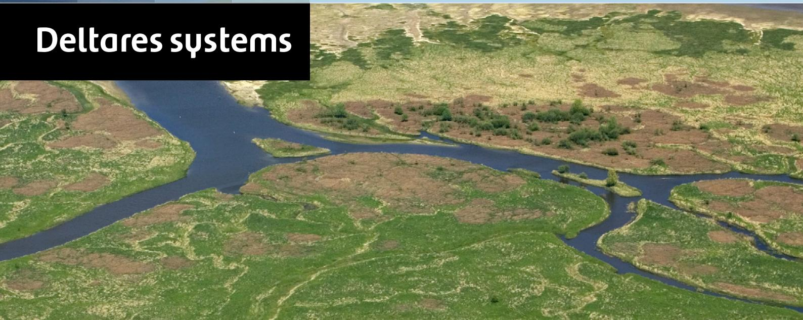

D-Flow Flexible Mesh

# **D-Flow Flexible Mesh**

**Computational Cores and User Interface**

**User Manual**

**Released for:**

**Delft3D FM Suite 2D3D 2027.01**

Version: 2027.01

Revision: 81282

29 September 2026

## **D-Flow Flexible Mesh, User Manual**

DRAFT

### **Published and printed by:**

Deltares  
Boussinesqweg 1  
2629 HV Delft  
P.O. 177  
2600 MH Delft  
The Netherlands

telephone: +31 88 335 827 73

e-mail: [Information](#)

www: [Deltares](#)

### **For sales contact:**

telephone: +31 88 335 81 88  
e-mail: [Sales](#)  
www: [Sales & Support](#)

### **For support contact:**

telephone: +31 88 335 81 00  
e-mail: [Support](#)  
www: [Sales & Support](#)

Copyright © 2026 Deltares

All rights reserved. No part of this document may be reproduced in any form by print, photo print, photo copy, microfilm or any other means, without written permission from the publisher: Deltares.

# Contents

| <b>List of Tables</b> | <b>xvi</b> |
|-----------------------|------------|
|-----------------------|------------|

| <b>List of Figures</b> | <b>xviii</b> |
|------------------------|--------------|
|------------------------|--------------|

| <b>1 A guide to this manual</b>                                                       | <b>1</b> |
|---------------------------------------------------------------------------------------|----------|
| 1.1 Introduction . . . . .                                                            | 1        |
| 1.2 Overview . . . . .                                                                | 1        |
| 1.3 Typographical conventions . . . . .                                               | 2        |
| <b>2 Introduction to D-Flow Flexible Mesh</b>                                         | <b>4</b> |
| 2.1 Applications . . . . .                                                            | 4        |
| 2.2 Modelling capabilities and advantages . . . . .                                   | 5        |
| 2.3 Current limitations for Delft3D Flexible Mesh Suite . . . . .                     | 5        |
| 2.3.1 General limitations . . . . .                                                   | 5        |
| 2.3.2 Limitations for D-Flow FM 2D3D . . . . .                                        | 5        |
| 2.4 Coupling to other modules . . . . .                                               | 6        |
| 2.5 Installation of D-Flow Flexible Mesh . . . . .                                    | 6        |
| 2.6 Important differences compared to Delft3D-FLOW . . . . .                          | 7        |
| 2.7 Deltares Software Development Canvas . . . . .                                    | 8        |
| <b>3 Conceptual description of hydrodynamic equations</b>                             | <b>9</b> |
| 3.1 Introduction . . . . .                                                            | 9        |
| 3.2 Physical processes . . . . .                                                      | 9        |
| 3.3 Hydrodynamic modelling . . . . .                                                  | 10       |
| 3.3.1 Model equations in 2D . . . . .                                                 | 10       |
| 3.3.1.1 Momentum equations in horizontal direction (2D) . . . . .                     | 11       |
| 3.3.1.2 Continuity equation (2D) . . . . .                                            | 11       |
| 3.3.2 Model equations in 3D . . . . .                                                 | 11       |
| 3.3.2.1 Momentum equations in horizontal direction (3D) . . . . .                     | 11       |
| 3.3.2.2 Vertical velocities (3D) . . . . .                                            | 12       |
| 3.3.3 The hydrostatic pressure assumption . . . . .                                   | 12       |
| 3.3.4 The Coriolis force . . . . .                                                    | 13       |
| 3.3.5 Diffusion of momentum . . . . .                                                 | 13       |
| 3.3.6 Bed friction . . . . .                                                          | 14       |
| 3.3.6.1 Roughness definition input . . . . .                                          | 16       |
| 3.4 Equations of State for the density . . . . .                                      | 16       |
| 3.4.1 Overview of density formulations in D-Flow FM . . . . .                         | 16       |
| 3.4.2 Thermobaricity . . . . .                                                        | 18       |
| 3.5 Shear-stresses at closed boundaries . . . . .                                     | 18       |
| 3.6 Secondary flow . . . . .                                                          | 19       |
| 3.6.1 Definition . . . . .                                                            | 20       |
| 3.6.2 Momentum equations in horizontal direction . . . . .                            | 20       |
| 3.6.3 Effect of secondary flow on depth-averaged momentum equations . . . . .         | 21       |
| 3.6.4 The depth averaged transport equation for the spiral motion intensity . . . . . | 22       |

---

| 3.7      | Tide generating forces                                 | 22        |
|----------|--------------------------------------------------------|-----------|
| 3.8      | Wave forcing in D-Flow FM                              | 24        |
| 3.8.1    | Forcing by radiation stress gradients                  | 26        |
| 3.8.2    | Stokes drift and mass flux                             | 27        |
| 3.8.3    | Enhancement of the bed shear-stress by waves           | 27        |
| 3.9      | Assumptions underlying D-Flow FM                       | 32        |
| <b>4</b> | <b>Conceptual description of transport equation</b>    | <b>34</b> |
| 4.1      | Introduction                                           | 34        |
| 4.2      | Transport processes                                    | 34        |
| 4.2.1    | Advection                                              | 35        |
| 4.2.2    | Diffusion                                              | 35        |
|          | 4.2.2.1 Time integration of horizontal diffusion       | 36        |
| 4.2.3    | Sources and sinks                                      | 37        |
| 4.2.4    | Forester filter                                        | 38        |
| 4.3      | Boundary and initial conditions for transport equation | 38        |
| 4.3.1    | Open boundary conditions                               | 38        |
| 4.3.2    | Closed boundary conditions                             | 39        |
| 4.3.3    | Vertical boundary conditions                           | 39        |
| 4.3.4    | Thatcher-Harleman boundary conditions                  | 39        |
| 4.3.5    | Initial conditions                                     | 40        |
| 4.4      | Introduction to sediment transport                     | 41        |
| <b>5</b> | <b>Conceptual description of heat flux models</b>      | <b>42</b> |
| 5.1      | Heat balance                                           | 44        |
| 5.2      | Solar radiation                                        | 45        |
| 5.3      | Atmospheric radiation (long wave radiation)            | 48        |
| 5.4      | Back radiation (long wave radiation)                   | 49        |
| 5.5      | Effective back radiation                               | 49        |
| 5.6      | Evaporative heat flux                                  | 49        |
| 5.7      | Convective heat flux                                   | 51        |
| <b>6</b> | <b>Getting started with Graphical User Interface</b>   | <b>53</b> |
| 6.1      | Introduction                                           | 53        |
| 6.2      | Overview of D-Flow FM GUI                              | 53        |
| 6.2.1    | <b>Project</b> window                                  | 54        |
| 6.2.2    | The central window                                     | 55        |
| 6.2.3    | <b>Settings</b> window                                 | 56        |
| 6.2.4    | <b>Map</b> window                                      | 56        |
| 6.2.5    | <b>Messages</b> window                                 | 57        |
| 6.2.6    | <b>Time Navigator</b> window                           | 57        |
| 6.3      | Dockable views                                         | 57        |
| 6.3.1    | Docking tabs separately                                | 57        |
| 6.3.2    | Multiple tabs                                          | 58        |
| 6.4      | Ribbons and toolbars                                   | 58        |
| 6.4.1    | Ribbons (shortcut keys)                                | 58        |
| 6.4.2    | File                                                   | 59        |
| 6.4.3    | Home                                                   | 60        |
| 6.4.4    | View                                                   | 60        |
| 6.4.5    | Map                                                    | 61        |
| 6.4.6    | Quick access toolbar                                   | 62        |
| 6.5      | Important differences compared to Delft3D-FLOW GUI     | 62        |
| 6.5.1    | Project vs model                                       | 62        |
| 6.5.2    | Load/save vs import/export                             | 62        |

| 6.5.3    | Working from the map                                              | 62        |
|----------|-------------------------------------------------------------------|-----------|
| 6.5.4    | Coordinate conversion                                             | 63        |
| 6.5.5    | Model area                                                        | 63        |
| 6.5.6    | Integrated models (model couplings)                               | 64        |
| 6.5.7    | Ribbons (shortcut keys)                                           | 64        |
| 6.5.8    | Context menus                                                     | 65        |
| 6.5.9    | Scripting                                                         | 65        |
| <b>7</b> | <b>Set-up of a D-Flow FM model</b>                                | <b>66</b> |
| 7.1      | Introduction                                                      | 66        |
| 7.2      | mdu-file and attribute files                                      | 66        |
| 7.3      | Filenames and conventions                                         | 67        |
| 7.4      | How to set-up a D-Flow FM model                                   | 67        |
| 7.4.1    | General                                                           | 68        |
| 7.4.1.1  | Model coordinate system                                           | 68        |
| 7.4.1.2  | Angle of latitude for Coriolis on a Cartesian grid                | 69        |
| 7.4.2    | Area                                                              | 70        |
| 7.4.2.1  | Grid-snapped features                                             | 70        |
| 7.4.2.2  | Observation points                                                | 72        |
| 7.4.2.3  | Observation cross-sections                                        | 73        |
| 7.4.2.4  | Thin dams                                                         | 74        |
| 7.4.2.5  | Fixed weirs                                                       | 75        |
| 7.4.2.6  | Land boundaries                                                   | 77        |
| 7.4.2.7  | Dry points and Dry areas                                          | 78        |
| 7.4.2.8  | Pumps                                                             | 80        |
| 7.4.2.9  | Weirs                                                             | 82        |
| 7.4.2.10 | Gates                                                             | 83        |
| 7.4.2.11 | Bridge Pillars                                                    | 84        |
| 7.4.3    | Computational grid                                                | 85        |
| 7.4.4    | Bed level                                                         | 85        |
| 7.4.5    | Time frame                                                        | 86        |
| 7.4.6    | Processes                                                         | 87        |
| 7.4.7    | Initial conditions                                                | 88        |
| 7.4.8    | Boundary conditions                                               | 89        |
| 7.4.8.1  | Specification of boundary locations (support points)              | 90        |
| 7.4.8.2  | Boundary data editor (forcing)                                    | 91        |
| 7.4.8.3  | Import/export boundary conditions from the <i>Project</i> window  | 104       |
| 7.4.8.4  | Overview of boundary conditions in attribute table (non-editable) | 106       |
| 7.4.8.5  | Open Boundaries and grid snapping                                 | 107       |
| 7.4.9    | Physical parameters                                               | 108       |
| 7.4.9.1  | Constants                                                         | 108       |
| 7.4.9.2  | Roughness                                                         | 108       |
| 7.4.9.3  | Viscosity                                                         | 109       |
| 7.4.9.4  | Diffusivity                                                       | 110       |
| 7.4.9.5  | Wind                                                              | 111       |
| 7.4.9.6  | Heat Flux model                                                   | 111       |
| 7.4.9.7  | Tidal forces                                                      | 112       |
| 7.4.10   | Sources and sinks                                                 | 112       |
| 7.4.11   | Intakes, outfalls and coupled intake-outfalls                     | 114       |
| 7.4.12   | Lateral discharges                                                | 116       |
| 7.4.12.1 | Grid snapping and distribution of discharge                       | 116       |
| 7.4.12.2 | Forcing information for lateral discharges                        | 117       |
| 7.4.12.3 | Output for lateral discharges                                     | 117       |
| 7.4.13   | Numerical parameters                                              | 117       |

| 7.4.14    | Output parameters                                         | 117        |
|-----------|-----------------------------------------------------------|------------|
| 7.4.15    | Miscellaneous                                             | 122        |
| 7.4.16    | 3D Layers                                                 | 122        |
| 7.5       | Save project, MDU file and attribute files                | 124        |
| <b>8</b>  | <b>Running a model</b>                                    | <b>125</b> |
| 8.1       | Introduction                                              | 125        |
| 8.2       | Running a scenario using the User Interface               | 125        |
| 8.3       | Running a scenario using a batch script                   | 126        |
| 8.3.1     | Commandline executables                                   | 127        |
| 8.3.2     | Running D-Flow FM                                         | 127        |
| 8.4       | Parallel computing using MPI                              | 128        |
| 8.4.1     | Introduction                                              | 128        |
| 8.4.2     | Partitioning a model                                      | 129        |
| 8.4.2.1   | More options for the partitioning                         | 130        |
| 8.4.2.2   | Partitioning the mdu-file                                 | 133        |
| 8.4.2.3   | Remaining model input                                     | 133        |
| 8.4.3     | Running a parallel job                                    | 133        |
| 8.4.3.1   | A parallel simulation via DIMR                            | 133        |
| 8.4.3.2   | A parallel simulation on Linux via D-Flow FM              | 134        |
| 8.4.4     | Visualizing the results of a parallel run                 | 134        |
| 8.4.4.1   | Plotting all partitioned map files with Delft3D-QUICKPLOT | 135        |
| 8.4.4.2   | Merging multiple map files into one                       | 135        |
| 8.5       | Run time                                                  | 137        |
| 8.5.1     | Multi-core performance improvements by OpenMP             | 138        |
| 8.5.2     | Parallel computations in coupled simulations              | 138        |
| 8.6       | Files and file sizes                                      | 140        |
| 8.6.1     | History file                                              | 140        |
| 8.6.2     | Map file                                                  | 141        |
| 8.6.3     | Restart file                                              | 141        |
| 8.7       | D-Flow FM command-line argument                           | 141        |
| 8.8       | Restart a simulation                                      | 143        |
| 8.9       | Frequently asked questions                                | 144        |
| <b>9</b>  | <b>Visualize results</b>                                  | <b>145</b> |
| 9.1       | Introduction                                              | 145        |
| 9.2       | Visualization with the User Interface                     | 145        |
| 9.3       | Visualization with Delft3D-QUICKPLOT                      | 146        |
| 9.4       | Visualization with Matlab                                 | 146        |
| 9.5       | Visualization with Python                                 | 147        |
| <b>10</b> | <b>3D modelling in D-Flow FM</b>                          | <b>148</b> |
| 10.1      | Introduction to vertical layering approaches              | 148        |
| 10.2      | $\sigma$ -layer modelling                                 | 150        |
| 10.3      | Z-layer modelling                                         | 150        |
| 10.4      | Z- $\sigma$ -layer modelling                              | 151        |
| 10.5      | Boundary conditions in 3D                                 | 152        |
| 10.6      | Turbulence modelling                                      | 153        |
| 10.6.1    | k-epsilon turbulence model                                | 155        |
| 10.6.2    | k-tau turbulence model                                    | 158        |
| 10.6.3    | Numerical implementation                                  | 158        |
| 10.7      | Fixed weirs for 3D modelling                              | 160        |
| 10.8      | 3D modelling guidelines                                   | 160        |
| 10.8.1    | Non optimal default value in case of 3D modelling         | 160        |

| 10.8.2                                     | Number of layers                                   | 161        |
|--------------------------------------------|----------------------------------------------------|------------|
| 10.8.3                                     | Anti creep                                         | 161        |
| 10.8.4                                     | Spurious oscillations in vertical velocity         | 161        |
| <b>11 Boundary conditions in D-Flow FM</b> |                                                    | <b>163</b> |
| 11.1                                       | Hydrodynamics boundary conditions                  | 163        |
| 11.1.1                                     | Open boundary conditions                           | 163        |
| 11.1.1.1                                   | Forcing information                                | 163        |
| 11.1.1.2                                   | External forcings file                             | 169        |
| 11.1.1.3                                   | External forcings in model definition file         | 169        |
| 11.1.1.4                                   | Example                                            | 169        |
| 11.1.1.5                                   | Miscellaneous                                      | 171        |
| 11.1.2                                     | Vertical boundary conditions                       | 174        |
| 11.2                                       | Nesting of D-Flow FM models                        | 175        |
| 11.2.1                                     | Introduction                                       | 175        |
| <b>12 Hydraulic structures</b>             |                                                    | <b>178</b> |
| 12.1                                       | Fixed weirs                                        | 178        |
| 12.2                                       | Dam break                                          | 179        |
| 12.2.1                                     | Grid snapping of a dam break                       | 180        |
| 12.2.2                                     | Computation of breach growth                       | 180        |
| 12.2.2.1                                   | The Verheij–Van der Knaap (2002) formula           | 181        |
| 12.2.2.2                                   | The Van der Knaap (2000) formula                   | 183        |
| 12.2.2.3                                   | Breach crest level and width time series           | 184        |
| 12.2.2.4                                   | Method when breach grows wider than one flow link  | 185        |
| 12.3                                       | General structure                                  | 186        |
| 12.3.1                                     | Notation                                           | 188        |
| 12.3.2                                     | Geometry                                           | 189        |
| 12.3.3                                     | Computation of the downstream water level          | 191        |
| 12.3.4                                     | Turning off the computation of the energy levels   | 193        |
| 12.3.5                                     | Discharge equations                                | 194        |
| 12.4                                       | Weir                                               | 195        |
| 12.5                                       | Gates                                              | 196        |
| 12.6                                       | Long Culvert                                       | 196        |
| 12.6.1                                     | Long culvert                                       | 196        |
| 12.7                                       | Bridges in 1D                                      | 198        |
| 12.8                                       | Universal weir                                     | 200        |
| 12.9                                       | Pump                                               | 203        |
| 12.9.1                                     | Notation                                           | 203        |
| 12.9.2                                     | Orientation                                        | 204        |
| 12.9.3                                     | Staged pump                                        | 204        |
| 12.9.4                                     | Non-staged pump                                    | 205        |
| 12.9.5                                     | Capacity reduction table                           | 205        |
| 12.9.6                                     | Distribution and relaxation of pump discharge      | 205        |
| 12.10                                      | Compound structure                                 | 206        |
| 12.11                                      | Thin dams                                          | 206        |
| 12.12                                      | Floating structures (via ice modelling)            | 206        |
| <b>13 Bedforms and vegetation</b>          |                                                    | <b>207</b> |
| 13.1                                       | Bedform heights                                    | 207        |
| 13.1.1                                     | Van Rijn (2007) bedform roughness height predictor | 207        |
| 13.1.2                                     | Dune height predictor                              | 209        |
| 13.2                                       | Vegetation models                                  | 211        |
| 13.2.1                                     | Dynamic vegetation model                           | 211        |

---

| 13.2.1.1  | Philosophies of dynamic vegetation model                                | 211        |
|-----------|-------------------------------------------------------------------------|------------|
| 13.2.1.2  | Conceptual description                                                  | 212        |
| 13.2.2    | (Rigid) 3D Vegetation model                                             | 212        |
| 13.3      | Trachytopes                                                             | 214        |
| 13.3.1    | Trachytope classes                                                      | 214        |
| 13.3.2    | Averaging and accumulation of trachytopes                               | 221        |
| <b>14</b> | <b>Calibration factor for bed roughness</b>                             | <b>223</b> |
| <b>15</b> | <b>Meteorological forcing</b>                                           | <b>224</b> |
| 15.1      | Wind and atmospheric pressure forcing                                   | 224        |
| 15.1.1    | Definitions for wind forcing                                            | 225        |
| 15.1.1.1  | Nautical convention                                                     | 225        |
| 15.1.1.2  | Drag coefficient                                                        | 225        |
| 15.1.2    | File formats for wind forcing                                           | 229        |
| 15.1.2.1  | Defined on the computational grid                                       | 230        |
| 15.1.2.2  | Defined on an equidistant grid                                          | 233        |
| 15.1.2.3  | Defined on a curvilinear grid                                           | 234        |
| 15.1.2.4  | Space and time varying Charnock coefficients                            | 236        |
| 15.1.2.5  | Defined on a spiderweb grid                                             | 236        |
| 15.1.2.6  | Combination of several wind specifications                              | 239        |
| 15.1.3    | Masking of points in the wind grid from interpolation ('land-sea mask') | 241        |
| 15.2      | Precipitation                                                           | 242        |
| 15.2.1    | Meteo forcing input                                                     | 242        |
| 15.2.2    | Rainfall distribution across the model grid                             | 242        |
| 15.2.3    | Rainfall intensities versus rainfall amounts                            | 243        |
| 15.3      | Evaporation                                                             | 244        |
| 15.3.1    | Numerical treatment of evaporation                                      | 244        |
| <b>16</b> | <b>Ice modelling in D-Flow FM</b>                                       | <b>245</b> |
| 16.1      | Forced ice cover                                                        | 245        |
| 16.2      | Dynamic ice cover                                                       | 245        |
| 16.2.1    | Conservation laws                                                       | 246        |
| 16.2.2    | Thermodynamics of the ice/snow cover                                    | 246        |
| 16.3      | Ice effect on wind drag                                                 | 249        |
| 16.4      | Ice effect on pressure                                                  | 250        |
| 16.5      | Ice effect on flow resistance                                           | 250        |
| 16.6      | Ice effect on surface exchange                                          | 250        |
| 16.7      | Ice effect on waves                                                     | 251        |
| 16.8      | Ice input options                                                       | 251        |
| 16.8.1    | Ice modelling via prescribed external input files                       | 254        |
| 16.8.2    | Ice modelling via Semtner                                               | 255        |
| 16.9      | Postprocessing                                                          | 256        |
| 16.10     | Limitations                                                             | 256        |
| <b>17</b> | <b>Bubble screens in D-Flow FM</b>                                      | <b>258</b> |
| 17.1      | Entrained water as function of the air injection                        | 260        |
| 17.1.1    | Single nozzle bubble plume                                              | 260        |
| 17.1.2    | A single nozzle bubble plume versus a line bubble plume                 | 261        |
| 17.1.3    | Bubble plume in stagnant stratified water                               | 261        |
| 17.2      | Theory                                                                  | 261        |
| 17.3      | Numerical implementation                                                | 265        |
| 17.4      | Input description                                                       | 267        |
| 17.5      | Coupling with water quality module D-Water Quality                      | 269        |
| 17.6      | Model results                                                           | 269        |

---

| <b>18 Coupling to external models via Basic Model Interface (BMI)</b>             | <b>271</b> |
|-----------------------------------------------------------------------------------|------------|
| 18.1 BMI interface to interact with the D-Flow FM model state                     | 271        |
| 18.2 DIMR and the BMI                                                             | 271        |
| 18.3 BMI access to hydraulic structure data in D-Flow FM                          | 272        |
| 18.4 BMI access to observations in D-Flow FM                                      | 273        |
| 18.5 BMI access to forcings in D-Flow FM                                          | 273        |
| 18.6 Coupling with D-Waves (SWAN)                                                 | 274        |
| 18.6.1 Getting started                                                            | 274        |
| 18.6.2 Input D-Flow FM                                                            | 275        |
| 18.6.3 Input D-Waves                                                              | 276        |
| 18.6.4 Input DIMR                                                                 | 277        |
| 18.6.5 Online process order                                                       | 280        |
| 18.6.6 Related files                                                              | 281        |
| 18.6.7 SWAN output file as input to D-Flow FM                                     | 281        |
| 18.6.8 Parallel computations                                                      | 283        |
| 18.6.9 Check efficiency of parallel FLOW-WAVE computation                         | 285        |
| 18.6.10 Run SWAN as a library inside D-Waves with MPI                             | 286        |
| 18.7 Coupling with D-RTC (FBC-Tools)                                              | 286        |
| 18.7.1 Introduction                                                               | 286        |
| 18.7.2 Getting started                                                            | 287        |
| 18.7.2.1 User interface: the first steps                                          | 287        |
| 18.7.2.2 Input D-Flow FM                                                          | 288        |
| 18.7.2.3 Input D-RTC                                                              | 288        |
| 18.7.2.4 Input DIMR                                                               | 288        |
| 18.7.2.5 Online process order                                                     | 288        |
| 18.8 Coupling with module for Sea Lock Exchange                                   | 288        |
| 18.8.1 Introduction                                                               | 288        |
| 18.8.2 Coupling of D-Flow FM with D-SLE                                           | 289        |
| 18.8.3 Passive constituents and temperature                                       | 289        |
| 18.8.3.1 Introduction                                                             | 289        |
| 18.8.3.2 Configuration in the D-SLE ini file                                      | 289        |
| 18.8.3.3 Transport calculation                                                    | 290        |
| 18.8.3.4 Difference from salinity during flush-with-doors-closed                  | 291        |
| 18.8.4 Configuration of the model                                                 | 291        |
| 18.8.4.1 Input D-Flow FM                                                          | 291        |
| 18.8.4.2 Input DIMR                                                               | 292        |
| 18.8.4.3 Input D-SLE                                                              | 295        |
| 18.8.5 Processing of the received lateral data items in D-Flow FM                 | 296        |
| <b>19 Water quality and D-Flow FM</b>                                             | <b>299</b> |
| 19.1 Introduction to the coupling of D-Flow FM to D-Water Quality                 | 299        |
| 19.2 File-based (or <i>offline</i> ) coupling of water quality and hydrodynamics  | 300        |
| 19.2.1 Introduction                                                               | 300        |
| 19.2.2 Creating output for D-Water Quality                                        | 300        |
| 19.2.3 Limitations and remarks                                                    | 300        |
| 19.3 Memory-based (or <i>online</i> ) coupling of water quality and hydrodynamics | 301        |
| 19.3.1 Glossary of terms                                                          | 301        |
| 19.3.2 Definition of the water quality system                                     | 301        |
| 19.3.3 Definition of process parameters                                           | 304        |
| 19.3.4 Initial conditions, boundary conditions and sources and sinks              | 307        |
| 19.3.5 Special options                                                            | 311        |
| 19.3.6 Output options                                                             | 312        |
| 19.3.7 Running D-Flow FM with processes                                           | 315        |
| 19.3.8 Output                                                                     | 315        |

---

|                                                                                               | 315        |
|-----------------------------------------------------------------------------------------------|------------|
| 19.4 Particle tracking . . . . .                                                              | 316        |
| <b>20 Morphology</b>                                                                          | <b>317</b> |
| <b>21 Coupling with Nearfield data via COSUMO</b>                                             | <b>318</b> |
| 21.1 Getting started . . . . .                                                                | 318        |
| 21.2 Run procedure . . . . .                                                                  | 318        |
| 21.2.1 Input DIMR . . . . .                                                                   | 319        |
| 21.2.2 COSUMO config file . . . . .                                                           | 322        |
| 21.2.3 FF2NF.xml file . . . . .                                                               | 323        |
| 21.2.4 NF2FF.xml file . . . . .                                                               | 328        |
| <b>22 Calibration and data assimilation</b>                                                   | <b>330</b> |
| 22.1 Introduction . . . . .                                                                   | 330        |
| 22.2 Getting started with OpenDA . . . . .                                                    | 330        |
| 22.3 The OpenDA black box model wrapper for D-Flow FM . . . . .                               | 331        |
| 22.4 OpenDA configuration . . . . .                                                           | 331        |
| 22.4.1 Main configuration file and the directory structure . . . . .                          | 331        |
| 22.4.2 The algorithm configuration . . . . .                                                  | 333        |
| 22.4.3 The stochObserver configuration . . . . .                                              | 333        |
| 22.4.3.1 NoosTimeSeriesStochObserver . . . . .                                                | 333        |
| 22.4.3.2 loObjectStochObserver . . . . .                                                      | 334        |
| 22.4.4 The stochModel configuration . . . . .                                                 | 335        |
| 22.4.5 D-Flow FM files and the OpenDA dataObjects configuration . . . . .                     | 335        |
| 22.4.5.1 Start and end time in the model definition file (.mdu) . . . . .                     | 336        |
| 22.4.5.2 Spatial external forcings (.xyz) . . . . .                                           | 337        |
| 22.4.5.3 Boundary time series (.tim) . . . . .                                                | 338        |
| 22.4.5.4 Meteorological boundary conditions (<*.amu>, <*.amv>, <*.amp>) . . . . .             | 338        |
| 22.4.5.5 Boundary conditions in bc format (.bc) . . . . .                                     | 338        |
| 22.4.5.6 Result time series (<*_his.nc>) . . . . .                                            | 339        |
| 22.4.5.7 Restart file (<*_map.nc>) . . . . .                                                  | 339        |
| 22.4.5.8 Calibration factor definition file (<*.cld>) . . . . .                               | 339        |
| 22.4.5.9 Trachytopes roughness definition file (<*.ttd>) . . . . .                            | 341        |
| 22.5 Generating noise . . . . .                                                               | 342        |
| 22.6 Examples of the application of OpenDA for D-Flow FM . . . . .                            | 343        |
| 22.6.1 Example 1: Calibration of the roughness parameter . . . . .                            | 343        |
| 22.6.2 Example 2: EnKF with uncertainty in the tidal components . . . . .                     | 345        |
| 22.6.3 Example 3: EnKF with uncertainty in the inflow velocity . . . . .                      | 346        |
| 22.6.4 Example 4: EnKF with uncertainty in the inflow condition for salt . . . . .            | 347        |
| 22.6.5 Example 5: EnKF with uncertainty on the wind direction . . . . .                       | 347        |
| 22.6.6 Example 6: EnKF with the DCSM v5 model and uncertainty on the wind direction . . . . . | 347        |
| <b>23 Numerical aspects of D-Flow Flexible Mesh</b>                                           | <b>348</b> |
| 23.1 Topological conventions for (2D) horizontal grids . . . . .                              | 348        |
| 23.2 Notation . . . . .                                                                       | 350        |
| 23.3 Definition of bed level options . . . . .                                                | 351        |
| 23.3.1 Piecewise constant approach for the bed level . . . . .                                | 352        |
| 23.3.2 Piecewise linear approach for the bed levels . . . . .                                 | 352        |
| 23.3.3 Hybrid bed level approach . . . . .                                                    | 353        |
| 23.3.4 Specification in the User Interface . . . . .                                          | 353        |
| 23.4 The location of open boundaries . . . . .                                                | 354        |
| 23.4.1 Geometry of open boundaries . . . . .                                                  | 356        |

---

|                                                                                           | 23.4.1.1 Conveyance in 2D . . . . . | 356 |
|-------------------------------------------------------------------------------------------|-------------------------------------|-----|
| 23.5 Drying and flooding . . . . .                                                        | 358                                 |     |
| 23.5.1 Dry/wet criterion at cell faces . . . . .                                          | 358                                 |     |
| 23.5.2 Dry/wet criterion at cell circumcenters . . . . .                                  | 358                                 |     |
| 23.6 Advection at open boundaries . . . . .                                               | 358                                 |     |
| 23.7 Artificial mixing due to sigma-coordinates . . . . .                                 | 359                                 |     |
| <b>24 Tutorial</b>                                                                        | <b>363</b>                          |     |
| 24.1 Tutorial Hydrodynamics for depth-averaged (2D) modelling . . . . .                   | 363                                 |     |
| 24.1.1 Outline of the tutorials . . . . .                                                 | 363                                 |     |
| 24.1.2 Tutorial 1: Creating a curvilinear grid . . . . .                                  | 363                                 |     |
| 24.1.3 Tutorial 2: Creating a triangular grid . . . . .                                   | 368                                 |     |
| 24.1.4 Tutorial 3: Coupling multiple separate grids . . . . .                             | 371                                 |     |
| 24.1.5 Tutorial 4: Inserting a bed level . . . . .                                        | 372                                 |     |
| 24.1.6 Tutorial 5: Imposing boundary conditions . . . . .                                 | 375                                 |     |
| 24.1.7 Tutorial 6: Defining output locations . . . . .                                    | 378                                 |     |
| 24.1.8 Tutorial 7: Defining computational parameters . . . . .                            | 379                                 |     |
| 24.1.9 Tutorial 8: Running a model simulation . . . . .                                   | 381                                 |     |
| 24.1.10 Tutorial 9: Viewing the output of a model simulation . . . . .                    | 382                                 |     |
| 24.1.11 Tutorial 10: Exporting a model . . . . .                                          | 385                                 |     |
| 24.1.12 Tutorial 11: Partitioning a model . . . . .                                       | 386                                 |     |
| 24.1.13 Tutorial 12: Running a model using a batch script . . . . .                       | 387                                 |     |
| 24.1.13.1 Sequential on Windows . . . . .                                                 | 388                                 |     |
| 24.1.13.2 Sequential on Linux . . . . .                                                   | 389                                 |     |
| 24.1.13.3 Parallel on Windows . . . . .                                                   | 390                                 |     |
| 24.1.13.4 Parallel on Linux . . . . .                                                     | 391                                 |     |
| 24.2 Tutorial Hydrodynamics for 3D modelling . . . . .                                    | 392                                 |     |
| 24.2.1 Outline of the tutorials for 3D modelling . . . . .                                | 392                                 |     |
| 24.2.2 Tutorial 13: Set-up of a 3D model, running this model and postprocessing . . . . . | 392                                 |     |
| 24.2.3 Tutorial 14: Extra options for postprocessing of 3D model simulations . . . . .    | 399                                 |     |
| <b>References</b>                                                                         | <b>404</b>                          |     |
| <b>A The master definition file</b>                                                       | <b>410</b>                          |     |
| A.1 Overview of keywords generated by GUI . . . . .                                       | 410                                 |     |
| A.2 Overview of additional keywords for 3D Modelling . . . . .                            | 421                                 |     |
| A.3 Overview of research keywords . . . . .                                               | 422                                 |     |
| A.4 Overview of deprecated and removed keywords . . . . .                                 | 425                                 |     |
| <b>B The net file for flexible meshes</b>                                                 | <b>429</b>                          |     |
| B.1 2D grids in netCDF UGRID files . . . . .                                              | 429                                 |     |
| <b>C Attribute files</b>                                                                  | <b>430</b>                          |     |
| C.1 Introduction . . . . .                                                                | 430                                 |     |
| C.2 Polyline/polygon file . . . . .                                                       | 430                                 |     |
| C.3 Sample file . . . . .                                                                 | 431                                 |     |
| C.4 Time series <tim> file (ASCII) . . . . .                                              | 431                                 |     |
| C.5 Time-varying data <bc> file (ASCII) . . . . .                                         | 432                                 |     |
| C.5.1 Name in a bc block . . . . .                                                        | 434                                 |     |
| C.5.1.1 Global forcings . . . . .                                                         | 434                                 |     |
| C.5.1.2 Boundary forcings . . . . .                                                       | 435                                 |     |
| C.5.1.3 Meteo forcings on stations . . . . .                                              | 435                                 |     |
| C.5.1.4 Forcings on "point" locations . . . . .                                           | 435                                 |     |
| C.5.2 Function in a bc block . . . . .                                                    | 436                                 |     |

---

| C.5.3  | Quantity names in a bc block . . . . .                                                      | 437 |
|--------|---------------------------------------------------------------------------------------------|-----|
|        | C.5.3.1 Vector quantity names . . . . .                                                     | 439 |
| C.6    | The external forcings file . . . . .                                                        | 440 |
| C.6.1  | Migration to one external forcings format, deprecation of old format . .                    | 440 |
|        | C.6.1.1 Migration steps across upcoming releases . . . . .                                  | 440 |
|        | C.6.1.2 Migration of old <*.ext> files . . . . .                                            | 441 |
|        | C.6.1.3 Migration of Meteo blocks in new <*.ext> files . . . . .                            | 442 |
|        | C.6.1.4 Migration of blocks in IniFieldFile . . . . .                                       | 444 |
|        | C.6.1.5 Automated migration tools . . . . .                                                 | 445 |
| C.6.2  | Old style external forcings . . . . .                                                       | 446 |
| C.6.3  | New style external forcing . . . . .                                                        | 448 |
|        | C.6.3.1 Boundary definitions . . . . .                                                      | 449 |
|        | C.6.3.2 Lateral discharge definitions . . . . .                                             | 450 |
|        | C.6.3.3 Meteorological forcings (deprecated) . . . . .                                      | 451 |
|        | C.6.3.4 Spatial data: meteorological forcings and various model in-<br>put fields . . . . . | 453 |
|        | C.6.3.5 Source and sink definitions . . . . .                                               | 456 |
|        | C.6.3.6 Bubble screen definitions . . . . .                                                 | 457 |
| C.6.4  | File version history . . . . .                                                              | 458 |
| C.6.5  | Accepted quantity names . . . . .                                                           | 458 |
| C.6.6  | Overview of deprecated and removed keywords in external forcing files                       | 462 |
| C.7    | Initial conditions and spatially varying input . . . . .                                    | 463 |
| C.7.1  | Introduction . . . . .                                                                      | 463 |
| C.7.2  | IniFieldFile format for initial conditions and parameter fields (deprecated)                | 463 |
| C.7.3  | Supported quantities . . . . .                                                              | 468 |
|        | C.7.3.1 Accepted quantity names in initial field files . . . . .                            | 468 |
|        | C.7.3.2 Water levels . . . . .                                                              | 470 |
|        | C.7.3.3 Initial velocities . . . . .                                                        | 470 |
|        | C.7.3.4 Salinity . . . . .                                                                  | 470 |
|        | C.7.3.5 Temperature . . . . .                                                               | 471 |
|        | C.7.3.6 Tracers . . . . .                                                                   | 471 |
| C.7.4  | Sediment . . . . .                                                                          | 471 |
|        | C.7.4.1 Physical coefficients . . . . .                                                     | 471 |
| C.7.5  | Supported file formats . . . . .                                                            | 471 |
|        | C.7.5.1 Inside-polygon option . . . . .                                                     | 472 |
|        | C.7.5.2 Sample file . . . . .                                                               | 472 |
|        | C.7.5.3 GeoTIFF file . . . . .                                                              | 472 |
|        | C.7.5.4 Vertical profile file . . . . .                                                     | 473 |
|        | C.7.5.5 Map file . . . . .                                                                  | 473 |
|        | C.7.5.6 Restart file . . . . .                                                              | 473 |
| C.8    | Trachytopes . . . . .                                                                       | 474 |
| C.8.1  | Area Roughness on Links (ARL-file) . . . . .                                                | 474 |
|        | C.8.1.1 Example . . . . .                                                                   | 475 |
| C.8.2  | Trachytope Definition file (TTD-file) . . . . .                                             | 475 |
|        | C.8.2.1 General format . . . . .                                                            | 475 |
|        | C.8.2.2 Example . . . . .                                                                   | 476 |
|        | C.8.2.3 Discharge dependent format . . . . .                                                | 476 |
|        | C.8.2.4 Water level dependent format . . . . .                                              | 476 |
|        | C.8.2.5 Supported roughness formulations . . . . .                                          | 477 |
| C.9    | Fixed weirs . . . . .                                                                       | 478 |
| C.10   | Calibration Factors . . . . .                                                               | 479 |
| C.10.1 | Calibration factor definition file (CLD-file) . . . . .                                     | 479 |
|        | C.10.1.1 Header of the CLD-file . . . . .                                                   | 480 |
|        | C.10.1.2 Constant values . . . . .                                                          | 480 |

| C.10.1.3 | Discharge dependent format . . . . .                                         | 480        |
|----------|------------------------------------------------------------------------------|------------|
| C.10.1.4 | Water level dependent format . . . . .                                       | 480        |
| C.10.1.5 | Example . . . . .                                                            | 481        |
| C.10.2   | Calibration Class Area on Links (CLL-file) . . . . .                         | 481        |
| C.10.2.1 | Header of the CLL-file . . . . .                                             | 481        |
| C.10.2.2 | Body of the CLL-file . . . . .                                               | 481        |
| C.10.2.3 | Example . . . . .                                                            | 482        |
| C.11     | Sources and sinks . . . . .                                                  | 482        |
| C.12     | Dry points and areas . . . . .                                               | 482        |
| C.13     | Structure INI file . . . . .                                                 | 483        |
| C.13.1   | Weir . . . . .                                                               | 484        |
| C.13.2   | Universal Weir . . . . .                                                     | 484        |
| C.13.3   | Long culvert . . . . .                                                       | 485        |
| C.13.4   | Bridge . . . . .                                                             | 486        |
| C.13.5   | Pump . . . . .                                                               | 487        |
| C.13.6   | Gate . . . . .                                                               | 488        |
| C.13.7   | General Structure . . . . .                                                  | 488        |
| C.13.8   | Dambreak . . . . .                                                           | 490        |
| C.13.9   | Compound Structure . . . . .                                                 | 492        |
| C.13.10  | Structure defined with a time series . . . . .                               | 493        |
| C.13.11  | File version history . . . . .                                               | 494        |
| C.14     | Space varying wind and pressure . . . . .                                    | 495        |
| C.14.1   | Meteo on equidistant grids . . . . .                                         | 495        |
| C.14.2   | Curvilinear data . . . . .                                                   | 499        |
| C.14.3   | Spiderweb data . . . . .                                                     | 502        |
| C.14.4   | Meteo on a netCDF file . . . . .                                             | 506        |
| C.15     | Statistical output (Fourier, minimum, maximum and average) . . . . .         | 506        |
| C.16     | Cache file . . . . .                                                         | 509        |
| C.16.1   | <i>File version and description</i> . . . . .                                | 510        |
| C.16.2   | Introduction . . . . .                                                       | 511        |
| C.16.3   | IniFieldFile format for initial conditions and parameter fields (deprecated) | 511        |
| C.16.4   | Supported quantities . . . . .                                               | 516        |
| C.16.4.1 | Accepted quantity names in initial field files . . . . .                     | 516        |
| C.16.4.2 | Water levels . . . . .                                                       | 518        |
| C.16.4.3 | Initial velocities . . . . .                                                 | 518        |
| C.16.4.4 | Salinity . . . . .                                                           | 518        |
| C.16.4.5 | Temperature . . . . .                                                        | 518        |
| C.16.4.6 | Tracers . . . . .                                                            | 518        |
| C.16.5   | Sediment . . . . .                                                           | 519        |
| C.16.5.1 | Physical coefficients . . . . .                                              | 519        |
| C.16.6   | Supported file formats . . . . .                                             | 519        |
| C.16.6.1 | Inside-polygon option . . . . .                                              | 519        |
| C.16.6.2 | Sample file . . . . .                                                        | 520        |
| C.16.6.3 | GeoTIFF file . . . . .                                                       | 520        |
| C.16.6.4 | Vertical profile file . . . . .                                              | 520        |
| C.16.6.5 | Map file . . . . .                                                           | 520        |
| C.16.6.6 | Restart file . . . . .                                                       | 521        |
| <b>D</b> | <b>Boundary conditions specification</b>                                     | <b>522</b> |
| D.1      | Supported boundary types . . . . .                                           | 522        |
| D.1.1    | Open boundaries . . . . .                                                    | 522        |
| D.1.2    | Astronomic boundary conditions . . . . .                                     | 522        |
| D.1.3    | Astronomic correction factors . . . . .                                      | 522        |
| D.1.4    | Harmonic flow boundary conditions . . . . .                                  | 522        |

---

| D.1.5    | QH-relation flow boundary conditions . . . . .                            | 523        |
|----------|---------------------------------------------------------------------------|------------|
| D.1.6    | Time-series flow boundary conditions . . . . .                            | 523        |
| D.1.7    | Time-series transport boundary conditions . . . . .                       | 523        |
| D.1.8    | Time-series for the heat model parameters . . . . .                       | 523        |
| D.1.9    | Time-Series for Varying Air Density . . . . .                             | 524        |
| D.2      | Boundary signal file formats . . . . .                                    | 524        |
| D.2.1    | The <cmp> format . . . . .                                                | 524        |
| D.2.2    | The <qh> format . . . . .                                                 | 524        |
| D.2.3    | The <bc> format . . . . .                                                 | 524        |
| D.2.4    | The netCDF-format . . . . .                                               | 524        |
|          | D.2.4.1 Scalar quantity for point-location time-series . . . . .          | 525        |
|          | D.2.4.2 Scalar Quantity for gridded data . . . . .                        | 525        |
|          | D.2.4.3 Vector quantity . . . . .                                         | 527        |
| <b>E</b> | <b>Output files</b>                                                       | <b>529</b> |
| E.1      | Diagnostics file . . . . .                                                | 529        |
| E.2      | Demanding output . . . . .                                                | 530        |
| E.2.1    | The MDU-file . . . . .                                                    | 530        |
| E.2.2    | Observation points . . . . .                                              | 530        |
|          | E.2.2.1 The observation point file with extension <*_obs.ini> . . . .     | 531        |
|          | E.2.2.2 The observation point file with extension <*.xyn> . . . .         | 532        |
|          | E.2.2.3 The observation point file with extension <*.pli> . . . .         | 532        |
| E.2.3    | Moving observation points . . . . .                                       | 532        |
| E.2.4    | Observation cross sections . . . . .                                      | 533        |
|          | E.2.4.1 Observation cross section file with extension <*_crs.pli> . . . . | 534        |
| E.2.5    | Mass balance area files . . . . .                                         | 534        |
|          | E.2.5.1 The mass balance area file with extension <*_mba.ini> . . . .     | 534        |
| E.3      | NetCDF output files . . . . .                                             | 535        |
| E.3.1    | Timeseries as netCDF his-file . . . . .                                   | 536        |
|          | E.3.1.1 Dimensions . . . . .                                              | 537        |
|          | E.3.1.2 Location variables . . . . .                                      | 537        |
|          | E.3.1.3 Overview of output quantities in a netCDF his-file . . . .        | 537        |
|          | E.3.1.4 Variables on stations . . . . .                                   | 539        |
|          | E.3.1.5 Variables on cross sections . . . . .                             | 546        |
|          | E.3.1.6 Mass balance output . . . . .                                     | 548        |
|          | E.3.1.7 Variables on sources/sinks . . . . .                              | 551        |
|          | E.3.1.8 Hydraulic structure output . . . . .                              | 551        |
|          | E.3.1.9 Geometry variables . . . . .                                      | 560        |
|          | E.3.2 Spatial fields as netCDF map-file . . . . .                         | 561        |
|          | E.3.3 Class map files as netCDF clm-file . . . . .                        | 578        |
|          | E.3.4 Restart files as netCDF rst-file . . . . .                          | 578        |
|          | E.3.5 Volume tables per- gridpoint output as netCDF file . . . . .        | 578        |
|          | E.3.6 NetCDF versions and file formats . . . . .                          | 581        |
| E.4      | Shapefiles . . . . .                                                      | 581        |
| E.5      | Post processing on his-file . . . . .                                     | 581        |
|          | E.5.1 Max25 function . . . . .                                            | 582        |
|          | E.5.2 Maximum based on a generic filter . . . . .                         | 582        |
|          | E.5.3 Maximum based on a running mean filter . . . . .                    | 582        |
| E.6      | Time step analysis . . . . .                                              | 583        |
| <b>F</b> | <b>Model generation</b>                                                   | <b>584</b> |
| F.1      | Introduction . . . . .                                                    | 584        |
| F.2      | Grid generation . . . . .                                                 | 584        |
|          | F.2.1 Uniform Cartesian grid . . . . .                                    | 584        |

---

| F.2.2                              | Locally refined Cartesian grid . . . . .          | 584        |
|------------------------------------|---------------------------------------------------|------------|
| <b>G Spatial editor</b>            |                                                   | <b>585</b> |
| G.1                                | Introduction . . . . .                            | 585        |
| G.2                                | General . . . . .                                 | 585        |
|                                    | G.2.1 Overview of spatial editor . . . . .        | 585        |
|                                    | G.2.2 Import/export dataset . . . . .             | 586        |
|                                    | G.2.3 Activate (spatial) model quantity . . . . . | 587        |
|                                    | G.2.4 Colorscale . . . . .                        | 588        |
|                                    | G.2.5 Render mode . . . . .                       | 589        |
|                                    | G.2.6 Context menu . . . . .                      | 590        |
| G.3                                | Quantity selection . . . . .                      | 591        |
| G.4                                | Geometry operations . . . . .                     | 592        |
|                                    | G.4.1 Polygons . . . . .                          | 592        |
|                                    | G.4.2 Lines . . . . .                             | 593        |
|                                    | G.4.3 Points . . . . .                            | 594        |
| G.5                                | Spatial operations . . . . .                      | 594        |
|                                    | G.5.1 Import point cloud . . . . .                | 595        |
|                                    | G.5.2 Crop . . . . .                              | 595        |
|                                    | G.5.3 Delete . . . . .                            | 596        |
|                                    | G.5.4 Set value . . . . .                         | 597        |
|                                    | G.5.5 Contour . . . . .                           | 598        |
|                                    | G.5.6 Copy to samples . . . . .                   | 600        |
|                                    | G.5.7 Copy to spatial data . . . . .              | 601        |
|                                    | G.5.8 Merge spatial data . . . . .                | 602        |
|                                    | G.5.9 Gradient . . . . .                          | 603        |
|                                    | G.5.10 Interpolate . . . . .                      | 604        |
|                                    | G.5.11 Smoothing . . . . .                        | 607        |
|                                    | G.5.12 Overwrite (single) value . . . . .         | 609        |
| G.6                                | Operation stack . . . . .                         | 610        |
|                                    | G.6.1 Stack workflow . . . . .                    | 610        |
|                                    | G.6.2 Edit operation properties . . . . .         | 612        |
|                                    | G.6.3 Enable/disable operations . . . . .         | 612        |
|                                    | G.6.4 Delete operations . . . . .                 | 613        |
|                                    | G.6.5 Refresh stack . . . . .                     | 614        |
|                                    | G.6.6 Quick links . . . . .                       | 614        |
|                                    | G.6.7 Import/export . . . . .                     | 615        |
| <b>H Astronomical constituents</b> |                                                   | <b>616</b> |
| H.1                                | Introduction . . . . .                            | 616        |
| H.2                                | List of astronomical constituents . . . . .       | 616        |

**List of Tables**

| 3.1  | Fitting coefficients for wave/current boundary layer model . . . . .                                                                                                                    | 30  |
|------|-----------------------------------------------------------------------------------------------------------------------------------------------------------------------------------------|-----|
| 7.1  | Overview and description of numerical parameters . . . . .                                                                                                                              | 118 |
| 7.2  | Input and output parameters of the example . . . . .                                                                                                                                    | 122 |
| 7.3  | Time (after <i>Reference Date</i> in seconds) of output files . . . . .                                                                                                                 | 122 |
| 7.4  | Overview and description miscellaneous parameters . . . . .                                                                                                                             | 122 |
| 7.5  | Overview and description of Z-layer parameters . . . . .                                                                                                                                | 123 |
| 12.1 | Recommended values of input parameters in the Verheij–Van der Knaap (2002) formula. . . . .                                                                                             | 182 |
| 12.2 | Recommended values for $u_c$ and $\tau_c$ . . . . .                                                                                                                                     | 183 |
| 12.3 | Values of coefficients $c_1$ , $c_2$ and $B_{\max}$ of the Van der Knaap (2000) formula for different material types. . . . .                                                           | 184 |
| 12.4 | Mapping table for weir input parameters to general structure parameters . . .                                                                                                           | 195 |
| 16.1 | Ice input keywords . . . . .                                                                                                                                                            | 251 |
| 16.2 | Keywords for ice output . . . . .                                                                                                                                                       | 252 |
| 16.3 | ice quantities on map- and his-files . . . . .                                                                                                                                          | 257 |
| 18.1 | Supported compound variable fields for hydraulic structures in D-Flow FM via BMI. . . . .                                                                                               | 272 |
| 18.2 | Supported compound variable fields for observations in D-Flow FM via BMI. .                                                                                                             | 273 |
| 18.3 | Supported compound variable fields for forcings in D-Flow FM via BMI. . . .                                                                                                             | 274 |
| 18.4 | Entries in ExtForceFile for use with wavemodel 7. The entries in the Varname column that should be present in the NetCDF file depend on the Waveforcing value in the .mdu file. . . . . | 284 |
| 18.5 | Example computation times of a testcase coupling D-Flow FM (parallel MPI) with SWAN (parallel OMP/MPI) . . . . .                                                                        | 285 |
| 18.6 | Input parameters in <.ini> file. . . . .                                                                                                                                                | 295 |
| 19.1 | File-based versus memory-based D-Water Quality processes in D-Flow FM. .                                                                                                                | 299 |
| 19.2 | Various types of parameter inputs for water quality models in D-Flow FM. . .                                                                                                            | 304 |
| 19.3 | Data from D-Flow FM that are available for water quality processes . . . . .                                                                                                            | 307 |
| 22.1 | Directory structure of the OpenDA Ensemble Kalman filtering configuration for the simple Waal D-Flow FM model. . . . .                                                                  | 332 |
| 22.2 | D-Flow FM files that can be manipulated and the corresponding OpenDA class names to be used in the <dflowfmWrapper.xml> file. . . . .                                                   | 336 |
| A.1  | Standard MDU-file with default settings. . . . .                                                                                                                                        | 410 |
| A.2  | Keywords in MDU-file for 3D modelling not in the GUI yet. . . . .                                                                                                                       | 421 |
| A.3  | Overview of numerical research parameters with compulsory defaults. . . .                                                                                                               | 422 |
| A.4  | Overview of deprecated and removed keywords. . . . .                                                                                                                                    | 425 |
| C.1  | Description of <bc> format. . . . .                                                                                                                                                     | 432 |
| C.3  | Quantity names for use in <*.bc> files. . . . .                                                                                                                                         | 437 |
| C.4  | Mapping of legacy <*.ext> keywords to [Spatial] keywords. . . . .                                                                                                                       | 442 |
| C.5  | Mapping of legacy <*.ext> METHOD values to interpolationMethod values. . . . .                                                                                                          | 442 |
| C.6  | Mapping of legacy <*.ext> LAYER values to targetLayer values. . . . .                                                                                                                   | 442 |
| C.7  | Mapping of [Meteo] keywords to [Spatial] keywords. . . . .                                                                                                                              | 443 |
| C.8  | Mapping of operand single character values to enumeration values. . . . .                                                                                                               | 443 |
| C.9  | Mapping of IniFieldFile keywords to [Spatial] keywords. . . . .                                                                                                                         | 445 |
| C.10 | Definition of external forcings. . . . .                                                                                                                                                | 448 |

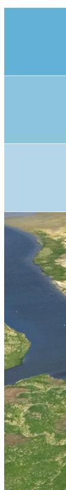

| C.11 | Boundary definitions in new style external forcing file. . . . .                                                                                                                                                                                                                                                                                                                                              | 449 |
|------|---------------------------------------------------------------------------------------------------------------------------------------------------------------------------------------------------------------------------------------------------------------------------------------------------------------------------------------------------------------------------------------------------------------|-----|
| C.12 | Lateral discharge definitions in new style external forcing file. . . . .                                                                                                                                                                                                                                                                                                                                     | 450 |
| C.13 | Meteorological forcings in new style external forcing file. . . . .                                                                                                                                                                                                                                                                                                                                           | 451 |
| C.14 | Spatial data definitions in new style external forcing file. . . . .                                                                                                                                                                                                                                                                                                                                          | 453 |
| C.15 | Source and sink definitions in new style external forcing file. . . . .                                                                                                                                                                                                                                                                                                                                       | 457 |
| C.16 | Bubble screen definitions in new style external forcing file. . . . .                                                                                                                                                                                                                                                                                                                                         | 458 |
| C.17 | List of accepted external forcing quantity names. . . . .                                                                                                                                                                                                                                                                                                                                                     | 459 |
| C.18 | List of quantity name and required standard name supported in NetCDF for-mat. . . . .                                                                                                                                                                                                                                                                                                                         | 461 |
| C.19 | Deprecated and obsolete keywords in external forcings file. . . . .                                                                                                                                                                                                                                                                                                                                           | 462 |
| C.20 | Initial and parameter fields. . . . .                                                                                                                                                                                                                                                                                                                                                                         | 464 |
| C.21 | List of accepted field quantity names in initial field file. . . . .                                                                                                                                                                                                                                                                                                                                          | 468 |
| C.23 | General part of structure file. . . . .                                                                                                                                                                                                                                                                                                                                                                       | 483 |
| C.24 | Weir definition. . . . .                                                                                                                                                                                                                                                                                                                                                                                      | 484 |
| C.25 | Universal Weir definition. . . . .                                                                                                                                                                                                                                                                                                                                                                            | 485 |
| C.26 | Long culvert . . . . .                                                                                                                                                                                                                                                                                                                                                                                        | 485 |
| C.27 | Bridge Structure definition. . . . .                                                                                                                                                                                                                                                                                                                                                                          | 486 |
| C.28 | Pump definition. . . . .                                                                                                                                                                                                                                                                                                                                                                                      | 487 |
| C.29 | Gate definition. . . . .                                                                                                                                                                                                                                                                                                                                                                                      | 488 |
| C.30 | Specific input for the general structure. . . . .                                                                                                                                                                                                                                                                                                                                                             | 489 |
| C.31 | Specific input for the dambreak. . . . .                                                                                                                                                                                                                                                                                                                                                                      | 490 |
| C.32 | Specific input for the compound structure. . . . .                                                                                                                                                                                                                                                                                                                                                            | 492 |
| C.33 | Quantities that can be set by a time series. . . . .                                                                                                                                                                                                                                                                                                                                                          | 494 |
| C.39 | Initial and parameter fields. . . . .                                                                                                                                                                                                                                                                                                                                                                         | 511 |
| C.40 | List of accepted field quantity names in initial field file. . . . .                                                                                                                                                                                                                                                                                                                                          | 516 |
| E.1  | Definition of observation points. . . . .                                                                                                                                                                                                                                                                                                                                                                     | 531 |
| E.2  | Definition of mass balance area file keywords. . . . .                                                                                                                                                                                                                                                                                                                                                        | 534 |
| E.3  | Global overview of output quantities in the history file. . . . .                                                                                                                                                                                                                                                                                                                                             | 538 |
| E.4  | Output quantities of observation stations in history file. . . . .                                                                                                                                                                                                                                                                                                                                            | 540 |
| E.5  | Output quantities on cross sections in history file. . . . .                                                                                                                                                                                                                                                                                                                                                  | 547 |
| E.6  | Output quantities for the mass balance in history file. . . . .                                                                                                                                                                                                                                                                                                                                               | 549 |
| E.7  | Output quantities of pumps in history file. . . . .                                                                                                                                                                                                                                                                                                                                                           | 551 |
| E.8  | Output quantities of general structures in history file. . . . .                                                                                                                                                                                                                                                                                                                                              | 552 |
| E.9  | Output quantities of weirs in history file. . . . .                                                                                                                                                                                                                                                                                                                                                           | 554 |
| E.10 | Output quantities of bridges in history file. . . . .                                                                                                                                                                                                                                                                                                                                                         | 555 |
| E.11 | Output quantities of long culverts in history file. . . . .                                                                                                                                                                                                                                                                                                                                                   | 556 |
| E.12 | Output quantities of dam breaks in history file. . . . .                                                                                                                                                                                                                                                                                                                                                      | 556 |
| E.13 | Output quantities of universal weirs in history file. . . . .                                                                                                                                                                                                                                                                                                                                                 | 557 |
| E.14 | Output quantities of compound structures in history file. . . . .                                                                                                                                                                                                                                                                                                                                             | 558 |
| E.15 | Summary of output in history files of quantities for different structures. . . . .                                                                                                                                                                                                                                                                                                                            | 559 |
| E.16 | Output variables in map file of UGRID format. Column 'Location' shows the grid location: CN means cell corners. L means net links. S means pressure points, U means velocity points. S3D and U3D are the corresponding locations in 3D networks. Two more locations in 3D networks are: W, vertical velocity point on all layer interfaces, and WU, vertical viscosity point on all layer interfaces. . . . . | 564 |
| E.17 | Flow analysis variables in the map file . . . . .                                                                                                                                                                                                                                                                                                                                                             | 577 |
| E.18 | Features and MDU settings for generating shapefiles . . . . .                                                                                                                                                                                                                                                                                                                                                 | 581 |
| H.1  | Astronomical constituents . . . . .                                                                                                                                                                                                                                                                                                                                                                           | 616 |

**List of Figures**

| 2.1  | Overview of TRL levels for software of Deltares                                                                                                                       | 8  |
|------|-----------------------------------------------------------------------------------------------------------------------------------------------------------------------|----|
| 3.1  | Input for map projection for specifying Coriolis parameter on the grid.                                                                                               | 13 |
| 3.2  | Input parameters for horizontal and vertical eddy viscosities.                                                                                                        | 14 |
| 3.3  | Vertical profile secondary flow ( $v$ ) in river bend and direction bed stress                                                                                        | 19 |
| 3.4  | Schematic view of non-linear interaction of wave and current bed shear-stresses (from Soulsby <i>et al.</i> (1993b, Figure 16, p. 89))                                | 28 |
| 3.5  | Inter-comparison of eight models for prediction of mean and maximum bed shear-stress due to waves and currents (from Soulsby <i>et al.</i> (1993b, Figure 17, p. 90)) | 31 |
| 5.1  | Overview of the heat exchange mechanisms at the surface                                                                                                               | 42 |
| 5.2  | Co-ordinate system position Sun<br>$\delta$ : declination; $\theta$ : latitude; $\omega t$ : angular speed                                                            | 46 |
| 6.1  | Start-up lay-out D-Flow FM User Interface                                                                                                                             | 53 |
| 6.2  | <b>Project</b> window of D-Flow FM plugin                                                                                                                             | 55 |
| 6.3  | The central window with a map and contents of the D-Flow FM model                                                                                                     | 55 |
| 6.4  | The model <b>Settings</b> window with General settings tab enabled                                                                                                    | 56 |
| 6.5  | <b>Map</b> window controlling map contents                                                                                                                            | 56 |
| 6.6  | Log of messages, warnings and errors in <b>Messages</b> window                                                                                                        | 57 |
| 6.7  | <b>Time Navigator</b> window in D-Flow FM User Interface                                                                                                              | 57 |
| 6.8  | Docking windows on two screens within the User Interface.                                                                                                             | 57 |
| 6.9  | Bringing the <b>Time Navigator</b> window to the front                                                                                                                | 58 |
| 6.10 | Docking the <b>Time Navigator</b> window.                                                                                                                             | 58 |
| 6.11 | Auto hide the <b>Properties</b> window                                                                                                                                | 58 |
| 6.12 | Perform operations using the shortcut keys                                                                                                                            | 59 |
| 6.13 | The <i>File</i> ribbon                                                                                                                                                | 59 |
| 6.14 | The User Interface options dialog.                                                                                                                                    | 60 |
| 6.15 | The <i>Home</i> ribbon.                                                                                                                                               | 60 |
| 6.16 | The <i>View</i> ribbon.                                                                                                                                               | 60 |
| 6.17 | The <i>Map</i> ribbon.                                                                                                                                                | 61 |
| 6.18 | The quick access toolbar.                                                                                                                                             | 62 |
| 6.19 | Set map coordinate system using right mouse button                                                                                                                    | 63 |
| 6.20 | Select a coordinate system using the quick search bar                                                                                                                 | 63 |
| 6.21 | Perform operations using the shortcut keys                                                                                                                            | 64 |
| 7.1  | The Add Model drop-down menu                                                                                                                                          | 68 |
| 7.2  | The <i>Select model</i> ... window                                                                                                                                    | 68 |
| 7.3  | Overview of the <i>General</i> tab                                                                                                                                    | 68 |
| 7.4  | Coordinate system wizard                                                                                                                                              | 69 |
| 7.5  | Overview of geographical features                                                                                                                                     | 70 |
| 7.6  | Overview of map ribbon                                                                                                                                                | 70 |
| 7.7  | Example of expanded <i>Estimated Grid-snapped features</i> attribute in the <i>Map</i> window                                                                         | 71 |
| 7.8  | Example of grid snapped features displayed on the central map                                                                                                         | 72 |
| 7.9  | Geographical and grid snapped representation of an observation point                                                                                                  | 72 |
| 7.10 | Attribute table with observation points                                                                                                                               | 73 |
| 7.11 | Geographical and grid snapped representation of a cross section                                                                                                       | 73 |
| 7.12 | Attribute table with observation cross sections                                                                                                                       | 74 |
| 7.13 | Geographical and grid snapped representation of a thin dam                                                                                                            | 74 |
| 7.14 | Attribute table with thin dams                                                                                                                                        | 75 |
| 7.15 | Geographical and grid snapped representation of a fixed weir                                                                                                          | 75 |

| 7.16 | Schematic representation of a fixed weir                                                                                                                                            | 75  |
|------|-------------------------------------------------------------------------------------------------------------------------------------------------------------------------------------|-----|
| 7.17 | Attribute table with fixed weirs                                                                                                                                                    | 76  |
| 7.18 | Fixed weir editor                                                                                                                                                                   | 76  |
| 7.19 | Geographical representation of a land boundary                                                                                                                                      | 77  |
| 7.20 | Attribute table with land boundaries                                                                                                                                                | 77  |
| 7.21 | Geographical and grid snapped representation of several dry points                                                                                                                  | 78  |
| 7.22 | Attribute table with dry points                                                                                                                                                     | 79  |
| 7.23 | Geographical and grid snapped representation of a dry area                                                                                                                          | 79  |
| 7.24 | Attribute table with dry areas                                                                                                                                                      | 80  |
| 7.25 | Polygon for pump (a) and adjustment of physical properties (b).                                                                                                                     | 80  |
| 7.26 | Selection of the pumps                                                                                                                                                              | 81  |
| 7.27 | Polygon for adjustable weir (a) and adjustment of geometrical and temporal conditions (b).                                                                                          | 82  |
| 7.28 | Time series for crest level.                                                                                                                                                        | 82  |
| 7.29 | Time series for crest level.                                                                                                                                                        | 83  |
| 7.30 | Polygon for gate (a) and adjustment of geometrical and temporal conditions (b).                                                                                                     | 83  |
| 7.31 | Selection of a bridge                                                                                                                                                               | 84  |
| 7.32 | Adjustment of the properties of the pillars                                                                                                                                         | 84  |
| 7.33 | Bed level activated in the spatial editor                                                                                                                                           | 85  |
| 7.34 | Overview time frame tab                                                                                                                                                             | 86  |
| 7.35 | Relation between Reference Date and the simulation start and stop time for astronomic- and harmonic-series as used in the simulation. Time-series should cover the simulation time. | 87  |
| 7.36 | Overview processes tab                                                                                                                                                              | 87  |
| 7.37 | Initial conditions in the <i>Project</i> window                                                                                                                                     | 88  |
| 7.38 | The 'Initial Conditions' tab where you can specify the uniform values and the layer distributions of the active physical quantities.                                                | 88  |
| 7.39 | Initial water levels activated in the spatial editor                                                                                                                                | 89  |
| 7.40 | Selecting 3 dimensional initial fields from the dropdown box in the 'Map' ribbon to edit them in the spatial editor                                                                 | 89  |
| 7.41 | Adding a boundary support point on a polyline in the central map                                                                                                                    | 90  |
| 7.42 | Polyline added in <i>Project</i> window under 'Boundary Conditions'                                                                                                                 | 90  |
| 7.43 | Geometry edit options in <i>Map</i> ribbon                                                                                                                                          | 91  |
| 7.44 | Edit name of polyline/boundary in Boundaries tab                                                                                                                                    | 91  |
| 7.45 | Overview of the boundary data editor                                                                                                                                                | 92  |
| 7.46 | Process and quantity selection in the boundary data editor                                                                                                                          | 93  |
| 7.47 | Activate a support point                                                                                                                                                            | 94  |
| 7.48 | Time zone in the Boundary conditions editor                                                                                                                                         | 94  |
| 7.49 | Specification of time series in the boundary data editor (left panel)                                                                                                               | 95  |
| 7.50 | Window for generating series of time points                                                                                                                                         | 95  |
| 7.51 | Csv import wizard: csv file selection                                                                                                                                               | 96  |
| 7.52 | Clipboard/csv import wizard: specification of how data should be parsed into columns                                                                                                | 97  |
| 7.53 | Clipboard/csv import wizard: specification of how values should be parsed and columns should be mapped                                                                              | 98  |
| 7.54 | Specification of harmonic components in boundary data editor                                                                                                                        | 99  |
| 7.55 | Selection of astronomical components from list (after pressing 'select components')                                                                                                 | 100 |
| 7.56 | Suggestions for astronomical components in list                                                                                                                                     | 101 |
| 7.57 | Editing harmonic/astronomic components and their corrections                                                                                                                        | 101 |
| 7.58 | Specification of a Q-h relationship                                                                                                                                                 | 102 |
| 7.59 | Selection of vertically uniform or varying boundary conditions in case of a 3D model                                                                                                | 102 |
| 7.60 | Overview of the layer view component of the boundary conditions editor                                                                                                              | 103 |

---

| 7.61 | Specification of boundary forcing data (in this example for salinity) at 3 positions in the vertical . . . . .                                                                                                      | 103 |
|------|---------------------------------------------------------------------------------------------------------------------------------------------------------------------------------------------------------------------|-----|
| 7.62 | Example of active and total signal for multiple water level data series on one support point . . . . .                                                                                                              | 103 |
| 7.63 | Importing or exporting boundary features — both polylines <*.pli> and forcing <*.bc> — from the <i>Project</i> window using the right mouse button . . . . .                                                        | 104 |
| 7.64 | Import or export a <*.pli>-file as is or with coordinate transformation. . . . .                                                                                                                                    | 104 |
| 7.65 | Import or export a <*.pli>-file as is or with coordinate transformation. . . . .                                                                                                                                    | 105 |
| 7.66 | Import or export a *.pli file as is or with coordinate transformation. . . . .                                                                                                                                      | 106 |
| 7.67 | Overview of all boundary conditions in attribute table . . . . .                                                                                                                                                    | 107 |
| 7.68 | Illustration of grid snapping for open boundaries . . . . .                                                                                                                                                         | 107 |
| 7.69 | The physical parameters in the <b>Project</b> window . . . . .                                                                                                                                                      | 108 |
| 7.70 | The section of the ‘Physical Parameters’ tab where you can specify roughness related parameters and formulations. . . . .                                                                                           | 108 |
| 7.71 | Roughness activated in the spatial editor to create/edit a spatially varying field . . . . .                                                                                                                        | 109 |
| 7.72 | The section of the ‘Physical Parameters’ tab where you can specify (uniform) values for the horizontal and vertical eddy viscosity and diffusivity. . . . .                                                         | 109 |
| 7.73 | Viscosity activated in the spatial editor to create/edit a spatially varying field . . . . .                                                                                                                        | 110 |
| 7.74 | Diffusivity activated in the spatial editor to create/edit a spatially varying field . . . . .                                                                                                                      | 111 |
| 7.75 | Overview of parameters in sub-tab Wind . . . . .                                                                                                                                                                    | 111 |
| 7.76 | Activate the sources and sinks editing icon in the <i>Map</i> ribbon . . . . .                                                                                                                                      | 112 |
| 7.77 | Add sources and sinks in the central map using the ‘Sources and sinks’ icon. . . . .                                                                                                                                | 113 |
| 7.78 | Sources and sinks appearing in the <i>Project</i> window . . . . .                                                                                                                                                  | 113 |
| 7.79 | Specifying time series for sources and sinks in the sources and sinks editor . . . . .                                                                                                                              | 114 |
| 7.80 | <i>Output Parameters</i> tab . . . . .                                                                                                                                                                              | 119 |
| 7.81 | Overview <i>Output Parameters</i> tab . . . . .                                                                                                                                                                     | 120 |
| 7.82 | Specification of sigma-layers . . . . .                                                                                                                                                                             | 123 |
| 7.83 | Specification of Z-layers . . . . .                                                                                                                                                                                 | 123 |
| 7.84 | Model/data import drop-down menu . . . . .                                                                                                                                                                          | 124 |
| 7.85 | Model/data import wizard . . . . .                                                                                                                                                                                  | 124 |
| 8.1  | Selecting the model you want to run in the <i>Project</i> window . . . . .                                                                                                                                          | 125 |
| 8.2  | Group Run in Home ribbon . . . . .                                                                                                                                                                                  | 125 |
| 8.3  | Run console D-Flow FM User Interface . . . . .                                                                                                                                                                      | 126 |
| 8.4  | Partitioning exporter dialog . . . . .                                                                                                                                                                              | 132 |
| 8.5  | Domain selector in Delft3D-QUICKPLOT for partitioned map files. . . . .                                                                                                                                             | 135 |
| 9.1  | Example of setting output (in)visible in the <i>Map</i> window . . . . .                                                                                                                                            | 145 |
| 9.2  | Useful map visualization options in the Delft3D-QUICKPLOT . . . . .                                                                                                                                                 | 146 |
| 10.1 | Example of $\sigma$ -model (left) and $Z$ -model (right). . . . .                                                                                                                                                   | 149 |
| 10.2 | Vertical grid numbering, for a $\sigma$ -model (left) and a z-coordinate model (right) . . . . .                                                                                                                    | 149 |
| 10.3 | Illustration of the different layering concepts in D-Flow FM: a) $\sigma$ -layering; b) z-layering; c) z- $\sigma$ -layering with NumTopSigUniform = 1; d) z- $\sigma$ -layering with NumTopSigUniform = 0. . . . . | 152 |
| 10.4 | Positions of the turbulence quantities . . . . .                                                                                                                                                                    | 159 |
| 10.5 | Checkerboard pattern in the vertical diffusivity in the bottom layer, in the case of a stratified flow over steep topography in combination with low flow velocities . . . . .                                      | 159 |
| 10.6 | Illustration of spurious oscillations in horizontal currents near open boundaries . . . . .                                                                                                                         | 162 |
| 10.7 | Illustration of monitor for occurrence of spurious oscillations . . . . .                                                                                                                                           | 162 |
| 11.1 | User Interface view of a simple channel covered by a straightforward Cartesian grid. Boundary conditions are prescribed at the left hand side and the right hand side of the domain. . . . .                        | 169 |

---

- 11.2 Transitioning between initial conditions  $F_i$  and boundary forcing  $F_b$  depending on the smoothing time  $T_{smo}$  and smoothing start time  $T_{start,smo}$  for a case in which the start of start time  $T_{start}$  falls within the smoothing period. . . . . 172
- 11.3 Cell-centre velocity magnitude along the streamwise direction of an idealized normal-flow case.  $ExtrBl = 1$  extrapolates the bed levels at the boundaries and perfect normal flow is obtained. . . . . 174
- 11.4 Flow depth at velocity points along the streamwise direction of an idealized normal-flow case.  $ExtrBl = 1$  extrapolates the bed levels at the boundaries and perfect normal flow is obtained. . . . . 174
- 11.5 Cell-centre flow depth along the streamwise direction of an idealized normal-flow case.  $ExtrBl = 1$  extrapolates the bed levels at the boundaries and perfect normal flow is obtained. . . . . 175
- 11.6 Example of nested grids. . . . . 176
- 12.1 Selection of structures (and other items) in the toolbar. . . . . 178
- 12.2 General structure, side view . . . . . 186
- 12.3 General structure, top view . . . . . 186
- 12.4 General structure, front view . . . . . 187
- 12.5 Submerged gate flow . . . . . 191
- 12.6 Submerged weir-flow. . . . . 192
- 12.7 Input for a gate . . . . . 196
- 12.8 Side view of a long culvert . . . . . 197
- 12.9 Discretization of three long culverts via 1D and 1D2D links. . . . . 197
- 12.10 A suspension bridge . . . . . 198
- 12.11 Crest level (Y-Z) profile of a Universal weir, divided into three rectangular weir sections (2, 4 and 6) and four triangular weir sections (1, 3, 5 and 7) . . . . . 201
- 12.12 Pump station . . . . . 204
- 13.1 Conceptual schematization of the modelling environment, visualizing the Basic Model Interface connecting the D-Flow FM model for hydrodynamic and morphodynamic computation with the Python environment for vegetation and ecological modelling. Figure after Oorschot *et al.* (2016) and Brückner *et al.* (2019). . . . . 212
- 15.1 Nautical conventions for the wind. . . . . 225
- 15.2 Prescription of the dependency of the wind drag coefficient  $C_d$  on the wind speed is achieved by means of at least 1 point, with a maximum of 3 points. . . . . 226
- 15.3 Grid definition of the spiderweb grid for cyclone winds. . . . . 237
- 15.4 Rainfall rates by nearest neighbour interpolation, with some areas masked out. . . . . 243
- 16.1 Conceptual diagram of the ice-growth (left) and temperature (right) model . . . . . 247
- 16.2 Illustration of computed ice thickness in case of no snow (in blue), ice thickness in case of snow (in green) and snow thickness (in red) . . . . . 257
- 17.1 Schematic axisymmetric bubble plume with entrainment of water by the rising bubbles . . . . . 259
- 17.2 Definition of near-, mid- and far-field of the circulation induced by a bubble screen and the vertical profile of the vertical (downward) velocity in the mid-field circulation cell . . . . . 259
- 17.3 Flux of entrained water as function or air flow under atmospheric conditions and height above the nozzle in stagnant non-stratified water based on experiments in (Milgram, 1983) ***The injected air flux is given in [Nm<sup>3</sup>/s] where N stands for normal atmospheric conditions.*** . . . . . 260

| 17.4  | Schematic overview of the introduction of cold hypolimnion water into the lower part of the warmer epilimnion by a bubble plume. Above the first plunge point the second plunge point creates an intrusion and recirculation inside the epilimnion. . . . . | 262 |
|-------|-------------------------------------------------------------------------------------------------------------------------------------------------------------------------------------------------------------------------------------------------------------|-----|
| 17.5  | The mid field averaged heat equation with vertical distribution of sources/sinks and vertical (downward) velocity profile and the model equation applied to a single grid box. . . . .                                                                      | 266 |
| 17.6  | Illustration of grid snapping of a bubble screen polyline . . . . .                                                                                                                                                                                         | 269 |
| 17.7  | Initial temperature profile (blue) and after application of a bubble screen at $z = -5$ m (red line). On horizontal axis the temperature (in °C) and on the vertical axis the vertical position in the water column (in m). . . . .                         | 270 |
| 18.1  | An <i>Integrated model</i> in the <b>Project</b> window . . . . .                                                                                                                                                                                           | 287 |
| 18.2  | Example of a <i>Control flow</i> in D-RTC . . . . .                                                                                                                                                                                                         | 287 |
| 18.3  | An example of a simple D-Flow FM model in the Graphic User Interface (GUI). The sea lock is in the middle, the lake on the left side and the sea on the right side. . . . .                                                                                 | 291 |
| 18.4  | An example of an operational parameters <.csv> file. . . . .                                                                                                                                                                                                | 297 |
| 19.1  | General overview of substances included in D-Water Quality . . . . .                                                                                                                                                                                        | 303 |
| 22.1  | Visualisation of the EnKF computation results from OpenDA for a certain observation point . . . . .                                                                                                                                                         | 346 |
| 23.1  | Flexible mesh topology . . . . .                                                                                                                                                                                                                            | 348 |
| 23.2  | Two conventional definitions of the cell center of a triangle: the <b>circumcenter</b> and the <b>mass center</b> . . . . .                                                                                                                                 | 349 |
| 23.3  | Perfect orthogonality and nearly perfect smoothness along the edge connecting two triangles. Black lines/dots are network links/nodes, blue lines/dots are flow links/nodes. . . . .                                                                        | 349 |
| 23.4  | Poor mesh properties due to violating either the smoothness or the orthogonality at the edge connecting two triangles . . . . .                                                                                                                             | 350 |
| 23.5  | Definition of the water levels, the bed levels and the velocities in case of two adjacent triangular cells. . . . .                                                                                                                                         | 351 |
| 23.6  | Specification of the conveyance option in the User Interface. . . . .                                                                                                                                                                                       | 353 |
| 23.7  | Specification of the bed level treatment type in the User Interface. . . . .                                                                                                                                                                                | 353 |
| 23.8  | Specification of the hybrid bed options (with keywords <b>blminabove</b> and <b>blmeanbelow</b> ). . . . .                                                                                                                                                  | 354 |
| 23.9  | Virtual boundary 'cells' near the shaded boundary . . . . .                                                                                                                                                                                                 | 354 |
| 23.10 | Position of virtual boundary point . . . . .                                                                                                                                                                                                                | 355 |
| 23.11 | Bed representation with uniform depth levels (a), and locally sloping bed (b). .                                                                                                                                                                            | 356 |
| 23.12 | A schematic view of the linear variation over the width for calculating the flow parameters. . . . .                                                                                                                                                        | 357 |
| 23.13 | Example of a hydrostatic consistent and inconsistent grid; (a) $H\delta\sigma > \sigma \frac{\partial H}{\partial x} \delta x$ , (b) $H\delta\sigma < \sigma \frac{\partial H}{\partial x} \delta x$ . . . . .                                              | 360 |
| 23.14 | Finite Volume for diffusive fluxes and pressure gradients . . . . .                                                                                                                                                                                         | 360 |
| 23.15 | Left and right approximation of a strict horizontal gradient . . . . .                                                                                                                                                                                      | 361 |
| 24.1  | Start RGFGRID by a double-click on <i>Grid</i> . . . . .                                                                                                                                                                                                    | 364 |
| 24.2  | Splines in Tutorial01 . . . . .                                                                                                                                                                                                                             | 364 |
| 24.3  | Settings for the <i>Grow Grid from Splines</i> procedure. . . . .                                                                                                                                                                                           | 365 |
| 24.4  | Generated curvilinear grid after the new <i>Grow Grid from Splines</i> procedure. .                                                                                                                                                                         | 366 |
| 24.5  | Orthogonality of the generated curvilinear grid after the <i>Grow Grid from Splines</i> procedure. . . . .                                                                                                                                                  | 367 |
| 24.6  | Importing a land boundary . . . . .                                                                                                                                                                                                                         | 368 |

| 24.7 After closing RGFGRID the grid is visible in the Delft3D Flexible Mesh Suite GUI. . . . .                                                          | 368 |
|---------------------------------------------------------------------------------------------------------------------------------------------------------|-----|
| 24.8 Polygon that envelopes the area in which an unstructured grid is aimed to be established. . . . .                                                  | 369 |
| 24.9 Unstructured grid, after having refined the polygon. . . . .                                                                                       | 370 |
| 24.10 Connection of the river grid and the unstructured grid. The red lines show the inserted grid lines used to couple the two grids manually. . . . . | 371 |
| 24.11 Orthogonality of the integrated grid, containing the curvilinear part, the triangular part and the coupling between the two grids. . . . .        | 372 |
| 24.12 Map-ribbon with the <i>Spatial Operations</i> menu. . . . .                                                                                       | 373 |
| 24.13 Activate import samples 1. . . . .                                                                                                                | 373 |
| 24.14 Interpolated bed levels values at the grid (estuary). . . . .                                                                                     | 373 |
| 24.15 Polygon drawn enveloping the missing depths in the harbour. . . . .                                                                               | 374 |
| 24.16 Interpolated bed levels values at the grid (harbour). . . . .                                                                                     | 374 |
| 24.17 Location of the two open boundaries at the sea and river side. . . . .                                                                            | 376 |
| 24.18 Selection of Boundary01. . . . .                                                                                                                  | 376 |
| 24.19 Boundary conditions seaside. . . . .                                                                                                              | 377 |
| 24.20 Boundary condition riverside. . . . .                                                                                                             | 377 |
| 24.21 Overview cross sections and observation points. . . . .                                                                                           | 379 |
| 24.22 The time frame of the simulation. . . . .                                                                                                         | 380 |
| 24.23 Imposed initial conditions for the simulation. . . . .                                                                                            | 380 |
| 24.24 Optional output parameters for the computation. . . . .                                                                                           | 380 |
| 24.25 Menu for saving a project. . . . .                                                                                                                | 381 |
| 24.26 View of Delft3D Flexible Mesh Suite when running a model. . . . .                                                                                 | 382 |
| 24.27 View of Delft3D Flexible Mesh Suite, available to select a location for time-series inspection. . . . .                                           | 383 |
| 24.28 View of Delft3D Flexible Mesh Suite, time-series for observation point "water level at Borsele". . . . .                                          | 383 |
| 24.29 WMS layer icon at the top of the map-tree viewer. . . . .                                                                                         | 384 |
| 24.30 View of Delft3D Flexible Mesh Suite in combination with OpenStreetMap. . . . .                                                                    | 384 |
| 24.31 Select <i>waterlevel(s1)</i> from the map tree . . . . .                                                                                          | 384 |
| 24.32 Layer properties editor . . . . .                                                                                                                 | 385 |
| 24.33 Menu for exporting a project. . . . .                                                                                                             | 386 |
| 24.34 Model domain with a shelf break. . . . .                                                                                                          | 393 |
| 24.35 Specification of Z-sigma layers . . . . .                                                                                                         | 393 |
| 24.36 Icon for grid selection. . . . .                                                                                                                  | 394 |
| 24.37 Location of 2DV cross section. . . . .                                                                                                            | 395 |
| 24.38 Overall 2DV cross section of salinity including layer interfaces. . . . .                                                                         | 396 |
| 24.39 2DV cross section of salinity including layer interfaces at shelf break. . . . .                                                                  | 397 |
| 24.40 2DV cross section of salinity including layer interfaces at deep part. . . . .                                                                    | 398 |
| 24.41 Location of 2DV cross section. . . . .                                                                                                            | 399 |
| 24.42 Location of 2DV cross section. . . . .                                                                                                            | 399 |
| 24.43 2DV cross sectional view of salinity. . . . .                                                                                                     | 400 |
| 24.44 2DV cross sectional view of vertical eddy viscosity. . . . .                                                                                      | 401 |
| 24.45 Time history of salinity near surface and near bed. . . . .                                                                                       | 402 |
| 24.46 ZT plot of salinity at 24 m from inflow boundary. . . . .                                                                                         | 403 |
| C.1 Illustration of the data to grid conversion for meteo input on a separate curvi-linear grid . . . . .                                               | 501 |
| C.2 Wind definition according to Nautical convention . . . . .                                                                                          | 504 |
| C.3 Spiderweb grid definition . . . . .                                                                                                                 | 504 |
| G.1 Overview of spatial editor functionality in Map ribbon . . . . .                                                                                    | 585 |

| G.2  | Importing a point cloud into the project using the context menu on “project” in the project tree . . . . .                                         | 586 |
|------|----------------------------------------------------------------------------------------------------------------------------------------------------|-----|
| G.3  | Importing a point cloud into the project using the “Import” drop-down menu in the Spatial Operations ribbon . . . . .                              | 587 |
| G.4  | Activate the imported point cloud in the spatial editor by double clicking it in the project tree . . . . .                                        | 587 |
| G.5  | Activate the imported point cloud in the spatial editor by selecting it from the dropdown box in the Map ribbon . . . . .                          | 587 |
| G.6  | Legend button in Map ribbon . . . . .                                                                                                              | 588 |
| G.7  | Activate the colorscale using the Legend in the map ribbon . . . . .                                                                               | 588 |
| G.8  | Edit the colorscale properties using the context menu on the active layer in the Map Tree . . . . .                                                | 589 |
| G.9  | Select the rendermode for the active layer in the property grid. . . . .                                                                           | 590 |
| G.10 | Example of a coverage rendered as colored numbers. . . . .                                                                                         | 590 |
| G.11 | Selecting a smoothing operation for a polygon geometry from the context menu (using context menu) . . . . .                                        | 591 |
| G.12 | Activating a spatial quantity by double clicking it in the project tree (in this example ‘Initial Water Level’) . . . . .                          | 591 |
| G.13 | Activating a spatial quantity by selecting it from the dropdown box in the ‘Spatial Operations’ ribbon . . . . .                                   | 592 |
| G.14 | Overview of the available geometry operations in the ‘Spatial Operations’ ribbon                                                                   | 592 |
| G.15 | Activating the polygon operation and drawing polygons in the central map. . .                                                                      | 593 |
| G.16 | Activating the line operation and drawing lines in the central map. . . . .                                                                        | 593 |
| G.17 | Activating the ‘Add points’ operation, drawing them in the central map and assigning a value to them. . . . .                                      | 594 |
| G.18 | Overview of the available spatial operations in the ‘Spatial Operations’ ribbon .                                                                  | 594 |
| G.19 | Importing a point cloud using the ‘Import’ operation from the ‘Spatial Operations’ ribbon . . . . .                                                | 595 |
| G.20 | Option to perform a coordinate transformation on the imported point cloud . .                                                                      | 595 |
| G.21 | Appearance of import point cloud operation in the operations stack . . . . .                                                                       | 595 |
| G.22 | Performing a crop operation on a point cloud with a polygon using ‘Crop’ from the ‘Spatial Operations’ ribbon . . . . .                            | 596 |
| G.23 | Appearance of crop operation in the operations stack . . . . .                                                                                     | 596 |
| G.24 | Performing an delete operation on a point cloud with a polygon using ‘Delete’ from the ‘Spatial Operations’ ribbon . . . . .                       | 597 |
| G.25 | Appearance of delete operation in the operations stack . . . . .                                                                                   | 597 |
| G.26 | Performing a set value operation (e.g. overwrite) on a point cloud with a polygon using ‘Set Value’ from the ‘Spatial Operations’ ribbon . . . . . | 598 |
| G.27 | Appearance of set value operation in the operations stack . . . . .                                                                                | 598 |
| G.28 | Import a nautical chart as a georeferenced tiff file . . . . .                                                                                     | 599 |
| G.29 | Set the right map coordinate system for the geotiff . . . . .                                                                                      | 599 |
| G.30 | Performing a contour operation on a nautical chart using lines to define the contours and ‘Contour’ from the ‘Spatial Operations’ ribbon . . . . . | 599 |
| G.31 | Bring the sample set to the front if it appears behind the nautical chart . . . .                                                                  | 600 |
| G.32 | Appearance of contour operation in the operations stack . . . . .                                                                                  | 600 |
| G.33 | Applying the copy to samples operation . . . . .                                                                                                   | 600 |
| G.34 | Copy to samples operation result . . . . .                                                                                                         | 601 |
| G.35 | Applying the copy spatial data operation . . . . .                                                                                                 | 601 |
| G.36 | Copy spatial data operation result . . . . .                                                                                                       | 601 |
| G.37 | Activating the merge spatial data tool from the ribbon . . . . .                                                                                   | 602 |
| G.38 | The merge operation requests a pointwise combination method . . . . .                                                                              | 602 |
| G.39 | Resulting grid coverage . . . . .                                                                                                                  | 603 |
| G.40 | Performing a gradient operation on a point cloud with a polygon using ‘Gradient’ from the ‘Spatial Operations’ ribbon . . . . .                    | 603 |

| G.41 | Appearance of gradient operation in the operations stack . . . . .                                                                                                                                                                      | 604 |
|------|-----------------------------------------------------------------------------------------------------------------------------------------------------------------------------------------------------------------------------------------|-----|
| G.42 | Interpolation Operation options . . . . .                                                                                                                                                                                               | 604 |
| G.43 | Averaging options . . . . .                                                                                                                                                                                                             | 605 |
| G.44 | Performing an interpolation operation on a single sample set (without using a polygon) using ‘Interpolate’ from the ‘Spatial Operations’ ribbon . . . . .                                                                               | 606 |
| G.45 | Appearance of interpolation of ‘set1’ to the coverage ‘bed level’ in the operations stack . . . . .                                                                                                                                     | 606 |
| G.46 | Performing an interpolation operation on multiple sample sets (without using a polygon) using ‘Interpolate’ from the ‘Spatial Operations’ ribbon . . . . .                                                                              | 607 |
| G.47 | Appearance of interpolation of ‘set1’ and ‘set2’ to the coverage ‘bed level’ in the operations stack . . . . .                                                                                                                          | 607 |
| G.48 | Performing a smoothing operation on a point cloud with a polygon using ‘Smoothing’ from the ‘Spatial Operations’ ribbon . . . . .                                                                                                       | 608 |
| G.49 | Appearance of smoothing operation in the operations stack . . . . .                                                                                                                                                                     | 608 |
| G.50 | The cursor for the overwrite operation showing the value of the closest coverage point . . . . .                                                                                                                                        | 609 |
| G.51 | Performing an overwrite operation on a coverage point using ‘Single Value’ from the ‘Spatial Operations’ ribbon . . . . .                                                                                                               | 610 |
| G.52 | Appearance of overwrite operation in the operations stack . . . . .                                                                                                                                                                     | 610 |
| G.54 | Input for the operation (top panel), mask for the operation (middle panel) and output of the operation (bottom panel) . . . . .                                                                                                         | 611 |
| G.53 | The ‘Operations’ panel with the operations stack. In this example ‘bed level’ is the coverage (e.g. trunk) that is edited. The point clouds ‘set 1’ and ‘set 2’ (e.g. branches) are used to construct the ‘bed level’ coverage. . . . . | 611 |
| G.55 | Editing the value or ‘Pointwise operation’ of a ‘Set Value’ operation using the properties panel . . . . .                                                                                                                              | 612 |
| G.56 | Disabling an operation using the boxed cross icon in the stack menu. The operation will become grey. Note the exlamation marks marking the stack ‘out of sync’. . . . .                                                                 | 613 |
| G.57 | Removing an operation from the stack using the cross icon in the stack menu .                                                                                                                                                           | 613 |
| G.58 | Removing an operation from the stack using the context menu on the selected operation . . . . .                                                                                                                                         | 614 |
| G.59 | Refresh the stack using the ‘Refresh’ button so that all operation are (re-) evaluated . . . . .                                                                                                                                        | 614 |
| G.60 | Quick link to the original dataset before performing any spatial operations . . .                                                                                                                                                       | 615 |
| G.61 | Quick link to the output after performing all (enabled) operations . . . . .                                                                                                                                                            | 615 |

# 1 A guide to this manual

## 1.1 Introduction

This User Manual describes the hydrodynamic module D-Flow Flexible Mesh (D-Flow FM) which is part of the Delft3D Flexible Mesh Suite or D-HYDRO Suite. There are two different releases for this suite; one for 1D2D modelling and one for 2D3D modelling. **The current document involves 2D3D modelling with D-Flow FM 2D3D, which is meant for coastal seas, rivers and estuaries.**


**Note:** D-Flow FM 1D2D and D-Flow FM 2D3D make use of different GUI's, but use the same computational kernel. Therefore, there are separate releases for 1D2D and 2D3D modelling.

This module is part of several Modelling suites, released by Deltares as Deltares Systems or Dutch Delta Systems. These modelling suites are built with use of the Delta Shell framework. The framework enables to develop a range of modeling suites, each distinguished by the components and — most significantly — the (numerical) modules, which are plugged in. The modules which are compliant with the Delta Shell framework are released as *D-Name of the module*, for example: D-Flow Flexible Mesh, D-Waves, D-Water Quality, D-Real Time Control and D-Rainfall Runoff.

Therefore, this User Manual is shipped with several modelling suites. On the *Start Page* links are provided to all relevant User Manuals (and Technical Reference Manuals) for that modelling suite. Other user manuals can be referenced. In that case, you need to open the specific user manual from the *Start Page* in the central window. Some texts are shared in different user manuals, in order to improve the readability.

## 1.2 Overview

To make this manual more accessible we will briefly describe the contents of a lot of chapters in this user manual.

If this is your first time to start working with D-Flow FM we suggest you to read Chapter 6, Getting started with Graphical User Interface and carry out the tutorial exercises of Chapter 24. These chapters explain the user interface and guide you through the modelling process resulting in your first simulations with D-Flow FM.

Chapter 2: Introduction to D-Flow Flexible Mesh, provides specifications of D-Flow FM, such as the areas of application, the standard and specific features provided, coupling to other modules and utilities.

Chapter 3: Conceptual description of hydrodynamic equations, contains a description of the conceptual model of D-Flow FM.

Chapter 4: Conceptual description of transport equation, discusses the modeled transport processes, its conceptual model, boundary and initial conditions and user-relevant numerical and physical settings of keywords.

Chapter 5: Conceptual description of heat flux models, provides a detailed insight into (the modelling of) heat transport.

Chapter 6: Getting started with Graphical User Interface, gives an overview of the basic features of the D-Flow FM GUI and will guide you through the main steps to set up a basic D-Flow FM model.

Chapter 7: Set-up of a D-Flow FM model, provides practical information on the GUI, setting up a model with all its parameters and tuning the model.

Chapter 8: Running a model, discusses how to validate and execute a model run. This can either be done in the GUI, or in batch mode. The latter can also be done in combination with parallel computing by using MPI. It also provides some information on run times and file sizes.

Chapter 9: Visualize results, explains in short the visualization of results within the GUI. It introduces the program Delft3D-QUICKPLOT to visualize or animate the simulation results, and Matlab for general post-processing.

Chapter 10: 3D modelling in D-Flow FM provides a detailed insight into the modelling of stratified conditions for salinity, temperature, sediments, tracers or water quality substances.

Chapter 12: Hydraulic structures, gives background information on the available hydraulic structures in D-Flow FM, the relevant definitions and the supported file formats.

Chapter 15: Meteorological forcing, gives background information on how meteorological forcings such as wind fields should be imposed, the relevant definitions and the supported file formats.

Chapter 18: Coupling to external models via Basic Model Interface (BMI), provides guidance on the integrated modelling of hydrodynamics (D-Flow FM) to external models.

Section 18.6: Coupling with D-Waves (SWAN), provides guidance on the integrated modelling of hydrodynamics (D-Flow FM) and waves (D-Waves).

Section 18.7: Coupling with D-RTC (FBC-Tools), provides guidance on the integrated modelling of hydrodynamics (D-Flow FM) and real time control of hydraulic structures (D-RTC).

Section 18.8: Coupling with module for Sea Lock Exchange, provides guidance on the integrated modelling of hydrodynamics (D-Flow FM) and D-SLE (Sea Lock Exchange).

Chapter 19: Water quality and D-Flow FM, provides guidance on the integrated modelling of hydrodynamics (D-Flow FM) and water quality (D-Water Quality).

Chapter 22: Calibration and data assimilation, describes how the OpenDA toolbox can be deployed to apply calibration and/or data assimilation of D-Flow FM models.

Chapter 24: Tutorial, gives you hands-on experience in using the D-Flow FM GUI to define the input of a simple problem, in validating this input, in executing the simulation and in inspecting the results.

### 1.3 Typographical conventions

Throughout this manual, the following conventions help you to distinguish between different elements of text.

Command prompts and terminal output are shown in framed boxes with typewriter font:

```
> ./dflowfm --version
Deltares, D-Flow FM Version 1.1.149.41663, Sep 02 2015, 10:40:42
Compiled with support for:
IntGUI: no
OpenGL: no
OpenMP: yes
MPI     : yes
PETSc   : yes
METIS   : yes
```


## 2 Introduction to D-Flow Flexible Mesh

D-Flow Flexible Mesh (D-Flow FM) is a hydrodynamic simulation program developed by Deltares. It is the hydrodynamic module of Deltares' unique, fully integrated computer software suite for a multi-disciplinary approach with 1D, 2D and 3D modelling named Delft3D Flexible Mesh Suite (abroad) or D-HYDRO Suite (in the Netherlands). 1D2D modelling is meant for urban, rural and river applications, while 2D3D focusses on coastal seas, estuarines and rivers. It can carry out simulations of hydrodynamic flows, water quality and ecology, waves and morphology.

The term Flexible Mesh in the name refers to the flexible combination of unstructured grids consisting of triangles, quadrangles, pentagons and hexagons.

It has been designed for experts and non-experts alike. The Delft3D Flexible Mesh Suite is composed of several modules, grouped around a mutual interface, while being capable to interact with one another. D-Flow FM, which this manual is about, is one of these modules. D-Flow FM is a multi-dimensional (1D, 2D and 3D) hydrodynamic (and transport) simulation program which calculates non-steady flow and transport phenomena that result from tidal and meteorological forcing on unstructured, boundary fitted grids.

D-Flow Flexible Mesh can be coupled with the water quality module D-Water Quality. For the interaction between waves and currents the flow module may be coupled with the short-waves model D-Waves. To apply hydraulic structures in a model, D-Flow FM can be coupled to the D-Real Time Control module.

### 2.1 Applications

This section presents an overview of the domain of applicability of the model. This is done by making claims about the types of practical and realistic situations in which the model can be employed, and showing the nature and quality of the information that the model is capable of generating in those situations.

The purpose of providing the reader with this inventory of application types is to allow the reader to quickly recognise whether the model is indeed suitable for a particular application. The computational model of D-Flow FM can be used in a wide range of applications, which are listed below:

- ◇ Tide and wind-driven flow (i.e., storm surges).
- ◇ Density driven flow.
- ◇ Horizontal transport of matter on large and small scales
- ◇ Hydrodynamic impact of engineering works such as land reclamation, breakwaters, dikes
- ◇ Hydrodynamic impact of hydraulic structures such as barriers, gates and weirs
- ◇ Rainfall runoff in urban environments.
- ◇ Simulation of tsunamis, hydraulic jumps, bores and flood waves.
- ◇ Fresh-water river discharges in estuaries.
- ◇ Spreading of waste water discharges from coastal outfalls
- ◇ Thermal stratification in lakes, seas and reservoirs.
- ◇ Impact of cooling water intakes and waste water outlets.
- ◇ Sediment transport and morphodynamics via online coupling with hydrodynamics.
- ◇ Water quality processes via online coupling with hydrodynamics.

## 2.2 Modelling capabilities and advantages

- ◇ Hydrodynamic modelling on unstructured grids, which offers extra flexibility of (grid) modelling because triangles, quadrangles (four-sided), pentagons (five-sided) and hexagons (six-sided) are possible.
- ◇ A user-friendly and modern Grahical User Interface to set up a hydrodynamic model
- ◇ Model input is independent of the grid (trachytopes excluded), so that changes to the grid are easy and without much effort.
- ◇ Possibility of parallel computing on MPI-based High Performance Computing clusters
- ◇ In the vertical  $\sigma$ -layers and  $z$ -layers and  $z - \sigma$ -layers are possible, which offers huge flexibility for vertical layer modelling.
- ◇ Many options for hydraulic structures. Depending on the application the most suitable approach can be selected.
- ◇ High computational efficiency, leading to fast computation times
- ◇ Coupling to external software via BMI-interfaces
- ◇ Use of international standards, like outputting via NetCDF

## 2.3 Current limitations for Delft3D Flexible Mesh Suite

### 2.3.1 General limitations

We start with limitations that are not related to either D-Flow FM, but are part of other modules of the Delft3D Flexible Mesh Suite. This involves:

- ◇ 1D, 2D and 3D modelling cannot be combined in the Delft3D Flexible Mesh Suite. Currently, only 1D and 2D can be combined into so-called 1D2D applications, by using D-Flow FM 1D2D; see [Deltares \(2026b\)](#).
- ◇ The D-Particle Tracking module is currently of TRL level 4-6 (prototype) for 2D modelling and of TRL level 1-3 (concept) for 3D modelling.
- ◇ Nesting, which is a standard practice in automatic generation of boundary conditions from a large to a small domain, isn't available (cf. Delft3D-NESTHD module in Delft3D 4 Suite).
- ◇ Wave modelling in 3D, via D-Waves, is of TRL level 4-6 (prototype).
- ◇ Morphology modelling in 3D, via D-Morphology, is of TRL level 4-6 (prototype).

For a definition of the Technical Technology Readiness Levels (TRL) we refer to Section 2.7.

### 2.3.2 Limitations for D-Flow FM 2D3D

The following functionalities aren't available in D-Flow FM 2D3D:

- ◇ Coupling of 2D and 3D modelling isn't possible.
- ◇ Coupling of 1D and 3D modelling isn't possible.
- ◇ Bridge pillars aren't possible in 3D.

Furthermore, the following functionalities are currently of TRL level 4-6 (prototype):

- ◇ Long culverts
- ◇ Sediment modelling in 3D
- ◇ Ice modelling
- ◇ Thermobaricity
- ◇ Self attraction and loading, which is required for tides in oceans.

## 2.4 Coupling to other modules

The hydrodynamic conditions (velocities, water elevations, density, salinity, vertical eddy viscosity and vertical eddy diffusivity) calculated in the D-Flow FM module are used as input to the other modules of the Delft3D Flexible Mesh Suite, which are:

| Module                   | Description                                                   |
|--------------------------|---------------------------------------------------------------|
| D-Morphology             | cohesive and non-cohesive sediment transport                  |
| D-Real Time Control      | flow-triggered control of hydrodynamic structures             |
| D-Water Quality (Delwaq) | far-field water quality, see also <a href="#">chapter 19</a>  |
| D-Waves (SWAN)           | short wave propagation, see also <a href="#">section 18.6</a> |

For using D-Flow FM the following utilities are important:

| Module            | Description                                                                                                                                                                                                                                                |
|-------------------|------------------------------------------------------------------------------------------------------------------------------------------------------------------------------------------------------------------------------------------------------------|
| User Interface    | for complete model set-up and model runs, see <a href="#">chapter 6</a> and <a href="#">chapter 7</a>                                                                                                                                                      |
| RGFGRID           | for generating structured and unstructured grids                                                                                                                                                                                                           |
| Delft3D-QUICKPLOT | for visualisation and animation of simulation results                                                                                                                                                                                                      |
| DFMOUTPUT         | <ul style="list-style-type: none;"> <li>◇ for merging partitioned map files into one, see <a href="#">section 8.4.4</a>.</li> <li>◇ output of derived properties, such as the maximum value of a time series, see <a href="#">Appendix E.5</a>.</li> </ul> |

For details on using these utility programs you are referred to the corresponding user manuals.

## 2.5 Installation of D-Flow Flexible Mesh

D-Flow FM consists of a set of Computational Cores and a User Interface. The User Interface is only available for Windows operating systems. The Computational Cores are available both on Windows and Linux operating systems.

On Windows, D-Flow FM can be installed via a msi-file. Double-click it to start the installation and follow the instructions. Both the Computational Cores and the User Interface will be installed. Start the application from *Start → All Programs → Deltares* or by double-clicking the short-cut on your desktop.

On Linux, the Computational Cores of D-Flow FM are available via an rpm-file or via an Apptainer Container (previously known as Singularity). See the installation manual for more details.

A Docker version is available upon request. Please contact Deltares if needed.

---

## 2.6 Important differences compared to Delft3D-FLOW

The most noticeable difference between Delft3D-FLOW and D-Flow FM is the use of unstructured grids. Large regions with quadrangles can be coupled with much greater freedom than before, using triangles, pentagons and hexagons. Grid refinement (and coarsening) without a domain decomposition (DD) coupling is now possible in one and the same model grid. Finally, many of Delft3D-FLOW's grid restrictions are now gone: since there are no true grid 'rows' and 'columns' anymore, rows of grid cells may be coupled to columns, in any direction and at any position. Furthermore, 1D networks can be coupled to 2D grids, either adjacent to each other or the 1D network overlying the 2D grid. This is part of the D-Flow FM 1D2D suite.

In addition to the unstructured grid files, all geometric model input is now specified in geographical coordinates, either in Cartesian or spherical coordinates ( $x, y$  or longitude, latitude). This is different from Delft3D-FLOW which required model input in (M,N) grid indices. This so-called model-independent coordinates input allows for easy change of a model grid, while with structured grids it can be time consuming to change the model grid.

The D-Flow FM Graphical User Interface provides a much more powerful and integrated environment for setting up D-Flow FM models and inspecting model input such as time-dependent forcings (boundary conditions and barrier control). Another improvement within the User Interface is the use of scripting for running and live interaction with a model.

D-Flow FM is coupled to the module for real time control of hydraulic structures (D-RTC), which allows for much more possibilities compared to the real time control possibilities for Delft3D-FLOW.

Like Delft3D-FLOW, D-Flow FM implements a finite volume solver on a staggered grid. However, since there is no concept of grid 'rows' and 'columns', there is also no ADI-solver possible. The continuity equation is solved implicitly for all points in a single combined system. Time integration is done explicitly for the advection terms in horizontal direction, and the resulting dynamic time-step limitation is automatically set based on the Courant criterium. The possible performance penalty that may result from this approach can often be remedied by refining and coarsening the computational grid at the right locations. While Delft3D-FLOW in practice never crashes, due to its more explicit time integration this might seldomly happen with D-Flow FM, often in combination with D-Waves.

In D-Flow FM, the advection scheme is suitable for both sub-critical and critical flows. The scheme is 'shock proof' and is capable of reproducing correct bore propagation velocities.

In (De Goede, 2020), which contains a historical overview of 2D and 3D modelling of shallow water flows in the Netherlands, the numerical approaches of both D-Flow FM and Delft3D-FLOW have been described.

## 2.7 Deltares Software Development Canvas

For high quality, dependable and future proof of Deltares’ software, the **Deltares Software Development Canvas** is applied. The canvas provides a consistent way to classify the maturity of our software products and prototypes, so that teams, strategic partners and clients, and other stakeholders know exactly what a release does—and does not—offer at any given moment software evolves through several stages: from the first idea, to experimentation, to prototypes, to stable releases, to fully mature products, and eventually—when the time comes—to phase out and replacement. Together, these stages form the software lifecycle. The Deltares Software Development Canvas describes these stages in a clear, recognisable way, making it easy to see where a product stands and what that means for its use in projects, research, or collaboration with partners and clients. Below is a brief overview of the five levels in the Deltares software lifecycle, based on the widely used Technology Readiness Level (TRL) framework:

- ◇ **Concept (TRL 1–3)**; This stage covers early ideas and experimental models, which is relevant for scientific code, new methods or exploratory prototypes. These concepts are not yet validated or supported, and pre compiled versions are only available under Pre Release Terms and Conditions. This phase is ideal for research and experimentation, helping us explore promising directions before investing in full product development.
- ◇ **Prototype (TRL 4–6)**; Prototypes are used in pilots and internal projects. They are field tested, iteratively improved and shared with a small network of strategic partners and clients. Pre compiled prototypes still fall under Pre Release Terms and Conditions. Feedback is crucial at this stage to understand their real world potential. This is where early ideas start maturing into viable software solutions.
- ◇ **Stable (TRL 7–8)**; Stable releases offer fully validated, reliable functionality tailored to specific use cases or regions. Pre compiled stable releases are supported for key accounts and partners under the Stable Release Terms and Conditions; others may still access them under Pre Release Terms and Conditions. This marks the transition from development to operational readiness, where software becomes robust and dependable.
- ◇ **General Available (GA) (TRL 9)**; GA software is widely adopted, internationally validated and fully supported. Pre compiled GA releases are available through standard licensing or service packages under GA Terms and Conditions. Achieving GA requires consistent performance across diverse contexts and organisational readiness for structured maintenance and support.
- ◇ **End of Life (EoL) and renewal**; Eventually, software reaches a point where maintenance is no longer viable or where a successor is ready. EoL marks the beginning of phasing out or replacing the software, ensuring Deltares continues to offer modern, secure and sustainable digital solutions.

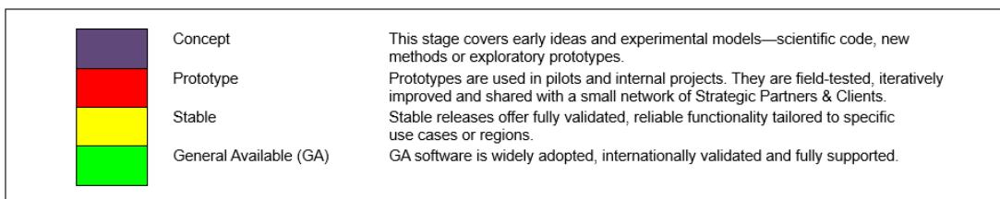

**Figure 2.1:** Overview of TRL levels for software of Deltares

### 3 Conceptual description of hydrodynamic equations

#### 3.1 Introduction

The hydrodynamic module D-Flow FM simulates one-dimensional (1D), two-dimensional (2DH, depth-averaged) or three-dimensional (3D) unsteady flow and transport phenomena resulting from tidal and/or meteorological forcing, including the effect of density differences due to a non-uniform temperature and salinity distribution (density-driven flow). Also a combination of 1D and 2D modelling can be applied (1D2D). The hydrodynamic model is used to predict the flow in shallow seas, coastal areas, estuaries, lagoons, rivers, lakes and polders. It aims to model flow phenomena of which the horizontal length and time scales are significantly larger than the vertical scales. The many applications that are possible with D-Flow FM, either with D-Flow FM 1D2D or with D-Flow FM 2D3D have been summarized in section 2.1.

If the fluid is vertically homogeneous, a depth-averaged approach is appropriate. D-Flow FM is able to run in two-dimensional mode (one computational layer), which corresponds to solving the depth-averaged equations. Examples in which the two-dimensional, depth-averaged flow equations can be applied are tidal waves, storm surges, tsunamis, harbor oscillations (seiches) and transport of pollutants in vertically well-mixed flow regimes.

One-dimensional modelling or 1D2D modelling with D-Flow FM 1D2D is available for urban, rural and river and polder applications and sewer systems. Three-dimensional modelling with D-Flow FM 2D3D is of particular interest in transport problems where the horizontal flow field shows significant variation in the vertical direction. This variation may be generated by wind forcing, bed stress, Coriolis force, bed topography or density differences. Examples are dispersion of waste or cooling water in lakes and coastal areas, upwelling and downwelling of nutrients, salt intrusion in estuaries, fresh water river discharges in bays and thermal stratification in lakes and seas.

D-Flow FM is flexible by using an unstructured grid in the horizontal plane. In the vertical direction D-Flow FM 2D3D offers two different vertical grid systems: a so-called  $\sigma$  co-ordinate system ( $\sigma$ -model) introduced by Phillips (1957) for ocean models and the Cartesian  $z$ -co-ordinate system ( $Z$ -model).

This section gives some background information on the conceptual model of the D-Flow FM module. Most of the concepts and algorithms are applicable to both the  $\sigma$ -model and  $Z$ -model.

#### 3.2 Physical processes

The numerical hydrodynamic modelling system D-Flow FM solves the unsteady shallow water equations in one (transverse and depth-averaged), two (depth-averaged) or in three (multi-layer) dimensions. The system of equations consists of the horizontal equations of motion, the continuity equation, and the transport equations for conservative constituents. The equations are formulated in orthogonal Cartesian co-ordinates or in spherical co-ordinates on the globe. In Cartesian co-ordinates, the free surface level and bathymetry are related to a flat horizontal plane of reference, whereas in spherical co-ordinates the reference plane follows the Earth curvature.

The flow is forced by among others tides, currents and discharges at the open boundaries, wind stress at the free surface, pressure gradients due to free surface gradients (barotropic) or density gradients (baroclinic). Source and sinks or laterals are included in the equations to model the discharge and withdrawal of water and of constituents and substances, of which the latter are subject to one or more water quality processes.

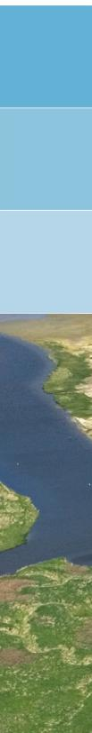

The D-Flow FM model includes mathematical formulations that take into account the following physical phenomena:

- ◇ Propagation of long tidal waves (barotropic flow).
- ◇ Horizontal density gradients via the pressure term (baroclinic effects).
- ◇ Wind-driven flows; including space and time varying wind and atmospheric pressure, including tropical cyclone winds.
- ◇ Bed-stress including many options for vegetation.
- ◇ The effect of the Earth rotation (via Coriolis force).
- ◇ Heat exchange through the free water surface (via heat flux models).
- ◇ Transport of dissolved material and pollutants (via transport equation).
- ◇ Robust simulation of drying and flooding of inter-tidal flats and river winter beds.
- ◇ Turbulence modelling (via turbulence closure models) (only 3D).
- ◇ Transport of salt, heat and other conservative constituents.
- ◇ Evaporation and precipitation.
- ◇ Tide generating forces.
- ◇ Effect of secondary flow on depth-averaged momentum equations (for 3D effect in a 2D model).
- ◇ Influence of waves on the bed shear-stress (currently on for 2D).
- ◇ Wave induced stresses (radiation stress) and mass fluxes (currently on for 2D).
- ◇ Water quality processes in case of online coupling of hydrodynamics and water quality.
- ◇ Sediment transport and morphodynamics via online coupling with hydrodynamics.

In case of 3D modelling advanced turbulence models to account for the vertical turbulent viscosity and diffusivity are based on the eddy viscosity concept. Four closure models are provided in D-Flow FM:

1. 1 constant,
2. 2 algebraic,
3. 3  $k-\varepsilon$  and
4. 4  $k-\tau$  model.

### 3.3 Hydrodynamic modelling

D-Flow FM solves the Navier Stokes equations for an incompressible fluid, under the shallow water and the Boussinesq assumptions. In the vertical momentum equation the vertical accelerations are neglected, which leads to the hydrostatic pressure equation. The set of partial differential equations in combination with an appropriate set of initial and boundary conditions is solved on an unstructured finite volume grid.

Two coordinate references are supported in D-Flow FM:

1. 1 Cartesian co-ordinates
2. 2 Spherical co-ordinates

For the sake of simplicity in this chapter the equations are only in Cartesian co-ordinates.

#### 3.3.1 Model equations in 2D

In this section, we will present the governing equations in two horizontal directions, which involves two momentum equations and the continuity equation.

### 3.3.1.1 Momentum equations in horizontal direction (2D)

The momentum equations in  $x$ - and  $y$ -direction are given by:

$$\frac{\partial U}{\partial t} + U \frac{\partial U}{\partial x} + V \frac{\partial U}{\partial y} - fV = -\frac{1}{\rho_0} \frac{\partial P}{\partial x} + F_x + \frac{\partial}{\partial z} \left( \nu_V \frac{\partial U}{\partial z} \right) + M_x \quad (3.1)$$

$$\frac{\partial V}{\partial t} + U \frac{\partial V}{\partial x} + V \frac{\partial V}{\partial y} + fU = -\frac{1}{\rho_0} \frac{\partial P}{\partial y} + F_y + \frac{\partial}{\partial z} \left( \nu_V \frac{\partial V}{\partial z} \right) + M_y \quad (3.2)$$

Where  $U$  and  $V$  are the depth-averaged currents and  $\nu_V$  is the vertical eddy viscosity coefficient. Density variations are neglected, except in the baroclinic pressure terms,  $\partial P / \partial x$  and  $\partial P / \partial y$  represent the pressure gradients.

The forces  $F_x$  and  $F_y$  in the momentum equations represent the unbalance of horizontal Reynolds stresses.

 $M_x$  and  $M_y$  represent the contributions due to external sources or sinks of momentum (external forces by hydraulic structures, discharge or withdrawal of water, wave stresses, etc.).

The effects of surface waves on the flow as modelled in D-Flow FM are described in section 3.8.

### 3.3.1.2 Continuity equation (2D)

D-Flow FM solves the depth-averaged continuity equation, derived by integration the continuity equation, for incompressible fluids ( $\nabla \cdot \mathbf{u} = 0$ ) over the total depth, taken into account the kinematic boundary conditions at water surface and bed level, and is given by:

$$\frac{\partial h}{\partial t} + \frac{\partial U h}{\partial x} + \frac{\partial V h}{\partial y} = Q \quad (3.3)$$

with  $U$  and  $V$  the depth averaged velocities.  $Q$  is representing the contributions per unit area due to the discharge or withdrawal of water, precipitation and evaporation:

$$Q = \int_0^h (q_{in} - q_{out}) dz + P - E \quad (3.4)$$

with  $q_{in}$  and  $q_{out}$  the local sources and sinks of water per unit of volume [1/s], respectively,  $P$  the non-local source term of precipitation and  $E$  non-local sink term due to evaporation. We remark that the intake of, for example, a power plant is a withdrawal of water and should be modelled as a sink. At the free surface there may be a source due to precipitation or a sink due to evaporation.

### 3.3.2 Model equations in 3D

In this section, we will present the governing equations in two horizontal directions and one vertical direction, which involves three momentum equations and the continuity equation.

### 3.3.2.1 Momentum equations in horizontal direction (3D)

The momentum equations in  $x$ - and  $y$ -direction are given by:

$$\frac{\partial u}{\partial t} + u \frac{\partial u}{\partial x} + v \frac{\partial u}{\partial y} + w \frac{\partial u}{\partial z} - fv = -\frac{1}{\rho_0} \frac{\partial P}{\partial x} + F_x + \frac{\partial}{\partial z} \left( \nu_V \frac{\partial u}{\partial z} \right) + M_x \quad (3.5)$$

$$\frac{\partial v}{\partial t} + u \frac{\partial v}{\partial x} + v \frac{\partial v}{\partial y} + w \frac{\partial v}{\partial z} + f u = -\frac{1}{\rho_0} \frac{\partial P}{\partial y} + F_y + \frac{\partial}{\partial z} \left( \nu_V \frac{\partial v}{\partial z} \right) + M_y \quad (3.6)$$

Where  $\nu_V$  is the vertical eddy viscosity coefficient. Density variations are neglected, except in the baroclinic pressure terms,  $\partial P / \partial x$  and  $\partial P / \partial y$  represent the pressure gradients.

The forces  $F_x$  and  $F_y$  in the momentum equations represent the unbalance of horizontal Reynolds stresses.

 $M_x$  and  $M_y$  represent the contributions due to external sources or sinks of momentum (external forces by hydraulic structures, discharge or withdrawal of water, wave stresses, etc.).

The effects of surface waves on the flow as modelled in D-Flow FM are described in section 3.8.

### 3.3.2.2 Vertical velocities (3D)

The vertical velocity  $w$  in the adapting  $\sigma$  co-ordinate system is computed from the continuity equation:

$$\frac{\partial h}{\partial t} + \frac{\partial u h}{\partial x} + \frac{\partial v h}{\partial y} + \frac{\partial w}{\partial z} = h (q_{in} - q_{out}) \quad (3.7)$$

At the surface the effect of precipitation and evaporation is taken into account. The vertical velocity  $w$  is defined at the  $\sigma$ -surfaces.  $w$  is the vertical velocity relative to the moving  $\sigma$ -plane. It may be interpreted as the velocity associated with up- or downwelling motions.

### 3.3.3 The hydrostatic pressure assumption

Under the shallow water assumption, the vertical momentum equation is reduced to a hydrostatic pressure equation. Vertical accelerations due to buoyancy effects and due to sudden variations in the bed topography are not taken into account. So:

$$\frac{\partial P}{\partial z} = -\rho g \quad (3.8)$$

For water of constant density and taking into account the atmospheric pressure, it includes gradients of the free surface level, called barotropic pressure gradients. The atmospheric pressure is included in the system for storm surge simulations. The atmospheric pressure gradients dominate the external forcing at peak winds during storm events. Space and time varying wind and pressure fields are especially important when simulating storm surges.

In case of a non-uniform density the pressure gradients includes not only barotropic pressure gradient, but also vertical pressure gradient, the so called baroclinic pressure gradient. The baroclinic pressure gradient is the result of variable distribution of density and temperature in the vertical direction.

In the horizontal gradient a vertical derivative is introduced by the  $\sigma$  co-ordinate transformation. In estuaries and coastal seas the vertical grid may deteriorate strongly in case of steep bed slopes. In order to avoid artificial flow the numerical approximation of the baroclinic pressure terms requires a special numerical approach. The treatment of D-Flow FM to avoid the artificial mixing due to  $\sigma$  co-ordinates are discussed in section 23.7, see also Stelling and Van Kester (1994).

### 3.3.4 The Coriolis force

The Coriolis parameter  $f$  depends on the geographic latitude  $\phi$  and the angular speed of rotation of the earth,  $\Omega$  ( $f = 2\Omega \sin \phi$ ). For a grid the user should specify the space varying Coriolis parameter, using a suitable projection. This can be done by selecting *Coordinate System* in RGFGRID, and selection of the option for *Spherical Coordinate*. The parameters for translation and rotation can be given as shown in Figure 3.1.

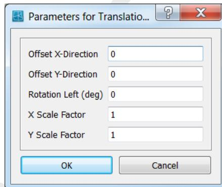

**Figure 3.1:** Input for map projection for specifying Coriolis parameter on the grid.

### 3.3.5 Diffusion of momentum

The forces  $F_x$  and  $F_y$  in the horizontal momentum equations represent the unbalance of horizontal Reynolds stresses. The Reynolds stresses are modelled using the eddy viscosity concept, (for details e.g. Rodi (1984)). This concept expresses the Reynolds stress component as the product between a flow as well as grid-dependent eddy viscosity coefficient and the corresponding components of the mean rate-of-deformation tensor. The meaning and the order of the eddy viscosity coefficients differ for 2D and 3D, for different horizontal and vertical turbulence length scales and fine or coarse grids. In general the eddy viscosity is a function of space and time.

For 3D shallow water flow the stress tensor is an-isotropic. The horizontal eddy viscosity coefficient,  $\nu_H$ , is much larger than the vertical eddy viscosity  $\nu_V$  ( $\nu_H \gg \nu_V$ ). The horizontal viscosity coefficient may be a superposition of three parts:

1. 1 a part due to "sub-grid scale turbulence",
2. 2 a part due to "3D-turbulence" see Uittenbogaard *et al.* (1992) and
3. 3 a part due to dispersion for depth-averaged simulations.

In simulations with the depth-averaged momentum and transport equations, the redistribution of momentum and matter due to the vertical variation of the horizontal velocity is denoted as dispersion. In 2D simulations this dispersion is not simulated as the vertical profile of the horizontal velocity is not resolved. Then this dispersive effect may be modelled as the product of a viscosity coefficient and a velocity gradient. The dispersion term may be estimated by the Elder formulation.

If the vertical profile of the horizontal velocity is not close to a logarithmic profile (e.g. due to stratification or due to forcing by wind) then a 3D-model for the transport of matter is recommended.

The horizontal eddy viscosity is mostly associated with the contribution of horizontal turbulent motions and forcing that are not resolved by the horizontal grid ("sub-grid scale turbulence") or

by (a priori) the Reynolds-averaged shallow-water equations. in 3D, in the vertical direction,  $\nu_V$  is referred to as the three-dimensional turbulence and in it is computed following a 3D-turbulence closure model.

Therefore, in addition to all turbulence closure models in D-Flow FM a constant (space and time) background mixing coefficient may be specified by the user, which is a background value for the vertical eddy viscosity in the momentum Equation (3.5) and Equation (3.6) consequently.

The horizontal and vertical eddy viscosities can be set by user defined value under Physical Parameters shown in Figure 3.2.

**Figure 3.2:** Input parameters for horizontal and vertical eddy viscosities.

The default approach for the computation of the horizontal viscosity in D-Flow FM is the so-called Smagorinsky approach, which results into time and space varying horizontal viscosity coefficients. Due to the explicit time integration of the horizontal viscosity term a time step criterion is applied in order to ensure stable model results. If this criterion is violated, then the horizontal viscosity coefficient at a certain flow link is reduced. Next, in the diagnostic file a warning is generated as shown below.

| ** WARNING: Viscosity coefficient was limited for 3309 links. |
|---------------------------------------------------------------|
| ** WARNING: Viscosity coefficient was limited for 3269 links. |
| ** WARNING: Viscosity coefficient was limited for 3411 links. |

Per time step is shown in how many flow links the horizontal viscosity coefficient has been reduced. After ten warnings this message is stopped, in order to prevent that the diagnostic file will become very large. The following message is written in the diagnostic file at the end of the simulation:

| ** INFO : Viscosity coefficient/Horizontal transport flux were limited on some links in the course of computation. |
|--------------------------------------------------------------------------------------------------------------------|
|--------------------------------------------------------------------------------------------------------------------|

### 3.3.6 Bed friction

The boundary conditions for the momentum equations 3.5 and 3.6 at the bed ( $z = z_b$ ) are:

$$\left. \frac{\nu_V}{H} \frac{\partial u}{\partial \sigma} \right|_{\sigma=0} = \frac{1}{\rho_0} \tau_{bx} \quad (3.9)$$

and

$$\left. \frac{\nu_V}{H} \frac{\partial v}{\partial \sigma} \right|_{\sigma=0} = \frac{1}{\rho_0} \tau_{by} \quad (3.10)$$

with  $\tau_{bx}$  and  $\tau_{by}$  the components of the bed stress in  $x$ - and  $y$ -direction, respectively. These equations hold in 2D and 3D parts of the model, in 1D modelling the equation reduces to a single component along the channel.

**Depth-averaged flow**

For 2D depth-averaged flow the shear-stress at the bed induced by a turbulent flow is assumed to be given by a quadratic friction law:

$$\tau_b = \frac{\rho_0 g \mathbf{U} |\mathbf{U}|}{C_{2D}^2}, \quad (3.11)$$

where  $|\mathbf{U}|$  is the magnitude of the depth-averaged horizontal velocity. In D-Flow FM we support the following equations to compute the  $C_{2D}$  coefficient. The numbers and strings following the name of the roughness formulation indicate the number and name by which the formulations are selected in the input files.

**◇ Chézy formulation: 0, Chézy**

$$C_{2D} = \text{Chézy coefficient [m}^{1/2}\text{ /s].} \quad (3.12)$$

**◇ Manning's formulation: 1, Manning**

As formulated by Manning (1891), and also known as Gauckler-Manning-Strickler formulation.

$$C_{2D} = \frac{\sqrt[6]{R}}{n} \quad (3.13)$$

where:

 $R$  is the hydraulic radius  
 $n$  is the Manning coefficient [m<sup>-1/3</sup>s].

**◇ Log law of the Wall: 2, WallLawNikuradse**

$$C_{2D} = \frac{\sqrt{g}}{\kappa} \ln \left( \frac{30R}{ek_n} \right) \quad (3.14)$$

where:

 $R$  is the hydraulic radius  
 $k_n$  is the Nikuradse roughness length [m].

**◇ White-Colebrook's formulation: 3, WhiteColebrook**

As formulated by Colebrook and White (1937) and Colebrook (1939).

$$C_{2D} = 18^{10} \log \left( \frac{12R}{k_n} \right) \quad (3.15)$$

where:

 $R$  is the hydraulic radius  
 $k_n$  is the Nikuradse roughness length [m].

Alluvial bed properties and land use data can be used to determine the roughness and flow resistance. Specific functionality has been implemented to make the translation of bed and land use properties into roughness and flow resistance characteristics. See section 13.3 for details.

### Three-dimensional flow

For 3D models, a quadratic bed stress formulation is used that is quite similar to the one for depth-averaged simulations. The bed shear stress in 3D is related to the current just above the bed:

$$\tau_{b3D} = \frac{g\rho_0 \mathbf{u}_b |\mathbf{u}_b|}{C_{3D}^2}, \quad (3.16)$$

with  $|\mathbf{u}_b|$  the magnitude of the horizontal velocity in the first layer just above the bed. The contribution of the vertical velocity component to the magnitude of the velocity vector is neglected. The log-law wall function for a rough bed reads

$$\mathbf{u}(z) = \frac{\mathbf{u}_*}{\kappa} \ln \left( \frac{z + \mu z_0}{z_0} \right), \quad (3.17)$$

where  $z_0$  is the roughness height and  $\mu$  is a constant that is set to 9 in D-Flow FM. The first grid point above the bed is assumed to be situated in the logarithmic boundary layer. Let  $\Delta z_b$  be the thickness of the computational layer closest to the bed. Then, by integrating over that layer we arrive at

$$\mathbf{u}_b = \frac{\mathbf{u}_*}{\kappa} \ln \left( \frac{\Delta z_b + \mu z_0}{e z_0} \right), \quad (3.18)$$

The magnitude of the bottom stress is defined as:

$$|\tau_b| = \rho_0 \mathbf{u}_* |\mathbf{u}_*|. \quad (3.19)$$

Using Eqs. 3.16 to 3.19,  $C_{3D}$  can be expressed in the roughness height  $z_0$  of the bed:

$$C_{3D} = \frac{\sqrt{g}}{\kappa} \ln \left( \frac{\Delta z_b + \mu z_0}{e z_0} \right). \quad (3.20)$$

#### 3.3.6.1 Roughness definition input

The roughness definition (or: friction values) can be done in two ways:

- ◇ 2D grid parts may use a global friction value, specified in the MDU file (Appendix A) under [physics], keyword UnifFrictCoef. Note that the available UnifFrictType values are limited to 0, 1, 2, 3.
- ◇ Alternatively, 2D grid parts may have spatially varying friction values defined via the parameter field file, specified in the MDU file under [geometry], keyword IniFieldFile. The spatially varying friction values have to be provided in a separate data file, and interpolation of that data onto the 2D grid is controlled by several parameters in the IniFieldFile. All details are given in [section C.16.3](#).

### 3.4 Equations of State for the density

#### 3.4.1 Overview of density formulations in D-Flow FM

The density of water,  $\rho$ , is a function of salinity ( $s$ ) and temperature ( $T$ ), and optionally pressure ( $p$ ). The keyword that selects the equation of state in the .mdu file is `Idensform`. The influence of salinity and/or temperature on water motion via baroclinic pressure gradients can be disabled by setting `Idensform = 0`.

**Default:** By default, D-Flow FM uses the UNESCO 1980 (EOS-80) equation of state with pressure set to zero (i.e., surface-referenced potential density).

**Eckart Formulation**

The Eckart formulation is an empirical equation of state derived from limited measurements (two salinities at five temperatures) from 1910 (Eckart, 1958). While the original includes pressure effects, they are negligible at low pressures and thus omitted here. The Eckart formulation is selected with `Idensform = 1`, and follows the implementation in Delft3D-FLOW.

**Valid Range:**  $0 < T < 40^\circ\text{C}$ ,  $0 < s < 40$  ppt

$$\rho = \frac{1000P_0}{\lambda + \alpha_0P_0}, \tag{3.21}$$

where:

$$\lambda = 1.779.5 + 11.25T - 0.0745T^2 - (3.80 + 0.01T)s, \tag{3.22}$$

$$\alpha_0 = 0.698 \text{ } 0, \tag{3.23}$$

$$P_0 = 5.890 + 38T - 0.375T^2 + 3s. \tag{3.24}$$

Here,  $s$  is in [ppt] and  $T$  in [ $^\circ\text{C}$ ].

**UNESCO 1980 Formulation (EOS-80)**

The EOS-80 equation of state, based on 467 experimental data points, provides an internationally standardized expression for seawater density as a function of salinity and temperature at atmospheric pressure. It is selected via `Idensform = 2` and is recommended for most practical applications.

**Valid Range:**  $0 < T < 40^\circ\text{C}$ ,  $0.5 < s < 43$  ppt

$$\rho = \rho_0 + As + Bs^{3/2} + Cs^2 \tag{3.25}$$

where:

$$\rho_0 = 999.842594 + 6.793952 \times 10^{-2}T - 9.095290 \times 10^{-3}T^2 + 1.001685 \times 10^{-4}T^3 - 1.120083 \times 10^{-6}T^4 + 6.536332 \times 10^{-9}T^5 \tag{3.26}$$

$$A = 0.824493 - 4.0899 \times 10^{-3}T + 7.6438 \times 10^{-5}T^2 - 8.2467 \times 10^{-7}T^3 + 5.3875 \times 10^{-9}T^4 \tag{3.27}$$

$$B = -5.72466 \times 10^{-3} + 1.0227 \times 10^{-4}T - 1.6546 \times 10^{-6}T^2 \tag{3.28}$$

$$C = 4.8314 \times 10^{-4} \tag{3.29}$$

The standard error is approximately  $3.6 \times 10^{-3}$  kg/m<sup>3</sup> (Millero and Poisson, 1981). EOS-80 accurately reproduces the maximum density of freshwater at  $4^\circ\text{C}$ , which is essential for thermal stratification modeling in lakes. D-Flow FM applies EOS-80 under the assumption that pressure is zero, interpreting the output as surface-referenced potential density.

**UNESCO 1983 Formulation (EOS-83)**

The EOS-83 formulation extends EOS-80 by including pressure dependence and thermobaric effects. It is based on Millero and Poisson (1981) and adopted in UNESCO's 1983 technical addendum. It is selected via `Idensform = 3`.

**Valid Range:**  $0 < T < 40^\circ\text{C}$ ,  $0.5 < s < 43 \text{ ppt}$ ,  $0 < p < 1 \text{ 000 dbar}$ 

At zero pressure, the density is given by:

$$\rho(S, T, 0) = \rho_w(T) + A(T)S + B(T)\sqrt{S}S + CS^2 \quad (3.30)$$

where:

$$\rho_w(T) = ((((6.536 332 \times 10^{-9}T - 1.120 083 \times 10^{-6})T + 1.001 685 \times 10^{-4})T - 9.095 290 \times 10^{-3})T + 6.793 952 \times 10^{-2})T + 999.842 594 \quad (3.31)$$

$$A(T) = (((5.3875 \times 10^{-9}T - 8.2467 \times 10^{-7})T + 7.6438 \times 10^{-5})T - 4.0899 \times 10^{-3})T + 0.824493 \quad (3.32)$$

$$B(T) = (-1.6546 \times 10^{-6}T + 1.0227 \times 10^{-4})T - 5.72466 \times 10^{-3} \quad (3.33)$$

$$C = 4.8314 \times 10^{-4} \quad (3.34)$$

The full pressure-corrected density is:

$$\rho(S, T, p) = \rho(S, T, 0) + \Delta\rho(S, T, p) \quad (3.35)$$

where  $\Delta\rho$  is computed using the pressure-dependent secant bulk modulus  $K(S, T, p)$  and specific volume anomaly, following the algorithms in Millero and Poisson (1981).

D-Flow FM uses the UNESCO 1983 formulation to extend EOS-80 when pressure is non-zero. This maintains consistency with both modern oceanographic standards and legacy systems, and ensures physically realistic behavior under key conditions, such as the freshwater density maximum near  $4^\circ\text{C}$ .

**3.4.2 Thermobaricity**

**Note:** Thermobaricity in D-Flow FM is of TRL level 4-6 (prototype), with the definitions of the Technical Technology Readiness Levels (TRL) in Section 2.7.

Thermobaricity refers to the phenomenon where mixing two water parcels of equal density but differing temperature and pressure yields a parcel with a different density. While negligible in shallow waters—where D-Flow FM is primarily applied—thermobaric effects can become significant in deep lakes or oceanic regions, especially at depths of several hundred meters. To account for these effects, D-Flow FM allows thermobaricity to be enabled exclusively for the UNESCO 1983 formulation by setting the `.mdu` file keyword `thermobaricity = 1` in the input block `[physics]`. When enabled, the density calculation incorporates spatial and temporal variations in salinity, temperature and water pressure.


**3.5 Shear-stresses at closed boundaries**

A closed boundary is situated at the transition between land and water. At a closed boundary, two boundary conditions have to be prescribed. One boundary condition has to do with the flow normal to the boundary and the other one with the shear-stress along the boundary. A closed sidewalls is always considered as impermeable. For the shear stress along the

boundary, the possible conditions to be prescribed are free-slip (zero tangential shear-stress), partial-slip and full-slip.

For large-scale simulations, the influence of the shear-stresses along closed boundaries can be neglected. Free slip is then applied for all closed boundaries. For simulations of smallscale flow (e.g. laboratory scale), the influence of the side walls on the flow may no longer be neglected. This option has been implemented for closed boundaries and dry points *but not for thin dams*. The reason is that the shear stress at a thin dam is dependent on the side (double valued).

Along the side walls, the tangential shear stress is calculated based on a logarithmic law of the wall. The friction velocity  $u_*$  is determined by the logarithmic law for a rough wall, with side wall roughness  $y_0$  and the velocity in the first grid point near the side wall. Let  $\Delta y_s$  be the grid size normal to the sidewall, then:

$$|\vec{u}_{\text{sidewall}}| = \frac{u_*}{\kappa} \ln \left( 1 + \frac{\Delta y_s}{2y_0} \right) \quad (3.36)$$

The choice for the way tangial shear stress are computed can be inserted through the key `irov` in the MDU-file (under `[physics]`):

- ◇ the case `irov = 0` treats the side walls as free-slip walls (default),
- ◇ the case `irov = 1` treats the side walls as partial-slip walls,
- ◇ the case `irov = 2` treats the side walls as no-slip walls.

If the choice for partial-slip walls is made, then a specific wall roughness value should be prescribed in the MDU-file. For this, the keyword `wall_ks` should be used (under `[physics]` in the MDU-file). The computational engine interprets this value as Nikuradse roughness  $k_s$ . The value for  $y_0$  is computed as  $y_0 = k_s/30$ .

### 3.6 Secondary flow

The flow in a river bend is basically three-dimensional. The velocity has a component in the plane perpendicular to the river axis. This component is directed to the inner bend near the riverbed and directed to the outer bend near the water surface, see Figure 3.3.

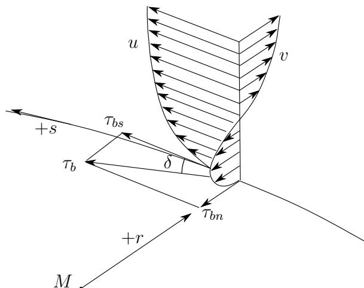

**Figure 3.3:** Vertical profile secondary flow ( $v$ ) in river bend and direction bed stress

This so-called "secondary flow" (spiral motion) is of importance for the calculation of changes of the riverbed in morphological models and the dispersion of matter. It strongly varies over the vertical but its magnitude is small compared to the characteristic horizontal flow velocity. In a 3D model the secondary flow is resolved on the vertical grid, but in 2D depth-averaged model the secondary flow cannot be simulated in this way, because a vertical component doesn't exist. Therefore, it can be simulated in a simplified way by using a so-called secondary flow model, which can be switched on in D-Flow FM via keyword `secondaryflow = 1` in the input block [physics]. In this section the secondary flow model in D-Flow FM is described.

### 3.6.1 Definition

The secondary flow will be defined here as the velocity component  $v(\sigma)$  normal to the depth-averaged main flow. The spiral motion intensity of the secondary flow  $I$  is a measure for the magnitude of this velocity component along the vertical:

$$I = \int_0^1 |v(\sigma)| d\sigma \quad (3.37)$$

A vertical distribution for a river bend is given in Figure 3.3. The spiral motion intensity  $I$  leads to a deviation of the direction of the bed shear stress from the direction of the depth-averaged flow and thus affects the bedload transport direction. This effect can be taken into account in morphological simulations.

The component of the bed shear stress normal to the depth-averaged flow direction  $\tau_{br}$  reads:

$$\tau_{br} = -2\rho\alpha^2 \left(1 - \frac{\alpha}{2}\right) |\mathbf{u}| I \quad (3.38)$$

where  $\alpha$  is defined in Equation (3.48) and  $|\mathbf{u}|$  is the magnitude of the depth-averaged velocity. To take into account the effect of the secondary flow on the depth-averaged flow, the depth-averaged shallow water equations have to be extended with:

- ◇ An additional advection-diffusion equation to account for the generation and adaptation of the spiral motion intensity.
- ◇ Additional terms in the momentum equations to account for the horizontal effective shear stresses originating from the secondary flow.

### 3.6.2 Momentum equations in horizontal direction

When applying a secondary flow model, this does not lead to any conceptual changes in the continuity equation. Therefore, equation 3.3 is still relevant. However, the momentum equations in  $x$ - and  $y$ -direction will be extended with and extra term, which is given by:

$$\frac{\partial U}{\partial t} + U \frac{\partial U}{\partial x} + V \frac{\partial U}{\partial y} - fV = -\frac{1}{\rho_0} \frac{\partial P}{\partial x} - \frac{gu\sqrt{u^2 + v^2}}{C_{2D}^2 h} + F_x + F_{sx} + M_x \quad (3.39)$$

$$\frac{\partial V}{\partial t} + U \frac{\partial V}{\partial x} + V \frac{\partial V}{\partial y} + fU = -\frac{1}{\rho_0} \frac{\partial P}{\partial y} - \frac{gv\sqrt{u^2 + v^2}}{C_{2D}^2 h} + F_y + F_{sy} + M_y \quad (3.40)$$

The fourth term in the right-hand side represents the effect of the secondary flow on the depth-averaged velocities (shear stresses by depth-averaging the non-linear acceleration terms).

### 3.6.3 Effect of secondary flow on depth-averaged momentum equations

To account for the effect of the secondary flow on the depth-averaged flow, the momentum equations have to be extended with additional shear stresses. To close the equations these stresses are coupled to parameters of the depth-averaged flow field. The main flow is assumed to have a logarithmic velocity profile and the secondary flow originates from a multiplication of a universal function with the spiral motion intensity, see Kalkwijk and Booij (1986). Depth averaging of the 3D equations leads to correction terms in the depth-averaged momentum equations for the effect of spiral motion:

$$F_{sx} = \frac{1}{h} \left( \frac{\partial h T_{xx}}{\partial x} + \frac{\partial h T_{xy}}{\partial y} \right) \quad (3.41)$$

$$F_{sy} = \frac{1}{h} \left( \frac{\partial h T_{xy}}{\partial x} + \frac{\partial h T_{yy}}{\partial y} \right) \quad (3.42)$$

with the shear-stresses, resulting from the secondary flow, modelled as:

$$T_{xx} = -2\beta uv \quad (3.43)$$

$$T_{xy} = T_{yx} = \beta(u^2 - v^2) \quad (3.44)$$

$$T_{yy} = 2\beta uv \quad (3.45)$$

and:

$$\beta = \beta^* \frac{h}{R_s^*} \quad (3.46)$$

$$\beta^* = \beta_c (5\alpha - 15.6\alpha^2 + 37.5\alpha^3) \quad (3.47)$$

 $\beta_c \in [0, 1]$ , correction coefficient specified by you,

$$\alpha = \frac{\sqrt{g}}{\kappa C_{2D}} < \frac{1}{2} \quad (3.48)$$

with  $R_s^*$  the effective radius of curvature of a 2D streamline to be derived from the intensity of the spiral motion and  $\kappa$  the Von Kármán constant. The spiral motion intensity is computed by Equation (3.49). The limitation on  $\alpha$ , Equation (3.48), is set to ensure that the length scale  $L_a$  in Equation (3.56) is always positive. For  $\beta_c = 0$ , the depth-averaged flow is not influenced by the secondary flow.

Remark:

- ◊ Equation (3.48) effectively means a lower limit on  $C_{2D}$ .

### 3.6.4 The depth averaged transport equation for the spiral motion intensity

The variation of the spiral motion intensity  $I$  in space and time, is described by a depth-averaged advection-diffusion equation:

$$\frac{\partial hI}{\partial t} + \frac{\partial UhI}{\partial x} + \frac{\partial VhI}{\partial y} = h \frac{\partial}{\partial x} \left( D_H \frac{\partial I}{\partial x} \right) + h \frac{\partial}{\partial y} \left( D_H \frac{\partial I}{\partial y} \right) + hS \quad (3.49)$$

with:

$$S = -\frac{I - I_e}{T_a} \quad (3.50)$$

$$I_e = I_{be} - I_{ce} \quad (3.51)$$

$$I_{be} = \frac{h}{R_s} |\mathbf{U}| \quad (3.52)$$

$$I_{ce} = f \frac{h}{2} \quad (3.53)$$

$$|\mathbf{U}| = \sqrt{U^2 + V^2} \quad (3.54)$$

$$T_a = \frac{L_a}{|\mathbf{U}|} \quad (3.55)$$

$$L_a = \frac{(1 - 2\alpha)h}{2\kappa^2\alpha} \quad (3.56)$$

and  $R_s$  the radius of curvature of the stream-line defined by:

$$\frac{U_s}{R_s} = -\frac{\partial U_r}{\partial s} \quad (3.57)$$

with  $U_s$  and  $U_r$  the components along and perpendicular to the streamline. The effective radius of curvature to be used for the evaluation of the coefficient  $\beta$ , Equation (3.47), reads:

$$R_s^* = \frac{h|\mathbf{U}|}{I} \quad (3.58)$$

To guarantee stability the effective radius of curvature is bounded by the following empirical relation:

$$R_s^* \geq 10h \quad (3.59)$$

The above formulas account for two sources of secondary flow:

- ◇ The centrifugal force in case of curved streamlines,  $I_{be}$ .
- ◇ The effect of the Coriolis force,  $I_{ce}$ .

### 3.7 Tide generating forces

Numerical models of tidal motion in coastal seas generally do not account for the direct local influence of the tide generating forces. The amount of water mass in these models is relatively small and the effect of these forces on the flow can be neglected. In that case, tidal motion can often be reproduced with sufficient accuracy just by prescribing the tidal forcing along open model boundaries.

In models covering larger seas or oceans, the contribution of the gravitational forces on the water motion increases considerably and can no longer be neglected. In a global model,

open boundaries are absent and the tidal motion can only be induced by including tide generating forces. Because tidal forces only play a significant role in the larger models, and because the exact position of each computational point on earth must be known, we have implemented these forces only in combination with spherical coordinates. By default, tide generating forces is switched on in spherical models. You can switch it off by setting in the mdu file: `Tidalforcing = 0`

The tide generating forces originate from the Newtonian gravitational forces of the terrestrial system (Sun, Moon and Earth) on the water mass. The equilibrium tide is the tide that would result from the gravitational forces if a solid earth would be completely covered by an ocean of about 21.5 km deep, such that the wave propagation speed would match the speed of the celestial forces over the ocean surface. The interacting frequencies that result can be grouped as diurnal, semi diurnal and long periodic. The total number of tide generating frequencies that is evaluated in the computation is a tradeoff between required accuracy and computational cost. Per default, we use a set of 60 frequencies.

A smaller set of 11 main frequencies as used in Delft3D-FLOW can also be selected by setting in the MDU file :

```
Doodsonstart = 57.555
Doodsonstop = 275.555
Doodsoneps = 0.030
```

The full set of 484 components can be selected by specifying:

```
Doodsonstart = 55.565
Doodsonstop = 375.575
Doodsoneps = 0.000
```

For the set of 60 components these numbers are:

```
Doodsonstart = 55.565
Doodsonstop = 375.575
Doodsoneps = 0.030
```

The earth itself is deformed by the celestial forces, this is called the solid earth tide. An estimate of this influence is based on the work of Love (1927), is included in the total tide generating potential.

Details on the implementation of tide generating forces can be found in the lecture notes of Schrama (2007).

In order to save computation cost, the tidal potential is not computed for each computational point, but on a grid with a resolution of 1 degree in both the South-North and West-East direction.

The tidal and surge motions of the seas and ocean also deform the earth, which is called tidal loading. Next to that, the water at some point is attracted by all moving water elsewhere on the globe. This is called self attraction. The combined influence of self attraction and loading is of

TRL level 4-6 (prototype), with the definitions of the Technical Technology Readiness Levels (TRL) in Section 2.7..

### 3.8 Wave forcing in D-Flow FM

In relatively shallow areas (coastal seas) wave action becomes important because of several processes:

- ◇ In the surf zone long-shore currents and a cross-shore set-up is generated due to variations in the wave-induced momentum flux (radiation stress). In case of an irregular surf zone, bathymetry strong circulations may be generated (rip currents).
- ◇ The bed shear stress is enhanced; this affects the stirring up of sediments and increases the bed friction.

These processes are accounted for in a wave-averaged manner. Some processes basically act at a specific location or interface, such as the enhanced bed shear-stress or wave breaking at the surface, while others have a (certain) distribution over the vertical, such as the energy dissipation due to bottom friction in the wave boundary layer.

The computation of waves and wave-induced effects is the domain of wave models. D-Waves supports currently one wave model: SWAN, a third generation wave model (Ris, 1997). SWAN computes the full (directional and frequency) spectrum on a rectilinear or curvilinear grid with many processes formulated in detail. For details and background you are referred to the D-Waves User Manual (Deltares, 2026i) and the references cited above.

For the sake of simplicity, we will describe in this section all wave-induced effects on a rectangular grid. In D-Flow FM, however, these terms have been implemented in an unstructured co-ordinate system. For a full wave-current interaction the currents from D-Flow FM are used in D-Waves (current refraction). The numerical grids used in the flow and wave computation often differ. SWAN works on a rectilinear or curvilinear grid, while D-Flow FM only works with unstructured grids. Unstructured SWAN is not yet supported. To use the required grid resolution in the area of interest you can use nested grids. The transformation of results between the nested grids and the grids used in the flow and in the wave computations is executed automatically and is fully transparent to you. The general procedure to derive the wave-induced forces is:

- ◇ Average the continuity equation and the momentum equations over the wave period.
- ◇ Express the residual terms that remain compared to the case without waves in terms of the wave properties, such as the wave energy, the phase and group velocity, and wave length or wave period.

Obviously, there are various averaging procedures. A straightforward approach is to define the mean motion by time averaging the equations over a wave period. The momentum equation in  $x$ -direction, averaged over the wave motion and expressed in Cartesian co-ordinates is given by:

$$\frac{\partial \bar{u}_j}{\partial t} + \bar{u}_i \frac{\partial \bar{u}_j}{\partial x_j} + \dots + g \frac{\partial \bar{\zeta}}{\partial x_j} - \frac{1}{\rho} \frac{\partial \bar{\tau}_{ij}}{\partial x_i} = F_j, \quad (3.60)$$

where for  $i$  and  $j$  the summation rule applies,  $i, j = \{1, 2, 3\}$ , the wave averaged quantity is indicated by an overhead bar,  $\bar{u}_j$  is the wave-mean velocity component,  $\bar{\zeta}$  is the wave-mean free surface elevation,  $\bar{\tau}_{ij}$  are the components of the wave-averaged normal stress tensor, and  $F_j$  is the wave-induced force that remains after averaging the momentum equation over the wave period. This wave induced force can generally be written as the gradient of the

radiation-stress tensor  $S$ :

$$F_i = -\frac{\partial S_{ij}}{\partial x_j}. \quad (3.61)$$

Using wave propagation models we can express  $S_{ij}$  in terms of the wave parameters, such as the wave energy, the phase and group velocity, the wave length and the wave period. The wave-induced force is computed as the gradient of the radiation stress terms.

The above given procedure can only be applied when the mean motion is uniform with depth. In most practical cases this does not apply. Then the only way to split the mean and oscillating motion is through the *Generalised Lagrangian Mean*, *GLM* method of Andrews and McIntyre (1978). As shown by Andrews and McIntyre (1978), Groeneweg and Klopman (1998) and Groeneweg (1999) the (depth averaged and 3D) flow equations written in a co-ordinate system moving with the Stokes drift are very similar to the ordinary Eulerian formulation. However, the wave-induced driving force due to averaging over the wave motion is more accurately expressed in wave properties. The relation between the GLM velocity and the Eulerian velocity is given by:

$$\mathbf{u}^L = \mathbf{u}^E + \mathbf{u}^S, \quad (3.62)$$

where  $\mathbf{u}^L$  is the GLM-velocity vector,  $\mathbf{u}^E$  is the ordinary Eulerian-velocity vector and  $\mathbf{u}^S$  is the Stokes-drift vector.

The momentum equation in  $x$ -direction, averaged over the wave motion and expressed in GLM co-ordinates is given by:

$$\frac{\partial \bar{u}_j^L}{\partial t} + \bar{u}_i^L \frac{\partial \bar{u}_j^L}{\partial x_j} + \dots + g \frac{\partial \bar{\zeta}}{\partial x_j} - \frac{1}{\rho} \frac{\partial \bar{\tau}_{ij}^L}{\partial x_i} = F_j^L, \quad (3.63)$$

where for  $i$  and  $j$  the summation rule applies,  $i, j = \{1, 2, 3\}$ , and the quantities have the same meaning as in Equation (3.60), but now in GLM co-ordinates. As shown by Groeneweg (1999) the right-hand side of Equation (3.63) contains a term related to a Stokes correction of the shear stresses. In the current implementation this term is neglected.

So in short:

- ◇ In D-Flow FM, the hydrodynamic equations are written and solved in GLM-formulation, including the wave-current interactions.
- ◇ The GLM velocities are written to the communication file and are used in all transport computations. Quantities moving with the flow are transported by the total, i.e. the GLM, velocity and not the Eulerian velocity.
- ◇ The Eulerian velocities are written to the D-Flow FM result files to be used in comparisons of computational results with measurements if [output] EulerVelocities in the MDU-file is set to 1.
- ◇ The only difference in the computational procedure as compared to the ordinary Eulerian formulation occurs at the boundaries. The velocity at the bottom is not the total velocity but the Eulerian velocity; so the bed-shear-stress is corrected for the Stokes drift. At lateral velocity boundaries, the total velocity must be prescribed; the implementation is such that the Eulerian velocity is prescribed in the boundary conditions (by you) and the Stokes drift is added by D-Flow FM. At water level boundaries, just the wave-mean water level must be prescribed.

In the following sections, we discuss the wave-current interaction terms and their possible profile in the vertical. Where applicable we distinguish between the depth-averaged and the 3D formulations.

**Remarks:**

- ◇ For brevity, we suppress the index  $L$  for GLM quantities. So, in this section a velocity without super-script refers to the GLM velocity, unless explicitly mentioned differently.
- ◇ A super-script  $S$  is used to indicate the Stokes drift.

**3.8.1 Forcing by radiation stress gradients**

The wave-induced force, i.e. the right-hand side of Equation (3.63), can be expressed in the wave parameters of the wave model that is being applied. For linear current refraction the expression can be derived analytically. To account for wave dissipation due to for instance bottom friction, wave breaking and whitecapping and wave growth due to wind one can rely on mild slope formulations with dissipation terms.

As shown by Dingemans *et al.* (1987), using the gradients of the radiation stresses in numerical models can result in spurious currents. Dingemans *et al.* (1987) showed that the divergence free part of the radiation stress is not capable of driving currents and can therefore be neglected if one is primarily interested in wave-driven currents. The remaining part of the radiation stress gradients is closely related to the wave energy dissipation, i.e. the right-hand side of Equation (3.63) can be written as:

$$F_i = \frac{Dk_i}{\omega}, \tag{3.64}$$

where  $D$  is the total energy dissipation due to waves,  $k_i$  is the wave number in  $i$ -direction and  $\omega$  is the wave frequency; see Dingemans (1997) for many details and discussions on this subject.

For a depth averaged model the momentum equations in  $x$ - and  $y$ -direction, leaving out most of the terms, can be written as:

$$\frac{\partial U}{\partial t} + \dots + \frac{gU\sqrt{U^2 + V^2}}{C_{2D}^2(d + \zeta)} + \dots = \dots + F_x, \tag{3.65}$$

$$\frac{\partial V}{\partial t} + \dots + \frac{gV\sqrt{U^2 + V^2}}{C_{2D}^2(d + \zeta)} + \dots = \dots + F_y, \tag{3.66}$$

where  $F_x$  and  $F_y$  are the depth averaged wave-induced forcings and given by the gradients of the radiation stress tensor  $S$ , or following Dingemans *et al.* (1987) approximated by wave energy dissipation:

$$F_x = -\frac{\partial S_{xx}}{\partial x} - \frac{\partial S_{yx}}{\partial y} = D\frac{k_x}{\omega}, \tag{3.67}$$

$$F_y = -\frac{\partial S_{xy}}{\partial x} - \frac{\partial S_{yy}}{\partial y} = D\frac{k_y}{\omega}. \tag{3.68}$$

The dissipation rate  $D$  (a negative quantity) is computed by the wave model and read from the communication file. In SWAN, the dissipation rate may be computed from the bottom friction (orbital motion), depth-induced breaking and whitecapping.

You can choose to apply the radiation stress or the dissipation rate to determine the wave-induced forces.

### 3.8.2 Stokes drift and mass flux

In surface waves, fluid particles describe an orbital motion. The net horizontal displacement for a fluid particle is not zero. This wave induced drift velocity, the so-called Stokes-drift, is always in the direction of wave propagation. A particle at the top of the orbit beneath a wave crest moves slightly faster in the forward direction than it does in the backward direction beneath a wave trough. The mean drift velocity is a second order quantity in the wave height. The drift leads to additional fluxes in the wave averaged mass continuity equation.

The wave-induced mass fluxes  $M_x^S$  and  $M_y^S$  are found by integration of the components of the Stokes drift  $u^S$  and  $v^S$  over the wave-averaged total water depth:

$$M_x^S = \int_{-d}^{\bar{\zeta}} \rho_o u^S dz = \frac{E}{\omega} k_x \quad (3.69)$$

$$M_y^S = \int_{-d}^{\bar{\zeta}} \rho_0 v^S dz = \frac{E}{\omega} k_y \quad (3.70)$$

with  $E$  the wave energy defined as:

$$E = \frac{1}{8} \rho_0 g H_{rms}^2. \quad (3.71)$$

The mass fluxes  $M_x^S$  and  $M_y^S$  are computed by an interface program and are written to the communication file.

#### Remarks:

- ◇ The mass flux effect is only taken into account when D-Flow FM is coupled to D-Waves.
- ◇ The velocities written to the communication file for use in D-Waves, and D-Water Quality are based on the *total flux* velocities.
- ◇ The Eulerian velocities, which may be used in comparisons with measurements at a fixed location, are written to the hydrodynamic map and history files.

The depth-averaged Stokes drift is given by:

$$U^S = \frac{M_x^S}{\rho_0 (d + \zeta)}, \quad (3.72)$$

$$V^S = \frac{M_y^S}{\rho_0 (d + \zeta)}. \quad (3.73)$$

### 3.8.3 Enhancement of the bed shear-stress by waves

The boundary layers at the bed associated with the waves and the current interact non-linearly. This has the effect of enhancing both the mean and oscillatory bed shear-stresses. The bed shear-stress due to the combination of waves and current is enhanced beyond the value which would result from a linear addition of the bed shear-stress due to waves,  $\tau_w$ , and the bed shear-stress due to current  $\tau_c$ . For sediment transport modelling it is important to predict the maximum bed shear-stress,  $\tau_{max}$ , while the current velocity and the turbulent diffusion are determined by the combined wave-current bed shear-stress  $\tau_m$ .

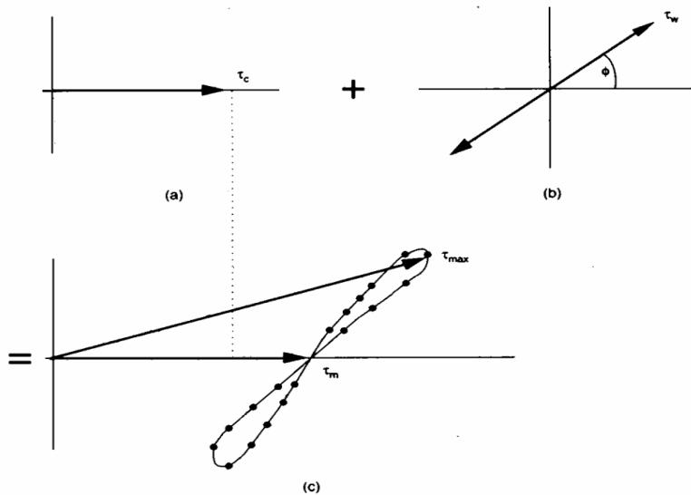

**Figure 3.4:** Schematic view of non-linear interaction of wave and current bed shear-stresses (from Soulsby et al. (1993b, Figure 16, p. 89))

Various, often very complex, methods exist to describe the bottom boundary layer under combined current and wave action and the resulting virtual roughness. Soulsby *et al.* (1993a) developed a parameterisation of these methods allowing a simple implementation and comparison of various wave-current interaction models: Fredsøe (1984); Myrhaug and Slaattelid (1990); Grant and Madsen (1979); Huynh-Thanh and Temperville (1991); Davies *et al.* (1988); Bijker (1967); Christoffersen and Jonsson (1985); O' Connor and Yoo (1988); Van Rijn *et al.* (2004). All these methods have all been implemented in D-Flow FM and can be applied in 2D and 3D modelling. However, as there are minor, but specific differences in determining certain quantities, such as determining the shear-stress at the bottom, we prefer to discuss the 2D and 3D implementation separately.

Following Soulsby *et al.* (1993b), Figure 3.4 gives a schematic overview of the bed shear-stresses for wave current interaction.

Soulsby *et al.* (1993b) fitted one standard formula to all of the models, each model having its own fitting coefficients. The parameterisation of Soulsby for the time-mean bed shear-stress is of the form:

$$|\tau_m| = Y (|\tau_c| + |\tau_w|), \quad (3.74)$$

with

$$Y = X \{1 + bX^p(1 - X)^q\}, \quad (3.75)$$

and for the maximum bed shear-stress:

$$|\tau_{\max}| = Z (|\tau_c| + |\tau_w|), \quad (3.76)$$

with

$$Z = 1 + aX^m(1 - X)^n. \quad (3.77)$$

and:

$$X = \frac{|\tau_c|}{|\tau_c| + |\tau_w|}, \quad (3.78)$$

The value of the parameters  $a$ ,  $b$ ,  $p$ ,  $q$ ,  $m$  and  $n$  depends on the friction model which is parameterised, and:

| $ \tau_c $      | magnitude of the bed stress due to current alone                    |
|-----------------|---------------------------------------------------------------------|
| $ \tau_w $      | magnitude of the bed stress for waves alone                         |
| $ \tau_m $      | magnitude of the mean bed stress for combined waves and current     |
| $ \tau_{\max} $ | magnitude of the maximum bed stress for combined waves and current. |

**Remark:**

◇ The stresses  $\tau_m$  and  $\tau_{\max}$  are assumed to have the same direction as  $\tau_c$ .

Following Soulsby *et al.* (1993b) the expressions for the parameters  $\chi$  ( $= a, b, p, q, m, n$ ) and  $\mathcal{J}$  ( $= I, J$ ; also depending on the friction model) have the form:

$$\chi = \left( \chi_1 + \chi_2 |\cos \phi|^{\mathcal{J}} \right) + \left( \chi_3 + \chi_4 |\cos \phi|^{\mathcal{J}} \right)^{10} \log \left( \frac{f_w}{C_{2D}} \right), \quad (3.79)$$

in which:

| $C_{2D}$ | drag coefficient due to current                                                |
|----------|--------------------------------------------------------------------------------|
| $f_w$    | wave friction factor                                                           |
| $\phi$   | the angle between the current direction and the direction of wave propagation. |

As the radiation stress is always in the wave direction, we can derive  $\phi$  from:

$$|\cos \phi| = \frac{|UF_x + VF_y|}{|\mathbf{U}| |\mathbf{F}|}. \quad (3.80)$$

Values of the parameters  $a$ ,  $b$ ,  $p$ ,  $q$  and  $J$  in Equation (3.79) have been optimised by Soulsby *et al.* (1993b), see Table 3.1 and Figure 3.5.

The bed shear-stress due to flow alone may be computed using various types of formulations like Chézy, Manning or White-Colebrook, see Eqs. 3.12 to 3.15. The bed shear-stress due to current alone can be written in the form:

$$\tau_c = \frac{g\rho_0 \mathbf{U} |\mathbf{U}|}{C_{2D}^2}. \quad (3.81)$$

The magnitude of the wave-averaged bed shear-stress due to waves alone is related to the wave orbital velocity near the bottom  $\mathbf{u}_{orb}$  and the friction coefficient  $f_w$ :

$$|\tau_w| = \frac{1}{2} \rho_0 f_w u_{orb}^2. \quad (3.82)$$

The orbital velocity is computed from the linear wave theory and is given by:

$$u_{orb} = \frac{1}{4} \sqrt{\pi} \frac{H_{rms} \omega}{\sinh(kH)}, \quad (3.83)$$

where the root-mean-square wave height  $H_{rms}$  and the wave period  $T(= 2\pi/\omega)$  are read from the communication file. The variation of the wave friction factor with relative orbital excursion at the bed under purely oscillatory flow is given by Swart (1974).

$$f_w = \begin{cases} 0.00251 \exp \left[ 5.21 \left( \frac{A}{k_s} \right)^{-0.19} \right], & \frac{A}{k_s} > \frac{\pi}{2}, \\ 0.3, & \frac{A}{k_s} \leq \frac{\pi}{2}, \end{cases} \quad (3.84)$$

**Table 3.1:** Fitting coefficients for wave/current boundary layer model

| Model <sup>1</sup> | $a_1$                   | $a_2$ | $a_3$ | $a_4$ | $m_1$ | $m_2$ | $m_3$ | $m_4$ | $n_1$ | $n_2$ | $n_3$ | $n_4$ | $I$  |
|--------------------|-------------------------|-------|-------|-------|-------|-------|-------|-------|-------|-------|-------|-------|------|
| FR84               | -0.06                   | 1.70  | -0.29 | 0.29  | 0.67  | -0.29 | 0.09  | 0.42  | 0.75  | -0.27 | 0.11  | -0.02 | 0.80 |
| MS90               | -0.01                   | 1.84  | -0.58 | -0.22 | 0.63  | -0.09 | 0.23  | -0.02 | 0.82  | -0.30 | 0.19  | -0.21 | 0.67 |
| HT91               | -0.07                   | 1.87  | -0.34 | -0.12 | 0.72  | -0.33 | 0.08  | 0.34  | 0.78  | -0.23 | 0.12  | -0.12 | 0.82 |
| GM79               | 0.11                    | 1.95  | -0.49 | -0.28 | 0.65  | -0.22 | 0.15  | 0.06  | 0.71  | -0.19 | 0.17  | -0.15 | 0.67 |
| DS88               | 0.05                    | 1.62  | -0.38 | 0.25  | 1.05  | -0.75 | -0.08 | 0.59  | 0.66  | -0.25 | 0.19  | -0.03 | 0.82 |
| BK67               | 0.00                    | 2.00  | 0.00  | 0.00  | 0.00  | 0.50  | 0.00  | 0.00  | 0.00  | 0.50  | 0.00  | 0.00  | 1.00 |
| CJ85               | -0.01                   | 1.58  | -0.52 | 0.09  | 0.65  | -0.17 | 0.18  | 0.05  | 0.47  | -0.03 | 0.59  | -0.50 | 0.64 |
| OY88               | -0.45                   | 2.24  | 0.16  | -0.09 | 0.71  | 0.27  | -0.15 | 0.03  | 1.19  | -0.66 | -0.13 | 0.12  | 0.77 |
|                    | $b_1$                   | $b_2$ | $b_3$ | $b_4$ | $p_1$ | $p_2$ | $p_3$ | $p_4$ | $q_1$ | $q_2$ | $q_3$ | $q_4$ | $J$  |
| FR84               | 0.29                    | 0.55  | -0.10 | -0.14 | -0.77 | 0.10  | 0.27  | 0.14  | 0.91  | 0.25  | 0.50  | 0.45  | 3.00 |
| MS90               | 0.65                    | 0.29  | -0.30 | -0.21 | -0.60 | 0.10  | 0.27  | -0.06 | 1.19  | -0.68 | 0.22  | -0.21 | 0.50 |
| HT91               | 0.27                    | 0.51  | -0.10 | -0.24 | -0.75 | 0.13  | 0.12  | 0.02  | 0.89  | 0.40  | 0.50  | -0.28 | 2.70 |
| GM79               | 0.73                    | 0.40  | -0.23 | -0.24 | -0.68 | 0.13  | 0.24  | -0.07 | 1.04  | -0.56 | 0.34  | -0.27 | 0.50 |
| DS88               | 0.22                    | 0.73  | -0.05 | -0.35 | -0.86 | 0.26  | 0.34  | -0.07 | -0.89 | 2.33  | 2.60  | -2.50 | 2.70 |
| BK67               | 0.32                    | 0.55  | 0.00  | 0.00  | -0.63 | 0.05  | 0.00  | 0.00  | 1.14  | 0.18  | 0.00  | 0.00  | 3.00 |
| CJ85               | 0.47                    | 0.29  | -0.09 | -0.12 | -0.70 | 0.13  | 0.28  | -0.04 | 1.65  | -1.19 | -0.42 | 0.49  | 0.60 |
| OY88               | -0.06                   | 0.26  | 0.08  | -0.03 | -1.00 | 0.31  | 0.25  | -0.26 | 0.38  | 1.19  | 0.25  | -0.66 | 1.50 |
| VR04               | $Y = 0.0$ and $Z = 1.0$ |       |       |       |       |       |       |       |       |       |       |       |      |

<sup>1</sup> FR84=Fredsøe (1984), MS90=Myrhaug and Slaattelid (1990),HT91=Huynh-Thanh and Temperville (1991), GM79=Grant and Madsen (1979), DS88=Davies *et al.* (1988),BK67=Bijker (1967), CJ85=Christoffersen and Jonsson (1985), OY88=O' Connor and Yoo (1988),VR04=Van Rijn *et al.* (2004)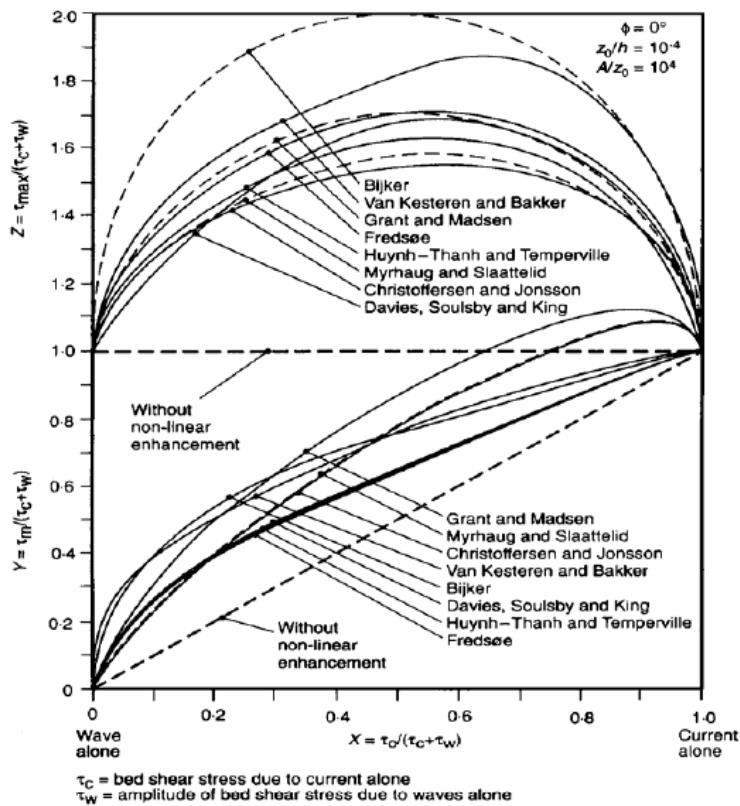

**Figure 3.5:** Inter-comparison of eight models for prediction of mean and maximum bed shear-stress due to waves and currents (from Soulsby et al. (1993b, Figure 17, p. 90))

with:

$$A = \frac{u_{orb}}{\omega}, \quad (3.85)$$

 $k_s$  is the Nikuradse roughness length-scale and  $\omega$  is the wave angular frequency.

As the bed is in rest and the equations are formulated in GLM co-ordinates, we must correct the bed shear-stress used in the momentum equations for the Stokes drift. The total or effective bed shear stress is given by:

$$\tau_b = \frac{|\tau_m|}{|U|} (U - U^S), \quad (3.86)$$

where the components of the depth-averaged Stokes drift  $U^S$  are given by Eqs. 3.72 and 3.73.

### 3.9 Assumptions underlying D-Flow FM

In D-Flow FM the 1D (transverse and depth-averaged), 2D (depth-averaged) or 3D (multi-layer) non-linear shallow water equations are derived from the three dimensional Navier-Stokes equations for incompressible free surface flow. The following assumptions and approximations are applied:

- ◇ The pressure is hydrostatic and the model is not capable of resolving the scales of short waves. Therefore, the basic equations are averaged in analogy with turbulence introducing so called radiation stresses.
- ◇ The effect of variable density is only taken into account in the pressure term (Boussinesq approximation).
- ◇ In a Cartesian frame of reference, the effect of the Earth curvature is not taken into account. Furthermore, the Coriolis parameter is assumed to be uniform unless specifically specified otherwise.
- ◇ In spherical co-ordinates the inertial frequency depends on the latitude.
- ◇ At the bed a slip boundary condition is assumed, a quadratic bed stress formulation is applied.
- ◇ The formulation for the enhanced bed shear-stress due to the combination of waves and currents is based on a 2D flow field, generated from the velocity near the bed using a logarithmic approximation.
- ◇ The equations of D-Flow FM are capable of resolving the turbulent scales (large eddy simulation), but usually the hydrodynamic grids are too coarse to resolve the fluctuations. Therefore, the basic equations are Reynolds-averaged introducing so-called Reynolds stresses. These stresses are related to the Reynolds-averaged flow quantities by a turbulence closure model.
- ◇ The eddy viscosity is an-isotropic. The horizontal eddy viscosity and diffusivity coefficients should combine both the effect of the 3D turbulent eddies and the horizontal motions that cannot be resolved by the horizontal grid. The horizontal eddy viscosity is generally much larger than the vertical eddy viscosity.
- ◇ For large-scale flow simulations, the tangential shear-stress at lateral closed boundaries can be neglected (free slip). In case of small-scale flow partial slip is applied along closed boundaries.
- ◇ For large-scale flow simulations, the horizontal viscosity terms are reduced to a bi-harmonic operator along co-ordinate lines. In case of small-scale flow the complete Reynold's stress tensor is computed. The shear-stress at the side walls is calculated using a logarithmic law of the wall.
- ◇ The drying and flooding procedure leads to a discontinuous movement of the closed boundaries at tidal flats.

- ◇ A continuity cell is set dry when all surrounding velocity points at the grid cell faces are dry or when the actual water depth at the cell centre is below zero (negative volume).
- ◇ The flux of matter through a closed wall and through the bed is zero.
- ◇ The effect of precipitation on the water temperature is accounted for.
- ◇ In the  $\sigma$  co-ordinate system, the immediate effect of buoyancy on the vertical flow is not considered. In D-Flow FM vertical density differences are taken into account in the horizontal pressure gradients and in the vertical turbulent exchange coefficients. So the application of D-Flow FM is restricted to mid-field and far-field dispersion simulations of discharged water.
- ◇ The boundary conditions for the turbulent kinetic energy and energy dissipation at the free surface and bed assume a logarithmic law of the wall (local equilibrium).
- ◇ In agreement with the aspect ratio for shallow water flow, the production of turbulence is based on the vertical (and not the horizontal) gradients of the horizontal flow. In case of small-scale flow (partial slip along closed boundaries), the horizontal gradients are included in the production term.
- ◇ Without specification of a temperature model, the heat exchange through the free surface is zero. The heat loss through the bed is always zero.
- ◇ If the total heat flux through the water surface is computed using a temperature excess model the exchange coefficient is a function of temperature and wind speed and is determined according to Sweers (1976). The natural background temperature is assumed constant in space and may vary in time. In the more advanced heat flux formulation the fluxes due to solar radiation, atmospheric and back radiation, convection, and heat loss due to evaporation are modeled separately.
- ◇ In the  $\sigma$  co-ordinate system the depth is assumed to be much smaller than the horizontal length scale. For such a small aspect ratio the shallow water assumption is valid, which means that the vertical momentum equation is reduced to the hydrostatic pressure relation. Thus, vertical accelerations are assumed to be small compared to the gravitational acceleration and are therefore not taken into account.
- ◇ In D-Flow FM the 3D turbulent eddies are bounded by the water depth. Their contribution to the vertical exchange of horizontal momentum and mass is modelled through a vertical eddy viscosity and eddy diffusivity coefficient (eddy viscosity concept). The coefficients are assumed to be proportional to a velocity scale and a length scale. The coefficients may be specified (constant) or computed by means of an algebraic,  $k-\tau$  or  $k-\varepsilon$  turbulence model, where  $k$  is the turbulent kinetic energy,  $\tau$  is the turbulent time scale and  $\varepsilon$  is the dissipation rate of turbulent kinetic energy.

## 4 Conceptual description of transport equation

### 4.1 Introduction

In D-Flow FM, transport is formulated as

$$\frac{d}{dt} \int_{V(t)} c \, dV + \int_{\partial V(t)} c(\mathbf{u} - \mathbf{v}) \cdot \mathbf{n} \, dS = \int_{\partial V(t)} (K \nabla c) \cdot \mathbf{n} \, dS + \int_{V(t)} s \, dV, \quad (4.1)$$

where  $V(t)$  is a three-dimensional control volume,  $c$  is a concentration,  $\mathbf{u}$  the flow velocity field,  $\mathbf{v}$  the velocity of the (vertically) moving control volume,  $K$  is a diagonal matrix  $K = \text{diag}(\kappa, \kappa, \kappa_z)$  with diffusion coefficients and  $s$  a source term. For two-dimensional (depth-averaged) flow, we obtain

$$\frac{\partial hc}{\partial t} + \nabla \cdot (h\mathbf{u}c) = \nabla \cdot (h\kappa \nabla c) + hs, \quad (4.2)$$

where  $h$  is the water depth. In case of three-dimensional (layer-averaged) flow, with  $\Delta z$  a layer thickness from  $z_0(x, y, t)$  to  $z_1(x, y, t)$ , we obtain

$$\begin{aligned} \frac{\partial \Delta z c}{\partial t} + \nabla \cdot (\Delta z \mathbf{u}c) + [\omega_{z_1} c]_{z=z_1} - [\omega_{z_0} c]_{z=z_0} = & \nabla \cdot (\Delta z \kappa \nabla c) + \\ \left[ \kappa_z \frac{\partial c}{\partial z} - \kappa \nabla z_1 \cdot \nabla c \right]_{z=z_1} - \left[ \kappa_z \frac{\partial c}{\partial z} - \kappa \nabla z_0 \cdot \nabla c \right]_{z=z_0} + \Delta z s, \end{aligned} \quad (4.3)$$

where by  $\mathbf{u}$  and  $\nabla$  still the horizontal components are meant, i.e.  $\mathbf{u} = (u, v)^T$  and  $\nabla = \left( \frac{\partial}{\partial x}, \frac{\partial}{\partial y} \right)^T$  and  $\kappa_z$  is the vertical diffusion coefficient. Furthermore  $\omega_{z_0}$  and  $\omega_{z_1}$  are the velocity component normal and relative to the moving  $z = z_0$  and  $z = z_1$  layer interfaces respectively. Note that taking  $c = 1$  yields

$$\omega_{z_1} + \frac{\partial z_1}{\partial t} = \omega_{z_0} - \nabla \cdot (\Delta z \mathbf{u}) + \frac{\partial z_0}{\partial t}, \quad (4.4)$$

which, combined with a zero-flux condition at the bed, recursively defines  $\omega_{z_0}$  and  $\omega_{z_1}$  for all layers.

We apply Equation (4.2) and Equation (4.3) to transport of

- ◇ salinity,
- ◇ temperature,
- ◇ suspended sediment,
- ◇ tracers,
- ◇ other, intentionally not mentioned,

and ultimately to the water itself (the continuity equation) to obtain the relative layer interface velocities as expressed by Equation (4.4).

### 4.2 Transport processes

Looking at the equations that govern transport of matter, we can identify three processes, namely advection, diffusion and sources/sinks. The next sections will describe the relevant user settings.

### 4.2.1 Advection

Advection of matter is expressed by the term  $\nabla \cdot (h\mathbf{u}c)$  in Equation (4.2) in the case of two-dimensional modelling.

Although not restricted to the advection of salinity only, the choices for *all* matter are set with keyword `limtypsa` in the mdu-file, for example

```
[numerics]
  limtypsa = 0           # first-order upwind, or
```

or

```
[numerics]
  limtypsa = 4           # Monotonized-central limiter
```

In three dimensions, we make a distinction between horizontal advection  $\nabla \cdot (\Delta z \mathbf{u}c)$  and vertical advection  $[\omega_{z1}c]_{z=z_1} - [\omega_{z0}c]_{z=z_0}$  in Equation (4.3). A higher-order numerical approximation of these terms can be obtained by setting their "limiter type" to an appropriate value. Setting the limiter type to "0" reduces the numerical approximation to a low-order upwind method (i.e. severe limiting).

In three-dimensional modelling horizontal advection is similarly as in two dimension, but now vertical advection can be selected with the keyword `verticalAdvectionType` in the mdu-file, i.e.

```
[numerics]
  verticalAdvectionType = centralImplicit            # central implicit advection scheme |
```

### 4.2.2 Diffusion

Diffusion of matter is expressed by the term  $\nabla \cdot (h\kappa\nabla c)$  for two-dimensional modelling and a similar and additional terms in three dimensions, see Equation (4.3).

Clearly, we have horizontal diffusivity  $\kappa_l$  and vertical diffusivity  $\kappa_z$ . The horizontal diffusivity  $\kappa$  is a summation of

- ◇ the molecular diffusivity  $\kappa_l$ . We use the following values:

$$\kappa_l = \begin{cases} \frac{1}{700}\nu_l, & \text{salt,} \\ \frac{1}{6.7}\nu_l, & \text{temperature,} \\ 0\nu_l, & \text{sediment,} \\ 0\nu_l, & \text{tracers,} \end{cases} \quad (4.5)$$

where  $\nu_l = 10^{-6} m^2/s$  is the kinematic viscosity,

- ◇ a background diffusivity, user-specified as
  - □ spatially varying values by horizontal diffusivity coefficient in the ext-file, or
  - □ a uniform value `Dicouv` in the mdu-file,

- ◇ a contribution from turbulent transport expressed as  $\nu_t/\sigma_t$ , where  $\nu_t$  is the eddy viscosity coefficient and  $\sigma_t$  is the turbulent Prandtl-Schmidt number for which the following values are used:

$$\sigma_t = \begin{cases} 0.7, & \text{salt,} \\ 0.7, & \text{temperature,} \\ 1.0, & \text{sediment,} \\ 1.0, & \text{tracers.} \end{cases} \quad (4.6)$$

Horizontal diffusion is turned off when  $\text{Dicow}=0$ .

*The user has to be aware of the following. The explicit nature of the horizontal diffusion terms in the time-integration method imposes a condition on the time step for numerical stability. Recall that we have a similar condition due to explicit horizontal advection. Although we always decrease the time step to satisfy the advection-related time step criterion, we do not do so for diffusion. Instead, diffusion is limited such that our time step is restricted by advection only, or by a user-specified maximum time step if it is smaller. For further details, consult Deltares (2026a).*

*Be aware that the modelled diffusion may be smaller than anticipated. However, the actual effective diffusion encountered may be (much) larger than anticipated due to numerical diffusion of the advection scheme.*

Not considering suspended sediment, and similar to the horizontal diffusivity, the vertical diffusivity  $\kappa_z$  is a summation of

- ◇ the molecular diffusivity  $\kappa_l$ , see Equation (4.5),
- ◇ a background vertical diffusivity, user-specified as a uniform value  $\text{Dicow}$  in the mdu-file, and
- ◇ a contribution from turbulent transport, similar to its horizontal counterpart, but with the horizontal viscosity coefficient now replaced by the vertical (eddy) viscosity coefficient.

Time integration is performed with a method that does not impose an additional constraint on the time step. Unlike horizontal diffusion which is limited to ensure numerical stability while maintaining the time-step size, vertical diffusion is *not* limited.

Vertical diffusion is turned off when, again not considering suspended sediment:

- ◇ if  $\text{Dicow}=0$ ,
- ◇ if the water depth is smaller than a threshold  $10^{-2} \text{ m}$ .

For the vertical diffusivity of suspended sediment, see Deltares (2026c).

#### 4.2.2.1 Time integration of horizontal diffusion

The advection and diffusion terms in the transport equation are integrated explicitly in time. However, for 2D models with large horizontal diffusion coefficients this will lead to a large reduction of the time step. Therefore, an implicit time integration scheme has been implemented for the horizontal diffusion term as well. To that purpose  $\text{TransportAutoTimestepdiff}$  has been introduced. Via  $\text{TransportAutoTimestepdiff} = 3$  the implicit time integration scheme is activated. The explicit time integration can be switched on via keyword  $\text{TransportAutoTimestepdiff} = 0$ . In this case the horizontal diffusion coefficient is

probably reduced in order to satisfy the time step condition for stability. If so, then the following message is written in the diagnostic file:

```
** INFO : Horizontal transport flux was limited for XX links.
```

with  $XX$  the number of links in which the horizontal diffusion coefficient has been reduced. Per time step, a warning message displays the number of flow links in which the horizontal diffusivity coefficient has been reduced. In order to prevent the diagnostic file becoming very large, the warning is shown a maximum of ten times. The following message is written to the diagnostic file at the end of the simulation:

```
** INFO : Viscosity coefficient/Horizontal transport flux were limited on some links in the course of computation.
```

Another approach is to apply `TransportAutoTimestepdiff = 1`. Then, the horizontal diffusion coefficient isn't reduced, but the time step is probably reduced in order to satisfy the stability condition. If so, then the simulation will require more computation time. Depending on the application the user should choose the most suitable for for keyword `TransportAutoTimestepdiff`.

The options described above represent so-called prognostic approaches, in which the transport quantities are updated at each time step. A different approach is so-called diagnostic modelling of transport processes. Then, the transport quantities aren't updated during the simulation. In this way, the initial conditions are being used and the transport concentrates are frozen during the simulation. In case of horizontal density gradients the pressure term is relevant for the computation of water levels. Via the diagnostic approach the density gradient is taken into account in a simplified way. This avoids a possibly time step reduction for the transport equation in case of large horizontal diffusion coefficients. The latter are often required in depth-averaged simulations for modelling of salinity intrusion of estuaries. We remark that in 3D this problem does not occur, because a turbulence closure model is applied and the horizontal diffusion coefficients are small. In summary, a prognostic modelling of transport processes is to be preferred, but in some applications, in particular in depth-averaged models with large horizontal diffusion coefficients, diagnostic modelling can be a work-around. The latter can be activitated via keyword `DiagnosticTransport=1`.

#### 4.2.3 Sources and sinks

Sources and sinks may be provided by an entry in the new ext-file as follows:

```
[SourceSink]
id                    = SourceSink_1
locationFile          = sourcesink01.pli
discharge            = sourcesink_flows.bc
salinityDelta         = sourcesink_changes.bc
...
```

##### Warning:

- ◊ Deprecated: Source-sinks could also be specified in the old `<*.ext>` file. This will become obsolete in an upcoming release and the example below is only kept for migration purposes.

```
quantity=discharge_salinity_temperature_sorsin
```

This simultaneously prescribes sources and sinks of

- ◇ water volume itself (i.e. discharge),
- ◇ salinity, and
- ◇ temperature, and.
- ◇ any other constituents that are transported.

See section 7.4.11 for more details.

#### 4.2.4 Forester filter

The vertical advection scheme in D-Flow FM 2D3D may cause nonphysical oscillations, or wiggles, especially near regions of large gradients. The user has the option to suppress vertical wiggles in salinity and temperature by using the Forester filter method. This filter also penalizes physically unstable stratification. The filter works in an iterative manner. The maximum number of iterations is controlled with the keywords `maxItVerticalForesterSal` and `maxItVerticalForesterTem` for salinity and temperature, respectively. By default both keywords are set to 0, which means that no vertical Forester filter is applied.

#### 4.3 Boundary and initial conditions for transport equation

The equations that govern transport of matter are complemented with boundary and initial conditions. We make the distinction between "horizontal" boundaries, that are either "open" or "closed", and vertical boundaries, only relevant for three-dimensional modelling.

##### 4.3.1 Open boundary conditions

At "horizontal" open boundaries the following boundary conditions are applied, with or without diffusion on the open boundary:

- ◇ salt, temperature and tracers:
  - □ inflow: user-specified Dirichlet condition,
  - □ outflow: homogeneous Neumann condition,
- ◇ suspended sediment: see Deltares (2026c).

Horizontal diffusive transport through open boundaries is switched on by default and can be switched off. The diffusive transport can be enabled or disabled by specifying the keyword `Diffusiononbnd` in the `mdu-file`, and is valid for all open boundary types. Enable diffusive transport on open boundaries (default)

```
[Numerics]
Diffusiononbnd=1
```

Disable diffusive transport on open boundaries

The user-specified Dirichlet conditions are supplied in the usual manner through the ext-file, for salt

```
quantity=salinitybnd
```

and for temperature

```
quantity=temperaturebnd
```

Boundaries conditions for multiple tracers may be defined by appending their name to the `tracerbnd` keyword, for example

```
quantity=tracerbndMY_FIRST_TRACER
```

and

```
quantity=tracerbndMY_SECOND_TRACER
```

When boundary conditions for transported constituents need to be prescribed using a three-dimensional distribution (e.g. for stratified flows), the user can provide 3D boundary conditions. This is described in section 10.5.

#### 4.3.2 Closed boundary conditions

At "horizontal" closed boundaries zero-flux conditions are applied.

#### 4.3.3 Vertical boundary conditions

At the "vertical" boundaries, i.e. at the bed and at the water surface, zero-flux conditions are applied, except for temperature that is, see chapter 5 for further details on that matter.

#### 4.3.4 Thatcher-Harleman boundary conditions

Consider (a part of) an open boundary where the flow reverts from outflowing to inflowing. According to section 4.3.1, at that very moment a Dirichlet condition becomes effective and a user-specified boundary value is prescribed. This value does in general not reflect the true condition at the boundary and causes a discontinuous temporal behaviour. The so-called Thatcher-Harleman boundary condition is intended to regularize this behaviour. The actual value applied at the boundary is smoothly transformed from the last value under outflow conditions to the user-specified value under inflow conditions within a user-specified *return time*, which has to be specified in seconds. This return time is prescribed with the keyword `return_time` in the "new style" external forcings file for boundary condition, for example

```
locationfile = tfl_01.pli
forcingfile = tfl.bc
return_time = 250
```

See [Appendix C.6](#) for more details on this format.

#### 4.3.5 Initial conditions

We will only consider initial conditions for salinity, temperature and tracers. For initial sediment concentrations, see [Deltares \(2026c\)](#).

Initial conditions are specified in three possible ways, namely

- ◇ a horizontally spatially varying field in the usual way through the external forcings file,
- ◇ a vertical profile in three dimensions, horizontally uniformly distributed, for salinity and temperature only in the external forcings file, and
- ◇ uniform values for salinity and temperature in the mdu-file.

In the external forcings file we have

```
[Spatial]
quantity                    = initialsalinity
```

for the initial salinity, and

```
[Spatial]
quantity                    = initialsalinitytop
```

for the initial salinity in the top layer in case of three-dimensional modelling. When specified, the initial salinity field is linearly distributed from the "initialsalinity" in the lowest layer to the "initialsalinitytop" in the top layer. When *not* specified, the initial salinity field is vertically uniformly distributed.

The initial temperature field is prescribed with

```
[Spatial]
quantity                    = initialtemperature
```

which in three dimensions is vertically uniformly distributed.

A horizontally uniformly distributed vertical profile of salinity and temperature can be prescribed with `initialverticalsalinityprofile` and `initialverticaltemperatureprofile` respectively, for example for salinity

```
[Spatial]
quantity                    = initialverticalsalinityprofile
dataFile                    = inisal.pli
dataFileType               = polygon
interpolationMethod        = constant
```

**Warning:**

- ◇ Deprecated: The old external forcing file is being deprecated. The example below is kept only for migration purposes:

```
QUANTITY=initialverticalsalinityprofile
FILENAME=inisal.pli
FILETYPE=10
METHOD=4
OPERAND=0
```

The polyline file contains ( $z$ , salinity) value pairs, where  $z$  is the vertical coordinate in meters. For example for linearly varying salinity from 30 to 20  $ppt$  from  $-10$  to 0  $m$ :

The initial field of an arbitrary number of tracers are prescribed in the same way, except for the user-specified tracername that is added to the keyword `initialtracer`, similar to the tracer boundary conditions, for example

```
[Spatial]
quantity=initialtracerMY_FIRST_TRACER
```

and

```
[Spatial]
quantity=initialtracerMY_SECOND_TRACER
```

Default values for salinity and temperature are defined in the mdu-file with `Initialsalinity` and `Initialtemperature` respectively.

#### 4.4 Introduction to sediment transport

**Note:** Sediment transport in 3D modelling is of TRL level 4-6 (prototype), with the definitions of the Technical Technology Readiness Levels (TRL) in Section 2.7.


The sediment transport and morphology module supports both bedload and suspended load transport of non-cohesive sediments and suspended load of cohesive sediments. For schematisation we distinguish "mud" (cohesive suspended load transport), "sand" (non-cohesive bedload and suspended load transport) and "bedload" (non-cohesive bedload only or total load transport) fractions. For a detailed description we refer to [Deltares \(2026c\)](#).

## 5 Conceptual description of heat flux models

This chapter has a lot of similarities with the Delft3D-FLOW manual. The difference is that in Delft3D-FLOW five heat flux models are implemented, whereas in D-Flow FM only two models are implemented. These are the most complete heat flux model, the so called Composite heat flux model (i.e. the Ocean heat flux model nr 5 in Delft3D-FLOW) and the most simple model, the Excess temperature model (model nr 3 in Delft3D-FLOW). In D-Flow FM, the parameter that sets the temperature model is called Temperature in the mdu-file. We kept the numbering of Delft3D-FLOW. When specifying Temperature=1, the temperature is taken into account in the transport solver and in the equation of state, but heat fluxes through the water surface are not taken into account. This may be useful when mixing is the primary factor that determines the temperature distribution.

The heat radiation emitted by the sun reaches the earth in the form of electromagnetic waves with wavelengths in the range of 0.15 to 4  $\mu\text{m}$ . In the atmosphere the radiation undergoes scattering, reflection and absorption by air, cloud, dust and particles. On average neither the atmosphere nor the earth accumulates heat, which implies that the absorbed heat is emitted back again. The wavelengths of these emitted radiations are longer (between 4 and 50  $\mu\text{m}$ ) due to the lower prevailing temperature in the atmosphere and on Earth. Schematically the radiation process, along with the heat flux mechanisms at the water surface, is shown in Figure 5.1.

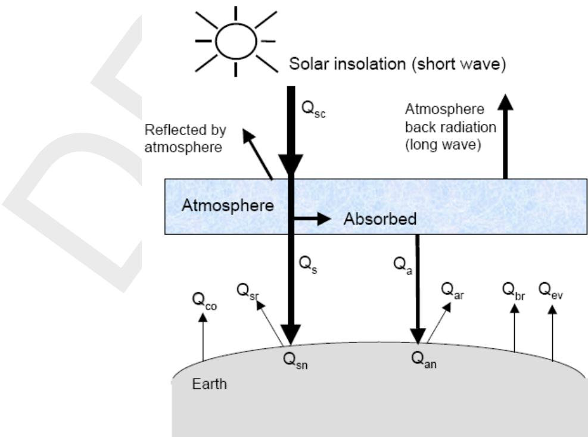

**Figure 5.1:** Overview of the heat exchange mechanisms at the surface

Legend for Figure 5.1:

| $Q_{sc}$ | radiation (flux) for clear sky condition in $[\text{J/m}^2\text{s}]$ |
|----------|----------------------------------------------------------------------|
| $Q_{co}$ | heat loss due to convection (sensible) in $[\text{J/m}^2\text{s}]$   |
| $Q_{sr}$ | reflected solar radiation in $[\text{J/m}^2\text{s}]$                |
| $Q_s$    | solar radiation (short wave radiation) in $[\text{J/m}^2\text{s}]$   |
| $Q_{sn}$ | net incident solar radiation (short wave), $= Q_s - Q_{sr}$          |

| $Q_a$    | atmospheric radiation (long wave radiation) in $[\text{J/m}^2\text{s}]$ |
|----------|-------------------------------------------------------------------------|
| $Q_{an}$ | net incident atmospheric radiation (long wave)                          |
| $Q_{ar}$ | reflected atmospheric radiation in $[\text{J/m}^2\text{s}]$             |
| $Q_{br}$ | back radiation (long wave radiation) in $[\text{J/m}^2\text{s}]$        |
| $Q_{ev}$ | heat loss due to evaporation (latent) in $[\text{J/m}^2\text{s}]$       |

In D-Flow FM the heat exchange at the free surface is modeled by taking into account the separate effects of solar (short wave) and atmospheric (long wave) radiation, and heat loss due to back radiation, evaporation and convection. The heat losses due to evaporation and convection are functions of the wind speed. In absence of wind, these terms become zero. However, since water vapor is lighter than air, water may be cooled by evaporation and convection even in a no wind situation. The terms are called  $Q_{evfree}$  and  $Q_{cofree}$  respectively.

### **Excess temperature model - heat flux model 3**

In the Excess temperature model the heat exchange flux at the air-water interface is computed based upon the prescribed background air temperature, the computed water temperature of the top layer and the prescribed wind speed. This relatively simple model is sometimes used in intake-outfall design studies. It can be applied when the temperature mixing process itself is more relevant than the actual heat loss through the air water interface. The applied heat exchange coefficient is mainly a function of the windspeed and water surface temperature.

The excess temperature model 3 is based on Sweers (1976), the heat exchange flux is represented by a bulk exchange formula:

$$Q_{tot} = -\lambda (T_s - T_{back}), \quad (5.1)$$

with  $T_s$  the water temperature at the free surface and  $T_{back}$  the natural background temperature, both in  $^\circ\text{C}$ .

The heat exchange coefficient  $\lambda$  is a function of the surface temperature  $T_s$  and the wind speed  $U_{10}$ . It is derived by linearization of the exchange fluxes for back radiation, evaporation and convection. The following relation was derived by Sweers (1976):

$$\lambda = 4.48 + 0.049T_s + f(U_{10}) (1.12 + 0.018T_s + 0.00158T_s^2). \quad (5.2)$$

### **Composite - heat flux model 5**

The heat flux model 5 following Gill (1982) and Lane (1989) was calibrated for the North Sea and successfully applied for great lakes.

In the Composite heat flux model, the relative humidity in  $[\%]$ , air temperature in  $[^\circ\text{C}]$  and cloudiness in  $[\%]$  are prescribed.

These quantities may be either uniform or specially varying. In the external forcingsfile one may have:

```
QUANTITY =humidity_airtemperature_cloudiness
FILENAME =meteo.hac
FILETYPE =6
METHOD =3
OPERAND =0
```

The effective back radiation and the heat losses due to evaporation and convection are computed by the model. Additionally, when air and water densities and/or temperatures are such

that free convection occurs, free convection of latent and sensible heat is computed by the model.

In general, solar radiation is computed based upon time of day, position on earth and cloudiness. However, if solar radiation has been measured, it can also be prescribed via the solar radiation (in  $[W/m^2]$ ) according to:

```
QUANTITY =humidity_airtemperature_cloudiness_solarradiation
FILENAME =meteo.hacs
FILETYPE =6
METHOD    =3
OPERAND   =0
```

We remark that the solar radiation doesn't contain the correction factor ( $1 - albedo$ ). Thus, the solar radiation values prescribed by the user will be multiplied by this factor.

In both heat flux models, the wind forcing may be uniform or spatially varying.

If wind is uniform, the wind speed and direction are prescribed, wind speed is in m/s, and direction follows nautical convention: 0 means wind coming from North, 90 means wind is coming from East. In the external forcings file specify, e.g.:

```
QUANTITY=windxy
FILENAME=zeg99-10.wnd
FILETYPE=2
METHOD=1
OPERAND=0
```

If wind is spatially varying, the air pressure is also prescribed:

```
QUANTITY =airpressure_windx_windy
FILENAME =CSM_2015.apwxwy
FILETYPE =6
METHOD    =3
OPERAND   =0
```

Air pressure is in  $[Pa]$ , wind  $x$ - and  $y$ -components are given  $[m/s]$ .

For the physical background of the heat exchange at the air-water interface and the definitions, we refer to Sweers (1976) for the Excess temperature model (Temperature=3), and to Gill (1982) and Lane (1989) for the Ocean heat flux model (Temperature=5).

### 5.1 Heat balance

The total heat flux through the free surface reads:

$$Q_{tot} = Q_{sn} + Q_{an} - Q_{br} - Q_{ev} - Q_{co} - Q_{ev free} - Q_{co free}, \quad (5.3)$$

with:

$$Q_{sn} \quad \text{net incident solar radiation (short wave)}$$

| $Q_{an}$     | net incident atmospheric radiation (long wave)        |
|--------------|-------------------------------------------------------|
| $Q_{br}$     | back radiation (long wave)                            |
| $Q_{ev}$     | evaporative heat flux (latent heat)                   |
| $Q_{co}$     | convective heat flux (sensible heat)                  |
| $Q_{evfree}$ | evaporative heat flux (free convection latent heat)   |
| $Q_{cofree}$ | convective heat flux (free convection sensible heat). |

The subscript  $n$  refers to a net contribution. Each of the heat fluxes in Equation (5.3) will be discussed in detail.

The change in temperature in the top layer  $T_s$  [°C] is given by:

$$\frac{\partial T_s}{\partial t} = \frac{Q_{tot}}{\rho_w c_p \Delta z_s}, \quad (5.4)$$

where  $Q_{tot}$  [J/m<sup>2</sup>s] is the total heat flux through the air-water surface,  $c_p$  (= 3930 J/kg<sup>-1</sup> K) is the specific heat capacity of sea water,  $\rho_w$  is the specific density of water [kg/m<sup>3</sup>] and  $\Delta z_s$  [m] is the thickness of the top layer. As in Delft3D-FLOW, the heat exchange at the bed is assumed to be zero. This may lead to over-prediction of the water temperature in shallow areas. Also the effect of precipitation on the water temperature is not taken into account.

**Remarks:**

- ◇ The temperature  $T$  is by default expressed in °C. However, in some formulas the absolute temperature  $\bar{T}$  in K is used. They are related by:

$$\bar{T} = T + 273.15. \quad (5.5)$$

- ◇ In Equation (5.4) the total incoming heat flux is absorbed with exponential decay as a function of depth. See the parameter Secchi-depth in the mdu-file.

**5.2 Solar radiation**

The short-wave radiation emitted by the sun that reaches the earth surface under a clear sky condition can be evaluated by means of:

- ◇ Applying Stefan-Boltzmann's law for radiation from a black-body:

$$Q = \sigma \bar{T}^4 \quad (5.6)$$

with  $\sigma$  = Stefan-Boltzmann's constant =  $5.67 \times 10^{-8}$  J/(m<sup>2</sup>s K<sup>4</sup>) and  $\bar{T}$  the (absolute) temperature in K.

- ◇ Direct measurements.

The incoming short-wave solar radiation through a clear sky at ground level  $Q_{sc}$  is about 0.76 of the flux incident at the top of the atmosphere (Gill, 1982):

$$Q_{sc} = \begin{cases} 0.76 S \sin(\gamma), & \sin(\gamma) \geq 0, \\ 0.0, & \sin(\gamma) < 0. \end{cases} \quad (5.7)$$

The solar constant  $S = 1.368$  J/(m<sup>2</sup>s) or W/m<sup>2</sup>. This is the average energy flux at the mean radius of the Earth.

The incoming energy flux at the water surface depends on the angle (declination) between the incoming radiation and the Earth's surface. This declination depends on the geographical

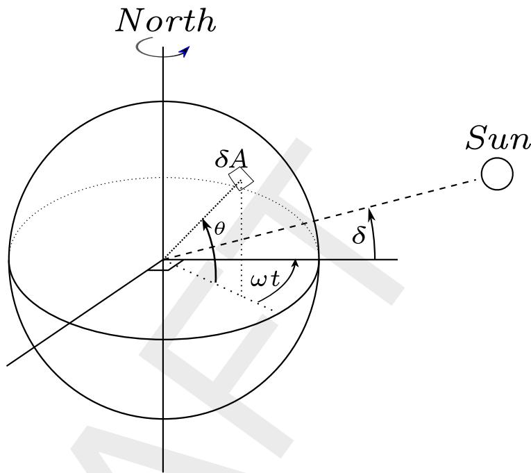

**Figure 5.2:** Co-ordinate system position Sun  
 $\delta$ : declination;  $\theta$ : latitude;  $\omega t$ : angular speed

position on the Earth and the local time. The Earth axis is not perpendicular to the line connecting the Sun with Earth. This tilting (angle  $\delta$ ) varies with the time of the year and it leads to a seasonal variation of the radiation flux. At June 21, the declination is maximal, 23.5 degrees. Of course, by the rotation of the Earth the solar radiation also varies during the day. Near twelve o'clock local time, the sun elevation above the horizon is maximal. For an overview of the angles used to determine the solar elevation angle  $\gamma$ , see Figure 5.2.

The temporal and latitude-dependent solar elevation angle  $\gamma$  is estimated by:

$$\sin(\gamma) = \sin(\delta) \sin\left(\frac{\pi\phi}{180}\right) - \cos(\delta) \cos\left(\frac{\pi\phi}{180}\right) \cos(\omega_1 t) \quad (5.8)$$

with:

$$\delta = \frac{23.5\pi}{180} \cos(\omega_0 t - 2.95), \quad (5.9)$$

where  $\omega_0$  is the frequency of the annual variation and  $\omega_1$  the frequency of the diurnal variation;  $\phi$  is the latitude.

A part of the radiation that reaches the water surface is reflected. The fraction reflected or scattered (surface albedo) is dependent on latitude and season. Additionally, cloud cover will reduce the magnitude of the radiation flux that reaches the sea surface. The cloudiness is expressed by a cloud cover fraction  $F_c$ , the fraction of the sky covered by clouds. The correction factor for cloud cover is an empirical formula. The absorption of solar radiation is calculated (Gill, 1982) as the product of the net downward flux of short wave-radiation in cloudless conditions and factors correcting for reflection and cloud cover:

$$Q_{sn} = Q_s - Q_{sr} = (1 - \alpha) Q_{sc} (1.0 - 0.4F_c - 0.38F_c^2), \quad (5.10)$$

| $Q_{sn}$ | net heat radiation (flux) from the Sun                             |
|----------|--------------------------------------------------------------------|
| $Q_s$    | solar radiation (short wave radiation) in $[\text{J/m}^2\text{s}]$ |
| $Q_{sr}$ | reflected solar radiation in $[\text{J/m}^2\text{s}]$              |
| $Q_{sc}$ | radiation (flux) for clear sky condition                           |
| $\alpha$ | albedo (reflection) coefficient ( $=0.06$ )                        |
| $F_c$    | fraction of sky covered by clouds (user-defined input)             |

Finally, not all of the radiation is absorbed at the water surface. A part is transmitted to deeper water. Short waves can penetrate over a distance of 3 to 30 meters, depending on the clarity of the water, while the relatively longer waves are absorbed at the surface. The Secchi depth  $H_{Secchi}$  (m), is a measure of the transparency of the water.

The formulation for the (remaining) under-water light in the water column ( $\text{W/m}^2$ ) is based on the so-called Lambert-Beer Law, which can be derived from the following linear first-order ordinary differential equation (ODE):

$$\frac{dQ_{sn}}{dz} = -\gamma Q_{sn}, \quad (5.11)$$

with  $\gamma$  the extinction coefficient ( $1/\text{m}$ ). The total extinction coefficient of visible light  $\gamma$  determines the visibility of a Secchi disk under water. The following approximation is used for the relation between  $\gamma$  and Secchi depth  $H_{Secchi}$ :

$$\gamma = \frac{1.7}{H_{Secchi}} \quad (5.12)$$

The Secchi depth is prescribed by the user at input (normal values are in the range from 2 to 30 meter). This results in an exponential function of the distance  $z$  from the water surface for the visible light (remaining) in the water column, the Lambert-Beer law (assuming constant  $\gamma$ ):

$$Q_{sn}(z) = e^{-\gamma z} Q_{sn}^0, \quad (5.13)$$

with:

| $Q_{sn}^0$ | the incoming nett solar radiation $Q_{sn}$ that reaches the water surface                                                           |
|------------|-------------------------------------------------------------------------------------------------------------------------------------|
| $\gamma$   | extinction coefficient (measured) in $\text{m}^{-1}$ , also related to the so-called Secchi-depth $\gamma = \frac{1.7}{H_{Secchi}}$ |
| $z$        | distance to the water surface in meters.                                                                                            |

The vertical coordinate  $z$  in Equation (5.13) is the distance to the water surface in meters. The absorbed flux of light ( $\text{W/m}^2$ ) in an internal computational layer  $k$  with coordinate  $z_{top}$  (upper vertical interface of the cell) and  $z_{bot}$  (lower vertical interface of the cell) is given by:

$$Q_{sn}(k) = Q_{sn}(z_{top}) - Q_{sn}(z_{bot}) \quad (5.14)$$

$$= (e^{-\gamma z_{top}} - e^{-\gamma z_{bot}}) Q_{sn}^0 \quad (5.15)$$

Secchi disc measurements are, by nature of the observation method, a good proxy for the penetration of visible light in water. The penetration of visible light depends on the composition of the water (suspended and dissolves substances). The penetration of near-infrared ( $> 700$  nm) light depends on water only, not on its composition. The Secchi depth is, therefore, not a good proxy for the penetration depth of near-infrared light. For that reason, we implemented the option to incorporate the penetration of solar radiation in the water column using a blend of two Lambert-Beer Law profiles, based on the work of Wunderlich (1972). This option requires a user-defined ratio  $\beta$  ( $0 \leq \beta \leq 1$ ), which determines the portion of incoming solar

radiation in the near-infrared spectrum, which is absorbed near the free-surface. The user can prescribe the thickness of this near-surface layer, i.e. a 'shallow' Secchi depth  $H_{Secchi2}$ . The rest ( $1 - \beta$ ) is the visible light, absorbed with the (normal) user defined Secchi-depth  $H_{Secchi}$ .

Using this approach, the nett incoming solar radiation (after reduction through cloud coverage and surface reflection using the Albedo coefficient) is split into two contributions:

- $\diamond$   $\beta Q_{sn}$ , the near-infrared wave portion, which is absorbed at the surface ( $H_{Secchi2}$ ) and
- $\diamond$   $(1 - \beta) Q_{sn}$ , the remainder part, which is absorbed in deeper water ( $H_{Secchi}$ ).

Finally, the absorbed flux of light (W/m<sup>2</sup>) in an internal computational layer  $k$  is then given by:

$$Q_{sn}(k) = ((1 - \beta) (e^{-\gamma_{ztop}} - e^{-\gamma_{zbot}}) + \beta (e^{-\gamma_{ztop}} - e^{-\gamma_{zbot}})) Q_{sn}^0 \quad (5.16)$$

with:  $\gamma_2$  the 'shallow' extinction coefficient (measured) in m<sup>-1</sup>, related to the 'shallow' Secchi-depth  $\gamma_2 = \frac{1.7}{H_{Secchi2}}$ 

In the mdu-file, the user can switch on this functionality by specifying the  $H_{Secchi2}$  and  $\beta$  using the following keywords:

- $\diamond$   $H_{Secchi2}$  using SecchidepthNonPenetrative and
- $\diamond$   $\beta$  using SecchidepthNonPenetrativeFraction (with  $0 \leq \beta \leq 1$ ).


**Note:** It should be noted, that the term 'shallow' Secchi depth is formally not appropriate, since a Secchi disk would not be visible in infrared light, but we stick to the same naming to clarify users that the two depths  $H_{Secchi}$  and  $H_{Secchi2}$  are related.

### 5.3 Atmospheric radiation (long wave radiation)

Atmospheric radiation is primarily due to emission of absorbed solar radiation by water vapour, carbon dioxide and ozone in the atmosphere. The emission spectrum of the atmosphere is highly irregular. The amount of atmospheric radiation that reaches the earth is determined by applying the Stefan-Boltzmann's law that includes the emissivity coefficient of the atmosphere  $\varepsilon$ . Taking into account the effect of reflection by the surface and reflection and absorption by clouds, the relation for the net atmospheric radiation  $Q_{an}$  reads (Octavio *et al.*, 1977):

$$Q_{an} = (1 - r) \varepsilon \sigma \bar{T}_a^4 g(F_c), \quad (5.17)$$

where  $\bar{T}_a$  is the air temperature (in K) and the reflection coefficient  $r = 0.03$ . The emissivity factor of the atmosphere  $\varepsilon$  may depend both on vapour pressure and air temperature. The emissivity of the atmosphere varies between 0.7 for clear sky and low temperature and 1.0. The presence of clouds increases the atmospheric radiation. This is expressed in the cloud function  $g(F_c)$ .

with  $T_a$  the air temperature (in °C). The cloud function  $g(F_c)$  in Equation (5.17) is given by:

$$g(F_c) = 1.0 + 0.17 F_c^2 \cdot 2 - 9 \quad (5.18)$$

The linearisation of Equation (5.17) is carried out around  $T_a = 15$  °C.

#### Remark:

- $\diamond$  The atmospheric radiation is part of the total long-wave radiation flux, the so-called effective back radiation, see section 5.5.

**5.4 Back radiation (long wave radiation)**

Water radiates as a near black body, so the heat radiated back by the water can be described by Stefan-Boltzmann's law of radiation, corrected by an emissivity factor  $\epsilon = 0.985$  of water (Sweers, 1976; Octavio *et al.*, 1977) and the reflection coefficient for the air-water interface  $r = 0.03$ :

$$Q_{br} = (1 - r) \epsilon \sigma \bar{T}_s^4, \quad (5.19)$$

with  $\bar{T}_s$  the (absolute) water surface temperature in K.

**5.5 Effective back radiation**

The total net long wave radiation flux is computed. This is called the effective back radiation:

$$Q_{eb} = Q_{br} - Q_{an}. \quad (5.20)$$

The atmospheric radiation depends on the vapour pressure  $e_a$ , see section 5.6, the air temperature  $T_a$  and the cloud cover  $F_c$ . The back radiation depends on the surface temperature  $T_s$ .

The effective back radiation  $Q_{eb}$  is computed following:

$$Q_{eb} = \epsilon \sigma \bar{T}_s^4 (0.39 - 0.05\sqrt{e_a}) (1.0 - 0.6F_c^2), \quad (5.21)$$

with the actual vapour pressure  $e_a$  given by Equation (5.26).

**5.6 Evaporative heat flux**

Evaporation is an exchange process that takes place at the interface between water and air and depends on the conditions both in the water near the surface and the air above it. The evaporation depends on meteorological factors (wind-driven convection) and vapour pressures.

**Forced convection of latent heat**

The latent heat flux due to forced convection for the ocean heat flux model reads:

$$Q_{ev,forced} = L_V \rho_a f (U_{10}) \{q_s (T_s) - q_a (T_a)\}, \quad (5.22)$$

with  $q_s$  and  $q_a$  the specific humidity of respectively saturated air and remote air (10 m above water level):

$$q_s (T_s) = \frac{0.62e_s}{P_{atm} - 0.38e_s}, \quad (5.23)$$

$$q_a (T_a) = \frac{0.62e_a}{P_{atm} - 0.38e_a}. \quad (5.24)$$

The saturated and remote vapour pressures  $e_s$  and  $e_a$  are given by:

$$e_s = 10^{\frac{0.7859+0.03477T_s}{1.0+0.00412T_s}}, \quad (5.25)$$

$$e_a = r_{hum} 10^{\frac{0.7859+0.03477T_a}{1.0+0.00412T_a}}. \quad (5.26)$$

With  $L_v$  the latent heat of vaporisation in J/kg water:

$$L_v = 2.5 \cdot 10^6 - 2.3 \cdot 10^3 T_s. \quad (5.27)$$

The wind function in Equation (5.22) is defined as:

$$f(U_{10}) = c_e U_{10}, \quad (5.28)$$

The default value for the Dalton number  $c_e$  in the Composite heat flux model reads  $c_e = 0.0013$ . This value should be close to the  $C_d$  coefficient that is used in the computation of wind stresses. The exchange coefficients of latent heat and momentum transfer are closely related. Specifying a negative Dalton number in the mdu file forces the use of the specified  $C_d$  coefficient, thus taking into account the specified dependency between windspeed and the  $C_d$  coefficient.

Here  $r_{hum}$  is the relative humidity in [-].

**Remark:**

- ◇ The relative humidity  $r_{hum}$  is specified in the input files in percentages.

For the excess temperature model, the wind speed function  $f(U_{10})$  following Sweers (1976) is used:

$$f(U_{10}) = (3.5 + 2.0U_{10}) \left( \frac{5.0 \times 10^6}{S_{area}} \right)^{0.05}, \quad (5.29)$$

where  $S_{area}$  is the exposed water surface in  $m^2$ , defined in the input and fixed for the whole simulation. The coefficients calibrated by Sweers were based on the wind speed at 3 meter above the free surface; the coefficients in Equation (5.29) are based on the wind speed 10 meter above the water level.

**Free convection of latent heat**

Loss of heat due to evaporation occurs not only by forced convection, wind driven, but also by free convection. Free convection is driven by buoyant forces due to density differences (by temperature and/or water vapour content) creating unstable conditions in the atmospheric boundary layer. Evaporation due to free convection is important in circumstances where inverse temperature/density gradients are present and wind speeds are almost negligible so that the amount of forced convection is small. Neglecting free convection in this situation will lead to underestimating the heat loss. (Ryan *et al.*, 1974) developed a correction to the wind function, accounting for free convection. The derivation of evaporation by just free convection is based on the analogy of heat and mass transfer.

The latent heat flux due to free convection reads:

$$Q_{ev,free} = k_s L_v \bar{\rho}_a (q_s - q_a), \quad (5.30)$$

with the average air density:

$$\bar{\rho}_a = \frac{\rho_{a0} + \rho_{a10}}{2}, \quad (5.31)$$

and with the heat transfer coefficient defined as:

$$k_s = \begin{cases} 0 & \text{if } \rho_{a10} - \rho_{a0} \leq 0 \\ c_{fr.conv} \left\{ \frac{g\alpha^2}{\nu_{air} \rho_a} (\rho_{a10} - \rho_{a0}) \right\}^{1/3} & \text{if } \rho_{a10} - \rho_{a0} > 0 \end{cases} \quad (5.32)$$

where the coefficient of free convection  $c_{fr.conv}$  was calibrated to 0.14 (Ryan *et al.*, 1974). This coefficient can be adjusted by the user via MDU keyword [physics] freeConvectionCoefficient. The viscosity of air  $\nu_{air}$  is assumed to have the constant value  $16.0 \times 10^{-6} \text{ m}^2/\text{s}$ . The molecular diffusivity of air  $\alpha \text{ m}^2/\text{s}$  is defined as

$$\alpha = \frac{\nu_{air}}{\sigma}, \quad (5.33)$$

with  $\sigma = 0.7$  (for air) the Prandtl number. In Equation (5.30), the saturated air density is given by:

$$\rho_{a0} = \frac{\frac{100P_{atm}-100e_s}{R_{dry}} + \frac{100e_s}{R_{vap}}}{T_s + 273.15}, \quad (5.34)$$

the remote air density (10 m above the water level):

$$\rho_{a10} = \frac{\frac{100P_{atm}-100e_a}{R_{dry}} + \frac{100e_a}{R_{vap}}}{T_{air} + 273.15}, \quad (5.35)$$

where  $R_{dry}$  is the gas constant for dry air: 287.05 J/(kg K) and  $R_{vap}$  is the gas constant for water vapour: 461.495 J/(kg K). The specific humidity of respectively saturated air and remote air (10 m above the water level),  $q_s$  and  $q_a$  are given by Equation (5.23) and Equation (5.24). The saturated and remote vapour pressure  $e_s$  and  $e_a$  are defined in Equation (5.25) and Equation (5.26).

The total heat flux due to evaporation then results from adding the forced convection of latent heat in Equation (5.22) and the free convection of latent heat in Equation (5.30):

$$Q_{ev} = Q_{ev,forced} + Q_{ev,free}. \quad (5.36)$$

## 5.7 Convective heat flux

In the Ocean heat flux model, the convective heat flux is split into two parts, just as the evaporative heat flux. The convective heat flux is divided into a contribution by forced convection and a contribution by free convection.

### Forced convection of sensible heat

The sensible heat flux due to forced convection is computed by:

$$Q_{co,forced} = \rho_a c_p g (U_{10}) (T_s - T_a), \quad (5.37)$$

with  $c_p$  the specific heat of air. It is considered constant and taken to be  $1.004.0 \text{ J/(kg K)}$ . The wind-speed function  $g (U_{10})$  is defined following Gill (1982):

$$g (U_{10}) = c_H U_{10}, \quad (5.38)$$

with  $c_H$  the so-called Stanton number. The default value of the Stanton number reads  $c_H = 0.0013$ .

### Free convection of sensible heat

$$Q_{co,free} = k_s \bar{\rho}_a c_p (T_s - T_a), \quad (5.39)$$

with the heat transfer coefficient  $k_s$  given by Equation (5.32).

The total heat flux due to convection then results from adding the forced convection of sensible heat in Equation (5.37) and the free convection of sensible heat in Equation (5.39):

$$Q_{co} = Q_{co,forced} + Q_{co,free}. \quad (5.40)$$

DRAFT

## 6 Getting started with Graphical User Interface

### 6.1 Introduction

This chapter gives an overview of the basic features of the D-Flow FM User Interface and will guide you through the main steps to set up a D-Flow FM model. For a more detailed description of the GUI features you are referred to [chapter 7](#). For technical documentation you are referred to [Deltares \(2026a\)](#).

### 6.2 Overview of D-Flow FM GUI

When you start the application for the first time the lay-out might look like Figure 6.1. The basic lay-out consists of the following items:

- ❖ *Ribbon* - top
- ❖ **Project** window - up left
- ❖ The central window, containing the *Start Page*
- ❖ **Messages** and **Time Navigator** window - down centre
- ❖ **Toolbox, Chart, Region, Map** and **Operations** window - to the right
- ❖ **Properties** window - down left

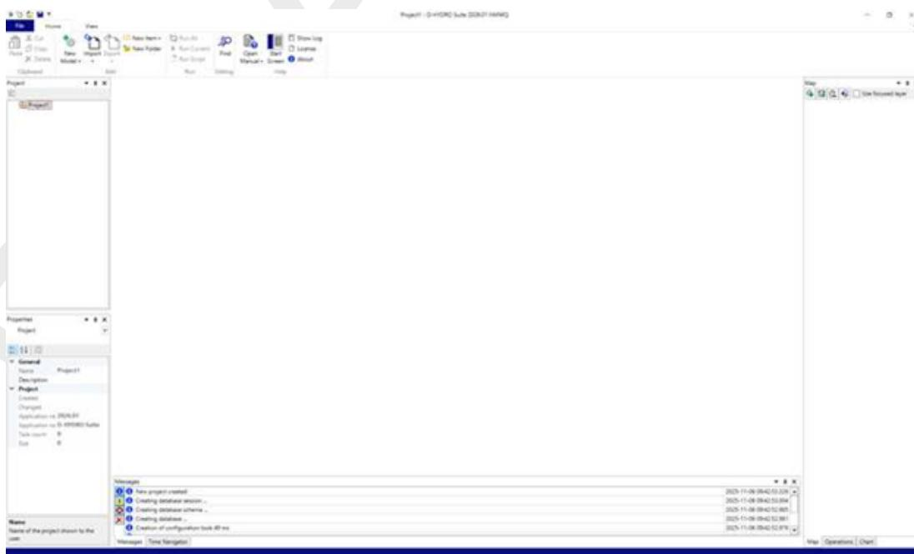

**Figure 6.1:** Start-up lay-out D-Flow FM User Interface

All the windows can be customized/hidden according to your own preferences.

These settings will be automatically saved for the next time you start the application.

The most important windows for the D-Flow FM plugin are the **Project, Map, Messages, Time Navigator** and **Properties** windows. The central window displays the **Start Page**. Here the *Map view* or specific editors will be displayed.

## 6.2.1 Project window

After adding or importing a D-Flow FM model (see section 6.5.1 and section 6.5.2), the *Project* window will be extended with D-Flow FM specific features (see Figure 6.2). The *Project* window provides you with the basic steps to set up a D-Flow FM model.

The *Project* window consists of the following features:

| <i>General</i>              | general model information such as depth layer specification, model coordinate system and angle of latitude and longitude |
|-----------------------------|--------------------------------------------------------------------------------------------------------------------------|
| <i>Area</i>                 | geographical (GIS based) features, such as observation points, structures, dry points and land boundaries                |
| <i>Grid</i>                 | computational grid                                                                                                       |
| <i>Bed Level</i>            | model bed level                                                                                                          |
| <i>Time Frame</i>           | model time frame and time step                                                                                           |
| <i>Processes</i>            | active physical processes in the model such as salinity, temperature, wind and tide generating forces                    |
| <i>Initial Conditions</i>   | initial conditions for water levels and other physical processes                                                         |
| <i>Boundary Conditions</i>  | model boundaries and boundary condition specification                                                                    |
| <i>Physical Parameters</i>  | physical settings for processes such as roughness, viscosity, wind and temperature                                       |
| <i>Sources and Sinks</i>    | location and time series specification for point sources and sinks                                                       |
| <i>Numerical Parameters</i> | numerical simulation settings                                                                                            |
| <i>Output Parameters</i>    | output specification                                                                                                     |
| <i>Output</i>               | output after running the simulation                                                                                      |

Upon clicking the items in the *Project* window the corresponding tab (in case of non-geographic model settings), attribute table (in case of geographic model settings) or editor view (in case of advanced editing options) will open in the central window. Using the right mouse button gives options such as importing/exporting model data.

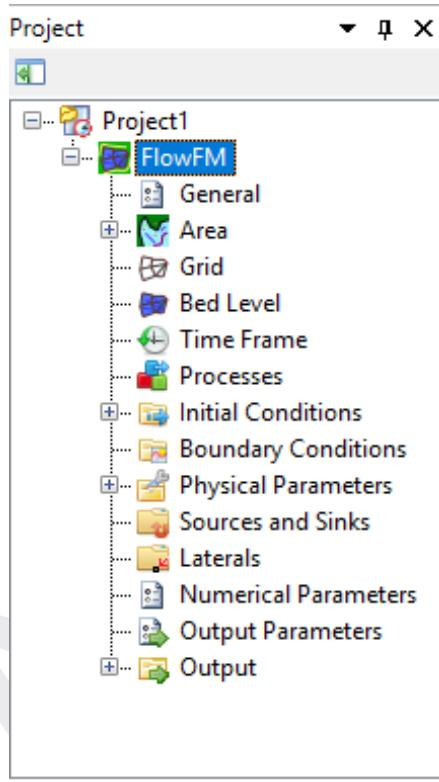

Figure 6.2: Project window of D-Flow FM plugin

### 6.2.2 The central window

The central window shows the contents of the map or the editor you are working with. Multiple maps and editors may be docked at the central window location; each accessible as a tabs along the top (see Figure 6.3). The map is used to edit geographic model data, the editor for the overall model settings. Moreover, the contents of the central window can also be a specific editor such as the time point editor or the boundary condition editor. Each of these editors will open as a separate tab.

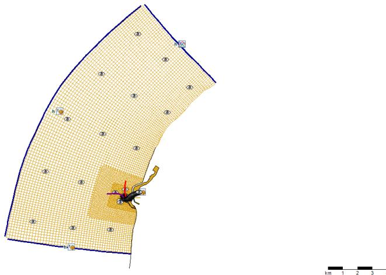

Figure 6.3: The central window with a map and contents of the D-Flow FM model

### 6.2.3 Settings window

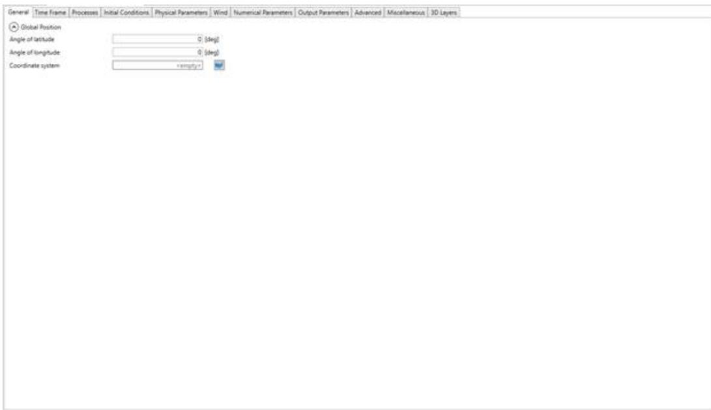

**Figure 6.4:** The model **Settings** window with General settings tab enabled

### 6.2.4 Map window

The **Map** window allows the user to control the visibility of the contents of the central map using checkboxes. Furthermore, the user can add (wms) layers, such as satellite imagery or open street maps (see Figure 6.5).

**Note:** Please note that the map usually has a different coordinate system than the model. In rendering the model attributes they are transformed to the map coordinate system (for visual inspection on the map), but the model will be saved in the model coordinate system.


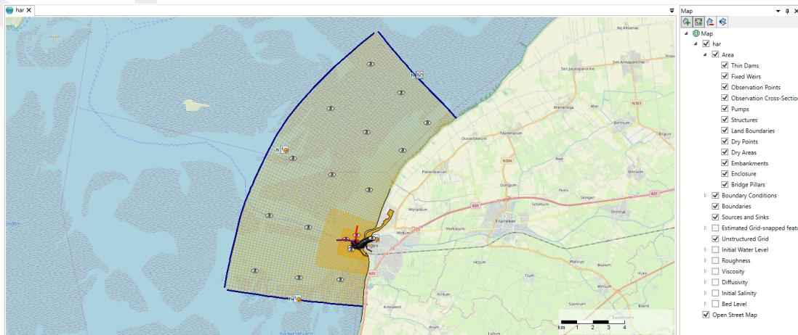

**Figure 6.5:** Map window controlling map contents

### 6.2.5 Messages window

The **Message** window (Figure 6.6) provides a log of information on the recent activities in the User Interface. It also provides warning and error messages.

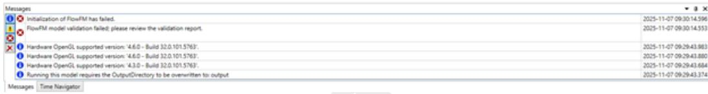

*Figure 6.6: Log of messages, warnings and errors in Messages window*

### 6.2.6 Time Navigator window

The **Time Navigator** (Figure 6.7) can be used to step through time dependent model output and other time dependent geographic features on the map.

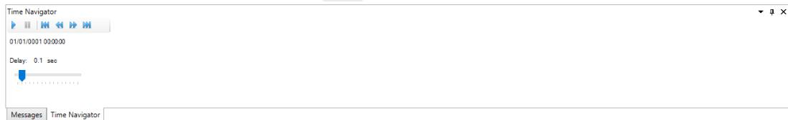

*Figure 6.7: Time Navigator window in D-Flow FM User Interface*

### 6.3 Dockable views

The User Interface offers lots of freedom to customize dockable views, which are discussed in this section.

#### 6.3.1 Docking tabs separately

Within the User Interface the user can dock the separate windows according to personal preferences. These preferences are then saved for future use of the framework. An example of such preferences is presented in Figure 6.8, where windows have been docked on two screens.

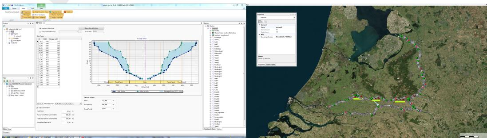

*Figure 6.8: Docking windows on two screens within the User Interface.*

### 6.3.2 Multiple tabs

In case two windows are docked in one view, the underlying window (tab) can be brought to the front by simply selecting the tab, as is shown here.

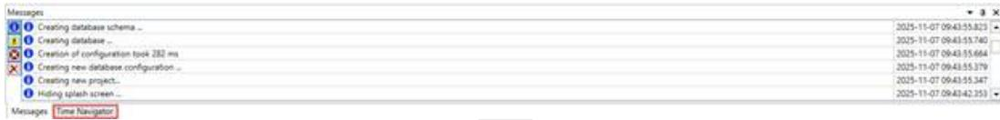

**Figure 6.9:** Bringing the **Time Navigator** window to the front

By dragging dockable windows with the left mouse button and dropping the window left, right, above or below another one the graphical user interface can be customized according to personal preferences. Here an example of the **Time Navigator** window being docked to the right of the **Messages** window.


**Figure 6.10:** Docking the **Time Navigator** window.

Additional features are the possibility to remove or (auto) hide the window (top right in Figure 6.10). In case of removal, the window can be retrieved by two left mouse-clicks on **Time Navigator** in the **View** ribbon. Hiding the **Properties** window results in:

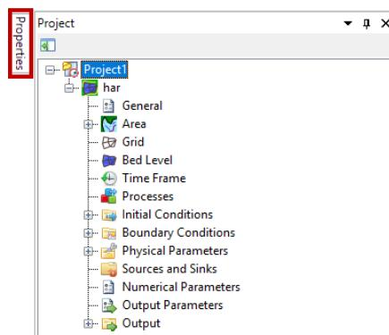

**Figure 6.11:** Auto hide the **Properties** window

### 6.4 Ribbons and toolbars

The user can access the toolbars arranged in *ribbons*. Model plug-ins can have their own model specific *ribbon*. The *ribbon* may be auto collapsed by activating the *Collapse the Ribbon* button when right-mouse-clicking on the *ribbon*.

#### 6.4.1 Ribbons (shortcut keys)

The User Interface makes use of ribbons, just like Microsoft Office. You can use these ribbons for most of the operations. With the ribbons comes shortcut key functionality, providing shortcuts to perform operations. If you press Alt, you will see the letters and numbers to access

the ribbons and the ribbon contents (i.e. operations). For example, Alt + H will lead you to the *Home*-ribbon (Figure 6.12).

**Note: Implementation of the shortcut key functionality is still work in progress.**


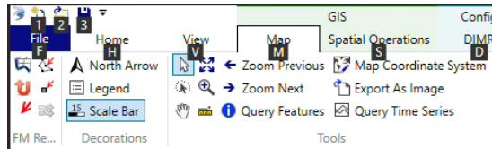

*Figure 6.12: Perform operations using the shortcut keys*

## 6.4.2 File

The left-most *ribbon* is the *File* ribbon. It has menu-items comparable to most Microsoft applications. Furthermore, it offers users save and open functionality, as well as the *Info* and *Options* dialogs, as shown in Figure 6.13 and Figure 6.14.

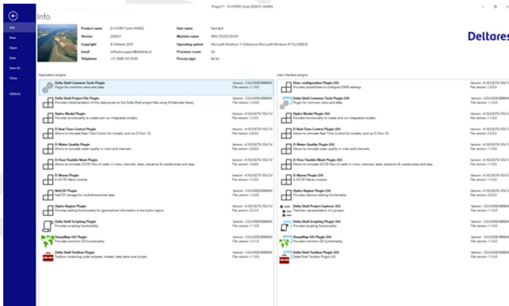

*Figure 6.13: The File ribbon*

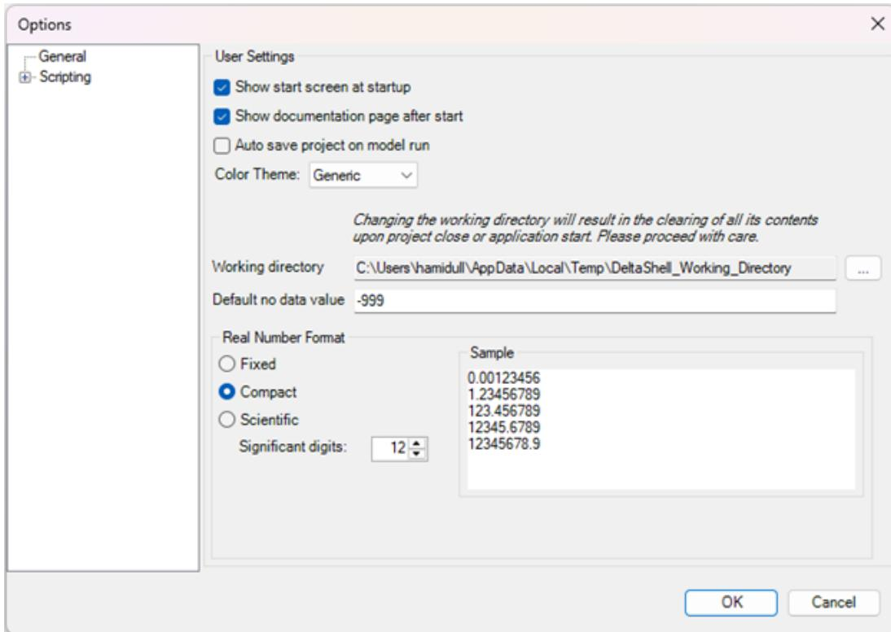

Figure 6.14: The User Interface options dialog.

### 6.4.3 Home

The second *ribbon* is the *Home* ribbon (Figure 6.15). It harbours some general features for clipboard actions, addition of items, running models, finding items within projects or views, and help functionality.


Figure 6.15: The Home ribbon.

### 6.4.4 View

The third *ribbon* is the *View* ribbon (Figure 6.16). Here, the user can show or hide windows.

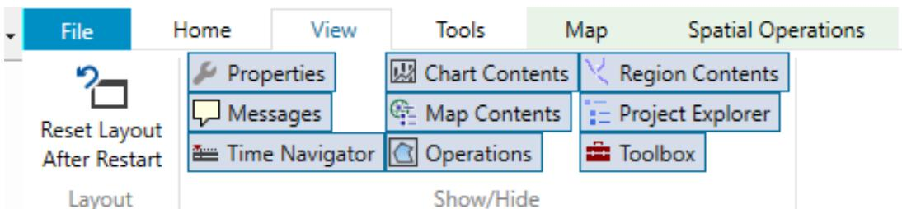

Figure 6.16: The View ribbon.

## 6.4.5 Map

The fourth *ribbon* is the *Map* ribbon (Figure 6.17).

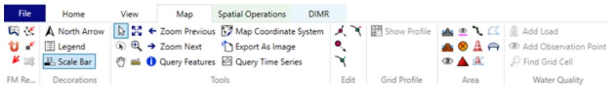

**Figure 6.17:** The Map ribbon.

This ribbon will be used heavily, as it harbours all *Geospatial* functions, like:

- ◊ *Decorations* for the map
  - □ North arrow
  - □ Scale bar
  - □ Legend
  - □ ...
- ◊ *Tools* to customize the map view
  - □ Select a single item
  - □ Select multiple items by drawing a curve
  - □ Pan
  - □ Zoom to Extents
  - □ Zoom by drawing a rectangle
  - □ Zoom to Measure distance
  - □ ...
- ◊ *Edit* polygons, for example within a network, basin, or waterbody
  - □ Move geometry point(s)
  - □ Add geometry point(s)
  - □ Remove geometry point(s)
- ◊ Addition of *Area* elements, such as
  - □ Add 2D Cross-section
  - □ Add 2D Structure
  - □ Add 2D Pump
  - □ ...

Still, all functions of the category can be activated as they will appear in the drop-down panel.

#### 6.4.6 Quick access toolbar


**Note:** The user can make frequently used functions available by a single mouse-click in the *Quick Access Toolbar*, the top-most part of the application-window. Do this by right-mouse-clicking a ribbon item and selecting *Add to Quick Access Toolbar*.

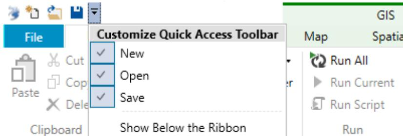

Figure 6.18: The quick access toolbar.

#### 6.5 Important differences compared to Delft3D-FLOW GUI

The differences between the former Delft3D-FLOW GUI and the D-Flow FM GUI in lay-out and functionality are numerous. Here, we address only the most important differences in the workflow.

##### 6.5.1 Project vs model

The entity “project” is new in the D-Flow FM GUI. In the hierarchy the entity “project” is on a higher level than the entity “model”. A project can contain multiple models, which can either run standalone or coupled. The user can run all models in the project at once (on project level) or each model separately (on model level). When the user saves the project, the project settings will be saved in a `<*.dsproj>` configuration file and the project data in a `<*.dsproj_data` folder>. The `<*.dsproj_data>` folder contains folders with all input and output files for the models within the project. There is no model intelligence in the `<*.dsproj>` configuration file, meaning that the models can also be run outside the GUI from the `<*.dsproj_data>` folder.

##### 6.5.2 Load/save vs import/export

The user can load an existing D-Flow FM project, make changes in the GUI and, consequently, save all the project data. Loading and saving means working on the original project data, i.e. the changes made by the user overwrite the original project data. Alternatively, use *Save As* to keep the original project data and save the changes project data at another location (or with another name).

Import/export functionality can be used to copy data from another location into the project (import) or, vice versa, to copy data from the project to another location (export). Import/export is literally copying, e.g.:

- ◇ import: changes on the imported data will only affect the data in the project and not the source data (upon saving the project)
- ◇ export: the model data is copied to another location “as is”, changes made afterwards will only affect the data in the project not the exported data (upon saving the project)

##### 6.5.3 Working from the map

One of the most important differences with the former GUI is the central map. The central map is comparable with the former “visualization area”, but with much more functionality and

flexibility. The map helps you to see what you are doing and inspect the model at all times. You can use the *Region* and *Map* ribbons to add/edit model features in the map.

#### 6.5.4 Coordinate conversion

With the map as a central feature, functionality to convert model and map coordinates is an indispensable feature. In the *General* tab you can set the model coordinate system. In the map tree you can set the map coordinate system using the right mouse button (Figure 6.19). The coordinate systems are subdivided in geographic and projected systems. Use the quick search bar to find the coordinate system you need either by name or EPSG code (Figure 6.20).

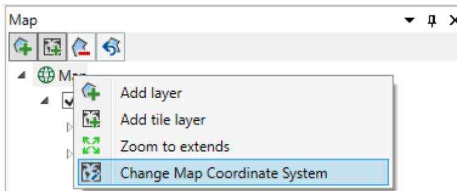

*Figure 6.19: Set map coordinate system using right mouse button*

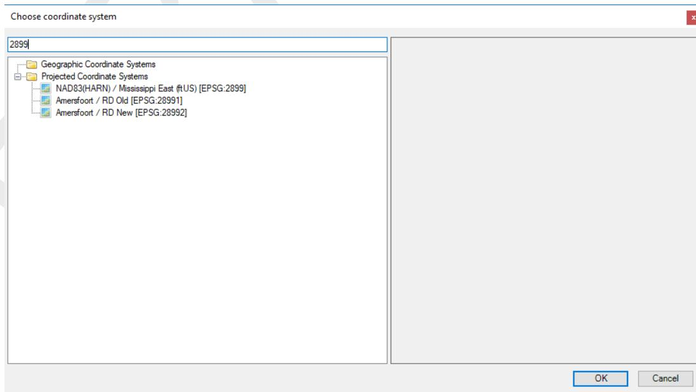

*Figure 6.20: Select a coordinate system using the quick search bar*

#### 6.5.5 Model area

The model area contains geographical features, such as observation points & curves and obstacles. In contrast to the former GUI, these features can even exist without a grid or outside the grid and they are not based on grid coordinates, implying that their location remains the same when the grid is changed (for example by (de-)refining).

Finally, for the computations, the SWAN computational core interpolates the features to the grid. In the future we would like to show to which grid points the features are snapped before

running the computation. However, this requires some updates in the SWAN computational core.

### 6.5.6 Integrated models (model couplings)

The D-Flow FM User Interface implements the concept of an *Integrated model* in order to couple different models, such as: hydrodynamics coupled with the controlling of structures, waves, morphology and/or water quality.

Two types of coupling are distinguished:

1. 1 *offline* coupling and
2. 2 *online* coupling.

**Note:** *Offline* is also referred to as *sequential* coupling and *online* as *parallel* coupling.


#### Offline

In case of an *Integrated model* with *offline* coupling, the entire hydrodynamic simulation is done first, i.e., *separately* from the second simulation. The file-based hydrodynamic output serves as input for the second simulation. As such, the hydrodynamic results drives the controlling of structures or the simulation of waves or water quality. In this offline case, there is no feedback from the waves or water quality to the hydrodynamic simulation. For many applications, this is good practice.

#### Online

An *online* coupling, on the other hand, exchanges data *every time* after computing a specified time interval. This tight coupling allows for direct feedback of the various processes on one another. This is crucial for controlling structures.

### 6.5.7 Ribbons (shortcut keys)

The User Interface makes use of ribbons, just like Microsoft Office. You can use these ribbons for most of the operations. With the ribbons comes shortcut key functionality, providing shortcuts to perform operations. If you press Alt, you will see the letters and numbers to access the ribbons and the ribbon contents (i.e. operations). For example, Alt + H will lead you to the *Home*-ribbon (Figure 6.21).

**Note:** Implementation of the shortcut key functionality is still work in progress.


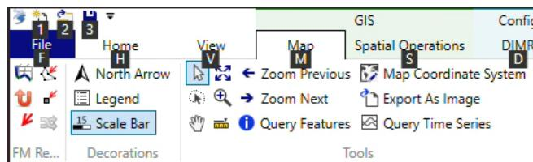

**Figure 6.21:** Perform operations using the shortcut keys

### 6.5.8 Context menus

Context menus are the menus that pop up using the right mouse button. These context menus provide you with some handy functionality and shortcuts specific for the selected item. The functionality is available in all User Interface windows and context dependent. You can best try it yourself to explore the possibilities.

### 6.5.9 Scripting

The User Interface has a direct link with scripting in Iron Python (NB: this is not the same as C-Python). This means that you can get and set data, views and model files by means of scripting instead of having to do it all manually. Scripting can be a very powerful tool to automate certain steps of your model setup or to add new functionality to the GUI. You can add a new script by adding a new item, either in the *Home*-ribbon or through the right mouse button.

## 7 Set-up of a D-Flow FM model

### 7.1 Introduction

In order to set up a hydrodynamic model you must prepare an input file. All parameters to be used originate from the physical phenomena being modelled. Also from the numerical techniques being used to solve the equations that describe these phenomena, and finally, from decisions being made to control the simulation and to store its results. Within the range of realistic values, it is likely that the solution is sensitive to the selected parameter values, so a concise description of all parameters is required. This input data is collected into the Master Definition Unstructured file, called a mdu-file.

In section 7.2 we discuss some general aspects of the mdu-file and its attribute files. The sections thereafter describe how the actual modelling process can be done in the GUI.

### 7.2 mdu-file and attribute files

The Master Definition Unstructured file (mdu-file) is the input file for the hydrodynamic simulation program. It contains all the necessary data required for defining a model and running the simulation program. In the mdu-file you can define attribute files in which relevant data (for some parameters) is stored. This will be particularly the case when parameters contain a large number of data (e.g., time-dependent or space varying data). The mdu-file and all possible user-definable attribute files are listed and described in [Appendix A](#).

Although you are not supposed to work directly on the mdu-file it is useful to have some ideas on it as it reflects the idea of the designer on how to handle large amounts of input data and it might help you to gain a better idea on how to work with this file.

The basic characteristics of an mdu-file are:

- ◇ It is an ASCII file.
- ◇ Each line contains a maximum of 256 characters.
- ◇ Each (set of) input parameter(s) is preceded by a (set of) *keyword(s)*.

The results of all modules are written to platform independent binary (netCDF-)files, so also these result files you can transfer across hardware platforms without any conversion.

The mdu-file contains several sections, denoted by square brackets, below are the most relevant ones:

```
[general] this section contains the program name and its version.
[geometry] in this section, the main entry comprises the specification of the grid (i.e.
                                                                the netCDF network file). In addition, thin dams and thin dykes can be specified.
[numerics] this section contains the settings of specific parts of the flow solver, such
                                                                as limiters and the iterative solver type.
[physics] in this field, physical model parameters can be inserted, for instance related
                                                                to friction modelling and turbulence modelling.
[wind] the wind section prescribed the dependency of the wind drag coefficient to the
                                                                wind velocity through 2 or 3 breakpoints. This field also contains pressure information.
[time] in this section, the start time and the stop time of the simulation are specified
                                                                (both as a combination of a date and time).
[restart] in this section, the restart file can be specified, either as a <*_map.nc>-file
                                                                or as an <*_rst.nc> file. Because a <*_map.nc>-file can contain multiple
```

stages, in this case also a `RestartDateTime` must be specified.  
 [external forcing] this section only contains the name of the external forcings file.  
 [output] in this section, the writing frequency of output data can be prescribed.

Appendix A contains the full list of MDU sections and keywords.

### 7.3 Filenames and conventions

Filenames and file extensions hardly have any strict requirements in D-Flow FM, but we do advise to use the suggested file naming patterns below:

| file pattern                                     | description                                                          |
|--------------------------------------------------|----------------------------------------------------------------------|
| <code>mdu_name.mdu</code>                        | mdu-file                                                             |
| <code>*_net.nc</code>                            | Unstructured grid (network) file                                     |
| <code>*.xyz</code>                               | Sample file (for spatial fields)                                     |
| <code>*.ldb</code>                               | Land boundary file (polyline file format)                            |
| <code>*_thd.pli</code>                           | Thin dam file (polyline file format)                                 |
| <code>*_fxw.pliz</code>                          | Fixed weir file (polyline file format with $z$ values)               |
| <code>*_part.pol</code>                          | Partitioning polygon file (polyline file format)                     |
| <code>*.ext</code>                               | External forcings file                                               |
| <code>pli_name.pli</code>                        | Boundary condition location file (polyline file format)              |
| <code>pli_name_000X.tim</code>                   | Timeseries boundary data file at point #X                            |
| <code>pli_name_000X.cmp</code>                   | Astronomic/harmonical component boundary data file at point #X       |
| <code>*.bc</code>                                | BC-format boundary data file with polyline and point labels in file  |
| <code>*.xyn</code> or <code>*_obs.ini</code>     | Observation station file (see <a href="#">section E.2.2</a> )        |
| <code>*_crs.pli</code> or <code>*_crs.ini</code> | Observation cross-sections file (see <a href="#">section E.2.4</a> ) |
| <code>mdu_name_map.nc</code>                     | Output map file                                                      |
| <code>mdu_name_his.nc</code>                     | Output his file                                                      |
| <code>mdu_name_clm.nc</code>                     | Output class map file (see <a href="#">section E.3.3</a> )           |
| <code>mdu_name.dia</code>                        | Output diagnostics (log) file                                        |

### 7.4 How to set-up a D-Flow FM model

This chapter describes how to set up a D-Flow FM model in an empty User Interface project. When you open the GUI, an empty project is automatically created. Starting from scratch, you have to create an empty D-Flow FM model in a User Interface project:

- ◇ In the ribbon menu items, go to *Home* and click on *New Model*. In the drop-down menu [Figure 7.1](#) that appears, select "Flow Flexible Mesh Model" to add an empty D-Flow FM model.
- ◇ Or use the right mouse button on the name of your project (project1 by default). In the context menu that appears [Figure 7.2](#), select *Add* and click *New Model*. The *Select model* ... window appears allowing you to add an empty D-Flow FM model.

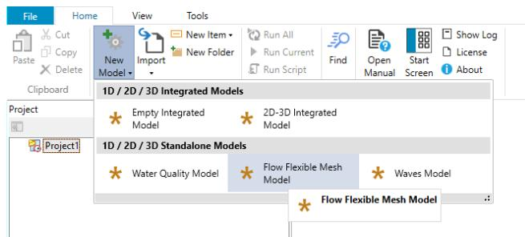

Figure 7.1: The Add Model drop-down menu

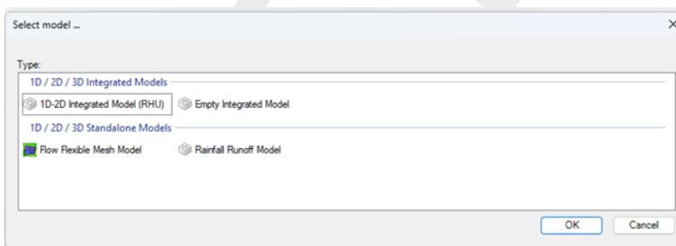

Figure 7.2: The Select model ... window

In the **Project** window, an empty model has appeared (FlowFM by default). Click the plus sign (+) before the name of the model to expand all model attributes in the **Project** window: General, Area, Grid, Bed Level, Time Frame, Processes, Initial Conditions, Boundary Conditions, Physical Parameters, Sources and Sinks, Numerical Parameters, Output Parameters and Output. In the following paragraphs, all model attributes are treated separately.

#### 7.4.1 General

When you double click on *General* in the **Project** window, the tabbed editor for D-Flow FM appears (Figure 7.3). The *General* tab contains general model information such as the model coordinate system and the angle of latitude and of longitude.

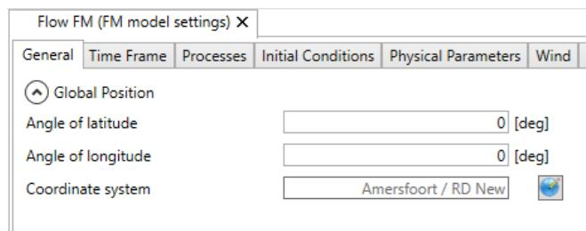

Figure 7.3: Overview of the General tab

#### 7.4.1.1 Model coordinate system

A very important property of your model is the coordinate system in which it is specified. Within the interface, there is a clear distinction between the coordinate system of your model and all of its attributes and the coordinate system of the central map and all of its items. Both coordinate systems can be set independent from each other. Keep in mind, that the coordinate system of your model is saved and used when you run your model. Only coordinate systems supported by the computational core are supported.

The model coordinate system can be set using the globe icon next to the Coordinate system text box. After clicking this button, the coordinate system wizard is opened (Figure 7.4). This wizard allows you to choose one of many possible coordinate systems and apply it to your model. You can use the search bar to browse the various coordinate systems (searching possible by name and EPSG code). If your model is specified in a certain coordinate system already, it is possible to convert the model coordinate system using the same button. After clicking *OK*, all model attributes are converted to the system of choice. Note that you have to close and re-open all map views for the changes to take effect in these views.

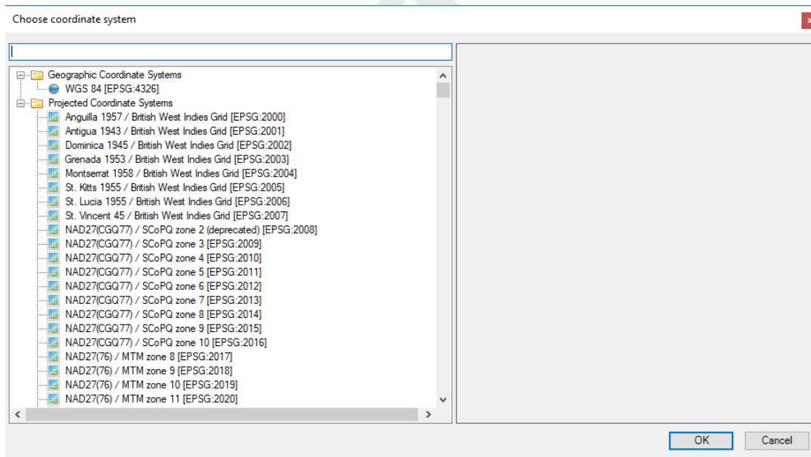

Figure 7.4: Coordinate system wizard

The map coordinate system applies to all items in the map **Project** window. To change the map coordinate system, navigate the menu ribbons to *Map* and click on *Map coordinate system*. Alternatively, right mouse click on *Map* in the map *Project* window and select *Change Map Coordinate System*. The coordinate system wizard appears, allowing you to set the map coordinate system of your choice. When the original model coordinate system differs from the selected map coordinate system, all map items are automatically converted to the specified map coordinate system.

#### 7.4.1.2 Angle of latitude for Coriolis on a Cartesian grid

For a Cartesian grid, you must specify the latitude of the model area using the keyword *Anglat*; this value is used to calculate a fixed Coriolis force across the entire area. For a spherical grid, the Coriolis force is computed from the latitude values in the grid file and therefore varies with latitude. Typically, spherical coordinates are used for large areas, in the order of 500 by 500 km<sup>2</sup> or larger.

### 7.4.2 Area

The model area contains all geographical features, such as the observation points, structures and land boundaries. These features can exist without a grid or outside the grid as they are not based on grid coordinates but  $xy$ -coordinates. This means that the location of the model area features remains the same when the grid is changed (for example by (de-)refining). When you expand the model attribute *Area* in the *Project* window, a list of supported geographical features is displayed (Figure 7.5).

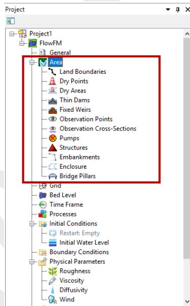

**Figure 7.5:** Overview of geographical features

Below is Figure 7.6. It displays an overview of the (*Map*) ribbon.

The red boxes to the left (*FM Region 2D / 3D*) and right (*Area*) can be used to *Add ...* the various geographical features to the model: click the corresponding item in the box and use your mouse to indicate the location of the selected feature on the central map. The red box in the middle highlights the buttons available to edit the location of geographical features. The specifics for each feature are discussed separately in the following sections.


**Figure 7.6:** Overview of the Map ribbon

Importing and exporting of model features is done with the context menu by using your right mouse button on the different features in the *Project* window.

#### 7.4.2.1 Grid-snapped features

All geographical features of your model that are described by  $x$ -, and  $y$ -coordinates have to be interpolated to your computational grid when you run your model. The computational core of D-Flow FM automatically assigns these features to the corresponding parts of your

grid. The so-called Grid-snapped features are part of the output of a simulation: *shape* files. In section 7.4.14 is described how - in short: select *Write Snapped Features* in the *Output Parameters* tab below the central map.

However, the graphical user interface allows you to inspect the grid-snapped features before a simulation run.

**Note:** Mark that this way, the grid-snapping is an estimation because it would take too much processing time. In the neighbourhood of *Dry Areas* the grid-snapping will be different, as the *Dry Areas* are not taken into account in this interactive *Estimated Grid-snapped features* mode.


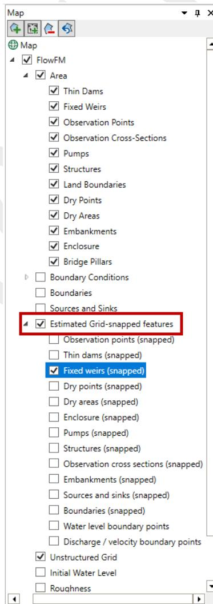

**Figure 7.7:** Example of *expanded* Estimated Grid-snapped features *attribute in the Map window*

Figure 7.7 shows a part of the *Map* window, showing the *Area* and *Estimated Grid-snapped features* attributes. The *x*- and *y*-locations of all spatial model features are shown within the *Area* attribute. You can hide or show any of these attributes by means of clicking the check boxes in front of the attributes. When you enable the Grid-snapped features, all items within the *Area* attribute, as well as all boundaries are interpolated to their corresponding locations on the computational grid. The interpolation is performed instantaneously by the computational core of D-Flow FM, which enables you to directly inspect the numerical interpretation of

all features on the computational grid. Figure 7.8 shows an example of four observation points and one thin dam in the central map, showing both the  $x$ - and  $y$ -locations of these features as well as their representation on the computational grid.

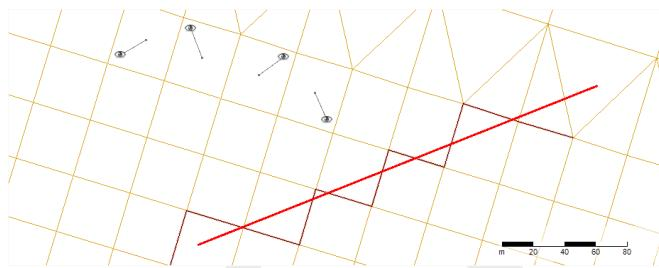

**Figure 7.8:** Example of grid snapped features displayed on the central map

### 7.4.2.2 Observation points

Observation points are used to monitor the time-dependent behaviour of one or all computed quantities as a function of time at a specific location, i.e., water level, velocity, salinity, temperature and concentration of the constituents. Observation points represent an Eulerian viewpoint at the results.

To add an observation point, click the corresponding icon from the *FM Region 2D / 3D* menu in the map ribbon (Figure 7.6). By clicking in the central map, observation points are placed in your model. Selected observation points (first click the *Select* icon from the “Tools” menu in the map ribbon) can be deleted using backspace or directly from the attribute table (explained below). The grid snapped representation (Figure 7.9) is indicated by a line linking the observation points to the closest cell center, indicating that output will be stored of this cell. Importing and exporting of observation points is possible via the context menu of “Observation points” in the *Project* window (right mouse button).

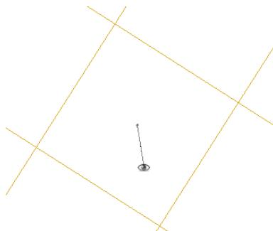

**Figure 7.9:** Geographical and grid snapped representation of an observation point

When you double click the *Observation points* attribute in the *Project* window, the observation points tab is displayed underneath the central map (Figure 7.10). This tab shows an attribute table with the names,  $x$ - and  $y$ -locations (in the model coordinate system) of the various observation points within the model. When one of the entries is selected, the corresponding observation point is highlighted in the central map.

**Figure 7.10:** Attribute table with observation points

### 7.4.2.3 Observation cross-sections

Cross-sections (Figure 7.11) are used to store the sum of computed fluxes (hydrodynamic), flux rates (hydrodynamic), fluxes of matter (if existing) and transport rates of matter (if existing) sequentially in time at a prescribed interval.

To add a cross section, click the corresponding icon from the *FM Region 2D / 3D* menu in the map ribbon (Figure 7.6). By clicking in the central map, cross section points are added. Note that a cross section consists of a minimum of two points, but an arbitrary amount of intermediate points can be added. The last point is indicated by double clicking the left mouse button. The distance in meters (independent of the local coordinate system) in between the last point and the mouse pointer is indicated in pink; in case more than two points are used, the cumulative length of the entire cross section is shown in black. Once highlighted in the central map, a cross section is deleted with backspace or directly from the attribute table described below. The positive direction through the cross section is indicated by a pink arrow. The direction of this arrow is dependent on the order in which the cross section points are drawn (to change the direction, flip the start and end points). Importing and exporting of cross sections is possible via the context menu of “Observation cross-sections” in the *Project* window (right mouse button).

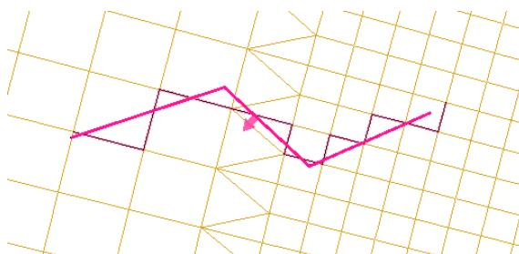

**Figure 7.11:** Geographical and grid snapped representation of a cross section

Double clicking the *Observation cross-sections* attribute in the *Project* window enables the Observation cross-sections tab underneath the central map view (Figure 7.12). Alternatively, you can double click on any cross section in the map. The attribute table displayed in the tab contains the names of the various cross sections of your model. When one of the entries is selected, the corresponding cross section is highlighted in the central map. A cross section entry can be deleted from the table via the context menu (right mouse button).

**Figure 7.12:** Attribute table with observation cross sections

#### 7.4.2.4 Thin dams

Thin dams (Figure 7.13) are infinitely thin objects defined at the velocity points which prohibit flow exchange between the two adjacent computational cells without reducing the total wet surface and the volume of the model. The purpose of a thin dam is to represent small obstacles (e.g. breakwaters, dams) in the model which have sub-grid dimensions, but large enough to influence the local flow pattern. A thin dam is assumed to have an infinite level in the model; no water will ever overflow a thin dam.

To add a thin dam, click the corresponding icon from the *FM Region 2D / 3D* menu in the map ribbon (Figure 7.6). Adding, deleting, importing and exporting of a line feature such as a thin dam is discussed in more detail in section 7.4.2.3 on cross sections.

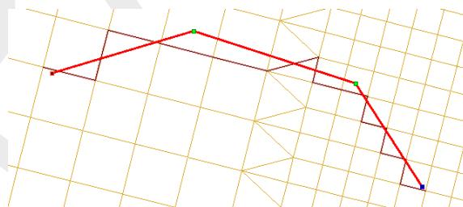

**Figure 7.13:** Geographical and grid snapped representation of a thin dam

When you double click the *Thin dams* attribute in the *Project* window, the corresponding Thin dams tab appears underneath the central map (Figure 7.14). Alternatively, you can also double click on any thin dam in the central map. Within this tab, an attribute table is shown which displays the names of all thin dams within your model. When one of the entries is selected, the corresponding item is highlighted in the central map. A thin dam entry can be deleted from the table via the context menu (right mouse button).

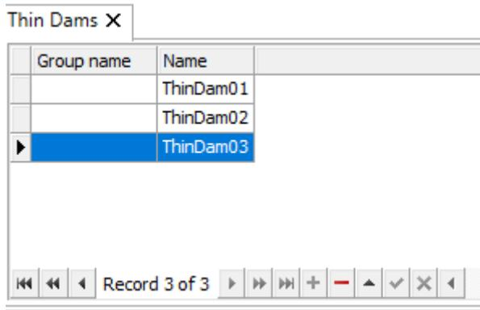

Figure 7.14: Attribute table with thin dams

### 7.4.2.5 Fixed weirs

A fixed weir (Figure 7.15) has the same function as a thin dam (section 7.4.2.4). However, unlike a thin dam, a fixed weir can be assigned both  $xy$ - and  $z$ -values. Furthermore, a fixed weir can be assigned a crest length (a thin dam is infinitely thin). The  $z$ -values correspond to the crest level of the fixed weir at the corresponding  $x$ - and  $y$ -locations; the level can vary in space, but is constant in time (Figure 7.16). Consequently, a fixed weir can overflow if the water level exceeds the crest level of the fixed weir. The level is specified with regard to the same vertical reference level as all other model items with level specifications (e.g. bed level values and initial water levels).

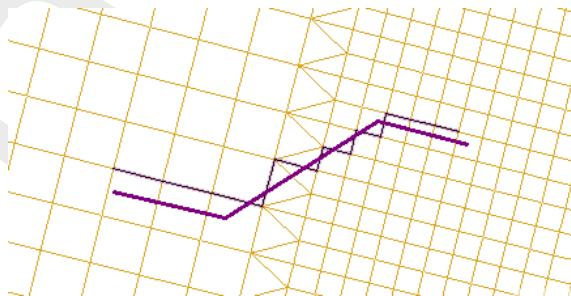

Figure 7.15: Geographical and grid snapped representation of a fixed weir

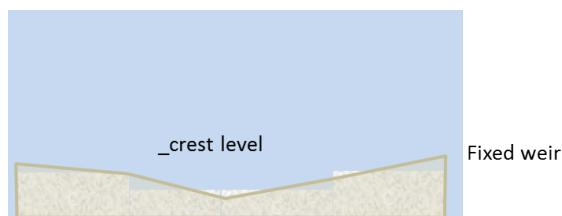

Figure 7.16: Schematic representation of a fixed weir

To add a fixed weir, click the corresponding icon from the *FM Region 2D / 3D* menu in the map ribbon (Figure 7.6). Adding, deleting, importing and exporting of a line feature such as a fixed weir is discussed in more detail in section 7.4.2.3 on cross sections.

When you double click the *Fixed weirs* attribute in the *Project* window, the corresponding Fixed weirs tab appears underneath the central map (Figure 7.17). Alternatively, you can also

double click on any fixed weir in the central map. Within this tab, an attribute table is shown which displays the names of all fixed weirs within your model. When one of the entries is selected, the corresponding item is highlighted in the central map. A fixed weir entry can be deleted from the table via the context menu (right mouse button).

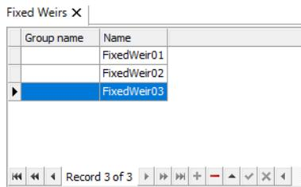

**Figure 7.17:** Attribute table with fixed weirs

When you double click on a fixed weir in the central map, the fixed weir editor opens in a separate view (Figure 7.18). On the right, a graphic representation (top view) of the fixed weir is displayed. The support point that is selected in the table is highlighted by means of a blue circle. On the left, a table is displayed showing the following properties of each support point of the fixed weir under consideration:

- ◇ X:  $x$ -coordinate of support point
- ◇ Y:  $y$ -coordinate of support point
- ◇ Crest level: crest level of the support point of support point of a fixed weir
- ◇ Ground height left: Difference between crest level and toe level at the left side
- ◇ Ground height right: Difference between crest level and toe level at the right side
- ◇ Crest width: Width of the crest of a fixed weir in perpendicular direction
- ◇ Slope left: Slope at left side of support point of a fixed weir
- ◇ Slope Right: Slope at right side at support point of support point of a fixed weir
- ◇ Roughness code: Roughness due to vegetation on a support point of a fixed weir

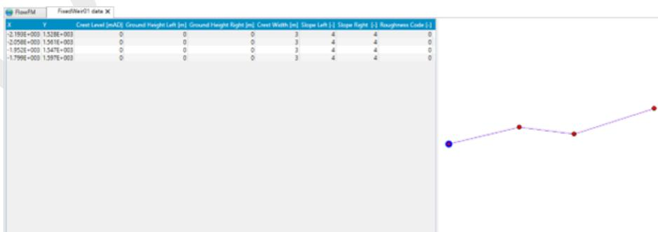

**Figure 7.18:** Fixed weir editor

### 7.4.2.6 Land boundaries

A land boundary (Figure 7.19) encloses the main geographic features surrounding your model and indicates the intersection of the water and land masses. When you set up your computational grid in RGFGRID, a land boundary determines the onshore extent of your model. When you open RGFGRID to edit your grid, the land boundary is automatically transferred and displayed. For more details on grid generation, you are referred to the User Manual of RGFGRID (Deltares, 2026k).

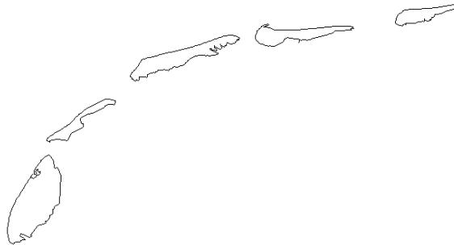

**Figure 7.19:** Geographical representation of a land boundary

To add a land boundary, click the corresponding icon from the *FM Region 2D / 3D* menu in the map ribbon (Figure 7.6). Adding, deleting, importing and exporting of a line feature such as a land boundary is discussed in more detail in section 7.4.2.3 on cross sections.

When you double click the *Land boundaries* attribute in the *Project* window, the corresponding land boundaries tab appears underneath the central map (Figure 7.20). Alternatively, you can also double click on any land boundary in the central map. Within this tab, an attribute table is shown which displays the names of all land boundaries within your model. When one of the entries is selected, the corresponding item is highlighted in the central map. A land boundary entry can be deleted from the table via the context menu (right mouse button).

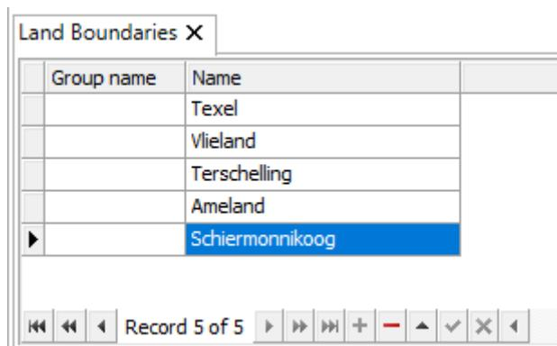

**Figure 7.20:** Attribute table with land boundaries

### 7.4.2.7 Dry points and Dry areas

Dry points are grid cells centred around a water level point that are permanently dry during a computation, irrespective of the local water depth and without changing the water depth as seen from the wet points. Dry areas are the same, but provide an easy way of defining many grid points as a single dry area at once.

Note that the flexibility of unstructured grids makes the use of dry points less necessary than with structured grid models, such as Delft3D-FLOW. In the interior of unstructured grids, some or more grid cells can easily be deleted during grid manipulation. Still, a dry points file can be used to explicitly mark locations or regions inside the grid as dry cells.

#### Dry points in the GUI

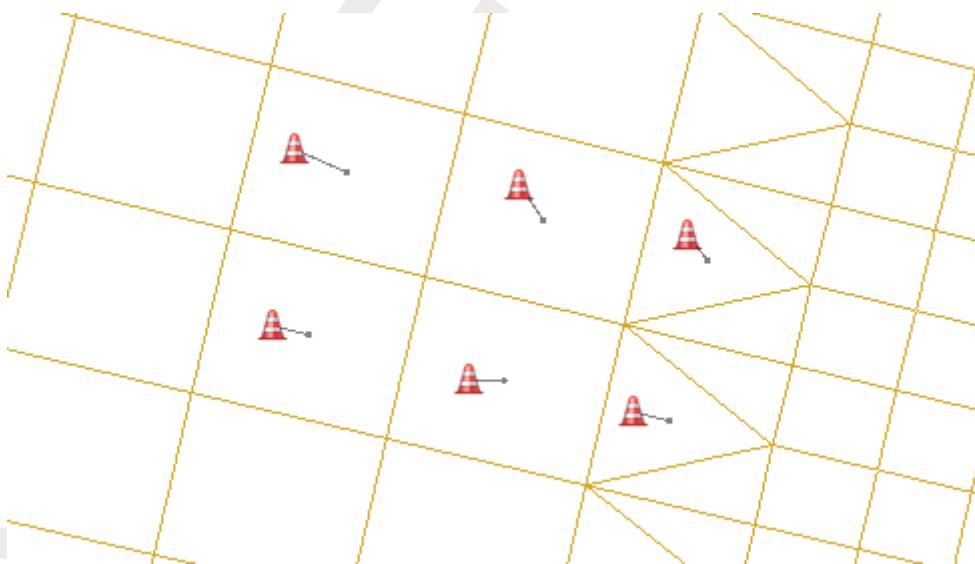

**Figure 7.21:** Geographical and grid snapped representation of several dry points

To add a dry point, click the corresponding icon from the *FM Region 2D / 3D* menu in the map ribbon (Figure 7.6). Adding, deleting, importing and exporting of a point feature such as a dry point is discussed in more detail in section 7.4.2.2 on observation points. The grid snapped representation of a dry point (Figure 7.21) is indicated by a line linking the dry point to the closest cell center.

When you double click the “Dry points” attribute in the *Project* window, the corresponding Dry points tab appears underneath the central map (Figure 7.22). Alternatively, you can also double click on any dry point in the central map. Within this tab, an attribute table is shown which displays the names of all dry points within your model. When one of the entries is selected, the corresponding item is highlighted in the central map. A dry point entry can be deleted from the table via the context menu (right mouse button).

Figure 7.22: Attribute table with dry points

### Dry areas in the GUI

Dry areas (Figure 7.23), like dry points, indicate areas that permanently dry during a computation. Instead of adding many separate dry points, you can draw a polygon that encloses all required computational cells. Only cells which centers are strictly inside the polygon are taken into account. The grid snapped representation of the dry area clearly indicates which cells are considered within the dry area.

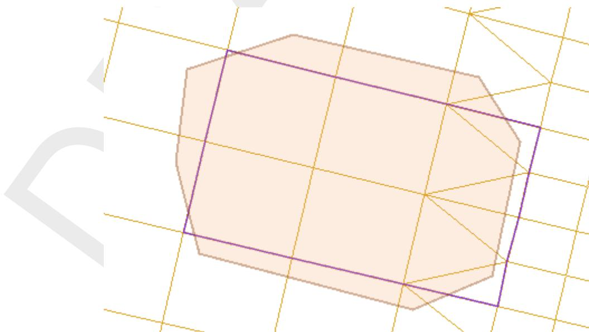

Figure 7.23: Geographical and grid snapped representation of a dry area

When you double click the *Dry areas* attribute in the *Project* window, the corresponding Dry areas tab appears underneath the central map (Figure 7.24). Alternatively, you can also double click on any dry area in the central map. Within this tab, an attribute table is shown which displays the names of all dry areas within your model. When one of the entries is selected, the corresponding item is highlighted in the central map. A dry area entry can be deleted from the table via the context menu (right mouse button).

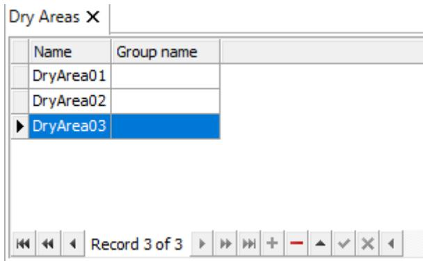

Figure 7.24: Attribute table with dry areas

### Dry points file input

Dry points are defined by a sample file `<*.xyz>`, dry areas are defined by a polygon file `<*.pol>`. Add the filename to the MDU as below:

```
[geometry]
# ...
DryPointsFile = <filename.xyz> # Dry points file *.xyz, third column dummy z values,
# or polygon file *.pol.
```

The format of the sample file is defined in Appendix C.3. The format of the polygon file is defined in Appendix C.2. All grid cells that contain a sample point are removed from the model grid, and as a result do not appear in any of the output files. Alternatively, for a polygon file, all grid cells whose mass center lies within the polygon will be removed from the model grid.

#### 7.4.2.8 Pumps

Pumps are a type of structures in D-Flow FM. Unlike the other structures, pumps can force the flow only in one direction. This direction is shown by an arrow in D-Flow FM. The flow direction of a pump can be reverted by a mouse right-click and selecting *Reverse line(s)*.

Like all other structures in D-Flow FM, the pump can be defined by a polygon. The input data of the pumps can be given by selecting and editing the pump polygon (see Figure 7.25). Right click on the pump polygon and selecting *Delete Selection* leads to deletion of the selected pump. Double clicking the pump polygons (or right-click the pump in the list and select *Open view*), it opens a tab for editing the pump properties. The tab includes pump capacity. If the pump capacity is time dependent, it can be specified by time series data (Figure 7.25).

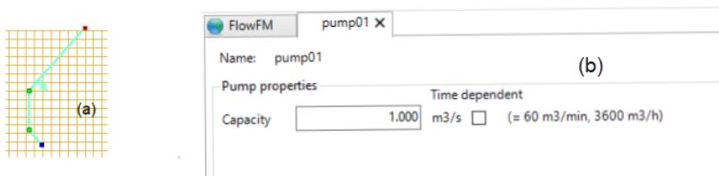

Figure 7.25: Polygon for pump (a) and adjustment of physical properties (b).

Right clicking the pumps attribute in the *Project* window opens a pop-down window on which you can select to import or export pumps. The pumps can be imported from and exported to a `<*.pli(z)>` file or a `<shapefile>`.

Double clicking the pumps attribute in the *Project* window opens the *Pumps* tab underneath the central map. The attribute table in this tab shows all pumps with their corresponding properties. When one of the pumps is selected, the corresponding item is highlighted in the central map. Double clicking any of the pumps in the central map opens the Structure Editor underneath the central map in which all parameters related to the pump can be set (Figure 7.26).

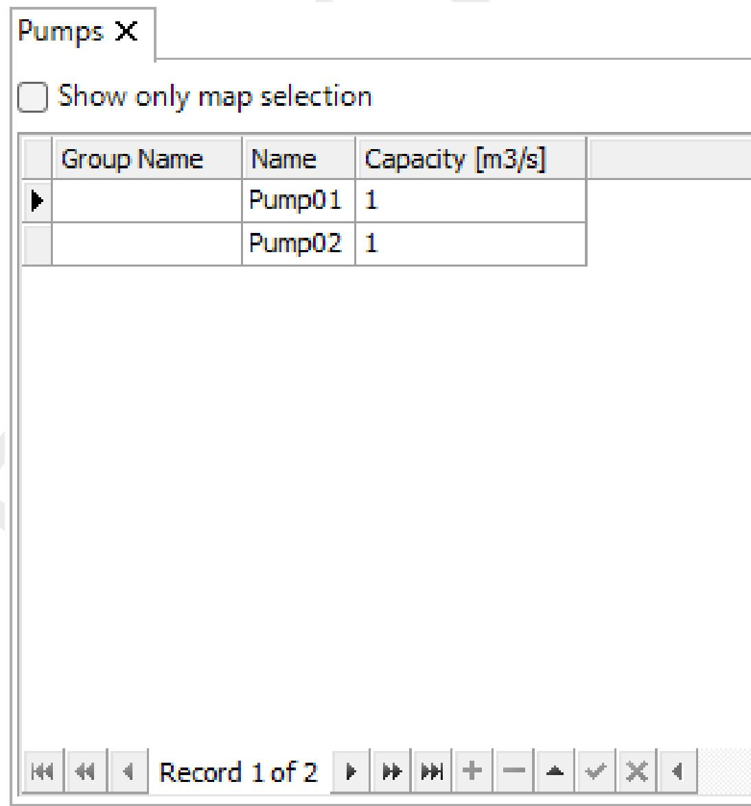

Figure 7.26: Selection of the pumps

### 7.4.2.9 Weirs

Unlike the fixed weir, weir (or adjustable weir) can be adjusted based on the user requirements. To set an adjustable weir in the computational domain, you can select the icon *Add new structure (2D)* from the toolbar, and draw a line by mouse. This line includes direction, which defines the sign of total flux passing above the structure (positive flux in the direction of weir, otherwise negative). This direction can be inverted by mouse right-click and selecting *Reverse line(s)*. By double-click on the line, you can define this structure as *Simple weir* and add the geometrical and time-dependent parameters such as *Crest level*, *Crest width*, *Crest level time series* and *Lateral concentration coefficient* (See Figure 7.27).

**Figure 7.27:** Polygon for adjustable weir (a) and adjustment of geometrical and temporal conditions (b).

Moreover, the time series of the crest level can be set in the case the crest level is time dependent. The time dependency diagram can be defined by the help of time series diagram as shown in Figure 7.28. The time series can also be imported (and exported) from external `<csv>-file`.

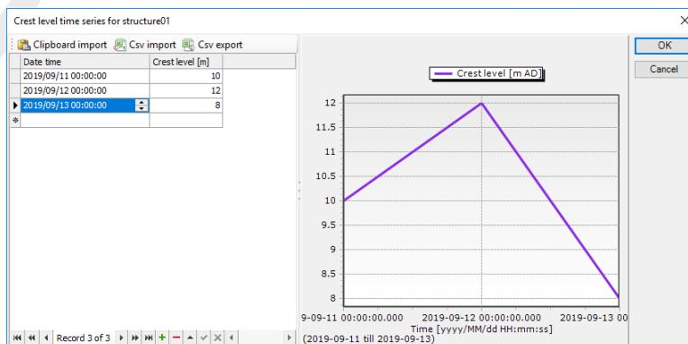

**Figure 7.28:** Time series for crest level.

The weirs can be deleted, imported and exported. By right clicking on the weir polygon, and selecting *Delete Selection* from the pop-down window, you can delete the selected weir. Right clicking the "Weirs" attribute in the *Project* window opens the "Weirs" tab opens the options for import and export. You can import weirs as polygon (`<*.pli>` file) or as a structure by

structure file. The weirs can also be exported to a polygon file, to a structure data file, or by the help of a shape file.

Double clicking the "Weirs" attribute in the *Project* window opens the "Weirs" tab underneath the central map. The attribute table in this tab shows all weirs with their corresponding properties. When one of the weirs is selected, the corresponding item is highlighted in the central map. Double clicking any of the weirs in the central map opens the Structure Editor as a new map view in which all parameters related to the weir can be set (Figure 7.29).

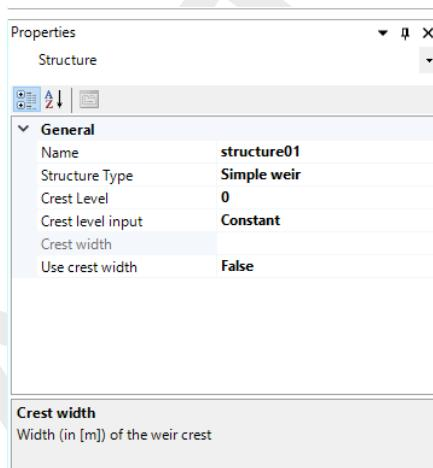

**Figure 7.29:** Time series for crest level.

#### 7.4.2.10 Gates

In D-Flow FM the gates can be imposed by polygon, and can be edited in a similar way as the other structures (see Figure 7.30). Like the other structures, mentioned above, the gates can be imported and exported by means of structure file or `<*.pli>` file.

Figure 7.30 shows the edit tab of the gate properties. The gate can be opened horizontally, as well as vertically.

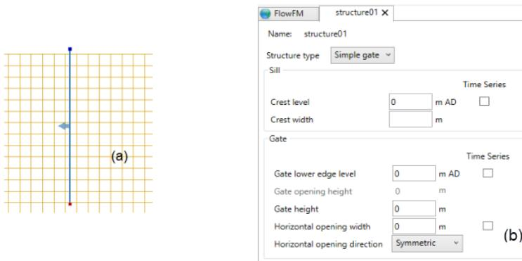

**Figure 7.30:** Polygon for gate (a) and adjustment of geometrical and temporal conditions (b).

### 7.4.2.11 Bridge Pillars

#### Remark:

- ◇ Bridge pillar functionality is currently only available for 1D and 2D modelling, but not for 3D modelling yet.

Bridge pillars are a type of structures in D-Flow FM that are relevant for the hydrodynamics. In D-Flow FM, a bridge is defined by a polygon on the central map. The user can add a bridge to the model by

- ◇ selecting the *Add new bridge pillar* icon in the *Map* ribbon; and
- ◇ defining the location of the bridge pillars by clicking on the map. The polyline for a bridge is finalized by double-clicking on the last bridge pillar.)
- ◇ repeat the above for another bridge and end by pressing the <ESC> key

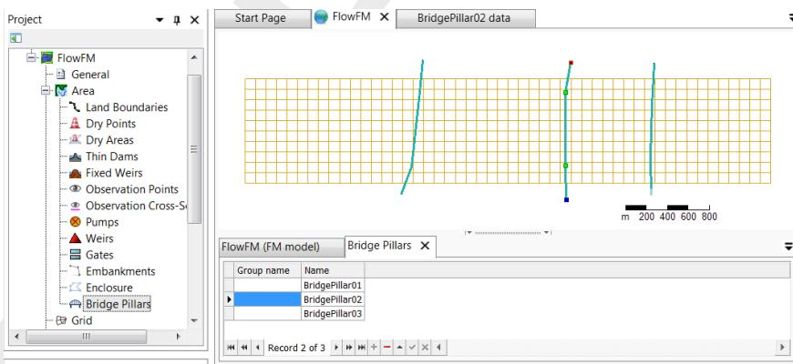

**Figure 7.31:** Selection of a bridge

Right clicking on the bridge polygon and selecting *Delete Selection* leads to deletion of the selected bridge. After double clicking a bridge polygon or right clicking the bridge in the list and selecting *Open view*, a tab for editing the bridge properties opens (Figure 7.32), with the following parameters:

- ◇ Pillar diameter [m] - (use -999.0 for an auxiliary location)
- ◇ Drag coefficient [-]: default is 1.0

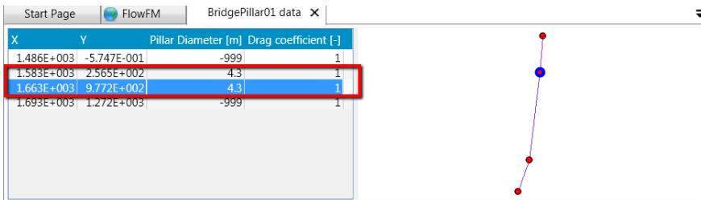

**Figure 7.32:** Adjustment of the properties of the pillars

Right clicking the *Bridge Pillars* attribute in the *Project* window (Figure 7.31) opens a pop-down window on which you can select to import or export bridges. The bridges can be imported and exported as polyline by a <\*.pliz> file or <*shapefile*>.

As can be seen in Figure 7.32, some of the points of the polygon are relevant pillars with real dimensions and some are not. For example, if a bridge is of curved shape, then additional points can be used to visualize such a bridge, while some of the points of a polyline do not coincide with a pillar. Such points are modelled with a pillar diameter of -999.0.

### 7.4.3 Computational grid

To set up a grid, click on the *Edit grid* button which opens the program RGFGRID. All features of grid setup in RGFGRID are treated separately in Deltares (2026k). If a land boundary is present in your project, this is exported to RGFGRID automatically. Once you have setup your grid in RGFGRID, click *File → Save Project* and close the program. The grid will now be visible within the central map. Editing of the grid remains possible at any point in time during the setup of your model by means of clicking the *edit grid* button. Any changes you make are always saved after clicking *File → Save Project* and loaded back into the central map.

### 7.4.4 Bed level

When you double click on *Bed level* in the *Project* window or select *Bed level* from the drop-down box in the spatial editor section of the *Map* ribbon, the spatial editor is activated (Figure 7.33). This editor can be used to generate a bathymetry for your computational grid. How to work with the spatial editor is described in Appendix G. Be aware that the bathymetry in D-Flow FM is defined as the bed level (e.g. positive upward), implying that all bed levels below the reference plane are negative. By default the bed levels are defined on the net nodes.


**Note:** Please note that, currently, other bed level definition types (e.g. *BedlevTypes*) are not visually supported by the GUI. If you would like to switch the bed level definitions to another type, you have to set the *BedlevType* in the *Physical Parameters* tab. However, the bed level locations will not be updated accordingly in the central map.

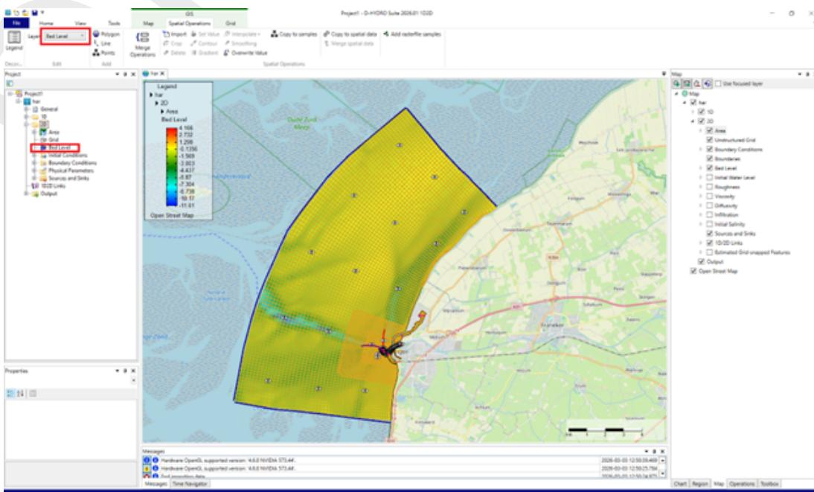

Figure 7.33: Bed level activated in the spatial editor

### 7.4.5 Time frame

In the settings tab, in the sub-tab time frame (Figure 7.34), you can specify everything related to the time frame in which your model will run.

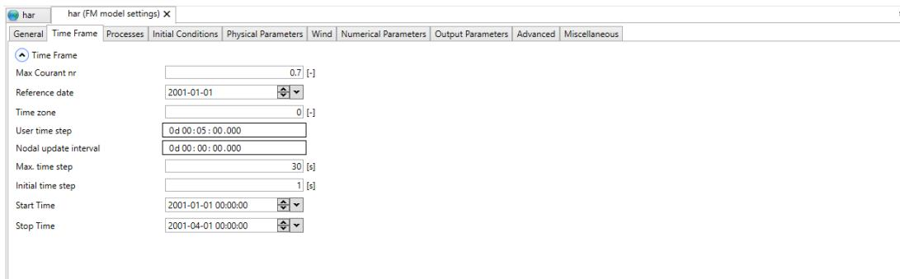

**Figure 7.34:** Overview time frame tab

In general, the time frame is defined by a reference date and a start and stop time. The time step size of your model is automatically limited (every time step) based on a Courant condition. In more detail, you must define the following input data:

*Max Courant nr*

The maximum allowed Courant number, which is used to compute the time step size from the CFL criterium. D-Flow FM uses an explicit advection scheme, therefore a value of 0.7 or lower is advised.

**Remark:**

- ◇ You should check the influence of the time step on your results at least once.

*Reference date*

The reference date of the simulation, which is by definition always at midnight (00h00m00s). It defines the (arbitrary)  $t = 0$  point for all time-series as used in the simulation. In the GUI, time-specifications are always absolute, but in the underlying model input files, these are stored as time values relative to the reference date. Typically, input time-series files are specified in minutes after this  $t = 0$  point. See for an illustration Figure 7.35.

*Time zone*

The time difference between local time and UTC. The time zone is defined as the time difference (in hours) between the local time (normally used as the time frame for D-Flow FM) and Coordinated Universal Time (UTC). The time difference can consist of a part of an hour, for example 1 hour and 30 minutes (specify as a decimal value: 1.5 (hours)). The local Time Zone is used for two processes:

- ◇ To determine the phases in local time of the tidal components when tide generating forces are included in the simulation, see section 3.7.
- ◇ To compare the local time of the simulation with the times at which meteo input is specified, e.g., wind velocities and atmospheric pressure. These can be specified in a different time zone.

*User time step*

If the *Time Zone* = 0 then the simulation time frame will refer to UTC. The interval that is highest in the hierarchy. It specifies the interval with which the meteorological forcings are updated. The *Max time step* cannot be larger than the *User time step*, and it will automatically be set back if it is. Also, the output intervals should be a

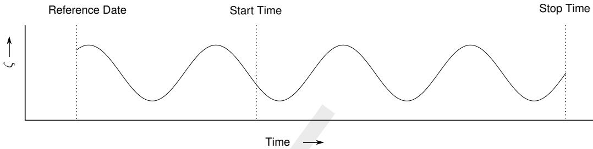

**Figure 7.35:** Relation between Reference Date and the simulation start and stop time for astronomic- and harmonic-series as used in the simulation. Time-series should cover the simulation time.

multiple of this *User time step*, see Appendix E. Finally the computational time steps will be fitted to end up exactly at each *User time step*, such that proper equidistant output time series are produced.

- *Nodal update interval* When using astronomic boundary conditions, the nodal factors can be updated with certain intervals, see section 3.7.
- *Max. time step* The *Max. time step* is the upper limit for the computational time step. The automatic time step can not be switched off explicitly. (If you want to enforce a fixed time step anyway, set the parameter *Max. time step (s)* to the desired step size, and the parameter *Max. Courant nr.* to an arbitrary high value.)
- *Initial time step* the initial time step of the model; there is no data available yet during the first time step to compute the time step automatically based on a Courant condition. The computational time step then gradually increases from *Initial time step* to the CFL-number limited time step (assuming that *Initial time step* is relatively small).
- *Start Time* The start date and time of the simulation.
- *Stop Time* The stop date and time of the simulation. Always make sure that the model *Stop Time* is larger than the model *Start Time* to avoid errors during your calculation.

### 7.4.6 Processes

In the processes tab (Figure 7.36) you can specify which processes you want to incorporate into your model. You can choose whether or not to include tidal forcing, salinity, temperature and sediment/morphology by means of check boxes. In addition, you can specify which *Wave model* you want to use. Note that when ticking the sediment/morphology check box, two tabs for setting sediment and morphology parameters appear.

**Figure 7.36:** Overview processes tab

### 7.4.7 Initial conditions

When expanding the initial conditions in the *Project* window, all quantities requiring an initial state are shown (Figure 7.37). The number of quantities depends on the activated physical processes in the ‘Processes’ tab (see section 7.4.6). The initial conditions for each quantity can be specified as a uniform value or as a coverage (e.g. a spatially varying field).

The uniform values can be edited in the ‘Initial Conditions’ tab, which opens upon double clicking ‘Initial Conditions’ in the *Project* window (Figure 7.38). In this tab you can also specify the layer distribution for the initial condition specification in case of a 3 dimensional quantity (i.e. salinity). **Note:** Please note that for 3 dimensional initial conditions currently only the option ‘top-bottom’ is supported.


In case of spatially varying initial conditions you can double click the quantity in the *Project* window or select it from the drop-down box in the spatial editor section of the Special Operations ribbon (Figure 7.39). Then the spatial editor is activated, which you can use to edit spatially varying fields. For more information on how to use the spatial editor you are referred to Appendix G. In case of 3 dimensional initial conditions, you can select the layer from the quantity dropdown box in the ‘Map’ ribbon (Figure 7.40).

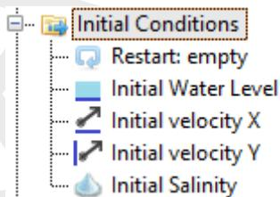

**Figure 7.37:** Initial conditions in the Project window

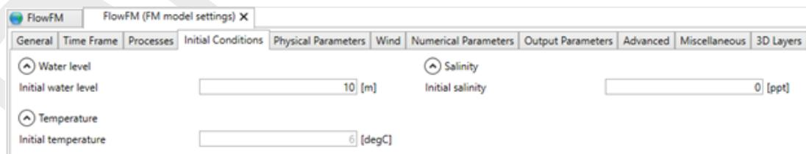

**Figure 7.38:** The ‘Initial Conditions’ tab where you can specify the uniform values and the layer distributions of the active physical quantities.

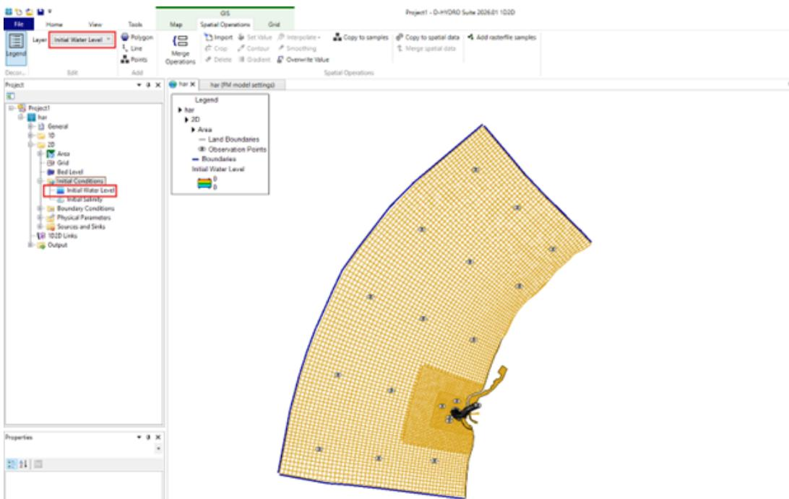

Figure 7.39: Initial water levels activated in the spatial editor

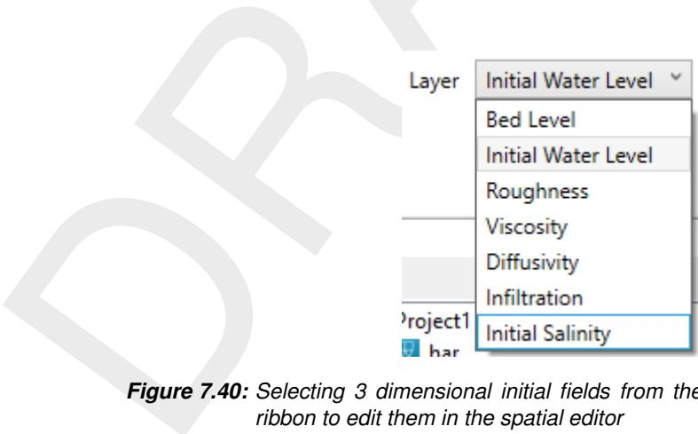

Figure 7.40: Selecting 3 dimensional initial fields from the dropdown box in the 'Map' ribbon to edit them in the spatial editor

## 7.4.8 Boundary conditions

Boundary conditions consist of a location specification ('support points') and a forcing for that location.

Section 7.4.8.1 describes how support points can be specified in D-Flow FM User Interface. The boundary forcing can be specified in the boundary data editor.

Section 7.4.8.2 describes the functionality of the boundary data editor. Finally, section 7.4.8.4 describes how the user can get an overview of the boundary locations and forcing in the attribute table.

### 7.4.8.1 Specification of boundary locations (support points)

In D-Flow FM the boundary locations are defined as ‘support points’ on a polyline ( $\langle *.pli \rangle$ ). The user can add a boundary polyline ( $\langle *.pli \rangle$ ) in the central map by selecting the *Add Boundary* button in *FM Region 2D / 3D* of the *Map* ribbon (see Figure 7.41). The number of individual mouse clicks determines the number of support points on the polyline. The polyline is closed by a double click. Once the polyline is added it becomes visible in the *Project* window under ‘Boundary Conditions’ (see Figure 7.42). The polyline can be edited by the general edit operations in the ‘Map’ ribbon (i.e. add/delete/move individual geometry points or the complete geometry, see Figure 7.43). The name of the polyline (or ‘boundary’) can be edited in the Boundaries tab, which can be opened by double clicking ‘Boundaries’ in the *Map* window (see Figure 7.44).

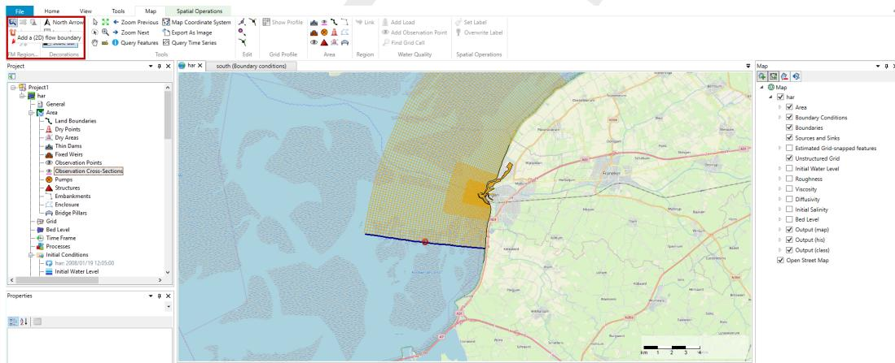

**Figure 7.41:** Adding a boundary support point on a polyline in the central map. By double clicking on the polyline in the map, the boundary condition editor will open to edit the forcing data on the polyline.

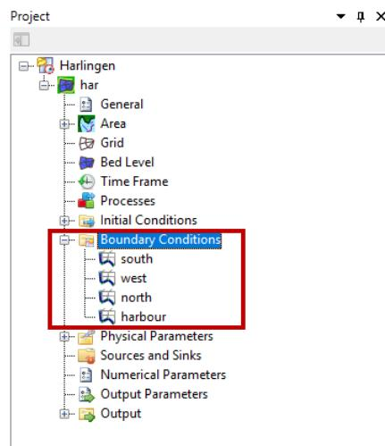

**Figure 7.42:** Polyline added in Project window under ‘Boundary Conditions’. By double clicking on the name of the polyline, the boundary condition editor will open to edit the forcing data on the polyline.


Figure 7.43: Geometry edit options in Map ribbon

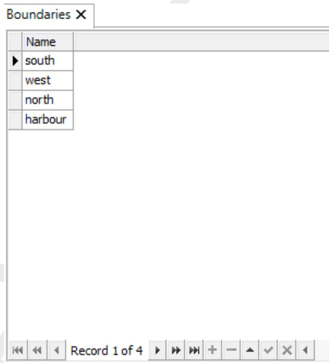

Figure 7.44: Edit name of polyline/boundary in Boundaries tab

### 7.4.8.2 Boundary data editor (forcing)

The boundary condition editor can be opened either by double clicking on the boundary name in the *Project* window (Figure 7.42) or by double clicking the boundary polyline in the map window (Figure 7.41). An overview of the boundary data editor is given in Figure 7.45. This editor can be used to specify the boundary forcing for different quantities (i.e. water level, velocity, discharge, salinity, etc.) corresponding to different processes (i.e. flow, salinity, temperature, tracers). The user can select the processes and quantities in the upper left corner. In the upper centre panel the user can select the forcing function for the selected quantity (i.e. time series, harmonic components, astronomical components or Q-h relation). The upper right corner contains a list of the support points on the polyline. The geometry view shows the location of the selected support point on the polyline ( $\langle *.pli \rangle$ ). In the middle panel are some handy buttons to generate, import and export forcing data. In the lower left panel the user can specify the boundary data for the selected support point. The lower right corner shows the signal of the boundary data. The following sections describe the features of the boundary data editor in more detail.

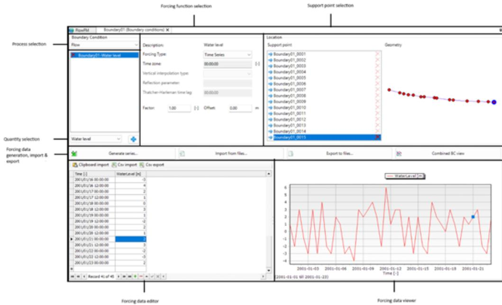

Figure 7.45: Overview of the boundary data editor

**Process and quantity selection:**

Currently, D-Flow FM supports the processes flow, salinity, temperature and tracers (**Note: tracers are not yet fully editable**). The processes available in the boundary condition editor depend on the selected processes in the processes tab (see section 7.4.6). After selecting the process from the dropdown box the user can select one of the corresponding quantities, as illustrated in Figure 7.46. For the process flow the user can choose from five principal quantities: water level, velocity, Riemann invariant, Neumann gradient and discharge. All quantities are specified per support point, except for discharges which are specified per polyline ( $\langle *.pli \rangle$ ). A support point can have multiple forcing quantities of the same type (i.e. water level, velocity, Riemann, Neumann or discharge). These quantities are added up. This can be relevant to add a surge level to an astronomical water level for example. Furthermore, the user can apply normal and tangential velocities as ‘add on’ quantities. The following combinations of quantities are allowed:

- ◊ Water level + normal velocity
- ◊ Water level + tangential velocity
- ◊ Velocity (= normal) + tangential velocity
- ◊ Riemann + tangential velocity


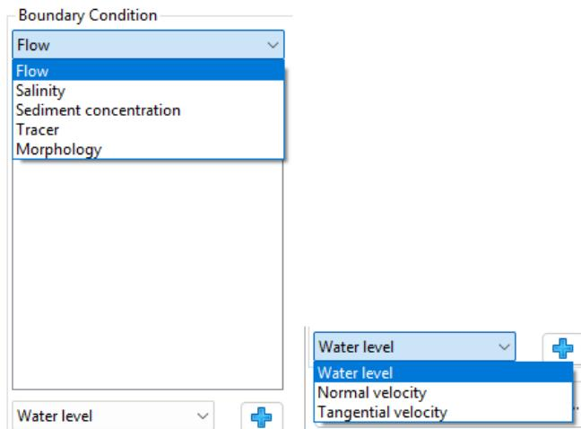

**Figure 7.46:** Process and quantity selection in the boundary data editor

### Forcing function selection:

The user can select one of the following forcing functions:

- ◇ Time series
- ◇ Harmonic components
- ◇ Harmonic components + correction
- ◇ Astronomic components
- ◇ Astronomic components + correction
- ◇ Q-h relation (only for water levels)

The next section describes how data can be added for these types of forcing functions.

### Add forcing data to a support point or polyline:

By default all support points on the polyline are deactivated. To add forcing data to a support point the user first needs to activate it by pressing the green ‘add’-symbol in the list of support points (see Figure 7.47). Consequently, the user can specify the forcing data in the lower left panel based on the selected forcing function. Of which a preview is shown in the lower right panel. **Note: Please note that once a support point containing forcing data is made inactive, all data on the support point is lost!**


The user can choose from the forcing functions time series, harmonic components (+ correction), astronomic components (+ correction) and Q-h relation. Examples of the boundary data specifications for these different forcing functions are given below. **Note: Please note that once the user changes the forcing function of a polyline, all data on the polyline is lost!**


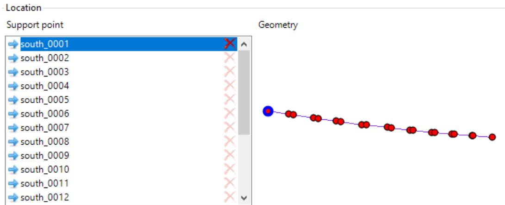

Figure 7.47: Activate a support point

### Time series

Note: Time series have an attribute Time zone, as can be seen below.


Figure 7.48: Time zone in the Boundary conditions editor

This attribute is un-editable, as it belongs to the data. The Time zone is defined as the time difference between local time and UTC. By default the Time zone is 0. In case external data is used, the Time zone can be different - as in Figure 7.48. The Time zone will be used to transpose the (external) data to the Time zone of the time frame of the simulation (see also section 7.4.5).

The time format for time series is yyyy-mm-dd HH:MM:SS.

- Specify the time series step by step in the table (Figure 7.49): the user can add or delete rows with the “plus”- and “minus”-signs below the table.

*Figure 7.49: Specification of time series in the boundary data editor (left panel)*

- Generate time series using the ‘Generate time series’ button (Figure 7.50): the user can specify start time, stop time and time step.

*Figure 7.50: Window for generating series of time points*

- Import from csv using the ‘Csv import’ button: a wizard will open in which the user can (1) select a csv-file (Figure 7.51), (2) specify how data should be parsed into columns (Figure 7.52) and (3) how the values should be parsed and mapped into columns (Figure 7.53).

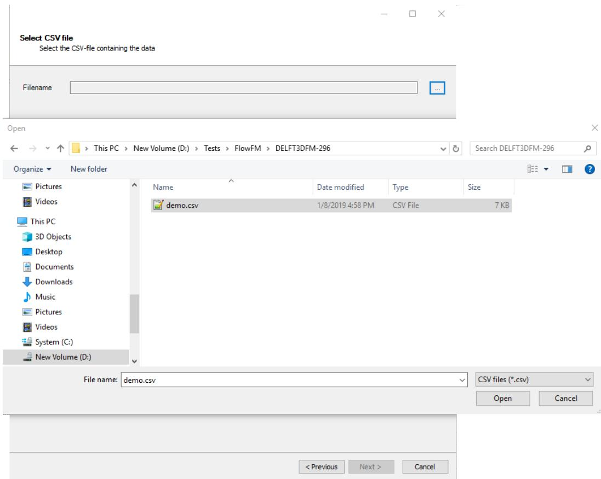

**Figure 7.51:** Csv import wizard: csv file selection

**Figure 7.52:** Clipboard/csv import wizard: specification of how data should be parsed into columns

**Figure 7.53:** Clipboard/csv import wizard: specification of how values should be parsed and columns should be mapped

- ◇ Import from clipboard using the 'Clipboard import' button: a wizard will open in which the user can specify (1) how data should be parsed into columns (Figure 7.52) and (2) how the values should be parsed and mapped into columns (Figure 7.53).
- ◇ Import from attribute file <\*.bc>: with this button the user can import data from existing boundary conditions <\*.bc> file. The user has three options for importing:
  - □ Overwrite where matching (replace): only overwrites the forcing data for matching support points in the <\*.bc>-file and GUI input.
  - □ Overwrite where missing (extend): only overwrites the forcing data for matching support points in the <\*.bc>-file and in the GUI input that did not contain data.
  - □ Overwrite all: overwrites the forcing data for all support points in the GUI (meaning that the forcing data for non-matching support points is emptied).

## Harmonic components

The harmonic components are defined by a frequency, amplitude and phase (see Figure 7.54). By default the forcing data viewer shows the harmonic component for the time frame specified for the model simulation. The options to define the harmonic components are similar to the options for time series:

- ◇ Specify components step by step: the user can add or delete rows with the “plus”- and “minus”-signs below the table.
- ◇ Select (astronomical) components using the ‘Select components’ button (Figure 7.55): the user can select astronomical components which will be transformed in the corresponding frequencies.
- ◇ Import from csv using the ‘Csv import’ button: a wizard will open in which the user can (1) select a csv-file, (2) specify how data should be parsed into columns and (3) how the values should be parsed and mapped into columns.
- ◇ Import from clipboard using the ‘Clipboard import’ button: a wizard will open in which the user can specify (1) how data should be parsed into columns and (2) how the values should be parsed and mapped into columns.
- ◇ Import from attribute file <\*.bc>: with this button the user can import data from existing boundary conditions <\*.bc> file. The user has three options for importing:
  - □ Overwrite where matching (replace): only overwrites the forcing data for matching support points in the bc-file and GUI input.
  - □ Overwrite where missing (extend): only overwrites the forcing data for matching support points in the bc-file and in the GUI input that did not contain data.
  - □ Overwrite all: overwrites the forcing data for all support points in the GUI (meaning that the forcing data for non-matching support points is emptied).

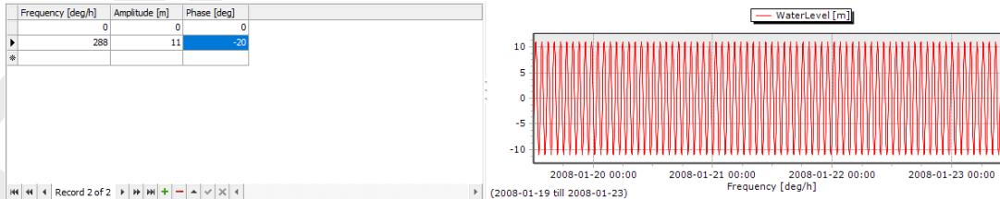

**Figure 7.54:** Specification of harmonic components in boundary data editor

**Figure 7.55:** Selection of astronomical components from list (after pressing ‘select components’)

### Astronomic components

Astronomical components are similar to harmonic components, with the exception that the frequency is prescribed. Instead of specifying the frequency the user can select astronomical components by name. Upon editing the component field in the table the user will get suggestions for components in a list (Figure 7.56). The most frequently used components (A0, Q1, P1, O1, K1, N2, M2, S2, K2 and M4) are put on top of the list, the other components are listed in alphabetic order. Instead of defining each component individually, the user can also make a selection of components by pressing the button ‘select components’ (Figure 7.55). For a complete overview of all 235 astronomic components we refer to [Appendix H](#).

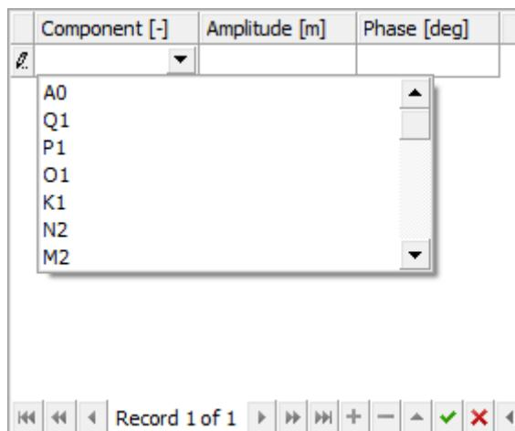

Figure 7.56: Suggestions for astronomical components in list

### Harmonic or astronomic components with corrections

For calibration purposes the user can combine harmonic or astronomic components with corrections. The corrections are defined in terms of an amplitude (multiplication) factor and a phase difference (see Figure 7.57). This allows the user to keep track of both the original signal and the calibration coefficients. The effects of the corrections on the resulting signal are directly visualized in the forcing data viewer. **Note: Please note that the import functionality is not (yet) working properly for astronomic/harmonic boundary conditions with corrections.**


|   | Component [-] | Amplitude [m] | Phase [deg] | Amplitude corr. | Phase corr. [deg] |  |
|---|---------------|---------------|-------------|-----------------|-------------------|--|
|   | A0            | 0.2           | 0           | 2               | 15                |  |
| ▶ | M2            | 1             | 55          | 5               | 30                |  |
| * |               |               |             |                 |                   |  |

Figure 7.57: Editing harmonic/astronomic components and their corrections

### Q-h relation (only for water level)

The user can force the boundary with a Q-h relationship, but only for the quantity water level. This is a relationship between discharge and water level (see Figure 7.58). The relationship can only be prescribed per polyline, not per support point. **(Note: this functionality has not been tested extensively yet)**


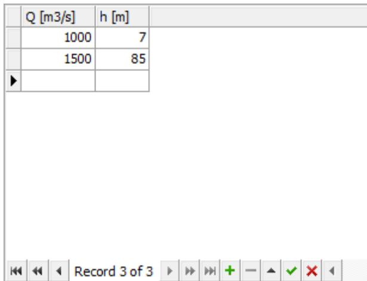

Figure 7.58: Specification of a Q-h relationship

### Exporting boundary conditions

With the *Export to files* button the user can export all boundary forcing data for the given polyline to a `<*.bc>`-file.

#### 7.4.8.2.1 3D boundary conditions

When the model is 3D (i.e. the number of layers is larger than 1), the user can specify three-dimensional boundary conditions for relevant quantities such as velocity, salinity, temperature and tracer concentration. The user can choose from vertically uniform or vertically varying boundary conditions (Figure 7.59), where the latter are defined as a percentage from the bed. In the boundary condition editor the layer view will appear (Figure 7.60). Here, the user can specify the vertical positions of the boundary conditions and view their position relative to the model layers. Please note that the number and position of vertical boundary conditions does not necessarily have to match the number and/or the exact position of the model layers. The computational core will interpolate the boundary forcing position to the number of model layers.

In case of non-uniform boundary conditions over the vertical, the number of columns in the boundary forcing data editor will increase correspondingly (see Figure 7.61). In this way the user can specify the conditions for all vertical positions in the same table and view the resulting signals in the forcing data viewer.

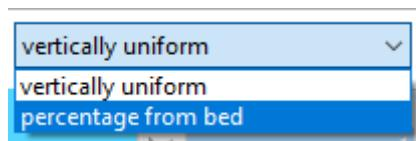

Figure 7.59: Selection of vertically uniform or varying boundary conditions in case of a 3D model

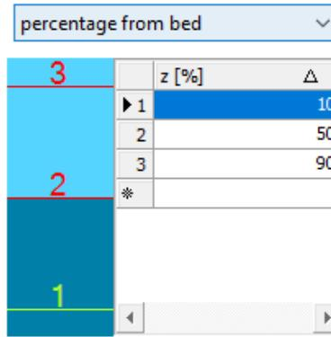

**Figure 7.60:** Overview of the layer view component of the boundary conditions editor. In the table the user can edit the vertical positions of the boundary conditions as a percentage from the bed. In the view left of the table, the user can see the vertical positions of the boundary conditions (indicated by number corresponding to the table) relative to the model layers.

| Time [-]            | Salinity(1) [ppt] | Salinity(2) [ppt] | Salinity(3) [ppt] |
|---------------------|-------------------|-------------------|-------------------|
| 2008/01/19 12:00:00 | 30                | 25                | 20                |
| 2008/02/02 12:00:00 | 30                | 25                | 20                |

**Figure 7.61:** Specification of boundary forcing data (in this example for salinity) at 3 positions in the vertical

### View boundary data

All boundary data of the same quantity on a support point can be (pre-)viewed in the boundary data view in the lower-right panel. If multiple signals of the same process have been entered, the viewer will show the active signal in red and the total signal of all datasets in green (see Figure 7.62). In the view the user can zoom-in by dragging a box from top-left to bottom-right and zoom-out by dragging a box from bottom-right to top-left.

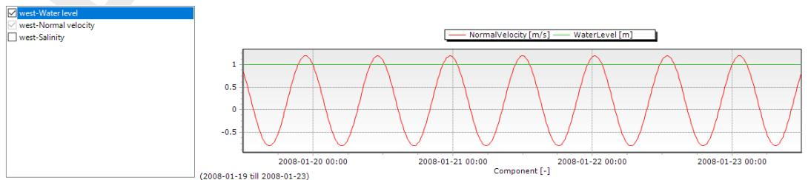

**Figure 7.62:** Example of active and total signal for multiple water level data series on one support point

To inspect multiple quantities at a support point at the same time (for example water level and normal velocity) the user can use the combined boundary data viewer by pressing the button 'Combined BC view'. **Note: This does not work properly yet.**


### 7.4.8.3 Import/export boundary conditions from the *Project* window

Apart from import and export functionality per individual boundary polyline in the boundary condition editor, the GUI offers the opportunity to import and export boundary locations ( $\langle *.pli \rangle$ ) and forcing ( $\langle *.bc \rangle$ ) on a higher level. Hereto, you have to click the right mouse button on “Boundary Conditions” in the *Project* window and select “Import” or “Export” (Figure 7.63). Imports and exports on “Boundary Conditions” apply to all the boundary conditions whereas import and exports on a boundary polyline apply only to that boundary condition.

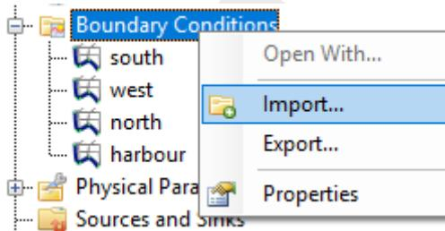

*Figure 7.63: Importing or exporting boundary features — both polylines  $\langle *.pli \rangle$  and forcing  $\langle *.bc \rangle$  — from the Project window using the right mouse button*

### Import and export polylines

Upon importing a  $\langle *.pli \rangle$ -file with the same filename and the same polyline name(s) as the existing polyline names in the GUI, the existing polyline(s) will be replaced and all forcing data thereon will be deleted. Upon importing a polyline(s) with a different name(s), the polyline(s) will be added to the *Project* window without any forcing data on it/them. The user will be asked to import the data “as is” or to perform a coordinate transformation before the import (see Figure 7.64).

Alternatively, the user can exported created polylines to a  $\langle *.pli \rangle$ -file. Upon export the user will be asked to export the data “as is” or to perform a coordinate transformation before the export (see Figure 7.64).

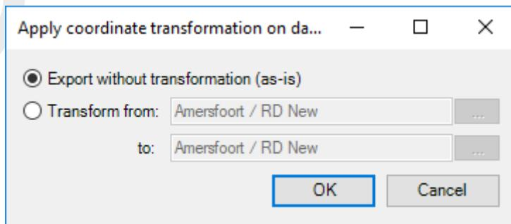

*Figure 7.64: Import or export a  $\langle *.pli \rangle$ -file as is or with coordinate transformation.*

### Import and export boundary forcing data

Similar to the polylines, you can import and export boundary forcing data from/to a `<*.bc>-file`. To import forcing data the existence of a polyline with at least one matching support point is a prerequisite. Upon importing `<*.bc>` data you can select which quantities and forcing types from the `<*.bc>-file` should be imported and with which overwrite options (see Figure 7.65). Similarly, you can export boundary forcing data. As an additional exporting feature you can select whether you would like to export: 1) all forcing data into one file, 2) as separate files per boundary, 3) as separate files per process or 4) as separate files per quantity (see Figure 7.66).

**Figure 7.65:** Import or export a `<*.pli>-file` as is or with coordinate transformation.

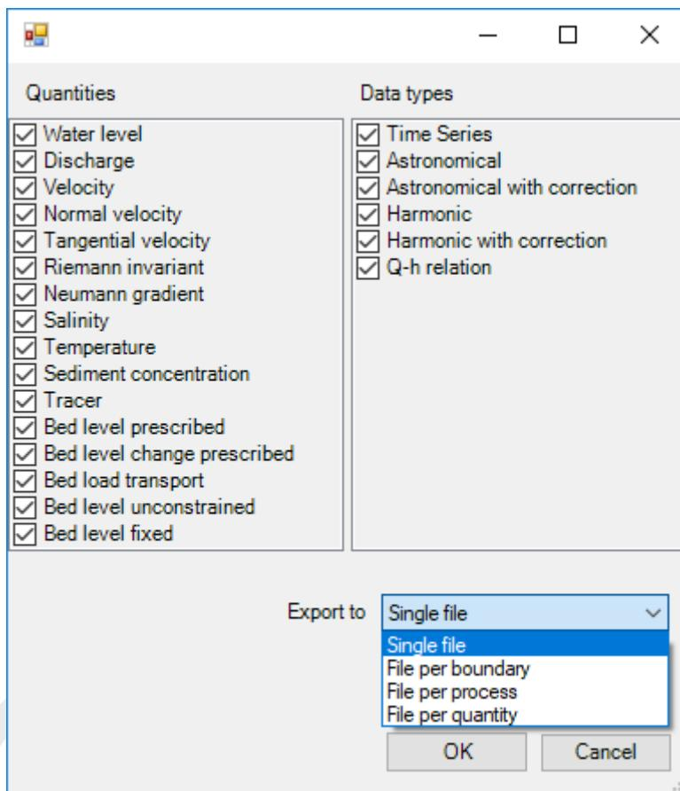

**Figure 7.66:** Import or export a \*.pli file as is or with coordinate transformation.

#### 7.4.8.4 Overview of boundary conditions in attribute table (non-editable)

The attribute table of the boundary conditions gives an overview of all specified boundary polylines and corresponding forcing (see Figure 7.67). This attribute table can be opened by double clicking 'Boundary Conditions' from the project or *Map* window. Most of the features in the attribute table are non-editable, except for the optional (multiplication) factor and offset per quantity per polyline. With these settings you can integrally multiply all data on a polyline with a factor and/or add an offset to it.

| Boundary Conditions X |                |              |        |        |  |
|-----------------------|----------------|--------------|--------|--------|--|
| Boundary              | Quantity       | Forcing type | Factor | Offset |  |
| south                 | WaterLevel     | Time Series  | 1      | 0      |  |
| south                 | Salinity       | Time Series  | 1      | 0      |  |
| west                  | WaterLevel     | Time Series  | 1      | 0      |  |
| west                  | NormalVelocity | Astronomical | 1      | 0      |  |
| west                  | WaterLevel     | Time Series  | 1      | 0      |  |
| west                  | Salinity       | Time Series  | 1      | 0      |  |
| north                 | WaterLevel     | Q-h relation | 1      | 0      |  |
| north                 | Salinity       | Time Series  | 1      | 0      |  |
| harbour               | Salinity       | Time Series  | 1      | 0      |  |
| harbour               | Discharge      | Time Series  | 1      | 0      |  |

Figure 7.67: Overview of all boundary conditions in attribute table

### 7.4.8.5 Open Boundaries and grid snapping

In this section grid snapping for open boundaries will be explained. For a description how to specify open boundaries we refer to section 7.4.8. A polyline for an open boundary segment should be sufficiently closed to the end of the grid. The polyline should be within a distance of three grid cells from the end of the grid, as illustrated in Figure 7.68. In this example can be seen that the upper part of the polyline is sufficiently close to the end of the grid, while the lower part isn't. This can be checked visually through the presence of dots on the last grid line, coinciding with the end of the computational grid.

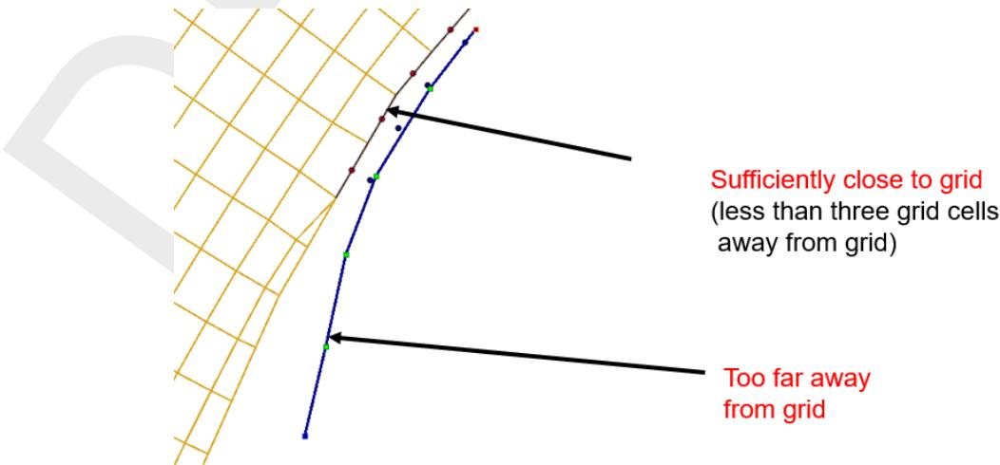

Figure 7.68: Illustration of grid snapping for open boundaries

### 7.4.9 Physical parameters

The physical parameters attribute is used to set all physical parameters of your model. When it is expanded in the *Project* window, it shows four attributes: *Roughness*, *Viscosity*, *Diffusivity* and *Wind*.

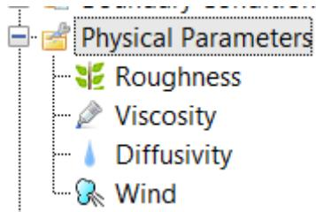

**Figure 7.69:** The physical parameters in the *Project* window

#### 7.4.9.1 Constants

In the *Physical Parameters* tab, the user can adjust the value of *Gravity* [m/s<sup>2</sup>] under *Others* and *Default water density* [kg/m<sup>3</sup>] under *Density*.

#### 7.4.9.2 Roughness

Bed roughness can be specified as a uniform value or as a coverage (e.g. a spatially varying field). The uniform values as well as the roughness formulation (i.e. Chézy, Manning, White-ColeBrook or  $Z_0$ ) can be edited in the ‘Physical Parameters’ tab, which opens upon double clicking ‘Roughness’ in the *Project* window (Figure 7.70). **Note:** The latter is not yet working. In this tab you can also specify the linear friction coefficient, linear friction Umod, wall behaviour (free slip or partial slip) and wall ks for partial slip.


In case of spatially varying bed roughness you can double click the quantity in the *Project* window or select it from the dropdown box in the *Spatial Operations* ribbon (Figure 7.71). Then the spatial editor is activated, which you can use to edit spatially varying fields. For more information on how to use the spatial editor you are referred to Appendix G.

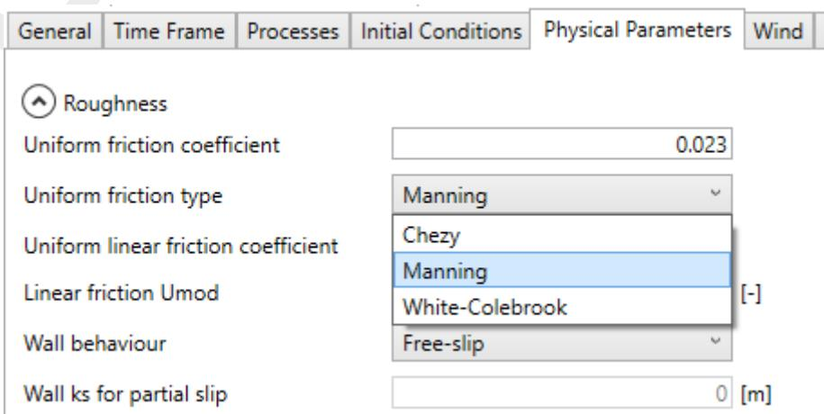

**Figure 7.70:** The section of the ‘Physical Parameters’ tab where you can specify roughness related parameters and formulations.

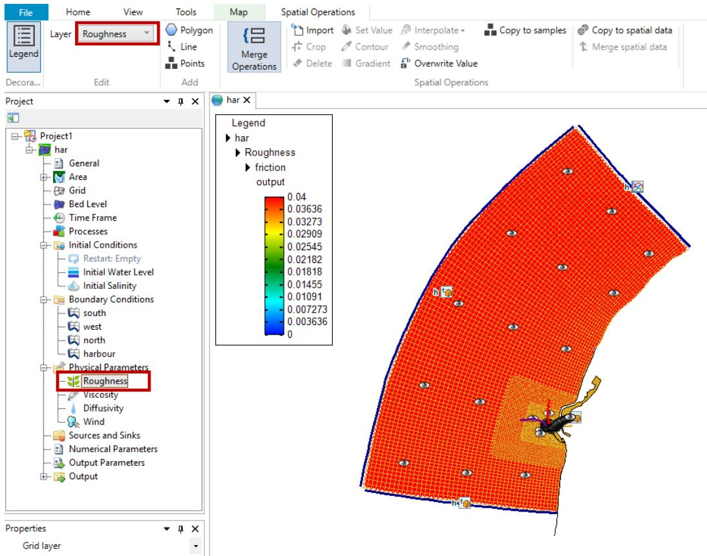

Figure 7.71: Roughness activated in the spatial editor to create/edit a spatially varying field

### 7.4.9.3 Viscosity

The eddy viscosity can be specified as a uniform value or as a coverage (e.g. a spatially varying field). In the 'Physical parameters' tab you can specify the uniform values for the horizontal and vertical (in case of 3D simulations) eddy viscosity and diffusivity (Figure 7.72).

In case of spatially varying viscosity you can double click the quantity in the *Project* window or select it from the dropdown box in the *Spatial Operations* ribbon (Figure 7.73). Then the spatial editor is activated, which you can use to edit spatially varying fields. For more information on how to use the spatial editor you are referred to Appendix G.

Figure 7.72: The section of the 'Physical Parameters' tab where you can specify (uniform) values for the horizontal and vertical eddy viscosity and diffusivity.

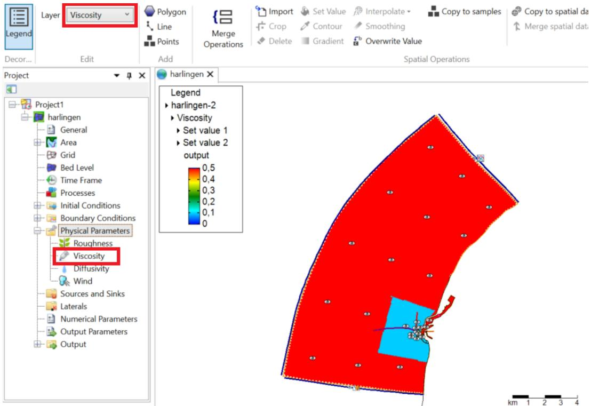

Figure 7.73: Viscosity activated in the spatial editor to create/edit a spatially varying field

#### 7.4.9.4 Diffusivity

The eddy diffusivity can be specified as a uniform value or as a coverage (e.g. a spatially varying field). In the ‘Physical parameters’ tab you can specify the uniform values for the horizontal and vertical (in case of 3D simulations) eddy viscosity and diffusivity (Figure 7.72).

In case of spatially varying diffusivity you can double click the quantity in the *Project* window or select it from the dropdown box in the *Spatial Operations* ribbon (Figure 7.74). Then the spatial editor is activated, which you can use to edit spatially varying fields. For more information on how to use the spatial editor you are referred to Appendix G.

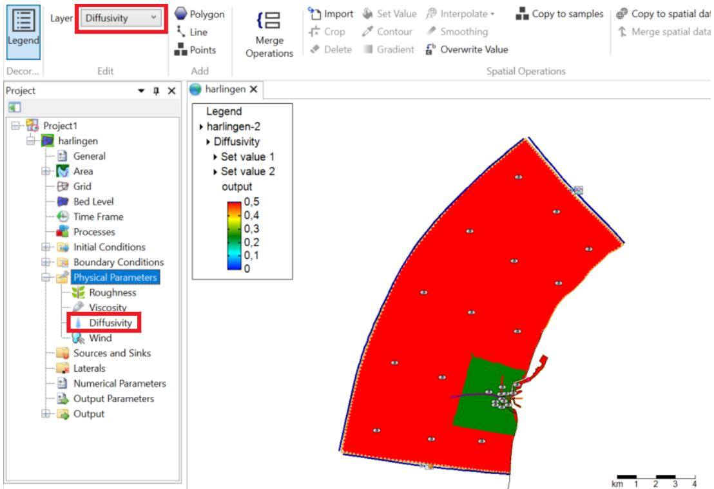

**Figure 7.74:** Diffusivity activated in the spatial editor to create/edit a spatially varying field

### 7.4.9.5 Wind

All relevant parameters, described in section 15.1 can be adjusted in the following sub-tab.

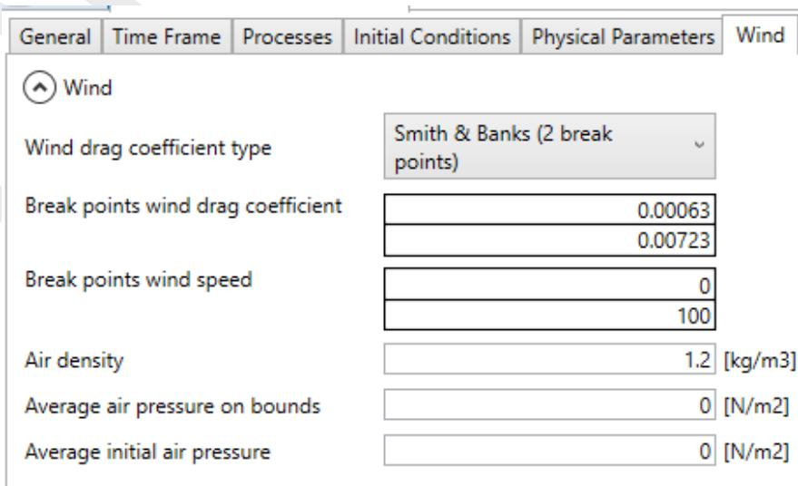

**Figure 7.75:** Overview of parameters in sub-tab Wind

### 7.4.9.6 Heat Flux model

The Heat flux model, described in chapter 5, needs only specification of which model to use. See the drop-down selection in Figure 7.36.

### 7.4.9.7 Tidal forces

The tide generating forces, described in section 3.7, can be enabled in the *Processes* tab, see Figure 7.36.

### 7.4.10 Sources and sinks

Sources and sinks (or: intake/outfall facilities) can be used to add/extract a discharge to/from the model or to redistribute water and constituents (such as temperature and salinity) within the model. Sources and sinks consists of a location (defined by a `<*.pli>-file`) and time series describing the discharges (defined by a `<*.bc>-file`). All the hydrodynamical considerations behind sources and sinks are discussed in section 7.4.11.

#### Sources and sinks locations

Sources and sinks can be added to the model using the corresponding icon from the *Map* ribbon (Figure 7.76). When the sources/sinks icon is active you can add them as polyline elements in the central map using the left mouse button. Each polyline element is closed by double clicking the left mouse button.

**Note:** Please note that the length of the polyline elements is not taken into account in the handling of sources and sinks (e.g. it is modeled as an instant redistribution of water and constituents without delays and friction losses).


Polyline elements starting outside the model domain and going inward are sources and, vice versa, polyline elements starting inside the model domain and going outward are sinks. Polyline elements starting and ending within the model are intake/outfall type of discharges. The drawing direction determines the direction of the discharge indicated by an arrow (Figure 7.77). In case of a source the direction of the last polyline element determines the direction of flow momentum into the model.

**Note:** The ‘reverse’ line option — to switch the discharge direction without having to redraw the source/sink — is not implemented.


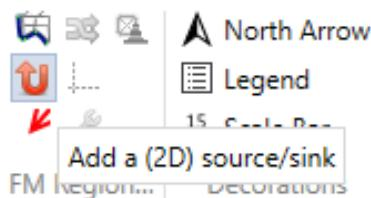

**Figure 7.76:** Activate the sources and sinks editing icon in the Map ribbon

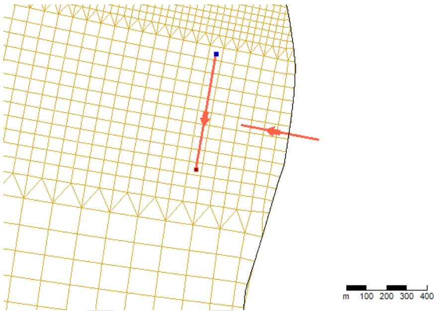

**Figure 7.77:** Add sources and sinks in the central map using the 'Sources and sinks' icon.

### Sources and sinks time series

After drawing the sources/sinks locations in the central map, they appear under 'Sources and sinks' in the *Project* window (Figure 7.78). Either by double clicking the sources/sinks in the *Project* window or the line element in the central map, you can open the sources and sinks editor (Figure 7.79). In this editor you can specify the discharge time series as well as the corresponding constituents (for example salinity and temperature, depending on the active physical processes). The time series of water discharges are always defined as absolute values. For the time series of constituents the following applies:

- ◇ For sources the constituent time series are absolute values
- ◇ For sinks the constituent time series are determined by the modeled values
- ◇ For sources and sinks (intake/outfall relationships) the constituent time series are the excess values (e.g. on top of the modeled values)

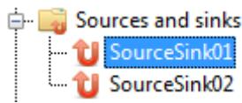

**Figure 7.78:** Sources and sinks appearing in the Project window

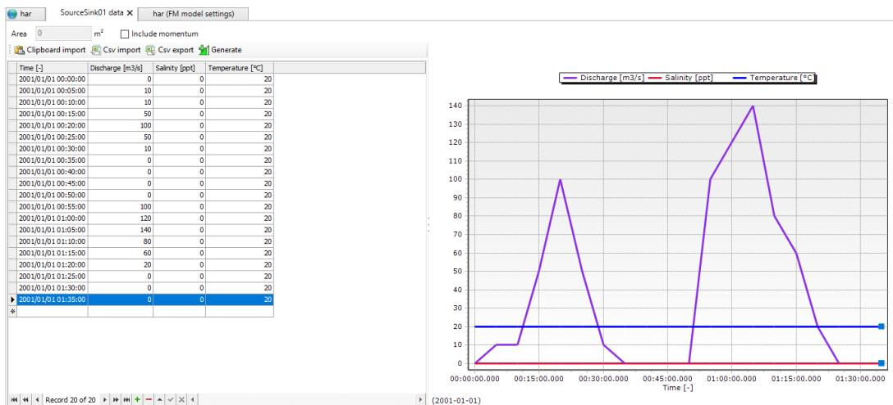

**Figure 7.79:** Specifying time series for sources and sinks in the sources and sinks editor

#### 7.4.11 Intakes, outfalls and coupled intake-outfalls

Many engineering studies concern the design of intakes and outfalls. For instance, studies about positioning of waste water diffusers or coupled intake-outfall design for cooling water at power plants. Intakes and outfalls can be modeled using sinks and sources. A source is a point in the model where a discharge  $Q$  in  $[\text{m}^3/\text{s}]$  is prescribed by a time series ASCII file (Appendix C.4) with at least two columns and, depending on the model settings, possibly more. For each optional constituent that is modelled, an extra column is required. Best known constituents are salinity and temperature and the values in the time series file should be specified as salinity increase in  $[\text{ppt}]$  and temperature increase in  $[^\circ\text{C}]$ .

1. 1 When salinity and temperature are not used in the computation:  
   Model expects two columns, where the first column is the time in minutes, the second is the discharge in  $[\text{m}^3/\text{s}]$ .
2. 2 When either salinity or temperature is used in the computation:  
   Model expects three columns, where the first column is the time in minutes, the second is the discharge in  $[\text{m}^3/\text{s}]$ , the third column contains either the salinity (increase) in  $[\text{ppt}]$  or the temperature (increase) in  $[^\circ\text{C}]$ . Note that third column can be either salinity or temperature depending which constituent is used in the model and which is not.
3. 3 In general, when other constituents are also modelled (e.g. one or more sediment fractions, passive tracers), the column order is as follows: Time, Discharge, Salinity?, Temperature?, (Sed.frac 1, ..., Sed.frac  $n$ )?, Spiral flow intensity?, (Tracer 1, ..., Tracer  $n$ )?.

The location of the source or sink is specified in a polyline file (Appendix C.2), containing a polyline with either multiple points or just one point. If two or more points are specified, a coupled source sink pair is made, the first point is the FROM (or sink) point, the last point is the TO (or source) point. Three variants may occur:

1. 1 Sink point side lies inside a grid cell A, source point also lies inside a grid cell B (A may equal B, but that is rarely useful): water is extracted from cell A and transported to B.
2. 2 Sink point lies outside of the grid, source point lies in a grid cell B: water is discharged into B, a bit like an inflow discharge boundary condition.
3. 3 Sink side lies inside a grid cell A, source side lies outside of the grid: water is extracted from A, a bit like an outflow discharge boundary condition.

points. If only one point is in the `<*.pli>` file, it is assumed to be a source point. Specifying a negative discharge turns the source into a sink.

For 3D computations, the polyline file should have a third column with  $z$ -values. It is good practice to change the `<*.pli>` file into a `<*.pliz>` file. The  $z$ -values are used to determine in which vertical grid cell the source and/or sink lie. The layer number can vary in time in sigma models.

In the case of a coupled pair of sink source points (variant 1), the third and fourth column with the salinity and temperature specification are interpreted as delta salinity and delta temperature. So the values at the source point become the values at the sink point plus the specified delta values. In the case of a single source point there is no corresponding sink point. So the value of the salinity and temperature at the source point is simply the specified value.

The sources and sinks can be specified in the new `<*.ext>` as follows:

```
[SourceSink]
id                     = CoupledSourceSink_1
locationFile            = chanl_westeast.pli
discharge              = chanl_westeast.bc
salinityDelta          = chanl_westeast.bc
...
area                   = 1.5[SourceSink]
id                     = NonCoupledSourceSink_1
numCoordinates         = 1
xCoordinates           = 3.14
yCoordinates           = 1.59
discharge              = sourcepoint.bc
salinity               = sourcepoint.bc
...
area                   = 1.0
```

Notice that the salinity can be specified as either *salinity* or *salinityDelta*. It is good practice to use the *Delta* suffix for coupled source sinks, and to not use the *Delta* suffix for source points. The same holds true for temperature: It can be specified as either *temperature* or *temperatureDelta*, and similarly for any other transported tracer/sediment fraction.

**Warning:**

- ◇ Deprecated: Source-sinks could also be specified in the old `<*.ext>` file. This will become obsolete in an upcoming release and the example below is only kept for migration purposes.

In the old `<*.ext>` file, the above example would look like:

```
QUANTITY=discharge_salinity_temperature_sorsin
FILENAME=chanl_westeast.pli # A file 'chanl_westeast.tim', with same basename
                            # as the polyline should be present
FILETYPE=9
METHOD                  =1
OPERAND                 =0
AREA                    =1.5
```

The specified area in the last line of this file determines (together with the specified discharge) the amount of momentum  $uQ$  that is released at the source point. This is currently only implemented in advection scheme 33 (cf. [Deltares \(2026a\)](#) on Momentum advection). Omitting

this line or specifying a zero area switches off the release of momentum at the source point. The direction of the discharged momentum is in direction of the last two points of the polyline. So a one point polyline is momentumless. Both in 2D and 3D, the momentum can only be directed in horizontal direction.

Sources and sinks are treated explicitly in the numerical scheme. This implies that the actual discharged or extracted amounts of water are limited by the velocity Courant condition  $Q\Delta t/V < 1$ . Not doing so could lead to severe timestep restrictions. Consider for instance a specified extraction in case the extraction point has fallen dry. In that case, a real pump would not be able to extract water and the specified extraction is more likely an input error than an actual description of a physically feasible situation. So, we limit the specified discharges to the local velocity Courant restriction. By specifying observation cross-sections (section 7.4.2.3), one can compare prescribed discharges to the discharges that were actually realised in the model. In case of large differences, the discharge should probably be distributed over a larger number of gridcells, or the extraction channel that feeds the extraction point should be dredged.

When modelling freshwater inflow from a river into a sea, the vertical distribution of the discharge that one should specify depends on the amount of detail available for modelling the saline water - fresh water interface. If the river is modeled with sufficient detail, and the river is well mixed at the upstream model boundary, the mixing process can be part of the modelling and the river can be discharged over the whole vertical. If the mixing process cannot be resolved in the model, for instance if the river is modeled as a point discharge adjacent to a closed boundary, make sure that the whole river is discharged into the top layer or in the top layers, depending on the estimated thickness of the fresh water plume at the discharge cell. If one would have distributed the river discharge over the whole vertical, the size of the fresh water plume would be underestimated because of too much mixing at the river discharge cell.

#### 7.4.12 Lateral discharges

Lateral discharges prescribe additional inflow (or outflow) into the system on specific locations in the model. Lateral discharges are merely adding (or extracting) volume to the model and no momentum. As such, they differ from discharge boundaries (section 11.1.1.1) and source-sinks (section 7.4.11), which *can* add momentum as well. The input of lateral discharges is via the external forcings file (section C.6.3.2); the following subsections describe the grid placement and the forcing information.

##### 7.4.12.1 Grid snapping and distribution of discharge

The spatial location of lateral discharges can be a single point or a set of grid points, and both 1D and 2D points are supported (also combined). The grid snapping depends on the type of input:

- ◇ Polygon area input via a sequence of  $x, y$ -points. The given area selects all pressure points that lie inside this polygon. If the input contains multiple polygons, it is sufficient for pressure points to lie in at least one of these polygons. Note that no "nesting" of polygon rings is detected, polygons can not be used to *exclude* regions from the lateral discharge.

The latter two types also allow the user to limit the grid point snapping to either 1D or 2D, via the keyword `locationType`, but this is optional.

When more than a single grid point (cell) is selected (only possible for polygon input), the prescribed lateral discharge  $Q_{\text{lat},\ell}$  is distributed across all selected grid cells based on the grid cell areas. Specifically, each grid cell  $k$  in the set  $\mathcal{L}_{\text{lat},\ell}$  of selected grid cells receives

 $Q_{\text{lat},\ell,k}$ , defined by:

$$Q_{\text{lat},\ell,k} = \frac{Q_{\text{lat},\ell}}{A_{\text{lat},\text{tot},\ell}} A_k, \quad (7.1)$$

where the total area affected by this lateral is defined as:

$$A_{\text{lat},\text{tot},\ell} = \sum_{k \in \mathcal{L}_{\text{lat},\ell}} A_k. \quad (7.2)$$

This area-weighting ensures that the rate of change for the water levels in all selected grid cells is the same, as far as the forcing by this lateral discharge is concerned. Thus, a lateral discharge with a polygon shape could even be used to model local rainfall.

#### 7.4.12.2 Forcing information for lateral discharges

The forcing information for lateral discharges is the intended flow rate for each of them. It can be defined in two ways, all starting with the keyword discharge:

- ◇ A constant value, e.g., discharge = 10.0, giving a constant flow rate of 10 m<sup>3</sup>/s.
- ◇ A prescribed time series, stored in a <.bc> or (deprecated) <.tim> file, e.g., discharge = forcing.bc. This is described for boundaries in section 11.1.1.1. For laterals, the data format is the same, with one exception: one field Quantity should have the value lateral\_discharge.
- ◇ An externally-provided discharge, i.e., discharge = realtime.

#### 7.4.12.3 Output for lateral discharges

The lateral discharges can also be included in the output files for a model run. The total mass balance contributions can be included in the history file (section E.3.1.6). This is the total sum of lateral in- and outflows (possibly limited, see right-hand side in Equation (7.4.12.1)).

#### 7.4.13 Numerical parameters

In the numerical parameters tab, all numerical parameters related to your computation can be set. The parameters that can be set are described in Table 7.1.

#### 7.4.14 Output parameters

Model runs can produce various types of output files. The **Map** window shows the two most-used types: (*map* and *his(tory)*) output (Figure 7.80).

**Table 7.1:** Overview and description of numerical parameters

| Parameter                          | Description                                                                                                                                                                                                                   |
|------------------------------------|-------------------------------------------------------------------------------------------------------------------------------------------------------------------------------------------------------------------------------|
| Max Courant number                 | The size of the time step, $\Delta t$ , is computed by the computational kernel automatically, each time step by means of the maximum tolerable Courant number. By default, this value is 0.7.                                |
| Wave velocity fraction             | The wave velocity fraction is related to stability of the computation. By using this fraction, the velocity of the flow is enlarged with the wave velocity times this fraction. The value of this fraction is 0.1 by default. |
| Advection type                     | This key depicts the ID of the advection scheme. By default this value is 33.                                                                                                                                                 |
| Water depth limiter type           | The limiter type for waterdepth in continuity equation: 0 means no limiter (default), 1 is the minmod method, 2 the Van Leer method and 4 the monotone central method.                                                        |
| Advection velocity limiter type    | The limiter type for the cell center advection velocity: 0 means no limiter, 1 the minmod method, 2 the Van Leer method and 4 the monotone central method (default).                                                          |
| Salinity transport limiter type    | The limiter type for salinity transport: 0 means no limiter, 1 the minmod method, 2 the Van Leer method and 4 the monotone central method (default).                                                                          |
| Solver type                        | Specification of the Poisson equation type solver for the pressure: 1 = sobekGS_OMP, 2 = sobekGS_OMPthreadsafe, 3 = sobekGS, 4 = sobekGS + Saadilud (default), 5 = parallel/global Saad, 6 = parallel/Petsc, 7 = parallel/GS. |
| Max degree in Gaussian elimination | The maximum degree in the Gauss elimination, part of the pressure solver. This key has the value 6 by default.                                                                                                                |
| Fixed weir scheme                  | Or: fixed weir scheme. 0: none, 1: compact stencil, 2: whole tile lifted, full subgrid weir + factor.                                                                                                                         |
| Fixed weir contraction             | Or: fixed weir contraction. This is the fixed weir flow width contraction factor, being the flow width = flow width times the fixed weir contraction.                                                                         |
| Boundary smoothing time            | Fourier smoothing time on waterlevel boundaries (s).                                                                                                                                                                          |
| Linear continuity                  | Default 0; Set to 1 for linearizing $d(H_u)/dx$ ; link to AdvecType.                                                                                                                                                          |
| Threshold for drop losses          | Apply droplosses only if local bed slope is larger than this specific value.                                                                                                                                                  |
| Theta of time integration          | Level of explicitness/implicitness of time integration.                                                                                                                                                                       |
| Downwind cell H on Q boundaries    | Specifies the way of the upstream discharge boundary: 0 is original hu on qbnd, 1 is downwind hs on qbnd                                                                                                                      |

- •  Output (map)
  - Unstructured Grid
  - water level ( $z_1$ )
  - water depth (waterdepth)
  - number of times flow element was Courant limiting (numlimdt)
  - taucurrent in flow element (taus)
  - normal component of sea\_water\_speed (unorm)
  - flow flux ( $q_1$ )
  - horizontal viscosity ( $\nu_{ij}$ )
  - horizontal diffusivity ( $d_{ij}$ )
  - velocity on flow element center,  $x$ -component ( $u_{xj}$ )
  - velocity on flow element center,  $y$ -component ( $u_{yj}$ )
  - salinity ( $sa_1$ )
  - Chesy roughness ( $cz_s$ )
  - velocity ( $u_{xx} + u_{yy}$ )
- •  Output (his)
  - water level (waterlevel)
  - flow element center velocity vector,  $x$ -component ( $x_{velocity}$ )
  - flow element center velocity vector,  $y$ -component ( $y_{velocity}$ )
  - salinity (salinity)
  - density (density)
  - cross\_section\_discharge
  - cross\_section\_cumulative\_discharge
  - cross\_section\_area
  - cross\_section\_velocity
  - cumulative flux (based on upwind flow element) for salt (cross\_section\_cumulative\_salt)
  - flux (based on upwind flow element) for salt (cross\_section\_salt)
- •  Output (class)
  - Unstructured Grid
  - Water level (mesh $z_2$ ,  $z_1$ )
  - Water depth at pressure points (mesh $z_2$ , waterdepth)

**Figure 7.80:** Output Parameters tab

The history file contains output on specific locations: time series data on observation points (section 7.4.2.2), cross-sections (section 7.4.2.3) and structures (Sections 7.4.2.8 – 7.4.2.10). The map file contains flow quantities on the entire grid at specified time intervals, and can later be used for 2D and 3D visualizations of entire flow fields. The map file can typically turn out much larger than the history file, and it is therefore advised to use larger time intervals for map files than for his files.

Additionally, three more types of output can be requested: restart files, WAQ output, and timing statistics. Restart files are a special type of map file that can later be used as initial states in other runs. Restart files contain several additional flow quantities and are written at specified intervals into one file per each restart time. Typically, one selects a large restart interval in order not to waste disk space. WAQ output files are written by D-Flow FM and are intended to be used as input files to subsequent D-Water Quality runs. More details on water quality modelling can be found in chapter 19. Timing statistics can be produced both in the diagnostics file (via *Statistics output interval*, for viewing basic simulation progress), and in a separate detailed timings file (via *Timing statistics output interval*, for detailed performance analysis).

When double clicking the *Output Parameters* in the *Project* window, the *Output Parameters* tab is highlighted below the central map. All parameters related to the output of your model run are specified here (Figure 7.81). The most common output parameters to set are the parameters related to the water quality, history, map and restart files.

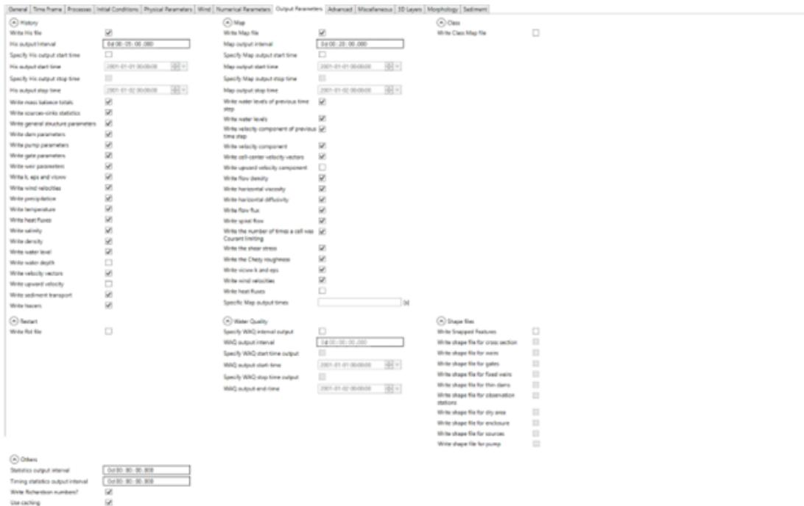

**Figure 7.81:** Overview Output Parameters tab

For each of the three files (water quality, history, map and restart) the input parameters are specified in the same manner (Figure 7.81). Taking his output as an example: when *Write His File* is checked, the output of history file is enabled. *His Output Interval* determines the interval at which the output data is stored in the file; the smaller the interval, the more detailed the output and the larger the file. By default, history output is written from the start until the end of the simulation. Optionally, output can be restricted to a certain time window: to specify different output start and/or stop times, check the box next to *Specify His Output Start Time* and/or *Specify His Output Stop Time* and enter the desired times next to the parameters *His Output Start Time* and *His Output Stop Time*.

When *Write Snapped Features* is activated, then shape files with snapped data will be generated for all quantities, such as fixed weirs and thin dams. For example, for fixed weirs a crest height is specified at both end of a fixed weir polyline. In between linear interpolation is applied, which can be checked via these shape files.

Below, the various output options are described in greater detail. *There is a special requirement on the output parameters for His and Restart files that the Output Interval, Output Start Time and Output Stop Time must be integer multiples of User Time Step. Optionally, the interval (Output Stop Time—Output Start Time) should be an integer multiple of User Time Step.*

#### Write his file

| <i>His Output Interval</i>                | Time interval for history time series.                                                       |
|-------------------------------------------|----------------------------------------------------------------------------------------------|
| <i>His Output Start/Stop time</i>         | Restrict history output to a specified time window.                                          |
| <i>Write mass balance totals</i>          | Enable detailed mass balance time series output in the his file.                             |
| <i>Write (misc.) structure parameters</i> | Enable time series output across general structures, pumps, weirs and gates in the his file. |

**Write map file**

| <i>Map Output Interval</i>        | Time interval for map field time series.                                                                                                                                                                                                                                                                                                                |
|-----------------------------------|---------------------------------------------------------------------------------------------------------------------------------------------------------------------------------------------------------------------------------------------------------------------------------------------------------------------------------------------------------|
| <i>Map Output Start/Stop time</i> | Restrict map output to a specified time window.                                                                                                                                                                                                                                                                                                         |
| <i>Specific Map Output Times</i>  | File containing specific time values at which to produce additional map output snapshots. It the value is not integer, it is firstly set to the least integer larger than or equal to this value. If the computational time does not hit the specified time value, the output snapshot is chosen to be at the time closest to the specified time value. |
| <i>Write water levels, etc.</i>   | Several optionals for enabling/disabling certain quantities output in the map file.                                                                                                                                                                                                                                                                     |

**Write restart file**

| <i>Restart interval</i>           | Time interval for restart files.                    |
|-----------------------------------|-----------------------------------------------------|
| <i>Rst Output Start/Stop time</i> | Restrict restart output to a specified time window. |

**Other output options**

| <i>WAQ Output Interval</i>                   | Time interval for D-Water Quality files in <code>&lt;DFM_DELWAQ_mdu_name\*.hyd&gt;</code> , etc.                     |
|----------------------------------------------|----------------------------------------------------------------------------------------------------------------------|
| <i>Simulation statistics output interval</i> | Interval for simulation progress output (on standard out and diagnostics file).                                      |
| <i>Timing statistics output interval</i>     | Interval for detailed timings output into <code>&lt;mdu_name_timings.txt&gt;</code> for expert performance analysis. |

**Example**One example of input and output parameters (in seconds) is given in [Table 7.2](#). [Table 7.3](#) shows the time (after *Reference Date* in seconds) when output files are generated. We explain this example as follows.

- ◇ The history file has output interval 18 seconds. No parameters are specified for *His Output Start Time* and *His Output Stop Time*, which means that they are automatically set equal to *Start Time* and *Stop Time* of the simulation, respectively.
- ◇ The *Map Output Interval* is 6 seconds, and *Map Output Start Time* is 15 seconds. Since the *Map Output Stop Time* is not given, it is set to equal to *Stop Time*. Moreover, we hope to have output at time given in *Specified Map Output* as 30.5 and 42.1 seconds. These two values are firstly set to 31 and 43 seconds, respectively, in the simulation. Then there will be output snapshots if the computational time hit these two integers. Otherwise, as in this example, the output snapshots will be provided when the computational time hits the time that is greater and the closest to these integers, i.e. at 31.2 and 43.2 (as seen in [Table 7.3](#)).
- ◇ Three parameters are set for the output of the Rst files: the interval, start and stop time.

| Input parameters      |                     | Output parameters            |                     |
|-----------------------|---------------------|------------------------------|---------------------|
| <i>Reference Date</i> | 2007-11-19          | <i>His Output Interval</i>   | 00:00:18            |
| <i>User Time Step</i> | 00:00:00.3          | <i>Map Output Interval</i>   | 00:00:06            |
| <i>Start Time</i>     | 2007-11-19 00:00:03 | <i>Map Output Start Time</i> | 2007-11-19 00:00:15 |
| <i>Stop Time</i>      | 2007-11-19 00:00:51 | <i>Specific Map Output</i>   | 30.5, 42.1          |
|                       |                     | <i>Rst Output Interval</i>   | 00:00:09            |
|                       |                     | <i>Rst Output Start Time</i> | 2007-11-19 00:00:12 |
|                       |                     | <i>Rst Output Stop Time</i>  | 2007-11-19 00:00:45 |

**Table 7.2:** Input and output parameters of the example

| His file     | 3, 21, 39, 51                             |
|--------------|-------------------------------------------|
| Map file     | 3, 15, 21, 27, 31.2, 33, 39, 43.2, 45, 51 |
| Restart file | 3, 12, 21, 30, 39, 45                     |

**Table 7.3:** Time (after Reference Date in seconds) of output files

#### 7.4.15 Miscellaneous

Within the miscellaneous sub-tab, various parameters in relation to waves and equatorial settings can be adjusted. Table 7.4 gives an overview and description of these parameters.

**Table 7.4:** Overview and description miscellaneous parameters

| Parameter             | Description                                                                                                                  |
|-----------------------|------------------------------------------------------------------------------------------------------------------------------|
| Time step type        | Leave at default.                                                                                                            |
| Turbulence model      | See <a href="#">chapter 10</a> .                                                                                             |
| Turbulence advection  | Leave at default.                                                                                                            |
| Water level threshold | Max allowed water level difference between old and new time step in any cell. Run will abort if exceeded. (0 means disabled) |
| Velocity threshold    | Max allowed velocity difference between old and new time step in any cell. Run will abort if exceeded. (0 means disabled)    |
| Dry cell threshold    | Flooding threshold at velocity points. Used in wetting and drying.                                                           |

#### 7.4.16 3D Layers

This tab is used to create a 3D model.

By default the model is 2D, which is specified by the parameter  $K_{mx}$  equal to 0.

A 3D model is created by specifying a positive number of layers ( $K_{mx}$  greater than 0).

The recommended type of vertical layering differs depending on the model application and the processes that you are interested in. There are two options:

- ◇ Sigma-layers: Layers in the  $\sigma$ -model increase or decrease in thickness as the water depth in the model increases or decreases. The relative thickness distribution of the different layers however remains fixed.

- ◇ Z-layers: Layers in the Z-model have a fixed thickness, which does not change as the water depth in the model varies. If the water depth drops below the cumulative thickness of all Z-layers, layer(s) will fall dry.

The most convenient way is to use sigma-layers, as follows.

Figure 7.82: Specification of sigma-layers

This way an evenly distributed vertical layering is specified (all layers are 20 percent of the water depth).

Z-layers are specified as follows.

Figure 7.83: Specification of Z-layers

Table 7.5: Overview and description of Z-layer parameters

| Parameter          | Description                                                                                                                     |
|--------------------|---------------------------------------------------------------------------------------------------------------------------------|
| FloorLevTopLay     | The floor level of the top layer                                                                                                |
| DzTop              | z-layer thickness of layers above level DzTopUniAboveZ                                                                          |
| DzTopUniAboveZ     | The level above which the layers will have a uniform thickness of DzTop                                                         |
| NumTopSig          | The number of sigma-layers on top of z-layers                                                                                   |
| NumTopSigUniform   | Indicating whether the number of sigma-layers in a z-sigma-model is constant (=1) or decreasing (=0) (depending on local depth) |
| zLayerGrowthFactor | Layer thickness growth factor from DzTopUniAboveZ downwards. The parameter replaces the deprecated SigmaGrowthFactor            |


**Note:** By choosing NumTopSig greater than 0, a combination of Z- and sigma-layering is specified.

### 7.5 Save project, MDU file and attribute files

To save your D-Flow FM GUI project, navigate the menu ribbons to *File* and click *Save as*. Choose a location, specify a name and click *Save*. Your project will now be saved in a folder called `<name.dsproj_data>` and a `<name.dsproj>` file is written. Within this folder you will find all input ASCII input files of your model, output files of your model (if the model was run using the GUI) and zip folders containing your restart files. Be aware that the output files are stored within a separate folder in which the input files of your model are stored. The output folder on the same level as the folder containing model input files is empty.

To open a project, navigate the menu ribbons to *File* and click *Open*. Select the `<*.dsproj>`-file of choice and click *Open*.

Importing model or data within a D-Flow FM GUI project can be achieved in two ways. Navigate the menu ribbons to *File* and click *Import*. A drop-down menu appears, allowing you to select what you want to import (Figure 7.84).

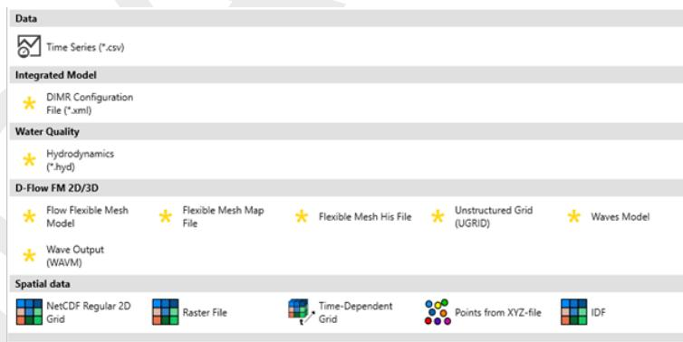

**Figure 7.84:** Model/data import drop-down menu

Alternatively, you can also right mouse click on the name of your project in the *Project* window and select *Import*. An import wizard appears, allowing you to select what you want to import (Figure 7.85).

**Figure 7.85:** Model/data import wizard

Exporting your model can be achieved in the same fashion as importing your model. All model input files will be written to the folder you select. Be aware that model files exported to a folder in which other model files with the same names are present will be overwritten.

## 8 Running a model

### 8.1 Introduction

After defining the input for the D-Flow FM hydrodynamic simulation, the computation can be executed either via the D-Flow FM Graphical User Interface, GUI, (on Windows), see section 8.2, or using batch scripts (on Linux and Windows). Via the GUI, the status of the computation and possible messages are displayed in a separate messages window. When using a batch script, all messages are written to the diagnostics file (Appendix E.1) and inside the terminal (stdout and stderr).

Use a batch script (see section 8.3) in the following cases:

1. 1 Using MPI to run in parallel, see section 8.4
2. 2 Using some queueing mechanism on a cluster
3. 3 Running some unattended simulations, while continuing to work in the User Interface
4. 4 Running on Linux.

### 8.2 Running a scenario using the User Interface

In the *Project* window, select the model you want to run by clicking the first sub-item of the desired model (Figure 9.1).

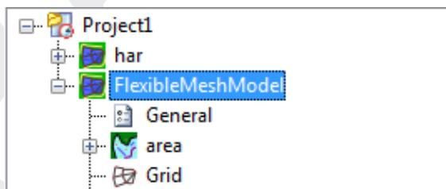

**Figure 8.1:** Selecting the model you want to run in the Project window

Starting the calculation can be achieved in two ways. You can navigate the menu ribbons; go to “Home” and in the group Run click on the button “Run Current”. To run all models that are opened in the *Project* window, click on “Run All” (Figure 8.2).

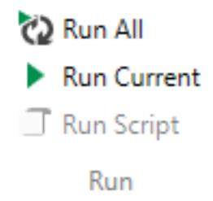

**Figure 8.2:** Group Run in Home ribbon

Alternatively, you can right mouse click the first attribute in the *Project* window of the model you want to run. Next, click “Run Model” to start the calculation. If you first select the model you want to run, the properties window (“View” “Properties”) will show several properties of the model you selected. If you set “ShowModelRunConsole” to true, the model run console of the computational core will be shown during the calculation, providing you with additional information during the model run (Figure 8.3).

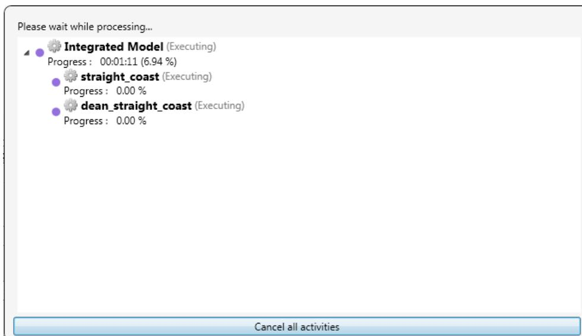

**Figure 8.3:** Run console D-Flow FM User Interface

If you cancel the run by clicking “Cancel all activities”, model results are stored up to the point where you cancel the run.

### 8.3 Running a scenario using a batch script

In general, the following steps have to be carried out:

1. 1 Set-up a D-Flow FM model in the GUI on Windows.

Currently, this is only possible for 2DH (depth-averaged) model simulations. Validate the model.

1. 2 Export the model to either a 'DIMR configuration' or a 'Flow Flexible Mesh model', as described in section 6.2 of this user manual. A 'DIMR configuration' is necessary when the computation consists of a D-Flow FM model integrated with another kernel (e.g. D-RTC or D-Waves). A 'Flow Flexible Mesh model' is optional for a standalone D-Flow FM computation.

In case of a 3D model, change the input for the 3D keywords (number of layers, layer percentages, ...) via the GUI or manually. **Note:** The GUI for 3D modelling contains limited functionality for 3D yet.

1. 3 Copy the complete set of model input files to the machine doing the computation (Windows or Linux).
2. 4 In case of a parallel MPI computation: partition the model. Partitioning can be executed both on Windows (before copying the input files) and Linux (after copying the input files), see section 8.4.2.
3. 5 Start the D-Flow FM model simulation. See section 8.3.2.
4. 6 In case of a parallel MPI computation: after completion of the model simulation, map merging of the output files is often carried out in order to simplify the postprocessing. See section 8.4.4.2.
5. 7 Use QUICKPLOT for postprocessing, see section 8.4.4 and the QUICKPLOT user manual.


### 8.3.1 Commandline executables

Executables should be called via run-scripts prepared by Deltares. To use these prepared scripts, you are supposed to write a one-lined script in your working directory.

Windows (example of a one-lined script that calls a Deltares-prepared script):

```
call <installDir>\x64\bin\run_dimr.bat
```

Linux (example of a one-lined script that calls a Deltares-prepared script):

```
<installDir>/lnx64/bin/run_dimr.sh
```

Advantages of this construction:

- ◇ The script will take care of preparations like setting environment parameters
- ◇ The script will call the correct binary with the correct arguments
- ◇ Uniform look and feel
- ◇ In case of multiple installations, there is no confusion about what version is being used. The prepared scripts, located in an installation directory, will always use the executables in that same installation directory.

Differences between the Windows and Linux prepared run-scripts:

On Windows:

- ◇ The location of the prepared scripts is `x64\<modulename>\scripts inside`  
  `<Your installation base dir>\plugins\DeltaShell.Dimr\kernels\`  
  `where <Your installation base dir> is typically:`  
  `c:\Program Files\Deltares\Delft3D Flexible Mesh Suite HMWQ (xxxx.xx)`
- ◇ The file extension is `<.bat>` or `<.cmd>`.

On Linux:

- ◇ The location of the prepared scripts is `lnx64\bin` inside  
  `<Your installation base dir>`  
  `where <Your installation base dir> is typically:`  
  `/opt/delft3dfm/xxxx.xx`
- ◇ The file extension is `<.sh>` or no extension at all.

### 8.3.2 Running D-Flow FM

Export the input files in the GUI, see section 6.2. Be sure that the GUI produces the 'DIMR configuration' file too, typically called `<dimr_config.xml>`. Write a one-line-script to call the 'run\_dimr' script in the installation directory. The easiest Windows example `<run.bat>`:

```
call <installDir>\x64\bin\run_dimr.bat dimr_config.xml
```

The easiest Linux example `<run.sh>`:

```
<installDir>/lnx64/bin/run_dimr.sh dimr_config.xml
```

Put the one-line-script in the same directory as file `<dimr_config.xml>` and execute it; on Windows double-click the script or execute it in a command box; on Linux execute it in a command box.


**Note:** Example models, with run scripts, are included in the (open source) code. After registering yourself at <https://oss.deltares.nl/>, you can have a look at: [https://svn.oss.deltares.nl/repos/delft3d/trunk/examples/12\\_dflowfm/test\\_data/e100\\_f02\\_c02-FriesianInlet\\_schematic\\_FM](https://svn.oss.deltares.nl/repos/delft3d/trunk/examples/12_dflowfm/test_data/e100_f02_c02-FriesianInlet_schematic_FM)

#### **Remarks:**

- ◇ Executing `<dflowfm>` instead of `<dimr>` is an option when running D-Flow FM stand-alone (not coupled to D-Water Quality, D-RTC, D-Waves etc.). To do this, replace `'run_dimr'` by `'run_dflowfm'` and the `dimr` config file by the `mdu`-file in the one-line-script.
- ◇ Calling `'run_dimr'` with the argument `--help` will show the options
- ◇ Argument after the separator `'--'` are passed through to the D-Flow FM kernel (if the D-Flow FM kernel is the only kernel being started).

## **8.4 Parallel computing using MPI**

### **8.4.1 Introduction**

This section describes parallel computing with D-Flow FM based on the *Message Passing Interface* system (MPI). This can be run both on computing clusters with distributed memory as well as shared memory machines with multiple processors and/or multiple CPU cores. A parallelMPI computation can use multiple machines in a Linux cluster. On Windows, only one machine can be used.

The goal of parallelization of D-Flow FM is twofold: faster computations and the ability to model problems that do not fit on a single machine. A less powerful, yet possibly attractive performance improvement is offered by D-Flow FM's OpenMP-based parallelization (section 8.5.1).

Technical backgrounds on the parallel algorithms in D-Flow FM are described in the Technical Reference Manual Deltares (2026a).

### **Workflow of a parallel run**

A parallel MPI run divides the work between multiple processes. The model is split in submodels or partitions. A separate process is started for each partition, solving the equations on that partition. It will communicate with the neighbouring processes where needed and generate output only for it's own partition. Given a whole model, the workflow is as follows:

1. 1 Partition the model (mesh and model definition file)
2. 2 Execute the parallelMPI job on a multi-core machine or on several machines in a (Linux) cluster
3. 3 Visualize the results from partitioned output files.

## 8.4.2 Partitioning a model

In D-Flow FM a model is defined by the model definition file, `<.mdu>`, the network (mesh) file, `<_net.nc>`, external forcing/boundary condition files, `<.ext>`, et cetera. Partitioning a model concerns partitioning of `<.mdu>`-file and the network file `<_net.nc>`. Other files are shared by all submodels and do *not* need to be partitioned, they should only be available to all processes.

Partitioning a model can be done by executing `run_dflowfm`, which is slightly different on Windows and Linux. It is recommended to use a runscript to partition the model that takes care of paths and environment parameters:

### ❖ Windows

On Windows one has to use the batch file `run_dflowfm.bat`, please see the following example:

```
"<installDir>\x64\bin\run_dflowfm.bat" "--partition:ndomains=8:
icgsolver=6" example.mdu
```

Note that the double quotes, "...", are used for the input arguments, in order to preserve equal-sign, =, when passing those input arguments to the batch file.

### ❖ Linux

On Linux one has to use `run_dflowfm.sh`:

```
<installDir>/lnx64/bin/run_dflowfm.sh --partition:ndomains=8:icgsolver=6
example.mdu
```

The `run_dflowfm` command reads the name of the network file from mdu-file, and generates a subdomain network files by the METIS software package (See Deltares (2026a) and references mentioned therein). Then, it creates a subdomain mdu-files where the parallel Krylov solver `icgsolver` is set to `i`, which can be 6, the PETSc solver (recommended), or, 7, the parallel CG with MILU block preconditioning.

The partition example above results into 8 subdomain mdu-files, and 8 subdomain network files. The subdomain mdu-files have names as `<example_000j.mdu>`, `j=0,1,...,7`. The different items in, e.g. `<example_0000.mdu>` with respect to the original mdu-file are:

```
[geometry]
NetFile                    = example_0000_net.nc[numerics]
Icgsolver                  = 6 (or 7)
```

Assuming that the specified network file in the original mdu-file is `<example_net.nc>`, then the 8 subdomain network files have names `<example_000j_net.nc>`, `j=0,1,...,7`. In other words, they are:

```
example_0000_net.nc   example_0003_net.nc   example_0006_net.nc
example_0001_net.nc   example_0004_net.nc   example_0007_net.nc
example_0002_net.nc   example_0005_net.nc
```

By specifying `writePart_domain = 1` in the output section of the mdu-file, the interpreted network, including the domain partitioning, is written to the file `<DFM_interpreted_idomain_example_net.nc`.


**Note:** In all the partitioning commands shown in this subsection, one can specify a network file `<example_net.nc>`, instead of the mdu-file `<example.mdu>`. This will only partition the network file. However, we strongly suggest to use the mdu-file in the partitioning commands, which partitions both the mdu-file and the network file. The reason is, when a dry points or/and enclosure file is specified in the mdu-file, the partition tool will first delete dry areas based on these files, and then do the partition. If one specifies network file in the partitioning command, then the resulting subdomain network files still include dry areas. Then after running the parallel simulation, the output map files do not contain those dry areas. These will bring inconsistence and further yield a problem if merging the map files.

### 8.4.2.1 More options for the partitioning

The commands in section 8.4.2 partitions the model, including partitioning the network file. This section describes the full possibilities for partitioning a network (mesh). The mesh can be automatically partitioned with the METIS software package, or manually by supplying polygons that define the subdomains. They both produce a cell colouring of the original mesh. In each subdomain, the cells are assigned the same colour, and augmented with ghost cells. This information is saved in variable "idomain" in the resulting partitioning mesh files, e.g. `<example_NNNN_net.nc>`, where NNNN is a subdomain index.

#### Partitioning with METIS

The command (on Linux):

```
<installDir>/lnx64/bin/run_dflowfm.sh --partition:ndomains=n:icgsolver=i <mdu-file>
```

is a basic command to partition with METIS. An advanced command, which enables more options, is:

```
<installDir>/lnx64/bin/run_dflowfm.sh --partition:ndomains=n[:method=0|1][:genpolygon=0|1] |
[:contiguous=0|1][:ugrid=0|1][:seed=i] <mdu-file>
```

The explanation of these options is as follows:

The partition method can be chosen via setting `method=1`, the multilevel K-Way method (default), or `method=0`, the Recursive Bisection method. We refer to Karypis (2013) for more details about these two methods.

Option `genpolygon` specifies if the command generates a partition polygon file (`genpolygon=1`), or not (`genpolygon=0`, default).

By default FM enforces contiguous partitioning, i.e. `contiguous=1`. This can be switched off by setting `contiguous=0`. Only the multilevel K-Way method can enable the contiguous partition. If one requires the Recursive Bisection method, then it is not possible to enforce contiguous partitioning.

In the situation when one gets error message "*The above METIS error message is not a problem. It means that partitioning failed for k-way method with option contiguous=1 because the input graph is not contiguous. Retrying partitioning now with contiguous=0.*", it is no need to worry because it retries partitioning without enforcing contiguous.

Option `seed=i` with `i` a user-defined integer allows to pass a random seed to the METIS partitioner. This allows the user to have reproducible partitioning result between separate runs.

**Note:** These options can be used with scripts `run_dflowfm.bat` and `run_dflowfm.sh`.

**Note:** Partitioning script `generate_parallel_mdu.sh` is outdated and should not be used.


### Partitioning with manually supplying polygons

If the user wants to manually partition the mesh instead of applying METIS, then he has to provide a polygon file `<userpol.pol>` which determines the mesh partition. In this situation, he can use the following command:

```
<installDir>/lnx64/bin/run_dflowfm.sh --partition:icgsolver=i <mdu-file> <userpol.pol>
```

Notice that this command should *not* use the option `ndomains`, but adds the polygon file name at the end. If accidentally, `ndomains` *is* specified, the provided polygon will be ignored and partitioning falls back to using METIS.

**Note:** Similarly, to use a script `run_dflowfm.bat` or `run_dflowfm.sh`, one can remove option `ndomains`, and add the polygon file name at the end of the command, as below:

- ◇ On Windows one can use batch file `run_dflowfm.bat`, please see the following example:

```
"<installDir>\x64\bin\run_dfmoutput.bat" "--partition:icgsolver=6"
example.mdu part.pol
```

Note that " " is used for the input arguments, in order to preserve = when passing those input arguments to the batch file.

- ◇ On Linux one can use `run_dflowfm.sh`:

```
<installDir>/lnx64/bin/run_dflowfm.sh --partition:icgsolver=6
example.mdu part.pol
```

Where, 'part.pol' is the name of a partition polygon file.

And the partitioning obeys the following rules:

- ◇ if the polygons have a  $z$ -value specified, it is considered a subdomain number,
- ◇ if the polygons have no  $z$ -value specified, its order determines the corresponding subdomain number,
- ◇ if a cell is not inside at least one polygon, it is assigned to subdomain 0,
- ◇ In order to avoid that subdomain 0 will be empty, which isn't allowed, the partitioning with polygons should not cover the whole model domain. Then, automatically some cells will be in subdomain 0.
- ◇ Thus, if  $n - 1$  partitioning polygons are used and some cells aren't in these polygons, then a partitioning in  $n$  subdomains is generated by the partition method.
- ◇ if a cell is inside only one polygon, it is assigned to the subdomain defined by that polygon,
- ◇ if a cell is inside more than one polygon, it is assigned to the subdomain with the highest number.

In other words, the polygons may be overlapping and the largest subdomain number is taken in the overlapping regions. If the polygons have no  $\infty$ -value, the polygon order determines the corresponding subdomain number, i.e. the first polygon corresponds to subdomain 1 et cetera and there is no polygon defining subdomain 0.

### Partitioning the mesh with METIS via the User Interface

A separate mesh partitioning is not needed when following the instructions for partitioning a complete model in section 8.4.2. This section describes the full possibilities for partitioning a mesh.

We will firstly focus on the METIS partitioner. Partitioning the mesh from within the User Interface is achieved by the following steps. In the *Project* window, select the model you want to run by means of clicking on the desired model (Figure 9.1). A right-mouse click will open the context menu, then select *Export...* In the window **Select Type of Data...**, choose *Partition exporter* and the partitioning dialog will appear (Figure 8.4).

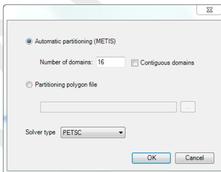

**Figure 8.4:** Partitioning exporter dialog

Enter the desired amount of subdomains, and typically leave the *contiguous* option switched off and the solver type at its default. After pressing *OK*, a file dialog will appear. Enter the name of the mdu-file, *without* any trailing '\_000x' partition numbers: these will be added automatically.

Partitioning the mesh with the graphical user interface is achieved by the following steps: You are prompted for ... Contiguous domains are not necessary for parallel computations in D-Flow FM and often METIS produces contiguous subdomains without enforcing it. Still, some users may want to explicitly enforce contiguous domains. If you want to do so, make sure that your unpartitioned mesh is contiguous. Not being so may cause errors. Note that there is *no* polygon defining subdomain 0. Parts of the mesh not confined by any polygon are assumed to be in subdomain 0. In other words, there are at least  $N - 1$  polygons defining  $N$  subdomains. In that case, regenerate the cell colors/domain numbers again by selecting *Operations* → *Generate domain numbers (polygon or METIS)*. Note that you will not be asked to specify the number of subdomains. The cell coloring/domain numbering is now based on the (modified) polygons and not produced by the METIS partitioner. Manual partitioning with user-specified polygons will be explained in the next section, The entered mesh filename is a *basename* that will be used to derive the partitioning filenames, e.g. `<example_net.nc>` will produce:

#### 8.4.2.2 Partitioning the mdu-file

A separate mdu-partitioning is not needed when following the instructions for partitioning a complete model in section 8.4.2.

Partitioning script `generate_parallel_mdu.sh` is outdated and should not be used.

#### 8.4.2.3 Remaining model input

A parallel run of a D-Flow FM model needs only partitioned `<.mdu>` and `<_net.nc>` files. All other model input is the same as for a standalone run, e.g., meteo forcings, boundary conditions, observation stations and more. These are generally copied to the working directory by the parallel job submission script.

#### 8.4.3 Running a parallel job

On Windows, parallel jobs can only be executed using one node/machine/PC. On Linux, multiple nodes/machines can be used.


#### 8.4.3.1 A parallel simulation via DIMR

Below is shown how to start a parallel simulation on Linux:

```
<installDir>/lnx64/bin/run_dimr.sh -c 3 dimr_config.xml
```

And for Windows:

```
call <installDir>\x64\bin\run_dimr_parallel.bat 3 dimr_config.xml
```

This assumes that the model has already been partitioned in three partitions. When running via DIMR, in the file `<dimr_config.xml>`, in the section about the D-Flow FM component, the following two lines must be present:

```
<process>0 1 2</process>
<mpiCommunicator>DFM_COMM_DFMWORLD</mpiCommunicator>
```

where `<process>` must match exactly with the number of processes.

A Linux cluster usually has a queueing system with a scheduler. Example submission scripts are available upon request.

### 8.4.3.2 A parallel simulation on Linux via D-Flow FM

To run a parallel simulation with a D-Flow FM model on a Linux cluster you have to prepare a submission script with the specific options that the job scheduler on your cluster requires.

Below a simple example is shown of the D-Flow FM submission script for a Linux cluster with the Grid Engine scheduler:

```
#!/bin/bash
#$ -V
#$ -q test
#$ -cwd
#$ -N My_DFlowFM_JOB
#$ -m bea
#$ -M my.email@provider.netexport LD_LIBRARY_PATH=$DFLOWFM/lib:$LD_LIBRARY_PATH
export PATH=$DFLOWFM/bin:$PATHmpiexec -np 4 dflowfm --autostartstop YOUR_MDU_FILE.mdu >out.txt 2>err.txt
```

Assumptions related to the simplified example above:

- ◇ The D-Flow FM simulation has already been partitioned into four domains.
- ◇ The location of the D-Flow FM binaries has been stored in environment parameter 'DFLOWFM'.
- ◇ D-Flow FM is used as a standalone executable, not as part of a DIMR computation.
- ◇ The example script is used in the actual submission command on a Linux cluster, together with a specification of the number of nodes to be used.

The options used above are:

| -V   | Specify that all environment variables active within the qsub utility be exported to the context of the job. |
|------|--------------------------------------------------------------------------------------------------------------|
| -q   | Specify the queue 'test' to be used for this job, if absent default queue is used.                           |
| -cwd | Execute the job from the current working directory.                                                          |
| -N   | Specify the name of the job.                                                                                 |
| -m   | Specifies which message type should be emailed (b=beginning of job, e=end of job, a=abort of job.            |
| -M   | Specifies the email address to send the notification.                                                        |

In order to submit more complicated, e.g. multi-node simulations, additional options that are scheduler dependent have to be added.

### 8.4.4 Visualizing the results of a parallel run

The map and history output files (as introduced in section 7.4.14) deserve special attention in parallel runs.

The history file — with time series for observation points, structures and more — is written only by process #0, and all model-global data has already been aggregated into that single file: `<mdu_name_0000_his.nc>`.

The map file — with full-grid output of flow fields — is written for each domain separately as `<mdu_name_000X_map.nc>`. This saves communication overhead during the parallel run.

The partitioned map files contain duplicate points, since each file also contains the domain's ghost nodes. For postprocessing these map files, two options are now available:

1. 1 Direct plotting of the set of all map files in Delft3D-QUICKPLOT: the partitioned file series will be recognized automatically, and the partion results will be drawn on top of each other. For water levels this gives good results.
2. 2 Merging the partioned map files into a single global map file with the `dfmoutput` tool. The resulting map file can then be loaded again in Delft3D-QUICKPLOT and other post-processing utilities.

#### 8.4.4.1 Plotting all partitioned map files with Delft3D-QUICKPLOT

When opening one of the partitioned map files into Delft3D-QUICKPLOT, it will automatically detect that the map file is part of a series. An additional select list *Domain* appears, see Figure 8.5. Select either “all partitions”, or a partition of your choice, and proceed with the plotting as normal (section 9.3).

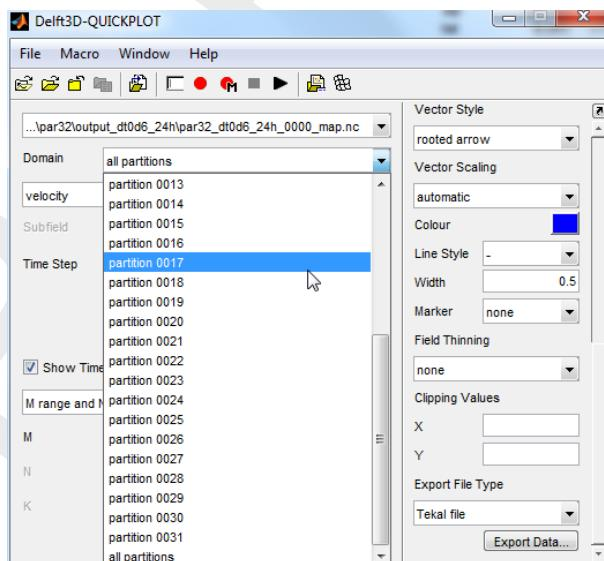

*Figure 8.5: Domain selector in Delft3D-QUICKPLOT for partitioned map files.*

#### 8.4.4.2 Merging multiple map files into one

The partitioned map files of a parallel model run can be merged into a single global map file with the `dfmoutput` tool. It cuts off ghost nodes, and concatenates all grid points, taking care of correct global renumbering. Usage:

```
dfmoutput.exe mapmerge --infile FILE1 FILE2 [--outfile DSTFILE]
```

where FILE1, FILE2 are the input files, e.g. `<mdu_name_0000_map.nc>`, `<mdu_name_0001_map.nc>`, and you can add more input files here. And DSTFILE is an optional output file name (the default is `<mdu_name_merged_map.nc>`).

It is recommended to use a runscript, that takes care of paths and environment parameters. Please see the following:

◇ **Windows**

On Windows one can use batch file <run\_dfmoutput.bat>:

```
"<installDir>\x64\bin\run_dfmoutput.bat" mapmerge
--infile FILE1 FILE2 [--outfile DSTFILE]
```

**Remarks:**

- ◇ Note that for this script the number of arguments is limited to 9. Therefore, considering 2 arguments `mapmerge` and `--infile`, only maximal 7 map-file names could be passed, which means that only maximal 7 map-files can be merged if using the option `--infile`.
- ◇ If one wants to merge more than 7 map-files using this batch file, then the user should use `--listfile` instead of `--infile`, then one can use the command option `--listfile` (see the list of more advanced options below), instead of `--infile`.

An example is:

```
dfmoutput.exe mapmerge --listfile list.txt
```

where file `list.txt` contains a list of names of all input map files, as shown below, with one file name on a single line.

```
model_0000_map.nc
model_0001_map.nc
model_0002_map.nc
model_0003_map.nc
model_0004_map.nc
model_0005_map.nc
model_0006_map.nc
model_0007_map.nc
```

◇ **Linux**

On Linux one can use <run\_dfmoutput.sh>:

```
<installDir>/lnx64/bin/run_dfmoutput.sh -- mapmerge --infile FILE1 FILE2
[--outfile DSTFILE]
```

Note, in this command, there is a space between "--" and "mapmerge". Moreover, one can also use option "--listfile" instead of "--infile".

**Remark:**

- ◇ Since a restart file is a special type of map-file, partitioned restart files can also be merged using the above command.

The built-in help gives a list of more advanced options:

```
> dfmoutput mapmerge --help
usage: dfmoutput mapmerge [--infile FILE1 [FILE2 FILE3...]] [--listfile LISTFILE]
                                [--outfile DSTFILE] [--force] [--help] [--version]Merge multiple map files from parallel run into one.Optional switches:
--infile FILE1 [FILE2...], -i FILE1 [FILE2...]
                default value
                One or more input files.
--listfile LISTFILE, -F LISTFILE
                Pass contents of LISTFILE as input files.
--outfile DSTFILE, -o DSTFILE
                Write output to file DSTFILE. Default: <model>_merged_map.nc
--force, -f
                default value .false.
                Force overwriting of existing output file.
--help, -h
```

```
Print this help message
--version, -v
Print versionExamples:
dfmoutput mapmerge           --infile model_0000_map.nc model_0001_map.nc
dfmoutput max_running_mean  --infile hisfile.nc
dfmoutput max25              --infile hisfile.nc
dfmoutput genfilter           --infile hisfile.nc --intval 6
```

## Merging 2D map files

2D (or 3D) map file merging has a few special aspects:

- ◇ All data variables and underlying spatial coordinate variables are merged into one file, cutting off all ghost cells.
- ◇ Near partition boundaries, the data written to the merged file is taken from the input partitioned file that "owns" the grid locations near those boundaries. For grid cells, this is the partition in whose interior the grid cells lie. For shared mesh nodes and edges the partition is based on the lowest partition number owning the grid cell that they are part of.
- ◇ The order of the merged data values is in a so-called concatenated way. This means that all non-ghost points are concatenated domain-by-domain, keeping the local ordering for each partitioned submodel. This means that the output map file is likely to have a different ordering than the single map file from a sequential model run. This should not be an issue for any postprocessing, since all CF- and UGRID- domain variables have been merged in a consistent way, so the file remains correctly self-contained.
- ◇ Any user-defined vector dimensions for multidimensional data are also copied, if they are necessary for variables defined on the spatial domain (for example velocity components, tracers or vertical layering).

## 8.5 Run time

The actual run time of a model can vary considerably depending on a variety of factors such as:

- ◇ The problem being solved, characterised by the number of active grid points, the number of layers in the vertical or the number of processes taken into account.
- ◇ The length of the simulation in time and the time step being used.
- ◇ The hardware configuration that is used and the work load of the processor.

For this reason, only some general considerations are given to determine the run time of a hydrodynamic simulation. On a PC or a workstation without separate I/O-processors the CPU time is the sum of the processor time and the I/O time.

The *processor time* required for a simulation is primarily determined by:

- ◇ The model definition, i.e., the number of active grid points and the number and type of the processes taken into account.
- ◇ The length of the simulated period in terms of the number of time steps executed.

The *I/O time* is determined by:

- ◇ The number of times the computed data are written to history, map, restart files and other communication files for water quality or wave model couplings.
- ◇ The number of observation points, cross-sections and the number of output parameters.

The simulation performance is defined as the CPU time per grid point per time step per constituent:

$$\text{simulation performance} = \frac{\text{CPU time}}{\text{Dnt} \cdot \text{Ndx}} \quad [\text{system seconds}]$$

where:

Dnt is the number of time steps executed  
 Ndx is the number of flow nodes

The simulation performance is written to the diagnostic file at the end of the simulation.

### 8.5.1 Multi-core performance improvements by OpenMP

D-Flow FM has built-in support for multi-core parallelism using OpenMP<sup>1</sup>. This speeds up calculations by employing multiple processor cores in a single (shared-memory) computer, e.g., a modern-day notebook. OpenMP-parallelism in D-Flow FM does not scale as well as MPI-parallelism (section 8.4), but it comes for free (not any change to model input necessary) and can give a welcome performance improvement (approximately double speed on an Intel quadcore CPU). It is strongly advised to limit the number of OpenMP-threads to one less than the number of physical cores in your machine, thus also ignoring any hyperthreading. Mixing OpenMP with MPI is possible, but the optimum with respect to computation time is expected with only MPI parallelisation.

An OpenMP example on Windows:

```
set OMP_NUM_THREADS=3
call <installDir>\x64\bin\run_dimr.bat dimr_config.xml
```

An OpenMP example on Linux:

```
export OMP_NUM_THREADS=3
<installDir>/lnx64/bin/run_dimr.sh dimr_config.xml
```

### 8.5.2 Parallel computations in coupled simulations

D-Flow FM can run in parallel in simulations where it is coupled to other applications, like D-Waves and/or D-RTC, via DIMR. Obtaining a good performance is delicate and depends on many factors related to all modelling aspects, including hardware, operating system, queueing software, security tools, D-Flow FM itself and model setup. This section describes a recently solved performance issue and might help to get more insight.

When combining D-Flow FM with D-Waves in a coupled simulation and using parallelization, the default configuration is that D-Flow FM uses MPI (possibly combined with OpenMP) and SWAN uses OpenMP. When D-Flow FM is computing, SWAN is waiting, and when SWAN is computing, D-Flow FM is waiting; they can share resources (CPUs). [section 18.6.9](#) describes a way to check efficiency of a simulation where D-Flow FM is coupled to D-Waves. Below are hints for solving inefficiency:

#### Mixing MPI with OMP

If more CPUs are available than the number of MPI processes being defined, the performance

<sup>1</sup><http://www.openmp.org>

might improve by using multiple OMP threads. Use this with care because the performance might worsen if the total number of processes is higher than the number of CPUs. The safest way to keep control is by specifying the number of OMP threads explicitly. This can be done for D-Flow FM and SWAN separately by using the following two environmental parameters:

```
export OMP_NUM_THREADS_SWAN=4
```

```
export OMP_NUM_THREADS=1
```

Typically, when D-Flow FM is coupled to D-Waves, D-Flow FM uses MPI partitions combined with one OMP thread ( $OMP\_NUM\_THREADS=1$ ) and the number of threads used by SWAN matches with the number of available cores.

#### **Remark:**

- ◇ Deltares is improving the control on OMP threads. The number for D-Flow FM can also be set using a commandline option. More standardized options can be expected. The support for the environmental parameters, as in the example, above will pursue.

#### **No OMP**

Controlling threads is less complicated when using solely MPI-partitions. See [section 18.6.10](#) for coupling D-Flow FM (using MPI) to SWAN (using MPI). The following settings can be used for safety:

```
export OMP_NUM_THREADS_SWAN=1
```

```
export OMP_NUM_THREADS=1
```

#### **Avoid pinning**

Tasks can be pinned to a specific CPU. This might increase the performance. But when D-Flow FM is coupled to D-Waves, pinning is disastrous for the performance because D-Flow FM MPI partitions that are pinned to specific CPUs blocks these CPUs from being used by SWAN. Pinning can be enforced by the queuing system, the MPI library and the operating system. Pinning by Slurm, which is a popular job scheduler for Linux clusters, has to be avoided explicitly by adding the following line to your run-script:

```
export SLURM_CPU_BIND=none
```

**Note:** Do not apply the disabling of pinning globally on a cluster using something like `TaskPluginParam=none`, because a side effect will be that all processes will spin-up threads for the total host core counts, causing severe thread over-subscription, massive load spikes, and perhaps node crashes.


#### **Avoid busy-wait**

Running tasks might consume 100% CPU time while waiting for an MPI-barrier. In some situations this is the fastest way to continue the computation, but when D-Flow FM runs coupled to D-Waves, the waiting D-Flow FM partitions consume all the available CPU time and slow down the SWAN computation. In DIMR (on Linux), the call to `MPI_Barrier` is replaced by a call to `MPI_Ibarrier`, combined with a sleep, when waiting for D-Waves to finish. In case changes are needed:

- ◇ Try to get the correct behaviour by using (MPI-related) environmental parameters. For example, adding the following line to the run-script might help:

```
export I_MPI_THREAD_YIELD=3
```

Disadvantage is that this influences *all* barriers, including barriers for D-RTC, which might be desastrous for the performance. If differentiation per application is needed, try the item below:

- ◇ By default, the barrier for D-Waves on Linux uses `MPI_Ibarrier` combined with a sleep; all other barriers use the default `MPI_Barrier`. This can be overruled per application in the DIMR config file by adding the following line to the related application block:

```
<mpiBarrierSleep>200</mpiBarrierSleep>
```

checks. If the value specified is zero, this will result in the usage of `MPI_Barrier` for this application. If an integer above zero is set, this will result in the usage of `MPI_Ibarrier` combined with the specified sleep period. Tests show that the exact value of the sleep period is not sensitive; if the D-Waves computation takes (more than) several seconds, any sleep-value between 10 and 500 milliseconds will do. The value of `mpiBarrierSleep` being used is echoed to stdout, for each application in the configuration, when DIMR is started with maximum debug output by adding `-d 0` to its command line arguments.

### DIMR replacement

DIMR is used by default to couple applications. As an alternative, a Python script can be written replacing DIMR. The Python script can use the BMI-interface of the Deltares applications to perform the model execution and exchange data. Users can add their own applications.

#### Remarks:

- ◇ Arranging good performing coupled (parallel) applications via a Python replacement of DIMR is challenging.
- ◇ Deltares is currently investigating the use of `preCICE`<sup>2</sup>, as alternative for DIMR.

## 8.6 Files and file sizes

For estimating the required disk space the following files are important:

- ◇ history file
- ◇ map file
- ◇ restart file

### 8.6.1 History file

The size of the history file is determined by:

- ◇ The number of monitoring points (observation points + cross-sections): H1.
- ◇ The number of quantities stored: H2.
- ◇ The number of additional process parameters, such as salinity, temperature, constituents and turbulence quantities, taken into account in the simulation: H3.
- ◇ The number of time the history data is written to the history file: H4.

You can estimate the size of a history file (in bytes) from the following equation:

$$\text{size history file} = \text{H1} \cdot (\text{H2} + \text{H3}) \cdot \text{H4} \cdot 8 \text{ bytes.}$$

As a first approximation you can use  $\text{H2} = 8$ .

### Example

For a 2D simulation with density driven currents (salinity and temperature), a simulated period of 12 hrs 30 min, a time integration step of 5 minutes, 30 monitoring points and each time step being stored, the size of the history file will be of the order of 384 kBytes. For the same model but now with 10 layers in the vertical the file size will increase to about 4 MBytes. These estimates show that history files are rather small. Unless the number of monitoring points is excessively large the history files are typically much smaller than the map output files.

<sup>2</sup><https://precice.org/>

### 8.6.2 Map file

The size of the map file is determined by:

- ◇ The size of the model, i.e. the number of grid cells multiplied by the number of layers ( $Ndxi \cdot Kmax$ ):  $M1n$ , and the number of flow links (open grid cell edges) multiplied by the number of layers ( $Lnx \cdot Kmax$ ):  $M1l$ .
- ◇ The number of quantities stored on grid cells and flow links:  $M2n$ ,  $M2l$ , respectively.
- ◇ The number of process parameters taken into account, such as salinity, temperature, constituents and turbulence quantities:  $M3$ .
- ◇ The number of time steps for which the map file is written:  $M4$ .

#### Remark:

- ◇ For a more refined estimate you should distinguish between parameters that depend or not on the number of layers used (such as the water level). For a 3D simulation the latter quantities can be neglected, for a 2D simulation they must be accounted for. As a first estimate we double the number of quantities  $M2$  in a 2D simulation.

As a first approximation you can use  $M2n = 5$ ,  $M2l = 5$  for a 3D simulation and  $M2n = 8$ ,  $M2l = 5$  for a 2D simulation.

You can estimate the size of a map file (in bytes) from the following equation:

size map file =  $[M1n \cdot (M2n + M3) + M1l \cdot M2l] \cdot M4 \cdot 8$  bytes.

#### Example

For a 2D simulation with 6800 grid cells and 13000 flow links, simulation results stored for a period of 7 days, and the file is written with an interval of 60 minutes the size of the map file will be about 161 MBytes. For larger models the map file can easily become excessively large, as result the map file is less frequently written, for instance every 2 or 3 hours.

### 8.6.3 Restart file

A restart file is a special type of map file, where only one time snapshot per file is saved (i.e.,  $M4 = 1$ ). No grid or flow geometry information is stored in a restart file, except for the flow cell/link information (denoted by  $M5$ ). Moreover, the restart files obtained after a parallel run contain some necessary information about parallelization (denoted by  $M6$ ). Similarly to the equation of size map file above, one can write the estimating equation as follows:

size rst file =  $[M1n \cdot (M2n + M3) + M1l \cdot M2l + M5 + M6] \cdot 8$  bytes,

where  $M6 = 0$  for a sequential run.

### 8.7 D-Flow FM command-line argument

Sometimes it's useful to run the D-Flow FM binary from the command line, without using any prepared script. On Linux this binary is named `dflowfm`. (`dflowfm-cli.exe` on Windows). On Linux a basic non-interactive run is started by:

```
> dflowfm --autostartstop MDUFILE
```

```
> dflowfm --help
Usage: dflowfm [OPTIONS] [FILE]...FILE may be one of the following types:
 *.mdu                          model definition file
 *.cfg                          display settings file
 *.pol, *.xyz, etc.          additional model filesOptions:
 --autostart MDUFILE
   Auto-start the model run, and wait upon completion.
 --autostartstop MDUFILE
   Auto-start the model run, and exit upon completion.
 --noautostart MDUFILE
   Disable any AutoStart option in the MDU file (if any).
 --partition:OPTS (MDUFILE|NETFILE) [POLFILE]
   Partitions the unstructured model+grid in MDUFILE into multiple files.
   or: the unstructured grid in NETFILE into multiple files.
   POLFILE is an optional polygon file which defines the partitions.
   Only used when ndomains in OPTS is undefined or 0.
   OPTS is a colon-separated list opt1=vall:opt2=val2:...
     ndomains = N                Number of partitions.
     method      = [123] Partition method: K-Way(1, default), Recursive Bisection(2), Mesh-dual(3).
     genpolygon= [01]   Generate partition polygon(1), or not (0).
     contiguous= [01]   Enforce contiguous grid cells in each domain.
                   Only available when K-Way is enabled (method=1).
         icgsolver = [67]   Parallel CG solver (When MDUFILE is specified).
                   6: PETSc (default for parallel), 7: parallel GS+CG.
                   ugrid     = [01]   write cf UGRID 0.8 (0, default) or UGRID 1.0 (1)
                   seed      = i      User-defined random seed value, for reproducible partitionings. Only used when i not equal to 0.-t N, --threads N
   Set maximum number of OpenMP threads. N must be a positive integer.
 --processlibrary PROCESSLIBRARYFILE
   Specify the process library file to be used for water quality processes.
 --openprocessdllso OPENPROCESSDLLSOFILE
   Specify the open process dll/so file with additional subroutines to be used for water quality processes.
 --bloomspecies BLOOMSPECIESFILE
   Specify the BLOOM species definition file to be used for water quality processes.
 --refine:OPTS NETFILE
   Refine the unstructured grid in NETFILE from commandline.
   OPTS is a colon-separated list opt1=vall:opt2=val2:...
     hmin=VAL
     dtmax=VAL
     maxlevel=M
     connect=[01]
     directional=[01]
     outsidecell=[01]
     drypointsfile=<filename (*.pol, or cutcellpolygons.lst)>--makeld2dlinks[:OPTS] NETFILE [-o OUTPUTFILE]
   Make ld2d links for the given NETFILE and save the resulting net.
   OPTS is a colon-separated list opt1=vall:opt2=val2:...
     method        = (ltol | lton_emb | lton_lat | long) Coupling method.
     linktype      = N        The link type (kn3) that will be used for all links (only for method=ltol).
     connectldend = VAL   The search distance for coupling 1D endpoints.
   OUTPUTFILE is the name under which the file will be saved.
     When not specified, the original NETFILE will be overwritten.
 --cutcells NETFILE
   Cut the unstructured grid in NETFILE with the polygons specified
```

```
        in a file called 'cutcellpolygons.lst'.--no-geom-cache
    Do not load nor save cache file with geometry information.-q, --quiet
    Minimal output: Only (fatal) errors are shown.--verbose[:level_stdout[:level_dia]], e.g., --verbose:INFO:DEBUG
    Set verbosity level of output on standard out and in diagnostics file.
    where level is in: {DEBUG|INFO|WARNING|ERROR|FATAL}
    Levels are optional, default is INFO on screen, DEBUG in dia file.-h, --help
    Display this help information and exit.-v, --version
    Output version information and exit.
```

## 8.8 Restart a simulation

D-Flow FM allows to restart a simulation, not from the original starting time, but from a user-specified time with all the information at that time. In other words, for a model which has a long spinup time from  $t_{\text{start}}$ , instead of restarting from  $t_{\text{start}}$ , one can restart another simulation of the same model from a later time  $t_{\text{rst}}$ , where  $t_{\text{start}} \leq t_{\text{rst}} < t_{\text{stop}}$ . And the results for times  $t_{\text{rst}} \leq t \leq t_{\text{stop}}$  are the same as in the original simulation run.

This can be achieved by following steps:

1. 1 In order to obtain restart files  $<\_rst.nc>$ , this needs to be enabled in the output parameters (see section 7.4.14 for more details about how to set output parameters).
2. 2 Run the original model from  $t_{\text{start}}$  to  $t_{\text{stop}}$ , resulting in restart files.
3. 3 To restart the simulation from time  $t_{\text{rst}}$ , in the mdu-file modify `TStart` to  $t_{\text{rst}}$ , *and* fill in the name of corresponding restart file in `RestartFile` of the `[restart]`-section. Moreover, place the corresponding restart file relative to the directory of this mdu-file.

To restart a parallel simulation, one can use any of the following methods:

Method 1 On each subdomain use its own restart file.

Method 2 Merge all the subdomain restart files into a single global restart file (see section 8.4.4.2), and then use it for all the subdomains. This means to put the name of this merged file as `RestartFile` in all subdomain mdu-files. This method is supported when restarting with the same, or a different domain partitioning. Moreover, such a merged restart file can also be used to restart a sequential run.

The above two methods require taking care of the name of the restart file in subdomain mdu-files. D-Flow FM automatically fills in the correct names, when partition an mdu-file to subdomain mdu-files (see section 8.4.2), in the following way:

For Method 1 When  $<mduname\_YYMMDD\_HHMMSS\_rst.nc>$  is filled in `RestartFile` of the original mdu-file, partition this mdu-file gives subdomain mdu-files with `RestartFile` as  $<mduname\_000X\_YYMMDD\_HHMMSS\_rst.nc>$  for each subdomain  $<000X>$ .

For Method 2 If the string word "merged" is contained in the name of `RestartFile` in the original mdu-file, then this file name is kept to all the subdomain mdu-files after partitioning.

It is also possible to use a map file as a restart file, following the above approaches. Notice that in this case, one needs to specify the `RestartDateTime` in mdu-file as well. However, we strongly recommend to use  $<\_rst.nc>$  file instead of a map file.

**Note:** Restarting from a map file is only possible for the old output format (`MapFormat=1`) and not yet for the default NetCDF UGRID output format (`MapFormat=4`).


### 8.9 Frequently asked questions

This chapter aims to help you with common questions that may arise while using D-Flow FM.

#### 1 Question

My model does not run/crashes. What's wrong?

#### Answer

The diagnostics file is the starting point for finding out what went wrong. See [Appendix E.1](#) for a detailed description of the contents of this file, and the order of model run output. Globally, ask yourself the following questions:

- ◇ Was the mdu-file found?
- ◇ If yes, was the model successfully loaded? Common mistakes are missing boundary or meteorological forcings file.
- ◇ If yes, was the time loop successfully started? Possible errors are non-writeable output files.
- ◇ If yes, does the dia file contain any messages from during the time loop? Possible errors are solver convergence errors.
- ◇ If not, did the run end successfully?

#### 2 Question

I get a warning that my network is non-orthogonal. Can I loosen the orthogonality threshold?

#### Answer

Unfortunately, no. Orthogonality is very important for accuracy: advised orthogonality values for your grid are around 0.01, preferably lower. The current threshold is already very high at a value of 0.5. Use D-Grid Editor to improve your grid orthogonality.

#### 3 Question

When running a computation with a batch script on Linux, should I call `DIMR` or `dflowfm`?

#### Answer

When running D-Flow FM online in combination with for example D-RTC, you have to run via DIMR. When running a standalone D-Flow FM computation, you can also choose `dflowfm`. Deltares aims on one method for running computations and that is via DIMR. But not all D-Flow FM functionality is yet available via DIMR, which involves functionality for partitioning a model (Section 8.4.2)

## 9 Visualize results

### 9.1 Introduction

A model run will produce two types of output:

1. 1 a graph or history (<\*.his>-file) for a specific quantity on a location
2. 2 a map (<\*.map>-file) for a specific quantity

Both are stored in files within the project, as described in section 8.6.

D-Flow FM provides basic visualization of the model and the model results. Advanced and tailor-made visualization is possible by the export of the his- and/or map-files, and inspection with dedicated visualization applications. Some are provided and described below.

### 9.2 Visualization with the User Interface

When your model run has finished, a new folder called “Output” has appeared at the bottom of the attributes of your model in the *Map* window. Inside this folder, all output quantities of the his-, and map-files can be found, as well as a folder called “States”, in which you find all restart files written during the model run. Output folders have also appeared in the *Map* window; “Output (map)” and “Output (his)”. Both the results of your map and his files can be viewed in the central map by means of enabling the desired quantities from the *Map* window (Figure 9.1).

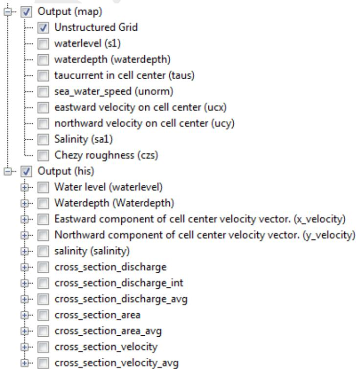

**Figure 9.1:** Example of setting output (in)visible in the Map window

The time navigator can be used to slide through the different time steps in the output files. If your model is relatively large, the drawing performance of the interface can be improved

dramatically by enabling QuadTree visualizations in the properties window of the layer you want to visualize. To this end, select the layer you want to visualize in the ...

### 9.3 Visualization with Delft3D-QUICKPLOT

The interface of the Delft3D-QUICKPLOT allows to open the netCDF output files from a D-Flow FM simulation. In the interface you can select data fields, make a selection of time steps, stations or specify a preferred figure presentation options. After selection of a certain options you can visualize your data by using the “Quick View” button. To add another plot to an existing figure the “Add to Plot” button should be used.

When plotting the map output files from a D-Flow FM simulation, by default the presentation type “markers” will be selected. To smoothly visualize your results it is recommended to change presentation type into “polygons” and then select the option “Fill Polygons” (see the example on the Figure 9.2).

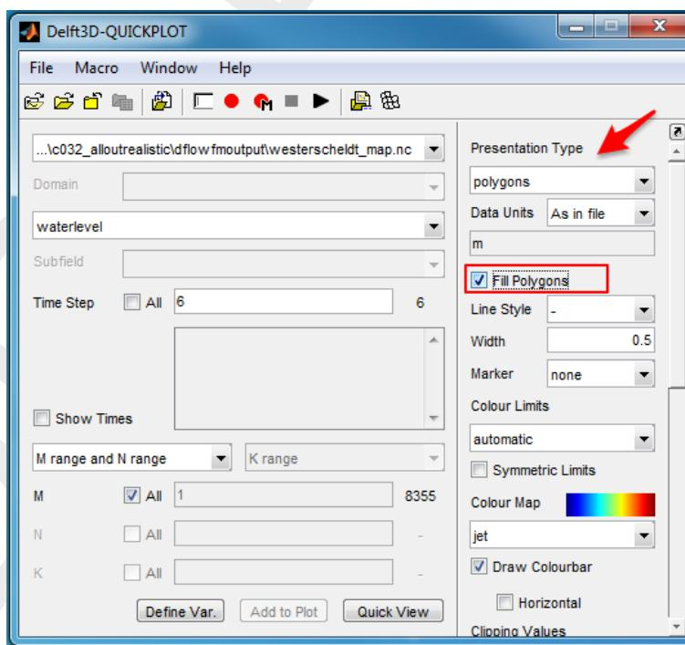

**Figure 9.2:** Useful map visualization options in the Delft3D-QUICKPLOT

See the Delft3D-QUICKPLOT User Manual for full details and a description of the routines and their use.

### 9.4 Visualization with Matlab

OpenEarthTools is an open-source toolbox that includes, among other components, MATLAB scripts and functions for the pre- and postprocessing of D-Flow FM files. For detailed guidance on getting started and using these tools effectively, visit: <https://publicwiki.deltares.nl/display/OET/OpenEarth+tutorials#OpenEarthtutorials-GettingtheOpenEarthtools>. Note: OpenEarthTools is provided without official support.

## 9.5 Visualization with Python

History-files can be easily visualized using *xarray* (<https://docs.xarray.dev/en/stable/>). Similarly, map-files can be visualized using *xugrid* (<https://deltares.github.io/xugrid/>). *Xugrid* is a UGRID wrapper around *xarray* that exposes many plotting options and processing options like coordinate transformation, re-indexing, rasterizing and regridding. If you want to do more advanced map-file visualization like horizontal and vertical (2DV cross section) slicing you can use *dfm\_tools* ([https://deltares.github.io/dfm\\_tools/](https://deltares.github.io/dfm_tools/)), this package uses *xarray* and *xugrid* where possible and adds several extra features to read, process and visualize the history- and map-files of D-Flow FM. It can also works with multiple partitions and with older D-Flow FM mapformats.

## 10 3D modelling in D-Flow FM

In D-Flow FM 3D modelling is summarized as follows:

- ◇ 3D hydrodynamic modelling is fully available in D-Flow FM, including transport of salinity, temperature and conservative tracers.
- ◇ However, 3D sediment modelling is of TRL level 4-6 (prototype), with the definitions of the Technical Technology Readiness Levels (TRL) in Section 2.7.
- ◇ In D-Flow FM  $\sigma$ -co-ordinates,  $z$ -co-ordinates and  $z$ - $\sigma$ -co-ordinates are possible in the vertical. For deep water applications (roughly deeper than one kilometer)  $z$ - $\sigma$ -co-ordinates are preferred. In this way, relatively thin  $\sigma$ -layers of a few meters near the surface can be combined with  $z$ -layers of an increasing thickness in deeper parts.
- ◇ The GUI for 3D modelling is incomplete yet. Therefore, some keywords for 3D modelling can be set via the GUI, while others have to be edited manually; see section section 7.4.16.
- ◇ For preprocessing, processing and postprocessing of 3D modelling a detailed workflow description is available, see the tutorials in section 24.2. Preprocessing is supported. For processing the standard approach of DIMR is available. Postprocessing of 3D model results is supported with QUICKPLOT.
- ◇ In general, D-Flow FM has been developed for coastal applications and therefore focusses on processes in relatively shallow areas of up to a few hundred meters deep. For such applications D-Flow FM performs adequately. However, sometimes D-Flow FM models also contain kilometers deep oceanic areas. D-Flow FM has shown to compute adequate model results in some of these applications, but this cannot be guaranteed. For example, checkerboarding of model results could occur. More research in oceanic waters is needed.

**Note:** In case of 3D modelling, for one numerical keyword the default value isn't optimal yet. So, please read section section 10.8.1 in order to change this keyword manually.


### 10.1 Introduction to vertical layering approaches

In many rivers the flow is well mixed and can be described efficiently in 2D using the logarithmic flow profile. In oceans, seas, estuaries and lakes, stratified flows may occur, the flow profile may not be logarithmic anymore and 3D modelling is required. Vertical gradients in velocity, salinity and temperature have to be computed accurately. Especially in stratified systems this might be a challenge. High gradients may occur around pycnoclines, and near the surface and near the bed. Fortunately, there is no need to resolve the bed boundary layer because it is fully developed in most cases. The law of the wall is then well applicable to include the effect of bottom friction.

In the vertical, two approaches are widely used: the so-called  $\sigma$ -co-ordinate (terrain-following) and  $z$ -co-ordinate (geopotential) models. A  $\sigma$ -co-ordinate model (Phillips, 1957) has a fixed number of layers everywhere and the layer interfaces move in time with the varying water level, while a  $z$ -co-ordinate model uses layer interfaces at fixed vertical positions. Consequently, in case of  $z$ -layers the number of layers at a location varies with its water depth, see Figure 10.2. In D-Flow FM both layer approaches have been implemented, including a combination of  $\sigma$ - and  $z$ -layers (see section 10.4).

The distribution of the relative layer thickness can be done in a non-uniform way. This allows for more resolution in the zones of interest such as the near surface area (important for e.g. wind-driven flows, heat exchange with the atmosphere) and the near bed area (sediment transport). Please note that in D-Flow FM, unlike Delft3D-FLOW, the  $\sigma$  coordinate is equal to zero on the bed is 1 on the water surface.

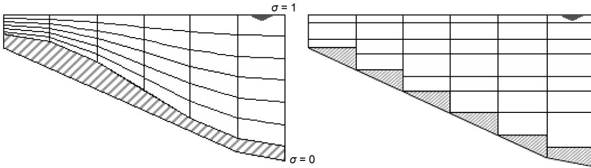

**Figure 10.1:** Example of  $\sigma$ -model (left) and  $Z$ -model (right).

Although the  $\sigma$ -grid is boundary fitted in the vertical, it will not always have enough resolution around the pycnocline. The co-ordinate lines intersect the density interfaces that may give significant errors in the approximation of strictly horizontal density gradients (Leendertse, 1990; Stelling and Van Kester, 1994). Therefore,  $Z$ -model was introduced in D-Flow FM for 3D simulations of weakly forced stratified water systems. The  $Z$ -model has horizontal co-ordinate lines that are (nearly) parallel with density interfaces (isopycnals) in regions with steep bed slopes. This is important to reduce artificial mixing of scalar properties such as salinity and temperature. The  $Z$ -model is not boundary-fitted in the vertical. Then, the bed and free surface is usually not a co-ordinate line and is represented as a staircase (zig-zag boundary). At the free surface, this can give very small layers, which can be much smaller than the next (second) layer from the top. This is a disadvantage for numerical modelling, which also holds for the staircase pattern of  $z$ -layers near the surface. To circumvent this problem, a  $z$ - $\sigma$  approach has been implemented as well in D-Flow FM (see section 10.4).

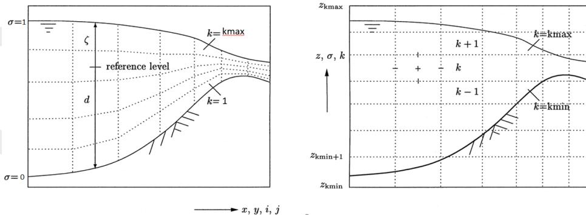

**Figure 10.2:** Vertical grid numbering, for a  $\sigma$ -model (left) and a  $z$ -coordinate model (right)

To switch to 3D simulations, the keyword  $K_{mx}=N$  has to be set with  $N$  the number of layers in the vertical. When  $K_{mx}$  equals 0, then a 2D implementation is applied. When  $K_{mx}$  equals 1, then a 3D computation with one layer is applied, which is very similar to 2D modelling. The main difference is that the specified 2D bed friction coefficient is first translated to a roughness height  $z_0$  that is used in the computation of the shear velocity  $u_*$  in the lowest layer of a 3D model using the logarithmic profile assumption.

Via keyword LayerType one can choose between  $\sigma$ -co-ordinate (LayerType=1) or  $z$ -co-ordinates (LayerType=2).

Via keyword StretchType non-uniform layers can be specified:

```
1=user defined
2=exponential
```

If `StretchType` is not specified, a uniform layer distribution is applied.

Via keyword `StretchCoef` the layer thicknesses (in percentages) are prescribed. An example for option `StretchType=1` might be:

```
StretchCoef=4.0, 5.9, 8.7, 12.7, 18.7, 18.7, 12.7, 8.7, 5.9, 4.0
```

and for option `StretchType=2`:

```
StretchCoef=stretching level, coef1, coef2
```

where `stretching level` determines the vertical position from which the layer interfaces are computed and `coef1` and `coef2` are the two factors determining how the layers grow, below and above the stretching level, respectively. The `stretching level` is a fraction  $[0, \dots, 1]$  between the bed level ( $=0.0$ ) and the water surface ( $=1.0$ ). For example in case of `StretchCoef=0.3, 1.1, 1.2`, then the layer thicknesses are computed starting at 30% from the bed level, increase towards the bed level by 10% and increase towards the free surface by 20%, for which the number of layers is defined by keyword `Kmx`.

## 10.2 $\sigma$ -layer modelling

For river models,  $\sigma$ -models are commonly applied, as they have the advantage that the grid nicely follows the topography. An additional advantage of  $\sigma$ -models is that all cells have neighbours, allowing for relatively straightforward discretizations. However, disadvantages are that 1) for steeper topography, e.g. near groynes and banks, the  $\sigma$ -transformation suffers from the so-called *hydrostatic inconsistency* (see the next section) and 2) that excessive vertical resolution is applied in shallower areas, e.g. on the floodplains, reducing the efficiency of the model.

## 10.3 Z-layer modelling

For temperature computations, the part of the water column just below the lowest thermocline up to the free surface is of interest. Not knowing its position in advance, this top part of the water column can best be resolved by a uniform resolution in the vertical via keyword `DzTop` (in group [Geometry]). The vertical grid is uniform above a level called `DzTopUniAboveZ` and extends to the top layer level called `FloorLevTopLay`. This level is called a floor level because only the floor level of the top layer can be specified. (The ceiling of the top layer is the water level). Below the level `DzTopUniAboveZ` the layer size may grow in downward direction. To have layers growing in thickness downward e.g. by a factor 1.1, set keyword `zLayerGrowthFactor=1.1`. The total number of layers is recounted based upon the deepest cell in the model.

In case of a z-co-ordinate model we have the following additional keywords:

```
ZLayTop =
ZLayBot =
```

to specify the maximum and the minimum grid layer interface, respectively.

The advantage of z-layers is that no horizontal gradients are computed when only vertical gradients exist. However, at the bed, the z-layer thickness may vary. This in turn may cause

a  $\sigma$ -like representation at the bed, with adverse effects on horizontal flows. Even the smallest error in horizontal baroclinic or diffusivity terms will generate horizontal flow, that will immediately lead to vertical velocities. Vertical velocities are always overestimated in hydrostatic models because there is no counteracting force in absence of the vertical momentum equation. Any vertical velocity may pump up saline water for free, generating horizontal baroclinic pressure forces, and more flow, and will eventually mix up the whole vertical. This mechanism will prevail especially in stagnant water, as in lakes. To prevent this behaviour in z-layers, specify by `KeepZLayeringAtBed = 1` (in group [Numerics]). This will increase the layer thickness at the bed such that all horizontally neighbouring cells have the same layer thickness. The volume of the bed cell is overestimated. This is the default setting.

If a value of zero is specified, the floor level of the lowest z-layer is equal to the bed level. The volume of the bed cell is represented more correctly. This may, however, lead to a very thin bed layer if the bed level is just below the ceiling level of the bed layer. To circumvent this, the ceiling level of the bed layer may be set halfway in between the bed level and the ceiling level of the upper neighbour (conform setting `ZTBML = #Y#` as available in Delft3D-FLOW, see also Platzek *et al.* (2012)). The bed volume is represented correctly, and some error is introduced related to sigma behaviour of the bed layer. This is the preferred setting in non-stagnant flows, specified by `KeepZLayeringAtBed = 2`. This option only works fine in combination with `NumTopSig >= 2`. This prevents the first interface above the bed from alternating ("flip/flop") behaviour at low water depth.

In z-layer models, staircases are introduced at the lower layers if the bed levels are varying. This will affect the reconstruction of cell centre velocities, that play a role in the Coriolis terms, advection terms and in estimates of bed friction in morphology. In the examples shown below, the cell centre velocity in z will be erroneously reduced to half of the cell centre velocity in  $\sigma$ -models. To resolve this problem, one would have to implement a feature similar to cut-cells (as applied in the horizontal plane), in the vertical. As a first step in this direction, we have implemented a very simple first solution, namely copying the primitive velocity of the bed flow link down to its downstairs neighbours. This velocity is then used in computing cell centre velocities. In this way, the cell centre velocities in z layers will be almost the same as in sigma layers. This option can be switched on by specifying `Zlayercenterbedvel = 1` (in group [Numerics]).

## 10.4 Z- $\sigma$ -layer modelling

In z-layer models, the top layer may become very thin, potentially leading to poor vertical grid smoothness. To mitigate this, several layers near the free-surface level can be defined using  $\sigma$ -coordinates. For example, to apply  $\sigma$ -coordinates to the top six layers, set `NumTopSig=6` in the [Geometry] group; see subplot c) of Figure 10.3.

By default, the number of  $\sigma$ -layers above the z-layers (controlled by `NumTopSig`) is uniform throughout the model domain. In some cases, this uniformity may be undesirable. For instance, in shallow upstream river sections, the full set of `NumTopSig \sigma-layers is retained, even where the bed level is high. To allow the number of  $\sigma$ -layers to gradually decrease in such areas, set NumTopSigUniform = 0 (in the [Geometry] group). This results in the number of layers reducing with increasing bed level, similar to a pure z-layer model (see subplot d) of Figure 10.3). If this parameter is not specified, then the default value NumTopSigUniform = 1 is applied, keeping the number of top  $\sigma$ -layers uniform.`

These concepts are illustrated in Figure 10.3 for a grid with  $km_x = 15$  vertical layers. For completeness, standard  $\sigma$ -layering and z-layering are also shown in subplots a) and b) of Figure 10.3. Subplots c) and d) illustrate two different z- $\sigma$  grid configurations with `NumTopSig=6`, resulting in the top 6 layers being  $\sigma$ -type and the bottom 9 being z-layers. The difference

between NumTopSigUniform = 1 and NumTopSigUniform = 0 (subplots c and d, respectively) lies in the behavior of the  $\sigma$ -layers above elevated bed levels: in subplot d), these layers are gradually omitted in shallow regions, reducing the number of  $\sigma$ -layers from 6 to 2. This approach helps prevent excessive vertical resolution in shallow areas.

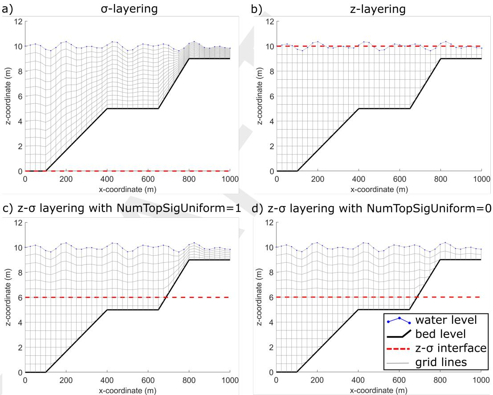

**Figure 10.3:** Illustration of the different layering concepts in D-Flow FM: a)  $\sigma$ -layering; b)  $z$ -layering; c)  $z$ - $\sigma$ -layering with NumTopSigUniform = 1; d)  $z$ - $\sigma$ -layering with NumTopSigUniform = 0.

It is recommended to choose the number of top  $\sigma$ -layers (NumTopSig) such that the vertical water level variation (e.g. tidal range) remains entirely within the  $\sigma$  portion of the water column. In Figure 10.3, this means the free-surface variation should occur entirely above the red dotted line indicating the  $z$ - $\sigma$  interface.

The position of the  $z$ - $\sigma$  interface is computed using the following formula:

$$\text{ZSigmaInterface} = \text{FloorLevToPlay} - \text{DzTop} \cdot (\text{NumTopSig} - 1) \quad (10.1)$$

### 10.5 Boundary conditions in 3D

Boundary conditions for 3D models can be prescribed in the same way as for 2D models, i.e. water level, discharge or depth-averaged velocity boundary conditions can be prescribed for hydrodynamics. Similarly, boundary conditions for transport processes such as temperature or salinity can also be provided in a depth-averaged fashion. However, in certain flow situations, such as for stratified flows, the boundary conditions need to vary over the vertical. This is also possible in D-Flow FM.

In section 7.4.8 a description was provided of how to specify boundary conditions in the User Interface. This also included an example of 3D boundary conditions. Vertically-varying boundary conditions can be prescribed for both hydrodynamic quantities (flow velocity, discharge) and for transport quantities (e.g. temperature, salinity, sediment fractions, tracers). Possible options are to set the boundary conditions using a step/block function or using linear variation. Additionally, the vertical positions at which boundary values are provided can be specified in different ways, e.g. using a  $z$ -coordinate in the reference frame of the model, using a position relative to the bed or free surface, or using a percentage/fraction of the total water depth at the boundary. A more detailed list of all possible options for prescribing 3D boundary conditions can be found in Appendix C.5.

## 10.6 Turbulence modelling

D-Flow FM solves the shallow water equations for incompressible flow. Usually the grid (horizontal and/or vertical) is too coarse and the time step too large to resolve the turbulent scales of motion. The turbulent processes are “sub-grid”. The primitive variables are space- and time-averaged quantities. Filtering the equations leads to the need for appropriate closure assumptions.

For 3D shallow water flow the stress and diffusion tensor are an-isotropic. The horizontal eddy viscosity coefficient  $\nu_H$  and eddy diffusivity coefficient  $D_H$  are much larger than the vertical coefficients  $\nu_V$  and  $D_V$ , i.e.  $\nu_H \gg \nu_V$  and  $D_H \gg D_V$ . The horizontal coefficients are assumed to be a superposition of three parts:

1. 1 a part due to molecular viscosity.
2. 2 a part due to “2D-turbulence”,
3. 3 a part due to “3D-turbulence” see Uittenbogaard *et al.* (1992) and

The 2D part is associated with the contribution of horizontal motions and forcings that cannot be resolved (“sub-grid scale turbulence”) by the horizontal grid (Reynolds averaged or eddy resolving computations). The 3D part is referred to as the three-dimensional turbulence and is computed following one of the turbulence closure models, described in this section. For 2D depth-averaged simulations, the horizontal eddy viscosity and eddy diffusivity coefficient should also contain a contribution due to the vertical variation of the horizontal flow (Taylor shear dispersion).

The background horizontal viscosity coefficient  $\nu_H^{back}$  and eddy diffusivity coefficient  $D_H^{back}$  (constant or space-varying) can be specified in the D-Flow FM GUI and in the related MDU file.

In D-Flow FM for horizontal viscosity the so-called Smagorinsky model is the default approach, yielding a space and time varying horizontal viscosity.

The horizontal eddy coefficients are typically an order of magnitude larger than the vertical coefficients determined by the turbulence closure model.

In D-Flow FM, two two-equation turbulence closure models have been implemented to determine the vertical eddy viscosity ( $\nu_V$ ) and vertical eddy diffusivity ( $D_V$ ):

1. 1  $k-\varepsilon$  turbulence closure model.
2. 2  $k-\tau$  turbulence closure model (in  $\beta$ -version).

The  $k-\tau$  model is a mathematical variant of the  $k-\varepsilon$  model, Dijkstra (2014). Both models solve equations for production, dissipation and transport of turbulent kinetic energy  $k$ . In the  $k-\varepsilon$ 

model the dissipation rate of turbulent kinetic energy  $\varepsilon$ , is modeled, whereas in the  $k$ - $\tau$  model the dissipation timescale  $\tau$  is modeled.

Both models are based on the so-called eddy viscosity concept of Kolmogorov (1942) and Prandtl (1945).

A brief description of each of these turbulence closure models will be given further on in this section, for more details we refer to Uittenbogaard *et al.* (1992). The  $k$ - $\varepsilon$  model has been used in tidal simulations by Baumert and Radach (1992) and Davies and Gerritsen (1994), for stratified flow of a river plume by Postma *et al.* (1999) and for the evolution of a thermocline by Burchard and Baumert (1995).

For strongly stratified flows it is important to introduce suitably chosen constant ambient (back-ground) mixing coefficients, because the mixing coefficients computed by turbulence models with shear production only, reduce to zero. In the latter situation the vertical layers are completely decoupled (frictionless). Disturbances are hardly damped and also the erosion of the vertical stratification is reduced to molecular diffusion.

Based on our experience with highly stratified flows we suggest applying an ambient or back-ground vertical eddy viscosity in the order of  $10^{-4}$  m<sup>2</sup>/s for the vertical exchange of momentum. This value corresponds with field measurements in the Rotterdam Waterway, The Netherlands.

### **Eddy diffusivity**

The vertical eddy diffusivity is a scaled form of the eddy viscosity according to:

$$D_{3D} = \frac{\nu_{3D}}{\sigma_c}. \quad (10.2)$$

Parameter  $\sigma_c$  is the Prandtl-Schmidt number. Its numerical value depends on the constituent  $c$ .

In Delft3D-FLOW the following settings of  $\sigma_c$  are used:

- ◇ In all cases, regardless the turbulence closure model,  $\sigma_c = 0.7$  for the transport of heat, salinity, and tracer concentrations. For suspended sediment concentrations in online sediment transport computations,  $\sigma_c = 1.0$ .
- ◇ For the transport of turbulent kinetic energy  $k$  in the  $k$ - $L$  model and  $k$ - $\varepsilon$  model  $\sigma_c = 1.0$ , and for the transport of turbulent kinetic energy dissipation  $\varepsilon$  in the  $k$ - $\varepsilon$  model  $\sigma_c = 1.3$ .

In the mathematical formulation, the fluxes are instantaneously influenced by changes in the vertical gradients of velocity and density. A physical adjustment time of the turbulence to the variations of the vertical gradients, is not taken into account. The fluxes are not a monotonic function of the gradients. For the transport equation of heat, for small temperature gradients the heat flux increases when the temperature gradient increases but for large temperature gradients the heat flux decreases because the vertical eddy diffusivity is damped. For large values of the density gradients and small values of the velocity gradients, the vertical diffusion equation becomes mathematically ill-posed Barenblatt *et al.* (1993), and the computed vertical profiles may become discontinuous (stepwise). The number of “steps” is dependent on the vertical grid.

The numerical scheme for the vertical advection of heat and salt (central differences) may introduce small vertical oscillations. This computational noise may enhance the turbulent

mixing. D-Flow FM has a vertical filtering technique to remove this noise and to reduce the undesirable mixing. For more details, see section 4.2.4.

In strongly-stratified flows, the turbulent eddy viscosity at the interface reduces to zero and the vertical mixing reduces to molecular diffusion. To account for the vertical mixing induced by shearing and breaking of short and random internal gravity waves, we suggest to apply an ambient eddy diffusivity in the order of  $10^{-4}$  to  $10^{-5} \text{ m}^2/\text{s}$  dependent on the Prandtl-Schmidt number. For stable stratified flows, the eddy diffusivity in D-Flow FM may also be based on the Ozmidov length scale  $L_{oz}$ , as specified by the user, and the Brunt-Väisälä frequency of internal waves. Then, the vertical eddy diffusivity  $D_V$  is defined as:

$$D_V = D_{3D} + 0.2L_{oz}^2 \sqrt{-\frac{g \partial \rho}{\rho \partial z}}. \quad (10.3)$$

where  $D_{3D}$  is the vertical eddy diffusivity component computed by the turbulence model.  $L_{oz}$  represents the Ozmidov length scale and the term  $\frac{g \partial \rho}{\rho \partial z}$  reflects the density gradient in the fluid, driven by the gravitational constant  $g$  and density  $\rho$ . For a detailed description of the turbulence closure models as applied in D-Flow FM and Delft3D-FLOW we refer to Rodi (1984) and Uittenbogaard *et al.* (1992).

### 10.6.1 $k \sim \varepsilon$ turbulence model

In the  $k \sim \varepsilon$  turbulence model, transport equations must be solved for both the turbulent kinetic energy  $k$  and for the energy dissipation  $\varepsilon$ . The mixing length  $L$  is then determined from  $\varepsilon$  and  $k$  according to:

$$L = c_D \frac{k \sqrt{k}}{\varepsilon}. \quad (10.4)$$

In the transport equations, the following two assumptions are made:

- ◇ The production, buoyancy, and dissipation terms are the dominating terms.
- ◇ The horizontal length scales are larger than the vertical ones (shallow water, boundary layer type of flows).

Because of the first assumption, the conservation of the turbulent quantities is less important and the transport equation is implemented in a non-conservation form.

The transport equations for  $k$  and  $\varepsilon$  are non-linearly coupled by means of their eddy diffusivity  $D_k$ ,  $D_\varepsilon$  and the dissipation terms. The transport equations for  $k$  and  $\varepsilon$  are given by:

$$\begin{aligned} \frac{\partial k}{\partial t} + u \frac{\partial k}{\partial x} + v \frac{\partial k}{\partial y} + \frac{\omega}{\zeta - z_b} \frac{\partial k}{\partial \sigma} = \\ + \frac{1}{(\zeta - z_b)^2} \frac{\partial}{\partial \sigma} \left( D_k \frac{\partial k}{\partial \sigma} \right) + P_k + P_{kw} + B_k - \varepsilon, \end{aligned} \quad (10.5)$$

$$\begin{aligned} \frac{\partial \varepsilon}{\partial t} + u \frac{\partial \varepsilon}{\partial x} + v \frac{\partial \varepsilon}{\partial y} + \frac{\omega}{\zeta - z_b} \frac{\partial \varepsilon}{\partial \sigma} = \\ \frac{1}{(\zeta - z_b)^2} \frac{\partial}{\partial \sigma} \left( D_\varepsilon \frac{\partial \varepsilon}{\partial \sigma} \right) + P_\varepsilon + P_{\varepsilon w} + B_\varepsilon - c_{2\varepsilon} \frac{\varepsilon^2}{k}. \end{aligned} \quad (10.6)$$

with

$$D_k = \frac{\nu_{mol}}{\sigma_{mol}} + \frac{\nu_{3D}}{\sigma_k} \quad \text{and} \quad D_\varepsilon = \frac{\nu_{3D}}{\sigma_\varepsilon} \quad (10.7)$$

In the production term  $P_k$  of turbulent kinetic energy, the horizontal gradients of the horizontal velocity and all the gradients of the vertical velocities are neglected. The production term is given by:

$$P_k = \nu_{3D} \frac{1}{(\zeta - z_b)^2} \left[ \left( \frac{\partial u}{\partial \sigma} \right)^2 + \left( \frac{\partial v}{\partial \sigma} \right)^2 \right]. \quad (10.8)$$

For small-scale applications (e.g. simulation of laboratory flume), you can switch on a more extended production term  $P_k$  of turbulent kinetic energy (option “partial slip”, rough side wall) given by:

$$P_k = 2\nu_{3D} \left[ \frac{1}{2(\zeta - z_b)^2} \left\{ \left( \frac{\partial u}{\partial \sigma} \right)^2 + \left( \frac{\partial v}{\partial \sigma} \right)^2 \right\} + 2\nu_{3D} \left[ \left( \frac{\partial u}{\partial x} \right)^2 + \frac{1}{2} \left( \frac{\partial u}{\partial y} + \frac{\partial v}{\partial x} \right)^2 + \left( \frac{\partial v}{\partial y} \right)^2 \right] \right]. \quad (10.9)$$

In this expression,  $\nu_{3D}$  is the vertical eddy viscosity, prescribed by Equation (10.16). In Equation (10.8) and Equation (10.9) it has been assumed that the gradients of the vertical velocity  $w$  can be neglected with respect to the gradients of the horizontal velocity components  $u$  and  $v$ . The horizontal and vertical ( $\sigma$ -grid) curvature of the grid has also been neglected.

The turbulent energy production due to wave action is given by  $P_{kw}$ , but has not been implemented yet in D-Flow FM: Wave forcing in 3D models is being prepared for an upcoming release.

Near the closed walls the normal derivative of the tangential velocity is determined with the law of the wall:

$$\frac{\partial u}{\partial y} = \frac{u_*}{\kappa y}. \quad (10.10)$$

In stratified flows, turbulent kinetic energy is converted into potential energy. This is represented by a buoyancy flux  $B_k$  defined by:

$$B_k = \frac{\nu_{3D}}{\rho \sigma_\rho} \frac{g}{h} \frac{\partial \rho}{\partial \sigma} \quad (10.11)$$

with the Prandtl-Schmidt number  $\sigma_\rho = 0.7$  for salinity and temperature and  $\sigma_\rho = 1.0$  for suspended sediments.

The production term  $P_\varepsilon$  and the buoyancy flux  $B_\varepsilon$  are defined by:

$$P_\varepsilon = c_1 \frac{\varepsilon}{k} P_k, \quad (10.12)$$

$$B_\varepsilon = c_3 \frac{\varepsilon}{k} B_k, \quad (10.13)$$

with  $L$  prescribed by Equation (10.4) and the calibration constants by (Rodi, 1984):

$$c_{1\varepsilon} = 1.44, \quad (10.14)$$

$$c_{2\varepsilon} = 1.92 \quad (10.15)$$

In D-Flow FM in the  $\varepsilon$ -equation for stable stratification the buoyancy flux is switched off, so  $c_{3\varepsilon} = 0.0$  and for unstable stratification the buoyancy flux is switched on  $c_{3\varepsilon} = c_{1\varepsilon} = 1.44$ .

The energy production and energy dissipation due to waves, the terms  $P_{kw}$  and  $P_{\varepsilon w}$  in Equation (10.5) and Equation (10.6), have not been implemented yet in D-Flow FM: Wave forcing in 3D models is being prepared for an upcoming release.

The coefficients of the 3D  $k$ - $\varepsilon$  turbulence closure model as implemented in D-Flow FM are not the same as in the depth-averaged  $k$ - $\varepsilon$  turbulence closure model (Rodi, 1984), therefore for depth-averaged simulations, the  $k$ - $\varepsilon$  turbulence closure model is not available for you.

The vertical eddy viscosity  $\nu_{3D}$  is determined by:

$$\nu_{3D} = c'_\mu L \sqrt{k} = c_\mu \frac{k^2}{\varepsilon}, \quad (10.16)$$

with:

$$c_\mu = c_D c'_\mu. \quad (10.17)$$

To solve the transport equation, boundary conditions must be specified. A local equilibrium of production and dissipation of kinetic energy is assumed at the bed which leads to the following Dirichlet boundary condition:

$$k|_{\sigma=-1} = \frac{u_{*b}^2}{\sqrt{c_\mu}}. \quad (10.18)$$

The friction velocity  $u_{*b}$  at the bed is determined from the magnitude of the velocity in the grid point nearest to the bed, under the assumption of a logarithmic velocity profile. The bed roughness (roughness length) may be enhanced by the presence of wind generated short crested waves.

In case of wind forcing, a similar Dirichlet boundary condition is prescribed for the turbulent kinetic energy  $k$  at the free surface:

$$k|_{\sigma=0} = \frac{u_{*s}^2}{\sqrt{c_\mu}}. \quad (10.19)$$

In the absence of wind, the turbulent kinetic energy  $k$  at the surface is set to zero.

At open boundaries, the turbulent energy  $k$  is computed using the equation for  $k$  without horizontal advection. For a logarithmic velocity profile this will approximately lead to the following linear distribution based on the shear-stress at the bed and at the free surface:

$$k(z) = \frac{1}{\sqrt{c_\mu}} \left[ u_{*b}^2 \left( 1 - \frac{z - z_b}{\zeta - z_b} \right) + u_{*s}^2 \frac{z - z_b}{\zeta - z_b} \right]. \quad (10.20)$$

For  $\varepsilon$  the bed boundary condition reads:

$$\frac{\partial \varepsilon}{\partial z} = \frac{(\varepsilon_{b+1} - \varepsilon_b)}{\Delta z_b} = \frac{u_*^3}{\kappa \left( \frac{\Delta z_b}{2} + 9z_0 \right)^2} \quad (10.21)$$

The  $k$ - $\varepsilon$  turbulence model was successfully applied for the simulation of stratified flow in the Hong Kong waters (Postma *et al.*, 1999) and verified for the seasonal evolution of the thermocline (Burchard and Baumert, 1995).

### 10.6.2 $k$ - $\tau$ turbulence model

The  $k$ - $\tau$  turbulence model is derived by Speziale *et al.* (1992) as a transformation of the  $\varepsilon$ -equation of the  $k$ - $\varepsilon$  turbulence model where the variable  $\tau$  models a typical time-scale of turbulent eddies [s].

The  $k$ - $\tau$  turbulence model used in D-Flow FM deviates from the equation of Speziale *et al.* (1992) at a few points, to derive their  $k$ - $\tau$  model they used a different version of the  $k$ - $\varepsilon$  model and the most important difference is that they do not include buoyancy in their model.

The transport equations for  $k$  and  $\tau$  used in D-Flow FM read (see for a derivation Dijkstra (2014)):

$$\frac{\partial k}{\partial t} + u \frac{\partial k}{\partial x} + v \frac{\partial k}{\partial y} + \frac{\omega}{\zeta - z_b} \frac{\partial k}{\partial \sigma} = \frac{1}{(\zeta - z_b)^2} \frac{\partial}{\partial \sigma} \left( D_k \frac{\partial k}{\partial \sigma} \right) + P_k + P_{kw} + B_k - \frac{k}{\tau}, \quad (10.22)$$

$$\frac{\partial \tau}{\partial t} + u \frac{\partial \tau}{\partial x} + v \frac{\partial \tau}{\partial y} + \frac{\omega}{\zeta - z_b} \frac{\partial \tau}{\partial \sigma} = \frac{1}{(\zeta - z_b)^2} \left\{ \frac{\partial}{\partial \sigma} \left( D_\tau \frac{\partial \tau}{\partial \sigma} \right) + \frac{2}{k} D_\tau \frac{\partial \tau}{\partial \sigma} \frac{\partial k}{\partial \sigma} - \frac{2}{\tau} D_\tau \frac{\partial \tau}{\partial \sigma} \frac{\partial \tau}{\partial \sigma} - \frac{\tau}{k} \frac{\partial}{\partial \sigma} \left( \left( \frac{1}{\sigma_\varepsilon} - \frac{1}{\sigma_k} \right) \right) \frac{\partial k}{\partial \sigma} \right\} - \frac{\tau}{k} (c_{\varepsilon 1} - 1) P_k - \frac{\tau}{k} (c_{\varepsilon 3} - 1) B_k + c_{\varepsilon 2} - 1 \quad (10.23)$$

with

$$D_k = \frac{\nu_{mol}}{\sigma_{mol}} + \frac{\nu_{3D}}{\sigma_k} \quad \text{and} \quad D_\tau = \frac{\nu_{3D}}{\sigma_\tau}. \quad (10.24)$$

### 10.6.3 Numerical implementation

For the discretisation of the transport equations of the two equations turbulence closure model, the turbulent quantities  $k$ ,  $\varepsilon$  and the vertical eddy viscosity  $\nu_{3D}$  are positioned at the layer interfaces at the links ( $u$  points), see Figure 10.4 where  $\star$  denotes the positions on the grid of the turbulent quantities and  $\bullet$  denotes the positions of the density points. This choice makes it possible to discretize the vertical gradients in the production term and buoyancy term accurately and to implement the vertical boundary conditions Equation (10.18) and Equation (10.21) exactly at the bed and the free surface.

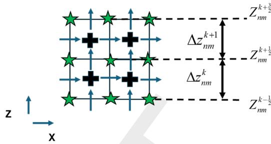

**Figure 10.4:** Positions of the turbulence quantities

In the transport equations Equation (10.5) and Equation (10.6) the production, buoyancy and dissipation term are the dominating terms, in combination with the vertical diffusion term. In most applications the transport of  $k$  and  $\varepsilon$  is less important. To guarantee positive solutions, we discretize the horizontal advection terms with a first order upwind scheme.

The transport equations of  $k$  and  $\varepsilon$  miss also a horizontal diffusion term, which should smooth out large gradients. In applications with steep gradients in the bottom topography, and small horizontal flow velocities or coarse horizontal grids, we observed horizontal wiggles (checkerboard patterns) in the erosion near the bed and in the salinity, caused by these wiggles in  $k$ ,  $\varepsilon$  and the vertical diffusion in the bottom layer, see Figure 10.5. This decoupling in the horizontal can be suppressed by changing the time integration method of the transport equation from Euler to a so-called Lax scheme.

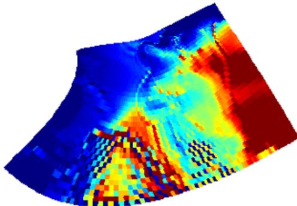

**Figure 10.5:** Checkerboard pattern in the vertical diffusivity in the bottom layer, in the case of a stratified flow over steep topography in combination with low flow velocities

In forward Euler the time derivative  $\frac{\partial k}{\partial t}$  in Equation (10.5) is discretised as follows:

$$\frac{\partial k}{\partial n} \approx \frac{k^{n+1} - k^n}{\Delta t} \quad (10.25)$$

where  $k^n$  is a short-hand notation for  $k_{L,k+\frac{1}{2}}^n$ , with index  $L$ ,  $k + \frac{1}{2}$  denoting the link between cell  $m$  at the interface between layer  $k$  and  $k + 1$ , and cell  $m + 1$  at the interface between layer  $k$  and  $k + 1$ . In the case of the Lax scheme,  $k^n$  (the quantity at the previous time step at the exact same location) is replaced by a horizontally averaged  $k^n$ , adding some first order numerical horizontal diffusion to the transport equation, thus removing numerical noise from the solution:

$$\bar{k}_{L,k+\frac{1}{2}}^n = (1 - \alpha)k_{L,k+\frac{1}{2}}^n + \alpha \frac{1}{2}(k_{m,k+\frac{1}{2}}^n + k_{m+1,k+\frac{1}{2}}^n) \quad (10.26)$$

where  $\alpha$  is input parameter `turbulenceTimeIntegrationFactor`. The user can control the amount of horizontal diffusion by varying this parameter between 0.0 (no diffusion, the default) and 1.0 (maximal diffusion).

 $\varepsilon$  is handled in a similar way:

$$\bar{\varepsilon}_{L,k+\frac{1}{2}}^n = (1 - \alpha)\varepsilon_{L,k+\frac{1}{2}}^n + \alpha \frac{1}{2}(\varepsilon_{m,k+\frac{1}{2}}^n + \varepsilon_{m+1,k+\frac{1}{2}}^n) \quad (10.27)$$

**Remarks:**

- ◇ Input parameter `turbulenceTimeIntegrationMethod` can be used to define where horizontal diffusion is applied:
  - `turbulenceTimeIntegrationMethod = 1`: all links, all layers
  - `turbulenceTimeIntegrationMethod = 2`: only when cell  $m, k$  and cell  $m + 1, k$  have a vertical match
- ◇ This approach is only applied to layers with the same index  $k$ . It can be further improved using an anti-creep-based algorithm to connect layers with different  $k$ -index. But caution and accuracy are necessary to avoid wrong diffusion of turbulence quantities.

## 10.7 Fixed weirs for 3D modelling

As described in Section 12.1, in D-Flow FM two different approaches are applied to simulate the energy losses by fixed weirs. First of all, a numerical approach has been implemented. Then, a special discretization of the advective terms around the fixed weir is applied. Next to the numerical approach, there is an empirical (subgrid) approach. Based on measurements in flume laboratories empirical formulae can be derived in order to match the measurements as accurately as possible. Two empirical formulae are available in D-Flow FM, namely the so-called 'Villemonte' and 'Tabellenboek' approaches. The Villemonte approach is the default option. For a detailed description of the fixed weirs we refer to [Deltares \(2026a, section 6.7.1–6.7.4\)](#).

In case of 3D modelling, the Villemonte approach (`fixedweirscheme=9`) should be applied. This has been thoroughly tested. We remark that the other empirical approach - Tabellenboek via (`fixedweirscheme=8`) - is also possible for 3D modelling, but this option has been much less tested. The numerical option (`fixedweirscheme=6`) is not available for 3D modelling.

No special input is required for fixed weir modelling in case of 3D modelling. The fixed weir input is identical for 2D and 3D modelling, which is described in detail in Appendix C.8.

## 10.8 3D modelling guidelines

When setting up 3D models, using one of the grid-layering approaches described in the previous sections, one should consider a number of aspects besides the aforementioned options and keywords. In the following subsections these aspects will be explained.

### 10.8.1 Non optimal default value in case of 3D modelling

In general, the default value of a keyword gives the best results; see for example [Table A.1](#) and [Table A.2](#) with an extensive overview of keywords including its default value and its description. However, there is one exception: the keyword for the vertical advection method in the transport equation isn't optimal. This involves keyword `verticalAdvectionType`. Currently, `verticalAdvectionType=higherOrderExplicit` is the default, which corresponds to a higher-order upwind explicit approach. The reason for this is to obtain con-

sistency with the discretization of the vertical advection term in the momentum equations, for which the same higher-order upwind explicit method is applied. In the momentum equation such an approach is crucial to minimize checkerboarding of the model results, which is achieved by applying the same advection discretization method in the horizontal and in the vertical. However, this results into more numerical mixing in the vertical than needed.

The second-order central advection discretization leads to less numerical mixing in the vertical and is a better approach. This is currently almost achieved by `verticalAdvectionType=centralImplicit`. Therefore, in 3D simulations a user is advised to manually change these keywords in the MDU-file to the value of four; see also the description of these keywords in Table A.2. This isn't possible yet for tracer and sediment modelling, for which currently always the higher-order upwind approach is applied. Noted that in the next release the default for the vertical advection method for all substances will be changed to the second-order central discretization method.

### 10.8.2 Number of layers

The number of layers that is to be recommended, depends on the application. From experience with Delft3D, which is based on structured grids, for many decades, salinity intrusion in estuaries has been successfully computed with a relatively few number of layers. Quite often ten layers have been applied. Nowadays, twenty layers seems to be more appropriate for 3D modelling. For applications with a large range in water depth (e.g. including the continental shelf), even more layers need to be applied, to accurately capture all vertical gradients in flow, temperature and salinity.

### 10.8.3 Anti creep

In the  $\sigma$  co-ordinate system, the grid co-ordinate lines intersect the mostly horizontal density interfaces. A well-known disadvantage of  $\sigma$  co-ordinates with standard numerical schemes is that in areas of steep bed topography unphysical vertical mixing may occur due to hydrostatic inconsistency (Haney, 1991). This is a result of erroneous computation of horizontal gradients when vertical gradients exist. To suppress this, the anti-creep method by Stelling and Van Kester (1994), first implemented in Delft3D, has also been implemented in D-Flow FM.

In D-Flow FM this can be switched on via keyword `AntiCreep = 1`. Noted that in z-coordinates, the grid lines are by definition horizontal. Then, the anti creep option isn't required.

### 10.8.4 Spurious oscillations in vertical velocity

In D-Flow FM unphysical oscillations can occur in 3D models. These oscillations are primarily manifest themselves as a "checkerboard"-like pattern in the vertical velocities, which can cause checkerboarding in the horizontal velocities as well. This might lead to unrealistic model results. A high-order horizontal momentum filter is available to suppress these spurious oscillations. This filter is switched on via keyword `HorizontalMomentumFilter=1`. A monitor function is available to check whether spurious oscillations occur in a model application. This filter can be switched on via keyword `CheckerboardMonitor=1`. This is illustrated in Figure 10.7.

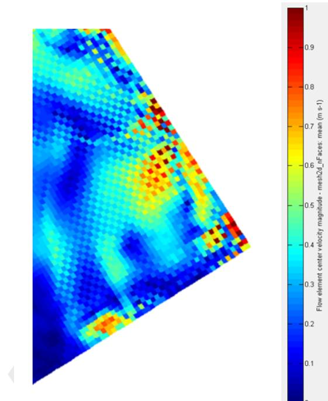

**Figure 10.6:** Illustration of spurious oscillations in horizontal currents near open boundaries

Figure 10.6 illustrates these patterns in the horizontal velocities near the open boundary without the application of the filter. These patterns largely disappear with the application of the filter.

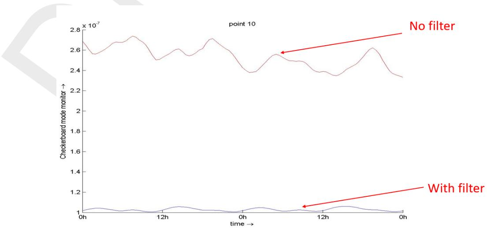

**Figure 10.7:** Illustration of monitor for occurrence of spurious oscillations

## 11 Boundary conditions in D-Flow FM

### 11.1 Hydrodynamics boundary conditions

In section 7.4.8, the boundary conditions are discussed from the viewpoint of the user interface. In the user interface, the user can specify the locations at which particular boundary conditions are to be imposed. Using section 7.4.8 as a backdrop, the present section discusses the underlying files and file formats and the way these are interpreted by the computational kernel. Three types of boundary conditions are discussed in this section, namely open boundaries (in section 11.1.1) , vertical boundaries (in section 11.1.2) and closed boundaries (in section 3.5).

Lateral discharges are a special type of input that also act like boundary conditions, and are discussed in section 7.4.12.

#### 11.1.1 Open boundary conditions

The proper prescription of an open boundary condition along a certain (part of the) rim of the grid can be achieved by considering four elements of the model:

1. 1 a polyline file (extension .pli), containing the *locations* at which the boundary conditions should be imposed,
2. 2 a boundary conditions file (extension .bc), containing the actual *forcing signals*, such as the time dependent information of the quantity under consideration and the physical nature of the quantity itself,
3. 3 an external forcing file (extension .ext), in which the connection is laid between the polyline file and the boundary conditions file,
4. 4 the name of the external forcing file in the master definition file (extension .mdu).

These four elements are subsequently discussed in the following.

##### 11.1.1.1 Forcing information

The `<.bc>`-file is used to store the actual boundary forcing signals. Multiple types of boundary conditions can be prescribed, configured via the `Quantity` keywords. The following subsections contain details for several types of flow boundaries.

The `<.bc>`-file may also contain the forcing signals for multiple boundary locations, configured via the `Name` keyword. When boundary locations have been specified by a polyline (`locationFile` in the `<.ext>` file), then the `Name` must refer to the polyline name, followed by the polyline point number, e.g., `Name = upstream_0001`. When instead a `nodeId` was used in the `<.ext>` file, the `Name` must be the same as that `node id`.

### Water level

A water level signal is applied at the cell center of the virtual cell outside the grid (ghost cells or mirror cells). Water levels can be imposed as a timeseries or as a harmonic signal. In case of a harmonic signal, the period of the signal can be given as an astronomic component acronym.

If a timeseries is applied to a the first support point of a polyline named arbitraryname, prescribed in some polyline file, then the header of the bc-file is:

```
[forcing]
Name                                              = arbitraryname_0001
Function                                             = timeseries
Time-interpolation                                      = linear
Quantity                                                 = time
Unit                                                       = minutes since YYYY-MM-DD
Quantity                                                = waterlevelbnd
Unit                                                       = m
[two-column data]
```

The data is to be inserted as a two-column array containing the time (in minutes) and the water level itself (in meters w.r.t. the reference level). In case of harmonic components, the header of the bc-file is:

```
[forcing]
Name                                                        = arbitraryname_0001
Function                                                   = harmonic
Quantity                                                   = harmonic component
Unit                                                        = minutes
Quantity                                                   = waterlevelbnd amplitude
Unit                                                        = m
Quantity                                                   = waterlevelbnd phase
Unit                                                        = degrees
[three-column data]
```

The data is to be inserted as a three-column array containing the period (in minutes), the amplitude (in meters) and the phase (in degrees). If the period is  $T$  minutes, the amplitude is  $A$  meters and the phase is  $\varphi$  degrees, then the signal that is applied reads

$$h(t) = B + A \cos(2\pi t/T - \varphi). \quad (11.1)$$

The parameter  $B$  can be prescribed by an additional signal with a period specified equal to 0 minutes. As an example, the data series:

```
0.0  0.5  0.0
745.0  2.0  0.0
```

represents the signal  $h(t) = 0.5 + 2.0 \cos(2\pi t/745)$ , with the time  $t$  in minutes.

### Discharge

A discharge boundary condition is applied at the face-center of the virtual boundary cell. For this, the face-normal velocity is used in combination with the face-center water depth. The face-based water depth in the evaluation of the flow area can optionally be set to a downwind

approximation (for an inflowing discharge boundary) with the option `jbasqbnddownwindhs = 1` We remark that `jbasqbnddownwindhs = 0` is the default value.

Discharges can be imposed as a timeseries or as a harmonic signal. In case of a harmonic signal, the period of the signal can be given as an astronomic component acronym.

If a timeseries is applied to a the first support point of a polyline named `arbitraryname`, prescribed in some polyline file, then the header of the `bc-file` is:

```
[forcing]
Name                                 = arbitraryname_0001
Function                                 = timeseries
Time-interpolation                             = linear
Quantity                                    = time
Unit                                        = minutes since YYYY-MM-DD
Quantity                                    = dischargebnd
Unit                                        = m3/s
[two-column data]
```

The data is to be inserted as a two-column array containing the time (in minutes) and the water level itself (in meters w.r.t. the reference level). In case of harmonic components, the header of the `bc-file` is:

```
[forcing]
Name                                         = arbitraryname_0001
Function                                     = harmonic
Quantity                                        = harmonic component
Unit                                             = minutes
Quantity                                        = dischargebnd amplitude
Unit                                             = m3/s
Quantity                                        = dischargebnd phase
Unit                                             = degrees
[three-column data]
```

The data is to be inserted as a three-column array containing the period (in minutes), the amplitude (in cubic meters per second) and the phase (in degrees).

## Velocity

A velocity boundary condition is applied at the face-center of the virtual boundary cell. Values provided are interpreted as face-normal velocities. Velocities can be imposed as a timeseries or as a harmonic signal. In case of a harmonic signal, the period of the signal can be given as an astronomic component acronym.

If a timeseries is applied to a the first support point of a polyline named `arbitraryname`, prescribed in some polyline file, then the header of the `bc-file` is:

```
[forcing]
Name                                         = arbitraryname_0001
Function                                     = timeseries
Time-interpolation                             = linear
Quantity                                        = time
Unit                                             = minutes since YYYY-MM-DD
Quantity                                        = velocitybnd
Unit                                             = m/s
[two-column data]
```

The data is to be inserted as a two-column array containing the time (in minutes) and the water level itself (in meters w.r.t. the reference level). In case of harmonic components, the header of the bc-file is:

```
[forcing]
Name                                 = arbitraryname_0001
Function                               = harmonic
Quantity                                = harmonic component
Unit                                    = minutes
Quantity                                = velocitybnd amplitude
Unit                                    = m/s
Quantity                                = velocitybnd phase
Unit                                    = degrees
[three-column data]
```

The data is to be inserted as a three-column array containing the period (in minutes), the amplitude (in meters per second) and the phase (in degrees).

### Water level gradient

Besides the option to prescribe actual water levels as a boundary condition, D-Flow FM facilitates the prescription of water level *gradients*. Such a Neumann-type boundary condition for the water level can be assigned through the keyword `neumannbnd`. The value of the water level gradient is applied at the face-center.

Water level gradients can be imposed as a timeseries or as a harmonic signal. In case of a harmonic signal, the period of the signal can be given as an astronomic component acronym. If a timeseries is applied to a the first support point of a polyline named `arbitraryname`, prescribed in some polyline file, then the header of the bc-file is:

```
[forcing]
Name                                     = arbitraryname_0001
Function                                = timeseries
Time-interpolation                         = linear
Quantity                                 = time
Unit                                     = minutes since YYYY-MM-DD
Quantity                                 = neumannbnd
Unit                                     = -
[two-column data]
```

The data is to be inserted as a two-column array containing the time (in minutes) and the water level itself (in meters w.r.t. the reference level). In case of harmonic components, the header of the bc-file is:

```
[forcing]
Name                                     = arbitraryname_0001
Function                                = harmonic
Quantity                                 = harmonic component
Unit                                     = minutes
Quantity                                 = neumannbnd amplitude
Unit                                     = -
Quantity                                    = neumannbnd phase
Unit                                     = degrees
[three-column data]
```

The data is to be inserted as a three-column array containing the period (in minutes), the amplitude (in meters per second) and the phase (in degrees). The water level gradient is interpreted positive in the outward-normal direction.

**Riemann invariant**

At a Riemann boundary we do not allow any outgoing perturbation with respect to some reference boundary state to reflect back from the boundary. This is achieved by prescribing the incoming Riemann invariant. Using the convention of a positive inward normal at the boundary, this can be put as  $u_b + 2\sqrt{gH_b}$ , with  $u_b$  the velocity at the boundary and  $H_b$  the total water depth at the boundary. When applying Riemann boundaries only currents perpendicular to the open boundary are considered and directional effects are neglected.

Using linearization and the assumption of a flow field that is initially at rest, one finds  $u\sqrt{\frac{H}{g}}$  for a propagating wave according to linear wave theory. Next, a Riemann boundary can be rewritten such that is takes the form:

$$\zeta_b = 2\zeta_i - u\sqrt{\frac{H}{g}} - \zeta_0 \quad (11.2)$$

with

| $\zeta_b$ | the surface level elevation at the boundary,                          |
|-----------|-----------------------------------------------------------------------|
| $\zeta_i$ | the water level of the perpendicularly incoming wave at the boundary, |
| $H$       | the total water depth,                                                |
| $g$       | the gravitational acceleration,                                       |
| $u$       | the flow velocity (positive inward) and                               |
| $\zeta_0$ | the initial water level elevation.                                    |

In D-Flow FM it is sufficient that the water level of the perpendicularly incoming wave at the boundary,  $\zeta_i$ , is prescribed in case of a Riemann boundary. Then, in the computational kernel of D-Flow FM extra terms are added so that this open boundary acts as a Riemann boundary. Thus, in case of a Riemann boundary a water level forcing has to be prescribed on input in D-Flow FM.

**Example**

As an example, a simple uniform channel with two Riemann boundaries, with 1 m amplitude on the left and 0 m on the right will show a 1 m amplitude wave travelling from left to right. At the right side, the wave passes the boundary with minor reflection only. Practically no waves travel from right to left since at the right boundary no incoming wave amplitude was specified.

The water level of the incoming wave for the Riemann boundary can be prescribed as a timeseries or as a harmonic signal. In case of a harmonic signal, the period of the signal can be given as an astronomic component, (e.g.  $M_2$ ), or as a period in minutes, amplitude in m and phase in degrees. If a timeseries is applied to the first support point of a polyline named *arbitraryname*, prescribed in some polyline file, then the header of the <bc>-file read:

```
[forcing]
Name                                                        = arbitraryname_0001
Function                                                    = timeseries
Time-interpolation                                               = linear
Quantity                                                         = time
Unit                                                              = minutes since YYYY-MM-DD
Quantity                                                          = riemannbnd
```

```
Unit                                         = m
[two-column data]
```

The data is to be inserted as a two-column array containing the time (in minutes) and the water level for Riemann boundary (in meters). In case of harmonic components, the header of the bc-file is:

```
[forcing]
Name                                         = arbitraryname_0001
Function                                      = harmonic
Quantity                                      = harmonic component
Unit                                         = minutes
Quantity                                     = riemannbnd amplitude
Unit                                         = m
Quantity                                     = riemannbnd phase
Unit                                         = degrees
[three-column data]
```

The data is to be inserted as a three-column array containing the period (in minutes), the amplitude (in meters per second) and the phase (in degrees).

Suppose, as an example, that we have:

- ◇ a flow domain with a bathymetry at a bed level equal to 0 m w.r.t. the reference level,
- ◇ an initial water level equal to 10 m w.r.t. the reference level,
- ◇ a local initial disturbance of the initial water level,
- ◇ an initial flow field at rest and
- ◇ that we aim to prevent reflections at the boundary.

In that case, it follows from Equation (11.2) that  $\zeta_b = 10$  m w.r.t. the reference level is to be prescribed. Remark that this application only holds for small disturbances of  $\zeta$  from  $\zeta_b$ .

### Discharge-water level dependency

If a relation between the discharge and the local water level is known on beforehand, then this relation can be provided to the flow model as a table by means of the keyword `qhtable`. This table, provides the water level  $\zeta$  as a function of the computed discharge  $Q$  along the entire polyline defining the boundary. Worded differently, only one relation is given for each polyline. Note that this is opposite to other boundary types in which, for instance, a time series is given for each support point of a polyline.

If a Qh-table is applied to a polyline named `arbitraryname`, prescribed in some polyline file, then the header of the bc-file is:

```
[forcing]
Name                                         = arbitraryname
Function                                     = qhtable
Quantity                                     = qhbnd discharge
Unit                                         = m3/s
Quantity                                     = qhbnd waterlevel
Unit                                         = m
[two-column data]
```

The data is to be inserted as a two-column array containing the discharge (in cubic meters per second) and the water *level* (in meters w.r.t. the reference level).

### 11.1.1.2 External forcings file

The external forcings file `<.ext>` collects all boundary condition information. The file format for boundaries is described in section C.6.3.1. It contains one or more [Boundary] blocks, one for each boundary condition. Each block must specify the boundary type via the `quantity` keyword. The previous section already listed some boundary quantity names. Next, each block must specify the boundary location specification. This is either a polyline file name, via the `locationFile` keyword, or a 1D network node id, via the `nodeId` keyword. Finally, the actual forcing data file must be specified, via the `forcingFile` keyword. Section 11.1.1.4 contains an example of this.

### 11.1.1.3 External forcings in model definition file

The final step in specifying boundary conditions, is referring to the `<.ext>` file in the `<.mdu>` file. This is done via the keyword `ExtForceFileNew` under the MDU block [external forcing].

### 11.1.1.4 Example

Recalling the four elementary actions from the beginning of section 11.1.1, the administration in files can be illustrated by means of an example. Suppose, we have a channel that is geometrically modelled by means of the grid shown in Figure 11.1. The domain is 10000 m long and 500 m wide. The bottom left corner coincides with the origin of the geometrical frame of reference.

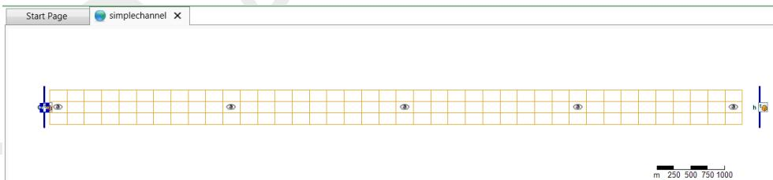

**Figure 11.1:** User Interface view of a simple channel covered by a straightforward Cartesian grid. Boundary conditions are prescribed at the left hand side and the right hand side of the domain.

The domain shown in Figure 11.1 contains two boundaries: on the left hand, a discharge boundary condition is present to present flow entering the domain, on the right hand, a water level boundary condition is set. Having two boundaries, we have two polyline files, in this example: `left.pli` and `right.pli`.

The contents of `left.pli` are:

```
boundaryleft
    2           2
    -80        -50
    -80        550
```

whereas the contents of `right.pli` are:

```
boundaryright
    2           2
```

| 10250 | -50 |
|-------|-----|
| 10250 | 550 |

Notice that both polyline files contain the name of the polyline, namely `boundaryleft` and `boundaryright`, respectively. In this example, both the polylines contain *two* support points. For each of these support points, timeseries can be prescribed. In this example, we restrict ourselves to homogeneous boundary conditions. This means that we have to prescribe physical information for the first support points, i.e. for `boundaryleft_0001` and `boundaryright_0001`.

The physical information should be provided in the bc-file. In this example, we use the following bc-file:

| [forcing]          |                            |
|--------------------|----------------------------|
| Name               | = boundaryleft_0001        |
| Function           | = timeseries               |
| Time-interpolation | = linear                   |
| Quantity           | = time                     |
| Unit               | = minutes since 2001-01-01 |
| Quantity           | = dischargebnd             |
| Unit               | = m3/s                     |
| 0.000000           | 2500.0                     |
| 120.000000         | 3000.0                     |
| 240.000000         | 2500.0                     |
| 360.000000         | 2000.0                     |
| 480.000000         | 2500.0                     |
| 600.000000         | 3000.0                     |
| 720.000000         | 2500.0                     |
| 840.000000         | 2000.0                     |
| 960.000000         | 2500.0                     |
| 1080.000000        | 3000.0                     |
| 1200.000000        | 2500.0                     |
| 1320.000000        | 2000.0                     |
| 1440.000000        | 2500.0                     |
|                    |                            |
| [forcing]          |                            |
| Name               | = boundaryright_0001       |
| Function           | = timeseries               |
| Time-interpolation | = linear                   |
| Quantity           | = time                     |
| Unit               | = minutes since 2001-01-01 |
| Quantity           | = waterlevelbnd            |
| Unit               | = m                        |
| 0.000000           | 2.50                       |
| 1440.000000        | 2.50                       |

This file couples the timeseries for the discharge to the support point named `boundaryleft_0001`. Likewise, the water level boundary, being constant in time, is coupled to the support point named `boundaryright_0001`.

The final specification of the boundary conditions is wrapped up in the external forcing file, with extension `.ext`. In this file, the connection is laid between the quantity of the boundary condition, the name of the polyline file (in which the name of the polyline itself is given) and the forcing file (in which the physical information is provided). In our example, the file `simplechannel.ext` has the following contents:

| [boundary]   |                    |
|--------------|--------------------|
| quantity     | = dischargebnd     |
| locationfile | = left.pli         |
| forcingfile  | = simplechannel.bc |

```
[boundary]
quantity      = waterlevelbnd
locationfile   = right.pli
forcingfile   = simplechannel.bc
```

The final step is to let the model know that the external forcings file `simplechannel.ext` is the one that should be used. This is to be achieved in the MDU-file:

```
[external forcing]
ExtForceFile                                =
ExtForceFileNew                               = simplechannel.ext
```

Notice that the name is specified at the keyword `ExtForceFileNew`. The other keyword, `ExtForceFile`, should be kept empty, unless *deprecated* .tim-files and/or .cmp-files are used to prescribe the physical information for the boundaries.

### 11.1.1.5 Miscellaneous

In the previous sections, the most essential information on the application of boundary conditions is described. Some remaining aspects are discussed in this section.

#### Artificial boundary layers

In general, the velocity at the boundary is prescribed as having only a component normal to the boundary (`cstbnd = 0`). This could lead to an artificial boundary layer along the boundary at offshore boundaries. To resolve this behaviour, the advection terms containing gradients perpendicular to the boundary can be switched off, by setting the keyword `cstbnd = 1` in the `[numerics]` block in the MDU-file. By default this keyword `cstbnd = 0`.

#### Smoothing parameter boundary conditions

The solution of the shallow water equations is uniquely determined by a set of initial and boundary conditions. The boundary conditions represent the external forcing and determine the steady state solution. The deviation between the initial condition and the steady state solution generates a transient (mass spring system analogy).

In D-Flow FM, the initial conditions for the water level and velocities are obtained from:

- ◇ The results of a previous run (warm start).
- ◇ User-prescribed (space varying or uniform) input fields (cold start).

The initial values are usually inconsistent with the boundary conditions at the start time of the simulation. This will generate a transient solution consisting of waves with eigen frequencies of the model domain. These waves may be reflected at the boundaries and generate a standing wave system. The waves should be dissipated completely by bottom friction and viscosity terms or leave the domain through the open boundaries. The damping of the transient solution determines the spin-up time of the numerical model.

To reduce the amplitude of the transient wave and the spin-up time of a model, D-Flow FM has an option to switch on the boundary forcing gradually by use of a smoothing period (parameter  $T_{smo}$ ). This can be specifying the total number of seconds required for the transition using the keyword `Tlfsmo` in the `[numerics]` block in the MDU-file. With  $F_i(t)$  the initial value at

the boundary,  $F_b(t)$  the boundary condition signal and  $F_b^{smo}(t)$  the boundary condition after smoothing, the boundary forcing is given by:

$$F_b^{smo}(t) = \alpha F_i(t) + (1 - \alpha) F_b(t), \quad (11.3)$$

where  $t$  is the number of seconds since the reference date RefDate and

$$\alpha = \frac{T_{smo} + T_{start,smo} - t}{T_{smo}} \quad (11.4)$$

if  $T_{start,smo} < t < T_{smo} + T_{start,smo}$ . In case  $t \geq T_{smo} + T_{start,smo}$ , then the smoothing parameter is set to zero:  $\alpha = 0$ . The behaviour is illustrated in Figure 11.2. The situation  $t < T_{start,smo}$  is not possible.

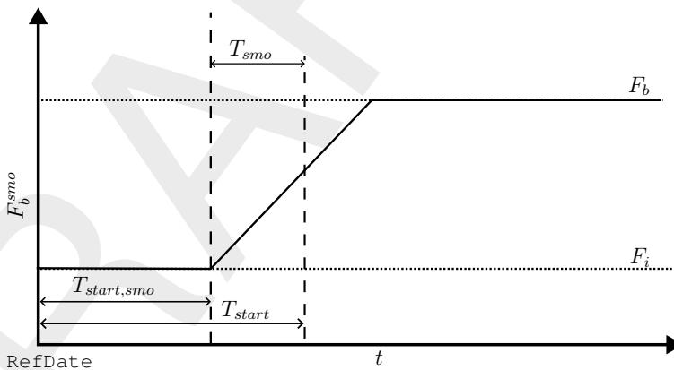

**Figure 11.2:** Transitioning between initial conditions  $F_i$  and boundary forcing  $F_b$  depending on the smoothing time  $T_{smo}$  and smoothing start time  $T_{start,smo}$  for a case in which the start of start time TStart falls within the smoothing period.

 $T_{start,smo}$  denotes the smoothing start time (not to be confused with the start time TStart) with respect to the reference time. This is defined using the keyword TStartTlfsmo. By default it is set to the start time of the simulation (i.e., smoothing is applied since the beginning), and it should be set to the start time of the original simulation when restarting (keyword TStart).

Smoothing is possible both for a warm and a cold start. If the initial conditions are consistent with the boundary conditions at the start time of the simulation then the smoothing time should be set to zero. When restarting a simulation (warm start), the smoothing time should be reduced by the difference between the original smoothing time (i.e., in the cold start) and the restart time, and it should be set to zero if the restart time is larger than the original smoothing time.

**Remark:**

- ◇ The introduction of the TStartTlfsmo has changed the behaviour of Tlfsmo in combination with a restart file as of Delft3D Flexible Mesh Suite 2024.03. Previously,

when using a restart file, the simulation was assumed to be correctly adjusted to the initial conditions, and therefore Tlfsmo was automatically set to zero. This is no longer the case. **To reproduce old model results when using a restart file, manually set Tlfsmo to zero in the .mdu file.**

### Secondary boundary conditions

In section 11.1.1, several types of boundary conditions are discussed. In addition, two types of boundary conditions can be applied on top of the canonical types: *normal* velocities and *tangential* velocities. The associated keyword are `normalvelocitybnd` and `tangentialvelocitybnd`, respectively.

### Bed level at open boundaries

For some evaluations, the solver requires the bed level at the open boundary. This value depends on the bed level in the ghost cell outside the model domain. By default, the bed level in the ghost cell is mirrored from the internal grid cell next to the boundary, which means that a zero bed slope is assumed. While this is perfectly acceptable for most real-life applications, it hinders obtaining perfect normal-flow solutions in idealized models when using `DpuOpt` = 2, i.e. the mean bed level imposed at the cell interfaces. For these specific cases, an option has been implemented to extrapolate the bed level outside the domain. When setting `[geometry] ExtrBl = 1`, the bed levels at the ghost cells are extrapolated in such a way that the flow depth at velocity points can be exact in idealized cases.<sup>1</sup> This option is only available when the bed level is specified at the cell centres (`BedlevType = 1`).

Furthermore, for obtaining perfect normal flow, the downstream water level needs to be specified at the ghost cell (`izbndpos = 0`) and the conveyance needs to be computed based on a uniform bed level based on the surrounding net nodes (`Conveyance2D = -1`). Note that the boundary condition must be manually shifted by  $s\Delta x$ , being  $s$  the slope, from the exact value expected at the domain boundary (cell edge).<sup>2</sup>

Suppose a case in which a specific discharge  $q$  of  $1 \text{ m}^2/\text{s}$  is fed into a rectangular channel of constant width and constant slope  $s$  equal to  $-7.1356 \times 10^{-4}$ . Wall friction is neglected. Friction is using Chézy with parameter  $C$  equal  $3.74357 \times 10^1 \text{ m}^{1/2}/\text{s}$ , such that the normal flow depth, given by  $h = (q^2/C^2/s)^{1/3}$ , becomes 1 m. A grid with streamwise space step  $\Delta x$  of 20 m is employed. The bed level at the downstream end of the domain (the cell edge) is  $-1 \text{ mAD}$ , such that the water level boundary condition for obtaining perfect normal flow is 0 mAD at the cell edge. This condition is obtained by setting the water level at the ghost cell equal to  $s\Delta x = -0.01427$  (`izbndpos = 0`).

Figure 11.3 shows the cell-centre velocity of the idealized case described above when using and not using the bed level extrapolation. Figure 11.4 shows the flow depth at velocity points and Figure 11.5 the flow depth at cell centres. When extrapolating the bed level, the flow depth at velocity points and the velocity at cell centres (and velocity points) are equal to the desired normal-flow case values. However, the flow depth at cell centres is smaller. This is because the D-Flow FM numerical scheme uses at the cell interfaces the upwind water level. If the water depth at the interface matches the normal-flow water depth, then the water depth at the upstream cell centre will be smaller since the same water level is combined with a

<sup>1</sup>The bed levels are extrapolated in line with the internal slope at water level boundaries, but with the reverse slope at velocity/discharge boundaries since the model uses the water level of the internal grid cell at the open boundary in the latter case.

<sup>2</sup>One would expect that the boundary condition should only be reduced by half that value, but the water level at the cell interfaces is determined by the value of the upwind cell centre. The water level to be specified at the ghost cell should be consistent with that trend.

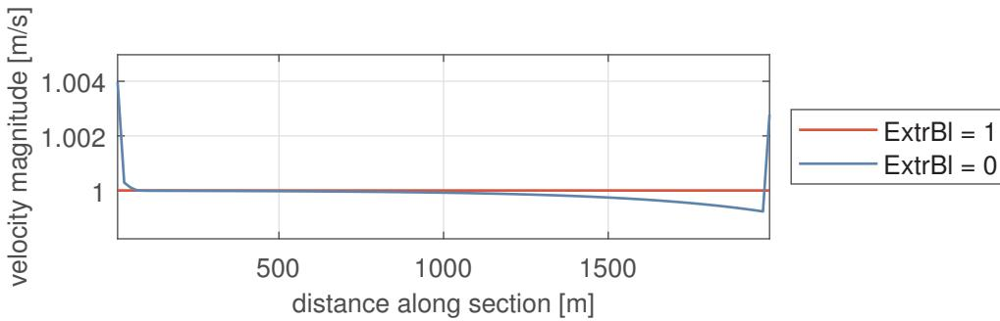

**Figure 11.3:** Cell-centre velocity magnitude along the streamwise direction of an idealized normal-flow case.  $ExtrBl = 1$  extrapolates the bed levels at the boundaries and perfect normal flow is obtained.

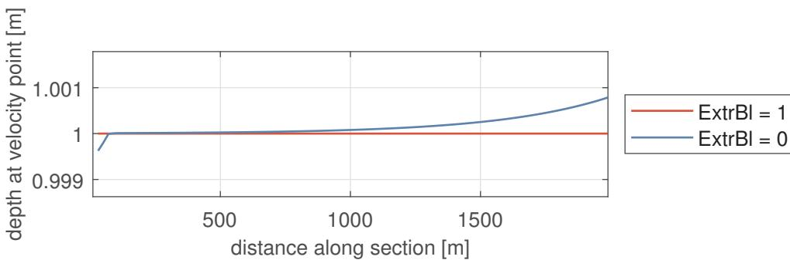

**Figure 11.4:** Flow depth at velocity points along the streamwise direction of an idealized normal-flow case.  $ExtrBl = 1$  extrapolates the bed levels at the boundaries and perfect normal flow is obtained.

higher cell-centre bed level.

### 11.1.2 Vertical boundary conditions

The vertical boundary conditions close the system of shallow water equations at the bed level and the free surface level. Without precipitation, evaporation or ground water flow, there is by definition no flow through the bottom or top surface of the water column. The vertical boundary conditions for the continuity equation 3.3 are most easily expressed when the  $\sigma$  co-ordinate is used for the vertical direction. In that case the free surface ( $\sigma = 1$ , or  $z = \zeta$ ) and the bottom ( $\sigma = 0$ , or  $z = z_b$ ) are  $\sigma$  co-ordinate surfaces.  $\omega$  is the vertical velocity relative to the  $\sigma$ -plane. The impermeability of the surface and the bottom is taken into account by prescribing the following kinematic conditions:

$$\omega|_{\sigma=1} = 0 \text{ and } \omega|_{\sigma=0} = 0 \quad (11.5)$$

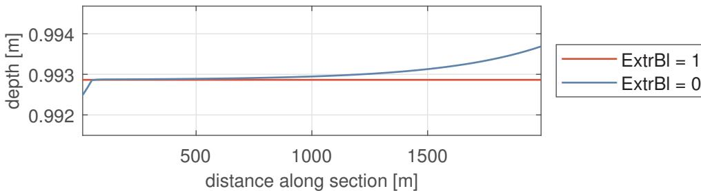

**Figure 11.5:** Cell-centre flow depth along the streamwise direction of an idealized normal-flow case. ExtrBl = 1 extrapolates the bed levels at the boundaries and perfect normal flow is obtained.

## 11.2 Nesting of D-Flow FM models

**Note:** Nesting of D-Flow FM models is of TRL level 4-6 (prototype), with the definitions of the Technical Technology Readiness Levels (TRL) in Section 2.7.

**Note:** For application of nesting in D-Flow FM at least D-Flow FM release 2027.01 (November 2026) has to be used.


### 11.2.1 Introduction

D-Flow FM models require hydrodynamic and transport boundary conditions. When the boundary conditions of a small (inner domain) D-Flow FM model are generated by a large (outer domain) D-Flow FM model, then this approach is called 'nesting'. This is a relatively easy and powerful approach for generation boundary conditions of a smaller domain model. There are no requirements for the inner and outer model grids, except that the inner model grid is located entirely in the outer model grid. Nesting is a form of offline coupling. At first, the simulation of the outer model has to be carried out with some additional input for nesting, before the simulation of the inner model is started. An example of two nested grids is shown in Figure 11.6, with the inner model grid in blue and the outer model grid in black.

The procedure via nesting of generating time series boundary conditions for the inner domain consists of the following three steps in D-Flow FM

1. 1 The polyline (\*.pli file) of each open boundary segment in the nested inner model has to be prescribed as an 'observation point' in the outer model.
2. 2 Run the overall model with the list of observation points extended by the polyline files of the open boundaries of the inner model domain. In other words, the ObsFile list has to be extended, which might be of the form:

```
ObsFile = outermodel.xyn ../innermodel/sea.pli ../innermodel/river.pli
```

1. 3 Run the inner domain model, which should have the desired boundaries in keyword ExtForceFileNew, with the keyword forcingFile pointing to the \_his.nc file generated by the outer domain model simulation. For example, this might be of the form (i.e. model with water level boundary and a uxuyadvectionvelocitybnd boundary, including salinity):

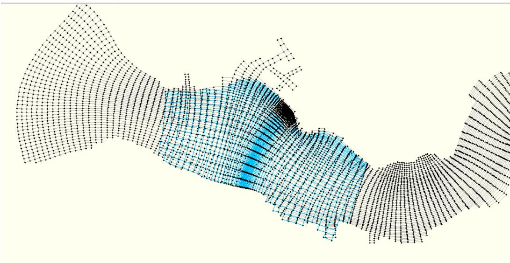

**Figure 11.6:** Example of nested grids.

```
fileType=extForce[Boundary]
quantity=waterlevelbnd
locationFile=sea.pli
forcingFile=-../outermodel/coarse_his.nc[Boundary]
quantity=salinity
locationFile=sea.pli
forcingFile=-../outermodel/coarse_his.nc[Boundary]
quantity=uxuyadvectionvelocitybnd
locationFile=river.pli
forcingFile=-../outermodel/coarse_his.nc[Boundary]
quantity=salinity
locationFile=river.pli
forcingFile=-../outermodel/coarse_his.nc
```

No other model inputs adaptations are needed, other than the ones described above. Noted that a uxuyadvectionvelocitybnd boundary is always in combination with a water level boundary. In case of nesting also time series boundary conditions are generated for the transport processes (salinity, temperature, tracers, water quality substances).

**Restrictions:**

Currently, nesting in D-Flow FM has to satisfy the following conditions:

1. 1 Both model grids must be supplied in separate grid files and must be defined in the same co-ordinate system.
2. 2 Hydrodynamic time series boundary conditions of the nested inner domain model are of the water level type or of uxuyadvectionvelocitybnd type. Velocity boundary conditions, discharge boundary conditions and Riemann boundary conditions aren't implemented.

DRAFT

## 12 Hydraulic structures

Obstacles in the flow may generate sudden transitions from flow contraction to flow expansion. The grid resolution is often low compared to the gradients of the water level, the velocity and the bathymetry. The hydrostatic pressure assumption may locally be invalid. Examples of these obstacles in civil engineering are: gates, barriers, dams, groynes and weirs. The obstacles generate energy losses and may change the direction of the flow.

The forces due to obstacles in the flow which are not resolved (sub-grid) on the horizontal grid, should be parameterised. The obstacles are denoted in D-Flow FM as hydraulic structures. In the numerical model the hydraulic structures should be located at velocity points of the grid. The direction of the forces should be specified at input. To model the force on the flow generated by a hydraulic structure, a quadratic energy or linear loss term is added to the momentum equation.

**Note:** Structure definitions can be made in Delta Shell, and will then be saved into a structures <\*.ini>-file ([Appendix C.13](#)).


The user can insert the hydraulic structures by the means of polygons on the grid. By selecting the required structure and drawing a polygon on the computational grid, the location of structure can be defined (see Figure 12.1). The supported structures in D-Flow FM are

- ◇ Fixed Weirs
- ◇ Dambreaks
- ◇ Gates
- ◇ (Adjustable) general structures, weirs, gates and universal weirs
- ◇ Long culverts
- ◇ Bridges (in 1D)
- ◇ Pumps
- ◇ Compound structures
- ◇ Thin dams
- ◇ Floating structures (via ice modelling)

In practice, the word 'barrier' is often used for structures. However, in D-Flow FM such structures are modelled as a gate or a weir in combination with a so-called Control Group (D-Real Time Control model).


**Figure 12.1:** Selection of structures (and other items) in the toolbar.

### 12.1 Fixed weirs

In D-Flow FM, a fixed weir is a fixed non-movable construction generating energy losses due to constriction of the flow. They are commonly used to model sudden changes in depth (roads, summer dikes) and groynes in numerical simulations of rivers. Such structures are applied to keep the river in its bed for navigation purposes. Others are built, for instance, to protect an area behind a tidal weir from salt intrusion. Upstream of a weir the flow is accelerated

due to contraction and downstream the flow is decelerated due to expansion. The expansion introduces an important energy loss due to turbulence. The energy loss is dependent on the shape of the weir and its crest level.

Fixed weirs are located in D-Flow FM on the velocity points of the computational grids. For a description of the input of fixed weirs, we refer you to [section 7.4.2.5](#) and [C.9](#).

In D-Flow FM, three different approaches are applied to simulate the energy losses by fixed weirs. First of all, a numerical approach has been implemented. Then, a special discretization of the advective terms around the fixed weir is applied. For a detailed description we refer to [Deltares \(2026a, section 6.7.1 – 6.7.4\)](#).

Next to the numerical approach, there is an empirical approach. Based on measurements in flume laboratories empirical formulae can be derived in order to match the measurements as accurately as possible. In this empirical approach, the energy loss due to a weir is described by the loss of energy height ( $[m]$ ). The energy loss in the direction perpendicular to the weir is denoted as  $\Delta E$ . This energy loss is added as an opposing force in the momentum equation by adding a term  $-g\Delta E/\Delta x$  to the right hand side of the momentum equation, resulting in a jump in the water levels by  $\Delta E$  at the location of the weir. For the computation for the energy loss  $\Delta E$  two options are available in D-Flow FM, namely the so-called 'Tabellenboek' and 'Villemonte' approaches. The two corresponding empirical formulas have been taken from the Simona software suite. For a detailed description of both formulas we refer to [Deltares \(2026a, section 6.7.5 – 6.7.6\)](#). In this empirical approach the discretization of the advective terms does not change, unlike the numerical approach in D-Flow FM for modelling fixed weirs.

The third approach is only available for fixed weirs that are located on 1D2D connections. For this approach a weir formula is used to compute the flow over the fixed weir. For a detailed description of this approach see [Deltares \(2026a, section 6.9.3\)](#). This approach can be turned on by setting `FixedWeirScheme1d2d=1` under the paragraph `[numerics]` in the MDU-file. **Note:** The non-1D2D fixed weirs will not be affected by this keyword.


## 12.2 Dam break

The dam break is a structure that models a growing breach after a dam failure or levee breach. A dam break is not really a hydraulic structure, but since it shares several properties with other structures (in terms of input and output), it is included here. The calculation of flow through a breach is based on a fixed weir (section 12.1), which models energy losses across the crest. Therefore, one important requirement of a dam break is that, a fixed weir polyline must be present on the same location as the dam break polyline. The dam break structure lowers the crest level and widens the breach width over time.

The input file format for a dam break is described in [section C.13.8](#) and the output options in [section E.3.1.8.6](#).

In this section, firstly, the geometrical grid snapping of dam break polylines to 2D grid lines is discussed. Then the computation of breach growth of a dam break is discussed. This includes two empirical formulas for computing breach growth: Verheij–van der Knaap (2002) and van der Knaap (2000).

### 12.2.1 Grid snapping of a dam break

The potential location of a dambreak is defined by an input dam break polyline. This should coincide with (part of) a fixed weir polyline. When initializing a model, the geometrical snapping of these polylines to the grid cell edges is identical for both. The rule of this snapping is, if the polyline intersects with a 2d flow link or a 1d2d lateral flow link, then it is snapped to the cell edge that intersects with this flow link.

The user defines the start location of the dam breach by means of providing the coordinates ( $\text{startLocation}_X$ ,  $\text{startLocation}_Y$ ). The actual starting point of the dam breach is determined by the following steps:

1. 1 The nearest point on the dam break polyline to the start location is determined, by projecting the start location onto the polyline.
2. 2 For all flow links in the dam break, the intersection of these flow links with the dambreak polyline are computed.
3. 3 The flow link with its intersection that is closest to the projected start location will be used as the actual midpoint location of the dam breach.

More details are available in the section about fixed weir snapping in (Deltares, 2026a, section 6.7.7). Note that a start location for a breach that is placed in the middle of a dam break, may not be located in the middle after snapping. This is most obvious when a dam break snaps to an even number of flow links/grid edges equal lengths. This is of particular importance when the breach width grows to about the full width of the dam break. See section 12.2.2.4 for more details.

### Fixed weirs and dambreaks on a 2D grid

To correctly model the crest width of a fixed weir (and the breach width), the flow link widths at the grid-snapped polylines are adjusted. Assume that the fixed weir polyline intersects with a flow link  $j'$ , associated with cell edge  $j$ . Then flow link width  $w_{u_j}$  is computed as:

$$w_{u_j} = \cos(\alpha) ||Edge||_j, \quad (12.1)$$

where

 $w_{u_j}$  is the flow link width,  
 $||Edge||_j$  is the original length of cell edge  $j$  (i.e., the original width of flow link  $j'$ ), and  
 $\alpha$  is the angle between the fixed weir polyline and cell edge  $j$ .

In other words,  $w_{u_j}$  is the projection of the original width of edge  $j$  onto the fixed weir polyline. As a result, when summing  $w_{u_j}$  for all affected flow links  $j'$ , the total width is similar to the length of the polyline.

### 12.2.2 Computation of breach growth

Two formulas are available to compute the breach growth of a dam break in D-Flow FM: Verheij–Van der Knaap(2002) and Van der Knaap (2000). These are discussed first. Alternatively, breach width and depth may be provided by the user as a time series. Finally, the details of a breach width spanning multiple flow links is discussed.

Both breach growth formulas regard the process of breach growth as two phases:

- ▷ **Phase 1:** during which the breach level, for a constant initial breach width, is lowering from its initial crest level  $z_{\text{crest}}$  (or dike level) to its minimal crest level  $z_{\text{min}}$ . In other words,

this phase is a "lowering" phase. The breach level decreases while the breach width stays unchanged.

- ❖ **Phase 2:** during which the breach only grows in width under a certain condition depending on the formula in use. The Verheij–Van der Knaap (2002) formula increases the breach width based on the water level jump, as long as the flow velocity through the breach is larger than the critical flow velocity for eroding sediment/soil particles  $u_c$ . The Van der Knaap (2000) formula computes the breach width as a function of time and limits it by a maximal breach width. In other words, this phase is a "widening" phase. The breach level stays at the minimal level and the breach width increases.

### 12.2.2.1 The Verheij–Van der Knaap (2002) formula

One can choose to use the Verheij–Van der Knaap (2002) formula by setting the input parameter `algorithm=2` in Table C.31. The formula is as follows:

#### Phase 1:

For  $T_{\text{start}} \leq t \leq T_{\text{start}} + t_{\text{Phase 1}}$ 

$$B(t) = B_0, \tag{12.2}$$

$$z(t) = z_{\text{crest}} - \left( \frac{t - T_{\text{start}}}{t_{\text{Phase 1}}} \right) (z_{\text{crest}} - z_{\text{min}}). \tag{12.3}$$

#### Phase 2:

For  $t > T_{\text{start}} + t_{\text{Phase 1}}$  (hence  $B(t) \geq B_0$ ):

$$z(t) = z_{\text{min}}, \tag{12.4}$$

$$B(t_{i+1}) = B(t_i) + \frac{\Delta t}{3600} \left( \frac{\partial B}{\partial t} \right)_{t_{i+1}}, \tag{12.5}$$

where

$$\left( \frac{\partial B}{\partial t} \right)_{t_{i+1}} \begin{cases} \frac{f_1 f_2}{\ln(10)} \frac{(g(h_{\text{up}} - \max(h_{\text{down}}, z_{\text{min}}))^{3/2}}{u_c^2} \frac{1}{1 + \frac{f_2}{3600} \frac{g}{u_c} (t_{i+1} - t_1)} & \text{if } |u| > u_c \\ 0 & \text{if } |u| \leq u_c \end{cases}. \tag{12.6}$$

The notations in the above formula are:

| $f_1$                                                    | (input parameter) Factor 1: constant factor [−],                                                                                                                                                                                                |
|----------------------------------------------------------|-------------------------------------------------------------------------------------------------------------------------------------------------------------------------------------------------------------------------------------------------|
| $f_2$                                                    | (input parameter) Factor 2: constant factor [−],                                                                                                                                                                                                |
| $B(t)$                                                   | Width of the dam breach at time $t$ [m],                                                                                                                                                                                                        |
| $B_0$                                                    | (input parameter) Initial width of the dam breach [m],                                                                                                                                                                                          |
| $\left( \frac{\partial B}{\partial t} \right)_{t_{i+1}}$ | Rate of breach width growth in time-step $\Delta t$ from $t_i$ to $t_{i+1}$ [m/s],                                                                                                                                                              |
| $g$                                                      | Acceleration due to gravity [m/s <sup>2</sup> ],                                                                                                                                                                                                |
| $h_{\text{up}}$                                          | Upstream water level at time $t$ [m AD],                                                                                                                                                                                                        |
| $h_{\text{down}}$                                        | Downstream water level at time $t$ [m AD],                                                                                                                                                                                                      |
| $t$                                                      | Current model time [s],                                                                                                                                                                                                                         |
| $t_{\text{Phase 1}}$                                     | (input parameter) Duration of phase 1, the time period over which the breach for a constant initial width ( $B_0$ ) is lowered from its initial crest level $z_{\text{crest}}$ (or dike level) to its minimal crest level $z_{\text{min}}$ [s], |
| $t_1 = T_{\text{start}} + t_{\text{Phase 1}}$            | The time [s] when the maximum breach-depth ( $z_{\text{min}}$ ) is reached, i.e. when the Phase 1 finishes,                                                                                                                                     |

| $T_{start}$ | (input parameter) Model time at which the development of the initial breach starts [s], |
|-------------|-----------------------------------------------------------------------------------------|
| $u$         | Average flow velocity in the breach [m/s],                                              |
| $u_c$       | (input parameter) Constant critical flow velocity for eroding sediment/soil particles.  |
| $z(t)$      | Crest level of the dam breach at time $t$ [m AD],                                       |
| $z_{crest}$ | (input parameter) Initial breach level at $t = T_{start}$ [m AD],                       |
| $z_{min}$   | (input parameter) Minimal breach level at $t = t_1$ [m AD],                             |
| $\Delta t$  | Computational time step [s], equal to $t_{i+1} - t_i$ .                                 |

Settings of the input parameters can be found in section C.13.8.

### Upstream and downstream water levels ( $h_{up}$ and $h_{down}$ )

By default the upstream and downstream water levels are computed by averaging the water-levels upstream and downstream of the dambreak. Only grid cells that are connected to a flow link that is (partly) opened by the dambreak are included in the averaging. For the averaging of upstream and downstream water level the original flow width of the open flow links is used as a weight factor.

Another possibility is to define custom up and downstream water level locations. In Section C.13.8 the input settings for this option can be found.

### Recommended values of input parameters in the Verheij–Van der Knaap (2002) formula

To use proper values, a list of recommended values as well as the range of values is given in Table 12.1.

**Table 12.1:** Recommended values of input parameters in the Verheij–Van der Knaap (2002) formula.

| Parameter     | recommended value | Range          |
|---------------|-------------------|----------------|
| $f_1$         | 1.3               | 0.5 - 5        |
| $f_2$         | 0.04              | 0.01 - 1       |
| $B_0$         | 10                | 1 - 100 m      |
| $t_{Phase 1}$ | 0.1 hours         | 0.1 - 12 hours |
| $u_c$         | 0.2 m/s           | 0.1 - 10 m/s   |
| $z_{crest}$   | -                 | -              |
| $z_{min}$     | -                 | -              |

### Characterising soil strength

As a recommendation, the parameter  $u_c$ , applied in the Verheij–Van der Knaap (2002) formula may be derived from Table 12.2, where  $\tau_c$  is the critical shear stress.

**Table 12.2:** Recommended values for  $u_c$  and  $\tau_c$ .

| Soil type                                  | Bodemtype (Dutch)                                                         | $u_c$<br>[m/s] | $\tau_c$<br>[Pa] |
|--------------------------------------------|---------------------------------------------------------------------------|----------------|------------------|
| grass, good                                | gras, goed                                                                | 7              | 185              |
| grass, moderate                            | gras, matig                                                               | 5              | 92.5             |
| grass, bad                                 | gras, slecht                                                              | 4              | 62               |
| clay, very good<br>(compacted)             | klei, zeer goed (compact; $t_{\text{ongedraineerd}} = 80 - 100$ kPa)      | 1.0            | 4                |
| clay, good<br>(firm)                       | klei met 60 % zand,<br>(stevig; $t_{\text{ongedraineerd}} = 40 - 80$ kPa) | 0.8            | 2.5              |
| clay, moderate<br>(little structure)       | goede klei met weinig structuur                                           | 0.7            | 2                |
| clay moderate<br>(considerable structured) | goede klei, sterk                                                         | 0.6            | 1.5              |
| clay, bad<br>(weak)                        | slechte klei<br>(slap; $t_{\text{ongedraineerd}} = 20 - 40$ kPa)          | 0.4            | 0.65             |
| sand with 17 % silt                        | zand met 17 % silt                                                        | 0.225          | 0.20             |
| sand with 10 % silt                        | zand met 10 % silt                                                        | 0.20           | 0.15             |
| sand with 0 % silt                         | zand met 0 % silt                                                         | 0.16           | 0.10             |

Another way to compute  $u_c$  is using the critical shear stress  $\tau_c$ . For example, if  $\tau_c$  is known, then  $u_c$  can be calculated by

$$u_c = 0.5\sqrt{\tau_c}, \quad (12.7)$$

or

$$u_c = u_{c,\text{sand}}(1 + 0.01\alpha P_{\text{clay}}) + \beta(0.65 - v), \quad (12.8)$$

where using the defaults, factor  $\alpha = 15$ , factor  $\beta = 1$ , critical flow rate for sand  $u_{c,\text{sand}} = 0.2$  m/s,  $P_{\text{clay}}$  is percentage of clay, and the voids ratio  $v$  can be computed by

$$v = n/(1 - n), \quad (12.9)$$

where  $n$  is the soils pore fraction (default  $n = 0.4$ ).

For more details of formula Verheij–Van der Knaap (2002) we refer to Verheij (2002).

#### 12.2.2.2 The Van der Knaap (2000) formula

One can choose to use the Van der Knaap (2000) formula by setting the input parameter `algorithm=1` in Table C.31. The formula is as follows:

For  $T_{\text{start}} \leq t \leq T_{\text{start}} + t_{\text{Phase 1}}$ 

$$B(t) = B_0, \quad (12.10)$$

$$z(t) = z_{\text{crest}} - \left( \frac{t - T_{\text{start}}}{t_{\text{Phase 1}}} \right) (z_{\text{crest}} - z_{\text{min}}). \quad (12.11)$$

### Phase 2:

For  $t > T_{\text{start}} + t_{\text{Phase 1}}$  (hence  $B(t) \geq B_0$ ):

$$z(t) = z_{\text{min}}, \quad (12.12)$$

$$B(t) = \min \left( c_1 \log_{10} \left( \frac{t}{c_2} \right), B_{\text{max}} \right). \quad (12.13)$$

In Equation (12.13), the coefficients  $c_1$ ,  $c_2$  and allowed maximal breach width  $B_{\text{max}}$  depend on the material of the dam. Two types of materials are possible: clay and sand. (Currently only clay is supported in D-Flow FM.) The values of these coefficients are shown in Table 12.3.

**Table 12.3:** Values of coefficients  $c_1$ ,  $c_2$  and  $B_{\text{max}}$  of the Van der Knaap (2000) formula for different material types.

| Material type | $c_1$ | $c_2$ | $B_{\text{max}}$ |
|---------------|-------|-------|------------------|
| clay          | 20    | 288   | 75 m             |
| sand          | 67    | 522   | 200 m            |

Other notations in the above formula are:

| $B(t)$               | Width of the dam breach at time $t$ [m],                                                                                                                                                                                                        |
|----------------------|-------------------------------------------------------------------------------------------------------------------------------------------------------------------------------------------------------------------------------------------------|
| $B_0$                | (input parameter) Initial width of the dam breach [m],                                                                                                                                                                                          |
| $t$                  | Current model time [s],                                                                                                                                                                                                                         |
| $t_{\text{Phase 1}}$ | (input parameter) Duration of phase 1, the time period over which the breach for a constant initial width ( $B_0$ ) is lowered from its initial crest level $z_{\text{crest}}$ (or dike level) to its minimal crest level $z_{\text{min}}$ [s], |
| $T_{\text{start}}$   | (input parameter) Model time at which the development of the initial breach starts [s],                                                                                                                                                         |
| $z(t)$               | Crest level of the dam breach at time $t$ [m AD],                                                                                                                                                                                               |
| $z_{\text{crest}}$   | (input parameter) Initial breach level at $t = T_{\text{start}}$ [m AD],                                                                                                                                                                        |
| $z_{\text{min}}$     | (input parameter) Minimal breach level at $t = t_1$ [m AD],                                                                                                                                                                                     |

Settings of the input parameters can be found in section C.13.8.

For more details about formula Van der Knaap (2000) we refer to Van der Knaap (2000).

### 12.2.2.3 Breach crest level and width time series

One can choose to explicitly prescribe the breach's crest level and width as time series by setting the input parameter `algorithm=3` in Table C.31. The provided time series must be in a `<*.bc>` file, specified in the `<structures.ini>` file by parameters `crestLevel` and `breachWidth`. Note that `<*.bc>` files contain fully referenced times, so parameter `T0` is not used here anymore. More details regarding the input format can be found in Section C.13.8.

- ◇ Deprecated:  $\langle *.tim \rangle$  files for dambreaks are deprecated. The example below is kept only for migration purposes:

In the past the breach's crest level and width were prescribed by a 3-column  $\langle *.tim \rangle$  file (in minutes), specified by parameter `dambreakLevelsAndWidths`. The times in the file are relative to  $T_{start}$  ( $t_0$ , in seconds).

#### 12.2.2.4 Method when breach grows wider than one flow link

The breach starts at only one flow link, which is defined by setting `startLocationX` and `startLocationY` in the input, see section C.13.8. The breach widths during the simulation are computed by either the formulas for breach growth or by a time series. At a certain time, if the breach width is wider than the starting flow link, D-Flow FM must determine the affected links so that the width grows, from the starting flow link, to gradually include more edges. How the breach extends beyond the starting flow link is determined by the `breachGrowth` keyword in the `<mdu-file>`; three options have been implemented.

- ◇ *symmetric* In this case the breach grows symmetrically on both left and right sides of the breach. This is the original implementation. This approach triggers a warning when the breach reaches the end of the snapped dam break on *one* of the sides.
- ◇ *symmetric-asymmetric* In this case the breach is assumed to grow symmetrically on both left and right sides of the breach until it reaches the end of the dam break on one of the sides; thereafter it only growth on the other side. This is the current default. This approach triggers a warning only when the breach width is larger than the full length of the snapped dam break.
- ◇ *proportional* In this case the breach is assumed to grow proportionally to the available width on the two sides of the breach. This approach triggers a warning only when the breach width is larger than the full length of the snapped dam break.

Given the breach width on one of the sides, for instance a width on the left side  $w_{left}$ , links on the left side are opened one by one in sequence gradually moving further away from the starting flow link:

- ◇ **Situation 1:** If  $w_{left}$  is smaller than the width of the considered flow link, then this is end of the searching.
- ◇ **Situation 2:** If  $w_{left}$  is larger or equal to the width of the considered flow, the value of  $w_{left}$  is decreased by this flow link width and the process continues with the next flow link that is on the left side of this link. This is repeated until Situation 1 is achieved, or the end of the dam break is reached.

In both two situations, the width and bed level of the considered link is affected. The bed level of this link is adjusted to the maximal value of its original bed level and the crest level of the dam break. The width of this link is adjusted to the effective dam breach width, i.e. the minimum of the remaining breach width  $w_{left}$  and the width of the flow link.

### 12.3 General structure

The General structure combines weir and gate flow into one structure. Additionally, the General structure gives the highest degree of freedom in defining the the geometry of the hydraulic structure and coefficients affecting the flow. The geometrical shape is given in Figure 12.2 and Figure 12.3. The discharge through a General structure is computed based on upstream and downstream energy levels. The input file format for a general structure is described in section C.13.7.

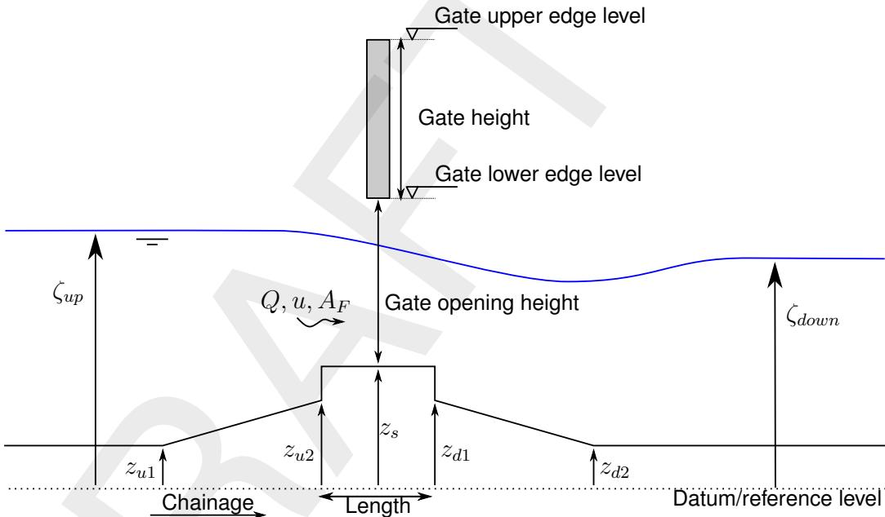

Figure 12.2: General structure, side view

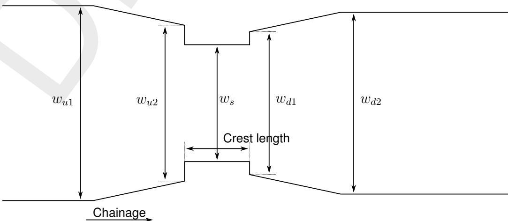

Figure 12.3: General structure, top view

The gate of the General structure can be configured as two doors with an opening in between as shown in Figure 12.4. When the modelled gate is a single door spanning the full width, the Gate Opening Width should be set to zero.

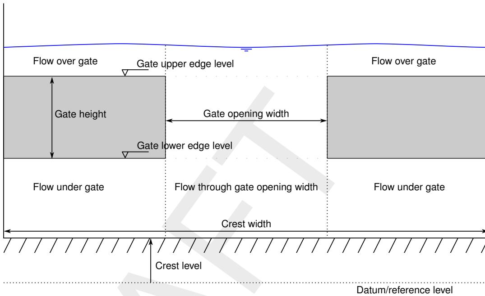

**Figure 12.4:** General structure, front view

Figure 12.4 also shows the three different geometrical parts where the General structure can have flow: under gate flow, over gate flow and between gate flow. The total discharge through the structure is calculated by adding up the discharge through the separate parts. For each part of the structure opening the downstream waterlevel is calculated and subsequently the flow type (gate or weir, free or submerged) is determined.

**Remark:**

- ◇ Please keep in mind that in the following part of this section the description for the General structure applies to the three different openings (with each its own flow conditions).

During the simulation a number of checks and possibly corrections on some dimensions of the general structure are performed.

- ◇ If the **crestLevel** is below the bed level of the surrounding water level points in the channel, the **crestLevel** ( $z_s$ ) is raised to the highest bed level of these two points<sup>1</sup>.
- ◇ If  $z_{u1}$  and/or  $z_{u2}$  are below the bed level of the upstream water level point in the channel,  $z_{u1}$  and/or  $z_{u2}$  are raised to the bed level of the upstream water level point in the channel.
- ◇ If  $z_{d1}$  and/or  $z_{d2}$  are below the bed level of the downstream water level point in the channel,  $z_{d1}$  and/or  $z_{d2}$  are raised to the bed level of the downstream water level point in the channel.
- ◇ All **widths** ( $w_s, w_{u1}, w_{u2}, w_{d1}, w_{d2}$ ) are maximized with the corresponding flow width.
- ◇ If the **gateLowerEdgeLevel** is lower than the **crestLevel**, the **gateLowerEdgeLevel** is set to the **crestLevel**.
- ◇ If the **gateHeight** is less than or equal to 0 an error message is produced.
- ◇ If the **gateOpeningWidth** is less than 0, the **gateOpeningWidth** is set to 0.  
  Else if the **gateOpeningWidth** is larger than the **crestWidth** then the **gateOpeningWidth** is set to the **crestWidth**.

<sup>1</sup>The bed level check is actually based on the face-based bed levels of the velocity point. In typical applications, this is equal to the maximum bed level of the two surrounding water level points. More information is available in (Deltares, 2026a, Equation (6.10)).

Flow across the General structure can be of the following types:

- ◇ free gate flow (i.e. supercritical gate flow),
- ◇ submerged gate flow (i.e. subcritical gate flow),
- ◇ free weir flow (i.e. supercritical weir flow), and
- ◇ submerged weir flow (i.e. subcritical weir flow).

The choice depends on the dimensions of the structure and the flow conditions. Whether or not the gate is in the flow or above the flow yields either gate or weir flow. Furthermore, the flow can be either subcritical (submerged) or supercritical (free). Both for incoming flow ("Flow") and for outgoing flow ("Reverse") contraction coefficients can be specified. These coefficients can be seen as tuning parameters for the user.

### 12.3.1 Notation

The used variables in this subsection are described in this paragraph.

The five geometric parameters as shown in Figure 12.2:

| $z_s$    | Crest level,            |
|----------|-------------------------|
| $z_{u1}$ | Level upstream 1,       |
| $z_{u2}$ | Level upstream 2,       |
| $z_{d1}$ | Level downstream 1, and |
| $z_{d2}$ | Level downstream 2      |

Similarly for the five values for the width of the General structure, see Figure 12.3:

| $w_s$    | Width at crest level,   |
|----------|-------------------------|
| $w_{u1}$ | Width upstream 1,       |
| $w_{u2}$ | Width upstream 2,       |
| $w_{d1}$ | Width downstream 1, and |
| $w_{d2}$ | Width downstream 2      |

Other variables used in the equations of this subsection:

| $C$          | Chézy value, representing the roughness at the downstream side of the General structure                                  |
|--------------|--------------------------------------------------------------------------------------------------------------------------|
| $c_{gf}$     | Correction coefficient for free gate flow                                                                                |
| $c_{gd}$     | Correction coefficient for submerged gate flow                                                                           |
| $c_{wf}$     | Correction coefficient for free weir flow                                                                                |
| $c_{wd}$     | Correction coefficient for submerged weir flow                                                                           |
| $E_1$        | Energy height upstream ( $= \zeta_{up} + u^2/(2g)$ )                                                                     |
| $g$          | Acceleration due to gravity                                                                                              |
| $H_{s1}$     | Energy height with respect to the crest level ( $= E_1 - z_s = \zeta_{up} + \frac{u^2}{2g} - z_s$ )                      |
| $h_g$        | Opening height of the gate ( $= \text{gateLowerEdgeLevel} - z_s$ )                                                       |
| $L$          | Length of the expansion zone at the downstream side of the General structure                                             |
| $h_2$        | Water depth downstream of the structure with respect to the crest level ( $= \zeta_{down} - z_{d2}$ ), see remark below. |
| $\Delta S_1$ | $= z_s - z_{d1}$                                                                                                         |
| $\Delta S_2$ | $= z_{d1} - z_{d2}$                                                                                                      |
| $\lambda$    | Extra resistance parameter                                                                                               |
| $\rho^*$     | $= \rho_2 / \rho_1$                                                                                                      |
| $\rho_1$     | Density of the water at the upstream side of the General structure [ $kg/m^3$ ]                                          |
| $\rho_2$     | Density of the water at the downstream side of the General structure [ $kg/m^3$ ]                                        |
| $\mu_{gf}$   | Contraction coefficient for free gate flow                                                                               |

 $\mu_{gd}$  Contraction coefficient for submerged gate flow ( $\mu_{gd} = \mu_{gf}$ )

**Remarks:**

- ◇ Downstream water depth  $h_2$  is limited to a minimal value of  $0.9 \cdot \frac{2}{3} \cdot H_{s1} \cdot \left(\frac{w_s}{w_{d2}}\right)^{\frac{2}{3}}$ .
- ◇ The effect of this limiter might result in an incorrect flow state. In case the downstream level  $z_{d2}$  is similar to the crest level  $z_s$  and the downstream width  $w_{d2}$  is similar to the crest width  $w_s$ , the general structure might not reach the free flow state.
- ◇ The energy heights  $E_1, H_{s1}$  can be set to ordinary water levels in case the flag UseVelocityHeight is set to False. For more information, see section 12.3.4.

**12.3.2 Geometry**

The crest level, gate lower edge level and gate door opening width can also be given as time series.

A (2D) hydraulic structure is given as a single geometrical object by the user, but it may cross multiple 2D grid cells (or: flow links). In case a General structure is positioned on a 1D branch, a structure crosses only 1 link. Each flow link under the influence of this structure (i.e. structure link) is treated as a General structure with the correct geometrical parameters.

**Remark:**

- ◇ In case a General structure crosses multiple 2d flow links,  $w_{u1}$ ,  $w_{u2}$ ,  $w_{d1}$  and  $w_{d2}$  are all set per individual link to the crest width per link ( $w_s(L)$ ).

**Crest width**

The crest width of an individual flow link, under the influence of this structure, cannot exceed the width of this flow link. As a result, when the crest width exceeds the sum of the widths of the structure links, the crest width is reduced to the sum of the widths of the flow links. When the crest width is omitted in the input the structure width will be set to the sum of the widths of the structure links.

**Remark:**

- ◇ Keep in mind that in case a polyline has e.g. an angle of 45 degrees with the grid, the sum of the flow widths might be a factor of  $\sqrt{2}$  larger than the polyline. Therefore it is recommended to align the grid with the structure.

In case the crest width is smaller than the sum of the widths of the structure links, the following algorithm is applied:

- ◇ Use the next definitions

| $w_u(L)$     | is the flow width of a structure link                 |
|--------------|-------------------------------------------------------|
| N            | is the total number of structure links in a structure |
| $w_s$        | is the total crest width                              |
| $w_s(L)$     | is the crest width of a structure link                |
| $w_{closed}$ | $= \sum_{L=1}^N w_u(L) - w_s$                         |

- ◇ Determine smallest  $p$  and largest  $q$  where

$$\left( \sum_{L=1}^p w_u(L) \right) - 0.5 \cdot w_{closed} > 0 \quad (12.14)$$

$$\left( \sum_{L=1}^q w_u(L) \right) - 0.5 \cdot w_{closed} < 0 \quad (12.15)$$

- ◇ The crest widths of the structure links 1 until  $q$  will be set to 0 (i.e. closed)
- ◇ The crest width of structure link  $p = q - 1$  will become:

$$w_s(p) = \left( \sum_{L=1}^p w_u(L) \right) - 0.5 \cdot w_{closed} \quad (12.16)$$

- ◇ A similar approach is applied to the right side of the structure.
- ◇ A result the opening of the structure will be right in the middle of the set of structure links.

**Example for the left part of the structure:**

Assume the total crest width is 550 [m] ( $w_s$ ), the total flow width is 1000 [m] and the number of structure links is set to 5 ( $N$ ). So each structure link has a width of 200 is [m] ( $w_u(L)$ ), the total flow width is indeed 1000 [m] ( $\sum_{L=1}^N w_u(L)$ ) and thus  $w_{closed}$  is 450 [m]. According Equation (12.14) we get  $p = 2$ , and according Equation (12.15) we get  $q = 1$ . The partial open/closed structure link  $w_s(p)$  has a crest width of 175 [m], according Equation (12.16) ( $175 = 400 - 225$ ). The total crest width is:  $w_s(2) + w_s(3) + w_s(4) = 175 + 200 + 175 = 550$  [m]. Taken into account the symmetry between left and right side of the structure.

**Gate opening**

The GateOpeningWidth is a compulsory parameter for General structures. A single gate door with no horizontal movement should use GateOpeningWidth=0. A structure that has one or two gate doors that do have horizontal opening and closing movement should specify the width of the horizontal opening between the doors.

Depending on the gate door positions, some structure links may have only flow across the weir crest in the opening, whereas others may have gate flow, or a combination of both. A similar algorithm for applying the gate door to the individual flow is performed as described for the crest width. There is an exception, because the door might not close symmetrical. The parameter GateOpeningHorizontalDirection defines the way a gate door is divided over the structure links. Possible values are symmetric, fromLeft, fromRight.

At both ends of the gate opening structure links may be partially opened in such a way that the gateOpeningWidth exactly matches the sum of the width of the open flow links.

**Extra resistance**

The extra resistance parameter  $\lambda$  relates to the friction force in the impulse balance, that in case of submerged gate flow or submerged weir flow is solved for the water movement at the downstream side of the General structure. The extra resistance parameter  $\lambda$  is given by the expression:

$$\lambda = \frac{gL}{C^2} \quad (12.17)$$

For an explanation of the variables see [section 12.3.1](#).

Either the extra resistance parameter,  $\lambda$ , can be specified, or the length,  $L$ , can be specified by the user. In case length is used, the Chézy value of the flow link is used for calculating  $\lambda$ .

### 12.3.3 Computation of the downstream water level

In case of submerged gate flow or submerged weir flow the water level at the sill or downstream of the gate is required. This level is computed by application of the impulse balance.

#### Remark:

- ◇ The equations in this paragraph apply to flow in positive direction for flow in negative direction replace the next variables in the equations:
  - ◇  $z_{d1}$  into  $z_{u2}$
  - ◇  $z_{d2}$  into  $z_{u1}$
  - ◇  $w_{d1}$  into  $w_{u2}$
  - ◇  $w_{d2}$  into  $w_{u1}$

#### Submerged gate-flow

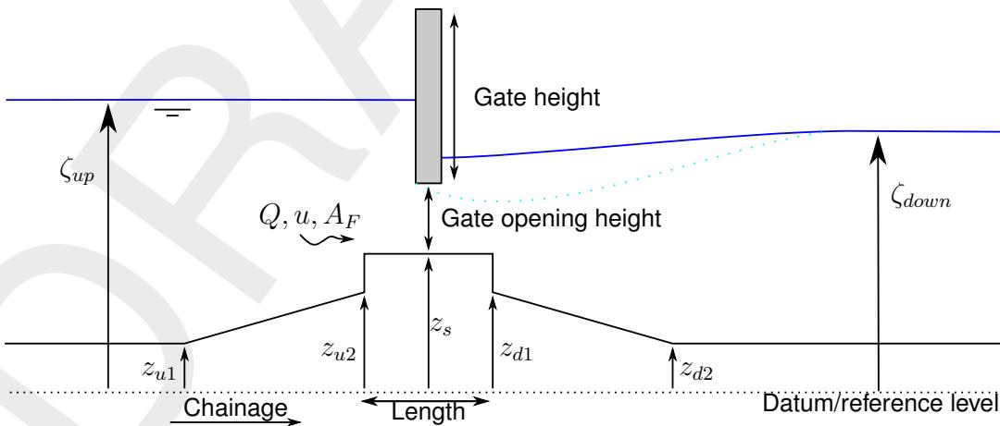

**Figure 12.5:** Submerged gate flow

The water depth on the crest  $h_s$  can be described by a second order algebraic equation:

$$A_g h_s^2 + B_g h_s + C_g = 0 \quad (12.18)$$

with:

$$A_g = (1 + \rho^*) \left( \frac{w_{d1}}{3} + \frac{w_{d2}}{6} \right) + (1 - \rho^*) \left( \frac{w_{d1}}{4} + \frac{w_{d2}}{12} \right) \quad (12.19)$$

$$\begin{aligned} B_g = & (1 + \rho^*) \left( (\Delta S_1 + \Delta S_2 - h_2) \left( \frac{w_{d1}}{3} + \frac{w_{d2}}{6} \right) + (2\Delta S_1 + h_2) \frac{w_{d1}}{6} + \right. \\ & \left. (\Delta S_1 + 2h_2) \frac{w_{d2}}{6} \right) + \\ & + (1 - \rho^*) \left( \Delta S_1 \frac{w_{d1}}{3} + (\Delta S_1 + h_2) \frac{w_{d1} + w_{d2}}{6} \right) + \\ & + \frac{4\rho^* c_{gd}^2 \mu_{gd}^2 h_g^2 w_s^2}{w_{d2} h_2} \left( 1 + \frac{\lambda}{d_2} \right) - 4c_{gd} \mu_{gd} h_g w_s \end{aligned} \quad (12.20)$$

$$\begin{aligned} C_g = & (1 + \rho^*) (\Delta S_1 + \Delta S_2 - h_2) \left( 2\Delta S_1 + h_2 \right) \frac{w_{d1}}{6} + (\Delta S_1 + 2h_2) \frac{w_{d2}}{6} + \\ & + (1 - \rho^*) \left( (\Delta S_1)^2 \frac{w_{d1}}{6} + (\Delta S_1 + h_2) \frac{w_{d1} + w_{d2}}{12} \right) + \\ & - \frac{4\rho^* c_{gd}^2 \mu_{gd}^2 h_g^2 w_s^2 H_{s1}}{w_{d2} h_2} \left( 1 + \frac{\lambda}{h_2} \right) + 4c_{gd} \mu_{gd} h_g w_s H_{s1} \end{aligned} \quad (12.21)$$

For an explanation of the variables see section 12.3.1.

Equation (12.18) leads to:

$$h_s = \frac{-B_g + \sqrt{B_g^2 - 4A_g C_g}}{2A_g} \quad (12.22)$$

**Submerged weir-flow**

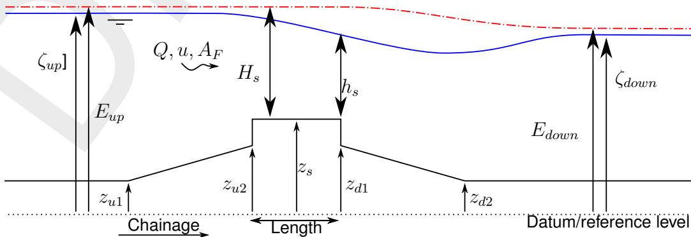

**Figure 12.6:** Submerged weir-flow.

The water depth at the sill  $h_s$  is described by a third order algebraic equation:

$$D_w h_s^3 + A_w h_s^2 + B_w h_s + C_w = 0 \quad (12.23)$$

with:

$$D_w = \frac{4\rho^*c_{wd}^2w_s^2}{w_{d2}h_2}(1 + \frac{\lambda}{h_2}) \quad (12.24)$$

$$\begin{aligned} A_w = & (1 + \rho^*) \left( \frac{w_{d1}}{3} + \frac{w_{d2}}{6} \right) + (1 - \rho^*) \left( \frac{w_{d1}}{4} + \frac{w_{d2}}{12} \right) + \\ & - \frac{4\rho^*c_{wd}^2w_s^2H_{s1}}{w_{d2}h_2}(1 + \frac{\lambda}{h_2}) - 4c_{wd}w_s \end{aligned} \quad (12.25)$$

$$\begin{aligned} B_w = & (1 + \rho^*) \left( (\Delta S_1 + \Delta S_2 - h_2) \left( \frac{w_{d1}}{3} + \frac{w_{d2}}{6} \right) + (2\Delta S_1 + h_2) \frac{w_{d1}}{6} + \right. \\ & \left. (\Delta S_1 + 2h_2) \frac{w_{d2}}{6} \right) + \\ & + (1 - \rho^*) \left( \Delta S_1 \frac{w_{d1}}{3} + (\Delta S_1 + h_2) \frac{w_{d1} + w_{d2}}{6} \right) + 4c_{wd}w_s H_{s1} \end{aligned} \quad (12.26)$$

$$\begin{aligned} C_w = & (1 + \rho^*)(\Delta S_1 + \Delta S_2 - h_2) \left( (2\Delta S_1 + h_2) \frac{w_{d1}}{6} + (\Delta S_1 + 2h_2) \frac{w_{d2}}{6} \right) + \\ & + (1 - \rho^*) \left( (\Delta S_1)^2 \frac{w_{d1}}{6} + (\Delta S_1 + h_2)^2 \frac{w_{d1} + w_{d2}}{12} \right) \end{aligned} \quad (12.27)$$

A direct method is applied to calculate  $h_s$  from equation Equation (12.23).

### 12.3.4 Turning off the computation of the energy levels

The input parameter `useVelocityHeight` in the `<structures.ini>` file (Appendix C.13) can be used to change the default way of solving the flow through the structure. For certain situations the default setting might lead to incorrect results. The reason is that the general structure was developed for modelling structures in an open channel (river or rural applications), and the preceding approximations are based on certain assumptions. When applied to urban applications, some of these assumptions may not hold. Also important to realize is that the weir is based on the same formulations and assumptions.

The default setting, `useVelocityHeight=true`, is the situation as described in the previous section on water level computations. The upstream energy level is defined as

$$E_1 = \zeta_{up} + u^2/(2g) \quad (12.28)$$

and the downstream water depth ( $h_s$ ) is determined as described in section 12.3.3.

The alternative setting, `useVelocityHeight=false`, simplifies the governing equations for  $E_1$  and  $h_s$ . This can be of use when modelling a sewer system, where an overflow is also modelled as a general structure. Simple (gated) weir flow depending on simple water levels is preferred in such a case. The first difference compared to open water channels is that upstream horizontal velocities in an urban manhole compartment will typically be almost zero. The upstream energy height then simplifies to the upstream water level:

$$E_1 = \zeta_{up}. \quad (12.29)$$

The second difference is that the general structure's geometry simplifies to a long crest with  $z_{u1} = z_{u2} = z_s = z_{d1} = z_{d2}$ . The downstream water depth can no longer be derived from the acceleration across this (flat) crest, so it is simply based on downstream water level:

$$h_s = \zeta_{down} - z_s. \quad (12.30)$$

### 12.3.5 Discharge equations

The following discharge equations are applied during the computations.

- ◆ Free gate flow:

$$u_s = \mu_{gf} c_{gf} \sqrt{2g(E_1 - (z_s + \mu_{gf} h_g))} \quad (12.31)$$

$$A_f = w_s h_g \quad (12.32)$$

$$Q = u_s A_f = \mu_{gf} c_{gf} w_s h_g \sqrt{2g(E_1 - (z_s + \mu_{gf} h_g))} \quad (12.33)$$

- ◆ submerged gate flow:

$$u_s = \mu_{gd} c_{gd} \sqrt{2g(E_1 - (z_s + h_s))} \quad (12.34)$$

$$A_f = w_s h_g \quad (12.35)$$

$$Q = u_s A_f = \mu_{gd} c_{gd} w_s h_g \sqrt{2g(E_1 - (z_s + h_s))} \quad (12.36)$$

$$(12.37)$$

- ◆ Free weir flow:

$$u_s = c_{wf} \sqrt{\frac{2}{3}g(E_1 - z_s)} \quad (12.38)$$

$$A_f = w_s \frac{2}{3}(E_1 - z_s) \quad (12.39)$$

$$Q = u_s A_f = c_{wf} w_s \frac{2}{3} \sqrt{\frac{2}{3}g(E_1 - z_s)^{3/2}} \quad (12.40)$$

- ◆ submerged weir flow:

$$u_s = c_{wd} \sqrt{2g(E_1 - (z_s + h_s))} \quad (12.41)$$

$$A_f = w_s h_s \quad (12.42)$$

$$Q = u_s A_f = c_{wd} w_s h_s \sqrt{2g(E_1 - (z_s + h_s))} \quad (12.43)$$

For an explanation of the variables see [section 12.3.1](#).

#### Remarks:

- ◆ The contraction coefficient has a maximum value  $\mu = 1.0$ . In case the user specifies a higher value, a warning will be generated.
- ◆ For all the coefficients two values must be specified. One for flow in positive direction and another for flow in negative direction.

#### Determining the flow type

The flow type is determined by this algorithm:

- ◆ Determine  $h_s$  based on submerged weir flow equations
- ◆ Use critical weir flow depth  $h_c = \frac{2}{3}(E_1 - z_s)$
- ◆ Test weir flow
  - □ If  $(h_s > h_c$  and  $h_g > h_s)$  then submerged weir flow
  - □ Else if  $(h_s < h_c$  and  $h_g > h_c)$  then free weir flow
  - □ Else gate flow:

- ○ The water depth at the sill  $h_s$  is recalculated using the submerged gate flow equations. The critical depth  $h_c$  is now defined as  $\mu_{gf}h_g$ .
  - ▷ If ( $h_s < h_c$  or if  $h_s$  cannot be solved) then free gate flow
  - ▷ Else submerged gate flow

**Remark:**

- ◇ In case upstream water level is above gate lower edge level, there can still be **submerged weir flow** if  $\zeta_s > h_c$  and  $h_g > \zeta_s$  or **free weir flow** if  $\zeta_s < h_c$  and  $h_g > \zeta_s$ .

**12.4 Weir**

The weir structure is a construction generating energy losses due to constriction of the flow. The dimensions of a weir are described by a crest level and a crest width. Weirs are used to regulate the flow in a waterway. A weir is treated as a general structure whose conceptual description can be found in section 12.3. The input file format for a weir is described in section C.13.1.

Table 12.4 lists the mapping of the weir input parameters to the general structure parameters as well as default values for the remaining general structure parameters.

**Table 12.4:** Mapping table for weir input parameters to general structure parameters

| General structure parameters          | Input variable/value for Weir      |
|---------------------------------------|------------------------------------|
| $z_s$                                 | crestLevel                         |
| $z_{u1}, z_{u2}$                      | Upstream bedlevel of the channel   |
| $z_{d1}, z_{d2}$                      | Downstream bedlevel of the channel |
| $w_s, w_{u1}, w_{u2}, w_{d1}, w_{d2}$ | crestWidth                         |
| $\mu_{gf}, \mu_{gd}$                  | 1.0                                |
| $c_{gf}, c_{gd}, c_{wf}, c_{wd}$      | corrCoeff                          |
| gateLowerEdgeLevel                    | $10^{10}$                          |
| gateHeight                            | N/A                                |
| gateOpeningWidth                      | N/A                                |

During the simulation a number of checks and possibly corrections on some dimensions of the weir are performed.

- ◇ If the given crestLevel is below the bedlevel of the surrounding waterlevel points in the channel, the crestLevel ( $z_s$ ) is raised to the highest bedlevel of these two points (also see footnote 1).
- ◇ If the given crestWidth is larger than the corresponding maximum total flow width of the underlying flow link(s) then the crestWidth is set to that maximum flow width.

## 12.5 Gates

Constructions that partially block the horizontal flow can be modelled as so-called "gates". Its horizontal and vertical position can be specified. Upstream of the gate the flow is accelerated due to contraction and downstream the flow is decelerated due to expansion. A gate may include two type of openings, namely, in horizontal and in vertical directions. In two-dimensional simulations, the vertical effect is parameterized by a quadratic energy loss term.

The horizontal effect is mimicked by setting the velocities of the computational faces (at position of the gate) to zero. This generates structure of the horizontal flow around the gate which is more realistic. There is no transport of salt or sediment through the blocked computational faces of a gate. The width of a gate is an user defined parameters. If the user does not define it, the width is assumed to be zero, so it has no influence on the water volume.

In D-Flow FM the gates can be imposed by polygons, and can be edited in a similar way as the other structures. For more details on gates in the User Interface, we refer you to section 7.4.2.10. In Figure 12.7 the geometric parameters of a gate are shown.

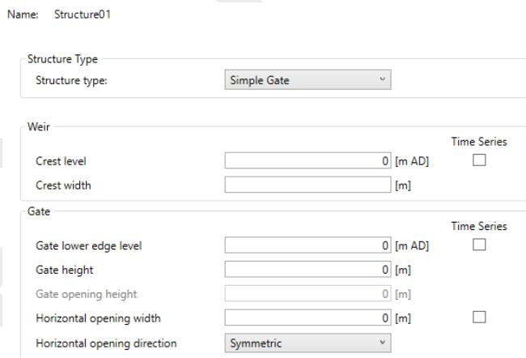

Figure 12.7: Input for a gate

The structure of the input file for the gates is as follows:

```
type                                        = gate
id                                           = gate01
locationFile                                 = gate01.pli
crestLevel                                  = 7
gateLowerEdgeLevel                          = 15
gateOpeningWidth                             = gate01_opening_width.bc
gateHeight                                    = 5
gateOpeningHorizontalDirection= symmetric
crestWidth                                 =
```

## 12.6 Long Culvert

### 12.6.1 Long culvert

#### Remark:

- ◇ Long culvert functionality is still undergoing validation and is of TRL level 4-6 (prototype), with the definitions of the Technical Technology Readiness Levels (TRL) in Section 2.7.

The long culvert is an underground pipe structure that normally connects two open waters modeled as 2D grid cells. The difference with the normal culvert is that the long culvert is modelled as pipe with a certain length, instead of being modelled as a subgrid culvert, with only energy losses at the snapped flow link of the culvert. The long culvert stores actual volume, and can optionally have multiple pressure points (which allows for a 'siphon-like' geometry with varying bed levels). A culvert can only be placed on an existing 1D pipe, while for a long culvert the pipe is generated by the kernel based on the input.

The flow through a long culvert is affected by its upstream and downstream invert levels (first and last  $z$ -coordinate, respectively), its total length, the size of its closed rectangular cross section, its friction loss, and its valve loss. The input file format for a long culvert is described in Section C.13.3.

### Long culvert positioning

Figure 12.8 shows a side view of a long culvert. In the most simple case there will only be two points  $z_1$  and  $z_2$ .

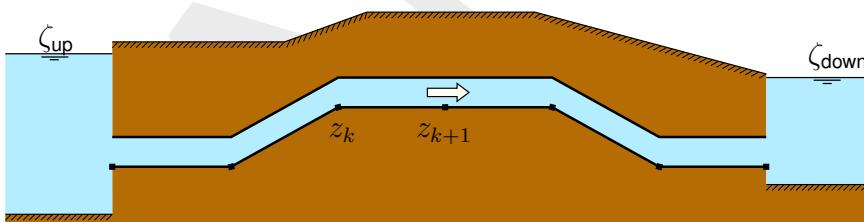

Figure 12.8: Side view of a long culvert

Figure 12.9 shows the discretization of long culverts in a top view. When the long culvert input polyline has more than two points, internal 1D computational pressure points are automatically generated and coupled via 1D2D links to the inlet and outlet 2D grid cells.

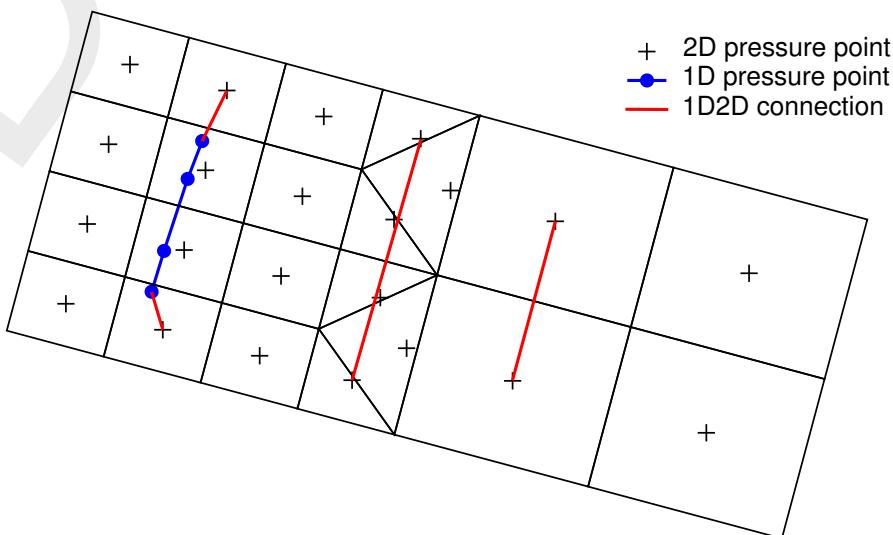

Figure 12.9: Discretization of three long culverts via 1D and 1D2D links.

The 1D2D links are of the vertically stacked type (see ??), such that pipe flow can go underneath the 2D grid cells. As a result, the flow link bed levels at the inlet and outlet side are fully determined by the long culvert's  $z$ -values (cf. ??).

### Long culvert geometry

The 1D representation of long culverts results in regular 1D pipe flow, with a rectangular cross section with the user-defined dimensions (cf. ??).

### Long culvert losses

The friction losses for long culverts are identical to the friction losses in regular 1D pipe flow (cf. ??). The valve losses are approximated by the user-defined relative valve opening, which is a dimensionless number between 0 and 1. The real discharge through the long culvert is reduced by a linear scaling of the maximum pipe cross sectional area:

$$A_{u_j, \text{culv}} := \theta_{\text{area, culv}} A_{u_j, \text{culv}}, \quad (12.44)$$

where  $j$ , culv is the first flow link at the inlet side of the long culvert and  $\theta_{\text{area, culv}}$  is the relative flow area at the valve.

### Long culverts in parallel

During initialization, the kernel generates the long culvert 1D and 1D2D links on-the-fly based on the input files. However this same approach is not feasible for parallel models, as the result of the partitioning process must be preserved for these links. For this reason, as part of the partitioning process these new links are properly partitioned and subsequently written to the partitioned netfiles, complete with branch and crosssection information.

## 12.7 Bridges in 1D

This section contains a description of bridges in 1D. For modelling of bridge pillars in 2D we refer to section 7.4.2.11

The bridge structure is a structure that can be used to model the flow underneath a bridge (and across). The bridge's geometry is defined by either or both of:

- ◇ An abutment definition (as a cross section definition), which determines its wetted flow area and hydraulic radius. The flow area of the bridge should be smaller than the surrounding flow area of the channel.
- ◇ A pillars definition.

A bridge definition has to consist of at least one geometry definition, so at least an abutment definition or pillars definition has to be given in the input.

Figure 12.10 shows an example bridge where flow area is restricted by abutments, the bridge deck and two bridge pillars.

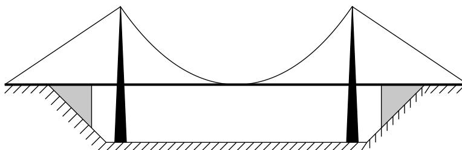

Figure 12.10: A suspension bridge

A limitation of the bridge structure is, that no free flow over the bridge can be computed. If free flow occurs over the bridge, it is advised to use a weir instead.

The general description of the discharge through a bridge is given by:

$$Q = \mu A_f \sqrt{2g(\zeta_1 - \zeta_2)} \quad (12.45)$$

Where

| $Q$       | Discharge through bridge [ $\text{m}^3/\text{s}$ ]                              |
|-----------|---------------------------------------------------------------------------------|
| $\mu$     | Discharge coefficient derived from loss-coefficients [-] (see Equation (12.46)) |
| $A_f$     | Wetted area [ $\text{m}^2$ ] of flow through bridge at upstream side            |
| $g$       | Acceleration due to gravity [ $\text{m/s}^2$ ] ( $\approx 9.81$ )               |
| $\zeta_1$ | Upstream water level [m]                                                        |
| $\zeta_2$ | Downstream water level [m]                                                      |

For the bridge the discharge coefficient is defined as:

$$\mu = \max \left( 1, \frac{1}{\sqrt{\xi_i + \xi_f + \xi_o + \xi_y}} \right) \quad (12.46)$$

Where

| $\xi_i$ | Entrance loss coefficient. |
|---------|----------------------------|
| $\xi_f$ | Friction loss coefficient. |
| $\xi_o$ | Exit loss coefficient.     |
| $\xi_y$ | Pillar loss coefficient.   |

**Remark:**

- ◇ For numerical reasons (e.g. validity of structure Equation (12.45)) the discharge coefficient ( $\mu$ ) is limited to a maximum of 1.0. In other words, if  $\mu$ , according to Equation (12.46) becomes larger than 1.0, the actual applied discharge coefficient in Equation (12.45) is capped at 1.0. This means that for a given discharge, the water level difference over such bridge might be larger than anticipated, when considering the defined friction loss coefficients.

**Abutment bridge**

By defining an abutment bridge, the coefficients  $\xi_i$ ,  $\xi_f$  and  $\xi_o$  in Equation (12.46) get a non-zero value. Also the flow area through the bridge is affected by the additional cross section definition.

When desired, the bridge deck can affect the flow through the bridge, for example by having the cross section closed. A limitation however, is that flow over the bridge deck cannot be taken into account.

The  $\xi_i$  loss coefficient is an input parameter

The  $\xi_o$  coefficient is defined as:

$$\xi_o = k \left( 1 - \frac{A_f}{A_{f_2}} \right)^2, \quad (12.47)$$

| $k$       | Constant exit loss coefficient                                                               |
|-----------|----------------------------------------------------------------------------------------------|
| $A_f$     | Wetted area [ $m^2$ ] of flow through bridge at upstream side, including the bridge pillars. |
| $A_{f_2}$ | Wetted area [ $m^2$ ] of flow in branch at downstream side of bridge                         |

The  $\xi_f$  coefficient is defined as:

$$\xi_f = \frac{2gL}{C^2R}, \quad (12.48)$$

where

| $g$ | Acceleration due to gravity [ $m/s^2$ ] ( $\approx 9.81$ ) |
|-----|------------------------------------------------------------|
| $L$ | Length of bridge [m]                                       |
| $C$ | Chézy coefficient [ $m^{1/2}/s$ ]                          |
| $R$ | Hydraulic radius [m]                                       |

During the simulation a check and possibly correction on the vertical position of the bridge can be performed, see MDU option ChangeStructureDimensions:

- ❖ If the bed level of the bridge is below the bed level of the surrounding water level points in the channel, the bedlevel of the bridge is raised to the highest bed level of the two water level points (also see footnote 1).
- ❖ In case the bed level is raised, the complete cross section is also raised.

### Pillars

A bridge can have one or more pillars that affect the discharge through the bridge. By defining pillars, the coefficient  $\xi_y$  in Equation (12.46) get a non-zero value:

$$\xi_y = \beta \frac{\alpha_y}{A_f}, \quad (12.49)$$

where

| $\beta$    | Parameter [—] depending on shape of pillar [s] (shape factor). Normally between 0.22 and 1.56                |
|------------|--------------------------------------------------------------------------------------------------------------|
| $A_f$      | Wetted area [ $m^2$ ] of flow through bridge at upstream side                                                |
| $\alpha_y$ | Area [ $m^2$ ] of wetted part of pillar [s] perpendicular to the flow direction, considered at upstream side |

## 12.8 Universal weir

The universal weir structure is a construction generating energy losses due to constriction of the flow. The geometrical shape of the universal weir's crest can be defined as a Y-Z profile (see Figure 12.11).

It is assumed that the discharge across a universal weir is the summation of the discharges across each individual weir section. A weir section is the space between to subsequent support point of the Y-Z profile.

The crest level profile of a universal weir is divided into:

- ❖ *rectangular weir sections*, having a horizontal bed and
- ❖ *triangular weir sections*, having a sloping bed.

Rectangular weir sections are considered as a broad-crested weir. Triangular weir sections are considered as (the half of) a broad-crested weir with truncated triangular control section (Bos, 1989).

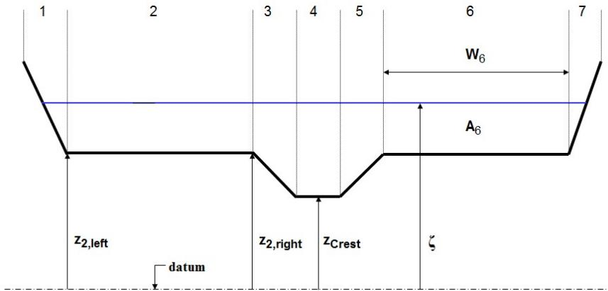

**Figure 12.11:** Crest level (Y-Z) profile of a Universal weir, divided into three rectangular weir sections (2, 4 and 6) and four triangular weir sections (1, 3, 5 and 7)

Parameters depicted in Figure 12.11 are:

| $A_i$         | Flow area of section $i$ [ $m^2$ ]                                                                                            |
|---------------|-------------------------------------------------------------------------------------------------------------------------------|
| $W_i$         | Width of weir section $i$ [ $m$ ]                                                                                             |
| $z_{i,left}$  | Elevation at the left side of weir section $i$ [ $mAD$ ]                                                                      |
| $z_{i,right}$ | Elevation at the right side of weir section $i$ [ $mAD$ ]                                                                     |
| $z_{Crest}$   | Crest level of the Universal weir (output parameter only), equal to the lowest elevation of its crest level profile [ $mAD$ ] |
| $\zeta$       | Water level [ $mAD$ ]                                                                                                         |

**Following equations yield for a universal weir:**

$$Q = \sum_i^N (u_i A_i) = \sum_i^N Q_i \quad (12.50)$$

$$A = \sum_i^N A_i \quad (12.51)$$

$$U_{structure} = Q/A \quad (12.52)$$

where:

| $A$             | Flow area of the universal weir [ $m^2$ ]               |
|-----------------|---------------------------------------------------------|
| $A_i$           | Flow area of weir section $i$ [ $m^2$ ]                 |
| $N$             | Number of weir sections $i$ [—]                         |
| $Q$             | Discharge over the universal weir [ $m^3/s$ ]           |
| $Q_i$           | Discharge over weir section $i$ [ $m^3/s$ ]             |
| $u_i$           | Flow velocity in weir section $i$ [ $m/s$ ]             |
| $U_{structure}$ | Average flow velocity over the universal weir [ $m/s$ ] |

**Following equations yield for a rectangular weir section  $i$ :**

$$z_{i,crest} = \min(z_{i,left}, z_{i,right}) \quad (12.53)$$

$$ml_{\text{rectangular},i} = 2/3 \quad (12.54)$$

◇ Free rectangular weir flow if  $\left( \frac{\zeta_2 - z_{i,\text{crest}}}{\zeta_1 - z_{i,\text{crest}}} \right) \leq ml_{\text{rectangular},i}$ 

$$u_i = c_e \sqrt{\frac{2}{3}} g \sqrt{\zeta_1 - z_{i,\text{crest}}} \quad (12.55)$$

$$A_i = \frac{2}{3} W_i (\zeta_1 - z_{i,\text{crest}}) \quad (12.56)$$

$$Q_i = u_i A_i = c_e \frac{2}{3} \sqrt{\frac{2}{3}} g W_i (\zeta_1 - z_{i,\text{crest}})^{3/2} \quad (12.57)$$

◇ Submerged rectangular weir flow if  $\left( \frac{\zeta_2 - z_{i,\text{crest}}}{\zeta_1 - z_{i,\text{crest}}} \right) > ml_{\text{rectangular},i}$ 

$$u_i = c_e \sqrt{2g(\zeta_1 - \zeta_2)} \quad (12.58)$$

$$A_i = W_i (\zeta_2 - z_{i,\text{crest}}) \quad (12.59)$$

$$Q_i = u_i A_i = c_e W_i (\zeta_2 - z_{i,\text{crest}}) \sqrt{2g(\zeta_1 - \zeta_2)} \quad (12.60)$$

**Following equations yield for a triangular weir section  $i$ :**

$$z_{i,\text{crest}} = \min(z_{i,\text{left}}, z_{i,\text{right}}) \quad (12.61)$$

$$dz_i = |z_{i,\text{left}} - z_{i,\text{right}}| \quad (12.62)$$

$$ml_{\text{triangular},i} = \begin{cases} \frac{4}{5} & \text{if } (\zeta_1 - z_{i,\text{crest}}) \leq 1.25 dz_i \\ \frac{2}{3} + \frac{1}{6} \frac{dz_i}{(\zeta_1 - z_{i,\text{crest}})} & \text{if } (\zeta_1 - z_{i,\text{crest}}) > 1.25 dz_i \end{cases} \quad (12.63)$$

◇ Free triangular weir flow if  $\left( \frac{\zeta_2 - z_{i,\text{crest}}}{\zeta_1 - z_{i,\text{crest}}} \right) \leq ml_{\text{triangular},i}$ 

$$u_i = c_e \sqrt{2g(1 - ml_{\text{triangular},i})(\zeta_1 - z_{i,\text{crest}})} \quad (12.64)$$

$$A_i = \begin{cases} W_i \left( \frac{(ml_{\text{triangular},i} (\zeta_1 - z_{i,\text{crest}}))^2}{2 dz_i} \right) & \text{if } \frac{\zeta_1 - z_{i,\text{crest}}}{1/ml_{\text{triangular},i}} \leq dz_i \\ W_i \left( \frac{\zeta_1 - z_{i,\text{crest}}}{1/ml_{\text{triangular},i}} - \frac{dz_i}{2} \right) & \text{if } \frac{\zeta_1 - z_{i,\text{crest}}}{1/ml_{\text{triangular},i}} > dz_i \end{cases} \quad (12.65)$$

$$Q_i = u_i A_i \quad (12.66)$$

◇ Submerged triangular weir flow if  $\left( \frac{\zeta_2 - z_{i,\text{crest}}}{\zeta_1 - z_{i,\text{crest}}} \right) > ml_{\text{triangular},i}$ 

$$u_i = c_e \sqrt{2g(\zeta_1 - \zeta_2)} \quad (12.67)$$

$$A_i = \begin{cases} W_i \left( \frac{(\zeta_2 - z_{i,\text{crest}})^2}{2 dz_i} \right) & \text{if } \zeta_2 - z_{i,\text{crest}} \leq dz_i \\ W_i (\zeta_2 - z_{i,\text{crest}} - \frac{dz_i}{2}) & \text{if } \zeta_2 - z_{i,\text{crest}} > dz_i \end{cases} \quad (12.68)$$

$$Q_i = u_i A_i \quad (12.69)$$

where:

| $A_i$               | Flow area of weir section $i$ [ $m^2$ ]                                                                                               |
|---------------------|---------------------------------------------------------------------------------------------------------------------------------------|
| $c_e$               | Discharge coefficient, applicable to all rectangular weir sections as well as to all triangular weir sections of a universal weir [—] |
| $dz_i$              | Vertical distance between the elevation at the left side and the right side of a triangular weir section $i$ [ $m$ ]                  |
| $g$                 | Acceleration due to gravity [ $m/s^2$ ] ( $\approx 9.81$ )                                                                            |
| $m_{rectangular,i}$ | Water-level-based modular limit of a rectangular weir section $i$ . Its value is always equal to $2/3$ [—]                            |
| $m_{triangular,i}$  | Water-level-based modular limit of a triangular weir section $i$ . Its value depends on the actual water depth. [—]                   |
| $Q_i$               | Discharge over weir section $i$ [ $m^3/s$ ]                                                                                           |
| $u_i$               | Velocity in weir section $i$ [ $m/s$ ]                                                                                                |
| $W_i$               | Width of weir section $i$ [ $m$ ]                                                                                                     |
| $z_{i,crest}$       | Crest level of weir section $i$ [ $mAD$ ]                                                                                             |
| $z_{i,left}$        | Elevation at the left side of weir section $i$ [ $mAD$ ]                                                                              |
| $z_{i,right}$       | Elevation at the right side of weir section $i$ [ $mAD$ ]                                                                             |
| $\zeta_1$           | Water level at the upstream side of the universal weir [ $mAD$ ]                                                                      |
| $\zeta_2$           | Water level at the downstream side of the universal weir [ $mAD$ ]                                                                    |

During the simulation a check and possibly correction on the crest level of the universal weir is performed.

- ◇ If the bed level of the bridge is below the bed level of the surrounding water level points in the channel, the bed level of the bridge is raised to the highest bed level of the two water level points (also see footnote 1).
- ◇ In case the bed level is raised, the complete weir profile is also raised.

## 12.9 Pump

The pump structure forces the flow of water in one direction at a certain discharge. This discharge is essentially a predescribed value for the pump, depending on the type of pump. A pump can either be a staged pump or a non staged pump. The input file format for a pump is described in section C.13.5.

A **staged pump** contains control rules to switch on or off the pump and to set the actual capacity depending on the water levels at both sides of the pump.

A **non-staged pump** has its capacity prescribed directly. The capacity can be defined as a constant value, a time series or controlled by RTC.

Both types of pumps can optionally have a **reduction factor** table defined. When a pump pumps against a bigger head difference, its effective discharge may be lower than the maximum capacity.

## 12.9.1 Notation

The used variable in this section are described below.

| $\zeta_{ss}^n$ | Water level at the suction side of the pump at the current time level.  |
|----------------|-------------------------------------------------------------------------|
| $\zeta_{ds}^n$ | Water level at the delivery side of the pump at the current time level. |
| $h_{ss}^n$     | Water depth at the suction side of the pump at the current time level.  |
| $V_{ss}^n$     | Water volume at the suction side of the pump at the current time level. |

**12.9.2 Orientation**

Water is always pumped from the suction side to the delivery side. The orientation of the pump in the model is defined by either the branch orientation (1D) or the direction of the polyline (2D, see Appendix C.13). It may be convenient to orientate the pump opposite to the branch orientation of the channel. This is controlled by the input parameter orientation. positive means the suction side is at the (geometrical) upstream side of the pump and negative means that the suction side is at the (geometrical) downstream side of the pump.

**12.9.3 Staged pump**

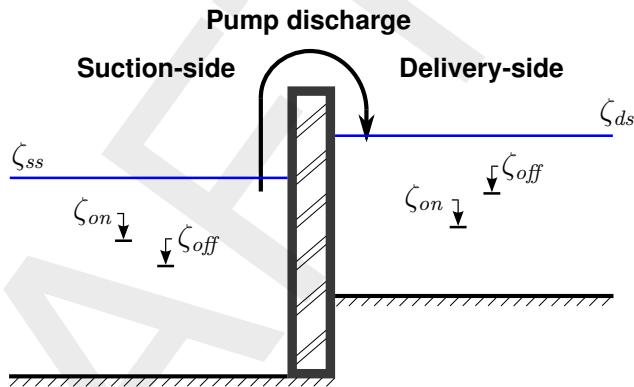

**Figure 12.12: Pump station**

**Pump stages**

A pump station may consist of multiple pump stages. Each stage can have a different pump capacity and switch on and switch off level. At each point in time, the pump can be in one pump stage only. The highest stage that is turned on, will be the actual stage, regardless of the state of the lower stages.

The pump can be controlled at either the **suction side** only, the **delivery side** only or on **both sides**.

The state of pump stage<sub>i</sub> is determined by:

**◇ suction side:**

- □ if no suction side control **then**  $s_{ss,i}^{n+1} = \text{True}$
- □ **else if**  $\zeta_{ss}^n > \zeta_{ss,on,i}$  **then**  $s_{ss,i}^{n+1} = \text{True}$
- □ **else if**  $\zeta_{ss}^n < \zeta_{ss,off,i}$  **then**  $s_{ss,i}^{n+1} = \text{False}$
- □ **else**  $s_{ss,i}^{n+1} = s_{ss,i}^n$

**◇ delivery side:**

- □ if no delivery side control **then**  $s_{ds,i}^{n+1} = \text{True}$
- □ if  $\zeta_{ds}^n < \zeta_{ds,on,i}$  **then**  $s_{ds,i}^{n+1} = \text{True}$
- □ **else if**  $\zeta_{ds}^n > \zeta_{ds,off,i}$  **then**  $s_{ds,i}^{n+1} = \text{False}$
- □ **else**  $s_{ds,i}^{n+1} = s_{ds,i}^n$

**◇ if**  $s_{ss,i}^{n+1} = \text{True}$  **and**  $s_{ds,i}^{n+1} = \text{True}$  **then** pump stage<sub>i</sub> is on

| $s_{ss,i}^{n+1}$   | Denotes whether the suction side control for the next time step is on ( <i>True</i> ) or off ( <i>False</i> ).  |
|--------------------|-----------------------------------------------------------------------------------------------------------------|
| $s_{ds,i}^{n+1}$   | Denotes whether the delivery side control for the next time step is on ( <i>True</i> ) or off ( <i>False</i> ). |
| $\zeta_{ss,on,i}$  | Start level at suction side for stage $i$ .                                                                     |
| $\zeta_{ss,off,i}$ | Stop level at suction side for stage $i$ .                                                                      |
| $\zeta_{ds,on,i}$  | Start level at delivery side for stage $i$ .                                                                    |
| $\zeta_{ds,off,i}$ | Stop level at delivery side for stage $i$ .                                                                     |

Subsequently, the actual pump stage will be set to the stage with the highest sequence number that is turned on.

#### 12.9.4 Non-staged pump

A non staged pump has either a constant capacity, a time series for the capacity or can be controlled by an external process, such as real time control.

#### 12.9.5 Capacity reduction table

A capacity reduction table can be defined both for the staged and non-staged pump. The capacity reduction table contains capacity reduction factors as a function of the pump head (i.e.,  $\zeta_{ds} - \zeta_{ss}$ ). The pump heads (key 'head' in input) in a capacity reduction table should be in increasing order. Capacity reduction factors (key reductionFactor in input) should be equal or larger than 0 and equal or less than 1. The actual pump discharge equals the current pump capacity multiplied by the capacity reduction factor. When no capacity reduction table is defined, in effect a capacity reduction factor equal to 1 is applied.

Please note that the pump head at  $t = t^n$  is used to determine the capacity reduction factor to be applied in the time-step from  $t = t^n$  to  $t = t^{n+1}$ .

#### 12.9.6 Distribution and relaxation of pump discharge

A single pump in a 2D model may span multiple flow links, in which case the pump discharge is distributed evenly over the included flow links. Flow links are included when the water depth at the suction side is above a certain threshold:  $h_{ss}^n > 0.01$ . A single, representative water level at the suction side is then determined by averaging the separate water levels at the suction side of the pump over the included flow links. The delivery side water level is determined similarly. These two values are used for staged pumps or, optionally, for a capacity reduction table.

The actual pump discharge may be limited (relaxed) even further when total potential pump volume is above the total available volume of water at the suction side. In other words, it can happen that the actual discharge through the pump is limited below capacity by water volume on suction side because the suction side has not enough volume of water to be sucked.

The actual discharge is computed by:

$$q_{pump}^n = \min(q_{pump}, 0.9 \cdot \sum_{\text{open pump links}} V_{ss}^n / \Delta t^n). \quad (12.70)$$

The pump capacity is then equally distributed over the open pump links.

## 12.10 Compound structure

A compound structure consists of several structures (structure elements) parallel to each other at the same location. See Table C.23 for a list of possible structure types. The only exception is that compound structures cannot be nested. Each structure element in a compound is treated independently. The discharge through each structure element is then summed up to the total discharge for the compound structure.

The user should keep in mind that geometric checks on structure parameters are performed for each structure element independently. For example the total structure width might be larger than the actual width of the channel, even though the widths of the underlying structures have been checked. As a result the user must be extra careful to check for inconsistencies in the input.

## 12.11 Thin dams

Thin dams are similar to fixed weirs. The only difference between the thin dams and fixed weirs are in their crest levels. Thin dams, in principle, include infinitely high crest levels and hence, they do not allow water flux. Similar to the other structures, the thin dams can be selected from the toolbar and drawn by a polygon. D-Flow FM adjusts the polygon to the nearest velocity points. The input data for a thin dam is identical to those for fixed-weir, except for the crest level.

## 12.12 Floating structures (via ice modelling)

A floating structure isn't available in D-Flow FM, like a floating structure in Delft3D-FLOW. However, in D-Flow FM an adequate alternative is available, namely via prescribing an ice thickness. An ice block in D-Flow FM has a similar effect as a floating structure in Delft3D-FLOW. It pushes down the water level at the location of the ice block or the floating structure due to its pressure. For an example how to apply this in a D-Flow FM model, see the example and the description in section 16.8.1 ("Ice modelling via External"). In this way, a floating structure in a D-Flow FM model can be mimicked.

## 13 Bedforms and vegetation

The ground surface, vegetation and unresolved buildings and other flow-obstructing objects exert shear stresses on the passing flow. The total flow resistance is commonly characterised by means of a bulk bed roughness coefficient of type Chézy, Manning or White-Colebrook as discussed in section 3.3.6. However, such an approach overestimates the bed shear stresses in the presence of vegetation, and other processes that depend on that quantity, such as sediment transport, will give incorrect results. Furthermore, lumping all flow resistance into bed roughness will result in incorrect velocity and turbulence profiles in 3D models. It's better to distinguish between the roughness of the bed surface itself and flow resistance higher up in the water column. This chapter describes different features of D-Flow FM to represent vegetation and an alluvial bed.

Within the main stream flow the shear stresses are largely determined by the local conditions of the alluvial bed (bed composition and bedform characteristics). For this type of conditions, bedform roughness predictors have been implemented (see section 13.1).

In floodplains of rivers and in the intertidal areas of estuaries, the flow resistance is determined by the combination of the roughness of the ground surface and vegetation causing flow blockage higher up in the water column and turbulence production. D-Flow FM includes a number of methods to represent vegetation (see section 13.2). Some of the vegetation features may also be used to represent other objects causing flow resistance, such as unresolved buildings, fences, street furniture, vehicles, etc.

Flow resistance may be represented in a 2D numerical model by means of the trachytope approach (see section 13.3) and in a 3D model by a combination of bed friction and a detailed representation of the vegetation over the water depth (see section 13.2.2).

### 13.1 Bedform heights

There are various types of bedforms; each type influences the hydro- and morphodynamics in its own way. Following Van Rijn (2007) we distinguish between roughness heights for ripples, mega-ripples and dunes. D-Flow FM contains a module to determine the dune, mega-ripple, and ripple roughness heights according Van Rijn (2007) as described in section 13.1.1. D-Flow FM also implements a number of predictors for dune characteristics (height and length) which may be used to determine the effective dune roughness height; see section 13.1.2. Those dune characteristics may also be used in dredging operations and active layer thickness (see Deltares (2026c)).

#### 13.1.1 Van Rijn (2007) bedform roughness height predictor

As proposed by Eq. (5a)–(5d) in Van Rijn (2007) the roughness height predictor for ripples is given by

$$k_{s,r} = \alpha_r \begin{cases} 20D_{\text{silt}} & \text{if } D_{50} < D_{\text{silt}} \\ k_{s,r}^* & \text{otherwise} \end{cases} \quad (13.1)$$

where  $\alpha_r$  is a calibration factor,  $D_{\text{silt}} = 32 \mu\text{m}$  and  $k_{s,r}^*$  is given by

$$k_{s,r}^* = \begin{cases} 150f_{cs}D_{50} & \text{if } \psi \leq 50 \\ (182.5 - 0.65\psi)f_{cs}D_{50} & \text{if } 50 < \psi \leq 250 \\ 20f_{cs}D_{50} & \text{if } \psi > 250 \end{cases} \quad (13.2)$$

in which  $\psi$  is the current-wave mobility parameter defined as  $U_{wc}^2/[(s-1)gD_{50}]$  using  $U_{wc}^2 = U_w^2 + u_c^2$  and relative density  $s = \rho_s/\rho_w$ , peak orbital velocity near bed  $U_w =$ 

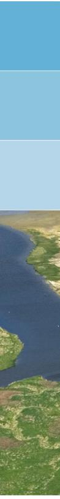

 $\pi H_s/[T_r \sinh(2kh)]$ , depth-averaged current velocity  $u_c$ , significant wave height  $H_s$ , wave number  $k = 2\pi/L$ , wave length  $L$  derived from  $(L/T_p \pm u_c)^2 = gL \tanh(2\pi h/L)/(2\pi)$ , relative wave period  $T_r$ , peak wave period  $T_p$ , water depth  $H$  and factor  $f_{cs} = (0.25D_{\text{gravel}}/D_{50})^{1.5}$  in which  $D_{\text{gravel}} = 0.002$  m. The value of  $k_{s,r}$  is limited to values ranging from  $D_{90}$  to 2% of the water depth.

Following Eq. (6a)–(6d) by Van Rijn (2007) the roughness height predictor for mega-ripples is given by

$$k_{s,mr} = \alpha_{mr} \begin{cases} 0 & \text{if } D_{50} < D_{\text{silt}} \\ k_{s,mr}^* & \text{otherwise} \end{cases} \quad (13.3)$$

where  $\alpha_{mr}$  is a calibration factor and  $k_{s,mr}^*$  is given by

$$k_{s,mr}^* = \begin{cases} 0.0002f_{fs}\psi H & \text{if } \psi \leq 50 \\ (0.011 - 0.00002\psi)f_{fs}H & \text{if } 50 < \psi \leq 550 \\ 0.02 & \text{if } \psi > 550 \text{ and } D_{50} \geq D_{\text{sand}} \\ 200D_{50} & \text{if } \psi > 550 \text{ and } D_{\text{silt}} \leq D_{50} < D_{\text{sand}} \end{cases} \quad (13.4)$$

in which  $f_{fs} = (D_{50}/1.5D_{\text{sand}})$  and  $D_{\text{sand}} = 0.000062$  m. The value of  $k_{s,mr}$  is limited to values smaller than 0.2 m.

Following Eq. (7a)–(7d) by Van Rijn (2007) the roughness height predictor for dunes is given by

$$k_{s,d} = \alpha_d \begin{cases} 0 & \text{if } D_{50} < D_{\text{silt}} \\ k_{s,d}^* & \text{otherwise} \end{cases} \quad (13.5)$$

where  $\alpha_d$  is a calibration factor and  $k_{s,d}^*$  is given by

$$k_{s,d}^* = \begin{cases} 0.0004f_{fs}\psi H & \text{if } \psi \leq 100 \\ (0.048 - 0.00008\psi)f_{fs}H & \text{if } 100 < \psi \leq 600 \\ 0 & \text{if } \psi > 600 \end{cases} \quad (13.6)$$

Since these formulations do not depend on the equations for the dune characteristics given in the previous section, the advection and relaxation effects represented by Equation (13.13) cannot be included these Van Rijn (2007) formulations. Therefore, a separate relaxation option has been implemented for all three bedform roughness heights according Van Rijn (2007) formulations as given by

$$\begin{aligned} k_{s,r} &= (1 - \alpha_r)k_{s,r,new} + \alpha_r k_{s,r,old} && \text{where } \alpha_r = e^{-\Delta t/T_r} \\ k_{s,mr} &= (1 - \alpha_{mr})k_{s,mr,new} + \alpha_{mr} k_{s,mr,old} && \text{where } \alpha_{mr} = e^{-\Delta t/T_{mr}} \\ k_{s,d} &= (1 - \alpha_d)k_{s,d,new} + \alpha_d k_{s,d,old} && \text{where } \alpha_d = e^{-\Delta t/T_d} \end{aligned} \quad (13.7)$$

where  $\Delta t$  is the hydrodynamic time step of bed roughness updating, and  $T_r$ ,  $T_{mr}$  and  $T_d$  are different relaxation time scales for the three bedform types. Note that if a relaxation time scale  $T_*$  becomes zero, the corresponding relaxation factor  $\alpha_*$  will be zero and the relaxation effect disappears.

**Remarks:**

- ◇ In case of a simulation with multiple sediment fractions, the  $D_{50}$  of the grain mixture in the surface layer is used.
- ◇ Non-erodible layers and partial transport effects are not taken into account to reduce the roughness height.

### 13.1.2 Dune height predictor

Four dune height predictors have been implemented: Van Rijn (1984), Fredsøe (1982) based on Meyer-Peter and Müller (1948) or Engelund and Hansen (1967), and a power relation. One of these predictors can be selected using the keyword BdfH in the [bedform] block. In case of Van Rijn (1984) the dune height  $h_d$  is computed as

$$h_d = 0.11\varepsilon H \left( \frac{D_{50}}{H} \right)^{0.3} (1 - e^{-T/2})(25 - T) \quad (13.8)$$

where  $\varepsilon$  is a calibration coefficient and  $T$  is the dimensionless bed shear parameter. Fredsøe (1982) formulated an approach to obtain a dune height predictor for a general sediment transport formula  $s = f(U, H, k)$  depending on depth-averaged flow magnitude  $U$ , water depth  $H$  and Nikuradse bed roughness  $k$  as

$$h_d = \varepsilon s H / \left( U \frac{\partial s}{\partial U} - H \frac{\partial s}{\partial H} - k \frac{\partial s}{\partial k} \right) \quad (13.9)$$

If one applies this approach to the transport formula by Meyer-Peter and Müller (1948) one obtains

$$h_d = \frac{24}{63} \varepsilon H \max \left( 1 - \frac{\theta_{cr}}{\mu \theta}, 0 \right) \quad (13.10)$$

where  $\mu$  is the efficiency factor  $(C/C_{g,90})^{1.5}$  based on a grain related bed roughness of  $3D_{90}$  and  $\theta_{cr}$  is the critical mobility parameter based on the Shields curve or given by the user. If one applies the formulation of Fredsøe (1982) to the transport formula by Engelund and Hansen (1967) one obtains

$$h_d = \frac{1}{5} \varepsilon H \quad (13.11)$$

The latter two formulations have been implemented in D-Flow FM. Finally, the power relation dune height predictor reads

$$h_d = a_H H^{b_H} \quad (13.12)$$

The dune height formulations given by equations 13.8–13.12 are approximations for the dune height under equilibrium conditions. Under time and spatially varying conditions, the dune height will need time to adjust; this effect has been implemented by means of an advection relaxation equation.

$$\frac{\partial h_d}{\partial t} + u_H \frac{\partial h_d}{\partial x} + v_H \frac{\partial h_d}{\partial y} = \frac{h_{d,eq} - h_d}{T_H} \quad (13.13)$$

By default these effects are neglected, such that  $h_d = h_{d,eq}$ . By means of the keyword BdfRlx one can select four options for computing the variables  $u_H$ ,  $v_H$  and  $T_H$ : (i) constant relaxation time scale  $T_H$ , (ii) constant relaxation distance  $L_H$ , (iii) relaxation distance proportional to dune length  $L_d$ , and (iv) relaxation distance dependent on dune length  $L_d$  and water depth  $H$ . In the first three advection cases, the direction of the bedform migration is assumed to be equal to the direction of the depth averaged velocity in all cases, i.e.

$$u_H = c_H \frac{u}{U} \quad (13.14)$$

$$v_H = c_H \frac{v}{U} \quad (13.15)$$

where  $u$  and  $v$  are the  $x$  and  $y$  components of the depth averaged velocity,  $U$  the flow velocity magnitude  $\sqrt{u^2 + v^2}$ , and  $c_H$  is the bedform celerity (magnitude) iven by a power relation derived for a generic transport formula approximation  $s = a_s U^{b_s}$  as

$$c_H = \frac{b_s s}{H} = \frac{a_s b_s U^{b_s}}{H} = \frac{a_C U^{b_C}}{H} \quad (13.16)$$

while the relaxation time scale  $T_H$  is either given, or computed from  $T_H = L_H/c_H$  where the relaxation distance  $L_H$  is either given or proportional to the dune length  $H = f_{LH} L_d$ . In the fourth advection case  $T_H$  is computed again using  $T_H = L_H/c_H$  but in that case the relaxation distance  $L_H$  is given by

$$L_H = \min \left[ \left( \frac{H_{\max}}{H} \right)^{b_{LH}}, \phi_{\max} \right] L_d \quad (13.17)$$

and the bedform celerity is given by

$$c_H = a_{cH} \max \left[ \left( \frac{H}{H_{\max}} \right)^{b_{cH}}, \gamma_{\min} \right] \frac{s_b}{H(1 - \text{Fr}^2)} \quad (13.18)$$

where  $s_b$  is the total bedload transport rate,  $\text{Fr}^2$  is the squared Froude number  $U^2/gH$  and  $H_{\max}$ ,  $b_{LH}$ ,  $\phi_{\max}$ ,  $a_{cH}$ ,  $b_{cH}$  and  $\gamma_{\min}$  are constants that can be set. In this case the bedform migration direction is assumed to be equal to the direction of the bedload transport vector  $s_b$ .

For the dune length  $L_d$  used in some of the formulations above, you can choose either one of the following two options using keyword BdfL. If you choose to compute the dune height according Van Rijn (1984) then it will be computed as

$$L_d = 7.3H \quad (13.19)$$

otherwise it will be computed using the power relation

$$L_d = a_L H^{b_L} \quad (13.20)$$

Note that only the dune height is subject to the advective and relaxation behaviour formulated in Equation (13.13); for the dune length always these equilibrium formulations are used.

Finally, you may select one of three methods for computing the bedform roughness height by means of the keyword BdfRou; these methods are based on the formulations of Van Rijn (1984), Van Rijn (2007) or a power relation. This value will only be used if you use the trachytope option for specifying bed roughness and include either one of alluvial roughness formulae 105 and 106.

$$k_{s,d} = 1.1h_d (1 - e^{-25h_d/L_d}) \quad (13.21)$$

and in case of the power relation this quantity is computed as

$$k_{s,d} = a_R h_d^{b_R} \quad (13.22)$$

The roughness height related to ripples is set in both cases equal to  $3D_{90}$ . In case of Van Rijn (2007) the roughness heights neither depend on the computed dune height nor on the dune length; in that case the equations given in the following section are used.

### 13.2 Vegetation models

D-Flow FM includes a number of methods to include vegetation resistance in 2D and 3D models; each method has its own benefits and limitations.

| method        | benefit                                                                                     | limitation                                                                             |
|---------------|---------------------------------------------------------------------------------------------|----------------------------------------------------------------------------------------|
| bed friction  | common practice; transferable across modelling systems                                      | vegetation included in bed friction: bed shear stress too large; static vegetation map |
| trachytopes   | separate terms for bed friction and vegetation drag                                         | static vegetation map                                                                  |
| dynamic       | dynamic vegetation via online coupling; separate terms for bed friction and vegetation drag | more time-consuming                                                                    |
| 3D vegetation | influence on flow and turbulence                                                            | static vegetation map                                                                  |

The first method is the common practice in a wide variety of hydraulic models: a spatially varying bed friction coefficient (see section 3.3.6). The trachytopes method is described in section 13.3. For an introduction of the dynamic vegetation option, you are referred to section 13.2.1. Finally, section 13.2.2 describes the 3D vegetation conceptual model.

#### 13.2.1 Dynamic vegetation model

D-Flow FM offers the possibility of coupling to a dynamic vegetation model via the Basic Model Interface (BMI). By doing so a fast and flexible coupling platform is created to answer questions about the design and evaluation of Nature-based solutions (NbS), thereby enabling assessments that were considered too complicated and costly before. The vegetation dynamics is implemented in an open source ecological model written in Python. The code of the model is available at <https://github.com/deltares-research/NBSDynamics/>. The following sections briefly describe the philosophy and concepts of the vegetation model. For details, the user is referred to the GitHub website indicated above.

##### 13.2.1.1 Philosophies of dynamic vegetation model

Faced with the problems of climate change and socio-economic pressure in many of the world's deltas and rivers, there is a rising interest in Nature-based solutions as a means to combine affordable and adaptive flood risk reduction with other ecosystem services. This has created a demand for tools that can quantify the development and performance of natural or nature-based systems like salt marshes, mangroves and river floodplains and the ecosystem services they provide. The NbS Dynamics modelling suite provides the tools to simulate interactions between hydrodynamics, sediment dynamics, morphodynamics and vegetation/ecology.

The ecological model can be as simple as a single habitat suitability rule, or endlessly complex involving multiple species, age classes and stressors. To facilitate the assessment of ecological processes, Delft3D Flexible Mesh has been expanded with summarizing statistics of ecologically relevant parameters (e.g. inundation time, bed shear stress). The ecological model is not restricted to vegetation only. Other biota that interact with hydrodynamics or morphology, such as mussels, algae and microfytobenthos, can also be computed with this modelling suite.

A substantial improvement over the earlier academic tools is the direct exchange of parameters through memory pointers, instead of via files. This is much faster, allows for flexible

exchange intervals (i.e. only when really needed) and allows for relatively independent development of both parts of the coupled code.

### 13.2.1.2 Conceptual description

The vegetation module in Python is coupled to a hydrodynamic D-Flow FM model. The Python environment has two functions: it contains the vegetation module and it 'orchestrates' the interaction between the hydrodynamic and the vegetation modules. 'Orchestrating' means that Python is used to define when and via which parameters the models interact. To do so, it uses the Basic Model Interface (BMI) technique (Hutton *et al.*, 2020; Peckham *et al.*, 2013). The BMI interface of D-Flow FM is described in more detail in Section 18.1.

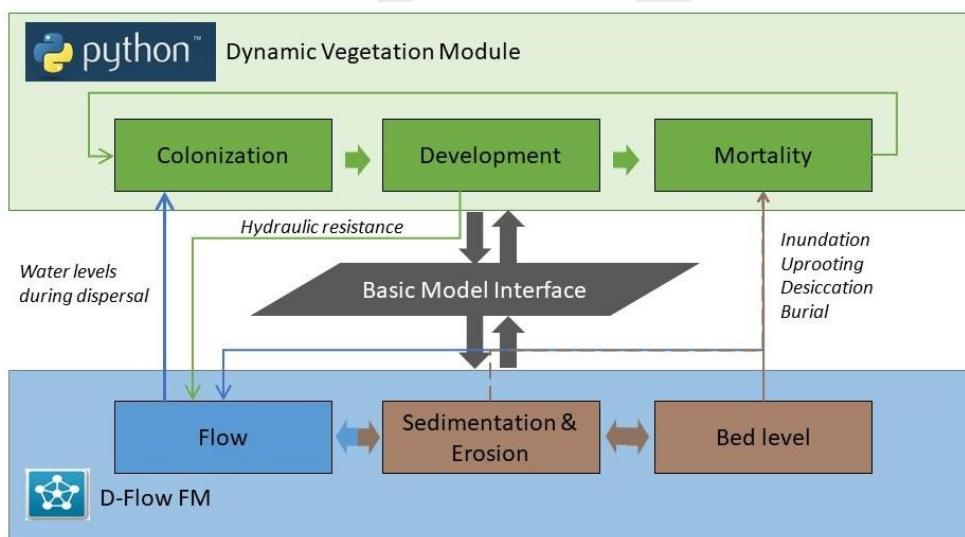

**Figure 13.1:** Conceptual schematization of the modelling environment, visualizing the Basic Model Interface connecting the D-Flow FM model for hydrodynamic and morphodynamic computation with the Python environment for vegetation and ecological modelling. Figure after Oorschot *et al.* (2016) and Brückner *et al.* (2019).

The modelling environment is illustrated by a conceptual schematization in Figure 13.1. The hydrodynamic module D-Flow FM computes for example the water level, flow velocity and bed shear stress and passes these results to the vegetation module (Python). The vegetation module then computes the vegetation biomass, expressed as a stem density, stem height and stem diameter. These vegetation parameters are used as inputs for D-Flow FM in the next time step.

### 13.2.2 (Rigid) 3D Vegetation model

In a detailed numerical model one may want to represent the vertical variations in the vegetation characteristics and study the effect of vegetation on the 3D flow and turbulence. The interaction of submerged vegetation upon hydrodynamics and physical processes has received increasing attention because of its influence on water quality in lakes and on morphological developments in salt marshes (Houwing *et al.*, 2000; WL | Delft Hydraulics, 1998). Uittenbogaard (dec. 2000) formulated theory for incorporating the effects of vegetation upon momentum and turbulence equations and implemented this in the so called '(Rigid) 3D Vegetation model', see Winterwerp and Uittenbogaard (1997), that has extensively been tested and compared to experiments (Meijer, 1998) by Oberez (2001).

The three input parameters for this vegetation model are the stem diameter, the stem height and the stem density, see Table C.40 in section C.16.4.1. The implementation of vegetation resistance can also be applied for 2DH computations.

### Theoretical background

The basic input parameters are the number of stems per unit area as function of height  $n(z)$ , and the stem diameter as function of height  $\phi(z)$ .

The influence of the vegetation upon the momentum equations is given by the vertical distribution of the friction force as caused by cylindrical elements in oblique flow:

$$F(z) = \frac{1}{2}\rho_0C_D\phi(z)n(z)|u(z)|u(z) \quad [\text{N/m}^3] \quad (13.23)$$

with  $u(z)$  the horizontal flow velocity profile and  $C_D$  the cylindrical resistance coefficient (default value 1.0).

The horizontal cross sectional plant area is given by:

$$A_p(z) = \frac{\pi}{4}\phi^2(z)n(z) \quad (13.24)$$

The influence of the vegetation upon vertical mixing is reflected in an extra source term  $T$  in the turbulent kinetic energy equation:

$$\frac{\partial k}{\partial t} = \frac{\partial}{\partial z} \left\{ \left( \nu + \frac{\nu_t}{\sigma_k} \right) \frac{\partial k}{\partial z} \right\} + T + P_k - B_k - \varepsilon \quad (13.25)$$

with  $T(z)$  the work done by the vegetation on the fluid

$$T(z) = F(z)u(z) \quad (13.26)$$

and possibly an extra source term  $T\tau^{-1}$  in the epsilon equation according to

$$\frac{\partial \varepsilon}{\partial t} = \frac{\partial}{\partial z} \left\{ \left( \nu + \frac{\nu_t}{\sigma_k} \right) \frac{\partial \varepsilon}{\partial z} \right\} + T\tau^{-1} + P_\varepsilon - B_\varepsilon - \varepsilon_\varepsilon \quad (13.27)$$

which depends on the dissipation time scale of free turbulence defined by

$$\tau_{\text{free}} = \frac{1}{c_{2\varepsilon}} \frac{k}{\varepsilon} \quad (13.28)$$

and on the dissipation time scale of eddies in between the plants defined by

$$\tau_{\text{veg}} = \frac{1}{c_{2\varepsilon}\sqrt{c_\mu}} \sqrt[3]{\frac{L^2}{T}} \quad (13.29)$$

that have a typical size limited by the smallest distance in between the stems according to

$$L(z) = C_l \sqrt{\frac{1 - A_p(z)}{n(z)}} \quad (13.30)$$

 $C_l$  is a coefficient reducing the geometrical length scale to the typical volume averaged turbulence length scale. Uittenbogaard presents a closure and finds that a  $C_l$  value of 0.07 is

applicable for grid generated turbulence. For vegetation this coefficient may be tuned, values of 0.8 are found applicable, see [Uittenbogaard \(dec. 2000\)](#).

If  $\tau_{\text{free}}$  is larger than  $\tau_{\text{veg}}$ , then  $\tau$  in the epsilon equation (Equation 13.27) is set to  $\tau_{\text{veg}}$ . Otherwise,  $\tau^{-1}$  in Equation 13.27 is set to zero, yielding that only the turbulent kinetic energy equation (Equation 13.25) contains a contribution for rigid (3D) vegetation.


**Note:** D-Flow FM and Delft3D-FLOW apply different rigid (3D) vegetation models, so that the model results of both software suites for (rigid) 3D vegetation can differ.

### 13.3 Trachytopes

This functionality allows you to specify the bed roughness and flow resistance on a sub-grid level by defining and using various land use or roughness/resistance classes, further referred to as trachytopes after the Greek word  $\tau\rho\alpha\chi\psi\tau\eta\varsigma$  for roughness. The input parameters and files to use the trachytopes functionality are described in [Appendix C.8](#).

At every time step (or less frequent as requested by the user) the trachytopes are converted into a representative bed roughness  $C$ ,  $k$  or  $n$  and optional linear flow resistance coefficient  $\lambda$  per velocity point with index  $j$ .

$$M = -\frac{1}{2}\lambda_j u_j |\mathbf{u}_j| \quad (13.31)$$

To save computational time the user may choose to update the computed bed roughness and resistance coefficients less frequently than every time step. See [Appendix C.8](#) for a description of the keywords and input files associated with this feature.

The following two sections describe the various classes of trachytopes distinguished and the way in which they are combined, respectively.

#### 13.3.1 Trachytope classes

Three base classes of trachytopes are distinguished: area classes, line classes and point classes. The area classes (type range 51–200) basically cover the whole area, therefore, they are generally the dominant roughness factor. The line classes (type range 201–250) may be used to represent hedges and similar flow resistance elements; it will add anisotropy to the roughness field. The point class (type range 251–300) represents a set of point flow resistance elements. The next six sections provide an overview of the various trachytope formulae implemented.

**Special classes (1–50)**In addition to the three base classes two special trachytope classes have been defined: a flood protected area and a composite trachytope class. The first class represents a sub-grid area that is protected from flooding and thus does not contribute to the bed roughness; however, the effect on the flow resistance should be taken into account. The second class can be used to make derived trachytope classes that are a combination of two other trachytopes: an area fraction  $\alpha$  of trachytope type  $T_1$  and an area fraction  $\beta$  (often equal to  $1 - \alpha$ ) of trachytope type  $T_2$ .

| FormNr                 | Name                 | Formula                                                                                              |
|------------------------|----------------------|------------------------------------------------------------------------------------------------------|
| Special classes (1–50) |                      |                                                                                                      |
| 1                      | flood protected area | area fraction shows up as $f_b$ in Eqs. 13.83 and 13.86                                              |
| 2                      | composite trachytope | fraction $\alpha$ of type $T_1$ and fraction $\beta$ (generally $\beta = 1 - \alpha$ ) of type $T_2$ |

**Area trachytope classes (51–200)**The class of area trachytopes is subdivided into three types: simple (51–100), alluvial (101–150) and vegetation (151–200). Four simple area trachytopes have been implemented representing the four standard roughness types of flow module.

| FormNr | Name                  | Formula             |
|--------|-----------------------|---------------------|
| 51     | White-Colebrook value | $k$                 |
| 52     | Chézy value           | $C$                 |
| 53     | Manning value         | $C = \sqrt[6]{h}/n$ |
| 54     | $z_0$ value           | $k = 30z_0$         |

Six alluvial trachytopes have been implemented.

| FormNr | Name                | Formula                  |
|--------|---------------------|--------------------------|
| 101    | simplified Van Rijn | Equation (13.32)         |
| 102    | power relation      | Equation (13.33)         |
| 103    | Van Rijn (1984)     | Equations 13.34 to 13.42 |
| 104    | Struiksma           | Equations 13.43 to 13.46 |
| 105    | bedforms quadratic  | Equation (13.47)         |
| 106    | bedforms linear     | Equation (13.48)         |

The first alluvial roughness formula is a simplified version of the Van Rijn (1984) alluvial roughness predictor

$$k = Ah^{0.7} \left[ 1 - e^{-Bh^{-0.3}} \right] \quad (13.32)$$

it is obtained from Equation (13.34) by noting that  $h_b \propto h^{0.7}$  and  $L_b \propto h$  and ignoring the grain related roughness. The parameters  $A$  and  $B$  can be calibrated by the user. The second formula implemented is a straightforward general power law

$$C = Ah^B \quad (13.33)$$

where  $A$  and  $B$  are calibration coefficients. The Van Rijn (1984) alluvial roughness predictor reads

$$k = k_{90} + 1.1h_b (1 - e^{-25h_b/L_b}) \quad (13.34)$$

where the bedform height  $h_b$  and length  $L_b$  are given by

$$h_b = 0.11h \left( \frac{D_{50}}{h} \right)^{0.3} (1 - e^{-T/2}) (25 - T) \quad (13.35)$$

$$L_b = 7.3h \quad (13.36)$$

where  $h$  is the local water depth and the transport stage parameter  $T$  is given by

$$T = \frac{u'^2 - u_{*,cr}^2}{u_{*,cr}^2} \quad (13.37)$$

where  $u'_*$  is the bed shear velocity given by

$$u'^2_* = gu^2/C_{g,90}^2 \quad (13.38)$$

where

$$C_{g,90} = 18^{10} \log(12h/k_{90}) \text{ and } k_{90} = 3D_{90} \quad (13.39)$$

and  $u_{*,cr}$  is the critical bed shear velocity according Shields given by

$$u_{*,cr}^2 = g\Delta D_{50}\theta_c \quad (13.40)$$

given

$$\theta_c = \begin{cases} 0.24/D_* & \text{if } D_* \leq 4 \\ 0.14D_*^{-0.64} & \text{if } 4 < D_* \leq 10 \\ 0.04D_*^{-0.10} & \text{if } 10 < D_* \leq 20 \\ 0.013D_*^{0.29} & \text{if } 20 < D_* \leq 150 \\ 0.055 & \text{if } 150 < D_* \end{cases} \quad (13.41)$$

where

$$D_* = D_{50} \left( \frac{g\Delta}{\nu^2} \right)^{1/3} \quad (13.42)$$

This predictor does not contain any calibration coefficients but requires  $D_{50}$  and  $D_{90}$  data from the morphology module. It does not include the advective and relaxation behaviour that is available by explicitly simulating the dune height as described in section 13.1 combined with trachytope number 106.

The second alluvial roughness predictor proposed by (Struiksma, pers. comm.) allows for a lot of adjustments, it reads

$$\frac{1}{C^2} = (1 - \xi) \frac{1}{C_{90}^2} + \xi \frac{1}{C_{min}^2} \quad (13.43)$$

where

$$C_{90} = A_1 \cdot 10^{\log(A_2 h / D_{90})} \quad (13.44)$$

and

$$\xi = \frac{\max(0, \theta_g - \theta_c)}{\theta_m - \theta_c} \frac{\theta_m^2 - \theta_c \theta_g}{(\theta_m - \theta_c) \theta_g} \quad (13.45)$$

which varies from 0 at  $\theta_g \leq \theta_c$  to 1 at  $\theta_g = \theta_m$  where

$$\theta_g = \frac{u^2}{C_{90}^2 \Delta D_{50}} \quad (13.46)$$

and  $A_1, A_2, \theta_c, \theta_m, C_{\min}$  are coefficients that the user needs to specify. This formula requires also  $D_{50}$  and  $D_{90}$  data from the morphology module. The fifth formula is based on Van Rijn (2007) and reads

$$k = \min(\sqrt{k_{s,r}^2 + k_{s,mr}^2 + k_{s,d}^2}, \frac{h}{2}) \quad (13.47)$$

It uses the roughness heights of ripples  $k_r$ , mega-ripples  $k_{mr}$  and dunes  $k_d$ . These formulae depend on sediment properties  $D_{50}$  and  $D_{90}$  data which may be either specified as part of the roughness type or obtained from the morphology module. The sixth formula is similar, but uses a linear addition

$$k = \min(k_{s,r} + k_{s,mr} + k_{s,d}, \frac{h}{2}) \quad (13.48)$$

Four vegetation based area trachytopes have been implemented. Two formulae (referred to as 'Barneveld') are based on the work by Klopstra *et al.* (1996, 1997) and two on the work by Baptist (2005).

| FormNr | Name        | Formula                           |
|--------|-------------|-----------------------------------|
| 151    | Barneveld 1 | Eqs. 13.49 – 13.58, $C_D = 1.65$  |
| 152    | Barneveld 2 | Eqs. 13.49 – 13.55, 13.59 – 13.61 |
| 153    | Baptist 1   | Eqs. 13.62 and 13.63              |
| 154    | Baptist 2   | Eqs. 13.64, 13.66 and 13.67       |

The formula by Klopstra *et al.* (1997) reads

$$C = \frac{1}{h^{3/2}} \left\{ \frac{\frac{2}{\sqrt{2A}} \left( \sqrt{C_3 e^{h_v \sqrt{2A}} + u_{v0}^2} - \sqrt{C_3 + u_{v0}^2} \right) + \frac{u_{v0}}{\sqrt{2A}} \ln \left( \frac{(\sqrt{C_3 e^{h_v \sqrt{2A}} + u_{v0}^2} - u_{v0})(\sqrt{C_3 + u_{v0}^2} + u_{v0})}{(\sqrt{C_3 e^{h_v \sqrt{2A}} + u_{v0}^2} + u_{v0})(\sqrt{C_3 + u_{v0}^2} - u_{v0})} \right) + \frac{\sqrt{g(h_v - (h_v - a))}}{\kappa} \left( (h_v - (h_v - a)) \ln \left( \frac{h_v - (h_v - a)}{z_0} \right) - a \ln \left( \frac{a}{z_0} \right) - (h_v - h_v) \right)}{(h_v - (h_v - a)) \ln \left( \frac{h_v - (h_v - a)}{z_0} \right) - a \ln \left( \frac{a}{z_0} \right) - (h_v - h_v)} \right\} \quad (13.49)$$

where

$$A = \frac{nC_D}{2\alpha} \quad (13.50)$$

$$C_3 = \frac{2g(h - h_v)}{\alpha\sqrt{2A}(e^{h_v\sqrt{2A}} + e^{-h_v\sqrt{2A}})} \quad (13.51)$$

$$a = \frac{1 + \sqrt{1 + \frac{4E_1^2\kappa^2(h - h_v)}{g}}}{\frac{2E_1^2\kappa^2}{g}} \quad (13.52)$$

and

$$z_0 = ae^{-F} \quad (13.53)$$

where

$$E_1 = \frac{\sqrt{2A}C_3e^{h_v\sqrt{2A}}}{2\sqrt{C_3e^{h_v\sqrt{2A}} + u_{v0}^2}} \quad (13.54)$$

and

$$F = \frac{\kappa\sqrt{C_3e^{h_v\sqrt{2A}} + u_{v0}^2}}{\sqrt{g(h - (h_v - a))}} \quad (13.55)$$

Here,  $h$  is the water depth,  $h_v$  is the vegetation height, and  $n = mD$  where  $m$  is the number of stems per square metre and  $D$  is the stem diameter. For the first implementation the parameter  $\alpha$  in Equation (13.51) is given by

$$\alpha = \max(0.001, 0.01\sqrt{hh_v}) \quad (13.56)$$

and the velocity within the vegetation is approximated by  $u_{v0}\sqrt{i}$  where

$$u_{v0}^2 = \frac{2g}{C_Dn} \quad (13.57)$$

and  $i$  is the water level gradient. For emerged vegetation the first implementation reads

$$\frac{1}{C^2} = \frac{C_Dnh}{2g} \quad (13.58)$$

The second implementation of Klopstra *et al.* (1996) is based on a modification by Van Velzen *et al.* (2003); it is identical except for the following modifications to Eqs. 13.56 – 13.58. The main difference between the two implementations is the inclusion of the roughness  $C_b$  of the bed itself (without vegetation). The parameter  $\alpha$  in Equation (13.51) is now given by

$$\alpha = 0.0227h_v^{0.7} \quad (13.59)$$

and the velocity within the vegetation is approximated by  $u_{v0}\sqrt{i}$  where

$$u_{v0}^2 = \frac{h_v}{\frac{C_Dh_vn}{2g} + \frac{1}{C_b^2}} \quad (13.60)$$

and  $i$  is the water level gradient. For emerged vegetation the second implementation reads

$$\frac{1}{C^2} = \frac{C_D n h}{2g} + \frac{1}{C_b^2} \quad (13.61)$$

For large values of  $C_b$  the latter two equations simplify to the corresponding equations of the first implementation. The first implementation requires vegetation height  $h_v$  and density  $n$  as input parameters (the drag coefficient  $C_D$  is equal to 1.65); for second implementation you'll also need to specify the drag coefficient  $C_D$  and the alluvial bed roughness  $k_b$  ( $C_b$  in Equation (13.61) is computed as  $18^{10} \log(12h/k_b)$ ).

The first implementation of the roughness predictor by Baptist (Baptist, 2005) reads for the case of submerged vegetation

$$C = \frac{1}{\sqrt{\frac{1}{C_b^2} + \frac{C_D n h_v}{2g}}} + \frac{\sqrt{g}}{\kappa} \ln\left(\frac{h}{h_v}\right) \quad (13.62)$$

where  $n$  is the vegetation density ( $n = mD$  where  $m$  is the number of stems per square metre and  $D$  is the stem diameter). The second term goes to zero at the transition from submerged to emerged vegetation. At that transition the formula changes into the formula for non-submerged vegetation which reads

$$C = \frac{1}{\sqrt{\frac{1}{C_b^2} + \frac{C_D n h}{2g}}} \quad (13.63)$$

which is identical to the non-submerged case of the second implementation of the work by Klopstra *et al.* (1996) (see Equation (13.61)).

The drawback of the three vegetation based formulations above is that they parameterize the flow resistance by means of the bed roughness. Consequently, the presence of vegetation will lead to a higher bed roughness and thus to a higher bed shear stress and larger sediment transport rates in case of morphological computations. Therefore, we have included a  $-\frac{\lambda}{2}u^2$  term in the momentum equation where  $\lambda$  represents the flow resistance of the vegetation. For the case of non-submerged vegetation  $h < h_v$  the flow resistance and bed roughness are strictly separated

$$C = C_b \quad \text{and} \quad \lambda = C_D n \quad (13.64)$$

In the case of submerged vegetation  $h > h_v$  the two terms can't be split in an equally clean manner. However, we can split the terms such that the bed shear stress computed using the depth averaged velocity  $u$  and the net bed roughness  $C$  equals the bed shear stress computed using the velocity  $u_v$  within the vegetation layer and the real bed roughness  $C_b$ .

$$\frac{u^2}{C^2} = \frac{u_v^2}{C_b^2} \quad (13.65)$$

With this additional requirement we can rewrite Equation (13.62) as

$$C = C_b + \frac{\sqrt{g}}{\kappa} \ln\left(\frac{h}{h_v}\right) \sqrt{1 + \frac{C_D n h_v C_b^2}{2g}} \quad (13.66)$$

and

$$\lambda = C_D n \frac{h_v C_b^2}{h C^2} \quad (13.67)$$

which simplify to Equation (13.64) for  $h = h_v$ . Both formulae by Baptist require vegetation height  $h_v$ , density  $n$ , drag coefficient  $C_D$  and alluvial bed roughness  $C_b$  as input parameters.

**Linear trachytope classes (201–250)**

Two formulae have been implemented for linear trachytopes such as hedges or bridge piers.

| FormNr | Name     | Formula             |
|--------|----------|---------------------|
| 201    | hedges 1 | Eqs. 13.68 to 13.70 |
| 202    | hedges 2 | Eqs. 13.71 to 13.73 |

The first implementation reads

$$\frac{1}{C^2} = \frac{h}{2g} \frac{L_{hedge}}{W_{cell} L_{cell}} \frac{1 - \mu^2}{\mu^2} \quad (13.68)$$

where  $L_{hedge}$  is the projected length of the hedge,  $W_{cell}$  and  $L_{cell}$  are the width and length of the grid cell. The ratio  $L_{hedge}/W_{cell}$  may be interpreted as the number of hedges that the flow encounters per unit width. The second ratio is thus the inverse of the average distance between these hedges within the grid cell. The last term may be loosely referred to as the drag of the hedge, which is determined by the hedge pass factor  $\mu$  given by

$$\mu = 1 + 0.175n \left( \frac{h}{h_v} - 2 \right) \quad (13.69)$$

if the hedge extends above the water level ( $h_v > h$ ) and is given by

$$\mu = 1 - 0.175n \left( \frac{h_v}{h} \right) \quad (13.70)$$

if the hedge is fully submerged ( $h > h_v$ ) where  $n$  is a dimensionless hedge density. The second implementation reads

$$\frac{1}{C^2} = \frac{C_D n L_{hedge} h}{2g L_{cell} W_{cell}} \quad (13.71)$$

or equivalently

$$C = \sqrt{\frac{2g L_{cell} W_{cell}}{h L_{hedge}}} \left( \sqrt{\frac{1}{C_D n}} \right) \quad (13.72)$$

for non-submerged conditions and

$$C = \sqrt{\frac{2g L_{cell} W_{cell}}{h L_{hedge}}} \left( \frac{h_v}{h} \sqrt{\frac{1}{C_D n}} + m_0 \sqrt{\frac{\left( \frac{h-h_v}{h} \right)^2}{1 - \left( \frac{h-h_v}{h} \right)^2}} \right) \quad (13.73)$$

for submerged conditions. We recognize the same ratio  $L_{cell} W_{cell} / L_{hedge}$  that represents the average distance between hedges. Equation (13.71) can be directly compared to similar

equations for area trachytopes (Equation (13.58)), point trachytopes (Equation (13.74)). Note that the formula for computing the loss coefficient for a bridge explicitly includes the reduction in the flow area and the resulting increase in the effective flow velocity, whereas the above mentioned trachytope formulae don't.

**Point trachytope classes: various (251–300)**

One formula for point trachytopes has been implemented. It may be used to represent groups of individual trees or on a smaller scale plants.

| FormNr | Name  | Formula    |
|--------|-------|------------|
| 251    | trees | Eqn. 13.74 |

The implemented formula reads

$$C = \sqrt{\frac{2g}{C_D n \min(h_v, h)}} \quad (13.74)$$

where  $n = mD$  with  $m$  the number of trees per unit area and  $D$  the characteristic tree diameter,  $h_v$  is the vegetation height and  $h$  is the local water depth. The formula is identical to Equation (13.63) except for the fact that the point trachytope formula has no bed roughness and area associated with it. The generalization of Equation (13.74) to the submerged case ( $h > h_v$ ) lacks the extra term in Equation (13.62).

### 13.3.2 Averaging and accumulation of trachytopes

Point and linear roughnesses are accumulated by summing the inverse of the squared Chézy values  $C_i$ .

$$\frac{1}{C_{pnt}^2} = \sum_i \frac{1}{C_{pnt,i}^2} \quad (13.75)$$

$$\frac{1}{C_{lin}^2} = \sum_i \frac{1}{C_{lin,i}^2} \quad (13.76)$$

The area roughnesses are accumulated weighted by the surface area fraction  $f_i$ . These roughnesses are accumulated as White-Colebrook roughness values and as Chézy values; for the latter values both the linear sum (“parallel”) and the sum of inverse of squared values (“serial”) are computed. Roughness values are converted into each other as needed based on the local water depth.

$$k_{area} = \sum_i f_i k_i \quad (13.77)$$

$$\frac{1}{C_{area,s}^2} = \sum_i f_i \frac{1}{C_i^2} \quad (13.78)$$

$$C_{area,p} = \sum_i f_i C_i \quad (13.79)$$

For the fraction of the grid cell area for which no roughness class is specified the default roughness is used, via keywords UnifFrictCoef and UnifFrictType.

The flow resistance coefficients are also accumulated proportionally to the surface area fraction  $f_i$  associated with the trachytope considered. For the fraction of the grid cell area for which no flow resistance is specified, obviously none is used.

$$\lambda = \sum_i f_i \lambda_i \quad (13.80)$$

The final effective bed roughness of the grid cell may be computed by either one of the following two methods, which are specified in the input file via keyword `TrtMth`; see [Appendix C.8](#).

Method 1 and Method 2 correspond to the NIKURADSE and ROUGHCOMBINATION options in the WAQUA (2D) and TRIWAQ (3D) modules of the Simona software suite, respectively (Van Velzen *et al.*, 2003). Technically for Method 1 this only involves trachytope classes 1, 51, 101, 151 and 201. Since 2008 Method 2 has replaced Method 1 in WAQUA and TRIWAQ. Technically for Method 2 this only involves trachytope classes 1, 51, 52, 53, 101, 152, 202 and 251. In D-Flow FM Method 1 is applied by default. Below, both methodes are described in more detail.

### Method 1

The total mean roughness is computed by summing the White-Colebrook values for the areas and line and point resistance features.

$$k_m = k_{area} + k_{lin} + k_{pnt} \quad (13.81)$$

where  $k_{lin} = 12h \cdot 10^{-C_{lin}/18}$  and  $k_{pnt} = 12h \cdot 10^{-C_{pnt}/18}$ . The effect of the water free area fraction  $f_b$  is taken into account by means of the following empirical relation in which  $C_m = 18^{10} \log(12h/k_m)$  is the mean Chézy value corresponding to the total mean White-Colebrook roughness value obtained from Equation (13.81).

$$f_b = \max(\min(0.843, f_b), 0.014) \quad (13.82)$$

$$C_{total} = C_m \left( 1.12 - 0.25f_b - 0.99\sqrt{f_b} \right) \quad (13.83)$$

The resulting  $C_{total}$  value is used in the computation.

### Method 2

The total roughness is computed by first averaging over the serial and parallel averages of the Chézy values according

$$C_{area} = \alpha_s C_{area,s} + (1 - \alpha_s) C_{area,p} \quad (13.84)$$

where  $\alpha_s = 0.6$  by default. Subsequently the effect of the water free area fraction  $f_b$  is taken into account by means of the following empirical relation (identical to Equation (13.83) of method 1).

$$f_b = \max(\min(0.843, f_b), 0.014) \quad (13.85)$$

$$C_{area,corr} = C_{area} \left( 1.12 - 0.25f_b - 0.99\sqrt{f_b} \right) \quad (13.86)$$

Finally the Chézy value representing the total bed roughness is computed by accumulating the inverses of the squared Chézy values.

$$\frac{1}{C_{total}^2} = \frac{1}{C_{area,corr}^2} + \frac{1}{C_{lin}^2} + \frac{1}{C_{pnt}^2} \quad (13.87)$$

## 14 Calibration factor for bed roughness

The current chapter explains the effect of the calibration factor. The calibration factor is multiplier of the roughness. The calibration factor may be constant, discharge- or water-level-dependent. By assigning different areas to different calibration classes, each region can be independently calibrated. Calibration roughness definitions can also be combined by assigning multiple field definitions and a weighting for each gridcell edge (net link). This approach allows thus both abrupt and gradual transitions and the modeller can control how the calibration factor is going to be used. The approach is similar to the roughness and link definitions used in the trachytopes module for alluivial- and bedform-roughness (see chapter 13).

The calibration factor is defined by means of two files (see Appendix C.10):

- ◇ Calibration factor definition file (CLD-file). This file defines the calibration factor (e.g. constant, water-level- or discharge dependent).
- ◇ Calibration factor area file (CLL-file). This file associates calibration factor definitions with the edges of the model grid and include a relative weighting.

The resulting weighted calibration factor is multiplied by the roughness type as expressed by the `UnifFrictCoef` keyword in the [physics] section in the .mdu file (see Appendix A). This implies that the effect of the calibration will be different depending on the definition of `UnifFrictCoef`. For example, if the `UnifFrictCoef=0` (i.e. Chézy) a local calibration factor of 0.5 will imply an increase of the bed shear stress, whereas if `UnifFrictCoef=2` (i.e. White-Colebrook) a reduction of the bed shear stress may be expected. A background calibration factor equal to one is applied if the sum of the weights at a single link is lower than one.

The calibration factor approach cannot be combined with multiple roughness types as specified through the external forcing file. This will lead to an error. Such a spatial variation in the roughness can be achieved by defining these areas through the trachytopes module.

It is good to be aware of the following known differences with the trachytopes module:

- ◇ The weighting of the calibration factors is done for all entries in the calibration area definition file. Averaging for the trachytopes area file is only done for the last sequence of trachytope area definitions at one and the same location.
- ◇ When a calibration factor definition is imposed at a location outside of the grid, and this calibration factor definition depends on a water level station or cross-section which is also outside of the domain, the model crashes, however the trachytopes module allows this.

## 15 Meteorological forcing

Various external influences can exert a force on the flow field. This involves among others wind forcing, rainfall and evaporation. In this chapter the implementation in D-Flow FM of these three external influences will be described.

### 15.1 Wind and atmospheric pressure forcing

The force exerted by the wind is coupled to the flow equations as a shear stress. The magnitude is determined by the following widely used quadratic expression:

$$|\tau_s| = \rho_a C_d U_{10}^2 \quad (15.1)$$

where:

| $\rho_a$ | the density of air.                                                        |
|----------|----------------------------------------------------------------------------|
| $U_{10}$ | the wind speed 10 meter above the free surface (time and space dependent). |
| $C_d$    | the wind drag coefficient, dependent on $U_{10}$ .                         |

In order to specify the wind shear stress, a drag coefficient is required as well as the wind field in terms of velocity magnitude and wind direction. In this chapter, the backgrounds are provided of how wind fields should be imposed, in addition to section 7.4.9.5. Relevant definitions are addressed in section 15.1.1, whereas supported file formats are addressed in section 15.1.2.

The density of air in the computation of the wind stress is considered constant as a default, but it is also possible to use a time- and space-varying air density. The air density can be prescribed directly as a timeseries field or it can be computed from prescribed time- and space-varying air pressure, air temperature and dew point temperature (see section D.1.9).

The steps to compute the air density [ $\text{kg m}^{-3}$ ] are (following ECMWF (2023)):

$$e = e_0 \exp(17.502(T_d - T_0)/(T_d - 32.19)) \quad (15.2)$$

$$q_v = \frac{e}{p + \varepsilon^*(p - e)} \quad (15.3)$$

$$\varepsilon^* = \frac{R_v}{R_d} - 1 \quad (15.4)$$

$$T_v = (1 + \varepsilon^* q_v)T \quad (15.5)$$

$$\rho_a = \frac{p}{R_d T_v} \quad (15.6)$$

where

| $e$   | water vapour saturation pressure [Pa].                                        |
|-------|-------------------------------------------------------------------------------|
| $e_0$ | water vapour saturation pressure over water at $T_0$ [611.21 Pa].             |
| $T_0$ | triple point temperature [K].                                                 |
| $T_d$ | dew point temperature [K].                                                    |
| $q_v$ | specific humidity [ $\text{g kg}^{-1}$ ].                                     |
| $p$   | atmospheric pressure [Pa].                                                    |
| $R_v$ | gas constant for water vapor [ $461.5249 \text{ J kg}^{-1} \text{ K}^{-1}$ ]. |
| $R_d$ | gas constant for dry air [ $287.0596 \text{ J kg}^{-1} \text{ K}^{-1}$ ].     |
| $T_v$ | virtual temperature [K].                                                      |
| $T$   | air temperature [K].                                                          |

### 15.1.1 Definitions for wind forcing

When imposing wind conditions, two definitions are respected: a definition for the wind direction (see section 15.1.1.1) and a definition regarding the drag coefficient (see section 15.1.1.2).

#### 15.1.1.1 Nautical convention

The wind direction is defined according to the nautical definition, i.e. relative to true North and positive measured clockwise. In Figure 15.1 the wind direction is about +60 degrees, i.e. an East-North-East wind.

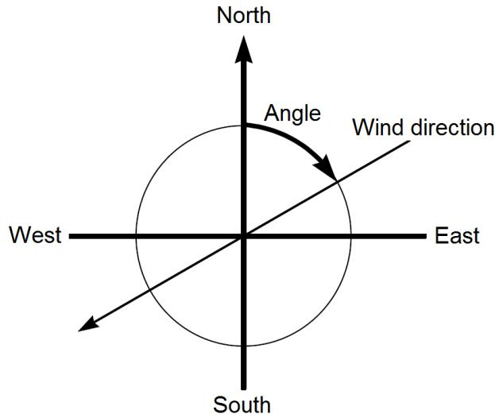

Figure 15.1: Nautical conventions for the wind.

#### 15.1.1.2 Drag coefficient

The user can select how the wind drag coefficient should be computed, by specifying the type of wind drag formulation in the mdu-file. For this purpose, the keyword `ICdtyp` should be used. Nine options are available:

- ◊ `ICdtyp` = 1 – constant drag coefficient,
- ◊ `ICdtyp` = 2 – linearly varying drag coefficient (cf. Smith and Banke (1975)),
- ◊ `ICdtyp` = 3 – piecewise linearly varying drag coefficient (cf. Smith and Banke (1975)),
- ◊ `ICdtyp` = 4 – Charnock (1955) formulation,
- ◊ `ICdtyp` = 5 – Hwang (2005a) and Hwang (2005b) formulation,
- ◊ `ICdtyp` = 6 – Wüest and Lorke (2003) formulation,
- ◊ `ICdtyp` = 7 – Hersbach (2011) formulation,
- ◊ `ICdtyp` = 8 – Charnock (1955) formulation plus viscous effect,
- ◊ `ICdtyp` = 9 – Garratt (1977) formulation.

If one of the Smith & Banke type dependencies is selected, the additional entries `Cdbreakpoints` and `Windspeedbreakpoints` come into play. In the following sections, these various options are described in more detail.

**Smith & Banke type formulation**

When specifying a Smith & Banke type dependency, the definition as sketched in Figure 15.2 should be kept in mind.

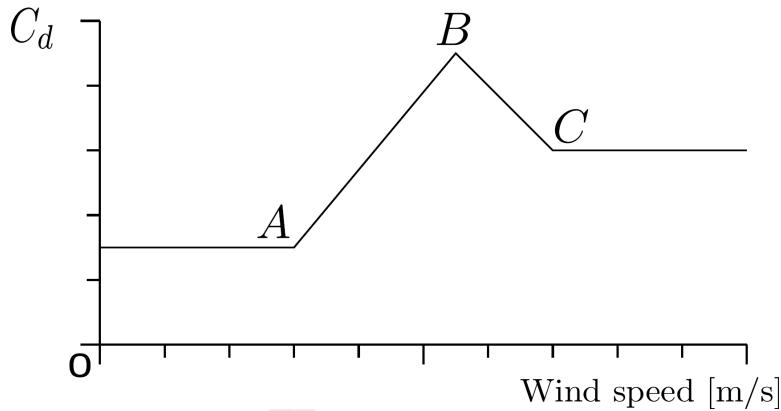

**Figure 15.2:** Prescription of the dependency of the wind drag coefficient  $C_d$  on the wind speed is achieved by means of at least 1 point, with a maximum of 3 points.

From this sketch, it can be seen that the wind drag is considered as dependent on the wind speed in a piecewise linear way. The options, that are facilitated in this respect, are:

- ◇ define *one* set of coordinates (breakpoint A), specifying a constant drag coefficient, valid for all wind speeds,
- ◇ define *two* sets of coordinates (breakpoints A and B), specifying a linearly varying dependency for one range of wind speeds,
- ◇ define *three* sets of coordinates (breakpoints A, B and C), specifying a piecewise linear dependency for two ranges of wind speeds.

Remark that for the latter two options, the drag coefficient is taken constant for wind speeds lower/higher than the lowest/highest specified wind speed, with a drag coefficient equal to the drag coefficient associated with the lowest/highest specified lowest/highest wind speed. In case of three breakpoints, the expression reads:

$$C_d(U_{10}) = \begin{cases} C_d^A, & U_{10} \leq U_{10}^A, \\ C_d^A + (C_d^B - C_d^A) \frac{U_{10} - U_{10}^A}{U_{10}^B - U_{10}^A}, & U_{10}^A \leq U_{10} \leq U_{10}^B, \\ C_d^B + (C_d^C - C_d^B) \frac{U_{10} - U_{10}^B}{U_{10}^C - U_{10}^B}, & U_{10}^B \leq U_{10} \leq U_{10}^C, \\ C_d^C, & U_{10}^C \leq U_{10}, \end{cases} \quad (15.7)$$

By means of the entries Cdbreakpoints and Windspeedbreakpoints, the coordinates of the breakpoints (see Figure 15.2) can be specified. Typical values associated with the Smith and Banke (1975) formulation are  $C_d = 6.3 \times 10^{-4}$  for  $U = 0$  m/s and  $C_d = 7.23 \times 10^{-3}$  for  $U = 100$  m/s. In this case, the entries in the mdu-file should be specified as follows:

| Cdbreakpoints        | = 0.00063 | 0.00723   |
|----------------------|-----------|-----------|
| Windspeedbreakpoints | = 0.00000 | 100.00000 |

### Relative wind

In D-Flow FM, there is the possibility to compute wind shear stress based on the *relative* wind velocity, i.e. relative to the flow velocity. This becomes important when the flow is predominantly forced by the wind and the flow velocity is in the order of the wind velocity. In this way, one can avoid that the wind still forces the flow, despite a zero (or small) difference between flow and wind speed. In case of relative wind Equation (15.1) is changed to

$$|\tau_s| = \rho_a C_d (U_{10} - \alpha U_{flow})^2 \quad (15.8)$$

where:

| $\rho_a$   | the density of air.                                                        |
|------------|----------------------------------------------------------------------------|
| $U_{10}$   | the wind speed 10 meter above the free surface (time and space dependent). |
| $C_d$      | the wind drag coefficient, dependent on $U_{10}$ .                         |
| $U_{flow}$ | the flow velocity.                                                         |
| $\alpha$   | the relative wind factor.                                                  |

This option can be switched on via keyword Relativewind. Then, a value between 0 and 1 has to be specified, which acts as a factor for relative wind, as shown in Equation (15.8).

### Charnock formulation

The Charnock formulation (see Charnock (1955)) is based on the assumption of a fully developed turbulent boundary layer of the wind flow over the water surface. The associated wind speed profile follows a logithmic shape. In the Charnock formulation, the wind speed is considered at 10 meters above the free water surface, hence yielding the following expression:

$$\frac{U_{10}}{u_*} = \frac{1}{\kappa} \ln \left( \frac{z_{10}}{z_0} \right) \quad (15.9)$$

with  $\kappa$  the Von Kármán constant,  $z_{10}$  the distance to the water surface (equal to 10 m),  $u_*$  the friction velocity and  $U_{10}$  the wind speed at 10 m above the water surface. The drag coefficient  $C_d$  is defined as:

$$C_d = \frac{u_*^2}{U_{10}^2}. \quad (15.10)$$

Charnock (1955) has proposed to represent the friction of the water surface as  $z_0$  according to:

$$z_0 = \frac{b u_*^2}{g}, \quad (15.11)$$

with  $g$  the gravitation acceleration and  $b$  a specific constant. Charnock (1955) has proposed  $b = 0.012$ . The value of the constant  $b$  can be specified in the mdu-file by the user by means of one single value for Cdbreakpoints. Since the above relation yields an implicit relation for  $u_*$ , the system is solved for iteratively. The user should be aware of interpretation of the specified wind field as the wind field at 10 m above the water surface. See Table C.17 for a space and time varying Charnock coefficient  $b$ .

### Hwang formulation

The dynamic roughness could also be related to the steady state wave conditions of the flow field under consideration. The connection of the wave parameters with the drag coefficient as elaborated by Hwang (2005a) is available within D-Flow FM through  $ICdtyp = 5$ , given a wave field. The Hwang-formulation interprets the user defined wind speed as the wind speed at 10 m above the water surface.

The drag coefficient is computed as:

$$C_d = \left[ \frac{1}{\kappa} \ln \left( \frac{k_p z_{10}}{k_p z_0} \right) \right]^{-2} \quad (15.12)$$

with  $z_{10} = 10$  m,  $\kappa$  the Von Kármán constant. With wavelength scaling,  $k_p z_0$  is the natural expression of the dimensionless roughness, where  $k_p$  is the wave number of the spectral peak, computed on the basis of the actual water depth and the provided peak period  $T_p$  as wave field. Further following Hwang (2005a),

$$k_p z_0 = \pi \exp \left( -\kappa C_{\lambda/2}^{-0.5} \right) \quad (15.13)$$

in which  $C_{\lambda/2}$  is the drag coefficient at half the wavelength above surface. This parameter  $C_{\lambda/2}$  is computed as:

$$C_{\lambda/2} = A_{10} \left( \frac{\omega_p U_{10}}{g} \right)^{a_{10}} \quad (15.14)$$

in which  $A_{10} = 1.289 \times 10^{-3}$ ,  $a_{10} = 0.815$ ,  $U_{10}$  the wind speed at 10 m above the water surface and  $\omega_p$  the wave peak frequency ( $\omega_p = 2\pi/T_p$ ). Thus, the drag coefficient  $C_d$  is defined.

### Wuest formulation

Wüest and Lorke (2003) define the drag coefficient as

$$C_d = \begin{cases} 0.00063 + 0.000066 U_{10} & \text{if } U_{10} > 4 \\ 0.0044 \max(0.1, U_{10})^{-1.15} & \text{if } U_{10} \leq 4 \end{cases} \quad (15.15)$$

### Hersbach formulation

Hersbach (2011) defines the drag coefficient as

$$C_d = \left( \frac{\kappa}{b_n^{fit}} \right)^2 \quad (15.16)$$

where  $b_n^{fit}$  is split into a viscous  $b_n^\nu$  and Charnock  $b_n^\alpha$  contribution as

$$b_n^{fit} = [(b_n^\nu)^p + (b_n^\alpha)^{p^{1/p}}] \quad (15.17)$$

$$b_n^\nu = -1.47 + 0.93 \ln R \quad (15.18)$$

$$b_n^\alpha = 2.65 - 1.44 \ln A - 0.015(\ln A)^2 \quad (15.19)$$

in which

$$A = \frac{\alpha_{ch}}{g z_{10}} (\kappa U_{10})^2 \quad (15.20)$$

and

$$R = \frac{z_{10}}{\alpha_M \nu_{\text{air}}} \kappa U_{10} \quad (15.21)$$

where  $z_{10}$  equals the elevation at which the velocity is given, i.e. 10 m. The values of the constants  $\alpha_{ch}$  and  $\alpha_M$  can be specified in the mdu-file by the user by means of two values for Cdbreakpoints.

### Charnock with viscous

When this option is selected, the drag coefficient is computed according Equation (15.10) where  $u_*$  is determined iteratively using

$$z_0 = \frac{b_1 u_*^2}{g} + \frac{b_2 \nu_{\text{air}}}{u_*} \quad (15.22)$$

and Equation (15.9). The values of the constants  $b_1$  and  $b_2$  can be specified in the mdu-file by the user by means of two values for Cdbreakpoints.

### Garratt formulation

Garratt (1977) defines the drag coefficient as

$$C_d = \min(10^{-3}(0.75 + 0.067 U_{10}), 0.0035) \quad (15.23)$$

This formulation can also be represented as a Smith & Banke type formulation.

| [wind]               |                   |
|----------------------|-------------------|
| ICdtyp               | = 2               |
| Cdbreakpoints        | = 0.00075 0.0035  |
| Windspeedbreakpoints | = 0.00000 41.0448 |

#### 15.1.2 File formats for wind forcing

The wind field should be provided by means of meteo forcing file(s). Most commonly used types are various ASCII-formatted files and NetCDF. Section C.6.3.3 lists all supported formats. This file should contain the grid on which the wind field is defined as well as the wind velocity vector(s).

D-Flow FM currently supports four types of wind field prescriptions, i.e. four grid types on which the wind field can be given. This wind grid does not need to be the same as the computational grid. The grid options to provide the wind data on are:

1. 1 the computational grid — in this case, no specific wind grid is provided. The provided wind field is considered to be uniform over the entire model area. The wind field can be time dependent.
2. 2 an equidistant grid — in this case, a wind field can be prescribed that varies both in space and in time. A Cartesian ArcInfo-type file or NetCDF file should be provided on which the wind field is defined.
3. 3 a curvilinear grid — this case is conceptually similar to the previous type (the equidistant grid) in the sense that a wind field can be imposed that both varies in space and time. However, for ArcInfo-type data files, a separate file should be provided in which a curvilinear grid is defined (a classic `<*.grd>-type` file as known from Delft3D-FLOW) on which the wind field is defined. For NetCDF this is not necessary: all meteo grid coordinates must be present in the same NetCDF file that contains the meteo forcing data itself.

4 a spiderweb grid — this type of wind specification is specially devoted to cyclone winds. In this case, a cyclone wind field is given on a polar grid with the center ('eye') of the cyclone being the origin of the polar coordinate system. The location of this eye and the associated wind field usually varies in time.

Each of these filetypes can be assigned through the entry in the new external forcings file (the `<*.ext>-file`) named `dataFileType`.

**Warning:**

- ◊ Deprecated: In the old `<*.ext>` file, the keyword was called `FILETYPE`. Now, the new external forcings file is the only place where meteo must be specified.

In this chapter, the various types of wind field specifications are highlighted subsequently. Each of the options is illustrated by means of an example.

### 15.1.2.1 Defined on the computational grid

In D-Flow FM, the specification of the wind on the computational grid is comparable to the specification of a spatially uniform wind, since no separate wind grid is provided to the model. The specification of a uniform wind field can be done in two ways:

1. 1 componentwise: as velocity in the longitudinal  $x$ -direction [m/s] and in the latitudal  $y$ -direction [m/s] — with `dataFileType=bcAscii` (Deprecated: formerly this was via `FILETYPE=1` and a `<*.tim>` file in the old `<*.ext>` file).
2. 2 by magnitude [m/s] and direction [degN] (see Figure 15.1) — with `dataFileType = uniMagDir` (Deprecated: formerly this was `FILETYPE=2` in the old `<*.ext>` file).

These two types are treated below separately.

#### 15.1.2.1.1 Specification of uniform wind through velocity components

Since no particular wind grid is used, only timeseries for the  $x$ -component and the  $y$ -component of the wind need to be specified. The specification of these timeseries can be done separately (one single file for the  $x$ -component and one single file for the  $y$ -component) or jointly (one single file containing the  $x$ -component and the  $y$ -component of the wind).

Uniform wind should be provided as a `<*.bc>` file.

**Warning:**

- ◊ Deprecated: formerly, this was via a `<*.wnd>`-file containing either 2 columns (in case of separate specification of the  $x$ -component and  $y$ -component of the wind) or 3 columns (in case of joint specification of the velocity components). In either case, the first column contains the time in minutes with respect to the overall reference time.

### Example

As an example, a uniform wind field is applied to a certain model. The uniform wind is provided in a `<*.bc>` file named `windxdirydir.bc`. The contents of this wind file are:

| [Forcing]          |                |
|--------------------|----------------|
| Name               | = global       |
| Function           | = timeSeries   |
| Time-interpolation | = linear       |
| Vector             | = windxy:wx,wy |

```
Quantity                                        = time
Unit                                            = minutes since 2006-01-01 0:00:00
Quantity                                        = wx
Unit                                            = ms-1
Quantity                                        = wy
Unit                                            = ms-1
                                               0.00000   10.00000   10.00000
                                               60.00000  -10.00000  -10.00000
```

**Warning:**

- ◇ Deprecated: The old external forcing file is being deprecated, as well as timeseries files  $\langle *.tim \rangle$  and  $\langle *.wnd \rangle$ . The example below is kept only for migration purposes:

Before, the uniform wind could also be provided in a  $\langle *.wnd \rangle$  file named `windxdirydir.wnd`. The contents of this wind file are:

```
                                               0.00000   10.00000   10.00000
                                               60.00000  -10.00000  -10.00000
```

The first column denotes the time in minutes with respect to the reference date (specified in the `mdu-file`). The second column denotes the wind velocity in  $x$ -direction, whereas the third column denotes the wind velocity in  $y$ -direction; both wind components are provided in one single file.

The connection with the flow model itself is laid through the external forcings file. The actual specification of the wind is in this case:

```
[Spatial]
quantity                                        = windxy
dataFile                                        = windxdirydir.bc
dataFileType                                    = bcAscii
interpolationMethod                             = linearSpaceTime
operand                                        = override
```

**Warning:**

- ◇ Deprecated: The old external forcing file is being deprecated. The example below is kept only for migration purposes:

```
QUANTITY =windxy
FILENAME =windxdirydir.wnd
FILETYPE =1
METHOD                                    =1
OPERAND                                    =0
```

Since the two components are given in one single file, the QUANTITY is set to `windxy`. If two separate files would have been provided, the QUANTITY would have been set to `windx` and `windy` over two separate datablocks in the external forcings file.

### 15.1.2.1.2 Specification of uniform wind through magnitude and direction

Instead of specifying the separate components of the wind field, the uniform wind vector can also be prescribed through its magnitude and direction (see Figure 15.1).

This kind of specification should be done by means of one single file, containing three columns, representing the time (in minutes with respect to the reference date), the velocity magnitude [m/s], not necessarily positive, and the direction (nautical convention).

#### Example

As an example, the previous uniform wind case is reformulated as a case with magnitude and direction of the wind field prescribed as two timeseries. The unimagdir wind is provided in a `<*.bc>` file. The contents of this wind file are:

```
[Forcing]
Name                                               = global
Function                                               = timeSeries
Time-interpolation                                         = linear
Vector                                                          = windxy:magnitude,direction
Quantity                                                          = time
Unit                                                                = minutes since 2006-01-01 0:00:00
Quantity                                                           = magnitude
Unit                                                               = ms-1
Quantity                                                           = direction
Unit                                                               = degree
                                                               0.00000   14.14213562373095   225.00000
                                                               60.00000   -14.14213562373095   225.00000
```

The connection with the flow model itself is laid through the external forcings file. The actual specification of the wind is in this case:

```
[Spatial]
quantity                                                      = windxy
dataFile                                                      = windinput.bc
dataFileType                                                = bcAscii
interpolationMethod                                        = linearSpaceTime
operand                                                     = override
```

#### Warning:

- ◊ Deprecated: The old external forcing file and timeseries file is being deprecated. The example below is kept only for migration purposes:

The unimagdir wind could also be provided in a file named `<windinput.wnd>`. The contents of this file are:

```
0.00000   14.14213562373095   225.00000
60.00000   -14.14213562373095   225.00000
```

The first column denotes the time in minutes with respect to the reference date (specified in the mdu-file). The second column denotes the wind velocity magnitude, whereas the third column denotes the wind direction. Note that there is a clear difference between the above case and a case in which the magnitude is kept positive (14.1421 m/s) and the direction varies (and hence *rotates*!) from 225 degN to 45 degN.

The old external forcings file would then look like:

```
QUANTITY =windxy
FILENAME =windinput.wnd
FILETYPE =2
METHOD    =1
OPERAND   =0
```

### 15.1.2.2 Defined on an equidistant grid

The vector components of the velocity vectors can also be specified on a distinct grid, either of equidistant type or of curvilinear type. In both cases, the characteristics of the grid should be provided. In case of an equidistant grid, the grid is specified in `arcinfo-style`. That means, the constant grid sizes  $\Delta x$  and  $\Delta y$  should be specified such that a grid is spanned with respect to the location of the lower left corner of the grid (either the center of the lower left cell or the lower left corner of the lower left cell).

#### Example

As an example, a grid with  $\Delta x = \Delta y = 100$  m is spanned, based on the center of the lower left cell, located at  $x = y = 60$  m with respect to the origin. The input data for the  $x$ -component and the  $y$ -component should be specified separately, in two distinct files. The input of the  $x$ -component data should be given in an `<*.amu>`-type file, such as `<windxdir.amu>` as an example:

```
### START OF HEADER
### This file is created by Deltares
### Additional comments
FileVersion                                 = 1.03
filetype                                     = meteo_on_equidistant_grid
NODATA_value                                = -9999.0
n_cols                                      = 5
n_rows                                     = 4
grid_unit                                   = m
x_llcenter                                  = 60
y_llcenter                                 = 60
dx                                          = 110
dy                                          = 110
n_quantity                                 = 1
quantity1                                 = x_wind
unit1                                    = m s-1
### END OF HEADER
TIME = 0 hours since 2006-01-01 00:00:00 +00:00
10 10 10 10 10 10
10 10 10 10 10 10
10 10 10 10 10 10
10 10 10 10 10 10
TIME = 1 hours since 2006-01-01 00:00:00 +00:00
-10 -10 -10 -10 -10
-10 -10 -10 -10 -10
-10 -10 -10 -10 -10
-10 -10 -10 -10 -10
```

For the  $y$ -component data, a similar file (e.g. `<windydir.amv>`) should be provided. In addition, the pressure could be specified in a similar file (e.g. `<pressure.amp>`). Note that `x_llcenter` and `y_llcenter`, instead of `x_llcenter` and `y_llcenter`, are also supported.

The connection with the flow model itself is laid through the external forcings file. The actual specification of the wind is in this case:

```
[Spatial]
quantity                                         = windx
dataFile                                          = windxdir.amu
dataFileType                                      = ArcInfo
interpolationMethod                               = linearSpaceTime
operand                                          = override[Spatial]
quantity                                          = windy
dataFile                                          = windydir.amv
dataFileType                                      = ArcInfo
interpolationMethod                               = linearSpaceTime
operand                                          = override[Spatial]
quantity                                          = atmosphericpressure
dataFile                                          = pressure.amp
dataFileType                                      = ArcInfo
interpolationMethod                               = linearSpaceTime
operand                                          = override
```

**Warning:**

- ◇ Deprecated: The old external forcing file is being deprecated. The example below is kept only for migration purposes:

```
QUANTITY =windx
FILENAME =windxdir.amu
FILETYPE =4
METHOD                                        =2
OPERAND                                        =0QUANTITY =windy
FILENAME =windydir.amv
FILETYPE =4
METHOD                                        =2
OPERAND                                        =0QUANTITY =atmosphericpressure
FILENAME =pressure.amp
FILETYPE =4
METHOD                                        =2
OPERAND                                        =0
```

### 15.1.2.3 Defined on a curvilinear grid

In analogy with the wind specification on an equidistant grid, the wind can be specified on a curvilinear grid. This curvilinear grid should be provided as a classic `<*.grd>`-file as known from Delft3D-FLOW. A difference with the equidistant grid wind is the necessity to compile all data blocks (i.e. pressure,  $x$ -component and  $y$ -component) in one single file. This file should have the extension `<*.apwxwy>`. The sequence of this datablock is:

1. 1 pressure,
2. 2  $x$ -velocity component,
3. 3  $y$ -velocity component.

## Example

As an example, a curvilinear grid named `<meteo.grd>` is present, providing the underlying coordinates of the wind data field. The input data, comprising the atmospheric pressure, the *x*-velocity component *and* the *y*-velocity component, are given in one single file (as is compulsory). The contents of the example `<meteo.apwxwy>`-file is:

```
### START OF HEADER
### This file is created by Deltares
### Additional comments
FileVersion                     = 1.03
filetype                         = meteo_on_curvilinear_grid
NODATA_value                   = -9999.0
grid_file                       = meteo.grd
first_data_value                = grid_llcorner
data_row                       = grid_row
n_quantity                      = 3
quantity1                       = air_pressure
unit1                          = Pa
quantity2                      = x_wind
unit2                         = m s-1
quantity3                      = y_wind
unit3                         = m s-1
### END OF HEADER
TIME = 0.0 hours since 2006-01-01 00:00:00 +00:00
101325 101325 101325 101325 101325
101325 101325 101325 101325 101325
101325 101325 101325 101325 101325
101325 101325 101325 101325 101325
10 10 10 10 10 10
10 10 10 10 10 10
10 10 10 10 10 10
10 10 10 10 10 10
10 10 10 10 10 10
10 10 10 10 10 10
10 10 10 10 10 10
10 10 10 10 10 10
10 10 10 10 10 10
TIME = 1.0 hours since 2006-01-01 00:00:00 +00:00
101325 101325 101325 101325 101325
101325 101325 101325 101325 101325
101325 101325 101325 101325 101325
-10 -10 -10 -10 -10
-10 -10 -10 -10 -10
-10 -10 -10 -10 -10
-10 -10 -10 -10 -10
-10 -10 -10 -10 -10
-10 -10 -10 -10 -10
-10 -10 -10 -10 -10
-10 -10 -10 -10 -10
-10 -10 -10 -10 -10
```

Note that `grid_llcenter`, instead of `grid_llcorner`, is also supported. On the contrary, `grid_column` is *not* supported instead of `grid_row`.

Wind on a curvilinear grid has been provided a filetype specification as `FILETYPE=6`. The connection with the flow model itself is laid through the external forcings file. The actual specification of the wind is in this case:

```
QUANTITY =airpressure_windx_windy
FILENAME =meteo.apwxwy
FILETYPE =6
METHOD     =3
OPERAND    =0
```

Notice that `METHOD=3` is chosen for wind on a curvilinear grid, instead of `METHOD=2` in case of wind on an equidistant grid.

### 15.1.2.4 Space and time varying Charnock coefficients

The value for the Charnock coefficient  $b$  in Equation (15.11) can be a constant given in the mdu-file, but also be given as a space and time varying field.

For a space and time varying Charnock coefficient, the user should provide a `netCDF`-file with meteorological forcing, including Charnock coefficients, and use the file specification `dataFileFormat=netcdf`.

The specification is in this case in the new `<*.ext>` file:

```
[Spatial]
quantity                                    = airpressure_windx_windy_charnock
dataFile                                    = meteo.nc
dataFileType                               = netcdf
interpolationMethod                         = linearSpaceTime
operand                                    = override
```

#### Warning:

- ◊ Deprecated: The old external forcing file is being deprecated. The example below is kept only for migration purposes:

```
QUANTITY =airpressure_windx_windy_charnock
FILENAME =meteo.nc
FILETYPE =11
METHOD       =3
OPERAND       =0
```

### 15.1.2.5 Defined on a spiderweb grid

Cyclone winds can be imposed by means of a 'spiderweb'-like polar grid. The origin typically coincides with the cyclone eye and can move in time. The origin of the spiderweb should be given as longitude (for  $x_{eye}$ ) and latitude (for  $y_{eye}$ ). The number of rows (discretisation in radial direction) and the number of columns (discretisation in angular direction) should be given, as well as the radius of the grid (in meters). The definition of the spiderweb grid is illustrated in Figure 15.3.

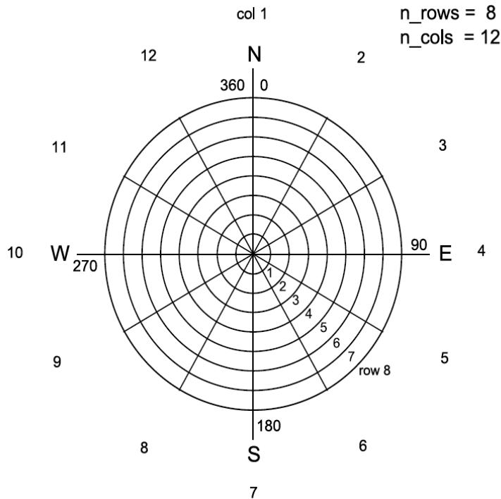

**Figure 15.3:** Grid definition of the spiderweb grid for cyclone winds.

The files containing the spiderweb data and metadata have the extension `<*.spw>`. They consist of a global header containing properties that are not varying in time, followed by blocks of data for subsequent time levels. Each of these data blocks is headed by a set of properties for the corresponding time level. A detailed description of the spiderweb file format can be found in section C.14.3.

Through the specified unit for atmospheric pressure in the file, it can be specified whether the values should be interpreted as mbar (=hPa), instead of Pa, which is the default. Specifying the spiderweb merge fraction  $\beta$  in `spw_merge_frac` allows for linear fading of wind speed and pressure drop towards the outer rim. For a spiderweb with radius  $R$ , the weight assigned to the spiderweb wind and pressure at a radius  $r$  is given by  $(R - r)/\beta R$  for  $r$  between  $(1 - \beta)R$  and  $R$ . The weight equals unity within the inner circle and zero beyond the outer rim.

### Example

As an example, a spiderweb grid named `<spwsimple.spw>` is present, providing the underlying coordinates of the wind data field. The input data, comprising the atmospheric pressure drops, the wind velocity magnitudes (in [m/s]) and the wind directions (in [degN]), are given in one single file (as is compulsory). The contents of the example `<spwsimple.spw>-file` is:

```
### Spiders web derived from TRACK file: gonu.trk
### This file is created by Deltares
### All text on a line behind the first # is parsed as commentary
### Additional comments
FileVersion                     = 1.03
filetype                          = meteo_on_spiderweb_grid
### Spiders web derived from TRACK file: gonu.trk
### This file is created by Deltares
### All text on a line behind the first # is parsed as commentary
```

```
### Additional comments
NODATA_value      = -1001
n_cols           = 4
n_rows           = 4
spw_radius       = 600000.0
spw_merge_frac   = 0.75
spw_rad_unit     = m
### END OF HEADER
TIME             = 340000.00    minutes since 2005-01-01 00:00:00 +00:00
x_spw_eye         = 265.00
y_spw_eye         = 33.00
p_drop_spw_eye   = 7000.000
  5.000000    5.000000    5.000000    5.000000
10.000000    10.000000    10.000000    10.000000
15.000000    15.000000    15.000000    15.000000
20.000000    20.000000    20.000000    20.000000
  270.00            0.00            90.00            180.00
  270.00            0.00            90.00            180.00
  270.00            0.00            90.00            180.00
  270.00            0.00            90.00            180.00
  4000.00            4000.00            4000.00            4000.00
  3000.00            3000.00            3000.00            3000.00
  2000.00            2000.00            2000.00            2000.00
  1000.00            1000.00            1000.00            1000.00
TIME               = 380000.00    minutes since 2005-01-01 00:00:00 +00:00
x_spw_eye         = 275.00
y_spw_eye         = 18.00
p_drop_spw_eye   = 8000.000
  5.000000    5.000000    5.000000    5.000000
10.000000    10.000000    10.000000    10.000000
15.000000    15.000000    15.000000    15.000000
20.000000    20.000000    20.000000    20.000000
  270.00            0.00            90.00            180.00
  270.00            0.00            90.00            180.00
  270.00            0.00            90.00            180.00
  270.00            0.00            90.00            180.00
  4000.00            4000.00            4000.00            4000.00
  3000.00            3000.00            3000.00            3000.00
  2000.00            2000.00            2000.00            2000.00
  1000.00            1000.00            1000.00            1000.00
```

Wind on a spiderweb grid has been provided a filetype specification as FILETYPE=5. The connection with the flow model itself is laid through the external forcings file. The actual specification of the wind in the new <\*.ext> file:

```
[Spatial]
quantity                                                = airpressure_windx_windy
dataFile                                                     = spwsimple.spw
dataFileType                                                = spiderWeb
interpolationMethod                                         = linearSpaceTime
operand                                                     = override
```

**Warning:**

- ◇ Deprecated: The old external forcing file is being deprecated. The examples below are kept only for migration purposes:

```
QUANTITY =airpressure_windx_windy
FILENAME =spwsimple.spw
FILETYPE =5
METHOD       =1
OPERAND       =0
```

Notice that METHOD=1 is chosen for wind on a spiderweb grid, instead of METHOD=2 in case of wind on an equidistant grid and METHOD=3 in case of wind on a curvilinear grid.

Alternatively, the spiderweb wind and pressure can be specified in the external forcings file as separate quantities referring to the same file (or specify one and omit the other):

```
QUANTITY =windxy
FILENAME =spwsimple.spw
FILETYPE =5
METHOD   =1
OPERAND  =0QUANTITY =airpressure
FILENAME =spwsimple.spw
FILETYPE =5
METHOD   =1
OPERAND  =0
```

(NB. There is a slight difference between both specifications regarding their effect on the flow. The first approach requires an additional interpolation of wind on the velocity points, which in some cases of coarse computational grids and small scale wind could introduce smoothing.)

### 15.1.2.6 Combination of several wind specifications

The combination of the various wind specification types can *only* be achieved if the quantity of the winds to be combined is the same, for instance `quantity=windx`. The option `operand=add` can be used to add a wind field to an existing wind field.

#### Example

If the uniform wind is to be combined with a wind specified on an equidistant grid, then the wind field could be assigned in the new external forcings file as follows:

```
[Spatial]
quantity                               = windx
dataFile                                = windxdir.bc
dataFileType                            = bcAscii
interpolationMethod                     = linearSpaceTime
operand                                = override[Spatial]
quantity                               = windy
dataFile                                = windydir.bc
dataFileType                            = bcAscii
interpolationMethod                     = linearSpaceTime
operand                                = override[Spatial]
quantity                               = windx
dataFile                                = windxdir.amu
dataFileType                            = ArcInfo
interpolationMethod                    = linearSpaceTime
operand                                = add[Spatial]
quantity                               = windy
dataFile                                = windydir.amv
dataFileType                            = ArcInfo
interpolationMethod                    = linearSpaceTime
operand                                = add
```

#### Warning:

- ◊ Deprecated: The old external forcing file is being deprecated. The examples below are kept only for migration purposes:

```
QUANTITY =windx
FILENAME =windxdir.wnd
FILETYPE =1
METHOD    =1
OPERAND   =0
```

```
QUANTITY =windy
FILENAME =windydir.wnd
FILETYPE =1
METHOD    =1
OPERAND   =0
```

```
QUANTITY =windx
FILENAME =windxdir.amu
FILETYPE =4
METHOD    =2
OPERAND   =+
```

```
QUANTITY =windy
FILENAME =windydir.amv
FILETYPE =4
METHOD    =2
OPERAND   =+
```

The same is possible for e.g. a uniform wind and two spiderweb cyclones:

```
QUANTITY=windxy
FILENAME=uni.tim
FILETYPE=2
METHOD=1
OPERAND=0
```

```
QUANTITY =windxy
FILENAME =spwsimple.spw
FILETYPE =5
METHOD    =1
OPERAND   =+
```

```
QUANTITY =windxy
FILENAME =spwsimple2.spw
FILETYPE =5
METHOD    =1
OPERAND   =+
```

```
QUANTITY =atmosphericpressure
FILENAME =spwsimple.spw
FILETYPE =5
METHOD    =1
OPERAND   =+
```

```
QUANTITY =atmosphericpressure
FILENAME =spwsimple2.spw
FILETYPE =5
METHOD    =1
OPERAND   =+
```

In the above example, the wind is first prescribed as a spatially uniform time-varying field, onto which the spiderweb winds are added. Note that the uniform wind has the 'O' operand, which means that it overrides rather than adds. However, since the default wind is zero, one might just as well have used the '+' operand. If the spiderweb merge fraction is specified in the spiderweb file, a gradual transition between the spiderweb wind and the background wind is applied using the linearly varying weight as described above. The same is done for atmospheric pressure, if specified except that pressure is added to, whereas wind is averaged with the background values. Without any input, the background atmospheric pressure is set to PavBnd in the section [wind] in the mdu-file, if present and zero otherwise.

### 15.1.3 Masking of points in the wind grid from interpolation ('land-sea mask')

**Warning:**

- ◊ Deprecated: The old external forcing file is being deprecated. Similar (but not equivalent) functionality is available via the `targetMaskFile` keyword. More details are listed in [Section C.6.3.3](#).

A mask can be supplied by the user to prevent selected points in the wind grid from contributing to the wind interpolation on velocity points, e.g. to exclude land points. This feature was included to conform to SIMONA and therefore implemented in the same way.

For each individual grid point for which to interpolate from the wind grid:

- ◊ Masked wind points are excluded from the interpolation.
- ◊ The total of the weight factors for the remaining wind points is determined.
- ◊ If this total falls below  $1E-03$ , the mask is ignored and the original bilinear weights are used.
- ◊ Otherwise, the weights for the remaining wind points are normalised again.

The effect of the mask, when applied as a land-sea mask, is that for velocity points close to shore the interpolated wind is no longer influenced by the wind over land (which would otherwise yield a zone of points with reduced wind near the shore).

**Specification and format of the mask file**

The name of the mask file, if any, is specified in the `<.ext>` file, labelled `SOURCEMASK`, directly following the `FILENAME` specification, e.g.:

```
QUANTITY      =windxy
FILENAME      =meteo.wxwy
SOURCEMASK   =meteo_mask.asc
FILETYPE      =6
METHOD       =3
OPERAND       =0
```

The mask file itself has the same layout as the wind file, though the number of required header fields is reduced, e.g.:

```
FileVersion     =  1.03
.
.
unit1           =           Pa
### END OF HEADER
1           1             1           1
1           1             0           0
1           1             0           0
1           1             0           0
```

The lines in the header are ignored. The number of columns and rows in the matrix of ones and zeros should match those of a block (for a single variable and a single timestep) in the `meteo` files. Zeros signify the position of rejected points (and ones those of the accepted points) in the wind grid.

## 15.2 Precipitation

Precipitation falling onto the surface (land or water) acts as a source of water for the system. The state of precipitation (solid or liquid) is ignored, so all precipitation that falls, contributes directly to the mass balance. Sometimes precipitation is referred to as rainfall. In D-Flow FM all precipitation input is via keywords with `rainfall` in its name.

Precipitation can be defined as `rainfall` and `rainfall_rate`. Both can be provided as a timeseries, but they have a different meaning for the value at each time. The difference is: `rainfall` is the cumulative precipitation [mm] (for each time in the timeseries, measured since the previous time in that timeseries) and `rainfall_rate` is the instantaneous precipitation [mm/day] on a particular time. For example, `rainfall` data files could provide 10-minute precipitation sums on 10-minute intervals.

The unit of rainfall rate is [mm/day]. So, this is the case for rainfall rate input either via a `<*.bc>` file or a `netCDF`-file.

### 15.2.1 Meteo forcing input

Precipitation is prescribed by a data file containing the rainfall intensities or amounts, and this file should be referenced in the external forcings file. An example rainfall block looks like:

**Example:**

```
[General]
fileVersion                     = 3.00
fileType                         = extForce[Spatial]
quantity                         = rainfall
dataFile                         = precip.nc
dataFileType                    = netcdf
targetMaskFile                   = roofs.pol
targetMaskInvert                = true
interpolationMethod             = nearestNb
```

The external forcings syntax for meteo is further described in section C.6.3.3. The supported data formats for the actual rainfall are:

- ◇ Global (spatially uniform) time series in `<.bc>` ascii format (Appendix C.5);
- ◇ Time series on meteo stations in `netCDF` (section D.2.4);
- ◇ Gridded meteo data (space- and time-dependent) in `netCDF` (section C.6.3.3);

### 15.2.2 Rainfall distribution across the model grid

The total rainfall amount is determined at the start of every timestep and added to the total volume source term for each grid cell. The total rainfall flux entering a grid cell is simply the local rainfall intensity times the maximum grid cell area, *if* that grid cell is allowed to capture rainfall. A grid cell is allowed to capture rainfall when it satisfies the following conditions:

- ◇ The grid cell is  $2D^1$ ;
- ◇ Or: the grid cell is 1D and is *not* overlapped by any other 2D grid cell. This excludes 1D embedded grid points and 1D sewer pipes below street level;
- ◇ Finally, the cell must be selected by the target mask if and only if such a target mask is present.

<sup>1</sup>In 3D models, "2D" means that the cell is 2D in the horizontal input grid.

The maximum grid cell area used for catching rainfall is defined as:

- ◇ normal bed area for 2D grid cells;
- ◇ sum of maximum flow link areas for 1D open channel grid cells; these areas are based on the maximum flow width of the relevant cross sections and half the flow link length;
- ◇ the bottom area of a 1D storage node, if `useTable=false`;
- ◇ Note: the bottom area of a 1D storage node with `useTable=true` is yet undefined.

The rainfall intensity at each grid cell is interpolated from the source data to the cell centers. The type of interpolation depends on the settings supplied. Figure 15.4 shows nearest neighbour interpolation of three meteo stations onto the model grid.

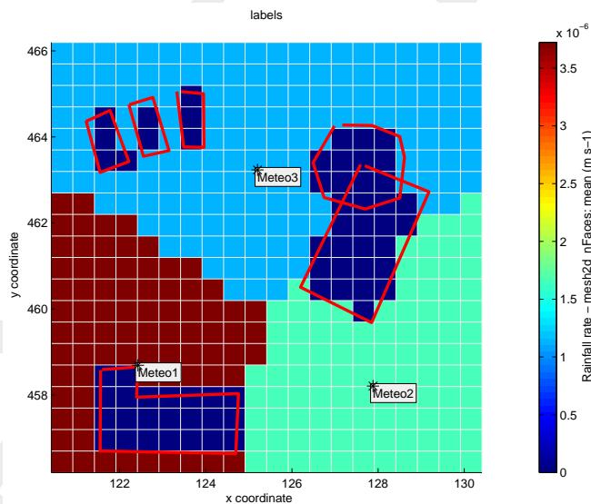

**Figure 15.4:** Rainfall rates by nearest neighbour interpolation, with some areas masked out.

Additionally, an optional target mask can be supplied in a polygon file. The grid cells whose center lies outside (or inside) of the polygon(s) are then excluded from receiving rainfall.

### 15.2.3 Rainfall intensities versus rainfall amounts

Some datasets represent the precipitation as an intensity (e.g., millimeters per day). The external forcings quantity name is then `quantity = rainfall_rate`. Such input time-series can be interpolated in time as a linear function, so the resulting rainfall intensity during the simulation is continuous and piecewise linear. Other datasets may represent the precipitation as an amount per each data time interval (e.g. total millimeters for the past interval). Such input timeseries can be interpolated in time as a block function. The external forcings quantity name is then `quantity = rainfall`. The average intensity is derived as the total rain amount divided by the data time interval (which can also be non-equidistant in time). The resulting rainfall intensity during the simulation is then typically discontinuous and piecewise constant in time.

### 15.3 Evaporation

Water loss via evaporation can be enabled by setting  $E_{\text{vaporation}=1}$  in the MDU file under [external forcing]. The potential evaporation  $E_{\text{p},k}$  is then prescribed via spatial input (see Initial field file in section C.16.3). The actual evaporation is only limited by the available volume as described in section 15.3.1. Other hydrological factors such as soil moisture, are not modelled.


**Note:** Originally, evaporation was realized by specifying negative rainfall intensities. This functionality is kept for backwards-compatibility only and should not be used for new models.

#### 15.3.1 Numerical treatment of evaporation

Evaporation is a negative source of volume and as such is subtracted from the right-hand side source term of the continuity equation (3.3). This is described by equation (15.24)

$$Q_{\text{in},k} = \min \left( \frac{1}{2} V_k / \Delta t + Q_{\text{in},\text{rain},k}, |E_{\text{p},k} \cdot A_{\text{re},k}| \right) \quad (15.24)$$

where  $Q_{\text{in},\text{rain},k}$  describes the incoming rain. The negative evaporation flux is limited based on the available water volume in the grid cell in each timestep. The relaxation factor of  $\frac{1}{2}$  limits the negative source term contribution when little water is available, to avoid negative water depths.

Once all source terms have been collected in  $Q_{\text{in},k}$ , the real calculation of new water levels is done. The resulting water level at that grid point is then calculated implicitly by the matrix solver. Or, in the case of a negative source term  $Q_{\text{in},k}$ , it is solved explicitly in the continuity equation.

## 16 Ice modelling in D-Flow FM


**Note:** Ice modelling in D-Flow FM is of TRL level 4-6 (prototype), because the ice functionality in D-Flow FM is currently limited to a non-moving ice cover. The definitions of the Technical Technology Readiness Levels (TRL) are in Section 2.7.


**Note:** For ice modelling in combination with salinity concentrations larger than zero [ppt], then via SalinityDependentFreezingPoint=1 a salinity dependent freezing point has to be activated and also a minimum temperature smaller than the freezing point has to be specified via for example TempMin=-3. Both keywords are part of input block [physics]. The freezing point is computed according to Eq. 16.29.

The ice cover may either be externally specified or dynamically computed based on the thermodynamics of the system. Frazil ice is not yet included.

The presence of an ice cover may influence

- ◇ Wind shear, see section 16.3
- ◇ Thermal exchange between water and atmosphere, see section 16.2.2
- ◇ Precipitation and evaporation, see section 16.6
- ◇ Wave growth and propagation, see section 16.7
- ◇ Water pressure, see section 16.4
- ◇ Surface resistance, see section 16.5

### 16.1 Forced ice cover

In the case of a forced ice cover, the ice thickness  $h_i(x, y, t)$  and the ice cover fraction  $A_i(x, y, t)$  must be specified by the user via the initial and parameter fields file (Appendix C.7). (Formerly, this used to be in the old external forcings file.) A snow layer is not yet supported in the forced ice cover mode. These two quantities may be specified via

- ◇ ASCII equidistant grid
- ◇ ASCII curvilinear grid
- ◇ NetCDF curvilinear grid

The quantity names for  $h_i$  and  $A_i$  are seaIceThickness and seaIceAreaFraction, respectively.

### 16.2 Dynamic ice cover

The dynamic ice module consists of a thermodynamic model based on a single ice layer concept with snow on top (Semtner Jr., 1976). The ice model keeps track of three spatial quantities, namely the ice thickness  $h_i(x, y, t)$ , the snow thickness  $h_s(x, y, t)$  and the ice cover fraction  $A_i(x, y, t)$ . Snowfall is prescribed via the precipitation input. In case of precipitation and air temperatures below zero, then this is considered as snowfall; see also section 16.6. Decay of the snow thickness is computed by the thermodynamic model.

### 16.2.1 Conservation laws

Although the current version does not yet include horizontal transport, it is foreseen that the functionality will be extended to include horizontal transport of the ice cover based on the elastic-viscous-plastic (EVP) sea-ice rheology of Hunke and Dukowicz (1997). Hence, the equations below include the ice velocity components  $u_i(x, y, t)$  and  $v_i(x, y, t)$ . The equations for the conservation of the mass of ice and snow are given by

$$\frac{\partial(A_i h_i)}{\partial t} + \frac{\partial(u_i A_i h_i)}{\partial x} + \frac{\partial(v_i A_i h_i)}{\partial y} = S_{\text{ice}} + D_{\text{ice}} \quad (16.1)$$

$$\frac{\partial(A_i h_s)}{\partial t} + \frac{\partial(u_i A_i h_s)}{\partial x} + \frac{\partial(v_i A_i h_s)}{\partial y} = S_{\text{snow}} + D_{\text{snow}} + Q_{\text{snow}} \quad (16.2)$$

In these equations, the right-hand side contains thermodynamic terms  $S_*$  and diffusion terms  $D_*$ , with  $*$  depending on the ice equation to be solved. The snowfall is represented by  $Q_{\text{snow}}$ . The equation for ice cover fraction  $A_i$  reads

$$\frac{\partial A_i}{\partial t} + \frac{\partial(u_i A_i)}{\partial x} + \frac{\partial(v_i A_i)}{\partial y} = S_A + D_A \quad (16.3)$$

with  $0 \leq A_i \leq 1$ . The ice cover fraction or concentration represents the fraction of a computational cell that is covered by ice. Due to horizontal transport of the ice cover (from ice floes to icebergs), it is possible that only a part of a computational cell is covered by ice (and snow). The ice velocities  $u_i$  and  $v_i$  are computed via the momentum equations

$$M \left\{ \frac{\partial u_i}{\partial t} + \frac{\partial(u_i u_i)}{\partial x} + \frac{\partial(v_i u_i)}{\partial y} - f v_i \right\} = M g \frac{\partial \zeta}{\partial x} + \tau_a^x + \tau_w^x + F^x \quad (16.4)$$

$$M \left\{ \frac{\partial v_i}{\partial t} + \frac{\partial(u_i v_i)}{\partial x} + \frac{\partial(v_i v_i)}{\partial y} + f u_i \right\} = M g \frac{\partial \zeta}{\partial y} + \tau_a^y + \tau_w^y + F^y \quad (16.5)$$

with  $\zeta$  the water elevation,  $f$  the Coriolis force and  $M$  the ice mass,  $g$  the acceleration due to gravity,  $F$  the internal stresses according to Hibler III (1979) and  $\tau_a$  the air and  $\tau_w$  the water stresses, respectively. The internal ice stress  $F$  includes a compressive ice strength according to

$$P = p^* h_i e^{-C(1-A_i)} \quad (16.6)$$

with  $p^*$  and  $C$  empirical constants of  $2.5 \times 10^4$  and 20, respectively.

However, without horizontal movement, the ice velocity components  $u_i(x, y, t)$  and  $v_i(x, y, t)$  are currently always zero and the ice fraction  $A_i$  is always equal to zero (no ice in a computational cell) or one (computational cell completely filled with ice). The Equations 16.1 and 16.2 simplify to

$$\frac{\partial h_i}{\partial t} = S_{\text{ice}} \quad (16.7)$$

$$\frac{\partial h_s}{\partial t} = S_{\text{snow}} + Q_{\text{snow}} \quad (16.8)$$

### 16.2.2 Thermodynamics of the ice/snow cover

The vertical growth rate (or decay) of ice thickness is determined by the ice thermodynamics. The model's thermodynamic interactions between snow, ice, water, and atmosphere are shown in the left panel of Figure 16.1. The heat fluxes through the ice are based on a simple

one layer ice model with snow on top, according to Semtner Jr. (1976). The right panel in Figure 16.1 represents the (standard) temperature model in D-Flow FM when ice is absent.

**Figure 16.1:** Conceptual diagram of the ice-growth (left) and temperature (right) model

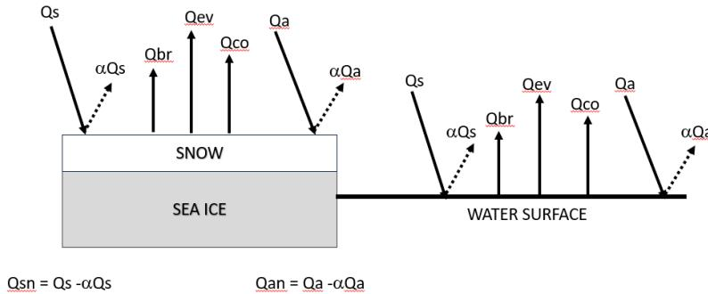

The total heat flux through the free surface reads

$$Q_{tot} = Q_{s,n} + Q_{a,n} - Q_{br} - Q_{ev} - Q_{co} \quad (16.9)$$

with  $Q_{s,n}$  the net incident solar radiation (short wave),  $Q_{a,n}$  the net incident atmospheric radiation (long wave),  $Q_{br}$  the back radiation (long wave),  $Q_{ev}$  the evaporative heat flux (latent heat) and  $Q_{co}$  the convective heat flux (sensible heat). The subscript n refers to a net contribution. All heat flux terms of Equation (16.9) are described in more detail in chapter 5. The net atmospheric radiation  $Q_{a,n}$  and the back radiation  $Q_{br}$  can be combined into the effective back radiation  $Q_{ebr}$  according to

$$Q_{ebr} = Q_{br} - Q_{a,n} \quad (16.10)$$

such that

$$Q_{tot} = Q_{s,n} - Q_{ebr} - Q_{ev} - Q_{co} \quad (16.11)$$

and hence

$$Q_{tot} \text{ without } ebr = Q_{tot} + Q_{ebr} = Q_{s,n} - Q_{ev} - Q_{co} \quad (16.12)$$

The effective back radiation  $Q_{ebr}$  for water typically reads

$$Q_{ebr} = \alpha T_{s,w}^4 \quad (16.13)$$

with  $T_{s,w}$  the (absolute) water surface temperature in K and  $\alpha = \varepsilon\sigma(0.39 - 0.05\sqrt{e_a})(1.0 - 0.6F_c^2)$  in  $J m^{-2} s^{-1} K^{-4}$ , in which  $e_a$  is the vapour pressure,  $F_c$  the cloudiness factor,  $\varepsilon$  the emissivity factor and  $\sigma$  the Stefan-Boltzman constant. In the numerical sea-ice model the temperature is assumed to vary linearly between the top and bottom of the ice layer. If an ice (and possibly snow) cover is present, the effective back radiation heat flux is no longer computed by Equation (16.13) but via

$$Q_{ebr} = \alpha T_X^4 \quad (16.14)$$

in which  $T_X$  either the (surface) ice temperature  $T_i$  or the snow temperature  $T_s$  depending on the presence of a snow layer (threshold thickness: 1 mm). The surface heat balance tells us that the net total heat flux  $Q_{tot}$  is equal to the conductive thermal flux  $Q_c$  through the ice.

By assuming a constant thermal conductive coefficient  $k_i$  for ice, the heat conduction through the ice is given by

$$Q_c = -k_i \frac{T_X - T_f}{h_i} \quad (16.15)$$

which combined with the surface heat balance and Equation (16.12) gives

$$Q_{tot} = Q_{tot\ without\ ebr} - Q_{ebr} = -k_i \frac{T_X - T_f}{h_i} \quad (16.16)$$

in which  $T_f$  is the freezing temperature of (sea) water.  $T_f$  is the temperature of the ice surface at the ice-water interface. When there is a snow layer on top of the ice cover, the ice thickness  $h_i$  in Equation (16.15) should be replaced by the effective ice thickness  $h_i^* = h_i + h_s k_i / k_s$ , with  $h_s$  and  $k_s$  the thickness and the thermal conductive coefficient for the snow layer. A value of  $2.04 \text{ W m}^{-1} \text{ K}^{-1}$  is applied for  $k_i$  and  $0.31 \text{ W m}^{-1} \text{ K}^{-1}$  for  $k_s$ .

By expanding the new (surface) ice/snow temperature  $T_X$  as  $T_p + \Delta T$ , with  $T_p$  the previous value of  $T_X$  and linearizing Equation (16.13) in  $\Delta T$  via  $T_X^4 = T_p^4 + 4T_p^3 \Delta T$ , the temperature  $T_X$  can be determined by iteration, via

$$Q_{tot\ without\ ebr} - \alpha T_p^4 - 4\alpha T_p^3 \Delta T = \frac{k_i}{h_i^*} (T_p - T_f) + \frac{k_i}{h_i^*} \Delta T \quad (16.17)$$

Next, Equation (16.17) can be rewritten to

$$Q_{tot\ without\ ebr} - \alpha T_p^4 - \frac{k_i}{h_i^*} (T_p - T_f) = \Delta T \left( 4\alpha T_p^3 + \frac{k_i}{h_i^*} \right) \quad (16.18)$$

resulting in an air temperature correction  $\Delta T$  per iteration as follows

$$\Delta T = \frac{Q_{tot\ without\ ebr} - \alpha T_p^4 + \frac{k_i}{h_i^*} (T_p - T_f)}{4\alpha T_p^3 + \frac{k_i}{h_i^*}} \quad (16.19)$$

Note that the above-described iterative procedure is often applied in sea-ice models, e.g.: Wang *et al.* (2005), Mellor and Kantha (1989). In subroutine `preprocess_icecover.f90` this is coded with the following variables (units in brackets)

$$\text{coef1} = \alpha T_X^4 [\text{J m}^{-2} \text{ s}^{-1}] \quad (16.20)$$

$$\text{coef2} = 4\alpha T_X^3 [\text{J m}^{-2} \text{ s}^{-1} \text{ K}^{-1}] \quad (16.21)$$

$$Q_{long\_ice} = \alpha [\text{J m}^{-2} \text{ s}^{-1} \text{ K}^{-4}] \quad (16.22)$$

$$\text{effective\_ice\_thickness} = h_i^* [\text{m}] \quad (16.23)$$

$$q_{h\_air2ice} = Q_{tot\ without\ ebr} [\text{J m}^{-2} \text{ s}^{-1}] \quad (16.24)$$

$$Q_{long} = Q_{ebr} [\text{J m}^{-2} \text{ s}^{-1}] \quad (16.25)$$

After convergence the back radiation  $Q_{br}$  is computed via

$$Q_{ebr} = \text{coef1} + \text{coef2} \Delta T \quad (16.26)$$

Since  $Q_{tot\ without\ ebr}$  is known in advance of the iteration process, the total heat flux  $Q_{tot}$  between the air and the ice can now be computed; see Equation 16.16. In practice, we observed that only two or three iterations for are typically required for convergence. In the code maximally five iterations are applied.

So far the heat flux between the air and the ice or snow layer has been described in this section. Now we will focus on the computation of the heat flux beneath the ice. In grid cells in which ice is present, the heat flux between the ice and the water reads

$$Q_{\text{ice-water}} = -C_{Tz}(T_f - T_s) \quad (16.27)$$

where  $T_s$  is the water temperature at the uppermost grid layer near the surface. The heat transfer coefficient  $C_{Tz}$  is given by

$$C_{Tz} = \frac{u_*}{B_T + P_{rt} \ln(-z/z_0)/\kappa} \text{ with } B_T = 3P_{rt} \sqrt{\frac{z_0 u_*}{\nu}} P_t^{2/3} \quad (16.28)$$

with  $u_*$  the friction velocity,  $P_{rt}$  a turbulent Prandtl number,  $z$  is the vertical coordinate corresponding to the temperature  $T$ ,  $z_0$  the roughness length and  $\kappa$  the Von Karman constant. The molecular sublayer correction is represented by  $B_T$ ,  $P_t$  is the molecular Prandtl number and  $\nu$  is the kinematic viscosity of water.

The freezing temperature of seawater  $T_f$  depends on the salinity concentration (Fofonoff and Millard Jr., 1983) of the upper water layer has been taken from and reads in °C

$$T_f = (-0.0575 + 0.001710523\sqrt{S} - 0.0002154996S)S \quad (16.29)$$

with  $S$  the salinity concentration in ppt. This formula is also used in NEMO (Madec *et al.*, 2022). Noted that for fresh water ( $S = 0$  ppt) the freezing point equals 0 °C.

### 16.3 Ice effect on wind drag

The wind drag assuming open water  $C_{d,w}$  is computed as described in section 15.1.1.2. Subsequently, we have implemented 6 options to compute the effective wind drag including the ice cover. These options can be specified by setting the keyword `ModifyWindDrag` in the `[ice]` block of the mdu-file to the indicated string.

- ❖ none: In this case there is no effect of the ice cover.

$$C_{d,\text{eff}} = C_{d,w} \quad (16.30)$$

- ❖ linear: In this case the drag is assumed to be proportional to the water area fraction  $A_w$ .

$$C_{d,\text{eff}} = C_{d,w} A_w \quad (16.31)$$

- ❖ cubic: This option is consistent with the default "IceCube" option of ADCIRC (Chapman and Massey).

$$C_{d,\text{eff}} = \max(C_{d,w}, c_0 + c_1 A_i + c_2 A_i^2 + c_3 A_i^3) \quad (16.32)$$

with  $c_0 = 0.00075$ ,  $c_1 = 0.0075$ ,  $c_2 = -0.009$ , and  $c_3 = 0.002$ .

- ❖ lupkes\_birnbaum: This option follows equation 22 of Lüpkes and Birnbaum (2005)

$$C_{d,\text{eff}} = C_{d,w} A_w + C_{d,i} A_i + C_{d,f} \text{ where} \quad (16.33)$$

$$C_{d,f} = 0.34 A_i^2 \frac{A_w (A_w^{0.8} + \frac{1}{2}(1 - \frac{1}{2}A_i)^2)}{a_r + 90 A_i A_w} \quad (16.34)$$

where  $a_r = 31$  and  $C_{d,i}$  is the ice skin drag equal to 0.0015.

- ❖ andreas: This option follows Andreas *et al.* (2010)

$$C_{d,\text{eff}} = c_0 + c_1 A_i A_w \quad (16.35)$$

- ◇ raysice: This option is consistent with the "Raysice" option of ADCIRC (Chapman et al).

$$C_{d,\text{eff}} = \max(C_{d,w}, c_0 + c_1 A_i A_w) \quad (16.36)$$

with  $c_0 = 0.00125$ , and  $c_1 = 0.005$ .

- ◇ joyce:  
  This option follows equations 6 to 7 of Joyce *et al.* (2019)

$$C_{d,\text{eff}} = C_{d,w} A_w + C_{d,i} A_i + 4 C_{d,f,\max} A_i A_w \quad (16.37)$$

with  $C_{d,i}$  and  $C_{d,f,\max}$  given by the user keywords `iceSkinDrag` and `maximumIceFormDrag`, respectively.

## 16.4 Ice effect on pressure

The ice cover exerts a pressure on the water column in addition to the atmospheric pressure, such that the total pressure  $P$  at the surface becomes

$$P = P_a + A_i \rho_i g h_i \quad (16.38)$$

where  $P_a$  is the atmospheric pressure [Pa],  $A_i$  is the fraction of the area covered by ice [-],  $\rho_i$  is the density of the ice [ $\text{kg m}^{-3}$ ],  $g$  is the gravitational acceleration [ $\text{m s}^{-2}$ ], and  $h_i$  is the thickness of the ice layer [m]. This effect can be switched off by setting `ApplyPressure` to false.

## 16.5 Ice effect on flow resistance

The vectorial boundary condition for the momentum equations 3.5 and 3.6 at the water-ice interface ( $z = \zeta$ ) is:

$$\left. \frac{\nu_V}{H} \frac{\partial \mathbf{u}}{\partial \sigma} \right|_{\sigma=1} = \frac{1}{\rho_0} \boldsymbol{\tau}_{s,\text{ice}} \quad (16.39)$$

where

$$\boldsymbol{\tau}_{s,\text{ice}} = \rho_0 A_i C_{d,\text{ice}} |\mathbf{U}_{\text{flow}} - \mathbf{U}_{\text{ice}}| (\mathbf{U}_{\text{flow}} - \mathbf{U}_{\text{ice}}) \quad (16.40)$$

where  $\rho_0$  is the water density [ $\text{kg m}^{-3}$ ],  $C_{d,\text{ice}}$  is the drag coefficient [-] of the ice as given by the user via `IceFricValue`, and  $\mathbf{U}_{\text{flow}}$  is the near-surface flow velocity [ $\text{m s}^{-1}$ ] and  $\mathbf{U}_{\text{ice}}$  is the drift velocity of the ice [ $\text{m s}^{-1}$ ] (currently, always 0). This effect can be switched on by setting `ApplyFriction` to true.

## 16.6 Ice effect on surface exchange

The effect of ice on the surface heat exchange is included in the thermodynamic model and always switched on, see section 16.2.2. The effect on evaporation is to be documented. Snowfall is prescribed via the precipitation input. In case of precipitation and air temperatures below zero, then this is considered as snowfall. Decay of the snow thickness is computed by the thermodynamic model. Currently both rainfall and snowfall is applied in areas with ice in case of precipitation and air temperatures below zero. In future this will be improved. The switch `ReduceSurfExch` does not yet have an effect.

## 16.7 Ice effect on waves

This effect can be switched on by setting ReduceWaves to true. This effect is currently implemented as a reduction factor on the contribution of the wave forces to the momentum equation. Hence, it will not reduce the effect of waves at other places, such as wave streaming. It is foreseen that this implementation will be updated to more generally reduce the waves where an ice cover is present. Note, SWAN can also include the effect of an ice cover, so in coupled D-Flow FM-D-Waves simulation, it's better to include the effect of the ice cover also on the D-Waves side. Unfortunately, this option is only available for a forced ice cover, and not yet for a dynamic ice cover.

## 16.8 Ice input options

This section describes how to switch on ice modelling in D-Flow FM. The main mdu-input file of D-Flow FM contains several blocks of input, such as **geometry**, **numerics** and **output**. In case of ice modelling an extra block with ice input has to be added, **ice**, as illustrated below.

```
[ice]
iceCoverModel = Semtner                               # Type of ice model (None, External, Semtner)
```

Currently, three options are available, namely:

- ◇ None: No ice cover included. This is the default setting.
- ◇ External: The ice cover thickness and ice area fraction are prescribed by the user via external forcings.
- ◇ Semtner: The ice thickness is dynamically computed by D-Flow FM, and varies in space and time based on the meteorological input (air temperature, wind, cloudiness, relative humidity, etc.). This option is based on the approach of Semtner Jr. (1976).

Examples for the latter two cases are given in the following sections. However, first we'll give an overview of all keywords that can be specified in the **ice** block.

**Table 16.1: Ice input keywords**

| Keyword                     | Record description                                                                                   |
|-----------------------------|------------------------------------------------------------------------------------------------------|
| <b>ice</b>                  |                                                                                                      |
| <code>iceCoverModel</code>  | specifies the ice cover model to be used                                                             |
| <code>applyPressure</code>  | logical flag indicating whether the ice pressure term should be included (1 logical, default: true)  |
| <code>applyFriction</code>  | logical flag indicating whether the ice friction term should be included (1 logical, default: false) |
| <code>reduceSurfExch</code> | logical flag indicating whether surface exchange should be reduced (1 logical, default: false)       |
| <code>reduceWaves</code>    | logical flag indicating whether waves should be reduced (1 logical, default: false)                  |

Table 16.1 — continued from previous page

| Keyword            | Record description                                                                                                                                                                    |
|--------------------|---------------------------------------------------------------------------------------------------------------------------------------------------------------------------------------|
| modifyWindDrag     | effect of ice on wind drag (1 string)<br>◇ none (default)<br>◇ linear<br>◇ cubic<br>◇ lupkes_birnbaum<br>◇ andreas<br>◇ raysice<br>◇ joyce                                            |
| iceAlbedo          | albedo of the ice cover (1 float, default: 0.75)                                                                                                                                      |
| iceDensity         | density of the ice (1 float, default: $917 \text{ kg m}^{-3}$ )                                                                                                                       |
| iceSkinDrag        | skin drag of ice floes (1 float, default: $1.5 \times 10^{-3}$ ) only for modifyWindDrag = joyce                                                                                      |
| maximumIceFormDrag | maximum form drag of ice floes (1 float, default: $2.5 \times 10^{-3}$ ) only for modifyWindDrag = joyce                                                                              |
| snowAlbedo         | albedo of the snow cover (1 float, default: 0.9)                                                                                                                                      |
| iceFricType        | type of friction specification at interface between ice and water (1 string)<br>◇ cdrag (default)                                                                                     |
| iceFricValue       | drag coefficient at the ice-water interface (1 float, default: 0.005)                                                                                                                 |
| addIceToHis        | Obsolete: use <b>output</b> <code>wriHis_ice_default</code> instead. logical flag indicating whether the ice quantities should be written to the his-file (1 logical, default: false) |
| addIceToMap        | Obsolete: use <b>output</b> <code>wriMap_ice_default</code> instead. logical flag indicating whether the ice quantities should be written to the map-file (1 logical, default: false) |

The output of ice quantities to map- and his-file can be switched on by means of the following keywords in the **output** block of the mdu-file.

Table 16.2: Keywords for ice output

| Keyword                                  | Record description                                                                                   |
|------------------------------------------|------------------------------------------------------------------------------------------------------|
| <b>output</b>                            |                                                                                                      |
| <code>wriHis_ice_default</code>          | flag specifying whether ice quantities should be written to the his-file (1 logical, default: false) |
| <code>wriHis_ice_open_water_level</code> |                                                                                                      |

Table 16.2 — continued from previous page

| Keyword                         | Record description                                                                                                                                                      |
|---------------------------------|-------------------------------------------------------------------------------------------------------------------------------------------------------------------------|
|                                 | his-file output flag for the water level in absence of an ice cover, i.e. the water level in cracks and holes in the ice cover (1 logical, default: wriHis_ice_default) |
| wriHis_ice_lower_surface_height | his-file output flag for the bottom elevation of the ice cover, typically the elevation of the ice-water interface (1 logical, default: wriHis_ice_default)             |
| wriHis_ice_surface_height       | his-file output flag for the surface elevation of the ice cover, typically the elevation of the ice-air interface (1 logical, default: wriHis_ice_default)              |
| wriHis_ice_area_fraction        | his-file output flag for the fraction of the grid cell covered by ice (1 logical, default: wriHis_ice_default)                                                          |
| wriHis_ice_thickness            | his-file output flag for the thickness of the ice cover (1 logical, default: wriHis_ice_default)                                                                        |
| wriHis_ice_pressure             | his-file output flag for the grid cell averaged pressure exerted by the ice cover (1 logical, default: wriHis_ice_default)                                              |
| wriHis_ice_temperature          | his-file output flag for the temperature of the ice cover (1 logical, default: wriHis_ice_default)                                                                      |
| wriHis_snow_thickness           | his-file output flag for the thickness of the snow layer on top of the ice cover (1 logical, default: wriHis_ice_default)                                               |
| wriHis_snow_temperature         | his-file output flag for the temperature of the snow cover (1 logical, default: wriHis_ice_default)                                                                     |
| wriMap_ice_default              | flag specifying whether ice quantities should be written to the map-file (1 logical, default: false)                                                                    |
| wriMap_ice_open_water_level     | map-file output flag for the water level in absence of an ice cover, i.e. the water level in cracks and holes in the ice cover (1 logical, default: wriMap_ice_default) |
| wriMap_ice_lower_surface_height |                                                                                                                                                                         |

continued on next pageTable 16.2 — continued from previous page

| Keyword                                | Record description                                                                                                                                                        |
|----------------------------------------|---------------------------------------------------------------------------------------------------------------------------------------------------------------------------|
|                                        | map-file output flag for the bottom elevation of the ice cover, typically the elevation of the ice-water interface (1 logical, default: <code>wriMap_ice_default</code> ) |
| <code>wriMap_ice_surface_height</code> | map-file output flag for the surface elevation of the ice cover, typically the elevation of the ice-air interface (1 logical, default: <code>wriMap_ice_default</code> )  |
| <code>wriMap_ice_area_fraction</code>  | map-file output flag for the fraction of the grid cell covered by ice (1 logical, default: <code>wriMap_ice_default</code> )                                              |
| <code>wriMap_ice_thickness</code>      | map-file output flag for the thickness of the ice cover (1 logical, default: <code>wriMap_ice_default</code> )                                                            |
| <code>wriMap_ice_pressure</code>       | map-file output flag for the grid cell averaged pressure exerted by the ice cover (1 logical, default: <code>wriMap_ice_default</code> )                                  |
| <code>wriMap_ice_temperature</code>    | map-file output flag for the temperature of the ice cover (1 logical, default: <code>wriMap_ice_default</code> )                                                          |
| <code>wriMap_snow_thickness</code>     | map-file output flag for the thickness of the snow layer on top of the ice cover (1 logical, default: <code>wriMap_ice_default</code> )                                   |
| <code>wriMap_snow_temperature</code>   | map-file output flag for the temperature of the snow cover (1 logical, default: <code>wriMap_ice_default</code> )                                                         |

**Remark:**

- ◇ For technical reasons, the `wriHis_ice_default` keyword does not yet work properly. For selecting his-file outputs, use the quantity specific keywords.

**16.8.1 Ice modelling via prescribed external input files**In case of a prescribed ice thickness, the external forcings file (Section C.6.3) has to be extended with a reference to the ice model input.

```
[Spatial]
quantity                                        = seaIceThickness
dataFileName                                    = ice_forcing.HICE
dataFileType                                    = curviGrid
interpolationMethod                             = linearSpaceTime
operand                                         = override
```

**Warning:**

- ◇ Deprecated: The old external forcing file is being deprecated. The example below is kept only for migration purposes:

When using the old external forcings file (Appendix C.6) the ice-related forcing could for example be:

```
QUANTITY=sea_ice_thickness
FILENAME=ice_forcing.HICE
FILETYPE=6
METHOD=3
OPERAND=0
```

For both the initial and parameter fields file as well as the old external forcings file, the file `ice_forcing.HICE` contains a space- and time-varying ice thicknesses on a computational grid, similar to wind forcing as explained in Sections 12.2.2 and 12.2.3. The suffix of the filename is arbitrary, but we prefer a representative name like HICE (thickness of ice) or future options like AICE (area/fraction of grid cell covered by ice). An example is shown below. In this example a 5-by-5 grid and only two points in time are used (0 and 6 hours after `T_start`). The ice thickness in this example is 0.0, 1.0, 1.15 or 1.26 m. In this way, an external ice thickness can be prescribed. We remark that only an ice thickness can be prescribed and not a snow thickness. The latter can have a significant effect on the ice growth or thaw, but does not directly influence the water flow. Therefore, it is sufficient to only prescribe a fixed ice thickness.

```
### START OF HEADER
filetype                         = meteo_on_curvilinear_grid
NODATA_value                    = -999.000
grid_file                         = extdata.grd
n_quantity                        = 1
### END OF HEADER
/* TIME (HRS)                     0.0   20000101
                                    0.00      1.00      1.00      0.00
                                    0.00      1.15      1.15      1.00      0.00
                                    0.00      1.15      1.15      1.00      0.00
                                    0.00      1.00      1.00      1.00      0.00
                                    0.00      1.00      1.00      1.00      0.00
/* TIME (HRS)                     6.0   20000101
                                    0.00      1.00      1.00      1.00      0.00
                                    0.00      1.26      1.26      1.00      1.00
                                    0.00      1.26      1.26      1.00      0.00
                                    0.00      1.00      1.00      1.00      0.00
                                    0.00      1.00      1.00      1.00      1.00
```

**16.8.2 Ice modelling via Semtner**Via this option the ice thicknesses are computed by the computational engine of D-Flow FM, based on the model input prescribed for the Composite heat flux model in D-Flow FM (`temperature=5` in the mdu-file). See Chapter 11 for a more detailed explanation of this model. At present, ice modelling in D-Flow FM is only possible in combination with the Composite heat flux model, because this is currently the only heat flux model in D-Flow FM that computes temperatures that can be compared with measurements (i.e. so-called absolute heat flux model).

With this heat flux model, no additional input is needed to compute ice growth and thaw. The input is the same as used for regular thermodynamic modelling with the Composite heat flux model. This means that the required input for ice modelling is air temperature, relative humidity and cloudiness. Furthermore, wind forcing input is used in the computation of ice

thicknesses. Thus, just adding `IceCoverModel = Semtner` to the mdu-file is enough to include ice modelling in a simulation; see section 16.2.2. As the name reveals, the implemented ice module is based on [Semtner Jr. \(1976\)](#).

In D-Flow FM it is possible to compute temperature below zero. This is of use for ice modelling, because for example the freezing point of saline water with a salinity concentrations of 35 ppt is close to  $-2^\circ\text{C}$ ; see also Eq. (17). The following keyword `salinityDependentFreezingPoint = 1` enables negative temperature values in D-Flow FM. Then the water surface has the freezing point temperature, which is computed according to Equation 16.29. The user has to provide keyword `Tempmin = -2` (or another value). This is a global lower limiter for the water temperature values and its default value of 0 does not allow the negative values. Both of these keywords have to be added in the input block `[physics]`.

The description above is sufficient for the computation of ice thicknesses without any occurrence of snow. However, snow can have a significant impact on the ice thickness. Snow on top of ice acts like an 'insulating blanket' and can significantly reduce the growth of ice thickness. In D-Flow FM, for the computation of snow thickness, rainfall input and air temperature input are used. If there is any rainfall in a model, ideally specified with space- and time-varying input, and if the air temperature is below zero, D-Flow FM assumes that this represents snowfall. In the example below, the snowfall (rainfall at air temperatures below zero) is 10 cm in one day. Note that the below file is a time series file (\*.tim), as described in [Appendix C.4](#).

```
0.000000     0.000000  ! rainfall or snowfall in mm/day
72000.0000     0.0000000
72001.0000     100.0000000
73441.0000     100.0000000
73450.0000     0.0000000
217440.0000     0.0000000
```

To illustrate, Figure 16.2 shows ice thicknesses (in blue) and snowfall (in red) for a cold winter. In early December ice growth starts till a maximum thickness of 10 cm. This is followed by a period of thaw, that makes the ice almost completely disappear. From mid-December a second period of below-zero temperatures occurs, leading to a maximum ice thickness of about 25 cm with snow and 35 cm without any snow. This clearly illustrates that the ice growth is slowed down by a snow layer.

## 16.9 Postprocessing

The ice quantities available on the map and history files are listed in Table 16.3. Each quantity can be individually selected for output, see section 16.8.

Note that time series can be retrieved by selecting model output in an individual grid cell. This was done to generate Figure 16.2. In general, the map output frequency will be much lower than the history output frequency. However, time variation of ice and snow is much slower than that of other quantities (water levels, currents, salinity, etc.).

## 16.10 Limitations

Ice modelling in D-Flow FM currently has the following limitations:

- ◇ No horizontal transport of ice
- ◇ No open boundaries for ice
- ◇ Ice forms like Frazil ice, sea ice or packed ice aren't incorporated yet.

**Figure 16.2:** Illustration of computed ice thickness in case of no snow (in blue), ice thickness in case of snow (in green) and snow thickness (in red)

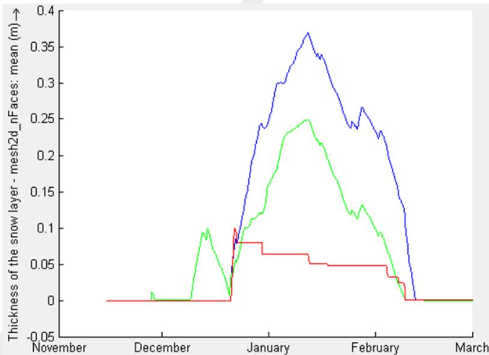

**Table 16.3:** ice quantities on map- and his-files

| long name                                            | name on file      | units             | dimensions    |
|------------------------------------------------------|-------------------|-------------------|---------------|
| Sea surface height of open water                     | ice_s1            | m                 | mesh2d_nFaces |
| Lower surface height of ice cover                    | ice_zmin          | m                 | mesh2d_nFaces |
| Upper surface height of ice cover                    | ice_zmax          | m                 | mesh2d_nFaces |
| Fraction of the surface area covered by floating ice | ice_area_fraction | -                 | mesh2d_nFaces |
| Thickness of floating ice cover                      | ice_thickness     | m                 | mesh2d_nFaces |
| Pressure exerted by the floating ice cover           | ice_pressure      | N m <sup>-2</sup> | mesh2d_nFaces |
| Temperature of floating ice cover                    | ice_temperature   | K                 | mesh2d_nFaces |
| Thickness of the snow layer                          | snow_thickness    | m                 | mesh2d_nFaces |
| Thickness of the snow layer                          | snow_temperature  | kelvin            | mesh2d_nFaces |

## 17 Bubble screens in D-Flow FM


**Note:** Modelling of bubble screens in D-Flow FM is of TRL level 4-6 (prototype), with the definitions of the Technical Technology Readiness Levels (TRL) in Section 2.7.


**Note:** Application of bubble screens should be combined with keyword `VertadvTypmom=3` for discretization of vertical advection in the momentum equations in D-Flow FM. Using the default setting for this keyword (i.e. `VertadvTypmom=6`) will result in very small time steps and thus very long computation times. Moreover, checkerboarding of model results is likely to occur.


**Note:** Editing bubble screens in D-Flow FM isn't possible yet in the D-Flow FM GUI. The model input for bubble screens therefore has to be added manually; see Section 17.4 for a description of the required input files for bubble screens.

A so-called bubble screen can be modelled by D-Flow FM. Bubble screens are constructions that inject air in a water system and are located at the bottom (or higher). This results into a bubble plume in which water, heat and dissolved substances are mixed and transported towards the free water surface. In practice, this bubble induced circulation can be applied to suppress unwanted phenomena such as algae growth. Bubble screens can be used in nearly stagnant and non-stratified or very strongly stratified water systems, such as lakes and reservoirs. For other applications we recommend to contact the Delft3D helpdesk for further advice whether bubble screens can be applied or not.

We distinguish between a single nozzle bubble plume (axisymmetric) and a bubble screen, i.e. a (2D) line bubble plume. For a single nozzle bubble plume we rely on the analysis and experiments of Milgram (1983) in a 50 m deep non-stratified reservoir as well as on the experiments of Fannelop and Sjoen (1980) in reservoirs with a water depths of about 2.8 m and 9 m, respectively. The injected air flux in these experiments ranges from 0.024 to 0.590 m<sup>3</sup>/s under normal atmospheric conditions. Figure 17.1 shows the general concept of a bubble plume created by air injected from a single nozzle. The bubble plume is about 20% narrower than the plume of entrained water (Milgram, 1983).

An example of the use of bubble screens is Lake Nieuwe Meer in The Netherlands; see <https://www.rijnland.net/over-rijnland/wat-doet-rijnland/in-uw-buurt/de-nieuwe-meer/>. For many years in the summer months algae blooms occurred. The Microcystis bacterium dominated the lake in these periods. This caused an unpleasant smell and other inconveniences, for example for water recreation. To suppress the algae blooms, in 1993, the Water Board Rijnland started artificial mixing of Lake Nieuwe Meer by means of air bubbling. A system of seven bubble screens, in the form of perforated air tubes through which air was pumped, were put at the bottom of the lakes at different positions. This artificial mixing removed the thermal stratification and consequently the inconvenience caused by the algae.

Figure 17.2 presents the definitions of the near-, mid- and far-field of the bubble screen and the associated horizontal length scales in relation to the axis of the bubble plume. The near-field and mid-field circulation due to a bubble screen is modelled in D-Flow FM via the so-called subgrid approach. The far-field circulation, however, is computed by D-Flow FM.

In practice, a bubble screen is applied to increase the vertical recirculation in a water system in order to break-down stratification of salinity or temperature. We note, however, that in D-Flow FM a bubble screen can also be applied without any substances in the model schematisation.

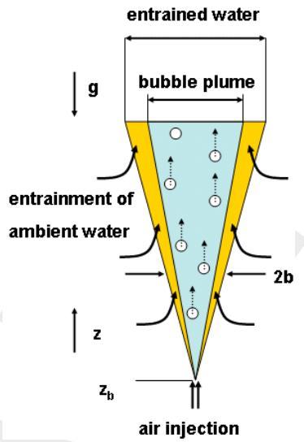

Figure 17.1: Schematic axisymmetric bubble plume with entrainment of water by the rising bubbles

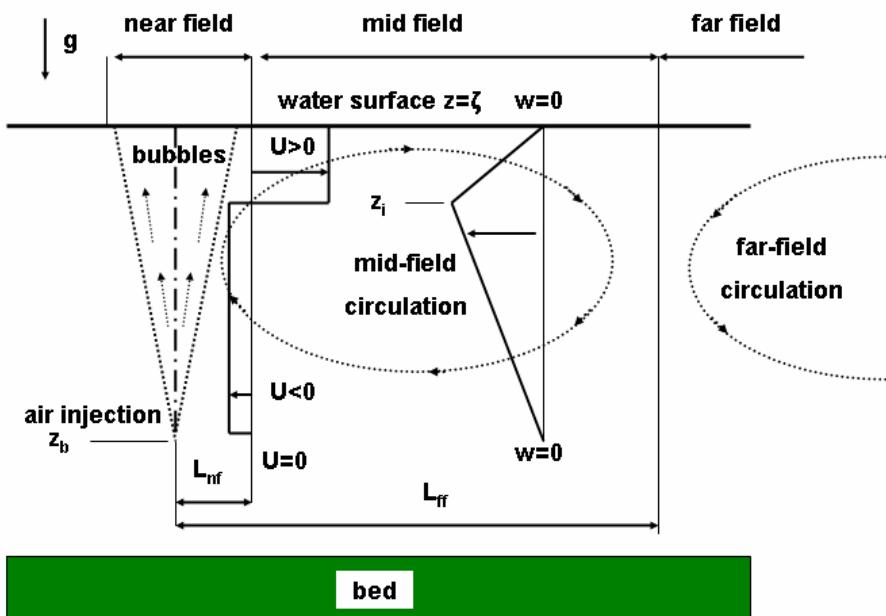

Figure 17.2: Definition of near-, mid- and far-field of the circulation induced by a bubble screen and the vertical profile of the vertical (downward) velocity in the mid-field circulation cell

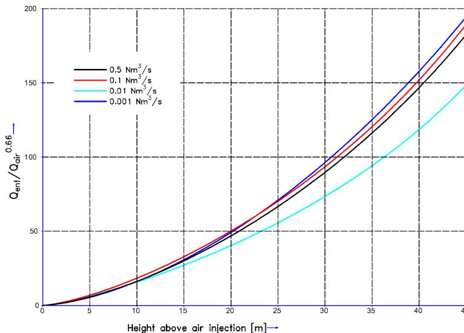

**Figure 17.3:** Flux of entrained water as function or air flow under atmospheric conditions and height above the nozzle in stagnant non-stratified water based on experiments in (Milgram, 1983)

**The injected air flux is given in  $[\text{Nm}^3/\text{s}]$  where  $N$  stands for normal atmospheric conditions.**

- ◇ In D-Flow FM the bubble screen functionality is only available for 3D modelling. So, it can not be applied in a 2D (depth-averaged) model.

### 17.1 Entrained water as function of the air injection

For a bubble screen in D-Flow FM the user has to specify the water flux entrained by a bubble-plume and not the amount of air that is injected in the water system. This section presents engineering rules for both a single nozzle axisymmetric bubble plume and a (2D) line bubble plume. Conversion factors between the flux of entrained water and the amount of injected air are given. The user doesn't take into account these conversion factors when specifying input values for bubble screens in D-Flow FM (see 17.4).

#### 17.1.1 Single nozzle bubble plume

For a single nozzle plume we use an engineering rule for the ratio between the flux of entrained water and the amount of injected air that is based on Figure 17.3. In the experiments by Milgram (1983) it was shown that the flux of entrained water  $Q_{ent}$  in  $[\text{m}^3/\text{s}]$  scales with the injected air flux  $Q_{air}$  in  $[\text{m}^3/\text{s}]$  to the power of 0.66.

Based on Figure 17.3 for single nozzle bubble plumes, in D-Flow FM a conversion factor  $\alpha$  of 1000 is applied between the amount of entrained water and the amount of injected air in a D-Flow FM model with bubble screens, using:

$$Q_{ent} = (\alpha Q_{air})^{0.66} \quad (17.1)$$

On input, the user only has to specify the amount of injected air. Thus, this amount should not be multiplied with a conversion factor of 1000, because this is already carried in the computational kernel of D-Flow FM.

### 17.1.2 A single nozzle bubble plume versus a line bubble plume

Although not supported in D-Flow FM, in this section the theory for bubble screens as line plumes will be described. In this case we rely on Bulson (1961) who flooded an entire ship dock, located a 20 m long perforated horizontal pipe on its bed, varied the water depths from 2.8 to 11 m and varied the air injection. In vertical and horizontal sections the vertical and horizontal velocity profiles were measured and reported by Bulson (1961). The injected air fluxes ranged from  $0.0046 \text{ (m}^3\text{/s)/m}$  to  $0.15 \text{ (m}^3\text{/s)/m}$  at the considered water depths.

By using a semi-empirical approach, Bulson defined the entrained water flux  $Q_{ent}$  by a bubble screen with an air flux of  $Q_{air}$  air flux over a perforated tube of length  $L_{tube}$  at depth  $H_{inj}$  by

$$Q_{ent} = 0.47 H_{atm} L_{tube}^{\frac{2}{3}} (g Q_{air})^{\frac{1}{3}} \left( \frac{H}{H + H_{inj}} \right)^{\frac{1}{3}} \ln \left( \frac{H + H_{inj}}{H} \right) \quad (17.2)$$

As stated earlier, Equation (17.2) is our second engineering rule, next to Equation (17.1). However, this engineering rule isn't applied in D-Flow FM. Nevertheless, these two equations show that more or less the same conversion factor for single nozzle bubble screens and for line bubble plumes can be applied, namely a conversion factor  $\alpha$  of about 1000 between the entrained water flux and the injected air.

### 17.1.3 Bubble plume in stagnant stratified water

Depending on the air flux and stratification conditions, a bubble plume can experience one or more so-called plunge points where the entrained water flows away horizontally and above which the bubbles create a new plume, see McDougall (1978) and Asaeda and Imberger (1992). Figure 17.4 contains an illustration in which a bubble plume is applied for the destratification of a lake. The right graph of Figure 17.4 shows that the typical entrainment increases towards the water surface in a thermally stratified lake, where usually the hypolimnion has a uniform lower temperature. The entrainment water flux  $Q_{ent}$  (see Figure 17.4) of hypolimnion water cools the epilimnion and this process is simulated in D-Flow FM.

The engineering rules of the previous paragraphs can be applied to the case of Figure 17.4, but the entrained water flux should be based on the typical height of the thermocline (separating hypolimnion from epilimnion) above the nozzle. This is our third engineering rule. If additional application specific assistance is required, please contact the Delft3D helpdesk.

## 17.2 Theory

Bubble-induced circulation patterns are often based on the following characteristics:

1. 1 The water entrained in the bubble plume is diverted laterally into a horizontal flow.
2. 2 The rising bubbles drag along water and transfer their potential energy to kinetic energy of the entrained water.
3. 3 Upon reaching the water surface, this kinetic energy is first converted into an increase in potential energy i.e. the level of the water surface increase above the rising bubble plume.
4. 4 Subsequently, this locally increased water level induces a horizontal, lateral current away from the vertical symmetry axis/plane of the bubble plume. This lateral current forms another jet that also entrains water from below.
5. 5 The latter is a secondary entrainment that creates a large amplification factor compared to the injected air flow.
6. 6 Experiments of 2D bubble screens show that the lateral, horizontal jet initially has a thickness that is roughly 20–25 % of the injection depth (see " $U > 0$ " in Figure 17.2).
7. 7 The conversion from kinetic energy of the rising flow into potential energy (local surface elevation) and the latter converted into horizontal flow implies that the initial momentum in

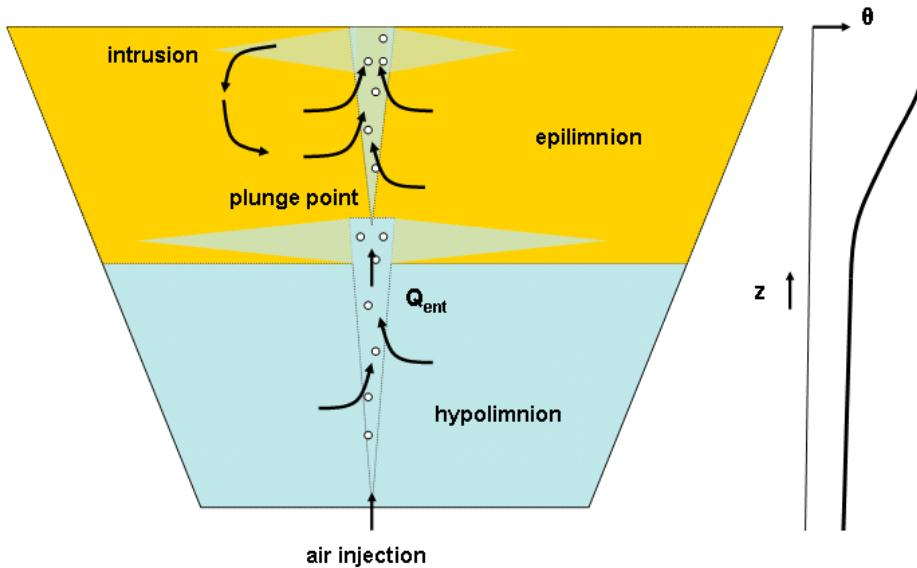

**Figure 17.4:** Schematic overview of the introduction of cold hypolimnion water into the lower part of the warmer epilimnion by a bubble plume. Above the first plunge point the second plunge point creates an intrusion and recirculation inside the epilimnion.

the lateral jet equals the momentum of the entrained water in the rising jet.

Based on the above-mentioned characteristics, it is evident that for simulating the bubble-induced recirculation patterns the vertical water flow due to the rising bubble jet should be taken into account. Therefore, in D-Flow FM we apply the approach of redistributing of sinks and sources in a certain water column for simulation bubble screens. Because of these changes in vertical flow, the horizontal flow is influenced as well.

In the remainder of this section we will describe the conceptual model for bubble screens for a 1DV (1-Dimensional Vertical) situation. The equation for the transport of heat content  $H$  is considered and reduced to its application in the 1DV model including recirculation of cooling water as well as by the recirculation by a bubble screen. The heat content  $H$  is defined by

$$H = \rho c_p(T + 273.15) \quad (17.3)$$

The Reynolds-averaged version of the conservation equation of heat in an incompressible fluid reads

$$\frac{\partial H}{\partial t} + \frac{\partial uH}{\partial x} + \frac{\partial wH}{\partial z} = \frac{\partial}{\partial z} \left( D_v \frac{\partial H}{\partial z} \right) + Q \quad (17.4)$$

The right-hand side in Equation (17.4) contains the most dominant contribution to diffusion i.e. vertical diffusion with the sum of molecular and eddy diffusivity, the latter due to mixing by turbulent fluid motions.  $Q$  represents the local or distributed heat source or sink.

For application in numerical codes, the contribution due to horizontal advection should be taken into account. Below, this is derived for the recirculation induced by a bubble screen. To that purpose, we consider Equation (17.4) without additional heat sources or sinks and without any diffusion terms. It then reduces to the following conservation equation

$$\frac{\partial H}{\partial t} + \frac{\partial uH}{\partial x} + \frac{\partial wH}{\partial z} = 0 \quad (17.5)$$

Near and in the bubble screen the fluid moves upward. We define this fluid volume as the near-field. Its horizontal extent from the centre of the plume is defined by  $L_{nf}$ , see Figure 17.2. Adjacent to the near field, we define the mid-field encompassing the recirculation induced by the near-field. In this mid-field, the fluid has a downward velocity profile. This mid-field ends at some remote distance from the near field. This distance is defined as  $L_{ff}$ , see Figure 17.2. We remark that this represents the distance from the bubble plume to the mid-field/far-field interface. By definition, at the transition from mid-field to the far-field the velocity contributions due to recirculation vanish (i.e.  $u(L_{ff}) = w(L_{ff}) = 0$ ). Subsequently, the far-field is affected by vertical profiles of temperature.

We assume a profile is presented with a downward velocity increasing in magnitude to some level  $z_i$  and then decreasing to zero at the level  $z = z_b$  at which the bubbles are released, see also Figure 17.2. The question is how this recirculation of heat can be represented in the 1DV-version of Equation (17.5). To that purpose, we introduce the horizontal averaging operator

$$\overline{(\dots)}^{mf} = \frac{1}{L_{ff} - L_{nf}} \int_{L_{nf}}^{L_{ff}} (\dots) dx \quad (17.6)$$

We define this as a mid-field averaging operator based on the transition length  $L_{nf}$  from near field to mid field as well as to the transition  $L_{ff}$  from the mid field to the far field. At the mid field to far field transition, by definition  $u(x = L_{ff}) = 0$  and  $w(x = L_{ff}) = 0$  hold. Now, we derive a model for the mid-field recirculation and this model aims at its application in a 1DV model or a 3D hydrostatic-pressure (shallow-water) model. The horizontal velocity in the mid-field and at some distance  $L$  from the plume's centre line follows from the mass conservation equation for incompressible fluid (Equation (17.5) with  $H = 1$  m; take the integral  $\int_{L_{ff}}^L dx$ )

$$\frac{\partial u}{\partial x} + \frac{\partial w}{\partial z} = 0 \quad (17.7)$$

Using the definition  $u(L_{ff}) = 0$ , inserting Equation (17.6) into Equation (17.7) yields

$$u(L) = (L_{ff} - L) \frac{\partial w}{\partial z}^{mf} \quad (17.8)$$

Equation (17.8) shows a positive horizontal velocity i.e. directed away from the bubble plume for positive vertical velocity gradient such as the profile above the level  $z = z_i$ . Below the level  $z = z_i$  to the injection point level  $z = z_b$  we have the opposite situation with a negative horizontal velocity and a negative vertical velocity gradient. Figure 17.2 shows an example of the vertical profile of the vertical (downward) velocity and the related horizontal velocity profile according to Equation (17.8).

Similarly, we consider the mid-field average of the horizontal advection of heat, which reads

$$\frac{\partial u H}{\partial x}^{mf} = - \frac{(u H)_{L_{nf}}}{L_{ff} - L_{nf}} \quad (17.9)$$

The mid-field average operator defined by Equation (17.6) and applied to Equation (17.5) while using (Equation (17.9)) yields

$$\frac{\partial H}{\partial t}^{mf} + \frac{\partial w H}{\partial z}^{mf} = \frac{(u H)_{L_{nf}}}{L_{ff} - L_{nf}} \quad (17.10)$$

After substitution of Equation (17.8) in Equation (17.10), we arrive at

$$\frac{\partial \bar{H}^{mf}}{\partial t} + \frac{\partial \bar{w} \bar{H}^{mf}}{\partial z} = H(L_{nf}, z, t) \frac{\partial \bar{w}^{mf}}{\partial z} \quad (17.11)$$

The result Equation (17.11) shows that the mid-field-averaged effect of the recirculation, induced by the bubble plume, can be represented by a vertically distributed heat source/sink. Equation (17.2) is a significant step towards a model for the mid-field effect applicable in 1DV or 3D shallow-water codes. This source/sink distribution represents the lateral inflow or outflow of water at the near field – mid field transition, see Figure 17.2. The vertically distributed heat source/sink is positive above the level  $z = z_i$  of maximum downward velocity, negative below this level and zero below the level  $z = z_b$  of the injection of the bubbles, which is also shown in Figure 17.2.

The total depth-integrated heat content of the water body is not changed by the bubble plume. Consequently, the depth-integral of the right-hand side of Equation (17.11) yields zero. The latter constraint requires the integral of the distributed heat source above  $z = z_i$  equals the sum of the distributed heat sinks below  $z = z_i$ , thus

$$\int_{z_i}^{\zeta} H(L_{nf}, z, t) \frac{\partial \bar{w}^{mf}}{\partial z} dz = - \int_{z_b}^{z_i} H(L_{nf}, z, t) \frac{\partial \bar{w}^{mf}}{\partial z} dz \quad (17.12)$$

We note that the heat content  $H(L, z, t)$  below  $z_i$  is transported toward the bubble plume i.e. flowing out of the mid-field volume  $x > L_{nf}$ , see also Equation (17.8). Therefore, the following is a reasonable approximation

$$\text{for } z < z_i : H(L_{nf}, z, t) = \bar{H}^{mf} \quad (17.13)$$

because to  $x = L_{nf}$  the heat content from the mid field is transported passively. Equation (17.13) is the first model assumption about the near field action. With Equation (17.13) and introducing a representative far-field vertical velocity  $\bar{w}^{mf}$ , Equation (17.11) can be written as

$$\text{for } z < z_i : \frac{\partial \bar{H}^{mf}}{\partial t} + \frac{\partial \bar{w}^{mf} \bar{H}^{mf}}{\partial z} = \bar{H}^{mf} \frac{\partial \bar{w}^{mf}}{\partial z} \quad (17.14)$$

Note that Equation (17.14) is a non-conservative form of the advection equation

$$\text{for } z < z_i : \frac{\partial \bar{H}^{mf}}{\partial t} + \bar{w}^{mf} \frac{\partial \bar{H}^{mf}}{\partial z} = 0 \quad (17.15)$$

For discretisation on a vertically staggered grid, Equation (17.14) is preferred above Equation (17.15).

Using the conservation requirement Equation (17.12), the heat content  $H_b$  yields

$$H_b = \frac{1}{\bar{w}^{mf}(z_i)} \int_{z_b}^{z_i} H(L_{nf}, z, t) \frac{\partial \bar{w}^{mf}}{\partial z} dz \quad (17.16)$$

In Equation (17.16), note that  $\bar{w}^{mf}(z_i)$  is the maximum vertical velocity and negative but also the vertical gradient of the vertical velocity in the integral is negative below  $z_i$ .

Substitution of the constraint Equation (17.16) into Equation (17.11) yields for the level above  $z_i$ :

$$\text{for } z \geq z_i : \quad \frac{\partial \bar{H}^{mf}}{\partial t} + \frac{\partial \bar{w}^{mf} \bar{H}^{mf}}{\partial z} = H_b \frac{\partial \bar{w}^{mf}}{\partial z} \quad (17.17)$$

Summarizing, the 1DV version of the equation for heat content including recirculation by a bubble plume reads

$$\frac{\partial \bar{H}^{mf}}{\partial t} + \frac{\partial \bar{w}^{mf} \bar{H}^{mf}}{\partial z} = Q \quad (17.18)$$

in which the distributed source/sink  $Q$  is defined by:

$$Q = \begin{cases} \bar{H}^{mf} \frac{\partial \bar{w}^{mf}}{\partial z} & z_b < z < z_i \\ H_b \frac{\partial \bar{w}^{mf}}{\partial z} & z_i \leq z < \zeta \end{cases} \quad (17.19)$$

### 17.3 Numerical implementation

In this section several aspects of the numerical implementation of bubble screens are described. Equation (17.19) is applied to a single horizontal grid box containing the air injection or a segment of a line injection of air. Vertically, the grid box is divided into computational layers, see Figure 17.5. In this figure only the six top layers are shown. In this example only these six layers are influenced by a bubble screen and not the layers that are deeper in the water column.

For a consistent and mass-conserving implementation we start by defining a vertical distribution of water-volume sources  $q_k$  with  $k$  representing the layer numbering from the air injection point at layer  $l$  to the free surface with layer number  $k_{surf}$ . The physical dimensions of  $q_k$  are in [1/s] because of the introduction of volume flux [ $\text{m}^3/\text{s}$ ] per volume [ $\text{m}^3$ ] of water. By definition of the circulation of the water dragged along with the rising bubble, this vertical source distribution must be zero. Otherwise, extra mass is generated, which is not physical. This condition for mass conservation can be written as

$$\sum_{k=1}^{k_{surf}} q_k \Delta z_k = 0 \quad (17.20)$$

in which the discharges  $q_k$  are defined according to

$$q_k = \frac{\partial \bar{w}^{mf}}{\partial z} \quad (17.21)$$

The vertical velocity then follows from vertically integrating the continuity equation and in discretised form this integral reads:

$$w_k = \sum_{k=1}^k \left\{ q_k \Delta z_k - \left( \frac{\partial u}{\partial x} + \frac{\partial v}{\partial y} \right) \Delta z_k \right\} \quad (17.22)$$

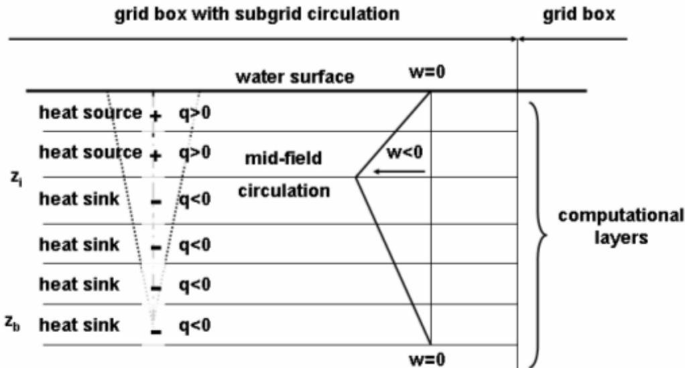

**Figure 17.5:** The mid field averaged heat equation with vertical distribution of sources/sinks and vertical (downward) velocity profile and the model equation applied to a single grid box.

Although Equation (17.20) and Equation (17.22) suggest a reverse procedure, in the implementation in D-Flow FM  $q_k$  is determined by a given vertical profile of the vertical velocity averaged over the mid-field (Figure 17.2). The vertical velocity follows a profile as shown in Figure 17.5 and also depends on the amount of injected air. Given this  $q_k$ -distribution with the constraint Equation (17.20), Equation (17.22) yields the vertical velocity that is used in the heat transport equation.

The discrete version of constraint Equation (17.20), indicating that the vertically integrated heat sources are zero, reads:

$$H_b \sum_{k_i}^{k_{surf}} q_k \Delta z_k + \sum_{k=1}^{k_i-1} H_k q_k \Delta z_k = 0 \quad (17.23)$$

for which in the layers with a sink holds that

$$\text{for } z < z_i : \left( \frac{\partial H}{\partial t} + \frac{\partial H u}{\partial x} + \frac{\partial H v}{\partial y} + \frac{\partial H w}{\partial z} \right)_k \Delta z_k = H_k q_k \Delta z_k \quad (17.24)$$

The  $z$ -independent heat content  $H_b$ , defined by Equation (17.23), is used in the heat transport equation for computational levels above the inversion of the vertical velocity. In other words, in the layer with a source term due to a bubble screen (with  $q_k > 0$ ) we have

$$\text{for } z \geq z_i : \left( \frac{\partial H}{\partial t} + \frac{\partial H u}{\partial x} + \frac{\partial H v}{\partial y} + \frac{\partial H w}{\partial z} \right)_k \Delta z_k = H_b q_k \Delta z_k \quad (17.25)$$

Summarizing, the application of bubble screens leads to a redistribution of water masses in a water column. This is illustrated in Figure 17.5. From the layer at which the bubble injection starts till some distance from the free water surface, water and heat is rejected, which is modelled via a sink term. In the upper layers of the water column this water and heat is discharged into the water column via a source term. This is done in such a way that *conservation of mass* and *conservation of heat* is guaranteed.

## 17.4 Input description


**Note:** The User Interface of D-Flow FM is not able yet to generate and visualize input data for bubble screens. Therefore, this has to be done manually.

In this section is described how the D-Flow FM input should be extended in order to simulate bubble screens. The input format is based on the so-called new external forcing format; see [section C.6.3](#) for additional information. This consists of the following three steps:

- ◇ A polyline file (.pli format) specifies the horizontal position of the single nozzle bubble screen or a line bubble screen. The location of bubble screens is prescribed via a polyline for each bubble screen. This can be either located in one computational cell or it can be connected to multiple computational cells; see [Figure 17.6](#).
- ◇ A timeseries file specifies the air discharge rate over time via a so-called <bc> file (ASCII); see [Section C.5](#) for details on the bc-format.
- ◇ A [bubblescreen] block in the external forcings file (.ext format) includes the polyline file, the timeries file, the zLevel, and the id of the bubblescreen; see [Section C.6.3](#) for details on the new external forcing format.

An example for the location of two bubble screens is shown below, which starts with the location of the bubble screens (in file with name bubble\_screens.pli).

```
bubblescreen1
        2                                     2
116039.985                                     482719.588
116157.302                                     482555.625bubblescreen2
        4                                     2
116142.617                                     482844.277
116183.123                                     482844.277
116253.296                                     482755.842
116279.347                                     482663.490
```

Next, the time dependent air injection is specified via a bc-file (with name bubble\_screens.bc), which is of the form:

```
[General]
fileVersion                                 = 1.01
fileType                                    = boundConds[Forcing]
name                                        = bubblescreen1
function                                    = timeSeries
timeInterpolation                            = linear
quantity                                    = time
unit                                        = seconds since 2006-01-01 00:00:00
quantity                                    = bubblescreen_discharge
unit                                        = m3/s
0                                                 = m3/s
86400                                        = 1.5[Forcing]
name                                        = bubblescreen2
function                                    = timeSeries
timeInterpolation                           = linear
quantity                                    = time
```

```
unit                                         = seconds since 2006-01-01 00:00:00
quantity                                     = bubblescreen_discharge
unit                                         = m3/s
0                                             = m3/s
86400                                         = 2.8
```

Finally, the new external forcing file contains all above described items in the ext-file, including the vertical position of the air injection via keyword `zLevel`, while the `<id>` represents the name of a bubble screen:

```
[General]
fileVersion=2.02
fileType=extForce[bubblescreen]
id=bubblescreen1
locationFile=bubble_screens.pli
zLevel=-25.0
discharge=bubble_screens.bc[bubblescreen]
id=bubblescreen2
locationFile=bubble_screens.pli
zLevel=-20.3
discharge=bubble_screens.bc
```

Instead of using a polyline file for specifying the location of a bubble screen, also (x,y) coordinates can be used. Then, the example above is specified as follows:

```
[General]
fileVersion=2.02
fileType=extForce[BubbleScreen]
id = bubblescreen1
numCoordinates = 2
xCoordinates = 116039.985 116157.302
yCoordinates = 482719.588 482555.625
zLevel = -15
discharge = bubblescreen.bc[BubbleScreen]
id = bubblescreen2
numCoordinates = 4
xCoordinates = 116142.617 116183.123 116253.296 116279.347
yCoordinates = 482844.277 482844.277 482755.842 482663.490
zLevel = -13
discharge = bubblescreen.bc
```

As explained above bubble screen polylines can be more than one computation cell wide. If so, then the air injection flux is subdivided proportionally over the cell areas of all involved computational cells. An example of this is shown in Figure 17.6.

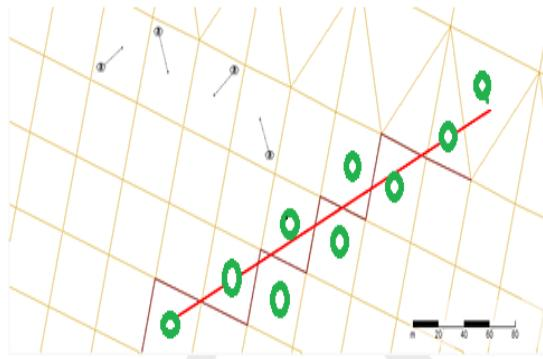

**Figure 17.6:** Illustration of grid snapping of a bubble screen polyline

### 17.5 Coupling with water quality module D-Water Quality

The Deltares' water quality module D-Water Quality is able to accurately compute the effect of bubble screens on the water circulation. So, offline coupled simulations with D-Flow FM and D-Water Quality are possible for models with bubble screens. It is noted that bubble screens will become available in D-Flow FM per release 2027.01 (November 2026). Thus, older releases of D-Flow FM do not contain the functionality of bubble screens.

### 17.6 Model results

In this section the application of bubble screens in D-Flow FM is illustrated via a simple test basin. A small basin of 10 by 10 grid points in the horizontal direction is used with only boundaries and a uniform depth of 10 m. Initially, the temperature decreases linearly from 20 °C at the surface to 10 °C near the bed (see blue line in Figure 17.7). When no bubble screen is present, the vertical temperature distribution won't change over time. In case of a bubble screen with the injection point at  $z = -5$  m, the temperature of the water above this injection point is well-mixed (see red line in Figure 17.7). Below the air injection point, the initial vertical temperature distribution remains almost unchanged.

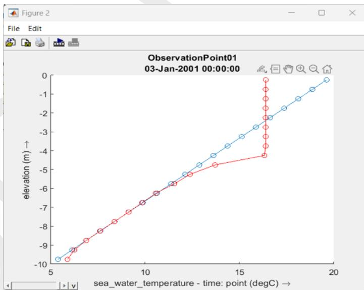

**Figure 17.7:** Initial temperature profile (blue) and after application of a bubble screen at  $z = -5$  m (red line). On horizontal axis the temperature (in  $^{\circ}\text{C}$ ) and on the vertical axis the vertical position in the water column (in m).

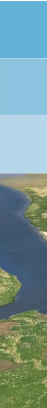

## 18 Coupling to external models via Basic Model Interface (BMI)

This chapter is on the *coupling* of hydrodynamics to external models. When running a coupled model the DIMR program takes care of the exchange of data between components, and each component will be addressed using BMI calls. Section 18.1 contains the technical details of the D-Flow FM implementation of the BMI.

The other sections of this chapter go into more detail for a specific external model: coupling with D-Waves in section 18.6, coupling to D-RTC in section 18.7, and coupling to D-SLE (Sea Lock Exchange) in section 18.8.

### 18.1 BMI interface to interact with the D-Flow FM model state

The D-Flow FM kernel shared library offers an API that implements the Basic Model Interface (BMI). The BMI allows one to initialize, run, and finalize a model component via standardized interface calls; furthermore it allows one to get and set various quantities such that model components can dynamically react to the computed results. General details on the BMI can be found in Peckham *et al.* (2013). This section discusses some of the D-Flow FM specifics.

Many variables in D-Flow FM's model state can be inquired and changed via BMI calls. Setting a variable can be done via a call to `set_var(varname, userdata)`, which copies the data from the `userdata` array to the D-Flow FM memory associated with the `varname` variable. Alternatively, one may use a call to `get_var(varname, xptr)`, which returns a pointer to the requested variable, and directly assign new values to the D-Flow FM memory from outside the running simulation. The latter approach may be faster because less data needs to be copied.

### 18.2 DIMR and the BMI

The DIMR program takes care of the exchange of data between components, and each component will be addressed using BMI calls. The data to be exchanged is defined in the `<dimr.xml>` configuration file, under the `<dimrConfig><coupler><item>` elements. More details on DIMR can be found in Deltares (2026).

The variable names specified there need to be supported by the addressed component. For instance, for the coupling to D-RTC (see Section 18.7) typically scalar quantities need to be exchanged that are defined at specific locations (such as observation points or structures). Since BMI only identifies variables by a unique variable name without any location selection, D-Flow FM identifies both location and quantity by introducing *compound* variable names (not to be confused with a compound structure). A compound variable name takes the form:

```
varname = "groupname/locationid/fieldname"
```

For example the variable name "weirs/Lith01/CrestLevel" will select the crest level at the weir named "Lith01".

The `groupname` part of the variable name identifies the location or object type. Currently known group names are listed below. Unless noted otherwise, please check Section 18.3 for the list of quantities supported for those groups of locations.

- ◊ pumps
- ◊ weirs
- ◊ gates

- ◇ general structures
- ◇ source sinks
- ◇ observations (observation points, see Section 18.4)
- ◇ cross sections (observation cross sections, see Section 18.4)
- ◇ laterals (see Section 18.5)

The locationid part of the variable name is the unique identifier of the intended object. More details on the specific identifier used can be found in the subsequent sections on the various object groups. The fieldname identifies the quantity at the selected location. Which quantities are supported depends on the groupname.

### 18.3 BMI access to hydraulic structure data in D-Flow FM

To access quantities defined at structures use a compound variable name as explained in Section 18.2. The locationid part of the compound variable name is, for hydraulic structures, equal to the id key in the structure input file (Table C.23). Which quantities can be addressed via the BMI, depends on the structure type indicated by the groupname. Table 18.1 lists the supported field names for each hydraulic structure group.

**Table 18.1:** Supported compound variable fields for hydraulic structures in D-Flow FM via BMI.

| Group name         | Field name           | Access     | Remark                                                                            |
|--------------------|----------------------|------------|-----------------------------------------------------------------------------------|
| pumps              | Capacity             | read-write | Only for non-staged pumps. Prescribed capacity, not necessarily actual discharge. |
|                    | weirs                | CrestLevel | read-write                                                                        |
| gates              | CrestLevel           | read-write |                                                                                   |
|                    | GateHeight           | read-write |                                                                                   |
|                    | GateLowerEdgeLevel   | read-write |                                                                                   |
|                    | GateOpeningWidth     | read-write |                                                                                   |
| general structures | CrestLevel           | read-write |                                                                                   |
|                    | GateHeight           | read-write |                                                                                   |
|                    | GateLowerEdgeLevel   | read-write |                                                                                   |
|                    | GateOpeningWidth     | read-write |                                                                                   |
| longculverts       | ValveRelativeOpening | read-write |                                                                                   |
|                    | source sinks         | Discharge  | read-write                                                                        |
|                    | ChangeInSalinity     | read-write | Prescribed change, not necessarily actual change.                                 |
|                    | ChangeInTemperature  | read-write | Prescribed change, not necessarily actual change.                                 |

**18.4 BMI access to observations in D-Flow FM**To access quantities defined at observation points and observation cross sections use a compound variable name as explained in Section 18.2. The `locationid` for observation points should match the `name` specified in the relevant input file (See Section E.2.2). All observation point names must be unique when accessing the data via BMI. The same holds for the `locationid` for observation cross sections (See Section E.2.4).

Table 18.2 lists the supported field names for each observation group. All supported variables/fields are read-only, evidently, as observations are only 'observing' the flow. Typically, these variables are used as input to hydraulic triggers in an RTC-coupling.

**Table 18.2: Supported compound variable fields for observations in D-Flow FM via BMI.**

| Group name    | Field name                      | Access    | Remark                                       |
|---------------|---------------------------------|-----------|----------------------------------------------|
| observations  |                                 |           |                                              |
|               | <code>water_level</code>        | read-only | Observation points                           |
|               | <code>water_depth</code>        | read-only |                                              |
|               | <code>velocity</code>           | read-only |                                              |
|               | <code>discharge</code>          | read-only |                                              |
|               | <code>salinity</code>           | read-only | Only when salinity transport is on.          |
|               | <code>temperature</code>        | read-only | Only when temperature transport is on.       |
|               | <code>&lt;tracername&gt;</code> | read-only | Only when that named tracer is in the model. |
| crosssections |                                 |           |                                              |
|               | <code>discharge</code>          | read-only | Space-integrated along cross section.        |
|               | <code>velocity</code>           | read-only | Space-averaged along cross section.          |
|               | <code>water_level</code>        | read-only | Space-averaged along cross section.          |
|               | <code>water_depth</code>        | read-only | Space-averaged along cross section.          |

**Remarks:**

- ◇ In 3D models, BMI access to 3D quantities is currently still very rudimentary. D-Flow FM's BMI API provides a pointer to the *first* layer. This means that for sigma models, the value at the bottom layer is returned. For z-layers this will only be the actual bottom layer value if that particular location has its bed level in layer number 1. For shallower locations where layer number 1 is inactive, only a dummy fill value is returned.
- ◇ When using `get_var()` a pointer is returned, which allows reading values in higher layers (using offset "layer index  $\times$  8 bytes"). This requires expert knowledge; it is not available in DIMR-based couplings.
- ◇ This holds for salinity, temperature, `<tracername>` and also velocity and discharge.

**18.5 BMI access to forcings in D-Flow FM**To access quantities defined as local forcings (currently only lateral discharges) use a compound variable name as explained in Section 18.2. The `locationid` for lateral discharges should match the `id` specified for them in the external forcings input (See Section C.6.3.2). Table 18.3 lists the supported field names for each forcing group.

**Table 18.3:** Supported compound variable fields for forcings in D-Flow FM via BMI.

| Group name | Field name                | Access     | Remark                                                                                                     |
|------------|---------------------------|------------|------------------------------------------------------------------------------------------------------------|
| laterals   |                           |            |                                                                                                            |
|            | water_discharge           | read-write | Prescribed discharge, not necessarily actual discharge (when negative).                                    |
|            | water_level               | read-only  | Water level, averaged value over the nodes in the lateral.                                                 |
|            | water_volume              | read-only  | Total water volume per layer, for each lateral.                                                            |
|            | water_discharge_per_layer |            |                                                                                                            |
|            |                           | read-write | Prescribed discharge, distributed over the layers.                                                         |
|            | incoming/<constituent>    | read-write | Concentration of a transported quantity in incoming direction, array with 1 value per layer.               |
|            | outgoing/<constituent>    | read-only  | Concentration of a transported quantity in outgoing direction, averaged value over the lateral, per layer. |

**Remark:**

- ◇ <constituent> can be water\_salinity, water\_temperature or <tracername>.

**18.6 Coupling with D-Waves (SWAN)**This section is on the *coupling* of hydrodynamics and waves. Full documentation on D-Waves is available in its own User Manual; this section is limited to the details of running coupled flow-wave models, and the physical interaction processes between the two of them.

**Restriction:**

- ◇ D-Flow FM runs integrated with D-Waves provided that only triangles or quadrangles are applied in the D-Flow FM model grid. In case of pentagons or hexagons a coupling with D-Waves isn't possible.

We remark that a coupled flow-wave model always consists of the combination of a hydrodynamic model with an unstructured grid (D-Flow FM) coupled to a wave model with a structured grid (SWAN). D-Flow FM cannot be coupled yet to a wave model with a unstructured grid (for example UNSWAN).

**18.6.1 Getting started**With respect to waves, *offline* and *online* results into:

1. 1 *offline*: First, a separate D-Waves computation is executed, resulting in a communication file (com-file) containing wave data. Then a D-Flow FM computation is executed, using the wave data from the com-file.
2. 2 *online*: D-Flow FM computations are alternated with D-Waves calculations. D-Flow FM writes flow data to the com-file, D-Waves uses this flow data for the wave calculation and writes wave data to the com-file. D-Flow FM uses the updated wave data.

file prescribes the mode and when the D-Flow FM computation should be paused to perform a D-Waves calculation. From within the working directory, the following run-scripts in the installation directory can be called:

◇ On Windows:

<Your installation base dir>\x64\bin\run\_dimr.bat

◇ On Linux:

<Your installation base dir>/lnx64/bin/run\_dimr.sh

◇ On Windows, a computation with D-Flow FM in parallel using MPI:

<Your installation base dir>\x64\bin\run\_dimr\_parallel.bat

◇ On Linux, submitting a job on the Deltares cluster (sequential and parallel):

<Your installation base dir>/lnx64/bin/submit\_dimr.sh

This script can be used for clusters outside Deltares too, but system specific modifications will be needed.


**Note:** Example models, with run scripts, are included in the (open source) code. After registering yourself at <https://oss.deltares.nl/>, you can have a look at: [https://svn.oss.deltares.nl/repos/delft3d/trunk/examples/12\\_dflowfm/test\\_data/e100\\_f02\\_c02-FriesianInlet\\_schematic\\_FM\\_wave](https://svn.oss.deltares.nl/repos/delft3d/trunk/examples/12_dflowfm/test_data/e100_f02_c02-FriesianInlet_schematic_FM_wave)

### 18.6.2 Input D-Flow FM

Optionally add the following lines to the .mdu file:

```
[numerics]
Epshu           = 0.05  # Input for threshold water depth for wet and dry cells
[waves]
Wavemodelnr    = 3       # Wave model nr, 0=no, 1=fetch/depth limited hurdlestive,
                        2=youngverhagen, 3 = D-Waves, 4=wave group forcing
Rouwav           = FR84
Gammax           = 1.0       # Maximum wave height/water depth ratio
waveSwartDelwaq = 0       # Communicate bed shear stress to D-Water Quality.
                        0=Parametrization WCI Soulsby (1997) using Rouwav;
                        1=linear sum taucur+tauwav;
                        2=morphological bed shear stress. Default 0.[output]
ComInterval = 1200.                              # (Fixed) Interval with which the wave
                                                        communication file is written for
                                                        wavemodelnr=3. Default: dtuser
ComOutputTimeVector = compoints.ctv                   # File with number of
                                                        prefixed communication
                                                        timepoints, only for wavemodelnr=3EulerVelocities = 1                                   # 0 (default): GLM, 1: Euler.
Only relevant when using waves
```

Description:

| Wavemodelnr     | Key switch to enable wave modelling. Use “3” for wave data from D-Waves (online or offline) and passing hydrodynamic data to D-Waves (online only). A file will be generated automatically named <“runid”_com.nc> to exchange data. |
|-----------------|-------------------------------------------------------------------------------------------------------------------------------------------------------------------------------------------------------------------------------------|
| Rouwav          | Necessary to include bed shear-stress enhancement by waves. See also Delft3D-FLOW manual.                                                                                                                                           |
| EulerVelocities | Optional flag to write Eulerian velocities to the D-Flow FM map file. Currently, only Eulerian values will be written for the cell centre veloc-                                                                                    |

- Epshu ity x-component and y-component (parameters ucx and ucy). Check that the "long\_name" contains the word "Eulerian".  
  Optionally overwrite the default value of "1.0e-4". Depending on your model, the default value of Epshu in combination with modelling waves may lead to huge local velocities near (almost) dry points. This will result in very small time steps. Increasing Epshu might be a reasonable workaround.
- Gammax Optionally overwrite the default value of "1.0". Depending on your model, the default value of Gammax may lead to huge local velocities in shallow water. Decreasing Gammax might be a reasonable workaround.
- waveSwartDelwaq Optional flag to communicate bed shear stresses from Delft3D-FLOW to D-Water Quality. Possible values are 0, 1 or 2. Only applicable if `wavemodelnr>0`. The default is set to 0. If `waveSwartDelwaq` equals 0, the bed shear stress is taken from the flow model. In practice, this means that the wave-current interaction is parametrized according to (Soulsby, 1997) and the resulting bed shear stress is communicated to D-Water Quality. A simpler approach is obtained using `waveSwartDelwaq` equal to 1. In that case, the shear stress that is communicated is the linear sum of the bed shear stress due to currents and the shear stress due to waves. In case of `waveSwartDelwaq` equal to 2, the maximum shear stress over the wave cycle (Soulsby, 1997) is communicated.
- ComInterval Optional entry to set the interval with which the communication file to D-Waves is written. When this is not specified, the communication file is written with DtUser intervals. Can be specified as an array: interval, start time, stop time in seconds since RefDate. Not compatible with ComOutputTimeVector.
- ComOutputTimeVector Optional entry to the file (.ctv) containing fixed time points to write the communication file for the online wave coupling. Can be used in combination with varying DIMR communication time points (Section 18.6.4). Time points in seconds since RefDate. Not compatible with ComInterval.

### 18.6.3 Input D-Waves

Optionally add the following lines to the .mdw file:

| [Output]              |                                  |
|-----------------------|----------------------------------|
| MapWriteNetCDF        | = true                           |
| COMFile               | = ../fm/dflowfmoutput/fff_com.nc |
| NetCDFSinglePrecision | = false                          |
| locationFile          | = ../fm/loo_obs.xyn              |
| writeTable            | = true                           |

#### Description:

- MapWriteNetCDF Default value "false", resulting in no output written in netCDF format. The coupling with D-Flow FM is only implemented for netCDF format, so this flag must be set to "true" when being coupled with D-Flow FM.
- COMFile Necessary reference to the file being used to communicate data to and from D-Flow FM. The name must exactly match with the name of the com-file being generated by D-Flow FM.

|              | NetCDFSinglePrecision                                                                                                                                                                     | Optional flag to write data in single precision instead of double precision. Default value is “false”. Might be useful to decrease the size of the com-file or to compare with a Delft3D-FLOW computation. |
|--------------|-------------------------------------------------------------------------------------------------------------------------------------------------------------------------------------------|------------------------------------------------------------------------------------------------------------------------------------------------------------------------------------------------------------|
| locationFile | Optional reference to observation points in D-Flow FM. When in combination with the “writeTable” flag, D-Waves will produce a history file in netCDF format for these observation points. |                                                                                                                                                                                                            |
| writeTable   | Optional flag to force SWAN to produce an output file in table format for each set of locations specified in a locationFile. Default value is “false”.                                    |                                                                                                                                                                                                            |

### 18.6.4 Input DIMR

Both D-Flow FM and D-Waves are used as dynamic libraries (DLL's on Windows, so's on Linux). DIMR is a small executable steering both dynamic libraries. Its input file, usually called “dimr\_config.xml”, looks like this:

```
<?xml version="1.0" encoding="iso-8859-1"?>
<dimrConfig xmlns="http://schemas.deltares.nl/dimrConfig"
                    xmlns:xsi="http://www.w3.org/2001/XMLSchema-instance"
                    xsi:schemaLocation="http://schemas.deltares.nl/dimrConfig"
                    http://content.oss.deltares.nl/schemas/d_hydro-1.00.xsd">
<documentation>
                    <fileVersion>1.00</fileVersion>
                    <createdBy>Deltares, Coupling team</createdBy>
                    <creationDate>2015-05-20T07:56:32+01</creationDate>
                    </documentation>                    <control>
                    <parallel>
                                <startGroup>
                                                    <time>0.0 60.0 99999999.0</time>
                                                    <coupler name="flow2rtc"/>
                                                    <start name="myNameRTC"/>
                                                    <coupler name="rtc2flow"/>
                                                    </startGroup>
                                                    <startGroup>
                                                    <time>0.0 3600.0 99999999.0</time>
                                                    <start name="myNameWave"/>
                                                    </startGroup>
                                                    <start name="myNameDFlowFM"/>
                                                    </parallel>
                    </control>                    <component name="myNameDFlowFM">
                                                    <library>dflowfm</library>
                                                    <process>0 1 2</process>
                                                    <mpiCommunicator>DFM_COMM_DFMWORLD</mpiCommunicator>
                                                    <workingDir>fm</workingDir>
                                                    <inputFile>weirtimeseries.mdu</inputFile>
                                                    <setting key="verbose" value="INFO"/>
                    </component>
                    <component name="myNameWave">
                                                    <library>wave</library>
                                                    <process>0</process>
                                                    <workingDir>wave</workingDir>
                                                    <!-- component specific -->
                                                    <inputFile>weir.mdw</inputFile>
                    </component>
                    <component name="myNameRTC">
                                                    <library>RTCTools_BMI</library>
                                                    <process>0</process>
                                                    <workingDir>rtc</workingDir>
                                                    <!-- component specific -->
                                                    <inputFile>.</inputFile>
```

```
</component><coupler name="flow2rtc">
    <sourceComponent>myNameDFlowFM</sourceComponent>
    <targetComponent>myNameRTC</targetComponent>
    <item>
        <sourceName>observations/Upstream/water_level</sourceName>
        <targetName>input_ObservationPoint01_water_level</targetName>
        </item>
    </coupler>
    <coupler name="rtc2flow">
        <sourceComponent>myNameRTC</sourceComponent>
        <targetComponent>myNameDFlowFM</targetComponent>
        <item>
            <sourceName>output_weir_crest_level</sourceName>
            <targetName>weirs/weir01/crest_level</targetName>
        </item>
    </coupler>
</dimrConfig>
```

#### Description:

- <control> Specifies the workflow of the deltaresHydro executable. It indicates which components are started in which order. If the data transfer is to be arranged by the main program DIMR, then a coupler should be included. The main <control> block is a sequential block; this means that each component is initialized, time stepped, and finalized before the next component starts. For each component/coupler listed inside the <control> block there will be a corresponding component/coupler specification block defined below.
- <parallel> Within a <parallel> tag the components are started concurrently (if the mpi process id's listed per component don't overlap) or executed synchronously in sequence (first all initialize, then time stepping, and to conclude all finalization calls). The order of the components is retained.
- <start> A <parallel> block contains exactly one <start> component, defining the start and end time of the simulation. This is the component inside the <parallel> block with the smallest time step and can be denoted as the "master-component". All other components must be defined with a <startGroup> and can be denoted as a "slave-component".
- <startGroup> A <startGroup> should be used if a component (possibly including couplers) should only be executed at a subset of simulation time steps.
- <time> Start-, step- and stop-time (in seconds) at which this slave-component should be executed. The times are relative to the times of the master-component. Thus a start-time of 0.0 always refers to the start time of the master-component and a stop-time of "infinity" always refers to the end time of the master-component.

*Alternative:* Instead of specifying start-, step- and stop-time it is also an option to specify the name of a tim-file containing all times for which this slave-component should be executed. Example line in file "dimr\_config.xml":

```
<time>wave_computations.tim</time>
```

Example content of file "wave\_computations.tim":

```
10800.0
14400.0
16200.0
```

#### Restrictions:

- ◇ The times in the tim-file must be in increasing order
- ◇ The times in the tim-file are relative to the times of the master-component
- ◇ The tim-file must contain at least 3 times

---

**<component name="myComponentName">** Component specification block. "myComponentName" is free to be defined by the user. It must match exactly with the reference in the <control> block above. The name of a component must be unique.

**<library>** Reference to the component to be executed. Currently "flowfm", "wave" and "FBCTools\_BMI" are supported. The name must match exactly the name of the related dll/so (excluding prefixes (e.g. "lib") and suffixes (e.g. ".dll" or ".so")). The library should be located in the search path, or it may include an absolute or relative path. Multiple <component> blocks may refer to the same component to be executed.

**<process>** Optional list of the ids of the mpi processes that should be used to run the component. If not specified, then the component will run only in process "0" (i.e. non-parallel). The processes may be specified as a space separated list with series compressed using colons e.g. "16:31" represents processes "16 17 18" up to "31".

**<mpiCommunicator>** D-Flow FM specific flag. Mandatory only when this D-Flow FM component should run a parallel (partitioned) model. Note that this is *unrelated* to the <parallel> tag as introduced above.

**<workingDir>** Specification of the working directory of this <component>, relative to the location of the "dimr\_config.xml" file. The workingDir is the base/root directory of all input and output files for the component. All other files will be located RELATIVE TO this folder. If not specified, then workingDir will be equal to the folder of the configuration file.

**<inputFile>** Specification of the input file of this <component>, relative to <workingDir>: D-Flow FM: mdu-file, D-Waves: mdw-file, D-RTC: .

**<coupler name="myCouplerName">** Coupler specification block. "myCouplerName" is free to be defined by the user. It must match exactly with the reference in the <control> block above. The name of a coupler must be unique.

**<sourceComponent>** Identifies which component provides the data.

**<targetComponent>** Identifies which component needs to receive the data. The coupler runs on the superset of the processes configured for the source and target components.

**<item>** For each quantity to be exchanged, the name in the source component and the name in the target component are specified. To support recursive components, a directory syntax is used with forward slashes. If a name includes a forward slash, then it needs to be escaped using a backward slash, like \;; if a name includes a backward slash, then it needs to be escaped with a backward slash, like \\.

**<sourceName>** Identifies which parameter will be sent at the source component side.

**<targetName>** Identifies which parameter will be received at the target component side.

**<setting>** DIMR way to provide the command line options in the form of key - value pairs. Currently only support for the keys processlibrary, bloomspecies and verbose.

**18.6.5 Online process order**When D-Flow FM runs online in alternation with D-Waves and D-RTC, process steps can be identified, where the order as prescribed in "dimr\_config.xml" is respected as much as possible. The process order of the example "dimr\_config.xml" file in the section above is:

1. 1 D-Flow FM : : Init  
   D-Flow FM is initialized. Grid- and Flow-data is written to the netCDF com-file.  
   Even though D-Flow FM is not the first component in the example config-file, it must be the first component to be initialized, because the initialization results may be needed when other components are initialized. This is implemented as an exceptional rule: The master-component is always the first component to be initialized.
2. 2 D-RTC : : Init  
   D-RTC is initialized using (only) D-RTC input. Data from other components is not initialized yet; default values are used.
3. 3 D-Waves : : Init  
   D-Waves is initialized. Grid- and Flow-data created by D-Flow FM : : Init is read from the com-file. Grid conversion factors are generated. The factors for the conversion from the (structured!) wave grid to the (unstructured) flow grid are calculated inside D-Waves. The factors for the conversion from the (unstructured) flow grid to the (structured) wave grid are calculated by "ESMF\_RegridWeightGen" via the execution of script <ESMF\_-RegridWeightGen\_in\_Delft3D-WAVE.bat> (Windows) or <ESMF\_RegridWeightGen\_in\_-Delft3D-WAVE.sh> (Linux).
4. 4 D-RTC : : Step  
   A D-RTC computation is performed at time "0.0": Data is communicated (by DIMR) from D-Flow FM to D-RTC, the actual D-RTC computation is executed, data is communicated (by DIMR) from D-RTC to D-Flow FM.
5. 5 D-Waves : : Step  
   A D-Waves calculation is performed at time "0.0": Flow data is read (by D-Waves) from the com-file and converted to the wave grid(s). SWAN input files are written, a SWAN calculation is started by executing script <swan.bat> (Windows) or <swan.sh> (Linux), SWAN output files are read, wave-data is converted to the flow grid and written to the com-file (by D-Waves).
6. 6 D-Flow FM : : Step  
   A D-Flow FM calculation is performed: The com-file is checked for wave data to be used/updated. The simulation time will proceed from "0.0" to "60.0" (next time that another component should be executed). Flow-data is written to the com-file (by D-Flow FM).
7. 7 D-RTC : : Step, D-Flow FM : : Step  
   A D-RTC computation is performed after every "60.0" seconds. Then a D-Flow FM computation is performed and the simulation time will proceed another "60.0" seconds. This continues until the simulation time has progressed for "3600.0" seconds.
8. 8 D-RTC : : Step, D-Waves : : Step, D-Flow FM : : Step  
   A D-RTC computation is performed, then a D-Waves computation, then a D-Flow FM computation. The simulation time will proceed another "60.0" seconds and the next D-RTC computation can start.
9. 9 D-RTC : : Finish  
   D-RTC is finished at the end of the simulation.
10. 10 D-Waves : : Finish  
    D-Waves is finished at the end of the simulation.
11. 11 D-Flow FM : : Finish  
    D-Flow FM is finished at the end of the simulation.

### 18.6.6 Related files

Below is an overview of the related files in the default directory structure. In this example the runid is set to `foo`.

```
<testcaseroot>
  dimr_config.xml Configuration file, input for DIMR
  <fm>              Work directory for D-Flow FM
    foo.mdu          D-Flow FM input file
  <dflowfmoutput> D-Flow FM output directory
    foo_com.nc Communication file, written/read by both D-Flow FM and D-Waves
  <rtc>             Work directory for D-RTC
    settings.json D-RTC input file (must have exactly this name)
  <xml_dir>        D-RTC directory containing xml input/output files and csv output file
  <xsd_dir>        D-RTC directory containing xsd input files
  <wave>           Work directory for D-Waves
    foo.mdw          D-Waves input file
  TMP_ESMF*_source.nc Temporary input file for ESMF_Regridder, created by D-Waves
  TMP_ESMF*_destination.nc Temporary input file for ESMF_Regridder, created by D-Waves
  TMP_ESMF*_weights.nc Resulting weights file, created by ESMF_Regridder, read by D-Waves
  PET0.RegridWeightGen.Log ESMF_Regridder log file
  swn-diag.foo SWAN log file
```

### 18.6.7 SWAN output file as input to D-Flow FM

**Note:** This is of TRL level 1-3 (concept), with the definitions of the Technical Technology Readiness Levels (TRL) in Section 2.7.


Instead of coupling D-Flow FM to D-Waves, a SWAN output file, in NetCDF format, can be used. Space and time varying data can be read and used as input. Currently this method can be used to add (wave related) bed shear stress to the D-Water Quality simulation inside D-Flow FM, and to add wave forcing and bed shear stress contributions to a 2DH D-Flow FM model (`wavemodelnr = 7`).

#### *Passing information to D-Water Quality*

Currently, the following input specification is accepted in the `ExtForceFile` and the `.mdu` file:

Example old style `ExtForceFile`:

```
  * comments
  * comments  QUANTITY                                                       = wavesignificantheight
  FILENAME                                                       = swanout.nc
  VARNAME                                                               = sea_surface_wave_significant_height
  FILETYPE                                                               = 11
  METHOD                                                                   = 3
  EXTRAPOLATION_METHOD                                                  = 1
  OPERAND                                                                  = 0  QUANTITY                                                                      = waveperiod
  FILENAME                                                                   = swanout.nc
  VARNAME                                                                        = tps
  FILETYPE                                                                   = 11
  METHOD                                                                         = 3
```

```
EXTRAPOLATION_METHOD = 1
OPERAND                = 0
```

Where the quantities (wavesignificant height and waveperiod) are dictated by D-Flow FM and the varnames (sea\_surface\_wave\_significant\_height and tps) are chosen by SWAN in its NetCDF output file.

Example lines in .mdu file:

```
[waves]
Wavemodelnr          = 7      # 0: none,
                          1: fetch/depth limited hurdlestive,
                          2: Young-Verhagen,
                          3: SWAN via D-Waves,
                          5: uniform,
                          7: SWAN-NetCDFRouwav                  = FR84
FlowWithoutWaves       = true # True: Do not use Wave data in the flow computations,
                                it will only be passed through to D-WAQWaveSwartDelwaq       = 1
```

Currently, only the combination of parameters in the example above is tested.

**Note:** An example model, with run scripts, is included in the (open source) code. After registering yourself at <https://oss.deltares.nl/>, you can have a look at: [https://svn.oss.deltares.nl/repos/delft3d/trunk/examples/12\\_dflowfm/test\\_data/FriesianInlet\\_schematic\\_SWAN\\_nc/FM](https://svn.oss.deltares.nl/repos/delft3d/trunk/examples/12_dflowfm/test_data/FriesianInlet_schematic_SWAN_nc/FM)

**Note:** The previous example used to require Wavemodelnr = 6. This mode has now been merged with Wavemodelnr = 7. If you specify Wavemodelnr = 6 in the mdu-file, this will be automatically adjusted for you.

#### Forcing flow in D-Flow FM

Depending on the [waves] waveforcing keyword, different wave quantities are required to be specified in the (old-style) external forcing file (Table 18.4) in case you want to use offline wave information to force the flow. For every Waveforcing value, *every* variable needs to be present in the ExtForceFile for the functionality to work. Note that you have to provide the variable name of the significant wave height together with the wave direction in order to interpolate the directions correctly. You can do this as follows:

Example lines in .mdu file:

```
[waves]
Wavemodelnr           = 7
Rouwav                 = FR84
Waveforcing           = 1
```

Example lines in (old-style) .ext file:

```
QUANTITY                                             = wavedirection
FILENAME                                            = output_swan2D_permuted.nc
VARNAME                                            = sea_surface_wave_from_direction sea_surface_wave_significant_height
FILETYPE                                            = 11
METHOD                                              = 3
EXTRAPOLATION_METHOD                              = 1
OPERAND                                            = 0QUANTITY                                             = waveperiod
FILENAME                                            = output_swan2D_permuted.nc
VARNAME                                            = tm01
FILETYPE                                            = 11
METHOD                                              = 3
EXTRAPOLATION_METHOD                              = 1
OPERAND                                            = 0QUANTITY                                             = wavesignificantheight
FILENAME                                            = output_swan2D_permuted.nc
VARNAME                                            = sea_surface_wave_significant_height
FILETYPE                                            = 11
METHOD                                              = 3
EXTRAPOLATION_METHOD                              = 1
OPERAND                                            = 0QUANTITY                                             = xwaveforce
FILENAME                                            = output_swan2D_permuted.nc
VARNAME                                            = eastward_wave_force
FILETYPE                                            = 11
METHOD                                             = 3
EXTRAPOLATION_METHOD                              = 1
OPERAND                                            = 0QUANTITY                                             = ywaveforce
FILENAME                                            = output_swan2D_permuted.nc
VARNAME                                            = northward_wave_force
FILETYPE                                            = 11
METHOD                                            = 3
EXTRAPOLATION_METHOD                             = 1
OPERAND                                            = 0
```

In this way, the change in momentum due to the presence of waves can be accounted for by using the spatial radiation stress gradients ( $waveforcing=1$ ), the total dissipation ( $waveforcing=2$ ), or by distributing the wave pressure forces over the water column ( $waveforcing=3$ ). This is explained in section 3.8.

### 18.6.8 Parallel computations

See section 8.4 for running D-Flow FM in parallel using MPI via DIMR. When running a coupled D-Flow FM and D-Waves computation, SWAN is doing the actual wave computation. D-Waves takes care of the communication, synchronization and interpolation between D-Flow FM and SWAN using files.

By default the OpenMP version of SWAN is used and SWAN will start as many threads as there are cores on the computational node being used. The user can change the number of threads by specifying environmental parameter OMP\_NUM\_THREADS\_SWAN in the command box executing the computation, e.g. on Windows:

```
set OMP_NUM_THREADS_SWAN=4
```

**Table 18.4:** Entries in ExtForceFile for use with wavemodel 7. The entries in the Varname column that should be present in the NetCDF file depend on the Waveforcing value in the .mdu file.

| Waveforcing | Quantity                        | Varname                                        |
|-------------|---------------------------------|------------------------------------------------|
| 1           | wavedirection                   | theta0                                         |
|             | waveperiod                      | sea_surface_wave_from_direction                |
|             | waveheight                      | any valid period field                         |
|             | waveforce                       | sea_surface_wave_significant_height            |
|             | waveforce                       | eastward_wave_force                            |
| 2           | wavedirection                   | theta0                                         |
|             | waveperiod                      | sea_surface_wave_from_direction                |
|             | waveheight                      | any valid period field                         |
|             | totalwavedissipation            | sea_surface_wave_significant_height            |
|             | total_energy_dissipation        | total_energy_dissipation                       |
| 3           | wavedirection                   | theta0                                         |
|             | waveperiod                      | sea_surface_wave_from_direction                |
|             | waveheight                      | any valid period field                         |
|             | waveforce                       | sea_surface_wave_significant_height            |
|             | waveforce                       | eastward_wave_force                            |
|             | wavebreakerdissipation          | northward_wave_force                           |
|             | whitecappingdissipation         | depth_induced_surf_breaking_energy_dissipation |
|             | whitecapping_energy_dissipation |                                                |

```
export OMP_NUM_THREADS_SWAN=4
```

When D-Flow FM runs in parallel using MPI, the wave configuration is not changed: there's still one instance of D-Waves taking care of the communication, synchronization and interpolation between multiple D-Flow FM instances and the OpenMP version of SWAN. The D-Flow FM instances might be spread over multiple computational nodes. Both D-Waves and SWAN will run on the main/first node. At some point, the single D-Waves instance will become the performance bottleneck in computations in which both D-Flow FM runs in parallel (using MPI, possibly on multiple nodes) and SWAN runs in parallel (using OpenMP on the main node only). There is no workaround yet.

Alternatively, it is possible to run SWAN as a library inside multiple D-Waves MPI instances, see section 18.6.10 for instructions. Then both D-Flow FM and SWAN will run in parallel using MPI, but all D-Waves tasks (communication, synchronization, interpolation) are still performed by the single master instance. Then, advantages are:

- ◇ On some clusters a performance issue might occur, see section 18.6.9. This issue can be circumvented with this approach.
- ◇ The performance might increase since all nodes reserved for the computation are used both the D-Flow FM computation and the SWAN computation.

**Table 18.5:** Example computation times of a testcase coupling D-Flow FM (parallel MPI) with SWAN (parallel OMP/MPI)

|                          | # cores | # FM partitions | # SWAN partitions | Wall clock time | Resource waste |
|--------------------------|---------|-----------------|-------------------|-----------------|----------------|
| Assumed optimal          | 4       | 4 MPI           | 4 OMP             | 5.5             | 323%           |
| Over allocated resources | 8       | 4 MPI           | 4 OMP             | 1.3             | 100%           |
| Workaround               | 4       | 4 MPI           | 4 MPI             | 2.1             | 62%            |
| Assumed ideal situation  | 4       | 4 MPI           | 4 OMP             | 1.3             | 0%             |

And a disadvantage and restriction is:

- ◇ The MPI parallelization of SWAN is performing not as well as the OpenMP implementation.

### 18.6.9 Check efficiency of parallel FLOW-WAVE computation

In parallel FLOW-WAVE computations, D-Flow FM is using MPI and SWAN is using OpenMP by default. When the D-Flow FM instances are carrying out computations, then the SWAN processes are idle and vice versa. It might occur that idle D-Flow FM instances occupy 100% of the cores, blocking them from being used by the SWAN threads. It can occur both on Windows and Linux, but this does not show up in the Delft3D 4 Suite. [section 18.6.10](#) contains a workaround based on running SWAN as a library in D-Waves, using MPI. This section describes how to check whether you are hitting this problem.

Carry out two test runs:

1. 1 Assumed optimal usage  
   Use for example a 4 core machine for a D-Flow FM simulation with 4 MPI partitions, running online with D-Waves, with `export OMP_NUM_THREADS_SWAN=4`, forcing `SWAN_OMP` to use 4 threads. When D-Flow FM is computing, SWAN is idle and D-Flow FM can use the 4 cores. When SWAN is computing, D-Flow FM is idle and should not use the 4 cores.
2. 2 Over allocated resources  
   Use for example a 8 core machine for the exact same computation (D-Flow FM with 4 MPI partitions, `export OMP_NUM_THREADS_SWAN=4`).

Expected results:

1. 1 If everything works as it should, the runtimes of both simulations should be similar (within a few percentages of difference).
2. 2 If you're hitting the above mentioned issue, the second computation is significantly faster than the first. The workaround in [section 18.6.10](#) might be useful.

Noted that Table 18.5 shows computation times on the Deltares cluster of an example testcase. Behaviour will vary depending on hardware, software and model specification.

**18.6.10 Run SWAN as a library inside D-Waves with MPI**This alternative might circumvent the performance problem described in section 18.6.8 and section 18.6.9. To run SWAN as a library inside multiple D-Waves MPI instances, apply the following two changes to your input files:

1. 1 In the DIMR configuration file, include in the fields for the wave component the following two tags:
   - ◇ `<process>`
     - listing all processes in which to run D-Waves/SWAN.
   - ◇ `<mpiCommunicator>`
     - specifying the name of the D-Waves mpi communicator variable that should always read `engine_comm_world`.

Example (with 5 MPI partitions):

```
component name="myNameWave">
<library>wave</library>
<workingDir>wave</workingDir>
<inputFile>f34.mdw</inputFile>
<process>0 1 2 3 4</process>
<mpiCommunicator>engine_comm_world</mpiCommunicator>
</component>
```

1. 2 In the mdw configuration file specify in the [General] block:

```
SwanMode = lib
```

Remarks:

- ◇ All data exchange, synchronization and interpolation between D-Flow FM and SWAN is (still) done by the master instance of D-Waves in a sequentially manner, being a potential scalability bottleneck.
- ◇ All (nested) SWAN domains will run on the same number of processes.
- ◇ This alternative also works when D-Waves runs standalone, without D-Flow FM. However, then it is necessary that DIMR is used to start the computation.
- ◇ In case you need to modify the SWAN input file after D-Waves has prepared it: this is still possible.

**18.7 Coupling with D-RTC (FBC-Tools)**This section is on the *coupling* of hydrodynamics and real-time control — more specific: feed-back control — of hydraulic structures.

**18.7.1 Introduction**A coupled flow-rtc model can be run either as an Integrated Model from within the D-Flow FM User Interface, or from the commandline using the DIMR program (Deltares Integrated Model Runner).

In case of a flow-rtc coupling

- ◇ the flow model will exchange for example *Water levels*
- ◇ subsequently, the rtc model will prescribe for example the *Crest level* of a controlled structure, based on the exchanged *water levels*
- ◇ in case of an *online* coupling this *Crest level* will influence the hydrodynamic simulation.

## 18.7.2 Getting started

### 18.7.2.1 User interface: the first steps

First, the user must add a *real-time control* model to the *flow-fm* model. The **Project** window will look like this.

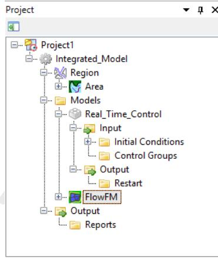

*Figure 18.1: An Integrated model in the Project window*

Secondly, the user will model the control flow for an hydraulic structure. This may look like this.

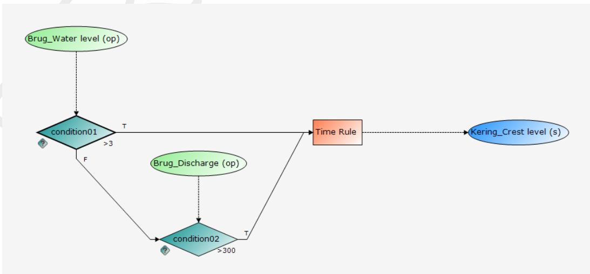

*Figure 18.2: Example of a Control flow in D-RTC*

Full documentation on D-RTC is available in its own User Manual. This section is limited to the details of running coupled flow-rtc models.

### 18.7.2.2 Input D-Flow FM

The hydraulic structures that are normally driven by scalar values or time series in `<*.bc>` files, will now be fed by D-RTC. Replace the timeseries file name by the `realtime` keyword in the `<structures.ini>` file (Appendix C.13):

```
[Structure]
type           = weir                                                            # Type of structure
id                 = weir01                                                          # Name of the structure
locationFile      = weir01.pli                                                    # *.pli; Polyline geometry definition for 2D structure
crestLevel         = realtime                                                          # Crest level in [m]
```

Also, the MDU file may optionally contain an observation file and/or a cross section file, such that D-RTC's triggers can be set to respond to the computed values at these locations.

```
[output]
ObsFile           = obs.xyn
CrsFile           = river_crs.pli
```

### 18.7.2.3 Input D-RTC

The input of D-RTC consists of several `<*.xml>` files and a toplevel `<settings.json>`. We refer to the D-RTC User Manual (Deltares, 2026d) for further details.

### 18.7.2.4 Input DIMR

In Section 18.6.4, details on a coupled flow-rtc-wave model are presented. This can serve as an example for a flow-rtc coupling, by leaving out all wave-related fragments.

### 18.7.2.5 Online process order

This is discussed in Section 18.6.5 for a coupled flow-rtc-wave model. This can serve as an example for a flow-rtc coupling, by leaving out all wave-related fragments.

## 18.8 Coupling with module for Sea Lock Exchange

### 18.8.1 Introduction

The Wanda-Locks software suite of Deltares is available for the simulation of salt intrusion in sea locks, and it can be coupled to Delft3D-FLOW via the COSUMO toolbox. However, this results into very computationally intensive simulations. Therefore, another approach has been developed that is much less computationally demanding, called D-SLE. D-Flow FM can be coupled to the "Sea Lock Exchange" software program of Deltares, which is called the "Zeesluisformulering" in Dutch. The D-SLE software is available in Python and as a C-library and has been applied to many sea locks. The technical documentation of D-SLE can be found at <https://libzsf.readthedocs.io/en/latest/theory/index.html>.

Based on the water level and the salinity concentration at lateral locations, discharges 'from sea to lake' and 'from lake to sea' are computed by the D-SLE. In D-Flow FM these discharges are modelled via laterals. The sea lock itself is represented in the D-Flow FM model area as a closed or dry area, as illustrated in Figure 18.3.

### 18.8.2 Coupling of D-Flow FM with D-SLE

A coupled D-Flow FM-D-SLE model can be run as an Integrated Model from within the D-Flow FM User Interface, or from a command prompt using the DIMR program (Deltares Integrated Model Runner).

In case of a coupled D-Flow FM-D-SLE model

- ◇ the D-Flow FM model and the D-SLE model exchange water discharge and salinity through *laterals*.
- ◇ the D-Flow FM model provides boundary conditions to the D-SLE model, i.e. water level and salinity at the lake and sea sides. The D-SLE model will in turn provide lateral input to the D-Flow FM model, i.e. the discharge extracted from and the discharge and salinity deposited to the lake and sea.
- ◇ laterals in D-Flow FM may consist of multiple grid cells. All exchanged data is aggregated into a single value per lateral before the exchange with D-SLE.
- ◇ in case of 3D models the exchange of water and salinity can be subdivided over multiple layers.
- ◇ it is advised to specify different lateral locations for inflow and outflow at both sides of the sea lock, to prevent unphysical mixing in the D-Flow FM model. This results into four laterals per sea lock.

### 18.8.3 Passive constituents and temperature

#### 18.8.3.1 Introduction

In addition to salinity, D-SLE supports the transport of *passive constituents* and temperature through the sea lock. Passive constituents (e.g. tracers, sediment concentrations) are transported by the same water volumes computed by the salt intrusion model but do not influence the density or flow field. Because of this, their transport behavior can be calculated using a simple volume mass balance approach, without the need to solve additional transport equations. While temperature is an input for the salt intrusion model and does influence density, it afterwards also behaves as a passive constituent.

The required DIMR keys for temperature and passive constituents are listed in Section 18.8.4, together with a full configuration example.

#### 18.8.3.2 Configuration in the D-SLE ini file

The initial concentrations of temperature and salinity inside the lock at the start of the simulation are specified in the D-SLE ini file using the following keyword:

```
[sealock]
id                                       = sealock_A
initial_salinity_lock                     = 10.0
initial_temperature_lock                  = 6.0
```

Currently, specifying initial constituent concentrations in the lock is only supported for temperature, but support for additional passive constituents can be added later if there is a user demand.

### 18.8.3.3 Transport calculation

The transport of passive constituents simply follows from a volume mass balance, using the water discharges computed by the salt intrusion model. However this is calculated differently in the two transport modes of D-SLE, and also differs from the salinity transport during a flush-with-doors-closed phase, as described below.

#### 18.8.3.3.1 Cycle-average mode

In cycle-average mode, D-SLE derives a salinity mixing fraction for each output side, representing the proportion of sea water in the outflow:

$$f = \frac{S_{\text{out}} - S_{\text{lake}}}{S_{\text{sea}} - S_{\text{lake}}}, \quad (18.1)$$

where  $S_{\text{out}}$  is the salinity computed by D-SLE for that output side. The same fraction is applied to every passive constituent:

$$c_{\text{out}} = c_{\text{lake}} + f(c_{\text{sea}} - c_{\text{lake}}). \quad (18.2)$$

This is analytically exact for passive tracers at hydrodynamic steady state: the sea-water fraction in the outflow is a purely hydraulic property, so any passive tracer follows it linearly. When  $S_{\text{sea}} = S_{\text{lake}}$ , the fraction defaults to zero and all constituents output the lake-side boundary value.

#### 18.8.3.3.2 Phase-wise mode

In phase-wise mode, constituent transport uses a volume mass balance on the lock chamber for each phase. For the levelling and gate-open phases (routines 1–4), the post-phase lock concentration is:

$$c_{\text{lock,new}} = \frac{c_{\text{lock}} V_{\text{before}} + c_{\text{lake}} V_{\text{from lake}} + c_{\text{sea}} V_{\text{from sea}} - c_{\text{lock}} V_{\text{to lake}} - c_{\text{lock}} (V_{\text{to sea}} - V_{\text{flush}}) - c_{\text{lake}} V_{\text{flush}}}{V_{\text{after}}}, \quad (18.3)$$

where  $V_{\text{flush}}$  is the flushing passthrough volume: water that traverses the lock from lake to sea without mixing, entering and exiting at the lake boundary concentration. The outflow concentration to the lake equals the pre-phase lock concentration; the outflow concentration to the sea is the volume-weighted average of the lock and passthrough contributions.

#### 18.8.3.3.3 Flush-with-doors-closed (routine $< 0$ )

During a flush-with-doors-closed phase, the lock volume is constant (doors remain closed) and a pump forces water from the lake through the lock to the sea. Passive constituents are modelled using an analytical continuously stirred tank reactor (CSTR) model:

$$c_{\text{lock}}(t) = c_{\text{lake}} + (c_{\text{lock},0} - c_{\text{lake}}) e^{-\lambda t}, \quad \lambda = \frac{Q}{V_{\text{lock}}}, \quad (18.4)$$

where  $c_{\text{lake}}$  is the lake-side boundary concentration,  $c_{\text{lock},0}$  is the constituent concentration in the lock at the start of the phase,  $Q$  is the flushing discharge and  $V_{\text{lock}}$  is the lock volume. The decay rate  $\lambda = Q/V$  is always positive, ensuring the constituent always converges towards the lake boundary value regardless of whether  $c_{\text{lock},0}$  is above or below  $c_{\text{lake}}$ .

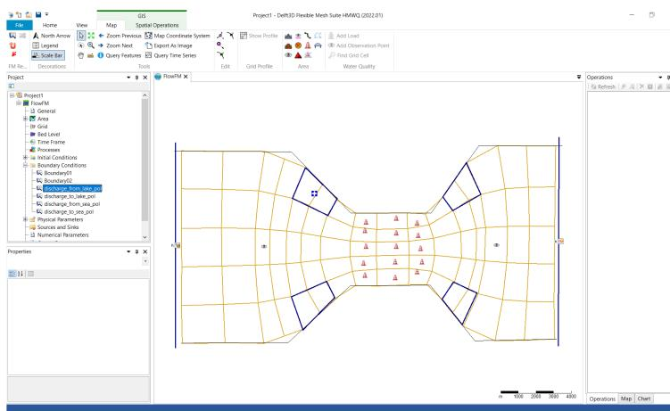

**Figure 18.3:** An example of a simple D-Flow FM model in the Graphic User Interface (GUI). The sea lock is in the middle, the lake on the left side and the sea on the right side.

### 18.8.3.4 Difference from salinity during flush-with-doors-closed

The salinity model in D-SLE uses a different decay formulation during flush-with-doors-closed that accounts for density stratification effects:

$$\lambda_{\text{sal}} = \frac{Q(S_{\text{lock}} - S_{\text{lake}})}{M_{\text{salt,lock}}}, \quad (18.5)$$

where  $S_{\text{lock}}$  and  $S_{\text{lake}}$  are the salinity concentrations (in ppt) of the lock and the lake respectively, and  $M_{\text{salt,lock}}$  is the total salt mass in the lock. As a consequence, a passive constituent configured to mirror salinity will *not* produce results identical to salinity during a flush-with-doors-closed phase, unless  $S_{\text{lake}} = 0$ . In that special case,  $M_{\text{salt,lock}} = S_{\text{lock}} V_{\text{lock}}$ , so  $\lambda_{\text{sal}}$  reduces to  $Q/V_{\text{lock}}$ , identical to the volumetric  $\lambda$  used for passive constituents. For any non-zero lake salinity the two formulations diverge, because the salt-mass-dependent  $\lambda_{\text{sal}}$  differs from the volumetric  $\lambda = Q/V$ .

In practice this difference is small for typical flushing durations and discharge rates. It reflects the physical fact that salt transport during flushing is influenced by density stratification effects that do not apply to dissolved passive tracers.

### 18.8.4 Configuration of the model

#### 18.8.4.1 Input D-Flow FM

Figure 18.3 shows a simple D-Flow FM model in which a sea lock is located in the middle of a D-Flow FM model domain. The cells with red triangles represent the sea lock via dry points in D-Flow FM and are therefore non-computational cells; note that it is also possible to represent dry points by simply removing the grid cells. In this example the lake is on the left and the sea on the right side of the model. There are four lateral locations, denoted by four blue polygons. For both the lake side and the sea side the lateral locations for inflow and outflow are separated. In this example, all four laterals consists of two grid cells.

Remark: for administrative reasons it is necessary that the polygons for each lateral are in separate polygon-files. When using the GUI to create a model this is automatically correct, but the user should pay attention to this when creating or modifying a model by hand.

```
[lateral]
Id                                         = discharge_from_lake
locationFile                                = discharge_from_lake.pol
discharge                                  = realtime
applyTransport                            = 1
```

Note that here the parameter `discharge` and `applyTransport` should be set to `realtime` and 1, respectively. Keyword `realtime` indicates that the parameter receives its values from the coupled model (D-SLE in this example) and keyword `applyTransport=1` indicates that transport of salinity (or temperature or tracers) through the lateral is taken into account. The string of parameter `Id` will be used to identify the lateral in a DIMR configuration.

### 18.8.4.2 Input DIMR

A general description of DIMR configuration file structure can be found in 18.6.4. This section describes entries specific for coupling D-Flow FM and D-SLE.

Supported items for D-SLE as `<sourceName>` (D-SLE gives discharge and salinity as output, at the sea and lake sides, to deliver to D-Flow FM):

- ◇ `results/sealock_ID/discharge_from_sea`
- ◇ `results/sealock_ID/discharge_from_lake`
- ◇ `results/sealock_ID/discharge_to_sea`
- ◇ `results/sealock_ID/discharge_to_lake`
- ◇ `results/sealock_ID/salinity_to_sea`
- ◇ `results/sealock_ID/salinity_to_lake`
- ◇ `results/sealock_ID/temperature_to_sea`
- ◇ `results/sealock_ID/temperature_to_lake`
- ◇ `results/sealock_ID/constituent_to_sea_name (optional, for passive constituents)`
- ◇ `results/sealock_ID/constituent_to_lake_name (optional, for passive constituents)`

Supported items for D-SLE as `<targetName>` (D-SLE receives boundary conditions from D-Flow FM):

- ◇ `dsle_boundary_condition/sealock_ID/head_lake`
- ◇ `dsle_boundary_condition/sealock_ID/salinity_lake`
- ◇ `dsle_boundary_condition/sealock_ID/temperature_lake`
- ◇ `dsle_boundary_condition/sealock_ID/water_volume_from_lake` (only required for 3D model)
- ◇ `dsle_boundary_condition/sealock_ID/water_volume_to_lake` (only required for 3D model)
- ◇ `dsle_boundary_condition/sealock_ID/head_sea`
- ◇ `dsle_boundary_condition/sealock_ID/salinity_sea`
- ◇ `dsle_boundary_condition/sealock_ID/temperature_sea`
- ◇ `dsle_boundary_condition/sealock_ID/water_volume_from_sea` (only required for 3D model)
- ◇ `dsle_boundary_condition/sealock_ID/water_volume_to_sea` (only required for 3D model)
- ◇ `dsle_boundary_condition/sealock_ID/constituent_lake_name (optional, for passive constituents)`
- ◇ `dsle_boundary_condition/sealock_ID/constituent_sea_name (optional, for passive constituents)`

Supported items for D-Flow FM as `<sourceName>` (D-Flow FM provides boundary conditions to D-SLE):

- ◇ `laterals/lateral_ID/outgoing/water_level`
- ◇ `laterals/lateral_ID/outgoing/water_salinity`

- ◇ laterals/lateral\_ID/outgoing/water\_temperature
- ◇ laterals/lateral\_ID/outgoing/water\_volume (only required for 3D model)
- ◇ laterals/lateral\_ID/constituents/name (*optional, for passive constituents*)

Supported items for D-Flow FM as <targetName> (D-Flow FM receives discharge and salinity from D-SLE):

- ◇ laterals/lateral\_ID/water\_discharge
- ◇ laterals/lateral\_ID/incoming/water\_salinity
- ◇ laterals/lateral\_ID/incoming/water\_temperature
- ◇ laterals/lateral\_ID/incoming/name (*optional, for passive constituents*)

The `sealock_ID` is the ID of the sea lock specified in the <.ini> file of D-SLE, `lateral_ID` is the ID of the lateral specified in the <.ext> file of D-Flow FM, and *name* refers to the constituent name as used in the D-Flow FM model. The other keywords are fixed. For depth-varying quantities in 3D models, the item `type` should be set to "`pointer`".

Note that the time interval in element <time> should be a multiple of `DtUser` specified in <.mdu>. An example of a DIMR config file for a 3D setup with one sea lock with ID `sealock_A`, including temperature and a passive constituent named `foo`, is given below.

The `sealock_ID` is ID of the sea-lock specified in the <.ini> file of D-SLE and `lateral_ID` ID of the lateral specified in the <.ext> of D-Flow FM. The other keywords are fixed.

Note that the time interval in element <time> should be a multiple of `DtUser` specified in <.mdu>. Note also that for depth-varying quantities in 3D models, the item `type` should be set to "`pointer`". An example of a DIMR config file can be found below for a 3D setup with one sea lock with ID `sealock_A`, including temperature and a passive constituent named `foo`.

```
<?xml version="1.0" encoding="utf-8" standalone="yes"?>
<dimrConfig xmlns="http://schemas.deltares.nl/dimr"
xmlns:xsi="http://www.w3.org/2001/XMLSchema-instance"
xsi:schemaLocation="http://schemas.deltares.nl/dimr
http://content.oss.deltares.nl/schemas/dimr-1.2.xsd">
<documentation>
<fileVersion>1.2</fileVersion>
<createdBy>Deltares, Coupling Team</createdBy>
<creationDate>2020-10-18T09:43:43.7803727Z</creationDate>
</documentation>
<control>
<parallel>
<startGroup>
<time>0 120 86400</time>
<coupler name="flow_to_dsle"/>
<start name="SeaLockExchange"/>
<coupler name="dsle_to_flow"/>
</startGroup>
<start name="FlowFM"/>
</parallel>
</control>
<component name="SeaLockExchange">
<library>dsle</library>
<workingDir>dsle</workingDir>
<inputFile>sealock_A.ini</inputFile>
</component>
<component name="FlowFM">
<library>dflowfm</library>
<workingDir>dhydro</workingDir>
<inputFile>FlowFM.mdu</inputFile>
```

```
<mpiCommunicator>DFM_COMM_DFMWORLD</mpiCommunicator>
<process>0</process>
</component>
<coupler name="dsle_to_flow">
<sourceComponent>SeaLockExchange</sourceComponent>
<targetComponent>FlowFM</targetComponent>
<item type="pointer">
<sourceName>results/sealock_A/discharge_from_lake</sourceName>
<targetName>laterals/discharge_from_lake_sealock_A/water_discharge</targetName>
</item>
<item type="pointer">
<sourceName>results/sealock_A/discharge_to_lake</sourceName>
<targetName>laterals/discharge_to_lake_sealock_A/water_discharge</targetName>
</item>
<item type="pointer">
<sourceName>results/sealock_A/salinity_to_lake</sourceName>
<targetName>laterals/discharge_to_lake_sealock_A/incoming/water_salinity</targetName>
</item>
<item type="pointer">
<sourceName>results/sealock_A/discharge_from_sea</sourceName>
<targetName>laterals/discharge_from_sea_sealock_A/water_discharge</targetName>
</item>
<item type="pointer">
<sourceName>results/sealock_A/discharge_to_sea</sourceName>
<targetName>laterals/discharge_to_sea_sealock_A/water_discharge</targetName>
</item>
<item type="pointer">
<sourceName>results/sealock_A/salinity_to_sea</sourceName>
<targetName>laterals/discharge_to_sea_sealock_A/incoming/water_salinity</targetName>
</item>
<item type="pointer">
<sourceName>results/sealock_A/temperature_to_lake</sourceName>
<targetName>laterals/discharge_to_lake_sealock_A/incoming/water_temperature</targetName>
</item>
<item type="pointer">
<sourceName>results/sealock_A/salinity_to_sea</sourceName>
<targetName>laterals/discharge_to_sea_sealock_A/incoming/water_temperature</targetName>
</item>
</coupler>
<coupler name="flow_to_dsle">
<sourceComponent>FlowFM</sourceComponent>
<targetComponent>SeaLockExchange</targetComponent>
<item type="pointer">
<sourceName>laterals/discharge_from_lake_sealock_A/outgoing/water_salinity</sourceName>
<targetName>dsle_boundary_condition/sealock_A/salinity_lake</targetName>
</item>
<item>
<sourceName>laterals/discharge_from_lake_sealock_A/outgoing/water_temperature</sourceName>
<targetName>dsle_boundary_condition/sealock_A/temperature_lake</targetName>
</item>
<item>
<sourceName>laterals/discharge_from_lake_sealock_A/water_level</sourceName>
<targetName>dsle_boundary_condition/sealock_A/head_lake</targetName>
</item>
<item type="pointer">
<sourceName>laterals/discharge_from_sea_sealock_A/outgoing/water_salinity</sourceName>
<targetName>dsle_boundary_condition/sealock_A/head_lake</targetName>
</item>
<item>
<sourceName>laterals/discharge_from_lake_sealock_A/outgoing/water_salinity</sourceName>
<targetName>dsle_boundary_condition/sealock_A/salinity_sea</targetName>
</item>
```

```
<item>
<sourceName>laterals/discharge_from_sea_sealock_A/outgoing/water_temperature</sourceName>
<targetName>dsle_boundary_condition/sealock_A/temperature_sea</targetName>
</item>
<item>
<sourceName>laterals/discharge_from_sea_sealock_A/water_level</sourceName>
<targetName>dsle_boundary_condition/sealock_A/head_sea</targetName>
</item>
<item type="pointer">
<sourceName>laterals/discharge_from_lake_sealock_A/water_volume</sourceName>
<targetName>dsle_boundary_condition/sealock_A/water_volume_from_lake</targetName>
</item>
<item type="pointer">
<sourceName>laterals/discharge_from_sea_sealock_A/water_volume</sourceName>
<targetName>dsle_boundary_condition/sealock_A/water_volume_from_sea</targetName>
</item>
<item type="pointer">
<sourceName>laterals/discharge_to_lake_sealock_A/water_volume</sourceName>
<targetName>dsle_boundary_condition/sealock_A/water_volume_to_lake</targetName>
</item>
<item type="pointer">
<sourceName>laterals/discharge_to_sea_sealock_A/water_volume</sourceName>
<targetName>dsle_boundary_condition/sealock_A/water_volume_to_sea</targetName>
</item>
<item type="pointer">
<sourceName>laterals/discharge_from_lake_sealock_A/constituents/foo</sourceName>
<targetName>dsle_boundary_condition/sealock_A/constituent_lake_foo</targetName>
</item>
<item type="pointer">
<sourceName>laterals/discharge_from_sea_sealock_A/constituents/foo</sourceName>
<targetName>dsle_boundary_condition/sealock_A/constituent_sea_foo</targetName>
</item>
</coupler>
</dimrConfig>
```

### 18.8.4.3 Input D-SLE

At least two input files are required to configure a D-SLE model: an `<.ini>` file containing various information about the sea locks and a `<.csv>` file containing operational parameters of the sea lock. For a setting with more than one sea lock, for each sea lock a separated operational parameters `<.csv>` file should be provided.

**Table 18.6:** Input parameters in `<.ini>` file.

| Parameter name                     | Description                                                                                                                                    |
|------------------------------------|------------------------------------------------------------------------------------------------------------------------------------------------|
| <code>start_time</code>            | Mandatory. This should be equal or later than the first time level specified in the operational parameters <code>&lt;.csv&gt;</code> file      |
| <code>kmx</code>                   | Only for 3D model. This specifies the maximum number of layers of the D-Flow FM model, as also specified in the <code>&lt;.mdu&gt;</code> file |
| <code>log_level</code>             | Optional. To specify level of logging.                                                                                                         |
| <code>id</code>                    | Mandatory. To specify the identity of a sea lock, to be used in DIMR configuration.                                                            |
| <code>computation_mode</code>      | Mandatory. Either <code>phase_wise</code> or <code>cycle_average</code> .                                                                      |
| <code>initial_head_lock</code>     | Initial water level in the sea lock.                                                                                                           |
| <code>initial_salinity_lock</code> | Initial salinity in the sea lock.                                                                                                              |

| Parameter name                           | Description                                                                                                                                                                              |
|------------------------------------------|------------------------------------------------------------------------------------------------------------------------------------------------------------------------------------------|
| <i>(continued from previous page)</i>    |                                                                                                                                                                                          |
| <code>initial_temperature_lock</code>    | Initial water temperature in the sea lock.                                                                                                                                               |
| <code>initial_volume_ship_in_lock</code> | ship volume in the sea lock.                                                                                                                                                             |
| <code>lock_length</code>                 | Length of the sea lock.                                                                                                                                                                  |
| <code>lock_width</code>                  | Width of the sea lock.                                                                                                                                                                   |
| <code>lock_bottom</code>                 | Depth of the sea lock.                                                                                                                                                                   |
| <code>flow_profile</code>                | Only for 3D model. It specifies flow profile over depth used to determine to which layers water should be pumped in and from which layers water should be extracted. See 18.8.5.         |
| <code>allowed_head_difference</code>     | Optional. Default = 10 cm. Allowed remaining water level difference when opening doors between lock and lake/sea. If the difference is larger than this value, the simulation will stop. |

Example of an `<.ini>` file containing two sea locks:

```
[general]
start_time                                        = 200101010000
kmx                                             = 5
log_level                                          = debug[sealock]
id                                                     = sealock_A
computation_mode                                    = phase_wise
sealock_operational_parameters                   = sealock_A.csv
initial_head_lock                                = 0.0
initial_salinity_lock                               = 10.0
initial_temperature_lock                          = 6.0
initial_volume_ship_in_lock                     = 0.0
lock_length                                        = 300.0
lock_width                                        = 25.0
lock_bottom                                      = -7.0
flow_profile                                     = 1, 0, 0, 0, 0, 0, -1[sealock]
id                                                     = sealock_B
computation_mode                                  = phase_wise
sealock_operational_parameters               = sealock_B.csv
initial_head_lock                               = 1.0
initial_salinity_lock                             = 15.0
initial_temperature_lock                        = 6.0
initial_volume_ship_in_lock                    = 0.0
lock_length                                      = 500.0
lock_width                                      = 70.0
lock_bottom                                     = -18.0
flow_profile                                   = 1, 1, 1, 1, 0, 0, 0, 0, -1
```

Figure 18.4 shows an example of an operational parameters `<.csv>` file. For the complete list of operational parameters, we refer to the technical documentation of D-SLE: <https://libzsf.readthedocs.io/en/latest/theory/index.html>.

### 18.8.5 Processing of the received lateral data items in D-Flow FM

In this section, we describe the processing of the lateral data items in D-Flow FM. D-SLE expects and returns a single value per lateral and per layer. In D-Flow FM, in the horizontal direction, the single value from D-SLE will be distributed over all cells in the lateral after exchange with D-SLE. In turn, the values of all the cells will be aggregated before exchanging them to D-SLE.

|    | A           | B       | C                       | D                       | E                | F          | G         | H                           | I                          | J                                | K  |
|----|-------------|---------|-------------------------|-------------------------|------------------|------------|-----------|-----------------------------|----------------------------|----------------------------------|----|
| 1  | time        | loomine | ship_volume_late_to_sea | ship_volume_sea_to_late | flushing_l_level | lopen_late | lopen_sea | density_current_factor_late | density_current_factor_sea | distance_door_bobble_screen_late | i  |
| 2  | 20010101000 | 3       |                         |                         |                  | 300        |           |                             | 0.25                       | 0.25                             | 10 |
| 3  | 2001010007  | 4       |                         | 1800                    |                  | 300        | 300       |                             | 0.25                       | 0.25                             | 10 |
| 4  | 2001010014  | 1       |                         |                         |                  | 300        |           |                             | 0.25                       | 0.25                             | 10 |
| 5  | 2001010021  | 2       | 2500                    |                         |                  | 1800       |           |                             | 0.25                       | 0.25                             | 10 |
| 6  | 2001010021  | 3       |                         |                         | 300              |            |           |                             | 0.25                       | 0.25                             | 10 |
| 7  | 2001010100  | 4       |                         | 4000                    |                  | 300        | 1800      |                             | 0.25                       | 0.25                             | 10 |
| 8  | 2001010132  | 1       |                         |                         |                  | 300        |           |                             | 0.25                       | 0.25                             | 10 |
| 9  | 2001010139  | 2       | 300                     |                         |                  | 600        |           |                             | 0.25                       | 0.25                             | 10 |
| 10 | 2001010151  | 3       |                         |                         | 300              |            |           |                             | 0.25                       | 0.25                             | 10 |
| 11 | 2001010168  | 4       | 0                       |                         | 3600             |            | 300       |                             | 0.25                       | 0.25                             | 10 |
| 12 | 2001010205  | 4       |                         |                         |                  |            |           |                             | 0.25                       | 0.25                             | 10 |
| 13 | 2001010307  | 3       |                         |                         | 300              |            | 600       |                             | 0.25                       | 0.25                             | 10 |
| 14 | 2001010314  | 4       |                         | 2800                    |                  |            |           |                             | 0.25                       | 0.25                             | 10 |
| 15 | 2001010328  | 1       |                         |                         | 300              |            |           |                             | 0.25                       | 0.25                             | 10 |
| 16 | 2001010333  | 2       | 0                       | 0                       |                  | 300        |           |                             | 0.25                       | 0.25                             | 10 |
| 17 | 2001010340  | -2      |                         |                         | 1800             |            |           |                             | 0.25                       | 0.25                             | 10 |

Figure 18.4: An example of an operational parameters <.csv> file.

### Water volume

At each lateral location, the water volume is the water volume per horizontal layer, which is computed as the sum of the volumes of the individual cells on this layer.

### Distribution of the D-SLE discharge output to different layers

The water volume per horizontal layer is used to determine active layers, i.e. layers with non-zero water volume. To distribute discharge output of D-SLE, the vertical relative location of the `flow_profile` is first projected to the active layers. Vertical locations with positive profile are layers to which the output of D-SLE is pumped into the D-Flow FM model. Vertical locations with negative profile gives layers from where water is extracted from D-Flow FM model. For each layer, a the relative profile determines the discharge exchanged.

### Distribution of the lateral discharge to different cells per layer

Lateral discharge (per layer) is communicated between D-SLE model and D-Flow FM model via BMI. For each lateral location, after the D-Flow FM model receives the discharge value per layer (from D-SLE model), D-Flow FM distributes the discharge over all the cells in the lateral volume defined by a polygon and a layer. The distribution is proportional to the available volume in a cell.

The algorithm for distribution of the lateral discharge in a 3D model is as follows. Let  $i\_layer = 1, \dots, kmx$  be the layer indices where  $kmx$  is the total number of layers in 3D models of D-Flow FM. Moreover, let  $ncell$  be the total number of cells at one lateral location. The following variables are needed for distributing the lateral discharge:

- ❖ Volume for each cell at each layer, denoted by  $V_{i\_layer,i\_cell}$ .
- ❖ Total volume at layer  $i\_layer$ , denoted by  $V_{i\_layer}$ . Therefore,

$$\sum_{i\_cell=1}^{ncell} V_{i\_layer,i\_cell} = V_{i\_layer}.$$

- ❖ Discharge for each cell at each layer, denoted by  $Q_{i\_layer,i\_cell}$ .
- ❖ Total discharge at layer  $i\_layer$ , denoted by  $Q_{i\_layer}$ . Therefore,

$$\sum_{i\_cell=1}^{ncell} Q_{i\_layer,i\_cell} = Q_{i\_layer}.$$

The following relation holds:

$$\frac{Q_{i\_layer,i\_cell}}{Q_{i\_layer}} = \frac{V_{i\_layer,i\_cell}}{V_{i\_layer}}. \quad (18.6)$$

Therefore,  $Q_{i\_layer,i\_cell}$  can be computed by:

$$Q_{i\_layer,i\_cell} = \frac{V_{i\_layer,i\_cell}}{V_{i\_layer}} \cdot Q_{i\_layer}. \quad (18.7)$$

### Concentration

The exchanged concentration of, e.g., salinity in D-Flow FM is computed per layer in 3D models. In case of a 2D model, it can be regarded as having only one layer.

DIMR runs the D-Flow FM and D-SLE models in a number of update steps. At each update step, the models run over an exchange interval, whose interval is configured in a DIMR configuration file. It can happen that over an exchange interval, a D-Flow FM model runs over a number of time steps. For each update process, D-Flow FM computes the input concentration for D-SLE as the average concentration over all grid cells in the lateral and over the exchange time interval. The formula implemented in D-Flow FM for computing the average concentration at one layer, denoted by  $c_{i\_layer}$ , reads:

$$c_{i\_layer} = \frac{\sum_j \sum_k^{ncell} dt_j \cdot V_k \cdot c_k}{T \sum_k^{ncell} V_k}, \quad (18.8)$$

where  $dt_j$  is the  $j^{th}$  computational time step during the update process,  $k$  is one cell on layer  $i\_layer$ ,  $T$  is the exchange time interval, and  $V_k$  and  $c_k$  are the volume and concentration of cell  $k$ , respectively. The exchange time interval denotes the interval of communication between D-Flow FM and D-SLE. Eq. (18.8) shows that values are accumulated over an exchange time interval  $T$  before a concentration value is communicated towards the D-SLE module.

### Salinity input to D-SLE

For 3D model, the `flow_profile` is not used to determine salinity input to D-SLE from D-Flow FM. Based on experience, it is decided to use depth-average salinity instead.

## 19 Water quality and D-Flow FM

### 19.1 Introduction to the coupling of D-Flow FM to D-Water Quality

In the Delft3D Flexible Mesh Suite it is possible to use a D-Flow FM hydrodynamic model as the basis for a D-Water Quality model in two distinct ways.

One way is to write the grid definition, the water balance and optionally other relevant data like temperature fields and bottom shear stress to a set of files that can be used to set up a D-Water Quality model afterwards. This is referred to as the **file-based** or *offline* coupling.<sup>1</sup> This will be described in more detail in section 19.2.

Another way is to directly apply the processes in the D-Water Quality process library on *tracers* that can be defined in D-Flow FM during a hydrodynamic calculation. This avoids writing sometimes very big coupling files, and allows running D-Water Quality using MPI parallelisation. This is referred to as the **memory-based**, or *online* coupling of hydrodynamics and water quality, which will be described in more detail in section 19.3.

**Note:** The **memory-based** coupling is TRL level 4-6 (prototype), because currently this functionality is not supported in the Delft3D-FM graphical user-interface. For a definition of the Technical Technology Readiness Levels (TRL) we refer to Section 2.7. The user has to manual edit the mdu-file and ext-file to set up the processes and their inputs.

In Table 19.1 an overview is presented of the most important pros and cons of both approaches.


**Table 19.1: File-based versus memory-based D-Water Quality processes in D-Flow FM.**

| Coupling type                | Pros                                                                                              | Cons                                                                                                            |
|------------------------------|---------------------------------------------------------------------------------------------------|-----------------------------------------------------------------------------------------------------------------|
| <b>File-based (offline)</b>  | - run hydrodynamics only once<br>- small models could be faster<br>- grid aggregation is possible | - possibly very large coupling files<br>- complex models could become slower                                    |
| <b>Memory-based (online)</b> | - no coupling files needed<br>- no coupling mistakes<br>- multi-node parallelism (via MPI)        | - rerun hydrodynamics for each scenario<br>- no aggregation possible<br>- no reuse of old water quality set-ups |

A file-based coupling has several advantages. Hydrodynamic calculations can be time consuming, and one hydrodynamic data set can be used to run multiple water quality scenarios. However, with the models becoming bigger and finer, the size of the coupling files is increasing. Also since D-Water Quality has limited options for parallel computing, runs can become very time-consuming. D-Water Quality only allows shared-memory parallelism and does not allow distributed-memory parallelism via MPI. The latter was the main reason why the possibility of using the D-Water Quality process library directly in D-Flow FM was implemented. This coupling has been implemented in such a way that only the processes from D-Water Quality are used, using the exact same code as used in D-Water Quality. For each substance that is defined in the water quality processes setup, a tracer is defined in D-Flow FM. The advection-diffusion equations are solved by D-Flow FM as described in chapter 4: Conceptual description of transport equation, which can make use of MPI parallelism over multiple nodes. The processes themselves do not need to make use of MPI parallelism, since the processes do not interact horizontally, but only in the vertical direction (e.g. sedimentation, light climate).

The memory-based coupling can also be beneficial for the storage requirements of simulations, since in this coupling mode the data are already in memory. A downside of this method is that when the user

<sup>1</sup>The preferred, but imperfect terminology is **file-based** and **memory-based** coupling. We will use these terms consistently in this chapter.

wants to evaluate different water quality configurations, for each simulation not only the water quality simulation, but also the hydrodynamics needs to be recomputed. This can imply recomputing the same hydrodynamic result for every water quality configuration, which can become expensive.

Both approaches of coupling use the same processes library for water quality. The simulation of substances, processes and their interactions is identical. The key difference is the computation of the transport of substances. In the file-based coupling, the transport is computed by D-Water Quality, giving the user a range of integration options to use for the transport equation (see Deltares (2026h) for details). In the memory-based coupling, the transport is computed by D-Flow FM, as described in chapter 4.

## 19.2 File-based (or *offline*) coupling of water quality and hydrodynamics

### 19.2.1 Introduction

D-Water Quality is the multi-dimensional water quality model framework developed by Deltares over the past decades. It solves the advection-diffusion-reaction equation on a predefined computational grid and for a wide range of model substances. D-Water Quality offers flexible configuration of the substances to be included, as well as the processes to be evaluated. D-Water Quality does not contain a hydrodynamic model, so model results on flow fields is obtained from hydrodynamic models such as D-Flow FM 1D2D, D-Flow FM 2D3D or SOBEK 3. Full documentation on the D-Water Quality module is available, see Deltares (2026h).

### 19.2.2 Creating output for D-Water Quality

Creating output for D-Water Quality by D-Flow FM can be enabled in the User Interface in the main window under the tab 'Output Parameters'. Change the "WAQ output interval" to a nonzero value. The MDU-equivalent is the keyword [output], WaqInterval, where three numbers can be put and they are in the order of "WAQInterval", "WAQ output-start-time", "WAQ output-end-time". Each number should be a whole number of seconds, and must be a multiple of the "User time step" (see tab "Time frame"). Moreover, if the start and end output time is not explicitly specified, they are automatically set to start and end time of the simulation, respectively.

D-Flow FM will create a special output folder named <DFM\_DELWAQ\_mdu\_name>. In this folder a <\*.hyd>-file will be created that gives an overview of the coupling with references to the files containing the hydrodynamic exchange data.

Load the <\*.hyd>-file in the D-Water Quality GUI to prepare the input for a water quality calculation. For further information on how to run D-Water Quality please consult the relevant user manual.

The D-Water Quality GUI fully supports coupling with results from D-Flow FM. Postprocessing can be done in QUICKPLOT.

### 19.2.3 Limitations and remarks

When using multiple partitions (as described in Chapter 8), D-Flow FM will create one <\*.hyd>-file per partition in the special output folder. Since D-Water Quality can accept results for a single partition only, you have to merge the results into one using a tool called waqmerge.

It can be useful to model the water quality processes on a coarser mesh than the hydrodynamic grid, and for this grid aggregation would be useful. This can be done using the tools D-WAQ DIDO and agrhyd.

These tools can be obtained by contacting Deltares support. The usage is described in the DIDO manual and the D-Water Quality Tools manual.

### 19.3 Memory-based (or online) coupling of water quality and hydrodynamics

The memory-based coupling between D-Flow FM 2D3D and D-Water Quality has been tested and used but is currently still TRL level 4-6 (prototype), and is not supported by the user interface. For a definition of the Technical Technology Readiness Levels (TRL) we refer to Section 2.7. This means the user has to manually edit the D-Flow FM input files to activate the processes. It is, however, possible to add tracers in the user interface with the names of the D-Water Quality substances to prepare e.g. boundary conditions. This section describes how to add the processes from D-Water Quality to such a model.

Water quality modelling with D-Water Quality within D-Flow FM is very flexible. Substances, water quality processes, output variables, etc. defined in the D-Water Quality processes library are all available in the memory-based coupling. The library can also be extended by new processes via the *open processes library* mechanism. The basic steps in water quality modelling within D-Flow FM are:

1. 1 Set up a hydrodynamic simulation.
2. 2 Define the substances and water quality processes you want to include using PLCT.<sup>2</sup>
3. 3 Refer to the sub-file you have created in the mdu-file, and optionally add a history output file.
4. 4 Choose a sensible processes time step (DtProcesses) and mass balance output interval (Mbaln-terval) in the mdu-file.
5. 5 Define initial conditions, boundary conditions for the substances in the ext-file.
6. 6 Define constant and spatially or temporally varying process parameters in the ext-file.
7. 7 Define mass balance areas in the ext-file.
8. 8 Run the simulation.
9. 9 Check the output.

#### 19.3.1 Glossary of terms

As D-Flow FM uses the terms *constituents* and *tracers* and for the water quality processes the term *substances* is added, this section gives a concise definition of these terms in order to avoid confusion.

- ◇ *Substances* are, in principle, subject to one or more water quality processes. For D-Flow FM itself they are the same as *tracers*, if they are transported (also known as "active" substances in D-Water Quality), otherwise they play no role in D-Flow FM itself. They are defined via the sub-file.
- ◇ *Tracers* are used in D-Flow FM to indicate transport due to flow and mixing. They do not participate in the hydrodynamic equations, so there is no influence of tracers on the hydrodynamics.
- ◇ The term *constituents* is used for all (transported) quantities, including sediment (from D-Morphology), salinity and temperature. The latter three do influence the hydrodynamics via the density term and therefore play a more important role than tracers.

For example, when salinity, temperature or sediments are modelled via the D-Water Quality model in D-Flow FM, as described in this chapter, then they do not influence the hydrodynamics (via the density term) and are called substances. However, when salinity, temperature or sediments are modelled in the hydrodynamic model of D-Flow FM, then they do influence the hydrodynamics and are called constituents.

#### 19.3.2 Definition of the water quality system

A water quality system is defined by the substances and the processes that influence these substances. These processes can range from simple first-order decay (as with radio-active substances) to complex interactions between a large number of substances, like with algal growth.

The user can use all substances and processes that are available in D-Water Quality. A comprehensive description of the formulations and the input and output items of the processes can be found in Technical Reference Manual (Deltares, 2026g).

Processes can calculate actual fluxes between substances, but there are also 'informational' processes that e.g. calculate the light climate or the total bottom shear stress or the total resuspension flux. The

<sup>2</sup>The abbreviation means "Processes Library Configuration Tool". It is a tool to construct sub-files.

setup, stored in a sub-file, can be created using.<sup>3</sup>. For D-Water Quality, this sub-file is read by the user-interface, and the settings are incorporated in the D-Water Quality input file. D-Flow FM reads the sub-file directly.

The substance file is in plain text format, which allows manipulation by the user. The substance file contains:

- ◇ a list of substances that are transported (active)
- ◇ a list of substances that are not transported (inactive)
- ◇ a list of constants and their values (see: Table 19.3.3)
- ◇ a list of list of outputs (see: ref below)
- ◇ a list of the processes that will be active

To use a sub-file, it has to be referred to in the mdu-file. Use the keyword [processes], SubstanceFile.

Example of the reference to a sub-file in the mdu-file which will then activate the processes in D-Flow FM:

```
[processes]
SubstanceFile                = sed_3fraction.sub
```

### Substances

There are two types of substances in D-Water Quality: active and inactive.

1. 1 Active substances are added as tracers to the constituents of D-Flow FM. You can define their initial conditions (or use the result from a previous run using a restart file), boundary conditions and sink-source concentrations in the same ways as for other constituents in D-Flow FM.
2. 2 Inactive substances usually reside only in the bottom water layer. They represent inorganic sediments or organic material at the bottom, or rooting vegetation.

The non-transported substances are not part of the constituents in D-Flow FM. You can define their initial conditions using a special keyword in the ext-file, or use the result from a previous run using a restart file. You cannot define boundary conditions for them, since they are not transported over boundaries. Also, you do not need to add concentrations for them when you define sources and sinks. Then you only specify the transported constituents.

An actual list of the constituents in the model and their order is written to the diagnostics file. This is useful, because this is the order in which the concentrations need to be specified for sources and sinks.

Format for a substance definition in the sub-file:

```
substance <substance name> <active/inactive>
  description                                <description>
  concentration-unit                                <unit>
  waste-load-unit                                     <waste load unit>
end-substance
```

Example of substance definitions in a sub-file:

```
substance 'IM1' active
  description                                'inorganic matter (IM1)'
  concentration-unit                             '(gDM/m3)'
  waste-load-unit                                '-'
end-substance
```

<sup>3</sup>See the User Manual for the Deltares (2026f)

```
substance 'IMS1' inactive
  description          'IM1 in layer S1'
  concentration-unit  '(gDM/m2)'
  waste-load-unit     '-'
end-substance
```

## Processes

The processes in the D-Water Quality processes library cover a large number of water quality problems. An overview can be seen in Figure 19.1. The user can select which processes are relevant and switched on. D-Flow FM will evaluate if all required input is available to actually calculate the processes. A report of this will be available in the lsp-report file. Also check this file for warnings and errors messages that are specific for D-Water Quality.

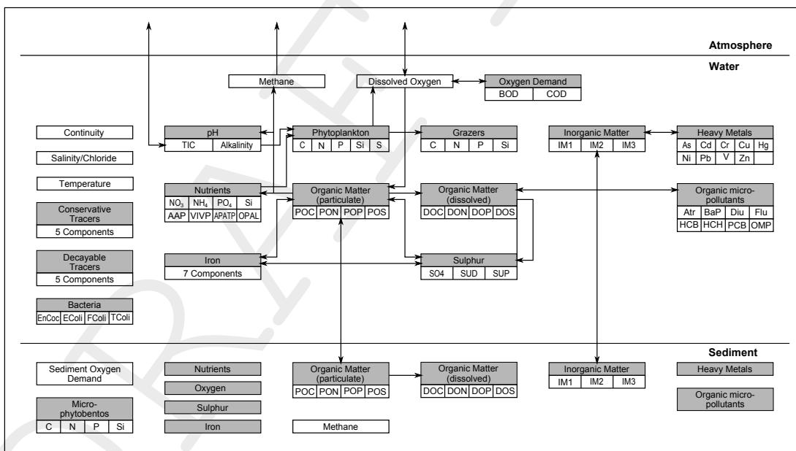

**Figure 19.1:** General overview of substances included in D-Water Quality. Substances are organised in functional groups indicated by a grey header, except for some substances that form a group of their own. Major links between substances are indicated by arrows; note that many links are omitted.

All processes from D-Water Quality can be used in D-Flow FM. Processes are often evaluated at larger time steps than the hydrodynamics and transport using fractional stepping. A time step, DtProcesses, for the evaluation of processes must be set in the mdu-file. The processes are evaluated at this interval, which leads to fluxes. The effect is directly applied to the concentration field, after which the transport continues without any further interaction between the substances until the next water quality time step.

**Limitation:** DtProcesses must be a multiple of the dtuser, and can be specified in the processes section of the mdu-file using the MDU keyword [processes], DtProcesses. If DtProcesses is negative, water quality processes are calculated at every hydrodynamic time step. A list of the processes to be switched on is given in the sub-file.

Example of a processes time step definition in the mdu-file:

```
[processes]
DtProcesses      = 600.0
```

```
active-processes
  name <name 1> <decription 1>
  name <name 2> <decription 2>
  :
  name <name n> <decription n>
end-active-processes
```

Example of a processes list in the sub-file

```
active-processes
  name 'Compos' 'Composition'
  name 'Nitrif_NH4' 'Nitrification of ammonium'
  name 'DecFast' 'Mineralization fast decomp. detritus POC1'
  :
  name 'Daylength' 'Daylength calculation'
end-active-processes
```

### 19.3.3 Definition of process parameters

In D-Water Quality there are four types of process parameters, constant in time and space, varying in time, varying in space, and varying in both time and space. In Table 19.2, you can see an overview of these types, with the D-Water Quality term for them in italics, and the way they can be specified in D-Flow FM.

*Table 19.2: Various types of parameter inputs for water quality models in D-Flow FM.*

|                          | Constant in time                                                    | Varying in time                                                                  |
|--------------------------|---------------------------------------------------------------------|----------------------------------------------------------------------------------|
| <b>Constant in space</b> | <i>constant</i><br>define a parameter<br>in the <i>sub-file</i>     | <i>function</i><br>define a waqfunction<br>in the <i>ext-file</i>                |
| <b>Varying in space</b>  | <i>parameter</i><br>define a waqparameter<br>in the <i>ext-file</i> | <i>segment function</i><br>define a waqsegmentfunction<br>in the <i>ext-file</i> |

### Constant parameter input

Process parameters that remain constant during the calculation are called *constant* in D-Water Quality, and are specified in the sub-file when using D-Water Quality within D-Flow FM. A constant value in the substance file can however be replaced by a spatial or temporal definition in the *ext-file*.

Format for a *constant* definition in the sub-file:

```
parameter <parameter name>
  description          <decription>
  unit                 <unit>
  value               <value>
end-substance
```

Two examples of a *constant* definition in the sub-file:

```
parameter 'V0SedIM1'
  description         'sedimentation velocity IM1'
  unit                '(m/d)'
  value               7.20000E-00
```

```
end-parameter
parameter 'TaucRS1DM'
  description      'critical shear stress for resuspension DM layer S1'
  unit            '(N/m2)'
  value            0.2000E+00
end-parameter
```

### Spatial parameter input

Spatially varying input for a process parameter is called a *parameter* in D-Water Quality. In D-Flow FM, these are defined in the ext-file (Section C.6.3) using `[Spatial]` blocks with `quantity = waqparameter<name>` (cf. Section C.6.3.4). At the moment, data can only be specified in 2D, and this information is copied to all layers.

For example:

```
[Spatial]
quantity          = waqparameterV0SedIM1
dataValue          = 3.6
targetMaskFile     = paral.pol
operand           = override[Spatial]
quantity          = waqparameterV0SedIM1
dataValue          = 7.2
targetMaskFile     = paral.pol
operand           = override
```

### Warning:

- ◇ Deprecated: The old external forcing file (Section C.6.2) is being deprecated. The example below is kept only for migration purposes:

```
QUANTITY=waqparameterV0SedIM1
FILENAME=paral.pol
FILETYPE=10
METHOD=4
OPERAND=0
VALUE=3.6QUANTITY=waqparameterV0SedIM1
FILENAME=para2.pol
FILETYPE=10
METHOD=4
OPERAND=0
VALUE=7.2
```

### Temporal parameter input

Temporal varying input for a process parameter is called a *function* in D-Water Quality. In D-Flow FM, these are defined in the ext-file (Section C.6.3) using `quantity = waqfunction<name>`.

Even though these parameters are spatially constant, they are still placed in the same `[Spatial]` blocks (cf. Section C.6.3.4).

For example:

```
[Spatial]
quantity          = waqfunctionV0SedIM1
dataFile           = V0SedIM1.bc
dataFileType       = bcAscii
```

```
interpolationMethod = linearSpaceTime
operand                     = override[Spatial]
quantity                     = waqfunctionV0SedIM2
dataFile                     = V0SedIM2.bc
dataFileType               = bcAscii
interpolationMethod        = linearSpaceTime
operand                    = override
```

The `<*.bc>` files used in this example are further documented in Appendix C.5.

**Warning:**

- ◇ Deprecated: The old external forcing file (Section C.6.2) is being deprecated. The example below is kept only for migration purposes:

```
QUANTITY=waqfunctionV0SedIM1
FILENAME =V0SedIM1.tim*
FILETYPE =1
METHOD    =1**
OPERAND   =OQUANTITY=waqfunctionV0SedIM2
FILENAME =V0SedIM2.fun*
FILETYPE =1
METHOD    =0**
OPERAND   =O
```

\* file containing a time series for this parameter;

\*\* method: 0 = block, 1 = linear interpolation

**Spatial and temporal parameter input**

Parameter input data that are both spatial and temporal varying are referred to as a *segment function* in D-Water Quality. In a memory-based combined model, you can specify external data sources, but also connect to hydrodynamic and meteorological data that are already available within D-Flow FM in your model.

**Defining external data sources for segment functions**

In D-Flow FM, you can specify segment functions in the ext-file (Section C.6.3) using

`[Spatial]` blocks with `quantity = waqsegmentfunction<name>` (cf. Section C.6.3.4). At the moment, only data specified on a curvilinear grid in a netCDF are supported (`dataFileType = netcdf`, section D.2.4). We hope to support temporal varying sample files in the near future. Data can only be specified in 2D, and the information is copied to all layers.

For example:

```
[Spatial]
quantity                     = waqsegmentfunctionIM1
dataFile                     = f34_sediments.nc
dataFileType               = netcdf
dataVariableName           = IM1
interpolationMethod        = linearSpaceTime
operand                    = override
```

**Warning:**

- ◇ Deprecated: The old external forcing file (Section C.6.2) is being deprecated. The example below is kept only for migration purposes:

```
QUANTITY=waqsegmentfunctionIM1
FILENAME=f34_sediments.nc
VARNAME=IM1
FILETYPE=11
METHOD=3
OPERAND=0
```

### Making parameters from D-Flow FM available for processes

Within D-Flow FM it is possible to connect several parameters to the water quality processes. If you mention the name of certain parameters in the sub-file, they will be replaced by data from D-Flow FM, when available. Table 19.3 shows which data can be connected by which parameters. Which data are actually connected is reported in the dia-file.

*Table 19.3: Data from D-Flow FM that are available for water quality processes*

| D-Flow FM data                  | D-Water Quality name in sub-file |
|---------------------------------|----------------------------------|
| horizontal surface area         | Surf (default)                   |
| latitude (spherical grids only) | Latitude                         |
| bottom shear stress             | Tau or TauFlow*                  |
| flow element center velocity    | Velocity                         |
| salinity                        | Salinity                         |
| temperature                     | Temp                             |
| wind velocity magnitude         | VWind                            |
| wind direction                  | WindDir                          |
| fetch length and fetch depth    | Fetch and/or InitDepth**         |
| solar radiation                 | RadSurf                          |
| rain (mm/day)                   | Rain (mm/h)                      |
| wave height                     | WaveHeight                       |
| wave length                     | WaveLength                       |
| wave period                     | WavePeriod                       |

\*The bottom shear stress can be connected to Tau or TauFlow. When you connect to TauFlow, you can use the process CalTau to calculate a Tau for the water quality processes with an additional bottom shear stress. Please be aware that if the D-Flow FM switch `jawaveSwartDelwaq` has been set to anything other than zero or D-Waves is coupled, there is already wave bottom shear stress included in TauFlow. Adding extra wave bottom shear stress with CalTau would lead to a doubling of wave bottom shear stress.

\*\*Fetch length and fetch depth are both connected when either Fetch and/or InitDepth is mentioned in the sub-file.

These are predefined quantities but defining them in the sub-file makes them "visible" in the processes library. If you do not want to use the data available from D-Flow FM but want to specify your own input, you must *not* define the quantity as a process parameter in the sub-file, but add it as spatial and/or temporal input in the ext-file. If you just want to use a constant value, specify a uniform time series (19.3.3) with the same value for the beginning and the end of your calculation period.

#### 19.3.4 Initial conditions, boundary conditions and sources and sinks

Most substances in the model will have certain initial conditions, boundary conditions and sources and sinks (the equivalent of D-Water Quality waste loads). A D-Flow FM and D-Water Quality model that is memory-based makes uses of D-Flow FM tracers, therefore you have to make use of the D-Flow FM methods to prescribe them (See also: section 4.3). The options will be briefly discussed here.

### Initial condition

The initial conditions for transported water quality substances are handled in exactly the same manner as those for any other constituents, i.e., one can specify a horizontally spatially varying field in the usual way through the ext-file (Section C.6.3) using `[Spatial] blocks` with `quantity = initialtracer<name>` (cf. Section C.16.4.6).

For non-transported water quality substances use `quantity = initialwaqbot<name>`.


**Note:** Keywords like `initialtracer` and `initialwaqbot` are case-sensitive, and must be written in lower case. Names of substances are also case-sensitive and have to be named consistently. E.g. using `initialtracerIM1` and for `tracerbndim1` will lead to two separate tracers named 'IM1' and 'im1'.

One can also refer to a restart file in the mdu-file. Restart conditions are read from the restart file by substance name, not by order in the file, and can contain both transported and non-transported substances.

Below is an example of initial fields for a transported and non-transported water quality quantity:

```
[Spatial]
quantity                                         = initialtracerIM1
dataFileType                                         = polygon
dataFile                                             = initracer.pol
interpolationMethod                                   = constant
operand                                             = override
value                                                = 5.0
```

```
[Spatial]
quantity                                               = initialwaqbotIM1S1
dataFileType                                           = polygon
dataFile                                              = initracer.pol
interpolationMethod                                   = constant
operand                                             = override
value                                                = 100.0
```

### Warning:

- ◇ Deprecated: The old external forcing file (Section C.6.2) is being deprecated. The example below is kept only for migration purposes:

```
QUANTITY=initialtracerIM1
FILENAME=initracer.pol
FILETYPE=10
METHOD=4
OPERAND=0
VALUE=5.0QUANTITY=initialwaqbotIM1S1
FILENAME=initracer.pol
FILETYPE=10
METHOD=4
OPERAND=0
VALUE=100.0
```

### Boundary conditions

All of the D-Flow FM options for tracers and other constituents are also available for transported water quality substances. You can specify boundary conditions for all these substances at all open inflow boundaries in the ext-file (Section C.6.3) using `[Boundary] blocks` with `quantity = tracerbnd<name>` (cf. Section C.6.3.1). When modelling in three dimensions you may choose to specify boundary concentrations that have a uniform, linear, or step distribution over the vertical. You may also choose to specify a “Thatcher-Harleman” return time to simulate the re-entry of material that flowed out of the

model after the flow reverses direction. Note that when no boundary concentration is prescribed, the concentration is presumed to be equal to the current concentration of the entrance cell of the model. This is different from running a file-based D-Water Quality model, where missing concentrations are presumed to be zero.

For example:

```
[Boundary]
quantity                     = tracerbndIM1
locationFile                 = leftIM1_sed.pli
forcingFile                 = boundaries.bc[Boundary]
quantity                    = tracerbndIM2
locationFile                = leftIM2_sed.pli
forcingFile                 = boundaries.bc
```

The `<*.bc>` files used in this example are further documented in Appendix C.5.

**Warning:**

- ◇ Deprecated: The old external forcing file (Section C.6.2) is being deprecated. The example below is kept only for migration purposes:

```
QUANTITY=tracerbndIM1
FILENAME=leftIM1_sed.pli*
FILETYPE=9
METHOD=3
OPERAND=0QUANTITY=tracerbndIM2
FILENAME=leftIM2_sed.pli*
FILETYPE=9
METHOD=3
OPERAND=0
```

\* a tim-file (time series) with the same name is read

**Sources and sinks**

Sources and sinks are the equivalent of waste loads in D-Water Quality. Similar to the boundary concentrations, the data are stored in `<*.bc>` files, and a connection to those files is made in an ext-file using `[SourceSink]` blocks. The concentrations of substances in a point source (e.g. a wastewater treatment plant) must be specified as `sourcesink_tracer<substance name>` in both files. The concentrations of substances in a coupled intake–outfall (e.g. cooling water for a power plant) must specify the increase in concentration as `sourcesink_tracer<substance name>Delta` in both files. The concentrations of the substances in the outfall are calculated as the sum of the concentrations in the intake and the specified "Delta" values. More details can be found in (Section C.6.3) and (cf. Section C.6.3.5)

```
[SourceSink]
id                           = WWTP
name                         = wastewater treatment plant
locationFile                 = WWTP.pliz
discharge                     = wwtp_pp.bc
tracerCBOD5                 = wwtp_pp.bc
tracerOXY                    = wwtp_pp.bc[SourceSink]
id                           = PowerPlant
name                         = power plant
locationFile                 = PP.pliz
```

```
discharge      = wwtp_pp.bc
tracerOMPDelta = wwtp_pp.bc
```

And make a bc-file named `wwtp_pp.bc` with:

```
[Forcing]
name                                              = WWTP
function                                             = timeseries
timeInterpolation                                    = linear
quantity                                             = time
unit                                                    = MINUTES SINCE 2020-01-01 00:00:00
quantity                                             = sourcesink_discharge
unit                                                    = m3/s
0.0                                                         = 110.0
1440.0                                                    = 120.0
2880.0                                                    = 100.0[Forcing]
name                                                     = WWTP
function                                               = timeseries
timeInterpolation                                     = linear
quantity                                               = time
unit                                                    = MINUTES SINCE 2020-01-01 00:00:00
quantity                                              = sourcesink_tracerCBOD5
unit                                                    = g/m3
0.0                                                         = 3.5
1440.0                                                    = 3.2
2880.0                                                    = 3.3[Forcing]
name                                                     = WWTP
function                                               = timeseries
timeInterpolation                                     = linear
quantity                                               = time
unit                                                    = MINUTES SINCE 2020-01-01 00:00:00
quantity                                              = sourcesink_tracerOXY
unit                                                    = g/m3
0.0                                                         = 9.0
2880.0                                                    = 9.0[Forcing]*
name                                                     = PowerPlant
function                                               = timeseries
timeInterpolation                                     = linear
quantity                                               = time
unit                                                    = MINUTES SINCE 2020-01-01 00:00:00
quantity                                              = sourcesink_discharge
unit                                                    = m3/s
quantity                                              = sourcesink_tracerOMPDelta
unit                                                    = g/m3
0.0                                                         = 1500.0 0.75
1440.0                                                    = 1350.0 0.75
2880.0                                                    = 1400.0 0.75
```

\* It is possible to combine multiple quantities in a single [Forcing] block. The `<*.bc>` files used in this example are further documented in [Appendix C.5](#).

**Warnings:**

- ◇ Deprecated: The old external forcing file ([Section C.6.2](#)) is being deprecated. The example below is kept only for migration purposes.
- ◇ Also, `<*.tim>` files are deprecated. The preferred format to define timeseries for discharges and transported constituents is in `<*.bc>` files. The biggest advantage is that these files have a header where each provided quantity name is defined, so *only* the tracers which are relevant (non-zero) at the source-sink need to be present in the `<*.bc>` file. Whereas for `<*.tim>` files, *all* tracers active in the entire model had to be defined for each source sink, as further described in the texts below.

In the old external forcings file, source-sinks were specified using

QUANTITY=discharge\_salinity\_temperature\_sorsin as follows:

```
QUANTITY=discharge_salinity_temperature_sorsin
FILENAME       =WWTP.pliz*
FILETYPE       =9
METHOD        =3
OPERAND       =0
AREA          =0
```

\* a tim-file (time series) with the same name is read

The tim-file simultaneously prescribes sources and sinks of

- ◇ water volume itself (i.e. discharge),
- ◇ salinity (when switched on in the model), and
- ◇ temperature (when switched on in the model), and.
- ◇ any other constituents that are transported.

See section 7.4.11 for more details.

**Warnings:**

- ◇ The number of columns in the <\*.tim> file is equal to 2 (time and discharge) + 0/1/2 (depending on whether salinity and/or temperature are switched on) + <the number of constituents>. The diagnostic file contains a list of the actual order of the constituents. The non-transported substances are not part of the constituents, and do not have values in the tim-file.
- ◇ Be aware that the order in which you specify boundary conditions, initial conditions in the ext-file and the substances in the sub-file influences the order of the constituents in the tim-file. This can lead to another interpretation of the tim-file than you would have expected – the columns in the tim file cannot be labelled with names.
- ◇ Because of these pitfalls, it is strongly advised to switch to the new format (cf. Section C.6.3.5).

*Warning about the interpretation of source-sink files:*

Another, somewhat subtler, aspect of the current set-up of sources and sinks is that all data in source-sinks are interpolated linearly, so that the resulting waste load is *quadratically* dependent on time, rather than linearly. With large time steps between records in the input-file and rapidly changes discharge rates and concentrations this may cause noticeable discrepancies between the mass you expect and what is actually put into the model. The easiest solution is probably to use block-wise constant concentrations and let the discharge rate vary linearly, for example (assuming a single substance and no salinity or temperature in the model):

```
1000.0    10.0       1.0
2000.0    20.0       1.0
2001.0    20.0       0.0      <-- Extra record to make the transition
3000.0    20.0       0.0
4000.0    20.0       0.0
4001.0    20.0       1.0      <-- Ditto
5000.0    10.0       1.0
```

Because D-Flow FM is a hydrodynamic model, the water discharge is always added to the model. Dry waste loads are not possible yet, but a workaround might be that you divided the discharges by a factor 1000 or  $10^6$ , and multiply the concentrations by the same factor.

**19.3.5 Special options**

## Handeling of dry segments

When cells contain a limited amount of water, or no water at all, some processes can behave peculiarly, and cause negative concentrations or instabilities. To prevent this, processes receive a signal when segments are dry. Several processes consciously ignore the dry label and will always do calculations in dry cells because they deal with it properly, or e.g. are for processes in the sediment that continue in dry cells.

By default, segments are considered dry when the volume drops below  $0.001m^3$  or the depth of the layer drops below  $0.001m$ . The same defaults are used in D-Water Quality. The user can adjust these settings by using the following keywords in the [processes] section of the mdu-file:

```
[processes]
VolumeDryThreshold = 1.0e-3
DepthDryThreshold = 1.0e-3
```

## Partial deactivation of processes

It is possible to switch off all processes in parts of your model. You can specify this through the ext-file using QUANTITY=waqparameterProcessesInactive using a polygon. Processes will not be evaluated for that region.

```
QUANTITY=waqparameterProcessesInactive
FILENAME=InactiveArea.pol
FILETYPE=10
METHOD=4
OPERAND=0
VALUE=1.0
```

## Segment number conversion

Specifically for the D-Water Quality process of dredging and dumping of sediments, the user has to specify a segment or cell numbers for the dumping location. In parallel runs, this number has to be converted to a local segment number. You can specify these global segment numbers in the ext-file using QUANTITY=waqsegmentnumber<name>.

```
QUANTITY=waqsegmentnumberseg__dr01
FILENAME=wholemodel.pol
FILETYPE=10
METHOD=4
OPERAND=0
VALUE=3472
```

## 19.3.6 Output options

### Map and history output

All output parameters defined in the sub-file are written to both the map-output and his-output of D-Flow FM. This might not always be desirable. To distinguish between map and history output, it is possible to move a selection of outputs from the sub-file to a separate file that must be mentioned in the mdu-file. The map-file will only contain outputs defined in the sub-file. The his-file will contain all outputs mentioned in both the sub-file and the AdditionalHistoryOutputFile. Use the keyword [processes], AdditionalHistoryOutputFile.

```
[processes]
AdditionalHistoryOutputFile = addhisout.eho
```

Format for an output definition in the sub-file or eho-file:

```
output <output name>
        description        <description>
end-output
```

Example of the output definition in the sub-file or eho-file:

```
output 'Tau'
        description    'total bottom shear stress'
end-output
output 'Surf'
        description    'Horizontal surface'
end-output
output 'TotalDepth'
        description    'Total depth of water column'
end-output
```

### Mass balance areas

Mass balance areas can be defined in two ways: in the old external forcings file format or in a separate mass balance area (<\*\_mba.ini>) file. The latter is the preferred way. In both formats the mass balance areas are defined by polygons, which can be specified in the same way as other polygons in the ext-file.

In the old external forcings file format, the mass balance areas are defined with QUANTITY=massbalancearea<name><sup>4</sup>. In the mass balance area file, the mass balance areas are defined with [MassBalanceArea] sections containing the mass balance area name and locationFile. For a complete example of the mass balance area file, see section E.2.5.

If there is any overlap in the polygons when using multiple mass balance areas, the last definition will overrule any previous definitions. If there are cells remaining that are not included in any mass balance area, they will be grouped in an extra mass balance area named *Remaining cells*. This will cut up the whole model area in non-overlapping mass balance areas. The extreme form of this is by not specifying any mass balance area in which case all cells will end up in the remaining area, and you effectively get the mass balance for the whole model.

D-Flow FM will produce mass balances for the defined areas, which gives an overview of the fluxes between the various mass balance areas, over the model boundaries, and the process fluxes in each mass balance area. The mass balances will be written to text and binary files at a given interval, and at the end of the run. Use the MDU keyword [output], MbaInterval to set the interval<sup>5</sup>.

**Note:** MbaInterval must be a multiple of the dtuser.


It is possible to group four groups of terms in the output for the mass balance areas: Exchange between the areas, exchange over boundaries, source/sinks and process fluxes. This will reduce the output in case you are not interested in all details. Use the following mdu-keyword in the [output] section with (1: yes, 0: no):

◇ MbaLumpFromToMba to lump the from/to other areas

<sup>4</sup>This used to be QUANTITY=waqmassbalancearea<name>.

<sup>5</sup>This used to be [processes], DtMassBalance

- ◇ MbaLumpBoundaries to lump the boundaries
- ◇ MbaLumpSourceSinks to lump the source/sinks
- ◇ MbaLumpProcesses to lump the processes

By default, the mass balance areas output is written to a text file. However, there are also some other options that are easier to process in post-processing tools which can be switched on/off by means of the following keywords in the `[output]` section (1: yes, 0: no):

- ◇ MbaWriteText to write to a text file containing one formatted balance table per mass balance area, per mass balance quantity, and per mass balance period (default: yes)
- ◇ MbaWriteCsv to write to two csv-files: one file with the initial and final volumes/masses of all mass balance areas for all quantities for all periods, and one file with the fluxes of all areas, for all quantities and all periods (default: no)
- ◇ MbaWriteNetCDF to write to netCDF-file containing all fluxes per quantity per period per area (default: no) This output format is supported by QUICKPLOT.

Example of this setting in the mdu-file:

```
[output]
MbaInterval                                                    = 86400.0
MbaLumpFromToMba                                                    = 0
MbaLumpBoundaries                                                    = 0
MbaLumpSourceSinks                                                    = 1
MbaLumpProcesses                                                    = 0
MbaWriteText                                                              = 1
MbaWriteCsv                                                              = 1
MbaWriteNetCDF                                                           = 0
```

Example of the mass balance area definition in the ext-file.

**Warning:**

- ◇ This example below describes deprecated functionality using the old external forcings format. Use the new `<*_mba.ini>` file format instead, see [Section E.2.5](#).

```
QUANTITY=massbalanceareaBalArea1
FILENAME=barea1.pol
FILETYPE=10
METHOD=4
OPERAND=0
VALUE=1.0*QUANTITY=massbalanceareaBalArea2
FILENAME=barea2.pol
FILETYPE=10
METHOD=4
OPERAND=0
VALUE=1.0*
```

\*Ignored

**Statistical output**

It is possible to have statistical output in a memory-based run, similar to standalone D-Water Quality. You can specify an stt-file in the same format as used in D-Water Quality. Use the MDU keyword `[processes]`, `StatisticsFile` to provide the name. For a description of the stt-file please refer to chapter 10 of the D-Water Quality Input File Manual ([Deltares, 2026e](#)).

### 19.3.7 Running D-Flow FM with processes

When running D-Flow FM with processes, it needs to read a processes database that contains input/output information of all the processes. The processes database is closely related to the code in the executable, and generally it is advised to use the process library that comes with the D-Flow FM executable. Using the open processes library that uses additional subroutines in a separate dll-file (Windows) or so-file (Linux) is also supported. When using the BLOOM algae model, D-Flow FM also needs to read a BLOOM algae species file. All these options must be given as command-line arguments in the following way:

```
> dflowfm-cli <mdu-file> --autostartstop --processlibrary <proc_def>
    --openprocessdllso <openprocesses dll/so> --bloomspecies <bloom.spe>
```

```
--processlibrary PROCESSLIBRARYFILE
  Specify the process library file to be used for water quality processes.--openprocessdllso OPENPROCESSDLLSOFILE
  Specify the open process dll/so file with additional subroutines to be
  used for water quality processes.--bloomspecies BLOOMSPECIESFILE
  Specify the BLOOM species definition file to be used for water quality
  processes.
```

### 19.3.8 Output

The water quality output can be found in the D-Flow FM map and history files according to the user specifications (see: section 19.3.6).

The output for the mass balance areas is written into two text files named after the mdu-file, and appended with '\_bal.txt' and '\_baltot.txt'. They contain an overview of the mass balance areas, the active and inactive substances and the fluxes that affect the substances and their stoichiometry factor. It is also possible to write the mass balances to a NetCDF-file, and inspect them using QUICKPLOT.

What follows for each mass balance area (and for each mass balance interval in the case of the \_bal.txt-file), is a water and mass balance for each substance, followed by a water and mass balance for each substance for the whole area.

### 19.3.9 Known issues and limitations

The processes functionality has the following limitations:

- ◇ Although the sinks and source are working for constituents and thus water quality substances, it is a bit difficult to add concentrations to these sinks and sources. In the tim-file that accompanies the sinks en sources, besides the discharge the user has to specify the concentrations of constituents in unnamed columns. But the order is determined by the order that constituents are defined in first the ext-file and then the sub-file (for substances that have no initial conditions or boundaries. Adding a substance means you'll immediately have to fix the tim-file. The dia-file now contains an actual list of the order of the constituents.
- ◇ Tim files are using time in minutes since reference date. It is not yet possible to use absolute dates.

## **19.4 Particle tracking**


### **Note:**

Modelling of particle tracks is currently either TRL level 4-6 (prototype) (2D) or TRL level 1-3 (concept) (3D) in D-Flow FM. For a definition of the Technical Technology Readiness Levels (TRL) we refer to Section 2.7. Currently, the DELFT3D-PART module is extended so that hydrodynamic model results on both structured grids and unstructured grids can be applied for particle tracking. This is currently of TRL level 1-3 (concept) and is therefore not available yet.

DRAFT

## 20 Morphology

Modelling of morphology is described in a separate User Manual; see ([Deltares, 2026c](#)).


## 21 Coupling with Nearfield data via COSUMO

D-Flow FM can be coupled to the external program called COSUMO, created by Deltares, for modelling subgrid processes. A typical example is a discharge via a diffuser. D-Flow FM delivers ambient data to COSUMO (flow velocities, concentrations) and COSUMO delivers discharge data to D-Flow FM. Contact Deltares for more information.


**Note:** COSUMO is an expert-level software application and requires a solid understanding of both the software and the configuration files. Furthermore, a thorough analysis of the resulting near-field behaviour is crucial to ensure reliable model results. Therefore, it is strongly advised to apply this software in cooperation with Deltares, so that we can assist you in the set-up of a coupled D-Flow FM and COSUMO application.

### Restriction:

- ◇ When D-Flow FM runs integrated with COSUMO, D-Flow FM can not run in parallel yet.

### 21.1 Getting started

When D-Flow FM is coupled with COSUMO, DIMR must be used to run a simulation, managing the following two dlls/so's:

- ◇ D-Flow FM as a dll, named `<dflowfm.dll>`
- ◇ `<cosumo_bmi.dll>` which takes care of the communication with a running COSUMO instance

The following files are involved:

- ◇ `<dimr_config.xml>`, see section 21.2.1. This file connects D-Flow FM to `cosumo_bmi` and specifies the quantities to be exchanged between them.
- ◇ `<COSUMOsettings.xml>`, see section 21.2.2, configures COSUMO and is identical to the one used in Delft3D-FLOW.
- ◇ `<FF2NF.xml>`, see section 21.2.3, contains FarFieldToNearField data, is created on the fly by `cosumo_bmi`, is read by COSUMO and is identical to the one used in Delft3D-FLOW.
- ◇ `<NF2FF.xml>`, see section 21.2.4, contains NearFieldToFarField data, is created on the fly by COSUMO, is read by `cosumo_bmi` and is identical to the one used in Delft3D-FLOW.

The mdu-file may contain the following additional, optional keywords:

| Keyword                            | Value | Description                                                               | Default |
|------------------------------------|-------|---------------------------------------------------------------------------|---------|
| <code>NFEntrainmentMomentum</code> | 1     | In block [physics], 1: Momentum transfer in NearField related entrainment | 0       |
| <code>Wrimap_NearField</code>      | 1     | In block [output], write near field parameters (1: yes, 0: no)            | 0       |

### 21.2 Run procedure

COSUMO is available both on Windows and on Linux. The data exchange between COSUMO and D-Flow FM is via files.

A typical COSUMO instance checks a specified folder, e.g. `FF2NF` (`FarFieldToNearField`), for files to appear, placed there by `cosumo_bmi` (using data from D-Flow FM, obtained via DIMR), to be processed by COSUMO. When COSUMO has processed the `FF2NF`-file, it will produce a `NF2FF`-file. COSUMO will place this resulting file in a folder, e.g. `NF2FF` (`NearFieldToFarField`). `cosumo_bmi` checks this `NF2FF`-folder for files to appear. When they do, `cosumo_bmi` will read these files, transfer data to D-Flow FM via DIMR and the D-Flow FM computation will continue with updated data.

these files, D-Flow FM adds a uniqueld to the name of the file, consisting of two underscores with 6 capital letters, e.g. "\_WGUPKA\_". COSUMO will add this uniqueld also to the name of the resulting NF2FF-file.

When starting a simulation, be sure that COSUMO is running as a service. Then start DIMR, using a correct `dimr_config` file, referring to a correct COSUMO settings file.

### 21.2.1 Input DIMR

Both D-Flow FM and COSUMO are used as dynamic libraries (DLL's on Windows, so's on Linux). DIMR is a small executable steering both dynamic libraries. Its input file, usually called "`dimr_config.xml`", looks like this when combining D-Flow FM with COSUMO:

```
<?xml version="1.0" encoding="iso-8859-1"?>
<dimrConfig xmlns="http://schemas.deltares.nl/dimr"
        xmlns:xsi="http://www.w3.org/2001/XMLSchema-instance"
        xsi:schemaLocation="http://schemas.deltares.nl/dimr
                  http://content.oss.deltares.nl/schemas/dimr-1.0.xsd">
<documentation>
    <fileVersion>1.00</fileVersion>
    <createdBy>Deltares, Coupling team</createdBy>
    <creationDate>2015-05-20T07:56:32+01:00</creationDate>
</documentation><control>
    <parallel>
        <startGroup>
            <time>0 1800 21600</time>
            <coupler name="flow2cosumo"/>
            <start name="COSUMO"/>
            <coupler name="cosumo2flow"/>
            </startGroup>
            <start name="FM"/>
            </parallel>
</control><component name="FM">
    <library>dflowfm</library>
    <workingDir>fm</workingDir>
    <inputFile>FlowFM.mdu</inputFile>
</component><component name="COSUMO">
    <library>cosumo_bmi</library>
    <workingDir>cosumo</workingDir>
    <inputFile>COSUMOsettings.xml</inputFile>
    <parameter key="skipUniqueID" value="yes"/>
</component><coupler name="flow2cosumo">
    <sourceComponent>FM</sourceComponent>
    <targetComponent>COSUMO</targetComponent>
    <item type="pointer">
        <sourceName>geometry/xcc</sourceName>
        <targetName>flow_xcc</targetName>
    </item>
    <item type="pointer">
        <sourceName>geometry/ycc</sourceName>
        <targetName>flow_ycc</targetName>
    </item>
    <item type="pointer">
        <sourceName>geometry/z_level</sourceName>
        <targetName>z_level_cc</targetName>
    </item>
    <item type="pointer">
```

```
                <sourceName>geometry/kbot</sourceName>
                <targetName>kbot</targetName>
                </item>
                <item type="pointer">
                    <sourceName>geometry/ktop</sourceName>
                    <targetName>ktop</targetName>
                </item>
                <item type="pointer">
                    <sourceName>field/water_depth</sourceName>
                    <targetName>water_depth_cc</targetName>
                </item>
                <item type="pointer">
                    <sourceName>field/velocity_x</sourceName>
                    <targetName>velocity_x_cc</targetName>
                </item>
                <item type="pointer">
                    <sourceName>field/velocity_y</sourceName>
                    <targetName>velocity_y_cc</targetName>
                </item>
                <item type="pointer">
                    <sourceName>field/rho</sourceName>
                    <targetName>rho_cc</targetName>
                </item>
                <item type="pointer">
                    <sourceName>field/constituents</sourceName>
                    <targetName>constituents</targetName>
                </item>
                <item>
                    <sourceName>isalt</sourceName>
                    <targetName>isalt</targetName>
                </item>
                <item>
                    <sourceName>itemp</sourceName>
                    <targetName>itemp</targetName>
                </item>
                <item type="pointer">
                    <sourceName>runid</sourceName>
                    <targetName>runid</targetName>
                </item>
                <item type="pointer">
                    <sourceName>constituents_names</sourceName>
                    <targetName>constituents_names</targetName>
                </item>
                </coupler>                <coupler name="cosumo2flow">
                    <sourceComponent>COSUMO</sourceComponent>
                    <targetComponent>FM</targetComponent>
                    <item type="pointer">
                        <sourceName>nf_q_source</sourceName>
                        <targetName>sourcesinks/COSUMO/nf_q_source</targetName>
                    </item>
                    <item type="pointer">
                        <sourceName>nf_q_intake</sourceName>
                        <targetName>sourcesinks/COSUMO/nf_q_intake</targetName>
                    </item>
                    <item type="pointer">
                        <sourceName>nf_const</sourceName>
                        <targetName>sourcesinks/COSUMO/nf_const</targetName>
                    </item>
                    <item type="pointer">
                        <sourceName>nf_intake</sourceName>
                        <targetName>sourcesinks/COSUMO/nf_intake</targetName>
                    </item>
                    <item type="pointer">
                        <sourceName>nf_sink</sourceName>
```

```
        <targetName>sourcesinks/COSUMO/nf_sink</targetName>
        </item>
        <item type="pointer">
            <sourceName>nf_sour</sourceName>
            <targetName>sourcesinks/COSUMO/nf_sour</targetName>
        </item>
        <item type="pointer">
            <sourceName>nf_const_operator</sourceName>
            <targetName>sourcesinks/COSUMO/nf_const_operator</targetName>
        </item>
        <item type="pointer">
            <sourceName>nf_src_mom</sourceName>
            <targetName>sourcesinks/COSUMO/nf_src_mom</targetName>
        </item>
        <logger>
            <workingDir>.</workingDir>
            <outputFile>cosumo_to_dflowfm.nc</outputFile>
        </logger>
        </coupler>
</dimrConfig>
```

Description:

- <control> Specifies the workflow of the deltaresHydro executable. It indicates which components are started in which order. If the data transfer is to be arranged by the main program DIMR, then a coupler should be included. The main <control> block is a sequential block; this means that each component is initialized, time stepped, and finalized before the next component starts. For each component/coupler listed inside the <control> block there will be a corresponding component/coupler specification block defined below.
- <parallel> Within a <parallel> tag the components are started concurrently (if the mpi process id's listed per component don't overlap) or executed synchronously in sequence (first all initialize, then time stepping, and to conclude all finalization calls). The order of the components is retained.
- <start> A <parallel> block contains exactly one <start> component, defining the start and end time of the simulation. This is the component inside the <parallel> block with the smallest time step and can be denoted as the "master-component". All other components must be defined with a <startGroup> and can be denoted as a "slave-component".
- <startGroup> A <startGroup> should be used if a component (possibly including couplers) should only be executed at a subset of simulation time steps.
- <time> Start-, step- and stop-time (in seconds) at which this slave-component should be executed. The times are relative to the times of the master-component. Thus a start-time of 0.0 always refers to the start time of the master-component and a stop-time of "infinity" always refers to the end time of the master-component.
- <component name="myComponentName"> Component specification block. "myComponentName" is free to be defined by the user. It must match exactly with the reference in the <control> block above. The name of a component must be unique.
- <library> Reference to the component to be executed. Currently "flowfm", "wave" and "FBC-Tools\_BMI" are supported. The name must match exactly the name of the related dll/so (excluding prefixes (e.g. "lib") and suffixes (e.g. ".dll" or ".so")). The library should be located in the search path, or it may include an absolute or relative path. Multiple <component> blocks may refer to the same component to be executed.
- <process> Optional list of the ids of the mpi processes that should be used to run the component. If not specified, then the component will run only in process "0" (i.e. non-parallel). The processes may be specified as a space separated list with series compressed using colons e.g. "16:31" represents processes "16 17 18" up to "31".
- <mpiCommunicator> D-Flow FM specific flag. Mandatory only when this D-Flow FM component should run a parallel (partitioned) model. Note that this is *unrelated* to the <parallel> tag as introduced above.
- <workingDir> Specification of the working directory of this <component>, relative to the location of the "dimr\_config.xml" file. The workingDir is the base/root directory of all input and output files for the component. All other files will be located RELATIVE TO this folder.

If not specified, then workingDir will be equal to the folder of the configuration file.

**<inputFile>** Specification of the input file of this <component>, relative to <workingDir>: D-Flow FM: mdu-file, D-Waves: mdw-file, D-RTC: .

**<coupler name="myCouplerName">** Coupler specification block. "myCouplerName" is free to be defined by the user. It must match exactly with the reference in the <control> block above. The name of a coupler must be unique.

**<sourceComponent>** Identifies which component provides the data.

**<targetComponent>** Identifies which component needs to receive the data. The coupler runs on the superset of the processes configured for the source and target components.

**<item>** For each quantity to be exchanged, the name in the source component and the name in the target component are specified. To support recursive components, a directory syntax is used with forward slashes. If a name includes a forward slash, then it needs to be escaped using a backward slash, like \;; if a name includes a backward slash, then it needs to be escaped with a backward slash, like \\.

**<sourceName>** Identifies which parameter will be sent at the source component side.

**<targetName>** Identifies which parameter will be received at the target component side.

**<parameter>** DIMR way to provide parameters in the form of key - value pairs. For the COSUMO coupling, only the key `skipUniqueID` is relevant.

## 21.2.2 COSUMO config file

Below is an example `<COSUMOsettings.xml>`.

### Remarks:

- ◇ Multiple diffusors can be specified in one file.
- ◇ Tag "<FF2NFdir>" specifies the folder where `cosumo_bmi` will put the FarFieldToNearField file. COSUMO will monitor that folder, waiting for a file to be processed. COSUMO will generate a NearFieldToFarField file and put it in the neighbouring folder named "NF2FF".
- ◇ See COSUMO manual for more details.

```
<?xml version="1.0" encoding="utf-8"?>
<COSUMO>
  <fileVersion>0.3</fileVersion>
  <settings>
    <general>
      <subGridModel>cormix</subGridModel>
      <ID>Diffusor_1</ID>
      <farFieldModel>Delft3D</farFieldModel>
      <preProcessFcn></preProcessFcn>
      <postProcessFcn>postProcessFcn_coupleAtVerticalMixingSpreadSinks</postProcessFcn>
      <cmxFile>/path/to/cormix_file.cmx</cmxFile>
    </general>
    <comm>
      <FF2NFdir>COSUMO\FF2NF\</FF2NFdir>
      <FFrundir>rundir</FFrundir>
    </comm>
    <data>
      <XYdiff>550.0 350.0</XYdiff>
      <XYambient>823.0 344.8</XYambient>
      <XYambient>465.8 793.2</XYambient>
      <XYambient>587.4 509.2</XYambient>
      <XYintake>567.0 821.3453</XYintake>
      <discharge>
        <M3s>10.0</M3s>
        Operator: "absolute" values or "excess" (dT,dS,d..) -->
        <constituentsOperator>excess</constituentsOperator>
        <constituents>10.0 0.0 0.0</constituents>
      </discharge>
      <D0>2.5</D0>
      <H0>3.2</H0>
      <Theta0>15.0</Theta0>
      <Sigma0>0.0</Sigma0>
    </data>
</settings>
```

```
<settings>
  <general>
    <subGridModel>cormix</subGridModel>
    <ID>Diffusor_3</ID>
    <farFieldModel>Delft3D</farFieldModel>
    <preProcessFcn></preProcessFcn>
    <postProcessFcn>postProcessFcn_coupleAtVerticalMixingSpreadSinks</postProcessFcn>
    <cmxFile>/path/to/cormix_file.cmx</cmxFile>
  </general>
  <comm>
    <FF2NFdir>COSUMO\FF2NF\</FF2NFdir>
    <FFrundir>rundir</FFrundir>
  </comm>
  <data>
    <XYdiff>1350.0 850.0</XYdiff>
    <XYambient>1689.34 832.789</XYambient>
    <XYambient>1308.27 712.603</XYambient>
    <XYintake>1365.65 349.8342</XYintake>
    <discharge>
      <M3s>10.0</M3s>
      Operator: "absolute" values or "excess" (dT,dS,d..) -->
    <constituentsOperator>excess</constituentsOperator>
    <constituents>10.0 0.0 0.0</constituents>
    </discharge>
    <D0>2.5</D0>
    <H0>3.2</H0>
    <Theta0>15.0</Theta0>
    <Sigma0>0.0</Sigma0>
  </data>
  </settings>
</COSUMO>
```

### 21.2.3 FF2NF.xml file

Below is an example `<FF2NF.xml>` file generated by `cosumo_bmi`, to be read by COSUMO.

#### Remarks:

- ◇ Settings from the `<COSUMOsettings.xml>` file are echoed in here.
- ◇ See COSUMO manual for more details.

```
<?xml version="1.0" encoding="utf-8"?>
<COSUMO>
  <fileVersion>0.3</fileVersion>
  <comm>
    <Filename>COSUMO\FF2NF\FF2NF_UPKWVF_2dis_001_SubMod002_40.000.xml</Filename>
    <waitForFile>COSUMO\NF2FF\NF2FF_UPKWVF_2dis_001_SubMod002_40.000.xml</waitForFile>
    <FFrundir>/folder/to/workingDirectory</FFrundir>
    <FFinputFile>runid.mdf</FFinputFile>
    <FFuniqueID>UPKWVF</FFuniqueID>
  </comm>
  <SubgridModel>
    <SubgridModelNr>2</SubgridModelNr>
    <TIME>0.400000000000000000E+02</TIME>
    <constituentsNames>
      Temperature
      tracer
    </constituentsNames>
  <cormix>
    <HA>0.1004436851301324E+02 0.10087161007500129E+02</HA>
    <HD>0.10087687181911859E+02 0.10087687181911859E+02</HD>
    <UA>0.16860016896497312E+01 0.16839284598102089E+01</UA>
    <UorS>U U</UorS>
    <RHOAM>1022.882 1022.891</RHOAM>
    <STYPE>- -</STYPE>
    <RHOAS>- -</RHOAS>
```

```
<RHOAB>- -</RHOAB>
<HINT>- -</HINT>
<DROHJ>- -</DROHJ>
<Q0>0.1000000000000000E+02 0.1000000000000000E+02</Q0>
<RHO0>0.10203156393903616E+04 0.10203156393903616E+04</RHO0>
<D0>0.2500000000000000E+01 0.2500000000000000E+01</D0>
<PHI>0.016 359.946</PHI>
<S1>-0.87687181911859632E-01 -0.87687181911859632E-01</S1>
<h_dps>0.1000000000000000E+02 0.1000000000000000E+02</h_dps>
<x_diff>0.1350000000000000E+04 0.1350000000000000E+04</x_diff>
<y_diff>0.8500000000000000E+03 0.8500000000000000E+03</y_diff>
<taua>0.35998429477578065E+03 0.54386433951378876E-01</taua>
</cormix>
<FFDiff>
<XYZ>
    0.1350000000000000E+04 0.8500000000000000E+03 0.50438435909559298E+00
    0.1350000000000000E+04 0.8500000000000000E+03 0.15131530722867789E+01
    0.1350000000000000E+04 0.8500000000000000E+03 0.25219217954779647E+01
    0.1350000000000000E+04 0.8500000000000000E+03 0.35306905136691502E+01
    0.1350000000000000E+04 0.8500000000000000E+03 0.45394592318603362E+01
    0.1350000000000000E+04 0.8500000000000000E+03 0.55482279500515217E+01
    0.1350000000000000E+04 0.8500000000000000E+03 0.65569966682427072E+01
    0.1350000000000000E+04 0.8500000000000000E+03 0.75657653864338927E+01
    0.1350000000000000E+04 0.8500000000000000E+03 0.85745341046250783E+01
    0.1350000000000000E+04 0.8500000000000000E+03 0.95833028228162647E+01
</XYZ>
<waterLevel>
    -0.87687181911859632E-01
</waterLevel>
<XYvelocity>
    0.18634752863723187E+01 -0.65423130314603509E-04
    0.18440910975357934E+01 -0.75752086320958088E-04
    0.18205156937121281E+01 -0.88198565822350397E-04
    0.17912584190512835E+01 -0.1034029548004782E-03
    0.17553731372697654E+01 -0.12157407948827463E-03
    0.17113303098565760E+01 -0.14292104796713966E-03
    0.16562845706940919E+01 -0.16767438429836248E-03
    0.15846208832750814E+01 -0.19590817071806193E-03
    0.14835159394973303E+01 -0.22652941333490347E-03
    0.13143232417856638E+01 -0.25073039928090045E-03
</XYvelocity>
<rho>
    0.10228927346557822E+04
    0.10228925528287078E+04
    0.10228925573324485E+04
    0.10228926721853319E+04
    0.1022892836984645E+04
    0.10228929327129407E+04
    0.10228929247694515E+04
    0.10228927989582477E+04
    0.10228925577392596E+04
    0.10228923390834573E+04
</rho>
<constituents>
    0.14992404423794710E+02 0.9999999999999956E+00
    0.14993260801272069E+02 0.9999999999999956E+00
    0.14993239589741927E+02 0.9999999999999956E+00
    0.14992698653658509E+02 0.9999999999999956E+00
    0.14991922455257015E+02 0.9999999999999933E+00
    0.14991471568012786E+02 0.9999999999999911E+00
    0.14991508982855612E+02 0.9999999999999933E+00
    0.14992101561293641E+02 0.9999999999999911E+00
    0.14993237673759108E+02 0.9999999999999900E+00
    0.14994267466736535E+02 0.999999999999999900E+00
</constituents>
</FFDiff>
```

```
<FFIntake>
<XYZ>
    0.13656500000000001E+04 0.34983420000000001E+03 0.50432409160155689E+00
    0.13656500000000001E+04 0.34983420000000001E+03 0.15129722748046710E+01
    0.13656500000000001E+04 0.34983420000000001E+03 0.25216204580077846E+01
    0.13656500000000001E+04 0.34983420000000001E+03 0.35302686412108981E+01
    0.13656500000000001E+04 0.34983420000000001E+03 0.45389168244140121E+01
    0.13656500000000001E+04 0.34983420000000001E+03 0.55475650076171252E+01
    0.13656500000000001E+04 0.34983420000000001E+03 0.65562131908202392E+01
    0.13656500000000001E+04 0.34983420000000001E+03 0.75648613740233523E+01
    0.13656500000000001E+04 0.34983420000000001E+03 0.85735095572264655E+01
    0.13656500000000001E+04 0.34983420000000001E+03 0.95821577404295795E+01
</XYZ>
<waterLevel>
    -0.86481832031138614E-01
</waterLevel>
<XYvelocity>
    0.18818301897771481E+01 -0.41131954003087163E-04
    0.18620821293796870E+01 -0.51252479552073700E-04
    0.18380816955559764E+01 -0.63488977655451589E-04
    0.18083027580156026E+01 -0.78497113307481159E-04
    0.17717742093295803E+01 -0.96507535602107604E-04
    0.17269543380078383E+01 -0.11776490852935577E-03
    0.16710270758615824E+01 -0.14255875243078517E-03
    0.15984082611615054E+01 -0.17106797450662620E-03
    0.14962939551442496E+01 -0.20245260897418325E-03
    0.13259941391355564E+01 -0.2286459057656097E-03
</XYvelocity>
<rho>
    0.10228854330432104E+04
    0.10228854437812954E+04
    0.10228854562015631E+04
    0.1022885470855344E+04
    0.10228854878069217E+04
    0.1022855070823315E+04
    0.10228555286756180E+04
    0.1022855525062595E+04
    0.1022855781668173E+04
    0.1022855032910751E+04
</rho>
<constituents>
    0.15026768296882313E+02 0.9999999999999978E+00
    0.15026717798282352E+02 0.9999999999999978E+00
    0.15026659388645221E+02 0.9999999999999976E+00
    0.15026590475116326E+02 0.9999999999999989E+00
    0.1502651075529369E+02 0.1000000000000000E+01
    0.15026420106616042E+02 0.9999999999999978E+00
    0.15026318556960202E+02 0.9999999999999956E+00
    0.15026206484863748E+02 0.9999999999999978E+00
    0.15026085806309688E+02 0.1000000000000000E+01
    0.150259676494284215E+02 0.1000000000000000E+01
</constituents>
</FFIntake>
<FFAmbient>
<XYZ>
    0.1689339999999999E+04 0.8327889999999999E+03 0.50222184256506619E+00
    0.1689339999999999E+04 0.8327889999999999E+03 0.15066655276951988E+01
    0.1689339999999999E+04 0.8327889999999999E+03 0.25111092128253309E+01
    0.1689339999999999E+04 0.8327889999999999E+03 0.35155528979554629E+01
    0.1689339999999999E+04 0.8327889999999999E+03 0.45199965830855948E+01
    0.1689339999999999E+04 0.8327889999999999E+03 0.55244402682157272E+01
    0.1689339999999999E+04 0.8327889999999999E+03 0.65288839533458596E+01
    0.1689339999999999E+04 0.8327889999999999E+03 0.7533327638475920E+01
    0.1689339999999999E+04 0.8327889999999999E+03 0.85377113236061243E+01
    0.1689339999999999E+04 0.8327889999999999E+03 0.95422150087362567E+01
    0.13082700000000000E+04 0.71260299999999995E+03 0.50435805037500647E+00
```

```
0.130827000000000000E+04 0.71260299999999995E+03 0.15130741511250194E+01
0.130827000000000000E+04 0.71260299999999995E+03 0.25217902518750321E+01
0.130827000000000000E+04 0.71260299999999995E+03 0.35305063526250446E+01
0.130827000000000000E+04 0.71260299999999995E+03 0.45392224533750571E+01
0.130827000000000000E+04 0.71260299999999995E+03 0.55479385541250696E+01
0.130827000000000000E+04 0.71260299999999995E+03 0.65566545648750830E+01
0.130827000000000000E+04 0.71260299999999995E+03 0.75653707556250955E+01
0.130827000000000000E+04 0.71260299999999995E+03 0.85740868563751071E+01
0.130827000000000000E+04 0.71260299999999995E+03 0.95828029571251214E+01</XYZ>
<waterLevel>
-0.44436851301324229E-01
-0.87161007500128396E-01
</waterLevel>
<XYvelocity>
0.18661537625494253E+01 -0.49366424296911108E-03
0.18471012743117909E+01 -0.49009395919670366E-03
0.18239800958890944E+01 -0.48552181171841280E-03
0.17952748109803749E+01 -0.4796846835527342E-03
0.17599596219659430E+01 -0.47254837584717526E-03
0.17163722300563427E+01 -0.46418653024982002E-03
0.16614795392077935E+01 -0.45474119036623513E-03
0.15893375561451455E+01 -0.44419780292137806E-03
0.14865823068086272E+01 -0.43119016983203832E-03
0.1313750651930324E+01 -0.40563453546634822E-03
0.18656908317901597E+01 0.18170783410017626E-02
0.18462618374506266E+01 0.17982146905653733E-02
0.18226279443100606E+01 0.1775015676696000E-02
0.17932667921863070E+01 0.17451632889557401E-02
0.17571938867882322E+01 0.17063017989827256E-02
0.17128557987268032E+01 0.16547532684783187E-02
0.16574336733219286E+01 0.15843060342165156E-02
0.15853619219655999E+01 0.14838805756680281E-02
0.14839126603310422E+01 0.13324351571148145E-02
0.13146716649400929E+01 0.10870739127617247E-02</XYvelocity>
<rho>
0.10228822123610827E+04
0.10228821429023594E+04
0.10228819887936504E+04
0.10228817850054177E+04
0.10228815897850097E+04
0.10228814566462096E+04
0.10228814297320561E+04
0.10228815246915606E+04
0.10228811789527225E+04
0.10228819512385468E+04
0.10228912677559583E+04
0.10228912655445724E+04
0.10228912692015710E+04
0.10228912765903282E+04
0.10228912848435131E+04
0.10228912904465891E+04
0.10228912911869041E+04
0.10228912861229883E+04
0.1022891275834422E+04
0.10228912642271267E+04</rho>
<constituents>
0.15041909278602565E+02 0.10000000000000007E+01
0.15042235704076928E+02 0.10000000000000007E+01
0.15042959930419553E+02 0.10000000000000009E+01
0.15043917587557827E+02 0.10000000000000009E+01
0.15044834944004041E+02 0.10000000000000007E+01
0.15045460552557548E+02 0.10000000000000002E+01
0.15045587017923388E+02 0.10000000000000000E+01
```

```
0.15045140815082185E+02 0.1000000000000000E+01
0.1504422798766414E+02 0.1000000000000002E+01
0.15043136415270279E+02 0.1000000000000007E+01
0.14999312349324843E+02 0.9999999999999933E+00
0.14999322778559403E+02 0.9999999999999978E+00
0.1499930555962911E+02 0.9999999999999944E+00
0.14999270769702697E+02 0.9999999999999911E+00
0.14999231909566548E+02 0.9999999999999889E+00
0.14999205527433457E+02 0.9999999999999989E+00
0.14999202041651518E+02 0.999999999999999900E+00
0.14999225885148908E+02 0.999999999999999911E+00
0.14999274329731929E+02 0.999999999999999900E+00
0.14999328981733916E+02 0.9999999999999989E+00
</constituents>
</FFAmbient>
</SubgridModel>
<settings>
  <general>
    <subgridmodel>cormix</subgridmodel>
    <id>Diffusor_1</id>
    <farfieldmodel>Delft3D</farfieldmodel>
    <preprocessfcn></preprocessfcn>
    <postprocessfcn>postProcessFcn_coupleAtVerticalMixingSpreadSinks</postprocessfcn>
    <cmxfile>/path/to/cormix_file.cmx</cmxfile>
  </general>
  <comm>
    <ff2nfdir>COSUMO\FF2NF\</ff2nfdir>
    <ffrundir>rundir</ffrundir>
  </comm>
  <data>
    <xydiff>550.0 350.0</xydiff>
    <xyambient>823.0 344.8</xyambient>
    <xyambient>465.8 793.2</xyambient>
    <xyambient>587.4 509.2</xyambient>
    <xyintake>567.0 821.3453</xyintake>
    <discharge>
      <m3s>10.0</m3s>
      <constituentsoperator>excess</constituentsoperator>
      <constituents>10.0 0.0 0.0</constituents>
    </discharge>
    <d0>2.5</d0>
    <h0>3.2</h0>
    <theta0>15.0</theta0>
    <sigma0>0.0</sigma0>
  </data>
</settings>
<settings>
  <general>
    <subgridmodel>cormix</subgridmodel>
    <id>Diffusor_3</id>
    <farfieldmodel>Delft3D</farfieldmodel>
    <preprocessfcn></preprocessfcn>
    <postprocessfcn>postProcessFcn_coupleAtVerticalMixingSpreadSinks</postprocessfcn>
    <cmxfile>/path/to/cormix_file.cmx</cmxfile>
  </general>
  <comm>
    <ff2nfdir>COSUMO\FF2NF\</ff2nfdir>
    <ffrundir>rundir</ffrundir>
  </comm>
  <data>
    <xydiff>1350.0 850.0</xydiff>
    <xyambient>1689.34 832.789</xyambient>
    <xyambient>1308.27 712.603</xyambient>
    <xyintake>1365.65 349.8342</xyintake>
    <discharge>
      <m3s>10.0</m3s>
```

```
                <constituentsoperator>excess</constituentsoperator>
                <constituents>10.0 0.0 0.0</constituents>
                </discharge>
                <d0>2.5</d0>
                <h0>3.2</h0>
                <theta0>15.0</theta0>
                <sigma0>0.0</sigma0>
                </data>
                </settings>
</COSUMO>
```

## 21.2.4 NF2FF.xml file

Below is an example `<NF2FF.xml>` file generated by COSUMO, to be read by `cosumo_bmi`.

### Remark:

- ◇ See COSUMO manual for more details.

```
<?xml version="1.0" encoding="utf-8"?>
<NF2FF>
    <fileVersion>0.3</fileVersion>
    <discharge>
        <M3s>10.0</M3s>
        Operator: "absolute" values or "excess" (dT,dS,d..) -->
        <constituentsOperator>excess</constituentsOperator>
        <constituents>10.0 0.0 0.0</constituents>
    </discharge>
    <velocity>
        COSUMO should produce a file that ONLY contains a discharge block OR a velocity block
    </velocity>
    <NFResult>
        <sinks>
            550.000 350.087 9.700 1.000 0.000 0.000
            552.500 350.048 9.700 1.600 0.250 0.380
            555.000 350.008 9.700 1.900 0.500 0.750
            557.500 350.958 9.700 2.100 0.750 1.120
            560.000 350.919 9.700 2.300 1.000 1.500
            562.500 350.869 9.700 2.400 1.250 1.880
            565.000 350.830 9.570 2.600 1.500 2.250
            567.500 350.790 9.220 2.700 1.750 2.620
            570.000 350.741 8.860 2.800 2.000 3.000
            572.500 350.701 8.510 2.900 2.250 3.380
            575.000 350.662 8.150 3.000 2.500 3.750
            577.500 350.612 7.800 3.100 2.750 4.120
            580.000 350.573 7.440 3.200 3.000 4.500
            582.500 350.533 7.090 3.300 3.250 4.880
            585.000 350.483 6.730 3.400 3.500 5.250
            587.500 350.444 6.370 3.500 3.750 5.620
            590.000 350.394 6.020 3.600 4.000 6.000
            592.500 350.355 5.660 3.600 4.250 6.380
            595.000 350.315 5.310 3.700 4.500 6.750
            597.500 350.266 4.950 3.800 4.750 7.130
            600.000 350.226 4.600 3.900 5.000 7.500
            602.500 350.187 4.240 3.900 5.250 7.880
            605.000 350.137 3.890 4.000 5.500 8.250
            607.500 350.097 3.530 4.100 5.750 8.620
            610.000 350.058 3.180 4.100 6.000 9.000
            612.500 350.008 2.820 4.200 6.250 9.380
            615.000 350.969 2.470 4.300 6.500 9.750
            617.500 350.919 2.120 4.300 6.750 10.120
            620.000 350.880 1.760 4.400 7.000 10.500
            622.500 350.840 1.410 4.400 7.250 10.880
            625.000 350.791 1.050 4.500 7.500 11.250
            627.500 350.751 0.950 4.600 7.500 11.620
            630.000 350.711 0.840 4.600 7.500 12.000
```

```
632.500 350.662 0.740 4.700 7.500 12.380
635.000 350.622 0.630 4.700 7.500 12.750
637.500 350.583 0.530 4.800 7.500 13.130
640.000 350.533 0.420 4.800 7.500 13.500
642.500 350.494 0.320 4.900 7.500 13.880
645.000 350.444 0.210 4.900 7.500 14.250
647.500 350.405 0.110 5.000 7.500 14.630
    </sinks>
<sources>
650.000 350.365 -0.000 5.000 7.500 15.000
    </sources>
</NFResult>
</NF2FF>
```

## 22 Calibration and data assimilation


**Note:** Calibration of D-Flow FM with OpenDA is of TRL level 4-6 (prototype) and for the definition of the Technical Technology Readiness Levels (TRL) we refer to Section 2.7.

### 22.1 Introduction

A flow model in D-Flow FM will generally benefit from parameter *calibration* to closer match observation data. When the model runs in an operational system *data assimilation* can be used to into the running model. For the automatic calibration and data assimilation, the open source toolbox **OpenDA** is available.

OpenDA basically provides three types of building blocks: an optimisation algorithm that performs the calibration or data assimilation, communication routines for passing information between OpenDA and D-Flow FM, and methods for handling observation data. The communication between OpenDA and D-Flow FM is realised using a Black Box approach. A number of wrapper objects (so called dataObjects) are available for reading and writing D-Flow FM input and output files.

This chapter contains a description of how the OpenDA toolbox could be deployed to apply calibration and data assimilation.

The OpenDA tools can run D-Flow FM models and analyze the model results. More information on OpenDA can be found on the website <http://www.openda.org>.

General information on the installation of OpenDA to get started is provided in section 22.2. section 22.4 gives an overview of the black box wrapper for D-Flow FM. section 22.4 describes the OpenDA configuration and the related D-Flow FM files. The generation of noise and how this noise is added to forcings and boundaries is given in section 22.5. Examples for calibration and data assimilation using the ensemble Kalman filter are described in section 22.6.

### 22.2 Getting started with OpenDA

The required D-Flow FM wrapper is enclosed in the official OpenDA release since version 3.0.3. The following three elements are needed for a calibration or data assimilation run with D-Flow FM:

1. 1 The D-Flow FM Command Line Interface (CLI) installation. All OpenDA algorithms start D-Flow FM with a shell script `start_dimr.sh` or a batch script `start_dimr.bat`. The `start_dimr` scripts are positioned in the `.bin` directory of the various examples (see the section 22.6 section.). They specify the path to the `run_dimr`) scripts that actually perform the computation, and are part of the Delft3D Flexible Mesh Suite installation. The name `_dimr` refers to the Deltares Integrated Model Runner, the main application that starts a D-Flow FM run.
2. 2 An OpenDA installation including the OpenDA core, the D-Flow FM specific wrapper code and examples.
3. 3 A Java Runtime Environment (JRE) version 8 (or higher) is needed to run OpenDA (3.0.3). OpenDA can use one of the system installed JREs or alternatively an JRE can be installed directly in the OpenDA directory at the same level as the `<bin>` directory.

For Linux it is required to run `source settings_local.sh` to setup OpenDA. The OpenDA GUI can be started from the `<bin>` directory using `oda_run_gui.bat` (Windows) or `oda_run.sh` with the `-gui` command line option (Linux).

## 22.3 The OpenDA black box model wrapper for D-Flow FM

For a D-Flow FM model to function within the OpenDA toolbox we need to establish two things:

1. 1 the control to propagate the model over time and
2. 2 access to the model state, physical parameters, boundary conditions and external forcings.

In the black box approach the standard D-Flow FM command line executable is used to propagate the model over time. Access to the model state, physical parameters, boundary conditions and external forcings is obtained by reading from and writing to the D-Flow FM input and output files. Inside OpenDA all data is available in the form of exchange items which all have an unique identifier.

Calibration and data assimilation typically need multiple model evaluations with altered parameters, forcings, boundary conditions or the initial model state. In the black box approach this is achieved by creating multiple work directories containing altered model input files and starting the D-Flow FM executable in each work directory. D-Flow FM model results are then read from the work directories and compared to observation data.

For calibration this is an iterative process. Results from model evaluations  $1, \dots, n$  are required to obtain a better estimate for parameter values, which are then evaluated in run  $n + 1$ .

In case of an ensemble Kalman filter (EnKF) run, the D-Flow FM computations (one run for each ensemble member) is stopped each time observations are available. The input files for each ensemble member are modified according to the ensemble Kalman filter algorithm, after which the D-Flow FM run is restarted.

Next to the D-Flow FM model configuration OpenDA has its own configuration for selecting the algorithm, observations and interfacing with the D-Flow FM input and output files.

## 22.4 OpenDA configuration

### 22.4.1 Main configuration file and the directory structure

The OpenDA main configuration file has the `.oda` extension. All OpenDA configuration files use the xml format. It is advised to use a schema aware xml editor, when making changes to the OpenDA configuration. These editors provide direct access to the documentation that is stored in the schema and can validate the correctness of the xml files.

All other xml config file names and directories are configurable. However, there is a commonly used directory layout and naming convention. All the examples are configured using this convention. For example, the directory structure for the `simple_waal_kalman` example is given in [Table 22.1](#).

All the work directories are available in the `<stochModel>` directory, after performing a run with OpenDA they contain the D-Flow FM results.

It is a good practice to name the main configuration file corresponding to the algorithms executed by OpenDA. The following files are used in the provided examples:

- ◇ `<Simulation.oda>`: performs a regular D-Flow FM simulation run, only the executable is started by OpenDA. This algorithm is useful to check the configuration.
- ◇ `<Dud.oda>`: Dud (Doesn't Use Derivative) is one of the optimisation algorithms available for calibration purposes.
- ◇ `<SequentialSimulation.oda>`: performs a D-Flow FM simulation run through which the executable is stopped and restarted by OpenDA at the moments for which observed data are available.
- ◇ `<Enkf.oda>`: performs an ensemble Kalman filtering.

The main configuration for an OpenDA application has three mandatory components, which make up an OpenDA application: `stochModelFactory`, `stochObserver` and `algorithm`. Each component is configured by specifying its `className` attribute, `workingDirectory` and `configFile/configString`.

```
<simple_waal_kalman>
    <algorithm>.....calibration method or data-assimilation algorithm
        <enkfAlgorithm.xml>.....algorithm specific configuration
        ...
    <stochModel>.....model and its uncertainty description
        <bin>.....bat and .sh scripts for calling D-Flow FM
        <input_dflowfm>.....D-Flow FM template configuration
        ...
        <work0/>.....work directory for propagated mean
        <work1/>.....work directory for first ensemble member
        ...
        <dflowfmModel.xml>.....exchange items configuration
        <dflowfmStochModel.xml>.....predictor, state and parameter
        <dflowfmWrapper.xml>.....actions and data objects configuration
        ...
    <stochObserver>.....observations and uncertainty
        <noosObservations.xml>.....observations and uncertainty
        <waterlevel_Obs01.noos>.....raw observation file
        ...
    <Enkf.oda>.....main configuration file
    ...
```

**Table 22.1:** Directory structure of the OpenDA Ensemble Kalman filtering configuration for the simple Waal D-Flow FM model.

There are optional components to enable writing OpenDA results, to define OpenDA restart input and output files and to enable timings. The `resultwriter` is typically useful for writing stochastic properties that are only available to OpenDA and not in D-Flow FM.

The main configuration file `<Enkf.oda>` for the `estuary_kalman_FMSuite2019.01_bcfile` example:

```
<?xml version="1.0" encoding="UTF-8"?>
<openDaApplication xmlns="http://www.openda.org"
    xmlns:xsi="http://www.w3.org/2001/XMLSchema-instance"
    xsi:schemaLocation="http://schemas.openda.org/openDaApplication.xsd">
        <stochObserver className="org.openda.observers.NoosTimeSeriesStochObserver">
            <workingDirectory>./stochObserver</workingDirectory>
            <configFile>noosObservations.xml</configFile>
        </stochObserver>
        <stochModelFactory className="org.openda.blackbox.wrapper.BBStochModelFactory">
            <workingDirectory>./stochModel</workingDirectory>
            <configFile>dflowfmStochModel.xml</configFile>
        </stochModelFactory>
        <algorithm className="org.openda.algorithms.kalmanFilter.EnKF">
            <workingDirectory>./algorithm</workingDirectory>
            <configString>EnkfAlgorithm.xml</configString>
        </algorithm>
        <timingSettings doTiming="true"></timingSettings>
        <resultWriter className="org.openda.resultwriters.PythonResultWriter">
            <workingDirectory>.</workingDirectory>
            <configFile>Enkf_results.py</configFile>
        <selection>
            <resultItem id="pred_f"/>
            <resultItem id="pred_f_0"/>
            <resultItem id="pred_f_1"/>
            <resultItem id="pred_a"/>
            <resultItem id="pred_a_0"/>
            <resultItem id="pred_a_1"/>
            <resultItem id="pred_f_std"/>
```

```
    <resultItem id="pred_f_central"/>
    <resultItem id="pred_a_central"/>
    <resultItem id="pred_a_linear"/>
    <resultItem id="analysis_time"/>
    <resultItem id="obs"/>
    </selection>
    </resultWriter>
</openDaApplication>
```

Note that the directory layout in this section is created by setting the workingDirectory elements in stochModelFactory, stochObserver and algorithm parts of the configuration. Each of these components have their own configuration, which are described in the following sections.

## 22.4.2 The algorithm configuration

All provided methods for calibration and data assimilation are configurable through an xml file. The convention is to include the algorithm name in the file name e.g <EnkfAlgorithm.xml>. For data assimilation algorithms the configuration typically specifies the ensemble size and the option to use stochastic parameters, forcing and initialisation. For calibration algorithms the configuration typically contains definition of the cost function and tolerances and stopping criteria. For a list of algorithms and their configuration options see the general OpenDA documentation.

## 22.4.3 The stochObserver configuration

The access to observations is standardized in OpenDA using a stochObserver object. The configuration and the observation data are placed in the <stochObserver> directory. OpenDA contains a number of different stochObserver objects that can handle different types of data files. In this manual, we discuss the NoosTimeSeriesStochObserver and the more generic IoObjectStochObserver. For a more complete list of available stochObservers see the OpenDA web site.

### 22.4.3.1 NoosTimeSeriesStochObserver

The NOOS file format is used to store time series. The format is created for use by the members of the North West European Shelf Operational Oceanographic System <http://www.noos.cc/>. An example of (a part of) a NOOS file is:

```
#-----
#-----
# Location : station01
# Position : (0.0,0.0)
# Source : twin experiment DFlowFM
# Unit : waterlevel
# Analyse time: null
# Timezone : null
#-----
199101010000        1.0000
199101010100          0.8944
199101010200           0.6862
199101010300           0.5956
199101010400           0.3794
199101010500           0.1372
199101010600           -0.1300
199101010700           -0.3044
199101010800           -0.3963
199101010900           -0.3739
199101011000           -0.1930
...
```

The file contains a header with meta data specifying among others the location name (Location) and the quantity (Unit). The data is written in two columns, the first gives the time of the observation using the 'YYYYMDDhhmm' format and the second column gives the measured value.

The file `<noosObserver.xml>` defines a number of time series, each coupled to a NOOS file containing the measurements.

```
<?xml version="1.0" encoding="UTF-8"?>
<noosObserver xmlns="http://www.openda.org"
  xmlns:xsi="http://www.w3.org/2001/XMLSchema-instance"
  xsi:schemaLocation="http://schemas.openda.org/observation/noosObservations.xsd">
    <timeSeries status="use" standardDeviation="0.005"
      minDateTime="199101010000" maxDateTime="199101030000">
      waterlevel_station01.noos
    </timeSeries>
    <timeSeries status="use" standardDeviation="0.005"
      minDateTime="199101010000" maxDateTime="199101030000">
      waterlevel_station02.noos
    </timeSeries>
    <timeSeries status="use" standardDeviation="0.005"
      minDateTime="199101010000" maxDateTime="199101030000">
      waterlevel_station03.noos
    </timeSeries>
</noosObserver>
```

OpenDA creates an exchange item for each observation time series. The default exchange item id (identifier) is created using the location (`Location`) and the quantity (`Unit`). The standard deviation (measurement error) is specified with `standDeviation` attribute.

### 22.4.3.2 loObjectStochObserver

This observer uses a `dataObject` for accessing the file(s) containing the measurements. All exchange items that are provided by a specific `dataObject` can be used by the observer. For instance the `Netcdf-DataObject` can read and write to `netCDF` files, and has an exchange item for each variable in the `netCDF` file. The `lake_kalman` example uses this approach to use the `*.his` file from a `D-Flow FM` run as synthetic observations for a ensemble Kalman filter run. The `<dflowfmStochObsConfig.xml>` file reads:

```
<?xml version="1.0" encoding="UTF-8"?>
<ioObjectStochObserver
  xmlns="http://www.openda.org"
  xmlns:xsi="http://www.w3.org/2001/XMLSchema-instance"
  xsi:schemaLocation
    ="http://www.openda.org http://schemas.openda.org/openDaStochObserver.xsd">
  <uncertaintyModule
    workingDirectory="."
    className="org.openda.uncertainties.UncertaintyEngine">
    <arg>stochObsUncertainties.xml</arg>
  </uncertaintyModule>
  <ioObject
    workingDirectory="."
    className="org.openda.exchange.dataobjects.NetcdfDataObject">
    <fileName>lake2d_his.nc</fileName>
  </ioObject>
</ioObjectStochObserver>
```

In the configuration of `UncertaintyEngine` OpenDA object, a selection of these exchange items `id`'s is made and a standard deviation is specified.

```
<?xml version="1.0" encoding="UTF-8"?>
<uncertainties
  xmlns="http://www.wldelft.nl"
  xmlns:xsi="http://www.w3.org/2001/XMLSchema-instance"
  xsi:schemaLocation
    ="http://www.wldelft.nl http://schemas.openda.org/uncertainties.xsd"
  version="1.0">
  <uncertaintyType>ProbabilityDistributionFunction</uncertaintyType>
  <probabilityDistributionFunction id="S1.waterlevel" isActive="true">
```

```
        <normal mean="0" stdv="0.05" stdvIsFactor="false"/>
        </probabilityDistributionFunction>
        <probabilityDistributionFunction id="S2.waterlevel" isActive="true">
            <normal mean="0" stdv="0.05" stdvIsFactor="false"/>
        </probabilityDistributionFunction>
        <probabilityDistributionFunction id="S3.waterlevel" isActive="true">
            <normal mean="0" stdv="0.05" stdvIsFactor="false"/>
        </probabilityDistributionFunction>
        <probabilityDistributionFunction id="S4.waterlevel" isActive="true">
            <normal mean="0" stdv="0.05" stdvIsFactor="false"/>
        </probabilityDistributionFunction>
        </uncertainties>
```

#### 22.4.4 The stochModel configuration

The stochModel configuration usually consists of three `<*.xml>` files in the `<stochModel>` directory. These are called:

- ◇ `<dflowfmWrapper.xml>`: This file specifies the actions to perform in order to run a D-Flow FM simulation and list the D-Flow FM input and output files that can be used to let OpenDA interact with the model. For each file the `dataObject` is specified which is used for handling the specified file.
- ◇ `<dflowfmModel.xml>`: This file contains a list of the exchange items which are provided by the configured `dataObject`. The model time information is constructed by the `timeInfoExchangeItems` element. It also contains a number of alias values which can be used in three stochModel configuration files.
- ◇ `<dflowfmStochModel.xml>`: In this file defines the predictor, the selection of observations which are compared to the model results. For calibration this file also specifies which parameters can be changed. For data assimilation this file contains the definition of the model state and the noise (uncertainty) specification for the boundaries and forcings.

#### 22.4.5 D-Flow FM files and the OpenDA dataObjects configuration

The `dataObjects` for reading and writing provide so-called exchange items that allow OpenDA to manipulate specific parts of the files of D-Flow FM. The D-Flow FM files that can be manipulated by OpenDA and the corresponding OpenDA class names are given in Table 22.2.

**Table 22.2:** D-Flow FM files that can be manipulated and the corresponding OpenDA class names to be used in the <dflowfmWrapper.xml> file.

| D-Flow FM filetype | OpenDA dataObject & exchange items                                                                                                                                                                                                                                                                   |
|--------------------|------------------------------------------------------------------------------------------------------------------------------------------------------------------------------------------------------------------------------------------------------------------------------------------------------|
| <*.mdu>            | org.openda.model_dflowfm.DFlowFMTimeInfo<br>IDs: start_time, end_time                                                                                                                                                                                                                                |
| <*.amu>            | org.openda.model_dflowfm.DFlowFMMeteoFile<br>ID: x_wind                                                                                                                                                                                                                                              |
| <*.amv>            | org.openda.model_dflowfm.DFlowFMMeteoFile<br>IDs: y_wind                                                                                                                                                                                                                                             |
| <*.amp>            | org.openda.model_dflowfm.DFlowFMMeteoFile<br>ID: air_pressure                                                                                                                                                                                                                                        |
| <*.tim>            | org.openda.model_dflowfm.DFlowFMTimeSeriesDataObject<br>IDs: BOUNDARY_ID.#:QUANTITY                                                                                                                                                                                                                  |
| <*.xyz>            | org.openda.model_dflowfm.DFlowFMXyzFile<br>IDs: FILENAME_#                                                                                                                                                                                                                                           |
| <*_his.nc>         | org.openda.exchange.dataobjects.NetcdfDataObject<br>IDs: STATION_ID.VARIABLE_NAME                                                                                                                                                                                                                    |
| <*_map.nc>         | org.openda.model_dflowfm.DFlowFMRestartFileWrapper<br>IDs: VARIABLE_NAME                                                                                                                                                                                                                             |
| <*.cld>            | org.openda.model_dflowfm.DFlowFMCalibrationFactorFile<br>IDs: CALFactor-CALIBRATION_DEFINTION_NUMBER,<br>CalFactor-CALIBRATION_DEFINTION_NUMBER-q{DISCHARGE},<br>CalFactor-CALIBRATION_DEFINTION_NUMBER-h{WATERLEVEL}                                                                                |
| <*.ttd>            | org.openda.model_dflowfm.DFlowFMTrachytopeFile<br>IDs: RoughNr_{ROUGHNESSNR}_FormulaNr{FORMULANR}_{FORMULAPARAMETER},<br>RoughNr_{ROUGHNESSNR}_DISCHARGE{DISCHARGE}_FormulaNr{FORMULANR}_{FORMULAPARAMETER},<br>RoughNr_{ROUGHNESSNR}_WATERLEVEL{WATERLEVEL}_FormulaNr{FORMULANR}_{FORMULAPARAMETER} |

All the dataObjects and their configuration are described in the following sections.

#### 22.4.5.1 Start and end time in the model definition file (.mdu)

The start and end time are set in <\*.mdu>-file by OpenDA using the start\_time and end\_time exchange items. These are provided by the DFlowFMTimeInfo data object.

| D-Flow FM reference | Exchange Item Id | Remark                                      |
|---------------------|------------------|---------------------------------------------|
| TStart              | start_time       | RefDate and Tunit needed for interpretation |
| TStop               | end_time         | RefDate and Tunit needed for interpretation |

### 22.4.5.2 Spatial external forcings (.xyz)

All D-Flow FM external forcings are specified via the `<*.ext>` forcings file. Here a spatial forcing can be defined by using a `.xyz`-file (e.g. the bed friction coefficients). For instance the file `<nikuradse.xyz>` contains:

```
x1 y1 0.9994357525438934
x2 y2 0.9994357525438934
x3 y3 2.0021214673505600
x4 y4 2.0021214673505600
x5 y5 2.0021214673505600
x6 y6 2.0021214673505600
```

When performing calibration of a spatial field it is often required to group points in a select number of regions. The calibration then does not change the individual values but applies a factor to all values in the group. The best approach is to create a file with multipliers (e.g. `<friction_multiplier.xyz>`) which are initially all equal to one.

```
x1 y1 1.0
x2 y2 1.0
x3 y3 1.0
x4 y4 1.0
x5 y5 1.0
x6 y6 1.0
```

The multiplication (or addition) with the values in `nikuradse.xyz` should be configured in the `*.ext` file.

### Group from keywords in file

One option to construct groups is to use keywords directly in the `<friction_multiplier.xyz>` file:

```
x1 y1 1.0 #friction_3
x2 y2 1.0 #friction_3
x3 y3 1.0 #friction_1
x4 y4 1.0 #friction_1
x5 y5 1.0 #friction_4
x6 y6 1.0 #friction_4
```

In the OpenDA wrapper config the dataObject is then configured as:

```
<ioObject className="org.openda.model_dflowfm.DFlowFMXyzFile">
    <file>friction_multiplier.xyz</file>
    <id>frictionCoefFile</id>
    <arg>idsFromKeywordsInFile</arg>
</ioObject>
```

This will create exchange items with identifier `friction_3`, `friction_1` and `friction_4`.

### Group from template file

An other options is to use a template file (`<friction_multiplier_template.xyz>`) with exactly the same (x,y) coordinates as in (`<friction_multiplier.xyz>`). The third column is used to define groups by using these values as group numbers:

```
x3 y3 4.0
x4 y4 4.0
x5 y5 1.0
x6 y6 1.0
```

In the OpenDA wrapper config the dataObject must be configured as:

```
<ioObject className="org.openda.model_dflowfm.DFlowFMXyzFile">
    <file>friction_multiplier.xyz</file>
    <id>frictionCoefFile</id>
    <arg>idsFromTemplateFile=friction_multiplier_template.xyz</arg>
</ioObject>
```

This will create an exchange item for each group with identifier 'FILE\_BASENAME + \_ + number from template file', e.g. `friction_multiplier_3`, `friction_multiplier_4` and `friction_multiplier_1`.

### 22.4.5.3 Boundary time series (.tim)

Boundary conditions are specified as a combination of a `<*.pli>` file and one or more `.tim` files. The `DFlowFMTimeSeriesDataObject` dataObject creates exchange items for all boundary conditions. It starts with reading the name of the external forcing file name from the `<.mdu>-file` (key `ExtForceFile`). The `<*.ext>`-file contains formatted blocks, one for each forcing. Forcings are defined along polylines, given in `.pli`-files. A `<*.pli>`-file is accompanied by a `<*.cmp>`- or a (number of) `<*.tim>`-file(s).

Noise can be added by means of an extra block in the `.ext`-file. As an example, noise is added to a boundary with a discharge imposed as:

```
QUANTITY =dischargebnd
FILENAME =sw_east_dis.pli
FILETYPE =9
METHOD =3
OPERAND =0QUANTITY =dischargebnd
FILENAME =sw_east_dis_noise.pli
FILETYPE =9
METHOD =3
OPERAND =+
```

The discharge is set by the first block (`operand=0`), the information in the `<*.pli>`-files is identical and noise is added as a time series: the `<_noise.pli>` file is always accompanied by a (number of) `<*.tim>` file(s). The `location`-information on the first line of the `.pli`-file combined with the quantity is used to construct the exchange item identifier: `location.1.dischargebnd`. The numbering is used to discern between multiple `<*.tim>`-files possibly linked to a single `<*.pli>`-file.

### 22.4.5.4 Meteorological boundary conditions (`<*.amu>`, `<*.amv>`, `<*.amp>`)

OpenDA can read and write to the `D-Flow FM <*.amu>`, `<*.amv>` and `<*.amp>` files using the `org.openda.model_dflowfm.DFlowFMMeteoFile` dataObject. These contain the `x`- and `y` components of the wind and the air pressure at the free surface on an equidistant grid. In a typical data assimilation use noise fields are added to the wind. For the this purpose OpenDA can generate a spatial noise field on an equidistant grid (see section 22.5). D-Flow FM can combine fields defined in files on different to single field on the computational grid.

### 22.4.5.5 Boundary conditions in bc format (.bc)

`org.openda.model_dflowfm.org.openda.model_dflowfm.BcFile dataObject`. This is being done in the `estuary_kalman_FMSuite2019.01_bcfile` example. A specific bc file is used for noise on the boundary and in this example `waterlevel_noise.bc` looks like:

```
[forcing]
Name = eastboundary_0001
Function = timeseries
FunctionIndex = 2
Time-interpolation = linear
Quantity = time
Unit = seconds since 1991-01-01 00:00:00
Quantity = waterlevelbnd
Unit = m
0 0
3600 0
```

### 22.4.5.6 Result time series (<\*\_his.nc>)

The `<*_his.nc>`-file contains time series with D-Flow FM model results for a number of stations. The `generic org.openda.exchange.dataobjects.NetcdfDataObject` is used for handling this type of files. The `NetcdfDataObject` expects a NetCDF-file that contains dimensions time and stations plus a variable `station_id` of type string and dimension stations. For each variable in this NetCDF-file with dimensions (`time`, `stations`) an exchange item is created, that can be referred to as `station_id(i).variablename`. For instance:

```
dimensions:
time = UNLIMITED ; // (2882 currently)
stations = 3 ;
station_name_len = 40 ;
variables:
char station_id(stations, station_name_len) ;
(containing strings Obs1, Obs2, Obs3)
double waterlevel(time, stations) ;
(containing the computed values of the waterlevel)
```

results in three exchange items (a 1D vector in this case) with identifiers: `Obs1.waterlevel`, `Obs2.waterlevel` and `Obs3.waterlevel`.

### 22.4.5.7 Restart file (<\*\_map.nc>)

OpenDA provides the `org.openda.model_dflowfm.DFlowFMRestartFileWrapper` for reading and writing the `<*_map.nc>`-file. This file contains all information needed to restart a D-Flow FM computation. Not all variables are relevant for manipulation by OpenDA: variable names that start with ‘time’, ‘NetLink’, ‘BndLink’, ‘FlowLink’, ‘NetElem’, ‘FlowElem’, ‘NetNode’, ‘wgs84’ and ‘projected\_coordinate\_system’ are ignored. Variables of other types than float or double are also ignored. For all other variables an exchange item is created, where the name of the variable in the NetCDF is used as the exchange item id.

Note: for Kalman filtering it is essential that the model starts from the `<*_map.nc>` file. It is not possible to specify an initial field by setting the `initialwaterlevel` or `initialsalinity` quantities in the `<*.ext>` file. If you want to set an initial field using these settings, make a custom D-Flow FM run where `TStop` is equal to `TStart` and use the created `<*_map.nc>` file for the starting point of the Kalman filtering. Also make sure that in the `mdu` file in the [output] section `MapFormat = 1` so the `mapfile` stays in the correct format for restart.

### 22.4.5.8 Calibration factor definition file (<\*.cld>)

The calibration factor definition file has the following layout. This file includes examples of the three different types of calibration definition factors and in comments the resulting names of the exchange items for OpenDA.

```
# [FileInformation]
#   FileType       = CalibrationFactorsDefinitionFile
#   FileVersion   = 1.0
# [CalibrationFactors]# Non-Q-or-h-dependent
#
# calibration-class-nr   calibration-factor
#
34 0.9
#
# (will lead to exchange item CalFactor-34)# Q-dependent calibration factors
#
# calibration-class-nr DISCHARGE "Cross-section name"
# calibration-class-nr Q1 ConstantValueAtQ1
# calibration-class-nr Q2 ConstantValueAtQ2
# calibration-class-nr Q3 ConstantValueAtQ3
# calibration-class-nr Q4 ConstantValueAtQ4
#
601 DISCHARGE "cross-section name"
601 0100 1.0
601 1000 1.0
601 5500 1.0# (will lead to exchange items:
#   CalFactor-601-q0100, CalFactor-601-q1000, CalFactor-601-q5500) etc.# Waterlevel dependent calibration factor
# calibration-class-nr WATERLEVEL "Observation station name"
# calibration-class-nr H1 ConstantValueAtH1
# calibration-class-nr H2 ConstantValueAtH2
# calibration-class-nr H3 ConstantValueAtH3
# calibration-class-nr H4 ConstantValueAtH4
#
3 WATERLEVEL "water-level station name"
3 0.45 1.0
3 0.9 1.0
# (will lead to exchange items:
#   CalFactor-3-h0.45 and CalFactor-3-h0.9)
```

OpenDA provides the `org.openda.model_dflowfm.DFlowFMCalibrationFactorFile` for reading and writing the `<*.cld>`-file. In the OpenDA wrapper config `<dflowfmWrapper.xml>` the `dataObject` can be configured as:

```
<ioObject className="org.openda.model_dflowfm.DFlowFMCalibrationFactorFile">
    <file>FlowFM.cld</file>
    <id>calibFactorFileID</id>
</ioObject>
```

In the `dflowfmModel.xml` a listing of the exchange items which are to be used can be found. To select all of the available exchange items from the calibration factor definition file, the following code can be used:

```
<exchangeItems>
    <vector id="allElementsFromIoObject" ioObjectId="calibFactorFileID"/>
</exchangeItems>
```

To select just a few of the exchange items, these can also be selected individually:

```
<exchangeItems>
    <vector id="CalFactor-601-q0100" ioObjectId="calibFactorFileID"
        elementId="CalFactor-601-q0100"/>
    <vector id="CalFactor-601-q1000" ioObjectId="calibFactorFileID"
        elementId="CalFactor-601-q1000"/>
    <vector id="CalFactor-601-h0.45" ioObjectId="calibFactorFileID"
        elementId="CalFactor-601-h0.45"/>
```

```
<vector id="CalFactor-601-q0.9" ioObjectId="calibFactorFileID"
    elementId="CalFactor-601-h0.9"/>
</exchangeItems>
```

## 22.4.5.9 Trachytopes roughness definition file (<\*.ttd>)

The trachytopes definition file has the following layout. This file includes examples of the three different types of calibration definition factors and in comments the resulting names of the exchange items for OpenDA.

```
# [FileInformation]
#     FileType       = TrachytopesRoughnessDefinitionFile
#     FileVersion   = 1.0
# [RoughnessDefinitions]
#
# Constant roughness definitions
# roughness-definition-code formula-number formula-parameters
# Nikuradse 0.2
7      51      0.2
# (Leads to exchange-item RoughNr_7_FormulaNr_51_A)# Linear trachytopes: wooden barrier
9      201      5.0      1.25
# (Leads to exchange-items RoughNr_9_FormulaNr_201_A
# and RoughNr_9_FormulaNr_201_B))#      Uniform chezy value 25
10     52      25
# (Leads to exchange-item RoughNr_10_FormulaNr_52_A)# Discharge dependent trachytopes
# roughness-definition-code DISCHARGE cross-section-name
# roughness-definition-code Q1 formula-number formula-parametersatQ1
# roughness-definition-code Q2 formula-number formula-parametersatQ2
11     DISCHARGE   "m=1"
11     0.0      51      0.2
11     200.0     51      0.18
11    1000.0     51      0.1
%# (Leads to exchange-items RoughNr_11_DISCHARGE0.0_FormulaNr_51_A,
# RoughNr_11_DISCHARGE200.0_FormulaNr_51_A,
# RoughNr_11_DISCHARGE1000.0_FormulaNr_51_A)# Water-level dependent trachytopes
# roughness-definition-code WATERLEVEL observation-station-name
# roughness-definition-code ZS1 formula-number formula-parametersatZS1
# roughness-definition-code ZS2 formula-number formula-parametersatZS2
11     WATERLEVEL   "obs1"
16     -1.2      151      4.0      0.1
16     -1      151      4.0      0.3
16     2      151      5.0      0.1
# (Leads to exchange-items RoughNr_16_WATERLEVEL-1.2_FormulaNr_151_A,
# RoughNr_16_WATERLEVEL-1.2_FormulaNr_151_B,
# RoughNr_16_WATERLEVEL-1_FormulaNr_151_A,
# RoughNr_16_WATERLEVEL-1_FormulaNr_151_B,
# RoughNr_16_WATERLEVEL2_FormulaNr_151_A,
# RoughNr_16_WATERLEVEL2_FormulaNr_151_B)
```

OpenDA provides the `org.openda.model_dflowfm.dflowfm.DFlowFMTrachytopeFile` for reading and writing the `<*.cld>`-file. In the OpenDA wrapper config `<dflowfmWrapper.xml>` the dataObject can be configured as:

```
<ioObject className="org.openda.model_dflowfm.dflowfm.DFlowFMTrachytopeFile">
<file>FlowFM.ttd</file>
<id>trachytopesFileID</id>
</ioObject>
```

In the `dflowfmModel.xml` a listing of the exchange items which are to be used can be found. To select all of the available exchange items from the calibration factor definition file, the following code can be used:

```
<exchangeItems>
<vector id="allElementsFromIoObject" ioObjectId="trachytopesFileID"/>
</exchangeItems>
```

To select just a few of the exchange items, these can also be selected individually:

```
<exchangeItems>
  <vector id="RoughNr_7_FormulaNr_51_A" ioObjectId="trachytopesFileID"
    elementId="RoughNr_7_FormulaNr_51_A"/>
  <vector id="RoughNr_11_DISCHARGE0.0_FormulaNr_51_A" ioObjectId="trachytopesFileID"
    elementId="RoughNr_11_DISCHARGE0.0_FormulaNr_51_A"/>
  <vector id="RoughNr_16_WATERLEVEL-1.2_FormulaNr_151_A" ioObjectId="trachytopesFileID"
    elementId="RoughNr_16_WATERLEVEL-1.2_FormulaNr_151_A"/>
  <vector id="RoughNr_16_WATERLEVEL-1.2_FormulaNr_151_B" ioObjectId="trachytopesFileID"
    elementId="RoughNr_16_WATERLEVEL-1.2_FormulaNr_151_B"/>
</exchangeItems>
```

## 22.5 Generating noise

To add uncertainty to the external forcings and the boundary conditions, OpenDA has functionality for generating noise time series and spatial fields. The noise generation can be specified within the `state` definition in `<dflowfmStochModel.xml>`. For instance in the example `estuary_kalman_FMSuite2019.01_bcfile`, a noise time series is created (ID `waterlevelnoise`), which is added to the inflow discharge (ID `eastboundary_0001.waterlevelbnd`).

```
<?xml version="1.0" encoding="UTF-8"?>
<blackBoxStochModel xmlns="http://www.openda.org"
  xmlns:xsi="http://www.w3.org/2001/XMLSchema-instance"
  xsi:schemaLocation="http://schemas.openda.org/blackBoxStochModelConfig.xsd">
  <modelConfig>
    <file>./dflowfmModel.xml</file>
  </modelConfig>
  <vectorSpecification>
    <state>
      <noiseModel id="boundaryNoiseModelSurge"
        className="org.openda.noiseModels.TimeSeriesNoiseModelFactory"
        workingDirectory=".">
        <configFile>BoundaryNoiseSurge.xml</configFile>
      <exchangeItems>
        <exchangeItem id="waterlevelnoise"
          operation="add"
          modelExchangeItemId="eastboundary_0001.waterlevelbnd"/>
        </exchangeItems>
      </noiseModel>
      <vector id="s1"/>
      <vector id="unorm"/>
    </state>
    <predictor>
      <vector id="station01.waterlevel"/>
      <vector id="station02.waterlevel"/>
      <vector id="station03.waterlevel"/>
    </predictor>
    </vectorSpecification>
</blackBoxStochModel>
```

The config file `<BoundaryNoiseSurge.xml>` contains the details of the noise:

```
<?xml version="1.0" encoding="UTF-8"?>
<timeSeriesNoiseModelConfig xmlns="http://www.openda.org"
  xmlns:xsi="http://www.w3.org/2001/XMLSchema-instance"
  xsi:schemaLocation="http://schemas.openda.org/noiseModels/timeSeriesNoiseModel.xsd">
```

```
<simulationTimespan timeFormat="dateTimeString">
    199101010000,199101010100,...,199101050000</simulationTimespan>
<timeSeries id="waterlevelnoise" location="westboundary" quantity="waterlevel"
    standardDeviation="0.05" timeCorrelationScale="1.0"
    timeCorrelationScaleUnit="hours" initialValue="0.0"/>
</timeSeriesNoiseModelConfig>
```

To generate a spatial correlation field the same approach can be used. In the `lake_kalman` example a noise field is added the wind. Instead of `timeSeries` a `noiseItem` is specified which contains the grid definition.

```
<?xml version="1.0" encoding="UTF-8"?>
<mapsNoiseModelConfig>
    <simulationTimespan timeFormat="dateTimeString">
        200106240000,200106240100,...,200106270000
    </simulationTimespan>
    <noiseItem id="2DNoise" quantity="wind-x" unit="m/s" height="10.0"
        standardDeviation="20.0"
        timeCorrelationScale="12.0" timeCorrelationScaleUnit="hours"
        initialValue="0.0"
        horizontalCorrelationScale="10" horizontalCorrelationScaleUnit="km">
        <grid type="cartesian" coordinates="XY">
            <x>0,3000,...,63000</x>
            <y>0,3000,...,63000</y>
        </grid>
    </noiseItem>
</mapsNoiseModelConfig>
```

The calculation of spatially correlated noise on a cartesian grid is quite fast as the  $x$  and  $y$ -direction are independent. The interpolation from an equidistant grid to the computational grid is performed within D-Flow FM. Again, note that an zero valued wind files should be present `<input_dflowfm>` folder, where the time stamps match with the ones given in `simulationTimespan` in the OpenDA configuration.

## 22.6 Examples of the application of OpenDA for D-Flow FM

In this section, some examples are elaborated for both the calibration of a model and the ensemble Kalman filtering (abbreviated as 'EnKF') of a model. All the examples can be found in the directory `<examples/model_dflowfm_blackbox>`.

### 22.6.1 Example 1: Calibration of the roughness parameter

The automatic calibration of a model needs two main choices from the user:

1. 1 Which model parameters may be modified during the calibration process?
2. 2 Which model results need to be compared to observations, to judge the model quality?

The remainder of this section will be in the form of a tutorial, to directly illustrate all steps in an example model. In this example you will use a small river model 'simple\_waal' and use the bed roughness to calibrate this model for its three water level observation stations.

### Step 1: Inspect the model

All the required model files can be found in the directory `<simple_waal_calibration_roughness>`. Consider the following steps:

1. 1 Start D-Flow FM (standalone) in directory `<input_dflowfm/>`.
2. 2 Select *Files* → *Load MDU-file*.
3. 3 Load the model: select `<simple_waal.mdu>`.
4. 4 You can run the model if you like (right mouse button).

The basic model is built to simulate a simple two-dimensional river with a spatially varying bed friction coefficient. It is driven by two boundary conditions: an upstream discharge inflow at the eastern boundary and a downstream water level at the western boundary. Inspect the model forcing in the following way:

1. 1 Open the external forcings file `<simple_waal.ext>` in a text editor.
2. 2 Notice how, in addition to the two boundaries, there are two blocks for the friction coefficient. The first one is a spatially varying roughness field in the `<sw_nikuradse.xyz>` file. The second refers to the `<sw_frcfact_all.xyz>` file that contains multipliers for the original friction coefficients. A third file `<sw_frcfact_template.xyz>` is present, which is used to define a number of subdomains.
3. 3 In D-Flow FM, select *Files* → *Load sample file* and select `<sw_frcfact_template.xyz>`.
4. 4 Notice how the loaded samples have three distinct values 1, 2 and 3, which act as identifiers: they approximately define the corner points of three subdomains of the entire river stretch. For each subdomain, a different roughness can be calibrated.

### Step 2: Select the model parameters

Currently, the only calibratable parameters are the time-independent parameters in the external forcings file that use the `.xyz` sample file format. The most obvious parameter is the bed friction coefficient.

### Step 3: Select the model results

The example directory `<simple_waal_calibration_roughness>` contains all the necessary configuration files for the so-called Black Box model wrapper for D-Flow FM to run a 'twin experiment'. In a twin experiment a model setup with given solution (the synthetic observations) is perturbed after which OpenDA is applied to re-estimate the original settings. The effects of the parameter variations may be judged by comparing time series output in the `<*_his.nc>` history file to observed data in NOOS time series format. The model output and observation data are compared by calculating a cost function. Which cost function is used is configured in the `<dudAlgorithm.xml>` in the `<algorithm>` directory. See the OpenDA documentation for the available options for the cost function.

Let's assume that a D-Flow FM model simulates river flow and that the input files for D-Flow FM are located in the directory `<simple_waal_calibration_roughness/stochModel/input>`. D-Flow FM allows the user to specify regions with a different bed friction coefficient (constant for each region) and is able to handle the interpolation of the coefficients between these regions. In the experiment we try to re-estimate the values of the bed friction coefficients of an earlier run. As observations, the waterlevel at three locations (stations) along the river is used. These results are written to the main output file (`<*_his.nc>`) as time series.

In the directory `<simple_waal_calibration_roughness>`, there are two main configuration files of OpenDA present:

- ❖ `Simulation.oda`: runs a single run of the model, this configuration is mainly used to test the black box configuration files.
- ❖ `Dud.oda` runs a calibration experiment with algorithm DUD (Doesn't Use Derivative).

These files configure the main ingredients of an OpenDA run:

1. 1 the `stochObserver` (`org.openda.observers.NoosTimeSeriesStochObserver`). Observations for this experiment were created by extracting the timeseries for all stations from the

netcdf-file and convert them to NOOS format (script nchis2noos.sh) het script schrijft nog tijd sinds begin situatie.

1. 2 the stochObserver (org.openda.observers.NoosTimeSeriesStochObserver). Observations for this experiment were created by extracting the time series for all stations from the netcdf-file and convert them to NOOS format (script nchis2noos.sh)
2. 3 the stochModelFactory (org.openda.blackbox.wrapper.BBStochModelFactory). A black box model configuration consist of three configuration files that are described in more detail below.
3. 4 the algorithm (org.openda.algorithms.Dud). Dud is a well known algorithm in calibration experiments, more information about it can be found on the OpenDA website or in the literature.

The configuration files for these 3 components are located in different sub directories to reflect the Object Oriented architecture of OpenDA. The fourth block in the configuration file specifies the result writer (org.openda.resultwriters.MatlabResultWriter). The resulting m-file may be loaded in Matlab to visualize results of the OpenDA run.

In this example, the data exchange between OpenDA and D-Flow FM is limited to the bed friction coefficients and the computed waterlevel at observation locations. The waterlevel at a observation location is expected to be written to NetCDF-file with the following features

1. 1 dimension 'time' and 'stations' are defined
2. 2 there exists a variable 'station\_id(stations)' defined that contains strings with the station\_id

For NetCDF-files that satisfy these two conditions OpenDA creates an 'exchange item' for each variable that has the dimensions (time, stations). The exchange item is referred to as 'station id(nr)'. name of variable'.

## 22.6.2 Example 2: EnKF with uncertainty in the tidal components

The geometry for this test case is the same as used in the Delft3D-FLOW model example for calibration that was presented in a Deltares webinar (recording, slides and all configuration files for this example are available at the OpenDA website).

Regularly, D-Flow FM uses 1 component file to specify all tidal component (one component at a line). In order to add different noise models to different components, you must split the component file and add one <\*.tim>-files for noise for each component.

Again, all configuration files are available, but not much effort has been put into the exact configuration of the EnKF algorithm or the noise model specifications. The results of the SequentialSimulation show that this test case suffers much less from the inexact restart. The whole workflow is highlighted in more detail below.

A few remarks are made:

- ◇ the directories <bin> and <jre> should be on the same level,
- ◇ the computation is started through running the file oda\_run\_gui.bat,
- ◇ the bare D-Flow FM model is located in the directory <input\_dflowfm>,
- ◇ the observations are in .noos-format, and are located in the directory <stochObserver>.

### Step 2: Start the EnKF computation

The OpenDA run is launched through the core oda\_run\_gui.bat file. Once having opened this file, a user interface appears. Within the user interface, an <\*.oda>-file can be opened from a certain case directory (in this case, we have <estuary\_kalman\_FMSuite2019.01\_bcfile>). One can choose Enkf.oda, SequentialSimulation.oda or Simulation.oda. In this case, we choose for Enkf.oda.

### Step 3: Examine the applied noise

The basic necessary component of an EnKF computation comprises the noise applied to some variable. In this case, the noise is applied to the waterlevel boundary representing the tidal motion. Within the directory `<input_dflowfm>`, this noise is explicitly declared through a separate polyline and a separate data file for the boundary. The configuration of the noise is accomplished through two `<*.xml>`-files in the directory `<stoch_model>`.

### Step 4: Run the EnKF computation

By means of the user interface, the EnKF computation can be launched. After having opened the file `<EnKF.oda>`, the *Run*-button can be pressed. The computation is being performed. Along the computation's duration, multiple `<work>` directories are generated in the directory `<stochModel>`, i.e. `<work0>`, `<work1>`, `<work2>`, etc.

### Step 5: Evaluate the outcomes

After having run the computation, output files have been generated in Matlab-format. The relevant files are placed in the directory `<estuary_kalman>`. The data are stored in the Matlab file `<Enkf_results.m>`. Visualisation could be accomplished like shown in Figure 22.1.

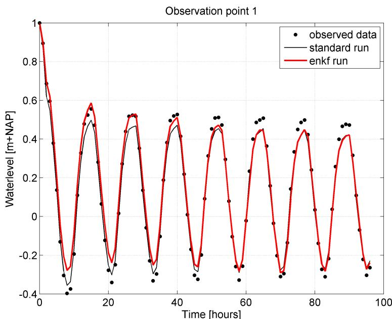

**Figure 22.1:** Visualisation of the EnKF computation results from OpenDA for a certain observation point. The dots represent the observed data, the black line represents the original computation with D-Flow FM (without Kalman filtering) and the red line represents the D-Flow FM computation with Kalman filtering.

### 22.6.3 Example 3: EnKF with uncertainty in the inflow velocity

The geometry in this example is the same as for the calibration example: a two-dimensional river model, the initial waterlevel is zero, the river bed is filled gradually due to the boundary conditions. At the inflow boundary, a constant discharge is prescribed (along the line `<sw_east_dis_0001.pli>`), whereas at the outflow boundary, a constant water level is prescribed (along the line `<sw_west_wlev_0001.cmp>`).

There are 3 observation locations along the river (Obs01, Obs02 and Obs03). The matlab script `<plot_results_hisfile.m>` is available to plot the water level as a function of time for these 3 stations.

Simulation time span is 100 days (Start: 199208310000, End: 199212090000). The noise contribution is found in file `<sw_east_dis_noise.pli>`. Initially, no noise is present, so the file contains zeroes in directory `<input_dflowfm>`.

#### **22.6.4 Example 4: EnKF with uncertainty in the inflow condition for salt**

The geometry in this example and the boundary conditions for waterlevel and velocity are exactly the same as in `simple_waal_kalman`. The transport of salt is added to the computation by a discharge boundary condition `sw_east_dis_sal_001.pli` and a noise component added to this boundary.

#### **22.6.5 Example 5: EnKF with uncertainty on the wind direction**

This example is also converted from a Delft3D-FLOW test case (`d3d_lake_2d`): a lake forced by an uniform wind field. This example is a twin experiment with spatially correlated 2D-noise added to the wind field. The noise is created on cartesian (equidistant grid), the noise realisations are written by OpenDA to the `<lake2d_windx_noise.amu>`. The 2D noise field is interpolated at computational grid by D-Flow FM and added to the uniform wind field. The `<SequentialSimulationNoise.oda>` can be used to perform a single D-Flow FM run where wind with noise is used as forcing. The resulting `<lake2d_his.nc>` file can be used as synthetic observations by the `<stochObserver>`.

#### **22.6.6 Example 6: EnKF with the DCSM v5 model and uncertainty on the wind direction**

This example is converted from the SIMONA DCSM v5 model with spatially correlated 2D-noise added to the wind field.

## 23 Numerical aspects of D-Flow Flexible Mesh

This section contains numerical aspects of D-Flow FM.

### 23.1 Topological conventions for (2D) horizontal grids

In the horizontal a computational cell in a D-Flow FM grid (sometimes referred to as a 'network') consists of corner nodes and edges connecting the corner nodes. Such a grid cell should contain at least three and at most six corner nodes, representing triangles, quadrangles, pentagons and hexagons, respectively. The following topological conventions are used:

- ◇ **net nodes**: corners of a cell (triangles, quadrangles, ...),
- ◇ **net links**: edges of a cell, connecting netnodes,
- ◇ **flow nodes**: the cell circumference, in case of triangles the exact intersection of the three perpendicular bisectors and hence also the centre of the circumscribing circle,
- ◇ **flow links**: a line segment connecting two flownodes.

1. Net (domain discretization)

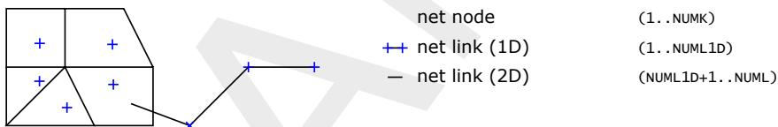

2. Flow data (1D+2D)

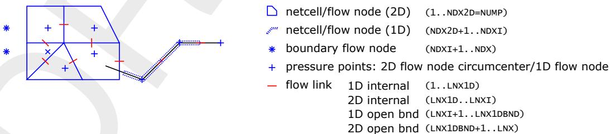

**Figure 23.1: Flexible mesh topology**

This mesh topology is illustrated in Figure 23.1. The 'center' of a cell can be defined in multiple ways. To illustrate this, two conventional cell center definitions for a triangle are highlighted in Figure 23.2. The two displayed cell centers have different properties:

1. 1 the circumcenter is the location within the triangle which is the center point of a circle that intersects the triangle at each corner node of the triangle; as a consequence, the orthogonal projection of the center point to each face of the triangle divides each face into two exactly equidistant pieces,
2. 2 the mass center (or centroid) is the center of gravity; as a consequence, a line through a corner node and the mass center divides a face into two exactly equidistant pieces under an angle not necessarily equal to  $90^\circ$ .

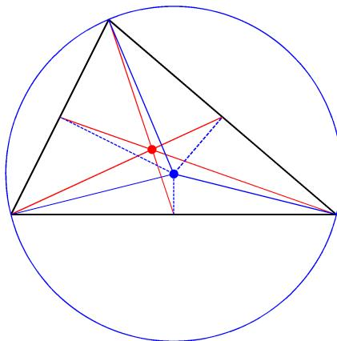

**Figure 23.2:** Two conventional definitions of the cell center of a triangle: the *circumcenter* and the *mass center*.

D-Flow FM utilizes the **circumcenter** as the basis of the definition of the elementary flow variables 'water level' and 'flow velocity'. The water level is defined at the circumcenter, whereas the face normal flow velocity is defined at the orthogonal projection of the circumcenter onto the cell face, i.e., the midpoint of the cell face.

Important properties of the mesh are the *orthogonality* and *smoothness*. The *orthogonality* is defined as the cosine of the angle  $\varphi$  between a flowlink and a netlink. Ideally 0, angle  $\varphi = 90^\circ$ . The *smoothness* of a mesh is defined as the ratio of the areas of two adjacent cells. Ideally 1, the areas of the cells are equal to each other. A nearly ideal setup is shown in Figure 23.3.

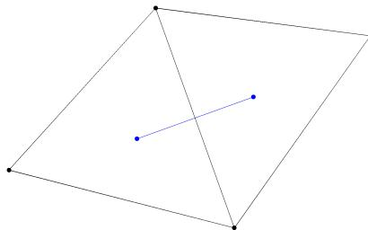

**Figure 23.3:** Perfect orthogonality and nearly perfect smoothness along the edge connecting two triangles. Black lines/dots are network links/nodes, blue lines/dots are flow links/nodes.

It is quite easy (and therefore dangerous) to generate meshes that violate the orthogonality and smoothness requirements. In Figure 23.4, two different setups of two gridcells are shown with different mesh properties.

The left picture of Figure 23.4 shows how orthogonality can be deteriorated by skewing the right triangle with respect to the left triangle. While having the same area (perfect smoothness), the mutually oblique orientation results in poor orthogonality. In this particular case, the centre of the circumscribing circle is in principle located outside the right triangle. Such a triangle is denoted as an 'open' triangle, which is bad for computations.

The opposite is shown in the right picture of Figure 23.4 in which the right triangle has strongly been elongated, disturbing the smoothness property. However, the orthogonality is nearly perfect. Nonetheless, both meshes need to be improved to assure accurate model results.

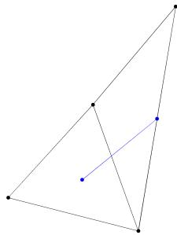

(a) Perfect smoothness, but poor orthogonality.

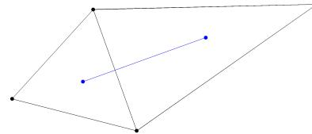

(b) Perfect orthogonality, but poor smoothness

**Figure 23.4:** Poor mesh properties due to violating either the smoothness or the orthogonality at the edge connecting two triangles. Black lines/dots are network links/nodes, blue lines/dots are flow links/nodes.

## 23.2 Notation

The used symbols in this chapter are described in this section.

Time variables:

| $n$          | Time index of the current time step.                |
|--------------|-----------------------------------------------------|
| $\Delta t_n$ | The computational time step size of time step $n$ . |

Computational grid and primary shallow water variables:

| $k$             | Computational grid index for a pressure point ("flow node"),                             |
|-----------------|------------------------------------------------------------------------------------------|
| $j$             | Computational grid index for a velocity point ("flow link"),                             |
| $V_k$           | Volume of water in grid cell $k$ ,                                                       |
| $A_k$           | Wet area of the horizontal water surface in grid cell $k$ .                              |
| $A_{u_j}$       | Wet cross-sectional area ("flow area") of flow link $j$ .                                |
| $A_{1j}/A_{2j}$ | Face-based cross-sectional area flow link $j$ based on left or right side, respectively. |

When a grid cell  $k$  is mentioned, this is essentially the same as a grid point (or calculation point)  $k$ . The term 'grid cell' better captures the concept of a cell-integrated value (such as volume), compared to a cell-averaged point value (such as water level).

Lateral discharges:

| $\ell$                          | Index of a lateral discharge,                                 |
|---------------------------------|---------------------------------------------------------------|
| $\mathcal{L}_{\text{lat},\ell}$ | The set of grid cells selected for lateral discharge $\ell$ . |
| $Q_{\text{lat},\ell,k}$         | The discharge of lateral $\ell$ for grid cell $k$ ,           |
| $Q_{\text{lat},k}$              | Total of all lateral discharges for grid cell $k$ ,           |
| $Q_{\text{in},k}$               | Total of all source terms for grid cell $k$ ,                 |

### 23.3 Definition of bed level options

In section 23.1, the locations of the primary flow variables (water level and flow velocity) have been described. Through Figure 23.2 it has been clarified that the water level is computed at the location of the circumcenter (cell center), whereas the face normal flow velocity is computed at the midpoint of each cell face (face center).

For the computation of these two primary variables, the level of the bed must be known both at the cell center and at the face center. The user can specify the way these values are interpreted from the available bathymetry by means of the MDU-file keywords `BedlevType`, `DpuOpt` and `conveyance2D`. For a proper understanding of the possibilities of D-Flow FM, Figure 23.5 is provided with a three-dimensional representation of two adjacent triangular cells.

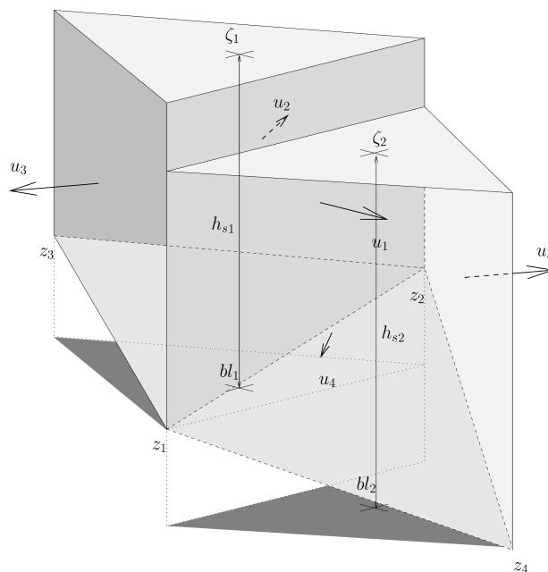

**Figure 23.5:** Definition of the water levels, the bed levels and the velocities in case of two adjacent triangular cells.

To the keyword `BedlevType`, the values 1, 2, 3, 4, 5 and 6 can be assigned. For the keyword `conveyance2D`, the values -1, 0, 1, 2 and 3 are available. The keyword `DpuOpt` can be either 1 or 2; the latter option is currently only available in combination with D-Morphology.

The most common case is the definition of the bed levels at the corner nodes of the cell and a choice for the keyword `BedlevType = 3`. In cases where simulations with sediment transport and/or morphological updating are done (D-Morphology), only the combination of `BedlevType = 1` and `conveyance2D = -1` is allowed. Note that this requirement affects the calibration of hydrodynamic models. If a model is constructed with a potential later application of D-Morphology in mind, the hydrodynamic calibration should be performed with the combination of `BedlevType = 1` and `conveyance2D = -1`. Depending on the choice for `conveyance2D`, the face center bed levels and cell center bed levels are computed.

### 23.3.1 Piecewise constant approach for the bed level

In principle, the bed levels are considered as piecewise constant in space. This approach is followed if  $\text{conveyance2D} < 1$ . The keyword `BedlevType` can be used in combination with the piecewise constant approach as highlighted in the table below. Note that the bed level is defined with respect to the reference level (not to be confused with a water depth given as a positive value downwards). With  $\text{conveyance2D} < 1$ , we have:

| Keyword                 | Value | Cell center bed level                                                  | Face center bed level                                                                     |
|-------------------------|-------|------------------------------------------------------------------------|-------------------------------------------------------------------------------------------|
| <code>BedlevType</code> | 1     | user specified                                                         | the highest <sup>1</sup> cell center bed level considering the two cells next to the face |
| <code>BedlevType</code> | 2     | the lowest face center bed level considering all the faces of the cell | user specified                                                                            |
| <code>BedlevType</code> | 3     | the lowest face center bed level considering all the faces of the cell | the mean corner bed level considering the two corner nodes the face is connecting         |
| <code>BedlevType</code> | 4     | the lowest face center bed level considering all the faces of the cell | the lowest corner bed level considering the two corner nodes the face is connecting       |
| <code>BedlevType</code> | 5     | the lowest face center bed level considering all the faces of the cell | the highest corner bed level considering the two corner nodes the face is connecting      |
| <code>BedlevType</code> | 6     | the mean corner bed level considering all the corners of the cell      | the highest <sup>1</sup> cell center bed level considering the two cells next to the face |

The former `Delft3D-FLOW` version, running on curvilinear meshes, has utilized the piecewise constant approach for bed levels as well. The treatment of the bed level itself is, however, different from D-Flow FM. In `Delft3D-FLOW`, the user can distinctly specify the treatment type for the cell center bed level and the face center bed level. In D-Flow FM, the choice for the one implies the choice for the other. A strict, *exact* match of settings for which `Delft3D-FLOW` and D-Flow FM treat the bed similarly, is not facilitated. Hence, the user himself should take care in comparing the `Delft3D-FLOW` results and D-Flow FM results when it comes to the bed level treatment settings.

### 23.3.2 Piecewise linear approach for the bed levels

A piecewise linear bed level approach can be chosen for through setting  $\text{conveyance2D} \geq 1$ . In this case, only the approach for `BedlevType` equal to 3, 4 and 5 is affected. With  $\text{conveyance2D} \geq 1$ , we have:

| Keyword                 | Value   | Cell center bed level                                                  | Face center bed level                                                                                |
|-------------------------|---------|------------------------------------------------------------------------|------------------------------------------------------------------------------------------------------|
| <code>BedlevType</code> | 3, 4, 5 | the lowest corner node bed level considering all the nodes of the cell | linearly varying from the bed level at the one corner node to the bed level at the other corner node |

Notice that the choice for either `BedlevType` equal to 3, 4 or 5 does not imply different bed level treatment approaches. For the case  $\text{conveyance2D} \geq 1$ , the bed is assumed linearly varying within

<sup>1</sup>This is the default behaviour in case `DpuOpt=1`. When `DpuOpt=2`, the mean value of the two cells next to the face is used. This option is only available in combination with D-Morphology.

a face only to compute the wet cross-sectional area of the vertical face; it should, however, be remarked that for the computation of the water column volume in a cell, this linear variation of the bed is *not* taken into account.

### 23.3.3 Hybrid bed level approach

In addition to the previously described bed level treatment approaches, D-Flow FM facilitates a hybrid approach for the computation of the cell center bed level by means of the keywords `blminabove` and `blmeanbelow`. In this approach, the cell center bed level is computed as the mean of the associated face center bed levels, be it only below the user specified level `blmeanbelow`. For levels above the user specified level `blminabove`, the minimum value of the associated face center bed levels is used. In between these two user specified levels, the bed levels are constructed by means of a linear interpolation between the two approaches' results.

### 23.3.4 Specification in the User Interface

The specification of the treatment of the bed level locations can be achieved through the tab fields 'Numerical Parameters' and 'Physical Parameters'.

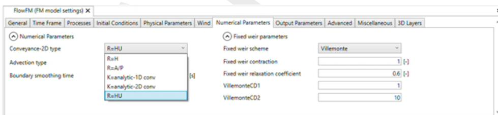

*Figure 23.6: Specification of the conveyance option in the User Interface.*

The tab field 'Numerical Parameters' contains the choice for the conveyance options: see Figure 23.6).

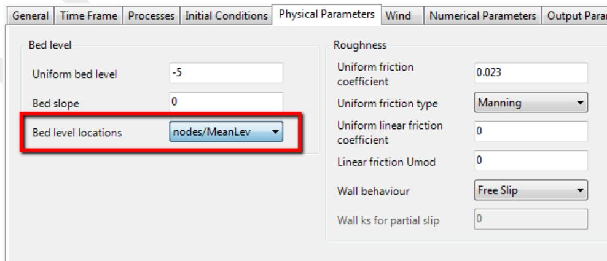

*Figure 23.7: Specification of the bed level treatment type in the User Interface.*

The tab field 'Physical Parameters' contains the choice for the Bed level locations. Five options are facilitated: `BedlevType` numbers 1 up to 5; the option 6 is not facilitated in the user interface.

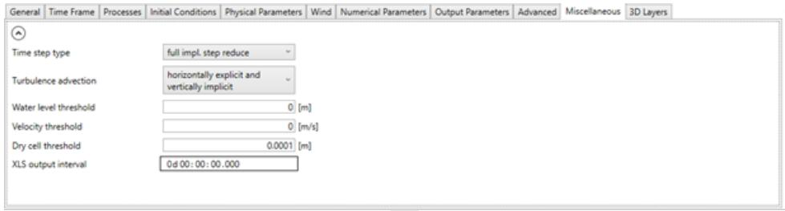

**Figure 23.8:** Specification of the hybrid bed options (with keywords blminabove and blmeanbelow).

By means of the tab field 'Miscellaneous', the hybrid options with the keywords blminabove and blmeanbelow can be enabled.

### 23.4 The location of open boundaries

The boundaries of a river, an estuary or a coastal sea are in general curved and are less smoothly represented on a structured grid. The boundary becomes irregular and may introduce significant discretization errors. To reduce these errors unstructured grids are used. The unstructured grids also allow local grid refinement in areas with large horizontal gradients.

The flow engine needs the location for the boundary conditions. In 2D models, this is done by providing a polyline with support points (also see section 7.4.8.1). By default, these support points are a means to construct a series of virtual cell centers along the boundary rim of the grid. Figure 23.9 provides an image of the concept of virtual boundary cells in 2D.

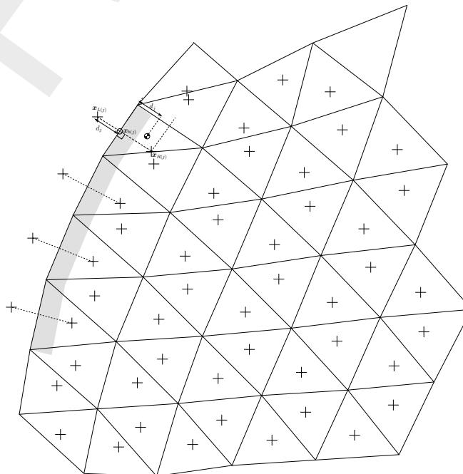

**Figure 23.9:** Virtual boundary 'cells' near the shaded boundary;  $x_{Lj}$  is the virtual 'cell' pressure point near boundary edge  $j$ ;  $x_{R(j)}$  is the inner cell's circumcenter;  $x_b(j)$  is the point on edge  $j$  that is nearest to the inner cell's circumcenter

The support points are stored as one single polyline file per boundary condition, marking the rim along which the boundary conditions should hold. The polyline should be drawn in the vicinity of the rim. The

user can specify the size of this 'vicinity' by means of the MDU-file keyword OpenBoundaryTolerance. The keyword specifies the search tolerance factor between the boundary polyline and the grid cells. The unit of this keyword is the cell size unit (i.e., not metres). By default, this value is 3, which loosely means that in the vicinity of  $3\Delta x$  of the grid rim is searched of a boundary condition polyline.

The actual location of a specific boundary location point can be computed in two different ways, dependent on the user's choice for the keyword `izbndpos` in the mdu-file:

1. 1 `izbndpos = 0`: construction of the boundary condition point by means of orthogonal mirroring of the closest cell center (default),
2. 2 `izbndpos = 1`: construction of the boundary condition point as the orthogonal projection of the closest cell center onto the grid rim.

The following explanation uses both the mass center and the circumcenter, which are often different in 2D grid cells. For 1D gids, these two are identical.

Option `izbndpos = 0` 'mirrors' the internal cell closest to the boundary outward, to produce the virtual boundary point. The mirroring of the closest cell center is conducted as follows. First, the orthogonal distance from the cell's mass center to the actual rim of the grid is computed:  $d_j$  in Figure 23.9. Second, the cell circumcenter (pressure point)  $x_{L(j)}$  is projected orthogonally onto the grid cell outer edge. The virtual boundary cell's pressure point ( $x_{R(j)}$ ) is defined at a distance  $\frac{1}{2}d_j$  starting at that projected point  $x_{b(j)}$ . Sometimes the flat area of the cell, say  $A$ , at the rim can give rise to an adaptation of this distance. If  $\frac{1}{2}\sqrt{A} > d_j$ , then the center of the virtual cell is located at the a distance  $\frac{1}{2}\sqrt{A}$  away from the grid.

The first part in Figure 23.10 shows how in a regular grid the mass center and circumcenter coincide, with an exactly mirrored virtual boundary point. Also, the resulting placement of the pressure points in the 2D and 1D example grid is identical.

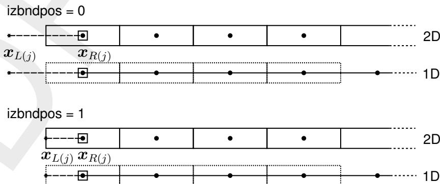

**Legend:**

| <input type="checkbox"/> | 2D grid cell/control volume | <input type="checkbox"/> | center of mass          |
|--------------------------|-----------------------------|--------------------------|-------------------------|
| <input type="checkbox"/> | 1D grid cell/control volume | •                        | pressure point          |
| •                        | flow link (internal)        | •                        | boundary pressure point |
| •----                    | flow link (boundary)        |                          |                         |

**Figure 23.10:** Position of virtual boundary point, depending on `izbndpos` setting.

Option `izbndpos = 1` is mainly intended to force a water level boundary exactly on the outer edge of a 2D grid cell. The second part in Figure 23.10 shows how the pressure point now lies on that 2D edge. In 1D networks, the virtual pressure point is placed *half* an edge length outward (instead of a full edge length for `izbndpos = 0`). This ensures that it is possible to create a 2D gridded channel and an exactly equivalent 1D channel branch, with the same pressure point locations.

### 23.4.1 Geometry of open boundaries

The virtual boundary points as introduced above inherit some additional geometric parameters from their neighbouring internal grid point:

- ◇ the bed level of the boundary point is set equal to the bed level of the internal pressure point:  
   $bl_{L(j)} = bl_{R(j)}$ ;
- ◇ the boundary flow link width is different for 1D and 2D boundaries:
  - □ 2D: The boundary flow link width is equal to the 2D edge width:  $w_{uj} = w'_{uj}$
  - □ 1D: The boundary flow link  $j$  inherits the entire cross section geometry of the first neighbouring internal flow link  $j'$  (that is: width, area, perimeter). If no such cross section is available on link  $j'$ , then the default uniform width `UniformWidth1D` is used.

#### 23.4.1.1 Conveyance in 2D

Bed friction often plays a major role in the discharge capacity and expected maximum water levels of channels and gullies. If we model a trapezoidal channel with sloping sidewalls on a grid with 6 grid cells across the width of the channel, a typical cross section using the standard bed representation with uniform depth appears per cell (Figure 23.11a). In D-Flow FM, we allow for representation of a locally sloping bed as shown in Figure 23.11b.

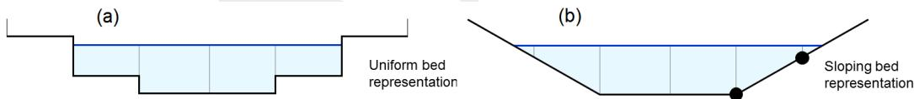

**Figure 23.11:** Bed representation with uniform depth levels (a), and locally sloping bed (b).

The most left and the most right cell are not yet wet in the uniform bed representation. In the sloping bed representation, these outer cells are partly wet, yielding a more accurate description of the total wet cross sectional area. The user can select whether to apply this more accurate description or not. This can only be done only in combination with a net-node based bathymetry description, i.e. using the keyword `BedLevType = 3` in the `.mdu` file.

For the bed friction in 2D models, one implicitly assumes a fully developed vertical velocity profile, using a logarithmic function of the water depth for the White-Colebrook bed friction formulation, or a one-sixth power function of the water depth for the Manning formulation. In a sloping cell, the local water depth is varying over the width of the cell. In the deeper part flow velocities will be higher than in the shallower part. Bed stresses will vary over the width of a cell with water depth and with the velocity. Integrating the stresses over the width of a cell one can derive the resulting total stress.

The bed friction term is not only a function of the normal velocity component in the direction of the flow link itself, but also depends on the tangential velocity component and with that on the total velocity. For each of the four components water depth, normal velocity, total velocity and Chézy parameter, we assume a linear variation over the width (Figure 23.12).

If we have in the `.mdu` file `Conveyance2D = 3`, the 2D analytic conveyance description using these four linearly varying components is applied. This option shows best grid convergence behaviour. Good grid convergence implies that the converged answer can be achieved on a coarser grid, thus saving computational costs.

If one sets `Conveyance2D = 2`, the tangential velocity component is assumed zero. This method is only applicable on curvilinear grids that are aligned with the flow direction.

If one sets `Conveyance2D = 1`, both the normal and tangential velocity component are assumed constant over the width. Effectively one obtains the so called 'lumped' bed friction approach, with hydraulic radius  $R = A/P$ ,  $A$  being the wet cross sectional area and  $P$  the wet perimeter. This

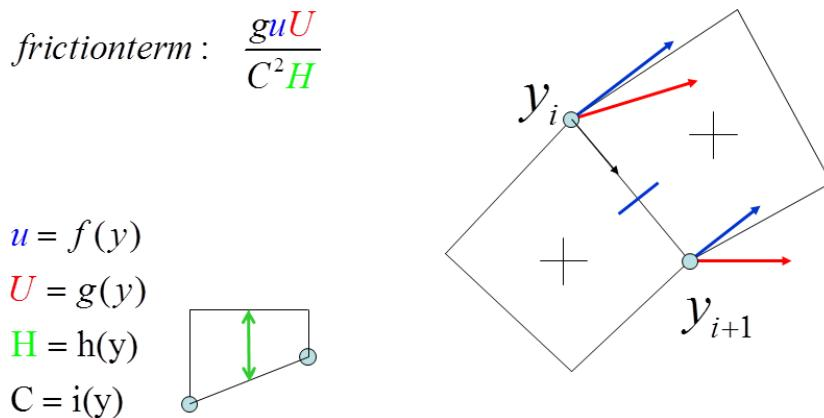

**Figure 23.12:** A shematic view of the linear variation over the width for calculating the flow parameters.

method works equally well as methods 2 and 1, provided that there is sufficient resolution of a gully in the grid. It is found that when a gully is resolved by more than about 10 or 12 cells, it provides almost identical answers as method 2, while saving some 10 % computational overhead compared to method 2.

Setting Conveyance2D = -1, the hydraulic radius is based on a uniform bed level at the velocity point taken as the average bed level of the two surrounding net nodes.

Setting Conveyance2D = 0, the hydraulic radius is based on a uniform bed level at the velocity point taken as the average bed level of the two surrounding water level points. This option is not advisable because cell bed levels are taken as the minimum value of the bed levels of attached link. So a min-max operator is invoked, which is not suitable for accuracy.

Keyword Conveyance2D deals with the bed level at the velocity points (i.e., at flow links or cell edges) in the case of a net-node based bathymetry description (i.e. BedLevType = 3). When using a cell-centre based bathymetry description (i.e. BedLevType = 1) [geometry] keyword Dpuopt can be used to this end. Using the default value Dpuopt = 1, the bed level at links is the maximum of the adjacent cell-centre bed levels (i.e. of the bed levels connected by a link). Setting Dpuopt = 2 computes the bed level at links as the mean value between the adjacent cell-centre bed levels.

Please note that setting Dpuopt = 2 should not be confused with a piece-wise linear interpretation of the bed level. The bed level for BedLevType = 1 is considered piece-wise constant and that is still the way in which the volumes are computed. The keyword Dpuopt only changes the way in which the bed level at the interface between two tiles is computed.

The default maximum bed level at links causes the flow depth at links to be minimum, which guarantees that there is no flooding of a dry cell of which the bed level is higher than the water lower of the wet cell. On the contrary, using the mean bed level at links may cause a positive flow depth at the link while the bed level of the dry cell is higher than the water level of the wet cell.

Computing the bed level at links as the mean value of the adjacent cell-centres (i.e. Dpuopt = 2) is particularly relevant for morphodynamic simulations. This increases the accuracy of the results, as the default maximum option causes a first-order upwind/downwind reconstruction while the mean ensures a second-order central reconstruction.

### 23.5 Drying and flooding

Estuaries and coastal embayments contain large, shallow, and relatively flat areas separated and interleaved by deeper channels and creeks. When water levels are high, the entire area is covered by water. But as tide falls, the shallow areas are exposed, and ultimately the flow is confined only to the deeper channels. The dry tidal flats may occupy a substantial fraction of the total surface area. The accurate reproduction of covering or uncovering of the tidal flats is an important feature of numerical flow models based on the shallow water equations.

Many rivers have compound channels, consisting of a main channel that always carries flow (the summer bed) and one or two flood plains which only convey flow during extreme river discharges (the winter bed). The summer bed is surrounded by low dykes, which could be overtopped if the river discharge increases. The winter-bed is surrounded by much higher dykes, which are designed to protect the polders against water levels due extreme river discharges. The flooding of the flood plains increases the drainage capacity of the river and reduces the local water level gradients.

In a numerical model, the process of drying and flooding is represented by removing grid points from the flow domain that become *dry* when the tide falls and by adding grid points that become *wet* when the tide rises. Drying and flooding is constrained to follow the sides of grid cells. In this section, we specify the algorithms which have been used to determine the moment when a grid cell (water level point) or cell boundary (velocity point) becomes dry or wet. Drying and flooding gives a discontinuous movement of the closed boundaries and may generate small oscillations in water levels and velocities. The oscillations introduced by the drying and flooding algorithm are small if the grid sizes are small and the bottom has smooth gradients.

Essential elements of the wetting and drying algorithm are the definition of the water level, the definition of the bed level and the criteria for setting a velocity and/or water level point wet or dry. In the following subsections, these three items will be discussed.

### 23.5.1 Dry/wet criterion at cell faces

The parameter  $\varepsilon_{hu}$  (c.f. Epshu Table A.1) describes the threshold depth at cell faces. When the water depth at cell faces exceeds this ( $h_u > \varepsilon_{hu}$ ) value the cell is considered wet and otherwise it is dry.

### 23.5.2 Dry/wet criterion at cell circumcenters

A research keyword *TestDryingFlooding* (Table A.1) is available for determining if the water depth is positive at cell circumcenters. To compute this, a variable  $d_{trsh}$  is introduced and when the water depth exceeds this value a cell is considered to be wet ( $h > d_{trsh}$ ).

The default value is *TestDryingFlooding* = 0 (D-Flow FM), and considers the threshold for positivity as  $d_{trsh} = 0$ . Option 1 is the Delft3D 4 default:

$$d_{trsh} = \max(10^{-9}, \min(\varepsilon_{hu}, 10^{-3})).$$

The last option 2 sets ( $d_{trsh} = 0$ ) and furthermore considers a minimum volume for the transport solver based on the product of  $\varepsilon_{hu}$  and the flow cell area. The last setting is introduced to improve the stability of the transport computations, and can be activated if the default option leads to instabilities in the constituents.

### 23.6 Advection at open boundaries

In hydrodynamic models, it is common practice to apply high-resolution grids in domains of limited extent, for instance to investigate the influence of a dam design on local flow patterns in a coastal area. Then, the challenge is to prescribe appropriate boundary conditions for such a detailed model. Tidal motion is often important and therefore water levels have to be prescribed. If an overall model with good reproduction of water levels and velocities is available, then it is common practice to start with water levels from the overall model on the open alongshore boundary and on both cross-shore boundaries of the detail model. Then, often the reproduction of water levels is accurate, but the reproduction of flow velocities might be less accurate. In particular, the residual flow velocities might be inaccurate.

Obtaining a good velocity reproduction by prescribing only water levels often only works for the larger models (e.g. > 30 km) so that bed friction, pressure gradient and acceleration can balance each other. In smaller models, however, this might not be the case. Even small water level differences on the open boundaries may introduce unrealistic high or low velocities. A remedy might be to apply velocity boundaries or other types of boundary conditions (Neumann-type, ...) on the cross-shore boundaries. However, this often reduces reproduction quality of water levels or might introduce strange flow patterns. Also the existence of stratification may also lead to unrealistic currents near open boundaries.

Therefore, in D-Flow FM the keyword Zerozbndinflowadvection can be activated in order to suppress unphysical currents near open boundaries. This applies for all water level open boundaries. This keyword has to be specified in group [numerics] and the options are Zerozbndinflowadvection=0,1 or 2. A value of 0 results into the default Neumann approach for currents, yielding that the gradient in velocity at the open boundary is zero. This approach is the default and applied when keyword Zerozbndinflowadvection is not specified. Applying a value of 1 forces cell center velocities to zero on the open boundary at *inflow* for all water level boundaries. A value of 2 forces cell center velocities to zero on the open boundary for both *inflow* and *outflow* for all water level boundaries.

Another option is to apply a so-called *advection* boundary, which can be specified via keyword uxuyadvectionvelocitythe as part of the boundary conditions in the ext-file; see Section C.6.5. For this option, both the  $x$ - and  $y$ -components of the velocity vector at the boundary have to be specified in the boundary condition file, in bc format (.bc). To be more precise, one needs to prescribe the  $x$ - and  $y$ -components of the velocity vector in the circumcenter of the virtual boundary cells (outside the domain boundary). It is not necessary to rotate these components in the direction normal to some local boundary. They are from West to East and from South to North components.

### 23.7 Artificial mixing due to sigma-coordinates

The  $\sigma$ -transformation is boundary-fitted in the vertical. The bottom boundary and free surface are represented smoothly. The water column is divided into the same number of layers independent of the water depth. In a  $\sigma$ -model, the vertical resolution increases automatically in shallow areas.

For steep bottom slopes combined with vertical stratification,  $\sigma$ -transformed grids introduce numerical problems for the accurate approximation of horizontal gradients both in the baroclinic pressure term and in the horizontal diffusion term. Due to truncation errors artificial vertical mixing and artificial flow may occur, Leendertse (1990) and Stelling and Van Kester (1994). This artificial vertical transport is sometimes called "creep".

Let  $z_b$  be the position of the bed and  $H$  the total water depth. If we consider the transformation from Cartesian co-ordinates to  $\sigma$  co-ordinates, defined by:

$$x = x^*, y = y^*, \sigma = \frac{z - z_b}{H} \quad (H = \zeta - z_b) \quad (23.1)$$

as result  $\sigma = 0$  at the bed level and  $\sigma = 1$  at the free surface. The horizontal pressure gradient reads:

$$\frac{\partial p}{\partial x} = \frac{\partial p^*}{\partial x^*} \frac{\partial x^*}{\partial x} + \frac{\partial p^*}{\partial \sigma} \frac{\partial \sigma}{\partial x} = \frac{\partial p^*}{\partial x^*} - \frac{1}{H} \left( \frac{\partial z_b}{\partial x} + \sigma \frac{\partial H}{\partial x} \right) \frac{\partial p^*}{\partial \sigma}. \quad (23.2)$$

In case of vertical stratification near steep bottom slopes, small pressure gradients at the left-hand side may be the sum of relatively large terms with opposite sign at the right-hand side.

Small truncation errors in the approximation of both terms result in a relatively large error in the pressure gradient.

This artificial forcing produces artificial flow.

The truncation errors depend on the grid sizes  $\Delta x$  and  $\Delta z$ .

the notation used by Haney (1991) this consistency relation is given by:

$$\left| \frac{\sigma}{H} \frac{\partial H}{\partial x} \right| < \left| \frac{\partial \sigma}{\partial x} \right| \quad (23.3)$$

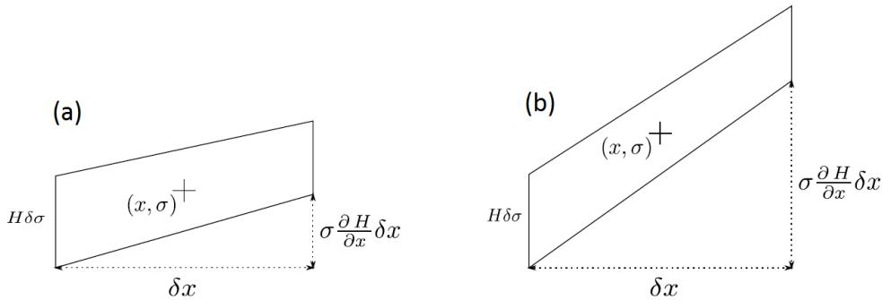

**Figure 23.13:** Example of a hydrostatic consistent and inconsistent grid; (a)  $H\delta\sigma > \sigma \frac{\partial H}{\partial x} \delta x$ , (b)  $H\delta\sigma < \sigma \frac{\partial H}{\partial x} \delta x$ 

From this equation, it can be seen that by increasing the number of  $\sigma$ -levels the consistency condition will eventually be violated.

Similarly, for the horizontal diffusion term, the transformation from Cartesian co-ordinates to  $\sigma$  co-ordinates leads to various cross derivatives. For example, the transformation of a simple second order derivative leads to:

$$\frac{\partial^2 c}{\partial x^2} = \frac{\partial^2 c^*}{\partial x^{*2}} + \left( \frac{\partial \sigma}{\partial x} \right)^2 - \frac{\partial^2 c^*}{\partial \sigma^2} + 2 \frac{\partial \sigma}{\partial x} - \frac{\partial^2 c^*}{\partial x^* \partial \sigma} + \frac{\partial^2 \sigma}{\partial x^2} - \frac{\partial c^*}{\partial \sigma} \quad (23.4)$$

For such a combination of terms it is difficult to find a numerical approximation that is stable and positive, see Huang and Spaulding (1996). Near steep bottom slopes or near tidal flats where the total depth becomes very small, truncations errors in the approximation of the horizontal diffusive fluxes in  $\sigma$ -co-ordinates are likely to become very large, similar to the horizontal pressure gradient.

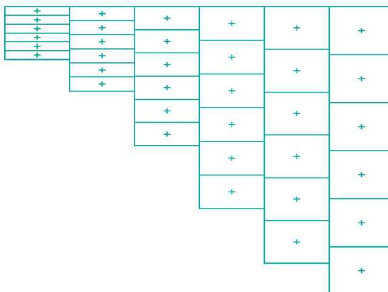

**Figure 23.14:** Finite Volume for diffusive fluxes and pressure gradients

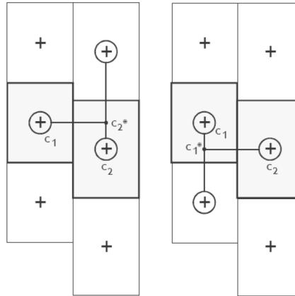

**Figure 23.15:** Left and right approximation of a strict horizontal gradient

In D-Flow FM the stress tensor is redefined in the  $\sigma$  co-ordinate system assuming that the horizontal length scale is much larger than the water depth (Mellor and Blumberg, 1985) and that the flow is of boundary-layer type. The horizontal gradients are taken along  $\sigma$ -planes. This approach guarantees a positive definite operator, also on the numerical grid (Beckers *et al.*, 1998).

If the same approach is used for the horizontal diffusion operator in the transport equation:

$$\frac{\partial^2 c}{\partial x^2} \approx \frac{\partial^2 c^*}{\partial x^{*2}} \quad (23.5)$$

Horizontal diffusion will lead to vertical transport of matter through vertical stratification interfaces (pycnocline) which is nonphysical. A more accurate, strict horizontal discretization is needed.

In D-Flow FM an option is available that minimises artificial vertical diffusion and artificial flow due to truncation errors. A method has been implemented which gives a consistent, stable and monotonic approximation of both the horizontal pressure gradient and the horizontal diffusion term, even when the hydrostatic consistency condition equation is not fulfilled. This "anti-creep" option is based upon a Finite Volume approach; see Figure 23.14. The horizontal diffusive fluxes and baroclinic pressure gradients are approximated in Cartesian co-ordinates by defining rectangular finite volumes around the  $\sigma$ -co-ordinate grid points. Since these boxes are not nicely connected to each other, see Figure 23.15, an interpolation in  $z$  co-ordinates is required to compute the fluxes at the interfaces.

Since the centres of the finite volumes on the left-hand side and right-hand side of a vertical interval are not at the same vertical level, a  $z$ -interpolation of the scalar concentration  $c$  is needed to compute strictly horizontal derivatives. The values obtained from this interpolation are indicated by  $c_1^*$  and  $c_2^*$  respectively in Figure 23.15. (Stelling and Van Kester, 1994) apply a non-linear filter to combine the two consistent approximations of the horizontal gradient,

$$\begin{aligned} s_1 &= (c_2^* - c_1) / \Delta x \text{ and } s_2 = (c_2 - c_1^*) / \Delta x \\ \text{If } s_1 \times s_2 &< 0 \text{ Then} \\ \frac{\Delta c}{\Delta x} &= 0 \\ \text{Else} \\ \frac{\Delta c}{\Delta x} &= \text{sign}(s_1) \times \min(|s_1|, |s_2|) \\ \text{Endif} \end{aligned} \quad (23.6)$$

If an interval has only grid boxes at one side, the derivative is directly set to zero. The horizontal fluxes are summed for each control volume to compute the diffusive transport. The integration of the horizontal diffusion term is explicit with time step limitation:

$$\Delta t \leq \frac{1}{D_H} \left( \frac{1}{\Delta x^2} + \frac{1}{\Delta y^2} \right) \quad (23.7)$$

The derivatives are used in the integral for the baroclinic pressure force in the momentum equation:

$$P_x(x, z) = \frac{1}{\rho_0} \int_z^\zeta g \frac{\partial \rho(x, s)}{\partial x} ds \quad (23.8)$$

Originally, this approach was implemented in Delft3D-FLOW. Slørdal (1997) stated that the above approximation may sometimes produce errors of the same sign which leads to a systematic underestimation of the baroclinic pressure term. This underestimation can be ascribed to the non-linear filter, which selects the minimum of the two gradients under consideration. This limiter is fully analogous to the min-mod limiter used for the construction of monotone advection schemes (Hirsch, 1990). Since the same approximation of the horizontal gradient is used for the horizontal diffusion flux, it is important to ensure that the difference operator is positive definite in order to get physically realistic solutions. The maximum and minimum of a variable being transported by diffusion do not increase or decrease (min-max principle). By taking the minimum of the gradients, Stelling and Van Kester (1994) show that, the min-max principle is fulfilled. Beckers *et al.* (1998) show that any nine-point consistent linear discretization of the horizontal diffusion on the  $\sigma$ -grid does not fulfil the min-max principle. From numerical tests Slørdal (1997) concluded that the underestimation is reduced by increasing the vertical resolution, but is sometimes enhanced by increasing the horizontal resolution.

Let  $s_4$  be a consistent approximation of the horizontal gradient  $s_4 = (s_1 + s_2)/2$ . Slørdal (1997) suggested to take  $s_4$  as approximation of the horizontal gradient. He calls his approach the "modified Stelling and Van Kester scheme". It is equivalent to linear interpolation at a certain  $z$ -level before taking the gradient. It is more accurate than taking the minimum of the absolute value of the two slopes  $s_1$  and  $s_2$  but it does not fulfil the min-max principle for the diffusion operator. It may introduce wiggles and a small persistent artificial vertical diffusion (except for linear vertical density distributions). Due to the related artificial mixing, stratification may disappear entirely for long term simulations, unless the flow is dominated by the open boundary conditions.

By introducing an additional approximation of the horizontal gradient in the filter algorithm defined by  $s_3 = (c_2 - c_1)/\Delta x$ , the stringent conditions of the minimum operator can be relaxed somewhat. The drawback of underestimation of the baroclinic pressure force reported by Slørdal (1997) can be minimised without loosing that the method fulfils the min-max principle. This third gradient  $s_3$ , which is consistent for  $\min(|s_1|, |s_2|) < s_3 < \max(|s_1|, |s_2|)$ , has point-to-point transfer properties and therefore leads to a positive scheme for sufficiently small time steps. The following non-linear approach presently available in D-Flow FM is both consistent and assures the min-max principle:

```
If  $s_1 \times s_2 < 0$  Then
     $\frac{\Delta c}{\Delta x} = 0$ 
Elseif  $|s_4| < |s_3|$  Then
     $\frac{\Delta c}{\Delta x} = s_4$ 
Elseif  $\min(|s_1|, |s_2|) < |s_3| < \max(|s_1|, |s_2|)$  Then
     $\frac{\Delta c}{\Delta x} = s_3$ 
Else
     $\frac{\Delta c}{\Delta x} = \text{sign}(s_1) \min(|s_1|, |s_2|)$ 
Endif
```

The method requires a binary search to find the indices of neighbouring grid boxes, which is time consuming. The increase in computation time is about 30 %.

If the streamlines are strictly horizontal, transport of matter discretised on a  $\sigma$  co-ordinate grid may still generate some numerical vertical diffusion by the discretisation of the advection terms.

## 24 Tutorial

This chapter includes a number of basic tutorials on setting up and running a hydrodynamic simulation with D-Flow FM 2D3D. Different functionalities of this module will be discussed in the upcoming exercises. In each exercise, a step-by-step approach is used to set-up a different type of model. Each model that is created is a hypothetical model with randomly chosen dimensions and parameters.

However, before you start with these tutorials, it is important to learn some basic grid concepts, which have been described in Section 23.1.


**Note:** in this chapter, read for Delft3D Flexible Mesh Suite either “D-HYDRO Suite” or “Delft3D Flexible Mesh Suite”.

### 24.1 Tutorial Hydrodynamics for depth-averaged (2D) modelling

#### 24.1.1 Outline of the tutorials

In this three-hours tutorial you will experience the basic functionality of D-Flow FM. On the one hand you will learn how to capture a certain area with a computational grid. On the other hand you will set up and run a computation yourself. This involves for example inserting a bed level, imposing boundary conditions, running a D-Flow FM model and postprocessing with a D-Flow FM output file. This manual contains nine tutorials (with indication of the estimated time):

- ◇ Tutorial 1 (section 24.1.2): Creating a curvilinear grid (25 minutes).
- ◇ Tutorial 2 (section 24.1.3): Creating a triangular grid (20 minutes).
- ◇ Tutorial 3 (section 24.1.4): Coupling multiple distinct grids (15 minutes).
- ◇ Tutorial 4 (section 24.1.5): Inserting a bed level (15 minutes).
- ◇ Tutorial 5 (section 24.1.6): Imposing boundary conditions (25 minutes).
- ◇ Tutorial 6 (section 24.1.7): Defining output locations (15 minutes).
- ◇ Tutorial 7 (section 24.1.8): Defining computational parameters (10 minutes).
- ◇ Tutorial 8 (section 24.1.9): Running a model simulation (20 minutes).
- ◇ Tutorial 9 (section 24.1.10): Viewing the output of a model simulation (15 minutes).

The necessary input files for a tutorial can be found in the folders *tutorial01* through *tutorial09*. When saving your model data while working through these tutorials, be sure not to overwrite the tutorial data. Ideally, you should create a separate working folder somewhere else on your computer to save your work. The folder *finished* in each tutorial folder contains the output generated by Deltares as a reference.

We will use the Western Scheldt and the harbour of Antwerp as an example case for generating a grid and for setting up and running a computation.

#### 24.1.2 Tutorial 1: Creating a curvilinear grid

Generating grids is done with the RGFGRID tool. Because this is an iterative process and the Undo functionality in RGFGRID is still rather limited, it is important to frequently save intermediate RGFGRID results. By clicking on `Esc` it is sometimes possible to undo the last action. RGFGRID is a separate tool that communicates with the Delft3D Flexible Mesh Suite GUI through a temporary folder whose path is shown in the top menu bar. In order to transfer the generated grid to the Delft3D Flexible Mesh Suite GUI, be sure to save your data to this path when leaving RGFGRID.

To start RGFGRID in the Delft3D Flexible Mesh Suite Graphical User Interface the following steps have to be carried out:

- ➤ Double click on the Delft3D Flexible Mesh Suite icon on the desktop of your computer.
- ➤ Click on *New Model* in the main toolbar at the top of the Delft3D Flexible Mesh Suite GUI.
- ➤ A new window pops up in which you have to select *Flow Flexible Mesh Model* → *OK*.
- ➤ Double click on *Grid*, see Figure 24.1. RGFGRID will now start.

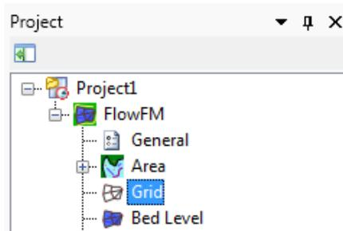

**Figure 24.1:** Start RGFGRID by a double-click on Grid.

- ➤ Choose from the main menubar *Coordinate System* → *Cartesian Coordinates*. This is the default setting, which means that you do not have to change anything.

A curvilinear grid is iteratively generated by first drawing splines. The approach is as follows: deltashe

- ➤ Import a land boundary via *File* → *Attribute Files* → *Open Land Boundaries* and select the file <tutorial01\scheldtriver.ldb>
- ➤ Select *Edit* → *Splines* → *New* and draw a spline roughly following the left boundary of the river (use the leftmousebutton). Finalise the spline by one rightmouseclick. Now we want to bring (attach) the spline close to the boundary.
- ➤ Choose the option *Edit* → *Splines* → *Attach to Land Boundary*. Select the two outer points delimiting the spline to be snapped. The vertices which will be snapped are now marked by a square. Press the rightmousebutton to perform the snapping.
- ➤ A window appears for extra snapping: Press *Yes* several times. You will see the spline evolve towards the land boundary. Press *No* when you are satisfied with the result.
- ➤ Repeat the previous three steps for the righthandside spline.
- ➤ Draw a third spline along the river axis; see Figure 24.2.

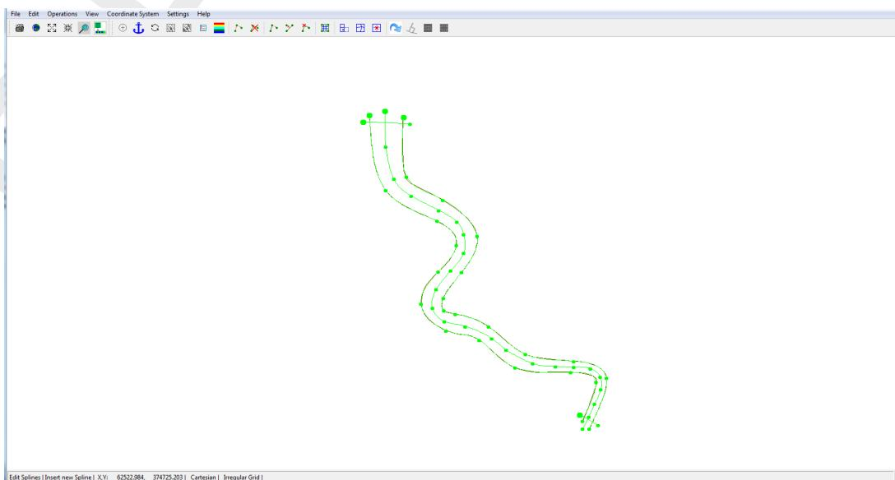

**Figure 24.2:** Splines in Tutorial01

- ➤ Draw two cross-splines, each containing exact two vertices: one spline at the North side and one spline at the South side of the river (see Figure 24.2). The channel is now enveloped by four splines and there is an extra spline along the river axis. Now we can grow a grid from these splines.
- ➤ Choose *Settings* → *Grow Grid from Splines*... You will be able to set several settings for this process. Take over the values shown in Figure 24.3.

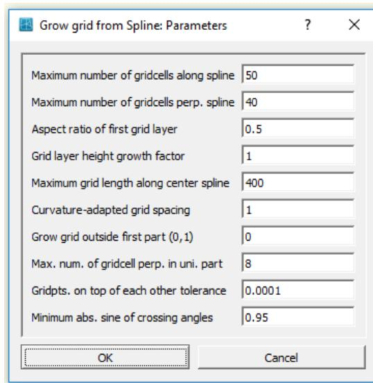

**Figure 24.3:** Settings for the Grow Grid from Splines *procedure*.

A brief explanation:

- ◇ Using the parameter *Max. num. of gridcells perp. in uni. part*, the user can give an indication of the number of cells across the width between the longitudinal splines.
- ◇ By using the parameters *Maximum grid length along center spline*, the user can give an indication of the length of the cells in longitudinal direction. Based on the value of the parameter *Aspect ratio of first grid layer*, the algorithm establishes a suitable grid, under the restrictions of the prevailing maximum numbers of gridcells (first two entries).
- ◇ The option *Grid layer height growth factor* enables the user to demand for a non-equidistant grid in cross-sectional direction. The value represents the width-ratio of two adjacent cells. Using the option *Grow grid outside first part (0/1)*, one can extend a grid outside the longitudinal splines, for instance to capture winterbed regions.

➤ After entering the values of Figure 24.3, choose *Operations* → *Grow Grid from Splines*. This will deliver the grid as shown in Figure 24.4.

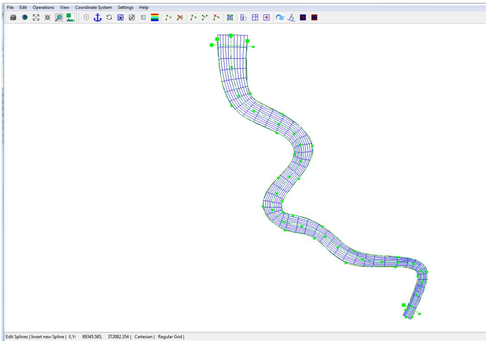

**Figure 24.4:** Generated curvilinear grid after the new Grow Grid from Splines procedure.

- ➤ To be able to further improve the grid, choose *Operations* → *Convert grid* → *Regular to Irregular*. Strictly, the grid is now not curvilinear anymore, but unstructured.
- ➤ Choose *View* → *Grid Property Style* → *Coloured Edge* and then *View* → *Grid Property* → *Orthogonality*. The result is shown in Figure 24.5. We remark that no orthogonalisation iterations have been performed yet. Try to reach the level of orthogonality as shown in Figure 24.5. By clicking on Menu option *Operations* → *Orthogonalize* the orthogonality can be improved.

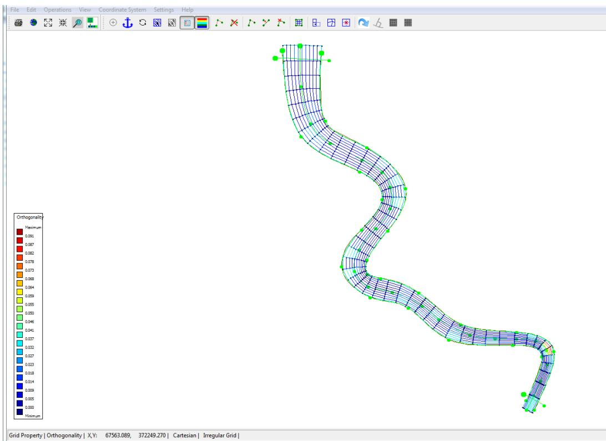

**Figure 24.5:** Orthogonality of the generated curvilinear grid after the Grow Grid from Splines procedure.

To save the grid and close RGFGRID the following steps have to be carried out:

- ➤ Choose from the menubar *File → Export → UGRID (D-Flow FM)...* and save the grid **in your working folder** as <tutorial01\scheldt01\_net.nc>. The grid has now been saved.
- ➤ Choose *File → Attribute Files → Save splines with Intermediate Points* and save the splines **in your working folder** as <tutorial01\scheldt01.spl>. The splines have now also been saved.
- ➤ Choose *File → Save Project*. Press Cancel when a file selection box asks to save the land boundary.
- ➤ Close RGFGRID by choosing *File → Exit*

Folder <tutorial01\finished> contains splines and a grid for this tutorial exercise that has been prepared by Deltares.

Now you are back in the Delft3D Flexible Mesh Suite GUI. As you can see only the grid has been imported from RGFGRID. If you want to see the land boundary here too, you need to import it:

- ➤ Open *Area* under *Project1 → FlowFM → Area*.
- ➤ Import the land boundary from <tutorial01\scheldtriver.ldb> by choosing *Import* via the right mouse button on *Project1 → FlowFM → Area → Land Boundaries* (see Figure 24.6).
- ➤ Do not apply a coordinate transformation by pressing *OK*.

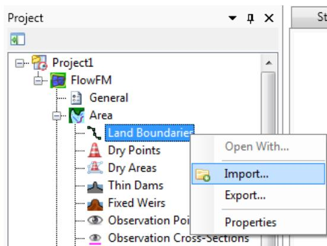

Figure 24.6: Importing a land boundary

Now the grid and land boundary are both visible in the central map of the Delft3D Flexible Mesh Suite GUI, see Figure 24.7.

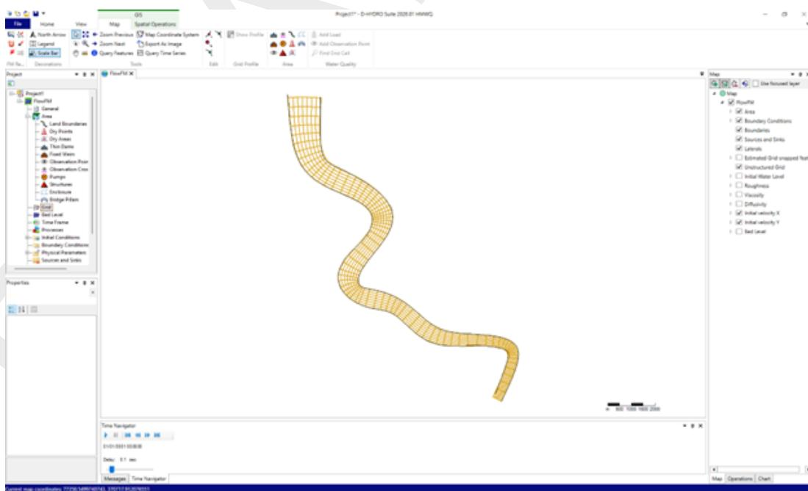

Figure 24.7: After closing RGFGRID the grid is visible in the Delft3D Flexible Mesh Suite GUI.

This is the end of Tutorial 1.

- ➤ To close the Delft3D Flexible Mesh Suite, click on *File* → *Close*. Then, the following question arises: "Save changes to the project: Project?" Click on *No*. The current D-Flow FM model has now been closed.
- ➤ Exit the Delft3D Flexible Mesh Suite by choosing the close icon () in the windows title bar.

### 24.1.3 Tutorial 2: Creating a triangular grid

We will continue with the grid created in the previous tutorial for the Scheldt river. The river is separated from the harbour, west of the river, by a sluice. The small area between the sluice and the Scheldt

will benefit from an unstructured grid because of its irregular geometry. The unstructured grid for this irregular geometry is created first in this section.

The following steps have to be carried out:

- ➤ Start the the Delft3D Flexible Mesh Suite and create a new Flow Flexible Mesh Model as described in section 24.1.2.
- ➤ Import the land boundary from `<tutorial02\scheldtharbour.ldb>` by choosing *Import* via the right mouse button on *Project1 → FlowFM → Area → Land Boundaries* (see Figure 24.6). Select item *Land boundaries from .ldb* file and press *OK*. Select the file `<scheldtharbour.ldb>` with the file selection window. Do not apply a coordinate transformation, press *OK*.
- ➤ Import the grid file by choosing *Import* via the right mouse button on *Project1 → FlowFM → Grid*. Choose the grid file `<scheldt02_net.nc>` in the folder `<tutorial02>`.
- ➤ Start RGFGRID by double clicking on *Grid*, see Figure 24.1. Set the Coordinate System (if necessary), as has been explained in section 24.1.2 (Figure 24.1).
- ➤ Choose from the menubar *Edit → Polygons → New*. The intention is to mark the area of interest (i.e. the area for which we want to generate the grid) by means of a polygon, see Figure 24.8.
- ➤ Start drawing the polygon at a distance from the curvilinear grid that is similar to the width of the curvilinear grid cells (since we want to have a smooth transition in grid resolution). Specify the second point at a relatively small distance from the first one. This distance is later used as the first indication of the size of the triangular gridcells to be placed.
- ➤ Mark the characteristic locations of the area (follow the land boundary) and place the final points at the same distance away from the river grid as the first point. The distance between the last two points should be similar to the distance between the first two points. The result is shown in Figure 24.8.
- ➤ Choose *Edit → Polygons → Refine (linear)* and click on the first and last points of the polyline (in Figure 24.8 we would select point 1 first and then point 15). Now, the polygon is divided into a finer set of line elements (based on the length of the first and last segment of the polyline).

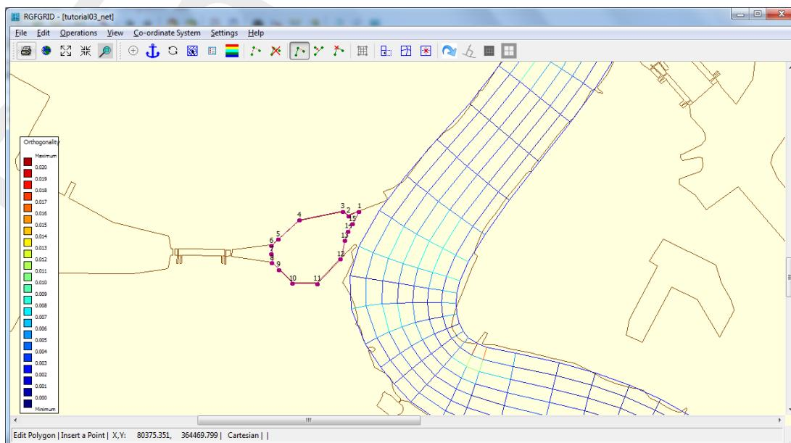

**Figure 24.8:** Polygon that envelopes the area in which an unstructured grid is aimed to be established.

#### Remarks:

- ◇ The distance between the points of the polygon is derived from the distance of the two polyline segments at both sides of the *selected* segment. The length of the polyline segments varies linearly from the segment length at the one side of the selected segment towards the segment length at the other side of the selected segment.
- ◇ You can play around to see how this works. If needed, you can add extra polyline points by choosing *Edit → Polygon → Insert point*. Choose *Edit → Polygon → Move point* if a point move would make sense.

- ◇ You can snap the refined polygon to the land boundary through *Edit → Polygons → Attach to Land Boundary*. Select two points for this.

Now we continue with this tutorial by carrying out the following steps:

- ➤ Choose *Operations → Domain → New* to indicate that the new to be generated grid should be created next to the already existing one (and not replace it).
- ➤ Choose *Operations → Grow Grid from Polygons*. The result is shown in Figure 24.9.
- ➤ Improve the orthogonality through *Operations → Orthogonalise grid*. The default settings are set to also improve the smoothness.

Since the solver only supports one grid, we need to merge the newly created grid with the original grid of the river. The newly created grid is currently selected. Next:

- ➤ Choose *Edit → Multi Select* and click on the river Scheldt grid to select it as well. After selection both grids should be coloured blue with black dots on the nodes.
- ➤ Choose *Operations → Grid → Merge Grids* to merge the nodes of the (two) highlighted grids. Now, the grids have been merged. However, nothing will visually change.

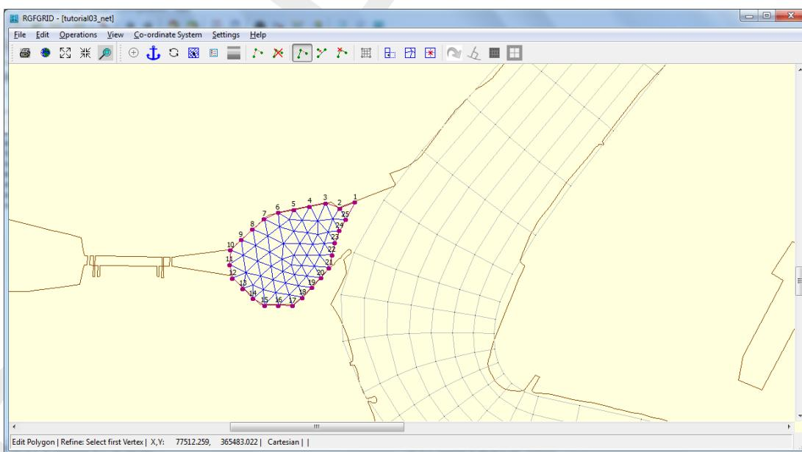

**Figure 24.9:** Unstructured grid, after having refined the polygon.

To save the grid and go back to the Delft3D Flexible Mesh Suite GUI:

- ➤ Choose from the menubar *File → Export → UGRID (D-Flow FM)...* and save the grid **in your working folder** as `<tutorial02\scheldt02_net.nc>`. Both grids grids have now been merged into one `<.nc>` file.
- ➤ Choose *File → Save Project As* and save the project in your working folder. Press Cancel when a file selection box asks to save the land boundary. Press Cancel twice when a file selection box asks to save the grid.
- ➤ Close RGFGRID by choosing *File → Exit*

Now you are back in the Delft3D Flexible Mesh Suite GUI but the grid is not yet updated in the D-Flow FM model. Therefore finalyse this tutorial as follows:

- ➤ Choose *Import* by a right mouse click on *Project1 → FlowFM → Grid* and select the grid file `<scheldt02_net.nc>` **in your working folder**.
- ➤ Exit Delft3D Flexible Mesh Suite by clicking the close icon in the menu bar. You don't have to save the project.

Folder <tutorial02\finished> contains splines and a grid for this tutorial exercise that has been prepared by Deltares.

#### 24.1.4 Tutorial 3: Coupling multiple separate grids

From the previous tutorial we have ended up with two separate grids that are not connected yet. Obviously, these two grids should properly be integrated into one single grid. Before we can couple the two grids, we should first make sure that the typical grid size is of the same order of magnitude for both grids at the location where the connection is to be laid. Hence, basically two operations are to be done:

- ◇ Split the grid cells in the Scheldt river along this length so that the cell sizes of both grids match.
- ◇ Merge the two grids and put connections in between.

The splitting can be established as follows:

- ➤ Start the the Delft3D Flexible Mesh Suite and create a new Flow Flexible Mesh Model as described in section 24.1.2.
- ➤ Import the land boundary file and the grid file from the folder <tutorial03> as described in section 24.1.3.
- ➤ Start RGFGRID and set the Coordinate System (if necessary), as has been explained in section 24.1.2 (Figure 24.1).
- ➤ Choose *Edit → Irregular Grid → Split Row or Column*.
- ➤ Select the locations where the grid lines should be split by clicking on the left boundary of the Scheldt river.
- ➤ Try to achieve the picture shown in Figure 24.10, in particular the typical grid size in the curved area. *N.B. Ignore the red lines in this picture for now!*

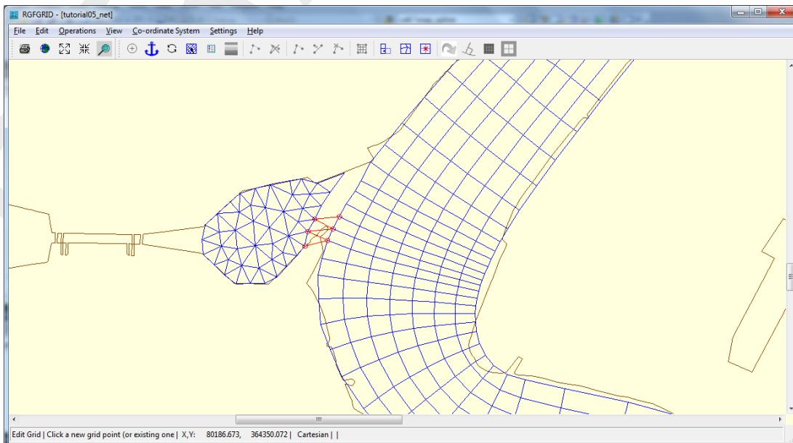

**Figure 24.10:** Connection of the river grid and the unstructured grid. The red lines show the inserted grid lines used to couple the two grids manually.

The edges of the two grid segments can be connected as follows:

- ➤ Since the two visually separated grids have already been merged into one logical grid in the previous tutorial, we can now physically connect them by laying new gridlines between them. Therefore, select *Edit → Irregular Grid → Insert Node*. Insert new gridlines in a zigzag-like style: see the red grid lines in Figure 24.10. Now, you will benefit from the (more or less) equal resolutions in the river and unstructured regions.

- ➤ Finally, you will end up with a picture like shown in Figure 24.11. You can visualize the orthogonality through *View → Grid Property Style → Coloured Edge* and *View → Grid property → Orthogonality*.

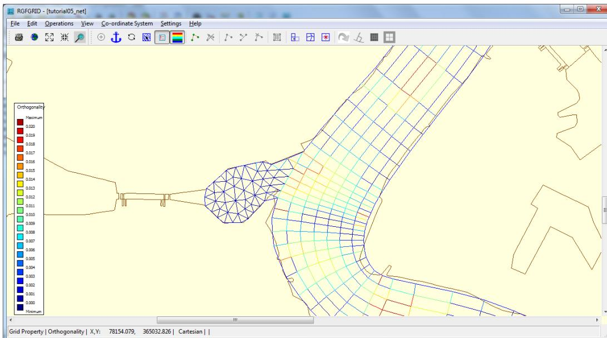

**Figure 24.11:** Orthogonality of the integrated grid, containing the curvilinear part, the tri-angular part and the coupling between the two grids.

To save the grid and close RGFGRID is done as follows:

- ➤ *File → Export → UGRID (D-Flow FM)...* and save the grid **to your working folder** as <tutorial03\scheldt03\_net.nc>. The grid has now been saved.
- ➤ Choose *File → Save Project*.
- ➤ Close RGFGRID by clicking on *Exit*.

This is the end of Tutorial 3.

- ➤ Exit Delft3D Flexible Mesh Suite by clicking the close icon in the menu bar. You don't have to save the project.

#### 24.1.5 Tutorial 4: Inserting a bed level

In previous tutorial exercises we focused on the grid generation. The next step is to couple the bed level data to the grid. The grid for this tutorial exercise is available in file <westernscheldt04\_net.nc> in the directory <tutorial04>. A harbour has been added to the grid, as well as the Westernscheldt part at the North side. Bed levels are available in the file <westernscheldt\_bed\_level.xyz>.

The file with bed levels should first be projected onto the unstructured grid by means of interpolation. To this purpose, the following actions should be carried out:

- ➤ Start Delft3D Flexible Mesh Suite, create a new Flow Flexible Mesh model, import the land boundary <sealand.ldb> and the grid <westernscheldt04\_net.nc> from directory <tutorial04> as explained in the previous tutorial exercises.
- ➤ Import a sample file containing the measured bed levels: in the drop down menu at the top of the screen (See Figure 24.12), select the *Spatial Operators* menu, choose layer *Bed Level*, click on **Import** *Import from file* and select the file <westernscheldt\_bed\_level.xyz> from directory <tutorial04>, *Import without transformation (as-is)* → *OK*. This file contains measured bed level data for the Westernscheldt, from the North Sea up to Antwerp

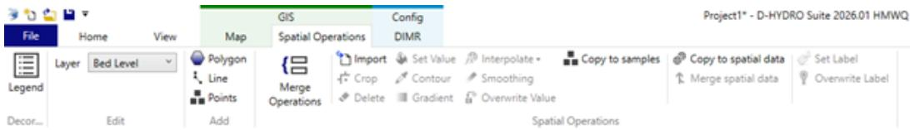

Figure 24.12: Map-ribbon with the Spatial Operations menu.

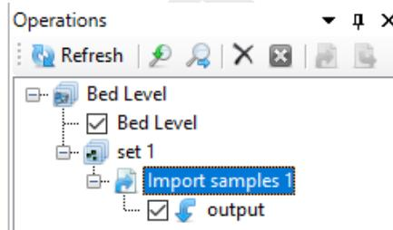

Figure 24.13: Activate import samples 1.

Now we are going to project the bed level data onto the nodes:

- ➤ Click on *Operations* and click on "Import samples 1"; see Figure 24.13.
- ➤ Click *Interpolate* and select *Interpolate selected set* (see Figure 24.12).
- ➤ The window **Interpolation operation** appears. Select the *Overwrite* option for *Pointwise operation*,


then press *OK*. The result will look like Figure 24.14. If you do not see a color bar, click *Legend* in the *Decorations* menu (see Figure 24.12) and switch off items in the *Map* pane to bring the color bar into view.

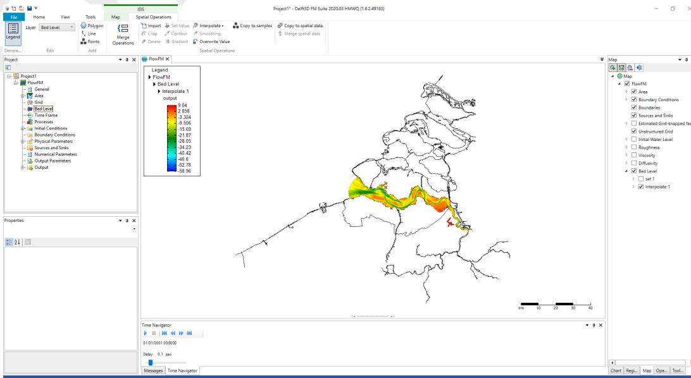

Figure 24.14: Interpolated bed levels values at the grid (estuary).

- ➤ Have a look at the sluice and the docks of the harbour. You can see that the bed level in this area is unrealistically high. This unrealistic value has been assigned because of undesired extrapolation, since no bed level data has been available in this area. To repair this, first draw a polygon that

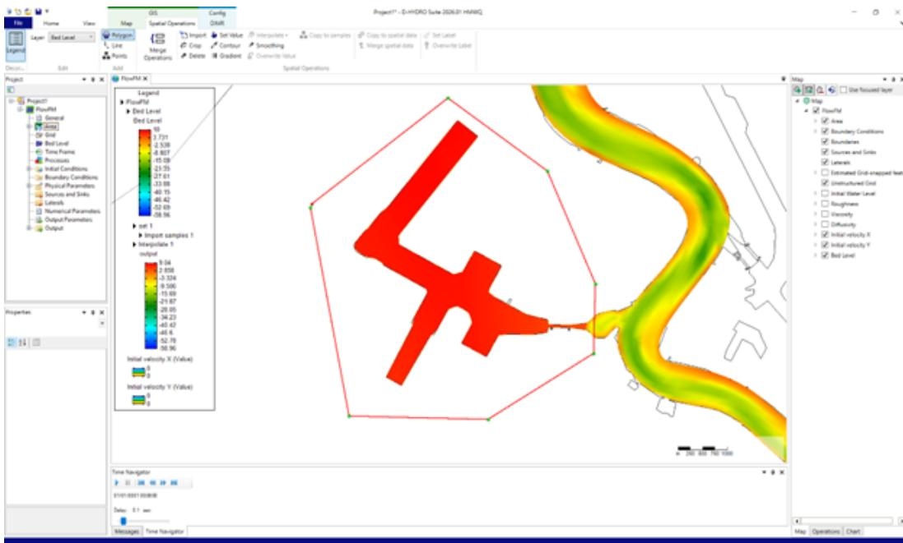

**Figure 24.15:** Polygon drawn enveloping the missing depths in the harbour.

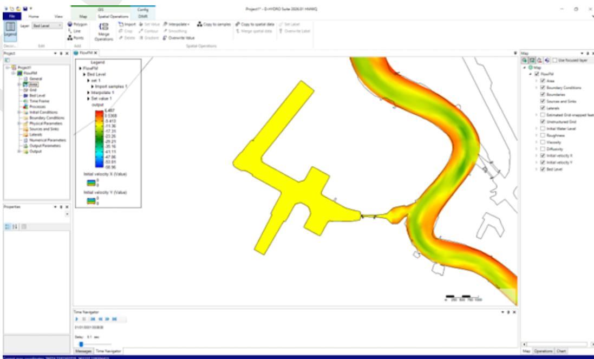

**Figure 24.16:** Interpolated bed levels values at the grid (harbour).


- ➤ To save the mesh file you have to rightmouse click on *Grid* → *Export* in the project tree. Choose *Grid exporter* and save the file in the folder `<tutorial04>` of **your working environment** as `<westernscheldt04_net.nc>`. The grid including the bed level have now been saved.
- ➤ To close the D-Flow FM User Interface click on *File* → *Close*. Then, the following question arises: "Save changes to the project: Project?" Click on *No*.
- ➤ Exit Delft3D Flexible Mesh Suite by clicking the close icon in the menu bar.

Folder `<tutorial04\finished>` contains a bed level for this tutorial exercise that has been prepared by Deltares.

#### 24.1.6 Tutorial 5: Imposing boundary conditions

Along both the sea boundary and the Scheldt river boundary, appropriate boundary conditions have to be imposed. The boundary conditions can be prescribed in many ways, for instance as water levels, velocities (tangential and normal direction), discharge and Riemann. In this tutorial exercise we will impose boundary conditions for the Western Scheldt in the following way:

- ◇ At the sea boundary: a periodic water level boundary, described as a harmonic signal with a mean 0.5 m+NAP, an amplitude 2.0 m and a frequency of  $28.984 \text{ } \text{h}^{-1}$ ,
- ◇ At the river boundary: a constant discharge boundary, described by a constant  $2500 \text{ m}^3 \text{ s}^{-1}$ .

Let us start with a new D-Flow FM model and import the network and land boundaries:

- ➤ Start Delft3D Flexible Mesh Suite, create a new Flow Flexible Mesh model, import the boundary `<sealand.ldb>` and the grid `<westernscheldt05_net.nc>` from directory `<tutorial05>` as explained in the previous tutorial exercises.

In order to define boundary conditions one has to follow this strategy:

1. 1 draw a polyline along the boundary;
2. 2 fill a file with essential information;
3. 3 link the boundary files with the model setup.

The boundary conditions can be imposed as follows:

- ➤ In the *FM Region...* (in the top ribbon, see Figure 24.17) choose [Add a \(2D\) flow boundary](#) and insert a polyline along the sea boundary. Doubleclick to finish the polyline. In the Project bar at the left, under *Boundary Conditions*, this boundary has now been added. Figure 24.17 shows how this will look like.
- **Tip:** to remove a wrongly placed point in the polyline, use *Remove point from geometry* (top of screen, above *Edit*, see Figure 24.17). It is also possible to replace or add a point.

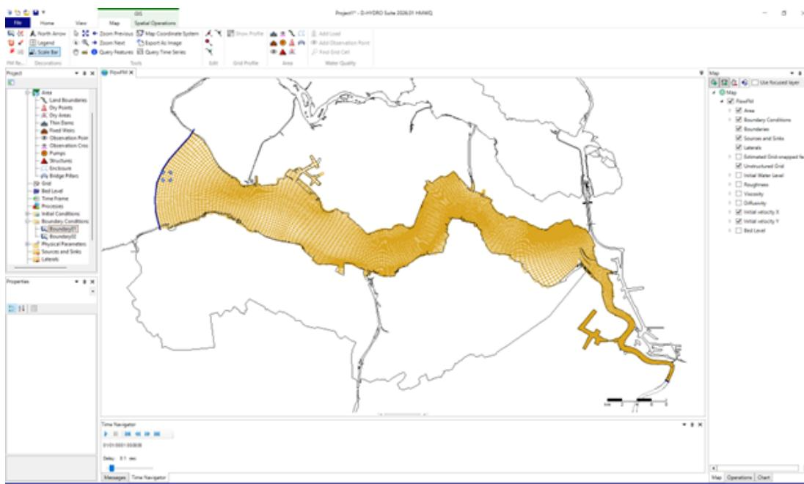

**Figure 24.17:** Location of the two open boundaries at the sea and river side.

- ➤ Draw another polyline at the river entrance south of Antwerp, see the right bottom corner of Figure 24.17).
- ➤ To impose boundary conditions at the seaboundary, double click at *Boundary01*, see Figure 24.18.

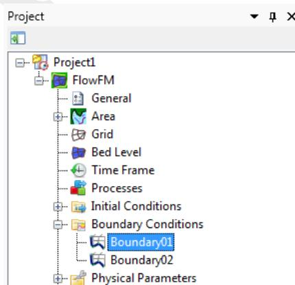

**Figure 24.18:** Selection of *Boundary01*.

- ➤ Choose *Water level*, press + and choose *Forcing type: Astronomical*.
- ➤ Selected the first boundary support point *Boundary01\_0001* by clicking on the plus-sign behind it, repeat this for the last boundary support point.
- ➤ Choose *Select components...* (at the lefthandside of the screen).
- ➤ Choose the components *A0* and *M2*, and press *OK*,
- ➤ Select *All support points* and press *OK*. All support points will now have components *A0* and *M2* defined.
- ➤ Fill in the amplitudes of the components in the table, see Figure 24.19.

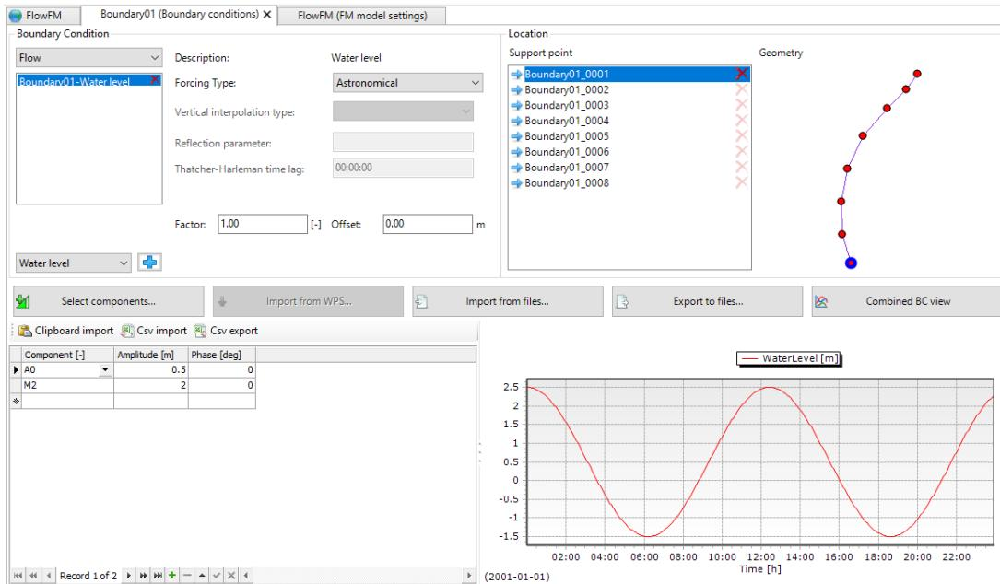

**Figure 24.19: Boundary conditions seaside.**

We have now prescribed an astronomical water level signal, consisting of two components. The first component has an amplitude equal to 0.5 m with a frequency of 0 degrees/hour, i.e. a constant value of 0.5 m+NAP. The second component has an amplitude of 2.0 m with a frequency of 28.98 degrees/hour. Basically, the signal  $h(t) = 0.5 + 2.0 \cos(28.98 t)$  has been prescribed now, with  $h$  in meters w.r.t. the reference level (in this case: NAP) and  $t$  in hours.

- ➤ To impose boundary conditions at the riverboundary, double click at *Boundary02*, Choose *Discharge* and press *+*. Choose *Forcing type: Time Series*.
- ➤ To impose a constant discharge of  $2500 \text{ m}^3 \text{ s}^{-1}$ , fill in the table as in Figure 24.20. Make sure you insert the correct times!

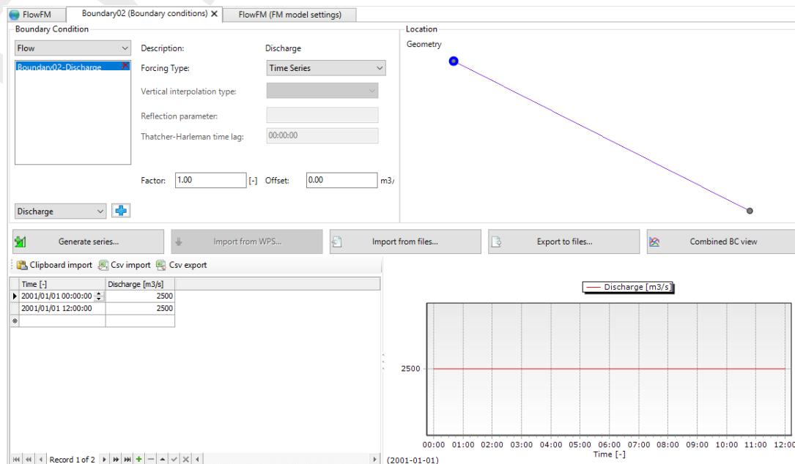

**Figure 24.20: Boundary condition riverside.**

To be able to load this D-Flow FM model in the future, it is necessary to save the model:

- ➤ In the project tree, rightclick on *FlowFM* and select *Rename*. Rename the model to “westernscheldt05”.
- ➤ Save the model in folder <tutorial05> **of your working environment**: in the project tree rightclick on *westernscheldt05*. Choose *Export* select *Flow Flexible Mesh model*, press *OK* and save the model as <westernscheldt05.mdu>.

The model can now be loaded in the next tutorial exercise without the need of inserting all network files or land and flow boundaries individually again.

- ➤ Exit Delft3D Flexible Mesh Suite by clicking the close icon in the menu bar. You don't have to save the project.

#### 24.1.7 Tutorial 6: Defining output locations

Often one would like to monitor computational results at certain specific cross sections or locations (i.e. 'observation points'). In this tutorial exercise we will add cross sections and observation points in a D-Flow FM model.

We will start with importing an existing D-Flow FM model without cross sections and observation points:

- ➤ Start Delft3D Flexible Mesh Suite and import a D-Flow FM Model by choosing (in the top ribbon) *Import → Flow Flexible Mesh Model*.
- ➤ Choose <westernscheldt06.mdu> from the folder <tutorial06> and click on *Open*.

Inserting cross sections and observation points is rather straightforward. The following actions are necessary:

Inserting cross sections:

- ➤ Choose [Add new observation cross section \(2D\)](#) (see the *Area* menu in the ribbon).
- ➤ Draw as many cross sections as you like. Finalize each cross section by doubleclicking the left mouse button.
- ➤ To see how many cross sections have been made, double click on *Area* → *Observation Cross-Sections* in the project tree, see Figure 24.21.

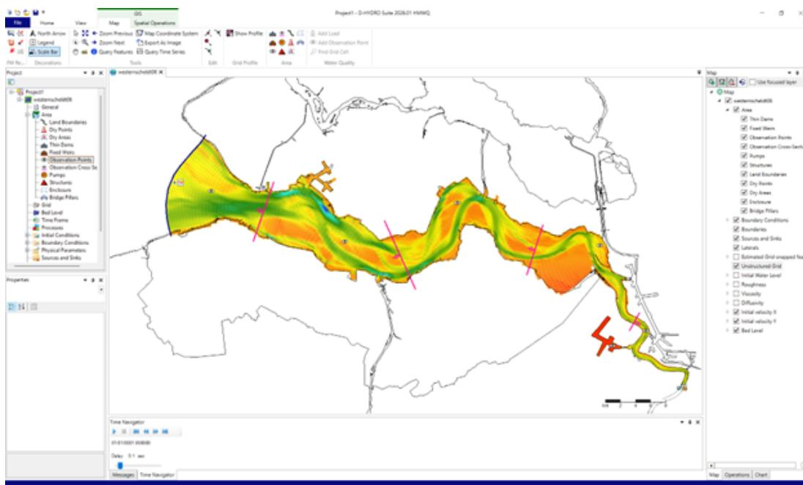

Figure 24.21: Overview cross sections and observation points.

Now we will add observation points:

- ➤ Choose Add new observation point. Add as many observation points as you like.
- ➤ To see how many observation points have been made, double click on Area → Observation Points in the project tree.
- ➤ Save the current FM model by clicking the right mouse in the project tree on *westernscheldt06*.
- ➤ Choose Export, choose Flow Flexible Mesh Model and press OK. Then save the model with name “westernscheldt06” in the folder <tutorial06> **of your working environment**. The observation points and cross sections have now been saved in the new <mdu>-file.

**Tip:** It is also possible to save only the observations points. For instance to a different folder. To try this, click the right mouse on *Observation points* → Export → Observation points to <xyn>-file. Then, choose a filename and a folder.

- ➤ Exit Delft3D Flexible Mesh Suite by clicking the close icon in the menu bar. You don't have to save the project..

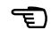

## 24.1.8 Tutorial 7: Defining computational parameters

Before we can run a model, all computational parameters need to be set. This involves for example the *Time Frame*, *Initial Conditions* and the *Output Parameters*. Most parameters can be set in parameter screens accessible through the project tree. All other parameters are set by default, and will not be considered in this tutorial exercise.

We will start by importing an existing D-Flow FM model:

- ➤ Start Delft3D Flexible Mesh Suite and import the D-Flow FM Model from the folder <tutorial07>, by choosing *Home* → *Import* → *Flow Flexible Mesh Model* → OK. Choose <westernscheldt07.mdu> and press *Open*.

Several parameters will be set. We will start with the *Time Frame*, see Figure 24.22:

- ➤ At the Time Frame section: fill in the parameters shown in Figure 24.22.

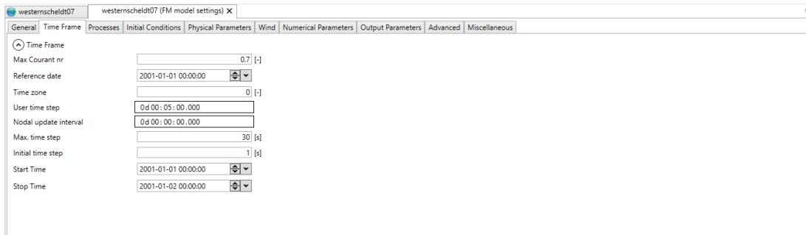

**Figure 24.22:** The time frame of the simulation.

- ➤ At the Initial Conditions section: fill in “0.5” m for the Initial water level, see Figure 24.23.

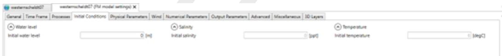

**Figure 24.23:** Imposed initial conditions for the simulation.

- ➤ At the Output Parameters section: fill in the parameters shown in Figure 24.24.

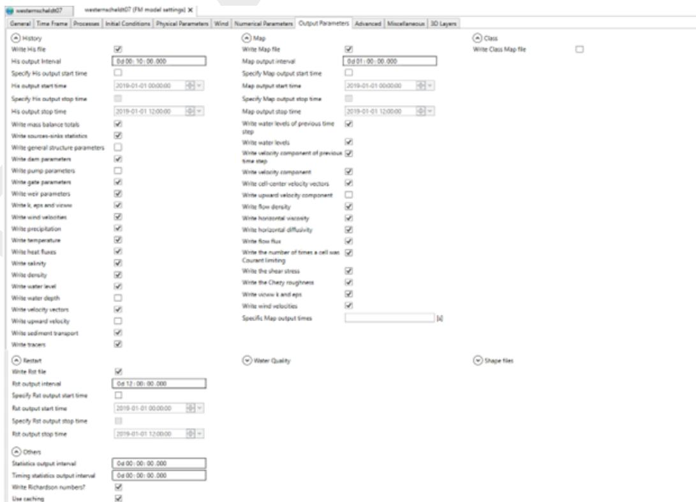

**Figure 24.24:** Optional output parameters for the computation.

As an explanation, the computation will generate history-files and map-files:

- ◇ In history-files, timeseries are stored at the cross-sections and observation locations, at a frequency specified via the parameter *His Output Interval*.
- ◇ The map-files collect data over the entire domain, at a frequency specified via the parameter *Map Output Interval*.


**Note:** Be aware that these periods are clipped by the parameter *User time step*, which has been specified under *Time Frame*. That means, if *User time step* > *His Output Interval*, then the period with which his-files are written is given by *User time step*.

- ◇ Restart files will be written when *Write Rst File* is selected.
- The period with which these files are written can then be specified at *Rst Output Interval*. This period is not clipped by *User time step*. To start a computation with a restart file is not part of this tutorial.
- ➤ Save the current D-Flow FM model in the folder <tutorial07> of **your working environment** by rightmouseclicking in the project tree on *westernscheldt07*, choose *Export* and save the model as *Flow Flexible Mesh model* <westernscheldt07.mdu>.

The computational parameters have now been saved in the <mdu>-file.

- ➤ Exit Delft3D Flexible Mesh Suite by clicking the close icon in the menu bar.

## 24.1.9 Tutorial 8: Running a model simulation

Up till now we have saved the D-Flow FM model by means of a <mdu>-file. For running computations, it is necessary to save the entire project, which will be done in this tutorial exercise:

- ➤ Import the D-Flow FM Model from the folder <tutorial08>, by choosing *Import* → *Flow Flexible Mesh Model* → *OK*. Choose <westernscheldt08.mdu> and *Open*.

For saving the entire project, the following should be done:

- ➤ Choose *File* → *Save As* to save <tutorial08.dsproj> in the folder <tutorial08> of **your working environment** and click *Save*.

The project has now been saved in a folder called <tutorial08\tutorial08.dsproj\_data> and a project file <tutorial08\tutorial08.dsproj> has been created (See Figure 24.25). Within this folder you will find all input files of the model (some are ASCII), output files of the model (when it has been run) and, if applicable, zip-folders containing the restart files. Note that after saving, the project has been renamed to *tutorial08*

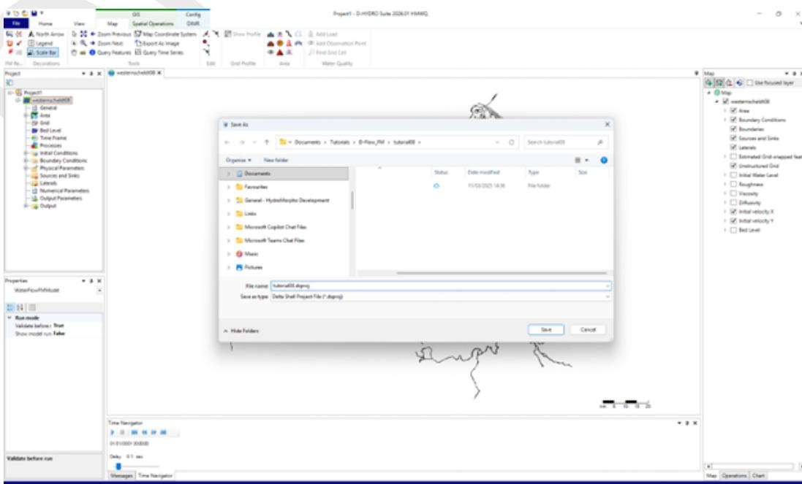

Figure 24.25: Menu for saving a project.

- ➤ In the project tree select the model you want to run (which has been named *westernscheldt08*, see

Figure 24.26).

- ➤ Press the right mouse and choose *Run Model*

The simulation will now start running.

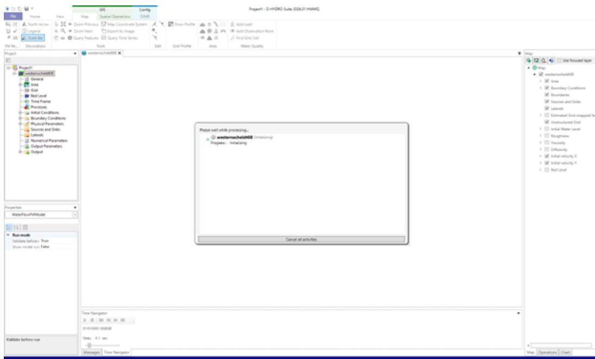

Figure 24.26: View of Delft3D Flexible Mesh Suite when running a model.

Now:

- ➤ Save the project with generated output in the folder <tutorial08> **of your working environment** (*File → Save As* and save the project with name “tutorial08.dsproj”). Press **Yes** to overwrite the project.
- ➤ Now close the current D-Flow FM model (In the project bar, rightmouseclick on *westernscheldt08* → *Delete* → *OK*).
- ➤ Exit Delft3D Flexible Mesh Suite by clicking the close icon in the menu bar.

Folder <tutorial08\finished> contains the output for this tutorial exercise that has been prepared by Deltares.

## 24.1.10 Tutorial 9: Viewing the output of a model simulation

The output of the model can be observed within Delft3D Flexible Mesh Suite. At first a project has to be opened:

- ➤ Choose *File → Open*. Select the file <tutorial9.dsproj> from the folder <tutorial09> and choose *Open*. The project is now activated.
- ➤ Doubleclick on *westernscheldt09*.

To view the output of the history files (observation points and cross-sections):

- ➤ Click with leftmousebutton on an observation point (while being in *select* mode. Your mouse looks like an arrow in this mode).
- ➤ Choose at the top part of the screen *Query Time Series*, see Figure 24.27 (option available in the *Map* ribbon).

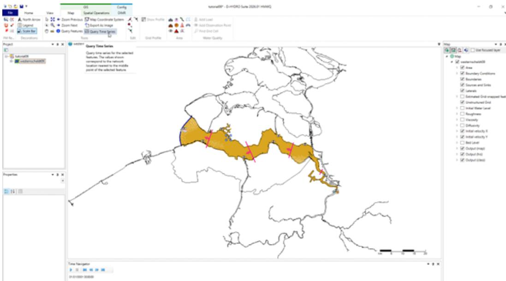

**Figure 24.27:** View of Delft3D Flexible Mesh Suite, available to select a location for time-series inspection.

- ➤ Choose *Water level (waterlevel)* → OK. You can now observe the water levels in the observation point you selected, see Figure 24.28. You can choose other parameters as well to observe. Also cross-sections can be observed this way.
- ➤ Select the Time Navigator in the View section of the ribbon. The Time Navigator will appear at the bottom of Delft3D Flexible Mesh Suite.

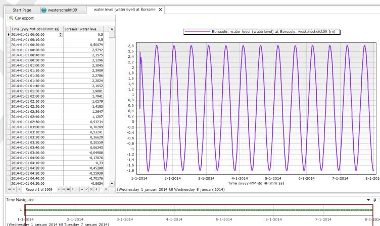

**Figure 24.28:** View of Delft3D Flexible Mesh Suite, time-series for observation point "water level at Borsele".

To view the output of the map files:

- ➤ Select the pane 'westernscheldt09'
- ➤ Choose in the Map-tree Add New Wms Layer (see Figure 24.29) and choose <Open Street Map>.

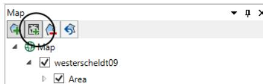

**Figure 24.29:** WMS layer icon at the top of the map-tree viewer.

Now, the model can be observed with OpenStreetMap in the background. See Figure 24.30.

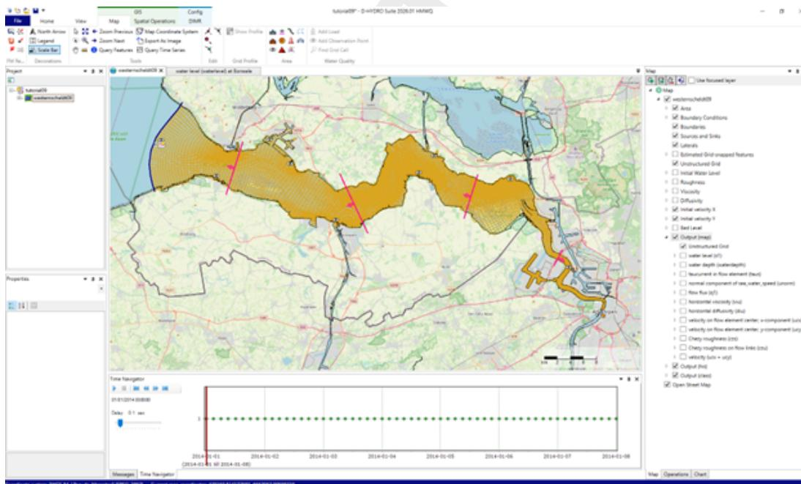

**Figure 24.30:** View of Delft3D Flexible Mesh Suite in combination with OpenStreetMap.

- ➤ Open Output in the map tree. Check `waterlevel(s1)` to observe water levels, see Figure 24.31.

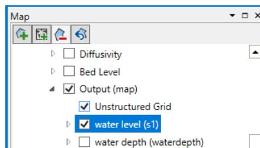

**Figure 24.31:** Select waterlevel(s1) from the map tree

- ➤ To adjust the legend, rightmouse click on `Output(map)` → `waterlevel(s1)` and select `Properties`. Now the window **Layer Properties Editor** appears in which the legend can be adjusted.
- ➤ Set classes to “11”
- ➤ Select `Custom range` and set the legend values for minimum and maximum value to “-2.5” to “-0.5”.
- ➤ Press `Generate`
- ➤ Press `OK`, see Figure 24.32.

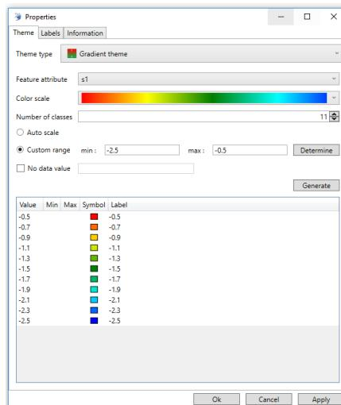

**Figure 24.32:** Layer properties editor

- ➤ Click the play button in the *Time Navigator* to see the water levels change in time. To see the water depths, uncheck the water level in the map tree and check the water depth.
- ➤ Now close the current D-Flow FM model (In the project bar, rightmouseclick on *westernscheldt09* → *Delete* → *OK*).
- ➤ Exit Delft3D Flexible Mesh Suite by clicking the close icon in the menu bar.

### 24.1.11 Tutorial 10: Exporting a model

A model must be exported to be able to run it outside D-Flow FM GUI, see [section 8.3](#).

- ➤ Import the D-Flow FM Model from the folder *<tutorial10>*, by choosing *Import* → *Flow Flexible Mesh Model* → *OK*. Choose *<westernscheldt10.mdu>* and *Open*.

To export:

- ➤ Rightmouseclick on *Westernscheldt10* in the project view on the left. Choose *Export* → *DIMR configuration* → *OK*, see Figure 24.33. Select an empty directory to store the resulting files, *<tutorial10\workdir>*, and choose a name for the DIMR configfile, default *<dimr\_config.xml>*. Directory *<tutorial10\workdir>* will now contain file *<dimr\_config.xml>* and subdirectory *<dflowfm>*. Besides some cleaning, the files inside subdirectory *<dflowfm>* should be the same as in *<tutorial10\input>*.

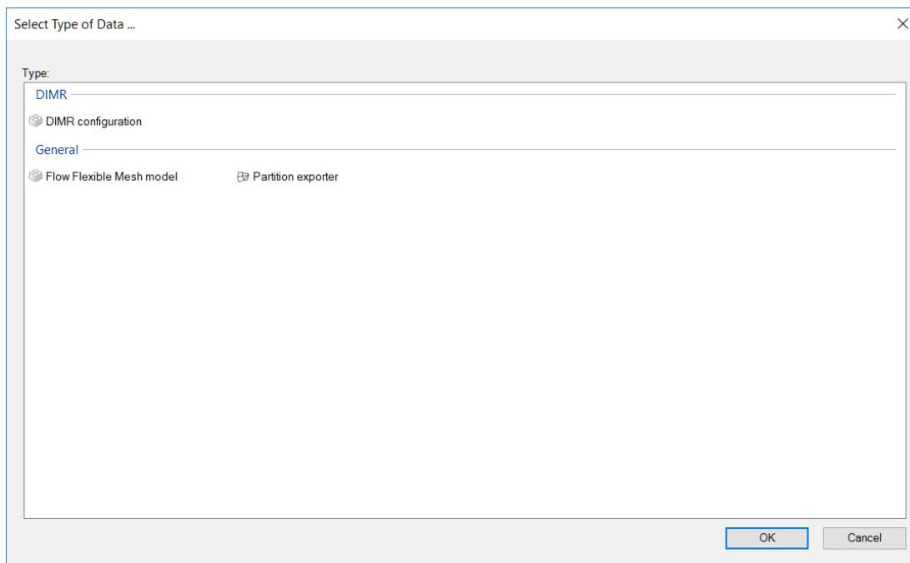

Figure 24.33: Menu for exporting a project.

Folder `<tutorial10\output>` contains the output for this tutorial exercise that has been prepared by Deltares. Differences may appear related to changes in execution date and time, and using another version of the GUI.

### 24.1.12 Tutorial 11: Partitioning a model

A model must be partitioned before it can be run in parallel by using MPI, see section 8.4.2. You can skip this tutorial if you don't want to run in parallel. This tutorial does not use the GUI.

To partition:

- ➤ Copy folder `<tutorial11\input>` to `<tutorial11\workdir>`.
- ➤ Create a new file using a text editor, containing the following single line (Windows):
   

  ```
  call "<installDir>\x64\bin\run_dflowfm.bat"
          "--partition:ndomains=3:icgsolver=6" westernscheldt11.mdu
        or (Linux):
        <installDir>/lnx64/bin/run_dflowfm.sh
          --partition:ndomains=3:icgsolver=6 westernscheldt11.mdu
        where <installDir> refers to your Delta 3D installation directory.
        > Save the file in folder <tutorial11\workdir\dflowfm>
        Windows:
        Extension .bat is common, e.g. <run_partitioner.bat>. Double-quotes are necessary around the executable name (if the path contains white spaces) and each argument (if it contains the equal sign).
        Linux:
        Extension .sh is common, e.g. <run_partitioner.sh>. It's a good habit to start the file with an interpreter reference, e.g. #!/bin/bash. Be sure that the line endings of your script file are conform Linux ("line feed" only). You can use the Linux command dos2unix <scriptfile> to convert it.
        > Execute your run_partitioner script.
  ```

#### Remarks:

- ◇ Example models, with run scripts, are included in the (open source) code. After registering yourself at <https://oss.deltares.nl/>, you can have a look at: <https://svn.oss.deltares.nl/repos/delta3d/trunk/examples>

/12\_dflowfm/test\_data/e02\_f14\_c040\_westernscheldt

- ◇ The following text block is a subset of the text echoed to the command box via stdout (version numbers and dates may differ). The full stdout text is saved in file <tutorial11\output\dflowfm\run\_partitioner\_stdout.log>:

```
call "c:\Deltares\x64\bin\run_dflowfm.bat" "--partition:ndomains=3;icgsolver=6" westernscheldt11.mdu
OMP_NUM_THREADS is 2
Working directory: c:\checkouts\ds\doc\user_manuals_tutorial_data\Tutorial_D-Flow_FM\tutorial11\workdir\dflowfm
D3D_HOME          : c:\Deltares\x64\bin\..
ARCH             : x64
executing: "c:\Deltares\x64\dflowfm\bin\dflowfm-cli.exe" --nodisplay --autostartstop "--partition:ndomains=3;icgsolver=6" westernscheldt11.mdu
* Deltares, D-Flow FM Version 1.2.94.66020M, Feb 20 2020, 09:26:11
** WARNING: readMDUFile: [numerics] jaorgsethu=1 was in file, but not used. Check possible typo.
** WARNING: readMDUFile: [physics] effectspiral=0 was in file, but not used. Check possible typo.
** WARNING: readMDUFile: [output] wrishp_enc=0 was in file, but not used. Check possible typo.
** INFO          : Network UGRID-File: No 1D-Mesh Present, Skipped 1D
ug_get_meshgeom, #12, ierr=0
** WARNING: Could not read net cells from netCDF file 'westernscheldt04_net.nc' (is not critical). Details follow:gk_mcore statistics
coresize:       100432      nmops:      2048   cmop:         0
num_callocs:       249      num_hallocs:                                     0
size_callocs:       831160   size_hallocs:                                     0
cur_callocs:                                                                0
max_callocs:                                                                 0
nbrpool statistics
nbrpoolsize:                                                                 0
nbrpoolreallocs:                                                                 0** INFO          : added node-based ghostcells:                                             25
** WARNING: 1 hanging 2D links disregarded.
** INFO          : added node-based ghostcells:                                       18
** INFO          : added node-based ghostcells:                                       43
```

Folder <tutorial11\output\dflowfm> contains the resulting run\_partitioner scripts (containing paths that fit to the installation directories used at Deltares), Windows and Linux, and the output for this tutorial exercise:

- ◇ Three additional mdu-files:
  - <westernscheldt11\_0000.mdu>
  - <westernscheldt11\_0001.mdu>
  - <westernscheldt11\_0002.mdu>
- ◇ Three additional net.nc-files:
  - <westernscheldt04\_0000\_net.nc>
  - <westernscheldt04\_0001\_net.nc>
  - <westernscheldt04\_0002\_net.nc>
- ◇ File <DFM\_interpreted\_idomain\_westernscheldt04\_net.nc> containing partition domain information and cell information
- ◇ Diagnosis file <DFM\_OUTPUT\_westernscheldt11\westernscheldt11.dia>
- ◇ File <tutorial11\output\dflowfm\run\_partitioner\_stdout.log> containing the full text echoed to the command box via stdout (version numbers and dates may differ).

### 24.1.13 Tutorial 12: Running a model using a batch script

This tutorial explains how to run D-Flow FM computations outside the GUI, using a batch script. The resulting files of section 24.1.12 are used as input. At first, the model is run sequentially (without parallelMPI), both on Windows and Linux. Next, the model is run with parallelMPI (Windows and Linux). See section 8.3 for more information.

#### Remark:

- ◇ Performing a computation in parallel is intended to speed-up the computation. But when using limited resources for a small testcase (e.g. this tutorial), a parallel computation might need *more* time. See also section 8.5.

#### Preparation:

- ► Copy folder <tutorial12\input> to <tutorial12\workdir>.

- ◇ Sequential on Windows

- □ <dimr\_config.xml>, as copied from the input folder
- □ <run\_model.bat>, as created in [section 24.1.13.1](#)
- □ <run\_model\_bat\_stdout.log>, containing the messages written to the command box via stdout during the simulation
- □ <dflowfm\DFM\_OUTPUT\_westernscheldt12\_sequential> containing all the output files.
- ◇ Sequential on Linux
  - □ <dimr\_config.xml>, as copied from the input folder
  - □ <run\_model.sh>, as created in [section 24.1.13.2](#)
  - □ <run\_model\_sh\_stdout.log>, containing the messages written to the command box via stdout during the simulation
  - □ <dflowfm\DFM\_OUTPUT\_westernscheldt12\_sequential> containing all the output files (produced on Windows).
- ◇ Parallel on Windows
  - □ <dimr\_config\_parallel.xml>, as created in [section 24.1.13.3](#)
  - □ <run\_model\_parallel.bat>, as created in [section 24.1.13.3](#)
  - □ <run\_model\_parallel\_bat\_stdout.log>, containing the messages written to the command box via stdout during the simulation
  - □ <dflowfm\DFM\_OUTPUT\_westernscheldt12\_parallel> containing all the output files.
- ◇ Parallel on Linux
  - □ <dimr\_config\_parallel.xml>, as created in [section 24.1.13.4](#)
  - □ <run\_model\_parallel.sh>, as created in [section 24.1.13.4](#)
  - □ <run\_model\_parallel\_sh\_stdout.log>, containing the messages written to the command box via stdout during the simulation
  - □ <dflowfm\DFM\_OUTPUT\_westernscheldt12\_parallel> containing all the output files (produced on Windows).

### 24.1.13.1 Sequential on Windows

- ➤ Create a new file using a text editor, containing the following single line:  
   call "<installDir>\x64\bin\run\_dimr.bat" dimr\_config.xml  
   where <installDir> refers to your Delft3D installation directory.
- ➤ Save the file in folder <tutorial12\workdir>  
   Extension .bat is common, e.g. <run\_model.bat>. Double-quotes are necessary around the executable name (if the path contains white spaces).
- ➤ Execute your run\_model script.

The following text block is a subset of the text echoed to the command box via stdout (version numbers and dates may differ). The full stdout text is saved in file <tutorial12\output\run\_model\_bat\_stdout.log>:

```
call "c:\Deltares\x64\bin\run_dimr.bat" dimr_config.xml
Configfile:dimr_config.xml
OMP_NUM_THREADS is 2
Working directory: c:\Tutorial_D-Flow_FM\tutorial12\workdir
executing: "c:\Deltares\x64\bin\..\bin\dimr.exe" dimr_config.xml
Dimr [2020-04-28 17:46:14.198] #0 >> Deltares, DIMR_EXE Version 2.00.00.66020M, Feb 20 2020, 09:06:14
Dimr [2020-04-28 17:46:14.225] #0 >>
Dimr [2020-04-28 17:46:14.227] #0 >> Version Information of Components
Dimr [2020-04-28 17:46:14.228] #0 >> dflowfm : 1.2.94.66020M
Dimr [2020-04-28 17:46:14.229] #0 >> -----
Dimr [2020-04-28 17:46:14.229] #0 >> -----
Dimr [2020-04-28 17:46:14.223] #0 >> westernscheldt10.Initialize(westernscheldt12.mdu)
** DEBUG : 0 0.1000010 NOD(KMAX)
** DEBUG : 6 0.7000070 XK (KMAX), YK (KMAX), ZK (KMAX), KC (KMAX), NMK (KMAX), RNOD(KMAX)
loading model
Dimr [2020-04-28 17:46:14.370] #0 >> kernel: readMDUFile: [numerics] jaorgsethu=1 was in file, but not used. Check possible typo.
Dimr [2020-04-28 17:46:14.372] #0 >> kernel: readMDUFile: [physics] effectspiral=0 was in file, but not used. Check possible typo.
Dimr [2020-04-28 17:46:14.373] #0 >> kernel: readMDUFile: [output] wrishp_enc=0 was in file, but not used. Check possible typo.
ug_get_meshgeom, #12, ierr=0
** INFO : Opened file : westernscheldt05.ldb
** INFO : Closed file : westernscheldt05.ldb
** INFO : Opened file : westernscheldt06_obs.xyn
** INFO : Closed file : westernscheldt06_obs.xyn
** INFO : Opened file : westernscheldt06crs_crs.pli
** INFO : Closed file : westernscheldt06crs_crs.pli
model loaded
Initializing flow: flow_modelinit
** INFO : Initializing flow model geometry...
** INFO : Done writing initial output to file(s).
```

```
Dimr [2020-04-28 17:46:14.913] #0 >> westernscheldt10.Update(43200.0)
Dimr [2020-04-28 17:46:23.950] #0 >> westernscheldt10.Finalize()
** INFO :
** INFO : Computation started at: 17:46:14, 28-04-2020
** INFO : Computation finished at: 17:46:24, 28-04-2020
** INFO :
** INFO : simulation period (h) : 12.0000000000
** INFO : total time in timeloop (h) : 0.0025600000
** INFO : MPI : no.
** INFO : OpenMP : yes. #threads max : 2
** INFO :
** INFO :
** INFO : Opened file : DFM_OUTPUT_westernscheldt12\westernscheldt12_numlimdt.xyz
** INFO : Closed file : DFM_OUTPUT_westernscheldt12\westernscheldt12_numlimdt.xyz
** INFO :
Dimr [2020-04-28 17:46:24.048] #0 >> TIMER INFO:Dimr [2020-04-28 17:46:24.048] #0 >> westernscheldt10 : 9.999813 sec
```

## 24.1.13.2 Sequential on Linux

- ➤ Create a new file using a text editor, containing the following single line:

```
<installDir>/lnx64/bin/run_dimr.sh dimr_config.xml
where <installDir> refers to your Delft3D installation directory.
```

- ➤ Save the file in folder <tutorial12\workdir>

Extension .sh is common, e.g. <run\_model.sh>. It's a good habit to start the file with an interpreter reference, e.g. #!/bin/bash. Be sure that the line endings of your script file are conform Linux ("line feed" only). You can use the Linux command dos2unix <scriptfile> to convert it.

- ➤ Execute your run\_model script.

The following text block is a subset of the text echoed to the command box via stdout (version numbers and dates may differ). The full stdout text is saved in file

```
<tutorial12\output\run_model_sh_stdout.log>:
```

```
OMP_NUM_THREADS is 2
Configfile : dimr_config.xml
D3D_HOME : /opt/delft3d/lnx64
Working directory: /p/tutorial12/workdir
Number of slots : 1executing:
/opt/delft3d/lnx64/bin/dimr_dimr_config.xml
Dimr [2020-04-28 17:53:43.80130] #0 >> Deltares, DIMR_EXE Version 2.00.00.66020, Feb 19 2020, 18:57:44
Dimr [2020-04-28 17:53:43.161476] #0 >>
Dimr [2020-04-28 17:53:43.161494] #0 >> Version Information of Components
Dimr [2020-04-28 17:53:43.161497] #0 >> =====
Dimr [2020-04-28 17:53:43.165592] #0 >> dflowfm : 1.2.94.66020
Dimr [2020-04-28 17:53:43.165605] #0 >> -----
Dimr [2020-04-28 17:53:43.165609] #0 >>
Dimr [2020-04-28 17:53:43.165633] #0 >> westernscheldt10.Initialize(westernscheldt12.mdu)
** DEBUG : 0 0.1000010 NOD(KMAX)
** DEBUG : 6 0.7000070 XK (KMAX), YK (KMAX), ZK (KMAX), KC (KMAX), NMK (KMAX), RNOD(KMAX)
loading model
Dimr [2020-04-28 17:53:43.212208] #0 >> kernel: readMDUFile: [numerics] jaorgsethu=1 was in file, but not used. Check possible typo. |
Dimr [2020-04-28 17:53:43.212220] #0 >> kernel: readMDUFile: [physics] effectspiral=0 was in file, but not used. Check possible typo. |
Dimr [2020-04-28 17:53:43.212233] #0 >> kernel: readMDUFile: [output] wrishp_enc=0 was in file, but not used. Check possible typo. |
** INFO : Done writing initial output to file(s).
Dimr [2020-04-28 17:53:43.846829] #0 >> westernscheldt10.Update(43200.0)
Dimr [2020-04-28 17:53:55.290457] #0 >> westernscheldt10.Finalize()
** INFO :
** INFO : Computation started at: 17:53:43, 28-04-2020
** INFO : Computation finished at: 17:53:55, 28-04-2020
** INFO :
** INFO : simulation period (h) : 12.0000000000
** INFO : total time in timeloop (h) : 0.0032725000
** INFO : MPI : no.
** INFO : OpenMP : unavailable.
** INFO :
** INFO :
** INFO : Opened file : DFM_OUTPUT_westernscheldt12/westernscheldt12_numlimdt.xyz
** INFO : Closed file : DFM_OUTPUT_westernscheldt12/westernscheldt12_numlimdt.xyz
** INFO :
Dimr [2020-04-28 17:53:55.313464] #0 >> TIMER INFO:Dimr [2020-04-28 17:53:55.313478] #0 >> westernscheldt10 : 12.147715 sec
```

## 24.1.13.3 Parallel on Windows

- ▶ Check that *hydra\_service* is running as a service on your machine, see section 8.4.3.
- ▶ Check that your model is partitioned correctly, see section 24.1.12. In this example the model is partitioned in three parts.
- ▶ Open file `<dimr_config.xml>` in a text editor, add the following two lines to the `<component>`-group:  
  `<mpiCommunicator>DFM_COMM_DFMWORLD</mpiCommunicator>`  
  `<process>0 1 2</process>`  
  where the process numbers must match exactly with the number of partitions. Save the file as `<dimr_config_parallel.xml>`.  
  This step is identical for Linux and Windows.
- ▶ Create a new file using a text editor, containing the following single line:  
  `call "<installDir>\x64\bin\run_dimr_parallel.bat" 3 dimr_config_parallel.xml`  
  where `<installDir>` refers to your Delft3D installation directory.
- ▶ Save the file in folder `<tutorial12\workdir>`  
  Extension `.bat` is common, e.g. `<run_model_parallel.bat>`. Double-quotes are necessary around the executable name (if the path contains white spaces).
- ▶ Execute your `run_model_parallel` script.

The following text block is a subset of the text echoed to the command box via `stdout` (version numbers and dates may differ). The full `stdout` text is saved in file `<tutorial12\output\run_model_parallel_bat_stdout.log>`.  
The "Access is denied" error messages are generated by the operating system and can be neglected:

```
c:\Deltares\x64\bin\run_dimr_parallel.bat" 3 dimr_config_parallel.xml
Configfile:dimr_config_parallel.xml
OMP_NUM_THREADS is 2
number of partitions: 3
Working directory: c:\tutorial12\workdir
executing: "c:\Deltares\x64\share\bin\mpiexec.exe" -n 3 -localonly "c:\Deltares\x64\dimr\bin\dimr.exe" dimr_config_parallel.xml
#1: Running parallel with 3 partitions
#0: Running parallel with 3 partitions
#2: Running parallel with 3 partitions
Dimr [2020-04-28 17:48:31.383] #1 >> Deltares, DIMR_EXE Version 2.00.00.66020M, Feb 20 2020, 09:06:14
Dimr [2020-04-28 17:48:31.383] #2 >> Deltares, DIMR_EXE Version 2.00.00.66020M, Feb 20 2020, 09:06:14
Dimr [2020-04-28 17:48:31.383] #0 >> Deltares, DIMR_EXE Version 2.00.00.66020M, Feb 20 2020, 09:06:14
Dimr [2020-04-28 17:48:31.428] #0 >>
Dimr [2020-04-28 17:48:31.428] #0 >> Version Information of Components
Dimr [2020-04-28 17:48:31.428] #0 >> =====
Dimr [2020-04-28 17:48:31.428] #0 >> dflowfm : 1.2.94.66020M
Dimr [2020-04-28 17:48:31.428] #0 >> -----
Dimr [2020-04-28 17:48:31.428] #0 >>
Dimr [2020-04-28 17:48:31.429] #2 >> westernscheldt10.Initialize(westernscheldt12.mdu)
Dimr [2020-04-28 17:48:31.429] #1 >> westernscheldt10.Initialize(westernscheldt12.mdu)
Dimr [2020-04-28 17:48:31.429] #0 >> westernscheldt10.Initialize(westernscheldt12.mdu)
** DEBUG :          0 0.1000010 NOD (KMAX)
** DEBUG :          6 0.7000070 XK (KMAX), YK (KMAX), ZK (KMAX), KC (KMAX), NMK (KMAX), RNOD (KMAX)
** DEBUG :          0 0.1000010 NOD (KMAX)
** DEBUG :          6 0.7000070 XK (KMAX), YK (KMAX), ZK (KMAX), KC (KMAX), NMK (KMAX), RNOD (KMAX)
** DEBUG :          0 0.1000010 NOD (KMAX)
** DEBUG :          6 0.7000070 XK (KMAX), YK (KMAX), ZK (KMAX), KC (KMAX), NMK (KMAX), RNOD (KMAX)
loading model
loading model
loading model
** INFO : no partitioning polygons file: read subdomain numbering from netfiles
** INFO : no partitioning polygons file: read subdomain numbering from netfiles
** INFO : no partitioning polygons file: read subdomain numbering from netfiles
Dimr [2020-04-28 17:48:31.585] #1 >> kernel: readMDUFile: [numerics] jaorgsethu=1 was in file, but not used. Check possible typo.
Dimr [2020-04-28 17:48:31.585] #0 >> kernel: readMDUFile: [numerics] jaorgsethu=1 was in file, but not used. Check possible typo.
Dimr [2020-04-28 17:48:31.586] #2 >> kernel: readMDUFile: [numerics] jaorgsethu=1 was in file, but not used. Check possible typo.
model loaded
model loaded
model loaded
Initializing flow: flow_modelinit
Initializing flow: flow_modelinit
Initializing flow: flow_modelinit
** INFO : Initializing flow model geometry...
** INFO : Initializing flow model geometry...
** INFO : Initializing flow model geometry...
** INFO : Modelinit finished at: 17:48:31, 28-04-2020
** INFO : Modelinit finished at: 17:48:31, 28-04-2020
** INFO : Modelinit finished at: 17:48:31, 28-04-2020
Dimr [2020-04-28 17:48:31.918] #1 >> westernscheldt10.Update(43200.0)
Dimr [2020-04-28 17:48:31.927] #2 >> westernscheldt10.Update(43200.0)
Dimr [2020-04-28 17:48:31.943] #0 >> westernscheldt10.Update(43200.0)
** INFO : Solver converged in 1 iterations, res= 0.2520E-14 dt = 1.0909
** INFO : Solver converged in 1 iterations, res= 0.1215E-13 dt = 1.1891
** INFO : Solver converged in 1 iterations, res= 0.4507E-13 dt = 1.2936
** INFO : Solver converged in 1 iterations, res= 0.1650E-12 dt = 1.4198
** INFO : Solver converged in 2 iterations, res= 0.1549E-19 dt = 1.5541
** INFO : Solver converged in 2 iterations, res= 0.2529E-19 dt = 1.6933
** INFO : Solver converged in 22 iterations, res= 0.6721E-12 dt = 30.0000
** INFO : Solver converged in 22 iterations, res= 0.6637E-12 dt = 30.0000
** INFO : Solver converged in 22 iterations, res= 0.6550E-12 dt = 30.0000
** INFO : Solver converged in 22 iterations, res= 0.6461E-12 dt = 30.0000
Dimr [2020-04-28 17:48:39.823] #0 >> westernscheldt10.Finalize()
Dimr [2020-04-28 17:48:39.823] #2 >> westernscheldt10.Finalize()
```

```
Dimr [2020-04-28 17:48:39.825] #1 >> westernscheldt10.Finalize()
Dimr [2020-04-28 17:48:39.829] #0 >> TIMER INFO:Dimr [2020-04-28 17:48:39.829] #0 >> westernscheldt10  : 8.400 sec
Dimr [2020-04-28 17:48:39.830] #2 >> TIMER INFO:Dimr [2020-04-28 17:48:39.830] #2 >> westernscheldt10  : 8.400 sec
Dimr [2020-04-28 17:48:39.831] #1 >> TIMER INFO:Dimr [2020-04-28 17:48:39.831] #1 >> westernscheldt10  : 8.402 sec
```

## 24.1.13.4 Parallel on Linux

- ► Check that the Intel MPI library is installed on your system. If not, then open the D-Flow FM Installation Manual how to install the Intel MPI library either on Windows or on CentOS.
- ► Check that your model is partitioned correctly, see section 24.1.12. In this example the model is partitioned in three parts.
- ► Open file <dimr\_config.xml> in a text editor, add the following two lines to the <component>-group:
   

  ```
  <mpiCommunicator>DFM_COMM_DFMWORLD</mpiCommunicator>
        <process>0 1 2</process>
        where the process numbers must match exactly with the number of partitions. Save the file as <dimr_config_parallel.xml>.
        This step is identical for Linux and Windows.
  ```
- ► Create a new file using a text editor, containing the following single line:
   

  ```
  <installDir>/lnx64/bin/run_dimr.sh -c 3 -m dimr_config_parallel.xml
        where <installDir> refers to your Delft3D installation directory.
  ```
- ► Save the file in folder <tutorial12\workdir>
   Extension .sh is common, e.g. <run\_model\_parallel.sh>. It's a good habit to start the file with an interpreter reference, e.g. #!/bin/bash. Be sure that the line endings of your script file are conform Linux ("line feed" only). You can use the Linux command dos2unix <scriptfile> to convert it.
- ► Execute your run\_model\_parallel script.

The following text block is a subset of the text echoed to the command box via stdout (version numbers and dates may differ). The full stdout text is saved in file <tutorial12\output\run\_model\_parallel\_sh\_stdout.log>:

```
OMP_NUM_THREADS is 2
Configfile           : dimr_config_parallel.xml
D3D_HOME           : /opt/delft3/lnx64
Working directory: /p/tutorial12/workdir
Number of slots     : 3Contents of machinefile:
-----
executing:
mpiexec -np 3 /opt/delft3d/lnx64/bin/dimr dimr_config_parallel.xml
#2: Running parallel with 3 partitions
Dimr [2020-04-28 17:56:13.428935] #2 >> Deltares, DIMR_EXE Version 2.00.00.66020, Feb 19 2020, 18:57:44
#0: Running parallel with 3 partitions
Dimr [2020-04-28 17:56:13.429264] #0 >> Deltares, DIMR_EXE Version 2.00.00.66020, Feb 19 2020, 18:57:44
#1: Running parallel with 3 partitions
Dimr [2020-04-28 17:56:13.429398] #1 >> Deltares, DIMR_EXE Version 2.00.00.66020, Feb 19 2020, 18:57:44
Dimr [2020-04-28 17:56:13.457510] #2 >> westernscheldt10.Initialize(westernscheldt12.mdu)
Dimr [2020-04-28 17:56:13.457522] #1 >> westernscheldt10.Initialize(westernscheldt12.mdu)
Dimr [2020-04-28 17:56:13.457722] #0 >>
Dimr [2020-04-28 17:56:13.457742] #0 >> Version Information of Components
Dimr [2020-04-28 17:56:13.457746] #0 >> =====
Dimr [2020-04-28 17:56:13.457802] #0 >> dflowfm                                             : 1.2.94.66020
Dimr [2020-04-28 17:56:13.457807] #0 >> -----
Dimr [2020-04-28 17:56:13.457810] #0 >>
Dimr [2020-04-28 17:56:13.457827] #0 >> westernscheldt10.Initialize(westernscheldt12.mdu)
** DEBUG :            0 0.1000010      NOD(KMAX)
** DEBUG :            6 0.7000070      XK (KMAX), YK (KMAX), ZK (KMAX), KC (KMAX), NMK (KMAX), RNOD(KMAX)
** DEBUG :            0 0.1000010      NOD(KMAX)
** DEBUG :            6 0.7000070      XK (KMAX), YK (KMAX), ZK (KMAX), KC (KMAX), NMK (KMAX), RNOD(KMAX)
** DEBUG :            0 0.1000010      NOD(KMAX)
** DEBUG :            6 0.7000070      XK (KMAX), YK (KMAX), ZK (KMAX), KC (KMAX), NMK (KMAX), RNOD(KMAX)
loading model
loading model
loading model
Dimr [2020-04-28 17:56:13.498662] #0 >> kernel: readMDUFile: [numerics] jaorgsethu=1 was in file, but not used. Check possible typo.
Dimr [2020-04-28 17:56:13.499212] #2 >> kernel: readMDUFile: [numerics] jaorgsethu=1 was in file, but not used. Check possible typo.
Dimr [2020-04-28 17:56:13.501699] #1 >> kernel: readMDUFile: [numerics] jaorgsethu=1 was in file, but not used. Check possible typo.
model loaded
model loaded
model loaded
Initializing flow: flow_modelinit
Initializing flow: flow_modelinit
```

```
Initializing flow: flow_modelinit
** INFO      : Initializing flow model geometry...
** INFO      : Initializing flow model geometry...
** INFO      : Initializing flow model geometry...
Dimr [2020-04-28 17:56:14.3507] #2 >> westernscheldt10.Update(43200.0)
Dimr [2020-04-28 17:56:14.28873] #1 >> westernscheldt10.Update(43200.0)
Dimr [2020-04-28 17:56:14.218837] #0 >> westernscheldt10.Update(43200.0)
** INFO      : Solver converged in 1 iterations, res= 0.2520E-14 dt = 1.0909
** INFO      : Solver converged in 1 iterations, res= 0.1215E-13 dt = 1.1891
** INFO      : Solver converged in 1 iterations, res= 0.4507E-13 dt = 1.2936
** INFO      : Solver converged in 1 iterations, res= 0.1650E-12 dt = 1.4198
** INFO      : Solver converged in 2 iterations, res= 0.1562E-19 dt = 1.5541
** INFO      : Solver converged in 2 iterations, res= 0.2280E-19 dt = 1.6933
** INFO      : Solver converged in 22 iterations, res= 0.6871E-12 dt = 30.0000
** INFO      : Solver converged in 22 iterations, res= 0.6800E-12 dt = 30.0000
** INFO      : Solver converged in 22 iterations, res= 0.6721E-12 dt = 30.0000
** INFO      : Solver converged in 22 iterations, res= 0.6637E-12 dt = 30.0000
** INFO      : Solver converged in 22 iterations, res= 0.6550E-12 dt = 30.0000
** INFO      : Solver converged in 22 iterations, res= 0.6461E-12 dt = 30.0000
Dimr [2020-04-28 17:56:21.41192] #2 >> westernscheldt10.Finalize()
Dimr [2020-04-28 17:56:21.42046] #1 >> westernscheldt10.Finalize()
Dimr [2020-04-28 17:56:21.48210] #0 >> westernscheldt10.Finalize()
Dimr [2020-04-28 17:56:21.51045] #1 >> TIMER INFO:Dimr [2020-04-28 17:56:21.51055] #1 >> westernscheldt10 : 7.593429 sec
Dimr [2020-04-28 17:56:21.51064] #2 >> TIMER INFO:Dimr [2020-04-28 17:56:21.51078] #2 >> westernscheldt10 : 7.593434 sec
Dimr [2020-04-28 17:56:21.53908] #0 >> TIMER INFO:Dimr [2020-04-28 17:56:21.53917] #0 >> westernscheldt10 : 7.595980 sec
```

## 24.2 Tutorial Hydrodynamics for 3D modelling

### 24.2.1 Outline of the tutorials for 3D modelling

In this one-hour tutorial you will experience the basic functionality for 3D modelling with D-Flow FM. This manual contains two tutorials on 3D modelling (with indication of the estimated time):

- ◇ Tutorial 13 (section 24.2.2): Set-up of a 3D model and running this model (30 minutes).
- ◇ Tutorial 14 (section 24.2.3): Viewing the output of a 3D model simulation (30 minutes).

The necessary input files for these two tutorials can be found in the folders *tutorial13* and *tutorial14*. When saving your model data while working through these tutorials, be sure not to overwrite the tutorial data. Ideally, you should create a separate working folder somewhere else on your computer to save your work. The folder *finished* in each tutorial folder contains the output generated by Deltares as a reference.

It is strongly recommended to at first read Chapter 10 on 3D modelling. In this chapter the keywords for 3D modelling are explained, which is not the case in the two 3D tutorial exercises below.

### 24.2.2 Tutorial 13: Set-up of a 3D model, running this model and postprocessing

In this tutorial exercise a simplified deep water 3D model will be set-up. Also a simulation will be carried out and the model results will be visualized for this 3D model. We start with a simplified 2D model for a shelf break and will step by step extend this model towards a 3D model with  $z$ - $\sigma$ -co-ordinates in the vertical.

- ➤ Import the D-Flow FM model from the folder <tutorial13>, by choosing *Import → Flow Flexible Mesh Model* → *OK*. Choose <shelf\_break\_2D.mdu> and press *Open*.
- ➤ In the Map window select <Bed Level>. Switch on the legend by selecting via *Legend* in the main menu bar. Next, select contour classes as shown in Figure 24.34 by right mouse clicking on *Bed Level* in the Map window, selecting *Legend Properties* and choosing 11 classes in the range of 500 to -4500. Also switch on the <Open Street Map>. Then, your window should look like in Figure 24.34.

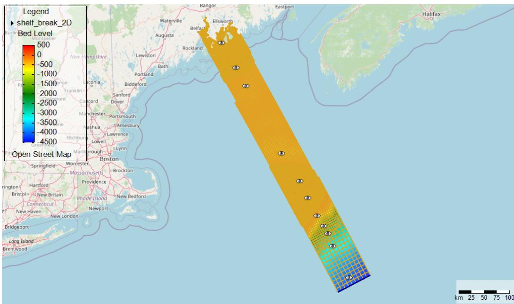

**Figure 24.34:** Model domain with a shelf break.

It can be seen that the bed levels varies from 0 m to a few hundred meters in the coastal zone. Then, after the shelf break the bed level rapidly increases to a depth of about 4300 m.

- ➤ Double-click on General in the Project window. Apart from the General settings other tabs will appear.
- ➤ Choose the tab 3D Layers and specify the following:
  - Kmx = 25, the number of vertical layers;
  - Layer type = 2, indicating that the layer type is based on z-layers;
  - DzTop = 2.5, being the z-layer thickness of layers above level Dztopuniabovez;
  - FloorLevTopLay = - 2.5, indicating the floor level of top layer;
  - DzTopUniAboveZ = -40.0, indicating that above level Dztopuniabovez layers will have uniform a thickness of Dztop, while the zLayerGrowthFactor is applied below this level (in the figure below the old name sigmaGrowthFactor is still used);
  - NumTopSig = 16, representing the number of sigma-layers on top of the z-layers;
  - NumTopSigUniform = 0, indicating whether the number of sigma-layers in a z-sigma-model is constant (=1) or decreasing (=0) (depending on local depth);
  - zLayerGrowthFactor = 1.18, representing the increase in layer thickness below the level specified for Dztopuniabovez.

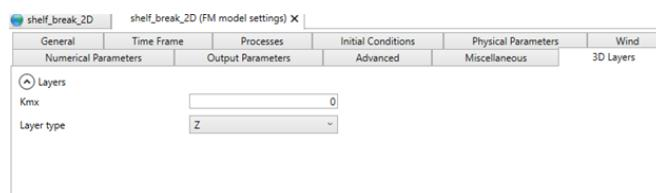

**Figure 24.35:** Specification of Z-sigma layers

- ➤ Finally: Rename the Flow FM model in the Project window to shelf\_break\_3D; and
- ➤ Export the model to (DIMR Configuration) files.

Next, we will carry out a simulation with this 3D model. This can be done via a simulation inside the GUI or outside the GUI. We prefer to do the simulation outside the GUI, because this will go slightly

faster. Moreover, then simulations can be done in parallel mode on multiple cores. The latter is not possible via the GUI.

- ➤ Open file <run\_dimr.bat> and check whether the path specified in this file for the D-Flow FM executable is valid on your computer.
- ➤ If the path is not valid, because for example another Delft3D Flexible Mesh release has been installed on your computer, then change this path so that it refer to a D-Flow FM executable on your computer. Noted that there is no progress available. If the keyword `StatInterval` has been activated, then the progress can be checked in the diagnostic file of the simulation.
- ➤ Double click on <run\_dimr.bat> so that the simulation will start. The simulation will roughly take five minutes, depending on the computing power of your computer.
- ➤ When the simulation has finished, go to folder <output> in folder <tutorial13> and open file <shelf\_break\_3D.dia>. Check whether the simulation has come to a normal end, which can be checked at the end of this file. For example, the average time step should be in the order of 45 s.

Now we will visualize the results of this 3D model.

- ➤ To that purpose start the Delft3D-QUICKPLOT program by double clicking on its icon on your desktop.
- ➤ Select the MAP output via `File → Open File` and then go to the folder <output> and select file <shelf\_break\_3D\_map.nc>.
- ➤ Click on the <Grid icon> as shown in Figure 24.36.

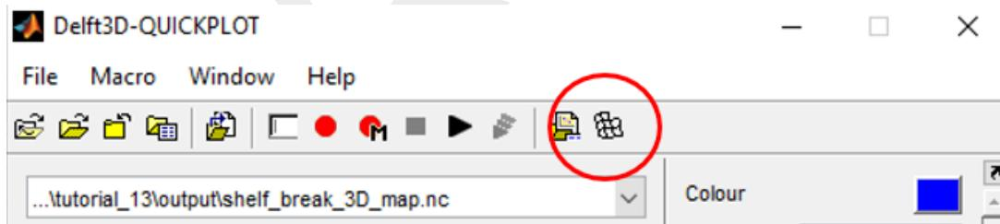

**Figure 24.36:** Icon for grid selection.

- ➤ Click on the sixth icon and draw an arbitrary line as shown in Figure 24.37.

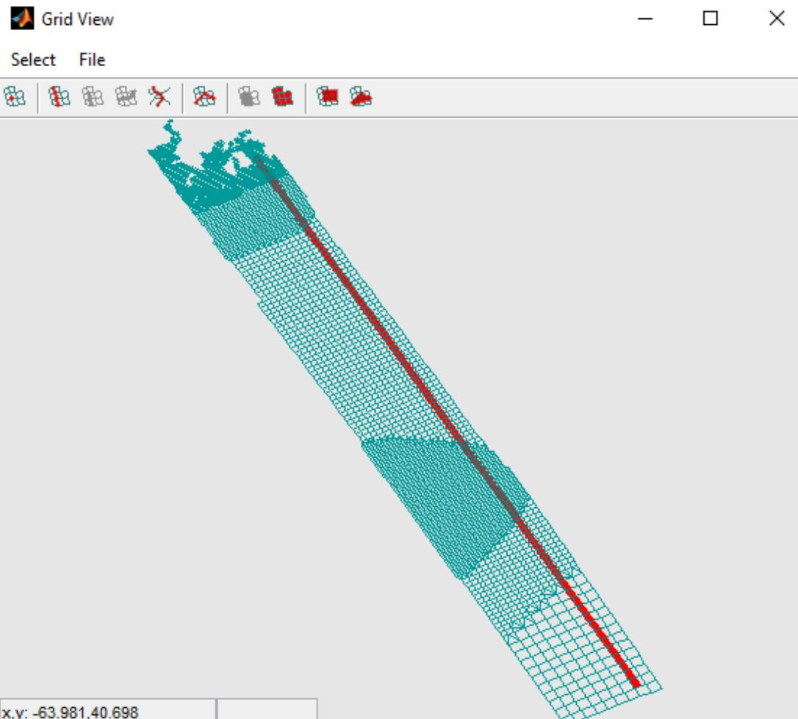

**Figure 24.37:** Location of 2DV cross section.

- ➤ Select quantity *Salinity in flow element -nmesh2d\_face: mean*.
- ➤ For the *Presentation Type* click on *patches with lines*.
- ➤ For the *Colour* select the white colour instead of the blue colour, which is the default.
- ➤ Click on *Quick View* and the figure will show up as in Figure 24.38.

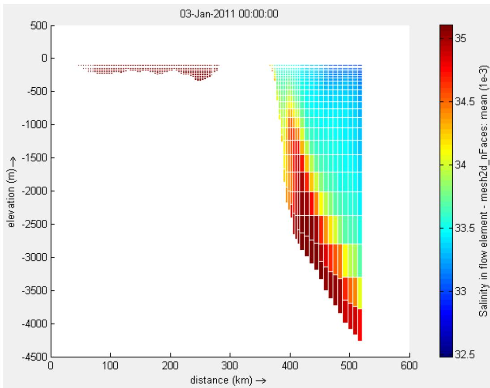

**Figure 24.38:** Overall 2DV cross section of salinity including layer interfaces.

- ➤ Now zoom into the shelf break so that a figure will appear as in Figure 24.39.

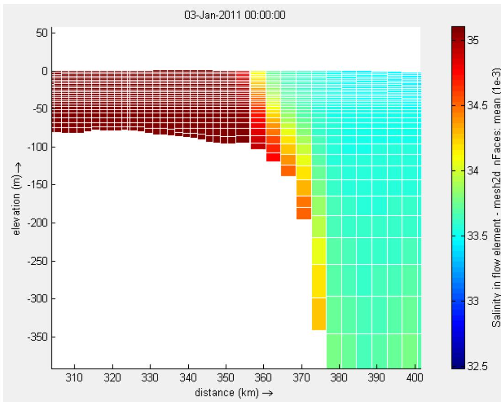

**Figure 24.39:** 2DV cross section of salinity including layer interfaces at shelf break.

It can be seen that in the top 40 meters of the water column 16 layers of a thickness of about 2.5 m appear, which represent the  $\sigma$  layers in this model. Now, we will zoom into the deeper part of the model domain.

- ➤ Therefore, at first zoom out again to the whole cross section and then zoom in to the deep part as shown in Figure 24.40.

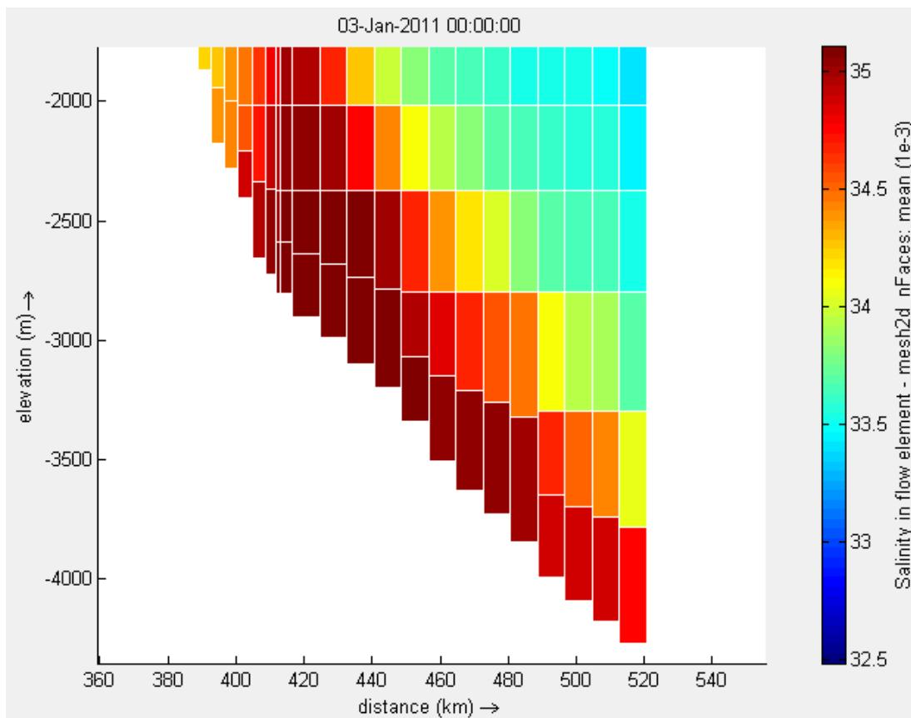

**Figure 24.40:** 2DV cross section of salinity including layer interfaces at deep part.

It can be seen that the layer thicknesses rapidly increase for the larger depths. All layer interfaces are strictly horizontal except for the two deepest layers. In order to prevent very thin layers near the bed, which is unwanted from a numerical point of view, the two deepest layers have the same thickness. Consequently, the interfaces in the two bed layers aren't strictly horizontal.

In this model there are  $\sigma$  layers near the surface and z-layers in the deeper part. This is a much preferred combination, because  $\sigma$  layers can lead to artificial mixing in areas of steep bed topography, due to the hydrostatic inconsistency (Haney, 1991). On the other hand, z layers can lead to stair cases near the surface. Moreover, a top layer can become very thin, so that the ratio in layer thickness with the next layer can be large, which is unwanted from a numerical point of view. This might lead to a small time step and therefore huge computation time. By applying  $\sigma$  layers near the surface and z layers in the deeper parts, the disadvantages of both approaches are largely circumvented.

In summary, in this tutorial exercise a simplified 3D model was set-up that consists of a relatively shallow part with depths up to about 100 meter, a shelf break and a deep part of more than four kilometers deep. D-Flow FM has been developed for coastal applications and therefore focusses on processes in this relatively shallow areas of roughly a few hundred meters deep. For such applications D-Flow FM performs adequately. However, D-Flow FM is also used in oceanic applications with areas of kilometers deep. For these oceanic applications software systems like HYCOM, NEMO and ROMS have been developed. These software systems are based on different numerical schemes and different turbulence models compared to D-Flow FM, so that model results of D-Flow FM can be different for deep water applications.

### 24.2.3 Tutorial 14: Extra options for postprocessing of 3D model simulations

In this tutorial extra postprocessing options will be described for 3D modelling. This will be done for a flume model with a length of 130 m. At the left open boundary there is a tidal boundary with either inflow or outflow of water. At the right open boundary there is a small inflow discharge of water.

In Figure 24.41 this flume model is visualized in the GUI of D-Flow FM. A meandering grid is applied consisting of quadrangles with locally a grid refinement. In this figure an arbitrary line has been drawn (in red). This section will be used for postprocessing, as we did in the previous tutorial.

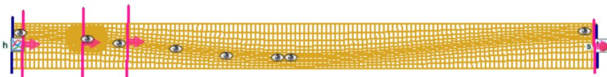

**Figure 24.41:** Location of 2DV cross section.

- ➤ Start the Delft3D-QUICKPLOT program by double clicking on its icon on your desktop.
- ➤ Select the MAP output via *File* → *Open File* and then go the folder <tutorial14\_output> and select file <tidalflume\_map.nc>.
- ➤ Click on the *Grid icon* as shown in Figure 24.36.
- ➤ Click on the sixth icon and draw an arbitrary line as shown in Figure 24.42.

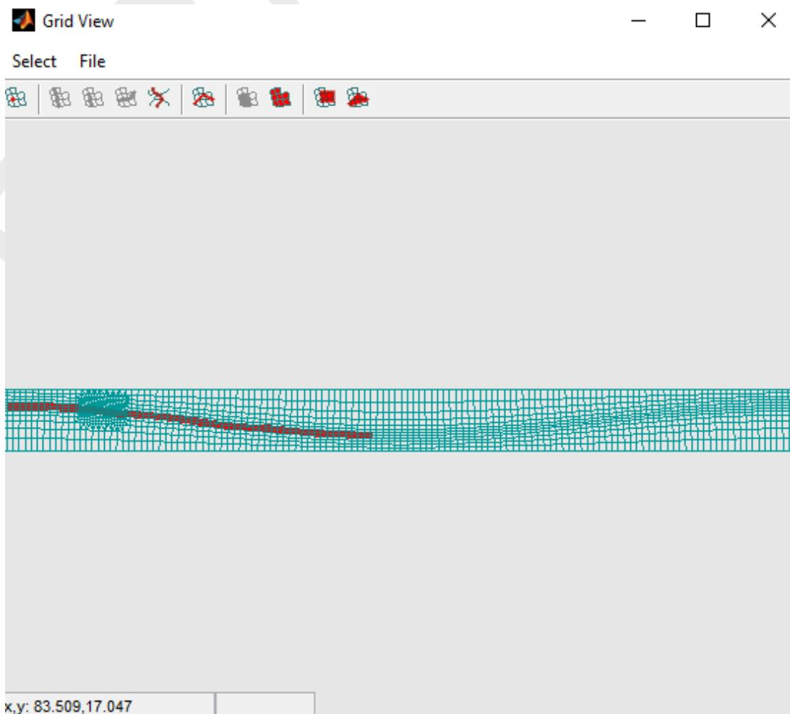

**Figure 24.42:** Location of 2DV cross section.

- ➤ Select quantity *Salinity in flow element -nmesh2d\_face: mean*.
- ➤ For the *Presentation Type* click on *continuous shades*.
- ➤ Click on *Show Times* and select 01-Sep-1992 00:54:00.
- ➤ Click on *Quick View* and a figure will show up as in Figure 24.43.

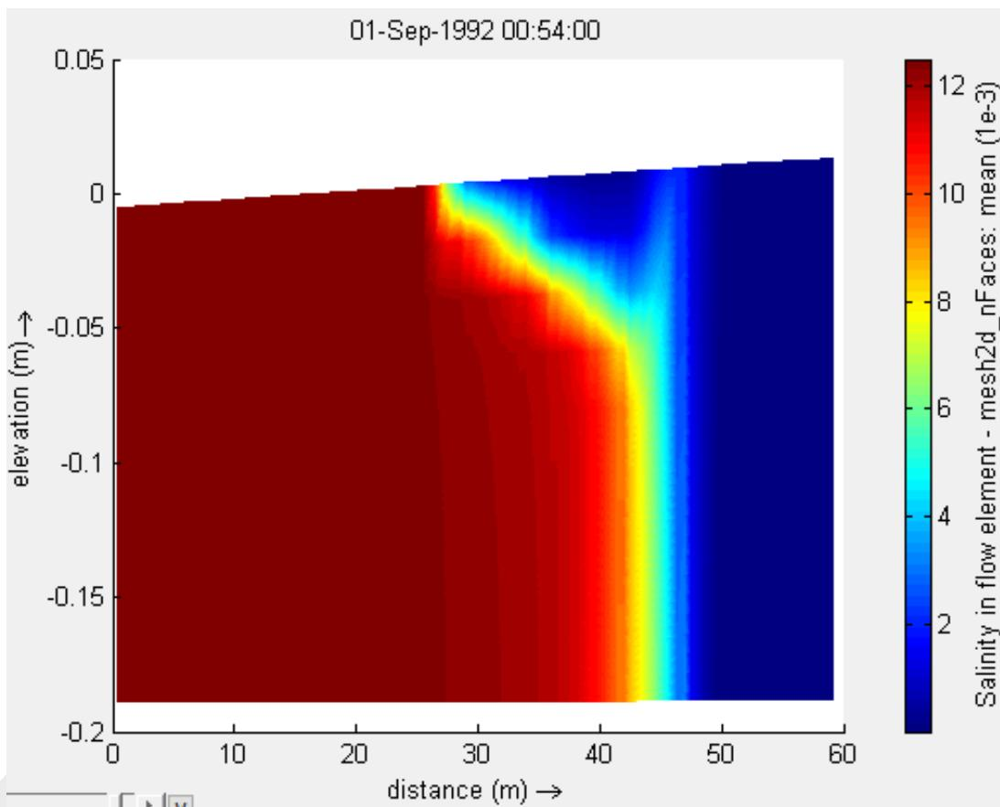

**Figure 24.43:** 2DV cross sectional view of salinity.

Next, we will make a 2DV(ertical) cross sectional plot for the vertical eddy viscosity.

- ➤ Therefore, Select quantity *turbulent vertical eddy viscosity -mesh2d\_nEdges: mean*.
- ➤ For the *Presentation Type* click on *continuous shades*.
- ➤ Click on *Show Times* and select 01-Sep-1992 00:54:00.
- ➤ Click on *Quick View* and a figure will show up as in Figure 24.44. Neglect the white vertical bars, which is due to the postprocessing when interpolating along the chosen grid line.

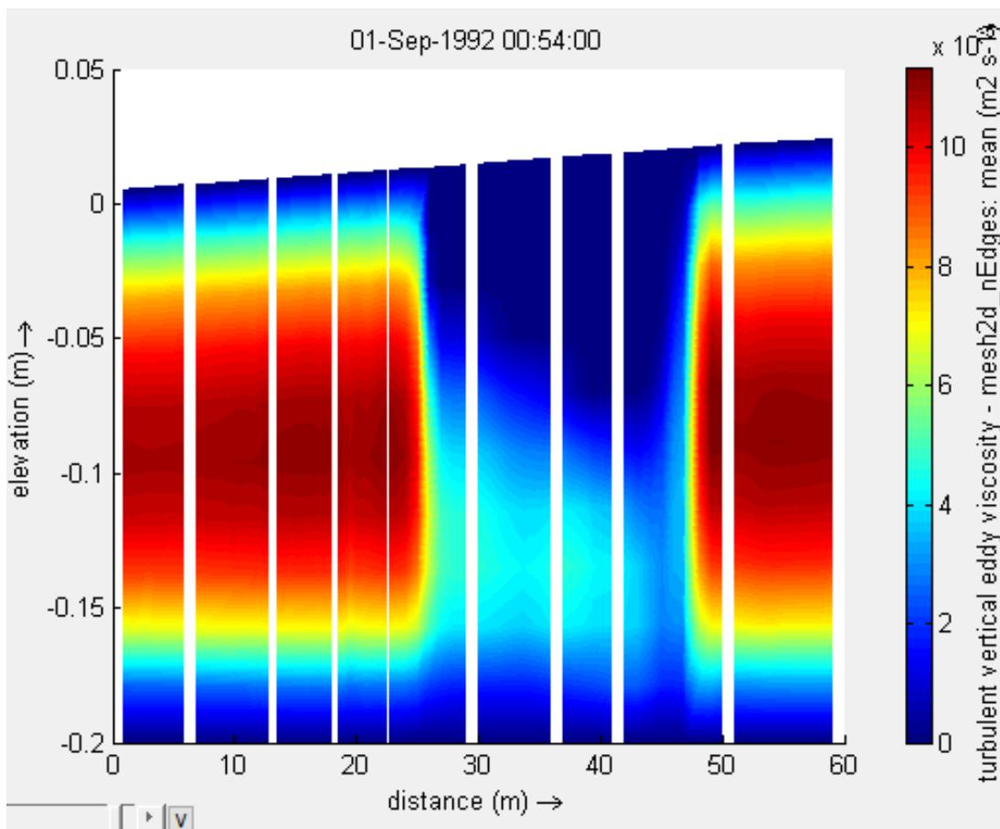

**Figure 24.44:** 2DV cross sectional view of vertical eddy viscosity.

In Figure 24.43 it can be seen that in the area between 25 m en 45 m from the inflow boundary salinity stratification occurs. In other parts of the model domain no vertical stratification of salinity occurs. When looking at the vertical profiles for the vertical eddy viscosity, it can be seen that parabolic profiles occur in the vertical in the areas without any stratification. This is in line with the theory for well-mixed areas. However, in the area of vertical stratification, the vertical profiles for the vertical eddy viscosity are different, which is in line with the theory as well. In the validation document of D-Flow FM an almost similar flume model is validated on salinity measurements. In this validation document it is shown that D-Flow FM accurately computes the salinity intrusion in this tidal flume.

The previous figures were based on the map output file. We will now switch to proprocessing for the history output file.

- ➤ Therefore, select the history output via *File → Open File* and then go the folder <tutorial14\_output> and select file <tidalflume\_his.nc>.
- ➤ Select quantity *sea\_water\_salinity*.
- ➤ Select station *at 24 m*.
- ➤ Select layer *k=10*.
- ➤ Select all time steps.
- ➤ Click on *Quick View* and a figure will show up with only the blue line as in Figure 24.45.
- ➤ Select layer *k=1*.
- ➤ For the *Colour* select the red colour instead of the blue colour.
- ➤ Click on *Add to Plot* and a figure will show up as in Figure 24.45.

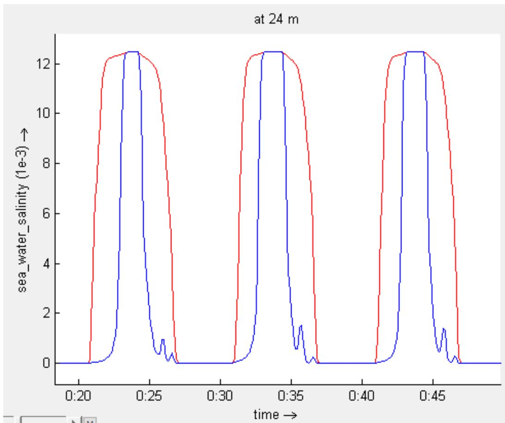

**Figure 24.45:** Time history of salinity near surface and near bed.

Finally, we will generate a ZT(ime)-plot in which for one observation point the salinity concentrations will be shown during the whole simulation.

- ➤ To that purpose select station *at 24 m*.
- ➤ Select all layers.
- ➤ Select all time steps.
- ➤ For the *Axes Type* select *Time-Z*
- ➤ For the *Presentation Type* click on *continuous shades*.
- ➤ Click on *Quick View* and a figure will show up with salinity concentrations at 24 m from the inflow boundary for the whole simulation period.
- ➤ Now, zoom in the period from 20 to 50 minutes after the start. Then a figure will show up as in Figure 24.46.

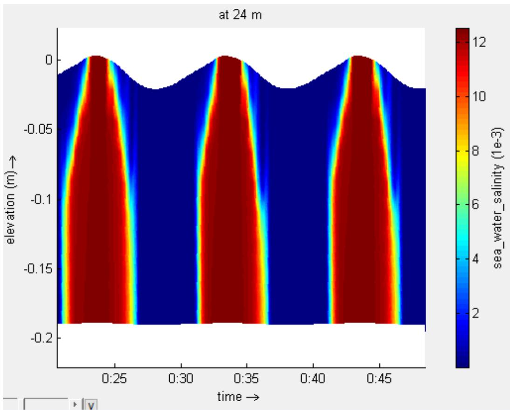

**Figure 24.46:** ZT plot of salinity at 24 m from inflow boundary.

In summary, in this tutorial several extra postprocessing options have been explained for a tidal flume model. In this model only 10  $\sigma$  layers are used. Despite its relatively low number of layers an accurate vertical salinity stratification was computed. The computation of salinity stratification and temperature stratification in the vertical is one of the nice features of 3D modelling with D-Flow FM.

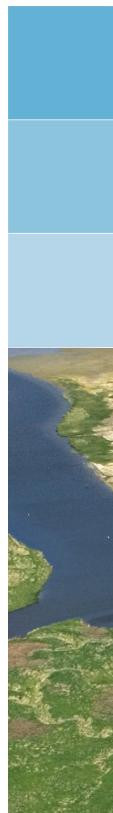

## References

Andreas, E. L., H. T. W., A. A. Grachev, P. O. G. Persson, C. W. Fairall, P. S. Guest and R. E. Jordan, 2010. "Parametrizing turbulent exchange over summer sea ice and the marginal ice zone." *Quarterly Journal of the Royal Meteorological Society* 136: 927–943. DOI: 10.1002/qj.618.

Andrews, D. G. and M. E. McIntyre, 1978. "An exact theory of nonlinear waves on a Lagrangian-mean flow." *Journal of Fluid Mechanics* 89 (4): 609–646.

Asaeda, T. and J. Imberger, 1992. "Structure of bubble plumes in leinearly stratified medium." *Journal of Fluid Mechanics* 249: 35–37.

Baptist, M. J., 2005. *Modelling floodplain biogeomorphology*. Ph.D. thesis, Delft University of Technology.

Barenblatt, G. I., M. Bertsch, R. Dal Passo, V. M. Prostokishen and M. Ughi, 1993. "A mathematical model of turbulent heat and mass transfer in stably stratified shear flow." *Journal of Fluid Mechanics* 253: 341–358.

Baumert, H. and G. Radach, 1992. "Hysteresis of Turbulent Kinetic Energy in Non-rotational Tidal Flows: A Model Study." *Journal of Geophysical Research* 97 (C3): 3669–3677.

Beckers, J. M., H. Burchard, J. M. Campin, E. Deleersnijder and P. P. Mathieu, 1998. "Another reason why simple discretizations of rotated diffusion operators cause problems in ocean models: comments on "isoneutral diffusion in a z co-ordinate ocean model"." *American Meteorological Society* 28: 1552–1559.

Bijker, E. W., 1967. *Some considerations about scales for coastal models with moveable bed*. Tech. Rep. 50, WL | Delft Hydraulics, Delft, The Netherlands.

Bos, 1989. *Discharge Measuring Structures*. International Institute for Land Reclamation and Improvement/ILRI, Wageningen, The Netherlands.

Brückner, M. Z. M., C. Schwarz, W. M. van Dijk, M. van Oorschot, H. Douma and M. G. Kleinhans, 2019. "Salt Marsh Establishment and Eco-Engineering Effects in Dynamic Estuaries Determined by Species Growth and Mortality." *Journal of Geophysical Research: Earth Surface* 124 (12): 2962–2986. DOI: <https://doi.org/10.1029/2019JF005092>, URL <https://agupubs.onlinelibrary.wiley.com/doi/abs/10.1029/2019JF005092>.

Bulson, P., 1961. "Currents produced by an air curtain in deep water." *Dock and Harbour Authority* 42: 15–22.

Burchard, H. and H. Baumert, 1995. "On the performance of a mixed-large model based on the kepsilon turbulence closure." *Journal of Geophysical Research* 100 (C5): 8523–8540.

Charnock, H., 1955. "Wind-stress on a water surface." *Q. J. Royal Meteorol. Soc.* 81: 639–640.

Christoffersen, J. B. and I. G. Jonsson, 1985. "Bed friction and dissipation in a combined current and wave motion." *Ocean Engineering* 12 (5): 387–423.

Colebrook, C., 1939. "Turbulent flow in pipes, with particular reference to the transition region between the smooth and rough pipe laws." *Journal of the Institution of Civil Engineers* 11 (4): 133–156.

Colebrook, C. and C. White, 1937. "Experiments with Fluid Friction in Roughened Pipes." *Proceedings of the Royal Society of London, Series A, Mathematical and Physical Sciences* 161 (906): 367–381.

Davies, A. G., R. L. Soulsby and H. L. King, 1988. "A numerical model of the combined wave and current bottom boundary layer." *Journal of Geophysical Research* 93 (C1): 491–508.

Davies, A. M. and H. Gerritsen, 1994. "An intercomparison of three-dimensional tidal hydrodynamic models of the Irish Sea." *Tellus* 46A: 200–221.

De Goede, E., 2020. "Historical overview of 2D and 3D hydrodynamic modelling of shallow water flows in the Netherlands." *Journal of Ocean Dynamics* 70(4): 521–539. DOI: <https://doi.org/10.1007/s10236-019-01336-5>.

Deltares, 2026a. *D-Flow Flexible Mesh Technical Reference Manual*. Deltares, Delft.

Deltares, 2026b. *D-Flow Flexible Mesh User Manual; Released for Delft3D FM Suite 1D2D*. Deltares, Delft.

Deltares, 2026c. *D-Morphology 1D/2D/3D User Manual*. Deltares, Delft.

Deltares, 2026d. *D-Real Time Control User Manual; Released for Delft3D FM and SOBEK*. Deltares, Delft, 1.4 ed.

Deltares, 2026e. *D-Water Quality Description of Input file*. Deltares, 2.00 ed.

Deltares, 2026f. *D-Water Quality Processes Library Configuration Tool User Manual*. Deltares, 0.01 ed.

Deltares, 2026g. *D-Water Quality Technical Reference Manual*. Deltares, 5.01 ed.

Deltares, 2026h. *D-Water Quality User Manual*. Deltares, 5.06 ed.

Deltares, 2026i. *D-Waves User Manual; Simulation of short-crested waves with SWAN*. Deltares, Delft, 1.2 ed.

Deltares, 2026j. *Delft3D-FLOW User Manual; Simulation of multi-dimensional hydrodynamic flows and transport phenomena, including sediments*. Deltares, Delft, 4.05 ed.

Deltares, 2026k. *Delft3D-RGFGRID User Manual; Generation and manipulation of structured and unstructured grids, suitable for Delft3D-FLOW, Delft3D-WAVE or D-Flow Flexible Mesh*. Deltares, Delft, 7.00 ed.

Deltares, 2026l. *DIMR Technical Reference Manual*. Deltares, Delft.

Dijkstra, Y. M., 2014. *Turbulence modelling in environmental flows. Improving the accuracy of the  $k-\varepsilon$  model by a mathematical transformation*. Master's thesis, Delft University of Technology. Faculty of Civil Engineering and Geosciences, Department of Environmental Fluid Mechanics.

Dingemans, M. W., 1997. *Water Wave Propagation over Uneven Bottoms, Vol. 1 and 2*. Advanced Series on Ocean Engineering, Vol. 13. World Scientific, London.

Dingemans, M. W., A. C. Radder and H. J. de Vriend, 1987. "Computation of the driving forces of wave-induced currents." *Coastal Engineering* 11: 539–563.

Eckart, C., 1958. "Properties of water, Part II. The equation of state of water and sea water at low temperatures and pressures." *American Journal of Science* 256: 225–240.

ECMWF, 2023. *IFS DOCUMENTATION – Cy48r1, Operational implementation 27 June 2023, PART IV: PHYSICAL PROCESSES*. Tech. rep., ECMWF.

Engelund, F. and E. Hansen, 1967. *A monograph on Sediment Transport in Alluvial Streams*. Teknisk Forlag, Copenhagen.

Fannelop, T. and K. Sjoen, 1980. "Hydrodynamics of air-bubble plumes." In *Proc. AIAA 18-th Aerospace Sci. Meeting*.

Fofonoff, N. P. and R. C. Millard Jr., 1983. *Algorithms for the computation of fundamental properties of seawater*. UNESCO Technical Papers in Marine Sciences 44, UNESCO, Paris, France.

Fredsøe, J., 1982. "Shape and dimensions of stationary dunes in rivers." *Journal of the Hydraulics Division, ASCE* 108: 932–947.

Fredsøe, J., 1984. "Turbulent boundary layer in wave-current interaction." *Journal of Hydraulic Engineering* 110: 1103–1120.

Garratt, J. R., 1977. "Review of Drag Coefficients over Oceans and Continents." *Review Articles in Monthly Weather Review* 105 (7): 915–929.

Gill, A. E., 1982. *Atmosphere-Ocean dynamics*, vol. 30 of *International Geophysics Series*. Academic Press.

Grant, W. D. and O. S. Madsen, 1979. "Combined wave and current interaction with a rough bottom." *Journal of Geophysical Research* 84 (C1): 1797–1808.

Groeneweg, J., 1999. *Wave-current interactions in a generalized Lagrangian mean formulation*. Delft University of Technology, Delft, The Netherlands. Ph.D. thesis.

Groeneweg, J. and G. Klopman, 1998. "Changes of the mean velocity profiles in the combined wave-current motion in a GLM formulation." *Journal of Fluid Mechanics* 370: 271–296.

Haney, R. L., 1991. "On the pressure gradient force over steep topography in sigma co-ordinate models." *Journal of Physical Oceanography* 21: 610–619.

Hersbach, H., 2011. "Sea Surface Roughness and Drag Coefficient as Functions of Neutral Wind Speed." *Journal of Physical Oceanography* 41 (1): 247–251.

Hibler III, W. D., 1979. "A dynamic thermokynetic sea ice model." *Journal of Physical Oceanography* 9 (4): 815–846.

Hirsch, C., 1990. *Numerical computation of internal and external flows*. John Wiley & Sons, New York.

Houwing, E. J., I. C. Tánczos, A. Kroon and M. B. de Vries, 2000. "Interaction of submerged vegetation, hydrodynamics and turbidity; analysis of field and laboratory studies." *Conference INTERCOH2000* .

Huang, W. and M. Spaulding, 1996. "Modelling horizontal diffusion with sigma coordinate system." *Journal of Hydraulic Engineering* 122 (6): 349–352.

Hunke, E. C. and J. K. Dukowicz, 1997. "An elastic-ciscous-plastic model for sea ice." *Journal of Physical Oceanography* 27 (9): 1849–1867.

Hutton, E. W. H., M. D. Piper and G. E. Tucker, 2020. "The Basic Model Interface 2.0: A standard interface for coupling numerical models in the geosciences." *Journal of Open Source Software* 5 (51): 2317. DOI: [10.21105/joss.02317](https://doi.org/10.21105/joss.02317), URL <https://doi.org/10.21105/joss.02317>.

Huynh-Thanh, S. and A. Temperville, 1991. "A numerical model of the rough turbulent boundary layer in combined wave and current interaction." In R. L. Soulsby and R. Bettes, eds., *Sand transport in rivers, estuaries and the sea*, pages 93–100. Balkema Rotterdam.

Hwang, P., 2005a. "Comparison of the ocean surface wind stress computed with different parameterization functions of the drag coefficient." *J. Oceanogr.* 61: 91–107.

Hwang, P., 2005b. "Drag coefficient, dynamic roughness and reference wind speed." *J. Oceanogr.* 61: 399–413.

Joyce, B. R., W. J. Pringle, D. Wirasaet, J. J. Westerink, A. J. van der Westerhuysen, R. Grumbine and J. Feyen, 2019. "High resolution modeling of western Alaskan tides and storm surge under varying sea ice conditions." *Ocean Modelling* 141. DOI: [10.1016/j.ocemod.2019.101421](https://doi.org/10.1016/j.ocemod.2019.101421).

Kalkwijk, J. P. T. and R. Booij, 1986. "Adaptation of secondary flow in nearly horizontal flow." *Journal of Hydraulic Research* 24 (1): 19–37.

Karypis, G., 2013. *METIS - A Software Package for Partitioning Unstructured Graph, Partitioning Meshes, and Computing Fill-Reducing Orderings of Sparse Matrices, Version 5.1.0*. Tech. rep., Department of Computer Science and Engineering, University of Minnesota.

Klopstra, D., H. J. Barneveld and J. M. Van Noortwijk, 1996. *Analytisch model hydraulische ruwheid van overstroomde moerasvegetatie*. Tech. Rep. PR051, HKV consultants, Leystad, The Netherlands. Commissioned by Rijkswaterstaat/RIZA, The Netherlands.

Klopstra, D., H. J. Barneveld, J. M. Van Noortwijk and E. H. van Velzen, 1997. "Analytical model for hydraulic roughness of submerged vegetation." In *The 27th IAHR Congress, San Francisco, 1997; Proceedings of Theme A, Managing Water: Coping with Scarcity and Abundance*, pages 775–780. American Society of Civil Engineers (ASCE), New York.

Knaap, F. Van der, 2000. *Breach growth as a function of time*. Tech. Rep. Q2655, WL | Delft Hydraulics, Delft, The Netherlands. Memos 2 and 3 of May 21 and September 5 respectively.

Kolmogorov, A. N., 1942. "Equations of turbulent motion in incompressible fluid." *Izv. Akad. Nauk. SSR, Seria fizicheska Vi* No.1 2 (1-2): 56–58. English translation: 1968 Imperial College, Mech. Eng. Dept. Rept. ON/6.

Lane, A., 1989. *The heat balance of the North Sea*. Tech. Rep. 8, Proudman Oceanographic Laboratory.

Leendertse, J. J., 1990. "Turbulence modelling of surface water flow and transport: part IVa." *Journal of Hydraulic Engineering* 114 (4): 603–606.

Love, A. E. H., 1927. *A Treatise on the Mathematical Theory of Elasticity*. Cambridge University Press, 4th ed.

Lüpkes, C. and G. Birnbaum, 2005. "Surface drag in the arctic marginal sea-ice zone: a comparison of different parameterisation concepts." *Boundary-Layer Meteorology* 117: 179-211. DOI: [10.1007/s10546-005-1445-8](https://doi.org/10.1007/s10546-005-1445-8).

Madec, G., M. Bell, R. Bourdallé-Badie, J. Chanut, E. Clementi, A. Coward, M. Drudi, I. Epicoco, C. Ethé, D. Iovino, D. Lea, C. Lévy, N. Martin, S. Masson, P. Mathiot, F. Mele, S. Mocavero, A. Moulin, S. Müller, G. Nurser, G. Samson and D. Storkey, 2022. *NEMO ocean engine*. Scientific Notes. Institut Pierre-Simon Laplace, Paris, France, v4.2 ed.

Manning, R., 1891. "On the flow of water in open channels and pipes." *Transactions of the Institution of Civil Engineers of Ireland* 20: 161–207.

McDougall, T., 1978. "Bubble plumes in stratified environments." *Journal of Fluid Mechanics* 85: 655–672.

Meijer, D., 1998. *Modelproeven overstroomde vegetatie*. Tech. rep., HKV Lijn in water. In Dutch.

Mellor, G. and A. F. Blumberg, 1985. "Modelling vertical and horizontal diffusivities with the sigma coordinate system." *Monthly Weather Review* 11: 1379–1383.

Mellor, G. L. and L. Kantha, 1989. "An ice-ocean coupled model." *Journal of Geophysical Research* 94 (8): 10937–10954.

Meyer-Peter, E. and R. Müller, 1948. "Formulas for bed load transport." In *Proceedings of the 2nd Congress IAHR, Stockholm*, vol. 2, pages 39–64.

Milgram, J., 1983. "Mean flow in round bubble plumes." *Journal of Fluid Mechanics* 133: 345–376.

Millero, F. J. and A. Poisson, 1981. "International one-atmosphere equation of state of sea water." *Deep-Sea Research* 28A (6): 625–629.

Myrhaug, D. and O. H. Slaattelid, 1990. "A rational approach to wave-current friction coefficients for rough, smooth and transitional turbulent flow." *Coastal Engineering* 14: 265–293.

O' Connor, B. A. and D. Yoo, 1988. "Mean bed friction of combined wave-current flow." *Coastal Engineering* 12: 1–21.

Oberez, A., 2001. *Turbulence modeling of hydraulic roughness of submerged vegetation*. Master's thesis, UNESCO IHE, Delft. H.E.100.

Octavio, K. A. H., G. H. Jirka and D. R. F. Harleman, 1977. *Vertical Heat Transport Mechanisms in Lakes and Reservoirs*. Tech. Rep. 22, Massachusetts Institute of Technology.

Oorschot, M. v., M. Kleinhans, G. Geerling and H. Middelkoop, 2016. "Distinct patterns of interaction between vegetation and morphodynamics." *Earth Surface Processes and Landforms* 41 (6): 791–808. DOI: <https://doi.org/10.1002/esp.3864>, URL <https://onlinelibrary.wiley.com/doi/abs/10.1002/esp.3864>.

Peckham, S. D., E. W. H. Hutton and B. Norris, 2013. "A component-based approach to integrated modeling in the geosciences: The design of CSDMS." *Computers & Geosciences* 53: 3–12.

Phillips, N. A., 1957. "A co-ordinate system having some special advantages for numerical forecasting." *Journal of Meteorology* 14: 184–185.

Platzek, F. W., G. S. Stelling, J. A. Jankowski and R. Patzwahl, 2012. "On the representation of bottom shear stress in z-layer models." In *Hydroinformatics 2012*. Hamburg, Germany.

Postma, L., G. S. Stelling and J. Boon, 1999. "Three-dimensional water quality and hydrodynamic modelling in Hong Kong. Stratification and water quality." In *Proceedings of the 2nd International Symp. on Environmental Hydraulics, Hong Kong, December 1998*, pages 43–49. Balkema, Rotterdam.

Prandtl, L., 1945. "Über ein neues Formelsystem für die ausgebildete Turbulenz." *Nachrichten von der Akademie der Wissenschaften in Gottingen. Mathematisch-Physikalische Klasse* pages 6–19.

Rijn, L. C. van, 1984. "Sediment transport, Part III: bed form and alluvial roughness." *Journal of Hydraulic Engineering* 110 (12): 1733–1754.

Rijn, L. C. van, 2007. "Unified View of Sediment Transport by Currents and Waves. I: Initiation of Motion, Bed Roughness, and Bed-Load Transport." *Journal of Hydraulic Engineering* 133 (6): 649–667.

Rijn, L. C. van, D. R. Walstra and M. v. Ormondt, 2004. *Description of TRANSPOR2004 and implementation in Delft3D-ONLINE*. Tech. Rep. Z3748.10, WL | Delft Hydraulics, Delft, The Netherlands.

Ris, R. C., 1997. *Spectral Modelling of Wind Waves in Coastal Areas*. Communications on Hydraulic and Geotechnical Engineering, report 97-4. Delft University of Technology, Delft, The Netherlands. Ph.D. thesis.

Rodi, W., 1984. "Turbulence models and their application in Hydraulics, State-of-the-art paper article sur l'etat de connaissance." *IAHR* Paper presented by the IAHR-Section on Fundamentals of Division II: Experimental and Mathematical Fluid Dynamics, The Netherlands.

Ryan, P. J., D. R. F. Harleman and K. D. Stolzenbach, 1974. "Surface Heat Loss From Cooling Ponds." *Water Resources Research* 10 (5): 930–938.

Schrama, E., 2007. "Tides. Lecture Notes AE4-876."

Semtner Jr., A. J., 1976. "Numerical simulation of the Arctic Ocean circulation." *Journal of Physical Oceanography* 6 (4): 409–425.

Slørdal, L. H., 1997. "The pressure gradient force in sigma-co-ordinate ocean models." *International Journal Numerical Methods In Fluids* 24: 987–1017.

Smith, S. D. and E. G. Banke, 1975. "Variation of the sea surface drag coefficient with wind speed." *Quarterly Journal of the Royal Meteorological Society* 101: 665–673.

Soulsby, R., 1997. *Dynamics of marine sands, a manual for practical applications*. Thomas Telford, London.

Soulsby, R. L., A. G. Davies, J. Fredsøe, D. A. Huntley, I. G. Jonnson, D. Myrhaug, R. R. Simons, A. Temperville and T. J. Zitman, 1993a. "Bed shear stresses due to combined waves and currents." In *Abstracts-in-depth of the Marine Science and Technology G8-M overall workshop, Grenoble*, pages 2.1-1/2.1–4. EC.

Soulsby, R. L., L. Hamm, G. Klopman, D. Myrhaug, R. R. Simons and G. P. Thomas, 1993b. "Wave-current interaction within and outside the bottom boundary layer." *Coastal Engineering* 21: 41–69.

Speziale, C. G., R. Abid and E. C. Anderson, 1992. "Critical evaluation of two-equation models for near-wall turbulence." *AIAA Journal* 30: 324–331.

Stelling, G. S. and J. A. T. M. van Kester, 1994. "On the approximation of horizontal gradients in sigma co-ordinates for bathymetry with steep bottom slopes." *International Journal Numerical Methods In Fluids* 18: 915–955.

Swart, 1974. *Offshore sediment transport and equilibrium beach profiles*. Ph.D. thesis, Delft University of Technology, Delft, The Netherlands. Delft Hydraulics Publ. 131.

Sweers, H. E., 1976. "A nomogram to estimate the heat exchange coefficient at the air-water interface as a function of windspeed and temperature; a critical survey of some literature." *Journal of Hydrology* 30: –.

Uittenbogaard, R. E., dec. 2000. *Hydrodynamics of flow over plants, internal communication*. Tech. rep., WL | Delft Hydraulics, Delft, The Netherlands.

Uittenbogaard, R. E., J. A. T. M. van Kester and G. S. Stelling, 1992. *Implementation of three turbulence models in 3D-TRISULA for rectangular grids*. Tech. Rep. Z81, WL | Delft Hydraulics, Delft, The Netherlands.

Velzen, E. H. van, P. Jesse, P. Cornelissen and H. Coops, 2003. *Stromingsweerstand vegetatie in uiterwaarden*. Tech. Rep. 2003.029, Rijkswaterstaat/RIZA.

Verheij, H., 2002. *Modification breach growth model in HIS-OM*. Tech. Rep. Q3299, WL | Delft Hydraulics, Delft, The Netherlands. (in Dutch).

Wang, J., Q. Liu, M. Jin, M. Ikeda and F. J. Saucier, 2005. "A Coupled Ice-Ocean Model in the Pan-Arctic and North Atlantic Ocean: Simulation of Seasonal Cycles." *Journal of Oceanography* 61: 213–233.

Winterwerp, J. C. and R. E. Uittenbogaard, 1997. *Sediment transport and fluid mud flow*. Tech. Rep. Z2005, WL | Delft Hydraulics, Delft, The Netherlands.

WL | Delft Hydraulics, 1998. *Interaction of submerged vegetation and physical processes; Delft, The Netherlands*. Research report, WL | Delft Hydraulics, Delft, The Netherlands. (in Dutch).

Wüest, A. and A. Lorke, 2003. "Small-Scale Hydrodynamics in Lakes." *Annual Review of Fluid Mechanics* 35 (1): 373–412.

Wunderlich, W. O., 1972. *Heat and Mass Transfer Between a Water Surface and the Atmosphere*. Water Resources Research Laboratory Report 14, TVA (Tennessee Valley Authority), Tennessee Valley Authority, Division of Water Control Planning, Engineering Laboratory, Norris, TN.

## A The master definition file

### A.1 Overview of keywords generated by GUI

The mdu-file contains the key information of the flow model. Besides the names of the relevant user specified files, such as the grid file and the external forcings file, the values of various model parameters should be specified in the MDU-file. In Table A.1 the model parameter settings are given as well as the associated default setting for these parameters that are generated by the Graphical User Interface of D-Flow FM. If a model parameter has a unit, then this unit will also be given in [ ] in the column of Description in this table.

The basename of the mdu-file, without .mdu, is also used as the model identification string, and is often denoted as *mdu\_name* throughout this User Manual. It is equivalent to Delft3D-FLOW's *runid* concept.

**Table A.1: Standard MDU-file with default settings.**

| Keyword               | Default setting     | Description                                                                                                                                          |
|-----------------------|---------------------|------------------------------------------------------------------------------------------------------------------------------------------------------|
| [general]             |                     |                                                                                                                                                      |
| Program               | D-Flow FM           | Program.                                                                                                                                             |
| Version               | 1.2.60 ←<br>.64623M | Version number of computational kernel.                                                                                                              |
| MDUFormatVersion      | 1.08                | File format version. Do not edit this.                                                                                                               |
| GuiVersion            | 1.5.4.45545         | Version number of GUI.                                                                                                                               |
| AutoStart             | 0                   | Autostart simulation after loading MDU or not (0=no, 1=autostart, 2=autostartstop).                                                                  |
| PathsRelativeToParent | 0                   | Whether or not (1/0) to resolve file names (e.g. inside the *.ext file) relative to their direct parent, instead of to the toplevel MDU working dir. |
| [geometry]            |                     |                                                                                                                                                      |
| NetFile               |                     | <*_net.nc>. See Appendix B.                                                                                                                          |
| DryPointsFile         |                     | Dry points file <*.xyz>, third column dummy z values, or polygon file <*.pol>.                                                                       |
| GridEnclosureFile     |                     | Enclosure file <*.pol> to clip outer parts from the grid.                                                                                            |
| StructureFile         |                     | File <*.ini> containing list of hydraulic structures. See Appendix C.13.                                                                             |
| GulliesFile           |                     | Polyline file <*_gul.pliz>, containing lowest bed level along talweg x, y, z level.                                                                  |
| RoofsFile             |                     | Polyline file <*_roof.pliz>, containing roofgutter heights x, y, z level.                                                                            |
| WaterLevIniFile       |                     | Initial water levels sample file <*.xyz>.                                                                                                            |
| LandBoundaryFile      |                     | Only for plotting.                                                                                                                                   |
| ThinDamFile           |                     | <*_thd.pli>, Polyline(s) for tracing thin dams.                                                                                                      |
| FixedWeirFile         |                     | <*_fxw.pliz>, Polyline(s) x, y, z, z = fixed weir top levels (formerly fixed weir).                                                                  |
| PillarFile            |                     | <*_pillar.pliz>, Polyline file containing four columns with x, y, diameter and Cd coefficient for bridge pillars.                                    |
| UseCaching            | 1                   | Use caching for geometrical/network-related items (0: no, 1: yes) (Appendix C.16).                                                                   |
| AllowBndAtBifurcation | 0                   | Allow 1d boundary node when connecting branch leads to bifurcation (1: yes, 0: no).                                                                  |
| ProflocFile           |                     | <*_proflocation.xyz>) x, y, z, z = profile refnumber.                                                                                                |
| ProfdefFile           |                     | <*_profdefinition.def>) definition for all profile nrs.                                                                                              |
| ProfdefxyzFile        |                     | <*_profdefinition.def>) definition for all profile nrs.                                                                                              |

| Keyword                        | Default setting | Description                                                                                                                                                                                                                                                                                         |
|--------------------------------|-----------------|-----------------------------------------------------------------------------------------------------------------------------------------------------------------------------------------------------------------------------------------------------------------------------------------------------|
| ManholeFile                    |                 | File containing manholes (e.g. <*.dat>).                                                                                                                                                                                                                                                            |
| PartitionFile                  |                 | <*_part.pol>, polyline(s) x, y.                                                                                                                                                                                                                                                                     |
| WaterLevIni                    | 0.              | Initial water level [m AD].                                                                                                                                                                                                                                                                         |
| Bedlevuni                      | -5.             | Uniform bed level [m AD], (only if BedlevType>=3), used at missing z values in netfile.                                                                                                                                                                                                             |
| Bedslope                       | 0.              | Bed slope inclination [-], sets zk = bedlevuni + x*bedslope and sets zbndz = xbndz*bedslope.                                                                                                                                                                                                        |
| BedlevType                     | 3               | 1: at cell center (tiles xz, yz, bl, bob=max(bl)),<br>2: at face (tiles xu, yu, blu, bob=blu),<br>3: at face (using mean node values),<br>4: at face (using min node values),<br>5: at face (using max node values),<br>6: with bl based on node values.                                            |
| Blmeanbelow                    | -999.           | if not -999d0, below this level [m] the cell centre bedlevel is the mean of surrounding netnodes.                                                                                                                                                                                                   |
| Blminabove                     | -999.           | if not -999d0, above this level [m] the cell centre bedlevel is the min of surrounding netnodes.                                                                                                                                                                                                    |
| AngLat                         | 0.              | Angle of latitude S-N [deg], 0=on Equator (and thus no Coriolis force). Only required for Coriolis on Cartesian grids and for heat flux modelling.                                                                                                                                                  |
| AngLon                         | 0.              | Angle of longitude E-W [deg], 0=Greenwich Mean Time. Only required for heat flux modelling.                                                                                                                                                                                                         |
| Conveyance2D                   | -1              | -1:R=HU, 0:R=H, 1:R=A/P, 2:K=analytic-1D conv, 3:K=analytic-2D conv.                                                                                                                                                                                                                                |
| Nonlin1D                       | 1               | Non-linear 1D volumes, applicable for models with closed cross sections.<br>1=treat closed sections as partially open by using a Preissmann slot,<br>2=Nested Newton approach,<br>3=Partial Nested Newton approach. (For a description of these methods, see (Deltares, 2026a, ??sec:nestedNewton). |
| Nonlin2D                       | 0               | Non-linear 2D volumes, only i.c.m. BedlevType=3 and Conveyance2D>=1.                                                                                                                                                                                                                                |
| slotw1D                        | 0.001           | Minimum slotwidth 1D [m].                                                                                                                                                                                                                                                                           |
| slotw2D                        | 0.001           | Minimum slotwidth 2D [m].                                                                                                                                                                                                                                                                           |
| Uniformwidth1D                 | 2.              | Uniform width for 1D profiles and 1d2d internal links [m].                                                                                                                                                                                                                                          |
| Uniformheight1D                | 3.              | Uniform height for 1D profiles and 1d2d internal links [m].                                                                                                                                                                                                                                         |
| Uniformwidth1Dstreetinlets     | 0.2             | Uniform width for street inlets [m].                                                                                                                                                                                                                                                                |
| Uniformheight1Dstreetinlets    | 0.1             | Uniform height for street inlets [m].                                                                                                                                                                                                                                                               |
| Uniformtyp1Dstreetinlets       | -2              | Uniform cross section type for street inlets (1: circle, 2: rectangle, -2: closed rectangle).                                                                                                                                                                                                       |
| Uniformwidth1Droofgutterpipes  | 0.1             | Uniform width for roof gutter pipes [m].                                                                                                                                                                                                                                                            |
| Uniformheight1Droofgutterpipes | 0.1             | Uniform height for roof gutter pipes [m].                                                                                                                                                                                                                                                           |
| Uniformtyp1Droofgutterpipes    | -2              | Uniform cross section type for type roof gutter pipes (1: circle, 2: rectangle, -2: closed rectangle).                                                                                                                                                                                              |
| Sillheightmin                  | 0.0             | Fixed weir only active if both ground heights are larger than this value [m AD].                                                                                                                                                                                                                    |
| Makeorthocenters               | 0               | (1: yes, 0: no) switch from circumcentres to orthocentres in geominit.                                                                                                                                                                                                                              |
| Dcenterinside                  | 1.              | Limit cell center [-]; 1.0:in cell <-> 0.0:on c/g.                                                                                                                                                                                                                                                  |

| Keyword                    | Default setting       | Description                                                                                                                                                                |
|----------------------------|-----------------------|----------------------------------------------------------------------------------------------------------------------------------------------------------------------------|
| circumcenterMethod         | allNetlinks ←<br>Loop | Circumcenter computation method (internal-NetlinksEdge = iterate each edge, internal-NetlinksLoop = iterate each loop, allNetlinksLoop = iterate each edge and each loop). |
| circumcenterTolerance      | 1d-15                 | Tolerance for convergence of circumcenter method [m].                                                                                                                      |
| Bamin                      | 1E-06                 | Minimum grid cell area [m <sup>2</sup> ], i.e.m. cutcells.                                                                                                                 |
| OpenBoundaryTolerance      | 3.                    | Search tolerance factor between boundary polyline and grid cells. [Unit: in cell size units (i.e., not meters)].                                                           |
| RenumberFlowNodes          | 1                     | Renumber the flow nodes (1: yes, 0: no).                                                                                                                                   |
| Kmx                        | 0                     | Number of vertical layers. NB. If keyword zLayer-GrowthFactor is used, then number of layers is determined by D-Flow FM [-].                                               |
| Layertype                  | 1                     | 1 = sigma-layers, 2 = z- or z-sigma-layers.                                                                                                                                |
| Numtopsig                  | 0                     | Number of sigma-layers on top of z-layers in case of z-sigma-layers.                                                                                                       |
| zLayerGrowthFactor         | 1.                    | Growth factor of z-Layer thickness starting below the level specified by Dztopuniabovez till the bed [-].                                                                  |
| Keepzlayeringatbed         | 2                     | Z layering at bed: 0=original bed level, 1=adapted bed level, 2= Ztbml approach of Delft3D-FLOW.                                                                           |
| dxmin1D                    | 0.001                 | Minimum 1D link length [m].                                                                                                                                                |
| dxDoubleAt1DEndNodes       | true                  | Whether a 1D grid cell at the end of a network has to be extended with 0.5Δx.                                                                                              |
| ChangeVelocityAtStructures | false                 | Ignore structure dimensions for the velocity at hydraulic structures, when calculating the surrounding cell center-tered flow velocities.                                  |
| ChangeStructureDimensions  | true                  | Change the structure dimensions in case these are inconsistent with the channel dimensions.                                                                                |

- ◇ weirs, orifices, general structures:
  1. 1. In case the crest width exceeds the surface width, the crest width is set to the surface width;
  2. 2. In case the crest level is lower than the bed level, the crest level is set to the bed level.
- ◇ bridges:
  1. 1. In case the crest width exceeds the surface width, the crest width is set to the surface width;
  2. 2. In case the flow area of the bridge exceeds the upstream flow area the flow area of the bridge is set to the upstream flow area.
- ◇ universal weirs: only the crest level is checked and changed.

**NOTE: It is strongly advised not to change this parameter (true). Since turning this option off can lead to instabilities and unrealistic results.**

| [volumeTables]     |     |                                                               |
|--------------------|-----|---------------------------------------------------------------|
| useVolumeTables    | 0   | Use volume tables for 1D grid cells (see ??) (0: no, 1: yes). |
| increment          | 0.1 | The height increment for the volume tables [m].               |
| useVolumeTableFile | 0   | Read and write the volume table from/to file (0: no, 1: yes). |
| [numerics]         |     |                                                               |
| CFLMax             | 0.7 | Maximum Courant nr [-].                                       |

| Keyword                  | Default setting | Description                                                                                                                                               |
|--------------------------|-----------------|-----------------------------------------------------------------------------------------------------------------------------------------------------------|
| AdvecType                | 33              | Adv type, 0=no, 33=Perot q(uio-u) fast, 3=Perot q(uio-u).                                                                                                 |
| AdvecCorrection1D2D      | 0               | Advection correction of 1D2D link volume (0: regular advection, 1: link volume au*dx, 2: advection on 1D2D switched off.)                                 |
| TimeStepType             | 2               | 0=only transport, 1=transport + velocity update, 2=full implicit step_reduce, 3=step_jacobi, 4=explicit.                                                  |
| maxNonlinearIterations   | 100             | Maximal iterations in non-linear iteration loop before a time step reduction is applied.                                                                  |
| setHorizontalBobsFor1d2d | 0               | Bobs are set to 2D bedlevel, to prevent incorrect storage in sewer system (0: no, 1:yes).                                                                 |
| Limtyphu                 | 0               | Limiter type for waterdepth in continuity eq., 0=no, 1=minmod,2=vanLeer,3=Koren,4=Monotone Central.                                                       |
| Limtypmom                | 4               | Limiter type for cell center advection velocity, 0=no, 1=minmod,2=vanLeer,4=Monotone Central.                                                             |
| Limtypsa                 | 4               | Limiter type for salinity transport, 0=no, 1=minmod,2=vanLeer,4=Monotone Central.                                                                         |
| Icgsolver                | 4 or 6          | Solver type, 4 = sobekGS + Saad-ILUD (default sequential), 6 = PETSc (default parallel), 7 = CG+MILU (parallel).                                          |
| LogSolverConvergence     | 0               | Print time step, number of solver iterations and solver residual to diagnostic output (0: no, 1: yes).                                                    |
| Maxdegree                | 6               | Maximum degree in Gauss elimination.                                                                                                                      |
| FixedWeirScheme          | 9               | 6 = semi-subgrid scheme, 8 = Tabellenboek, 9 = Villemonte (default).                                                                                      |
| FixedWeirContraction     | 1.              | flow width = flow width*FixedWeirContraction. [-]                                                                                                         |
| Fixedweirtopwidth        | 3               | Uniform width of the groyne part of fixed weirs [m].                                                                                                      |
| Fixedweirtalud           | 4               | Uniform talud slope of fixed weirs.                                                                                                                       |
| Fixedweirtopfrictcoef    |                 | Uniform friction coefficient of the groyne part of fixed weirs [the unit depends on frictiontype].                                                        |
| FixedweirRelaxationcoef  | 0.6             | Fixed weir relaxation coefficient for computation of energy loss.                                                                                         |
| FixedweirScheme1d2d      | 0               | Fixed weir scheme for 1d2d links (0: same as fixed-weirscheme, 1: lateral iterative fixed weir scheme).                                                   |
| Fixedweir1d2d_dx         | 50.0            | Extra delta x for lateral 1d2d fixed weirs.                                                                                                               |
| Izbndpos                 | 0               | Position of z boundary, 0=mirroring of closest cell (as in Delft3D-FLOW), 1=on net boundary.                                                              |
| Tlfsmo                   | 0.              | Fourier smoothing time on water level boundaries [s].                                                                                                     |
| Slopedrop2D              | 0.              | Apply droplosses only if local bottom slope > Slopedrop2D [m], <=0 =no droplosses.                                                                        |
| Drop1D                   | 0               | Limit the downstream water level in the momentum equation to the downstream invert level, $BOB_{down}(\zeta_{down}^* = \max(BOB_{down}, \zeta_{down}))$ . |
| Chkadvd                  | 0.1             | Check advection terms if depth < chkadvd [m].                                                                                                             |
| Teta0                    | 0.55            | Theta (implicitness) of time integration [-], 0.5 < Theta < 1.0.                                                                                          |
| cstbnd                   | 0               | Delft3D-FLOW type velocity treatment near boundaries for small coastal models (1) or not (0).                                                             |
| maxItVerticalForesterSal | 0               | Maximum number of vertical Forester iterations for salinity (0: no vertical filter, > 0: max nr of iterations).                                           |
| maxItVerticalForesterTem | 0               | Maximum number of vertical Forester iterations for temperature (0: no vertical filter, > 0: max nr of iterations).                                        |

| Keyword                   | Default setting | Description                                                                                                                                   |
|---------------------------|-----------------|-----------------------------------------------------------------------------------------------------------------------------------------------|
| TransportAutoTimestepdiff | 0               | Auto Timestepdiff in Transport, (0 : lim diff, no lim Dt_tr, 1: no lim diff, lim Dt_tr, 2: no lim diff, no lim Dt_tr, 3: implicit (only 2D)). |
| Implicitdiffusion2D       | 0               | Implicit diffusion in 2D (0: no, 1:yes).                                                                                                      |
| Turbulencemodel           | 3               | 0=no, 1 = constant, 2 = algebraic, 3 = k-epsilon, 4 = k-tau.                                                                                  |
| AntiCreep                 | 0               | Include anti-creep to suppress artifical vertical diffusion (0: no, 1: yes).                                                                  |
| Barocoponbnd              | 1               | Include baroclinic pressure on open boundaries (0: no, 1: yes).                                                                               |
| maxitpresdens             | 1               | Max nr of iterations in pressure-density coupling, only used if thermobaricity is true.                                                       |
| DiagnosticTransport       | 0               | No update of transport quantities, also known as diagnostic transport (0: no, 1: yes).                                                        |
| Maxwaterleveldiff         | 0.              | Upper bound [m] on water level changes, (<= 0: no bounds). Run will abort when violated.                                                      |
| Maxvelocitydiff           | 0.              | Upper bound [m/s] on velocity changes, (<= 0: no bounds). Run will abort when violated.                                                       |
| Maxvelocity               | 0.              | Upper bound [m/s] on velocity (<= 0: no bounds). Run will abort when violated.                                                                |
| Waterlevelwarn            | 0.              | Warning level [m AD] on water level (<= 0: no check).                                                                                         |
| Velocitywarn              | 0.              | Warning level [m/s] on normal velocity(<= 0: no check).                                                                                       |
| Velmagnwarn               | 0.              | Warning level [m/s] on velocity magnitude (<= 0: no check).                                                                                   |
| MinTimestepBreak          | 0.001           | Smallest allowed timestep [s], checked on a sliding average of several timesteps. Run will abort when violated.                               |
| Epshu                     | 0.0001          | Threshold water depth for wetting and drying [m].                                                                                             |
| EpsMaxlev                 | 1d-8            | Stop criterium for non linear iteration.                                                                                                      |
| EpsMaxlevm                | 1d-8            | Stop criterium for Nested Newton loop in non-linear iteration.                                                                                |
| FlowSolver                | generic1d2d3d   | Flow solver: generic1d2d3d (generic solver), implicit1d (implicit 1D solver).                                                                 |

[physics]

| unifFrictCoef     | 0.023 | Uniform friction coefficient [the unit depends on unifFrictType].                               |
|-------------------|-------|-------------------------------------------------------------------------------------------------|
| unifFrictType     | 1     | Uniform friction type (0: Chezy, 1: Manning, 2: White-Colebrook, 3: White-Colebrook in WAQUA).  |
| unifFrictCoef1D   | 0.023 | Uniform friction coefficient in 1D links [the unit depends on unifFrictType].                   |
| unifFrictCoef1D2D | 0.023 | Uniform friction coefficient in 1D2D links [the unit depends on unifFrictType].                 |
| unifFrictCoefLin  | 0.    | Uniform linear friction coefficient (0: no friction) [m/s].                                     |
| Vicouv            | 0.1   | Uniform horizontal eddy viscosity [m <sup>2</sup> /s].                                          |
| Dicouv            | 0.1   | Uniform horizontal eddy diffusivity [m <sup>2</sup> /s].                                        |
| Vicoww            | 1.d-6 | Background vertical eddy viscosity [m <sup>2</sup> /s].                                         |
| Dicoww            | 1.d-6 | Background vertical eddy diffusivity [m <sup>2</sup> /s].                                       |
| Vicwminb          | 0.    | Minimum viscosity in production and buoyancy term [m <sup>2</sup> /s].                          |
| Xlozmidov         | 0.    | Ozmidov length scale [m], default=0.0, no contribution of internal waves to vertical diffusion. |

| Keyword                         | Default setting           | Description                                                                                                                                                                     |
|---------------------------------|---------------------------|---------------------------------------------------------------------------------------------------------------------------------------------------------------------------------|
| Smagorinsky                     | 0.2                       | Add Smagorinsky horizontal turbulence [-]:<br>vicu = vicu + ( (Smagorinsky*dx)**2)*S.                                                                                           |
| Elder                           | 0.                        | Add Elder contribution [-]:<br>vicu = vicu + Elder*kappa*ustar*H/6); e.g. 1.0.                                                                                                  |
| irov                            | 0                         | Wall friction, 0=free slip, 1 = partial slip using wall_ks.                                                                                                                     |
| wall_ks                         | 0.                        | Nikuradse roughness [m] for side walls,<br>wall_z0=wall_ks/30.                                                                                                                  |
| Rhomean                         | 1000.                     | Average water density [kg/m <sup>3</sup> ].                                                                                                                                     |
| Idensform                       | 2                         | Density calculation (0: uniform, 1: Eckart, 2: UNESCO,<br>3: UNESCO83).                                                                                                         |
| thermobaricity                  | 0                         | Include pressure effects on water density. Only works<br>for idensform = 3 (UNESCO83).                                                                                          |
| Ag                              | 9.81                      | Gravitational acceleration [m/s <sup>2</sup> ].                                                                                                                                 |
| TidalForcing                    | 0                         | Tidal forcing, if jsferic=1 (0: no, 1: yes).                                                                                                                                    |
| Doodsonstart                    | 55.565                    | Doodson start time for tidal forcing [s].                                                                                                                                       |
| Doodsonstop                     | 375.575                   | Doodson stop time for tidal forcing [s].                                                                                                                                        |
| Doodsoneps                      | 0.0                       | Doodson tolerance level for tidal forcing [s].                                                                                                                                  |
| VillemonteCD1                   | 1.0                       | Calibration coefficient for Villemonte [-]. Default = 1.0.                                                                                                                      |
| VillemonteCD2                   | 10.0                      | Calibration coefficient for Villemonte [-]. Default = 10.0.                                                                                                                     |
| Salinity                        | 0                         | Include salinity, (0: no, 1: yes).                                                                                                                                              |
| InitialSalinity                 | 0.                        | Initial salinity concentration [ppt].                                                                                                                                           |
| Sal0abovezlev                   | -999.                     | Salinity 0 above level [m].                                                                                                                                                     |
| DeltaSalinity                   | -999.                     | uniform initial salinity [ppt].                                                                                                                                                 |
| saliMax                         | -999.                     | Limit the salinity to max value.                                                                                                                                                |
| saliMin                         | 0.                        | Limit the salinity to min value.                                                                                                                                                |
| InitialTemperature              | 6.                        | Initial temperature [°C].                                                                                                                                                       |
| BackgroundwaterTemperature      | 20.                       | Background water temperature for Excess heat flux<br>model and for Equation of State for models without<br>temperature. [°C].                                                   |
| tempMax                         | -999.                     | Limit the temperature to max value.                                                                                                                                             |
| tempMin                         | 0.                        | Limit the temperature to min value.                                                                                                                                             |
| salinityDependentFreezingPoint0 |                           | Enable salinity-dependent freezing point (0 = no, 1 =<br>yes). tempMin should be below 0 degrees Celsius.                                                                       |
| Secchidepth                     | 1.                        | Water clarity parameter [m].                                                                                                                                                    |
| Stanton                         | 0.0013                    | Coefficient [-] for convective heat flux ( ), if negative,<br>then Cd wind is used.                                                                                             |
| Dalton                          | 0.0013                    | Coefficient [-] for evaporative heat flux ( ), if negative,<br>then Cd wind is used.                                                                                            |
| SecondaryFlow                   | 0                         | Secondary flow (0: no, 1: yes).                                                                                                                                                 |
| BetaSpiral                      | 0.                        | Weight factor [-] of the spiral flow intensity on flow dis-<br>persion stresses (0d0 = disabled).                                                                               |
| BreachGrowth                    | symmetric-←<br>asymmetric | Method for distributing dam breach width over dam<br>break flow links: symmetric, proportional, or<br>symmetric-asymmetric.                                                     |
| <hr/>                           |                           |                                                                                                                                                                                 |
| [wind]                          |                           |                                                                                                                                                                                 |
| ICdtyp                          | 2                         | Wind drag coefficient type (1: Const, 2: Smith&Banke<br>(2 pts), 3: S&B (3 pts), 4: Charnock 1955, 5: Hwang<br>2005, 6: Wuest 2005, 7: Hersbach 2011 (2 pts), 8:<br>4+viscous). |
| Cdbreakpoints                   | 6.3d-4<br>7.23d-3         | Wind drag breakpoints [-], e.g. 0.00063 0.00723.                                                                                                                                |

| Keyword                  | Default setting | Description                                                                                                                                                                    |
|--------------------------|-----------------|--------------------------------------------------------------------------------------------------------------------------------------------------------------------------------|
| Windspeedbreakpoints     | 0. 100.         | Wind speed breakpoints [m/s], e.g. 0.0 100.0.                                                                                                                                  |
| Rhoair                   | 1.2             | Air density [kg/m <sup>3</sup> ].                                                                                                                                              |
| computedAirdensity       | 0               | Compute air density (0: no, 1: yes). Requires quantities airpressure, airtemperature and dewpoint in <ext>-file.                                                               |
| rhoWaterInWindStress     | 0               | Water density used in computation of wind stress (0: space and time constant value specified via keyword Rhomean, 1: space and time varying local (surface) density of model). |
| Stresstowind             | 0.              | Switch between Wind speed (=0) and wind stress (=1) approach for wind forcing.                                                                                                 |
| Relativewind             | 0.              | Wind speed [kg/m <sup>3</sup> ] factor relative to top-layer water speed*relativewind (0d0=no relative wind, 1d0=using full top layer speed).                                  |
| Windpartialdry           | 1               | Reduce windstress on water if link partially dry, only for BedlevType=3, 0=no, 1=yes (default).                                                                                |
| PavBnd                   | 0.              | Average air pressure on open boundaries [N/m <sup>2</sup> ], only applied if value > 0.                                                                                        |
| PavIni                   | 0.              | Initial air pressure [N/m <sup>2</sup> ], only applied if value > 0.                                                                                                           |
| <hr/>                    |                 |                                                                                                                                                                                |
| [grw]                    |                 |                                                                                                                                                                                |
| Infiltrationmodel        | 0               | Infiltration method (0: No infiltration, 1: Interception layer, 2: Constant infiltration capacity, 3: model unsaturated/saturated (with grw), 4: Horton).                      |
| UnifInfiltrationCapacity | 0               | Uniform maximum infiltration capacity [m/s].                                                                                                                                   |
| <hr/>                    |                 |                                                                                                                                                                                |
| [hydrology]              |                 |                                                                                                                                                                                |
| InterceptionModel        | 0               | Interception model (0: none, 1: on, via layer thickness).                                                                                                                      |
| <hr/>                    |                 |                                                                                                                                                                                |
| [time]                   |                 |                                                                                                                                                                                |
| refDate                  | 20010101        | Reference date [yyyymmdd]. By default midnight is taken (00h00m00s)                                                                                                            |
| tZone                    | 0.              | Data Sources in GMT are interrogated with time in minutes since refdat-Tzone*60 [min].                                                                                         |
| tUnit                    | S               | Time units in MDU [D, H, M or S].                                                                                                                                              |
| dtUser                   | 300.            | User timestep in seconds [s] (interval for external forcing update & his/map output).                                                                                          |
| dtNodal                  | 21600.          | Time interval [s] for updating nodal factors in astronomical boundary conditions.                                                                                              |
| dtMax                    | 30.             | Maximum timestep in seconds [s].                                                                                                                                               |
| dtInit                   | 1.              | Initial timestep in seconds [s].                                                                                                                                               |
| tStart                   | 0.              | Start time with respect to RefDate [Tunit].                                                                                                                                    |
| tStop                    | 86400.          | Stop time with respect to RefDate [Tunit].                                                                                                                                     |
| startDateTime            |                 | Computation start datetime (yyyymmddhhmmss), when specified, overrides TStart. hhmmss may be omitted, default: 000000.                                                         |
| stopDateTime             |                 | Computation stop datetime (yyyymmddhhmmss), when specified, overrides TStop. hhmmss may be omitted, default: 000000.                                                           |
| updateRoughnessInterval  | 86400.          | Update interval for time dependent roughness parameters [s].                                                                                                                   |
| tStartTlfsmo             | TStart          | Start time with respect to RefDate of Fourier smoothing time on water level boundaries [Tunit].                                                                                |

| Keyword                          | Default setting | Description                                                                                                                                                                                                |
|----------------------------------|-----------------|------------------------------------------------------------------------------------------------------------------------------------------------------------------------------------------------------------|
| <code>startDateTimeTlfsmo</code> |                 | Computation start datetime with respect to RefDate of Fourier smoothing time on water level boundaries (yyyymmddhhmmss), when specified, overrides <code>TStartTlfsmo</code> .                             |
| <code>timeStepAnalysis</code>    | 0               | Create timestep-analysis file (0: no, 1: yes). See Appendix E.6.                                                                                                                                           |
| <hr/>                            |                 |                                                                                                                                                                                                            |
| <code>[restart]</code>           |                 |                                                                                                                                                                                                            |
| <code>RestartFile</code>         |                 | Restart file, only from NetCDF-file, hence: either <code>*_rst.nc</code> or <code>*_map.nc</code> .                                                                                                        |
| <code>RestartDateTime</code>     |                 | Restart time [yyyymmddhhmmss], only relevant but obligatory in case of restart from <code>*_map.nc</code> . <code>hhmmss</code> may be omitted, default: 000000.                                           |
| <hr/>                            |                 |                                                                                                                                                                                                            |
| <code>[external forcing]</code>  |                 |                                                                                                                                                                                                            |
| <code>ExtForceFile</code>        |                 | Old format for external forcings file <code>*.ext</code> , link with tim/cmp-format boundary conditions specification.                                                                                     |
| <code>ExtForceFileNew</code>     |                 | New format for external forcings file <code>*.ext</code> , link with bc-format boundary conditions specification. Multiple external forcing files can be specified separated by spaces. See section C.6.3. |
| <code>Rainfall</code>            |                 | Include rainfall, (0=no, 1=yes).                                                                                                                                                                           |
| <code>QExt</code>                |                 | Include user Qin/out, externally provided, (0=no, 1=yes).                                                                                                                                                  |
| <code>Evaporation</code>         |                 | Include evaporation in water balance, (0=no, 1=yes).                                                                                                                                                       |
| <code>WindExt</code>             |                 | Include wind, externally provided, (0=no, 1=reserved for EC, 2=yes).                                                                                                                                       |
| <hr/>                            |                 |                                                                                                                                                                                                            |
| <code>[trachytopes]</code>       |                 |                                                                                                                                                                                                            |
| <code>TrtRou</code>              | N               | Flag for trachytopes (Y=on, N=off).                                                                                                                                                                        |
| <code>TrtDef</code>              |                 | File ( <code>*.ttd</code> ) including trachytope definitions.                                                                                                                                              |
| <code>TrtL</code>                |                 | File ( <code>*.arl</code> ) including distribution of trachytope definitions.                                                                                                                              |
| <code>DtTrt</code>               | 60.             | Interval for updating of bottom roughness due to trachytopes in seconds [s].                                                                                                                               |
| <hr/>                            |                 |                                                                                                                                                                                                            |
| <code>[output]</code>            |                 |                                                                                                                                                                                                            |
| <code>Wrishp_crs</code>          | 0               | Writing cross sections to shape file (0=no, 1=yes).                                                                                                                                                        |
| <code>Wrishp_dambreak</code>     | 0               | Writing dambreaks to shape file (0=no, 1=yes).                                                                                                                                                             |
| <code>Wrishp_dryarea</code>      | 0               | Writing dry areas to shape file (0=no, 1=yes).                                                                                                                                                             |
| <code>Wrishp_enc</code>          | 0               | Writing enclosures to shape file (0=no, 1=yes).                                                                                                                                                            |
| <code>Wrishp_emb</code>          | 0               | Writing embankments file (0=no, 1=yes).                                                                                                                                                                    |
| <code>Wrishp_fxw</code>          | 0               | Writing fixed weirs to shape file (0=no, 1=yes).                                                                                                                                                           |
| <code>Wrishp_gate</code>         | 0               | Writing gates to shape file (0=no, 1=yes).                                                                                                                                                                 |
| <code>Wrishp_genstruc</code>     | 0               | Writing general structures to shape file (0=no, 1=yes).                                                                                                                                                    |
| <code>Wrishp_obs</code>          | 0               | Writing observation points to shape file (0=no, 1=yes).                                                                                                                                                    |
| <code>Wrishp_pump</code>         | 0               | Writing pumps to shape file (0=no, 1=yes).                                                                                                                                                                 |
| <code>Wrishp_src</code>          | 0               | Writing sources and sinks to shape file (0=no, 1=yes).                                                                                                                                                     |
| <code>Wrishp_thd</code>          | 0               | Writing thin dams to shape file (0=no, 1=yes).                                                                                                                                                             |
| <code>Wrishp_weir</code>         | 0               | Writing weirs to shape file (0=no, 1=yes).                                                                                                                                                                 |

| Keyword                    | Default setting | Description                                                                                                                                               |
|----------------------------|-----------------|-----------------------------------------------------------------------------------------------------------------------------------------------------------|
| OutputDir                  |                 | Output directory of map-, his-, rst-, dat- and timings-files, default: DFM_OUTPUT_<modelname>. Set to . for no dir/current dir.                           |
| WAQOutputDir               |                 | Output directory of Water Quality files.                                                                                                                  |
| FlowGeomFile               |                 | *_flowgeom.nc Flow geometry file in NetCDF format.                                                                                                        |
| mapOutputPolygonFile       |                 | Space-separated output polygon file(s) to restrict map output to (e.g., *_out.pol)                                                                        |
| ObsFile                    |                 | Space separated list of files, containing information about observation points. See section E.2.2.                                                        |
| DeleteObsPointsOutsideGrid | 0               | Delete observation points outside the grid (0=no, 1=yes).                                                                                                 |
| CrsFile                    |                 | Space separated list of files, containing information about observation cross sections. See section E.2.4.                                                |
| FouFile                    |                 | Name of attribute file that defines the *_fou.nc Fourier output file in NetCDF format, see C.15.                                                          |
| FouUpdateStep              | 0               | Fourier output type: 0 = every user step ; 1 = every computational step ; 2 = equal to his output.                                                        |
| HisFile                    |                 | *_his.nc History file in NetCDF format.                                                                                                                   |
| HisInterval                | 0.              | History output, given as 'interval' 'start period' 'end period' [s].                                                                                      |
| XLSInterval                | 0.              | Interval between XLS history [s].                                                                                                                         |
| MapFile                    |                 | *_map.nc Map file in NetCDF format.                                                                                                                       |
| MapInterval                | 0.              | Map file output, given as 'interval' 'start period' 'end period' [s].                                                                                     |
| mbaFile                    |                 | Space-separated input mass balance area file(s) (*_mba.ini). See Section E.2.5.                                                                           |
| RstInterval                | 0.              | Restart file output, given as 'interval' 'start period' 'end period' [s].                                                                                 |
| ComInterval                | DtUser          | Comfile write times, given as 'interval' 'start period' 'end period' [s] w.r.t. Refdate                                                                   |
| MapFormat                  | 4               | Map file format, 1: NetCDF, 4: NetCDF UGRID.                                                                                                              |
| NcFormat                   | 3               | Format for all NetCDF output files (3: classic, 4: NetCDF4+HDF5).                                                                                         |
| NcMapDataPrecision         | single          | Precision for NetCDF data in map files (double or single).                                                                                                |
| NcHisDataPrecision         | single          | Precision for NetCDF data in his files (double or single).                                                                                                |
| NcCompression              | 0               | Whether to apply compression (1 = yes, 0 = no) to the Map (*_map.nc) and Fourier (*_fou.nc) output files. NOTE: This option only works when NcFormat = 4. |
| NcWriteLatLon              | 0               | Write extra lat-lon coordinates for all projected coordinate variables in each NetCDF file (for CF-compliancy) (1: yes, 0: no).                           |
| Several His file options   |                 | See section E.3.1.                                                                                                                                        |
| wriHis_balance             | 1               | Write mass balance totals to his file, (1: yes, 0: no).                                                                                                   |
| wriHis_structure_gen       | 1               | Write general structure parameters to his file, (1: yes, 0: no).                                                                                          |
| wriHis_structure_dam       | 1               | Write dam parameters to his file, (1: yes, 0: no).                                                                                                        |
| wriHis_structure_pump      | 1               | Write pump parameters to his file, (1: yes, 0: no).                                                                                                       |
| wriHis_structure_gate      | 1               | Write gate parameters to his file, (1: yes, 0: no).                                                                                                       |
| wriHis_structure_weir      | 1               | Write weir parameters to his file, (1: yes, 0: no).                                                                                                       |
| wriHis_sourcesink          | 1               | Write sources-sinks statistics to his file, (1: yes, 0: no).                                                                                              |

| Keyword                               | Default setting | Description                                                           |
|---------------------------------------|-----------------|-----------------------------------------------------------------------|
| wriHis_turbulence                     | 1               | Write k, eps and vicww to his file, (1: yes, 0: no).                  |
| wriHis_wind                           | 1               | Write wind velocities to his file, (1: yes, 0: no).                   |
| wriHis_windstress                     | 0               | Write wind stress to his file, (1: yes, 0: no).                       |
| wriHis_rain                           | 1               | Write precipitation to his file, (1: yes, 0: no).                     |
| wriHis_airdensity                     | 0               | Write air density to his file (1: yes, 0: no).                        |
| wriHis_infiltration                   | 1               | Write infiltration to his file, (1: yes, 0: no).                      |
| wriHis_temperature                    | 1               | Write temperature to his file, (1: yes, 0: no).                       |
| wriHis_waves                          | 1               | Write wave data to his file, (1: yes, 0: no).                         |
| wriHis_heat_fluxes                    | 1               | Write heat fluxes to his file, (1: yes, 0: no).                       |
| wriHis_salinity                       | 1               | Write salinity to his file, (1: yes, 0: no).                          |
| wriHis_density                        | 1               | Write density to his file, (1: yes, 0: no).                           |
| wriHis_waterlevel_s1                  | 1               | Write water level to his file, (1: yes, 0: no).                       |
| wriHis_bedlevel                       | 1               | Write bed level to his file, (1: yes, 0: no).                         |
| wriHis_waterdepth                     | 0               | Write water depth to his file, (1: yes, 0: no).                       |
| wriHis_velocity_vector                | 1               | Write velocity vectors to his file, (1: yes, 0: no).                  |
| wriHis_upward_velocity_←<br>component | 0               | Write upward velocity to his file, (1: yes, 0: no).                   |
| wriHis_sediment                       | 1               | Write sediment transport to his file, (1: yes, 0: no).                |
| wriHis_constituents                   | 1               | Write tracers to his file, (1: yes, 0: no).                           |
| wriHis_zcor                           | 1               | Write vertical coordinates to his file, (1: yes, 0: no).              |
| wriHis_taucurrent                     | 1               | Write mean bed shear stress to his file, (1: yes, 0: no).             |
| wriHis_velocity                       | 1               | Write velocity magnitude to his file, (1: yes, 0: no).                |
| wriHis_wqBot3d                        | 0               | Write 3D water quality bottom variables to his file, (1: yes, 0: no). |

Several Map file options

| writeSurfaceDataToMapFile              | 0 | See section E.3.2.<br>Only write data from the surface layer to the map file for 3D quantities (0=no, 1=yes). |
|----------------------------------------|---|---------------------------------------------------------------------------------------------------------------|
| wriMap_waterlevel_s0                   | 1 | Write water levels at old time level to map file, (1: yes, 0: no).                                            |
| wriMap_waterlevel_s1                   | 1 | Write water levels at new time level to map file, (1: yes, 0: no).                                            |
| wriMap_evaporation                     | 0 | Write evaporation to map file, (1: yes, 0: no).                                                               |
| wriMap_velocity_component_u0           | 1 | Write velocities at old time level to map file, (1: yes, 0: no).                                              |
| wriMap_velocity_component_u1           | 1 | Write velocities at new time level to map file, (1: yes, 0: no).                                              |
| wriMap_velocity_vector                 | 1 | Write cell-center velocity vectors to map file, (1: yes, 0: no).                                              |
| wriMap_upward_velocity_←<br>component  | 0 | Write upward velocity component to map file, (1: yes, 0: no).                                                 |
| wriMap_density_rho                     | 1 | Write density to map file, (1: yes, 0: no).                                                                   |
| wriMap_horizontal_←<br>viscosity_viu   | 1 | Write horizontal viscosity to map file, (1: yes, 0: no).                                                      |
| wriMap_horizontal_←<br>diffusivity_diu | 1 | Write horizontal diffusivity to map file, (1: yes, 0: no).                                                    |
| wriMap_flow_flux_q1                    | 1 | Write fluxes to map file, (1: yes, 0: no).                                                                    |
| wriMap_spiral_flow                     | 1 | Write spiral flow to map file, (1: yes, 0: no).                                                               |
| wriMap_numlimdt                        | 1 | Write numlimdt to map file, (1: yes, 0: no).                                                                  |

| Keyword                                    | Default setting | Description                                                                                                                         |
|--------------------------------------------|-----------------|-------------------------------------------------------------------------------------------------------------------------------------|
| <code>wrixyz_numlimdt</code>               | 0               | Write <code>numlimdt</code> to <code>xyz</code> file, (1: yes, 0: no). This option is useful when a map file is not written.        |
| <code>wriMap_taucurrent</code>             | 1               | Write bottom friction to map file, (1: yes, 0: no).                                                                                 |
| <code>wriMap_chezy</code>                  | 0               | Write chezy roughness in flow elements to map file, (1: yes, 0: no)                                                                 |
| <code>wriMap_chezy_on_flow_links</code>    | 0               | Write chezy roughness on flow links to map file, (1: yes, 0: no)                                                                    |
| <code>wriMap_input_roughness</code>        | 0               | Write chezy input roughness on flow links to map file, (1: yes, 0: no).                                                             |
| <code>wriMap_turbulence</code>             | 1               | Write turbulence to map file, (1: yes, 0: no).                                                                                      |
| <code>wriMap_rain</code>                   | 0               | Write rainfall rate to map file, (1: yes, 0: no).                                                                                   |
| <code>wriMap_wind</code>                   | 1               | Write winds to map file, (1: yes, 0: no).                                                                                           |
| <code>wriMap_airdensity</code>             | 0               | Write air density to map file, (1: yes, 0: no).                                                                                     |
| <code>writek_CdWind</code>                 | 0               | Write wind friction coefficients to tek file (1: yes, 0: no).                                                                       |
| <code>wriMap_heat_fluxes</code>            | 0               | Write heat fluxes to map file, (1: yes, 0: no).                                                                                     |
| <code>wriMap_fixed_weir_energy_loss</code> | 0               | Write energy losses of fixed weirs to map file, (1: yes, 0: no).                                                                    |
| <code>wriMap_flow_analysis</code>          | 0               | Write flow analysis data to the map file (1: yes, 0: no).                                                                           |
| <code>wriMap_volume1</code>                | 0               | Write volumes to map file (1: yes, 0: no).                                                                                          |
| <code>wriMap_waterdepth</code>             | 1               | Write water depths to map file (1: yes, 0: no).                                                                                     |
| <code>wriMap_waterdepth_hu</code>          | 0               | Write water depths on u-points to map file (1: yes, 0: no).                                                                         |
| <code>wriMap_ancillary_variables</code>    | 0               | Write ancillary variables attributes to map file (1: yes, 0: no).                                                                   |
| <code>wriMap_flowarea_au</code>            | 0               | Write flow areas au to map file (1: yes, 0: no).                                                                                    |
| <code>wriMap_velocity_magnitude</code>     | 1               | Write cell-center velocity vector magnitude to map file (1: yes, 0: no).                                                            |
| <code>wriMap_velocity_vectorq</code>       | 0               | Write cell-center velocity vectors (discharge-based) to map file (1: yes, 0: no).                                                   |
| <code>wriMap_flow_flux_q1_main</code>      | 0               | Write flow flux in main channel to map file (1: yes, 0: no).                                                                        |
| <code>wriMap_interception</code>           | 0               | Write interception to map file (1: yes, 0: no).                                                                                     |
| <code>wriMap_windstress</code>             | 0               | Write wind stress to map file (1: yes, 0: no).                                                                                      |
| <code>wriMap_CdWind</code>                 | 1               | Write wind friction coeffs to tek file (1: yes, 0: no).                                                                             |
| <code>wriMap_DTcell</code>                 | 0               | Write time step per cell based on CFL (1: yes, 0: no).                                                                              |
| <code>wriMap_bnd</code>                    | 0               | Write boundary points to map file (1: yes, 0: no).                                                                                  |
| <code>wriMap_Qin</code>                    | 0               | Write sum of all influxes to map file (1: yes, 0: no).                                                                              |
| <code>wriMap_wqBot3d</code>                | 0               | Write 3D water quality bottom variables to map file (1: yes, 0: no).                                                                |
| <code>wriMap_every_dt</code>               | 0               | Write output to map file every computational timestep, between start and stop time from <code>MapInterval</code> , (1: yes, 0: no). |
| <code>writePart_domain</code>              | 0               | Write interpreted network file ( <code>DFM_interpreted_idomain_*.nc</code> ) containing domain partition info (1: yes, 0: no).      |
| <code>MapOutputTimeVector</code>           |                 | File (.mpt) containing fixed map output times (s) w.r.t. <code>RefDate</code> .                                                     |
| <code>ComOutputTimeVector</code>           |                 | File (.ctv) containing fixed comfile write times (s) w.r.t. <code>RefDate</code> .                                                  |
| <code>FullGridOutput</code>                | 0               | Full grid output mode for layer positions (0: compact, 1: full time-varying grid layer data).                                       |

| Keyword            | Default setting | Description                                                                                                  |
|--------------------|-----------------|--------------------------------------------------------------------------------------------------------------|
| EulerVelocities    | 0               | Write Eulerian velocities, (1: yes, 0: no).                                                                  |
| ClassMapFile       |                 | Name of class map file.                                                                                      |
| WaterlevelClasses  | 0.              | Series of values between which water level classes are computed.                                             |
| WaterdepthClasses  | 0.              | Series of values between which water depth classes are computed.                                             |
| ClassMapInterval   | 0               | Interval [s] between class map file outputs.                                                                 |
| WaqInterval        | 0.              | Interval [s] between DELWAQ file outputs.                                                                    |
| StatsInterval      | -60.            | Interval [s] between screen step outputs in seconds simulation time, if negative in seconds wall clock time. |
| TimingsInterval    | 0.              | Timings output interval TimingsInterval.                                                                     |
| Richardsononoutput | 0               | Write Richardson number, (1: yes, 0: no).                                                                    |

**Remark:**

- ◇ HisInterval, MapInterval, RstInterval, ClassMapInterval, ComInterval have been implemented such that all the intervals (in [s]) which are written (compared to TStart, which is in TUnit should be a multiple of DtUser (in [s]).

**A.2 Overview of additional keywords for 3D Modelling**In the current D-Flow FM Graphical User Interface not all keywords can be specified for 3D modelling yet. This means that still some keywords for 3D modelling have to be specified manually. These keywords are shown in Table A.2. If a keyword has a unit, then this unit will also be given in [ ] in the column of Description in this table.

**Table A.2: Keywords in MDU-file for 3D modelling not in the GUI yet.**

| Keyword                         | Default setting | Description                                                                                                                                                                                                                     |
|---------------------------------|-----------------|---------------------------------------------------------------------------------------------------------------------------------------------------------------------------------------------------------------------------------|
| [geometry]                      |                 |                                                                                                                                                                                                                                 |
| ZlayBot                         | -999            | if specified, first z-layer starts from zlaybot [ ], if not, it starts from the lowest bed point.                                                                                                                               |
| ZlayTop                         | -999            | if specified, highest z-layer ends at zlaytop [ ], if not, it ends at the initial water level.                                                                                                                                  |
| StretchType                     | -1              | Stretching type for non-uniform layers, 1=user defined, 2=exponential, otherwise=uniform.                                                                                                                                       |
| StretchCoef                     |                 | coefficients for sigma layer, 1: Percentages of the layers, user defined, laycof(kmx), 2: Stretching level, and two coefficients for layers growth, laycof(3).                                                                  |
| [numerics]                      |                 |                                                                                                                                                                                                                                 |
| Checkerboardmonitor             | 0               | Flag for checkerboarding output on history file (only for sigma layers yet); 0=No, 1=yes.                                                                                                                                       |
| HorizontalMomentumfilter        | 0               | Filter for reduction of checkerboarding; 0=No, 1=yes.                                                                                                                                                                           |
| Tspinupturblogprof              | 0.0             | Spin up time [s] when starting with a parabolic viscosity profile in whole model domain.                                                                                                                                        |
| turbulenceTimeIntegrationFactor |                 | 0.0-1.0, Amount of horizontal mixing                                                                                                                                                                                            |
|                                 | 0.0             | used in computing the turbulence quantities (only applicable for turbulence models $k - \epsilon$ and $k - \tau$ ); 0.0=No diffusion (Tur0 from links), 1.0=Maximum diffusion (Tur0 is a mix from values from links and nodes). |
| turbulenceTimeIntegrationMethod |                 | Where to apply 'turbulenceTimeIntegrationFactor';                                                                                                                                                                               |

| Keyword                 | Default setting | Description                                                                                                                                                                                                                                  |
|-------------------------|-----------------|----------------------------------------------------------------------------------------------------------------------------------------------------------------------------------------------------------------------------------------------|
|                         | 2               | 1=Apply to all cells, 2=Apply only when vertical layers are horizontally connected.                                                                                                                                                          |
| Vertadvtypmom           | 6               | Vertical advection type in momentum equation; 3: Upwind implicit, 6: centerbased upwind explicit.                                                                                                                                            |
| verticalAdvectionType   |                 | Vertical advection type for all substances; higherOrderUpwindExplicit: higher order explicit (default), centralImplicit theta implicit. <b>Note that centralImplicit leads to less numerical dissipation than higherOrderUpwindExplicit.</b> |
| Zerozbndinflowadvection | 0               | Switch for advection at open boundary (0: Neumann, 1=zero at inflow, 2=zero at inflow and outflow).                                                                                                                                          |
| [physics]               |                 |                                                                                                                                                                                                                                              |
| Albedo                  | 0.06            | Albedo coefficient [-]. Fraction of solar radiation reflected by the water surface.                                                                                                                                                          |

### A.3 Overview of research keywords

In Table A.1 and Table A.2 in this appendix an overview of keywords in the master definition file is given that can be specified by the user or should be added manually, respectively. In addition there are several research keywords in the computational kernel of D-Flow Flexible Mesh that should, in principle, not be used and not be changed by the user. These keywords haven't been documented yet and aren't tested in the D-Flow FM test benches yet. Therefore, using the default setting of these research keywords is strongly recommended. Because these keywords are listed in the diagnostic file, for the sake of completeness they are listed in the table below. If a keyword has a unit, then this unit will also be given in [ ] in the column of Description in this table.

**Table A.3: Overview of numerical research parameters with compulsory defaults.**

| Keyword                              | Default setting | Description                                                                                                                                                                                                                                                                                                                                                                |
|--------------------------------------|-----------------|----------------------------------------------------------------------------------------------------------------------------------------------------------------------------------------------------------------------------------------------------------------------------------------------------------------------------------------------------------------------------|
| [geometry]                           |                 |                                                                                                                                                                                                                                                                                                                                                                            |
| stripMesh                            | 0               | Flag specifying whether grid nodes and edges not connected to active grid cells/faces should be removed from the administration, 0 = no, 1 = yes. This option is only relevant in sequential mode; the partitioning step of a parallel run always performs this action. Switching this on reduces the clutter in the output map-file and simplifies data exchange via BMI. |
| calculateBedLevel-OverNonActiveLinks | false           | Flag specifying whether the bed levels must be computed over all links of a cell including the closed boundaries, thin dams and dry points (=true), or only over the flow links (=false).                                                                                                                                                                                  |
| [numerics]                           |                 |                                                                                                                                                                                                                                                                                                                                                                            |
| Cffacver                             | 0.              | Factor for including (1-CFL) in HO term vertical (0d0: no, 1d0: yes).                                                                                                                                                                                                                                                                                                      |
| Corioadamsbashfordfac                | 0.5             | Adams Bashforth factor for Coriolis term.                                                                                                                                                                                                                                                                                                                                  |
| Corioconstant                        | 0               | 0=no change in Coriolis (default), 1=Coriolis constant in Spherical models, 2=Beta plane approach both in Cartesian and Spherical coordinates.                                                                                                                                                                                                                             |
| Drop3D                               | 1               | Apply drop losses in 3D if z upwind is below bob + 2/3 hu*drop3D (0: no, 1: yes).                                                                                                                                                                                                                                                                                          |
| Horadvtypzlayer                      | 0               | Horizontal advection treatment of z-layers for dam breaks (0: default, 2: sigma-like).                                                                                                                                                                                                                                                                                     |

| Keyword                               | Preferred setting | Description                                                                                                                                                                                                            |
|---------------------------------------|-------------------|------------------------------------------------------------------------------------------------------------------------------------------------------------------------------------------------------------------------|
| <i>(continued from previous page)</i> |                   |                                                                                                                                                                                                                        |
| Icoriolistype                         | 5                 | 0=No Coriolis force, 5=default approach for Coriolis (depth dependent and similar to Delft3D-FLOW).                                                                                                                    |
| Jbasqbnddownwindhs                    | 0                 | 0=original hu on qbnd, 1=downwind hs on qbnd.                                                                                                                                                                          |
| Filterorder                           | 2                 | First-order or second order filter to suppress checker-boarding.                                                                                                                                                       |
| Keepstbndonoutflow                    | 1                 | Keep salinity and temperature signals on boundary cells at outflow: 0 = no (like Thatcher-Harleman), 1 = yes (use prescribed boundary conditions).                                                                     |
| Logprofatubndin                       | 1                 | ubnds inflow: 0=uniform U1, 1 = log U1, 2 = user3D.                                                                                                                                                                    |
| Logprofkepsbndin                      | 0                 | inflow: 0=0 keps, 1 = log keps, 2 = user3D.                                                                                                                                                                            |
| Newcorio                              | 1                 | Temporary keyword for Coriolis improvement on open boundary; 0=No, 1=yes.                                                                                                                                              |
| TestDryingFlooding                    | 0                 | Drying flooding algorithm (0: D-Flow FM, 1: Delft3D-FLOW, 2: Similar to 0, and volume limitation in the transport solver based on Epshu).                                                                              |
| Turbulenceadvection                   | 3                 | Turbulence advection (0: none, 1=Upwind explicit, 2=Central explicit, 3: horizontally explicit and vertically implicit, 4=Central implicit.                                                                            |
| Windhuorzwsbased                      | 0                 | Computation of water depth at cell face for wind forcing; 0=Face-based (upwind approach of Delft3D-FLOW), 1=Finite volume-based.                                                                                       |
| rhoInterfaces                         | -1                | Estimate rho at 3D layer interfaces for baroclinic pressure gradient method; -1 = original linear interpolation, 0 = improved linear interpolation, 1 = recompute from salinity and temperature, 2 = use cell density. |
| c1e                                   | 1.489             | c1e coefficient in turbulence model.                                                                                                                                                                                   |
| c3eStable                             | 0.                | c3e coefficient (for stable stratification) in k-eps turbulence model.                                                                                                                                                 |
| c3eUnstable                           | 1.489             | c3e coefficient (for unstable stratification) in k-eps turbulence model.                                                                                                                                               |
| TKEMin                                | 1d-32             | Minimum turbulence kinetic energy (TKE) value in k-eps turbulence model.                                                                                                                                               |
| EPSMin                                | 1d-32             | Minimum turbulent dissipation rate (EPS) value in k-eps turbulence model.                                                                                                                                              |
| TAUMin                                | 1d-32             | Minimum turbulent time scale (TAU) value in k-tau turbulence model.                                                                                                                                                    |
| <hr/>                                 |                   |                                                                                                                                                                                                                        |
| [physics]                             |                   |                                                                                                                                                                                                                        |
| thermobaricityInPressure ← Gradient   | 0                 | Apply thermobaricity in computing the baroclinic pressure gradient (0 = no, 1 = yes).                                                                                                                                  |
| freeConvectionCoefficient             | 0.14              | Free convection turbulence coefficient [-].                                                                                                                                                                            |
| secchiDepthNonPenetrative             | 0.0               | Water clarity parameter for non-penetrative radiation [m].                                                                                                                                                             |
| secchiDepthNonPenetrativeFraction     |                   | Fraction of solar radiation that falls in non-penetrative spectrum [-].                                                                                                                                                |
| <hr/>                                 |                   |                                                                                                                                                                                                                        |
| [time]                                |                   |                                                                                                                                                                                                                        |
| <hr/> <i>(continued on next page)</i> |                   |                                                                                                                                                                                                                        |

| Keyword                               | Preferred setting    | Description                                                                                                                                                                                                                                                                                                                       |
|---------------------------------------|----------------------|-----------------------------------------------------------------------------------------------------------------------------------------------------------------------------------------------------------------------------------------------------------------------------------------------------------------------------------|
| <i>(continued from previous page)</i> |                      |                                                                                                                                                                                                                                                                                                                                   |
| autoTimeStep                          | 1 (in 2D), 5 (in 3D) | Automatic timestepping limited by the CFL condition. Control which flows are used in the CFL limit. 1: for 2D-models; use only outflows, 3: for 3D-models; use horizontal outflows (per cell-layer), 4: for 3D-models; use horizontal in- and outflows (per cell-layer), 5: for 3D-models; use in- or outflows (per cell-column). |
| [calibration]                         |                      | Roughness calibration. Details in Chapter 14.                                                                                                                                                                                                                                                                                     |
| UseCalibration                        | 0                    | Activate calibration factor friction multiplier (0: no, 1: yes).                                                                                                                                                                                                                                                                  |
| DefinitionFile                        |                      | File (*.cld) containing calibration definitions. Details in Section C.10.1.                                                                                                                                                                                                                                                       |
| AreaFile                              |                      | File (*.cll) containing area distribution of calibration definitions. Details in Section C.10.2.                                                                                                                                                                                                                                  |
| <hr/>                                 |                      |                                                                                                                                                                                                                                                                                                                                   |
| [processes]                           |                      | Online water quality processes. Details in Chapter 19.                                                                                                                                                                                                                                                                            |
| SubstanceFile                         |                      | Substance file name. Details in Section 19.3.2.                                                                                                                                                                                                                                                                                   |
| AdditionalHistoryOutputFile           |                      | Extra history output filename. Details in Section 19.3.6.                                                                                                                                                                                                                                                                         |
| StatisticsFile                        |                      | Statistics definition file. Details in Item 19.3.6.                                                                                                                                                                                                                                                                               |
| DtProcesses                           | 0.0                  | waq processes time step [s]. Must be a multiple of DtUser. If DtProcesses is negative, water quality processes are calculated with every hydrodynamic time step.                                                                                                                                                                  |
| VolumeDryThreshold                    | 1d-3                 | Volume [m <sup>3</sup> ] below which segments are marked as dry. Details in Section 19.3.5.                                                                                                                                                                                                                                       |
| DepthDryThreshold                     | 1d-3                 | Water depth [m] below which segments are marked as dry. Details in Section 19.3.5.                                                                                                                                                                                                                                                |
| <hr/>                                 |                      |                                                                                                                                                                                                                                                                                                                                   |
| [veg]                                 |                      | Dynamic vegetation model, more details in Section 13.2.1.                                                                                                                                                                                                                                                                         |
| Vegetationmodelnr                     | 0                    | Vegetation model nr, (0: no, 1: Baptist DFM).                                                                                                                                                                                                                                                                                     |
| Clveg                                 | 0.8                  | Stem distance factor [-].                                                                                                                                                                                                                                                                                                         |
| Cdveg                                 | 0.7                  | Stem Cd coefficient [-].                                                                                                                                                                                                                                                                                                          |
| Cbveg                                 | 0.0                  | Stem stiffness coefficient [-].                                                                                                                                                                                                                                                                                                   |
| Rhoveg                                | 0.0                  | Stem Rho, if > 0, bouyant stick procedure [kg/m <sup>3</sup> ].                                                                                                                                                                                                                                                                   |
| stemHeightStd                         | 0.0                  | Stem height standard deviation fraction, e.g. 0.1 [-].                                                                                                                                                                                                                                                                            |
| stemHeightConvention                  | upward_from_surface  | Stem height convention: "upward_from_bed" or "downward_from_surface"                                                                                                                                                                                                                                                              |
| Densvegminbap                         | 0.0                  | Minimum vegetation density in Baptist formula. Only in 2D. [1/m <sup>2</sup> ].                                                                                                                                                                                                                                                   |
| If expchistem < 0                     |                      |                                                                                                                                                                                                                                                                                                                                   |
| Expchistem                            | 0                    | [-]                                                                                                                                                                                                                                                                                                                               |
| Expchileaf                            | 0                    | [-]                                                                                                                                                                                                                                                                                                                               |
| Uchistem                              | 0                    | [m/s]                                                                                                                                                                                                                                                                                                                             |
| Uchileaf                              | 0                    | [m/s]                                                                                                                                                                                                                                                                                                                             |
| Arealeaf                              | 0                    | [m <sup>2</sup> ]                                                                                                                                                                                                                                                                                                                 |
| <i>(continued on next page)</i>       |                      |                                                                                                                                                                                                                                                                                                                                   |

| Keyword                               | Preferred setting | Description |
|---------------------------------------|-------------------|-------------|
| <i>(continued from previous page)</i> |                   |             |
| Cdleaf                                | 0                 | [-]         |

**Note:** The data block [processes] for online water quality processes is not valid for D-Flow FM 1D2D, because this module doesn't have a water quality component yet.


#### A.4 Overview of deprecated and removed keywords

The following table lists in alphabetical order per data block the deprecated keywords (which are currently still supported by D-Flow FM, but may be removed in a future release) and the removed keywords (which are no longer processed). When the functionality of the keyword has is now supported via another keyword then the new keyword is specified. Check the description of the new keyword in Table A.1 for more details on how to use it.

**Table A.4: Overview of deprecated and removed keywords.**

| Keyword            | Action                                                                                                                                                                                                                                                                                                                                                                                                                                                                                                           |                                                                     |
|--------------------|------------------------------------------------------------------------------------------------------------------------------------------------------------------------------------------------------------------------------------------------------------------------------------------------------------------------------------------------------------------------------------------------------------------------------------------------------------------------------------------------------------------|---------------------------------------------------------------------|
| [Model]            |                                                                                                                                                                                                                                                                                                                                                                                                                                                                                                                  |                                                                     |
| mduFormatVersion   | Removed since August 2026. Use [general] keyword fileVersion instead.                                                                                                                                                                                                                                                                                                                                                                                                                                            |                                                                     |
| [Geometry]         |                                                                                                                                                                                                                                                                                                                                                                                                                                                                                                                  |                                                                     |
| bathymetryFile     | Removed since March 2022. See [Geometry] keyword bedLevelFile in this table.                                                                                                                                                                                                                                                                                                                                                                                                                                     |                                                                     |
| bedLevelFile       | Removed since March 2022. Use [external forcing] keyword ExtForceFileNew instead. That keyword should point to a <*.ext> file with the following content where my_bedlevel_data.xyb is the name of your bed level samples file which was originally referenced by the removed keyword.<br><br>[General]<br>fileVersion = 3.00<br>fileType = extForce<br><br>[Spatial]<br>quantity = bedlevel<br>dataFile = my_bedlevel_data.xyb<br>dataFileType = sample<br>interpolationMethod = triangulation<br><br>BotLevUni | Removed since March 2022. Use [Geometry] keyword bedLevUni instead. |
| botLevType         | Removed since March 2022. Use [Geometry] keyword bedLevType instead.                                                                                                                                                                                                                                                                                                                                                                                                                                             |                                                                     |
| manholeFile        | Removed since March 2022. Use [Geometry] keyword storageNodeFile instead.                                                                                                                                                                                                                                                                                                                                                                                                                                        |                                                                     |
| noOptimizedPolygon | Removed since March 2022. Option no longer supported.                                                                                                                                                                                                                                                                                                                                                                                                                                                            |                                                                     |
| thindykeFile       | Removed since August 2026. Use [Geometry] keyword fixedWeirFile instead.                                                                                                                                                                                                                                                                                                                                                                                                                                         |                                                                     |
| 1dNetworkFile      | Removed since August 2026. Use individual [Geometry] keywords such as structureFile, crossDefFile, etc. instead.                                                                                                                                                                                                                                                                                                                                                                                                 |                                                                     |
| roughnessFiles     | Removed since August 2026. Use [Geometry] keyword frictFile instead.                                                                                                                                                                                                                                                                                                                                                                                                                                             |                                                                     |
| nodeFile           | Removed since August 2026. Use [Geometry] keyword storageNodeFile instead.                                                                                                                                                                                                                                                                                                                                                                                                                                       |                                                                     |

| Keyword                               | Action                                                                                                                                                                                                                                                                                                                                                                                                                                                                                                                                                                                                                                                                                     |
|---------------------------------------|--------------------------------------------------------------------------------------------------------------------------------------------------------------------------------------------------------------------------------------------------------------------------------------------------------------------------------------------------------------------------------------------------------------------------------------------------------------------------------------------------------------------------------------------------------------------------------------------------------------------------------------------------------------------------------------------|
| <i>(continued from previous page)</i> |                                                                                                                                                                                                                                                                                                                                                                                                                                                                                                                                                                                                                                                                                            |
| old format of general structure       | Removed since October 2023. Use new keywords instead. The old/new keywords are: widthleftW1/upstream1Width, levelleftZb1/upstream1Level, widthleftWsdl/upstream2Width, levelleftZbsl/upstream2Level, widthcenter/crestWidth, levelcenter/crestLevel, widthrightWsdr/downstream1Width, levelrightZbsr/downstream1Level widthrightW2/downstream2Width,levelrightZb2/downstream2Level sill_level/crestLevel, crest_level/crestLevel gate-height/gateLowerEdgeLevel, lower_edge_level/gateLowerEdgeLevel, gatedoorheight/gateHeight, door_height/gateHeight, door_opening_width/gateOpeningWidth, opening_width/gateOpeningWidth, horizontal_opening_direction/gateOpeningHorizontalDirection. |
| OrgFloorLevTopLayDef                  | Removed since November 2025. Use [Geometry] keyword FloorLevTopLay instead.                                                                                                                                                                                                                                                                                                                                                                                                                                                                                                                                                                                                                |
| Tsigma                                | Removed since November 2025. Was used in the no longer supported Layertype = 4 option.                                                                                                                                                                                                                                                                                                                                                                                                                                                                                                                                                                                                     |
| VertplizFile                          | Removed since November 2025. Was used in the no longer supported Layertype = 3 option.                                                                                                                                                                                                                                                                                                                                                                                                                                                                                                                                                                                                     |
| circumcenterMethod                    | Deprecated since March 2026. Once the keyword is removed/becomes obsolete, the allNetlinksLoop method will be used.                                                                                                                                                                                                                                                                                                                                                                                                                                                                                                                                                                        |
| circumcenterTolerance                 | Deprecated since March 2026. Once the keyword is removed/becomes obsolete, a fixed tolerance will be used.                                                                                                                                                                                                                                                                                                                                                                                                                                                                                                                                                                                 |
| iniFieldFile                          | Deprecated since August 2026. Use [external forcing] keyword extForceFileNew instead. Note: you should update some keywords and values in the file contents to the new format. See the User Manual for details.                                                                                                                                                                                                                                                                                                                                                                                                                                                                            |
| <hr/>                                 |                                                                                                                                                                                                                                                                                                                                                                                                                                                                                                                                                                                                                                                                                            |
| [Numerics]                            |                                                                                                                                                                                                                                                                                                                                                                                                                                                                                                                                                                                                                                                                                            |
| hkad                                  | Removed since March 2022. Option no longer supported.                                                                                                                                                                                                                                                                                                                                                                                                                                                                                                                                                                                                                                      |
| iThinDykeScheme                       | Removed since March 2022. Use [Numerics] keyword fixedWeirScheme instead.                                                                                                                                                                                                                                                                                                                                                                                                                                                                                                                                                                                                                  |
| thinDykeContraction                   | Removed since March 2022. Use [Numerics] keyword fixedWeirContraction instead.                                                                                                                                                                                                                                                                                                                                                                                                                                                                                                                                                                                                             |
| transportTimeStepping                 | Removed since August 2022. Option no longer supported.                                                                                                                                                                                                                                                                                                                                                                                                                                                                                                                                                                                                                                     |
| transportMethod                       | Removed since August 2022. Value 1 is the default and only available option, no further input needed. Value 2 for diagnostic transport is now under its own keyword. Use [Numerics] keyword diagnosticTransport=1 instead.                                                                                                                                                                                                                                                                                                                                                                                                                                                                 |
| facLaxTurb                            | Removed since August 2025. Use [Numerics] keyword turbulenceTimeIntegrationFactor instead.                                                                                                                                                                                                                                                                                                                                                                                                                                                                                                                                                                                                 |
| facLaxTurbHor                         | Removed since August 2025. Use [Numerics] keyword turbulenceTimeIntegrationMethod instead.                                                                                                                                                                                                                                                                                                                                                                                                                                                                                                                                                                                                 |
| facLaxTurbVer                         | Removed since August 2025. Option no longer supported.                                                                                                                                                                                                                                                                                                                                                                                                                                                                                                                                                                                                                                     |
| Vertadvtypsal                         | Deprecated since October 2025. Use keyword verticalAdvectionType instead.                                                                                                                                                                                                                                                                                                                                                                                                                                                                                                                                                                                                                  |
| Vertadvtyptem                         | Deprecated since October 2025. Use keyword verticalAdvectionType instead.                                                                                                                                                                                                                                                                                                                                                                                                                                                                                                                                                                                                                  |
| KeepZLayeringAtBed                    | Deprecated since June 2026. Use [Geometry] keyword KeepZLayeringAtBed instead.                                                                                                                                                                                                                                                                                                                                                                                                                                                                                                                                                                                                             |
| maxItPresDens                         | Deprecated since July 2026.                                                                                                                                                                                                                                                                                                                                                                                                                                                                                                                                                                                                                                                                |
| jaOrgSethu                            | Removed since August 2026. Keyword no longer supported.                                                                                                                                                                                                                                                                                                                                                                                                                                                                                                                                                                                                                                    |
| cflWaveFrac                           | Removed since August 2026. Keyword no longer supported.                                                                                                                                                                                                                                                                                                                                                                                                                                                                                                                                                                                                                                    |
| sobekdfm_umin                         | Removed since August 2026. Use [Numerics] keyword lateral_fixedweir_umin instead.                                                                                                                                                                                                                                                                                                                                                                                                                                                                                                                                                                                                          |
| <i>(continued on next page)</i>       |                                                                                                                                                                                                                                                                                                                                                                                                                                                                                                                                                                                                                                                                                            |

| Keyword                               | Action                                                                                                                                                                                                          |
|---------------------------------------|-----------------------------------------------------------------------------------------------------------------------------------------------------------------------------------------------------------------|
| <i>(continued from previous page)</i> |                                                                                                                                                                                                                 |
| sobekdfm_umin_method                  | Removed since August 2026. Use [Numerics] keyword lateral_fixedweir_umin_method instead.                                                                                                                        |
| sobekdfm_minimal_1d2d_embankment      | Removed since August 2026. Use [Numerics] keyword lateral_fixedweir_minimal_1d2d_embankment instead.                                                                                                            |
| sobekdfm_relax                        | Removed since August 2026. Use [Numerics] keyword lateral_fixedweir_relax instead.                                                                                                                              |
| relax                                 | Removed since August 2026. Keyword no longer supported.                                                                                                                                                         |
| wridia_viscosity_diffusivity_relax    | Removed since August 2026. Keyword no longer supported.                                                                                                                                                         |
| qhrelax                               | Removed since August 2026. Keyword no longer needed due to improved semi-implicit algorithm.                                                                                                                    |
| <hr/>                                 |                                                                                                                                                                                                                 |
| [Physics]                             |                                                                                                                                                                                                                 |
| secchiDepth2                          | Deprecated since April 2026. Use [Physics] keyword secchiDepthNonPenetrative instead.                                                                                                                           |
| secchiDepth2Fraction                  | Deprecated since April 2026. Use [Physics] keyword secchiDepthNonPenetrativeFraction instead.                                                                                                                   |
| allowCoolingBelowZero                 | Removed since March 2025. Use [Physics] keyword salinityDependentFreezingPoint to allow cooling below zero degrees Celsius.                                                                                     |
| effectSpiral                          | Removed since August 2026. Use Espir contained in MorFile instead.                                                                                                                                              |
| stericCorrection                      | Removed since August 2026. Keyword no longer supported.                                                                                                                                                         |
| <hr/>                                 |                                                                                                                                                                                                                 |
| [Sedtrails]                           |                                                                                                                                                                                                                 |
| allowCoolingBelowZero                 | Removed since August 2026. Use [Physics] keyword salinityDependentFreezingPoint to allow cooling below zero degrees Celsius.                                                                                    |
| <hr/>                                 |                                                                                                                                                                                                                 |
| [Wind]                                |                                                                                                                                                                                                                 |
| gapres                                | Removed since August 2026. Keyword no longer supported.                                                                                                                                                         |
| <hr/>                                 |                                                                                                                                                                                                                 |
| [Waves]                               |                                                                                                                                                                                                                 |
| waveNikuradse                         | Removed since August 2026. Keyword no longer supported.                                                                                                                                                         |
| <hr/>                                 |                                                                                                                                                                                                                 |
| [Time]                                |                                                                                                                                                                                                                 |
| autoTimeStepDiff                      | Removed since August 2026. Use [Time] keyword autoTimeStepVisc instead.                                                                                                                                         |
| <hr/>                                 |                                                                                                                                                                                                                 |
| [Trachytopes]                         |                                                                                                                                                                                                                 |
| trtdt                                 | Removed since August 2026. Use [Trachytopes] keyword dtTrt instead.                                                                                                                                             |
| <hr/>                                 |                                                                                                                                                                                                                 |
| [external forcing]                    |                                                                                                                                                                                                                 |
| extForceFile                          | Deprecated since August 2026. Use [external forcing] keyword extForceFileNew instead. Note: you should update some keywords and values in the file contents to the new format. See the User Manual for details. |
| <hr/>                                 |                                                                                                                                                                                                                 |
| [Output]                              |                                                                                                                                                                                                                 |
| writeBalanceFile                      | Removed since March 2022. Superseded by default information included in the history file.                                                                                                                       |
| <hr/>                                 |                                                                                                                                                                                                                 |
| <i>(continued on next page)</i>       |                                                                                                                                                                                                                 |

| Keyword                               | Action                                                                                                              |
|---------------------------------------|---------------------------------------------------------------------------------------------------------------------|
| <i>(continued from previous page)</i> |                                                                                                                     |
| slincInterval                         | Removed since August 2026. Use [Output] keyword classMapFile instead.                                               |
| waqFileBase                           | Removed since August 2026. Keyword no longer supported.                                                             |
| snapshotdir                           | Removed since August 2026. Keyword no longer supported.                                                             |
| heatFluxesOnOutput                    | Removed since August 2026. Use [Output] keyword wriHis_heat_fluxes and [Output] keyword wriMap_heat_fluxes instead. |
| wriHis_heatflux                       | Removed since August 2026. Renamed to [Output] keyword wriHis_heat_fluxes.                                          |
| wriMap_input_dt                       | Removed since August 2026. Keyword no longer supported.                                                             |
| wrishp_enc                            | Removed since August 2026. Use [Output] keyword wrishp_dryarea instead.                                             |
| <hr/>                                 |                                                                                                                     |
| [Processes]                           |                                                                                                                     |
| wriWaqBot3dOutput                     | Removed since August 2024. Replaced by fine-grained [Output] keywords wriHis_wqBot3d and wriMap_wqBot3d.            |
| thetaVertical                         | Deprecated since October 2025. Use keyword verticalAdvectionType instead.                                           |
| processFluxIntegration                | Removed since August 2026. Keyword no longer supported. Process fluxes integration is always done by WAQ.           |

## B The net file for flexible meshes

The net file contains the full computational grid (mesh) information. It is a netCDF file that can contain 2D grids, as well as 1D networks, and combinations of these. The netCDF conventions used for this file are:

- ◇ CF-conventions ( $\geq 1.7$ ) and UGRID-1.0 for the 2D grids. More information on: <http://ugrid-conventions.github.io/ugrid-conventions/>.

### B.1 2D grids in netCDF UGRID files

D-Flow FM reads net files that adhere to the 2D rules in the UGRID conventions. At the minimum this means that the file must contain the mesh node coordinates and for all grid cells ('faces') the corner node numbers in the `face_node_connectivity` table.

## C Attribute files


**Note:** In this appendix **culverts** and **orifices** are still sometimes mentioned, but these functionalities are only available for 1D2D modelling and not for 2D3D modelling.

### C.1 Introduction

In the following sections we describe the attribute files used in the input file (MDU-file) of D-Flow FM. Most of these files contain the quantities that describe one specific item, such as the location of open boundaries, or time dependent data of fluxes discharged in the model area by discharge stations. Most of the attribute files can be generated by the D-Flow FM GUI after defining an input scenario. Some files can almost only be generated by utility programs such as the unstructured grid generated by the D-Grid Editor. Still, we describe both type of files as it might be useful to know how the input data is structured to be able to generate (large) files, such as astronomic boundary conditions, or time-series for wind speed and direction by client specific tools.

### C.2 Polyline/polygon file

D-Flow FM uses the same format for polylines and (closed) polygons. When used as a polygon file, there is *not* the requirement that the first and last point should be identical. It is good modelling practice to name files containing polygons with the extension `<.pol>`, and files containing polylines with the extension `<.pli>`. When the polylines have a third column with  $z$ -coordinates, the extension `<.pliz>` is advised.

| File contents | The coordinates of one or more polylines. Each polyline (piecewise linear) is written in a single block of data. |
|---------------|------------------------------------------------------------------------------------------------------------------|
| Filetype      | ASCII                                                                                                            |
| File format   | Free formatted                                                                                                   |
| Filename      | <code>&lt;name.pol&gt;</code>                                                                                    |
| Generated     | RGFGRID, QUICKIN, D-Flow FM GUI, etc                                                                             |

#### *Record description:*

| Record | Record description                                                                                                                    |
|--------|---------------------------------------------------------------------------------------------------------------------------------------|
|        | Preceding description records, starting with an asterisk (*), and will be ignored.                                                    |
| 1      | A non blank character string, starting in column one.                                                                                 |
| 2      | Two integers $N_r, N_c$ representing the numbers of rows and number of columns for this block of data.                                |
|        | Two reals representing the $x, y$ or $\lambda, \phi$ -coordinate, followed by remaining data values at that location (if $N_c > 2$ ). |

#### *Example:*

```
*
* Polyline L007
*
L007
6   2                    132400.0            549045.0
                    132345.0            549030.0
                    132165.0            549285.0
                    131940.0            549550.0
                    131820.0            549670.0
                    131585.0            549520.0
*
```

```
* Polyline L008
```

```
*
```

```
L008
```

```
4 2
```

| 131595.0 | 549685.0 |
|----------|----------|
| 131750.0 | 549865.0 |
| 131595.0 | 550025.0 |
| 131415.0 | 550175.0 |

```
*
```

```
* Polyline L009
```

```
*
```

```
L009
```

```
6 2
```

| 131595.0 | 549655.0 |
|----------|----------|
| 148975.0 | 564595.0 |
| 150000.0 | 564935.0 |
| 152105.0 | 565500.0 |
| 153150.0 | 566375.0 |
| 154565.0 | 567735.0 |

### C.3 Sample file

Sample file are used for several of D-Flow FM's input files.

| File contents | The location and value of samples.                                                                |
|---------------|---------------------------------------------------------------------------------------------------|
| Filetype      | ASCII                                                                                             |
| File format   | Free formatted                                                                                    |
| Filename      | < <i>name.xyz</i> >                                                                               |
| Generated     | Manually or Offline with QUICKIN or D-Flow FM GUI and data from digitised charts or GIS-database. |

#### Record description:

| Filetype       | Record description                                                                                                                                                |
|----------------|-------------------------------------------------------------------------------------------------------------------------------------------------------------------|
| Free formatted | Location and sample value per row<br>Two reals representing the <i>x</i> , <i>y</i> or <i>λ</i> , <i>φ</i> -coordinate and one real representing the sample value |

#### Example:

Sample file with 12 sample values with their location (free formatted file).

| 213813.2 | 603732.1 | -4.053000  |
|----------|----------|------------|
| 214686.0 | 607226.1 | -4.522000  |
| 214891.7 | 610751.2 | -5.000000  |
| 210330.8 | 601424.1 | -2.169000  |
| 211798.0 | 604444.8 | -2.499000  |
| 212460.0 | 607475.7 | -2.760000  |
| 212436.9 | 610362.5 | -2.865000  |
| 185535.4 | 606607.9 | 1.360000   |
| 186353.0 | 603789.4 | 1.122000   |
| 187959.2 | 601197.6 | 0.9050000  |
| 190193.0 | 599101.5 | 0.7050000  |
| 208578.7 | 602513.7 | -0.7990000 |

### C.4 Time series <tim> file (ASCII)

#### Warning:

- ▷ Deprecated: The ASCII <tim> format is a legacy file format without any metadata. It is recommended to use the <bc> format instead (see [Appendix C.5](#)).

Time series files are used for several of D-Flow FM's input files. There is no header, except for optional comment lines (starting with `*` or `#`). There should be two or more columns containing numbers (integer or floating point): the first column contains time in minutes since the model's reference date, all remaining columns contain the data values. Columns can be separated using one or more whitespace or tab characters. Each line contains a single time with its (space-uniform) values. A simple example is shown below:

```
* comments
0  1.23
60  1.5
* ...
1440  1.5
```

### C.5 Time-varying data `<bc>` file (ASCII)

Time-varying input is used in several places, for example for **B**oundary **C**onditions. The `<*.bc>` file format was initially introduced for one specific purpose, but its use has since expanded. Now, `<*.bc>` files can generally be used as well for meteorological forcings, hydraulic structure control, laterals, source-sinks, and time-varying parameter input (cf. Section C.6.3.4). The external forcings file may point to this type of file via the `forcingFile` or `dataFile` keyword (see section C.6.3). Similarly, a structure INI file may refer to this type of file for the individual hydraulic structure (geometrical) parameters (see Section C.13.10).

The time-varying data may be provided as timeseries or as periodic signals (see harmonic and astronomic in Table C.1.

The `<*.bc>` format enables the combination of multiple forcing signals within a single ASCII file. Multiple **B**oundary, **M**eteo, **L**ateral, **S**ourceSink, **B**ubbleScreen blocks in the external forcings file can reference the same file. Similarly, all hydraulic structure dynamics can be collected in the same file, although this is optional and left for the modeller to decide.

The file consists of a **G**eneral block followed by one or more **F**orcing blocks. Each forcing block consists of a column-wise table (the data) and a header specifying how this table should be interpreted. A wide range of functions and forcings data is supported, so care must be taken to provide correct and complete header data.

**Table C.1: Description of `<bc>` format.**

| Keyword     | Type   | Default    | Description                                                                                                                                                                                                                                                                                                                                                                                                                                                                 |
|-------------|--------|------------|-----------------------------------------------------------------------------------------------------------------------------------------------------------------------------------------------------------------------------------------------------------------------------------------------------------------------------------------------------------------------------------------------------------------------------------------------------------------------------|
| [General]   |        |            |                                                                                                                                                                                                                                                                                                                                                                                                                                                                             |
| fileVersion | String | 1.01       | File version. Do not edit this.                                                                                                                                                                                                                                                                                                                                                                                                                                             |
| fileType    | String | boundConds | File type. Do not edit this.                                                                                                                                                                                                                                                                                                                                                                                                                                                |
| [Forcing]   |        |            | <i>Repeat as needed</i>                                                                                                                                                                                                                                                                                                                                                                                                                                                     |
| name        | String |            | Location name. Possible values are:<br><ul style="list-style-type: none;"> <li>◊ global: Spatially uniform values, e.g., for meteo forcing.</li> <li>◊ &lt;polyline point&gt;: Boundary polyline (point) reference.</li> <li>◊ &lt;location Id&gt;: Location id, e.g., for meteo stations, hydraulic structures and other "point" locations.</li> </ul> <p>More details for each of these options can be found in Section C.5.1.</p> <p><i>(continued on next page)</i></p> |

| Keyword                               | Type     | Default | Description                                                                                                                                                                                                                                                                                                                                                                                                                                                           |
|---------------------------------------|----------|---------|-----------------------------------------------------------------------------------------------------------------------------------------------------------------------------------------------------------------------------------------------------------------------------------------------------------------------------------------------------------------------------------------------------------------------------------------------------------------------|
| <i>(continued from previous page)</i> |          |         |                                                                                                                                                                                                                                                                                                                                                                                                                                                                       |
| function                              | String   |         | Function type. The supported options are timeSeries, harmonic, astronomic, harmonic-Correction, astronomic-Correction, t3D, QHTable, and constant. More details for each of these options can be found in Section C.5.2.                                                                                                                                                                                                                                              |
| offset                                | Double   | 0       | If function equals timeSeries, t3D or constant all values in the table are increased by the offset (after multiplication by factor).                                                                                                                                                                                                                                                                                                                                  |
| factor                                | Double   | 1       | If function equals timeSeries, t3D or constant all values in the table are multiplied with the factor. If function equals harmonic or astronomic) only the amplitude column is multiplied by the given factor.                                                                                                                                                                                                                                                        |
| vertPositions                         | Double[] |         | The vertical position is specified as a space-or comma-separated list of floats, the interpretation of which varies according to the vertical position type. The order of the positions in the list becomes relevant when referring to them from the quantity blocks. However, no specific ordering of these positions (ascending or descending) is assumed.                                                                                                          |
| vertInterpolation                     | String   |         | Possible values are: <ul style="list-style-type: none;"> <li>◇ linear: linear interpolation between vertical positions.</li> <li>◇ log: logarithmic interpolation between vertical positions (e.g. vertical velocity profiles).</li> <li>◇ block: equal to the value at the directly lower specified vertical position.</li> </ul>                                                                                                                                    |
| vertPositionType                      | String   |         | Possible values are: <ul style="list-style-type: none;"> <li>◇ percBed: Percentage [0-100%] or Fraction [0-1] w.r.t. water depth from the bed upward. If all values are <math>\leq 1</math>, then they are fractions; otherwise percentages.</li> <li>◇ ZDatum: z-coordinate with respect to the reference level of the model.</li> <li>◇ ZBed: Absolute distance from the bed upward.</li> <li>◇ ZSurf: Absolute distance from the free surface downward.</li> </ul> |
| <i>(continued on next page)</i>       |          |         |                                                                                                                                                                                                                                                                                                                                                                                                                                                                       |

| Keyword                                                                     | Type    | Default | Description                                                                                                                                                                                                                                                                                                                                                                                                                                                                                                                                                                                                    |
|-----------------------------------------------------------------------------|---------|---------|----------------------------------------------------------------------------------------------------------------------------------------------------------------------------------------------------------------------------------------------------------------------------------------------------------------------------------------------------------------------------------------------------------------------------------------------------------------------------------------------------------------------------------------------------------------------------------------------------------------|
| <i>(continued from previous page)</i>                                       |         |         |                                                                                                                                                                                                                                                                                                                                                                                                                                                                                                                                                                                                                |
| timeInterpolation                                                           | String  | linear  | (Optional) Possible values are:<br><ul style="list-style-type: none;"> <li>◇ linear: linear interpolation between times.</li> <li>◇ Block-From: equal to that at the start of the time interval (latest specified time value).</li> <li>◇ Block-To: equal to that at the end of the time interval (upcoming specified time value).</li> <li>◇ amountToRate: Input data is interpreted as absolute amount (e.g., millimeters) in past time interval, and returned as an average rate in that time interval (e.g., millimeters/second). Typically used for (but not restricted to) rainfall quantity.</li> </ul> |
| vector                                                                      | String  |         | (Optional) Name of vector quantity, followed by a comma-separated list of quantity names for each vector component. Format: <vector name>:<comp1>,<comp2>, .... See Section C.5.3.1.                                                                                                                                                                                                                                                                                                                                                                                                                           |
| <i>The next three keywords repeated for every column in this data block</i> |         |         |                                                                                                                                                                                                                                                                                                                                                                                                                                                                                                                                                                                                                |
| quantity                                                                    | String  |         | Name of quantity, directly related to which type of (forcing) data is provided here. More details about all supported quantities can be found in Section C.5.3.                                                                                                                                                                                                                                                                                                                                                                                                                                                |
| unit                                                                        | String  |         | Unit of quantity                                                                                                                                                                                                                                                                                                                                                                                                                                                                                                                                                                                               |
| vertPositionIndex                                                           | Integer |         | This is a (one-based) index into the vertical-position-specification, assigning a vertical position to the quantity (t3D-blocks only)                                                                                                                                                                                                                                                                                                                                                                                                                                                                          |
| <i>The data block</i>                                                       |         |         |                                                                                                                                                                                                                                                                                                                                                                                                                                                                                                                                                                                                                |
| ...                                                                         |         |         | This block holds the actual data in columns. The interpretation of the columns is determined by the order of the aforementioned quantity keywords, i.e. the $n$ -th quantity-block refers to the $n$ -th column. The columns should contain valid floating point numbers (scientific notation is allowed). The only exception is the Astronomic Component column, which should contain strings representing the component names.                                                                                                                                                                               |

### C.5.1 Name in a bc block

The name keyword in the above Table C.1 identifies the "location" for which this data block is intended, and depends on the type of forcing. The following subsections define the details for each of these.

#### C.5.1.1 Global forcings

The location name global is reserved for a global, spatially uniform forcing signal, e.g., uniform rainfall.

##### *Example:*

<\*.ext> file block:

[Spatial]

```
quantity = rainfall
dataFile = meteo.bc
# ...
```

| <*.bc> file Forcing block: | function = timeSeries<br>quantity = time<br>unit = minutes since 2006-12-25 0:00:00 |
|----------------------------|-------------------------------------------------------------------------------------|
| [Forcing]<br>name = global | quantity = rainfall_rate<br>unit = mm day-1                                         |

## C.5.1.2 Boundary forcings

Boundary conditions can be prescribed by one or more **Forcing** blocks, each of which is uniquely tied to an individual boundary support point. For a boundary location defined as a polyline, the support points are the ones listed in the `<.pli>-file`. In that case the name in the `bc-file` should read `<polyline label>_<point number>`. The polyline label is defined in the first header line of the `<*.pli>` file. The point number should be formatted as a 4-digit zero-padded number. It is not needed to provide a **Forcing** block for all polyline points. In particular, when only a single block is provided, for example for point number 0001, the boundary signal is constant in space along the entire boundary polyline. Blocks with the function `QHTable` are an exception to this rule, because in qh-boundaries no data is required for individual support points. For this specific type of boundary condition, the name in the `<bc>-file` should read `<polyline label>` without any

### Example:

\*.ext> file block: <\*.bc> file Forcing block:  
(See page 437 for a complete example.)

| [Boundary]                  |                    |
|-----------------------------|--------------------|
| locationFile = upstream.pli | [Forcing]          |
| forcingFile = boundaries.bc | name = left01_0001 |
| # ...                       |                    |

<upstream.pli> file:

| left001 |              |  |              |  |
|---------|--------------|--|--------------|--|
| 12      | 2            |  |              |  |
|         | 30571.716797 |  | 30301.445312 |  |
|         | 30585.171875 |  | 30315.066406 |  |
| ...     |              |  |              |  |

## C.5.1.3 Meteo forcings on stations

Future functionality: Time series for meteorological forcings may be specified for individual locations, after which some spatial interpolation should be done. The name should specify the `<stationId>`, but additionally `x-` and `y-` coordinates must be specified. Currently, as the only alternative, station time series from netCDF files must be used. See [Section D.2.4](#) for more details.

## C.5.1.4 Forcings on "point" locations

Time series on independent objects/locations should be provided with the `<*.bc>` block `name` keyword equal to the `<*.ext>/structure` INI block `id` keyword to uniquely identify each object/location. This holds for lateral discharges and source-sinks, as well as hydraulic structures.

### Example:

<\*.ext> file block:

<\*.bc> file Forcing block:

```
[SourceSink]
id                   = sourcesinkABC
discharge           = sources.bc
salinity            = sources.bc
# ...
```

```
[Forcing]
name        = sourcesinkABC
function                                 = timeseries
timeInterpolation                            = linear
quantity                                    = time
```

```
unit      = minutes since 2006-12-25 0:00 quantity = sourcesink_salinity
quantity = sourcesink_discharge                                                unit      = ppt
unit      = m3 s-1
```

See page 493 for a complete example for a hydraulic structure.

### C.5.2 Function in a bc block

The function keyword specifies how the **Forcing** block should be interpreted. The function also affects which quantity-unit pairs should be present in the header. The possible values for the function are:

| timeSeries            | Value[s] as a function of time. One of the quantities must be called Time (see remarks below for unit).                                                                                                                                                                                                                                                           |
|-----------------------|-------------------------------------------------------------------------------------------------------------------------------------------------------------------------------------------------------------------------------------------------------------------------------------------------------------------------------------------------------------------|
| harmonic              | Period, amplitude, phase. One of the quantities (e.g., the first one) must be called Harmonic Component [-]. The first column is the period in minutes. The other quantities should come in pairs: <ul style="list-style-type: none;"> <li>◇ &lt;quantity&gt; amplitude (the unit depends on the quantity)</li> <li>◇ &lt;quantity&gt; phase (degrees)</li> </ul> |
| astronomic            | Component-name, amplitude, phase. One of the quantities must be called Astronomic Component [-]. The other quantities should come in pairs: <ul style="list-style-type: none;"> <li>◇ &lt;quantity&gt; amplitude (the unit depends on the quantity)</li> <li>◇ &lt;quantity&gt; phase (degrees)</li> </ul>                                                        |
| Harmonic-Correction   | Period, amplitude-factor, phase-offset. One of the quantities must be called Harmonic Component [-]. The other quantities should come in pairs: <ul style="list-style-type: none;"> <li>◇ &lt;quantity&gt; amplitude (the unit depends on the quantity)</li> <li>◇ &lt;quantity&gt; phase (degrees)</li> </ul>                                                    |
| Astronomic-Correction | Component-name, amplitude-factor, phase-offset. One of the quantities must be called Astronomic Component [-]. The other quantities should come in pairs: <ul style="list-style-type: none;"> <li>◇ &lt;quantity&gt; amplitude (the unit depends on the quantity)</li> <li>◇ &lt;quantity&gt; phase (degrees)</li> </ul>                                          |
| t3D                   | Values on multiple vertical positions versus time. One of the quantities must be called Time (see remarks below for unit).                                                                                                                                                                                                                                        |
| QHTable               | Discharge as a function of water level. The quantities definition should be exactly the following two: <ul style="list-style-type: none;"> <li>◇ &lt;quantity&gt; waterLevel [m]</li> <li>◇ &lt;quantity&gt; discharge [m<sup>3</sup>/s]</li> </ul>                                                                                                               |
| constant              | Constant value                                                                                                                                                                                                                                                                                                                                                    |

#### Remarks:

- ◇ Although typical files will use UpperCamelCase keywords for chapters and lowerCamelCase for keywords and constants, all strings (including user-defined location and quantity names) will be verified by case insensitive comparison.
- ◇ Valid time units are string indicating the time unit (days, hours, minutes, or seconds) since a reference date (YYYY-MM-DD) and optional time (HH-MM-SS) and time zone (+/-HH). As in ISO 6801, T may be used between date and time; Z may be used as time zone indicator.

- ◇ All quantities in a harmonic or astronomic block are forced using the same components. All quantities in a time series block are forced using the same time points.

**Example:**

```
[General]
  fileVersion                                = 1.01
  fileType                                    = boundConds[Forcing]
  name                                        = left01_0001
  function                                    = Harmonic
  quantity                                     = Harmonic Component
  unit                                         = -
  quantity                                     = waterlevelbnd amplitude
  unit                                         = m
  quantity                                     = waterlevelbnd phase
  unit                                         = rad/deg/minutes
  0.0   4.114   0.0[Forcing]
  name                                        = left01_0001
  function                                    = Harmonic
  quantity                                     = Harmonic Component
  unit                                         = -
  quantity                                     = normalvelocitybnd amplitude
  unit                                         = m/s
  quantity                                     = normalvelocitybnd phase
  unit                                         = rad/deg/minutes
  0.0   1.215   0.0[Forcing]
  name                                        = right01_0001
  function                                    = TimeSeries
  timeInterpolation                            = Linear
  quantity                                     = time
  unit                                         = minutes since 2001-01-01
  quantity                                     = waterlevelbnd
  unit                                         = m
                                                0.000000           2.50
                                                1440.000000           2.50
```

### C.5.3 Quantity names in a bc block

The quantity keywords specify for each data column the specific quantity that it contains. Most quantities will be actual data quantities (more on that in the table below). Generally, the first quantity concerns the time dimension. The possible values for this are time, harmonic component and astronomic component, all explained before in Section C.5.2. The remainder of this section concerns the actual *data* quantities.

The name of a quantity is uniquely determined by the type of forcing (e.g., waterlevelbnd), and—in case of "objects/locations"—also a specific parameter of that object (e.g., sourcesink\_discharge). The table below lists all possible values:

**Table C.3: Quantity names for use in <\*.bc> files.**

| Forcing type/object parameter                                                                           | Quantity name in <*.bc> header |
|---------------------------------------------------------------------------------------------------------|--------------------------------|
| <b>Boundary conditions</b>                                                                              |                                |
| All quantities listed in Table C.17 for Identical to <*.ext> quantity value, e.g., boundary conditions. |                                |
| (continued on next page)                                                                                |                                |

| Forcing type/object parameter         | Quantity name in <*.bc> header |
|---------------------------------------|--------------------------------|
| <i>(continued from previous page)</i> |                                |

**Lateral discharges**discharge lateral\_discharge

**Meteorological forcings***Current support:*airDensity airDensity  
 airpressure, airPressure  
 atmosphericpressure  
 airTemperature airTemperature  
 charnock charnock  
 cloudiness cloudiness  
 dewpoint dewpoint  
 humidity humidity  
 latentHeatFlux latentHeatFlux  
 longWaveRadiation longWaveRadiation  
 netSolarRadiation netSolarRadiation  
 rainfall rainfall (will become rainfall\_amount in a future release)  
 rainfall\_rate rainfall\_rate  
 solarRadiation solarRadiation  
 sensibleHeatFlux sensibleHeatFlux  
 stressX stressX  
 stressY stressY  
 windXY windXY  
 windX windX  
 windY windY

**Source and sinks**discharge sourcesink\_discharge  
 salinity sourcesink\_salinity  
 salinityDelta sourcesink\_salinityDelta  
 temperature sourcesink\_temperature  
 temperatureDelta sourcesink\_temperatureDelta  
 sedFrac<fractionname> sourcesink\_sedFrac<fractionname>  
 sedFrac<fractionname>Delta sourcesink\_sedFrac<fractionname>Delta  
 tracer<tracername> sourcesink\_tracer<tracername>  
 tracer<tracername>Delta sourcesink\_tracer<tracername>Delta

**Hydraulic structures**weir  
 crestLevel weir\_crestLevel  
 culvert  
 valveOpeningHeight culvert\_valveOpeningHeight  
 pump  
 capacity pump\_capacity

| Forcing type/object parameter         | Quantity name in <*.bc> header       |
|---------------------------------------|--------------------------------------|
| <i>(continued from previous page)</i> |                                      |
| orifice                               |                                      |
| crestLevel                            | orifice_crestLevel                   |
| gateLowerEdgeLevel                    | orifice_gateLowerEdgeLevel           |
| gate                                  |                                      |
| crestLevel                            | gate_crestLevel                      |
| gateLowerEdgeLevel                    | gate_gateLowerEdgeLevel              |
| gateOpeningWidth                      | gate_gateOpeningWidth                |
| generalStructure                      |                                      |
| crestLevel                            | general_structure_crestLevel         |
| gateLowerEdgeLevel                    | general_structure_gateLowerEdgeLevel |
| gateOpeningWidth                      | general_structure_gateOpeningWidth   |
| damBreak                              |                                      |
| crestLevel                            | dambreak_crestLevel                  |
| breachWidth                           | dambreak_breachWidth                 |

- ◇ All scalar quantities should have the above names on the header line `quantity = .... Vector quantities (e.g., windxy)` should instead have the above name on the header line `vector=.... Section C.5.3.1` contains more information on these vector quantities.

**C.5.3.1 Vector quantity names**Vector quantities are quantities that consist of two or more components, for example `windxy` or `uxuyadvectionvelocitybnd`. Table C.3 contains the required vector name for such quantities, but an extra reference to the vector components is needed. This is done through the header key-word `vector = <quantity>:<comp1>,<comp2>, ...`, where the component names refer to subsequent `quantity = <comp1/2/...>` lines. The component names can be freely chosen as long as they are properly referenced on the vector line.

The example below shows a complete <\*.bc> forcing block for `windxy`:

| [Forcing]         |                                    |
|-------------------|------------------------------------|
| name              | = global                           |
| function          | = timeSeries                       |
| timeInterpolation | = linear                           |
| vector            | = windXY:wx,wy                     |
| quantity          | = time                             |
| unit              | = minutes since 1992-08-31 0:00:00 |
| quantity          | = wx                               |
| unit              | = ms-1                             |
| quantity          | = wy                               |
| unit              | = ms-1                             |
| 0.0               | 10. 27                             |
| 1000              | 10 22                              |
| 2000              | 10 15                              |
| 3000              | 10 12                              |
| 1e10              | 10. 27                             |

## C.6 The external forcings file

Two definition files for the external forcings are supported, each with their own format.

### Warning:

- ◇ An important change is ongoing where only the INI-based version of the `<*.ext>` file will remain as the central place for all forcings and spatial fields.  
  See Section C.6.1 below for a full description of the migration.

### C.6.1 Migration to one external forcings format, deprecation of old format

Historically, external forcings and spatial initial fields were configured using three separate files referenced from the MDU-file:

- ◇ `ExtForceFile`: legacy external forcings file format (see Section C.6.2).
- ◇ `ExtForceFileNew`: new INI-based external forcings file format (see Section C.6.3).
- ◇ `IniFieldFile`: INI-based file containing initial fields and spatially varying parameters (see Section C.16.3).

As part of an ongoing simplification of the model schematization, all functionality currently available through the old `ExtForceFile` is now available via the new `ExtForceFileNew` (for most quantities) and the `StructureFile` (for some legacy hydraulic structures).

Additionally, all functionality currently available through the `IniFieldFile` has also been incorporated into the new INI-based external forcings file. Ultimately, a single external forcings file format will remain.

### C.6.1.1 Migration steps across upcoming releases

The transition is performed in multiple releases to allow existing models to be migrated gradually.

#### Release 2027.01

- ◇ `ExtForceFile` is *deprecated*. Existing models remain supported, but users are advised to migrate their entire old `<*.ext>` file to the INI-based format. More information can be found in Section C.6.1.2.
- ◇ `IniFieldFile` is *deprecated*. Initial fields and spatial parameter definitions should be migrated to the new external forcings file. Blocks and several keywords have been renamed and are now deprecated. More information can be found in Section C.6.1.4.
- ◇ `ExtForceFileNew` remains the recommended and fully supported keyword. Yet, the `[Meteo]` blocks are now deprecated and need to be changed into `[Spatial]` blocks. As part of this change, some meteo keywords have been renamed and the old names are deprecated. More information can be found in Section C.6.1.3.

#### Release 2027.02

- ◇ `ExtForceFile` MDU keyword remains supported, but its meaning changes. It now expects the new INI-based external forcings format. Supplying a legacy-format external forcings file will result in an error.
- ◇ `IniFieldFile` becomes *obsolete* and is no longer processed. All information previously stored in this file must be defined in the external forcings file.
- ◇ `ExtForceFileNew` MDU keyword is *deprecated*. Users should rename the MDU keyword to `ExtForceFile`.

**Future release**

- ◇ ExtForceFileNew becomes *obsolete* and is removed.
- ◇ ExtForceFile remains the only supported keyword for external forcings.
- ◇ The INI-based external forcings file becomes the single file for external forcings, initial fields and spatial parameter definitions.

**Warning:**

- ◇ Users are strongly encouraged to migrate to the INI-based external forcings format as early as possible. Models that still rely on the legacy external forcings format or on a separate IniFieldFile will require modifications before support for these workflows is removed.

**C.6.1.2 Migration of old `<*.ext>` files**Migration of a legacy external forcings file consists of moving each quantity to its appropriate successor file format. In most cases, quantities remain available and only their location within the model schematization changes. Some quantity names have been renamed to follow the newer naming conventions; these changes are documented in the corresponding sections.

The old external forcings quantities can be grouped into the following categories:

- ◇ **Boundary conditions** such as `waterlevelbnd`, `dischargebnd`, `tracerbnd` and other boundary quantities must be migrated to the new external forcings file using one or more `[Boundary]` blocks. See Section C.6.3.1.
- ◇ **Lateral discharge** quantities (`lateraldischarge`, `lateraldischargeld`, `lateraldischarge2d`) must be migrated to `[Lateral]` blocks in the new external forcings file. Instead of a single polyline filename, a location (file) and timeseries file should be given. See Section C.6.3.2.
- ◇ **Source and sink** quantities (formerly represented by `discharge_salinity_` ← `temperature_sorsin`) must be migrated to one or more `[SourceSink]` blocks in the new external forcings file. Instead of a single polyline filename, a location (file) and one or more timeseries files should be given. See Section C.6.3.5.
- ◇ **Hydraulic structure** quantities such as `pump`, `damlevel`, `gateloweredgelevel` and `generalstructure` are no longer defined through external forcings. These quantities must be migrated to the structure definition file using `[Structure]` blocks. See Appendix C.13.
- ◇ **Meteorological and other spatially varying forcing quantities** such as wind, atmospheric pressure, rainfall, heat-flux related quantities and similar spatial forcings must be migrated to the new external forcings file. In release 2027.01 these quantities are preferably defined using `[Spatial]` blocks instead of the deprecated `[Meteo]` blocks. See also Section C.6.1.3.
- ◇ **Initial condition quantities** such as `initialwaterlevel`, `initialsalinity`, `initialverticaltemperatureprofile`, and related quantities, which were historically available through the old external forcings file and later through the IniFieldFile, must be migrated to the new external forcings file. See also Section C.6.1.4.
- ◇ **Spatial parameter quantities** such as `frictioncoefficient`, `horizontaleddy` ← `viscositycoefficient`, `wave-related parameters` and other spatial model parameters must also be migrated to the new external forcings file. See also Section C.6.1.4.

Table C.4 summarizes the individual legacy `<*.ext>` keywords and their new name.

Table C.5 summarizes the legacy METHOD numeric values and their new interpolationMethod descriptive enumeration values.

Table C.6 summarizes the legacy LAYER numeric values and their new targetLayer descriptive enumeration values.

**Table C.4:** Mapping of legacy <\*.ext> keywords to [Spatial] keywords.

| Legacy keyword       | New [Spatial] keyword      |
|----------------------|----------------------------|
| QUANTITY             | quantity                   |
| FILENAME             | dataFile                   |
| VARNAME              | dataVariableFile           |
| FILETYPE             | dataFileType               |
| METHOD               | interpolationMethod        |
| EXTRAPOLATION_METHOD | extrapolationAllowed       |
| OPERAND              | operand                    |
| VALUE                | dataValue                  |
| LAYER                | targetLayer                |
| MAXSEARCHRADIUS      | extrapolationSearchRadius  |
| EXTRAPOLTOL          | Option no longer supported |

**Table C.5:** Mapping of legacy <\*.ext> METHOD values to interpolationMethod values.

| Legacy value | New interpolationMethod value                                          |
|--------------|------------------------------------------------------------------------|
| 1, 2 and 3   | linearSpaceTime                                                        |
| 4            | constant, combined with a targetMaskFile                               |
| 5            | triangulation for sample files, or bilinear for gridded ArcInfo files. |
| 6            | averaging                                                              |

**Table C.6:** Mapping of legacy <\*.ext> LAYER values to targetLayer values.

| Legacy value   | New targetLayer value      |
|----------------|----------------------------|
| -1             | bottom                     |
| 0              | all                        |
| 1, 2, ..., kmx | 1, 2, ..., kmx (unchanged) |

A complete mapping of legacy quantity names to their successor file, block type and quantity name is provided in Table C.17. Users are encouraged to consult that table when converting existing schematizations.

### C.6.1.3 Migration of Meteo blocks in new <\*.ext> files

Prior to release 2027.01, spatially varying meteorological forcings in the new external forcings file were typically defined using [Meteo] blocks. Starting from release 2027.01, the [Meteo] block is deprecated and users are encouraged to migrate all such definitions to the more generic [Spatial] block.

The migration is largely mechanical and consists of a number of straightforward renamings.

#### Block name

Replace [Meteo] by [Spatial].

## Keyword renaming

Several keywords have been renamed for consistency with other spatial field definitions. The replacements listed in Table C.7 should be applied.

**Table C.7: Mapping of [Meteo] keywords to [Spatial] keywords.**

| Deprecated keyword  | New [Spatial] keyword |
|---------------------|-----------------------|
| forcingFile         | dataFile              |
| forcingVariableName | dataVariableName      |
| value               | dataValue             |

All other settings, such as quantity, targetMaskFile, interpolationMethod and targetMaskInvert, can generally be copied unchanged.

## Operand renaming

The old notation used single-character operand values. These values should be replaced by the corresponding descriptive enumeration values in Table C.8.

**Table C.8: Mapping of operand single character values to enumeration values.**

| Old value | New value         |
|-----------|-------------------|
| O         | override          |
| A         | overrideIfMissing |
| +         | add               |
| *         | multiply          |
| N         | minimum           |
| X         | maximum           |
| V         | override          |

## Example conversion

The following example illustrates a typical migration.

Deprecated format in new <\*.ext>:

```
[Meteo]
quantity      = windx
forcingFile   = wind.nc
operand      = O
```

New format in new <\*.ext>:

```
[Spatial]
quantity      = windx
dataFile      = wind.nc
operand      = override
```

## Migration of special factor quantities

Some quantities contain the factor suffix, specifically windspeedfactor or solarradiation  $\leftrightarrow$  factor. Historically these quantities were introduced because the [Meteo] block only supported time-varying forcing data. As a result, a separate quantity name had to be introduced for a time-independent scaling factor.

The new `[Spatial]` block supports both time-dependent and time-independent spatial data. Consequently, these special factor quantities are no longer required. Instead, the original meteorological quantity can be used directly together with `operand` multiply.

The time-independent data can be spatially varying, for example in a sample file (see [Appendix C.3](#)). Alternatively, it can be constant in space too. This data value was originally supplied via the `value` keyword, which has now been renamed to `dataValue`.

For example, instead of:

```
[Meteo]
quantity      = windxy
forcingFile   = wind.nc
operand      = 0
```

and

```
[Parameter]
quantity                                 = windspeedfactor
dataFileName                               = windfarm.pol
dataFileType                                = polygon
interpolationMethod                        = constant
value                                       = 0.8
operand                                   = 0
```

the recommended approach is:

```
[Spatial]
quantity                                 = windxy
dataFile                                 = wind.nc
operand                                 = override[Spatial]
quantity                                = windxy
targetMaskFile                           = windfarm.pol
dataValue                               = 0.8
operand                                = multiply
```

In this example, all wind velocities inside the area defined by `windfarm.pol` are multiplied by a factor of 0.8.

Note that this effectively makes the original `dataFileType` = `polygon` no longer needed because a polygon mask has its own keyword `targetMaskFile`.

#### C.6.1.4 Migration of blocks in `IniFieldFile`

The functionality previously provided through the `IniFieldFile` is now available in the external forcings file using `[Spatial]` blocks. Migration is generally straightforward: most quantities retain their meaning, while only the surrounding block type and several keyword names have changed.

##### Block name

Replace both `[Parameter]` and `[Initial]` by `[Spatial]`.

##### Keyword renaming

The following keyword replacements should be applied during migration:

**Table C.9:** Mapping of IniFieldFile keywords to [Spatial] keywords.

| IniFieldFile keyword | New [Spatial] keyword |
|----------------------|-----------------------|
| value                | dataValue             |
| extrapolationMethod  | extrapolationAllowed  |

## Operand renaming

The operand syntax is identical to the migration described in Section C.6.1.3 for [Meteo]. Legacy single-character operand values should be replaced by the corresponding enumeration values. See the operand mapping in Table C.8.

## Example conversion

A typical initial field and parameter file block:

```
[Parameter]
quantity                    = frictionCoefficient
value                      = 0.025
operand                    = 0
extrapolationMethod       = 1
```

should be migrated to:

```
[Spatial]
quantity                    = frictionCoefficient
dataValue                   = 0.025
operand                    = override
extrapolationAllowed      = yes
```

## Quantity names

Some quantity names have been renamed to follow the newer naming conventions used throughout the external forcings format. The complete mapping of old and new quantity names is provided in Table C.17.

Users are encouraged to migrate to the new format as early as possible. From release 2027.02 onward, the IniFieldFile keyword becomes obsolete and all initial fields and spatial parameter definitions must be provided through the external forcings file.

### C.6.1.5 Automated migration tools

For most schematizations, manual migration is not required. Two software tools are available to assist with the conversion of existing models to the new external forcings format. The two following sections describe these tools.

#### C.6.1.5.1 Graphical User Interface

The graphical user interface fully supports the legacy external forcings format, and IniFieldFile input. Existing models can therefore be opened and edited without first performing a manual migration.

When a schematization is subsequently saved, the graphical user interface automatically writes the data using the new file formats. This includes the conversion of deprecated external forcings definitions into the corresponding new-style [Boundary], [Lateral], [SourceSink] and [Spatial] blocks, as well as the migration of data previously stored in the IniFieldFile.

### C.6.1.5.2 HYDROLIB-core conversion utility

Users who wish to migrate large numbers of schematizations, or who prefer an automated scripting workflow, can use the dedicated `extforce-convert` utility that is distributed as part of the HYDROLIB-core Python toolbox.

This utility performs batch conversion of legacy external forcing files and generates the corresponding new-format external forcings definitions. The tool is particularly useful when migrating collections of models or when integrating migration steps into automated model preparation workflows.

Further information, usage examples and installation instructions can be found in the HYDROLIB-core documentation.

#### Remarks:

- ◇ Although the automated migration tools handle the vast majority of conversion steps, users are advised to inspect the generated files and verify that the migrated schematization produces the expected results.
- ◇ Particular attention should be paid to deprecated quantities, hydraulic structure definitions, and workflows that rely on the interaction of multiple spatial forcing fields through operands.

### C.6.2 Old style external forcings

#### Warning:

- ◇ Deprecated: the old style `<*.ext>` file is now deprecated. This will become obsolete in an upcoming release and the documentation below is only kept for migration purposes. See [Section C.6.1](#) for a full description of the migration.

The name of the file is specified in the MDU-file as `ExtForceFile`. External forcings are specified in blocks key-value pairs, e.g.

```
* comments
* commentsQUANTITY =waterlevelbnd
FILENAME =tfl_01.pli
FILETYPE =9
METHOD   =3
OPERAND   =0QUANTITY = ...
FILENAME = ...
...
```

The format is not case-sensitive, but key-value pairs are expected in the *particular order*

The majority of the keywords speak for themselves or are optional. The `operand` needs some explanation. This keyword determines the operation to be performed with a new connected forcing for a quantity already set by another forcing from a different source: 'O' to replace the existing value with the new one and '+' to add the new to the existing value. Though generally applicable to all external forcings, it is most commonly used when working with spatial fields (such as wind and atmospheric pressure) originating from different types of sources. For instance a spatially uniform wind field could be set as a timeseries, but overwritten locally by a values interpolated from regional atmospheric model output, upon which a cyclone is superimposed from a spiderweb-type file. This means that the `<ext>`-file likely has three entries for quantity wind in the aforementioned order: a uniform timeseries with an operand 'O', a netCDF file with operand 'O' and a spiderweb file with operand '+'. The netCDF file might not cover the entire flow grid. In the uncovered regions, the value from the uniform wind is left unaltered. The same is done in the case of the spiderweb file with operand 'O'. Regions for which data is missing in spatial fields are treated as non-existent in the file (currently no interpolation is by default active to fill gaps, therefore it is highly recommendable to complete these files in a preprocessing step). In netCDF files, missing data are recognized as values equal to the fill value designated in the

\_FillValue-attribute. In files for the Curvi-type (ASCII) it is the NODATA-value in the header.

A comprehensive list of keywords is given in the table below.

| quantity                | character | Name of the quantity, see the list below                                                                                                                                                                                                                                                                                                                                                                                                                                       |
|-------------------------|-----------|--------------------------------------------------------------------------------------------------------------------------------------------------------------------------------------------------------------------------------------------------------------------------------------------------------------------------------------------------------------------------------------------------------------------------------------------------------------------------------|
| filename                | character | File associated with this forcing                                                                                                                                                                                                                                                                                                                                                                                                                                              |
| varname*                | character | Variable name used in filename associated with this forcing; some input files may contain multiple variables                                                                                                                                                                                                                                                                                                                                                                   |
| sourcemask*             | character | File containing a mask                                                                                                                                                                                                                                                                                                                                                                                                                                                         |
| filetype                | integer   | Indication of the filetype: <ol> <li>1. Time series (C.4)</li> <li>2. Time series magnitude and direction</li> <li>3. Spatially varying weather</li> <li>4. ArcInfo</li> <li>5. Spiderweb data (cyclones) (C.14.3)</li> <li>6. Curvilinear data (C.14.2)</li> <li>7. Samples (C.3)</li> <li>8. Triangulation magnitude and direction</li> <li>9. Polyline (&lt;*.pli&gt;-file, C.2)</li> <li>11. NetCDF grid data (e.g. meteo fields)</li> <li>14. NetCDF wave data</li> </ol> |
| method                  | integer   | Method of interpolation: <ol> <li>1. Pass through (no interpolation)</li> <li>2. Interpolate time and space</li> <li>3. Interpolate time and space, save weights (+ optional extrapolation)</li> <li>4. Interpolate space</li> <li>5. Interpolate time</li> <li>7. Interpolate/Extrapolate time</li> </ol>                                                                                                                                                                     |
| extrapolation_method*   | integer   | Optionally allow nearest neighbour extrapolation in space (0: no, 1: yes). Default off.                                                                                                                                                                                                                                                                                                                                                                                        |
| maxsearchradius*        | float     | Max search radius for nearest neighbor extrapolation in space.                                                                                                                                                                                                                                                                                                                                                                                                                 |
| operand                 | character | Overwriting or superimposing values already set for this quantity: <ul> <li>'O' Values are overwritten.</li> <li>'+' New value is superimposed.</li> </ul>                                                                                                                                                                                                                                                                                                                     |
| value*                  | float     | custom coefficients for transformation                                                                                                                                                                                                                                                                                                                                                                                                                                         |
| factor*                 | float     |                                                                                                                                                                                                                                                                                                                                                                                                                                                                                |
| ifrctyp*                | float     |                                                                                                                                                                                                                                                                                                                                                                                                                                                                                |
| averagingtype*          | float     |                                                                                                                                                                                                                                                                                                                                                                                                                                                                                |
| relativesearchcellsize* | float     |                                                                                                                                                                                                                                                                                                                                                                                                                                                                                |
| extrapoltol*            | float     |                                                                                                                                                                                                                                                                                                                                                                                                                                                                                |
| area*                   | float     | Area for source/sink                                                                                                                                                                                                                                                                                                                                                                                                                                                           |

**Note:** Keywords marked with \* are optional


**Remark:**

- ◇ A polyline file specified as FILENAME for a boundary should only contain a single polyline. If you need boundaries that consist of multiple unconnected polylines, provide a separate block for each of them.

### C.6.3 New style external forcing

**Warning:**

- ◇ The new style external forcings file (ExtForceFileNew) is now the one and only place for various model forcings *and* spatial fields for initial conditions and model parameters.  
  As part of this migration, the [Meteo] block is deprecated and meteorological forcings will become part of the generic [Spatial] data fields.  
  See Section C.6.1 for a full description of the migration.

The name of this file is specified using the keyword ExtForceFileNew in the MDU-file (see Appendix A). Multiple external forcing files may be specified by separating the file names by a space. File names containing spaces must be enclosed in double quotes. External forcings are specified in the ini-file format. Table C.10 lists the structure of this file.

**Table C.10: Definition of external forcings.**

| Keyword                      | Type   | Default  | Description                     |
|------------------------------|--------|----------|---------------------------------|
| [General]                    |        |          |                                 |
| fileVersion                  | String | 3.00     | File version. Do not edit this. |
| fileType                     |        | extForce | File type. Do not edit this.    |
| [Boundary] definition(s)     |        |          | See Section C.6.3.1.            |
| [Lateral] definition(s)      |        |          | See Section C.6.3.2.            |
| [Meteo] definition(s)        |        |          | See Section C.6.3.3.            |
| [Spatial] definition(s)      |        |          | See Section C.6.3.4.            |
| [SourceSink] definition(s)   |        |          | See Section C.6.3.5.            |
| [BubbleScreen] definition(s) |        |          | See Section C.6.3.6.            |

This file may contain one or more [Boundary], [Lateral], [Meteo], [Spatial], [SourceSink] and [BubbleScreen] blocks, each followed by a set of keywords that specify the location and forcing or field data for that forcing. See the following sections for details.

**Example:**

```
[General]
fileVersion             = 3.00
fileType                = extForce[Boundary]
quantity               = waterlevelbnd
locationFile            = tfl_01.pli
forcingFile            = tfl_01.bc[Lateral]
id                     = Lateral1
name                    = First Lateral
locationType            = ld
branchId               = Channel1
chainage                = 250.000
discharge               = 27.3[Spatial]
quantity               = rainfall
dataFile               = precip.nc
dataFileType           = netcdf
targetMaskFile          = roofs.pol
targetMaskInvert       = yes
interpolationMethod = nearestNb[Spatial]
quantity              = frictionCoefficient
dataFile              = roughness.xyz
```

```
dataFileType                                = sample
interpolationMethod                         = triangulation[SourceSink]
id                                         = Id01
locationFile                                = sourcesink01.pliz
discharge                                    = discharge01.bc
```

### C.6.3.1 Boundary definitions

**Table C.11:** Boundary definitions in new style external forcing file.

| Keyword                                                            | Type   | Default  | Description                                                                                                                                                                                                                                                                                                                                                                                                                                                                                                                                                                                          |
|--------------------------------------------------------------------|--------|----------|------------------------------------------------------------------------------------------------------------------------------------------------------------------------------------------------------------------------------------------------------------------------------------------------------------------------------------------------------------------------------------------------------------------------------------------------------------------------------------------------------------------------------------------------------------------------------------------------------|
| <i>(Part of new-style external forcings file, see Table C.11.)</i> |        |          |                                                                                                                                                                                                                                                                                                                                                                                                                                                                                                                                                                                                      |
| [Boundary]                                                         |        |          | <i>Repeat as needed</i>                                                                                                                                                                                                                                                                                                                                                                                                                                                                                                                                                                              |
| quantity                                                           | String |          | Name of the quantity, see the list in Section C.6.5 (boundaries only)                                                                                                                                                                                                                                                                                                                                                                                                                                                                                                                                |
| locationFile                                                       | String |          | Name of boundary polyline <*.pli>.                                                                                                                                                                                                                                                                                                                                                                                                                                                                                                                                                                   |
| forcingFile                                                        | String |          | Name of file containing the forcing for this boundary. The file may either be a <bc> file (see Appendix C.5) or a netCDF-file (see section D.2.4).                                                                                                                                                                                                                                                                                                                                                                                                                                                   |
| returnTime<br>(return_time in earlier versions)                    | Double | 0        | (Optional) Thatcher-Harleman return time [s]. See also section 4.3.4. The default value of 0 seconds means that the Thatcher-Harleman return time has no impact.                                                                                                                                                                                                                                                                                                                                                                                                                                     |
| tracerFallVelocity                                                 | Double | 0        | (Optional) Fall velocity for this tracer [m/s]. The default value 0 means that settling is disabled for this tracer.                                                                                                                                                                                                                                                                                                                                                                                                                                                                                 |
| tracerDecayTime                                                    | Double | 0        | (Optional) Decay time $\tau$ for this tracer [s]. Specifies the timescale over which the tracer decays to approximately 36.8% (1/e) of its initial value. The default value 0 means that tracer decay is disabled for this tracer.                                                                                                                                                                                                                                                                                                                                                                   |
| operand                                                            | String | override | (optional) How this data is combined with previous data for the same quantity (if any). Supported operands: <ul style="list-style-type: none;"> <li>◇ override, override any previous data.</li> <li>◇ overrideIfMissing, sets only where data is still missing.</li> <li>◇ add, adds the provided values to the existing values.</li> <li>◇ multiply, multiplies the existing values by the provided values.</li> <li>◇ maximum, takes the maximum of the existing values and the provided values.</li> <li>◇ minimum, takes the minimum of the existing values and the provided values.</li> </ul> |

#### Remarks:

- ◇ The `tracerFallVelocity` is set *per tracer*, not per boundary location. Multiple boundaries for the same tracer should not specify different values, otherwise the first value is used. It is sufficient to set the `tracerFallVelocity` only once.
- ◇ The `tracerDecayTime` is also set *per tracer* and follows the same rules as in the previous remark.

- ◇ A polyline file specified as `locationFile` for a boundary should only contain a single polyline. If you need boundaries that consist of multiple unconnected polylines, provide a separate `[Boundary]+locationFile` for each of them.
- ◇ When multiple `[Boundary]` blocks are present with the same `quantity` name, the behavior depends on the `locationFile` name:
  - ◇ When also the `locationFile` full paths are the same, the boundaries are applied in the order in which they appear in the file, and are *added* on top of each other (comparable to implicitly setting `OPERAND=add`).
  - ◇ When the `locationFile` full paths are different, the boundaries are applied in the order in which they appear in the file, and are *overwriting* each other (comparable to implicitly setting `OPERAND=override`).
  - ◇ When using `<*.bc` files> the quantity names to be used in those files are described in Section C.5.3.

### C.6.3.2 Lateral discharge definitions

**Table C.12:** Lateral discharge definitions in new style external forcing file.

| Keyword                                                            | Type   | Default          | Description                                                                                                                                                                                                                                                                                                                                                                                                                                                                                                                                                                                                                                                                                                                                                                                                                                                                                        |
|--------------------------------------------------------------------|--------|------------------|----------------------------------------------------------------------------------------------------------------------------------------------------------------------------------------------------------------------------------------------------------------------------------------------------------------------------------------------------------------------------------------------------------------------------------------------------------------------------------------------------------------------------------------------------------------------------------------------------------------------------------------------------------------------------------------------------------------------------------------------------------------------------------------------------------------------------------------------------------------------------------------------------|
| <i>(Part of new-style external forcings file, see Table C.10.)</i> |        |                  |                                                                                                                                                                                                                                                                                                                                                                                                                                                                                                                                                                                                                                                                                                                                                                                                                                                                                                    |
| [Lateral]                                                          |        |                  | <i>Repeat as needed</i>                                                                                                                                                                                                                                                                                                                                                                                                                                                                                                                                                                                                                                                                                                                                                                                                                                                                            |
| <code>id</code>                                                    | String |                  | Unique lateral discharge <code>id</code> .                                                                                                                                                                                                                                                                                                                                                                                                                                                                                                                                                                                                                                                                                                                                                                                                                                                         |
| <code>name</code>                                                  | String |                  | Long name in the user interface.                                                                                                                                                                                                                                                                                                                                                                                                                                                                                                                                                                                                                                                                                                                                                                                                                                                                   |
| <code>type</code>                                                  | String | <code>all</code> | <i>Deprecated.</i> Replaced by <code>locationType</code> .                                                                                                                                                                                                                                                                                                                                                                                                                                                                                                                                                                                                                                                                                                                                                                                                                                         |
| <code>locationType</code>                                          | String | <code>all</code> | (optional) Only when <code>xCoordinates</code> and <code>yCoordinates</code> are also specified. Possible values are: <ul style="list-style-type: none;"> <li>◇ <code>1d</code>: only affect enclosed 1D grid points (only valid value when <code>nodeId</code> is given or <code>branchId</code> and chainage are given).</li> <li>◇ <code>2d</code>: only affect enclosed 2D grid points.</li> <li>◇ <code>all</code>: affect all enclosed grid points.</li> </ul>                                                                                                                                                                                                                                                                                                                                                                                                                               |
| <code>applyTransport</code>                                        | Int    | <code>0</code>   | (optional) Defines the way the concentrations of constituents at lateral locations are taken into account. <ul style="list-style-type: none;"> <li>◇ <code>0</code>: Only water (so without transport of constituents) is added to or removed from the model, depending on the sign of lateral discharge. For 3D models, lateral discharge is applied to the top layer of the model.</li> <li>◇ <code>1</code>: Transport of constituent is included. This option works only in combination with an external library via BMI-Interface. In a dimr configuration file, users can specify any constituents and layers of the lateral discharge. If the sign is positive, lateral discharge is passed to the model with a concentration set via the BMI-interface. When negative, discharge is passed from the model with a concentration equal to that of the ambient water in the model.</li> </ul> |
| <code>nodeId</code>                                                | String |                  | (optional) Node <code>id</code> of a 1D network node. The lateral will be connected to the grid point on/closest to that network node.                                                                                                                                                                                                                                                                                                                                                                                                                                                                                                                                                                                                                                                                                                                                                             |
| <code>branchId</code>                                              | String |                  | (optional) For a 1D point lateral: branch on which the lateral discharge is located, in combination with chainage.                                                                                                                                                                                                                                                                                                                                                                                                                                                                                                                                                                                                                                                                                                                                                                                 |

| Keyword                               | Type     | Default | Description                                                                                                                 |
|---------------------------------------|----------|---------|-----------------------------------------------------------------------------------------------------------------------------|
| <i>(continued from previous page)</i> |          |         |                                                                                                                             |
| chainage                              | Double   |         | (optional) For a 1D point lateral: location on the branch of the point-lateral discharge [m], in combination with branchId. |
| numCoordinates                        | Int      |         | (optional) number of values in xCoordinates and yCoordinates. This value should be $\geq 1$ .                               |
| xCoordinates                          | Double[] |         | (optional) x-coordinates of the lateral discharge location polygon [m]. (number of values = numCoordinates).                |
| yCoordinates                          | Double[] |         | (optional) y-coordinates of the lateral discharge location polygon [m]. (number of values = numCoordinates).                |
| locationFile                          | String   |         | (optional) Name of lateral polygon <*.pol>.                                                                                 |
| discharge                             | *        |         | The prescribed discharge for this lateral [m <sup>3</sup> /s].                                                              |

- ◇ Three types of location specifications are available:
  - ◇ When `nodeId` is given, it will be used to snap the lateral to the grid point closest to that network node (only for 1D).
  - ◇ When `branchId` and `chainage` are given, they will be used for the location specification (only for 1D).
  - ◇ When `numCoordinates`, `xCoordinates` and `yCoordinates` are given, or when `locationFile` is given, the points will be used to define a polygon. When `numCoordinates ≥ 3`, the lateral discharge will be distributed over all grid points inside that polygon. When instead the number of polygon points = 1, only the 2D grid cell encompassing that single point will receive the full lateral discharge.
  - ◇ Items marked with (\*) can either be a scalar value, or a time series file (<\*.tim> (deprecated)/<\*.bc>) or realtime, to indicate that this parameter gets it values supplied by, e.g., realtime control.
  - ◇ When using <\*.bc files> the quantity names to be used in those files are described in [Section C.5.3](#).

**C.6.3.3 Meteorological forcings (deprecated)Warning:**

- ◇ The new style external forcings file (`ExtForceFileNew`) is now the one and only place for various model forcings *and* spatial fields for initial conditions and model parameters. As part of this migration, the `[Meteo]` is deprecated and meteorological forcings will become part of the generic `[Spatial]` data fields. See Section C.6.1 for a full description of the migration and Section C.6.3.4 for the `[Spatial]` block.

**Table C.13: Meteorological forcings in new style external forcing file.**

| Keyword                                                            | Type   | Default | Description                                                       |
|--------------------------------------------------------------------|--------|---------|-------------------------------------------------------------------|
| <i>(Part of new-style external forcings file, see Table C.10.)</i> |        |         |                                                                   |
| [Meteo]                                                            |        |         | <i>Repeat as needed</i>                                           |
| quantity                                                           | String |         | Name of the quantity, see the list in Section C.6.5 (meteo only). |
| forcingFile                                                        | String |         | Name of file containing the forcing for this meteo quantity.      |
| <i>(continued on next page)</i>                                    |        |         |                                                                   |

| Keyword                               | Type       | Default  | Description                                                                                                                                                                                                                                                                                                                                                                                                                                                                                                                                                                                                                                                                                                                                                                                                                                                                                                                                                                                                                                     |
|---------------------------------------|------------|----------|-------------------------------------------------------------------------------------------------------------------------------------------------------------------------------------------------------------------------------------------------------------------------------------------------------------------------------------------------------------------------------------------------------------------------------------------------------------------------------------------------------------------------------------------------------------------------------------------------------------------------------------------------------------------------------------------------------------------------------------------------------------------------------------------------------------------------------------------------------------------------------------------------------------------------------------------------------------------------------------------------------------------------------------------------|
| <i>(continued from previous page)</i> |            |          |                                                                                                                                                                                                                                                                                                                                                                                                                                                                                                                                                                                                                                                                                                                                                                                                                                                                                                                                                                                                                                                 |
| forcingFileType                       | String     |          | Type of forcingFile. Supported types: <ul> <li>◇ bcAscii: Space-uniform time series in &lt;*.bc&gt; (Appendix C.5).</li> <li>◇ uniform: <i>Deprecated: Space-uniform time series in &lt;*.tim&gt; (Appendix C.4)</i>. Use bcAscii instead.</li> <li>◇ netcdf: NetCDF, either with gridded data, or multiple station time series (Section D.2.4).</li> <li>◇ uniMagDir: Space-uniform timeseries of vector data in &lt;*.tim&gt; (Appendix C.4). Time, magnitude and direction in three columns.</li> <li>◇ ArcInfo: Time- and space-varying scalar data in a variant of gridded ARCINFO ASCII &lt;*.amu/amv/amp/amr&gt; (More info in: (Deltares, 2026j, Section B.7.1)).</li> <li>◇ curviGrid: Time- and space-varying scalar data in defined on a separate curvilinear grid in &lt;*.amu/amv/amp/amr&gt; or &lt;*.apwxwy&gt; (More info in: (Deltares, 2026j, Section B.7.2)).</li> <li>◇ spiderWeb: Time- and space-varying wind and pressure on a spiderweb grid &lt;*.spw&gt; (More info in: (Deltares, 2026j, Section B.7.3)).</li> </ul> |
| forcingVariableName                   | String     |          | (Optional) name of data variable in the forcing file, typically used with NetCDF files.                                                                                                                                                                                                                                                                                                                                                                                                                                                                                                                                                                                                                                                                                                                                                                                                                                                                                                                                                         |
| locationType                          | String     |          | <i>Obsolete! Maybe needed in the future for multi-station data in bcAscii files.</i>                                                                                                                                                                                                                                                                                                                                                                                                                                                                                                                                                                                                                                                                                                                                                                                                                                                                                                                                                            |
| targetMaskFile                        | String     |          | (optional) Name of <*.pol> file to be used as mask. Grid parts inside any polygon will receive the meteo forcing.                                                                                                                                                                                                                                                                                                                                                                                                                                                                                                                                                                                                                                                                                                                                                                                                                                                                                                                               |
| targetMaskInvert                      | Logical no |          | (optional) Flag indicating whether the target mask should be inverted, i.e., outside of all polygons: no or yes.                                                                                                                                                                                                                                                                                                                                                                                                                                                                                                                                                                                                                                                                                                                                                                                                                                                                                                                                |
| interpolationMethod                   | String     |          | Type of (spatial) interpolation. Supported methods: <ul> <li>◇ linearSpaceTime: linear interpolation, both in space and time.</li> <li>◇ nearestNb: nearest neighbor in space (linear in time), only with station data in forcingFileType=netcdf.</li> </ul>                                                                                                                                                                                                                                                                                                                                                                                                                                                                                                                                                                                                                                                                                                                                                                                    |
| extrapolation ← Allowed               | Logical no |          | <i>Note: this setting is subject to future change.</i> Option for (spatial) extrapolation: no or yes. Used to fill holes in input forcing data, but not beyond the bounding box of that input forcing data. Uses nearest-neighbour extrapolation. Only available for forcingFileType=netcdf.                                                                                                                                                                                                                                                                                                                                                                                                                                                                                                                                                                                                                                                                                                                                                    |
| operand                               | String     | override | (Optional) How this data is combined with previous data for the same quantity (if any). Supported operands: <ul> <li>◇ override, override any previous data.</li> <li>◇ overrideIfMissing, sets only where data is still missing.</li> <li>◇ add, adds the provided values to the existing values.</li> <li>◇ multiply, multiplies the existing values by the provided values.</li> <li>◇ maximum, takes the maximum of the existing values and the provided values.</li> <li>◇ minimum, takes the minimum of the existing values and the provided values.</li> </ul>                                                                                                                                                                                                                                                                                                                                                                                                                                                                           |

- ◇ Spatially uniform meteo forcing is available as `forcingFileType=bcAscii`, when that file contains a scalar time series in a block with `name=global`.
- ◇ Multiple station time series is available as `forcingFileType=netcdf`, when that file contains a time series variable with a station dimension. The station feature is identified via the attribute `:cf_role="timeseries_id"`. `x-` and `y-` coordinates must also be present, to support spatial interpolation.

**C.6.3.4 Spatial data: meteorological forcings and various model input fieldsRemark:**

- ◇ The `[Spatial]` block supersedes both the deprecated `[Meteo]` block and the deprecated `IniFieldFile`. New schematizations should exclusively use `[Spatial]` blocks for spatially varying meteorological forcings, initial fields and model parameter fields.

The `[Spatial]` block is used to define spatially and/or time-varying input data. This includes both traditional meteorological forcing fields and various model input fields that were previously supplied through the `IniFieldFile`.

Examples of supported quantities include:

- ◇ Meteorological quantities such as wind, rainfall, heat-flux related quantities and stresses. Specific information for these quantities can be found in Chapter 15.
- ◇ Initial-condition quantities such as `initialWaterLevel` and `initialtracer`. Specific information for these quantities can be found in Appendix C.7.
- ◇ Spatial parameter quantities such as `frictionCoefficient`, `bedLevel`, and `horizontalEddyViscosityCoefficient`. Specific information for these quantities can be found in Appendix C.7.

Multiple `[Spatial]` blocks may be provided in a single external forcings file and also across multiple external forcings files. When multiple blocks define the same quantity, the order in which the blocks appear in the file(s) determines how they are combined through the `operand` setting.

**Table C.14: Spatial data definitions in new style external forcing file.**

| Keyword                                                            | Type   | Default | Description                                                        |
|--------------------------------------------------------------------|--------|---------|--------------------------------------------------------------------|
| <i>(Part of new-style external forcings file, see Table C.10.)</i> |        |         |                                                                    |
| <code>[Spatial]</code>                                             |        |         | <i>Repeat as needed</i>                                            |
| <code>quantity</code>                                              | String |         | Name of the quantity, see the list in Section C.6.5.               |
| <code>dataFile</code>                                              | String |         | (optional) Name of the file containing the data for this quantity. |
| <i>(continued on next page)</i>                                    |        |         |                                                                    |

| Keyword                               | Type             | Default | Description                                                                                                                                                                                                                                                                                                                                                                                                                                                                                                                                                                                                                                                                                                                                                                                                                                                                                                                                                                                                                                                                                                                                                                                                                                                                                                                                                                                                                                                                                       |
|---------------------------------------|------------------|---------|---------------------------------------------------------------------------------------------------------------------------------------------------------------------------------------------------------------------------------------------------------------------------------------------------------------------------------------------------------------------------------------------------------------------------------------------------------------------------------------------------------------------------------------------------------------------------------------------------------------------------------------------------------------------------------------------------------------------------------------------------------------------------------------------------------------------------------------------------------------------------------------------------------------------------------------------------------------------------------------------------------------------------------------------------------------------------------------------------------------------------------------------------------------------------------------------------------------------------------------------------------------------------------------------------------------------------------------------------------------------------------------------------------------------------------------------------------------------------------------------------|
| <i>(continued from previous page)</i> |                  |         |                                                                                                                                                                                                                                                                                                                                                                                                                                                                                                                                                                                                                                                                                                                                                                                                                                                                                                                                                                                                                                                                                                                                                                                                                                                                                                                                                                                                                                                                                                   |
| dataFileType                          | String           |         | <p>Type of dataFile. Required if and only if dataFile is given. Supported values are:</p> <ul style="list-style-type: none;"> <li>◇ bcAscii: Space-uniform time series in &lt;*.bc&gt; (<a href="#">Appendix C.5</a>).</li> <li>◇ uniform: <i>Deprecated: Space-uniform time series in &lt;*.tim&gt; (<a href="#">Appendix C.4</a>)</i>. Use bcAscii instead.</li> <li>◇ uniMagDir: Space-uniform timeseries of vector data in &lt;*.tim&gt; (<a href="#">Appendix C.4</a>). Time, magnitude and direction in three columns.</li> <li>◇ ArcInfo: (Time- and) space-varying gridded ArcInfo ASCII data. See remark below.</li> <li>◇ curviGrid: Time- and space-varying data on a separate curvilinear grid in &lt;*.amu/amv/amp/amr&gt; or &lt;*.apwxwy&gt; (<a href="#">Section C.14.2</a>).</li> <li>◇ spiderWeb: Time- and space-varying wind and pressure on a spiderweb grid (<a href="#">Section C.14.3</a>).</li> <li>◇ netcdf: NetCDF, either with gridded data, or multiple station time series (<a href="#">Section D.2.4</a>).</li> <li>◇ GeoTIFF: GeoTIFF raster data (<a href="#">Section C.16.6.3</a>).</li> <li>◇ sample: Sample (&lt;*.xyz&gt;) data (<a href="#">Appendix C.3</a>).</li> <li>◇ polygon: Only used for initial vertical constituent profiles. See remark below.</li> <li>◇ ncFlow: D-Flow FM map output in NetCDF format (<a href="#">Section C.16.6.5</a>).</li> </ul> <p>(optional) Name of the variable in the data file, typically used for NetCDF input.</p> |
| dataVariableName                      | String           |         |                                                                                                                                                                                                                                                                                                                                                                                                                                                                                                                                                                                                                                                                                                                                                                                                                                                                                                                                                                                                                                                                                                                                                                                                                                                                                                                                                                                                                                                                                                   |
| dataValue                             | Double           |         | (optional) Constant value to be applied instead of reading data from a file.                                                                                                                                                                                                                                                                                                                                                                                                                                                                                                                                                                                                                                                                                                                                                                                                                                                                                                                                                                                                                                                                                                                                                                                                                                                                                                                                                                                                                      |
| targetMaskFile                        | String           |         | (optional) Name of a polygon file defining the area where this spatial field is active.                                                                                                                                                                                                                                                                                                                                                                                                                                                                                                                                                                                                                                                                                                                                                                                                                                                                                                                                                                                                                                                                                                                                                                                                                                                                                                                                                                                                           |
| targetMaskInvert                      | Logical          | no      | (optional) Apply the spatial field outside the specified mask polygons instead of inside them.                                                                                                                                                                                                                                                                                                                                                                                                                                                                                                                                                                                                                                                                                                                                                                                                                                                                                                                                                                                                                                                                                                                                                                                                                                                                                                                                                                                                    |
| targetLayer                           | String / Integer | bottom  | (optional) Which vertical layer(s) the input data should be applied to. Only relevant for quantity = initialWaqBot. Supported values are: <ul style="list-style-type: none;"> <li>◇ bottom: the lowest active layer for each grid cell</li> <li>◇ all: copy the input field values to all layers in the vertical.</li> <li>◇ 1, 2, ..., kmx: one specific layer number.</li> </ul> <p><i>(continued on next page)</i></p>                                                                                                                                                                                                                                                                                                                                                                                                                                                                                                                                                                                                                                                                                                                                                                                                                                                                                                                                                                                                                                                                         |

| Keyword                               | Type    | Default | Description                                                                                                                                                                                                                                                                                                                                                                                                                                                                                                                                                                                                                                                                                                                                                                                                |
|---------------------------------------|---------|---------|------------------------------------------------------------------------------------------------------------------------------------------------------------------------------------------------------------------------------------------------------------------------------------------------------------------------------------------------------------------------------------------------------------------------------------------------------------------------------------------------------------------------------------------------------------------------------------------------------------------------------------------------------------------------------------------------------------------------------------------------------------------------------------------------------------|
| <i>(continued from previous page)</i> |         |         |                                                                                                                                                                                                                                                                                                                                                                                                                                                                                                                                                                                                                                                                                                                                                                                                            |
| interpolationMethod                   | String  |         | (optional) Spatial interpolation method. Supported values are: <ul style="list-style-type: none;"> <li>◇ constant: (optional) Use a constant value over the complete target area. Automatically used when dataValue is given and no dataFile.</li> <li>◇ triangulation, Delaunay triangulation+linear interpolation, only supported for sample files.</li> <li>◇ bilinear, bilinear interpolation, only supported for raster data files (ArcInfo and GeoTIFF).</li> <li>◇ averaging, grid cell averaging.</li> <li>◇ linearSpaceTime, linear interpolation in space and time (for time-dependent quantities)</li> <li>◇ nearestNb: Nearest-neighbour interpolation in space (linear interpolation in time where applicable). Used in combination with data on discrete (non-gridded) locations.</li> </ul> |
| averagingType                         | String  | mean    | (optional) Type of averaging, if interpolationMethod=averaging. Supported types: <ul style="list-style-type: none;"> <li>◇ mean, arithmetic mean</li> <li>◇ nearestNb, nearest neighbour value</li> <li>◇ max, highest</li> <li>◇ min, lowest</li> <li>◇ invDist, inverse-distance-weighted average</li> <li>◇ minAbs, smallest absolute value</li> <li>◇ median, median value</li> </ul>                                                                                                                                                                                                                                                                                                                                                                                                                  |
| averagingRelSize                      | Double  | 1.01    | (optional) Relative search cell size for averaging.                                                                                                                                                                                                                                                                                                                                                                                                                                                                                                                                                                                                                                                                                                                                                        |
| averagingNumMin                       | Integer | 1       | (optional) Minimum number of points in averaging. Must be $\geq 1$ .                                                                                                                                                                                                                                                                                                                                                                                                                                                                                                                                                                                                                                                                                                                                       |
| averagingPercentile                   | Double  | 0.0     | (optional) Percentile value for which data values to include in averaging. 0.0 means off.                                                                                                                                                                                                                                                                                                                                                                                                                                                                                                                                                                                                                                                                                                                  |
| extrapolationAllowed                  | Logical | no      | <i>Note: this setting is subject to future change.</i> Option for (spatial) extrapolation: no or yes. Used to fill holes in input forcing data, but not beyond the bounding box of that input forcing data. Uses nearest-neighbour extrapolation. Only available for dataFileType=netcdf.                                                                                                                                                                                                                                                                                                                                                                                                                                                                                                                  |
| extrapolationSearch ← Radius          | Double  | 1E6     | (optional) Maximum search radius in nearest-neighbour extrapolation [m].                                                                                                                                                                                                                                                                                                                                                                                                                                                                                                                                                                                                                                                                                                                                   |
| locationType                          | String  | all     | (optional) Target location of interpolation, if quantity is 1d2d distinction possible (see <a href="#">Table C.40</a> ). Only applies to time-independent quantities. Supported locations: <ul style="list-style-type: none;"> <li>◇ 1d, interpolate only to 1d nodes/links</li> <li>◇ 2d, interpolate only to 2d nodes/links</li> <li>◇ all, interpolate to all nodes/links</li> </ul>                                                                                                                                                                                                                                                                                                                                                                                                                    |
| <i>(continued on next page)</i>       |         |         |                                                                                                                                                                                                                                                                                                                                                                                                                                                                                                                                                                                                                                                                                                                                                                                                            |

| Keyword                               | Type   | Default  | Description                                                                                                                                                                                                                                                                                                                                                                                                                                                                                                                                                                                                                             |
|---------------------------------------|--------|----------|-----------------------------------------------------------------------------------------------------------------------------------------------------------------------------------------------------------------------------------------------------------------------------------------------------------------------------------------------------------------------------------------------------------------------------------------------------------------------------------------------------------------------------------------------------------------------------------------------------------------------------------------|
| <i>(continued from previous page)</i> |        |          |                                                                                                                                                                                                                                                                                                                                                                                                                                                                                                                                                                                                                                         |
| operand                               | String | override | Defines how this spatial field is combined with previously defined data for the same quantity: <ul style="list-style-type: none;"> <li>◇ override</li> <li>◇ overrideIfMissing</li> <li>◇ add</li> <li>◇ multiply</li> <li>◇ maximum</li> <li>◇ minimum</li> </ul>                                                                                                                                                                                                                                                                                                                                                                      |
| frictionType                          | String |          | (optional) Only for quantity=frictionCoefficient. Valid values are listed below: <ul style="list-style-type: none;"> <li>◇ Chézy: Chézy <math>C</math> [m<sup>1/2</sup>/s]</li> <li>◇ Manning: Manning <math>n</math> [s/m<sup>1/3</sup>]</li> <li>◇ wallLawNikuradse: Nikuradse <math>k_n</math> [m]</li> <li>◇ WhiteColebrook: Nikuradse <math>k_n</math> [m]</li> </ul> Also see remark about friction values below.                     (optional) Only for initialtracer ←                                 <tracername>. Fall velocity for this tracer [m/s]. The default value 0 means that settling is disabled for this tracer. |
| tracerFallVelocity                    | Double | 0        | (optional) Only for initialtracer ←                                 <tracername>. Decay time $\tau$ for this tracer [s]. Specifies the timescale over which the tracer decays to approximately 36.8% (1/e) of its initial value. The default value 0 means that tracer decay is disabled for this tracer.                                                                                                                                                                                                                                                                                                                               |
| tracerDecayTime                       | Double | 0        | (optional) Only for initialtracer ←                                 <tracername>. Decay time $\tau$ for this tracer [s]. Specifies the timescale over which the tracer decays to approximately 36.8% (1/e) of its initial value. The default value 0 means that tracer decay is disabled for this tracer.                                                                                                                                                                                                                                                                                                                               |

- ◇ `dataFileType` = polygon should only be used for "vertical profile" quantities such as `initialVerticalSalinityProfile`. Formerly, another use was to set a constant value inside a polygon file. For that purpose provide a constant `dataValue` instead and list the polygon behind the `targetMaskFile`; do not use `dataFile` and `dataFileType` anymore.
- ◇ `dataFileType` = `ArcInfo` has two distinct uses:
  - ◇ Time-independent data on an equidistant 2D raster: official `ARC/INFO ASCII Grid` files<sup>1</sup>.
  - ◇ Time-varying data on an equidistant 2D raster: see [Section C.14.1](#).

Also see next remark regarding time-independent and time-varying data files in general:

- ◇ Time-independent data files are generally used for static parameters in the simulation, such as bedlevel or infiltration coefficient. Time-varying data files are not supported for these quantities. Time-varying data files are obviously suitable for all dynamic model parameters, such as meteorological forcings. Yet, it is also allowed to use time-independent data files for dynamic parameters, if time-constant forcing is desired.
- ◇ Friction coefficients may be provided of a different type than the model global type (i.e., MDU setting `UnifFrictCoef`). To do so, in addition to `quantity = friction` ←
  - Coefficient, add the extra keyword `frictionType` to the [Spatial] block. This is typically used on 2D grids. Spatially varying friction on 1D network is better prescribed using roughness files (??).

**C.6.3.5 Source and sink definitions**<sup>1</sup><https://desktop.arcgis.com/en/arcmap/latest/manage-data/raster-and-images/esri-ascii-raster-format.htm>

**Table C.15: Source and sink definitions in new style external forcing file.**

| Keyword                                                            | Type        | Default | Description                                                                                                                                                               |
|--------------------------------------------------------------------|-------------|---------|---------------------------------------------------------------------------------------------------------------------------------------------------------------------------|
| <i>(Part of new-style external forcings file, see Table C.10.)</i> |             |         |                                                                                                                                                                           |
| [SourceSink]                                                       |             |         | <i>Repeat as needed</i>                                                                                                                                                   |
| id                                                                 | String      |         | Unique id.                                                                                                                                                                |
| name                                                               | String      |         | Long name in the user interface.                                                                                                                                          |
| locationFile                                                       | String      |         | (optional) Name of source sink polyline <*.pli> or <*.pliz>.                                                                                                              |
| numCoordinates                                                     | Int         |         | (optional) Number of values in xCoordinates and yCoordinates. This value should be $\geq 1$ .                                                                             |
| xCoordinates                                                       | Double[]    |         | (optional) x-coordinates of the source/sink discharge location polygon [m] (number of values = numCoordinates).                                                           |
| yCoordinates                                                       | Double[]    |         | (optional) y-coordinates of the source/sink discharge location polygon [m] (number of values = numCoordinates).                                                           |
| zSource                                                            | Double[]    |         | (optional) 1 (or 2) value(s) to specify in which vertical layer (range) the source is located (see section 7.4.11).                                                       |
| zSink                                                              | Double[]    |         | (optional) 1 (or 2) value(s) to specify in which vertical layer (range) the sink is located (see section 7.4.11).                                                         |
| discharge<br>area                                                  | *<br>Double |         | The prescribed discharge for the source [m <sup>3</sup> /s].<br>(optional) If present: used to compute the momentum released at the source location (see section 7.4.11). |
| salinity(Delta)                                                    | *           |         | (optional) The prescribed salinity difference between source and sink.                                                                                                    |
| temperature(Delta)                                                 | *           |         | (optional) The prescribed temperature difference between source and sink.                                                                                                 |
| sedFrac<fractionname>(Delta)                                       | *           |         | (optional) The prescribed difference in concentration for sediment <fractionname> between source and sink.                                                                |
| tracer<tracername>(Delta)                                          | *           |         | (optional) The prescribed difference in concentration for tracer <tracername> between source and sink.                                                                    |

- ◇ Items marked with (\*) can either be a scalar value (Double), or the name of a time series file <\*.bc> (String) or realtime, to indicate that this parameter gets it values supplied by, e.g., realtime control. Keyword realtime is not (yet) available for sediment fractions and tracers.
- ◇ When using <\*.bc files> the quantity names to be used in those files are described in Section C.5.3.
- ◇ Names of sediment fractions and tracers may contain special characters. For the keywords above, it is expected that spaces and forward slashes are replaced by underscores.
- ◇ The parentheses around the *Delta* keywords signify that the *Delta* part of the keyword is optional. It is good practice to use the *Delta* postfix only for coupled source sinks. Note that this is only for readability, results will not change: the effective constituent difference is the same.

**C.6.3.6 Bubble screen definitions****Table C.16: Bubble screen definitions in new style external forcing file.**

| Keyword                                                            | Type     | Default | Description                                                                                             |
|--------------------------------------------------------------------|----------|---------|---------------------------------------------------------------------------------------------------------|
| <i>(Part of new-style external forcings file, see Table C.10.)</i> |          |         |                                                                                                         |
| [BubbleScreen]                                                     |          |         | <i>Repeat as needed</i>                                                                                 |
| id                                                                 | String   |         | Unique id.                                                                                              |
| name                                                               | String   |         | Long name in the user interface.                                                                        |
| locationFile                                                       | String   |         | (optional) Name of bubble screen polyline <*.pli>.                                                      |
| numCoordinates                                                     | Int      |         | (optional) Number of values in xCoordinates and yCoordinates. This value should be $\geq 1$ .           |
| xCoordinates                                                       | Double[] |         | (optional) x-coordinates of the bubble screen location polygon [m] (number of values = numCoordinates). |
| yCoordinates                                                       | Double[] |         | (optional) y-coordinates of the bubble screen location polygon [m] (number of values = numCoordinates). |
| zLevel                                                             | Double[] |         | Vertical position of air injection point of bubble screen (see Section Section 17.4).                   |
| discharge                                                          | *        |         | The prescribed discharge for bubble screen [m <sup>3</sup> /s].                                         |

- ◇ The location of a bubble screen is either prescribed by a polyline or by (a set of) (x,y) coordinates.

**C.6.4 File version history**Below are the most important file versions that have existed for the INI-based <\*.ext> file. File versions are formatted as <major>.<minor>. Major version changes indicate that older versions of the software are no longer readable. Minor version changes indicate that the software can still read the older (minor) file versions.

- ◇ 3.00: Generalization for the deprecation of both the old <\*.ext> file and the IniFieldFile. [Meteo] block generalized to [Spatial], made several keyword names consistent. operand values changed to more descriptive enumeration values.
- ◇ 2.03: Add [BubbleScreen] blocks.
- ◇ 2.02: Add [SourceSink] blocks.
- ◇ 2.01: New optional fields targetMaskFile and targetMaskInvert for [Meteo] blocks.
- ◇ 2.00: enabled specifying "nodeld" in a 1D network node for boundaries and lateral.
- ◇ 1.00: 1D2D distinction for laterals.
- ◇ Unversioned ("0.00"): First INI-formatted version of structures.ini for D-Flow FM. No [General] header and no network-specific input yet. Support for [Boundary], [Meteo] and [Lateral] blocks.

**C.6.5 Accepted quantity names**The list of accepted quantity names is subdivided into six categories:

- ◇ Boundary conditions (old and new <\*.ext> file)
- ◇ Meteorological fields (old and new <\*.ext> file)
- ◇ Structure parameters (old <\*.ext> file and Structure INI file)
- ◇ Initial fields (old <\*.ext> file and initial field/parameter file)
- ◇ Spatial physical properties (old <\*.ext> file and initial field/parameter file)
- ◇ Miscellaneous (mainly old <\*.ext> file)

**Table C.17: List of accepted external forcing quantity names.**

| Quantity                                                                                                      | pg.              | Description                                                                                                                                                            |
|---------------------------------------------------------------------------------------------------------------|------------------|------------------------------------------------------------------------------------------------------------------------------------------------------------------------|
| <b>Boundary conditions: (old and new ext)</b>                                                                 |                  |                                                                                                                                                                        |
| waterlevelbnd                                                                                                 | 164              | Water level                                                                                                                                                            |
| neumannbnd                                                                                                    | 166              | Water level gradient                                                                                                                                                   |
| riemannbnd                                                                                                    | 167              | Riemann invariant                                                                                                                                                      |
| outflowbnd                                                                                                    |                  |                                                                                                                                                                        |
| velocitybnd                                                                                                   | 165              | Velocity                                                                                                                                                               |
| dischargebnd                                                                                                  | 164              | Discharge                                                                                                                                                              |
| salinitybnd                                                                                                   | 38               | Salinity                                                                                                                                                               |
| temperaturebnd                                                                                                | 38               | Temperature                                                                                                                                                            |
| sedfracbnd<fractionname>                                                                                      | see <sup>2</sup> | Suspended sediment concentration for fraction <fractionname>                                                                                                           |
| uxuyadvectionvelocitybnd                                                                                      |                  |                                                                                                                                                                        |
| normalvelocitybnd,<br>tangentialvelocitybnd                                                                   | 173              | Normal and tangential velocity (only in 2D)                                                                                                                            |
| qhbnd                                                                                                         | 168              | Discharge-water level dependency                                                                                                                                       |
| tracerbnd<tracername>                                                                                         | 38               | User-defined tracer                                                                                                                                                    |
| absgenbnd                                                                                                     |                  | Absorbing-generating boundary                                                                                                                                          |
| <b>Meteorological fields: (Items marked with <sup>†</sup> are deprecated, available in old ext file only)</b> |                  |                                                                                                                                                                        |
| windx, windy, windxy                                                                                          | 233              | Wind components, wind vector                                                                                                                                           |
| windspeedfactor <sup>†</sup>                                                                                  |                  | Dimensionless coefficient to downscale wind speeds (e.g. near wind farms).                                                                                             |
| windstresscoefficient <sup>†</sup>                                                                            |                  | Spatially varying wind drag coefficient $C_d$ , constant for all wind speeds. Not yet in new <*.ext> file, currently available via initial fields and parameters file. |
| airpressure,atmosphericpressure                                                                               | 233              | Atmospheric pressure                                                                                                                                                   |
| airpressure_windx_windy                                                                                       | 233              | Atmospheric pressure and wind components                                                                                                                               |
| charnock                                                                                                      |                  | Charnock coefficient                                                                                                                                                   |
| airpressure_windx_windy_charnock                                                                              |                  | Meteo forcing + Charnock coefficient                                                                                                                                   |
| airpressure_stressx_stressy                                                                                   |                  | Atmospheric pressure and direct input of wind stress                                                                                                                   |
| pseudoAirPressure                                                                                             |                  | Water level correction expressed as pseudo atmospheric pressure fields                                                                                                 |
| waterLevelCorrection                                                                                          |                  | Water level correction fields                                                                                                                                          |
| rainfall or rainfall_rate                                                                                     | 242              | Precipitation                                                                                                                                                          |
| humidity, cloudiness                                                                                          |                  |                                                                                                                                                                        |
| airdensity, airpressure,<br>airtemperature, dewpoint                                                          | 224              | Varying air density                                                                                                                                                    |
| humidity_airtemperature...                                                                                    | 523              | Combined heat flux terms                                                                                                                                               |
| ..._cloudiness                                                                                                |                  |                                                                                                                                                                        |
| humidity_airtemperature...                                                                                    |                  |                                                                                                                                                                        |
| ..._cloudiness_solarradiation                                                                                 |                  |                                                                                                                                                                        |

<sup>2</sup>Deltares (2026c)

| Quantity                                                     | pg.              | Description                                                                                          |
|--------------------------------------------------------------|------------------|------------------------------------------------------------------------------------------------------|
| dewpoint_airtemperature...<br>..._cloudiness                 |                  |                                                                                                      |
| dewpoint_airtemperature...<br>..._cloudiness_solarradiation  |                  |                                                                                                      |
| longwaveradiation                                            | 523              | Long wave radiation                                                                                  |
| sensibleheatflux                                             | 523              | Sensible heat flux                                                                                   |
| latentheatflux                                               | 523              | Latent heat flux                                                                                     |
| netsolarradiation                                            | 523              | Net solar radiation forcing. (No albedo will be applied)                                             |
| solarradiation                                               | 523              | Solar radiation                                                                                      |
| solarradiationfactor <sup>†</sup>                            | 523              | Solar radiation factor                                                                               |
| <b>Sources and sinks:</b>                                    |                  | In new <*.ext> file, use specific keyword to supply forcing for each quantity (See Section C.6.3.5). |
| discharge_salinity...<br>..._temperature_sorsin <sup>†</sup> | 37               | Discharge, salinity and heat sources                                                                 |
| <b>Structure parameters: (old ext only)</b>                  |                  | <i>Deprecated, use preferred structure INI file instead (See Appendix C.13).</i>                     |
| pump                                                         | 203              | via type=pump, capacity=...                                                                          |
| damlevel                                                     |                  | via type=weir, crestLevel=...                                                                        |
| gateloweredgelevel                                           |                  | via type=gate, gateLowerEdgeLevel=...                                                                |
| generalstructure                                             |                  | via type=generalStructure, crestLevel=..., etc.                                                      |
| <b>Initial fields: (old ext only)</b>                        |                  |                                                                                                      |
| initialwaterlevel                                            | 518              |                                                                                                      |
| initialsalinity                                              | 518              |                                                                                                      |
| initialsalinitytop                                           | 518              |                                                                                                      |
| initialtemperature                                           | 518              |                                                                                                      |
| initialverticaltemperatureprofile                            | 518              |                                                                                                      |
| initialverticalsalinityprofile                               | 518              |                                                                                                      |
| initialtracer<tracername>                                    | 518              |                                                                                                      |
| initialsedfrac<fractionname>                                 | see <sup>2</sup> | Initial suspended sediment concentration for fraction <fractionname>                                 |
| <b>Spatial physical properties: (old ext only)</b>           | 519              |                                                                                                      |
| frictioncoefficient                                          |                  |                                                                                                      |
| horizontaleddyviscositycoefficient                           |                  |                                                                                                      |
| horizontaleddydiffusivitycoefficient                         |                  |                                                                                                      |
| backgroundverticaleddydiffusivitycoefficient                 |                  |                                                                                                      |
| advectiontype                                                |                  |                                                                                                      |
| ibotlevtype                                                  |                  |                                                                                                      |

| Quantity                        | pg. | Description                                         |
|---------------------------------|-----|-----------------------------------------------------|
| <b>Water quality processes:</b> | 299 |                                                     |
| waqparameter                    | 305 | Processes input that varies in space                |
| waqfunction                     | 305 | Processes input that varies in time                 |
| waqsegmentfunction              | 306 | Processes input that varies in time                 |
| waqmassbalancearea              | 313 | Definition of mass balance area                     |
| waqparameterProcessesInactive   | 312 | Area where processes are switch off                 |
| waqsegmentnumber                | 312 | Global segmentnumbers for D-Water Quality processes |
| <b>Miscellaneous:</b>           |     |                                                     |
| shiptxy                         |     |                                                     |
| movingstationxy                 | 532 | Moving observation point for output (time,x,y)      |
| wavesignificantheight           | 281 | Wave related input                                  |
| waveperiod                      | 281 | Wave related input                                  |

**Table C.18:** List of quantity name and required standard name supported in NetCDF for-mat.

| Quantity name                                           | Standard name                     |
|---------------------------------------------------------|-----------------------------------|
| <b>Meteorological fields:</b>                           |                                   |
| airdensity                                              | air_density                       |
| airpressure                                             | air_pressure                      |
| airpressure_stressx_stressy                             | air_pressure                      |
|                                                         | surface_downward_eastward_stress  |
|                                                         | surface_downward_northward_stress |
| airpressure_windx_windy                                 | air_pressure                      |
|                                                         | eastward_wind                     |
|                                                         | northward_wind                    |
| airpressure_windx_windy ←<br>_charnock                  | air_pressure                      |
|                                                         | eastward_wind                     |
|                                                         | northward_wind                    |
|                                                         | charnock                          |
| airtemperature                                          | air_temperature                   |
| atmosphericpressure                                     | air_pressure                      |
| bedrock_surface_elevation                               | bedrock_surface_elevation         |
| charnock                                                | charnock                          |
| cloudiness                                              | cloud_area_fraction               |
| dewpoint                                                | dew_point_temperature             |
| dewpoint_airtemperature ←<br>_cloudiness                | dew_point_temperature             |
|                                                         | air_temperature                   |
|                                                         | cloud_area_fraction               |
| dewpoint_airtemperature ←<br>_cloudiness_solarradiation | dew_point_temperature             |

---

|                                                         | air_temperature                                                       |
|---------------------------------------------------------|-----------------------------------------------------------------------|
|                                                         | cloud_area_fraction                                                   |
|                                                         | surface_downwelling_shortwave_flux_in_air                             |
| friction_coefficient ←<br>_time_dependent               | friction_coefficient                                                  |
| humidity                                                | relative_humidity                                                     |
| humidity_airtemperature ←<br>_cloudiness                | relative_humidity                                                     |
|                                                         | air_temperature                                                       |
|                                                         | cloud_area_fraction                                                   |
| humidity_airtemperature ←<br>_cloudiness_solarradiation | relative_humidity                                                     |
|                                                         | air_temperature                                                       |
|                                                         | cloud_area_fraction                                                   |
|                                                         | cloud_area_fraction                                                   |
|                                                         | surface_downwelling_shortwave_flux_in_air                             |
| longwaveradiation                                       | surface_net_downward_longwave_flux                                    |
| sensibleheatflux                                        | surface_upward_sensible_heat_flux                                     |
| latentheatflux                                          | surface_upward_latent_heat_flux                                       |
| pseudoairpressure                                       | air_pressure                                                          |
| rainfall                                                | precipitation_amount                                                  |
| rainfall_rate                                           | rainfall_rate                                                         |
| solarradiation                                          | surface_downwelling_shortwave_flux_in_air<br>or<br>solar_irradiance   |
| stressx                                                 | surface_downward_eastward_stress                                      |
| stressxy                                                | surface_downward_eastward_stress<br>surface_downward_northward_stress |
| stressy                                                 | surface_downward_northward_stress                                     |
| totalwaveenergydissipation                              | total_energy_dissipation                                              |
| waterlevelcorrection                                    | sea_surface_height                                                    |
| windx                                                   | eastward_wind                                                         |
| windxy                                                  | eastward_wind<br>northward_wind                                       |
| windy                                                   | northward_wind                                                        |

---

### C.6.6 Overview of deprecated and removed keywords in external forcing files

The following table lists in alphabetical order per data block the deprecated keywords (which are currently still supported by D-Flow FM, but may be removed in a future release) and the removed keywords (which are no longer processed). When the functionality of the keyword has is now supported via another keyword then the new keyword is specified.

**Table C.19: Deprecated and obsolete keywords in external forcings file.**

---

| Keyword   | Action                                              |
|-----------|-----------------------------------------------------|
| [Lateral] |                                                     |
| flow      | Replace with keyword discharge.                     |
| type      | Either remove or replace with keyword locationType. |

---

| [Meteo]             | Rename to [Spatial]                                                                                        |
|---------------------|------------------------------------------------------------------------------------------------------------|
| forcingFile         | Replace with keyword dataFile.                                                                             |
| forcingFileType     | Replace with keyword dataFileType.<br>for type polygon, use keywords dataValue and targetMaskFile instead. |
| forcingVariableName | Replace with keyword dataVariableName.                                                                     |
| operand             | Change single character values according to Table C.8.                                                     |
| locationFile        | Replace with keyword targetMaskFile.                                                                       |

## C.7 Initial conditions and spatially varying input

### C.7.1 Introduction

Spatially varying input is input data that varies in space such as initial conditions (water levels, etc.) or spatially varying model parameters (friction coefficients, etc.). D-Flow FM uses input data in *model-independent coordinates*, that is, the input files should contain their own spatial coordinates, and do not correspond with the D-Flow FM grid cell numbering. As a result, the model grid can always be changed, without the need to change all other spatial input. The spatial input will be interpolated onto the active model grid.

Initial conditions and spatial parameters used to be specified in a separate `IniFieldFile`, which is now deprecated. This input should now be placed under `[Spatial]` blocks. The generic file format and all available keywords are described in Section C.6.3.4. The following sections below contain more specific information regarding initial condition and parameter quantities, and which supported data file types are applicable.

#### Remark:

- ◇ Initial conditions can also be set using a restart-file, which assigns the exact values in the file to the current model grid. No interpolation is performed, and the restart file should correspond exactly with the current model. This is completely unrelated to the remainder of this chapter; please consult Section 8.8 instead.

This entire Appendix C.7 applies to both the deprecated and current functionality, except for the next subsection C.16.3, which only documents the deprecated `IniFieldFile` format and is kept for migration purposes only.

### C.7.2 IniFieldFile format for initial conditions and parameter fields (deprecated)

#### Warning:

- ◇ Deprecated: the initial and parameter fields file (`IniFieldFile`) is now deprecated. This will become obsolete in an upcoming release and the documentation below is only kept for migration purposes. Formerly, this data was specified in the old-style `<*.ext>-file`, which is now also deprecated.  
  See Section C.6.1 for a full description of the migration.

Initial and parameter fields are spatial fields that can describe initial conditions and spatially varying model parameters. The name of this file is specified using the keyword `IniFieldFile` in the MDU-file (see Appendix A). This file supersedes the old-style external forcings file for these quantities.

The fields are specified in the ini-file format. The order of blocks is relevant, since multiple data sets maybe combined for the same quantity (see operand in Table C.39). The order of keywords within a block is *not* relevant. Keywords and constants are case insensitive, but camel case is used as a naming convention. String values (e.g., filenames) are case sensitive.

This file may contain one or more **Initial** blocks or **Parameter** blocks, each followed by a set of keywords that specify the spatial data for that field. See the following table for details.

**Table C.20: Initial and parameter fields.**

| Keyword                     | Type   | Default  | Description                                                                                                                                                                                                                                                                                                                                                                                                                                                                                                                                                                                                                                                                                                                                                                                                                                                                                                                                                                                                                                                                                                                                                                                                                                                                                                                                                                                                                     |
|-----------------------------|--------|----------|---------------------------------------------------------------------------------------------------------------------------------------------------------------------------------------------------------------------------------------------------------------------------------------------------------------------------------------------------------------------------------------------------------------------------------------------------------------------------------------------------------------------------------------------------------------------------------------------------------------------------------------------------------------------------------------------------------------------------------------------------------------------------------------------------------------------------------------------------------------------------------------------------------------------------------------------------------------------------------------------------------------------------------------------------------------------------------------------------------------------------------------------------------------------------------------------------------------------------------------------------------------------------------------------------------------------------------------------------------------------------------------------------------------------------------|
| [General]                   |        |          |                                                                                                                                                                                                                                                                                                                                                                                                                                                                                                                                                                                                                                                                                                                                                                                                                                                                                                                                                                                                                                                                                                                                                                                                                                                                                                                                                                                                                                 |
| fileVersion                 | String | 2.02     | File version. Do not edit this.                                                                                                                                                                                                                                                                                                                                                                                                                                                                                                                                                                                                                                                                                                                                                                                                                                                                                                                                                                                                                                                                                                                                                                                                                                                                                                                                                                                                 |
| fileType                    | String | iniField | File type. Do not edit this.                                                                                                                                                                                                                                                                                                                                                                                                                                                                                                                                                                                                                                                                                                                                                                                                                                                                                                                                                                                                                                                                                                                                                                                                                                                                                                                                                                                                    |
| <hr/>                       |        |          |                                                                                                                                                                                                                                                                                                                                                                                                                                                                                                                                                                                                                                                                                                                                                                                                                                                                                                                                                                                                                                                                                                                                                                                                                                                                                                                                                                                                                                 |
| [Initial] or<br>[Parameter] |        |          | <i>Repeat as needed</i>                                                                                                                                                                                                                                                                                                                                                                                                                                                                                                                                                                                                                                                                                                                                                                                                                                                                                                                                                                                                                                                                                                                                                                                                                                                                                                                                                                                                         |
| quantity                    | String |          | Name of the quantity, see Table C.40 hereafter.                                                                                                                                                                                                                                                                                                                                                                                                                                                                                                                                                                                                                                                                                                                                                                                                                                                                                                                                                                                                                                                                                                                                                                                                                                                                                                                                                                                 |
| dataFile                    | String |          | Name of file containing the field data values.                                                                                                                                                                                                                                                                                                                                                                                                                                                                                                                                                                                                                                                                                                                                                                                                                                                                                                                                                                                                                                                                                                                                                                                                                                                                                                                                                                                  |
| dataFileType                | String |          | Type of dataFile. Supported types:<br>◇ ArcInfo<br>◇ GeoTIFF (section C.16.6.3)<br>◇ sample (Appendix C.3)<br>◇ netcdf (only valid for quantity = frictioncoefficient)<br>◇ polygon (Appendix C.2)<br><br>dataVariableName String (optional) Name of the variable in the data file, typically used for NetCDF input.<br><br>interpolationMethod String Type of (spatial) interpolation. Supported methods:<br><br>◇ constant, only with dataFileType=polygon.<br>◇ triangulation, Delaunay triangulation+linear interpolation, only supported for sample files.<br>◇ bilinear, bilinear interpolation, only supported for ArcInfo files.<br>◇ averaging, grid cell averaging.<br>◇ linearSpaceTime, linear interpolation in space and time (for time-dependent parameters)<br><br>operand String override (optional) How this data is combined with previous data for the same quantity (if any). Supported operands:<br><br>◇ O / override, override any previous data.<br>◇ A / overrideIfMissing, sets only where data is still missing.<br>◇ + / add, adds the provided values to the existing values.<br>◇ */multiply, multiplies the existing values by the provided values.<br>◇ X/maximum, takes the maximum of the existing values and the provided values.<br>◇ N/minimum, takes the minimum of the existing values and the provided values.<br><br><p style="text-align: right;"><i>(continued on next page)</i></p> |

| Keyword                               | Type    | Default | Description                                                                                                                                                                                                                                                                                                                                                                               |
|---------------------------------------|---------|---------|-------------------------------------------------------------------------------------------------------------------------------------------------------------------------------------------------------------------------------------------------------------------------------------------------------------------------------------------------------------------------------------------|
| <i>(continued from previous page)</i> |         |         |                                                                                                                                                                                                                                                                                                                                                                                           |
| averagingType                         | String  | mean    | (optional) Type of averaging, if interpolationMethod=averaging. Supported types: <ul style="list-style-type: none;"> <li>◇ mean, arithmetic mean</li> <li>◇ nearestNb, nearest neighbour value</li> <li>◇ max, highest</li> <li>◇ min, lowest</li> <li>◇ invDist, inverse-distance-weighted average</li> <li>◇ minAbs, smallest absolute value</li> <li>◇ median, median value</li> </ul> |
| averagingRelSize                      | Double  | 1.01    | (optional) Relative search cell size for averaging.                                                                                                                                                                                                                                                                                                                                       |
| averagingNumMin                       | Integer | 1       | (optional) Minimum number of points in averaging. Must be $\geq 1$ .                                                                                                                                                                                                                                                                                                                      |
| averagingPercentile                   | Double  | 0.0     | (optional) Percentile value for which data values to include in averaging. 0.0 means off.                                                                                                                                                                                                                                                                                                 |
| extrapolationMethod                   | Logical | no      | Option for (spatial) extrapolation: no or yes.                                                                                                                                                                                                                                                                                                                                            |
| extrapolationSearch←Radius            | Double  | 1E6     | (optional) Maximum search radius in nearest-neighbour extrapolation [m].                                                                                                                                                                                                                                                                                                                  |
| locationType                          | String  | all     | (optional) Target location of interpolation, if quantity is 1d2d distinction possible (see Table C.40). Supported locations: <ul style="list-style-type: none;"> <li>◇ 1d, interpolate only to 1d nodes/links</li> <li>◇ 2d, interpolate only to 2d nodes/links</li> <li>◇ all, interpolate to all nodes/links</li> </ul>                                                                 |
| value                                 | Double  |         | (optionally required) Only for dataFileType=polygon. The constant value to be set inside for all model points inside the polygon.                                                                                                                                                                                                                                                         |
| frictionType                          | String  |         | (optional) Only for quantity=frictionCoefficient. See remark below.                                                                                                                                                                                                                                                                                                                       |
| tracerFallVelocity                    | Double  | 0       | (Optional) Only for initialtracer ← <tracername>. Fall velocity for this tracer [m/s]. The default value 0 means that settling is disabled for this tracer.                                                                                                                                                                                                                               |
| tracerDecayTime                       | Double  | 0       | (Optional) Only for initialtracer ← <tracername>. Decay time $\tau$ for this tracer [s]. Specifies the timescale over which the tracer decays to approximately 36.8% (1/e) of its initial value. The default value 0 means that tracer decay is disabled for this tracer.                                                                                                                 |

**Example:**

```
# comments
[Initial]
quantity                                = initialWaterLevel
dataFile                                 = iniwaterlevels.asc
dataFileType                            = ArcInfo
interpolationMethod                     = triangulation
locationType                           = 2d
```

```
[Initial]
quantity                     = bedLevel
dataFile                     = inibedlevel.ini
dataFileType                 = ldField[Parameter]
quantity                    = frictionCoefficient
dataFile                    = manning.xyz
dataFileType                 = sample
interpolationMethod         = triangulation[Parameter]
quantity                    = frictionCoefficient
dataFile                    = calibration1.pol
dataFileType                = polygon
interpolationMethod         = constant
value                        = 0.03
operand                     = multiply
```

**Remarks:**

- ◇ Friction coefficients may be provided of a different type than the model global type (i.e., MDU setting UnifFrictCoef). To do so, add the extra keyword `frictionType` to the `[Parameter]` block. Valid values are listed below:
  - ◇ Chezy: Chézy  $C$  [ $\text{m}^{1/2}/\text{s}$ ]
  - ◇ Manning: Manning  $n$  [ $\text{s/m}^{1/3}$ ]
  - ◇ wallLawNikuradse: Nikuradse  $k_n$  [ $\text{m}$ ]
  - ◇ WhiteColebrook: Nikuradse  $k_n$  [ $\text{m}$ ]
- ◇ D-Flow FM supports NetCDF format to specify spatially varying friction coefficients. User can specify the friction coefficients over a grid or at sample points. In the latter case, D-Flow FM will interpolate the friction coefficients to the computational grid using linear interpolation via triangulation; no extrapolation is supported yet.
- ◇ If the input is a NetCDF file, then the friction coefficient can also be defined as a time-dependent variable. There are two options for specifying time-dependent friction coefficients. The first option is to specify the friction coefficient fields at two or more time levels. This is for example useful for modelling changes in the bathymetry after a storm event. The second option is to specify friction coefficients in the form of harmonic constituents (amplitude, phase and frequency). This is useful for cases in which the bathymetry changes periodically following tides or seasonal effects.
- ◇ An example of an ASCII representation of a NetCDF file used to specify a time series of friction coefficients is:

```
netcdf friction {
dimensions:
    time = 2 ;
    y = 2 ;
    x = 3 ;
variables:
    double time(time) ;
        time:time_origin = "01-Jan-2001 00:00:00" ;
        time:long_name = "Time - minutes since 01-Jan-2001 00:00:00 +00:00" ;
        time:standard_name = "time" ;
        time:calender = "gregorian" ;
        time:units = "minutes since 2001-01-01 00:00:00 +00:00" ;
    double Y(y) ;
        Y:standard_name = "latitude" ;
        Y:units = "degrees_north" ;
    double X(x) ;
        X:standard_name = "longitude" ;
        X:units = "degrees_east" ;
    float friction_coefficient(time, y, x) ;
        friction_coefficient:coordinates = "y x" ;
        friction_coefficient:long_name = "friction coefficient" ;
        friction_coefficient:standard_name = "" ;
        friction_coefficient:units = "s/[m1/3]" ;
data:
    time = 0,                     // time(1)
```

```
1440; // time(2)Y = -0.01, // Y(1)
0.11; // Y(2)X = -0.01, // X(1)
0.5, // X(2)
1.01; // X(3)friction_coefficient =
0.02, // friction_coefficient(1,1,1)
0.02, // friction_coefficient(2,1,1)
0.025, // friction_coefficient(3,1,1)
0.02, // friction_coefficient(1,2,1)
0.02, // friction_coefficient(2,2,1)
0.025, // friction_coefficient(3,2,1)
0.03, // friction_coefficient(1,1,2)
0.03, // friction_coefficient(2,1,2)
0.035, // friction_coefficient(3,1,2)
0.03, // friction_coefficient(1,2,2)
0.03, // friction_coefficient(2,2,2)
0.035; // friction_coefficient(3,2,2)
}
```

◇ Below is an example of an ASCII representation of a NetCDF file used to specify a periodic friction coefficient. Note that the information about frequency and phase reference is specified as global attributes in the NetCDF file. When using more harmonic components, each component should be in a NetCDF file separately from the others.

```
netcdf friction_coefficient_at_sample_points_harmonic {
  dimensions:
  point = 6 ;
  variables:
  double y(point) ;
  y:standard_name = "latitude" ;
  y:units = "degrees_north" ;
  double x(point) ;
  x:standard_name = "longitude" ;
  x:units = "degrees_east" ;
  float amplitude(point) ;
  amplitude:coordinates = "y x" ;
  amplitude:long_name = "amplitude_of_friction_coefficient" ;
  amplitude:standard_name = "friction_coefficient" ;
  amplitude:units = "-" ;
  float phase(point) ;
  phase:coordinates = "y x" ;
  phase:long_name = "phase_of_component" ;
  phase:standard_name = "phase" ;
  phase:units = "deg" ;  // global attributes:
  :component = "M2" ;
  :component_period_in_seconds = "44712" ;
  :reference_time_of_component_phase = "2020-01-01 00:00:00 +00:00" ;
  data:  y = -0.01, // y(1)
  0.11, // y(2)
  0.11, // y(3)
  -0.01, // y(4)
  -0.01, // y(5)
  0.11; // y(6)  x = -0.01, // x(1)
  -0.01, // x(2)
  0.4, // x(3)
  0.6, // x(4)
  1.01, // x(5)
  1.01; // x(6)  amplitude = 0.02, // amplitude(1)
  0.02, // amplitude(2)
  0.02, // amplitude(3)
  0.03, // amplitude(4)
  0.03, // amplitude(5)
```

```
0.03; // amplitude(6)
phase = -90, // phase(1)
-90, // phase(2)
-90, // phase(3)
90, // phase(4)
90, // phase(5)
90; // phase(6)
}
```

- ◇ It is possible to combine friction coefficients specified in different NetCDF files. This is done by using multiple **Parameter** blocks with `quantity = frictioncoefficient` for the different files, each with a corresponding `operand`. This is useful for example for superpositioning gridded harmonic file with a gridded time series file. At model area that is not covered by the gridded values, the value of `UnifFrictCoef` will be used.

Below is a configuration example for superpositioning of two NetCDF files with friction coefficients:

```
[Parameter]
quantity                    = frictionCoefficient
dataFile                    = frictioncorrection_constant.nc
dataFileType                 = netcdf
interpolationMethod          = linearSpaceTime
operand                    = override[Parameter]
quantity                   = frictionCoefficient
dataFile                   = frictioncorrection_periodic_Sa.nc
dataFileType                = netcdf
interpolationMethod        = linearSpaceTime
operand                    = add
```

**Note:** It is currently not possible to combine time-constant and time-varying files. As a work-around, the user can prepare a NetCDF file containing time-constant friction coefficients at two time levels covering the simulation period.


### C.7.3 Supported quantities

#### C.7.3.1 Accepted quantity names in initial field files

The list of accepted quantity names in initial field files is subdivided into two categories:

- ◇ Initial fields
- ◇ Spatial model parameters

Table C.40 shows the accepted quantity names, the corresponding names in old external forcing files, the expected units, the possibility of 1d/2d distinction and on which page to find more details. 1d/2d distinction allows to limit a dataset to either the 1D grid points, or 2D, or allow both. This is achieved by setting the `locationType` parameter in the same data block.

**Table C.21: List of accepted field quantity names in initial field file.**

| Quantity                           | Name in old external forcing file      | Unit | 1d/2d distinction possible? | Page |
|------------------------------------|----------------------------------------|------|-----------------------------|------|
| <b>Initial fields:</b><br>bedLevel | bedlevel,<br>bedlevel1D,<br>bedlevel2D | [m]  | yes                         |      |

| Quantity                                                 | name in old external forcing file                                 | Unit                                              | 1d/2d distinction possible?   | Page |
|----------------------------------------------------------|-------------------------------------------------------------------|---------------------------------------------------|-------------------------------|------|
|                                                          |                                                                   |                                                   |                               |      |
| initialWaterLevel                                        | initialwaterlevel,<br>initialwaterlevel1d,<br>initialwaterlevel2d | [m]                                               | yes                           | 518  |
| initialWaterDepth                                        | N/A                                                               | [m]                                               | yes                           |      |
| initialSalinity                                          | initialsalinity                                                   | [ppt]                                             | yes                           | 518  |
| initialSalinityTop <sup>3</sup>                          | initialsalinitytop                                                | [ppt]                                             | yes                           | 518  |
| initialSalinityBot                                       | initialsalinitybot                                                | [ppt]                                             | yes                           | 518  |
| initialVertical ←<br>SalinityProfile                     | initialvertical ←<br>salinityprofile                              | [ppt]                                             | no                            | 518  |
| initialTemperature                                       | initialtemperature                                                | [°C]                                              | yes                           | 518  |
| InitialVertical ←<br>TemperatureProfile                  | initialvertical ←<br>temperatureprofile                           | [°C]                                              | no                            | 518  |
| initialTracer ←<br><tracername>                          | initialtracer ←<br><tracername>                                   |                                                   | yes                           | 518  |
| initialSedFrac<name>                                     | initialSedfrac<name>                                              | [kg/m <sup>3</sup> ]                              | N/A                           | 41   |
| initialVertical ←<br>SedFracProfile<name>                | initialvertical ←<br>sedfracprofile<name>                         | [kg/m <sup>3</sup> ]                              | N/A                           | 41   |
| initialVertical ←<br>SigmaSedFrac ←<br>Profile<name>     | initialvertical ←<br>sigmasedfrac ←<br>profile<name>              | [kg/m <sup>3</sup> ]                              | N/A                           | 41   |
| initialUnsaturated ←<br>ZoneThickness                    | initialunsatured ←<br>zonethickness                               | [m]                                               | no                            |      |
| N/A                                                      | initialvelocity                                                   | [m/s, m/s]                                        | no                            |      |
| initialVelocityX                                         | initialvelocityx                                                  | [m/s]                                             | no                            | 518  |
| initialVelocityY                                         | initialvelocityy                                                  | [m/s]                                             | no                            | 518  |
| <b>Spatial model parameters:</b>                         |                                                                   |                                                   |                               | 519  |
| <i>General hydrodynamics:</i>                            |                                                                   |                                                   |                               |      |
| frictionCoefficient                                      | frictioncoefficient                                               | depends<br>on its type,<br>see Sec-<br>tion 3.3.6 | N/A                           |      |
| horizontalEddyVis ←<br>cosityCoefficient                 | or friction ←<br>_coefficient ←<br>_time_dependent                | [m <sup>2</sup> /s]                               | Intended<br>for<br>2D<br>only |      |
| horizontalEddyDif ←<br>fusivityCoefficient               | horizontaleddydif ←<br>fusivitycoefficient                        | [m <sup>2</sup> /s]                               | N/A                           |      |
| backgroundVertical ←<br>EddyDiffusivity ←<br>Coefficient | backgroundVertical ←<br>EddyDiffusivity ←<br>Coefficient          | [m <sup>2</sup> /s]                               | N/A                           |      |

<sup>3</sup>initialSalinityTop and initialSalinityBot can not be combined. Only one can be given per model, and must be combined with initialSalinity.

| Quantity                               | name in old external forcing file      | Unit                | 1d/2d distinction possible? | Page                       |
|----------------------------------------|----------------------------------------|---------------------|-----------------------------|----------------------------|
| advectionType                          | advectiontype                          | [-]                 | N/A                         | See AdvecType in Table A.1 |
| bedLevelType                           | ibedlevtype                            | [-]                 | N/A                         | 351                        |
| internalTides ←<br>FrictionCoefficient | internaltides ←<br>frictioncoefficient | [m/s]               | N/A                         |                            |
| linearFriction ←<br>Coefficient        | linearfriction ←<br>coefficient        | [m/s]               | N/A                         |                            |
| <i>Heat flux models:</i>               |                                        |                     |                             |                            |
| SecchiDepth                            | secchidepth                            | [m]                 | N/A                         | 47                         |
| <i>Dynamic vegetation:</i>             |                                        |                     |                             | 211                        |
| stemDiameter                           | stemdiameter                           | [m]                 | no                          |                            |
| stemHeight                             | stemheight                             | [m]                 | no                          |                            |
| stemDensity                            | stemdensity                            | [1/m <sup>2</sup> ] | no                          |                            |

### C.7.3.2 Water levels

Water levels can be provided through all file types listed in section C.16.6 (except for vertical profiles, obviously). The restart file sets the water level both at the old and new time step. Non-restart files should be specified using `quantity=initialWaterlevel`.

### C.7.3.3 Initial velocities

Initial velocities are recommended to be set via restart files, such that they exactly correspond with the model's waterdepths. They *can* also be set in the `IniFieldFile`, using `quantity=initialVelocityX/Y`, but this is not advised.

### C.7.3.4 Salinity

Salinity concentrations from non-restart files are possible as spatially varying in the horizontal plane and with two depth options:

- ◇ depth-averaged values, so as a 2D scalar field (in case of 3D models applied uniformly in the vertical);
- ◇ or (for 3D models) as linearly interpolated values between a top layer concentration and a bottom layer concentration. This is achieved by specifying two `quantity` blocks: `initialSalinityTop` and `initialSalinity`, respectively;
- ◇ or (for 3D models) a scalar 2D field constant in the vertical below a depth. This is achieved by providing at least a `quantity` block with `initialSalinityBot`, and the extra parameter `uniformSalinityBelowZ = ....`.

For 3D models, alternatively, spatially constant, but depth-varying salinities can be set using the `quantity=initialVerticalSalinityProfile`, and a vertical profile file (see section C.16.6.4).

### C.7.3.5 Temperature

Temperature values from non-restart files are possible as depth-averaged values, using `quantity=temperature`.

For 3D models, alternatively, spatially constant, but depth-varying temperatures can be set using the `QUANTITY=initialverticaltemperatureprofile`, and a vertical profile file (see [section C.16.6.4](#)).

### C.7.3.6 Tracers

Initial tracer concentrations from non-restart files are similar to temperature values, now specified using `quantity=initialtracer<tracername>`. The set of tracer name(s) is not listed in the MDU-file explicitly, they are inferred from all supplied initial tracer definitions *and* the tracer boundary conditions (see also [section D.1.7](#)). The `<tracername>` postfix can uniquely associate an `initialtracer` quantity with a `tracerbnd` quantity. The order in which the are placed in the `<*.ext>` file does not matter.

### C.7.4 Sediment

Initial sediment concentrations for the Delft3D-MOR-based sediment transport module (see [section 4.4](#) for an explanation) is via the `<*.sed>` file. See the [Deltares \(2026c\)](#) for further details.

### C.7.4.1 Physical coefficients

A second group of spatially varying input are the physical and numerical coefficients listed below. They allow changing of model parameters in space or in certain sub-regions of the domain, and as such these values override the uniform values from the MDU file. The input data can come from the inside-polygon file type ([section C.16.6.1](#), the sample file type ([section C.16.6.2](#)), or the GeoTIFF raster file type ([section C.16.6.3](#)).

| quantity name                                                                | MDU uniform equivalent     | description                                                                                                     |
|------------------------------------------------------------------------------|----------------------------|-----------------------------------------------------------------------------------------------------------------|
| <code>friction</code> coefficient                                            | <code>UnifFrictCoef</code> | Friction coefficient (use <code>IFRCTYP</code> and <code>UnifFrictType</code> , resp. to set the friction type. |
| <code>horizontaleddy</code><br><code>-viscosity</code> coefficient           | <code>Vicouv</code>        | Horizontal eddy viscosity coefficient ( $m^2/s$ ).                                                              |
| <code>horizontaleddy</code><br><code>-diffusivity</code> coefficient         | <code>Dicouv</code>        | Horizontal eddy diffusivity coefficient ( $m^2/s$ ).                                                            |
| <code>backgroundverticaleddy</code><br><code>-diffusivity</code> coefficient | <code>Dicowv</code>        | Background vertical eddy diffusivity coefficient ( $m^2/s$ ).                                                   |
| <code>advectiontype</code>                                                   | <code>AdvecType</code>     | Type of advection scheme.                                                                                       |
| <code>ibotlevtype</code>                                                     | <code>BedlevType</code>    | Type of bed-level handling.                                                                                     |

### C.7.5 Supported file formats

All file formats below, except for restart files, are in *model-independent coordinates* and will be cropped and/or interpolated onto the model grid.

### C.7.5.1 Inside-polygon option

A spatially constant value in a restricted part of the domain can be set by specifying a polygon file (Appendix C.2) in the ext-file as follows:

```
QUANTITY=frictioncoefficient
FILENAME=winterbed.pol
FILETYPE=10
METHOD   =4
VALUE    =55
IFRCTYP =1 # Optional, override uniform [physics] UnifFrictType=..
```

The interpolation option `METHOD=4` simply specifies the no-interpolation to be performed, only inside-polygon cropping. For `QUANTITY=frictioncoefficient` the default friction type may be overridden with the keyword `IFRCTYP`.

### C.7.5.2 Sample file

Spatial data from sample files (<\*.xyz>, see Appendix C.3) is interpolated by triangle interpolation or sample averaging. The following options control the type of interpolation:

| interpolation method  | options                                  | description                                                                      |
|-----------------------|------------------------------------------|----------------------------------------------------------------------------------|
| <code>METHOD=5</code> |                                          | Triangle interpolation                                                           |
| <code>METHOD=6</code> |                                          | Sample averaging inside control volumes:                                         |
|                       | <code>AVERAGINGTYPE=1</code>             | Normal (unweighted) averaging                                                    |
|                       | <code>AVERAGINGTYPE=2</code>             | Nearest neighbour                                                                |
|                       | <code>AVERAGINGTYPE=3</code>             | Maximal value                                                                    |
|                       | <code>AVERAGINGTYPE=4</code>             | Minimal value                                                                    |
|                       | <code>AVERAGINGTYPE=5</code>             | Inverse weighted distance averaging                                              |
|                       | <code>AVERAGINGTYPE=6</code>             | Minimal absolute value (Use with care. It takes the absolute value.)             |
|                       | <code>RELATIVESEARCHCELLSIZE =...</code> | Control size of search volume: 1=actual cell, 1.5=50 % larger in all directions. |

### C.7.5.3 GeoTIFF file

GeoTIFF<sup>4</sup> is a file format for georeferenced rasterized datasets. When providing a GeoTIFF file as an initial or parameter field (Section C.16.3), the model coordinate system in that file must match the coordinate system of the D-Flow FM model (e.g., geographic or projected coordinates). Also, only single layer (or band) files are currently supported.

<sup>4</sup><https://trac.osgeo.org/geotiff/>

### C.7.5.4 Vertical profile file

Initial values that are constant in 2D space, but vary in depth can be specified using vertical profile files, which are basic polyline files (Appendix C.2). For example for a linearly varying salinity from 30 to 20 ppt from -10 to 0 m :

The METHOD keyword must be specified, but is further ignored: linear interpolation is always used.

### C.7.5.5 Map file

Initial field data from a map file may be used as non-restart input, but this is only supported currently for the legacy `MapFormat = 1` (i.e., UGRID map files are not yet supported). Values are read in from the map files as if they were samples, and further treated and interpolated as such. All interpolation options from section C.16.6.2 can be used here. This option may be used as a non-exact restart state when the model grid has been changed (e.g., locally refined or cropped to a subdomain).

### C.7.5.6 Restart file

Restart files are discussed in section E.3.4. They should be included in your model in the MDU-file as follows:

```
[restart]
RestartFile       = mdu_name_yyyymmdd_HHMMSS_rst.nc
RestartDateTime = # Restart time (YYYYMMDDHHMMSS), only relevant
                    # in case of restart from *_map.nc
```

Concerning parallel runs, each subdomain can generate its own restart/map file. To restart a parallel run, one can use any of the following approaches:

- ◇ On each subdomain use its own restart/map file, provided that the partition does not change. (This means that in each partition MDU file specify its own restart/map file.)
- ◇ Merge the subdomain restart/map files to one global file (see 8.4.4.2). This file enables to restart a parallel run with a different or the same partition. (This means that specify the merged file for all the partition MDU files.) One can also run a sequential simulation with this merged restart/map file.

### C.8 Trachytopes

The trachytope functionality allows for the usage of different types of roughness formulations at different locations within the computational domain. Multiple formulation may be active in the same grid cell. Several keywords in the MDU file influence the functioning. All keywords below should be placed underneath the [trachytopes] section in the MDU file.

| Keyword                                                  | Value         | Description                                                                                                                 | Default   |
|----------------------------------------------------------|---------------|-----------------------------------------------------------------------------------------------------------------------------|-----------|
| TrtRou                                                   | Y or N        | Trachytope option activated                                                                                                 | N         |
| TrtDef                                                   | <name.ttd>    | Definition file trachytopes                                                                                                 |           |
| Trtl                                                     | <name.arl>    | Area Roughness on Link file trachytopes                                                                                     |           |
| DtTrt                                                    | pos. real     | Time step in seconds for updating roughness and resistance coefficients based on trachytopes. Must be a multiple of DtUser. | 1 DtUser  |
| Make spatially varying input calibration possible TrtCll | #name#        | Spatial calibration factor for trachytopes                                                                                  | uniform 1 |
| TrtMnH                                                   | pos. real     | Minimum water depth in roughness computation                                                                                | .2 Epshu  |
| TrtMth                                                   | 1 or 2        | Area averaging method; 1= NIKU-RADSE approach of Delft3D-FLOW 2= ROUGHCOMBINATION approach of WAQUA and TRIWAQ              | 1         |
| TrtAsr                                                   | real ∈ [0, 1] | Serial factor in averaging of area roughnesses                                                                              | 0.6       |
| TrtMxR                                                   | integer       | Maximum recursion depth for mixed trachytope definitions                                                                    | 8         |

Limitation: DtTrt must be a multiple of DtUser

#### C.8.1 Area Roughness on Links (ARL-file)

| File contents | The Area Roughness on Links file (ARL-file) is the input file for the spatial distribution of the alluvial and vegetation roughness which are handled by the trachytopes module. |
|---------------|----------------------------------------------------------------------------------------------------------------------------------------------------------------------------------|
| Filetype      | ASCII                                                                                                                                                                            |
| File format   | Space separated file format                                                                                                                                                      |
| Filename      | <name.arl>                                                                                                                                                                       |

The ARL file has the following properties:

- ◇ A single line comment, starts with a hash "#" or an asterisk "\*".
- ◇ Each line has the format "xu yu zu TrachytopesNr Fraction",
  - □ where xu, yu, zu is the coordinate of the midpoint of the netlink,
  - □ TrachytopeNr is an integer corresponding to the number as described in the TrachyTopes Definition File (cf. section C.8.2),
  - □ and the meaning of Fraction depends on the TrachytopeNr (see below).

- ◇ A combination of multiple trachytopes can be applied by specifying multiple consecutive lines with the same set of midpoint-netlink-coordinates  $x_u, y_u, z_u$  (ignoring any comment lines). If lines for the same set of coordinates  $x_u, y_u, z_u$  are *not* consecutive, then the last (set of consecutive) line(s) will overrule all earlier lines.
- ◇ If the TrachytopeNr refers to an area trachytope, then the Fraction represents the fraction of the momentum control volume associated with that trachytope. This fraction should be between 0.0 and 1.0. The sum of the Fraction values of all *area* trachytopes associated with one link, should sum to a value of at most 1.0. If the sum is less than 1.0 the background roughness prescribed in the [physics] chapter in the MDU file is prescribed for the remaining Fraction, cf. Appendix A. Only a single roughness type is allowed in combination with the Trachytopes module.
- ◇ If the TrachytopeNr refers to a linear trachytope, then the Fraction represents the length of the linear roughness element projected onto the netlink, relative to the length of the netlink (flow width). This value should be 0.0 or larger. The total projected length of multiple lines, e.g. multiple rows of hedges, may sum to a value larger than 1.0.
- ◇ If the TrachytopeNr refers to a point trachytope, then the Fraction refers to the product of  $n$ , the number of trees per unit area, and  $D$ , the characteristic tree diameter. This value should be 0.0 or larger, but significantly smaller than  $1/D$ .

### C.8.1.1 Example

An example of the <arl> file is given below based on the <ttd> file given in section C.8.2. In this case the netlink with u point located at  $x_u = 10.542$  and  $y_u = 11.6$ , which is covered for 30 %, 30 % 20 % and 20 % for TrachytopeNr = 1, 2, 4 and 3 respectively.

(continued)

```
...
10.542    11.6     0      1          0.3
10.542    11.6     0      2          0.3
10.542    11.6     0      4          0.2
10.542    11.6     0      3          0.2
```

(continued)

### C.8.2 Trachytope Definition file (TTD-file)

The trachytope definition file contains lines of the following format defining the different types of trachytopes. The types which are supported are general, discharge dependent and water-level dependent formats.

#### C.8.2.1 General format

The general format is formatted as follows:

```
TrachytopeNr      FormulaNr      ...Parameters...
```

where ...Parameters... indicates a space separated list of formula specific parameters; the parameters required and their order are specified in section C.8.2.5. The user must specify for each trachytope (combination of formula number and parameters) a unique positive trachytope number. This trachytope number is used in the area files (see section C.8.1) to indicate the roughness types on a net link.

### C.8.2.2 Example

An example of such a file where the first three codes 1–3 with a Nikuradse roughness height are defined, and the fourth (code 4) is Chézy roughness height.

```
1      51      0.1
2      51      0.2
3      51      0.3
4      52      35
```

### C.8.2.3 Discharge dependent format

The discharge dependent format is formatted as follows:

```
TrachytopeNr      DISCHARGE      "Cross-section name"
TrachytopeNr      Q1          FormulaNr      ...Parameters...
TrachytopeNr      Q2          FormulaNr      ...Parameters...
TrachytopeNr      Q3          FormulaNr      ...Parameters...
TrachytopeNr      Q4          FormulaNr      ...Parameters...
...
```

which again expects a user defined `TrachytopeNr`. The first row contains the keyword “DISCHARGE” and subsequently a cross-section name occuring in `CrsFile` in the `mdu`-file.

The cross-section name can be enclosed by quotation marks, for instance when the cross-section name is made up of more than one word. The subsequent rows all have the same `TrachytopeNr` as the first row and furthermore every `FormulaNr` should be the same. The list of discharges Q1, Q2, Q3, Q4 should be monotonically increasing.

The `...Parameters...` for each formula type are specified in section C.8.2.5.

### C.8.2.4 Water level dependent format

The water-level dependent format is similar to the discharge dependent format and is formatted as follows:

```
TrachytopeNr      WATERLEVEL      "Observation-station name"
TrachytopeNr      ZS1          FormulaNr      ...Parameters...
TrachytopeNr      ZS2          FormulaNr      ...Parameters...
TrachytopeNr      ZS3          FormulaNr      ...Parameters...
TrachytopeNr      ZS4          FormulaNr      ...Parameters...
...
```

which again expects a user defined `TrachytopeNr`. The first row contains the keyword “WATERLEVEL” and subsequently an observation-station name occuring in `ObsFile` in the `mdu`-file. The observation-statopm name can be enclosed by quotation marks, for instance when the observation-station name is made up of more than one word. The subsequent rows all have the same `TrachytopeNr` as the first row and furthermore every `FormulaNr` should be the same. The list of waterlevels ZS1, ZS2, ZS3, ZS4 should be monotonically increasing.

The `...Parameters...` for each formula type are specified in section C.8.2.5.

### C.8.2.5 Supported roughness formulations

The roughness formulations specified in the table below are supported by D-Flow FM. These formulations are specified in the .td by FormulaNr and ...Parameters... in the order in which they appear in the table below. The related formulae are presented in the Technical Reference Manual

| FormulaNr                                          | Description                                                                                                                                                                      | Parameters                                                                                  |
|----------------------------------------------------|----------------------------------------------------------------------------------------------------------------------------------------------------------------------------------|---------------------------------------------------------------------------------------------|
| Special classes (1–50)                             |                                                                                                                                                                                  |                                                                                             |
| 1                                                  | flood protected area, reduces the effective area of the grid cell. It has no influence on the continuity equation (i.e. it does not decrease the surface area of the grid cell). | –                                                                                           |
| 2                                                  | composite trachytope: fraction $\alpha$ of type $T_1$ and fraction $\beta$ (generally $\beta = 1 - \alpha$ ) of type $T_2$                                                       | $T_1, T_2, \alpha, \beta$                                                                   |
| Area trachytope classes: simple type (51–100)      |                                                                                                                                                                                  |                                                                                             |
| 51                                                 | constant White-Colebrook/Nikuradse value                                                                                                                                         | $k$ [m]                                                                                     |
| 52                                                 | constant Chézy value                                                                                                                                                             | $C$ [ $m^{1/2}/s$ ]                                                                         |
| 53                                                 | constant Manning value                                                                                                                                                           | $n$ [ $s/m^{1/3}$ ]                                                                         |
| 54                                                 | constant $z_0$ value                                                                                                                                                             | $z_0$ [m]                                                                                   |
| 61                                                 | constant White-Colebrook/Nikuradse values for ebb and flood                                                                                                                      | $k_{ebb}$ [m], $k_{flood}$ [m]                                                              |
| 62                                                 | constant Chézy values for ebb and flood                                                                                                                                          | $C_{ebb}$ [ $m^{1/2}/s$ ], $C_{flood}$ [ $m^{1/2}/s$ ]                                      |
| 63                                                 | constant Manning values for ebb and flood                                                                                                                                        | $n_{ebb}$ [ $s/m^{1/3}$ ], $n_{flood}$ [ $s/m^{1/3}$ ]                                      |
| 64                                                 | constant $z_0$ values for ebb and flood                                                                                                                                          | $z_{0,ebb}$ [m], $z_{0,flood}$ [m]                                                          |
| Area trachytope classes: alluvial type (101–150)   |                                                                                                                                                                                  |                                                                                             |
| 101                                                | simplified Van Rijn                                                                                                                                                              | $A$ [ $m^{0.3}$ ], $B$ [ $m^{0.3}$ ]                                                        |
| 102                                                | power relation                                                                                                                                                                   | $A$ [ $m^{1/2}/s$ ], $B$ [-]                                                                |
| 103 <sup>5</sup>                                   | Van Rijn predictor                                                                                                                                                               | -                                                                                           |
| 104 <sup>5</sup>                                   | Struiksma predictor                                                                                                                                                              | $A_1$ [ $m^{1/2}/s$ ], $A_2$ [-], $\theta_c$ [-], $\theta_m$ [-], $C_{min}$ [ $m^{1/2}/s$ ] |
| 105 <sup>5</sup>                                   | bedforms quadratic                                                                                                                                                               | -                                                                                           |
| 106 <sup>5</sup>                                   | bedforms linear                                                                                                                                                                  | -                                                                                           |
| Area trachytope classes: vegetation type (151–200) |                                                                                                                                                                                  |                                                                                             |
| 151                                                | Barneveld 1                                                                                                                                                                      | $h_v$ [m], $n$ [1/m]                                                                        |
| 152                                                | Barneveld 2                                                                                                                                                                      | $h_v$ [m], $n$ [1/m], $C_D$ [-], $k_b$ [m]                                                  |
| 153                                                | Baptist 1                                                                                                                                                                        | $h_v$ [m], $n$ [1/m], $C_D$ [-], $C_b$ [ $m^{1/2}/s$ ]                                      |
| 154                                                | Baptist 2                                                                                                                                                                        | $h_v$ [m], $n$ [1/m], $C_D$ [-], $C_b$ [ $m^{1/2}/s$ ]                                      |

<sup>5</sup> Formulae 103, 104, 105 and 106 use the  $D_{50}$  and  $D_{90}$  data from the sediment transport and morphology module if available. In case of a simulation without sediment, these values are obtained from the keywords BdfD50 and optionally BdfD90 in the **[bedform]** of the mdu-file. The values of BdfD50 and BdfD90 are a constant value for the whole grid, or the file name of a file containing a spatial varying field. The default value for  $D_{50}$  is 0.2 mm, and the default value for  $D_{90}$  is  $1.5D_{50}$ .

| FormulaNr                                    | Description | Parameters           |
|----------------------------------------------|-------------|----------------------|
| Linear trachytope classes: various (201–250) |             |                      |
| 201                                          | hedges 1    | $h_v$ [m], $n$ [1/m] |
| 202                                          | hedges 2    | $h_v$ [m], $n$ [1/m] |
| Point trachytope classes: various (251–300)  |             |                      |
| 251                                          | trees       | $h_v$ [-], $C_D$ [-] |

### C.9 Fixed weirs

A fixed weir has many quantities. On a polyline several quantities has to be specified. In the table below an overview is given of all these quantities.

| Keyword             | Description                                                | Default value |
|---------------------|------------------------------------------------------------|---------------|
| X-coordinate        | X-coordinate of polyline point                             | -             |
| y-coordinate        | Y-coordinate of polyline point                             | -             |
| Crest level         | Absolute crest level                                       | - [mAD]       |
| Ground height left  | Difference between crest level and toe level at left side  | 0.0 [m]       |
| Ground height right | Difference between crest level and toe level at right side | 0.0 [m]       |
| Crest width         | Width of weir in perpendicular direction                   | 3.0 [m]       |
| Slope left          | Slope of weir at left side                                 | 4.0 [-]       |
| Slope right         | Slope of weir at right side                                | 4.0 [-]       |
| Roughness code      | Roughness code for vegetation on weir                      | 0.0 [-]       |
| Weir type           | (v)illemonte or (t)abellenboek                             | v [-]         |

in which 'mAD' stands for 'meter Above Datum', which denotes a level relative to the vertical reference system. The last column with the weir type (Villemonte or Tabellenboek) is optional. In this way, individual polyline can be given another weir type. For example, if FixedweirType=9 (Villemonte) has been specified in the MDU-file, then individual polylines can be set to Tabellenboek by adding a "t" to all points in the polyline; see the example below.

The default value for the ground height levels (left and right) is 0.0 m. However, in case of the Tabellenboek a minimum value for the ground heights of 0.1 m is applied, because the empirical Tabellenboek relation doesn't allow values smaller than 0.1 m. Noted that in WAQUA also a minimum value of 0.1 m is applied in case of the Tabellenboek. For fixed weirs also a shape file can be generated, see section 7.4.14. In case of the Tabellenboek the ground heights in the shape file can be slightly different from the value in the input file, because a minimum value of 0.1 m is applied.

For some of the fixed weir input quantities upper and lower limits are applied, because realistic input values are required for an accurate computation of the energy losses of fixed weirs. This involves a maximum crest level of 10000 [m], a minimum slope of 0.0000001 [-], a maximum slope of 1000 [-],

a minimum ground height of 0.0 [m] and a maximum ground height of 500 [m]. If one of these values isn't between the lower and upper limit, then an error message is written to the diagnostic file and the simulation will stop. Then, the user has to check the fixed weirs input file for erroneous values. Below an example is given of an error message for fixed weirs in the diagnostic file, in which a negative slope is applied.

```
** INFO   : Opened file : harlingen-1_fxw_error.pliz
** INFO   : Closed file : harlingen-1_fxw_error.pliz
** WARNING: Slope left -0.10000D+01 is smaller than the minimum limit   0.10000D-07.
** WARNING: Slope left is located at line 2 in PLI FixedWeir01 of file harlingen-1_fxw_error.pliz.
** ERROR  : Some fixed weirs have values outside of limits. See messages above.
```

## Example

An example of a polyline with fixed weir input is given below. It consists of a polyline with two points

```
(continued)
...
weir
          2           10
          399.999420    99.997688            2.0      0.2      0.8      3.0      4.0      4.0      0      t
          399.999420    100.999542            2.1      0.3      0.9      3.0      4.0      4.0      0      t...
(continued)
```

In general, fixed weir polylines do not coincide with the computational grid. The polylines are snapped to flow links, which is illustrated in Figure 7.15. This is computed by the computational kernel of D-Flow FM.

In practice, it is possible that a certain flow link contains multiple snapped fixed weirs. This is for example the case when polylines with fixed weirs cross each other. Then, the fixed weir with the highest crest level is taken, because the crest level is used in the drying-flooding algorithm. In this way, overtopping of a weir the water level only occurs if the water level is above the weir with the highest crest level.

### C.10 Calibration Factors

The calibration factor functionality is a multiplier for the roughness at different locations within the computational domain. Multiple formulation may be active in the same grid cell. Several keywords in the MDU file influence the functioning. All keywords below should be placed under the [calibration] section in the MDU file.

| Keyword        | Value      | Description                         | Default |
|----------------|------------|-------------------------------------|---------|
| UseCalibration | n1 or 0    | Calibration factor option activated | N       |
| DefinitionFile | <name.cld> | Calibration factor definition file  |         |
| AreaFile       | <name.cll> | Calibration factor area file        |         |

#### C.10.1 Calibration factor definition file (CLD-file)

The calibration class definition file contains lines of the following format defining the different calibration classes. It supports constant values and values that depend on the discharge at a named cross section or the water level at a named location.

**C.10.1.1 Header of the CLD-file**The file starts with the following header

```
# [FileInformation]
#   FileType           = CalibrationFactorsDefinitionFile
#   FileVersion        = 1.0
# [CalibrationFactors]
```

**C.10.1.2 Constant values**The format for constant values is as follows:

```
CalibrationClassNr   ConstantValue
```

where ConstantValue indicates the calibration value to be used (use 1.0 to use the uncalibrated roughness). The user must specify for each calibration class (line in this file) a unique calibration class number CalibrationClassNr. This calibration class number is used in the calibration area <.cll> file to indicate the area of influence of this class.

**C.10.1.3 Discharge dependent format**The discharge dependent line is formatted as follows:

```
CalibrationClassNr DISCHARGE "Cross-section name"
CalibrationClassNr Q1 ConstantValueAtQ1
CalibrationClassNr Q2 ConstantValueAtQ2
CalibrationClassNr Q3 ConstantValueAtQ3
CalibrationClassNr Q4 ConstantValueAtQ4
...
```

which again expects a user defined calibration class number CalibrationClassNr. The first line contains the keyword DISCHARGE and subsequently a cross-section name occurring in the CrsFile in the mdu-file. The cross-section name can be enclosed by quotation marks, for instance when the name contains spaces. The subsequent lines all start with the same calibration class number as the first line. The list of discharges Q1, Q2, Q3, and Q4 should be monotonically increasing. For each discharge value a calibration value should be specified. Between the discharges specified, the calibration values are linearly interpolated. Below the minimum and above the maximum discharge the first and last values are used respectively.

**C.10.1.4 Water level dependent format**The water-level dependent format is similar to the discharge dependent format and is formatted as follows:

```
CalibrationClassNr WATERLEVEL "Observation-station name"
CalibrationClassNr ZS1 ConstantValueAtZS1
CalibrationClassNr ZS2 ConstantValueAtZS2
CalibrationClassNr ZS3 ConstantValueAtZS3
CalibrationClassNr ZS4 ConstantValueAtZS4
...
```

which again expects a user defined calibration class number CalibrationClassNr. The first line contains the keyword WATERLEVEL and subsequently an observation-station name occurring

in ObsFile in the mdu-file. The observation-station name can be enclosed by quotation marks, for instance when the name contains spaces. The subsequent lines all start with the same calibration class number as the first line. The list of water levels ZS1, ZS2, ZS3, and ZS4 should be monotonically increasing. For each water level value a calibration value should be specified. Between the water levels specified, the calibration values are linearly interpolated. Below the minimum and above the maximum water level the first and last values are used respectively.

### C.10.1.5 Example

The example file given below defines three calibration classes. In the area associated with the first class, the roughness values are used without any adjustment. In the area associated with the second class, the roughness value is decreased by 20%. In the area associated with the third and final class, the increase in the roughness value varies between 0% and 30% depending on the discharge at a specific location.

```
# [FileInformation]
#   FileType       = CalibrationFactorsDefinitionFile
#   FileVersion   = 1.0
# [CalibrationFactors]# areas without any calibration adjustment
1 1.0# areas with 20% decreased roughness value
2 0.8# area with calibration depending on discharge at crsX
10 DISCHARGE 'crsX'
10 500   1.0
10 1000  1.1
10 3000  1.3
```

### C.10.2 Calibration Class Area on Links (CLL-file)

#### C.10.2.1 Header of the CLL-file

The file starts with the following header

```
# [FileInformation]
#   FileType       = CalibrationAreasFile
#   FileVersion   = 1.0
# [CalibrationAreas]
```

#### C.10.2.2 Body of the CLL-file

The body of the CLL-file consists of comment lines (any line starting with # or \*) or data lines of the following format:

```
xu yu zu CalibrationClassNr AreaFraction
```

where xu, yu, zu is the coordinate of the midpoint of the netlink, CalibrationClassNr is an integer corresponding to the number as described in the Calibration Class Definition File (cf. section C.10.1), and AreaFraction is an area fraction between 0.0 and 1.0.

All lines that list the same xu, yu, zu coordinates are combined to a weighted average of multiple calibration classes, provided the sum of the fractions does not add to a value greater than 1.0.

If the sum of the areas specified for a certain netlink is less than 1.0, then the a constant calibration factor of 1.0 is assumed for the remaining area (i.e. no calibration effect). The result is that if for a specific netlink no line is specified at all, then the roughness of this netlink will be unaffected by the calibration process.

### C.10.2.3 Example

The example of the <CLL>-file is given below based on the <CLD>-file given in section C.10.1. In this case the roughness at netlink with midpoint located at  $x_u = 10.542$  and  $y_u = 11.6$  is completely affected by calibration class 1, the netlink with midpoint at  $x_u = 11.120$  and  $y_u = 12.1$  is affected for 60 % by calibration class 1 and 40 % by calibration class 10, and the final location listed uses only the value resulting from calibration class 10.

```
...
10.542 11.6 0 1 1.0
11.120 12.1 0 1 0.6
11.120 12.1 0 10 0.4
12.635 12.6 0 10 1.0
...
```

## C.11 Sources and sinks

### Warning:

- ◇ This section describes deprecated functionality using the old external forcings format. Use the new external forcings file for source sinks instead, see Section C.6.3.5.

Sources and sinks (section 7.4.11) are defined as part of the <\*.ext> file, as follows:

```
QUANTITY=discharge_salinity_temperature_sorsin
FILENAME=chan1_westeast.pli # A file 'chan1_westeast.tim', with same basename
                                                                                                                           # as the polyline should be presentFILETYPE=9
METHOD   =1
OPERAND  =0
AREA      =1.5
```

The <\*.pli(z)> file is a polyline file (Appendix C.2) with two or three or five columns. 2D models only need two  $(x, y)$  columns. A 3D model with extraction and discharge in a single layer needs three  $(x, y, z)$  columns. It is also possible to extract and/or discharge into a range of vertical layers. This must be specified in a five-column file  $(x, y, z_{min}, z_{max}, 0)$ , where the fifth column is a dummy unused value and  $z_{min}, z_{max}$  define the range of layers across which the discharge is averaged. Along with the <\*.pli(z)>-file, there has to be a time series file (Appendix C.4) with the same basename as the <\*.pli(z)>-file, and extension <.tim>. The columns in the <\*.tim> are as follows: time in minutes, discharge  $Q$  in  $[m^3/s]$ , and all constituents in the model. The order of constituents is: salinity in  $[ppt]$ , temperature  $T$  in  $[^\circ C]$ , sediment concentrations, spiral flow intensity and tracers. For example, if we only have temperature and two tracers we get 5 columns: time, discharge, temperature, tracer 1, tracer 2. For more information, see section 7.4.11.

## C.12 Dry points and areas

Dry points can either be defined by a basic sample file (see Appendix C.3), or a polygon file (see Appendix C.2).

Special attention must be given to the optional third column of a polygon file: when the first point has a  $z$ -value of  $-1$ , the polygon mask is inverted, i.e., all points outside the polygon are set as dry points.

More details can be found in [section 7.4.2.7](#).

### C.13 Structure INI file

Hydraulic structures are defined in a `<structures.ini>` file. Each structure is defined in its own `[Structure]` section, followed by a set of key-value parameters that depend on the type of structure:

**Table C.23: General part of structure file.**

| Keyword        | Type   | Default   | Description                                                                                                                                                                                                                                                                                                                                                                                                                                                                                                                                                                                                                                                                                                              |
|----------------|--------|-----------|--------------------------------------------------------------------------------------------------------------------------------------------------------------------------------------------------------------------------------------------------------------------------------------------------------------------------------------------------------------------------------------------------------------------------------------------------------------------------------------------------------------------------------------------------------------------------------------------------------------------------------------------------------------------------------------------------------------------------|
| [General]      |        |           |                                                                                                                                                                                                                                                                                                                                                                                                                                                                                                                                                                                                                                                                                                                          |
| fileVersion    | String | 3.01      | File version. Do not edit this.                                                                                                                                                                                                                                                                                                                                                                                                                                                                                                                                                                                                                                                                                          |
| fileType       | String | structure | File type. Do not edit this.                                                                                                                                                                                                                                                                                                                                                                                                                                                                                                                                                                                                                                                                                             |
| [Structure]    |        |           |                                                                                                                                                                                                                                                                                                                                                                                                                                                                                                                                                                                                                                                                                                                          |
| id             | String |           | Unique structure id (max. 256 characters).                                                                                                                                                                                                                                                                                                                                                                                                                                                                                                                                                                                                                                                                               |
| name           | String |           | Given name in the user interface.                                                                                                                                                                                                                                                                                                                                                                                                                                                                                                                                                                                                                                                                                        |
| branchId       | String |           | (optional) Branch on which the structure is located.                                                                                                                                                                                                                                                                                                                                                                                                                                                                                                                                                                                                                                                                     |
| chainage       | Double |           | (optional) Chainage on the branch [m].                                                                                                                                                                                                                                                                                                                                                                                                                                                                                                                                                                                                                                                                                   |
| numCoordinates | int    |           | (optional) Number of values in xCoordinates and yCoordinates. This value should be greater or equal 2.                                                                                                                                                                                                                                                                                                                                                                                                                                                                                                                                                                                                                   |
| xCoordinates   | Double |           | (optional) x-coordinates of the location of the structure. (number of values = numCoordinates)                                                                                                                                                                                                                                                                                                                                                                                                                                                                                                                                                                                                                           |
| yCoordinates   | Double |           | (optional) y-coordinates of the location of the structure. (number of values = numCoordinates)                                                                                                                                                                                                                                                                                                                                                                                                                                                                                                                                                                                                                           |
| locationFile   | String |           | Filename of a <code>&lt;*.pli&gt;</code> file containing x-/y-points of the structure's position.                                                                                                                                                                                                                                                                                                                                                                                                                                                                                                                                                                                                                        |
| type           | String |           | Structure type. Possible values:<br><ul style="list-style-type: none;"> <li>◇ weir (for specific input refer to C.13.1)</li> <li>◇ universalWeir (for specific input refer to C.13.2)</li> <li>◇ culvert (for specific input refer to ??)</li> <li>◇ longCulvert (for specific input refer to C.13.3)</li> <li>◇ bridge (for specific input refer to C.13.4)</li> <li>◇ pump (for specific input refer to C.13.5)</li> <li>◇ orifice (for specific input refer to ??)</li> <li>◇ gate (for specific input refer to C.13.6)</li> <li>◇ generalStructure (for specific input refer to C.13.7)</li> <li>◇ dambreak (for specific input refer to C.13.8)</li> <li>◇ compound (for specific input refer to C.13.9)</li> </ul> |
| ...            |        |           | Structure type specific data                                                                                                                                                                                                                                                                                                                                                                                                                                                                                                                                                                                                                                                                                             |

#### Remarks:

- ◇ When branchId and chainage are given, they will be used for the location specification (only for 1D).

- ◇ When `numCoordinates`, `xCoordinates` and `yCoordinates` are given, or when `locationFile` is given, the points will be used to define a polyline. All flow links crossing that polyline will fall under the influence of that hydraulic structure.
- ◇ The structure `id/name` may contain spaces, with no quoting needed.
- ◇ All structure types require a location specification as above, except for the compound structure. The latter should not have a location specification; it is inherited from its underlying structures (Section C.13.9).
- ◇ When direction is of importance (e.g., for structures with an `allowedFlowDir`, and for all flux quantities output), the positive direction is oriented as follows:
  - ◇ When placed on 1D branch, in the direction of the branch.
  - ◇ When placed via a polyline (`x/yCoordinates` or `locationFile`), the positive direction is oriented 90 degrees clockwise w.r.t. the polyline.
- ◇ The universal weir, culvert and bridge can only be used in a single 1D channel.
- ◇ All other structures will be split up over the intersecting flow links.
- ◇ When using `<*.bc` files> to control some structure parameters, the quantity names to be used in those files are described in Section C.5.3.

### C.13.1 Weir

The data block for a weir structure in the `<structures.ini>` file is described in this section. The geometrical shape and hydraulic treatment is further described in Section 12.4.

**Table C.24: Weir definition.**

| Keyword           | Type    | Default    | Description                                                            |
|-------------------|---------|------------|------------------------------------------------------------------------|
| [Structure]       |         |            |                                                                        |
| type              | String  | weir       | Structure type; must read weir.                                        |
| allowedFlowdir    | String  | both       | Possible values: both, positive, negative, none.                       |
| crestLevel        | *       |            | Crest level of weir [m AD].                                            |
| crestWidth        | Double  | $\sum w_u$ | Width of weir [m].                                                     |
| corrCoeff         | Double  | 0.0        | Correction coefficient [-].                                            |
| useVelocityHeight | logical | true       | Flag indicates whether the velocity height is to be calculated or not. |

#### Remarks:

- ◇ Items marked with (\*) can either be a scalar value, or a time series file (`<*.bc>`, see more details in Section C.13.10/(deprecated) `<*.tim>`) or `realtime`, to indicate that this parameter gets it values supplied by, e.g., `realtime` control.
- ◇ `crestWidth` is optional. Default is (the sum of) the width(s) of the flow link(s). If the given value is larger than this sum, it is automatically lowered to this default.
- ◇ If the `crestWidth` of a 2d structure is smaller than the sum of the widths of the 2d links, the `crestWidth` of the individual structure elements is reduced symmetrical from the outside inwards.

### C.13.2 Universal Weir

The data block for a universal weir structure in the `<structures.ini>` file is described in this section. The geometrical shape and hydraulic treatment is further described in Section 12.8.

**Table C.25: Universal Weir definition.**

| Keyword        | Type     | Default        | Description                                                               |
|----------------|----------|----------------|---------------------------------------------------------------------------|
| [Structure]    |          |                |                                                                           |
| type           | String   | universal Weir | Structure type; must read universalWeir.                                  |
| allowedFlowDir | String   | both           | Possible values: both, positive, negative, none.                          |
| numLevels      | Int      |                | Number of yz-Values.                                                      |
| yValues        | Double[] |                | y-values of the cross section [m]. (number of values = numLevels)         |
| zValues        | Double[] |                | z-values of the cross section [m]. (number of values = numLevels)         |
| crestLevel     | Double   |                | Crest level of weir [m AD].                                               |
| dischargeCoeff | Double   |                | Discharge coefficient $c_e$ [-], as used in the formulas in Section 12.8. |

**Remark:**

- ◇ The zValues should be considered as relative values, merely defining the shape of the cross section. The absolute z-values are determined by shifting the entire cross section such that the lowest point is exactly at crestLevel.

**C.13.3 Long culvert**The data block for a long culvert structure in the `<structures.ini>` file is described in this section. The geometrical shape is described by the parameters in the following table and these refer to the symbols in Figure 12.8. The geometrical details are further described in Section 12.6.1.

**Table C.26: Long culvert**

| Keyword                                             | Type   | Default     | Description                                                                                                |
|-----------------------------------------------------|--------|-------------|------------------------------------------------------------------------------------------------------------|
| [Structure]                                         |        |             |                                                                                                            |
| type                                                | String | longCulvert | Structure type; must read longCulvert.                                                                     |
| id,numCoordinates,<br>xCoordinates,<br>yCoordinates |        |             | See Table C.23.                                                                                            |
| zCoordinates                                        | Double |             | z-coordinates for the vertical placement of the structure. (number of values = numCoordinates) [m AD].     |
| allowedFlowdir                                      | String | both        | Possible values: both, positive, negative, none.                                                           |
| width                                               | Double |             | Width of the culvert's rectangular cross section [m].                                                      |
| height                                              | Double |             | Height of the culvert's rectangular cross section [m].                                                     |
| frictionType                                        | String |             | Roughness type associated with this cross section (see ?? for encoding).                                   |
| frictionValue                                       | Double |             | Roughness value; its meaning depends on the roughness type selected (only used if frictionType specified). |

`valveRelativeOpening *`1.0Relative valve opening [0.0, 1.0] [-].**Remarks:**

- ◇ Items marked with (\*) can either be a scalar value, or a time series file (<\*.bc>, see more details in Section C.13.10/(deprecated) <\*.tim>) or realtime, to indicate that this parameter gets it values supplied by, e.g., realtime control.
- ◇ The location specification for a long culvert is only supported via x/yCoordinates or locationFile, and these should define the actual placement of the pipe in positive flow direction (i.e., not perpendicular to the flow direction).
- ◇ When the optional friction parameters are not set, they default to the global MDU-settings UnifFrictType and UnifFrictCoef1D.
- ◇ `valveRelativeOpening` is *different* from the normal culvert's `relOpening`. The former directly reduces the discharge through a long culvert, with respect to the fully open state.

**C.13.4 Bridge**The data block for a bridge structure in the `<structures.ini>` file is described in this section. The geometrical shape and hydraulic treatment is further described in Section 12.7.

**Table C.27: Bridge Structure definition.**

| Keyword                      | Type   | Default | Description                                                                   |
|------------------------------|--------|---------|-------------------------------------------------------------------------------|
| <code>[Structure]</code>     |        |         |                                                                               |
| <code>type</code>            | String | bridge  | Structure type; must read bridge.                                             |
| <code>allowedFlowdir</code>  | String | both    | Possible values: both, positive, negative, none.                              |
| Pillar definition:           |        |         |                                                                               |
| <code>pillarWidth</code>     | Double |         | Total width of pillars in cross direction [m].                                |
| <code>formFactor</code>      | Double |         | Shape factor [-].                                                             |
| Abutment definition:         |        |         |                                                                               |
| <code>csDefId</code>         | String |         | Id of Cross-Section Definition.                                               |
| <code>shift</code>           | Double |         | Vertical shift of the cross section definition [m]. Defined positive upwards. |
| <code>inletLossCoeff</code>  | Double |         | Inlet loss coefficient [-], $\xi_i$ in Equation (12.46).                      |
| <code>outletLossCoeff</code> | Double |         | Outlet loss coefficient [-], $k$ in Equation (12.47).                         |
| <code>frictionType</code>    | String |         | Friction type, possible values are listed in ??.                              |
| <code>friction</code>        | Double |         | Friction Value, used in friction loss in Equation (12.48).                    |
| <code>length</code>          | Double |         | Length [m], $L$ in Equation (12.48).                                          |

**Remarks:**

- ◇ At least one of the sections "Pillar definition" and "Abutment definition" must be present, but the other is optional.
- ◇ In case the "Pillar definition" is provided the effect of pillars are taken into account. In that case all of the items in the "Pillar definition" section are required parameters
- ◇ In case the "Abutment definition" is provided, the bridge results to a bridge with an own cross section definition. In that case all of the items in the "Abutment definition" section are required parameters
- ◇ The bridge treatment is equivalent to the one known from an *abutment bridge*, see Section 12.7 for details.

- ◇ The cross section is suggested to be an open cross section (that is, without bridge deck), but it can be of any type, because it is merely used to compute the wet area and perimeter.
- ◇ The friction and frictionType values are required in case of an abutment bridge, and will override the cross section's own roughness.

### C.13.5 Pump

The data block for a pump structure in the `<structures.ini>` file is described in this section. The pump staging and triggering, and its hydraulic treatment is further described in Section 12.9.

**Table C.28: Pump definition.**

| Keyword                | Type     | Default  | Description                                                                                                                                                                                                                                                                         |
|------------------------|----------|----------|-------------------------------------------------------------------------------------------------------------------------------------------------------------------------------------------------------------------------------------------------------------------------------------|
| [Structure]            |          |          |                                                                                                                                                                                                                                                                                     |
| type                   | String   | pump     | Structure type; must read pump.                                                                                                                                                                                                                                                     |
| orientation            | String   | positive | Pump orientation. Possible values: positive, negative.                                                                                                                                                                                                                              |
| controlSide            | String   |          | On which side[s] built-in pump triggering is active. <i>Only required/used when numStages &gt; 0.</i> Possible values: <ul> <li>◇ suctionSide: Suction side control.</li> <li>◇ deliverySide: Delivery side control.</li> <li>◇ both: Suction and Delivery side control.</li> </ul> |
| numStages              | Int      | 0        | Number of trigger stages in pump. Set to 0 to disable built-in triggering.                                                                                                                                                                                                          |
| capacity               | *        |          | Pump capacity [m <sup>3</sup> /s]. (number of values = max(1, numStages))                                                                                                                                                                                                           |
| startLevelSuctionSide  | Double[] |          | Start level suction side [m AD]. (number of values = numStages)                                                                                                                                                                                                                     |
| stopLevelSuctionSide   | Double[] |          | Stop level suction side [m AD]. (number of values = numStages)                                                                                                                                                                                                                      |
| startLevelDeliverySide | Double[] |          | Start level at delivery side [m AD]. (number of values = numStages)                                                                                                                                                                                                                 |
| stopLevelDeliverySide  | Double[] |          | Stop level at delivery side [m AD]. (number of values = numStages)                                                                                                                                                                                                                  |
| numReductionLevels     | Int      | 0        | Number of levels in reduction table.                                                                                                                                                                                                                                                |
| head                   | Double[] |          | Head, the difference in waterlevel (delivery side - suction side) [m]. (number of values = numReductionLevels)                                                                                                                                                                      |
| reductionFactor        | Double[] |          | Reduction factor [-]. (number of values = numReductionLevels)                                                                                                                                                                                                                       |

#### Remarks:

- ◇ Items marked with (\*) can either be a scalar value, or a time series file (`<*.bc>`, see more details in Section C.13.10/(deprecated) `<*.tim>`) or realtime, to indicate that this parameter gets it values supplied by, e.g., realtime control.
- ◇ A pump's orientation defines the direction of positive capacity with respect to the spatial orientation. For example, when a pump is pumping against a network branch's direction, it may be convenient to set `orientation = negative` and use positive capacity values (as opposed to using negative capacity values).
- ◇ Built-in triggering based on stages can not be combined with time series or controlling by RTC. Therefore, if the capacity is a time series filename or is controlled by RTC, the number of stages (`numStages`) may only be equal to 0.

- ◇ When built-in triggering is on (numStages > 0), then all capacity values must be nonnegative (use orientation when needed). On the other hand, a (non-triggered) capacity as a scalar, or timeseries, or via RTC may be negative.
- ◇ The discharge of a 2D pump is equally distributed over the different flow links.

### C.13.6 Gate

The data block for a gate structure in the `<structures.ini>` file is described in this section.

**Table C.29: Gate definition.**

| Keyword               | Type   | Default    | Description                                                                                                         |
|-----------------------|--------|------------|---------------------------------------------------------------------------------------------------------------------|
| [Structure]           |        |            |                                                                                                                     |
| type                  | String | gate       | Structure type; must read gate.                                                                                     |
| crestLevel            | *      |            | Crest level. [m AD]                                                                                                 |
| crestWidth            | Double | $\sum w_u$ | Crest width. [m]                                                                                                    |
| gateLowerEdgeLevel    | *      |            | Position of gate door's lower edge. [m AD]                                                                          |
| gateHeight            | *      |            | Height of gate door. Needed for possible overflow across door. [m]                                                  |
| gateOpeningWidth      | *      | 0.0        | Opening width between gate doors, should be smaller than (or equal to) crestWidth. Use 0.0 for a vertical door. [m] |
| gateOpeningHorizontal |        |            |                                                                                                                     |
| Direction             | String | symmetric  | Horizontal opening direction of gate door[s]. Possible values are: symmetric, fromLeft, fromRight.                  |

#### Remarks:

- ◇ Items marked with (\*) can either be a scalar value, or a time series file (`<*.bc>`, see more details in Section C.13.10/(deprecated) `<*.tim>`) or `realtime`, to indicate that this parameter gets it values supplied by, e.g., `realtime` control.
- ◇ `crestWidth` is optional. Default is (the sum of) the width(s) of the flow link(s). If the given value is larger than this sum, it is automatically lowered to this default.
- ◇ If the `crestWidth` of a 2d structure is smaller than the sum of the widths of the 2d links, the `crestWidth` of the individual structure elements is reduced symmetrical from the outside inwards.
- ◇ The `gateHeight` can be varied in time, for example to model a combination of a gate door and a second trap door that can shift above and alongside the first door, thus yielding a time-varying gate height.

### C.13.7 General Structure

The data block for a general structure in the `<structures.ini>` file is described in this section. The geometrical shape is described by the parameters in the following table and these refer to the symbols in Figures 12.2 and 12.3. The hydraulic treatment is further described in Section 12.3.

For some of the keywords no default value has been specified. Then, the computational kernel of D-Flow FM uses a value of 0.0 for these keywords. However, some of these keywords are levels (`upstream1Level`, `upstream2Level`, `downstream1Level`, `downstream2Level`), which means that these levels are at the reference level, which is most likely an inaccurate value. Therefore, it is important that a user pays attention to this topic of specifying values for these upstream and downstream energy levels.

**Table C.30:** Specific input for the general structure.

| Keyword                                              | Type    | Default           | Description                                                                                                                                                                      |
|------------------------------------------------------|---------|-------------------|----------------------------------------------------------------------------------------------------------------------------------------------------------------------------------|
| [Structure]                                          |         |                   |                                                                                                                                                                                  |
| type                                                 | String  | general Structure | Structure type; must read general Structure.                                                                                                                                     |
| allowedFlowdir                                       | String  | both              | Possible values: both, positive, negative, none.                                                                                                                                 |
| upstream1Width                                       | Double  | 10.0              | $w_{u1}$ [m]                                                                                                                                                                     |
| upstream1Level                                       | Double  | 0.0               | $z_{u1}$ [m AD]                                                                                                                                                                  |
| upstream2Width                                       | Double  | 10.0              | $w_{u2}$ [m]                                                                                                                                                                     |
| upstream2Level                                       | Double  | 0.0               | $z_{u2}$ [m AD]                                                                                                                                                                  |
| crestWidth                                           | Double  | 10.0              | $w_s$ [m]                                                                                                                                                                        |
| crestLevel                                           | *       | 0.0               | $z_s$ [m AD]                                                                                                                                                                     |
| crestLength                                          | Double  | 0.0               | The crest length across the general structure. When the crest length $> 0$ , the extra resistance for this structure will be $l_s \cdot g / (C^2 \cdot \text{waterdepth})$ . [m] |
| downstream1Width                                     | Double  | 10.0              | $w_{d1}$ [m]                                                                                                                                                                     |
| downstream1Level                                     | Double  | 0.0               | $z_{d1}$ [m AD]                                                                                                                                                                  |
| downstream2Width                                     | Double  | 10.0              | $w_{d2}$ [m]                                                                                                                                                                     |
| downstream2Level                                     | Double  | 0.0               | $z_{d2}$ [m AD]                                                                                                                                                                  |
| gateLowerEdgeLevel                                   | *       | 11.0              | Position of gate door's lower edge. [m AD]                                                                                                                                       |
| posFreeGateFlowCoeff                                 | Double  | 1.0               | Positive free gate flow corr.coeff. $c_{gf}$ [-].                                                                                                                                |
| posDrownGateFlowCoeff                                | Double  | 1.0               | Positive drowned gate flow corr.coeff. $c_{gd}$ [-].                                                                                                                             |
| posFreeWeirFlowCoeff                                 | Double  | 1.0               | Positive free weir flow corr.coeff. $c_{wf}$ [-].                                                                                                                                |
| posDrownWeirFlowCoeff                                | Double  | 1.0               | Positive drowned weir flow corr.coeff. $c_{wd}$ [-].                                                                                                                             |
| posContrCoefFreeGate                                 | Double  | 1.0               | Positive gate flow contraction coefficient $\mu_{gf}$ [-].                                                                                                                       |
| negFreeGateFlowCoeff                                 | Double  | 1.0               | Negative free gate flow corr.coeff. $c_{gf}$ [-].                                                                                                                                |
| negDrownGateFlowCoeff                                | Double  | 1.0               | Negative drowned gate flow corr.coeff. $c_{gd}$ [-].                                                                                                                             |
| negFreeWeirFlowCoeff                                 | Double  | 1.0               | Negative free weir flow corr.coeff. $c_{wf}$ [-].                                                                                                                                |
| negDrownWeirFlowCoeff                                | Double  | 1.0               | Negative drowned weir flow corr.coeff. $c_{wd}$ [-].                                                                                                                             |
| negContrCoefFreeGate                                 | Double  | 1.0               | Negative gate flow contraction coefficient $\mu_{gf}$ [-].                                                                                                                       |
| extraResistance                                      | Double  | 0.0               | Extra resistance [-].                                                                                                                                                            |
| gateHeight                                           | *       | 1d10              |                                                                                                                                                                                  |
| gateOpeningWidth                                     | *       | 0.0               | Opening width between gate doors, should be smaller than (or equal to) crestWidth. [m]                                                                                           |
| gateOpening $\leftrightarrow$<br>HorizontalDirection | String  | symmetric         | Horizontal opening direction of gate door[s]. Possible values are: symmetric, fromLeft, fromRight.                                                                               |
| useVelocityHeight                                    | logical | true              | Flag indicates whether the velocity height is to be calculated or not.                                                                                                           |

**Remarks:**

- ◇ For an extensive description on these parameters see [Section 12.3](#).
- ◇ Items marked with (\*) can either be a scalar value, or a time series file ( $<*.bc>$ , see more details in [Section C.13.10/\(deprecated\)  \$<\*.tim>\$](#) ) or realtime, to indicate that this parameter gets it values supplied by, e.g., realtime control.
- ◇ crestWidth can not be larger than (the sum of) the width(s) of the flow link(s):  $\sum w_u$ . If the

(user-defined or default) value is larger than this sum, it is automatically lowered to this limit value.

- ◇ All other widths `upstream1Width`, `upstream2Width`, `downstream1Width` and `downstream2Width` can not be larger than the effective value of the crest width (see previous remark). If the user-defined (or default) value is larger than this sum, it is automatically lowered to this limit value.
- ◇ If the `crestWidth` of a 2d structure is smaller than the sum of the widths of the 2d links, the `crestWidth` of the individual structure elements is reduced symmetrical from the outside inwards.
- ◇ The `gateHeight` can be varied in time, for example to model a combination of a gate door and a second trap door that can shift above and alongside the first door, thus yielding a time-varying gate height.

### C.13.8 Dambreak

The data block for a dambreak in the `<structures.ini>` file is described in this section. A dambreak is not really a hydraulic structure, but it has so many similarities with hydraulic structure input that it is also placed in the same structure file. The dambreak behavior and hydraulic treatment is further described in Section 12.2.

**Table C.31:** Specific input for the dambreak.

| Keyword                             | Type   | Default  | Description                                                                                                                                                                                                                                             |
|-------------------------------------|--------|----------|---------------------------------------------------------------------------------------------------------------------------------------------------------------------------------------------------------------------------------------------------------|
| [Structure]                         |        |          |                                                                                                                                                                                                                                                         |
| type                                | String | dambreak | Structure type; must read dambreak.                                                                                                                                                                                                                     |
| startLocationX                      | Double |          | $x$ -coordinate of breach starting point.                                                                                                                                                                                                               |
| startLocationY                      | Double |          | $y$ -coordinate of breach starting point.                                                                                                                                                                                                               |
| algorithm                           | Int    |          | Breach growth algorithm. Possible values are:<br><ul style="list-style-type: none;"> <li>◇ 1: van der Knaap (2000)</li> <li>◇ 2: Verheij–van der Knaap (2002)</li> <li>◇ 3: Predefined time series, see <code>dambreakLevelsAndWidths</code></li> </ul> |
| crestLevelIni                       | Double |          | Initial breach level $z_{\text{crest level}}$ [m AD].                                                                                                                                                                                                   |
| breachWidthIni                      | Double |          | Initial breach width $B_0$ [m].                                                                                                                                                                                                                         |
| crestLevelMin                       | Double |          | Minimal breach level $z_{\text{min}}$ [m AD].                                                                                                                                                                                                           |
| t0                                  | Double |          | Breach start time $T_{\text{start}}$ [s].                                                                                                                                                                                                               |
| timeToBreachToMaximum ←<br>Depth    | Double |          | $t_{\text{Phase 1}}$ [s].                                                                                                                                                                                                                               |
| f1                                  | Double |          | Factor $f_1$ [-].                                                                                                                                                                                                                                       |
| f2                                  | Double |          | Factor $f_2$ [-].                                                                                                                                                                                                                                       |
| uCrit                               | Double |          | Critical flow velocity $u_c$ for erosion [m/s].                                                                                                                                                                                                         |
| waterLevelUpstream ←<br>LocationX   | Double |          | (optional) $x$ -coordinate of custom up-stream water level point.                                                                                                                                                                                       |
| waterLevelUpstream ←<br>LocationY   | Double |          | (optional) $y$ -coordinate of custom up-stream water level point.                                                                                                                                                                                       |
| waterLevelDownstream ←<br>LocationX | Double |          | (optional) $x$ -coordinate of custom down-stream water level point.                                                                                                                                                                                     |
| waterLevelDownstream ←<br>LocationY | Double |          | (optional) $y$ -coordinate of custom down-stream water level point.                                                                                                                                                                                     |
| waterLevelUpstreamNodeId            | String |          | (optional) Node Id of custom upstream water level point.                                                                                                                                                                                                |

| Keyword                               | Type   | Default | Description                                                                                                                                                  |
|---------------------------------------|--------|---------|--------------------------------------------------------------------------------------------------------------------------------------------------------------|
| <i>(continued from previous page)</i> |        |         |                                                                                                                                                              |
| waterLevelDownstreamNodeId            | String |         | (optional) Node Id of custom downstream water level point.                                                                                                   |
| dambreakLevelsAndWidths               | String |         | Deprecated: (only when algorithm=3) Filename of <*.tim> file (Appendix C.4) containing the breach levels and widths. Use crestLevel and breachWidth instead. |
| crestLevel                            | String |         | (only when algorithm=3) Filename of <*.bc> file (Appendix C.5) containing the breach crest level time series.                                                |
| breachWidth                           | String |         | (only when algorithm=3) Filename of <*.bc> file (Appendix C.5) containing the breach width time series.                                                      |

**Remarks:**

- ◇ The location specification for a dambreak currently only supports polyline coordinates via x/yCoordinates or locationFile (see Table C.23).
- ◇ On the same location as the dambreak polyline, a fixed weir polyline must be present (see Appendix C.9).
- ◇ The dambreak supports 2D grids, and also has basic support for 1D2D connections. For a 1D river with lateral couplings to 2D flood plains, the polyline must lie alongside the river, intersecting the 1D2D connections. Currently, the resolution of the 1D network must be similar to the 2D grid resolution, i.e., typically one 1D2D link per 2D grid cell.
- ◇ Breach start time t0 is considered relative to the model's [time] RefDate (see Appendix A).
- ◇ crestLevelIni is also required for time series dambreaks.
- ◇ When algorithm=1, Van der Knaap(2000), currently only the default material type clay is supported. This means that the related coefficients in Equation (12.13) are for clay (see Table 12.3).
- ◇ Deprecated: When algorithm=3, the old approach was to supply time series provided in the filename via dambreakLevelsAndWidths in minutes (also see Appendix C.4) are considered relative to breach start time t0 (which is in seconds).
- ◇ When algorithm=3, the current approach is to supply time series as <\*.bc> file(s) via crestLevel and breachWidth (also see Appendix C.5). Note that <\*.bc> files have fully referenced times, so here the breach start time t0 is ignored. Use Unit = ...since <date> <time> instead.
- ◇ When algorithm=2, Verheij-van der Knaap (2002), the up- and downstream water levels  $h_{up}$  and  $h_{down}$  are computed as the average water levels for all grid cell[s] upstream or downstream of the breach gap, respectively. Alternatively, users can specify two points so that the water levels at these points are used for  $h_{up}$  and  $h_{down}$ . (This solves any unwanted dependency on local grid cell size.) These two points can be provided either by node Ids or coordinates. For instance, the point used for upstream water level can be given by waterLevelUpstreamNodeId or waterLevelUpstreamLocationX. (same for Down).

An example of a <\*.bc> file for the dambreak's time series is:

| [Forcing]          |                                     |
|--------------------|-------------------------------------|
| Name               | = firstDambreak                     |
| Function           | = timeseries                        |
| Time-interpolation | = linear                            |
| Quantity           | = time                              |
| Unit               | = minutes since 2001-01-01 00:10:00 |
| Quantity           | = dambreak_crestLevel               |
| Unit               | = m                                 |
| Quantity           | = dambreak_breachWidth              |
| Unit               | = m                                 |

| 0    | 18.5 | 0   |
|------|------|-----|
| 60   | 17.5 | 20  |
| 120  | 16.5 | 50  |
| 240  | 15.0 | 100 |
| 480  | 15.0 | 200 |
| 2880 | 15.0 | 200 |

**Warning:**

- ◇ Deprecated: `<*.tim>` files for dambreaks are deprecated. The example below is kept only for migration purposes:

An example of a `<*.tim>` for a dambreach is:

```
* Time breachlevel breachwidth
0     18.5      0
60     17.5      20
120     16.5      50
240     15.0      100
480     15.0      200
2880    15.0      200
* end input
```

## C.13.9 Compound Structure

The data block for a compound structure in the `<structures.ini>` file is described in this section. A compound structure consists of a number of structures defined in the structure file that are combined to one compound structure. The hydraulic treatment is further described in [Section 12.10](#).

**Table C.32:** Specific input for the compound structure.

| Keyword       | Type   | Default  | Description                                            |
|---------------|--------|----------|--------------------------------------------------------|
| [Structure]   |        |          |                                                        |
| type          | String | compound | Structure type; must read compound.                    |
| numStructures | int    |          | Number of individual structures in compound structure. |
| structureIds  | String |          | Semicolon separated list of structure ids.             |

**Remarks:**

- ◇ `structureIds` is a semicolon separated list, where leading and trailing spaces will be trimmed from each structure id in the list.
- ◇ `structureIds` can contain spaces in the individual structure ids, no quotation is needed.
- ◇ A compound structure should *not* contain a location specification. This will be retrieved from the individual structures.
- ◇ A compound structure *does* require its own `id` and `name` fields, because the output in the history file will also contain total output for the compound's underlying structures together and this will appear under its own compound `id`.
- ◇ All individual structures in a compound structure must be snapped to exactly the same flow link[s].
- ◇ The referenced individual structures may appear anywhere in the structure file.

The structure INI file is the preferred format for hydraulic structure input, and supersedes some of the old structure quantity names in [Table C.17](#) under "Structure parameters".

| locationFile                   | = weir01.pli                                          | # *.pli; Polyline location for structure |
|--------------------------------|-------------------------------------------------------|------------------------------------------|
| crestLevel                     | = weir01_crest.bc                                     | # Crest level in [m]                     |
| [Structure]                    |                                                       |                                          |
| type                           | = gate                                                | # Type of structure                      |
| id                             | = gate01                                              | # Name of the structure                  |
| locationFile                   | = gate01.pli                                          | # *.pli; Polyline location for structure |
| crestLevel                     | = gate01_crest.bc                                     | # Crest level in [m]                     |
| crestWidth                     | = 39.5                                                | # (Optional) Crest width in [m], between |
|                                | = 39.5                                                | # the fixed side walls.                  |
| gateHeight                     | = 8.54                                                | # Gate door height in [m], used for      |
|                                | = 8.54                                                | # detecting flow across door.            |
| gateLowerEdgeLevel             | = gate01_ledge.bc                                     | # Position of gate's lower edge in [m],  |
|                                | = gate01_ledge.bc                                     | # used for flow underneath door.         |
| gateOpeningWidth               | = gate01_opening.bc                                   | # (Optional) opening width between two   |
|                                | = gate01_opening.bc                                   | # sideways closing gate doors.           |
| gateHorizontalOpeningDirection | = from_left/from_right/symmetric # (Optional) Opening | # direction of the gate door(s).         |
| [Structure]                    |                                                       |                                          |
| type                           | = pump                                                | # Type of structure                      |
| id                             | = pump01                                              | # Name of the structure                  |
| locationFile                   | = pump01.pli                                          | # *.pli; Polyline location for structure |
| capacity                       | = pump01_cap.bc                                       | # Pumping capacity in [m3/s]             |

### C.13.10 Structure defined with a time series

Some quantities of a certain structure can be given as time dependent values, using a time series. We use an example of defining a pump's capacity as a time series, following the steps below:

- 1: in the structure INI file (which was specified as StructureFile in the MDU file), when defining a structure in one [Structure] block, specify a BC file as value of the quantity keyword. For example, the following [Structure] block defines a pump, whose capacity is specified by structureforcing.bc file.

| [Structure] |                       |
|-------------|-----------------------|
| id          | = Pump_bc_tim         |
| name        | = Pump_bc_tim         |
| branchId    | = T3_B1               |
| chainage    | = 1050.000            |
| type        | = pump                |
| capacity    | = structureforcing.bc |

- 2: In the specified BC file, when defining a [forcing] block, keyword name should have the same name as the id of the structure in the structure <\*.ini> file. Keyword function should be given as timeSeries. Keyword quantity should have a quantity name, which must be equal to one of the quantity names in Table C.33, other quantity names will not be recognized. Using the pump example again, to specify a time series in the corresponding \*.bc file, i.e. file structureforcing.bc, the [forcing] block can be defined as below.

| [forcing]          |                                     |
|--------------------|-------------------------------------|
| name               | = Pump_bc_tim                       |
| function           | = timeseries                        |
| time-interpolation | = linear                            |
| quantity           | = time                              |
| unit               | = minutes since 2010-01-01 00:00:00 |
| quantity           | = pump_capacity                     |
| unit               | = m3 s-1                            |
| 0 0                |                                     |
| 60 0               |                                     |
| 65 1               |                                     |
| 120 1              |                                     |
| 125 2.5            |                                     |
| 180 2.5            |                                     |
| 240 0              |                                     |
| 1440 0             |                                     |

- ◇ Quantities of structures that can be specified as a time series are listed in Table C.33. Keyword quantity in the \*.bc file must be exactly equal to one of the quantities in Table C.33. Otherwise it cannot be recognized.

**Table C.33: Quantities that can be set by a time series.**

| structure        | quantity keywords in the .bc file                                                                                                             |
|------------------|-----------------------------------------------------------------------------------------------------------------------------------------------|
| pump             | pump_capacity                                                                                                                                 |
| culvert          | culvert_valveOpeningHeight                                                                                                                    |
| weir             | weir_crestLevel                                                                                                                               |
| orifice          | orifice_crestLevel,<br>orifice_gateLowerEdgeLevel                                                                                             |
| longCulvert      | culvert_valveRelativeOpening                                                                                                                  |
| gate             | gate_crestLevel,<br>gate_gateLowerEdgeLevel,<br>gate_gateHeight,<br>gate_gateOpeningWidth                                                     |
| generalStructure | general_structure_crestLevel,<br>general_structure_gateLowerEdgeLevel,<br>general_structure_gateHeight,<br>general_structure_gateOpeningWidth |

### C.13.11 File version history

Below are the most important file versions that have existed for the structure INI file. File versions are formatted as *<major>.<minor>*. Major version changes indicate that older versions of the software are no longer readable. Minor version changes indicate that the software can still read the older (minor) file versions.

- ◇ 3.01: Rename polylineFile to locationFile for location specification.  
  *Note: when doing this renaming in an existing input file, all changes listed below between versions 2.00 and 3.00 must also be made.*  
  Also, add new type=gate.
- ◇ 3.00: Remove bridge field bedLevel, superseded by shift.
- ◇ 2.01: Add new types weir, universalWeir, culvert, bridge, pump, orifice, generalStructure, longCulvert. Remove weir field keyword lat\_contr\_coeff, superseded by corrCoeff (cf. Table 12.4).
- ◇ 2.00: Add branchId+chainage or numCoordinates/xCoordinates/yCoordinates for location specification.  
  *Note: as of this version, using the old keyword polylineFile will disable the reading of all new keywords and fall back to the 1.00 version reading in D-Flow FM itself.*
- ◇ 1.00: Consistent renaming of variables and attribute names. For pump: renamed nrStages to numStages, reductionFactorLevels to numReductionLevels; for culvert: renamed lossCoeffCount to numLossCoeff; for universal weir: renamed levelsCount to numLevels.
- ◇ Unversioned ("0.00"): First INI-formatted version of structures.ini for D-Flow FM. No [General] header and location specification via polylinefile only. Offer a subset of structures for 2D3D modelling only.

#### Warnings:

- ◇ Upgrading the structure file from Unversioned or version 1.0 to the most recent version can result in different results for the general structure. The main reasons are:
  - ◇ In versions up to 1.0, an extra friction loss on the crest is added and the crest length is taken as the distance between the two adjoining water level points. In version 3.0, the user can explicitly define the crest length (a value of 0 means no extra friction loss is applied).

- ◇ A general structure with doors that block part of the waterway is solved in a different way in version 3.0. This may lead to significant differences in results compared to earlier versions.
- ◇ Structure file version 3.0 does not yet support 3D applications.
- ◇ Although version 1.0 is planned to be phased out, users are currently advised not to change structure file versions for 2D/3D applications. Continue using the Unversioned or 1.0 format in these cases.
- ◇ For 1D/2D applications, users are advised to adopt the 3.0 format. This version is more consistent with the SOBEKs and supports culverts, staged pumps and bridges, which are not supported in version 1.0.

### C.14 Space varying wind and pressure

#### Warning:

- ◇ This functionality contains bugs and therefore the user is advised to check the space varying wind and pressure via the map output file. Some meteo files may contain metadata for custom grid orientations and when misinterpreted, this can cause significantly different results. Compare a wind and pressure field, at a certain time stamp on the map file, with the wind and pressure field you supplied at that time stamp. If the space varying wind and pressure appears to be wrong for your application, then please contact [Delft3D Support](#).

In many cases the space varying wind data is provided as gridded data based on meteorological stations or meteorological forecast models. This data is often defined on a different grid than the computational grid used in D-Flow FM. Translating these files into files defined on the grid of the computational engine is often a lengthy process and can result in huge files. This feature facilitates the reading of the meteorological data on its own grid and interpolates the data internally to the grid of D-Flow FM. D-Flow FM can handle four types of space-varying meteorological input:

1. 1 Time- and space-varying wind on an equistant grid.
2. 2 Time- and space-varying wind on a curvilinear grid.
3. 3 Time- and space-varying wind on a Spiderweb grid.
4. 4 Time- and space-varying wind in a netCDF file.

#### C.14.1 Meteo on equidistant grids

| File contents | Time-series of a space varying wind and atmospheric pressure defined on an equidistant (Cartesian or spherical) grid. |
|---------------|-----------------------------------------------------------------------------------------------------------------------|
| File format   | Free formatted or unformatted, keyword based.                                                                         |
| Generated     | Some offline program.                                                                                                 |

#### Remark:

- ◇ The keywords are case insensitive.

#### *Header description for the wind velocity files:*

| Keywords     | Value                     | Description                                  |
|--------------|---------------------------|----------------------------------------------|
| FileVersion  | 1.03                      | version of file format                       |
| Filetype     | meteo_on_equidistant_grid | meteo input on equidistant grid              |
| NODATA_value | <i>free</i>               | value used for input that is to be neglected |
| n_cols       | <i>free</i>               | number of columns used for wind datafield    |
| n_rows       | <i>free</i>               | number of rows used for wind datafield       |
| grid_unit    | m or                      | unit of distances on the grid                |

| Keywords   | Value               | Description                                                                                                  |
|------------|---------------------|--------------------------------------------------------------------------------------------------------------|
|            | degree              | in both $x$ - and $y$ -direction                                                                             |
| x_llcorner | <i>free</i>         | $x$ -coordinate of lower left corner of lower left grid cell (in units specified in <code>grid_unit</code> ) |
| y_llcorner | <i>free</i>         | $y$ -coordinate of lower left corner of lower left grid cell (in units specified in <code>grid_unit</code> ) |
| x_llcenter | <i>free</i>         | $x$ -coordinate of centre of lower left grid cell (in units specified in <code>grid_unit</code> )            |
| y_llcenter | <i>free</i>         | $y$ -coordinate of centre of lower left grid cell (in units specified in <code>grid_unit</code> )            |
| dx         | <i>free</i>         | gridsize in $x$ -direction in units specified in <code>grid_unit</code>                                      |
| dy         | <i>free</i>         | gridsize in $y$ -direction in units specified in <code>grid_unit</code>                                      |
| n_quantity | 1                   | number of quantities specified in the file                                                                   |
| quantity1  | x_wind or<br>y_wind | the velocity component given in unit unit1                                                                   |
| unit1      | m s-1               | unit of quantity1: metre/second                                                                              |

The user must specify the location of the equidistant grid on which the meteorological data is specified. While the user can specify the meteorological grid by means of grid cell's corners or grid cell's centres, the meteorological data is always specified in the cell centre. If one has the location of the lower left corner of the lower left grid cell, one can specify the starting point of the grid using keywords `x_llcorner` and `y_llcorner`. If one has the location of the cell centre of the lower left grid cell, one should use the keywords `x_llcenter` and `y_llcenter`. Using the first option, the first data value is placed at  $(x\_llcorner+\frac{1}{2}dx, y\_llcorner+\frac{1}{2}dy)$ , which is the cell centre of cell (1,1). Using the latter option, the first data value is placed at  $(x\_llcenter, y\_llcenter)$ , which is again the cell centre of cell (1,1), i.e. the data values are always placed at the cell centres of the meteorological grid. Note that the lower left grid cell is defined to be the grid cell with index (1,1). When using the option of meteorological data on a separate curvilinear grid, the origin and orientation of the data set can be chosen freely with respect to the grid on which it is specified, see [section C.14.2](#) for details.

### Time definition and data block description for the wind velocity files

| Keywords | Value                               | Description            |
|----------|-------------------------------------|------------------------|
| Time     | <i>fixed format described below</i> | time definition string |

The time definition string has a fixed format, used to completely determine the time at which a dataset is valid. The time definition string has the following format:

TIME *minutes/hours* since YYYY-MM-DD HH:MM:SS TIME ZONE, e.g.

The format of the string is completely fixed. No extra spaces or tabs can be added between the different parts of the definition. The time definition is followed by the datablock of input values corresponding to the specified time. The data block contains values for the wind velocity in  $x$ - or  $y$ -direction for  $n\_cols$  by  $n\_rows$  points, starting at the top left point. The time definition and the data block are repeated for each time instance of the time-series.

### The atmospheric pressure file

The header for the atmospheric pressure is similar to that of the wind velocity files, except for the following differences.

| Keywords  | Value        | Description                           |
|-----------|--------------|---------------------------------------|
| quantity1 | air_pressure | air pressure                          |
| unit1     | Pa or mbar   | unit of quantity1: Pascal or millibar |

The specification of the time definition and the data block is fully conform the wind velocity files.

### File version and conversion

The current description holds for FileVersion 1.03. The table below shows the latest modifications in the file format (and version number).

| FileVersion | Modifications                                                                                                                                                                                                                                                        |
|-------------|----------------------------------------------------------------------------------------------------------------------------------------------------------------------------------------------------------------------------------------------------------------------|
| 1.03        | Use of keyword <code>Value_pos</code> to indicate the position of the lower left corner of the grid replaced by use of the combination of keywords:<br><code>x_llcorner</code> and <code>y_llcorner</code> or<br><code>x_llcenter</code> and <code>y_llcenter</code> |
| 1.02        | No changes for this meteo input type, but for the meteo type <code>meteo_on_spiderweb_grid</code>                                                                                                                                                                    |
| 1.01        | Changed keyword <code>MeteoType</code> to <code>FileType</code><br>Changed fixed value of input type (Keyword <code>Filetype</code> ) from <i>ArcInfo</i> to <code>meteo_on_equidistant_grid</code>                                                                  |

#### Restrictions:

- ◇ The contents of the file will not be checked on its domain.
- ◇ Keywords are followed by an equal sign '=' and the value of the keyword.
- ◇ When a keyword has value *free*, the value of this keyword is free to choose by the user. When only one value is given for a keyword, this keyword has a fixed value and when 2 or more options are shown, the user can choose between those values.
- ◇ Times must be specified exactly according to the time definition. See the examples shown in this section.
- ◇ The atmospheric pressure file must use the same grid definition and time frame as the files for the wind velocity components.
- ◇ The unit of the meteo grid must be the same as the computational grid, i.e. both with `grid_unit` = [m] or both with `grid_unit` = [degree].
- ◇ Input items in a data block are separated by one or more blanks.
- ◇ The wind components are specified at the cell centres (water level points) of the numerical grid.
- ◇ The wind components are specified in the west-east (`x_wind`) and south-north directions (`y_wind`).

- ◇ The time definition in the meteo files contains the number of minutes or hours since a reference date and time in a certain time zone. The reference time and time zone may differ from those of the simulation. During a simulation the computational engine will search in the meteo file for the current simulation time and interpolate between neighbouring times if necessary. Possible differences in time zone will be accounted for by shifting the meteo input data. The reference times within the time definition string may vary in a meteo file, i.e. it is possible to attach new input with a different reference time, behind the last data block. Consecutive times must always be increasing in the input file.
- ◇ Comments can be added after pound signs (#). These are not read.

### Example of a file containing wind in x-direction (west-east)

The data blocks in this example are the result of the following FORTRAN statements:

```
do j = nrows,1,-1
    write(out,*) (xwind(i,j),i=1,ncols)
enddo
```

The *x*-wind velocity file for a 3 (n\_cols) by 4 (n\_rows) grid has the following layout:

```
FileVersion           = 1.03
filetype               = meteo_on_equidistant_grid
NODATA_value          = -999.000
n_cols                = 3
n_rows               = 4
grid_unit            = degree
x_llcenter            = -12.000
y_llcenter           = 48.000
dx                   = 0.12500
dy                   = 0.0833333333
n_quantity           = 1
quantity1            = x_wind
unit1                = m s-1
TIME =              0.0 hours since 2008-01-15 04:35:00 +00:00
2    3.0    3.6
3    4.5    2
2.2  1           2.3
1.2  0.7  -0.4
TIME =              6.0 hours since 2008-01-15 04:35:00 +00:00
-1.1 -2.3 -3.6
-3.2    0.8    1.1
                       2.2 -1    -1.6
                       1.2 -0.7 -0.4
```

This results in an *x*-component of wind velocity given - in [m/s] - on a spherical, 3 by 4, equidistant grid, with grid sizes given by *dx* and *dy* (in degrees) and where the centre point of the lower left cell of the grid lies in (longitude, latitude) (-12.0, 48.0) on the globe. Data is given at two times: 0 and 6 hours since January 15th, 2008, 4:35 AM, in UTC+0.

#### Remark:

- ◇ The layout of the data blocks is from north to south (whereas most of the other files in Delft3D-FLOW, such as the curvilinear grid file, are ordered from south to north).  
  Usually the signal corresponds to Mean Sea Level. One actually wants to prescribe an input signal corresponding to the local pressure prescribed by the space varying meteo input. To this end, it is possible to specify an average pressure - which should correspond to your input signal on the open boundaries - which is then used to determine local pressure gradients that need to be applied along the open boundaries to obtain an input signal that is consistent with the local atmospheric pressure. Using this keyword one can specify an average pressure that is used on all open boundaries, independent of the type of wind input. The pressure must be specified in N/m<sup>2</sup>. An example:

**C.14.2 Curvilinear data**

| File contents | Time-series of a space varying wind and atmospheric pressure defined on a curvilinear (Cartesian or spherical) grid. |
|---------------|----------------------------------------------------------------------------------------------------------------------|
| File format   | Free formatted or unformatted, keyword based.                                                                        |
| Generated     | Some offline program.                                                                                                |

**Remark:**

- ◇ The keywords are case insensitive.

***Header description for the wind velocity files:***

| Keywords         | Value                                                                     | Description                                                      |
|------------------|---------------------------------------------------------------------------|------------------------------------------------------------------|
| FileVersion      | 1.03                                                                      | version of file format                                           |
| Filetype         | meteo_on_curvilinear_grid                                                 | meteo input on curvilinear grid                                  |
| NODATA_value     | <i>free</i>                                                               | value used for input that is to be neglected                     |
| grid_file        | <i>free.grd</i>                                                           | name of the curvilinear grid file on which the data is specified |
| first_data_value | grid_llcorner or<br>grid_ulcorner or<br>grid_lrcorner or<br>grid_urcorner | <i>see example below</i>                                         |
| data_row         | grid_row or<br>grid_column                                                | <i>see example below</i>                                         |
| n_quantity       | 1                                                                         | number of quantities specified in the file                       |
| quantity1        | x_wind or<br>y_wind                                                       | the velocity component given in unit unit1                       |
| unit1            | m s <sup>-1</sup>                                                         | unit of quantity1: metres/second                                 |

***Time definition and data block description for the wind velocity files***For a description of the time definition and data block see section C.14.1.

***The atmospheric pressure file***For a description of the atmospheric file see section C.14.1.

**File version and conversion**The current description holds for FileVersion 1.03. The table below shows the latest modifications in the file format (and version number).

| FileVersion | Modifications                                                                                                                                                                                                                                                                                                                                                                                                                                                                                                  |
|-------------|----------------------------------------------------------------------------------------------------------------------------------------------------------------------------------------------------------------------------------------------------------------------------------------------------------------------------------------------------------------------------------------------------------------------------------------------------------------------------------------------------------------|
| 1.03        | <p>Fixed bug in interpolation of data from meteo grid to computational grid: Conversion script mirrored data set erroneously. This was treated correctly by meteo module. Fixed both the conversion script and the meteo module together: Required modification in meteo input file:</p> <p>Change <code>first_data_value = grid_lcorner</code> into <code>grid_ulcorner</code> or vice versa or</p> <p>Change <code>first_data_value = grid_lrcorner</code> into <code>grid_urcorner</code> or vice versa</p> |
| 1.02        | No changes for this meteo input type, but for the meteo type <i>meteo_on_spiderweb_grid</i>                                                                                                                                                                                                                                                                                                                                                                                                                    |
| 1.01        | <p>Changed keyword MeteoType to FileType</p> <p>Changed keyword Curvi_grid_file to Grid_file</p> <p>Changed fixed value of input type (Keyword Filetype) from <i>Curvi</i> to <i>meteo_on_curvilinear_grid</i></p>                                                                                                                                                                                                                                                                                             |

**Restrictions:**

- ◇ The restrictions for space varying wind and pressure on a separate curvilinear grid are the same as for space varying wind and pressure on an equidistant grid, described in section C.14.1. A difference is that the data values on the curvilinear grid are not specified in the cell centres, but in the grid points (cell corners).
- ◇ The unit of the meteo grid must be the same as the computational grid, i.e. both with `grid_unit = [m]` or both with `grid_unit = [degree]`.

**Remark:**

- ◇ The remarks for space varying wind and pressure on a separate curvilinear grid are the same as for space varying wind and pressure on an equidistant grid, described in section C.14.1.

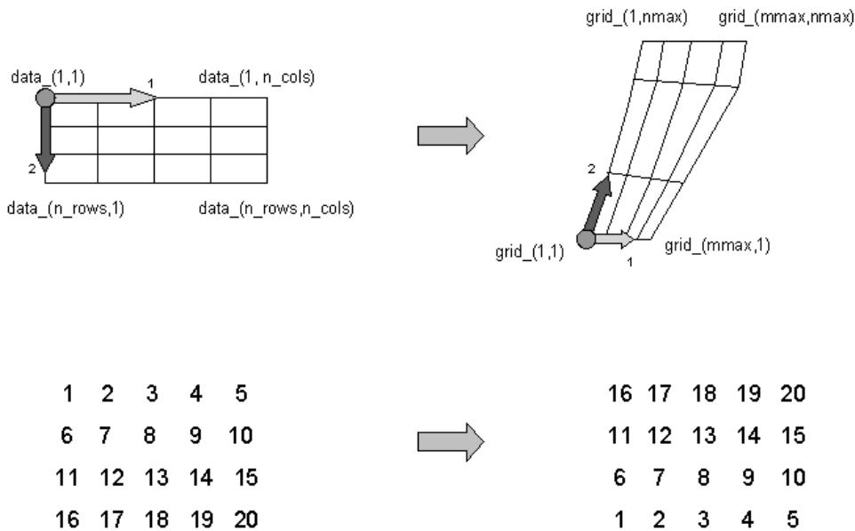

**Figure C.1:** Illustration of the data to grid conversion for meteo input on a separate curvilinear grid

**Example:**

A file for input of  $x$ -velocity (in west-east direction) on a 4 ( $n_{\text{rows}}$ ) by 5 ( $n_{\text{cols}}$ ) curvilinear grid, where the meteorogical data is mirrored vertically with respect to the grid, has the following layout:

```
FileVersion                                = 1.03
filetype                                    = meteo_on_curvilinear_grid
NODATA_value                               = -999.000
grid_file                                  = curviwind.grd
first_data_value                           = grid_llcorner
data_row                                  = grid_row
n_quantity                                = 1
quantity1                                 = x_wind
unit1                                     = m s-1
TIME =                                    0.0 minutes since 1993-06-28 14:50:00 -02:00
                                           1                2                3                4                5
                                           6                7                8                9                10
11                                            11                12                13                14                15
16                                            16                17                18                19                20
TIME =                                    600.0 minutes since 1993-06-28 14:50:00 -02:00
                                           1                2                3                4                5
                                           6                7                8                9                10
11                                            11                12                13                14                15
16                                            16                17                18                19                20
```

This results in an  $x$ -component of velocity given - in [m/s] - on the curvilinear grid specified in file <curviwind.grd>. The data set will be mirrored such that the first value of the data (upper left corner, in the example '1') corresponds to the lower left corner of the grid (point (1,1)) and a row of data corresponds to a row on the grid, see Figure C.1. Data is given at two times: 0 and 600 minutes since June 28th, 1993, 14:50 PM, in UTC-2.

### C.14.3 Spiderweb data

#### Remarks:

- ◇ The spiderweb file format used in D-Flow FM forms a subset of the format described below. The extensive format is accepted by D-Flow FM, but not all keywords are required and/or meaningful.
- ◇ The keyword `air_pressure_reference` is ignored.
- ◇ The keyword `n_quantity` is ignored; the number of quantities is always 3.
- ◇ The keywords `quantity1`, `quantity2` and `quantity3` are ignored, the order of the variables in the file is assumed to be wind speed, wind direction and pressure drop.
- ◇ The keywords `unit1` and `unit2` are ignored.
- ◇ The keyword `unit3` is optional; if omitted or different from 'mbar', Pa is silently assumed

Cyclone winds are governed by a circular motion, combined with a cyclone track. This type of wind is generally very difficult to implement on a curvilinear grid. This feature facilitates the reading of the so-called Spiderweb files and interpolates the wind and pressure data internally to the computational grid. A special feature of the space varying wind and pressure on the Spiderweb grid is that it can be combined with one of the other meteorological input options described in this manual, i.e. to either uniform wind and pressure, or to one of the space varying wind and pressure options, see [Appendix C.14](#).

| File contents | Time-series of a space varying wind and atmospheric pressure defined on a Spiderweb grid. This grid may be specified in Cartesian or spherical coordinates. |
|---------------|-------------------------------------------------------------------------------------------------------------------------------------------------------------|
| File format   | Free formatted or unformatted, keyword based.                                                                                                               |
| Generated     | Some offline program.                                                                                                                                       |

#### Remarks:

- ◇ The keywords are case insensitive.
- ◇ Space varying wind and pressure on a Spiderweb grid is added to other wind input and the wind fields are interpolated and combined in and around the cyclone.

#### *Header description of the Spiderweb wind and pressure file:*

| Keywords            | Value                                                                           | Description                                                               |
|---------------------|---------------------------------------------------------------------------------|---------------------------------------------------------------------------|
| FileVersion         | 1.04                                                                            | version of file format                                                    |
| Filetype            | meteo_on_spiderweb_grid                                                         | meteo input on Spiderweb grid                                             |
| NODATA_value        | <i>free</i>                                                                     | value used for input that is to be neglected                              |
| n_cols              | <i>free</i>                                                                     | number of gridpoints in angular direction                                 |
| n_rows              | <i>free</i>                                                                     | number of gridpoints in radial direction                                  |
| grid_unit           | m or degree                                                                     | unit of the Spiderweb grid                                                |
| spw_utm_zone_target | format 'ZZH', where ZZ is the UTM zone number, and H is the hemisphere (N or S) | UTM zone of the grid on which the meteo field is interpolated             |
| spw_radius          | <i>free</i>                                                                     | radius of the spiderweb given in units given by <code>spw_rad_unit</code> |
| spw_rad_unit        | m                                                                               | unit of the Spiderweb radius                                              |

| Keywords                            | Value                                                                             | Description                                                                                                                                                                                                                                                                               |
|-------------------------------------|-----------------------------------------------------------------------------------|-------------------------------------------------------------------------------------------------------------------------------------------------------------------------------------------------------------------------------------------------------------------------------------------|
| <code>spw_merge_frac</code>         | <code>[0.0,1.0]</code>                                                            | fraction of the Spiderweb radius where merging starts of the back-ground wind with the Spiderweb wind. Default is 0.5                                                                                                                                                                     |
| <code>air_pressure_reference</code> | <code>air_pressure_default_from_computational_engine</code><br><br><i>or free</i> | Both keyword and value are too long to fit on one line.<br>Reference value related to <code>p_drop</code> is the default air pressure of the computational engine<br><i>or</i> the value specified.<br>If missing, <code>p_drop</code> is extracted from the actual atmospheric pressure. |
| <code>n_quantity</code>             | <code>3</code>                                                                    | number of quantities specified in the file                                                                                                                                                                                                                                                |
| <code>quantity1</code>              | <code>wind_speed</code>                                                           | wind speed given in unit <code>unit1</code>                                                                                                                                                                                                                                               |
| <code>quantity2</code>              | <code>wind_from_direction</code>                                                  | direction where the wind is coming from given in unit <code>unit2</code>                                                                                                                                                                                                                  |
| <code>quantity3</code>              | <code>p_drop</code>                                                               | drop in atmospheric pressure given in unit <code>unit3</code>                                                                                                                                                                                                                             |
| <code>unit1</code>                  | <code>m s-1</code>                                                                | unit of <code>quantity1</code> : metres/second                                                                                                                                                                                                                                            |
| <code>unit2</code>                  | <code>degree</code>                                                               | unit of <code>quantity2</code> : degrees                                                                                                                                                                                                                                                  |
| <code>unit3</code>                  | <code>Pa or mbar</code>                                                           | unit of <code>quantity3</code> : Pascal or millibar                                                                                                                                                                                                                                       |

### ***Time definition and data block description***

For a description of the time definition see [section C.14.1](#).

### ***Cyclone track information:***

For each time in the time series of space varying wind and pressure on a Spiderweb grid, the position of the cyclone eye (and thus also the spiderweb grid) must be given, as well as the drop of atmospheric pressure in the cyclone eye.

### ***File version and conversion***

The current description holds for FileVersion 1.04. The table below shows the latest modifications in the file format (and version number).

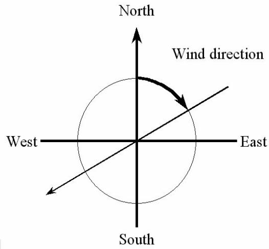

**Figure C.2:** Wind definition according to Nautical convention

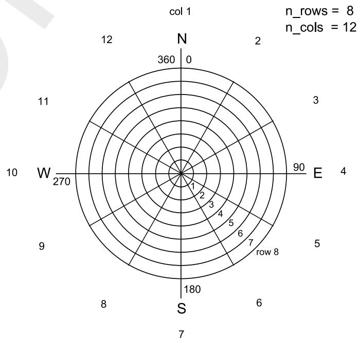

**Figure C.3:** Spiderweb grid definition

| FileVersion | Modifications                                                                                                                                                                                                                                                            |
|-------------|--------------------------------------------------------------------------------------------------------------------------------------------------------------------------------------------------------------------------------------------------------------------------|
| 1.04        | Addition of optional keyword <code>spw_utm_zone_target</code> , which allows to project spiderweb wind fields on flow and wave grids defined using UTM coordinates. Only taken into account when <code>grid_unit</code> is degree.                                       |
| 1.03        | No changes for this meteo input type                                                                                                                                                                                                                                     |
| 1.02        | Changed the use of keyword <code>n_rows</code> and <code>n_cols</code> . The radius of the cyclone is divided in <code>n_rows</code> rings of width: <code>spw_radius/n_rows</code> [m] and the circle is divided in <code>n_cols</code> parts of $2\pi/n_{cols}$ [rad]. |
| 1.01        | Changed keyword <code>MeteoType</code> to <code>FileType</code><br><br>Changed fixed value of input type (Keyword <code>Filetype</code> ) from <code>Spiderweb</code> to <code>meteo_on_spiderweb_grid</code>                                                            |

**Restriction:**

- ◇ The restrictions for space varying wind and pressure on a Spiderweb grid are the same as for space varying wind and pressure on an equidistant grid, described in section C.14.1.

**Remarks:**

- ◇ The remarks for space varying wind and pressure on a separate curvilinear grid are the same as for space varying wind and pressure on an equidistant grid, described in section C.14.1.
- ◇ The Spiderweb grid is circular and the definitions of the number of rows `n_rows` and the number of columns `n_cols` is therefore different then for the other meteo input formats. For the Spiderweb grid, the number of rows determines the grid size in radial direction. The number of columns defines the grid size in angular direction. See Figure C.3.
- ◇ The wind is specified according to the nautical convention, i.e. wind from the true North has direction zero and the wind turns clockwise with an increasing angle. See Figure C.2.

**Example:**A file for input of space varying wind and pressure on a 5x3 Spiderweb grid, has the following layout:

```
FileVersion                                 = 1.04
filetype                                    = meteo_on_spiderweb_grid
NODATA_value                               = -999.000
n_cols                                    = 3
n_rows                                   = 5
grid_unit                                = degree
spw_utm_zone_target                    = 49N
spw_radius                               = 600000.0
spw_rad_unit                            = m
air_pressure_reference                   = air_pressure_default_from_computational_engine
n_quantity                               = 3
quantity1                                = wind_speed
quantity2                                = wind_from_direction
quantity3                                = p_drop
unit1                                    = m s-1
unit2                                    = degree
unit3                                    = Pa
TIME                                     = 0.0 hours since 1997-07-14 03:00:00 -06:00
x_spw_eye                               = 115.1
y_spw_eye                              = 18.9
p_drop_spw_eye = 5300.0
1.38999                                    1.38261                1.38315
1.28251                                    1.34931                1.22571
1.27215                                    1.31214                1.32451
1.38999                                    1.86592                2.87732
1.43899                                    1.24912                2.21519
60.0000                                    180.0000                270.0000
28.7500                                    20.0000                31.2500
```

---

```
42.5000          53.7500          65.0000
49.3400          60.2400          81.5200
51.4100          62.0000          43.1200
5301.280          5294.490          5156.240
5043.460          5112.040          5264.020
5140.020          5202.520          5411.210
5294.730          5285.760          5235.250
5242.530          5156.190          5124.240
TIME             = 1.0 hours since 1997-07-14 03:00:00 -06:00
x_spw_eye        = 114.8
y_spw_eye        = 18.8
p_drop_spw_eye = 5250.0
1.35763          1.35763          1.35763
1.35763          1.87273          2.24784
1.92214          2.47836          2.17266
1.87662          2.72116          2.82375
1.26585          2.24146          2.38722
159.0000          346.5200          290.6400
342.3200          282.1400          20.2400
10.7500          25.5300          36.4500
61.8400          81.6200          45.5100
49.5250          56.7500          75.1300
5314.520          5104.490          5287.240
5124.240          5285.760          5252.420
5152.460          5247.040          5222.020
5242.020          5223.520          5475.210
5244.270          5211.210          4998.110
```

This results in the following set of meteo data. Velocities given in [m/s] and pressure drops in [Pa] on a Spiderweb grid which is given in spherical coordinates (`grid_unit = degree`), but that is projected on a UTM 49N zone flow/wave grid. The cyclone and spiderweb grid have a radius of 600 km. The grid is 5x3, which means the radius is divided in five parts of 120 km and the 360 degrees are divided in 3 parts of 120 degrees each. Wind speeds, wind directions and pressure drops are given at two times: 0 and 1.0 hour since July 14th, 1997, 03:00 AM, in UTC-6. Between these two times the cyclone eye moves from (longitude, latitude) (115.1, 18.9) to (114.8, 18.8) on the globe and the pressure drop in the cyclone eye decreases from 5300.0 [Pa] to 5250.0 [Pa].

#### C.14.4 Meteo on a netCDF file

Scalar meteorological forcing variables can be provided as gridded fields in NetCDF files. The file and metadata details are described in [Section D.2.4.2](#).

#### C.15 Statistical output (Fourier, minimum, maximum and average)

| File contents | All parameters required to execute an online statistical analysis for specified quantities, a specified period and for specified frequencies. This analysis can be a Fourier analysis or another form of statistical analysis e.g. computation of the minimum, maximum or average value. |
|---------------|------------------------------------------------------------------------------------------------------------------------------------------------------------------------------------------------------------------------------------------------------------------------------------------|
| Filetype      | ASCII                                                                                                                                                                                                                                                                                    |
| File format   | Fix formatted for text variables, free formatted for real and integer values.                                                                                                                                                                                                            |
| Filename      | <code>&lt;name.fou&gt;</code>                                                                                                                                                                                                                                                            |
| Generated     | Manually offline                                                                                                                                                                                                                                                                         |

Each line in the file represents a record.

**Record description:**

| Record    | Record description                                                                                                                                                                                                                                                                                                                                                                                                                                                                                                                                                                                                                                                                                                                                                                                                                                                                                                                                                                                                                                                                                                                                                                                                                                                                                                                                                                                                                                                                                                                                                                                                                                                                                                                                                                                                                                                                                                                                                                                                                                                                                                                                                                                                                                                                                                                                                                                                                                                                                                                                                                                                                                                                                                                                                                                                                                                                                                                                                                                                                                                                                                                                                                                                                                                                                                                                 |    |                          |    |                                  |    |                                                          |    |                                                             |    |                             |    |                     |    |                               |     |                                            |    |                         |     |                                                       |    |                         |     |                                                       |    |                    |     |                            |    |                           |      |                                |    |                           |    |                              |
|-----------|----------------------------------------------------------------------------------------------------------------------------------------------------------------------------------------------------------------------------------------------------------------------------------------------------------------------------------------------------------------------------------------------------------------------------------------------------------------------------------------------------------------------------------------------------------------------------------------------------------------------------------------------------------------------------------------------------------------------------------------------------------------------------------------------------------------------------------------------------------------------------------------------------------------------------------------------------------------------------------------------------------------------------------------------------------------------------------------------------------------------------------------------------------------------------------------------------------------------------------------------------------------------------------------------------------------------------------------------------------------------------------------------------------------------------------------------------------------------------------------------------------------------------------------------------------------------------------------------------------------------------------------------------------------------------------------------------------------------------------------------------------------------------------------------------------------------------------------------------------------------------------------------------------------------------------------------------------------------------------------------------------------------------------------------------------------------------------------------------------------------------------------------------------------------------------------------------------------------------------------------------------------------------------------------------------------------------------------------------------------------------------------------------------------------------------------------------------------------------------------------------------------------------------------------------------------------------------------------------------------------------------------------------------------------------------------------------------------------------------------------------------------------------------------------------------------------------------------------------------------------------------------------------------------------------------------------------------------------------------------------------------------------------------------------------------------------------------------------------------------------------------------------------------------------------------------------------------------------------------------------------------------------------------------------------------------------------------------------------|----|--------------------------|----|----------------------------------|----|----------------------------------------------------------|----|-------------------------------------------------------------|----|-----------------------------|----|---------------------|----|-------------------------------|-----|--------------------------------------------|----|-------------------------|-----|-------------------------------------------------------|----|-------------------------|-----|-------------------------------------------------------|----|--------------------|-----|----------------------------|----|---------------------------|------|--------------------------------|----|---------------------------|----|------------------------------|
| each line | <p>1 Id of the quantity on which the analysis is to be performed:</p> <table> <tbody> <tr> <td>bs</td> <td>bed stress (1D/2D field)</td> </tr> <tr> <td>cn</td> <td>n-th constituent in the MDU-file</td> </tr> <tr> <td>cs</td> <td>salinity, will be skipped if temperature is not modelled</td> </tr> <tr> <td>ct</td> <td>temperature, will be skipped if temperature is not modelled</td> </tr> <tr> <td>eh</td> <td>energy height (1D/2D field)</td> </tr> <tr> <td>fb</td> <td>freeboard (1D only)</td> </tr> <tr> <td>q1</td> <td>discharge through a flow link</td> </tr> <tr> <td>sul</td> <td>water levels at a flow links (1D/2D field)</td> </tr> <tr> <td>ux</td> <td>velocity in x-direction</td> </tr> <tr> <td>uxa</td> <td>velocity in x-direction, column average (1D/2D field)</td> </tr> <tr> <td>uy</td> <td>velocity in y-direction</td> </tr> <tr> <td>uya</td> <td>velocity in y-direction, column average (1D/2D field)</td> </tr> <tr> <td>uc</td> <td>velocity magnitude</td> </tr> <tr> <td>vog</td> <td>volume on ground (1D only)</td> </tr> <tr> <td>wd</td> <td>water depth (1D/2D field)</td> </tr> <tr> <td>wdog</td> <td>waterdepth on ground (1D only)</td> </tr> <tr> <td>wl</td> <td>water level (1D/2D field)</td> </tr> <tr> <td>ws</td> <td>wind magnitude (1D/2D field)</td> </tr> </tbody> </table> <p>2 Analysis start time, <code>tstart</code>, in Tunit [seconds, minutes, hours] after the simulation Reference Date. Use <code>-1</code> to indicate the simulation start time.</p> <p>3 Analysis stop time, <code>tstop</code>, in Tunit [seconds, minutes, hours] after the simulation Reference Date. Use <code>-1</code> to indicate the simulation stop time.</p> <p>4 Integer number of cycles (i.e. mode) within the analysis time frame. Alternatively, the length of the running mean filter.</p> <p>5 Nodal amplification factor.</p> <p>6 Phase shift [degrees].</p> <p>7 Layer number for the analysis of 3D quantities. This number should if and only if the selected quantity is not marked as a 1D or 1D/2D field. When specified, it should be a valid layer number. However, this value is currently not used. In 3D models, the analysis is done on the whole 3D field, ignoring the layer number.</p> <p>8 Flag specifying the type of the analysis:</p> <ul style="list-style-type: none;"> <li>◇ default (no keyword): perform Fourier analysis</li> <li>◇ <code>min/max/avg</code>, requests the computation of the minimal, maximal or average of the selected quantity over the selected period. The number of cycles now is the length of an optional running mean filter. An additional quantity id can be supplied to report the requested quantity when the <code>min/max</code> of that additional quantity occurs (see last record of <a href="#">Example 2</a>, extensions for <code>min/max</code>).</li> <li>◇ <code>last</code>, requests the last value, e.g. when anticipating convergence to a steady-state solution. The number of cycles now is the number of time steps before the end of the analysis period to average.</li> <li>◇ <code>time below / time above</code> followed by threshold value, requests the computation of the total time passed during which the selected quantity strictly below or above the specified threshold.</li> </ul> | bs | bed stress (1D/2D field) | cn | n-th constituent in the MDU-file | cs | salinity, will be skipped if temperature is not modelled | ct | temperature, will be skipped if temperature is not modelled | eh | energy height (1D/2D field) | fb | freeboard (1D only) | q1 | discharge through a flow link | sul | water levels at a flow links (1D/2D field) | ux | velocity in x-direction | uxa | velocity in x-direction, column average (1D/2D field) | uy | velocity in y-direction | uya | velocity in y-direction, column average (1D/2D field) | uc | velocity magnitude | vog | volume on ground (1D only) | wd | water depth (1D/2D field) | wdog | waterdepth on ground (1D only) | wl | water level (1D/2D field) | ws | wind magnitude (1D/2D field) |
| bs        | bed stress (1D/2D field)                                                                                                                                                                                                                                                                                                                                                                                                                                                                                                                                                                                                                                                                                                                                                                                                                                                                                                                                                                                                                                                                                                                                                                                                                                                                                                                                                                                                                                                                                                                                                                                                                                                                                                                                                                                                                                                                                                                                                                                                                                                                                                                                                                                                                                                                                                                                                                                                                                                                                                                                                                                                                                                                                                                                                                                                                                                                                                                                                                                                                                                                                                                                                                                                                                                                                                                           |    |                          |    |                                  |    |                                                          |    |                                                             |    |                             |    |                     |    |                               |     |                                            |    |                         |     |                                                       |    |                         |     |                                                       |    |                    |     |                            |    |                           |      |                                |    |                           |    |                              |
| cn        | n-th constituent in the MDU-file                                                                                                                                                                                                                                                                                                                                                                                                                                                                                                                                                                                                                                                                                                                                                                                                                                                                                                                                                                                                                                                                                                                                                                                                                                                                                                                                                                                                                                                                                                                                                                                                                                                                                                                                                                                                                                                                                                                                                                                                                                                                                                                                                                                                                                                                                                                                                                                                                                                                                                                                                                                                                                                                                                                                                                                                                                                                                                                                                                                                                                                                                                                                                                                                                                                                                                                   |    |                          |    |                                  |    |                                                          |    |                                                             |    |                             |    |                     |    |                               |     |                                            |    |                         |     |                                                       |    |                         |     |                                                       |    |                    |     |                            |    |                           |      |                                |    |                           |    |                              |
| cs        | salinity, will be skipped if temperature is not modelled                                                                                                                                                                                                                                                                                                                                                                                                                                                                                                                                                                                                                                                                                                                                                                                                                                                                                                                                                                                                                                                                                                                                                                                                                                                                                                                                                                                                                                                                                                                                                                                                                                                                                                                                                                                                                                                                                                                                                                                                                                                                                                                                                                                                                                                                                                                                                                                                                                                                                                                                                                                                                                                                                                                                                                                                                                                                                                                                                                                                                                                                                                                                                                                                                                                                                           |    |                          |    |                                  |    |                                                          |    |                                                             |    |                             |    |                     |    |                               |     |                                            |    |                         |     |                                                       |    |                         |     |                                                       |    |                    |     |                            |    |                           |      |                                |    |                           |    |                              |
| ct        | temperature, will be skipped if temperature is not modelled                                                                                                                                                                                                                                                                                                                                                                                                                                                                                                                                                                                                                                                                                                                                                                                                                                                                                                                                                                                                                                                                                                                                                                                                                                                                                                                                                                                                                                                                                                                                                                                                                                                                                                                                                                                                                                                                                                                                                                                                                                                                                                                                                                                                                                                                                                                                                                                                                                                                                                                                                                                                                                                                                                                                                                                                                                                                                                                                                                                                                                                                                                                                                                                                                                                                                        |    |                          |    |                                  |    |                                                          |    |                                                             |    |                             |    |                     |    |                               |     |                                            |    |                         |     |                                                       |    |                         |     |                                                       |    |                    |     |                            |    |                           |      |                                |    |                           |    |                              |
| eh        | energy height (1D/2D field)                                                                                                                                                                                                                                                                                                                                                                                                                                                                                                                                                                                                                                                                                                                                                                                                                                                                                                                                                                                                                                                                                                                                                                                                                                                                                                                                                                                                                                                                                                                                                                                                                                                                                                                                                                                                                                                                                                                                                                                                                                                                                                                                                                                                                                                                                                                                                                                                                                                                                                                                                                                                                                                                                                                                                                                                                                                                                                                                                                                                                                                                                                                                                                                                                                                                                                                        |    |                          |    |                                  |    |                                                          |    |                                                             |    |                             |    |                     |    |                               |     |                                            |    |                         |     |                                                       |    |                         |     |                                                       |    |                    |     |                            |    |                           |      |                                |    |                           |    |                              |
| fb        | freeboard (1D only)                                                                                                                                                                                                                                                                                                                                                                                                                                                                                                                                                                                                                                                                                                                                                                                                                                                                                                                                                                                                                                                                                                                                                                                                                                                                                                                                                                                                                                                                                                                                                                                                                                                                                                                                                                                                                                                                                                                                                                                                                                                                                                                                                                                                                                                                                                                                                                                                                                                                                                                                                                                                                                                                                                                                                                                                                                                                                                                                                                                                                                                                                                                                                                                                                                                                                                                                |    |                          |    |                                  |    |                                                          |    |                                                             |    |                             |    |                     |    |                               |     |                                            |    |                         |     |                                                       |    |                         |     |                                                       |    |                    |     |                            |    |                           |      |                                |    |                           |    |                              |
| q1        | discharge through a flow link                                                                                                                                                                                                                                                                                                                                                                                                                                                                                                                                                                                                                                                                                                                                                                                                                                                                                                                                                                                                                                                                                                                                                                                                                                                                                                                                                                                                                                                                                                                                                                                                                                                                                                                                                                                                                                                                                                                                                                                                                                                                                                                                                                                                                                                                                                                                                                                                                                                                                                                                                                                                                                                                                                                                                                                                                                                                                                                                                                                                                                                                                                                                                                                                                                                                                                                      |    |                          |    |                                  |    |                                                          |    |                                                             |    |                             |    |                     |    |                               |     |                                            |    |                         |     |                                                       |    |                         |     |                                                       |    |                    |     |                            |    |                           |      |                                |    |                           |    |                              |
| sul       | water levels at a flow links (1D/2D field)                                                                                                                                                                                                                                                                                                                                                                                                                                                                                                                                                                                                                                                                                                                                                                                                                                                                                                                                                                                                                                                                                                                                                                                                                                                                                                                                                                                                                                                                                                                                                                                                                                                                                                                                                                                                                                                                                                                                                                                                                                                                                                                                                                                                                                                                                                                                                                                                                                                                                                                                                                                                                                                                                                                                                                                                                                                                                                                                                                                                                                                                                                                                                                                                                                                                                                         |    |                          |    |                                  |    |                                                          |    |                                                             |    |                             |    |                     |    |                               |     |                                            |    |                         |     |                                                       |    |                         |     |                                                       |    |                    |     |                            |    |                           |      |                                |    |                           |    |                              |
| ux        | velocity in x-direction                                                                                                                                                                                                                                                                                                                                                                                                                                                                                                                                                                                                                                                                                                                                                                                                                                                                                                                                                                                                                                                                                                                                                                                                                                                                                                                                                                                                                                                                                                                                                                                                                                                                                                                                                                                                                                                                                                                                                                                                                                                                                                                                                                                                                                                                                                                                                                                                                                                                                                                                                                                                                                                                                                                                                                                                                                                                                                                                                                                                                                                                                                                                                                                                                                                                                                                            |    |                          |    |                                  |    |                                                          |    |                                                             |    |                             |    |                     |    |                               |     |                                            |    |                         |     |                                                       |    |                         |     |                                                       |    |                    |     |                            |    |                           |      |                                |    |                           |    |                              |
| uxa       | velocity in x-direction, column average (1D/2D field)                                                                                                                                                                                                                                                                                                                                                                                                                                                                                                                                                                                                                                                                                                                                                                                                                                                                                                                                                                                                                                                                                                                                                                                                                                                                                                                                                                                                                                                                                                                                                                                                                                                                                                                                                                                                                                                                                                                                                                                                                                                                                                                                                                                                                                                                                                                                                                                                                                                                                                                                                                                                                                                                                                                                                                                                                                                                                                                                                                                                                                                                                                                                                                                                                                                                                              |    |                          |    |                                  |    |                                                          |    |                                                             |    |                             |    |                     |    |                               |     |                                            |    |                         |     |                                                       |    |                         |     |                                                       |    |                    |     |                            |    |                           |      |                                |    |                           |    |                              |
| uy        | velocity in y-direction                                                                                                                                                                                                                                                                                                                                                                                                                                                                                                                                                                                                                                                                                                                                                                                                                                                                                                                                                                                                                                                                                                                                                                                                                                                                                                                                                                                                                                                                                                                                                                                                                                                                                                                                                                                                                                                                                                                                                                                                                                                                                                                                                                                                                                                                                                                                                                                                                                                                                                                                                                                                                                                                                                                                                                                                                                                                                                                                                                                                                                                                                                                                                                                                                                                                                                                            |    |                          |    |                                  |    |                                                          |    |                                                             |    |                             |    |                     |    |                               |     |                                            |    |                         |     |                                                       |    |                         |     |                                                       |    |                    |     |                            |    |                           |      |                                |    |                           |    |                              |
| uya       | velocity in y-direction, column average (1D/2D field)                                                                                                                                                                                                                                                                                                                                                                                                                                                                                                                                                                                                                                                                                                                                                                                                                                                                                                                                                                                                                                                                                                                                                                                                                                                                                                                                                                                                                                                                                                                                                                                                                                                                                                                                                                                                                                                                                                                                                                                                                                                                                                                                                                                                                                                                                                                                                                                                                                                                                                                                                                                                                                                                                                                                                                                                                                                                                                                                                                                                                                                                                                                                                                                                                                                                                              |    |                          |    |                                  |    |                                                          |    |                                                             |    |                             |    |                     |    |                               |     |                                            |    |                         |     |                                                       |    |                         |     |                                                       |    |                    |     |                            |    |                           |      |                                |    |                           |    |                              |
| uc        | velocity magnitude                                                                                                                                                                                                                                                                                                                                                                                                                                                                                                                                                                                                                                                                                                                                                                                                                                                                                                                                                                                                                                                                                                                                                                                                                                                                                                                                                                                                                                                                                                                                                                                                                                                                                                                                                                                                                                                                                                                                                                                                                                                                                                                                                                                                                                                                                                                                                                                                                                                                                                                                                                                                                                                                                                                                                                                                                                                                                                                                                                                                                                                                                                                                                                                                                                                                                                                                 |    |                          |    |                                  |    |                                                          |    |                                                             |    |                             |    |                     |    |                               |     |                                            |    |                         |     |                                                       |    |                         |     |                                                       |    |                    |     |                            |    |                           |      |                                |    |                           |    |                              |
| vog       | volume on ground (1D only)                                                                                                                                                                                                                                                                                                                                                                                                                                                                                                                                                                                                                                                                                                                                                                                                                                                                                                                                                                                                                                                                                                                                                                                                                                                                                                                                                                                                                                                                                                                                                                                                                                                                                                                                                                                                                                                                                                                                                                                                                                                                                                                                                                                                                                                                                                                                                                                                                                                                                                                                                                                                                                                                                                                                                                                                                                                                                                                                                                                                                                                                                                                                                                                                                                                                                                                         |    |                          |    |                                  |    |                                                          |    |                                                             |    |                             |    |                     |    |                               |     |                                            |    |                         |     |                                                       |    |                         |     |                                                       |    |                    |     |                            |    |                           |      |                                |    |                           |    |                              |
| wd        | water depth (1D/2D field)                                                                                                                                                                                                                                                                                                                                                                                                                                                                                                                                                                                                                                                                                                                                                                                                                                                                                                                                                                                                                                                                                                                                                                                                                                                                                                                                                                                                                                                                                                                                                                                                                                                                                                                                                                                                                                                                                                                                                                                                                                                                                                                                                                                                                                                                                                                                                                                                                                                                                                                                                                                                                                                                                                                                                                                                                                                                                                                                                                                                                                                                                                                                                                                                                                                                                                                          |    |                          |    |                                  |    |                                                          |    |                                                             |    |                             |    |                     |    |                               |     |                                            |    |                         |     |                                                       |    |                         |     |                                                       |    |                    |     |                            |    |                           |      |                                |    |                           |    |                              |
| wdog      | waterdepth on ground (1D only)                                                                                                                                                                                                                                                                                                                                                                                                                                                                                                                                                                                                                                                                                                                                                                                                                                                                                                                                                                                                                                                                                                                                                                                                                                                                                                                                                                                                                                                                                                                                                                                                                                                                                                                                                                                                                                                                                                                                                                                                                                                                                                                                                                                                                                                                                                                                                                                                                                                                                                                                                                                                                                                                                                                                                                                                                                                                                                                                                                                                                                                                                                                                                                                                                                                                                                                     |    |                          |    |                                  |    |                                                          |    |                                                             |    |                             |    |                     |    |                               |     |                                            |    |                         |     |                                                       |    |                         |     |                                                       |    |                    |     |                            |    |                           |      |                                |    |                           |    |                              |
| wl        | water level (1D/2D field)                                                                                                                                                                                                                                                                                                                                                                                                                                                                                                                                                                                                                                                                                                                                                                                                                                                                                                                                                                                                                                                                                                                                                                                                                                                                                                                                                                                                                                                                                                                                                                                                                                                                                                                                                                                                                                                                                                                                                                                                                                                                                                                                                                                                                                                                                                                                                                                                                                                                                                                                                                                                                                                                                                                                                                                                                                                                                                                                                                                                                                                                                                                                                                                                                                                                                                                          |    |                          |    |                                  |    |                                                          |    |                                                             |    |                             |    |                     |    |                               |     |                                            |    |                         |     |                                                       |    |                         |     |                                                       |    |                    |     |                            |    |                           |      |                                |    |                           |    |                              |
| ws        | wind magnitude (1D/2D field)                                                                                                                                                                                                                                                                                                                                                                                                                                                                                                                                                                                                                                                                                                                                                                                                                                                                                                                                                                                                                                                                                                                                                                                                                                                                                                                                                                                                                                                                                                                                                                                                                                                                                                                                                                                                                                                                                                                                                                                                                                                                                                                                                                                                                                                                                                                                                                                                                                                                                                                                                                                                                                                                                                                                                                                                                                                                                                                                                                                                                                                                                                                                                                                                                                                                                                                       |    |                          |    |                                  |    |                                                          |    |                                                             |    |                             |    |                     |    |                               |     |                                            |    |                         |     |                                                       |    |                         |     |                                                       |    |                    |     |                            |    |                           |      |                                |    |                           |    |                              |

**Remarks:**

- ◇ The analysis is performed for all grid points individually.
- ◇ If the number of cycles is set equal to 0, the *mean* value of the quantity over the interval specified by the start and stop time is determined.
- ◇ The computed Fourier amplitudes differ slightly from the amplitude of the corresponding tidal component. When comparisons with co-tidal maps have to be made, this factor can be determined using the subsystem ASCON of Delft3D-TIDE, the tidal analysis package of Deltares.

- ◇ The computed Fourier phases are by default associated with the reference date/time of the FLOW simulation. For comparisons with co-tidal maps the user may specify a non-zero phase shift.
- ◇ The layer number should not be specified for 1D or 1D/2D quantities such as water levels. In 3D models, the analysis is done on the whole 3D field, ignoring the layer number.
- ◇ In case of `max` and `min`, this keyword maybe followed by the keyword `time` to indicate that also the time at which the maximal or minimal value occurs, should be written to file.
- ◇ In case of `max` computation for water level, water depth or energy height, an additional keyword `inidryonly` can be specified to perform the analysis only for points that are initially dry.
- ◇ Depending on the flag `FouUpdateStep` the analysis is done every user time step (`FouUpdateStep = 0`, default), or every computation time step (`FouUpdateStep = 1`), or with the same time step as the history output (`FouUpdateStep = 2`). The keyword `FouUpdateStep` is defined in the chapter [output] of the mdu-file.

#### Restrictions:

- ◇ If `FouUpdateStep = 0` or `2`, the start and stop times of the analysis frame specified must be a multiple of the user time step or the history output time step.
- ◇ The start and stop times of the analysis frame specified must be a valid time, i.e. must fit in the simulation time frame of the FLOW computation.
- ◇ Items in a record must be separated by one or more blanks.
- ◇ The quantity name (first item on a line) must start on position one.
- ◇ The starting time of the simulation is *excluded* from the analysis.

### Running mean

The minimum and maximum values may be filtered with a running mean filter, to minimize the effect of spikes. Column 4 is used for this and is the length of the filter in fourier output time steps. Therefore, this option can only be used if `FouUpdateStep = 0` or `2`.

The running mean filter is defined by:

Suppose we have a time serie  $x[1], x[2], \dots, x[N]$ .

Then the running mean is:

 $\bar{x}[i] = (x[i+1 - L] + x[i+2 - L] + \dots + x[i]) / L$ , with  $L$  the length of the filter and  $i \geq L \wedge L > 0$ .

The minimum of the running mean is defined as:  $\min \bar{x}[i], i \in [\text{tstart, tstop}]$ , the same holds for other functions.

The running mean filter is applied for all points in the model. Note that we need a buffer of length  $L$  times the number of grid points to calculate this. This buffer is needed for each quantity in the fou-file using the running mean, except if you ask both the `min` and `max` for the same field with the same start and stop time. Then the same buffer is used.

It is possible to get the velocity at the moment that we have the highest water level, or the time of the maximum water level (see the last two records of Example 2, extensions for `min/max`). Or just the latest time(s), in case you are running to a steady state solution (check out the `last` option).

### Example 1

A statistical analysis is requested for:

- ◇ Water level: mean value and the first two harmonics.
- ◇ Velocity in  $x$ -direction: first harmonic, in the top layer.
- ◇ Velocity in  $y$ -direction: first harmonic, in the top layer.
- ◇ Velocity magnitude: first harmonic, in the top layer.
- ◇ Temperature: first harmonic, in the third layer.
- ◇ Salinity: mean value of the third layer.
- ◇ Four constituents: mean value for a slightly shifted time period in the top layer for 3 constituents; and the maximum for the fourth constituent.

| wl | 720. | 1440. | 2 | 1.000 | 0.000 |       |
|----|------|-------|---|-------|-------|-------|
| wl | 720. | 1440. | 1 | 1.000 | 0.000 |       |
| wl | 720  | 1440. | 0 | 1.000 | 0.000 |       |
| ux | 720. | 1440. | 1 | 1.000 | 0.000 | 1     |
| uy | 720. | 1440. | 1 | 1.000 | 0.000 | 1     |
| uc | 720. | 1440. | 1 | 1.000 | 0.000 | 1     |
| ct | 720. | 1440. | 1 | 1.000 | 0.000 | 3     |
| cs | 720. | 1440. | 0 | 1.000 | 0.000 | 3     |
| c1 | 710. | 1430. | 0 | 1.000 | 0.000 | 1     |
| c2 | 710. | 1430. | 0 | 1.000 | 0.000 | 1     |
| c3 | 710. | 1430. | 0 | 1.000 | 0.000 | 1     |
| c4 | 710. | 1430. | 0 | 1.000 | 0.000 | 1 max |

**Remark:**

- ◇ In this example the start and stop times are in minutes because the Tunit of this model (as defined in the MDU file) is in minutes.

**Example 2, extensions for min/max**A statistical analysis is requested for:

- ◇ Water level: maximum with a filter with length 25, starting  $t = 720$ .
- ◇ Water level: minimum with a filter with length 13, stopping at  $t = 1440$ .
- ◇ Water level: average for the last 5 steps of the simulation.
- ◇ Water level: maximum with a filter with length 25, with extra output of the time at which this maximum occurs.
- ◇ Velocity magnitude as the water level reaches this maximum, starting at  $t = 720$  and stopping at  $t = 1440$ .

| wl | 720. | -1    | 25 | 1.000 | 0.000 | max      |
|----|------|-------|----|-------|-------|----------|
| wl | -1   | 1440. | 13 | 1.000 | 0.000 | min      |
| wl | -1   | -1    | 5  | 1.000 | 0.000 | last     |
| wl | -1   | -1    | 25 | 1.000 | 0.000 | max time |
| uc | 720. | 1440. | 1  | 1.000 | 0.000 | 1 max wl |

**Remarks:**

- ◇ In this example the start and stop times are in minutes because the Tunit of this model is in minutes. A start time of  $-1$  means start of the simulation; A stop time of  $-1$  means the end of the simulation.
- ◇ In this example the columns 5 and 6 are completely ignored.
- ◇ Quantities that give combined results, must have the same dimension. Therefore we introduced sul (water level at flow links) to compute q1 (discharge through flow link) at the time of the maximum water level. Note that this combination does not work for 3D applications.

**C.16 Cache file**A cache file may be used to speed up the initialization of a model significantly. It is automatically filled with the geometrical discretization of some spatial input of a model schematization. The name of this file is always equal to `<mdu_name.cache>` and located in the same directory as the mdu-file. It is a binary file.

The currently supported model features for caching are:

- ◇ Fixed weirs (see [Section 12.1](#));
- ◇ Observation points (see [Section 7.4.2.2](#)).
- ◇ Observation cross-sections (see [section 7.4.2.3](#)).
- ◇ Dry points and dry areas (see [Section 7.4.2.7](#))
- ◇ Thin dams (see [Section 7.4.2.4](#))

ments. However, in practice we observe that in general the initialization of these features isn't time consuming. Therefore, caching hasn't been implemented for these features. On the other hand, in particular for fixed weirs the initialization can be time consuming.

The behavior of caching is as follows:

1. 1 Upon initialization of the model, when a cache file is present, it is checked on the following requirements:
   - ◇ The file version of the cache file should match the one supported by the current D-Flow FM version, see [Section C.16.1](#)
   - ◇ The MD5 hash stored in the cache file should match the one of the current NetFile.
   - ◇ The cached count of observation points and their  $x$ - and  $y$ -coordinates should match the current set of observation points.
   - ◇ The cached count of fixed weirs and their  $x$ - and  $y$ -polyline coordinates should match the current set of fixed weirs.
2. 2 If any of these checks fail, the cache file is entirely ignored. In this case (and also when no cache file is present at all) the model input is completely initialized onto the model grid. The result is then saved in the same (or new) cache file, for a future model run.
3. 3 If all checks succeeded, the feature discretization is skipped, and instead directly loaded from the cache file.

Caching can be enabled or disabled via the MDU setting `UseCaching=1` or `0`, respectively. The default or MDU setting for caching can be disabled from the commandline using the option `--no-geom-cache`.

The cache file is platform-independent and as such can be transferred to other hosts, along with the entire set of model input files.

The cache file should not be edited in any way.

The default value is `UseCaching=1`, which means that caching is applied automatically. Although there is no reason for this, it is possible to switch off caching via keyword `UseCaching=0`.

### C.16.1 File version and description

The description here holds for the current FileVersion 1.01. The table below shows the latest modifications in the features being cached and version number.

| FileVersion | Description                                                                                                  |
|-------------|--------------------------------------------------------------------------------------------------------------|
| 1.00        | Features being cached: fixed weirs, observation points, observation cross-sections, dry points and dry areas |
| 1.01        | Added to cache: thin dams                                                                                    |

### C.16.2 Introduction

Spatially varying input is input data that varies in space such as initial conditions (water levels, etc.) or spatially varying model parameters (friction coefficients, etc.). D-Flow FM uses input data in *model-independent coordinates*, that is, the input files should contain their own spatial coordinates, and do not correspond with the D-Flow FM grid cell numbering. As a result, the model grid can always be changed, without the need to change all other spatial input. The spatial input will be interpolated onto the active model grid.

Initial conditions and spatial parameters used to be specified in a separate `IniFieldFile`, which is now deprecated. This input should now be placed under `[Spatial]` blocks. The generic file format and all available keywords are described in Section C.6.3.4. The following sections below contain more specific information regarding initial condition and parameter quantities, and which supported data file types are applicable.

#### Remark:

- ◇ Initial conditions can also be set using a restart-file, which assigns the exact values in the file to the current model grid. No interpolation is performed, and the restart file should correspond exactly with the current model. This is completely unrelated to the remainder of this chapter; please consult Section 8.8 instead.

This entire Appendix C.7 applies to both the deprecated and current functionality, except for the next subsection C.16.3, which only documents the deprecated `IniFieldFile` format and is kept for migration purposes only.

### C.16.3 IniFieldFile format for initial conditions and parameter fields (deprecated)

#### Warning:

- ◇ Deprecated: the initial and parameter fields file (`IniFieldFile`) is now deprecated. This will become obsolete in an upcoming release and the documentation below is only kept for migration purposes. Formerly, this data was specified in the old-style `<*.ext>-file`, which is now also deprecated.  
  See Section C.6.1 for a full description of the migration.

Initial and parameter fields are spatial fields that can describe initial conditions and spatially varying model parameters. The name of this file is specified using the keyword `IniFieldFile` in the MDU-file (see Appendix A). This file supersedes the old-style external forcings file for these quantities.

The fields are specified in the ini-file format. The order of blocks is relevant, since multiple data sets maybe combined for the same quantity (see operand in Table C.39). The order of keywords within a block is *not* relevant. Keywords and constants are case insensitive, but camel case is used as a naming convention. String values (e.g., filenames) are case sensitive.

This file may contain one or more **Initial** blocks or **Parameter** blocks, each followed by a set of keywords that specify the spatial data for that field. See the following table for details.

**Table C.39: Initial and parameter fields.**

| Keyword                                            | Type   | Default               | Description                     |
|----------------------------------------------------|--------|-----------------------|---------------------------------|
| <code>[General]</code>                             |        |                       |                                 |
| <code>fileVersion</code>                           | String | 2.02                  | File version. Do not edit this. |
| <code>fileType</code>                              | String | <code>iniField</code> | File type. Do not edit this.    |
| <code>[Initial]</code> or <code>[Parameter]</code> |        |                       | <i>Repeat as needed</i>         |
| <i>(continued on next page)</i>                    |        |                       |                                 |

| Keyword                               | Type   | Default  | Description                                                                                                                                                                                                                                                                                                                                                                                                                                                                                                                                                                                                                                                                                                                                                                                                                                                                                                                                                                                                                                                                                                          |
|---------------------------------------|--------|----------|----------------------------------------------------------------------------------------------------------------------------------------------------------------------------------------------------------------------------------------------------------------------------------------------------------------------------------------------------------------------------------------------------------------------------------------------------------------------------------------------------------------------------------------------------------------------------------------------------------------------------------------------------------------------------------------------------------------------------------------------------------------------------------------------------------------------------------------------------------------------------------------------------------------------------------------------------------------------------------------------------------------------------------------------------------------------------------------------------------------------|
| <i>(continued from previous page)</i> |        |          |                                                                                                                                                                                                                                                                                                                                                                                                                                                                                                                                                                                                                                                                                                                                                                                                                                                                                                                                                                                                                                                                                                                      |
| quantity                              | String |          | Name of the quantity, see Table C.40 hereafter.                                                                                                                                                                                                                                                                                                                                                                                                                                                                                                                                                                                                                                                                                                                                                                                                                                                                                                                                                                                                                                                                      |
| dataFile                              | String |          | Name of file containing the field data values.                                                                                                                                                                                                                                                                                                                                                                                                                                                                                                                                                                                                                                                                                                                                                                                                                                                                                                                                                                                                                                                                       |
| dataFileType                          | String |          | Type of dataFile. Supported types: <ul style="list-style-type: none;"> <li>◇ ArcInfo</li> <li>◇ GeoTIFF (section C.16.6.3)</li> <li>◇ sample (Appendix C.3)</li> <li>◇ netcdf (only valid for quantity = frictioncoefficient)</li> <li>◇ polygon (Appendix C.2)</li> </ul> (optional) Name of the variable in the data file, typically used for NetCDF input.                                                                                                                                                                                                                                                                                                                                                                                                                                                                                                                                                                                                                                                                                                                                                        |
| dataVariableName                      | String |          | Type of (spatial) interpolation. Supported methods: <ul style="list-style-type: none;"> <li>◇ constant, only with dataFileType=polygon.</li> <li>◇ triangulation, Delaunay triangulation+linear interpolation, only supported for sample files.</li> <li>◇ bilinear, bilinear interpolation, only supported for ArcInfo files.</li> <li>◇ averaging, grid cell averaging.</li> <li>◇ linearSpaceTime, linear interpolation in space and time (for time-dependent parameters)</li> </ul> (optional) How this data is combined with previous data for the same quantity (if any). Supported operands: <ul style="list-style-type: none;"> <li>◇ O / override, override any previous data.</li> <li>◇ A / overrideIfMissing, sets only where data is still missing.</li> <li>◇ + / add, adds the provided values to the existing values.</li> <li>◇ * / multiply, multiplies the existing values by the provided values.</li> <li>◇ X / maximum, takes the maximum of the existing values and the provided values.</li> <li>◇ N / minimum, takes the minimum of the existing values and the provided values.</li> </ul> |
| operand                               | String | override | (optional) Type of averaging, if interpolationMethod=averaging. Supported types: <ul style="list-style-type: none;"> <li>◇ mean, arithmetic mean</li> <li>◇ nearestNb, nearest neighbour value</li> <li>◇ max, highest</li> <li>◇ min, lowest</li> <li>◇ invDist, inverse-distance-weighted average</li> <li>◇ minAbs, smallest absolute value</li> <li>◇ median, median value</li> </ul>                                                                                                                                                                                                                                                                                                                                                                                                                                                                                                                                                                                                                                                                                                                            |
| averagingType                         | String | mean     | (continued on next page)                                                                                                                                                                                                                                                                                                                                                                                                                                                                                                                                                                                                                                                                                                                                                                                                                                                                                                                                                                                                                                                                                             |

| Keyword                               | Type    | Default | Description                                                                                                                                                                                                                                                                                                                  |
|---------------------------------------|---------|---------|------------------------------------------------------------------------------------------------------------------------------------------------------------------------------------------------------------------------------------------------------------------------------------------------------------------------------|
| <i>(continued from previous page)</i> |         |         |                                                                                                                                                                                                                                                                                                                              |
| averagingRelSize                      | Double  | 1.01    | (optional) Relative search cell size for averaging.                                                                                                                                                                                                                                                                          |
| averagingNumMin                       | Integer | 1       | (optional) Minimum number of points in averaging. Must be $\geq 1$ .                                                                                                                                                                                                                                                         |
| averagingPercentile                   | Double  | 0.0     | (optional) Percentile value for which data values to include in averaging. 0.0 means off.                                                                                                                                                                                                                                    |
| extrapolationMethod                   | Logical | no      | Option for (spatial) extrapolation: no or yes.                                                                                                                                                                                                                                                                               |
| extrapolationSearch ← Radius          | Double  | 1E6     | (optional) Maximum search radius in nearest-neighbour extrapolation [m].                                                                                                                                                                                                                                                     |
| locationType                          | String  | all     | (optional) Target location of interpolation, if quantity is 1d2d distinction possible (see Table C.40). Supported locations:<br><ul style="list-style-type: none;"> <li>◇ 1d, interpolate only to 1d nodes/links</li> <li>◇ 2d, interpolate only to 2d nodes/links</li> <li>◇ all, interpolate to all nodes/links</li> </ul> |
| value                                 | Double  |         | (optionally required) Only for dataFileType=polygon. The constant value to be set inside for all model points inside the polygon.                                                                                                                                                                                            |
| frictionType                          | String  |         | (optional) Only for quantity=frictionCoefficient. See remark below.                                                                                                                                                                                                                                                          |
| tracerFallVelocity                    | Double  | 0       | (Optional) Only for initialtracer ← <tracername>. Fall velocity for this tracer [m/s]. The default value 0 means that settling is disabled for this tracer.                                                                                                                                                                  |
| tracerDecayTime                       | Double  | 0       | (Optional) Only for initialtracer ← <tracername>. Decay time $\tau$ for this tracer [s]. Specifies the timescale over which the tracer decays to approximately 36.8% (1/e) of its initial value. The default value 0 means that tracer decay is disabled for this tracer.                                                    |

**Example:**

```
# comments
[Initial]
quantity                                = initialWaterLevel
dataFile                                 = iniwaterlevels.asc
dataFileType                            = ArcInfo
interpolationMethod                    = triangulation
locationType                           = 2d[Initial]
quantity                                = bedLevel
dataFile                                = inibedlevel.ini
dataFileType                           = ldField[Parameter]
quantity                                = frictionCoefficient
dataFile                                = manning.xyz
dataFileType                            = sample
interpolationMethod                   = triangulation[Parameter]
quantity                                = frictionCoefficient
dataFile                                = calibration1.pol
```

```
dataFileType        = polygon
interpolationMethod = constant
value             = 0.03
operand          = multiply
```

**Remarks:**

- ◇ Friction coefficients may be provided of a different type than the model global type (i.e., MDU setting UnifFrictCoef). To do so, add the extra keyword `frictionType` to the `[Parameter]` block. Valid values are listed below:
  - ◇ Chezy: Chézy  $C$  [ $\text{m}^{1/2}/\text{s}$ ]
  - ◇ Manning: Manning  $n$  [ $\text{s}/\text{m}^{1/3}$ ]
  - ◇ wallLawNikuradse: Nikuradse  $k_n$  [ $\text{m}$ ]
  - ◇ WhiteColebrook: Nikuradse  $k_n$  [ $\text{m}$ ]
- ◇ D-Flow FM supports NetCDF format to specify spatially varying friction coefficients. User can specify the friction coefficients over a grid or at sample points. In the latter case, D-Flow FM will interpolate the friction coefficients to the computational grid using linear interpolation via triangulation; no extrapolation is supported yet.
- ◇ If the input is a NetCDF file, then the friction coefficient can also be defined as a time-dependent variable. There are two options for specifying time-dependent friction coefficients. The first option is to specify the friction coefficient fields at two or more time levels. This is for example useful for modelling changes in the bathymetry after a storm event. The second option is to specify friction coefficients in the form of harmonic constituents (amplitude, phase and frequency). This is useful for cases in which the bathymetry changes periodically following tides or seasonal effects.
- ◇ An example of an ASCII representation of a NetCDF file used to specify a time series of friction coefficients is:

```
netcdf friction {
dimensions:
    time = 2 ;
    y = 2 ;
    x = 3 ;
variables:
    double time(time) ;
        time:time_origin = "01-Jan-2001 00:00:00" ;
        time:long_name = "Time - minutes since 01-Jan-2001 00:00:00 +00:00" ;
        time:standard_name = "time" ;
        time:calender = "gregorian" ;
        time:units = "minutes since 2001-01-01 00:00:00 +00:00" ;
    double Y(y) ;
        Y:standard_name = "latitude" ;
        Y:units = "degrees_north" ;
    double X(x) ;
        X:standard_name = "longitude" ;
        X:units = "degrees_east" ;
    float friction_coefficient(time, y, x) ;
        friction_coefficient:coordinates = "y x" ;
        friction_coefficient:long_name = "friction coefficient" ;
        friction_coefficient:standard_name = "" ;
        friction_coefficient:units = "s/[m1/3]" ;
data:
    time = 0,    // time(1)
        1440;    // time(2)
    Y = -0.01,    // Y(1)
        0.11;    // Y(2)
    X = -0.01,    // X(1)
        0.5,      // X(2)
        1.01;    // X(3)
    friction_coefficient =
        0.02,      // friction_coefficient(1,1,1)
        0.02,      // friction_coefficient(2,1,1)
        0.025,     // friction_coefficient(3,1,1)
        0.02,      // friction_coefficient(1,2,1)
        0.02,      // friction_coefficient(2,2,1)
```

```
0.025, // friction_coefficient(3,2,1)
0.03, // friction_coefficient(1,1,2)
0.03, // friction_coefficient(2,1,2)
0.035, // friction_coefficient(3,1,2)
0.03, // friction_coefficient(1,2,2)
0.03, // friction_coefficient(2,2,2)
0.035; // friction_coefficient(3,2,2)
}
```

◇ Below is an example of an ASCII representation of a NetCDF file used to specify a periodic friction coefficient. Note that the information about frequency and phase reference is specified as global attributes in the NetCDF file. When using more harmonic components, each component should be in a NetCDF file separately from the others.

```
netcdf friction_coefficient_at_sample_points_harmonic {
    dimensions:
    point = 6 ;
    variables:
    double y(point) ;
    y:standard_name = "latitude" ;
    y:units = "degrees_north" ;
    double x(point) ;
    x:standard_name = "longitude" ;
    x:units = "degrees_east" ;
    float amplitude(point) ;
    amplitude:coordinates = "y x" ;
    amplitude:long_name = "amplitude_of_friction_coefficient" ;
    amplitude:standard_name = "friction_coefficient" ;
    amplitude:units = "-" ;
    float phase(point) ;
    phase:coordinates = "y x" ;
    phase:long_name = "phase_of_component" ;
    phase:standard_name = "phase" ;
    phase:units = "deg" ;    // global attributes:
    :component = "M2" ;
    :component_period_in_seconds = "44712" ;
    :reference_time_of_component_phase = "2020-01-01 00:00:00 +00:00" ;
    data:    y = -0.01, // y(1)
    0.11, // y(2)
    0.11, // y(3)
    -0.01, // y(4)
    -0.01, // y(5)
    0.11; // y(6)    x = -0.01, // x(1)
    -0.01, // x(2)
    0.4, // x(3)
    0.6, // x(4)
    1.01, // x(5)
    1.01; // x(6)    amplitude = 0.02, // amplitude(1)
    0.02, // amplitude(2)
    0.02, // amplitude(3)
    0.03, // amplitude(4)
    0.03, // amplitude(5)
    0.03; // amplitude(6)    phase = -90, // phase(1)
    -90, // phase(2)
    -90, // phase(3)
    90, // phase(4)
    90, // phase(5)
    90; // phase(6)
}
```

◇ It is possible to combine friction coefficients specified in different NetCDF files. This is done by using multiple **Parameter** blocks with `quantity = frictioncoefficient` for the different files, each with a corresponding operand. This is useful for example for superpositioning gridded harmonic file with a gridded time series file. At model area that is not covered by the

gridded values, the value of `UnifFrictCoef` will be used.

Below is a configuration example for superpositioning of two NetCDF files with friction coefficients:

```
[Parameter]
quantity                                    = frictionCoefficient
dataFile                                    = frictioncorrection_constant.nc
dataFileType                                = netcdf
interpolationMethod                          = linearSpaceTime
operand                                    = override[Parameter]
quantity                                    = frictionCoefficient
dataFile                                    = frictioncorrection_periodic_Sa.nc
dataFileType                                = netcdf
interpolationMethod                         = linearSpaceTime
operand                                    = add
```

**Note:** It is currently not possible to combine time-constant and time-varying files. As a work-around, the user can prepare a NetCDF file containing time-constant friction coefficients at two time levels covering the simulation period.


## C.16.4 Supported quantities

### C.16.4.1 Accepted quantity names in initial field files

The list of accepted quantity names in initial field files is subdivided into two categories:

- ◇ Initial fields
- ◇ Spatial model parameters

Table C.40 shows the accepted quantity names, the corresponding names in old external forcing files, the expected units, the possibility of 1d/2d distinction and on which page to find more details. 1d/2d distinction allows to limit a dataset to either the 1D grid points, or 2D, or allow both. This is achieved by setting the `locationType` parameter in the same data block.

**Table C.40:** List of accepted field quantity names in initial field file.

| Quantity                             | Name in old external forcing file                                 | Unit  | 1d/2d distinction possible? | Page |
|--------------------------------------|-------------------------------------------------------------------|-------|-----------------------------|------|
| <b>Initial fields:</b>               |                                                                   |       |                             |      |
| bedLevel                             | bedlevel,<br>bedlevel1D,<br>bedlevel2D                            | [m]   | yes                         |      |
| initialWaterLevel                    | initialwaterlevel,<br>initialwaterlevel1d,<br>initialwaterlevel2d | [m]   | yes                         | 518  |
| initialWaterDepth                    | N/A                                                               | [m]   | yes                         |      |
| initialSalinity                      | initialsalinity                                                   | [ppt] | yes                         | 518  |
| initialSalinityTop <sup>6</sup>      | initialsalinitytop                                                | [ppt] | yes                         | 518  |
| initialSalinityBot                   | initialsalinitybot                                                | [ppt] | yes                         | 518  |
| initialVertical ←<br>SalinityProfile | initialvertical ←<br>salinityprofile                              | [ppt] | no                          | 518  |
| initialTemperature                   | initialtemperature                                                | [°C]  | yes                         | 518  |

<sup>6</sup>initialSalinityTop and initialSalinityBot can not be combined. Only one can be given per model, and must be combined with initialSalinity.

| Quantity                                                 | name in old external forcing file                        | Unit                                   | 1d/2d distinction possible? | Page                       |
|----------------------------------------------------------|----------------------------------------------------------|----------------------------------------|-----------------------------|----------------------------|
|                                                          |                                                          |                                        |                             |                            |
| InitialVertical ←<br>TemperatureProfile                  | initialvertical ←<br>temperatureprofile                  | [°C]                                   | no                          | 518                        |
| initialTracer ←<br><tracername>                          | initialtracer ←<br><tracername>                          |                                        | yes                         | 518                        |
| initialSedFrac<name>                                     | initialSedfrac<name>                                     | [kg/m <sup>3</sup> ]                   | N/A                         | 41                         |
| initialVertical ←<br>SedFracProfile<name>                | initialvertical ←<br>sedfracprofile<name>                | [kg/m <sup>3</sup> ]                   | N/A                         | 41                         |
| initialVertical ←<br>SigmaSedFrac ←<br>Profile<name>     | initialvertical ←<br>sigmasedfrac ←<br>profile<name>     | [kg/m <sup>3</sup> ]                   | N/A                         | 41                         |
| initialUnsaturated ←<br>ZoneThickness                    | initialunsatured ←<br>zonethickness                      | [m]                                    | no                          |                            |
| N/A                                                      | initialvelocity                                          | [m/s, m/s]                             | no                          |                            |
| initialVelocityX                                         | initialvelocityx                                         | [m/s]                                  | no                          | 518                        |
| initialVelocityY                                         | initialvelocityy                                         | [m/s]                                  | no                          | 518                        |
| <b>Spatial model parameters:</b>                         |                                                          |                                        |                             | 519                        |
| <i>General hydrodynamics:</i>                            |                                                          |                                        |                             |                            |
| frictionCoefficient                                      | frictioncoefficient                                      | depends on its type, see Section 3.3.6 | N/A                         |                            |
| horizontalEddyVis ←<br>cosityCoefficient                 | or friction ←<br>_coefficient ←<br>_time_dependent       |                                        | Intended for 2D only        |                            |
| horizontalEddyDif ←<br>fusivityCoefficient               | horizontaleddyvis ←<br>cositycoefficient                 | [m <sup>2</sup> /s]                    | N/A                         |                            |
| backgroundVertical ←<br>EddyDiffusivity ←<br>Coefficient | backgroundVertical ←<br>EddyDiffusivity ←<br>Coefficient | [m <sup>2</sup> /s]                    | N/A                         |                            |
| advectionType                                            | advectiontype                                            | [-]                                    | N/A                         | See AdvecType in Table A.1 |
| bedLevelType                                             | ibedlevtype                                              | [-]                                    | N/A                         | 351                        |
| internalTides ←<br>FrictionCoefficient                   | internaltides ←<br>frictioncoefficient                   | [m/s]                                  | N/A                         |                            |
| linearFriction ←<br>Coefficient                          | linearfriction ←<br>coefficient                          | [m/s]                                  | N/A                         |                            |
| <i>Heat flux models:</i>                                 |                                                          |                                        |                             |                            |
| SecchiDepth                                              | secchidepth                                              | [m]                                    | N/A                         | 47                         |
| <i>Dynamic vegetation:</i>                               |                                                          |                                        |                             | 211                        |
| stemDiameter                                             | stemdiameter                                             | [m]                                    | no                          |                            |

| Quantity    | name in old external forcing file | Unit                | 1d/2d distinction possible? | Page |
|-------------|-----------------------------------|---------------------|-----------------------------|------|
|             |                                   |                     |                             |      |
| stemHeight  | stemheight                        | [m]                 | no                          |      |
| stemDensity | stemdensity                       | [1/m <sup>2</sup> ] | no                          |      |

### C.16.4.2 Water levels

Water levels can be provided through all file types listed in section C.16.6 (except for vertical profiles, obviously). The restart file sets the water level both at the old and new time step. Non-restart files should be specified using `quantity=initialWaterlevel`.

### C.16.4.3 Initial velocities

Initial velocities are recommended to be set via restart files, such that they exactly correspond with the model's waterdepths. They *can* also be set in the `IniFieldFile`, using `quantity=initialVelocityX/Y`, but this is not advised.

### C.16.4.4 Salinity

Salinity concentrations from non-restart files are possible as spatially varying in the horizontal plane and with two depth options:

- ◇ depth-averaged values, so as a 2D scalar field (in case of 3D models applied uniformly in the vertical);
- ◇ or (for 3D models) as linearly interpolated values between a top layer concentration and a bottom layer concentration. This is achieved by specifying two `quantity` blocks: `initialSalinityTop` and `initialSalinity`, respectively;
- ◇ or (for 3D models) a scalar 2D field constant in the vertical below a depth. This is achieved by providing at least a `quantity` block with `initialSalinityBot`, and the extra parameter `uniformSalinityBelowZ = ....`.

For 3D models, alternatively, spatially constant, but depth-varying salinities can be set using the `quantity=initialVerticalSalinityProfile`, and a vertical profile file (see section C.16.6.4).

### C.16.4.5 Temperature

Temperature values from non-restart files are possible as depth-averaged values, using `quantity=temperature`.

For 3D models, alternatively, spatially constant, but depth-varying temperatures can be set using the `QUANTITY=initialVerticalTemperatureProfile`, and a vertical profile file (see section C.16.6.4).

### C.16.4.6 Tracers

Initial tracer concentrations from non-restart files are similar to temperature values, now specified using `quantity=initialTracer<tracername>`. The set of tracer name(s) is not listed in the MDU-file explicitly, they are inferred from all supplied initial tracer definitions *and* the tracer boundary conditions (see also section D.1.7). The `<tracername>` postfix can uniquely associate an `initialTracer` quantity with a `tracerbnd` quantity. The order in which the are placed in the `<*.ext>` file does not matter.

### C.16.5 Sediment

Initial sediment concentrations for the Delft3D-MOR-based sediment transport module (see [section 4.4](#) for an explanation) is via the `<*.sed>` file. See the [Deltares \(2026c\)](#) for further details.

#### C.16.5.1 Physical coefficients

A second group of spatially varying input are the physical and numerical coefficients listed below. They allow changing of model parameters in space or in certain sub-regions of the domain, and as such these values override the uniform values from the MDU file. The input data can come from the inside-polygon file type ([section C.16.6.1](#), the sample file type ([section C.16.6.2](#)), or the GeoTIFF raster file type ([section C.16.6.3](#)).

| quantity name                                                               | MDU uniform equivalent     | description                                                                                                     |
|-----------------------------------------------------------------------------|----------------------------|-----------------------------------------------------------------------------------------------------------------|
| <code>frictioncoefficient</code>                                            | <code>UnifFrictCoef</code> | Friction coefficient (use <code>IFRCTYP</code> and <code>UnifFrictType</code> , resp. to set the friction type. |
| <code>horizontaleddy</code><br><code>-viscositycoefficient</code>           | <code>Vicouv</code>        | Horizontal eddy viscosity coefficient ( $m^2/s$ ).                                                              |
| <code>horizontaleddy</code><br><code>-diffusivitycoefficient</code>         | <code>Dicouv</code>        | Horizontal eddy diffusivity coefficient ( $m^2/s$ ).                                                            |
| <code>backgroundverticaleddy</code><br><code>-diffusivitycoefficient</code> | <code>Dicowv</code>        | Background vertical eddy diffusivity coefficient ( $m^2/s$ ).                                                   |
| <code>advectiontype</code>                                                  | <code>AdvecType</code>     | Type of advection scheme.                                                                                       |
| <code>ibotlevtype</code>                                                    | <code>BedlevType</code>    | Type of bed-level handling.                                                                                     |

#### C.16.6 Supported file formats

All file formats below, except for restart files, are in *model-independent coordinates* and will be cropped and/or interpolated onto the model grid.

#### C.16.6.1 Inside-polygon option

A spatially constant value in a restricted part of the domain can be set by specifying a polygon file ([Appendix C.2](#)) in the ext-file as follows:

```
QUANTITY=frictioncoefficient
FILENAME=winterbed.pol
FILETYPE=10
METHOD    =4
VALUE      =55
IFRCTYP =1  # Optional, override uniform [physics] UnifFrictType=..
```

The interpolation option `METHOD=4` simply specifies the no-interpolation is to be performed, only inside-polygon cropping. For `QUANTITY=frictioncoefficient` the default friction type may be overridden with the keyword `IFRCTYP`.

### C.16.6.2 Sample file

Spatial data from sample files (<\*.xyz>, see [Appendix C.3](#)) is interpolated by triangle interpolation or sample averaging. The following options control the type of interpolation:

| interpolation method | options                           | description                                                                      |
|----------------------|-----------------------------------|----------------------------------------------------------------------------------|
| METHOD=5             |                                   | Triangle interpolation                                                           |
| METHOD=6             |                                   | Sample averaging inside control volumes:                                         |
|                      | AVERAGINGTYPE=1                   | Normal (unweighted) averaging                                                    |
|                      | AVERAGINGTYPE=2                   | Nearest neighbour                                                                |
|                      | AVERAGINGTYPE=3                   | Maximal value                                                                    |
|                      | AVERAGINGTYPE=4                   | Minimal value                                                                    |
|                      | AVERAGINGTYPE=5                   | Inverse weighted distance averaging                                              |
|                      | AVERAGINGTYPE=6                   | Minimal absolute value (Use with care. It takes the absolute value.)             |
|                      | RELATIVESEARCHCELLSIZE<br>= . . . | Control size of search volume: 1=actual cell, 1.5=50 % larger in all directions. |

### C.16.6.3 GeoTIFF file

GeoTIFF<sup>7</sup> is a file format for georeferenced rasterized datasets. When providing a GeoTIFF file as an initial or parameter field (Section C.16.3), the model coordinate system in that file must match the coordinate system of the D-Flow FM model (e.g., geographic or projected coordinates). Also, only single layer (or band) files are currently supported.

### C.16.6.4 Vertical profile file

Initial values that are constant in 2D space, but vary in depth can be specified using vertical profile files, which are basic polyline files (Appendix C.2). For example for a linearly varying salinity from 30 to 20 ppt from -10 to 0 m :

```
L1
2 2
-10 30
0 20
```

The METHOD keyword must be specified, but is further ignored: linear interpolation is always used.

### C.16.6.5 Map file

Initial field data from a map file may be used as non-restart input, but this is only supported currently for the legacy MapFormat = 1 (i.e., UGRID map files are not yet supported). Values are read in from the map files as if they were samples, and further treated and interpolated as such. All interpolation options from section C.16.6.2 can be used here. This option may be used as a non-exact restart state when the model grid has been changed (e.g., locally refined or cropped to a subdomain).

<sup>7</sup><https://trac.osgeo.org/geotiff/>

### C.16.6.6 Restart file

Restart files are discussed in section E.3.4. They should be included in your model in the MDU-file as follows:

```
[restart]
RestartFile      = mdu_name_yyyymmdd_HHMMSS_rst.nc
RestartDateTime = # Restart time (YYYYMMDDHHMMSS), only relevant
                  # in case of restart from *_map.nc
```

Concerning parallel runs, each subdomain can generate its own restart/map file. To restart a parallel run, one can use any of the following approaches:

- ◇ On each subdomain use its own restart/map file, provided that the partition does not change. (This means that in each partition MDU file specify its own restart/map file.)
- ◇ Merge the subdomain restart/map files to one global file (see 8.4.4.2). This file enables to restart a parallel run with a different or the same partition. (This means that specify the merged file for all the partition MDU files.) One can also run a sequential simulation with this merged restart/map file.

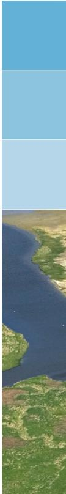

## D Boundary conditions specification

Boundary conditions are part of the external forcing of a model and as such declared in the external-forcings file ([Appendix C.6](#)).

### D.1 Supported boundary types

#### D.1.1 Open boundaries

#### D.1.2 Astronomic boundary conditions

Boundary values can be specified for any location in terms of astronomical components in attribute files with extension `<cmp>` (the BC-format, discussed furtheron, is supported as an alternative). Tidal motion are described as a series of simple harmonic constituent motions, each with its own characteristic period:

$$H(t) = A_0 + \sum_{i=1}^k A_i F(c_i) \cos\left(\frac{2\pi}{T(c_i)}t + (V_0 + u)(c_i) - G_i\right) \quad (\text{D.1})$$

in which:

| $c_i$            | $i$ -th component, specified by label (name) |
|------------------|----------------------------------------------|
| $A_i$            | amplitude of the $i$ -th component           |
| $G_i$            | phase of the $i$ -th component               |
| $T(c_i)$         | period                                       |
| $H(t)$           | boundary value at time $t$                   |
| $A_0$            | constant offset value                        |
| $k$              | number of relevant components                |
| $F(c_i)$         | nodal amplitude factor                       |
| $(V_0 + u)(c_i)$ | astronomical argument                        |

The component (by label)  $c_i$ , amplitude  $A_i$  and phase  $G_i$  for each component  $i$  are required in the `<cmp>`-file In addition to the primary constituents, compound and higher harmonic constituents may have to be used. This is the case in shallow water areas for example, where advection, large amplitude to depth ratio, and bottom friction give rise to non-linear interactions.

 $F$ ,  $V_0$  and  $u$  are also *time-dependent*. For a given period, their values are easily calculated or obtained various tidal year books.  $V_0$  is a frequency dependent phase correction factor relating the local time frame of the observations to an internationally agreed celestial time frame.  $F_i$  and  $u_i$  are slowly varying amplitude and phase corrections, The variations depend on the frequency, often with a cyclic period of 18.6 years. By default, the nodal amplitude factors and astronomical arguments are re-calculated every 6 hours.

#### D.1.3 Astronomic correction factors

For individual astronomic components, correcting factor  $\alpha_i$  for amplitude and offset  $\delta_i$  may be specified by the user so that the effective amplitude for that component becomes  $\alpha_i A_i$  and the effective phase becomes  $G_i + \delta_i$ .

#### D.1.4 Harmonic flow boundary conditions

Harmonic boundary conditions are specified in a manner similar to their astronomical counterpart, except that the periods (first column of a .cmp file) are declared explicitly in minutes, rather than using component names. Equation (D.1) applies with  $T(c_i) = T_i$  and furthermore  $F = 1$  and  $(V_0 + u) = 0$ .

### D.1.5 QH-relation flow boundary conditions

In this type of boundary condition, a waterlevel is prescribed as a function of the integrated discharge through a crosssection defined by the polyline of the boundary.

The relation between waterlevel and discharge is specified in a lookup-table.

Within this table linear interpolation is applied.

Note that only one waterlevel is set for the entire QH-boundary, and that its behaviour is specified by a *single* QH-table for the entire boundary.

### D.1.6 Time-series flow boundary conditions

Time-series in the general time-series file format (Appendix C.4) can be used to specify values on boundaries.

Boundary values are provided at discrete points in time, which are then used for interpolation at times in between.

Extrapolation beyond the range of specified times is not supported, Time-series are also supported at multiple vertical levels for quantities that are defined on layers (tracers, salinity, temperature, velocity). These need to be specified in the BC-format (section D.2.3).

### D.1.7 Time-series transport boundary conditions

The boundary conditions of tracers, salinity and temperature are specified similar to any other quantity already mentioned. The quantity name should be in the form `tracerbnd<name>`, where name is the user-defined tracer name.

### D.1.8 Time-series for the heat model parameters

In order to conduct a heat flux simulation (if in the MDU-file "Temperature" under [physics] was set to 5), then four time-varying meteorological fields become relevant:

- ◇ humidity (or dewpoint)
- ◇ airtemperature
- ◇ cloudiness
- ◇ solar radiation

These are read as a three- or four-column vector (the first three variables of this list, either with or without solar radiation). The corresponding quantity names in the `<ext>-file` are:

- ◇ `humidity_airtemperature_cloudiness`
- ◇ `humidity_airtemperature_cloudiness_solarradiation`
- ◇ `dewpoint_airtemperature_cloudiness`
- ◇ `dewpoint_airtemperature_cloudiness_solarradiation`

As for filetype, currently only the curvilinear format (C.14.2), the multicolumn time series (C.4) and `netCDF` (C.14.4) are supported.

In the case of `netCDF` it is also possible to supply `solarradiation` or `netsolarradiation` as a separate quantity, the latter does not apply the albedo factor. It is also possible to supply the term  $Q_{br}$  (see Eq.5.19) by the quantity `longwaveradiation`.

### D.1.9 Time-Series for Varying Air Density

In the computation of wind stress, it is possible to use a time- and/or spatially varying air density instead of the constant value specified by `rhoAir` in the MDU file. This air density can either be directly prescribed or computed from three other time-varying meteorological fields.

- ◇ To directly prescribe a time- and spatially varying air density, the quantity `airdensity` must be provided in the `<ext>` file. This file must be in `netCDF` format.
- ◇ To compute the air density instead, set the keyword `computedAirdensity` in the input block `[wind]` of the MDU file to 1. In this case, the quantities `airpressure`, `airtemperature`, and `dewpoint` must be available in the `<ext>` file. These quantities can be provided either as individual variables (e.g., `quantity = airpressure`) or as part of combined quantities (e.g., `quantity = airpressure_windx_windy`).

## D.2 Boundary signal file formats

### D.2.1 The `<cmp>` format

#### Warning:

- ◇ The `<cmp>` format is a legacy file format without any metadata. It is recommended to use the `<bc>` format instead `function=harmonic` or `astronomic` (see [Appendix C.5](#)).

```
* comments
* ...
c[0]           amplitude[0]    phase[0]
c[1]           amplitude[1]    phase[1]
...
```

where `c` represents a period in minutes or the name of a valid astronomic component. Amplitudes are assumed to be in the unit of the quantity.

### D.2.2 The `<qh>` format

#### Warning:

- ◇ The `<qh>` format is a legacy file format without any metadata. It is recommended to use the `<bc>` format instead, with `function=QHTable` (see [Appendix C.5](#)).

```
* comments
* ...
discharge[0]       waterlevel[0]
discharge[1]       waterlevel[1]
...
```

### D.2.3 The `<bc>` format

The `<*.bc>` format was originally defined to contain boundary condition data, but its scope has broadened since and these files can now be used for basically all model input quantities that need timeseries or other forms of dynamic input data on point locations. The full description can now be found in [Appendix C.5](#).

### D.2.4 The netCDF-format

### D.2.4.1 Scalar quantity for point-location time-series

The external forcings file may point to this type of file (for boundary condition support points) via the `forcingFile` or `dataFile` keyword (see section C.6.3).

NetCDF files that provide forcing data on point locations should meet the following structure:

- ◇ The time series have to be stored in a double variable with the following specifications:

- □ it has the name `'time'`
- □ it has the attribute `standard_name = 'time'`
- □ it has one dimension, the time dimension

The labels do not have to be unique.

- ◇ The location labels have to be stored in a character variable with the following specifications:

- □ it has the name `'station_id'`
- □ it has the attribute `cf_role = 'timeseries_id'`
- □ it has two dimensions, the primary being the series dimension and the secondary the string length dimension.

The labels do not have to be unique.

- ◇ The variable containing the timeseries data is identified by its attribute `standard_name = <quantity-name>` and has two dimensions, the series dimension and the time dimension. The latter can be the unlimited dimension.

In analogy with the ASCII BC-format (Appendix C.5), location label and quantity name uniquely identify the timeseries.

#### *Example header of a netCDF file with point data:*

```
netcdf timeseries {
dimensions:
    time = UNLIMITED ; // (5 currently)
    two = 2 ;
    name_len = 256 ;
    station = 3 ;
variables:
    double time(time) ;
        time:units = "seconds since 2011-12-22 00:00:00 +00:00" ;
        time:standard_name = "time" ;
        time:bounds = "time_bds" ;
        char station_id(station, name_len) ;
        station_id:cf_role = "timeseries_id" ;
}
```

### D.2.4.2 Scalar Quantity for gridded data

The external forcings file may point to this type of file via the `forcingFile` keyword (see section C.6.3).

Gridded data is used to apply per surface external forcing and should therefor spatially be 2D. There are two different ways to supply this data: Either with a timeseries or a harmonic component.

### D.2.4.2.1 timeseries

NetCDF files that provide forcing data on a grid with timeseries should meet the following structure:

- ◇ The variable containing the timeseries data is identified by its attribute `:standard_name = <quantity-name>` and has three dimensions, the time dimension and the grid coordinates. See Table C.18 for a list of quantity names and their required standard names. If no suitable standard name is available, the modeller can provide a custom variable name in the `<*.ext>` file using `forcingVariableName=...` (see section C.6.3.3).

#### *Example header of a netCDF file with a gridded timeseries:*

```
netcdf forcing_timeseries {
dimensions:
    time = 8761 ;
    x = 9 ;
    y = 2 ;
variables:
    double time(time) ;
        time:time_origin = "2013-01-01 00:00:00" ;
        time:long_name = "Time - minutes since 2013-01-01 00:00:00 +00:00" ;
        time:standard_name = "time" ;
        time:calender = "gregorian" ;
        time:units = "minutes since 2013-01-01 00:00:00 +00:00" ;
    double x(x) ;
        x:standard_name = "longitude" ;
        x:long_name = "longitude" ;
        x:units = "degrees_east" ;
    double y(y) ;
        y:standard_name = "latitude" ;
        y:long_name = "latitude" ;
        y:units = "degrees_north" ;
    double air_pressure(time, y, x) ;
        air_pressure:coordinates = "Time y x" ;
        air_pressure:long_name = "Atmospheric Pressure" ;
        air_pressure:standard_name = "air_pressure" ;
        air_pressure:units = "Pa" ;
}
```

### D.2.4.2.2 Harmonic component

When the external per surface forcing is periodic in nature, an alternate format can be used in which the data is expressed in the form of a harmonic component. This form generally allows the forcing file to be much smaller while it also provides flexibility in extrapolation.

NetCDF files that provide forcing data on a grid with a harmonic component should meet the following structure:

- ◇ The variable containing the amplitude data is identified by its attribute `standard_name = <quantity-name>` and has two dimensions, the grid coordinates.
- ◇ The phase offset is identified by the variable name `phase` and should have the same coordinate dimensions as the amplitude data variable and `phase:units = "deg"`.
- ◇ The reference time for which the phase offset has been supplied should be defined a global attribute named `reference_time_of_component_phase`.
- ◇ The component's period in seconds should be defined a global attribute named `component_period_in_seconds`.

When using this harmonic component format, the timeseries in each grid point  $i$  will be given by:

$$H_i(t) = A_i \cos \left( \frac{2\pi}{T} (t - t_{\text{ref}}) - \frac{\pi}{180} G_i \right) \quad (\text{D.2})$$

| $A_i$            | amplitude of the component at grid point $i$       |
|------------------|----------------------------------------------------|
| $T$              | period of the component (seconds)                  |
| $t_{\text{ref}}$ | reference time of the component phase (seconds)    |
| $G_i$            | phase of the component at grid point $i$ (degrees) |

**Example header of a netCDF file with a gridded harmonic component:**

```
netcdf forcing_component_s1 {
dimensions:
    x = 9 ;
    y = 2 ;
variables:
    double x(x) ;
        x:standard_name = "longitude" ;
        x:long_name = "longitude" ;
        x:units = "degrees_east" ;
    double y(y) ;
        y:standard_name = "latitude" ;
        y:long_name = "latitude" ;
        y:units = "degrees_north" ;
    double amplitude(y, x) ;
        amplitude:coordinates = "y x" ;
        amplitude:long_name = "amplitude_of_airpressure" ;
        amplitude:standard_name = "air_pressure" ;
        amplitude:units = "Pa" ;
    double phase(y, x) ;
        phase:coordinates = "y x" ;
        phase:long_name = "phase_of_component" ;
        phase:standard_name = "phase" ;
        phase:units = "deg" ;    // global attributes:
    :component = "S1" ;
    :component_period_in_seconds = "86400" ;
    :reference_time_of_component_phase = "2013-01-01 00:00:00 +00:00" ;
}
```

### D.2.4.3 Vector quantity

NetCDF file can hold data for a vector quantity. For example, **uxuyadvectionvelocitybnd** boundary condition has X and Y velocity components. To hold this vector quantity, NetCDF file has to have an empty quantity with the name **uxuyadvectionvelocitybnd** in addition to scalar quantities for the velocity components. This empty quantity has to have a string attribute named **vector** that contains the vector element names: X and Y components. These names are separated by comma. The picture below shows an example when the string contains quantities' names **ux** and **uy**. As well the string can contain standard and/or long names.


- ◇ Be sure that names in the string are not truncated due the string size.

## E Output files


**Note:** In this appendix **culverts** and **orifices** are still sometimes mentioned, but these functionalities are only available for 1D2D modelling and not for 2D3D modelling.

D-Flow FM can produce several types of output into several different files. This chapter summarizes the types of output and how to configure them in them model definition. We distinguish five types of output here:

1. 1 The diagnostics file, a log file with live details of a single model run.
2. 2 NetCDF output files for history, map and restart data.
3. 3 Timings file with performance statistics.
4. 4 Shapefiles.

### E.1 Diagnostics file

The diagnostics (dia) file is the log file of a single model simulation run. It is an important file to check for warning or error messages, when suspecting a faulty model run. The filename is automatically chosen as `<mdu_name.dia>`. For parallel model runs, each process writes its own file `<mdu_name_000X.dia>`. The dia file has the following global structure:

Various INFO/DEBUG messages:

\*\* INFO : Opened file : unstruc.hlp

[..]

The version of D-Flow FM used for this calculation:

\* Deltares, D-Flow FM Version 1.1.145.41271M, Aug 11 2015, 18:05:31

Date and time of model run start:

File creation date: 18:27:44, 06-09-2015

[..]

Check for possible model initialization errors:

\*\* WARNING: readMDUFile: [numerics] cflwavefrac=0.1 was in file, but not used.

[..]

Upon successful initialization, a full printout of the effective model settings is given:

\*\* INFO : \*\* Model initialization was successful \*\*

\*\* INFO : \* Active Model definition:

# Generated on 18:27:45, 06-09-2015

# Deltares, D-Flow FM Version 1.1.145.41271M, Aug 11 2015, 18:05:31  
[general]

[..]

Next, the time loop is started:

\*\* INFO : \*\*

\*\* INFO : Writing initial output to file(s)...

\*\* DEBUG : Opened netCDF file 'DFM\_OUTPUT\_035hammen/035hammen\_his.nc' as #3.

\*\* DEBUG : Opened netCDF file 'DFM\_OUTPUT\_035hammen/035hammen\_map.nc' as #4.

\*\* INFO : Done writing initial output to file(s).

[..]

Finishing summary of model run:

\*\* INFO : simulation period (s) : 6400.0000000000

\*\* INFO : nr of timesteps ( ) : 771.0000000000

\*\* INFO : average timestep (s) : 8.3009079118

[..]

Some basic run time statistics

\*\* INFO : time steps (s) : 76.2840000003

\*\* INFO : Computation started at: 18:27:45, 06-09-2015

\*\* INFO : Computation finished at: 18:29:04, 06-09-2015

\*\* INFO :

Which parallelization options have been active in this run:

\*\* INFO : MPI : no.

\*\* INFO : OpenMP : yes.

#threads max : 8

## E.2 Demanding output

The configuration of what output should be produced during a model run is via the MDU file, and several attribute files for history files.

### E.2.1 The MDU-file

The MDU-file has an [output]-section, with a range of key-value-pair options. See Table A.1 on page 417 for all available output options. Enabling the various output files begins with setting the output interval to a value  $> 0$ , see for example `MapInterval` and `HisInterval` in Table A.1.

### E.2.2 Observation points

The observation point file has two goals. At first, it defines the locations for time series output of quantities such as water level, water depth, currents and salinity and temperature. Secondly, the observation point file contains references to polyline that are used for nesting. These two options can be combined with each other. The keyword `ObsFile` should be used to point to the observation point file; optionally a space separated list of files can be specified (see [Appendix A](#)).

Observation points in 2D (or 3D) parts of the model domain are at first used to monitor quantities at grid cell centres. On input  $(x,y)$  coordinates are specified for the observation points. They are snapped to the cell centre of the grid cell involved, both for 1D grid cells and for 2D grid cells. Secondly, observation points are used for nesting of D-Flow FM models. In this case, the  $(x,y)$  coordinates aren't snapped to its cell centre, but the value of the quantity involved is computed by bi-linear interpolation of values in surrounding grid cells.

Thus, three types of observation point files are supported: `<*_obs.ini>` files, old `<*.xyn>` files and `<*.pli>` files. The latter is applied for nesting of D-Flow FM models. The first two types are related to observation points, for which the first file type is recommended. These three file types are described in the subsections below.

The following general remarks hold for the first two types of input, for regular observation points:

#### Remarks:

- ◇ The observation points are stationary by default.
- ◇ Observation points may have non-unique names (also together with moving observation points), but the results can only be distinguished by the column number in the output file, and this practice is not advised.
- ◇ In 2D/3D, the  $(x,y)$ -locations are snapped to the grid cell in which they lie. When an observation point lies on a grid cell edge, snapping results are unpredictable.
- ◇ In 1D, the observation point locations are snapped to the closest computational point; this may not always match the grid cell in which the point is located.
- ◇ Time series are reported for the cell-centered solution data, that is: *no* interpolation to the exact  $x,y$ -location takes place.

The following general remarks hold for observation points that are used for nesting:

#### Remarks:

- ◇ Each support point on the polyline that is applied for nesting, appears on the history output file with the following name `polylinename_000N`, for the  $N$ th support point on the polyline with name `polylinename`.
- ◇ The  $(x,y)$  coordinates aren't snapped to its cell centre, but the value of the quantity involved is computed by bi-linear interpolation of values in surrounding grid cells

For the `<*.pli>` file which is applied in case of nesting of models, the restrictions are summarized in section 11.2.

### E.2.2.1 The observation point file with extension `<*_obs.ini>`

This file can be used to define observation points in a more detailed way, amongst others in 1D using (branchId, chainage), but see below for more possibilities.

**Table E.1: Definition of observation points.**

| Keyword            | Type   | Default   | Description                                                                                                                                                                         |
|--------------------|--------|-----------|-------------------------------------------------------------------------------------------------------------------------------------------------------------------------------------|
| [General]          |        |           |                                                                                                                                                                                     |
| fileVersion        | String | 2.00      | File version. Do not edit this.                                                                                                                                                     |
| fileType           |        | obsPoints | File type. Do not edit this.                                                                                                                                                        |
| [ObservationPoint] |        |           |                                                                                                                                                                                     |
| name               | String |           | Name of the observation point (max. 255 characters).                                                                                                                                |
| locationType       | String | 2d        | (optional) Only when x and y are also specified. 1d: snap to closest 1D grid point, 2d: snap to closest 2D grid cell centre, all: snap to closest 1D or 2D point.                   |
| branchId           | String |           | (optional) Branch on which the observation point is located.                                                                                                                        |
| chainage           | Double |           | (optional) Location on the branch (m).                                                                                                                                              |
| x                  | Double |           | (optional in 1D) x-coordinate of the location of the observation point.                                                                                                             |
| y                  | Double |           | (optional in 1D) y-coordinate of the location of the observation point.                                                                                                             |
| locationFile       | String |           | (optional) Specifically for moving observation points: name of a <code>&lt;*.bc&gt;</code> containing the timeseries for the x and y coordinates. See Section E.2.3 for an example. |
| locationFileType   | String |           | Type of locationFile. Supported type:<br>◇ <code>bcAscii</code> : Space-uniform time series for x and y in <code>&lt;*.bc&gt;</code> ( <a href="#">Appendix C.5</a> ).              |

**Remarks:**

- ◇ The station id/name may contain spaces, with no quoting needed.
- ◇ If `locationType = all` then the observation point is first checked whether it lies inside a 2D grid cell. When this is not the case, in a second attempt it is snapped to the nearest 1D grid point.
- ◇ Three types of location specifications are available.
  - ◇ When `branchId` is given, the keywords `branchId` and `chainage` will be used for the location specification (only for 1D, the `locationType` is automatically assumed to be 1d).
  - ◇ When `branchId` is *not* given, but keywords `x` and `y` are, then these fixed coordinates will be used. By default this is assumed to be a 2D/3D station location (i.e. `locationType = 2d`). Optionally, this location can be snapped to 1D calculation points using `locationType = 1d`.
  - ◇ Finally, when only `locationFile` is given, that is considered to be a file with timeseries for the x,y coordinates of a moving observation station. See Section E.2.3 for an example.

**Example:**

```
[General]
fileVersion      = 2.00
fileType         = obsPoints
```

```
[ObservationPoint]
    name                                        = ABDN
    x                                              = -2.06250000e+00
    y                                              = 5.71583333e+01
[ObservationPoint]
    name                                              = AVMH
    x                                                    = -2.73750000e+00
    y                                                    = 5.15083334e+01
[ObservationPoint]
    name                                                    = St Helier Jersey
    x                                                    = -2.11250000e+00
    y                                                    = 4.91750000e+01
[ObservationPoint]
    name                                                    = Obs4
    branchId                                               = Channel1
    chainage                                              = 275.0
[ObservationPoint]
    name                                                    = Obs5
    locationType                                         = 1d
    x                                                    = -2.31250000e+00
    y                                                    = 5.01750000e+01
```

### E.2.2.2 The observation point file with extension <\*.xyn>

The observation point file with extension <\*.xyn> is basically like a sample file (Appendix C.3), but now with station id strings in the third column:

```
-2.06250000e+00 5.71583333e+01 ABDN
-2.73750000e+00 5.15083334e+01 AVMH
-2.11250000e+00 4.91750000e+01 'St Helier Jersey'
```

#### Remarks:

- ◇ The station id/name may contain spaces, in which case it should be surrounded by single quotes, 'as\_follows'. Maximum length is 255 characters.
- ◇ Each observation point is first checked whether it lies inside a 2D grid cell. When this is not the case, in a second attempt it is snapped to the nearest 1D grid point.

### E.2.2.3 The observation point file with extension <\*.pli>

In case of nesting of D-Flow FM models, which is described in section 11.2, the ObsFile list has to extended with the list of polyline files of the open boundaries of the inner model domain. This might be of the form:

```
ObsFile = outermodel.xyn ../innermodel/sea.pli ../innermodel/river.pli
```

For the definition of a polygon file we refer to Appendix C.2.

### E.2.3 Moving observation points

Moving observation points are specified via the <\*\_obs.ini>, using `locationFile=example.bc` Below is an example of a <\*.bc> file containing the moving point coordinates for a point with name = ship1:

```
[Forcing]
name                                                    = ship1
function                                                = timeseries
timeInterpolation                                     = linear
quantity                                              = time
unit                                                    = minutes since 1992-08-31 00:00:00 +00:00
```

```
vector                                         = movingstationtxy:xCoordinate,yCoordinate
quantity                                        = xCoordinate
unit                                            = -
quantity                                        = yCoordinate
unit                                            = -
0           1140.                                 100.
1           1140.                                 50.
2           180.                                 50.
3           180.                                 100.
4           140.                                 100.
5           140.                                 50.
6           180.                                 50.
7           180.                                 100.
8           140.                                 100.
```

**Warning:**

- ◇ This example below describes deprecated functionality using the old external forcings format. Use the new `<*_obs.ini>` file format instead, with keyword `locationFile`, see [Section E.2.2.1](#).

Moving observation points are specified via the `<*.ext>`-file:

```
QUANTITY=movingstationtxy
FILENAME=movingstation1.tim
FILETYPE=1
METHOD=1
OPERAND=0
```

The `<*.tim>` file (one for each moving observation point) is a standard time series file ([Appendix C.4](#)) with three columns, containing the time in minutes since the reference data, the *x*- and *y*-position of the moving station at that time.

**Remarks:**

- ◇ Stationary and moving observation points form one large set of observation points in the output his file.
- ◇ No space or time interpolation is done: the reported values are instantaneous values for the grid cell in which the moving observation point lies at that each output time.

**E.2.4 Observation cross sections**Observation cross sections (or cross sections for short) define the location for time series output of flow "flux" variables such as discharge and velocity. Other typical output quantities are instantaneous as well as cumulative, space-integrated discharges and constituent transport. The keyword `CrsFile` should be used to point to the observation cross section file; optionally a space separated list of files can be specified (see [Appendix A](#)).

The location of an observation cross section can be specified using `<*_crs.pli>` files. The following general remarks hold for cross section input:

**Remarks:**

- ◇ Observation cross sections may have non-unique names, but the results can only be distinguished by the column number in the output file, and this practice is not advised.
- ◇ A cross section polyline is snapped to all grid cell edges (i.e., velocity points), whose flow link is intersected by the polyline.
- ◇ The flow data on velocity points is integrated along the polyline and across all vertical layers, resulting in a single time series per cross section and flow quantity.

### E.2.4.1 Observation cross section file with extension `<*_crs.pli>`

The format of the `<*_crs.pli>` file is identical to that of a general polyline/polygon file (Appendix C.2).

| CrossSec1 |          |          |
|-----------|----------|----------|
| 4 2       |          |          |
|           | 132345.0 | 549030.0 |
|           | 132165.0 | 549285.0 |
|           | 131940.0 | 549550.0 |
|           | 131820.0 | 549670.0 |
| CrossSec2 |          |          |
| 3 2       |          |          |
|           | 131750.0 | 549865.0 |
|           | 131595.0 | 550025.0 |
|           | 131415.0 | 550175.0 |

#### Remarks:

- ◇ The first header line of each polyline block contains the name of each cross section.
- ◇ The cross section id/name may contain spaces, no quotes or other delimiters must be used.

### E.2.5 Mass balance area files

Mass balance area files define polygons in the model domain for which mass balance output is produced. The polygons subdivide the model domain in a number of regions, and the produced mass balance files show timeseries of mass balances per region and the cumulative fluxes in between each pair of adjacent regions. Note that this is different from the *global* mass balance output in the history file (Section E.3.1.6). Section 19.3.6 contains more background information about this functionality on page 313. Below are more details on the file format itself.

Multiple, space-separated mass balance area files can be specified using the `mbaFile` keyword in the `[output]` section of the MDU file. Additionally, a mass balance area time interval needs to be specified using the `mbaInterval` keyword in the `[output]` section of the MDU file. `mbaInterval` must be a multiple of `dtUser`.

The mass balance area file is always specified with the `<*_mba.ini>` extension.

### E.2.5.1 The mass balance area file with extension `<*_mba.ini>`

The mass balance area polygon can either be defined by a separate polygon file (`<*.pol>`) or by specifying the coordinates of the polygon directly in the mass balance area file using `numCoordinates`, `xCoordinates` and `yCoordinates`. The following table contains the file structure.

**Table E.2: Definition of mass balance area file keywords.**

| Keyword           | Type   | Default             | Description                                                                              |
|-------------------|--------|---------------------|------------------------------------------------------------------------------------------|
| [General]         |        |                     |                                                                                          |
| fileVersion       | String | 1.00                | File version. Do not edit this.                                                          |
| fileType          |        | <code>mass ←</code> | File type. Do not edit this.                                                             |
|                   |        | BalanceAreas        |                                                                                          |
| [MassBalanceArea] |        |                     |                                                                                          |
| name              | String |                     | Name of the mass balance area (max. 255 characters).                                     |
| locationFile      | String |                     | (optional) Name of mass balance area polygon <code>&lt;*.pol&gt;</code> .                |
| numCoordinates    | Int    |                     | (optional) Number of values in <code>xCoordinates</code> and <code>yCoordinates</code> . |
|                   |        |                     | (continued on next page)                                                                 |

| Keyword                               | Type     | Default | Description                                                |
|---------------------------------------|----------|---------|------------------------------------------------------------|
| <i>(continued from previous page)</i> |          |         |                                                            |
| xCoordinates                          | Double[] |         | (optional) x-coordinates of the mass balance area polygon. |
| yCoordinates                          | Double[] |         | (optional) y-coordinates of the mass balance area polygon. |

Below is an example of a mass balance area file with two mass balance areas, each defined by a separate polygon file.

```
[General]
fileVersion = 1.00
fileType      = massBalanceAreas[MassBalanceArea]
name         = area1
locationFile = area1.pol[MassBalanceArea]
name         = area2
locationFile = area2.pol
```

It first starts with a [General] section, which contains the file version and file type. Then for each mass balance area, a [MassBalanceArea] section is defined, which contains the name of the area and the location file that defines the polygon for that area.

### E.3 NetCDF output files

All flow data output produced by D-Flow FM is written in the netCDF format. This cross-platform storage format is widely used in the world. The contents of a file can be documented using variable attributes and standardized meta data.

The following conventions are used in some of our output file types:

- ◇ CF-conventions for both the timeseries (his) files and the spatial (map/class map/Fourier) files. More information on: <https://cfconventions.org/>.
- ◇ UGRID-conventions for the unstructured grids in the spatial (map/class map/Fourier) files. More information on: <http://ugrid-conventions.github.io/ugrid-conventions/>.
- ◇ ACDD-conventions for the geospatial and time bounds in the spatial (map/class map/Fourier) files. More information on: [https://wiki.esipfed.org/Category:Attribute\\_Conventions\\_Dataset\\_Discovery](https://wiki.esipfed.org/Category:Attribute_Conventions_Dataset_Discovery).

### Spherical coordinates in NetCDF output files

The coordinate variables in all NetCDF output files are in the same coordinate system as the input grid file (<\_net.nc>). If this input file contains metadata describing grid mapping/coordinate transformation, that metadata is also copied over into most output NetCDF files (specifically: into all UGRID-type map/class map/Fourier files, and the history files). For models using a Cartesian/metric coordinate system, an option is available to automatically add the equivalent latitude and longitude coordinate values for all locations in the NetCDF output files. To enable this feature:

- ◇ Verify that the input <\_net.nc> file contains a grid mapping variable with coordinate transformation parameters. In order to be found, the grid mapping variable should be called `projected_coordinate_system`, or have the attribute `:grid_mapping_name`. Additionally, it must have an attribute `:proj4_params` containing a PROJ-compatible coordinate transformation string<sup>1</sup>.
- ◇ If the input contains the above metadata, switch on the lat-lon conversion in the MDU file using keyword `[output] NcWriteLatLon = 1`.

<sup>1</sup><https://proj.org/usage/projections.html>

The fragment below shows an example of NetCDF output for a map file, where the input contained a detailed grid mapping variable for UTM zone 32N:

```
netcdf example_map {
// [..]
variables:
  int projected_coordinate_system ;
    projected_coordinate_system:name = "ETRS89 / UTM zone 32N" ;
    projected_coordinate_system:epsg = 25832 ;
    projected_coordinate_system:grid_mapping_name = "transverse_mercator" ; |
    projected_coordinate_system:longitude_of_prime_meridian = 0. ;
    projected_coordinate_system:semi_major_axis = 6378137. ;
    projected_coordinate_system:semi_minor_axis = 6356752.31414036 ;
    projected_coordinate_system:inverse_flattening = 298.257222101 ;
    projected_coordinate_system:EPSG_code = "EPSG:25832" ;
    projected_coordinate_system:value = "value is equal to EPSG code" ;
    projected_coordinate_system:proj4_params =
      "+proj=utm +zone=32 +ellps=GRS80 +towgs84=0,0,0,0,0,0,0 +units=m +no_defs" ; |
    projected_coordinate_system:projection_name = "unknown" ;
    projected_coordinate_system:wkt = "PROJCS[\"ETRS89 / UTM zone 32N\",\n", |
        "                     GEOGCS[\"ETRS89\",\n",
                        DATUM[\"European_Terrestrial_Reference_System_1989\",\n", |
                        SPHEROID[\"GRS 1980\",6378137,298.257222101,\n", |
                        AUTHORITY[\"EPSG\",\"7019\"]],\n",
                        TOWGS84[0,0,0,0,0,0,0],\n",
                        AUTHORITY[\"EPSG\",\"6258\"]],\n",
                        PRIMEM[\"Greenwich\",0,\n",
                        AUTHORITY[\"EPSG\",\"8901\"]],\n",
                        UNIT[\"degree\",0.0174532925199433,\n",
                        AUTHORITY[\"EPSG\",\"9122\"]],\n",
                        AUTHORITY[\"EPSG\",\"4258\"]],\n",
                        PROJECTION[\"Transverse_Mercator\"],\n",
                        PARAMETER[\"latitude_of_origin\",0],\n",
                        PARAMETER[\"central_meridian\",9],\n",
                        PARAMETER[\"scale_factor\",0.9996],\n",
                        PARAMETER[\"false_easting\",500000],\n",
                        PARAMETER[\"false_northing\",0],\n",
                        UNIT[\"metre\",1,\n",
                        AUTHORITY[\"EPSG\",\"9001\"]],\n",
                        AXIS[\"Easting\",EAST],\n",
                        AXIS[\"Northing\",NORTH],\n",
                        AUTHORITY[\"EPSG\",\"25832\"]] ;
    // [..]
    double mesh2d_node_x(mesh2d_nNodes) ;
      mesh2d_node_x:units = "m" ;
      mesh2d_node_x:standard_name = "projection_x_coordinate" ;
      mesh2d_node_x:long_name = "x-coordinate of mesh nodes" ;
    double mesh2d_node_y(mesh2d_nNodes) ;
      mesh2d_node_y:units = "m" ;
      mesh2d_node_y:standard_name = "projection_y_coordinate" ;
      mesh2d_node_y:long_name = "y-coordinate of mesh nodes" ;
    double mesh2d_node_lon(mesh2d_nNodes) ;
      mesh2d_node_lon:units = "degrees_east" ;
      mesh2d_node_lon:standard_name = "longitude" ;
      mesh2d_node_lon:long_name = "longitude coordinate of mesh nodes" ;
    double mesh2d_node_lat(mesh2d_nNodes) ;
      mesh2d_node_lat:units = "degrees_north" ;
      mesh2d_node_lat:standard_name = "latitude" ;
      mesh2d_node_lat:long_name = "latitude coordinate of mesh nodes" ;
```

### Detailed per NetCDF output file type

The following sections describe the specific details for each type of output file.

#### E.3.1 Timeseries as netCDF his-file

The history file *<mdu\_name\_his.nc>* contains the dimensions and variable definitions in its header, followed by the actual data. For parallel runs, all data is gathered by domain #0 into *<mdu\_name\_0000\_his.nc>* (section 8.4.4).

### E.3.1.1 Dimensions

The following dimensions are defined in a his file header:

```
netcdf weirfree_his {
dimensions:
    time = UNLIMITED ; // (64 currently)
    name_len = 64 ;
    stations = 18 ;
    cross_section = 4 ;
    cross_section_name_len = 64 ;
    cross_section_pts = 3 ;
    npumps = 2 ;
    // and possibly nweirgens, nweirs, ngategens, ngates, nsources/sinks
```

### E.3.1.2 Location variables

The original location and IDs for stations, cross sections and sources/sinks are also included in the his file:

```
variables:
    double station_x_coordinate(stations) ;
    station_x_coordinate:units = "m" ;
    station_x_coordinate:standard_name = "projection_x_coordinate" ;
    station_x_coordinate:long_name = "x-coordinate" ;
    double station_y_coordinate(stations) ;
    station_y_coordinate:units = "m" ;
    station_y_coordinate:standard_name = "projection_y_coordinate" ;
    station_y_coordinate:long_name = "x-coordinate" ;
    char station_name(stations, name_len) ;
    station_name:cf_role = "timeseries_id" ;
    station_name:long_name = "Observation station name" ;    double cross_section_x_coordinate(cross_section, cross_section_pts) ;
    cross_section_x_coordinate:units = "m" ;
    cross_section_x_coordinate:standard_name = "projection_x_coordinate" ;
    cross_section_x_coordinate:long_name = "x-coordinate" ;
    double cross_section_y_coordinate(cross_section, cross_section_pts) ;
    cross_section_y_coordinate:units = "m" ;
    cross_section_y_coordinate:standard_name = "projection_y_coordinate" ;
    cross_section_y_coordinate:long_name = "y-coordinate" ;
    char cross_section_name(cross_section, cross_section_name_len) ;    double source_sink_x_coordinate(source_sink, source_sink_pts) ;
    source_sink_x_coordinate:units = "m" ;
    source_sink_x_coordinate:standard_name = "projection_x_coordinate" ;
    source_sink_x_coordinate:long_name = "x-coordinate" ;
    double source_sink_y_coordinate(source_sink, source_sink_pts) ;
    source_sink_y_coordinate:units = "m" ;
    source_sink_y_coordinate:standard_name = "projection_y_coordinate" ;
    source_sink_y_coordinate:long_name = "y-coordinate" ;
    char source_sink_name(source_sink, source_sink_name_len) ;
```

### E.3.1.3 Overview of output quantities in a netCDF his-file

An overview of output quantities in a his-file is given in Table E.3 and the following subsections. These output quantities are present in the his-file only when the output object exists in the model. For example, quantities on observation stations are present only when observation station(s) exists in the model.

**Table E.3:** Global overview of output quantities in the history file.

| Quantity name                             | MDU keywords for output                          | More information                                                |
|-------------------------------------------|--------------------------------------------------|-----------------------------------------------------------------|
| Basic condition for his output            | <code>HisInterval &gt; 0</code>                  | See <a href="#">Section E.2.1</a> .                             |
| Quantities on observation stations.       |                                                  | See <a href="#">section E.3.1.4</a> .                           |
| Quantities on observation cross sections. |                                                  | See <a href="#">section E.3.1.5</a> .                           |
| Quantities on runup gauges.               |                                                  |                                                                 |
| Quantities on sources and sinks.          | <code>wriHis_sourcesink &gt; 0</code> .          |                                                                 |
| Quantities for mass balance.              | <code>wriHis_balance &gt; 0</code> .             | See <a href="#">section E.3.1.6</a> .                           |
| Quantities on hydraulic structures.       |                                                  | See <a href="#">section E.3.1.8</a> .                           |
| Quantities on laterals.                   | <code>wriHis_lateral &gt; 0</code> .             | See <b>??</b> .                                                 |
| Quantities for dredging and dumping.      | <code>[sediment]</code> DredgeFile is specified. |                                                                 |
| Quantities for checkerboard monitor.      | <code>[numerics]</code> checkerboardmonitor = 1. |                                                                 |
| <code>time</code>                         |                                                  | Instant time.                                                   |
| <code>timestep</code>                     |                                                  | Latest computational timestep size in each output interval [s]. |

### E.3.1.4 Variables on stations

Variables on observations station are typically defined as follows:

```
double waterlevel(time, stations) ;
waterlevel:standard_name = "sea_surface_level" ;
waterlevel:long_name = "Water level" ;
waterlevel:units = "m" ;
waterlevel:coordinates = "station_x_coordinate station_y_coordinate station_name" ;
waterlevel:_FillValue = -999. ;
```

Output for observation stations is available as time series in the history file. The output is shown in history file when one or more observation stations are defined in the model. The available output quantities are listed in Table E.4. These output variables are quantities locating on the observation stations. Such output can be switched on/off by setting value 1/0, respectively, to MDU [output] keywords, as listed in the third column of Table E.4 (More details about these MDU keywords refer to Table A.1.) If for one variable there is no MDU keyword shown in the third column, then the output of this variable is always switched on.

**Table E.4:** Output quantities of observation stations in history file.

| Quantity name                                            | Description [Unit]                                                                                                 | MDU [output] keyword to switch on/off this output |
|----------------------------------------------------------|--------------------------------------------------------------------------------------------------------------------|---------------------------------------------------|
| station_id                                               | Identification string of the observation stations.                                                                 |                                                   |
| station_name                                             | Names of the observation stations.                                                                                 |                                                   |
| station_x_coordinate                                     | Original x-coordinates of stations (non-snapped) [m].                                                              |                                                   |
| station_y_coordinate                                     | Original y-coordinates of stations (non-snapped) [m].                                                              |                                                   |
| <b># The following variables are only for 3D models:</b> |                                                                                                                    |                                                   |
| zcoordinate_c                                            | Vertical coordinate at center of flow element and layer [m].                                                       | wriHis_zcor (default=1)                           |
| zcoordinate_w                                            | Vertical coordinate at centre of flow element and at layer interface [m].                                          | wriHis_zcor (default=1)                           |
| zcoordinate_wu                                           | Vertical coordinate at edge of flow element and at layer interface [m].                                            | wriHis_zcor (default=1)                           |
| <b># The above variables are only for 3D models.</b>     |                                                                                                                    |                                                   |
| station_geom                                             | Geometry variables, see Section E.3.1.9.                                                                           |                                                   |
| <b># End of time-independent variables.</b>              |                                                                                                                    |                                                   |
| waterlevel                                               | Water level [m].                                                                                                   | wriHis_waterlevel_s1 (default=1)                  |
| bedlevel                                                 | Bottom level [m].                                                                                                  | wriHis_bedlevel (default=1)                       |
| waterdepth                                               | Water depth [m].                                                                                                   | wriHis_waterdepth (default=0)                     |
| tausx, tausy                                             | x-, y-components of mean bottom shear stress vector [Pa].                                                          | wriHis_taucurrent (default=1)                     |
| x_velocity, y_velocity                                   | x-, y-components of flow element center velocity vector [m/s].                                                     | wriHis_velocity_vector (default=1)                |
| <b># Following are only for 3D models:</b>               |                                                                                                                    |                                                   |
| z_velocity                                               | z-component of flow element center velocity vector [m/s].                                                          | wriHis_velocity_vector (default=1)                |
| depth-averaged_x_velocity,<br>depth-averaged_y_velocity  | x-, y-components of flow element depth-averaged center velocity vector [m/s].                                      | wriHis_velocity_vector (default=1)                |
| tke                                                      | Turbulent kinetic energy [m <sup>2</sup> /s <sup>2</sup> ] when MDU keyword<br>[numerics] Turbulencemodel >= 3.    | wriHis_turbulence (default=1)                     |
| vicww                                                    | Turbulent vertical eddy viscosity [m <sup>2</sup> /s] when MDU keyword<br>[numerics] Turbulencemodel > 1.          | wriHis_turbulence (default=1)                     |
| eps                                                      | Turbulent energy dissipation [m <sup>2</sup> /s <sup>3</sup> ] when MDU keyword<br>[numerics] Turbulencemodel = 3. | wriHis_turbulence (default=1)                     |

| Quantity name                                                                      | Description                                                                                                                     | MDU [output] keyword to switch on/off this output     |
|------------------------------------------------------------------------------------|---------------------------------------------------------------------------------------------------------------------------------|-------------------------------------------------------|
| tau                                                                                | Turbulent time scale [1/s] when MDU keyword [numerics] Turbulencemodel = 4.                                                     | wriHis_turbulence (default=1)                         |
| rich                                                                               | Richardson Nr [-].                                                                                                              | Richardsononoutput (default=0)                        |
| # The above are only for 3D models.                                                |                                                                                                                                 |                                                       |
| salinity                                                                           | Salinity [ppt] when MDU keyword [physics] Salinity > 0.                                                                         | wriHis_salinity (default=1)                           |
| velocity_magnitude                                                                 | Velocity magnitude [m/s]. Or Eulerian velocity magnitude [m/s] when MDU keyword [output] EulerVelocities equals 1.              | wriHis_velocity (default=1)                           |
| discharge_magnitude                                                                | Average discharge magnitude [m <sup>3</sup> /s].                                                                                | wriHis_discharge (default=1)                          |
| R                                                                                  | Roller energy per square meter [J/m <sup>2</sup> ] when MDU keyword [waves] Wavemodelnr = 4.                                    |                                                       |
| # The following variables are for models when MDU keyword [waves] Wavemodelnr > 0: |                                                                                                                                 |                                                       |
| hwav                                                                               | Significant wave height [m]. Or root mean square wave height based on wave energy [m] when MDU keyword [waves] jahissigwav = 0. | wriHis_waves (default=1)                              |
| twav                                                                               | Wave period [s].                                                                                                                | wriHis_waves (default=1)                              |
| phiwav                                                                             | Wave from direction [deg from N].                                                                                               | wriHis_waves (default=1)                              |
| rlabda                                                                             | Wave length [m].                                                                                                                | wriHis_waves (default=1)                              |
| uorb                                                                               | Orbital velocity [m/s].                                                                                                         | wriHis_waves (default=1)                              |
| ustokes,vstokes                                                                    | x-, y-components of Stokes drift [m/s].                                                                                         | wriHis_waves (default=1)                              |
| # The above variables are for models when MDU keyword [waves] Wavemodelnr > 0.     |                                                                                                                                 |                                                       |
| wtau                                                                               | Mean bed shear stress [Pa].                                                                                                     | wriHis_taucurrent (default=1)                         |
| # The following variables are for models with temperature:                         |                                                                                                                                 |                                                       |
| temperature                                                                        | Temperature [°C] when MDU keyword [physics] Temperature > 0.                                                                    | wriHis_temperature (default=1)                        |
| wind                                                                               | Wind speed [m/s] when MDU keyword [physics] Temperature > 1.                                                                    | wriHis_temperature and wriHis_heat_fluxes (default=1) |
| Tair                                                                               | Air temperature [°C] when MDU keyword [physics] Temperature > 1.                                                                | wriHis_temperature and wriHis_heat_fluxes (default=1) |
| rhum                                                                               | Relative humidity [-] when MDU keyword [physics] Temperature = 5.                                                               | wriHis_temperature and wriHis_heat_fluxes (default=1) |
| clou                                                                               | Cloudiness [-] when MDU keyword [physics] Temperature = 5.                                                                      | wriHis_temperature and wriHis_heat_fluxes (default=1) |

| Quantity name                                                                                              | Description                                                                                                                                                                | MDU [output] keyword to switch on/off this output     |
|------------------------------------------------------------------------------------------------------------|----------------------------------------------------------------------------------------------------------------------------------------------------------------------------|-------------------------------------------------------|
| Qsun                                                                                                       | Solar influx [W/m <sup>2</sup> ] when MDU keyword [physics] Temperature = 5.                                                                                               | wriHis_temperature and wriHis_heat_fluxes (default=1) |
| Qeva                                                                                                       | Evaporative heat flux [W/m <sup>2</sup> ] when MDU keyword [physics] Temperature = 5.                                                                                      | wriHis_temperature and wriHis_heat_fluxes (default=1) |
| Qcon                                                                                                       | Sensible heat flux [W/m <sup>2</sup> ] when MDU keyword [physics] Temperature = 5.                                                                                         | wriHis_temperature and wriHis_heat_fluxes (default=1) |
| Qlong                                                                                                      | Long wave back radiation [W/m <sup>2</sup> ] when MDU keyword [physics] Temperature = 5.                                                                                   | wriHis_temperature and wriHis_heat_fluxes (default=1) |
| Qfreva                                                                                                     | Free convection evaporative heat flux [W/m <sup>2</sup> ] when MDU keyword [physics] Temperature = 5.                                                                      | wriHis_temperature and wriHis_heat_fluxes (default=1) |
| Qfrcon                                                                                                     | Free convection sensible heat flux [W/m <sup>2</sup> ] when MDU keyword [physics] Temperature = 5.                                                                         | wriHis_temperature and wriHis_heat_fluxes (default=1) |
| Qtot                                                                                                       | Total heat flux [W/m <sup>2</sup> ] when MDU keyword [physics] Temperature > 1.                                                                                            | wriHis_temperature and wriHis_heat_fluxes (default=1) |
| # The above variables are for models with temperature.                                                     |                                                                                                                                                                            |                                                       |
| density                                                                                                    | Density [kg/m <sup>3</sup> ] when MDU keyword [physics] Temperature or [physics] Salinity or [sediment] Sedimentmodelnr is larger than 0.                                  | wriHis_density (default=1)                            |
| Names of all constituents                                                                                  | All constituents [unit depends] when there is at least one constituent.                                                                                                    | wriHis_constituents (default=1)                       |
| Names of all water quality bottom variables                                                                | All water quality bottom variables [unit depends] when there is at least one water quality bottom variable.                                                                | wriHis_wqBot (default=1)                              |
| Names of all water quality bottom variables with suffix _3D                                                | All water quality bottom variables [unit depends] when there is at least one water quality bottom variable.                                                                | wriHis_wqBot3d (default=0)                            |
| water_quality_output_j, j=1, ..., noout_user                                                               | Water quality output (from 1 to number of user outputs) [unit depends] when water quality process is either substances initiated or processes activated.                   |                                                       |
| water_quality_stat_j, j=1, ..., noout_statt                                                                | Water quality statistic variables (from 1 to number of statistic outputs) [unit depends] when water quality process is either substances initiated or processes activated. |                                                       |
| # The following are sediment transport variables:                                                          |                                                                                                                                                                            |                                                       |
| # for model when both MDU keywords [sediment] SedFile and MorFile are not empty, and Sedimentmodelnr is 4. |                                                                                                                                                                            |                                                       |
| sedfrac_name                                                                                               | Sediment fraction identifier [-] when the computed first sediment fraction is positive.                                                                                    | wriHis_sediment (default=1)                           |

| Quantity name | Description                                                                                                                                                                                                                                                                                                                                                                              | MDU [output] keyword to switch on/off this output |
|---------------|------------------------------------------------------------------------------------------------------------------------------------------------------------------------------------------------------------------------------------------------------------------------------------------------------------------------------------------------------------------------------------------|---------------------------------------------------|
| seddif        | (Only for 3D models) sediment vertical diffusion [m <sup>2</sup> /s] when the computed first sediment fraction is positive.                                                                                                                                                                                                                                                              | wriHis_sediment (default=1)                       |
| sed           | Sediment concentration [kg/m <sup>3</sup> ] when the computed first sediment fraction is positive.                                                                                                                                                                                                                                                                                       | wriHis_sediment (default=1)                       |
| ws            | Sediment settling velocity [m/s] when the computed first sediment fraction is positive.                                                                                                                                                                                                                                                                                                  | wriHis_sediment (default=1)                       |
| taub          | Bed shear stress for morphology [Pa] when MDU keywords [sediment] Sedimentmodelnr is positive, and MorFile keyword [Output] taub is true.                                                                                                                                                                                                                                                | wriHis_sediment (default=1)                       |
| sbcx, sbcy    | x-, y-components of current related bedload transport, with unit [kg/s/m] if MorFile keyword [Output] TranspType = 0, or [m <sup>3</sup> /s/m] if MorFile keyword [Output] TranspType = 1 or 2. Output of these variables is available when MDU keywords Sedimentmodelnr is positive, and MorFile keyword [Output] BedTranspDueToCurrentsAtZeta is true.                                 | wriHis_sediment (default=1)                       |
| sbwx, sbwy    | x-, y-components of wave related bedload transport, with unit [kg/s/m] if MorFile keyword [Output] TranspType = 0, or [m <sup>3</sup> /s/m] if MorFile keyword [Output] TranspType = 1 or 2. Output of these variables is available when MorFile keyword [Output] BedTranspDueToWavesAtZeta is true, and MDU keywords [waves] Wavemodelnr > 0, and [waves] flowWithoutWaves is false.    | wriHis_sediment (default=1)                       |
| sswx, sswy    | x-, y-components of wave related suspended transport, with unit [kg/s/m] if MorFile keyword [Output] TranspType = 0, or [m <sup>3</sup> /s/m] if MorFile keyword [Output] TranspType = 1 or 2. Output of these variables is available when MorFile keyword [Output] SuspTranspDueToWavesAtZeta is true, and MDU keywords [waves] Wavemodelnr > 0, and [waves] flowWithoutWaves is false. | wriHis_sediment (default=1)                       |
| sscx, sscy    | x-, y-components of current related suspended transport, with unit [kg/s/m] if MorFile keyword [Output] TranspType = 0, or [m <sup>3</sup> /s/m] if MorFile keyword [Output] TranspType = 1 or 2. Output of these variables is available when when MorFile keyword [Output] SuspTranspDueToCurrentsAtZeta is true.                                                                       | wriHis_sediment (default=1)                       |
| sourse        | Source aterm suspended sediment transport [kg/m <sup>3</sup> /s], when MorFile keyword [Output] SourceSinkTerms is true.                                                                                                                                                                                                                                                                 | wriHis_sediment (default=1)                       |
| sinkse        | Sink term suspended sediment transport [1/s], when MorFile keyword [Output] SourceSinkTerms is true.                                                                                                                                                                                                                                                                                     | wriHis_sediment (default=1)                       |
| bodsed        | Available sediment mass in the bed [kg/m <sup>2</sup> ], when MorFile keyword [Underlayer] IUnderLyr = 1.                                                                                                                                                                                                                                                                                | wriHis_sediment (default=1)                       |

| Quantity name | Description                                                                                                                          | MDU [output] keyword to switch on/off this output |
|---------------|--------------------------------------------------------------------------------------------------------------------------------------|---------------------------------------------------|
| dpsed         | Sediment thickness in the bed [m], when MorFile keyword [Underlayer] IUnderLyr = 1.                                                  | wriHis_sediment (default=1)                       |
| msed          | Available sediment mass in a layer of the bed [kg/m <sup>2</sup> ], when MorFile keyword [Underlayer] IUnderLyr = 2.                 | wriHis_sediment (default=1)                       |
| thlyr         | Thickness of a layer of the bed [m], when MorFile keyword [Underlayer] IUnderLyr = 2.                                                | wriHis_sediment (default=1)                       |
| poros         | Porosity of a layer of the bed [-], when MorFile keywords [Underlayer] IUnderLyr = 2 and [Underlayer] IPorosity > 0.                 | wriHis_sediment (default=1)                       |
| lyrfrac       | Volume fraction in a layer of the bed [m], when MorFile keyword [Underlayer] IUnderLyr = 2.                                          | wriHis_sediment (default=1)                       |
| frac          | Availability fraction in top layer [-], when MorFile keyword [output] frac is true.                                                  | wriHis_sediment (default=1)                       |
| mudfrac       | Mud fraction in top layer [-], when MorFile keyword [output] MudFrac is true.                                                        | wriHis_sediment (default=1)                       |
| sandfrac      | Sand fraction in top layer [-], when MorFile keyword [output] SandFrac is true.                                                      | wriHis_sediment (default=1)                       |
| fixfac        | Reduction factor due to limited sediment thickness [-], when MorFile keyword [output] FixFac is true.                                | wriHis_sediment (default=1)                       |
| hidexp        | Hiding and exposure factor [-], when MorFile keyword [output] HidExp is true.                                                        | wriHis_sediment (default=1)                       |
| mfluff        | Sediment mass in fluff layer [-], when MorFile keyword [FluffLayer] Type > 0 and number of suspended sediment fractions is positive. | wriHis_sediment (default=1)                       |

# The above are sediment transport variables.

# for model when both MDU keywords [sediment] SedFile and MorFile are not empty, and Sedimentmodelnr is 4.

| sediment_concentration | Sediment concentration [kg/m <sup>3</sup> ], when MDU keywords [waves] Wavemodelnr > 0 and, either MDU keywords [sediment] SedFile or MorFile is empty or Sedimentmodelnr is not 4. | wriHis_sediment (default=1) |
|------------------------|-------------------------------------------------------------------------------------------------------------------------------------------------------------------------------------|-----------------------------|
|------------------------|-------------------------------------------------------------------------------------------------------------------------------------------------------------------------------------|-----------------------------|

# Variables for wind models

| patm         | Atmospheric pressure [N/m <sup>2</sup> ], when atmospheric pressure is provided via the EXT file, for example with quantity airpressure_windx_windy (see Table C.17).                          | wriHis_wind (default=1) |
|--------------|------------------------------------------------------------------------------------------------------------------------------------------------------------------------------------------------|-------------------------|
| windx, windy | x-, y-components of the wind vector [m/s], when wind is provided via the EXT file, for example with quantity airpressure_windx_windy (see Table C.17), or when [external forcing] WindExt > 0. | wriHis_wind (default=1) |

| Quantity name                            | Description                                                                                                                                                                                                           | MDU [output] keyword to switch on/off this output |
|------------------------------------------|-----------------------------------------------------------------------------------------------------------------------------------------------------------------------------------------------------------------------|---------------------------------------------------|
| rain                                     | Precipitation rate [mm/day], when rainfall is provided via the EXT file, for example with quantity <code>rainfall_rate</code> (see Table C.17), or when MDU keyword [external forcing] <code>Rainfall &gt; 0</code> . | <code>wriHis_rain</code> (default=1)              |
| infiltration_cap,<br>infiltration_actual | Infiltration capacity and actual infiltration rate [mm/hr], respectively. Output of these variables are available when MDU keyword [grw] <code>Infiltrationmodel = 2</code> or 4.                                     | <code>wriHis_infiltration</code> (default=1)      |

### E.3.1.5 Variables on cross sections

Variables on cross sections are typically defined as follows:

```
double cross_section_discharge(time, cross_section) ;
cross_section_discharge:units = "m3 s-1" ;
cross_section_discharge:coordinates = "cross_section_name" ;
```

Output on cross sections is available as time series in the history file. The output is only included when one or more cross sections are defined in the model. The available output quantities are listed in Table E.5. These output variables are quantities located on the cross sections. Output of these variables is always switched on.

**Table E.5:** Output quantities on cross sections in history file.

| Quantity name                                                                                          | Description [Unit]                                                                                                                                                                                                                                                                                                                                                                                      |
|--------------------------------------------------------------------------------------------------------|---------------------------------------------------------------------------------------------------------------------------------------------------------------------------------------------------------------------------------------------------------------------------------------------------------------------------------------------------------------------------------------------------------|
| <code>cross_section_name</code>                                                                        | Names of cross sections [-].                                                                                                                                                                                                                                                                                                                                                                            |
| <code>cross_section_geom</code>                                                                        | Geometry variables, see <a href="#">Section E.3.1.9</a>                                                                                                                                                                                                                                                                                                                                                 |
| <b># End of time-independent variables.</b>                                                            |                                                                                                                                                                                                                                                                                                                                                                                                         |
| <code>cross_section_discharge</code>                                                                   | Discharge through cross sections [m <sup>3</sup> /s].                                                                                                                                                                                                                                                                                                                                                   |
| <code>cross_section_cumulative_discharge</code>                                                        | Cumulative discharge through cross sections [m <sup>3</sup> ]                                                                                                                                                                                                                                                                                                                                           |
| <code>cross_section_area</code>                                                                        | Area of cross sections [m <sup>2</sup> ]                                                                                                                                                                                                                                                                                                                                                                |
| <code>cross_section_velocity</code>                                                                    | Averaged velocity (by area) through cross sections [m/s].                                                                                                                                                                                                                                                                                                                                               |
| <b># The following variables are for transport models,</b>                                             |                                                                                                                                                                                                                                                                                                                                                                                                         |
| <code>cross_section_cumulative_(name of constituent)</code>                                            | Cumulative flux (based on upwind flow cell) for each constituent. If the constituent is sediment, then the unit is [kg] when MorFile keyword [output] TranspType is 0, and is [m <sup>3</sup> ] when this keyword is 1 or 2. For non-sediment constituent, the unit is [constituent unit m <sup>3</sup> ] where [constituent unit] is specified by users, if it is not specified, then the unit is [-]. |
| <code>cross_section_(name of constituent)</code>                                                       | Flux (based on upwind flow cell) for each constituent. If the constituent is sediment, then the unit is [kg/s] when MorFile keyword [output] TranspType is 0, and is [m <sup>3</sup> /s] when this keyword is 1 or 2. For non-sediment constituent, the unit is [constituent unit m <sup>3</sup> /s] where [constituent unit] is specified by users, if it is not specified, then the unit is [-].      |
| <b># The above variables are for transport models.</b>                                                 |                                                                                                                                                                                                                                                                                                                                                                                                         |
| <b># The following variables are for sediment models,</b>                                              |                                                                                                                                                                                                                                                                                                                                                                                                         |
| <b># when MDU keyword [sediment] Sedimentmodelnr = 4 and number of sediment tractions is positive.</b> |                                                                                                                                                                                                                                                                                                                                                                                                         |
| <code>cross_section_bedload_sediment_transport</code>                                                  | Cumulative bed load sediment transport [kg].                                                                                                                                                                                                                                                                                                                                                            |
| <code>cross_section_suspended_sediment_transport</code>                                                | Cumulative suspended load sediment transport [kg], when number of suspended sediment fractions is positive.                                                                                                                                                                                                                                                                                             |
| <code>cross_section_bedload_sediment_transport_(name of sediment fraction)</code>                      | cumulative bed load sediment transport per fraction [kg]                                                                                                                                                                                                                                                                                                                                                |

### E.3.1.6 Mass balance output

The history file may also contain model-global, time-integrated mass balance output, for example:

```
double WaterBalance_total_volume(time) ;  
WaterBalance_total_volume:units = "m3" ;
```

The available output quantities are listed in Table E.6. Output of these variables is switched on or off by setting MDU keyword [output] `wriHis_balance = 1` or `0`, respectively (default is 1).

**Table E.6:** Output quantities for the mass balance in history file.

| Quantity name                        | Description                                                                                                                  | [Unit]            |
|--------------------------------------|------------------------------------------------------------------------------------------------------------------------------|-------------------|
| water_balance_total_volume           | Total volume at the end of timestep.                                                                                         | [m <sup>3</sup> ] |
| water_balance_storage                | Net storage since Tstart.                                                                                                    | [m <sup>3</sup> ] |
| water_balance_volume_error           | Volume error since Tstart                                                                                                    | [m <sup>3</sup> ] |
| water_balance_boundaries_in          | Cumulative inflow through boundaries since Tstart.                                                                           | [m <sup>3</sup> ] |
| water_balance_boundaries_out         | Cumulative outflow through boundaries since Tstart.                                                                          | [m <sup>3</sup> ] |
| water_balance_boundaries_total       | Net inflow through boundaries since Tstart.                                                                                  | [m <sup>3</sup> ] |
| water_balance_exchange_with_1D_in    | Cumulative inflow via SOBEK–D-Flow FM 1D–2D boundaries since Tstart.                                                         | [m <sup>3</sup> ] |
| water_balance_exchange_with_1D_out   | Cumulative outflow via SOBEK–D-Flow FM 1D–2D boundaries since Tstart.                                                        | [m <sup>3</sup> ] |
| water_balance_exchange_with_1D_total | Net inflow via SOBEK–D-Flow FM 1D–2D boundaries since Tstart.                                                                | [m <sup>3</sup> ] |
| water_balance_precipitation_total    | Total precipitation volume since Tstart.                                                                                     | [m <sup>3</sup> ] |
| water_balance_evaporation            | Evaporation.                                                                                                                 | [m <sup>3</sup> ] |
| water_balance_source_sink            | Net inflow via source–sink elements since Tstart.                                                                            | [m <sup>3</sup> ] |
| InternalTidesDissipation             | Total internal tides dissipation, when internaltidesfrictioncoefficient in EXT file is specified.                            | [TJ].             |
| Gravitational_Input                  | Total Gravitational Input (incl. SAL), when MDU keyword [physics] TidalForcing = 1.                                          | [TJ]              |
| SAL_Input                            | Total input of self attraction and loading, when MDU keyword [physics] SelfAttractionLoading > 0.                            | [TJ]              |
| SAL_Input_2                          | Total input of self attraction and loading with different formulation, when MDU keyword [physics] SelfAttractionLoading > 0. | [TJ]              |
| water_balance_groundwater_in         | Cumulative volume received from groundwater.                                                                                 | [m <sup>3</sup> ] |
| water_balance_groundwater_out        | Cumulative volume out towards groundwater.                                                                                   | [m <sup>3</sup> ] |
| water_balance_groundwater_total      | Total net inflowing volume from groundwater.                                                                                 | [m <sup>3</sup> ] |
| water_balance_laterals_in            | Cumulative inflowing volume through laterals since Tstart.                                                                   | [m <sup>3</sup> ] |
| water_balance_laterals_out           | Cumulative outflowing volume through laterals since Tstart.                                                                  | [m <sup>3</sup> ] |
| water_balance_laterals_total         | Total net inflowing volume through laterals since Tstart.                                                                    | [m <sup>3</sup> ] |
| water_balance_laterals_in_1D         | Cumulative inflowing volume through 1D-laterals since Tstart.                                                                | [m <sup>3</sup> ] |

| Quantity name                                        | Description                                                                       | [Unit]            |
|------------------------------------------------------|-----------------------------------------------------------------------------------|-------------------|
| <code>water_balance_laterals_out_1D</code>           | Cumulative outflowing volume through 1D-laterals since Tstart.                    | [m <sup>3</sup> ] |
| <code>water_balance_laterals_total_1D</code>         | Total net inflowing volume through 1D-laterals since Tstart.                      | [m <sup>3</sup> ] |
| <code>water_balance_laterals_in_2D</code>            | Cumulative inflowing volume through 2D-laterals since Tstart.                     | [m <sup>3</sup> ] |
| <code>water_balance_laterals_out_2D</code>           | Cumulative outflowing volume through 2D-laterals since Tstart.                    | [m <sup>3</sup> ] |
| <code>water_balance_laterals_total_2D</code>         | Total net inflowing volume through 2D-laterals since Tstart.                      | [m <sup>3</sup> ] |
| <code>water_balance_Qext_in</code>                   | Cumulative inflowing volume through external discharge since Tstart.              | [m <sup>3</sup> ] |
| <code>water_balance_Qext_out</code>                  | Cumulative outflowing volume through external discharge since Tstart.             | [m <sup>3</sup> ] |
| <code>water_balance_Qext_total</code>                | Total net inflowing volume through external discharge since Tstart.               | [m <sup>3</sup> ] |
| <code>water_balance_Qext_in_1D</code>                | Cumulative inflowing volume through 1D external discharge since Tstart.           | [m <sup>3</sup> ] |
| <code>water_balance_Qext_out_1D</code>               | Cumulative outflowing volume through 1D external discharge since Tstart.          | [m <sup>3</sup> ] |
| <code>water_balance_Qext_total_1D</code>             | Total net inflowing volume through 1D external discharge since Tstart.            | [m <sup>3</sup> ] |
| <code>water_balance_Qext_in_2D</code>                | Cumulative inflowing volume through 2D external discharge since Tstart.           | [m <sup>3</sup> ] |
| <code>water_balance_Qext_out_2D</code>               | Cumulative outflowing volume through 2D external discharge since Tstart.          | [m <sup>3</sup> ] |
| <code>water_balance_Qext_total_2D</code>             | Total net inflowing volume through 2D external discharge since Tstart.            | [m <sup>3</sup> ] |
| <code>water_balance_total_volume_interception</code> | Total volume of the interception layer at the end of timestep.                    | [m <sup>3</sup> ] |
| <code>water_balance_evaporation_interception</code>  | Total evaporated volume from interception layer since Tstart.                     | [m <sup>3</sup> ] |
| <code>water_balance_precipitation_on_ground</code>   | Total volume of rain fallen onto the ground (i.e., not intercepted) since Tstart. | [m <sup>3</sup> ] |

### E.3.1.7 Variables on sources/sinks

Variables on sources/sinks are typically defined as follows:

```
double source_sink_prescribed_discharge(time, source_sink) ;
source_sink_prescribed_discharge:units = "m3 s-1" ;
source_sink_prescribed_discharge:coordinates = "source_sink_name" ;
```

Other quantities that can be written are:

- ◇ source sink prescribed salinity increment;
- ◇ source sink prescribed temperature increment;
- ◇ source sink current discharge;
- ◇ source sink cumulative volume;
- ◇ source sink discharge average;
- ◇ geometry variables, see Section E.3.1.9.

These variables are automatically written to his-file if any source/sink exists. One can switch it off by setting in MDU-file that `[output] wriHis_sourcesink = 0`.

### E.3.1.8 Hydraulic structure output

A history file can also contain automatic output for hydraulic structures, without the need to add an explicit cross section at the same location. An example variable is:

```
double weirgen_discharge(time, weirgens) ;
weirgen_discharge:long_name = "Discharge through weir" ;
```

Other quantities that can be written are:

- ◇ weir crest level at current time;
- ◇ Total discharge through gate at current time;
- ◇ gate sill level at current time;
- ◇ gate sill width at current time;
- ◇ gate door lower edge level at current time;
- ◇ gate door opening width at current time;
- ◇ Total pump discharge at current time;
- ◇ Max. pump capacity at current time;
- ◇ Geometry variables, see Section E.3.1.9.

Quantities for different hydraulic structures are described in the following subsections.

#### E.3.1.8.1 Pump

Output for pump structures is available as time series in the history file. The output can be switched on or off using the MDU setting `[output] wriHis_structure_pump` (cf. Table A.1). The available output quantities are listed in Table E.7.

**Table E.7:** Output quantities of pumps in history file.

| Quantity name                   | Description     | Unit |
|---------------------------------|-----------------|------|
| pump_id                         | Id of the pump. |      |
| <i>(continued on next page)</i> |                 |      |

| Quantity name                         | Description                                                                                                       | Unit                |
|---------------------------------------|-------------------------------------------------------------------------------------------------------------------|---------------------|
| <i>(continued from previous page)</i> |                                                                                                                   |                     |
| pump_xmid, pump_ymid                  | x- and y-coordinates of representative mid point of the pump location (snapped polyline).                         | [m]                 |
| pump_structure_discharge*             | Discharge through the pump.                                                                                       | [m <sup>3</sup> /s] |
| pump_capacity                         | Prescribed capacity of the pump.                                                                                  | [m <sup>3</sup> /s] |
| pump_discharge_dir*                   | Discharge w.r.t. pump orientation.                                                                                | [m <sup>3</sup> /s] |
| pump_slup                             | Water level at upstream of the pump.                                                                              | [m AD]              |
| pump_sldn                             | Water level at downstream of the pump.                                                                            | [m AD]              |
| pump_sl_delivery_side                 | Water level at delivery side of pump.                                                                             | [m AD]              |
| pump_sl_suction_side                  | Water level at suction side of pump.                                                                              | [m AD]              |
| pump_structure_head                   | Head difference across the pump structure, this is computed by pump_slup subtracting pump_sldn.                   | [m]                 |
| pump_head                             | Head difference in pumping direction, this is computed by pump_sl_delivery_side subtracting pump_sl_suction_side. | [m]                 |
| pump_actual_stage                     | Actual stage of the pump. It gives valid values only when number of stages is larger than 0.                      |                     |
| pump_reduction_factor                 | Reduction factor of the pump.                                                                                     |                     |

- ◇ Variables with notation \* show a fill value (-999) if the flow link is dry. When the pump covers more than one flow link, variable pump\_structure\_discharge is summed across all wet links.
- ◇ pump\_slup shows a fill value (-999) when the upstream cell is dry. If there is more than one upstream cell, then the value is a weighted average, with the weights being the widths of the flow links whose corresponding upstream cells are wet. This also applies to pump\_sldn considering downstream cells. Moreover, pump\_sl\_delivery\_side/pump\_sl\_suction\_side also follows the similar rule, depending on if its delivery/suction side is wet or not, respectively.
- ◇ pump\_structure\_head and pump\_head have a valid value only when both sides are wet. Otherwise it shows a fill value (-999). In the situation when there is more than one upstream/downstream cell, the value is a weighted average, with the weights being the widths of the flow links whose corresponding upstream and downstream cells are both wet.
- ◇ The pump\_capacity does *not* include any reduction factor yet. The actual discharge is available in pump\_discharge\_dir and only this variable includes a possible reduction factor, as well as volume-based relaxation (cf. Section 12.9.6).

**E.3.1.8.2 General structure**Output for general structures is available as time series in the history file. The output can be switched on or off using the MDU setting [output] `wriHis_structure_gen` (cf. Table A.1). The available output quantities are listed in Table E.8.

**Table E.8: Output quantities of general structures in history file.**

| Quantity name                 | Description                                         | Unit                |
|-------------------------------|-----------------------------------------------------|---------------------|
| general_structure_id          | Id of the general structure.                        |                     |
| general_structure_discharge*  | Total discharge through the general structure.      | [m <sup>3</sup> /s] |
| general_structure_crest_level | Actual crest level that is used in the computation. | [m AD]              |
| general_structure_crest_width | Actual crest width that is used in the computation. | [m]                 |

| Quantity name                                     | Description                                                                                                                                                                      | Unit                |
|---------------------------------------------------|----------------------------------------------------------------------------------------------------------------------------------------------------------------------------------|---------------------|
| <i>(continued from previous page)</i>             |                                                                                                                                                                                  |                     |
| general_structure_gate_lower_edge_level           | Actual gate lower edge level that is used in the computation.                                                                                                                    | [m AD]              |
| general_structure_gate_opening_width              | Actual gate opening width that is used in the computation.                                                                                                                       | [m]                 |
| general_structure_slup                            | Water level at upstream of the general structure.                                                                                                                                | [m AD]              |
| general_structure_sldn                            | Water level at downstream of the general structure.                                                                                                                              | [m AD]              |
| general_structure_discharge_through_gate_opening* | Discharge through gate opening.                                                                                                                                                  | [m <sup>3</sup> /s] |
| general_structure_discharge_over_gate*            | Discharge over gate.                                                                                                                                                             | [m <sup>3</sup> /s] |
| general_structure_discharge_under_gate*           | Discharge under gate.                                                                                                                                                            | [m <sup>3</sup> /s] |
| general_structure_gate_opening_height             | Gate opening height.                                                                                                                                                             | [m]                 |
| general_structure_gate_upper_edge_level           | Gate upper edge level.                                                                                                                                                           | [m AD]              |
| general_structure_head                            | Head difference across the general structure.                                                                                                                                    | [m]                 |
| general_structure_velocity_through_gate_opening*  | Velocity through gate opening.                                                                                                                                                   | [m/s]               |
| general_structure_velocity_over_gate*             | Velocity over gate.                                                                                                                                                              | [m/s]               |
| general_structure_velocity_under_gate*            | Velocity under gate.                                                                                                                                                             | [m/s]               |
| general_structure_flow_area*                      | Total flow area.                                                                                                                                                                 | [m <sup>2</sup> ]   |
| general_structure_flow_area_in_gate_opening*      | Flow area in gate opening.                                                                                                                                                       | [m <sup>2</sup> ]   |
| general_structure_flow_area_over_gate*            | Flow area over gate.                                                                                                                                                             | [m <sup>2</sup> ]   |
| general_structure_flow_area_under_gate*           | Flow area under gate.                                                                                                                                                            | [m <sup>2</sup> ]   |
| general_structure_state*                          | Flow state through the general structure. Possible values:<br>◇ 0: No flow<br>◇ 1: free weir flow<br>◇ 2: submerged weir flow<br>◇ 3: free gate flow<br>◇ 4: submerged gate flow |                     |
| general_structure_sl_on_crest*                    | Water level on crest.                                                                                                                                                            | [m AD]              |
| general_structure_velocity*                       | Average velocity through the general structure.                                                                                                                                  | [m/s]               |
| general_structure_force_difference*               | Force difference per unit width at the general structure.                                                                                                                        | [N/m]               |

- ◇ Variables with notation \* show a fill value (-999) if the flow link is dry. When the general structure covers more than one flow link, the written variables are either summed across all wet links (e.g. discharges and areas), or a weighted average, with the weights being the widths of the wet flow links (e.g. water level on crest and force difference per unit width). Specially, velocity is the summed discharge divided by the summed area on wet links.
- ◇ general\_structure\_slup shows a fill value (-999) when the upstream cell is dry. If there is more than one upstream cell, then the value is a weighted average, with the weights being

the widths of the flow links whose corresponding upstream cells are wet. This also applies to `general_structure_sldn` considering downstream cells.

- ◇ `general_structure_head` has a valid value only when both upstream and downstream cells are wet. Otherwise it shows a fill value (-999). This means that, when the upstream cell is dry while downstream cell is wet, `general_structure_head` has a fill value (-999). In the situation when there is more than one upstream/downstream cell, the value is a weighted average, with the weights being the widths of the flow links whose corresponding upstream and downstream cells are both wet.
- ◇ `general_structure_state` shows a fill value (-999) if the flow link is dry. If the flow link is wet, on this flow link, three states of the flow are computed: state of flow under gate, state of flow between gate and state of flow over gate. The maximal value of these integers will be used as the flow state of the link. When the general structure covers more than one flow link, then the state may differ per flow link. If not all of the flow links have the same state value, the state is written to file as a fill value (-999).

### E.3.1.8.3 Weir

Output for weir structures is available as time series in the history file. The output can be switched on or off using the MDU setting `[output] wriHis_structure_weir` (cf. Table A.1). The available output quantities are listed in Table E.9.

**Table E.9:** Output quantities of weirs in history file.

| Quantity name                          | Description                                                                                                                                                                | Unit                |
|----------------------------------------|----------------------------------------------------------------------------------------------------------------------------------------------------------------------------|---------------------|
| <code>weirgen_id</code>                | Id of the weir.                                                                                                                                                            |                     |
| <code>weirgen_discharge*</code>        | Discharge through the weir.                                                                                                                                                | [m <sup>3</sup> /s] |
| <code>weirgen_crest_level</code>       | Actual crest level that is used in the computation.                                                                                                                        | [m AD]              |
| <code>weirgen_crest_width</code>       | Actual crest width that is used in the computation.                                                                                                                        | [m]                 |
| <code>weirgen_slup</code>              | Water level at upstream of the weir.                                                                                                                                       | [m AD]              |
| <code>weirgen_sldn</code>              | Water level at downstream of the weir.                                                                                                                                     | [m AD]              |
| <code>weirgen_structure_head</code>    | Head difference across the weir.                                                                                                                                           | [m]                 |
| <code>weirgen_flow_area*</code>        | Flow area at the weir.                                                                                                                                                     | [m <sup>2</sup> ]   |
| <code>weirgen_velocity*</code>         | Velocity through the weir.                                                                                                                                                 | [m/s]               |
| <code>weirgen_state*</code>            | Flow state at the weir. Possible values:<br><ul style="list-style-type: none;"> <li>◇ 0: No flow</li> <li>◇ 1: free weir flow</li> <li>◇ 2: submerged weir flow</li> </ul> |                     |
| <code>weirgen_force_difference*</code> | Force difference per unit width at the weir.                                                                                                                               | [N/m]               |
| <code>weirgen_sl_on_crest*</code>      | Water level on crest of the weir.                                                                                                                                          | [m AD]              |

#### Remarks:

- ◇ Variables with notation `*` show a fill value (-999) if the flow link is dry. When the weir covers more than one flow link, the written variables are either summed across all wet links (e.g. discharge and area), or a weighted average, with the weights being the widths of the wet flow links (e.g. water level on crest and force difference per unit width). Specially, velocity is the summed discharge divided by the summed area on wet links.
- ◇ `weirgen_slup` shows a fill value (-999) when the upstream cell is dry. If there is more than one upstream cell, then the value is a weighted average, with the weights being the widths of the flow links whose corresponding upstream cells are wet. This also applies to `weirgen_sldn` considering downstream cells.
- ◇ `weirgen_structure_head` has a valid value only when both upstream and downstream cells are wet. Otherwise it shows a fill value (-999). This means that, when the upstream cell

is dry while downstream cell is wet, `weirgen_structure_head` has a fill value (-999). In the situation when there is more than one upstream/downstream cell, the value is a weighted average, with the weights being the widths of the flow links whose corresponding upstream and downstream cells are both wet.

- ◊ `weirgen_state` shows a fill value (-999) if the flow link is dry. When the weir covers more than one wet flow link, then the state may differ per flow link. If not all of the flow links have the same state value, the state is written to file as a fill value (-999).

### E.3.1.8.4 Bridge

Output for bridge structures is available as time series in the history file. The output can be switched on or off using the MDU setting `[output] wriHis_structure_bridge` (cf. Table A.1). The available output quantities are listed in Table E.10.

**Table E.10: Output quantities of bridges in history file.**

| Quantity name                  | Description                                                         | Unit                |
|--------------------------------|---------------------------------------------------------------------|---------------------|
| <code>bridge_id</code>         | Id of the bridge.                                                   |                     |
| <code>bridge_discharge*</code> | Discharge through the bridge.                                       | [m <sup>3</sup> /s] |
| <code>bridge_slup</code>       | Water level at upstream of the bridge.                              | [m AD]              |
| <code>bridge_sldn</code>       | Water level at downstream of the bridge.                            | [m AD]              |
| <code>bridge_head</code>       | Head difference across the bridge.                                  | [m]                 |
| <code>bridge_flow_area*</code> | Flow area at the bridge.                                            | [m <sup>2</sup> ]   |
| <code>bridge_velocity*</code>  | Velocity through the bridge.                                        | [m/s]               |
| <code>bridge_blup</code>       | Bed level at upstream of the bridge.                                | [m AD]              |
| <code>bridge_bldn</code>       | Bed level at downstream of the bridge.                              | [m AD]              |
| <code>bridge_bl_actual</code>  | Actual bed level of bridge (crest) that is used in the computation. | [m AD]              |

#### Remarks:

- ◊ Variables with notation `*` show a fill value (-999) if the flow link is dry. When the bridge covers more than one flow link, the written variables are summed across all wet links (e.g. discharge and area). Specially, velocity is the summed discharge divided by the summed area on wet links.
- ◊ `bridge_slup` shows a fill value (-999) when the upstream cell is dry. If there is more than one upstream cell, then the value is a weighted average, with the weights being the widths of the flow links whose corresponding upstream cells are wet. This also applies to `bridge_sldn` considering downstream cells.
- ◊ `bridge_head` has a valid value only when both upstream and downstream cells are wet. Otherwise it shows a fill value (-999). This means that, when the upstream cell is dry while downstream cell is wet, `bridge_head` has a fill value (-999). In the situation when there is more than one upstream/downstream cell, the value is a weighted average, with the weights being the widths of the flow links whose corresponding upstream and downstream cells are both wet.
- ◊ When the bridge covers more than one flow link, variables of bed level (with `bl`) are weighted averages, with the weights being the widths of the flow links (both dry and wet).
- ◊ The actual bed level of the bridge is a crest-like bed level, i.e., at the velocity point.

### E.3.1.8.5 Long culvert

Output for long culvert structures is available as time series in the history file. The output can be switched on or off using the MDU setting `[output] wriHis_structure_longculvert` (cf. Table A.1). The available output quantities are listed in Table E.11.

**Table E.11:** Output quantities of long culverts in history file.

| Quantity name                       | Description                                    | Unit                |
|-------------------------------------|------------------------------------------------|---------------------|
| longculvert_id                      | Id of the long culvert.                        |                     |
| longculvert_discharge*              | Discharge through the long culvert.            | [m <sup>3</sup> /s] |
| longculvert_slup                    | Water level at upstream of the long culvert.   | [m AD]              |
| longculvert_sldn                    | Water level at downstream of the long culvert. | [m AD]              |
| longculvert_head                    | Head difference across the long culvert.       | [m]                 |
| longculvert_flow_area*              | Flow area at the long culvert.                 | [m <sup>2</sup> ]   |
| longculvert_velocity*               | Velocity through the long culvert.             | [m/s]               |
| longculvert_valve_relative_opening* | Valve relative opening in long culvert.        | [1]                 |

- ◇ Variables with notation \* show a fill value (-999) if the flow link is dry. When the long culvert covers more than one flow link, the written variables are summed across all wet links (e.g. discharge and area). Specially, velocity is the summed discharge divided by the summed area on wet links.
- ◇ longculvert\_slup shows a fill value (-999) when the upstream cell is dry. If there is more than one upstream cell, then the value is a weighted average, with the weights being the widths of the flow links whose corresponding upstream cells are wet. This also applies to longculvert\_sldn considering downstream cells.
- ◇ longculvert\_head has a valid value only when both upstream and downstream cells are wet. Otherwise it shows a fill value (-999). This means that, when the upstream cell is dry while downstream cell is wet, longculvert\_head has a fill value (-999). In the situation when there is more than one upstream/downstream cell, the value is a weighted average, with the weights being the widths of the flow links whose corresponding upstream and downstream cells are both wet.
- ◇ In the case of a long culvert that consists of more than one wet flow link (refer to Figure 12.8):
  - ◇ the discharge is used from the first flow link, i.e., the inlet side.
  - ◇ the upstream and downstream water levels are taken from the 2D end points of the long culvert structure. No output on any intermediate pressure points is written in the his file. Those can be found in the map file.

**E.3.1.8.6 Dam break**Output for dam break structures is available as time series in the history file. The output can be switched on or off using the MDU setting [output] wriHis\_structure\_damBreak (cf. Table A.1). The available output quantities are listed in Table E.12.

**Table E.12:** Output quantities of dam breaks in history file.

| Quantity name                         | Description                                    | Unit                |
|---------------------------------------|------------------------------------------------|---------------------|
| dambreak_id                           | Id of the dam break.                           |                     |
| dambreak_slup                         | Water level at upstream of the dam break.      | [m AD]              |
| dambreak_sldn                         | Water level at downstream of the dam break.    | [m AD]              |
| dambreak_discharge*                   | Discharge through the dam break.               | [m <sup>3</sup> /s] |
| dambreak_cumulative_discharge*        | Cumulative discharge through the dam break.    | [m <sup>3</sup> /s] |
| dambreak_breach_width_time_derivative | Breach width time derivative of the dam break. | [m/s]               |

| Quantity name                         | Description                                                                                                                                                | Unit              |
|---------------------------------------|------------------------------------------------------------------------------------------------------------------------------------------------------------|-------------------|
| <i>(continued from previous page)</i> |                                                                                                                                                            |                   |
| dambreak_water_level_jump             | Breach water level jump across the dam break. See remark below.                                                                                            | [m]               |
| dambreak_normal_velocity              | Normal velocity through the dam break.                                                                                                                     | [m/s]             |
| dambreak_structure_head               | Head difference across the dam break.                                                                                                                      | [m]               |
| dambreak_flow_area*                   | Flow area at the dam break.                                                                                                                                | [m <sup>2</sup> ] |
| dambreak_crest_level                  | Actual crest level that is used in the computation. When there is no breach yet, the crest level is the bed level ("bob") at the breach starting location. | [m AD]            |
| dambreak_crest_width                  | Actual crest width that is used in the computation. When there is no breach yet, equal to 0.                                                               | [m]               |

- ◇ Contrary to all other hydraulic structures, the dam breach output only includes flow through the breach hole. In a 2D model, when multiple flow links are crossed by the dambreak polyline, there may additionally be flow across the fixed weir crest levels of flow links even though the breach growth has not reached them yet. When the total discharge across the entire polyline is desired, it is recommended to include an additional observation cross section (Section E.2.4) in the model.
- ◇ In a similar way as in the previous point, water levels and other quantities are only averaged or summed over the flow links in the breach hole.
- ◇ Variables with notation \* show a fill value (-999) if the flow link is dry. When the dambreak covers more than one flow link, the written variables are summed across all wet links (e.g. discharge and area).
- ◇ dambreak\_slup shows a fill value (-999) when the upstream cell is dry. If there is more than one upstream cell, then the value is a weighted average, with the weights being the widths of the flow links whose corresponding upstream cells are wet. This also applies to dambreak\_sldn considering downstream cells.
- ◇ dambreak\_structure\_head has a valid value only when both upstream and downstream cells are wet. Otherwise it shows a fill value (-999). This means that, when the upstream cell is dry while downstream cell is wet, dambreak\_structure\_head has a fill value (-999). In the situation when there is more than one upstream/downstream cell, the value is a weighted average, with the weights being the widths of the flow links whose corresponding upstream and downstream cells are both wet.
- ◇ The quantities dambreak\_structure\_head and dambreak\_water\_level\_jump are different. The head is the basic difference between up- and downstream water levels. The water level jump is equal to  $\max(0, \zeta_{up} - z_s) - \max(0, \zeta_{dn} - z_s)$  and represents the average water level jump at the breach crest, often used in breach growth formulas.

**E.3.1.8.7 Universal weir**Output for universal weir structures is available as time series in the history file. The output can be switched on or off using the MDU setting [output] `wriHis_structure_uniWeir` (cf. Table A.1). The available output quantities are listed in Table E.13.

**Table E.13: Output quantities of universal weirs in history file.**

| Quantity name      | Description                                    | Unit                |
|--------------------|------------------------------------------------|---------------------|
| uniweir_id         | Id of the universal weir.                      |                     |
| uniweir_discharge* | Discharge through the universal weir.          | [m <sup>3</sup> /s] |
| uniweir_slup       | Water level at upstream of the universal weir. | [m AD]              |

| Quantity name                         | Description                                      | Unit              |
|---------------------------------------|--------------------------------------------------|-------------------|
| <i>(continued from previous page)</i> |                                                  |                   |
| uniweir_sldn                          | Water level at downstream of the universal weir. | [m AD]            |
| uniweir_head                          | Head difference across the universal weir.       | [m]               |
| uniweir_flow_area*                    | Flow area at the universal weir.                 | [m <sup>2</sup> ] |
| uniweir_velocity*                     | Velocity through the universal weir.             | [m/s]             |
| uniweir_crest_level                   | Crest level of the universal weir.               | [m AD]            |

- ◇ Variables with notation `*` show a fill value (-999) if the flow link is dry. When the universal weir covers more than one flow link, the written variables are summed across all wet links (e.g. discharge and area). Specially, velocity is the summed discharge divided by the summed area on wet links.
- ◇ `uniweir_slup` shows a fill value (-999) when the upstream cell is dry. If there is more than one upstream cell, then the value is a weighted average, with the weights being the widths of the flow links whose corresponding upstream cells are wet. This also applies to `uniweir_sldn` considering downstream cells.
- ◇ `uniweir_head` has a valid value only when both upstream and downstream cells are wet. Otherwise it shows a fill value (-999). This means that, when the upstream cell is dry while downstream cell is wet, `uniweir_head` has a fill value (-999). In the situation when there is more than one upstream/downstream cell, the value is a weighted average, with the weights being the widths of the flow links whose corresponding upstream and downstream cells are both wet.

**E.3.1.8.8 Compound structure**Output for compound structures is available as time series in the history file. The output can be switched on or off using the MDU setting `[output] wriHis_structure_compound` (cf. Table A.1). The available output quantities are listed in Table E.14.

**Table E.14: Output quantities of compound structures in history file.**

| Quantity name                   | Description                                          | Unit                |
|---------------------------------|------------------------------------------------------|---------------------|
| <code>cmpstru_id</code>         | Id of the compound structure.                        |                     |
| <code>cmpstru_discharge*</code> | Total discharge through the compound structure.      | [m <sup>3</sup> /s] |
| <code>cmpstru_slup</code>       | Water level at upstream of the compound structure.   | [m AD]              |
| <code>cmpstru_sldn</code>       | Water level at downstream of the compound structure. | [m AD]              |
| <code>cmpstru_head</code>       | Head difference across the compound structure.       | [m]                 |
| <code>cmpstru_flow_area*</code> | Total flow area at the compound structure.           | [m <sup>2</sup> ]   |
| <code>cmpstru_velocity*</code>  | Average velocity through the compound structure.     | [m/s]               |

**Remarks:**

- ◇ Variables with notation `*` show a fill value (-999) if the flow link is dry. When the compound structure covers more than one flow link, the written variables are summed across all wet links (e.g. discharge and area). Specially, velocity is the summed discharge divided by the summed area on wet links.

- ◇ `cmpstru_slup` shows a fill value (-999) when the upstream cell is dry. If there is more than one upstream cell, then the value is a weighted average, with the weights being the widths of the flow links whose corresponding upstream cells are wet. This also applies to `cmpstru_sldn` considering downstream cells.
- ◇ `cmpstru_head` has a valid value only when both upstream and downstream cells are wet. Otherwise it shows a fill value (-999). This means that, when the upstream cell is dry while downstream cell is wet, `cmpstru_head` has a fill value (-999). In the situation when there is more than one upstream/downstream cell, the value is a weighted average, with the weights being the widths of the flow links whose corresponding upstream and downstream cells are both wet.

### E.3.1.8.9 Summary

Table E.15 summarizes the above output quantities for different hydraulic structures, where the existence of output is denoted by `×`.

**Table E.15:** Summary of output in history files of quantities for different structures.

| Quantity name                              | Pump | General structure | Weir | Orifice | Bridge | Culvert | Dam break | Universal Weir | Compound structure | Long culvert |
|--------------------------------------------|------|-------------------|------|---------|--------|---------|-----------|----------------|--------------------|--------------|
| Id of structure                            | ×    | ×                 | ×    | ×       | ×      | ×       | ×         | ×              | ×                  | ×            |
| Total discharge through structure          | ×    | ×                 | ×    | ×       | ×      | ×       | ×         | ×              | ×                  | ×            |
| Discharge through gate opening             |      | ×                 |      |         |        |         |           |                |                    |              |
| Discharge over gate upper edge level       |      | ×                 |      |         |        |         |           |                |                    |              |
| Water level at upstream of the structure   | ×    | ×                 | ×    | ×       | ×      | ×       | ×         | ×              | ×                  | ×            |
| Water level at downstream of the structure | ×    | ×                 | ×    | ×       | ×      | ×       | ×         | ×              | ×                  | ×            |
| Crest level of structure                   |      | ×                 | ×    | ×       |        | ×       | ×         | ×              |                    |              |
| Gate opening height of structure           |      | ×                 |      | ×       |        | ×       |           |                |                    |              |
| Gate lower edge level of structure         |      | ×                 |      | ×       |        | ×       |           |                |                    |              |
| Gate upper edge level of structure         |      | ×                 |      |         |        |         |           |                |                    |              |
| Crest width of structure                   |      | ×                 | ×    | ×       |        |         | ×         |                |                    |              |
| Force difference per unit width            |      | ×                 | ×    | ×       |        |         |           |                |                    |              |
| Water level on crest of structure          |      | ×                 | ×    | ×       |        |         |           |                |                    |              |
| Head difference across structure           | ×    | ×                 | ×    | ×       | ×      | ×       | ×         | ×              | ×                  | ×            |
| Velocity through structure                 |      | ×                 | ×    | ×       | ×      | ×       |           | ×              | ×                  | ×            |
| Velocity through gate opening              |      | ×                 |      |         |        |         |           |                |                    |              |
| Velocity over gate upper edge level        |      | ×                 |      |         |        |         |           |                |                    |              |
| Flow area at structure                     |      | ×                 | ×    | ×       | ×      | ×       | ×         | ×              | ×                  | ×            |
| Flow area in gate opening                  |      | ×                 |      |         |        |         |           |                |                    |              |
| Flow area above upper edge level           |      | ×                 |      |         |        |         |           |                |                    |              |
| Flow state at structure                    |      | ×                 | ×    | ×       |        | ×       |           |                |                    |              |
| Actual stage of pump                       | ×    |                   |      |         |        |         |           |                |                    |              |
| Capacity of pump                           |      | ×                 |      |         |        |         |           |                |                    |              |
| Discharge w.r.t. pump orientation          |      | ×                 |      |         |        |         |           |                |                    |              |
| Head difference in pumping direction       |      | ×                 |      |         |        |         |           |                |                    |              |
| Reduction factor of pump                   |      | ×                 |      |         |        |         |           |                |                    |              |
| Water level at delivery side of pump       |      | ×                 |      |         |        |         |           |                |                    |              |
| Water level at suction side of pump        |      | ×                 |      |         |        |         |           |                |                    |              |
| <i>(continued on next page)</i>            |      |                   |      |         |        |         |           |                |                    |              |

| Quantity name                            | Pump | General structure | Weir | Orifice | Bridge | Culvert | Dam break | Universal Weir | Compound structure | Long culvert |
|------------------------------------------|------|-------------------|------|---------|--------|---------|-----------|----------------|--------------------|--------------|
| <i>(continued from previous page)</i>    |      |                   |      |         |        |         |           |                |                    |              |
| Coordinates of representative of pump    | ×    |                   |      |         |        |         |           |                |                    |              |
| Gate opening width                       |      | ×                 |      |         |        |         |           |                |                    |              |
| Cumulative discharge through dambreak    |      |                   |      |         |        |         | ×         |                |                    |              |
| Breach width time derivative of dambreak |      |                   |      |         |        |         | ×         |                |                    |              |
| Breach water level jump of dambreak      |      |                   |      |         |        |         | ×         |                |                    |              |
| Normal velocity through dambreak         |      |                   |      |         |        |         | ×         |                |                    |              |
| Bed level at upstream of bridge          |      |                   |      |         | ×      |         |           |                |                    |              |
| Bed level at downstream of bridge        |      |                   |      |         |        | ×       |           |                |                    |              |
| Actual bed level of bridge               |      |                   |      |         |        |         | ×         |                |                    |              |
| Valve relative opening                   |      |                   |      |         |        |         |           |                |                    | ×            |
| Geometry variables                       | ×    | ×                 | ×    | ×       | ×      | ×       |           | ×              |                    | ×            |

### E.3.1.9 Geometry variables

Geometry variables<sup>2</sup>, that are also written to the his-files, give the geometry information for those locations for which time series are reported in the his-file. NOTE: the location information of geometry variables does not give the original input location of the geometries, but rather the locations that are snapped to the computational mesh.

For a set of geometries, there are four geometry variables. Take a set of general structures as an example. The geometry variables names contain "\_geom" for readability, but this is not required, and they should be identified via CF-compliant attributes. For the set of general structures these are:

- ◇ "general\_structure\_geom",
- ◇ "general\_structure\_geom\_node\_count",
- ◇ "general\_structure\_geom\_node\_coordx",
- ◇ "general\_structure\_geom\_node\_coordy".

The description of the above geometry variables are as follows:

- ◇ "general\_structure\_geom" is a geometry container variable. Such a variable can typically be identified when it is referenced in the `:geometry` attribute of another data variable, and the container variable itself has the `:geometry_type` attribute. This variable contains all the attributes that describe this set of geometries, including the following attributes:
  - □ "geometry\_type": tells the type of the geometry. It can be "point", "line" or "polygon".
  - □ "node\_count": tells the name of a variable that indicates the count of nodes per geometry. The name is "general\_structure\_geom\_node\_count" in our example, and it will contain the number of geometry points for each of the general structures in the model input.
  - □ "node\_coordinates": contains the names of variables that contain the node coordinates of the geometry. In our example, it has two names "general\_structure\_geom\_node\_coordx" and "general\_structure\_geom\_node\_coordy".
- ◇ "\_node\_count": indicates the total number of nodes on this set of geometries. For instance, if variable "general\_structure\_geom\_node\_count" contains values "2, 3", it means that there are two general structures, and the first and the second general structures have 2 and 3 nodes, respectively.
- ◇ "\_node\_coordx": gives x-coordinates of all the nodes. Take the above example, then this array will contain 5 points in total; the first 2 values of this variable are the x-coordinates of the 2 nodes of the first general structure, and next 3 values of this variable are the x-coordinates of the 3 nodes of

<sup>2</sup>For more details about geometry variables please see: <https://github.com/cf-convention/cf-conventions/blob/main/ch07.adoc#geometries>

the second general structure.

- ◇ "\_node\_coordy": gives y-coordinates of all the nodes.

The following geometries in his files have geometry variables:

- ◇ Observation points.
- ◇ Observation cross sections.
- ◇ Hydraulic structures, including:
  - □ Weirs.
  - □ Orifices.
  - □ General structures.
  - □ Universal weirs.
  - □ Gates.
  - □ Pumps.
  - □ Bridges.
- ◇ Source and sinks.
- ◇ Laterals.

### E.3.2 Spatial fields as netCDF map-file

The map file `<mdu_name_map.nc>` contains data on the entire model grid in 1D, 2D and 3D. Three formats are currently supported, selected by the MapFormat keyword in the mdu-file:

```
[output]
MapFormat = 4 # Map file format, 1: netCDF, 4: netCDF-UGRID
```

D-Flow FM is using the more standardized UGRID<sup>3</sup> format. This is the default option. D-Flow FM GUI and Delft3D-QUICKPLOT also support this format. In the examples below the older netCDF format is still shown, but most of the concepts discussed hereafter apply equally well to UGRID output (4), only the variable names will be slightly different.

For parallel runs, each process writes a separate file for each partition as `<mdu_name_000X_map.nc>`.

The map file contains the dimensions and variable definitions in its header, followed by the actual data.

### Dimensions

The following dimensions are defined in a map file header:

```
netcdf weirfree_map {
dimensions:
    nNetNode = 310 ;
    nNetLink = 486 ;
    nNetLinkPts = 2 ;
    nBndLink = 252 ;
    nNetElem = 180 ;
    nNetElemMaxNode = 4 ;
    nNetLinkContourPts = 4 ;
    nFlowElem = 180 ;             // Nr.
of grid cells
    nFlowElemMaxNode = 4 ;
    nFlowElemContourPts = 4 ;
    nFlowLink = 246 ;             // Nr.
of flow links (open cell edges)
    nFlowLinkPts = 2 ;
    time = UNLIMITED ; // (64 currently)
```

<sup>3</sup><https://github.com/ugrid-conventions/ugrid-conventions>

For plotting solution data, the grid cells (flow nodes) are important, and the flow links (open cell edges). All Net\* dimensions relate the flow grid to the original unstructured network. More explanation of these topological naming conventions can be found in section 23.1.

### Location variables

The location and shape of grid cells is stored in several x,y variables:

```
double FlowElem_xcc(nFlowElem) ;
FlowElem_xcc:units = "m" ;
FlowElem_xcc:standard_name = "projection_x_coordinate" ;
FlowElem_xcc:long_name = "Flow element circumcenter x" ;
FlowElem_xcc:bounds = "FlowElemContour_x" ;
double FlowElem_ycc(nFlowElem) ;
FlowElem_ycc:units = "m" ;
FlowElem_ycc:standard_name = "projection_y_coordinate" ;
FlowElem_ycc:long_name = "Flow element circumcenter y" ;
FlowElem_ycc:bounds = "FlowElemContour_y" ;
// [..]
double FlowElemContour_x(nFlowElem, nFlowElemContourPts) ;
FlowElemContour_x:units = "m" ;
FlowElemContour_x:standard_name = "projection_x_coordinate" ;
FlowElemContour_x:long_name = "List of x-points forming flow element" ;
FlowElemContour_x:FillValue = -999.
;
// [..]
double FlowElem_bl(nFlowElem) ;
FlowElem_bl:units = "m" ;
FlowElem_bl:positive = "up" ;
FlowElem_bl:standard_name = "sea_floor_depth" ;
FlowElem_bl:long_name = "Bottom level at flow element\'s circumcenter." ;
```

In 3D output the map file also contains the vertical dimensions `laydim` for the layer centers and `wdim` for the layer interfaces. Corresponding to these dimensions, vertical coordinates `LayCoord_cc` and `LayCoord_w`, respectively are added:

```
double LayCoord_cc(laydim) ;
LayCoord_cc:standard_name = "" ;
LayCoord_cc:long_name = "z layer coordinate at flow element center" ;
LayCoord_cc:positive = "up" ;
LayCoord_cc:units = "m" ;
double LayCoord_w(wdim) ;
LayCoord_w:standard_name = "" ;
LayCoord_w:long_name = "z layer coordinate at vertical interface" ;
LayCoord_w:positive = "up" ;
LayCoord_w:units = "m" ;
```

These variable contain time- and space-independent layer positions (either in absolute z, or relative sigma coordinates).

In the case the FullGridOutput option is active (`FullGridOutput = 1`), these vertical coordinates `LayCoord_cc` and `LayCoord_w` are excluded from the map-file and replaced by variables `FlowElem_zcc` and `FlowElem_zw`. These variables contain the vertical positions of layer centers and interfaces, respectively, written for each flow cell and each timestep separately. Currently, this is only the case for the flow cell (centre) positions and not for the horizontal flow link positions:

```
double FlowElem_zcc(time, nFlowElem, laydim) ;
FlowElem_zcc:coordinates = "FlowElem_xcc FlowElem_ycc FlowElem_zcc" ;
FlowElem_zcc:standard_name = "" ;
FlowElem_zcc:long_name = "flow element center z" ;
FlowElem_zcc:units = "m" ;
double FlowElem_zw(time, nFlowElem, wdim) ;
```

```
FlowElem_zw:coordinates = "FlowElem_xcc FlowElem_ycc FlowElem_zw" ;
FlowElem_zw:standard_name = "" ;
FlowElem_zw:long_name = "flow element z at vertical interface" ;
FlowElem_zw:units = "m" ;
```

### Variables on grid cells/pressure points

Variables on grid cells (represented by the pressure point/cell circumcenter) are typically defined as follows:

```
double sl(time, nFlowElem) ;
sl:coordinates = "FlowElem_xcc FlowElem_ycc" ;
sl:standard_name = "sea_surface_level" ;
sl:long_name = "waterlevel" ;
sl:units = "m" ;
sl:grid_mapping = "projected_coordinate_system" ;
```

All quantities that are available in the map file are listed in Table E.16 and Table E.17. These quantities are output when the model contains the related object. For example, quantities about waves are output in map file only when the model contains wave computation.

### Limiting map file output for 3D quantities to surface layer only

The map file output can be limited to the surface layer only, by setting `MapOutputSurfaceLayerOnly = 1` in the `mdu-file`. When turned on, of all 3D quantities on S3D locations only the surface layer will be written to the map file as a S location. This is useful for large 3D models, where the map file can become very large and the user is only interested in the surface layer output.

### Limiting map file output to a polygon area

The map file output can be limited to only the area enclosed by one or multiple polygons, by setting `mapOutputPolygonFile` in the `mdu-file`. When turned on, a reduced flow geometry will be constructed consisting of only nodes/faces that have their center located within the supplied polygon. Links will be included if at least one connecting node is inside the polygon. This functionality is useful if a large model is necessary for an accurate simulation, but only a small output area is of interest. This setting does not affect the classmap output, which will always be the complete model.

**Table E.16:** Output variables in map file of UGRID format. Column 'Location' shows the grid location: CN means cell corners. L means net links. S means pressure points, U means velocity points. S3D and U3D are the corresponding locations in 3D networks. Two more locations in 3D networks are: W, vertical velocity point on all layer interfaces, and WU, vertical viscosity point on all layer interfaces.

| Quantity name                                                          | MDU option             | Unit                              | Location |
|------------------------------------------------------------------------|------------------------|-----------------------------------|----------|
| Water level at end of time step.                                       | wriMap_waterlevel_s1   | [m AD]                            | S        |
| Water depth at pressure points.                                        | wriMap_waterdepth      | [m]                               | S        |
| Water level at start of time step.                                     | wriMap_waterlevel_s0   | [m AD]                            | S        |
| Numlimdt: number of times each cell was limiting the time step.        | wriMap_numlimdt        | [-]                               | S        |
| Temperature.                                                           | wriMap_temperature     | [°C]                              | S or S3D |
| Tracers and other constituents.                                        | wriMap_constituents    | [-]                               | S or S3D |
| # The followings are hydrological quantities (??):                     |                        |                                   |          |
| Rainfall intensity.                                                    | wriMap_rain            | [m/s]                             | S        |
| Interception layer water depth.                                        | wriMap_interception    | [m]                               | S        |
| Potential evaporation.                                                 | wriMap_evaporation     | [m/s]                             | S        |
| Actual evaporation.                                                    | wriMap_evaporation     | [m/s]                             | S        |
| Prescribed evaporation rate.                                           | wriMap_evaporation     | [m/s]                             | S        |
| # The above are hydrological quantities.                               |                        |                                   |          |
| # The following variables are only for 3D models:                      |                        |                                   |          |
| Vertical coordinate of layer centres at pressure points.               | FullGridOutput         | [m]                               | S3D      |
| Vertical coordinate of layer interfaces at pressure points.            | FullGridOutput         | [m]                               | W        |
| Bounds of vertical coordinate of layers at pressure points.            | FullGridOutput         | [m]                               | S3D      |
| Vertical coordinate of layer centres at velocity points.               | FullGridOutput         | [m]                               | U3D      |
| Bounds of vertical coordinate of layers at velocity points.            | FullGridOutput         | [m]                               | U3D      |
| Turbulent kinetic energy, if [numerics] Turbulencemodel >= 3.          | wriMap_turbulence      | [m <sup>2</sup> /s <sup>2</sup> ] | WU       |
| Turbulent vertical eddy viscosity, if [numerics] Turbulencemodel >= 3. | wriMap_turbulence      | [m <sup>2</sup> /s]               | WU       |
| Turbulent energy dissipation, if [numerics] Turbulencemodel = 3.       | wriMap_turbulence      | [m <sup>2</sup> /s <sup>3</sup> ] | WU       |
| Turbulent time scale, if [numerics] Turbulencemodel = 4.               | wriMap_turbulence      | [1/s]                             | WU       |
| Flow element center velocity vector, z-component.                      | wriMap_velocity_vector | [m/s]                             | S3D      |

| Quantity name                                                                                                                                                                                                                      | MDU option                       | Unit                 | Location |
|------------------------------------------------------------------------------------------------------------------------------------------------------------------------------------------------------------------------------------|----------------------------------|----------------------|----------|
| Flow element center GLM depth-averaged velocity if [output] EulerVelocities = 1 and [waves] Wavemodelnr > 0. Otherwise, flow element center depth-averaged velocity. This includes x- and y-components.                            | wriMap_velocity_vector           | [m/s]                | S        |
| Flow element center depth-averaged GLM velocity magnitude if [output] EulerVelocities = 1 and [waves] Wavemodelnr > 0. Otherwise, flow element center depth-averaged velocity magnitude.                                           | wriMap_velocity_magnitude        | [m/s]                | S        |
| Upward velocity on vertical interface, n-component.                                                                                                                                                                                | wriMap_upward_velocity_component | [m/s]                | W        |
| Flow element center mass density.                                                                                                                                                                                                  | wriMap_density_rho               | [kg/m <sup>3</sup> ] | S3D      |
| # The above variables are only for 3D models.                                                                                                                                                                                      |                                  |                      |          |
| Sum of all water influx.                                                                                                                                                                                                           | wriMap_Qin                       | [m <sup>3</sup> /s]  | S        |
| Volume of water in grid cell.                                                                                                                                                                                                      | wriMap_volume1                   | [m <sup>3</sup> ]    | S or S3D |
| Time step per cell based on CFL.                                                                                                                                                                                                   | wriMap_DTcell                    | [s]                  | S or S3D |
| Water depth at velocity points.                                                                                                                                                                                                    | wriMap_waterdepth_hu             | [m]                  | U        |
| Wet flow area between two neighbouring grid cells.                                                                                                                                                                                 | wriMap_flowarea_au               | [m <sup>2</sup> ]    | U or U3D |
| Velocity at velocity points, n-component.                                                                                                                                                                                          | wriMap_velocity_component_u1     | [m/s]                | U or U3D |
| Velocity at velocity points at previous time step, n-component.                                                                                                                                                                    | wriMap_velocity_component_u0     | [m/s]                | U or U3D |
| Flow element center eulerian velocity vector if [output] EulerVelocities = 1 and [waves] Wavemodelnr > 0 and [waves] flowWithoutWaves is false. Otherwise, flow element center velocity vector. This includes x- and y-components. | wriMap_velocity_vector           | [m/s]                | S or S3D |
| Flow element center eulerian velocity magnitude if [output] EulerVelocities = 1 and [waves] Wavemodelnr > 0 and [waves] flowWithoutWaves is false. Otherwise, flow element center velocity magnitude.                              | wriMap_velocity_magnitude        | [m/s]                | S or S3D |

| Quantity name                                                                                                                                                                                                                                                            | MDU option                        | Unit                                 | Location |
|--------------------------------------------------------------------------------------------------------------------------------------------------------------------------------------------------------------------------------------------------------------------------|-----------------------------------|--------------------------------------|----------|
| Flow element center eulerian velocity vector based on discharge if [output] EulerVelocities = 1 and [waves] Wavemodelnr > 0 and [waves] flowWithoutWaves is false. Otherwise, flow element center velocity vector based on discharge. This includes x- and y-components. | wriMap_velocity_vectorq           | [m/s]                                | S or S3D |
| Discharge through flow link at current time.                                                                                                                                                                                                                             | wriMap_flow_flux_q1               | [m <sup>3</sup> /s]                  | U or U3D |
| Main channel discharge through flow link at current time.                                                                                                                                                                                                                | wriMap_flow_flux_q1_main          | [m <sup>3</sup> /s]                  | U or U3D |
| Horizontal eddy viscosity.                                                                                                                                                                                                                                               | wriMap_horizontal_viscosity_viu   | [m <sup>2</sup> /s]                  | U or U3D |
| Horizontal eddy diffusivity.                                                                                                                                                                                                                                             | wriMap_horizontal_diffusivity_diu | [m <sup>2</sup> /s]                  | U or U3D |
| Total bed shear stress vector, including x- and y-components.                                                                                                                                                                                                            | wriMap_taucurrent                 | [N/m <sup>2</sup> ]                  | S        |
| Total bed shear stress magnitude.                                                                                                                                                                                                                                        | wriMap_taucurrent                 | [N/m <sup>2</sup> ]                  | S        |
| Bed shear stress magnitude for morphology if both MDU keywords [sediment] SedFile and MorFile are not empty, and Sedimentmodelnr is 4.                                                                                                                                   | wriMap_taucurrent                 | [N/m <sup>2</sup> ]                  | S        |
| # The following variables are about roughness:                                                                                                                                                                                                                           |                                   |                                      |          |
| Chézy roughness:                                                                                                                                                                                                                                                         |                                   |                                      |          |
| Effective Chézy roughness in flow element center.                                                                                                                                                                                                                        | wriMap_chezy                      | [m <sup>0.5</sup> /s]                | S        |
| Effective Chézy roughness on flow links.                                                                                                                                                                                                                                 | wriMap_chezy_on_flow_links        | [m <sup>0.5</sup> /s]                | U        |
| Input roughness on flow links.                                                                                                                                                                                                                                           | wriMap_input_roughness            | Depends on roughness type.           | U        |
| Input roughness type.                                                                                                                                                                                                                                                    | wriMap_input_roughness            | [-], see UnifFrictType in Table A.1. | U        |
| Energy loss for fixed weirs in case of Tabellenboek or Villemonte if [numerics] FixedWeirScheme = 8 or 9                                                                                                                                                                 | wriMap_fixed_weir_energy_loss     | [m]                                  | U or U3D |
| Salinity in flow element if [physics] Salinity > 0.                                                                                                                                                                                                                      | wriMap_salinity                   | [ppt]                                | S or S3D |
| # The following variables are about streamline curvature and spiral flow intensity (section 3.6):                                                                                                                                                                        |                                   |                                      |          |
| (For non-3D models only) Flow streamline curvature if [physics] SecondaryFlow is positive.                                                                                                                                                                               | wriMap_spiral_flow                | [1/m]                                | S        |
| Spiral flow intensity if [physics] SecondaryFlow > 0.                                                                                                                                                                                                                    | wriMap_spiral_flow                | [m/s]                                | S        |
| # The above variables are about streamline curvature and spiral flow intensity.                                                                                                                                                                                          |                                   |                                      |          |
| Names of all water quality bottom variables in flow element.                                                                                                                                                                                                             |                                   | [depends]                            | S        |

| Quantity name                                                                | MDU option        | Unit                | Location |
|------------------------------------------------------------------------------|-------------------|---------------------|----------|
| Names of all water quality bottom variables in flow element with suffix _3D. | wriMap_wqBot3d    | [depends]           | S3D      |
| Extra water quality output.                                                  |                   | [depends]           | S or S3D |
| All water quality statistic variables.                                       |                   | [depends]           | S or S3D |
| Water quality mass balance areas.                                            |                   | [-]                 | S        |
| Atmospheric pressure near surface.                                           | wriMap_wind       | [N/m <sup>2</sup> ] | S        |
| Wind velocity on flow element center, including x- and y-components.         | wriMap_wind       | [m/s]               | S        |
| Wind velocity on flow links, including x- and y-components.                  | wriMap_wind       | [m/s]               | U        |
| Wind stress on flow element center, including x- and y-components.           | wriMap_windstress | [N/m <sup>2</sup> ] | S        |

# The following variables are about heat flux quantities, air temperature, relative humidity, cloudiness and more detailed fluxes (chapter 5):

| Air temperature near surface.          | wriMap_heat_fluxes | [°C]                | S |
|----------------------------------------|--------------------|---------------------|---|
| Relative humidity near surface.        | wriMap_heat_fluxes | [-]                 | S |
| Cloudiness.                            | wriMap_heat_fluxes | [1]                 | S |
| Secchi depth.                          | wriMap_heat_fluxes | [m]                 | S |
| Solar influx.                          | wriMap_heat_fluxes | [W/m <sup>2</sup> ] | S |
| Evaporative heat flux.                 | wriMap_heat_fluxes | [W/m <sup>2</sup> ] | S |
| Sensible heat flux.                    | wriMap_heat_fluxes | [W/m <sup>2</sup> ] | S |
| Long wave back radiation.              | wriMap_heat_fluxes | [W/m <sup>2</sup> ] | S |
| Free convection evaporative heat flux. | wriMap_heat_fluxes | [W/m <sup>2</sup> ] | S |
| Free convection sensible heat flux.    | wriMap_heat_fluxes | [W/m <sup>2</sup> ] | S |
| Total heat flux.                       | wriMap_heat_fluxes | [W/m <sup>2</sup> ] | S |

# The above variables are about heat flux quantities, air temperature, relative humidity, cloudiness and more detailed fluxes.

| Time-varying bottom level in flow cell center, if [sediment] Sedimentmodelnr > 0 and [sediment] SedFile and MorFile are not empty, and Sedimentmodelnr is 4, or if the EXT file contains bedrock_surface_elevation. | wriMap_sediment | [m] | S          |
|---------------------------------------------------------------------------------------------------------------------------------------------------------------------------------------------------------------------|-----------------|-----|------------|
| Cumulative subsidence/uplift, if the EXT file contains bedrock_surface_elevation.                                                                                                                                   |                 | [m] | S, U or CN |
| Current related roughness height.                                                                                                                                                                                   | wriMap_z0       | [m] | U          |

| Quantity name                                                                                                                                                                                                                                                                                                                                                                                                                                                                                                                                                                                                                                                                                                                                                                                                                                                                                                                                                                                                                                                                                                                                                                                                                                                                                  | MDU option      | Unit                                                                                                                             | Location              |                 |     |   |
|------------------------------------------------------------------------------------------------------------------------------------------------------------------------------------------------------------------------------------------------------------------------------------------------------------------------------------------------------------------------------------------------------------------------------------------------------------------------------------------------------------------------------------------------------------------------------------------------------------------------------------------------------------------------------------------------------------------------------------------------------------------------------------------------------------------------------------------------------------------------------------------------------------------------------------------------------------------------------------------------------------------------------------------------------------------------------------------------------------------------------------------------------------------------------------------------------------------------------------------------------------------------------------------------|-----------------|----------------------------------------------------------------------------------------------------------------------------------|-----------------------|-----------------|-----|---|
| Current-wave related roughness height.                                                                                                                                                                                                                                                                                                                                                                                                                                                                                                                                                                                                                                                                                                                                                                                                                                                                                                                                                                                                                                                                                                                                                                                                                                                         | wriMap_z0       | [m]                                                                                                                              | U                     |                 |     |   |
| # The following variables are for models with sediment (Deltares (2026c)),<br># when [sediment] Sedimentmodelnr > 0 and [sediment] SedFile and MorFile are not empty, Sedimentmodelnr is 4.<br>Time interval over which cumulative transports are calculated, if MorFile keyword [output] AverageAtEachOutputTime is false.<br>Average morphological factor over elapsed morphological time.<br>Current morphological time.<br>Sediment fraction name.<br>Suspended sediment fraction name.<br>(For 3D models only) Bottom layer for sed calculations.<br>Sediment settling velocity.<br><br>(For non-3D models only) Equilibrium sediment concentration.<br>Near-bed reference concentration height, if MorFile keyword [Output] ReferenceHeight is true.<br>Near-bed reference concentration, if MorFile keyword [Output] ReferenceHeight is true.<br>Source term suspended sediment fractions, if MorFile keyword [Output] SourceSinkTerms is true.<br>Sink term suspended sediment fractions, if MorFile keyword [Output] SourceSinkTerms is true.<br>(For 3D models only) Near-bed transport correction in face-normal direction, if MorFile keyword [Output] NearBedTranspCorrAtFlux is true.<br><br>Sediment concentration.<br>Suspended load transport, including n- and t-components. |                 |                                                                                                                                  |                       | wriMap_sediment | [s] | - |
|                                                                                                                                                                                                                                                                                                                                                                                                                                                                                                                                                                                                                                                                                                                                                                                                                                                                                                                                                                                                                                                                                                                                                                                                                                                                                                | wriMap_sediment | [-]                                                                                                                              | -                     |                 |     |   |
|                                                                                                                                                                                                                                                                                                                                                                                                                                                                                                                                                                                                                                                                                                                                                                                                                                                                                                                                                                                                                                                                                                                                                                                                                                                                                                | wriMap_sediment | [s]                                                                                                                              | -                     |                 |     |   |
|                                                                                                                                                                                                                                                                                                                                                                                                                                                                                                                                                                                                                                                                                                                                                                                                                                                                                                                                                                                                                                                                                                                                                                                                                                                                                                | wriMap_sediment | [-]                                                                                                                              | -                     |                 |     |   |
|                                                                                                                                                                                                                                                                                                                                                                                                                                                                                                                                                                                                                                                                                                                                                                                                                                                                                                                                                                                                                                                                                                                                                                                                                                                                                                | wriMap_sediment | [-]                                                                                                                              | -                     |                 |     |   |
|                                                                                                                                                                                                                                                                                                                                                                                                                                                                                                                                                                                                                                                                                                                                                                                                                                                                                                                                                                                                                                                                                                                                                                                                                                                                                                | wriMap_sediment | [-]                                                                                                                              | S                     |                 |     |   |
|                                                                                                                                                                                                                                                                                                                                                                                                                                                                                                                                                                                                                                                                                                                                                                                                                                                                                                                                                                                                                                                                                                                                                                                                                                                                                                | wriMap_sediment | [m/s]                                                                                                                            | W for 3D, otherwise S |                 |     |   |
|                                                                                                                                                                                                                                                                                                                                                                                                                                                                                                                                                                                                                                                                                                                                                                                                                                                                                                                                                                                                                                                                                                                                                                                                                                                                                                | wriMap_sediment | [kg/m <sup>3</sup> ]                                                                                                             | S                     |                 |     |   |
|                                                                                                                                                                                                                                                                                                                                                                                                                                                                                                                                                                                                                                                                                                                                                                                                                                                                                                                                                                                                                                                                                                                                                                                                                                                                                                | wriMap_sediment | [m]                                                                                                                              | S                     |                 |     |   |
|                                                                                                                                                                                                                                                                                                                                                                                                                                                                                                                                                                                                                                                                                                                                                                                                                                                                                                                                                                                                                                                                                                                                                                                                                                                                                                | wriMap_sediment | [kg/m <sup>3</sup> ]                                                                                                             | S                     |                 |     |   |
|                                                                                                                                                                                                                                                                                                                                                                                                                                                                                                                                                                                                                                                                                                                                                                                                                                                                                                                                                                                                                                                                                                                                                                                                                                                                                                | wriMap_sediment | [kg/m <sup>3</sup> /s]                                                                                                           | S                     |                 |     |   |
|                                                                                                                                                                                                                                                                                                                                                                                                                                                                                                                                                                                                                                                                                                                                                                                                                                                                                                                                                                                                                                                                                                                                                                                                                                                                                                | wriMap_sediment | [1/s]                                                                                                                            | S                     |                 |     |   |
|                                                                                                                                                                                                                                                                                                                                                                                                                                                                                                                                                                                                                                                                                                                                                                                                                                                                                                                                                                                                                                                                                                                                                                                                                                                                                                | wriMap_sediment | [kg/s/m] if MorFile keyword [Output] TranspType is 0, or [m <sup>3</sup> /s/m] if MorFile keyword [Output] TranspType is 1 or 2. | U                     |                 |     |   |
|                                                                                                                                                                                                                                                                                                                                                                                                                                                                                                                                                                                                                                                                                                                                                                                                                                                                                                                                                                                                                                                                                                                                                                                                                                                                                                | wriMap_sediment | [kg/m <sup>3</sup> ]                                                                                                             | S or S3D              |                 |     |   |
|                                                                                                                                                                                                                                                                                                                                                                                                                                                                                                                                                                                                                                                                                                                                                                                                                                                                                                                                                                                                                                                                                                                                                                                                                                                                                                | wriMap_sediment | [kg/s/m] if MorFile keyword [Output] TranspType is 0, or [m <sup>3</sup> /s/m] if MorFile keyword [Output] TranspType is 1 or 2. | U                     |                 |     |   |

| Quantity name                                                                                                                                                                    | MDU option      | Unit                                                                                                                                      | Location |
|----------------------------------------------------------------------------------------------------------------------------------------------------------------------------------|-----------------|-------------------------------------------------------------------------------------------------------------------------------------------|----------|
| Bed load transport, including n- and t-components.                                                                                                                               | wriMap_sediment | [kg/s/m] if MorFile keyword<br>[Output] TranspType is 0, or<br>[m <sup>3</sup> /s/m] if MorFile keyword<br>[Output] TranspType is 1 or 2. | U        |
| Bed slope, including n- and t-components, if MorFile keyword<br>[Output] Bedslope is true.                                                                                       | wriMap_sediment | [-]                                                                                                                                       | U        |
| Characteristic velocity in cell centre, including n- and t-components, if MorFile keyword [Output] VelocAtZeta is true.                                                          | wriMap_sediment | [m/s]                                                                                                                                     | S        |
| Characteristic velocity magnitude, if MorFile keyword<br>[Output] VelocMagAtZeta is true.                                                                                        | wriMap_sediment | [m/s]                                                                                                                                     | S        |
| Height above bed for characteristic velocity, if MorFile keyword<br>[Output] VelocZAtZeta is true.                                                                               | wriMap_sediment | [m]                                                                                                                                       | S        |
| Bed shear velocity, if MorFile keyword [Output] ShearVeloc is true.                                                                                                              | wriMap_sediment | [m/s]                                                                                                                                     | S        |
| Bed load transport due to currents, including x- and y-components, if MorFile keyword [Output] BedTranspDueToCurrentsAtZeta and<br>[Output] RawTransportsAtZeta are true.        | wriMap_sediment | [kg/s/m] if MorFile keyword<br>[Output] TranspType is 0, or<br>[m <sup>3</sup> /s/m] if MorFile keyword<br>[Output] TranspType is 1 or 2. | S        |
| Bed load transport due to currents (reconstructed), including x- and y-components, if MorFile keyword<br>[Output] BedTranspDueToCurrentsAtZeta is true.                          | wriMap_sediment | [kg/s/m] if MorFile keyword<br>[Output] TranspType is 0, or<br>[m <sup>3</sup> /s/m] if MorFile keyword<br>[Output] TranspType is 1 or 2. | S        |
| Bed load transport due to waves, including x- and y-components, if MorFile keyword [Output] BedTranspDueToWavesAtZeta and<br>[Output] RawTransportsAtZeta are true.              | wriMap_sediment | [kg/s/m] if MorFile keyword<br>[Output] TranspType is 0, or<br>[m <sup>3</sup> /s/m] if MorFile keyword<br>[Output] TranspType is 1 or 2. | S        |
| Bed load transport due to waves (reconstructed), including x- and y-components, if MorFile keyword<br>[Output] BedTranspDueToWavesAtZeta is true.                                | wriMap_sediment | [kg/s/m] if MorFile keyword<br>[Output] TranspType is 0, or<br>[m <sup>3</sup> /s/m] if MorFile keyword<br>[Output] TranspType is 1 or 2. | S        |
| Suspended load transport due to currents, including x- and y-components, if MorFile keyword [Output] SuspTranspDueToCurrentsAtZeta and<br>[Output] RawTransportsAtZeta are true. | wriMap_sediment | [kg/s/m] if MorFile keyword<br>[Output] TranspType is 0, or<br>[m <sup>3</sup> /s/m] if MorFile keyword<br>[Output] TranspType is 1 or 2. | S        |

| Quantity name                                                                                                                                                                 | MDU option      | Unit                                                                                                                                      | Location |
|-------------------------------------------------------------------------------------------------------------------------------------------------------------------------------|-----------------|-------------------------------------------------------------------------------------------------------------------------------------------|----------|
| Suspended load transport due to currents (reconstructed), including x- and y-components, if MorFile keyword<br>[Output] SuspTranspDueToCurrentsAtZeta is true.                | wriMap_sediment | [kg/s/m] if MorFile keyword<br>[Output] TranspType is 0, or<br>[m <sup>3</sup> /s/m] if MorFile keyword<br>[Output] TranspType is 1 or 2. | S        |
| Suspended load transport due to waves, including x- and y-components, if MorFile keyword<br>[Output] SuspTranspDueToWavesAtZeta and<br>[Output] RawTransportsAtZeta are true. | wriMap_sediment | [kg/s/m] if MorFile keyword<br>[Output] TranspType is 0, or<br>[m <sup>3</sup> /s/m] if MorFile keyword<br>[Output] TranspType is 1 or 2. | S        |
| Suspended load transport due to waves (reconstructed), including x- and y-components, if MorFile keyword<br>[Output] SuspTranspDueToWavesAtZeta is true.                      | wriMap_sediment | [kg/s/m] if MorFile keyword<br>[Output] TranspType is 0, or<br>[m <sup>3</sup> /s/m] if MorFile keyword<br>[Output] TranspType is 1 or 2. | S        |
| Total sediment transport (reconstructed), including x- and y-components.                                                                                                      | wriMap_sediment | [kg/s/m] if MorFile keyword<br>[Output] TranspType is 0, or<br>[m <sup>3</sup> /s/m] if MorFile keyword<br>[Output] TranspType is 1 or 2. | S        |
| Time-averaged bed load, including x- and y-components, if MorFile keyword<br>[Output] AverageAtEachOutputTime is true.                                                        | wriMap_sediment | [kg/s/m] if MorFile keyword<br>[Output] TranspType is 0, or<br>[m <sup>3</sup> /s/m] if MorFile keyword<br>[Output] TranspType is 1 or 2. | S        |
| Time-averaged suspended load transport, including x- and y-components.                                                                                                        | wriMap_sediment | [kg/s/m] if MorFile keyword<br>[Output] TranspType is 0, or<br>[m <sup>3</sup> /s/m] if MorFile keyword<br>[Output] TranspType is 1 or 2. | S        |
| Available sediment mass in the bed, if MorFile keyword<br>[Underlayer] IUnderLyr = 1.                                                                                         | wriMap_sediment | [kg/m <sup>2</sup> ]                                                                                                                      | S        |
| Sediment thickness in the bed, if MorFile keyword<br>[Underlayer] IUnderLyr = 1.                                                                                              | wriMap_sediment | [m]                                                                                                                                       | S        |
| Available sediment mass in a layer of the bed, if MorFile keyword<br>[Underlayer] IUnderLyr = 2.                                                                              | wriMap_sediment | [kg/m <sup>2</sup> ]                                                                                                                      | S        |
| Thickness of a layer of the bed, if MorFile keyword<br>[Underlayer] IUnderLyr = 2.                                                                                            | wriMap_sediment | [m]                                                                                                                                       | S        |

| Quantity name                                                                                                       | MDU option      | Unit                 | Location |
|---------------------------------------------------------------------------------------------------------------------|-----------------|----------------------|----------|
| Porosity of a layer of the bed, if MorFile keyword<br>[Underlayer] IUnderLyr = 2 and<br>[Underlayer] IPorosity > 0. | wriMap_sediment | [-]                  | S        |
| Volume fraction in a layer of the bed, if MorFile keyword<br>[Underlayer] IUnderLyr = 2.                            | wriMap_sediment | [-]                  | S        |
| Bed shear stress for morphology, if MorFile keyword [Output] Taub is true.                                          | wriMap_sediment | [N/m <sup>2</sup> ]  | S        |
| Excess bed shear ratio, if MorFile keyword [Output] taurat is true.                                                 | wriMap_sediment | [-]                  | S        |
| Arithmetic mean sediment diameter, if MorFile keyword [Output] Dm is true.                                          | wriMap_sediment | [m]                  | S        |
| Geometric mean sediment diameter, if MorFile keyword [Output] Dg is true.                                           | wriMap_sediment | [m]                  | S        |
| Geometric standard deviation of particle size mix, if MorFile keyword<br>[Output] Dgsd is true.                     | wriMap_sediment | [m]                  | S        |
| All sediment diameter percentile, if MorFile keyword<br>[Output] Percentiles is true.                               | wriMap_sediment | [m]                  | S        |
| Availability fraction in top layer, if MorFile keyword [Output] Frac is true.                                       | wriMap_sediment | [-]                  | S        |
| Mud fraction in top layer, if MorFile keyword [Output] MudFrac is true.                                             | wriMap_sediment | [-]                  | S        |
| Sand fraction in top layer, if MorFile keyword [Output] SandFrac is true.                                           | wriMap_sediment | [-]                  | S        |
| Reduction factor due to limited sediment thickness, if MorFile keyword<br>[Output] FixFac is true.                  | wriMap_sediment | [-]                  | S        |
| Hiding and exposure factor, if MorFile keyword [Output] HidExp is true.                                             | wriMap_sediment | [-]                  | S        |
| Sediment mass in fluff layer, if MorFile keyword<br>[FluffLayer] Type > 0.                                          | wriMap_sediment | [kg/m <sup>2</sup> ] | S        |
| (For 1D only) Time-varying cross-section points level, if MorFile keyword<br>[Morphology] BedUpd is true.           | wriMap_sediment | [m]                  | S        |
| (For 1D only) Time-varying cross-section points width, if MorFile keyword<br>[Morphology] BedUpd is true.           | wriMap_sediment | [m]                  | S        |
| (For 1D only) Name of cross-section, if MorFile keyword<br>[Morphology] BedUpd is true.                             | wriMap_sediment | [-]                  | S        |

| Quantity name                                                                                                                 | MDU option      | Unit                 | Location |
|-------------------------------------------------------------------------------------------------------------------------------|-----------------|----------------------|----------|
| (For 1D only) Main channel averaged bed level, if MorFile keyword [Output] MainChannelAveragedBedLevel is true.               | wriMap_sediment | [m]                  | S        |
| (For 1D only) Main channel cell area, if MorFile keyword [Output] MainChannelCellArea is true.                                | wriMap_sediment | [m <sup>2</sup> ]    | S        |
| (For 1D only) Main channel cell width, if MorFile keyword [Output] MainChannelWidthAtFlux is true.                            | wriMap_sediment | [m]                  | U        |
| # The above variables are for models with sediment (Deltares (2026c)),                                                        |                 |                      |          |
| # when [sediment] Sedimentmodelnr > 0 and [sediment] SedFile and MorFile are not empty, Sedimentmodelnr is 4.                 |                 |                      |          |
| # The following variables are for models with sediment,                                                                       |                 |                      |          |
| # when [sediment] Sedimentmodelnr > 0, and either [sediment] SedFile or MorFile is empty or Sedimentmodelnr is not 4.         |                 |                      |          |
| All sediment concentrations.                                                                                                  | wriMap_sediment | [kg/m <sup>3</sup> ] | S        |
| All erodable layer thickness per size fraction in flow element centers,if MDU keyword [sediment] Jaceneqtr = 1.               | wriMap_sediment | [m]                  | S        |
| Flow element center bedlevel (bl),if MDU keyword [sediment] Jaceneqtr = 1.                                                    | wriMap_sediment | [m]                  | S        |
| All erodable layer thickness per size fraction in flow element corners,if MDU keyword [sediment] Jaceneqtr is not 1.          | wriMap_sediment | [m]                  | CN       |
| Flow element corner bedlevel (zk),if MDU keyword [sediment] Jaceneqtr is not 1.                                               | wriMap_sediment | [m]                  | CN       |
| # The above variables are for models with sediment,                                                                           |                 |                      |          |
| # when [sediment] Sedimentmodelnr > 0, and either [sediment] SedFile or MorFile is empty or Sedimentmodelnr is not 4.         |                 |                      |          |
| # The following variables are for flow without waves, when [waves] flowWithoutWaves is true.                                  |                 |                      |          |
| RMS wave height, if EXT file contains hrms or wavesignificantheight, and MDU keyword [waves] jamapsigwav = 0.                 | wriMap_waves    | [m]                  | S        |
| Significant wave height, if EXT file contains hrms or wavesignificantheight, and MDU keyword [waves] jamapsigwav is non-zero. | wriMap_waves    | [m]                  | S        |
| Peak wave period, if EXT file contains tp or tps or rtp or waveperiod.                                                        | wriMap_waves    | [s]                  | S        |
| (continued on next page)                                                                                                      |                 |                      |          |

| Quantity name                                                                                           | MDU option   | Unit                  | Location |
|---------------------------------------------------------------------------------------------------------|--------------|-----------------------|----------|
| Mean direction of wave propagation relative to ksi-dir. ccw, if EXT file contains dir or wavedirection. | wriMap_waves | [deg]                 | S        |
| Mean direction of wave propagation relative to ksi-dir. ccw, if EXT file contains dir or wavedirection. | wriMap_waves | [deg]                 | S        |
| Surface layer wave forcing term, x-component, if EXT file contains fx.                                  | wriMap_waves | [N/m <sup>2</sup> ]   | S        |
| Surface layer wave forcing term, y-component, if EXT file contains fy.                                  | wriMap_waves | [N/m <sup>2</sup> ]   | S        |
| Bottom layer wave forcing term, x-component, if EXT file contains wsbu.                                 | wriMap_waves | [N/m <sup>2</sup> ]   | S        |
| Bottom layer wave forcing term, y-component, if EXT file contains wsbv.                                 | wriMap_waves | [N/m <sup>2</sup> ]   | S        |
| Wave-induced volume flux in x-direction, if EXT file contains mx.                                       | wriMap_waves | [m <sup>3</sup> /s/m] | S        |
| Wave-induced volume flux in y-direction, if EXT file contains my.                                       | wriMap_waves | [m <sup>3</sup> /s/m] | S        |
| Wave energy dissipation rate at the free surface, if EXT file contains dissurf.                         | wriMap_waves | [w/m <sup>2</sup> ]   | S        |
| Wave energy dissipation rate due to white capping, if EXT file contains diswcap.                        | wriMap_waves | [w/m <sup>2</sup> ]   | S        |
| Wave orbital velocity, if EXT file contains ubot.                                                       | wriMap_waves | [m/s]                 | S        |
| # The above variables are for flow without waves, when [waves] flowWithoutWaves is true.                |              |                       |          |
| # The following variables are for flow with waves, when [waves] flowWithoutWaves is false.              |              |                       |          |
| Wave energy per square meter, if MDU keyword [waves] Wavemodelnr = 4.                                   | wriMap_waves | [J/m <sup>2</sup> ]   | S        |
| Roller energy per square meter, if MDU keyword [waves] Wavemodelnr = 4.                                 | wriMap_waves | [J/m <sup>2</sup> ]   | S        |
| Roller energy dissipation per square meter, if MDU keyword [waves] Wavemodelnr = 4.                     | wriMap_waves | [W/m <sup>2</sup> ]   | S        |
| Wave breaking energy dissipation per square meter, if MDU keyword [waves] Wavemodelnr = 4.              | wriMap_waves | [W/m <sup>2</sup> ]   | S        |
| Wave bottom energy dissipation per square meter, if MDU keyword [waves] Wavemodelnr = 4.                | wriMap_waves | [W/m <sup>2</sup> ]   | S        |
| Radiation stress, including x- and y-components, if MDU keyword [waves] Wavemodelnr = 4.                | wriMap_waves | [N/m <sup>2</sup> ]   | S        |

| Quantity name                                                                                                                                                                                     | MDU option   | Unit                  | Location |
|---------------------------------------------------------------------------------------------------------------------------------------------------------------------------------------------------|--------------|-----------------------|----------|
| Radiation stress, xy-component, if MDU keyword<br>[waves] Wavemodelnr = 4.                                                                                                                        | wriMap_waves | [N/m <sup>2</sup> ]   | S        |
| Sea surface wave phase celerity, if MDU keyword<br>[waves] Wavemodelnr = 4.                                                                                                                       | wriMap_waves | [m/s]                 | S        |
| Sea surface wave group celerity, if MDU keyword<br>[waves] Wavemodelnr = 4.                                                                                                                       | wriMap_waves | [m/s]                 | S        |
| Sea surface wave mean frequency, if MDU keyword<br>[waves] Wavemodelnr = 4.                                                                                                                       | wriMap_waves | [rad/s]               | S        |
| Sea surface wave wavenumber, if MDU keyword<br>[waves] Wavemodelnr = 4.                                                                                                                           | wriMap_waves | [rad/m]               | S        |
| Sea surface wave ratio group phase speed, if MDU keyword<br>[waves] Wavemodelnr = 4.                                                                                                              | wriMap_waves | [-]                   | S        |
| Sea surface wave refraction celerity, if MDU keyword<br>[waves] Wavemodelnr = 4.                                                                                                                  | wriMap_waves | [rad/s]               | S        |
| Sea surface wave wavelength, if MDU keyword<br>[waves] Wavemodelnr = 4 and windmodel, read from the specified<br>file in MDU keyword [waves] SurfbeatInput, is 1.                                 | wriMap_waves | [m]                   | S        |
| Wind source term on wave energy, if MDU keyword<br>[waves] Wavemodelnr = 4, and windmodel and windsource that<br>are read from the specified file in MDU keyword<br>[waves] SurfbeatInput, are 1. | wriMap_waves | [J/m <sup>2</sup> /s] | S        |
| Wind source term on wave period, if MDU keyword<br>[waves] Wavemodelnr = 4, and windmodel and windsource,<br>read from the specified file in MDU keyword [waves] SurfbeatInput,<br>are 1.         | wriMap_waves | [s/s]                 | S        |
| (For 3D models only) Surface layer wave forcing term, including x- and<br>y-components, if MDU keyword [waves] Wavemodelnr is 3 or 4.                                                             | wriMap_waves | [N/m <sup>2</sup> ]   | S        |
| (For 3D models only) Water body wave forcing term, including x- and<br>y-components, if MDU keyword [waves] Wavemodelnr is 3 or 4.                                                                | wriMap_waves | [N/m <sup>2</sup> ]   | S        |
| RMS wave height, if MDU keyword [waves] Wavemodelnr > 0 and<br>[waves] jamapsigwav = 0.                                                                                                           | wriMap_waves | [m]                   | S        |

(continued from previous page)

| Quantity name                                                                                                                                                                                        | MDU option   | Unit                | Location |
|------------------------------------------------------------------------------------------------------------------------------------------------------------------------------------------------------|--------------|---------------------|----------|
| Significant wave height, if MDU keyword [waves] Wavemodelnr > 0 and [waves] jamapsigwav is non-zero.                                                                                                 | wriMap_waves | [m]                 | S        |
| Wave orbital velocity, if MDU keyword [waves] Wavemodelnr > 0.                                                                                                                                       | wriMap_waves | [m/s]               | S        |
| Stokes drift including x- and y-components, if MDU keyword [waves] Wavemodelnr > 0.                                                                                                                  | wriMap_waves | [m/s]               | S or S3D |
| Stokes drift including n- and t-components, if MDU keyword [waves] Wavemodelnr > 0.                                                                                                                  | wriMap_waves | [m/s]               | U or U3D |
| Wave from direction, if MDU keyword [waves] Wavemodelnr > 0.                                                                                                                                         | wriMap_waves | [deg from N]        | S        |
| Wave period, if MDU keyword [waves] Wavemodelnr > 0.                                                                                                                                                 | wriMap_waves | [s]                 | S        |
| Wave force including x- and y-components, if MDU keyword [waves] Wavemodelnr is 3 or 4.                                                                                                              | wriMap_waves | [N/m <sup>2</sup> ] | S or S3D |
| Wave force at velocity point including n- and t-components, if MDU keyword [waves] Wavemodelnr is 3 or 4.                                                                                            | wriMap_waves | [N/m <sup>2</sup> ] | U or U3D |
| # The above variables are for flow with waves, when [waves] flowWithoutWaves is false.                                                                                                               |              |                     |          |
| Time-varying dune height, if BedformFile keyword [bedform] BdfOut and [bedform] Bdf are true.                                                                                                        |              | [m]                 | S        |
| Time-varying dune length, if BedformFile keyword [bedform] BdfOut and [bedform] Bdf are true.                                                                                                        |              | [m]                 | S        |
| Ripple roughness height, if BedformFile keyword [bedform] BdfOut is true and, either MDU keywords [waves] Wavemodelnr > 0 and [waves] Rouwav = VR04, or Van Rijn 2004 transport formula is used.     |              | [m]                 | S        |
| Megaripple roughness height, if BedformFile keyword [bedform] BdfOut is true and, either MDU keywords [waves] Wavemodelnr > 0 and [waves] Rouwav = VR04, or Van Rijn 2004 transport formula is used. |              | [m]                 | S        |
| Dune roughness height, if BedformFile keyword [bedform] BdfOut is true and, either MDU keywords [waves] Wavemodelnr > 0 and [waves] Rouwav = VR04, or Van Rijn 2004 transport formula is used.       |              | [m]                 | S        |
| Bedform roughness height, if BedformFile keyword [bedform] BdfOut is true and, either MDU keywords [waves] Wavemodelnr > 0 and [waves] Rouwav = VR04, or Van Rijn 2004 transport formula is used.    |              | [m]                 | S        |
| # The following variables are for trachytope roughness:                                                                                                                                              |              |                     |          |

| Quantity name                                                                                        | MDU option         | Unit                    | Location |
|------------------------------------------------------------------------------------------------------|--------------------|-------------------------|----------|
| Chezy roughness from trachytopes, if MDU keyword<br>[physics] UnifFrictType = 0.                     | wriMap_trachytopes | [m <sup>0.5</sup> /s]   | L        |
| Manning roughness from trachytopes, if MDU keyword<br>[physics] UnifFrictType = 1.                   | wriMap_trachytopes | [s/m <sup>0.333</sup> ] | L        |
| White-Colebrook roughness from trachytopes, if MDU keyword<br>[physics] UnifFrictType is 2 or 3.     | wriMap_trachytopes | [m]                     | L        |
| Roughness from trachytopes, if MDU keyword<br>[physics] UnifFrictType is not equal to 0, 1, 2, or 3. | wriMap_trachytopes | [-]                     | L        |
| Stem density of vegetation.                                                                          |                    | [1/m <sup>2</sup> ]     | S        |
| Stem diameter of vegetation.                                                                         |                    | [m]                     | S        |
| Stem height of vegetation.                                                                           |                    | [m]                     | S        |
| Calibration factor for roughness.                                                                    | wriMap_calibration | [m <sup>0.5</sup> /s]   | L        |
| # The above variables are for trachytope roughness.                                                  |                    |                         |          |
| # The following variables are about nudging, when the EXT file contains nudge_salinity_temperature.  |                    |                         |          |
| Nudging relaxing time.                                                                               | wriMap_nudging     | [s]                     | S        |
| Nudging temperature.                                                                                 | wriMap_nudging     | [°C]                    | S3D      |
| Nudging salinity.                                                                                    | wriMap_nudging     | [1e-3]                  | S3D      |
| Difference of nudging temperature with temperature.                                                  | wriMap_nudging     | [°C]                    | S3D      |
| Difference of nudging salinity with salinity.                                                        | wriMap_nudging     | [1e-3]                  | S3D      |
| # The above variables are about nudging, when the EXT file contains nudge_salinity_temperature.      |                    |                         |          |

### Variables on flow links/velocity points

Variables on grid cell edges (represented by the velocity point) are typically defined as follows:

```
double ql(time, nFlowLink) ;
ql:coordinates = "FlowLink_xu FlowLink_yu" ;
ql:long_name = "Flow flux" ;
ql:units = "m3 s-1" ;
```

Other quantities that can be written are:

- ◇ Normal velocities at the old and new time level;
- ◇ Horizontal viscosity and diffusivity;
- ◇ Edge-centered wind speed components;
- ◇ Effective roughness values from trachytopes/vegetation (section 13.3)

### Variables for flow analysis

By selecting `wriMap_flow_analysis = 1` under `[Output]` in the MDU file, a number of flow analysis variables will be written to the map file. These variables can be used to find possible bottlenecks in the model.

**Table E.17:** Flow analysis variables in the map file. Column 'Location' shows the grid location: *S* means pressure points, *U* means velocity points.

| Quantity name                                                                  | Unit | Location |
|--------------------------------------------------------------------------------|------|----------|
| Number of times negative depth was calculated.                                 | [-]  | S        |
| Cumulative number of times negative depth was calculated.                      | [-]  | S        |
| Number of times no nonlinear convergence was caused                            | [-]  | S        |
| Cumulative number of times no nonlinear convergence was caused                 | [-]  | S        |
| Number of times a node was limiting for the computational time step            | [-]  | S        |
| Cumulative number of times a node was limiting for the computational time step | [-]  | S        |
| Courant number                                                                 | [-]  | S        |

### Remarks:

- ◇ During the simulation, the non-linear iteration can calculate negative depths. In general an occasional negative depth does not affect the simulation. However frequently calculated negative depths can be the cause of strange results or instabilities.
- ◇ The report of 'no convergence in the non linear iteration' (counted in Number of times no nonlinear convergence is caused), is a strong indicator that something might be wrong with the model. This count is incremented for the flow node that showed the largest water level difference in the last nonlinear iteration.
- ◇ The performance of a model is affected by the maximal timestep that can be used during the simulation. In Number of times a node was limiting for the computational time step the locations that are bottlenecks for the maximal timestep can be found. Using this information, the locations that are restricting for the maximal timestep can be investigated. Subsequently an attempt can be made to find a solution to reduce these bottlenecks.
- ◇ The Courant number is the limiting factor for the maximal timestep. This variable can be used to investigate whether only a few locations are limiting the timestep or whether it uniformly distributed across the complete model domain.
- ◇ The Courant number is an instantaneous value, valid for the moment the output is written to the map file.

- ◇ The other output variables come in two forms. The first of each two variables contains the number of occurrences during the past map output interval, whereas the second (denoted with "Cumulative"/\_cum) contains the total number of occurrences since the start of the simulation until the current map output time.

**Class map files as netCDF clm-file**

The class map option gives output in a netCDF file, where the size of the output file is significantly less than the size of a map-file. This is achieved by storing the field of interest (currently only water levels and water depths) not as a double (8 bytes), but as a byte that represents the class it is in. As the class will not change every time, compressing is used to get even smaller files than the factor 8 based on the ratio double/byte.

This format is very suitable for making animations of dryfall and flooding.

The class map file is defined in the mdu-file by:

| [output]          |                    |                                 |  |  |  |
|-------------------|--------------------|---------------------------------|--|--|--|
| ...               |                    |                                 |  |  |  |
| ClassMapFile      | = weirfree_clm.nc  | # Filename for class map output |  |  |  |
| WaterlevelClasses | = -3.0 2.0 5.0     | # Water level classes (m)       |  |  |  |
| WaterdepthClasses | = 0.5 1.0 5.0 10.0 | # Water depth classes (m)       |  |  |  |
| ClassMapInterval  | = 5.0              | # Class map output interval (s) |  |  |  |

The class map file is always in UGRID format. When running in parallel, a class map file is generated for each process. Use mapmerge to collect them in a single file.

## E.3.4 Restart files as netCDF rst-file

Restart files *<mdu\_name\_yyyymmdd\_HHMMSS\_rst.nc>* are almost identical to map files, except that they contain all data for just a single time. The grid and flow geometry information is not present, except for the flow cell/link coordinates. Moreover, restart files resulted from a parallel run contains parallelization information. For this reason, restart files are less suitable for plotting, but efficient for restarting a computation.

**E.3.5 Volume tables per-gridpoint output as netCDF file**

## Dimensions

The per- gridpoint output net file contains all 1D flow geometry dimensions, plus the volume table levels and increment:

```
netcdf PerGridpoint_TestModel_01 {
dimensions:
    Two = 2 ;
    network1d_nEdges = 4 ;
    network1d_nNodes = 5 ;
    network1d_nGeometryNodes = 141 ;
    strLengthIds = 40 ;
    strLengthLongNames = 80 ;
    mesh1d_nNodes = 28 ;
    mesh1d_nEdges = 27 ;
    mmesh1d_FlowElemContourPts = 7 ;
    levels = 45 ;
    increment = 1 ;
```

```
int network1d ;
    network1d:cf_role = "mesh_topology" ;
    network1d:long_name = "Topology data of 1D network" ;
    network1d:edge_dimension = "network1d_nEdges" ;
    network1d:edge_geometry = "network1d_geometry" ;
    network1d:edge_node_connectivity = "network1d_edge_nodes" ;
    network1d:node_coordinates = "network1d_node_x network1d_node_y" ;
    network1d:node_dimension = "network1d_nNodes" ;
    network1d:topology_dimension = 1 ;
    network1d:node_id = "network1d_node_id" ;
    network1d:node_long_name = "network1d_node_long_name" ;
    network1d:branch_id = "network1d_branch_id" ;
    network1d:branch_long_name = "network1d_branch_long_name" ;
    network1d:edge_length = "network1d_edge_length" ;
int network1d_edge_nodes(network1d_nEdges, Two) ;
    network1d_edge_nodes:cf_role = "edge_node_connectivity" ;
    network1d_edge_nodes:long_name = "Start and end nodes of network edges" ;
char network1d_branch_id(network1d_nEdges, strLengthIds) ;
    network1d_branch_id:long_name = "ID of branch geometries" ;
char network1d_branch_long_name(network1d_nEdges, strLengthLongNames) ;
    network1d_branch_long_name:long_name = "Long name of branch geometries" ;
double network1d_edge_length(network1d_nEdges) ;
    network1d_edge_length:long_name = "Real length of branch geometries" ;
    network1d_edge_length:units = "m" ;
char network1d_node_id(network1d_nNodes, strLengthIds) ;
    network1d_node_id:long_name = "ID of network nodes" ;
char network1d_node_long_name(network1d_nNodes, strLengthLongNames) ;
    network1d_node_long_name:long_name = "Long name of network nodes" ;
double network1d_node_x(network1d_nNodes) ;
    network1d_node_x:units = "m" ;
    network1d_node_x:standard_name = "projection_x_coordinate" ;
    network1d_node_x:long_name = "x-coordinate of network nodes" ;
double network1d_node_y(network1d_nNodes) ;
    network1d_node_y:units = "m" ;
    network1d_node_y:standard_name = "projection_y_coordinate" ;
    network1d_node_y:long_name = "y-coordinate of network nodes" ;
int network1d_geometry ;
    network1d_geometry:geometry_type = "line" ;
    network1d_geometry:long_name = "1D Geometry" ;
    network1d_geometry:node_count = "network1d_geom_node_count" ;
    network1d_geometry:node_coordinates = "network1d_geom_x network1d_geom_y" ;
int network1d_geom_node_count(network1d_nEdges) ;
    network1d_geom_node_count:long_name = "Number of geometry nodes per branch" ;
double network1d_geom_x(network1d_nGeometryNodes) ;
    network1d_geom_x:units = "m" ;
    network1d_geom_x:standard_name = "projection_x_coordinate" ;
    network1d_geom_x:long_name = "x-coordinate of branch geometry nodes" ;
double network1d_geom_y(network1d_nGeometryNodes) ;
    network1d_geom_y:units = "m" ;
    network1d_geom_y:standard_name = "projection_y_coordinate" ;
    network1d_geom_y:long_name = "y-coordinate of branch geometry nodes" ;
int network1d_branch_order(network1d_nEdges) ;
    network1d_branch_order:long_name = "Order of branches for interpolation" ;
    network1d_branch_order:mesh = "network1d" ;
    network1d_branch_order:location = "edge" ;
int network1d_branch_type(network1d_nEdges) ;
    network1d_branch_type:long_name = "Type of branches" ;
    network1d_branch_type:mesh = "network1d" ;
    network1d_branch_type:location = "edge" ;
```

As is the 1D mesh topology information:

```
int mesh1d ;
    mesh1d:cf_role = "mesh_topology" ;
    mesh1d:long_name = "Topology data of 1D mesh" ;
    mesh1d:topology_dimension = 1 ;
    mesh1d:coordinate_space = "network1d" ;
    mesh1d:edge_node_connectivity = "mesh1d_edge_nodes" ;
    mesh1d:node_dimension = "mesh1d_nNodes" ;
    mesh1d:edge_dimension = "mesh1d_nEdges" ;
    mesh1d:node_coordinates = "mesh1d_node_branch mesh1d_node_offset" ;
    mesh1d_node_x mesh1d_node_y" ;
```

```
meshld:edge_coordinates = "meshld_edge_branch meshld_edge_offset
meshld_edge_x meshld_edge_y" ;
meshld:node_id = "meshld_node_id" ;
meshld:node_long_name = "meshld_node_long_name" ;
int meshld_node_branch(meshld_nNodes) ;
meshld_node_branch:long_name = "Index of branch on which mesh nodes are
meshld_node_branch:start_index = 0 ;
double meshld_node_offset(meshld_nNodes) ;
meshld_node_offset:long_name = "Offset along branch of mesh nodes" ;
meshld_node_offset:units = "m" ;
double meshld_node_x(meshld_nNodes) ;
meshld_node_x:units = "m" ;
meshld_node_x:standard_name = "projection_x_coordinate" ;
meshld_node_x:long_name = "x-coordinate of mesh nodes" ;
meshld_node_x:bounds = "meshld_FlowElemContour_x" ;
double meshld_node_y(meshld_nNodes) ;
meshld_node_y:units = "m" ;
meshld_node_y:standard_name = "projection_y_coordinate" ;
meshld_node_y:long_name = "y-coordinate of mesh nodes" ;
meshld_node_y:bounds = "meshld_FlowElemContour_y" ;
int meshld_edge_branch(meshld_nEdges) ;
meshld_edge_branch:long_name = "Index of branch on which mesh edges are
meshld_edge_branch:start_index = 0 ;
double meshld_edge_offset(meshld_nEdges) ;
meshld_edge_offset:long_name = "Offset along branch of mesh edges" ;
meshld_edge_offset:units = "m" ;
double meshld_edge_x(meshld_nEdges) ;
meshld_edge_x:units = "m" ;
meshld_edge_x:standard_name = "projection_x_coordinate" ;
meshld_edge_x:long_name = "Characteristic x-coordinate of the mesh edge ;
double meshld_edge_y(meshld_nEdges) ;
meshld_edge_y:units = "m" ;
meshld_edge_y:standard_name = "projection_y_coordinate" ;
meshld_edge_y:long_name = "Characteristic y-coordinate of the mesh edge ;
char meshld_node_id(meshld_nNodes, strLengthIds) ;
meshld_node_id:long_name = "ID of mesh nodes" ;
char meshld_node_long_name(meshld_nNodes, strLengthLongNames) ;
meshld_node_long_name:long_name = "Long name of mesh nodes" ;
int meshld_edge_nodes(meshld_nEdges, Two) ;
meshld_edge_nodes:cf_role = "edge_node_connectivity" ;
meshld_edge_nodes:long_name = "Start and end nodes of mesh edges" ;
meshld_edge_nodes:start_index = 1 ;
double meshld_FlowElemContour_x(meshld_nNodes, nmeshld_FlowElemContourPts) ;
meshld_FlowElemContour_x:units = "m" ;
meshld_FlowElemContour_x:standard_name = "projection_x_coordinate" ;
meshld_FlowElemContour_x:long_name = "list of x-coordinates forming flow
meshld_FlowElemContour_x:FillValue = -999. ;
double meshld_FlowElemContour_y(meshld_nNodes, nmeshld_FlowElemContourPts) ;
meshld_FlowElemContour_y:units = "m" ;
meshld_FlowElemContour_y:standard_name = "projection_y_coordinate" ;
meshld_FlowElemContour_y:long_name = "list of y-coordinates forming flow
meshld_FlowElemContour_y:FillValue = -999. ;
```

Finally it contains the actual volume table data written. For the per- gridpoint output the volume and surface arrays are two dimensional, containing a value per volume table level for every 1D node.

```
double volume(meshld_nNodes, levels) ;
volume:long_name = "Volume" ;
volume:units = "m3" ;
double surface(meshld_nNodes, levels) ;
surface:long_name = "Surface" ;
surface:units = "m2" ;
int numlevels(meshld_nNodes) ;
numlevels:long_name = "Number of levels" ;
numlevels:units = "" ;
double bedlevel(meshld_nNodes) ;
bedlevel:long_name = "Bedlevel" ;
bedlevel:units = "m" ;
double topheight(meshld_nNodes) ;
topheight:long_name = "TopHeight" ;
topheight:units = "m" ;
double increment(increment) ;
```

```
increment:long_name = "Increment" ;
increment:units = "m" ;
```

### E.3.6 NetCDF versions and file formats

The supported netCDF file formats are netCDF 3 and 4, configurable in the MDU via the `[output]` NcFormat keyword. Format 3 is the default for all netCDF output files, except for the classmap file, which always uses netCDF 4, because it uses compression.

The precision of the data written to the map-file and his-file can be configured in the MDU using the keywords `[output]` NcMapDataPrecision and `[output]` NcHisDataPrecision. Note that the station coordinates are always written in double precision for accuracy.

Compression of the Map (`*_map.nc`) and Fourier (`*_fou.nc`) output files can be enabled by setting `[output]` NcCompression = 1. Note that this feature only works when `[output]` NcFormat=4.

### E.4 Shapefiles

Shapefiles<sup>4</sup> are widely used for visualization in geographic information system (GIS) software. A shapefile stores geometric locations and corresponding attributes information for the spatial features. D-Flow FM can generate shapefiles by setting keyword in the MDU file. Table E.18 shows what features can be written to a shapefile by D-Flow FM, and the corresponding MDU settings. (By default these keywords are zero, which disables writing the shapefile.) Moreover, this function is also valid in parallel simulation.

**Table E.18: Features and MDU settings for generating shapefiles**

| Features for shapefiles | MDU setting                               |
|-------------------------|-------------------------------------------|
| Cross sections          | <code>[output]</code> Wrishp_crs = 1      |
| Dambreaks               | <code>[output]</code> Wrishp_dambreak = 1 |
| Dry area                | <code>[output]</code> Wrishp_dryarea = 1  |
| Embankments             | <code>[output]</code> Wrishp_ebm = 1      |
| Fixed weirs             | <code>[output]</code> Wrishp_fxw = 1      |
| Gates                   | <code>[output]</code> Wrishp_gate= 1      |
| General structures      | <code>[output]</code> Wrishp_genstruc = 1 |
| Observation stations    | <code>[output]</code> Wrishp_obs = 1      |
| Pump                    | <code>[output]</code> Wrishp_pump = 1     |
| Source-sinks            | <code>[output]</code> Wrishp_src = 1      |
| Thin dams               | <code>[output]</code> Wrishp_thd = 1      |
| Weirs                   | <code>[output]</code> Wrishp_weir= 1      |

### E.5 Post processing on his-file

There are three options for post processing on the history file. Two options are for finding the maximum value and one for the running mean maximum value for each history station or cross section. They are options of the program `dfmoutput`.

<sup>4</sup><https://www.esri.com/library/whitepapers/pdfs/shapefile.pdf>

### E.5.1 Max25 function

The `max25` function computes statistics for all stations in the his-file. Basic statistics includes the `first`, `minimum`, `maximum` and `last` value. After determining these values, `max25` computes an average over the surrounding values. The number of surrounding values is determined by the filter length. By default, two filter lengths are used: 13 and 25. The average over 25 values around the maximum (12 before, 12 after and the maximum itself) is abbreviated to `max25`. The `max25` function differs from the `max_running_mean` function (See E.5.3) because it first determines the statistics and then computes an average. `max_running_mean` first computes a running mean for the whole timeseries and subsequently computes the maximum.

Basic usage for `max25` is:

```
dfmoutput max25 --infile [hisfile.nc]
```

There are three optional arguments:

```
--outfile [name of the outputfile], default max25.out
--varname [variable to find maximum for], default waterlevel
--filterlength [list of numbers of points in time], default two values 13, 25
```

### E.5.2 Maximum based on a generic filter

The second option is to find the maximum value after applying a 4th order monotone filter on the time series for each station. This filter has three parameters: the filter length and two coefficients. These parameters can be given by the user, see below.

Basic usage for maximum based on a generic filter is:

```
dfmoutput genfilter --infile [hisfile.nc]
```

There are five optional arguments:

```
--outfile [name of the outputfile], default max.out
--varname [variable to find maximum for], default waterlevel
--intval [filter period], default 6
--coefimpl [filter coefficient implicit part], default 0.3
--coefexpl [filter coefficient explicit part], default 0.3
```

### E.5.3 Maximum based on a running mean filter

The third option is a maximum based on a running mean filter, the same as can be used in the fou-file. See C.15 for a definition of this filter.

Basic usage for maximum based on a running mean is:

```
dfmoutput max_running_mean --infile [hisfile.nc]
```

```
--outfile [name of the outputfile], default max_running_mean.out
--varname [variable to find maximum for], default waterlevel
--filterlength [filter lengths], default two values 13, 25
```

## E.6 Time step analysis

Setting `[time] timeStepAnalysis = 1` in the MDU file generates a text file named `<"runid".steps>` at the level of the MDU file with information about the time step during the simulation. The information given is:

- ◇ `time0/60`: simulated time since `start [min]`.
- ◇ `dts`: internal computational timestep `[s]`. This is the timestep used to advance the solution from the current time level to the next time level.
- ◇ `dtsc`: maximum timestep based on Courant number at the limiting cell `kkcflmx [s]`.
- ◇ `kkcflmx`: 2D flow node number of the cell that is limiting the timestep based on Courant number `[-]`. It is equal to zero if no 2D flow node is limiting the timestep because the timestep is limited by `dtmax`.
- ◇ `kcflmx-kbot (kkcflmx) +1`: Layer (1 is the bottom-most layer) which is limiting the timestep. Variable `kcflmx` is the 3D flow node number of the cell that is limiting the timestep based on Courant number `[-]`. Variable `kbot` is the bottom layer 3D flow node number for each 2D flow node number. I.e., for a 2D flow node number `index`, variable `kbot (index)` provides the 3D flow node number of the bottom layer at that 2D location.
- ◇ `vol1 (kcflmx)`: Volume of the limiting cell at end of the timestep `[m3]`.
- ◇ `squ2D (kcflmx)`: Outgoing 2D flow of the limiting cell `[m3/s]`. Only if `autotimestep = 3` or `autotimestep = 4`. Otherwise, this value is equal to `squ (kcflmx)` (see next item). Note that by `default autotimestep = 1` in 2D and `autotimestep = 5` in 3D.
- ◇ `squ (kcflmx)`: Outgoing flow of the limiting cell `[m3/s]`.
- ◇ `sqi (kcflmx)`: Incoming flow of the limiting cell `[m3/s]`.

## F Model generation

### F.1 Introduction

Parts of the model building process can also be automated, to support model generation. This comes in addition to the full modelling process as described in chapter 7.

### F.2 Grid generation

Automated grid generation is limited to a few basic types, described hereafter. More specific grid generation should be done by the modeller in RGFGRID. Automated grid generation is currently done from the commandline using the `dflowfm-cli.exe` program (`dflowfm` on Linux).

#### F.2.1 Uniform Cartesian grid

A uniform Cartesian (i.e., rectangular) grid can be generated by specifying the bounding box and desired grid resolution:

```
> dflowfm-cli.exe --gridgen:x0=x_LL:y0=y_LL:dx=\Delta x:dy=\Delta y:ncols=M:nrows=N
```

This produces a file `<out_net.nc>`. When the coordinate system for the grid should be spherical (WGS84), add the option `:spherical=1`.

#### F.2.2 Locally refined Cartesian grid

An existing grid can be locally refined based on an additional input file that defines the refinement locations. Here, we will now consider a uniform Cartesian (i.e., rectangular) that needs to be refined based on a raster file (e.g. an ArcInfo file). The grid refinement is currently based on 'Courant' refinement, but this can be applied to different refinement metrics as well. The command for refinement is:

```
> dflowfm-cli.exe --refine:hmin=\Delta x_min:dtmax=\Delta t_max:connect=1:outsidecell=1  
                                                    unif_net.nc refineC.asc
```

The input file `<unif_net.nc>` is a file that has been produced by the `--gridgen` command (for this Cartesian case, see section F.2.1), for example with a grid resolution  $\Delta x_{\max}$ . The input file `<refineC.asc>` should contain values 1 for locations that need the finest size  $\Delta x_{\min}$ , 4 for one step coarser, 16 for two steps coarser. In general:  $2^{2n}$ , with  $n$  the number of coarsening steps. The value of  $\Delta t_{\max}$  is a fictitious value here, and should be set to  $\Delta t_{\max} = \Delta x_{\min} / \sqrt{9.81}$ . When entering only a few decimal digits for  $\Delta t_{\max}$ , make sure to round it up.

This again produces a file `<out_net.nc>`.

## G Spatial editor

### G.1 Introduction

The spatial editor is a generic feature of the User Interface for editing spatial data (e.g. bed level, roughness, viscosity, initial conditions, sediment availability). The spatial editor supports both point clouds and coverages (e.g. data on a grid or network). Therefore, you can use the spatial editor both to edit spatial data in general and to prepare model input. This Chapter describes the general features of the spatial editor (Appendix G.2), (spatial) quantity selection (Appendix G.3), geometry operations (Appendix G.4), spatial operations (Appendix G.5) and the operation stack (Appendix G.6). The examples given below are typically focusing on use of the spatial editor in the D-Flow FM User Manual.

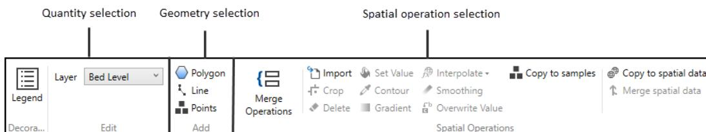

Figure G.1: Overview of spatial editor functionality in Map ribbon

### G.2 General

#### G.2.1 Overview of spatial editor

The spatial editor functionality can be accessed from the “Spatial Operations” ribbon (Figure G.1). Typically, you first select which data set or quantity (either a point cloud or a coverage) to work on (e.g. bed level, roughness, viscosity, initial conditions, sediment availability), then a geometry (e.g. point, line, polygon) and finally which spatial operation to perform (e.g. crop, delete, set value, contour, interpolate, smoothing). Typical workflows are as follows:

Working on a point cloud dataset:

1. 1 Import the dataset as point cloud (section G.2.2)
2. 2 Activate/select the dataset (quantity) in the spatial editor (Appendix G.3)
3. 3 Select a geometry to perform an operation on (Appendix G.4)
4. 4 Select the spatial operation for this geometry (Appendix G.5)
5. 5 Repeat steps 3 and 4 until you are satisfied with the data
6. 6 Export the dataset (section G.6.7)

Working on a coverage (e.g. model input):

1. 1 Activate/select the spatial quantity to work on in the spatial editor (Appendix G.3)
2. 2 Optional: import a dataset as point cloud (section G.5.1)
3. 3 Select a geometry to perform an operation on (Appendix G.4)
4. 4 Select the spatial operation for this geometry (Appendix G.5)
5. 5 Repeat steps 3 and 4 until you are satisfied with the data
6. 6 Interpolate the point cloud to the grid or network (section G.5.10)
7. 7 Optional: export the dataset (section G.6.7)

Upon performing a spatial operation, the ‘Operations’ panel will open (see Figure G.53) with the operations stack. This stack keeps track of the workflow of spatial operations that you performed. This helps you to make transparent how you arrived at your ‘final’ dataset without having to save all the intermediate datasets (steps) separately. Moreover, the stack is reproducible and easily editable without having to start all over again. When working on a coverage (e.g. the second workflow), point clouds can be used to construct the coverage. In this case the coverage (for example ‘Bed level’) is the ‘trunk’ of the workflow and the point clouds (appearing as sets in the stack) are ‘branches’ or subsets of this trunk

(see Figure G.53). By selecting the set or coverage in the 'Operations' panel you determine on which dataset you are working. The interpolate operation (section G.5.10) allows you to bring data from the point cloud (branch) to the coverage (trunk). For more information on the stack you are referred to section Appendix G.6.

## G.2.2 Import/export dataset

To import a (point cloud) dataset use the context menu on "project" in the "Project Tree", select "import" from the context menu and select the option "Points from XYZ-file" (Figure G.2). There is yet another method to import the point cloud. Click on "Import" icon under the Home ribbon to obtain a drop-down menu with the list of importers. Select the option "Points from XYZ-file" under Spatial data section (Figure G.3) to launch the import wizard.

After the import, the point cloud will be added to the project tree. To activate the point cloud in the spatial editor, either double click the dataset in the project tree (Figure G.4) or select it from the drop down box in the spatial editor ribbon (Figure G.5).

**Note:** Exporter still to be implemented


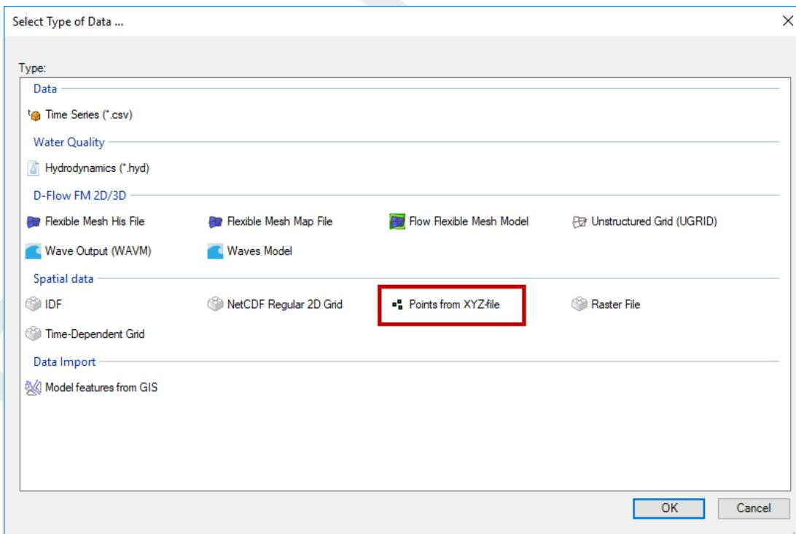

**Figure G.2:** Importing a point cloud into the project using the context menu on "project" in the project tree

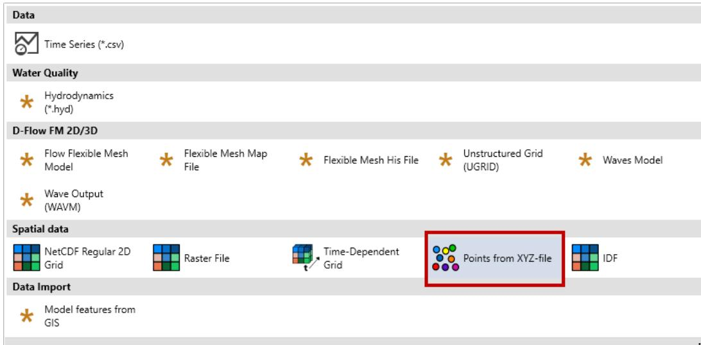

**Figure G.3:** Importing a point cloud into the project using the "Import" drop-down menu in the Spatial Operations ribbon


**Figure G.4:** Activate the imported point cloud in the spatial editor by double clicking it in the project tree

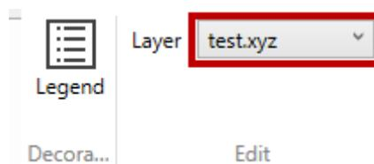

**Figure G.5:** Activate the imported point cloud in the spatial editor by selecting it from the dropdown box in the Map ribbon

### G.2.3 Activate (spatial) model quantity

Similar to activating an imported dataset in the spatial editor, you can also activate a (spatial) model quantity (e.g. bed level, initial conditions, roughness, viscosity) in the spatial editor by double clicking the quantity in the project tree or selecting it from the dropdown box in the "Spatial Operations" ribbon.

## G.2.4 Colorscale

In the spatial editor the colorscale for a spatial quantity can be made visible in the map window by clicking on the "Legend" button in the "Spatial Operations" ribbon (Figure G.6). Then, in the Map window a colorscale is activated (Figure G.7). You can (de-)activate the color scale by clicking on the "Legend" button again. By default the colorscale is ranging from the minimum to the maximum value of the active dataset.

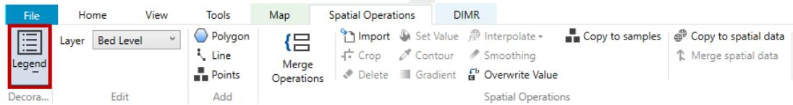

Figure G.6: Legend button in Map ribbon

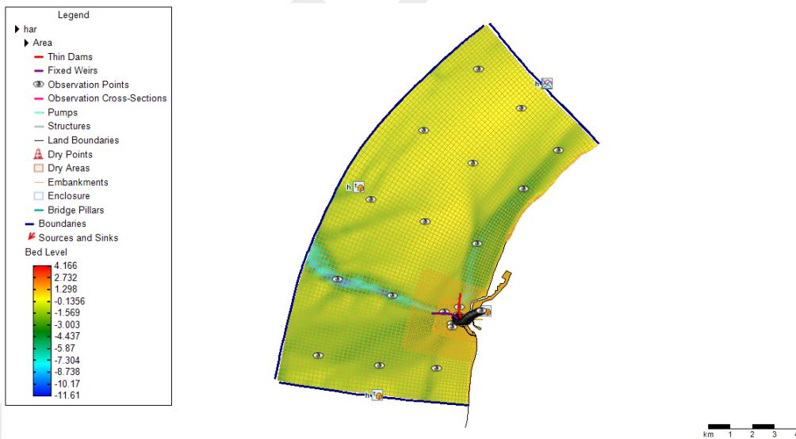

Figure G.7: Activate the colorscale by using the Legend in the map ribbon and the colorscale will become visible in the map window.

You can adjust the colormap and classes of the colorscale using the context menu on the spatial quantity in the "Map tree" and selecting "Legend Properties" (Figure G.8 left panel). A layer properties editor will open in which you can set the colormap to your own preferences (Figure G.8 right panel).

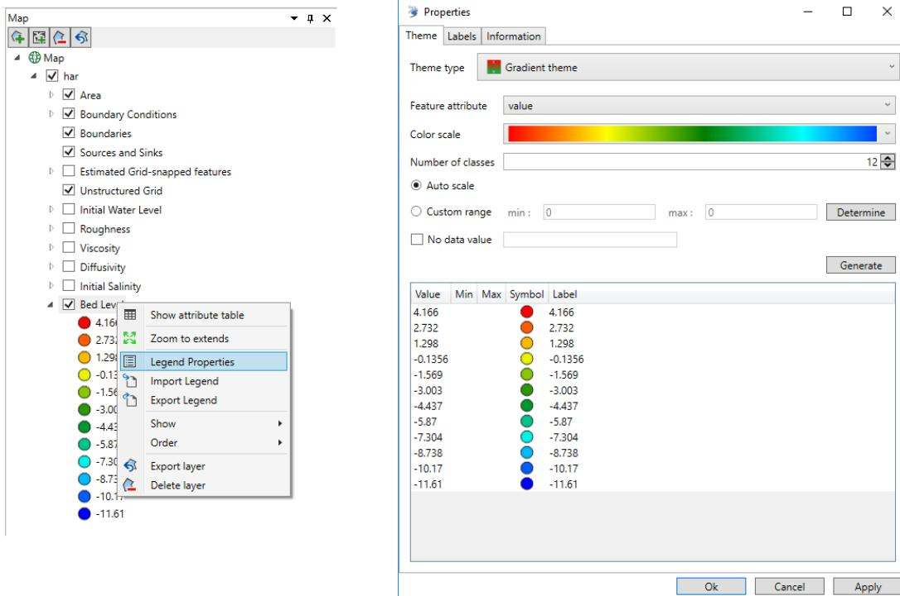

**Figure G.8:** Edit the colorscale properties using the context menu on the active layer in the Map Tree

## G.2.5 Render mode

By default point clouds are rendered as (colored) points and coverages as shades (e.g. 'FillSmooth'). The render mode can be edited using the properties of the active layer Figure G.9. The User Interface offers the following render modes:

- ◇ Points
- ◇ Lines (only for coverages)
- ◇ Shades or 'FillSmooth' (only for coverages)
- ◇ Colored numbers
- ◇ Mono colored numbers

An example of a coverage rendered as colored numbers is given in Figure G.10.

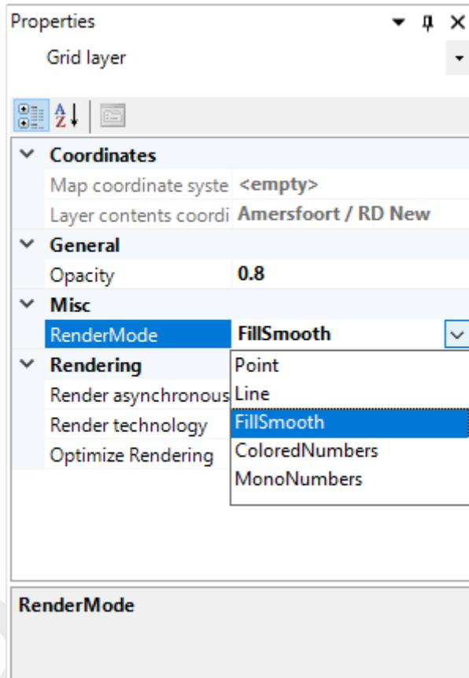

Figure G.9: Select the rendermode for the active layer in the property grid.

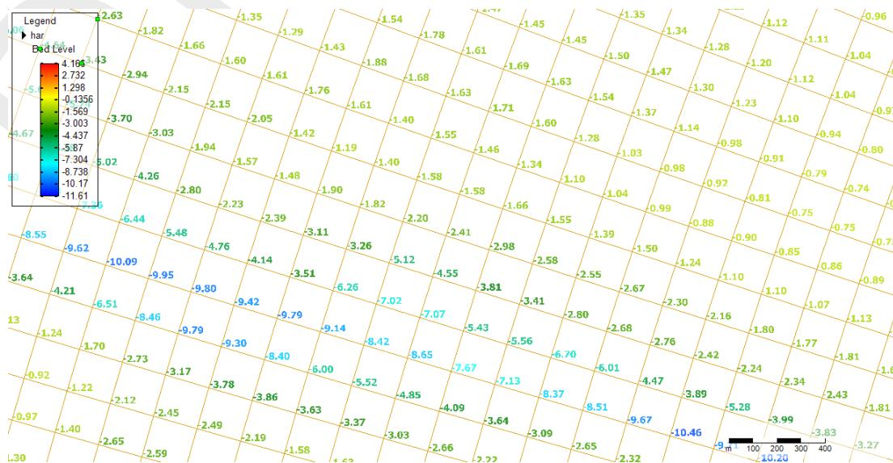

Figure G.10: Example of a coverage rendered as colored numbers.

## G.2.6 Context menu

In addition to the selection of spatial operation from the ‘Spatial Operations’ ribbon (see Appendix G.5), you can also select spatial operations using the context menu (e.g. context menu). After drawing a geometry and clicking the context menu all spatial operation available for the geometry will pop-up (see Figure G.11). The spatial operation will become active upon selecting it from the context menu.

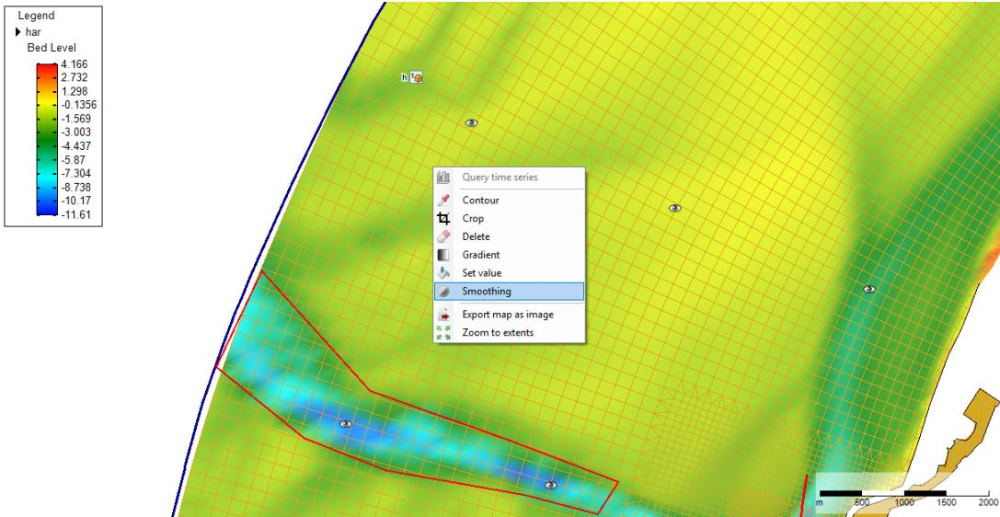

**Figure G.11:** Selecting a smoothing operation for a polygon geometry from the context menu (using context menu)

### G.3 Quantity selection

A spatial quantity can be activated/selected either by double clicking it in the project tree (Figure G.12) or by selecting it from the dropdown box in the “Spatial Operations” ribbon (Figure G.13). Upon selecting the spatial quantity it will be shown as a point cloud (for a dataset) or coverage (for model input) on the central map. Typically, you start from a point cloud (either obtained from import or by generating samples yourself) which will eventually be interpolated to a grid or network (e.g. coverage). The spatial editor will keep track of both the changes made to the point cloud(s) and coverage of the selected spatial quantity. The information will be saved in the User Interface project and available the next time you open the project. **Note:** The operations are not yet saved in a human-readable/editable file


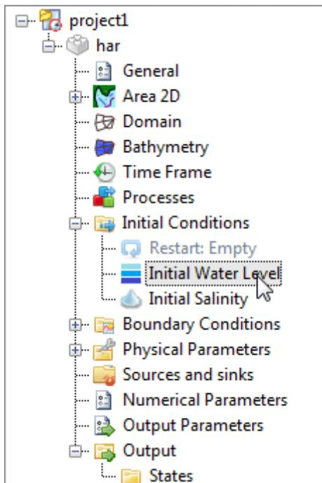

**Figure G.12:** Activating a spatial quantity by double clicking it in the project tree (in this example ‘Initial Water Level’)

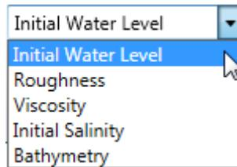

**Figure G.13:** Activating a spatial quantity by selecting it from the dropdown box in the ‘Spatial Operations’ ribbon

#### G.4 Geometry operations

The spatial editor supports three types of geometry operations: (1) polygons, (2) lines and (3) points (see also Figure G.14). The following sub-sections subsequently describe how these geometries can be selected and edited. If you do not select any of these three geometry operations, the spatial operation automatically applies to all the data.

**Note:** Please note that the drawn geometries are not yet persistent, implying that the geometries once drawn cannot be edited yet. Upon pressing the “Esc” button while in editing mode all drawn geometries will disappear.


**Figure G.14:** Overview of the available geometry operations in the ‘Spatial Operations’ ribbon

#### G.4.1 Polygons

Upon selecting “Polygon” from the “Map” ribbon you can draw one or multiple polygons (Figure G.15). Each polygon point is defined by a single click with the LMB. The polygon is closed by double clicking the LMB. After drawing the (first) polygon, the available spatial operations for polygons are enabled in the “Spatial Operations” ribbon. The following spatial operations are available for polygons:

- ◇ Crop (section G.5.2)
- ◇ Delete (section G.5.3)
- ◇ Set Value (section G.5.4)
- ◇ Contour (section G.5.5)
- ◇ Gradient (section G.5.9)
- ◇ Smoothing (section G.5.11)
- ◇ Interpolate - only in case samples and a grid/network are available (section G.5.10)
- ◇ Copy to samples (section G.5.6)
- ◇ Copy to spatial data (section G.5.7) - only for grid coverages

The selected spatial operation applies to all the drawn polygons.

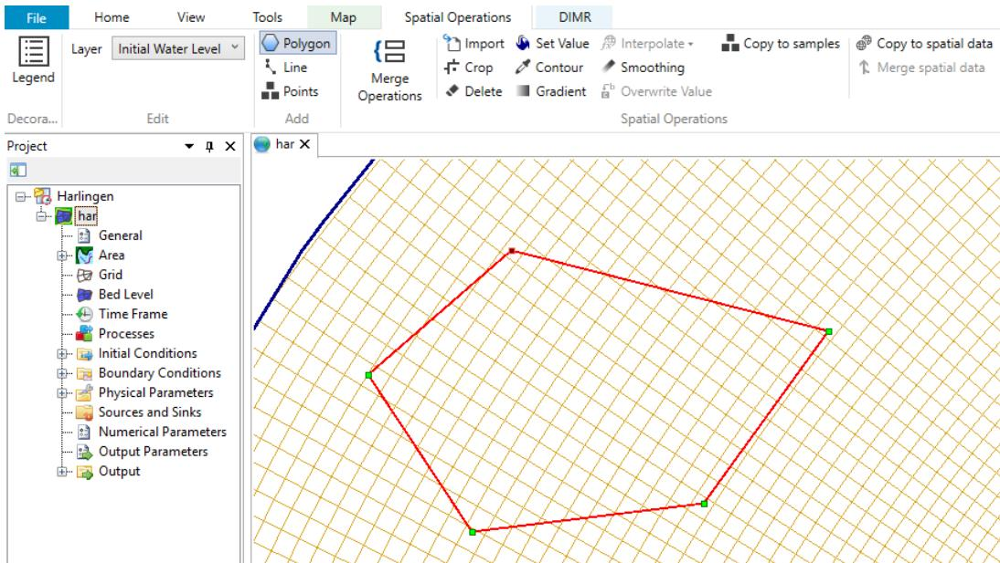

Figure G.15: Activating the polygon operation and drawing polygons in the central map.

## G.4.2 Lines

Upon selecting “Line” from the “Map” ribbon you can draw one or multiple lines (Figure G.16). Each line point is defined by a single click with the LMB. The line is completed by double clicking the LMB. After drawing the (first) line, the available spatial operations for lines are enabled in the “Map” ribbon. The following spatial operations are available for lines:

- ◇ Contour (section G.5.5)
- ◇ Copy to samples (section G.5.6)
- ◇ Copy to spatial data (section G.5.7) - only for grid coverages

The selected spatial operation applies to all the drawn lines.

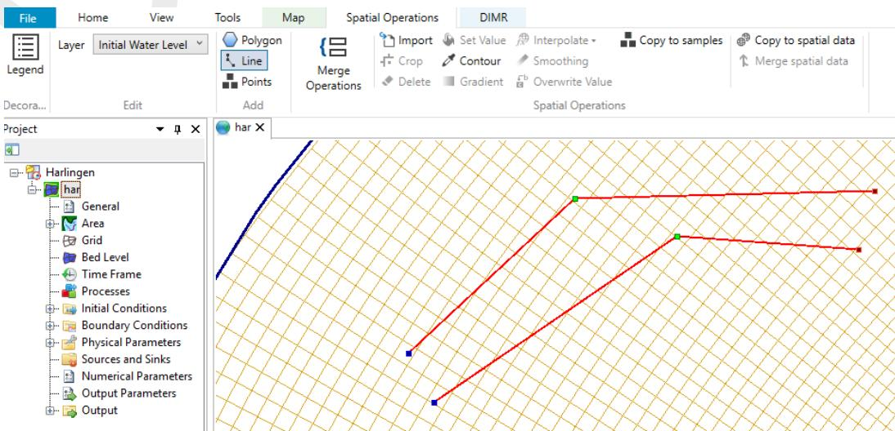

Figure G.16: Activating the line operation and drawing lines in the central map.

### G.4.3 Points

Upon selecting “Add points” from the “Map” ribbon you can draw one or multiple points and assign a uniform value to them (Figure G.17). Each point is defined by a single click with the LMB. The group of points is completed by double clicking the LMB. Upon double clicking a popup appears in which you can assign a value to the points.

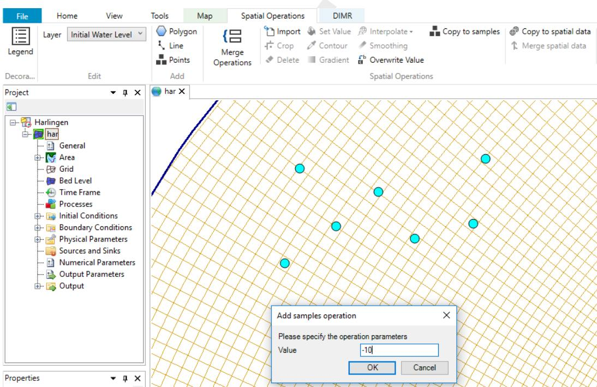

**Figure G.17:** Activating the ‘Add points’ operation, drawing them in the central map and assigning a value to them.

### G.5 Spatial operations

The spatial editor supports the following spatial operations (see also Figure G.18):

- ◇ Import (section G.5.1) - only for point clouds
- ◇ Crop (section G.5.2)
- ◇ Delete (section G.5.3)
- ◇ Set Value (section G.5.4)
- ◇ Contour (section G.5.5) - only for point clouds
- ◇ Gradient (section G.5.9)
- ◇ Interpolate (section G.5.10) - only for point clouds
- ◇ Smoothing (section G.5.11)
- ◇ Change single value (section G.5.12) - only for grid coverages
- ◇ Merge spatial data (section G.5.8) - only for grid coverages
- ◇ Copy to samples (section G.5.6) - only for grid coverages
- ◇ Copy to spatial data (section G.5.7) - only for grid coverages


**Figure G.18:** Overview of the available spatial operations in the ‘Spatial Operations’ ribbon

The sections below provide a description of each operation.

### G.5.1 Import point cloud

With the import operation you can import a point cloud for the selected spatial quantity. For this operation no geometry is required. The import operation is activated from the 'Spatial Operations' ribbon (Figure G.19). Upon importing a point cloud you are asked whether a coordinate transformation should be applied to the imported dataset (Figure G.20). By default it will be assumed that the imported data is in the same coordinate system as the model. If not, you can indicate from which to which coordinate system the data should be transformed. After import the point cloud is added to the operations stack (Figure G.21). The difference between this importer and importing a point cloud on the project level in the project tree (section G.2.2) is that for this importer the point cloud is directly assigned to the selected spatial quantity (e.g. model input) instead of being treated as a separate dataset.

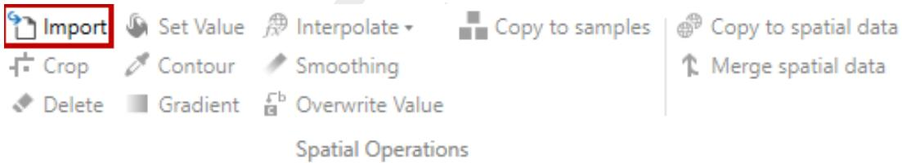

**Figure G.19:** Importing a point cloud using the 'Import' operation from the 'Spatial Operations' ribbon

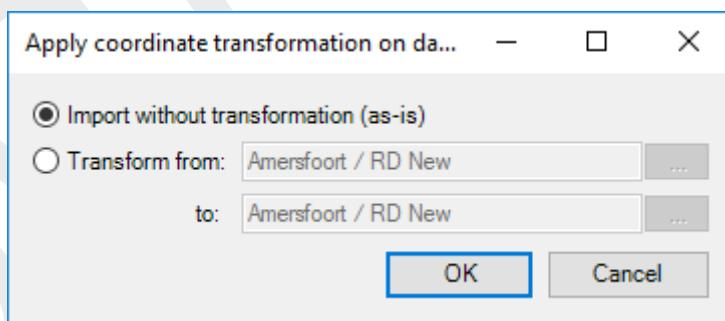

**Figure G.20:** Option to perform a coordinate transformation on the imported point cloud

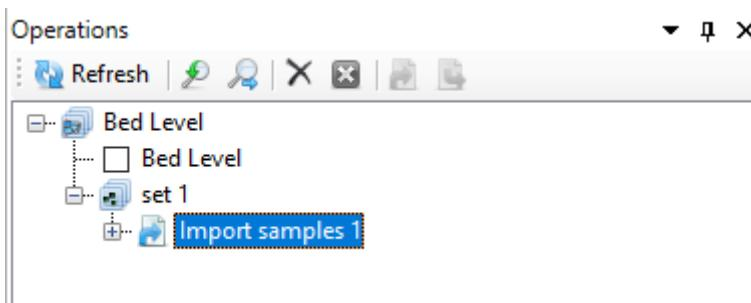

**Figure G.21:** Appearance of import point cloud operation in the operations stack

### G.5.2 Crop

The crop operation crops a point cloud or coverage (depending on which one is active). The crop operation is activated from the 'Spatial Operations' ribbon and only available for polygon geometries. You can control which part of the data should be deleted by using polygons. If you provide a polygon outside the point cloud or coverage, all data will be deleted. For an example see Figure G.22.

After cropping (part of) the point cloud of coverage the operation is added to the operations stack (Figure G.23).

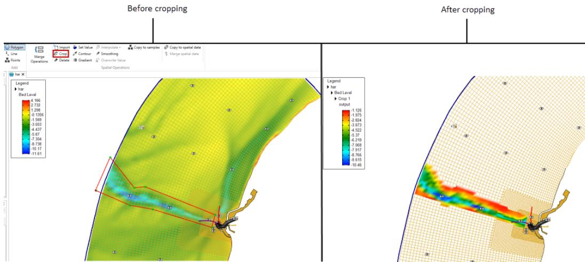

**Figure G.22:** Performing a crop operation on a point cloud with a polygon using 'Crop' from the 'Spatial Operations' ribbon

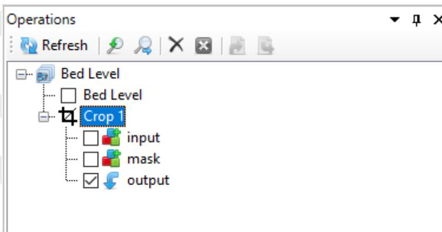

**Figure G.23:** Appearance of crop operation in the operations stack

### G.5.3 Delete

The delete operation deletes (part of) a point cloud or coverage (depending on which one is active). The delete operation is activated from the 'Spatial Operations' ribbon. You can control which part of the data should be deleted by using polygons. If no polygons are provided, the total dataset will be deleted. For an example see Figure G.24. After erasing (part of) the point cloud or coverage the operation is added to the operations stack (Figure G.25).

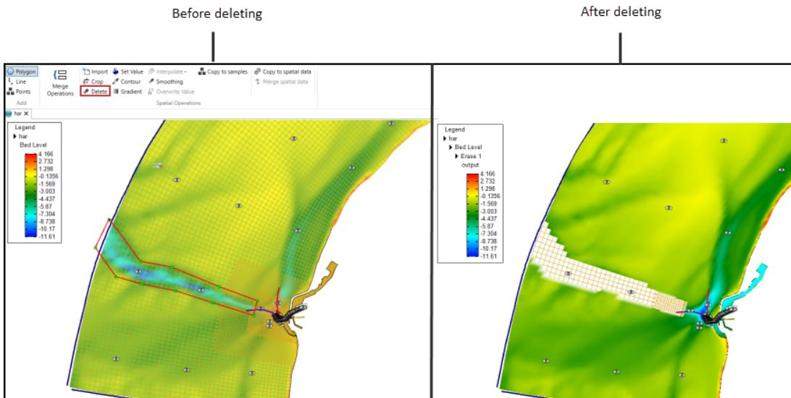

Figure G.24: Performing an delete operation on a point cloud with a polygon using 'Delete' from the 'Spatial Operations' ribbon

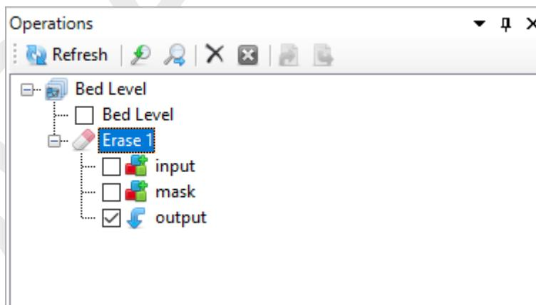

Figure G.25: Appearance of delete operation in the operations stack

#### G.5.4 Set value

The set value operation assigns a value to a point cloud or coverage (depending on which one is active). The set value operation is activated from the 'Spatial Operations' ribbon and only available for polygon geometries or for the total data set if no polygon is provided. By assigning a value, the user can choose from the following operations:

- ◇ **Overwrite** : overwrites all existing points within the polygon (excluding no data values) with the uniform value
- ◇ **Overwrite where missing (only for coverages)** : overwrites all missing values within the polygon with the uniform value
- ◇ **Add** : Adds the uniform value to all existing points within the polygon (excluding no data values)
- ◇ **Subtract** : Subtracts the uniform value from all existing points within the polygon (excluding no data values)
- ◇ **Multiply** : Multiplies all existing points within the polygon (excluding no data values) with the uniform value
- ◇ **Divide** : Divides all existing points within the polygon (excluding no data values) by the uniform value
- ◇ **Maximum** : Sets all existing points within the polygon (excluding no data values) to the maximum of its current value and the uniform value

- ❖ **Minimum** : Sets all existing points within the polygon (excluding no data values) to the minimum of its current value and the uniform value

For an example see Figure G.26. After performing a set value operation to (part of) the point cloud or coverage the operation is added to the operations stack (Figure G.27).

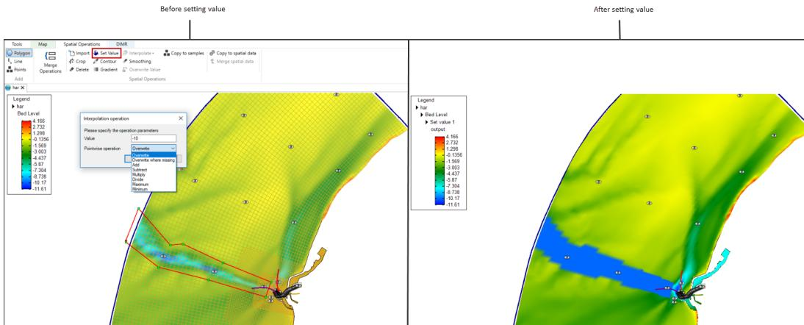

Figure G.26: Performing a set value operation (e.g. overwrite) on a point cloud with a polygon using 'Set Value' from the 'Spatial Operations' ribbon

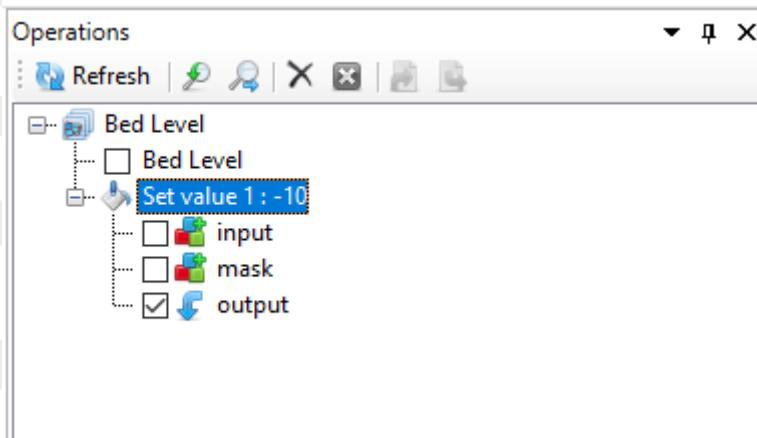

Figure G.27: Appearance of set value operation in the operations stack

## G.5.5 Contour

The contour operation creates a point cloud with a uniform value along a line or polygon (depending on which one is active). The contour operation is activated from the 'Spatial Operations' ribbon. After drawing the lines or polygons you have to assign the uniform value (argument) and the sampling interval in m. This spatial operation can be useful to digitalize information from nautical charts for example. In this case you first have to import the nautical chart as a geotiff (Figure G.28), set the right map coordinate system (Figure G.29) and then use the contour operation Figure G.30. Sometimes the samples are created behind the geotiff. Then you can use the context menu on the samples layer in the Map tree to bring the samples to the front (Figure G.31). After applying the contour operation it is added to the stack (Figure G.32).

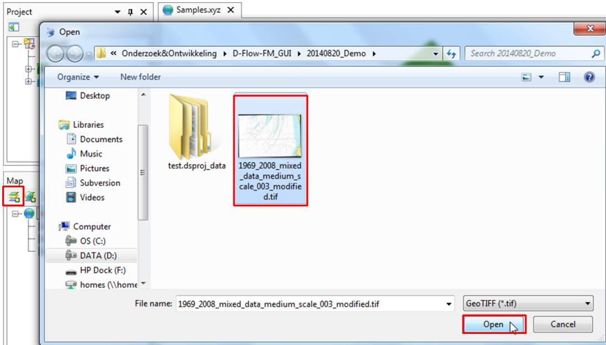

Figure G.28: Import a nautical chart as a georeferenced tiff file

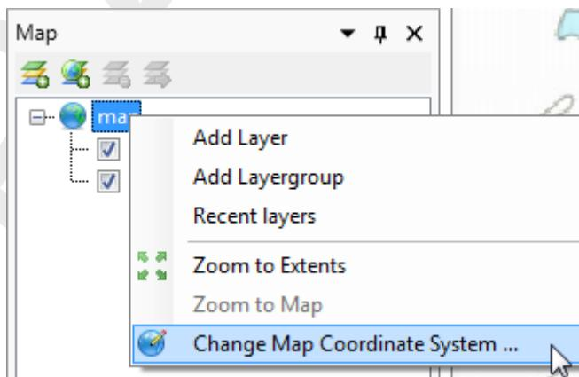

Figure G.29: Set the right map coordinate system for the geotiff

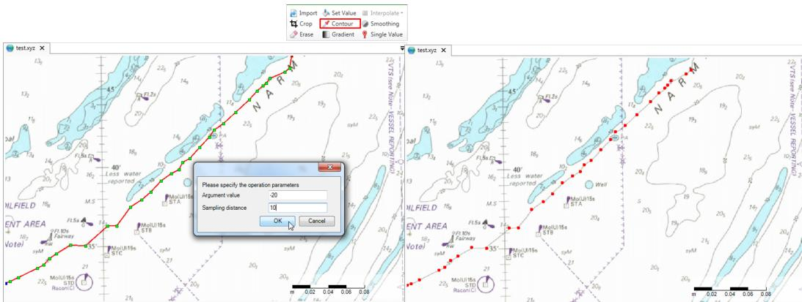

Figure G.30: Performing a contour operation on a nautical chart using lines to define the contours and 'Contour' from the 'Spatial Operations' ribbon

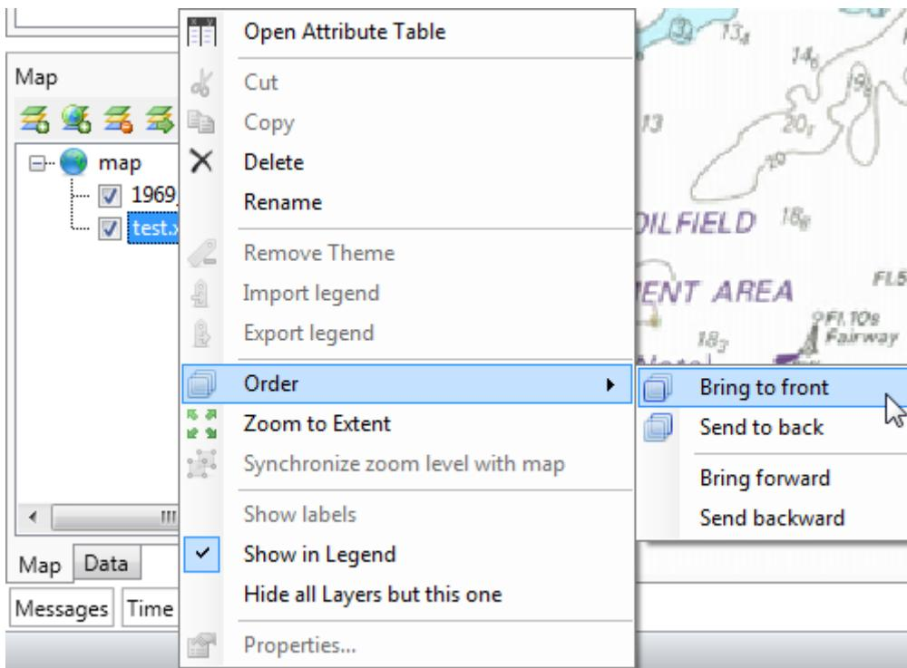

Figure G.31: Bring the sample set to the front if it appears behind the nautical chart

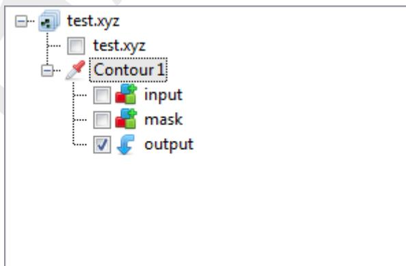

Figure G.32: Appearance of contour operation in the operations stack

### G.5.6 Copy to samples

This operation converts the currently selected grid coverage to a sample set, which becomes that starting point of a new subset. If polygons have been drawn, the operation will confine the copy to the interiors. The operation will not convert missing values to samples. Note that the operation does keep a reference to the original copied grid coverage; if it is changes by a re-evaluation of the stack, the changes will affect the output point cloud.

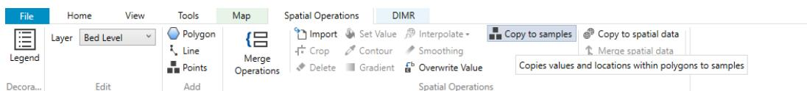

Figure G.33: Applying the copy to samples operation

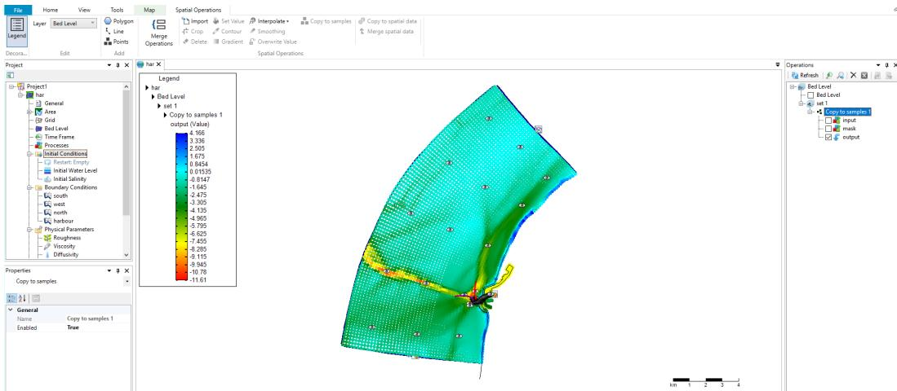

Figure G.34: Copy to samples operation result

### G.5.7 Copy to spatial data

This operation simply clones the grid coverage, starting a new subset with a snapshot of the currently selected operation output. Similarly to G.5.6, it keeps a reference to the input data and will perform the clone again upon re-evaluation.

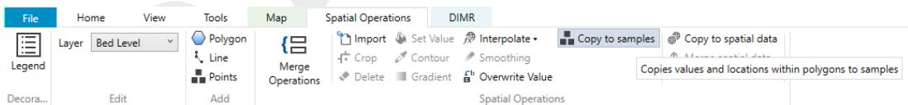

Figure G.35: Applying the copy spatial data operation

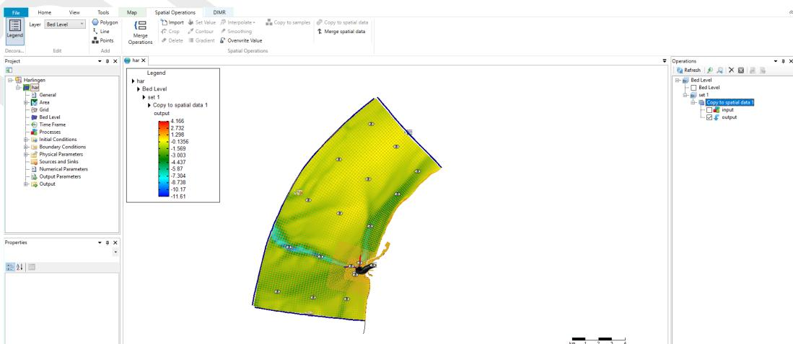

Figure G.36: Copy spatial data operation result

### G.5.8 Merge spatial data

Whenever a subset contains a grid coverage as its editing data (after applying e.g. G.5.7) on the same grid as the main operation set, its result can be combined with the main set by applying this operation, similarly to the interpolation operation for sample sets, discussed below. Combining the grid coverages can be achieved with the usual point-wise methods.

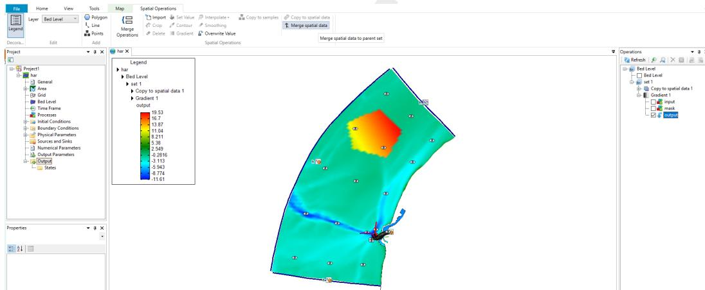

Figure G.37: Activating the merge spatial data tool from the ribbon

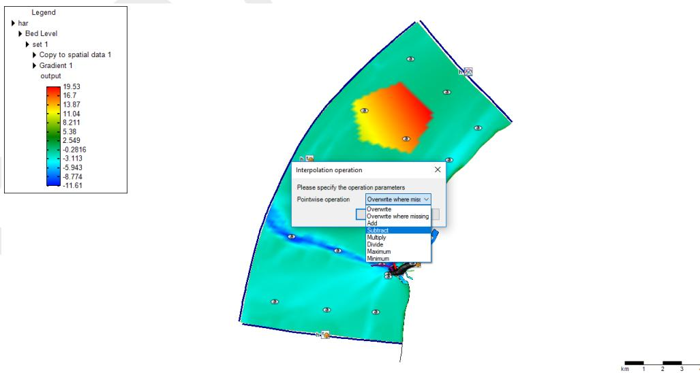

Figure G.38: The merge operation requests a pointwise combination method

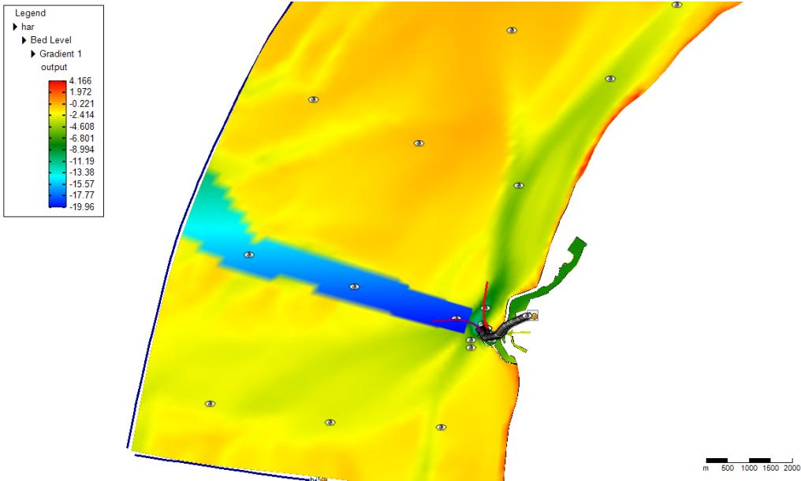

Figure G.39: Resulting grid coverage

### G.5.9 Gradient

The gradient operation applies a gradient to a point cloud or grid coverage (depending on which one is active). The gradient operation is activated from the ‘Spatial Operations’ ribbon and only available for polygon geometries or for the total data set if no polygon is provided. You have to assign the initial (start) value, the final (end) value and the going to angle (according to the Cartesian convention with 0 degrees is East, 90 degrees is North, etc **Note:** This is not working properly yet). For an example see Figure G.40. After applying a gradient to (part of) the point cloud or coverage the operation is added to the operations stack (Figure G.41).


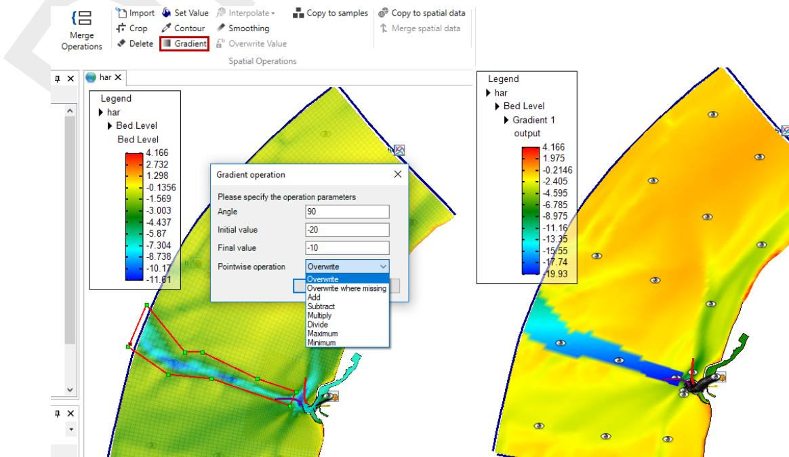

Figure G.40: Performing a gradient operation on a point cloud with a polygon using ‘Gradient’ from the ‘Spatial Operations’ ribbon

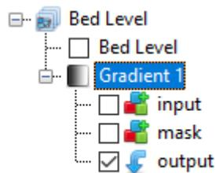

Figure G.41: Appearance of gradient operation in the operations stack

### G.5.10 Interpolate

The interpolate operation is the way to get sample set(s) to a grid or network (e.g. coverage). In the operation stack this means that we are actively switching from working on a point cloud (helping to construct the coverage) to working on the selected coverage (or spatial quantity). The interpolation is performed on the data within a polygon or polygons (if provided) or all the data (if no polygons are provided). The interpolate operation can be performed on a single (selected) sample set or on multiple sample sets. Both methods are discussed below. The methods for interpolation are either

- ◇ Triangulation: performs a Delauney triangulation on the sample point set before projecting onto the grid.
- ◇ Averaging: combines sample points within a possible enlarged cell according to an algorithm of choice. The user can set the search cell expansion factor (rel. search cell size) and a threshold for the number of sample points within a cell (minimum sample points), see Figure G.42.

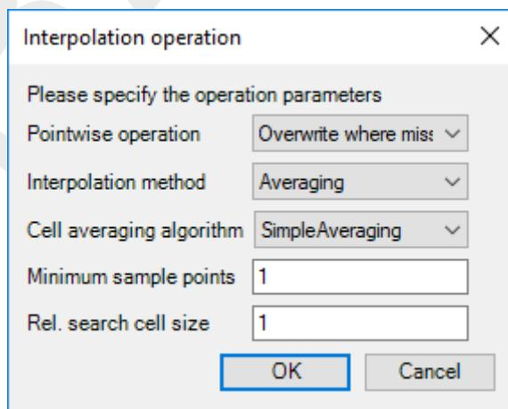

Figure G.42: Interpolation Operation options

Seven Cell averaging algorithms can be chosen by the user; see Figure G.43. These algorithms are explained below:

- ◇ SimpleAveraging: the arithmetic mean<sup>1</sup> of the samples inside the search area is taken.
- ◇ ClosestPoint: the value of the closest sample inside the search area is taken.
- ◇ MaximumValue: the maximum value of the samples inside the search area is taken.
- ◇ MinimumValue: the minimum value of the samples inside the search area is taken.
- ◇ InverseWeightedDistance: the inverse-distance-weighted mean<sup>2</sup> of the samples inside the search area is taken. Contrary to the arithmetic mean, in which all samples contribute equally to the mean,

<sup>1</sup>The arithmetic mean is given by:  

$$u(\mathbf{x}) = \frac{1}{N} \sum_{k=1}^N u_k$$

<sup>2</sup>The inverse-distance-weighted mean is given by:

when using the inverse-distance-weighted average, the samples close to the query point have a larger contribution to the mean.

- ◇ MinAbs: the minimum of the absolute values of the samples inside the search area is taken.
- ◇ KdTree: This is an obsolete option, which will be removed in a future release.

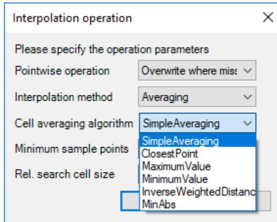

Figure G.43: Averaging options

By default, the interpolation will only overwrite missing values in the gridded data set. However, if the grid coverage already contains values, the user may choose to overwrite or combine the data by a pointwise arithmetic operation.

### Interpolate single (selected) set

To perform interpolation on a single sample set, select the sample set (i.e. 'set1') in the operation stack and press 'Interpolate' in the 'Map' ribbon (Figure G.44). Since no polygon is provided in this example, all the samples will be interpolated to the grid. Use polygons if you would like to have more control over the interpolation. After the interpolation the operation is added to the operations stack (Figure G.45). Please note that after performing the interpolation the workflow in the stack is shifting from the sample set (i.e. 'set1' - which was a side step to construct the coverage) to the coverage (i.e. 'bed level').

$$u(\mathbf{x}) = \begin{cases} \sum_{i=1}^N w_i(\mathbf{x})u_i \\ \sum_{i=1}^N w_i(\mathbf{x}) \\ u_i, \end{cases} \quad \text{if } d(\mathbf{x}, \mathbf{x}_i) \neq 0 \text{ for all } i, \\ w_i(\mathbf{x}) = \frac{1}{d(\mathbf{x}, \mathbf{x}_i)} \quad \text{if } d(\mathbf{x}, \mathbf{x}_i) = 0 \text{ for some } i,$$

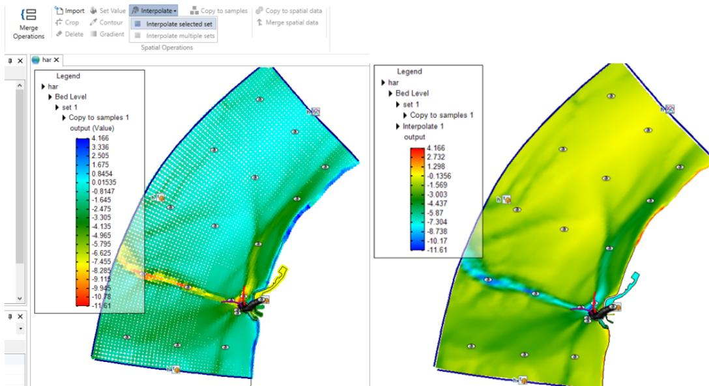

**Figure G.44:** Performing an interpolation operation on a single sample set (without using a polygon) using 'Interpolate' from the 'Spatial Operations' ribbon

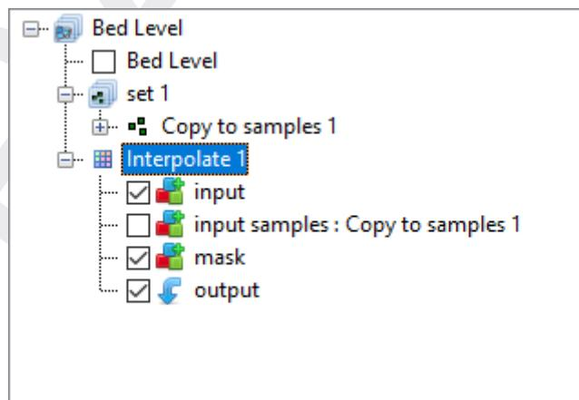

**Figure G.45:** Appearance of interpolation of 'set1' to the coverage 'bed level' in the operations stack

### Interpolate multiple sets

To perform interpolation on multiple sample sets, select the active coverage (i.e. 'bed level') in the operation stack and press 'Interpolate' in the 'Map' ribbon (Figure G.46). In the popup you can select which sample sets to include in the interpolation (in this example both). Since no polygon is provided, all the samples (from the two sets) will be interpolated to the grid. Use polygons if you would like to have more control over the interpolation. After the interpolation the operation is added to the operations stack (Figure G.47). Again note that after performing the interpolation the workflow in the stack is shifting from the sample set (which was a side path to construct the coverage) to the coverage (i.e. bed level).

**Note:** Please note that interpolation of multiple sample sets can also be achieved by importing/combining different sample sets into the same set in the stack instead of using two separate sets. In this case you can just interpolate the single (selected) set.


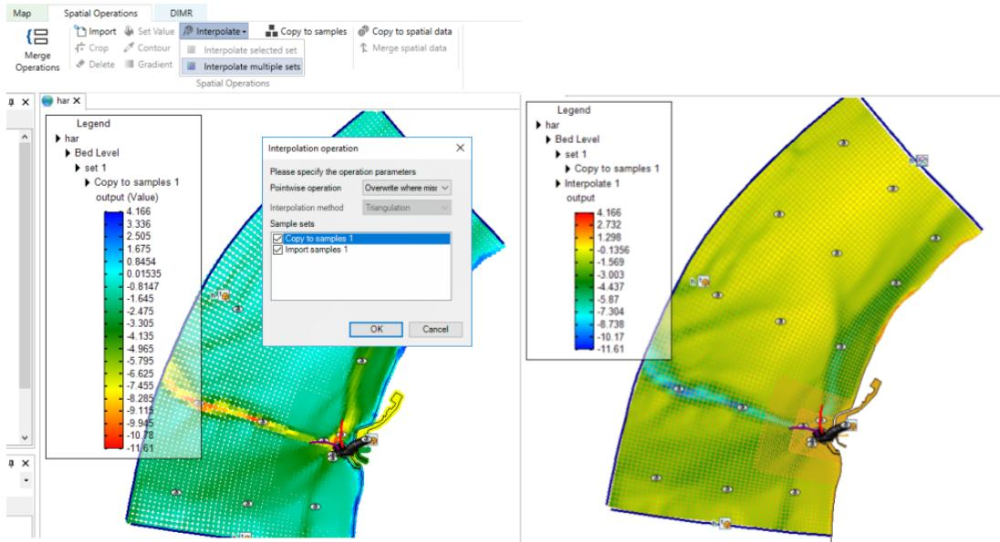

**Figure G.46:** Performing an interpolation operation on multiple sample sets (without using a polygon) using 'Interpolate' from the 'Spatial Operations' ribbon

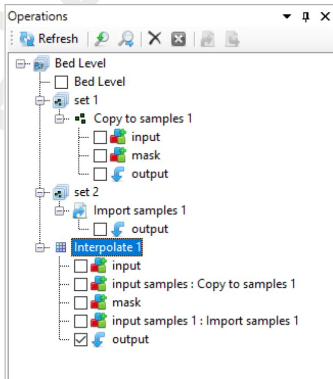

**Figure G.47:** Appearance of interpolation of 'set1' and 'set2' to the coverage 'bed level' in the operations stack

### G.5.11 Smoothing

The smoothing operation smooths out (steep) gradients in a point cloud or coverage (depending on which one is active). The smoothing operation is activated from the 'Spatial Operations' ribbon and only available for polygon geometries or for the total data set if no polygon is provided. You have to assign the smoothing exponent and number of smoothing steps. The higher the exponent and the number of smoothing steps, the heavier the smoothing. For an example see Figure G.48. After

applying smoothing to (part of) the point cloud or coverage the operation is added to the operations stack (Figure G.49).

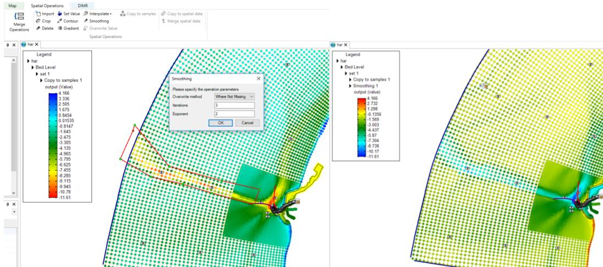

**Figure G.48:** Performing a smoothing operation on a point cloud with a polygon using 'Smoothing' from the 'Spatial Operations' ribbon

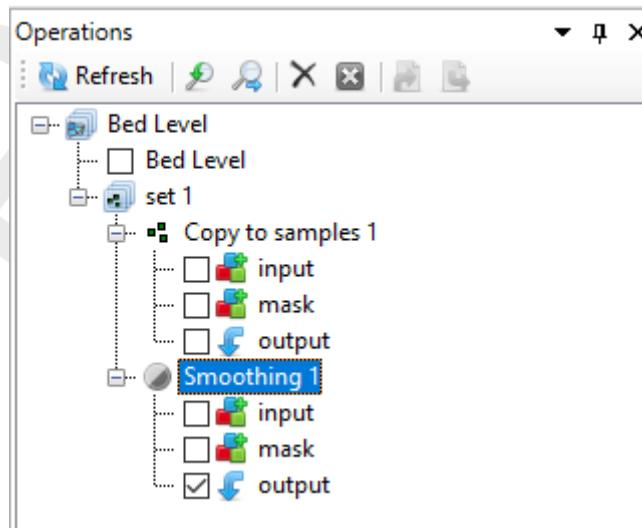

**Figure G.49:** Appearance of smoothing operation in the operations stack

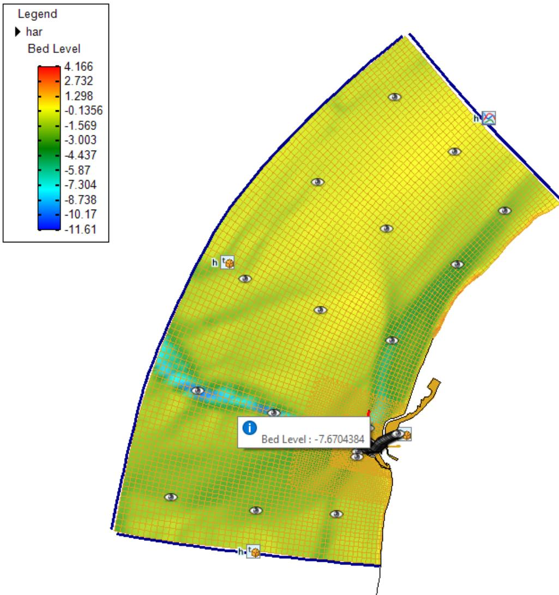

**Figure G.50:** The cursor for the overwrite operation showing the value of the closest coverage point

### G.5.12 Overwrite (single) value

The ‘overwrite (single) value’ operation allows you to edit single values on the active coverage after the interpolation. The ‘overwrite (single) value’ operation is activated from the ‘Spatial Operations’ ribbon. There is no geometry required for this operation. Upon selecting the operation from the ribbon a cursor will become active showing the coverage value closest to the cursor in a tooltipstring (Figure G.50). Upon clicking LMB a popup appears in which you can overwrite the value of this coverage point Figure G.51. After applying the overwrite operation it is added to the operations stack (Figure G.52).

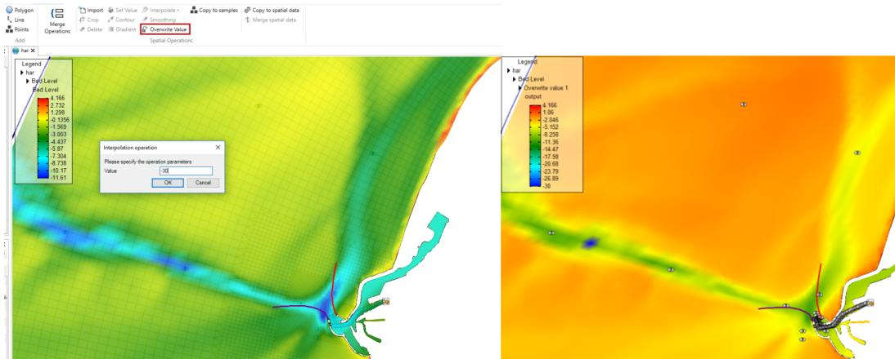

**Figure G.51:** Performing an overwrite operation on a coverage point using 'Single Value' from the 'Spatial Operations' ribbon

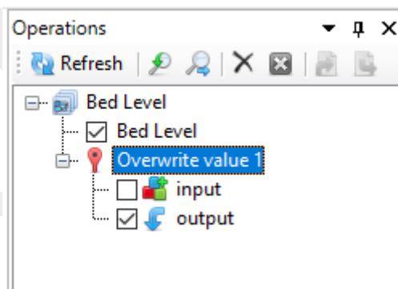

**Figure G.52:** Appearance of overwrite operation in the operations stack

## G.6 Operation stack

The operation stack keeps track of the workflow of spatial operations that you performed. This helps you to make transparent how you arrived at your 'final' dataset without having to save all the intermediate datasets (steps) separately. Moreover, the stack is reproducible and easily editable without having to start all over again. This section describes the stack workflow (section G.6.1), how to edit operation properties (section G.6.2), how to enable/disable (section G.6.3), delete (section G.6.4), refresh(section G.6.5) operations, quick links (section G.6.6) and import/export functionality (section G.6.7).

**Note:** Currently, the stack is saved in the User Interface project upon saving the project. The next time you open the project, the stack will reappear. The stack is not (yet) saved in a human readable/editable file.


## G.6.1 Stack workflow

Upon performing a spatial operation, the 'Operations' panel will open (see Figure G.53) with the operations stack (tree). The stack first shows on which point cloud or coverage you are working (in this example 'bed level'). Subsequently, all the operations on this dataset are listed. For each operation you can inspect what the input, mask (e.g. the geometry used for the operation) and output are for the operation (Figure G.54). By default the stack continues from the last operation that you performed. If you wish to work on a different dataset or operation within a dataset, you have to select that dataset or operation in the 'Operations' panel with the LMB.

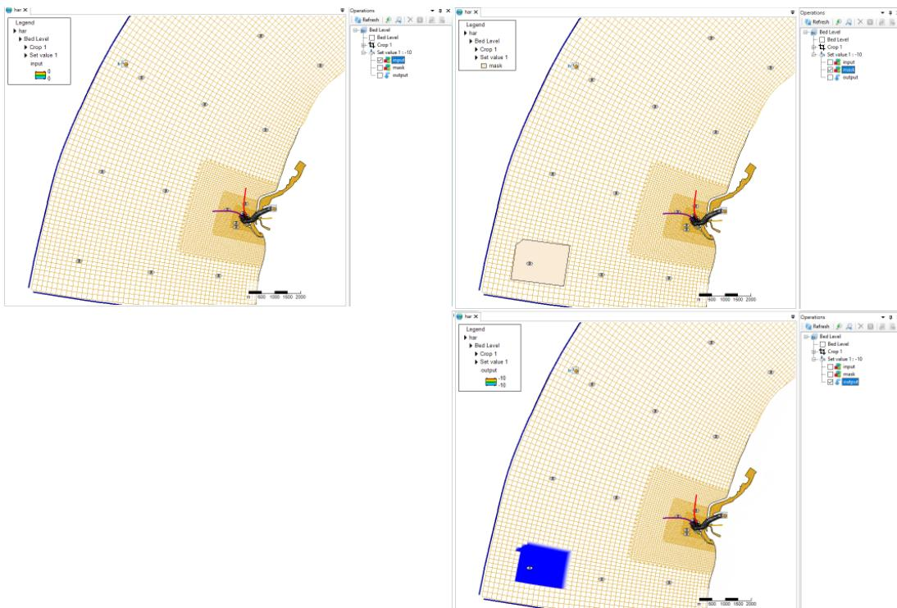

**Figure G.54:** Input for the operation (top panel), mask for the operation (middle panel) and output of the operation (bottom panel)

case the stack jumps from the ‘trunk’ to a ‘branch’ and the subsequent operations are performed on the point cloud (see Figure G.53). By selecting the set or coverage in the ‘Operations’ panel you determine on which dataset you are working. The interpolate operation (section G.5.10) allows you to bring data from the point cloud (branch) to the coverage (trunk). See also Figure G.53.

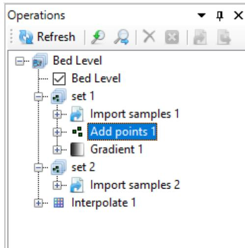

**Figure G.53:** The ‘Operations’ panel with the operations stack. In this example ‘bed level’ is the coverage (e.g. trunk) that is edited. The point clouds ‘set 1’ and ‘set 2’ (e.g. branches) are used to construct the ‘bed level’ coverage.

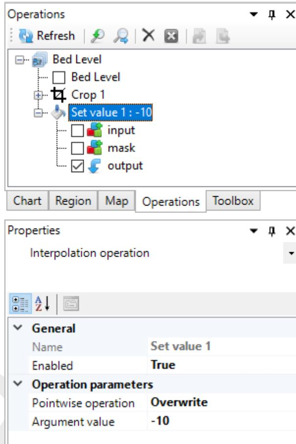

Figure G.55: Editing the value or 'Pointwise operation' of a 'Set Value' operation using the properties panel

### G.6.2 Edit operation properties

For each operation that you performed the properties (such as the value or 'Pointwise operation' of a 'Set Value' operation) can be edited using the 'Properties' window (Figure G.55). **Note:** Please note that the mask of an operation cannot (yet) be edited. By editing the operation properties the operation stack becomes 'out of sync' and has to be refreshed for the changes to become active (see section G.6.5).


### G.6.3 Enable/disable operations

You can (temporarily) enable/disable operations by selecting the operation and pressing boxed cross icon in the stack menu (Figure G.56). Upon disabling an operation the operation will be made grey in the stack and the operation is not taken into account anymore upon evaluation of the overall result. The result of disabling an operation is not directly activated. This is indicated in the stack with the 'out of sync' exlamation mark (Figure G.56). You need to refresh the stack (see section G.6.5) for the changes to become active.

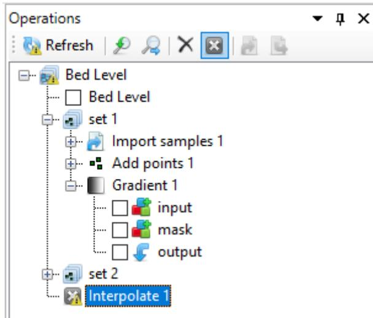

**Figure G.56:** Disabling an operation using the boxed cross icon in the stack menu. The operation will become grey. Note the exlamation marks marking the stack 'out of sync'.

#### G.6.4 Delete operations

To delete an operation permanently you have to select the operation and either press the cross icon (Figure G.57) or use the context menu and select delete (Figure G.58). The operation will be removed from the stack. The result of deleting an operation is not directly activated. This is indicated in the stack with the 'out of sync' exlamation mark. You need to refresh the stack (see section G.6.5) for the changes to become active.

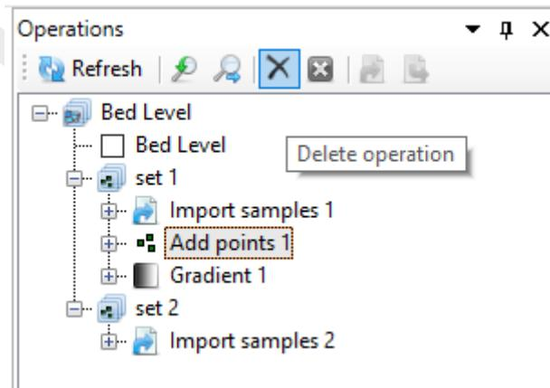

**Figure G.57:** Removing an operation from the stack using the cross icon in the stack menu

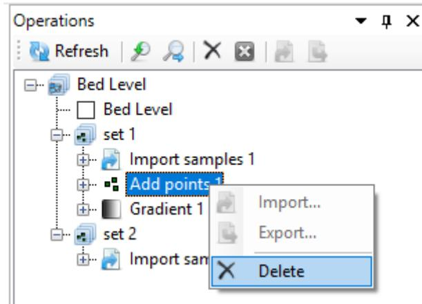

**Figure G.58:** Removing an operation from the stack using the context menu on the selected operation

### G.6.5 Refresh stack

When the stack is marked 'out of sync' by exclamation marks, you can refresh the stack by pressing the 'Refresh' button for the changes to become active (Figure G.59). Upon refreshing the stack all the (enabled) operations in the stack will be (re-)evaluated. **Note:** Please note that refreshing the stack can take some time when large datasets are (re-)evaluated!


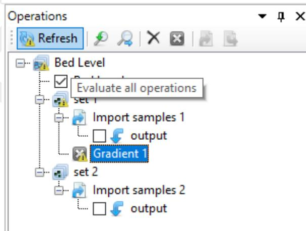

**Figure G.59:** Refresh the stack using the 'Refresh' button so that all operation are (re-)evaluated

### G.6.6 Quick links

The stack menu contains two quick links to quickly show the original dataset (e.g. where you started from, Figure G.60) and the end result of the spatial operations (Figure G.61).

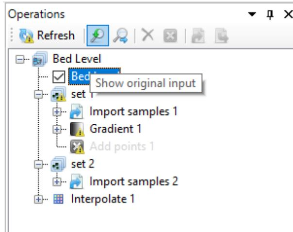

Figure G.60: Quick link to the original dataset before performing any spatial operations

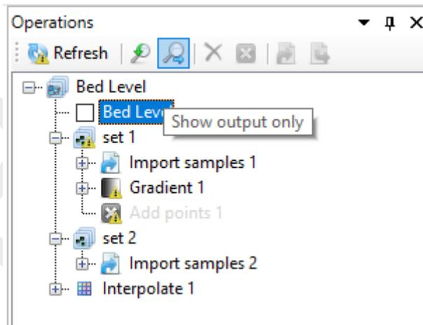

Figure G.61: Quick link to the output after performing all (enabled) operations

### G.6.7 Import/export

**Note:** Importing and exporting data into or from the stack is still under construction


# H Astronomical constituents

## H.1 Introduction

In this Appendix we list the astronomical constituents that you can use when prescribing astronomical boundary conditions for the flow. In total you can select from 235 tidal constituents. See Section 7.4.8.2 for details on how to use them in boundary conditions.

## H.2 List of astronomical constituents

The set of constituents can be divided into the primary constituents, which appear in the equilibrium tide (no land masses; only one deep ocean), and compound constituents. The latter are linear combinations of the primary constituents.

The names and frequencies of all 235 internally available constituents in D-Flow FM are specified below. We remark that 234 of these constituents are also in the Deltares tidal analysis program Delft3D-TIDE. Only component N4 has been added to the predefined list in D-Flow FM and this component isn't present in Delft3D-TIDE. For the primary constituents the relative magnitude in the equilibrium tide is given as well.

If you have only a short time-series for a tidal analysis you can use astronomical coupling between nearby constituents. To this end also the *equilibrium amplitude relation* with their main constituents is given. The *equilibrium phase relation* is equal to zero.

### Remark:

- ◊ If you want to apply astronomical coupling, first try to find the amplitude and phase relations based on a long period analysis of a neighbouring station. Only if such information is not available, you may resort to the equilibrium tide relations.

**Table H.1: Astronomical constituents**

| Constituent name | Angular frequency [degrees/hour] | Amplitude in equilibrium tide [m] | Amplitude coupling relation |
|------------------|----------------------------------|-----------------------------------|-----------------------------|
| SA               | 0.0410686                        | 0.01156                           |                             |
| SSA              | 0.0821373                        | 0.07281                           |                             |
| MSM              | 0.4715211                        | 0.01579                           |                             |
| MM               | 0.5443747                        | 0.08254                           |                             |
| MSF              | 1.0158958                        | 0.01369                           |                             |
| MS0              | 1.0158958                        |                                   |                             |
| MF               | 1.0980331                        | 0.15647                           |                             |
| KO0              | 1.0980331                        |                                   |                             |
| MK0              | 1.0980331                        |                                   |                             |
| SNU              | 1.4874169                        |                                   |                             |
| SN               | 1.5602705                        |                                   |                             |
| MSTM             | 1.5695542                        | 0.00569                           |                             |
| MFM              | 1.6424078                        | 0.02996                           |                             |
| 2SM              | 2.0317916                        |                                   |                             |
| MSQM             | 2.1139289                        | 0.00478                           |                             |
| MQM              | 2.1867825                        | 0.00396                           |                             |
| 2SMN             | 2.5761663                        |                                   |                             |

Table H.1 — continued from previous page

| Constituent name | Angular frequency [degrees/hour] | Amplitude in equilibrium tide [m] | Amplitude coupling relation |
|------------------|----------------------------------|-----------------------------------|-----------------------------|
| 2OK1             | 12.8450025                       |                                   |                             |
| 2Q1              | 12.8542862                       | 0.00955                           | 0.025 × O1                  |
| NJ1              | 12.8542862                       |                                   |                             |
| SIGMA1           | 12.9271398                       | 0.01152                           |                             |
| MUK1             | 12.9271398                       |                                   |                             |
| NUJ1             | 12.9271398                       |                                   |                             |
| Q1               | 13.3986609                       | 0.07343                           | 0.191 × O1                  |
| NK1              | 13.3986609                       |                                   |                             |
| RO1              | 13.4715145                       | 0.01395                           | 0.036 × O1                  |
| NUK1             | 13.4715145                       |                                   |                             |
| O1               | 13.9430356                       | 0.38358                           |                             |
| TAU1             | 14.0251728                       | 0.00504                           |                             |
| MP1              | 14.0251728                       |                                   |                             |
| M1B              | 14.4874103                       | 0.01065                           | 0.350 × M1A                 |
| M1C              | 14.4920521                       |                                   |                             |
| M1A              | 14.4966939                       | 0.02964                           |                             |
| M1               | 14.4966939                       | 0.03150                           | 0.082 × O1                  |
| NO1              | 14.4966939                       |                                   |                             |
| CHI1             | 14.5695476                       | 0.00580                           |                             |
| LP1              | 14.5695476                       |                                   |                             |
| PI1              | 14.9178647                       | 0.01028                           |                             |
| TK1              | 14.9178647                       |                                   |                             |
| P1               | 14.9589314                       | 0.17543                           | 0.328 × K1                  |
| SK1              | 14.9589314                       |                                   |                             |
| S1               | 15.0000000                       | 0.00416                           |                             |
| K1               | 15.0410686                       | 0.53496                           |                             |
| MO1              | 15.0410686                       |                                   |                             |
| SP1              | 15.0410686                       |                                   |                             |
| PSI1             | 15.0821353                       | 0.00109                           |                             |
| RP1              | 15.0821353                       |                                   |                             |
| FI1              | 15.1232059                       | 0.00755                           |                             |
| KP1              | 15.1232059                       |                                   |                             |
| THETA1           | 15.5125897                       | 0.00578                           |                             |
| LABDAO1          | 15.5125897                       |                                   |                             |
| J1               | 15.5854433                       | 0.03022                           | 0.079 × O1                  |
| MQ1              | 15.5854433                       |                                   |                             |
| 2PO1             | 15.9748272                       |                                   |                             |
| SO1              | 16.0569644                       |                                   |                             |
| OO1              | 16.1391017                       | 0.01939                           | 0.051 × O1                  |
| 2KO1             | 16.1391017                       |                                   |                             |

Table H.1 — continued from previous page

| Constituent name | Angular frequency [degrees/hour] | Amplitude in equilibrium tide [m] | Amplitude coupling relation |
|------------------|----------------------------------|-----------------------------------|-----------------------------|
| UPSILON1         | 16.6834764                       | 0.00372                           |                             |
| KQ1              | 16.6834764                       |                                   |                             |
| 2MN2S2           | 26.4079379                       |                                   |                             |
| 3MKS2            | 26.8701753                       |                                   |                             |
| 2NS2             | 26.8794590                       |                                   |                             |
| 3MS2             | 26.9523126                       |                                   |                             |
| OQ2              | 27.3416964                       |                                   |                             |
| MNK2             | 27.3416964                       |                                   |                             |
| EPSILON2         | 27.4238337                       | 0.00671                           |                             |
| MNS2             | 27.4238337                       |                                   |                             |
| 2ML2S2           | 27.4966873                       |                                   |                             |
| MNUS2            | 27.4966873                       |                                   |                             |
| MNK2S2           | 27.5059710                       |                                   |                             |
| 2MS2K2           | 27.8039339                       |                                   |                             |
| O2               | 27.8860711                       |                                   |                             |
| NLK2             | 27.8860711                       |                                   |                             |
| 2MK2             | 27.8860711                       |                                   |                             |
| 2N2              | 27.8953548                       | 0.02303                           | 0.132 × N2                  |
| MU2              | 27.9682084                       | 0.02776                           | 0.031 × M2                  |
| 2MS2             | 27.9682084                       |                                   |                             |
| SNK2             | 28.3575922                       |                                   |                             |
| NA2              | 28.3986628                       |                                   |                             |
| N2               | 28.4397295                       | 0.17398                           | 0.191 × M2                  |
| KQ2              | 28.4397295                       |                                   |                             |
| NB2              | 28.4807962                       |                                   |                             |
| NU2              | 28.5125831                       | 0.03304                           | 0.194 × N2                  |
| 3MSN2            | 28.6040041                       |                                   |                             |
| 2KN2S2           | 28.6040041                       |                                   |                             |
| OP2              | 28.9019669                       |                                   |                             |
| MSK2             | 28.9019669                       |                                   |                             |
| GAMMA2           | 28.9112506                       | 0.00273                           |                             |
| ALFA2            | 28.9430356                       | 0.00313                           |                             |
| MPS2             | 28.9430356                       |                                   |                             |
| MA2              | 28.9430356                       |                                   |                             |
| M2               | 28.9841042                       | 0.90872                           |                             |
| KO2              | 28.9841042                       |                                   |                             |
| MSP2             | 29.0251728                       |                                   |                             |
| MB2              | 29.0251728                       |                                   |                             |
| DELTA2           | 29.0662415                       |                                   |                             |
| MKS2             | 29.0662415                       |                                   |                             |

Table H.1 — continued from previous page

| Constituent name | Angular frequency [degrees/hour] | Amplitude in equilibrium tide [m] | Amplitude coupling relation |
|------------------|----------------------------------|-----------------------------------|-----------------------------|
| M2(KS)2          | 29.1483788                       |                                   |                             |
| 2SN(MK)2         | 29.3734880                       |                                   |                             |
| LABDA2           | 29.4556253                       | 0.00466                           | 0.005 × M2                  |
| SNM2             | 29.4556253                       |                                   |                             |
| 2MN2             | 29.5284789                       |                                   |                             |
| L2               | 29.5284789                       | 0.02663                           | 0.029 × M2                  |
| L2A              | 29.5284789                       | 0.02569                           |                             |
| L2B              | 29.5377626                       | 0.00704                           | 0.274 × L2A                 |
| 2SK2             | 29.9178627                       |                                   |                             |
| T2               | 29.9589333                       | 0.02476                           | 0.059 × S2                  |
| S2               | 30.0000000                       | 0.42248                           |                             |
| KP2              | 30.0000000                       |                                   |                             |
| R2               | 30.0410667                       | 0.00366                           | 0.009 × S2                  |
| K2               | 30.0821373                       | 0.12004                           | 0.284 × S2                  |
| MSNU2            | 30.4715211                       |                                   |                             |
| MSN2             | 30.5443747                       |                                   |                             |
| ZETA2            | 30.5536584                       | 0.00134                           |                             |
| ETA2             | 30.6265120                       | 0.00702                           |                             |
| KJ2              | 30.6265120                       |                                   |                             |
| MKN2             | 30.6265120                       |                                   |                             |
| 2KM(SN)2         | 30.7086493                       |                                   |                             |
| 2SM2             | 31.0158958                       |                                   |                             |
| SKM2             | 31.0980331                       |                                   |                             |
| 2MS2N2           | 31.0887494                       |                                   |                             |
| 2SNU2            | 31.4874169                       |                                   |                             |
| 2SN2             | 31.5602705                       |                                   |                             |
| SKN2             | 31.6424078                       |                                   |                             |
| MQ3              | 42.3827651                       |                                   |                             |
| NO3              | 42.3827651                       |                                   |                             |
| MO3              | 42.9271398                       |                                   |                             |
| 2MK3             | 42.9271398                       |                                   |                             |
| 2MP3             | 43.0092771                       |                                   |                             |
| M3               | 43.4761563                       | 0.01780                           |                             |
| NK3              | 43.4807981                       |                                   |                             |
| SO3              | 43.9430356                       |                                   |                             |
| MP3              | 43.9430356                       |                                   |                             |
| MK3              | 44.0251728                       |                                   |                             |
| SP3              | 44.9589314                       |                                   |                             |
| 2MQ3             | 44.5695476                       |                                   |                             |
| SK3              | 45.0410686                       |                                   |                             |

Table H.1 — continued from previous page

| Constituent name | Angular frequency [degrees/hour] | Amplitude in equilibrium tide [m] | Amplitude coupling relation |
|------------------|----------------------------------|-----------------------------------|-----------------------------|
| 2SO3             | 46.0569644                       |                                   |                             |
| K3               | 45.1232059                       |                                   |                             |
| 4MS4             | 55.9364168                       |                                   |                             |
| 2MNS4            | 56.4079379                       |                                   |                             |
| 3MK4             | 56.8701753                       |                                   |                             |
| N4               | 56.8794591                       |                                   |                             |
| MNLK4            | 56.8701753                       |                                   |                             |
| 3MS4             | 56.9523126                       |                                   |                             |
| MSNK4            | 57.3416964                       |                                   |                             |
| MN4              | 57.4238337                       |                                   |                             |
| MNU4             | 57.4966873                       |                                   |                             |
| 2MLS4            | 57.4966873                       |                                   |                             |
| 2MSK4            | 57.8860711                       |                                   |                             |
| M4               | 57.9682084                       |                                   |                             |
| 2MKS4            | 58.0503457                       |                                   |                             |
| SN4              | 58.4397295                       |                                   |                             |
| 3MN4             | 58.5125831                       |                                   |                             |
| 2SMK4            | 58.9019669                       |                                   |                             |
| MS4              | 58.9841042                       |                                   |                             |
| MK4              | 59.0662415                       |                                   |                             |
| 2SNM4            | 59.4556253                       |                                   |                             |
| 2MSN4            | 59.5284789                       |                                   |                             |
| SL4              | 59.5284789                       |                                   |                             |
| S4               | 60.0000000                       |                                   |                             |
| SK4              | 60.0821373                       |                                   |                             |
| 2SMN4            | 60.5443747                       |                                   |                             |
| 3SM4             | 61.0158958                       |                                   |                             |
| 2SKM4            | 61.0980331                       |                                   |                             |
| MNO5             | 71.3668693                       |                                   |                             |
| 3MK5             | 71.9112440                       |                                   |                             |
| 3MP5             | 71.9933813                       |                                   |                             |
| M5               | 72.4649024                       |                                   |                             |
| MNK5             | 72.4649024                       |                                   |                             |
| 2MP5             | 72.9271398                       |                                   |                             |
| MSO5             | 72.9271398                       |                                   |                             |
| 3MO5             | 73.0092771                       |                                   |                             |
| MSK5             | 74.0251728                       |                                   |                             |
| 3KM5             | 74.1073101                       |                                   |                             |
| 2(MN)S6          | 84.8476674                       |                                   |                             |
| 3MNS6            | 85.3920421                       |                                   |                             |

Table H.1 — continued from previous page

| Constituent name | Angular frequency [degrees/hour] | Amplitude in equilibrium tide [m] | Amplitude coupling relation |
|------------------|----------------------------------|-----------------------------------|-----------------------------|
| 4MK6             | 85.8542796                       |                                   |                             |
| 2NM6             | 85.8635632                       |                                   |                             |
| 4MS6             | 85.9364168                       |                                   |                             |
| 2MSNK6           | 86.3258006                       |                                   |                             |
| 2MN6             | 86.4079379                       |                                   |                             |
| 2MNU6            | 86.4807915                       |                                   |                             |
| 3MSK6            | 86.8701753                       |                                   |                             |
| M6               | 86.9523126                       |                                   |                             |
| MSN6             | 87.4238337                       |                                   |                             |
| MNK6             | 87.5059710                       |                                   |                             |
| 4MN6             | 87.4966873                       |                                   |                             |
| MKNU6            | 87.5788246                       |                                   |                             |
| 2(MS)K6          | 87.8860711                       |                                   |                             |
| 2MS6             | 87.9682084                       |                                   |                             |
| 2MK6             | 88.0503457                       |                                   |                             |
| 2SN6             | 88.4397295                       |                                   |                             |
| 3MSN6            | 88.5125831                       |                                   |                             |
| MKL6             | 88.5947204                       |                                   |                             |
| 2SM6             | 88.9841042                       |                                   |                             |
| MSK6             | 89.0662415                       |                                   |                             |
| S6               | 90.0000000                       |                                   |                             |
| 2MNO7            | 100.3509735                      |                                   |                             |
| 2NMK7            | 100.9046319                      |                                   |                             |
| M7               | 101.4490066                      |                                   |                             |
| 2MSO7            | 101.9112440                      |                                   |                             |
| MSKO7            | 103.0092771                      |                                   |                             |
| 2(MN)8           | 114.8476674                      |                                   |                             |
| 3MN8             | 115.3920421                      |                                   |                             |
| 3MNKS8           | 115.4741794                      |                                   |                             |
| M8               | 115.9364168                      |                                   |                             |
| 2MSN8            | 116.4079379                      |                                   |                             |
| 2MNK8            | 116.4900752                      |                                   |                             |
| 3MS8             | 116.9523126                      |                                   |                             |
| 3MK8             | 117.0344499                      |                                   |                             |
| 2SNM8            | 117.4238337                      |                                   |                             |
| MSNK8            | 117.5059710                      |                                   |                             |
| 2(MS)8           | 117.9682084                      |                                   |                             |
| 2MSK8            | 118.0503457                      |                                   |                             |
| 3SM8             | 118.9841042                      |                                   |                             |
| 2SMK8            | 119.0662415                      |                                   |                             |

Table H.1 — continued from previous page

| <b>Constituent<br/>name</b> | <b>Angular frequency<br/>[degrees/hour]</b> | <b>Amplitude in equilibrium<br/>tide [m]</b> | <b>Amplitude coupling<br/>relation</b> |
|-----------------------------|---------------------------------------------|----------------------------------------------|----------------------------------------|
| S8                          | 120.0000000                                 |                                              |                                        |
| 2(MN)K9                     | 129.8887361                                 |                                              |                                        |
| 3MNK9                       | 130.4331108                                 |                                              |                                        |
| 4MK9                        | 130.9774855                                 |                                              |                                        |
| 3MSK9                       | 131.9933813                                 |                                              |                                        |
| 4MN10                       | 144.3761463                                 |                                              |                                        |
| M10                         | 144.9205210                                 |                                              |                                        |
| 3MSN10                      | 145.3920421                                 |                                              |                                        |
| 4MS10                       | 145.9364168                                 |                                              |                                        |
| 2(MS)N10                    | 146.4079379                                 |                                              |                                        |
| 2MNSK10                     | 146.4900752                                 |                                              |                                        |
| 3M2S10                      | 146.9523126                                 |                                              |                                        |
| 4MSK11                      | 160.9774855                                 |                                              |                                        |
| M12                         | 173.9046253                                 |                                              |                                        |
| 4MSN12                      | 174.3761463                                 |                                              |                                        |
| 5MS12                       | 174.9205210                                 |                                              |                                        |
| 3MNKS12                     | 175.4741794                                 |                                              |                                        |
| 4M2S12                      | 175.9364168                                 |                                              |                                        |


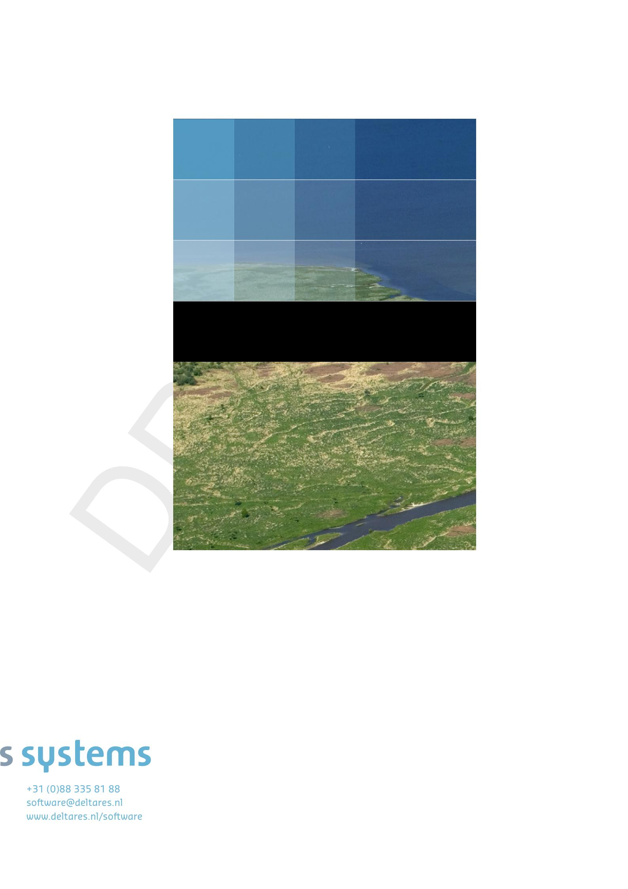

# s systems

+31 (0)88 335 81 88  
[software@deltares.nl](mailto:software@deltares.nl)  
[www.deltares.nl/software](http://www.deltares.nl/software)


