# Efficient scheme for the shallow water equations on unstructured grids with application to the Continental Shelf

Herman W. J. Kernkamp · Arthur Van Dam ·  
Guus S. Stelling · Erik D. de Goede

Received: 29 October 2010 / Accepted: 4 April 2011 / Published online: 15 May 2011  
© Springer-Verlag 2011

**Abstract** In this paper, a shallow-water flow solver is presented, based on the finite-volume method on unstructured grids. The method is suitable for flows that occur in rivers, channels, sewer systems (1D), shallow seas, rivers, overland flow (2D), and estuaries, lakes and shelf breaks (3D). We present an outline of the numerical approach and show three 2D test cases and an application of tidal propagation on the Continental Shelf. The benefits of applying an unstructured grid were explored by creating an efficient model network that aims at keeping the number of grid cells per wavelength constant. The computational speed of our method was compared with that of WAQUA/TRIWAQ and Delft3D (the commonly used structured shallow-flow solvers in The Netherlands), and comparable performance was found.

**Keywords** Unstructured grids · Finite volume · Hydrodynamics · Computational efficiency · Continental Shelf

---

Responsible Editor: Phil Peter Dyke

This article is part of the Topical Collection on *Joint Numerical Sea Modelling Group Workshop 2010*

---

H. W. J. Kernkamp (✉) · A. Van Dam · G. S. Stelling ·  
E. D. de Goede  
Deltares,  
P.O. Box 177,  
2600 MH Delft, The Netherlands  
e-mail: herman.kernkamp@deltares.nl

G. S. Stelling  
Civil Engineering and Geosciences,  
Delft University of Technology,  
Delft, The Netherlands

## 1 Introduction

The safety of The Netherlands against storm surge floods depends on a system of dikes and barriers. The barriers were constructed mainly in the twentieth century after severe floodings. The operation of these barriers depends heavily on accurate and timely predictions of the water levels. Both surge levels at sea and flood levels in rivers play a role in these predictions. This is only one example of the increasing demand for hydrodynamic modelling systems in which various spatial scales and modelling approaches are integrated.

To accurately resolve flow and transport processes in topographically complex areas, a locally variable grid resolution is desirable. Curvilinear grids, either in Cartesian or spherical coordinates (Kernkamp et al. 2005), have greatly increased the possibilities of numerical flow modelling in shallow water applications. The modelling capabilities have been further increased by local grid refinement, often referred to as domain decomposition, and an online coupling of 1D networks and 3D finite difference grids. See, e.g. Twigt et al. (2009) for application to the Pearl Estuary River Delta.

In The Netherlands, we have a tradition of many decades with finite differences for hydrodynamic modelling; see, e.g. Leendertse (1967) and Stelling (1984). Currently, two large integrated modelling systems for water flows are operational in The Netherlands, WAQUA/TRIWAQ (Dutch Ministry of Public Works and Transport 2010) and Delft3D (Gerritsen et al. 2007), which are both based on curvilinear and/or spherical grids.

Despite all their possibilities, some of the drawbacks of curvilinear grids cannot be easily circumvented. Staircase

representation of coastlines is sometimes unavoidable. Special “cut-cell” treatment is required to avoid its adverse effects. Also, in the inner bends of meandering rivers, gridlines are focussed, leading to unnecessarily small grid cells.

These shortcomings were recognised by many researchers who contributed to the development of systems using unstructured grids; see, e.g. ADCIRC (Dietrich et al 2010), TELEMAC (Hervouet 2007; Postma and Hervouet 2007), UnTRIM (Casulli and Zanolli 2002), ELCIRC (Zhang et al. 2004; Baptista et al. 2005), MIKE Flexible Mesh (Sørensen 2004), SLIM (De Brye et al. 2010), FVCOM (Chen and Liu 2003) and Delfin (Ham et al. 2005).

Currently, Deltares is developing the unstructured-grid-based software system D-Flow Flexible mesh (hereafter to be called “D-Flow FM”), which is part of the Delft3D suite. D-Flow FM is based upon the successful numerical concepts of Delft3D and SOBEK1D2D and is developed in cooperation with the Delft University of Technology. The applied numerical scheme presented in this paper is based on the work of Casulli and Zanolli (2002), Stelling and Duinmeijer (2003), Ham et al. (2005), Kramer and Stelling (2008) and Kleptsova et al. (2009). The novelty of this approach lies in the following: (1) the grid allows polygon-shaped cells of arbitrary degree. (2) 1D, 2D or 3D modelling concepts are combined. For instance, river tributaries can now easily be modelled as 1D branches. (3) It is based on an efficient matrix solver that consists of a combination of conjugate gradient (CG)

and minimum degree. Currently, the 2D module is operational; the 1D and 3D modules are available as a prototype.

In Section 2, we present a description of the method, the numerical implementation and the iterative solver. Test cases are presented in Section 3. Results of the Continental Shelf model, both on a uniform structured grid and on an unstructured grid with variable cell size, and the computational efficiency are presented in Section 4. Finally, Section 5 contains the conclusions.

## 2 Numerical approach

Our unstructured grid approach is based on the combination of 2D/3D finite-volume cells with 1D flow networks into a single grid, as illustrated in Fig. 1. This integrated approach allows for applications that range from sewer flow models, 1D river flow models, and 2D overland flow models to 3D stratified flow models.

The staggered model grid is elaborated in Section 2.1. Time integration is done with the implicit  $\theta$ -method. The resulting scheme follows the approach of (Kramer and Stelling 2008) except that we treat the advection terms explicitly. This is further discussed in Section 2.3. We employ a solver that combines Gaussian elimination and conjugate gradients that was developed earlier as part of the SOBEK1D2D system (Stelling and Verwey 2005). The solver is discussed in detail in Section 2.4.

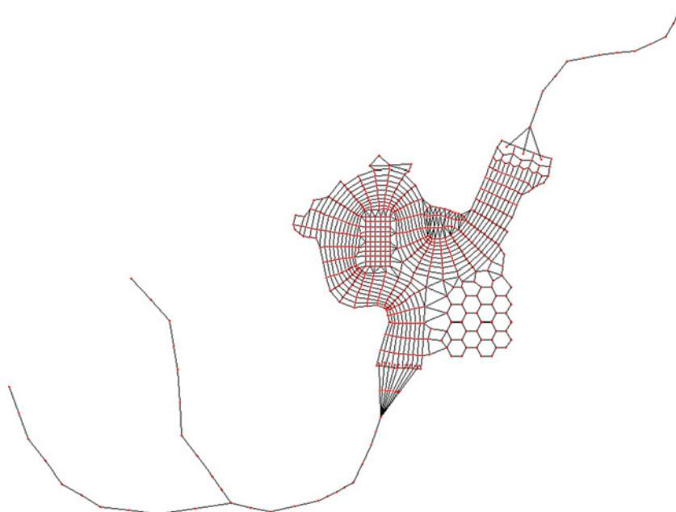

Fig. 1 A conceptual example of an unstructured grid in which 1D river segments have been combined with 2D grids

**Fig. 2** Example of unstructured grid with triangles and quadrangles

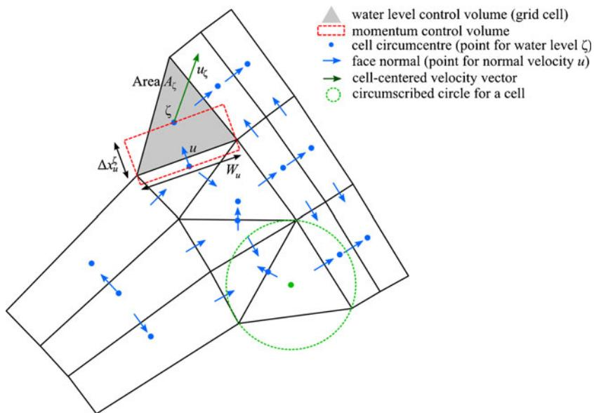

2.1 Staggered grid

We apply a staggered Arakawa-C grid. For computational efficiency, we use an orthogonal grid, so that the pressure gradient only depends on two pressure points that are specified in cell circumcentres. The circumcentre is the midpoint of a circumscribed circle that goes through the vertices of a grid cell (see, e.g. the green circle in Fig. 2). For triangles, this point is unique; for quadrangles and other cells, there is some freedom in choosing the circumcentre. This will be used to achieve orthogonality. For 1D points, the pressure point is the network point itself. The velocity points are on the cell faces in 2D and in between two pressure/water level points in 1D, see Fig. 2.

The orthogonality concept on unstructured staggered grids imposes two requirements:

1. 1. The circumcentre of each cell lies within that cell (i.e. triangles should have acute angles).

1. 2. The line segment (flow link) that connects the circumcentres of two neighbouring cells should intersect orthogonally with the interface between them.

We use structured curvilinear grids that are aligned with the main flow direction as much as possible. This is important for efficiency, as will be explained below. Next, curvilinear grids are coupled by generating triangular grids between them. Finally, the resulting *coupled* grid is orthogonalised; see Fig. 3. Notice how, in the left panel, many blue flow links cross the black cell faces in a non-orthogonal way, whereas, in the right panel, this has been considerably improved via orthogonalisation. The orthogonalisation algorithm starts with an unstructured grid and iteratively moves each grid node in small steps in order to locally improve the orthogonality, following (Thompson et al 1985).

Figures 4 and 5 illustrate how unstructured grids can be applied in a complicated area. Figure 4 demonstrates the

**Fig. 3** Grid orthogonalisation.  
*Left panel:* original grid. *Right panel:* Orthogonalized grid. In the *right diagram*, the *blue* flow links cross the *black* cell faces orthogonally

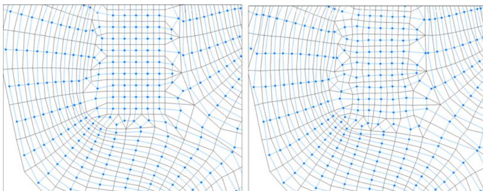

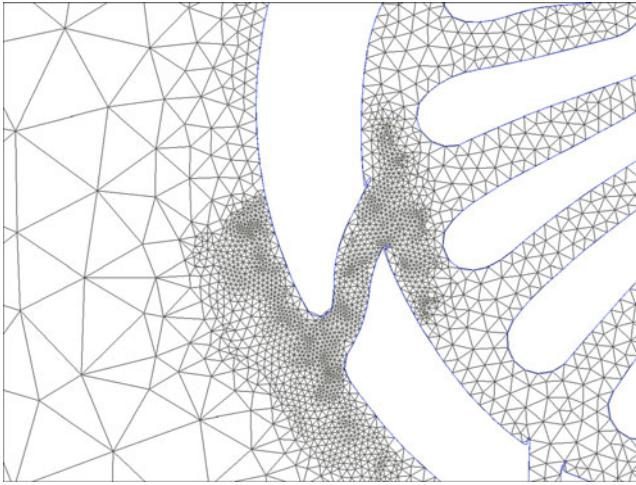

**Fig. 4** Illustration of an unstructured fully triangular grid. Both the discretisation of channels with different directions and the local refinement are easily achieved

large flexibility of triangular grids. Figure 5 shows what can be achieved if structured-grid parts are introduced. For example, in the fully unstructured grid of Fig. 4, the channels on the right side of this figure are resolved in general by just three cell faces in the channel cross direction. In the mixed structured–unstructured of Fig. 5, there are five computational cells. Flow gradients in the channel length direction are often smaller than those in the channel cross direction, which suggests application of grid cells that are elongated and aligned in the flow direction. This can only be achieved by a curvilinear grid, which clearly has less grid cells than the triangular grid, while having a higher resolution in the cross-flow direction. This

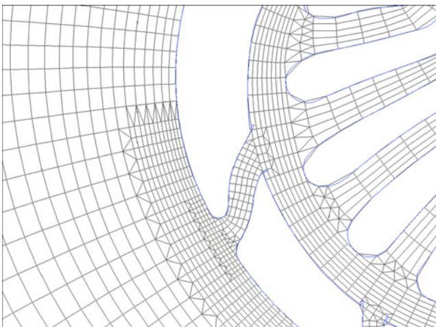

**Fig. 5** Illustration of an unstructured mixed grid. Compared with Fig. 4, all channels are now discretised by curvilinear orthogonal grids, coupled by triangles. Also, local refinement is easily achieved

explains our preference for the application of curvilinear grids that are aligned with the flow in the main flow areas as much as possible.

2.2 Time integration

The depth-averaged, homogeneous shallow water equations are given by:

$$\frac{\partial H}{\partial t} + \nabla \cdot (H\vec{u}) = q, \quad (1)$$

$$\frac{\partial \vec{u}}{\partial t} + adv(\vec{u}) + g\nabla\zeta + c_f\vec{u}\|\vec{u}\| + 2\Omega \times \vec{u} = d, \quad (2)$$

in which  $H$  is the total water depth,  $\zeta$  is the water level relative to a reference plane,  $\vec{u}$  is the depth-averaged horizontal velocity vector,  $\nabla \equiv [\partial_x, \partial_y]^T$  is the horizontal gradient operator,  $\Omega$  is the earth rotation vector and  $adv(\vec{u})$  is the advection term. The right-hand side  $q$  contains source terms and  $d$  contains external forcing. The constants  $g$  and  $c_f$  denote the gravity constant and bottom-friction coefficient, respectively.

Integrating the continuity Eq. 1 over a control volume with the  $\theta$ -method yields a standard finite-volume discretisation for the water level  $\zeta$ :

$$\begin{aligned} A_\zeta \frac{\zeta^{n+1} - \zeta^n}{\Delta t^n} + \theta(A_{u_2}u_2^{n+1} - A_{u_1}u_1^{n+1}) \\ + (1 - \theta)(A_{u_2}u_2^n - A_{u_1}u_1^n) = q_\zeta, \end{aligned} \quad (3)$$

in which subscripts  $\zeta$  denote cell centre values and  $u$  cell face values.  $A_\zeta$  is the horizontal cell storage area,  $A_u$  the face cross-sectional area and  $Q \equiv uA_u$  denotes the discharge through a cell face. This formulation guarantees volume conservation. Note that for ease of understanding, Eq. 3 shows a simplified 1D form with ‘faces’ 1 and 2 at the left and right. In 2D, this is replaced by a summation over all faces of normal velocity components.

The momentum Eq. 2 is discretised as follows:

$$\begin{aligned} \frac{u^{n+1} - u^n}{\Delta t} + Adv(u^n) + \frac{g}{\Delta x_u} \\ \times (\theta(\zeta_2^{n+1} - \zeta_1^{n+1}) + (1 - \theta)(\zeta_2^n - \zeta_1^n)) + bu^{n+1} = d, \end{aligned} \quad (4)$$

in which  $b$  represents the friction coefficient and  $\|\vec{u}\|^n$  and the right-hand side  $d$  collects other explicit terms and external forcings.

In Eq. 4,  $u^{n+1}$  can be expressed in terms of the water levels and substituted into the discretised continuity Eq. 3. This yields a system of equations in which the water level  $\zeta$  is the only unknown. After solving the water levels, which is discussed in the next section, the velocities and fluxes are computed by back substitution.

For the Coriolis term, we follow (Kleptsova et al. 2009). The advection term is elaborated in the next section.

### 2.3 Advection term

The advection term  $Adv(u^n)$  in Eq. 4 is integrated explicitly in time and is formulated in a momentum-conservative way, basically following (Kramer and Stelling 2008). Since the other terms in the momentum Eq. 4 are already in finite-volume formulation, this guarantees conservation of momentum. The key point in the conservative formulation of the advection term on unstructured grids lies in the choice of a closed pair of advective fluxes and advected quantities. The advected quantity is defined in a cell circumcentre, and the advective fluxes that transport this quantity are defined on the cell faces that surround this cell. This is valid for all supported types of cells (triangles, quadrilaterals, pentagons, hexagons or 1D cells).

The formulation of the advective term starts with the conservation of volume  $V$ 

$$\frac{\partial V}{\partial t} = \sum_{\text{in}} Q - \sum_{\text{out}} Q, \quad (5)$$

where  $V$  denotes the volume and  $Q$  the volume fluxes at cell faces. Mass (volume  $V \times$  concentration  $c$ ) conservation in a transport model is then straightforward:

$$\frac{\partial Vc}{\partial t} = \sum_{\text{in}} Qc_{\text{in}} - \sum_{\text{out}} Qc_{\text{out}} \quad (6)$$

Since we assume homogeneous flows (i.e. constant density), the conservation of momentum reads

$$\frac{\partial V_u u}{\partial t} = \sum_{\text{in}} Qu_{\text{in}} - \sum_{\text{out}} Qu_{\text{out}} + \dots \quad (u_{\text{in}} = \vec{u}_{\text{in}} \cdot \vec{n}_u), \quad (7)$$

in which  $V_u$  is the volume of the momentum control volume (see also Fig. 2 and Eq. 13). Note that this differs from the control volume for water levels as in Eq. 3, due to the staggered grid approach. The cell face normal vector is defined by  $\vec{n}_u$  at each  $u$ -point, and the cell circumcentre-

based velocity vector  $\vec{u}$  is reconstructed from the cell face normal velocities, which are defined in Eq. 12. The *out*-side of the control volume around a  $u$ -point is the one that the normal vector  $\vec{n}_u$  points to, and the *in*-side is the opposite side. Now, the quantities  $u_{\text{in}}$  and  $u_{\text{out}}$  are the components of the cell circumcentre-based velocity vectors that lie in the direction of the face normal velocity that is addressed. Equation 7 can be rewritten to

$$V_u \frac{\partial u}{\partial t} + u \frac{\partial V_u}{\partial t} = \sum_{\text{in}} Qu_{\text{in}} - \sum_{\text{out}} Qu_{\text{out}} + \dots \quad (8)$$

Substituting Eq. (5) yields

$$V_u \frac{\partial u}{\partial t} + u \left( \sum_{\text{in}} Q - \sum_{\text{out}} Q \right) = \sum_{\text{in}} Qu_{\text{in}} - \sum_{\text{out}} Qu_{\text{out}} + \dots$$

$$\frac{\partial u}{\partial t} = \frac{1}{V_u} \left\{ \sum_{\text{in}} Qu_{\text{in}} - \sum_{\text{out}} Qu_{\text{out}} - u \left( \sum_{\text{in}} Q - \sum_{\text{out}} Q \right) \right\} + \dots \quad (9)$$

which results in

$$\frac{\partial u}{\partial t} = \frac{1}{V_u} \left\{ \sum_{\text{in}} Q(u_{\text{in}} - u) - \sum_{\text{out}} Q(u_{\text{out}} - u) \right\} + \dots, \quad (10)$$

The cell based velocity vector  $\vec{u}_\zeta$  (either  $\vec{u}_{\text{in}}$  or  $\vec{u}_{\text{out}}$ ) must now be constructed from face normal components, for which we apply (Perot 2000):

$$\vec{u}_\zeta = \frac{1}{A_\zeta} \sum_{\text{faces}} \Delta x_u^\zeta W_u \vec{n}_u u \quad (11)$$

in which the definitions are illustrated in Fig. 6.

The right plot in Fig. 6 shows that the sum of the weighting functions  $\Delta x_u^\zeta W_u$  is exactly equal to twice the cell surface, which is expected because the cell circumcentre-based velocity vector consists of two components, whereas it is reconstructed from *normal* velocities,

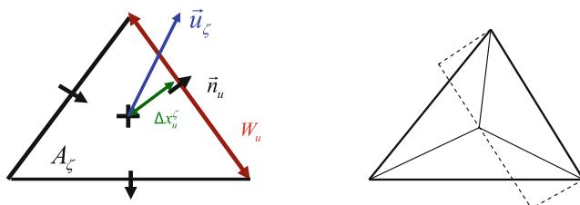

**Fig. 6** *Left panel:* Weighting factors for cell based velocity vector. *Right panel:* Sum of weighting factors is twice the cell area

which have just one component (in 3D, the weights would sum up to three times the cell volume).

The face control volume  $V_u$  is taken as the weighted average of the left and right cell volumes:

$$V_u = \alpha_L V_L + \alpha_R V_R \quad (12)$$

with

$$\alpha_L = \frac{\Delta x_{uL}^\zeta}{\Delta x_{uL}^\zeta + \Delta x_{uR}^\zeta}; \alpha_R = 1 - \alpha_L \quad (13)$$

Finally, the advection contributions of the left and right cells are added such that the finite-volume formulation Eq. 10 of the momentum equation becomes:

$$\frac{\partial u}{\partial t} = \frac{1}{V_u} \left\{ \alpha_L \left( \sum_{\text{inL}} Q(u_{\text{inL}} - u) - \sum_{\text{outL}} Q(u_{\text{outL}} - u) \right) + \alpha_R \left( \sum_{\text{inR}} Q(u_{\text{inR}} - u) - \sum_{\text{outR}} Q(u_{\text{outR}} - u) \right) \right\} + \dots \quad (14)$$

This formulation is applied to all 2D cells. By assuming that concentrations that flow out of a cell are equal to the cell concentrations themselves ( $u_{\text{out}}=u$ ), which can be seen as an upwind approach, the second and fourth summation terms in Eq. 14 cancel out. This is what we apply at 1D cells, at which have either one or two 1D cells on each side.

The implementation of the advection term has been tested on different types of grids and compared with the analytical solutions. In this paper, we will present the

results for a 1D dambreak tests on a wet bed and on a dry bed (see Section 3.1) and to free and forced linear waves (see Section 3.2).

2.4 Iterative solver

The implicit time integration Eq. 3 results in a matrix vector equation  $\mathbf{Ax} = \mathbf{b}$  with vector of unknowns  $\mathbf{x}$  equal to the cell-centred water levels at the new time level. The matrix

**Fig. 7** Colouring of unknowns that are either solved by CG or by Gaussian elimination in the mixed solver with maximal degree set to 6. There is a tendency for checkerboard patterns

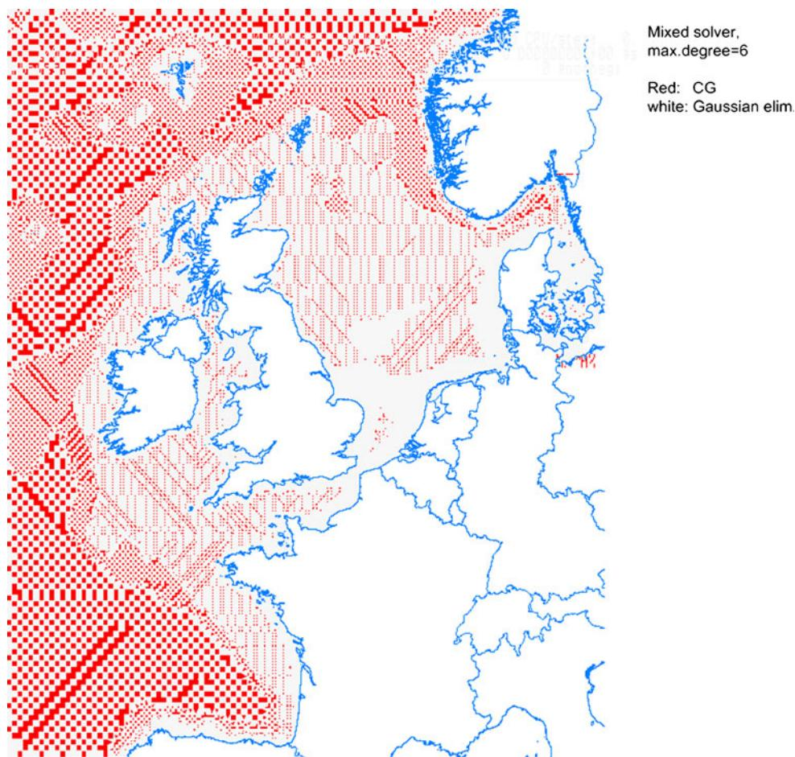

**A** is a sparse symmetric diagonally dominant matrix. We employ a combined solver in which part of the water level unknowns is solved directly by Gaussian elimination by expressing them in terms of neighbouring water levels. The remaining unknowns are subsequently solved by the iterative CG solver, followed by a final substitution step.

The advantage of this approach is that the most time-consuming part of the solving, which is the CG part, needs to be performed only on about half the number of unknowns in 2D and in 1D only on the junction points that have three or more points connected.

The off-diagonal entries in the matrix **A** denote the flow links to neighbouring water-level points. The number of off-diagonal non-zero values is the degree of a computational point. Each point that is eliminated leads to fill-in, which occurs in the matrix rows of its neighbouring points. Therefore, points with minimum degree are eliminated first; see e.g. George and Liu (1989). This improves the diagonal dominance of the matrix for the remaining unknowns. This has a direct beneficial effect on the convergence rate of the CG solver because point Jacobi is already effective as a preconditioner; see e.g. Bruaset (1995). For each eliminated unknown, the degree of its neighbouring unknowns

usually increases due to fill-in. A maximal degree (usually 6) is imposed, above which an unknown is not to be solved by Gaussian elimination anymore, but is solved by CG instead. The preparation phase of this combined solver algorithm is as follows:

1. 1. Determine the degree of the unknowns and order them accordingly.
2. 2. Mark the unknown with the smallest degree for Gaussian elimination and increase the degree of its neighbouring unknowns to reflect the fill-in.
3. 3. If still unknowns exist with degree lower than the imposed maximal degree, go back to step 2, otherwise exit.

The solve phase proceeds as follows:

1. 1. Perform Gaussian elimination on all marked unknowns marked in the preparation phase.
2. 2. Perform CG to solve the remaining unknowns.
3. 3. Perform Gaussian back substitution to determine the marked unknowns.

Figure 7 shows a colouring of the unknowns marked for Gaussian elimination in the Continental Shelf model from Section 4, in which the maximal degree is set to 6. A pattern evolves that resembles red-black Jacobi ordering.

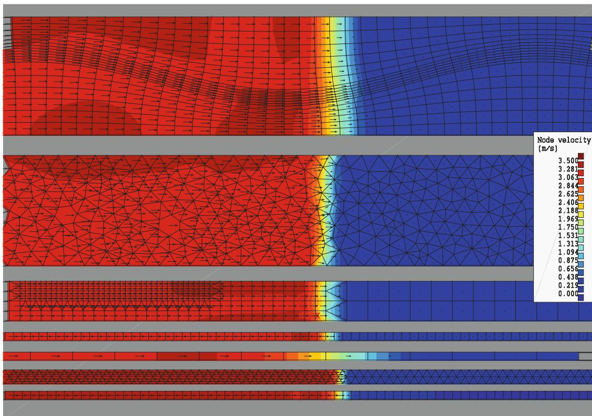

**Fig. 8** Velocity magnitudes and velocity vectors at tip of bore, computed on different types of grids

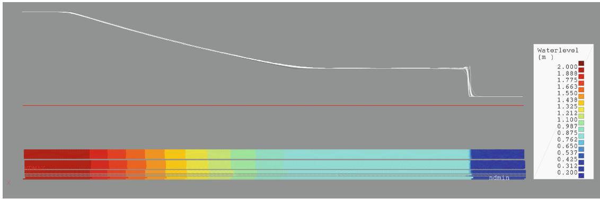

**Fig. 9** Analytic (black) and computed water levels wet bed dam break test case

**3 Test cases**

**3.1 1D Dambreak problem wet bed and dry bed**

We computed this basic test case in seven parallel channels discretised by different types of grids.

Figure 8 shows computed velocity magnitudes and velocity vectors and the different network types. From top to bottom these are: (1) a regular curvilinear grid, (2) an irregular network including hexagons, pentagons and quadrilaterals but mostly consisting of triangles, (3) a grid with refinement in two directions using a combination of squares and triangles, (4) a grid consisting of rectangular cells with elongation varying in flow direction, (5) an elongated rectangular grid, (6) a uniform triangular grid and (7) a uniform rectangular grid.

The most accurate numerical solutions are obtained with the two bottom grids, which have the highest resolution. Flow velocities near the bore front are not always completely parallel to the flow direction on the triangular grid, but this does not seem to deteriorate the solution too much.

Figures 9 and 10 show a sideview of the water levels computed in all channels in white and the analytic solution in black for the wet bed and the dry bed, respectively. The

bottom part shows a top view of computed water levels in the seven channels.

This test case shows that D–Flow FM is able to accurately predict the flow resulting from dam breaks on the considered grids.

**3.2 Free and forced linear waves**

This test case has been considered to check the implementation of tide-generating forces and check the phase/amplitude behaviour of the time integration. We compare model results to the analytical solution of a linear wave in an imaginary cyclic channel of 5-km deep around the equator. We schematised this channel on a uniform grid of 360 by 1 grid cell, in x- and y-direction, respectively. The length of this cyclic channel equals

$$L_a = 2\pi r_a = 40075016 \text{ (m)}, r_a = 6378137 \text{ (m)} \quad (16)$$

The analytical solution of the linearised shallow water equations

$$\frac{\partial \zeta}{\partial t} + h \frac{\partial u}{\partial x} = 0, \quad \frac{\partial u}{\partial t} + U_0 \frac{\partial u}{\partial x} + g \frac{\partial \zeta}{\partial t} + \lambda u = F \quad (17)$$

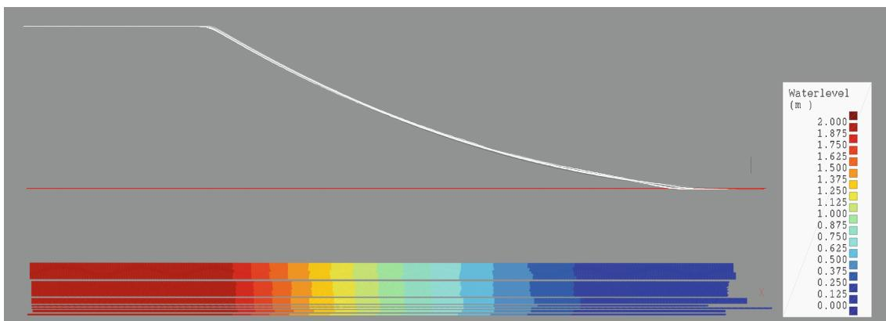

**Fig. 10** Analytic (black) and computed water levels dry bed dam break test case

with  $U_0$  the constant background velocity and  $\lambda = g|U_{\text{typ}}|/(hC^2)$ , ( $U_{\text{typ}}=1$ ) the constant bottom-friction coefficient of dimension [1/s], reads

$$u(x, t) = -ie^{ikx}(a_L c_L + a_R c_R - a_f \omega_f e^{i\omega_f t})/kh \quad (18)$$

$$\zeta(x, t) = e^{ikx}(a_L + a_R + ia_f e^{i\omega_f t})$$

with

$$a_L = \frac{1}{2}i(\lambda i + U_0 k - s), \quad c_L = b_L e^{a_L t} \quad (19)$$

$$a_R = \frac{1}{2}i(\lambda i + U_0 k + s), \quad c_R = b_R e^{a_R t}$$

where  $s = \sqrt{-\lambda^2 + 2i\lambda U_0 k + U_0^2 k^2 + 4ghk^2}$ , where  $b_L$  and  $b_R$  denote respectively the initial amplitude of the left-going and right-going free wave, and where wave number  $k$  is a multiple of  $1/r_a$ . The amplitude of the forced wave with frequency  $\omega_f$  is denoted by  $a_f$ . It is forced by the source term in the right-hand side of Eq. 17

$$F = f e^{i\omega_f t - kx} \quad (20)$$

where  $f = a_f \frac{ghk^2 + i\omega_f \lambda + U_0 \omega_f k - \omega^2}{kh}$ .

The solution that has been considered is specified by the choice

$$U_0 = 0 \text{ m/s}, \quad \lambda = 8.75e - 6 \text{ s}^{-1}, \quad (21)$$

$$b_L = 0.15 \text{ m}, \quad b_R = 0 \text{ m}, \quad k = 10/r_a \quad a_f = 0 \text{ m}$$

For these parameters, the required time for a reduction of the amplitude by a factor of  $e^{-1}$  (relaxation period) amounts to  $T_{\text{REL}} = 1/\text{Re}(a_L) = 228400 \text{ [s]}$ , which is about 12.6 free wave periods (18,100 s).

In this validation case, we have neglected the linearised advection term and verify the propagation of a free wave only, damped by linear bottom friction. We now check the ratio  $A$  of the computed versus the analytic amplitude of the propagated waves after two free wave periods for the two time steps  $\Delta t=300$  s and  $\Delta t=600$  s. In this test case, we have varied both the computational time step  $\Delta t$  and the parameter  $\theta$  of the numerical time integration scheme. The results are shown in Table 1.

**Table 1** Ratio of computed and analytic amplitude (for 36 points in space per wavelength)

| $\theta \downarrow$         | $\Delta t=600$ s | $\Delta t=300$ s |
|-----------------------------|------------------|------------------|
| 0.55                        | 0.879            | 0.936            |
| 0.52                        | 0.951            | 0.974            |
| 0.51                        | 0.976            | 0.987            |
| 0.50                        | 1.002            | 1.000            |
| Grid points per wave period | 30               | 60               |
| Wave Courant                | 1.2              | 0.6              |

Table 1 shows that the tidal amplitude is reproduced very accurately with a time step of five minutes if  $\theta$  is sufficiently close to 0.5. We also performed a computation using a grid with twice as many gridcells, resolving a wave with 72 points per wavelength. This yields amplitude ratios that are very close to the values in Table 1.

We conclude that an accurate tidal amplitude is obtained if we have at least 30–60 time steps per wave period and at least 36 grid cells per wave length, provided that  $\theta$  is sufficiently close to 0.5. These conditions can be easily met in most real-life computations, where for stability reasons a  $\theta$  slightly larger than 0.5 is generally preferred.

We did not analyse the phase errors. The purple line in Fig. 11 shows that for  $\text{ndt}=30$  and  $\text{teta}=0.55$ , amplitude errors are larger than phase errors. So, if the restrictions with respect to amplitude propagation are met, phase propagation errors will be relatively small.

We also checked the reproduction of a forced wave at a period of 12 h. We found an accurate reproduction, even at a large time step of 600 s and for a  $\theta$  value of 0.55.

#### 4 Application to the Continental Shelf

The Dutch Continental Shelf Model (DCSM) area is shown in Fig. 12 below. The curvature of the earth within this large model area is such that the use of spherical coordinates is required. The depth varies from over 5,000 m beyond the shelf break to above mean sea level in the shallow areas.

We will compare results of our unstructured-grid scheme to results of a recently developed WAQUA model schematisation of this area that uses a uniform grid in spherical coordinates. This so-called DCSMv6 (version 6) model has 890,000 computational points and a resolution of about 1.8 km. Although this uniform grid features quite a large number of grid cells, the coastlines are still resolved rather poorly. In the deeper ocean parts, on the other hand, one wavelength of the diurnal tidal wave is resolved by more than 5,000 points. One would wish for a more balanced grid with variable grid size.

##### 4.1 Setup of unstructured grid

We created an unstructured model network where the size of the grid cells is chosen such that the local wave Courant number ( $c\Delta t/\Delta x$ ) with  $c$  the wave speed has about the same value everywhere. In this way, the number of grid cells per wavelength is more or less constant. Furthermore, areas near the coast automatically obtain a high resolution

**Fig. 11** Computed and analytical solution of the water level after two periods

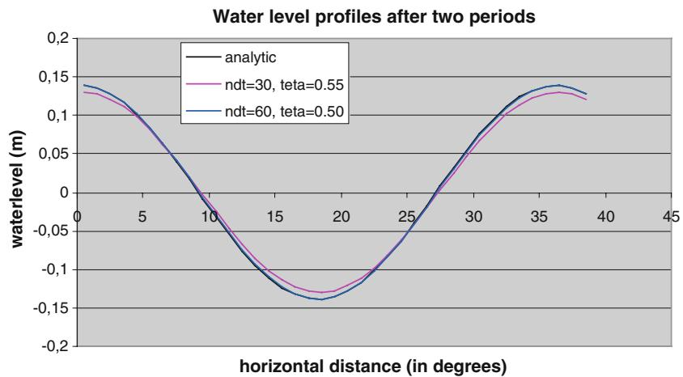

because of their relative shallowness. Outer areas are represented more coarsely because of their larger depths. Triangles are applied in between coarser and finer parts.

The uniform grid used in DCSMv6 consists of 890000 cells, while the Courant-based grid has only 340,000 cells, with cell sizes varying in between 800 m and 28 km. See Figs. 13 (overall view) and 14 (Southern Channel).

4.2 Model accuracy

We compare model results with tidal predictions obtained from water-level observations at 228 locations. The following computational results are considered: Waqua DCSMv6 using a uniform grid, the model presented in this paper using a uniform grid (D-Flow FM uniform) as well as

**Fig. 12** Bathymetry of the DCSM model

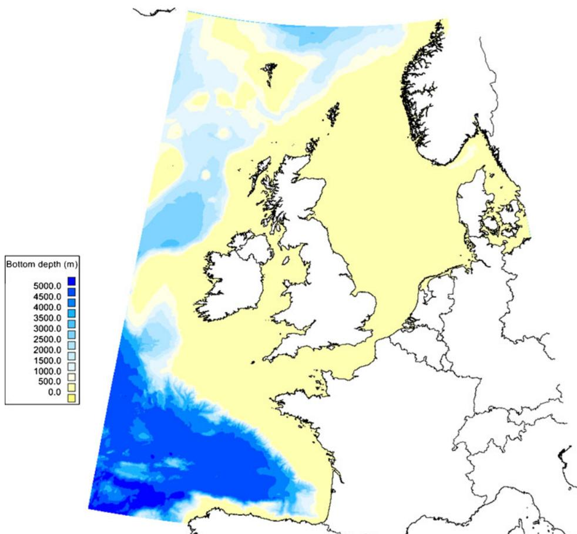

**Fig. 13** Unstructured grid for the DCSM model (*overall view*). (The high resolution in the open boundaries is not essential for our approach)

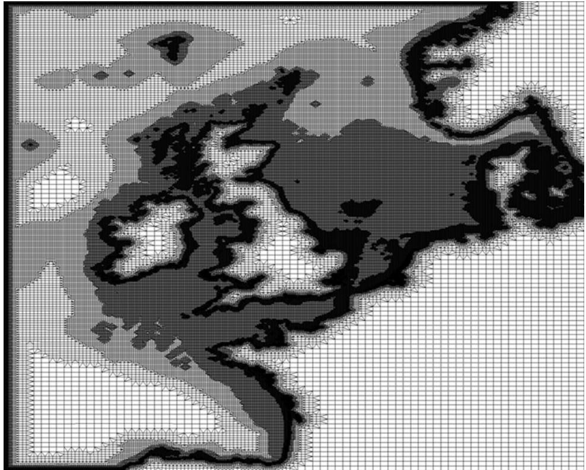

the Courant-based grid (D-Flow FM Courant). Figure 15 below shows RMS (root mean square) differences (between computed and observed tidal signals) presented as arrow lengths for the three models in the Southern North Sea at

each location: D-Flow FM Courant (top arrow), D-Flow FM uniform (mid arrow) and WAQUA (bottom arrow). It can be seen that, for the Dutch coastal stations, the performance of the three models is almost identical.

**Fig. 14** Unstructured grid for the DCSM model; detailed view of Channel

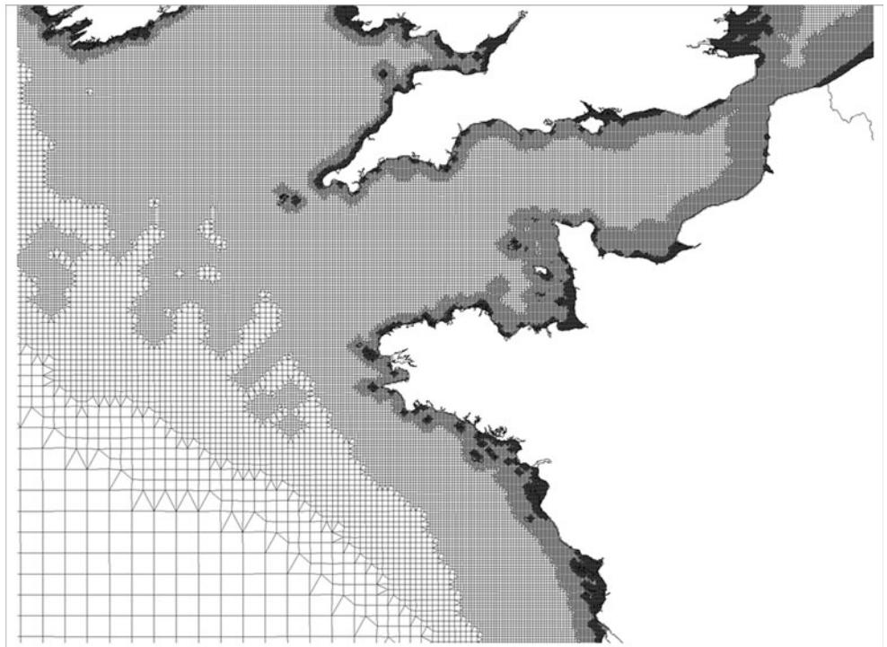

**Fig. 15** RMS for D-Flow FM Courant, D-Flow FM uniform and WAQUA

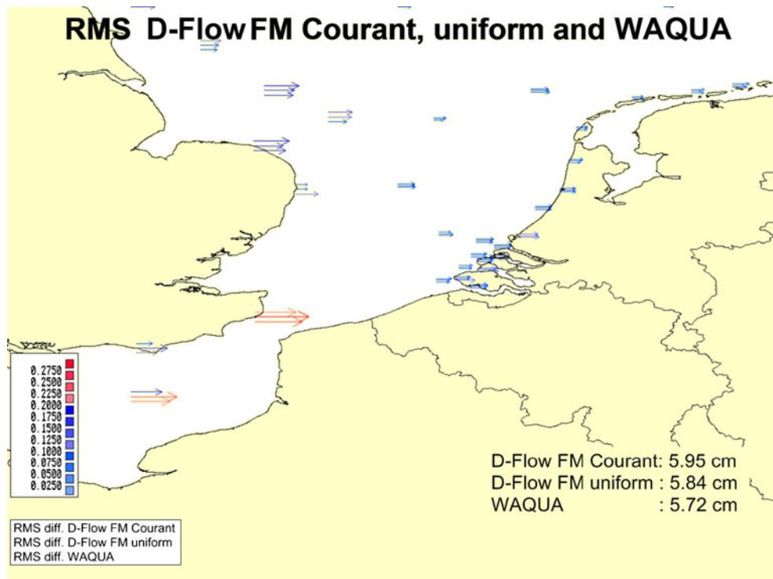

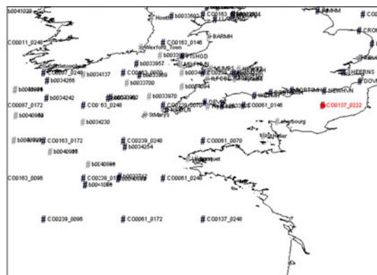

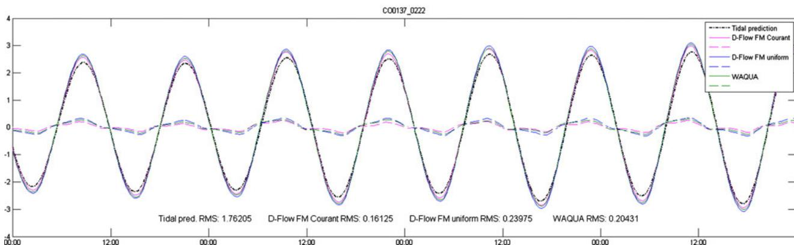

**Fig. 16** Water levels; computed versus observed (predicted) in the English Channel

The average of the RMS differences at the 228 locations is 5.95 cm for D-Flow FM Courant, 5.84 cm for D-Flow FM uniform and 5.72 cm for WAQUA. The numbers in Fig. 15 pertain to all 228 locations.

The bathymetry information used in both D-Flow FM computations was directly obtained from the calibrated WAQUA model. As a result, the resolution of the bathymetry data was only 1.8 km. The high resolution near the coast of the Courant-based grid could therefore not be fully exploited. The D-Flow FM Courant schematisation consistently performs better in the Southern Channel, although not many observations are available in that area to show this. The differences in RMS values are too small to qualify one model better than the other. Computed and observed (predicted) time series in the English Channel are shown in Fig 16.

#### 4.3 Computational efficiency

We compared the performance of our new system to that of other existing systems: WAQUA (2D), TRIWAQ (3D) and Delft3D-FLOW (3D). Both TRIWAQ and Delft3D have been applied here in 2D (depth-averaged) mode. It is known that WAQUA is faster than TRIWAQ for depth-averaged applications because its solver is tuned for two-dimensions and the code does not contain 3D overhead (e.g. FORTRAN DO-loops for the vertical dimension.)

For this comparison, we could not easily use the DCSMv6 model (1.8-km grid) reported in the previous section because it was run in parallel on 20 computational nodes against D-Flow FM that can presently only run on one node. Instead, we ran the smaller DCSMv5 (~9,3-km grid) model on one node for all codes for 1 week with a 10-min time step on 19,049 grid cells. Timings are given in Table 2.

These timings were realised using one single thread. When using all eight threads of the quadcore, the timing of 84 s of D-Flow FM was reduced to 35 s. This was realised by applying OpenMP for some loops in the solver and in the matrix assembly.

**Table 2** Computation times (s) for 1 week of simulation on an Intel 17 2,66GHz quadcore

| Computation time for 1 week of simulation (s) | DCMv5 (~9,3 km) |
|-----------------------------------------------|-----------------|
| WAQUA                                         | 31              |
| TRIWAQ                                        | 34              |
| Delft3D-FLOW                                  | 60              |
| D-Flow FM (uniform grid; single thread)       | 84              |

For the DCSM-v6 model, the simulation times per time step are: 2.2 s for D-Flow FM on the Courant grid, 5 s for D-Flow FM on the uniform grid and 0.59 s for WAQUA on the uniform grid, respectively. The 0.59 s applies to a computation on 20 nodes of a cluster whose machines are 2.4 times slower than the Intel 17 on which the D-Flow FM runs were performed. Assuming linear speedup and correcting for this factor 2.4 amounts to 4.9 s per time step for WAQUA. So, for this large model, the performances are well comparable.

In summary, although it is always difficult to compare the computational efficiency of different software systems, it is clear from Table 2 and the DCSM-v6 model performances that the required computation times for D-Flow FM are in the same order of magnitude compared with WAQUA, TRIWAQ and Delft3D-FLOW.

#### 5 Conclusions

The ability of unstructured grids to accurately represent complex boundaries is very useful in geometrically complicated areas. In this paper, an accurate and efficient method for unstructured grids with application to the shallow water equations has been described. This D-Flow FM method builds upon the work of Kramer and Stelling (2008). The method guarantees mass and momentum conservation, and allows drying and flooding. The accuracy is shown by comparing the computed solution to the analytical solution for the wet bed and dry bed dambreak and for linear waves.

The results of the Northwest European Continental Shelf model demonstrate the applicability of the method for tidal simulations. For 2D computations, the performance of D-Flow FM is comparable to the performance of WAQUA, TRIWAQ and Delft3D-FLOW, which are known as efficient shallow-water codes.

Grid generation is an important issue when dealing with unstructured grids. For their computational efficiency, we favour curvilinear grids aligned with main flow directions, tied together by triangles. We developed automatic generation of an unstructured network with high resolution in the shallower areas near coasts and low resolution in the deeper areas. This optimises the computational efficiency while maintaining high accuracy.

The promising results for this method show that there is enough potential to proceed with further developments, for example, extending its 1D and 3D functionality and coupling to water quality and morphology.

## References

Baptista AM, Zhang Y-L, Chawla A, Zulauf MA, Seaton C, Myers EP, Kindle J, Wilkin M, Burla M, Turner PJ (2005) A cross-scale model for 3D baroclinic circulation in estuary-plume-shelf systems: II. Application to the Columbia River. *Continent Shelf Res* 25:935–972

Bruaset AM (1995) A survey of preconditioned iterative methods. *Longman Scientific & Technical*

De Brye B, De Brauwere A, Gourgue O, Kärnä T, Lambrechts J, Comblen R, Deleersnijder E (2010) A finite-element, multi-scale model of the Scheldt tributaries, river, estuary and ROFI. *Coastal Eng* 57:850–863

Casulli V, Zanolli P (2002) Semi-implicit numerical modeling of nonhydrostatic free-surface flows for environmental problems. *Math Comput Modell* 36:1131–1149

Chen C, Liu H (2003) An unstructured grid, finite-volume, three-dimensional, primitive equations ocean model; application to coastal ocean and estuaries. *J Atmos Oceanic Technol* 20:159–186

Dietrich JC, Zijlema M, Westerink JJ, Holthuijsen LT, Dawson C, Luettich RA, Jensen RE, Smith JM, Stelling GS, Stone GW (2011) Modelling hurricane waves and storm surge using integrally-coupled, scalable computations. *Coastal Engineering* 58:45–65

Dutch Ministry of Public Works and Transport (2010) Technical documentation WAQUA/TRIWAQ <http://apps.helpdeskwater.nl/downloads/extra/simona/release/doc/techdoc/waquapublic/sim1999-01.pdf>

George A, Liu J (1989) The evolution of the minimum degree ordering algorithm. *SIAM Rev* 31:1–19

Gerritsen H, De Goede ED, Platzek FW, Genseberger M, Van Kester JAThM, Uittenbogaard RE (2007) Validation document Delft3D-FLOW, WL|Delft Hydraulics report X0356. [http://delftsoftware.wldelft.nl/index.php?option=com\\_docman&task=doc\\_download&gid=217](http://delftsoftware.wldelft.nl/index.php?option=com_docman&task=doc_download&gid=217)

Ham DA, Pietrzak J, Stelling GS (2005) A scalable unstructured grid 3-dimensional finite volume model for the shallow water equations. *Ocean Model* 10(1–2):153–169

Hervouet JM (2007) Hydrodynamics of Free Surface Flows: Modelling with the finite element method. *John Wiley & Sons, Ltd, ISBN 9780470035580*

Kernkamp HWJ, Petit HAH, Gerritsen H, De Goede ED (2005) A unified formulation for the three-dimensional shallow water equations using orthogonal coordinates: theory and application. *Ocean Dyn* 55:351–369

Kleptsova O, Pietrzak JD, Stelling GS (2009) On the accurate and stable reconstruction of tangential velocities in C-grid ocean models. *Ocean Model* 28:118–126

Kramer SC, Stelling GS (2008) A conservative unstructured scheme for rapidly varying flows. *J Numer Meth Fluids* 58:183–1212

Leendertse JJ (1967) Aspects of a computational model for long-period water-wave propagation. Ph.D. Thesis, Delft University of Technology

Perot B (2000) Conservation properties of unstructured staggered mesh schemes. *J Comput Phys* 159:58–89

Postma L, Hervouet JM (2007) Compatibility between finite volumes and finite elements using solutions of shallow water equations for substance transport. *Int J Numer Methods Fluids* 53(9):1495–1507

Sørensen O (2004) Floodplain modelling using unstructured finite volume technique. DHI Technical Note, January

Stelling GS (1984) On the construction of computational methods for shallow water flow problems. *Rijkswaterstaat communications, No. 35, The Hague, Rijkswaterstaat, 1984*

Stelling GS, Duinmeijer SPA (2003) A staggered conservative scheme for every Froude number in rapidly varied shallow water flows. *Int J Numer Methods Fluids* 43(12):1329–1354

Stelling GS, Verwey A (2005) Numerical flood simulation. *Encyclopedia of Hydrological Sciences* 1:257–270

Thompson JF, Warsi ZUA, Mastin CW (1985) Numerical grid generation: foundations and applications. North-Holland

Twigt DJ, De Goede ED, Zijl F, Schwanenberg D (2009) Coupled 1D-3D hydrodynamic modelling, with application to the Pearl River Delta. *Ocean Dyn* 59:1077–1093

Zhang Y-L, Baptista AM, Myers EP (2004) A cross-scale model for 3D baroclinic circulation in estuary-plume-shelf systems: I. Formulation and skill assessment. *Cont Shelf Res* 24:2187–2214